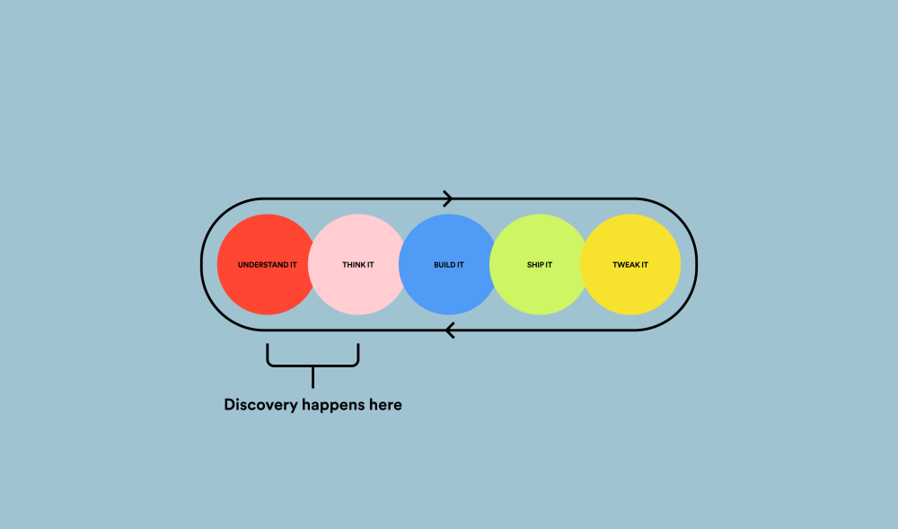
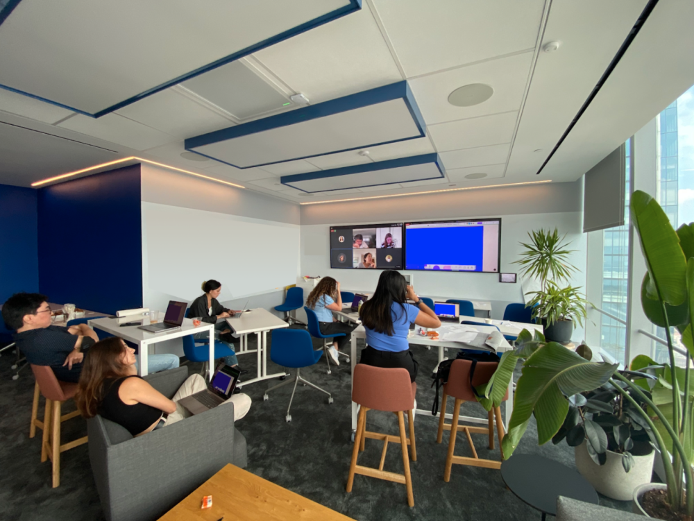
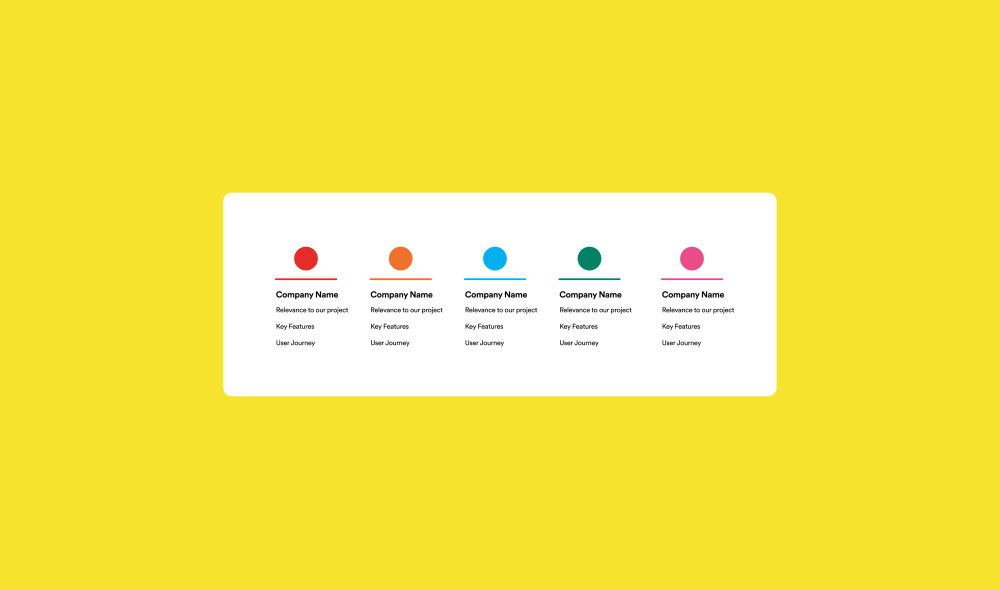
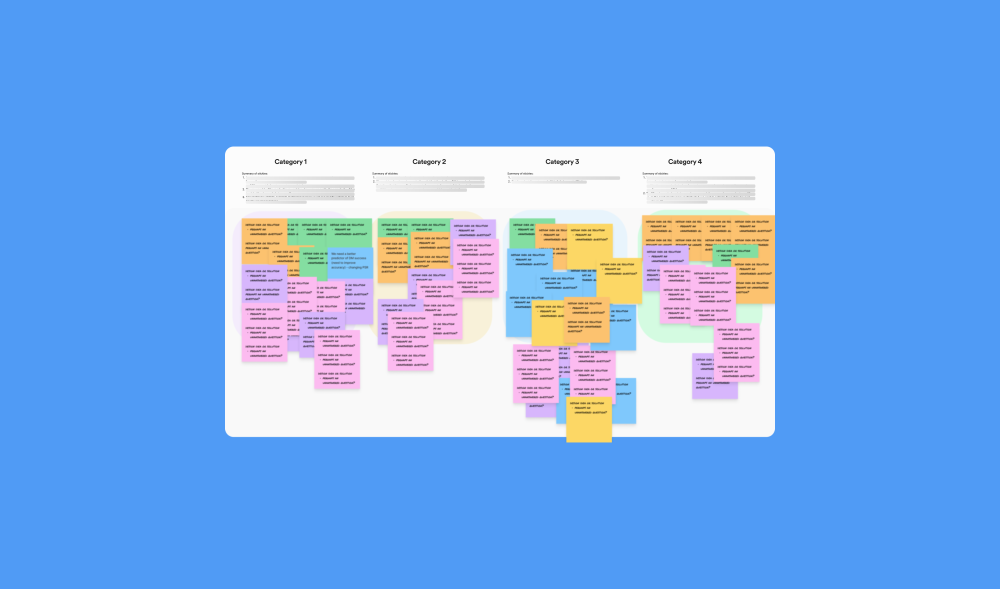

Article credits

Flo Wen

It’s easy to feel overwhelmed while standing on the precipice of a large-scale design project. There is an incredible amount of information to gather and understand and, oftentimes it’s hard to know where to start.

站在大型设计项目的悬崖边上很容易感到不知所措。有大量的信息需要收集和理解，而且通常很难知道从哪里开始。

  
While there’s no perfect strategy, a few simple steps can transform your project from individualistic tasks to a collaborative program with everyone working towards a common goal.

虽然没有完美的策略，但几个简单的步骤可以将您的项目从个人主义任务转变为协作计划，每个人都朝着共同的目标努力。

  
This article explores some methods to streamline the discovery phase for your project and help you find new ways to collaborate with your peers.

本文探讨了一些方法来简化项目的发现阶段，并帮助您找到与同行协作的新方法。

### **What is the discovery phase?**  什么是发现阶段？

[Discovery](https://www.nngroup.com/articles/discovery-phase/) typically refers to the initial period of a project when teams focus most on defining user needs and desired outcomes for a project. Digging deep during the discovery phase allows  the design team to frame the problem and form a perspective on an initial solution direction.

发现通常是指项目的初始阶段，此时团队最关注定义用户需求和项目的预期结果。在发现阶段深入挖掘可以让设计团队构建问题并形成对初始解决方案方向的看法。

  
By building the foundation in user needs and taking the time to think broadly about the problem space, you set yourself up for more creative and useful solutions that truly meet user needs.

通过建立用户需求的基础并花时间广泛思考问题空间，您可以为真正满足用户需求的更有创意和有用的解决方案做好准备。

  
As with all projects, there’s a degree of variability based on your team and level of familiarity with the problem space so some methods might work better than others. Here are a few tips and tricks to get you started!

与所有项目一样，根据您的团队和对问题空间的熟悉程度，存在一定程度的可变性，因此某些方法可能比其他方法更有效。这里有一些提示和技巧可以帮助您入门！

The Spotify design process. Spotify 设计过程。

### **Tip 1: Establishing rituals with the product team**  
技巧 1：与产品团队建立仪式  

Connecting with your cross-functional product team is often the fastest way to gain context on a new project and understand user needs. These activities tend to foster stronger communication that will enable you to gather the collective experiences of the whole group.

与跨职能产品团队联系通常是了解新项目背景和了解用户需求的最快方式。这些活动往往会促进更牢固的沟通，使您能够收集整个团队的集体经验。

-   Cross-Functional Kickoff Meeting  跨职能启动会议
    
    -   Align on challenges, the value of the project and current unknowns   
        应对挑战、项目的价值和当前的未知数  
        
    -   Collect assumptions from the team and ask: “What does the team already know about the problem space?” “What needs more research and discussion?” 
        
        从团队中收集假设并询问：“团队对问题空间已经了解什么？” “什么需要更多的研究和讨论？”
        
-   Weekly Alignment Meetings  每周调整会议
    
    -   Actively communicate progress and share documents, designs, personas and more  
        积极交流进度并共享文档、设计、角色等  
        
    -   Have team members share the items they’re working on and gather any feedback  
        让团队成员分享他们正在处理的项目并收集任何反馈  
        
-   Asynchronous Channels (Slack, Google Drive, Loom, etc.)  
    异步通道（Slack、Google Drive、Loom 等）  
    
    -   Post updates and review documents without extra meetings  
        无需额外会议即可发布更新和审查文档  
        
    -   Establish a cadence for updates: this is a great way to keep team members briefed across time zones  
        建立更新节奏：这是让团队成员了解时区情况的好方法  
        

A team sync in a hybrid remote working environment.  
混合远程工作环境中的团队同步。  

### **Tip 2: Digging into competitive research**  
技巧 2：深入研究竞争性研究  

During every product discovery, there comes a point where you have the opportunity to learn from other product affordances and features. What solutions are out there that currently solve your problem? What features are working for these solutions? Where do they fall short?

在每次发现产品的过程中，您都有机会从其他产品的功能和功能中学习。目前有哪些解决方案可以解决您的问题？哪些功能适用于这些解决方案？他们的不足之处在哪里？

-   Be intentional when choosing competitors   
    选择竞争对手时要有意识  
    
    -   List attributes a competitor should have in order to compare to your product   
        列出竞争对手应该具有的属性以便与您的产品进行比较  
        
    -   E.g. If you’re working on a B2C application, your competitive research should focus on other B2C applications
        
        例如。如果您正在开发 B2C 应用程序，您的竞争性研究应侧重于其他 B2C 应用程序
        
-   Timebox and limit your scope 时间限制并限制你的范围
    
    -   Start with no more than five competitors to keep your research focused  
        从不超过五个竞争对手开始，以保持您的研究重点  
        
    -   If you start seeing commonalities between products and you have a sense of direction, you’ve done enough!
        
        如果您开始看到产品之间的共性并且有了方向感，那么您已经做得够多了！
        
-   Think critically and follow your instincts  
    批判性地思考并跟随你的直觉  
    
    -   Remember that each company is solving a unique problem with their own set of constraints  
        请记住，每家公司都在用自己的一组约束来解决一个独特的问题  
        
    -   Before using existing patterns, ensure that the business case makes sense for your users needs  
        在使用现有模式之前，确保业务案例对您的用户需求有意义  
        
-   Look more broadly with comparative research  
    通过比较研究看得更广泛  
    
    -   Direct competitors are the clear choice but may not serve your user needs in every case   
        直接竞争对手是明确的选择，但可能无法在所有情况下满足您的用户需求  
        
    -   Include some indirect competitors in your list with features that add value  
        在您的列表中包括一些具有增值功能的间接竞争对手  
        

A simple template for organizing competitive research.  
用于组织竞争性研究的简单模板。  

### **Tip 3: Collaborating with workshops**  
技巧 3：与研讨会合作  

Workshops are one of the fastest ways to bring a group of stakeholders together, identify open questions and answer them. While workshops are an invaluable tool in discovery, they are also a massive topic to cover in a tips and tricks article. I would encourage you to continue your research before implementing a workshop; I found these articles on [affinity mapping](https://www.nngroup.com/articles/affinity-diagram/) and [design sprints](https://uxdesign.cc/discovery-sprints-part-2-4457f9424516) to be especially informative as a starting point.

研讨会是将一群利益相关者聚集在一起、确定未解决的问题并回答它们的最快方式之一。虽然研讨会是发现的宝贵工具，但它们也是提示和技巧文章中要涵盖的大量主题。我鼓励您在实施研讨会之前继续进行研究；我发现这些关于亲和力映射和设计冲刺的文章作为起点特别有用。

-   Persona Workshops 角色研讨会
    
    -   Understand and empathize with your users   
        理解并同情你的用户  
        
    -   Identify user pain points, needs, and goals with your product  
        使用您的产品确定用户的痛点、需求和目标  
        
-   Vision Mapping 视觉映射
    
    -   Collaborate on the product vision and create actionable solutions  
        就产品愿景进行协作并创建可行的解决方案  
        
    -   Brainstorm what you might build to achieve or further develop team objectives  
        集思广益，您可以建立什么来实现或进一步发展团队目标  
        
-   Affinity Mapping 亲和图
    
    -   Create organization, prioritization and alignment on a wide range of ideas such as user needs, persona characteristics, product values or strategy
        
        根据用户需求、角色特征、产品价值或战略等广泛的想法创建组织、优先级和一致性
        
    -   Categorize groups of ideas into sections that can be discussed holistically  
        将想法组分类为可以整体讨论的部分  
        
-   Design Sprints 设计冲刺
    
    -   Foster rapid iteration, feedback and alignment with a cross-functional team  
        促进跨职能团队的快速迭代、反馈和协调  
        
    -   Invite members of your team into the design process with a facilitated brainstorm and feedback session. Designers review highlights from the session and use these perspectives to create solutions.
        
        通过便利的头脑风暴和反馈会议，邀请您的团队成员参与设计过程。设计师回顾会议的亮点，并使用这些观点来创建解决方案。
        

An affinity mapping exercise. 亲和力映射练习。

Design teams and the problems they solve come in all shapes and sizes. Unsurprisingly, the outcomes of discovery can vary greatly based on the team needs.

设计团队和他们解决的问题形式多样。毫不奇怪，发现的结果可能会根据团队的需要而有很大差异。

  
The discovery phase is meant to give the team an understanding of user needs and the problem space, inspire a direction for the future, and lay the foundation for solving it. One team may leave a discovery phase only to realize that the project isn’t worth moving forward with.

发现阶段的目的是让团队了解用户需求和问题空间，启发未来的方向，为解决问题打下基础。一个团队可能离开发现阶段只是为了意识到该项目不值得继续推进。

  
Another may enter the next design phase with a defined problem statement and relevant concepts to explore.

另一个人可能会进入下一个设计阶段，并提出明确的问题陈述和相关概念进行探索。

  
I hope that whatever your outcomes, you can use some of these methods to collaborate more effectively, make meaningful discoveries about your product space and ultimately serve your users’ needs. Safe travels on your journey of discovery!

我希望无论结果如何，您都可以使用其中一些方法更有效地协作，对您的产品空间做出有意义的发现并最终满足用户的需求。在您的发现之旅中安全旅行！

**References** 参考

[https://www.nngroup.com/articles/discovery-phase/](https://www.nngroup.com/articles/discovery-phase/) [https://uxdesign.cc/discovery-sprints-part-2-4457f9424516](https://uxdesign.cc/discovery-sprints-part-2-4457f9424516) [https://xd.adobe.com/ideas/process/user-research/guide-to-competitive-analysis-ux-design/](https://xd.adobe.com/ideas/process/user-research/guide-to-competitive-analysis-ux-design/) [https://www.nngroup.com/articles/affinity-diagram/](https://www.nngroup.com/articles/affinity-diagram/)

## Credits

### Ashley Jahren 阿什莉·贾伦

Product Designer II 产品设计师二

Ashley designs products that help artists promote their music. While she enjoys dabbling in music, she also loves a good book and rehabilitating dying plants.

Ashley 设计的产品可以帮助艺术家推广他们的音乐。虽然她喜欢涉足音乐，但她也喜欢一本好书和修复垂死的植物。

[Read More](https://www.linkedin.com/in/ashleyjahren)  阅读更多

### Flo Wen 弗洛文

Senior UX Writer 高级用户体验作家

Flo is a Senior UX Writer on the Personalization team and an editor of the Spotify Design blog. She lives in Brooklyn and can often be found in Prospect Park.

Flo 是个性化团队的高级用户体验作家，也是 Spotify 设计博客的编辑。她住在布鲁克林，经常可以在展望公园找到她。

[Read More](https://www.linkedin.com/in/florencewen)  阅读更多
