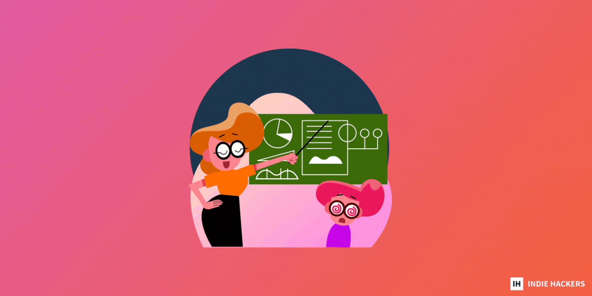

## 💲 Building Your Sales Funnel 💲 建立你的销售渠道

_by [Eric Hui](https://www.indiehackers.com/erichui/history)_ 通过 Eric Hui

A customer's journey is mapped across a sales funnel through many checkpoints, from engaging with the brand, to conversation and commitment.  
  
客户的旅程通过许多检查点绘制在销售漏斗中，从与品牌互动到对话和承诺。  

Marketers must ensure that each customer moves from one stage of the sales funnel to another without a hitch. The better the experience, the higher chance of converting a lead into a customer.  
  
营销人员必须确保每个客户都能顺利地从销售渠道的一个阶段转移到另一个阶段。体验越好，将潜在客户转化为客户的机会就越大。  

Here's how to build and manage your sales funnel!  
以下是构建和管理销售渠道的方法！  

### What is a sales funnel? 什么是销售漏斗？

The sales funnel narrates the journey of a customer, from the point when they were just a prospect, to when they converted into a loyal paying customer. It is a step-by-step process that tells a business how close someone is to becoming a regular customer.  
  
销售漏斗讲述了客户的旅程，从他们只是潜在客户到他们转变为忠实的付费客户。这是一个循序渐进的过程，告诉企业某人距离成为常客有多近。  

The sales funnel is called a "funnel" because it refers to the motion of a real funnel. At the top will be lots of potential customers; some will proceed, and finally, fewer will become loyal paying customers.  
  
销售漏斗之所以称为“漏斗”，是因为它指的是真实漏斗的运动。顶部将有很多潜在客户；有些人会继续，最后，更少的人会成为忠实的付费客户。  

### How does a sales funnel work?  
销售漏斗如何运作？  

There are four different sales funnel stages that every customer goes through:  
每个客户都会经历四个不同的销售漏斗阶段：  

_1\. Awareness:_ 1、意识：

This is where people become aware of your brand's solutions, products, and services for the first time. In the awareness stage, your business will make its first impression. Make sure it is prominent and intriguing.  
  
这是人们第一次了解您品牌的解决方案、产品和服务的地方。在意识阶段，您的企业将给人留下第一印象。确保它是突出的和有趣的。  

Being the first sales funnel stage, the number of people involved is also large. Random people learn about you from LinkedIn, Google, Facebook, word-of-mouth, etc.  
  
作为第一个销售漏斗阶段，涉及的人数也很多。随机的人通过 LinkedIn、Google、Facebook、口碑等了解您。  

~1% of the visitors will immediately become paid customers. This happens only when the potential lead has already researched you, and comes on board with a plan to make purchases instantly.  
  
约 1% 的访问者将立即成为付费客户。只有当潜在的潜在客户已经对您进行了研究，并制定了立即购买的计划时，才会发生这种情况。  

_2\. Interest:_ 2、兴趣：

This is the point where a prospect starts researching your business. They compare and weigh their options.  
  
这是潜在客户开始研究您的业务的时刻。他们比较并权衡他们的选择。  

Don't get too sales-y here. Start building a relationship and sharing information that can help them. It's important to ignite their interest to the next level by providing great content. Each page must deliver the information that your prospect is looking for. The better the content, the higher chances of moving them to the next stage.  
  
不要在这里太过推销。开始建立关系并分享可以帮助他们的信息。通过提供精彩的内容将他们的兴趣提升到一个新的水平非常重要。每个页面都必须提供您的潜在客户正在寻找的信息。内容越好，他们进入下一阶段的机会就越大。  

The point of this stage is to help the prospects make an informed decision. Never deceive your potential customer with false promises.  
  
这个阶段的重点是帮助潜在客户做出明智的决定。切勿以虚假承诺欺骗您的潜在客户。  

_3\. Decision:_ 3\. 决定：

When a prospect enters this stage, they are open to things that can persuade them to become a customer. Even though it looks like an easy stage, this is the hardest one. At this point, many prospects leave due to the need for more information.  
  
当潜在客户进入此阶段时，他们会对可以说服他们成为客户的事物持开放态度。尽管这看起来是一个简单的阶段，但这是最难的阶段。在这一点上，由于需要更多信息，许多潜在客户离开了。  

At the decision stage, your prospect will start looking for information like pricing, product comparisons, terms, etc. They will compare it with competitors, and weigh which offers better value for their money.  
  
在决策阶段，您的潜在客户将开始寻找定价、产品比较、条款等信息。他们会将其与竞争对手进行比较，并权衡哪个更物有所值。  

A slight mistake here and the prospect lead will be lost. Businesses can include certain incentives and rewards to move them to the final stage:  
  
这里稍有失误，潜在客户就会丢失。企业可以包括某些激励和奖励，以推动他们进入最后阶段：  

-   Free consultation. 免费咨询。
-   E-book offers. 电子书优惠。
-   Free trial. 免费试用。
-   Webinars. 网络研讨会。
-   Free shipping, discounts, bonuses, or other promotional offers.  
    免费送货、折扣、奖金或其他促销优惠。  
    
-   Testimonials and reviews by real customers.  
    真实客户的推荐和评论。  
    

_4\. Action:_ 4.动作：

Always remember that, at the bottom of the sales funnel stage, the customer actually acts.  
永远记住，在销售漏斗阶段的底部，客户实际采取行动。  

Many founders believe that the work is done after the purchase is made. But don't you want them to return for repurchases? This is where retention work leads to additional purchases, future suggestions, and repurchases.  
  
许多创始人认为，工作是在购买之后完成的。但是你不希望他们返回回购吗？这是保留工作导致额外购买、未来建议和重新购买的地方。  

However, if the customer doesn't buy from you, don't automatically assume that you have lost them. You can create a nurturing campaign later to ensure that your brand stays on top of their minds.  
  
但是，如果客户不向您购买，请不要自动假设您已经失去了他们。您可以稍后创建一个培育活动，以确保您的品牌始终在他们的脑海中。  

Knowing what type of content is necessary at each sales funnel stage is essential. With the proper information, it is easier to take your prospect to the final stage of the funnel.  
  
了解每个销售漏斗阶段需要什么类型的内容至关重要。有了适当的信息，就可以更轻松地将您的潜在客户带到漏斗的最后阶段。  

### Building your sales funnel 建立你的销售渠道

Here's how to actually build your funnel:  
以下是实际构建渠道的方法：  

1.  Analyze your audience: It is vital to know your audience. Use different tools to track user behavior, and monitor their activity on your website. Google Analytics can help track where your prospect clicks, how they scroll through the site, and the pages where they spend the most time.  
      
    分析您的受众：了解您的受众至关重要。使用不同的工具来跟踪用户行为，并监控他们在您网站上的活动。 Google Analytics 可以帮助跟踪您的潜在客户点击的位置、他们如何滚动浏览网站以及他们花费最多时间的页面。  
    
2.  Capture their attention: Once you have analyzed your audience's behavior, it's time to capture their attention. A person's average attention span is just 10 to 20 seconds. In such a short time, your content needs to be extremely compelling. Diversify your brand's content portfolio with infographics, informative videos, and other interesting work. Over time, invest in paid ads.  
      
    吸引他们的注意力：一旦您分析了观众的行为，就该吸引他们的注意力了。一个人的平均注意力持续时间只有 10 到 20 秒。在这么短的时间内，您的内容需要极具吸引力。通过信息图表、信息视频和其他有趣的作品使您品牌的内容组合多样化。随着时间的推移，投资付费广告。  
    
3.  Build a captivating landing page: Don't be pushy at the beginning. First, capture leads that you can nurture later. Your landing page should excite the visitor. Use a highlighted call-to-action button, along with interesting offers (i.e. free e-books or other forms of unique, downloadable material).  
      
    建立一个迷人的着陆页：一开始不要急于求成。首先，捕获您以后可以培养的潜在客户。您的着陆页应该能激发访问者的兴趣。使用突出显示的号召性用语按钮以及有趣的优惠（即免费电子书或其他形式的独特的可下载材料）。  
    
4.  Email drip campaign: You can also market your leads via email. The ideal frequency is twice per week. Tell them about yourself, how you are different from others, and how your brand can solve their pain points conveniently. End your drip campaign by providing an irresistible offer, like a reduced price.  
      
    电子邮件营销活动：您还可以通过电子邮件营销您的潜在客户。理想的频率是每周两次。告诉他们你自己，你和别人有什么不同，你的品牌如何方便地解决他们的痛点。通过提供不可抗拒的报价（例如降价）来结束您的点滴营销活动。  
    
5.  Stay in touch: Always remember your existing customers. Continue reaching out to them with new offers. Thank them for being loyal, and show them what they mean to you.  
      
    保持联系：永远记住您现有的客户。继续通过新优惠与他们联系。感谢他们的忠诚，并向他们展示他们对你的意义。  
    

### Final verdict 最终判决

It takes patience and hard work to build a great sales funnel. However, if you invest in generating and nurturing strong leads, you can see amazing results.  
  
建立良好的销售渠道需要耐心和努力。但是，如果您投资于产生和培养强大的潜在客户，您会看到惊人的结果。  

Just remember that random and prospective customers should always be at the top of the funnel, while established customers should be at the bottom.  
  
请记住，随机和潜在客户应始终位于漏斗的顶部，而已建立的客户应位于底部。  

_Where are you in your sales funnel? Share in the comments below!_  
您在销售漏斗中的什么位置？在下面的评论中分享！  

_[Discuss](https://www.indiehackers.com/post/a-complete-guide-for-beginners-everything-you-need-to-know-about-sales-funnel-stages-387c4d131f) this story._ 讨论这个故事。
