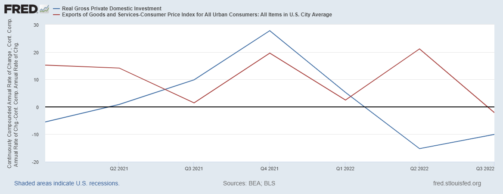

First, the inflation news. The basic story is the same as in the last couple of months — headline inflation was very low, while core inflation was moderate but still above target.

首先，通胀消息。基本情况与过去几个月相同——总体通胀率非常低，而核心通胀率温和但仍高于目标。

  
In fact, in month-to-month terms, overall prices fell last month, while core inflation accelerated slightly from 2.4% to 3.6%:

事实上，按月计算，上个月总体价格下降，而核心通胀率从 2.4% 略微加速至 3.6%：

As always, check out [Jason Furman’s thread](https://twitter.com/jasonfurman/status/1613530807800315904) for a good detailed breakdown. Also check out his thread on [alternate inflation measures](https://twitter.com/jasonfurman/status/1613608408208519170). My favorite of these is median inflation, which measures what the price of the typical product in the economy is doing. Here we see the same story, which is that inflation is slowing but still above target:

一如既往，查看 Jason Furman 的帖子以获得详细的细分。另请查看他关于替代通货膨胀措施的主题。其中我最喜欢的是通货膨胀中值，它衡量经济中典型产品的价格走势。在这里我们看到了同样的情况，即通胀正在放缓但仍高于目标：

Anyway, there’s always quite a bit of noise in these numbers, especially the month-to-month ones.  
不管怎样，这些数字总是有一些杂音，尤其是月度数字。  
  
Some people like to cherry-pick particular products in order to justify their hawkish or dovish stances (apparently eggs got way more expensive last month), but unless the product is “oil”, or maaaaaaybe “semiconductors”, doing this just introduces more noise.

有些人喜欢挑选特定的产品来证明他们的鹰派或鸽派立场是正确的（显然鸡蛋上个月变得更贵了），但除非产品是“石油”，或者 maaaaaaybe“半导体”，否则这样做只会引入更多噪音.

  
The basic story here is pretty clear — inflation is decelerating, and has gone from an emergency to a disquieting nuisance. This pretty much fits with the news headlines, where you don’t nearly as much worry about inflation anymore.

这里的基本情况非常清楚——通货膨胀正在减速，并且已经从紧急情况变成了令人不安的麻烦事。这非常符合新闻头条，你几乎不再担心通货膨胀了。

Now, many in the commentariat are worried not about inflation, but about a recession. The worry is that inflation is subsiding on its own, and that the Fed’s rate hikes are an unnecessary measure that will end up hurting employment and growth.

现在，许多评论家担心的不是通货膨胀，而是经济衰退。令人担忧的是，通胀正在自行消退，而美联储的加息是一种不必要的措施，最终会损害就业和增长。

  
There are really two pieces to this argument. First, there’s the idea that the economy is now flashing warning signs for a recession, so it’s time for the Fed to stop hiking.

这个论点实际上有两个部分。首先，有观点认为经济现在闪烁着衰退的警告信号，所以美联储是时候停止加息了。

  
Second, some argue that the Fed’s rate hikes in 2022 haven’t even had time to affect the economy yet, so the fall in inflation can’t possibly be the Fed’s doing, and hence the Fed’s tightening has been (partly or entirely) superfluous. So let’s talk about both of these ideas.

其次，有人认为美联储2022年加息还没有来得及对经济产生影响，所以通胀下降不可能是美联储造成的，因此美联储的紧缩政策（部分或全部）是多余的.因此，让我们谈谈这两个想法。

The answer to this question, by the way, is “No one really knows”. Not just now, but always. There are some suggestive indicators that tell us when the probability of a recession is elevated, but the signal is very weak; there’s _no macroeconomic model in existence_ that can know with a high degree of certainty whether a recession is imminent.

顺便说一句，这个问题的答案是“没有人真正知道”。不只是现在，而是永远。有一些暗示性指标告诉我们衰退的可能性何时升高，但信号非常微弱；没有现存的宏观经济模型可以高度确定地知道经济衰退是否迫在眉睫。

As a case in point, it’s useful to remember the late 2010s. Those were boom times, and yet many in the commentariat — including many economists — thought that a recession was right around the corner. Obviously the coming of the pandemic in 2020 makes it impossible to tell whether [late-2019 recession forecasts](https://www.bloomberg.com/graphics/us-economic-recession-tracker/?sref=R8NfLgwS) would have come true, but in fact, [people](https://www.nytimes.com/2018/12/17/business/economy/what-is-recession-facts-history.html) were [talking](https://www.scmp.com/comment/insight-opinion/united-states/article/2177641/signs-point-us-recession-when-answer-probably) about an imminent [downturn](https://www.economist.com/leaders/2018/10/11/the-next-recession) as early as [2018](https://www.bloomberg.com/news/articles/2018-07-12/millstein-sees-a-perfect-storm-for-recession-amid-trade-wars?sref=R8NfLgwS). Much of the worry [focused on corporate debt](https://www.bloomberg.com/news/articles/2018-05-09/corporate-america-s-staring-down-4-trillion-wall-of-refinancing?sref=R8NfLgwS), which was the only sort of private-sector debt to grow in the years following the Great Recession.

作为一个恰当的例子，记住 2010 年代后期是很有用的。那是繁荣时期，但评论界的许多人——包括许多经济学家——认为经济衰退指日可待。显然，2020 年疫情的到来让人无法判断 2019 年底的衰退预测是否会成真，但事实上，早在 2018 年，人们就在谈论即将到来的经济衰退。大部分担忧都集中在公司债务上，这是大萧条后几年中唯一增长的私营部门债务。

Then in late 2018, the yield curve inverted — meaning that long-term interest rates fell below short-term rates. The [talk of recession](https://www.bloomberg.com/opinion/articles/2018-12-03/u-s-yield-curve-just-inverted-that-s-huge?sref=R8NfLgwS) exploded, because an inverted yield curve is a decent predictor of slowing economic activity. And yet by the time Covid struck over a year later, there had been no recession, or even anything close to one — in fact, hiring was _accelerating_ in January and February of 2020.

然后在 2018 年底，收益率曲线倒转——这意味着长期利率低于短期利率。关于经济衰退的讨论爆发了，因为倒挂的收益率曲线是经济活动放缓的一个不错的预测指标。然而，到一年多后 Covid 来袭时，还没有出现衰退，甚至接近衰退——事实上，2020 年 1 月和 2 月的招聘正在加速。

I definitely see some similarities between now and then. The labor market is still very strong — U.S. payrolls added 223,000 jobs in December, which is [a very strong performance](https://www.cnbc.com/2023/01/06/jobs-report-december-2022-nonfarm-payrolls-rose-223000-in-december-as-strong-jobs-market-tops-expectations.html) for an economy supposedly on the brink of recession. My favorite measure of labor market strength, the prime-age employment-population ratio, is still right around 80%, which seems like its long-term ceiling:

我肯定会看到现在和那时之间的一些相似之处。劳动力市场仍然非常强劲——美国 12 月份就业人数增加了 223,000 个，这对于一个据称处于衰退边缘的经济体来说是非常强劲的表现。我最喜欢的衡量劳动力市场实力的指标，壮年就业人口比率，仍然在 80% 左右，这似乎是它的长期上限：

Consumer sentiment [increased as well](https://www.marketplace.org/2022/12/23/consumer-sentiment-inched-up-in-december-from-all-time-lows/).  
消费者情绪也有所上升。  

So where might we find signs of an imminent recession? Data on economic output comes out quarterly, and thus we don’t know exactly what happened in late 2022 yet. But private investment did fall in the 2nd and 3rd quarter of 2022, and exports fell in the 3rd quarter.

那么我们在哪里可以找到即将到来的经济衰退的迹象呢？经济产出数据每季度发布一次，因此我们尚不清楚 2022 年底到底发生了什么。但2022年二、三季度私人投资确实下降，三季度出口下降。

  
Consumption grew a little bit, but if the slowdown in investment and exports continues, we would expect consumption, employment and growth to eventually fall.

消费略有增长，但如果投资和出口继续放缓，我们预计消费、就业和增长最终会下降。

But anyway, [lots of people](https://www.bloomberg.com/news/articles/2022-12-20/economists-place-70-chance-for-us-recession-in-2023?sref=R8NfLgwS) are [worried about](https://www.bloomberg.com/news/newsletters/2023-01-03/what-s-happening-in-the-world-economy-the-most-anticipated-recession-ever?sref=R8NfLgwS) a [recession](https://www.bloomberg.com/news/articles/2022-12-26/world-economy-is-headed-for-a-recession-in-2023-researcher-says?sref=R8NfLgwS) in 2023. One reason, as in 2018, is the inverted yield curve. [Many economic studies predict](https://www.bostonfed.org/publications/current-policy-perspectives/2020/predicting-recessions-using-the-yield-curve.aspx) that when long-term rates are lower than short-term rates, the probability of a recession is [much higher](https://www.bis.org/publ/confp02n.pdf).

但无论如何，很多人都担心 2023 年会出现衰退。与 2018 年一样，原因之一是收益率曲线倒挂。许多经济研究预测，当长期利率低于短期利率时，经济衰退的可能性要高得多。

And whereas long-term rates barely went below short-term rates back then, this time the inversion has been massive since summer 2022:

虽然当时长期利率几乎没有低于短期利率，但这次自 2022 年夏季以来倒挂幅度很大：

This is the biggest and most protracted inversion we’ve seen since the 80s, when Paul Volcker raised rates to very high levels and caused two sharp recessions.

这是自 80 年代以来我们所见过的最大和最持久的反转，当时保罗沃尔克将利率提高到非常高的水平并导致两次急剧衰退。

Let’s take a second and review why an inverted yield curve would predict a recession. Basically, when long-term interest rates are lower than short-term rates, it means that markets expect short-term rates to fall over time.

让我们花点时间回顾一下为什么收益率曲线倒挂预示着经济衰退。基本上，当长期利率低于短期利率时，这意味着市场预期短期利率会随着时间的推移而下降。

  
That could mean that A) rates will come down because they’re especially high right now relative to their “natural” rate, and high rates tend to choke of economic activity, and/or B) the real economy will slow in the future, which lowers interest rates all on its own.

这可能意味着 A) 利率会下降，因为它们现在相对于“自然”利率特别高，而高利率往往会抑制经济活动，和/或 B) 实体经济将在未来放缓，这会自行降低利率。

In any case, economists generally believe that a yield curve inversion is a good predictor of recession. For example, economists like Campbell Harvey managed to predict the 2008 recession using the yield curve:

无论如何，经济学家普遍认为收益率曲线倒挂是衰退的良好预测指标。例如，像 Campbell Harvey 这样的经济学家成功地使用收益率曲线预测了 2008 年的经济衰退：

But by the official NBER definition, or by GDP-based indicators, by the time Harvey made this prediction the U.S. economy _had already been_ in recession for several months. So unless we see really huge data revisions in the coming months, that just isn’t the case right now.

但根据 NBER 的官方定义，或基于 GDP 的指标，在哈维做出这一预测时，美国经济已经陷入衰退几个月。因此，除非我们在未来几个月看到真正巨大的数据修正，否则目前情况并非如此。

Then there’s that nagging case of 2018-19. Due to Covid, we’ll never really know if that yield curve inversion really would have presaged a recession, but it had already been over a year and the economy was still going strong. And [some economists have argued](https://www.nber.org/papers/w16398) that the yield curve’s predictive power is weaker than it used to be.

然后是 2018-19 年那个令人讨厌的案例。由于 Covid，我们永远不会真正知道收益率曲线倒挂是否真的预示着经济衰退，但已经过去一年多了，经济仍然强劲。一些经济学家认为，收益率曲线的预测能力比以前弱了。

If inflation gets defeated via the mechanism of lower inflation expectations, without the need for actual demand destruction, the economy might escape a recession and the Fed would lower rates because inflation had been defeated.

如果通货膨胀通过降低通货膨胀预期的机制被打败，而不需要实际需求破坏，经济可能会摆脱衰退，美联储将降低利率，因为通货膨胀已被打败。

  
That would be consistent with an inverted yield curve. Alternatively, maybe market expectations are just wrong, and the inverted yield curve is just bond traders making a mistake.

这与倒挂的收益率曲线是一致的。或者，也许市场预期是错误的，收益率曲线倒挂只是债券交易员的失误。

So we’re in this weird moment where both our theoretical intuition and our traditional leading indicators say that we should be either in a recession right now, or headed for one very soon. And yet all the macroeconomic data continue to look strong.

因此，我们正处于这个奇怪的时刻，我们的理论直觉和传统领先指标都表明我们应该立即陷入衰退，或者很快就会陷入衰退。然而，所有宏观经济数据继续保持强劲。

  
So either the economy is like Wile E. Coyote and has fallen off a cliff without realizing it yet, or the prediction methods that worked in the past aren’t as useful anymore.

因此，要么经济像 Wile E. Coyote 一样在不知不觉中掉下悬崖，要么过去行之有效的预测方法不再有用。

Anyway, that brings us to the equally difficult question of whether the Fed is going overboard.  
无论如何，这让我们想到了一个同样困难的问题，即美联储是否过火了。  

In the early days of the post-pandemic inflation, there were people who called themselves Team Transitory, who argued that inflation was due to supply chain snarls and would subside on its own.

在大流行后通货膨胀的早期，有人自称为临时团队，他们认为通货膨胀是供应链混乱造成的，会自行消退。

  
That was always dubious — the booming job market made it seem likely that positive demand shocks (from easy monetary and fiscal policy) were also a big factor. And as supply chain snarls worked themselves out but inflation failed to subside, that idea started to look a bit silly.

这总是令人怀疑——蓬勃发展的就业市场使得积极的需求冲击（来自宽松的货币和财政政策）似乎也是一个重要因素。随着供应链的混乱自行解决但通货膨胀未能消退，这个想法开始看起来有点愚蠢。

  
The Fed itself certainly seemed to abandon Team Transitory, and started hiking rates in March 2022.  
美联储本身似乎确实放弃了 Team Transitory，并于 2022 年 3 月开始加息。  

But now the monetary doves — the people arguing for the Fed to stop or reverse its rate hikes — are sounding quite Team Transitory-ish.

但现在货币鸽派——那些主张美联储停止或扭转加息的人——听起来很像临时团队。

  
For example, my podcast co-host Brad DeLong believes that there’s no way that inflation could be falling because of the Fed’s rate hikes, because rate hikes take over a year to have an effect.

例如，我的播客联合主持人 Brad DeLong 认为，通胀不可能因为美联储加息而下降，因为加息需要一年多的时间才能产生效果。

  
Thus, inflation must be subsiding on its own, meaning that further Fed hikes will be going too far. In the latest episode of our podcast, he debated with my PhD advisor Miles Kimball, who wants the Fed to raise rates more:

因此，通胀一定会自行消退，这意味着美联储进一步加息将走得太远。在我们播客的最新一集中，他与我的博士顾问 Miles Kimball 进行了辩论，后者希望美联储进一步加息：

And on January 11th, columnist [Kevin Drum wrote](https://jabberwocking.com/we-are-still-a-few-months-away-from-the-fed-having-any-effect-on-inflation/):  
1 月 11 日，专栏作家 Kevin Drum 写道：  

> The Fed is not winning anything and the patient hasn't been given any medicine yet. Nothing that's happened in the past year is related to Fed activity in any way.
> 
> 美联储没有赢得任何胜利，病人也没有得到任何药物。过去一年发生的任何事情都与美联储的活动没有任何关系。
> 
>   
> I assume that even the hard core forward guidance folks agree that six or seven months is far too short a time for the Fed's interest rate hikes to have affected the economy…If inflation keeps going down and then the economy crashes midway through the year, the Fed will have proven itself about as competent as a Russian general.
> 
> 我假设即使是坚定的前瞻性指导人士也同意，美联储加息对经济产生影响的六七个月时间太短了……如果通胀继续下降，然后经济在年中崩溃，美联储将证明自己与俄罗斯将军一样有能力。

In fact, DeLong and Drum are backed up by a fair amount of research. Lots of studies find that it takes [2-3](https://www.bis.org/publ/confp04l.pdf) _[years](https://www.bis.org/publ/confp04l.pdf)_

事实上，DeLong 和 Drum 得到了大量研究的支持。大量研究发现需要2-3年

for interest rate hikes to have an effect. And when you look at the history of the U.S.  
加息才能产生效果。当你回顾美国的历史时  
  
’ most famous monetary tightening — the conquest of the 1970s inflation — you can see that it was about three years from when rates began to rise (which was even before Volcker) until inflation started to fall:

最著名的货币紧缩政策——征服 1970 年代的通货膨胀——你可以看到从利率开始上升（甚至在沃尔克之前）到通货膨胀开始下降大约三年：

But to say — [as Drum does](https://twitter.com/kdrum/status/1613412183815380993)  
但是要说——就像 Drum 所做的那样  
— that the research literature is fully in support of long monetary policy lags is just not right. Havranek and Rusnak (2013) surveyed the literature and found that studies are divided into two types — those that predict a hump-shaped (i.e.

\- 研究文献完全支持长期货币政策滞后是不正确的。 Havranek 和 Rusnak（2013 年）调查了文献，发现研究分为两种类型——预测驼峰形（即

  
, temporary) effect of rate hikes on inflation, and those that predict a gradually increasing impact.

，临时）加息对通货膨胀的影响，以及那些预测影响逐渐增加的影响。

  
It’s natural that studies don’t agree on this, because estimating this lag requires a lot of strong assumptions about the economy works, and different assumptions lead to very different conclusions.

研究对此并不一致是很自然的，因为估计这种滞后需要对经济运作做出很多强有力的假设，而不同的假设会导致截然不同的结论。

  
The “hump-shaped” studies find that most of the response to a rate hike happens in the first 6 months:

“驼峰”研究发现，大多数对加息的反应发生在前 6 个月：

So it really depends on what assumptions you make here. The short version is that if you assume that if _expectations matter a lot_

所以这真的取决于你在这里做的假设。简短的版本是，如果你假设如果期望很重要

, then you get a much faster response — as soon as businesses see the Fed start to hike, they know that either inflation will go down or the Fed will just keep hiking til it does, so they go ahead and lower their prices immediately.

，那么你会得到更快的反应——一旦企业看到美联储开始加息，他们就会知道要么通胀下降，要么美联储将继续加息直到它结束，所以他们会立即降低价格。

  
On the other hand, if you assume that expectations don’t matter very much, then rate hikes can only work by making investment more expensive, which reduces investment, which reduces hiring, which reduces consumption, which reduces prices…which takes years.

另一方面，如果你假设预期无关紧要，那么加息只能通过提高投资成本来发挥作用，这会减少投资、减少招聘、减少消费、降低价格……这需要数年时间。

To make things even more complicated, it’s possible that the monetary policy lag actually _changes_ over time. In fact, Doh and Foerster of the Kansas City Fed [have a new paper](https://www.kansascityfed.org/research/economic-bulletin/have-lags-in-monetary-policy-transmission-shortened/) arguing that the role of expectations has increased in recent decades, meaning that rate hikes act a lot faster than they used to — maybe in as little as 2 to 4 months.

使事情变得更加复杂的是，货币政策滞后实际上可能会随着时间而改变。事实上，堪萨斯城联储的 Doh 和 Foerster 发表了一篇新论文，认为近几十年来预期的作用有所增强，这意味着加息的速度比以往快得多——可能只需要 2 到 4 个月。

So DeLong and Drum are not on solid empirical ground when they claim that the Fed’s rate hikes had no effect on inflation; indeed, in macroeconomics, there is almost never any solid empirical ground to be found.

因此，当 DeLong 和 Drum 声称美联储加息对通货膨胀没有影响时，他们并没有坚实的经验基础；事实上，在宏观经济学中，几乎从来没有找到任何坚实的经验基础。

I should also mention the possibility that _fiscal_  
我还应该提到财政政策的可能性  
policy is playing a big role here too. We ran huge deficits in 2020 and early 2021 to get people through Covid. People saved up a lot of that cash and spent it in 2021 and 2022, which many people think contributed to inflation.

政策在这里也发挥着重要作用。我们在 2020 年和 2021 年初出现了巨额赤字，以帮助人们渡过 Covid。人们存了很多现金，并在 2021 年和 2022 年花掉了，许多人认为这导致了通货膨胀。

  
But fiscal deficits started closing in late 2021 as pandemic relief dried up:  
但随着大流行病救济枯竭，财政赤字在 2021 年底开始缩小：  

And disposable personal income [stopped being anomalously high](https://fred.stlouisfed.org/series/DSPI) around this same time. So it could be that part of the inflation decrease comes from the fiscal austerity that began a year and a half ago.

大约在同一时间，个人可支配收入不再异常高。因此，通胀下降的部分原因可能是一年半前开始的财政紧缩政策。

So anyway, we don’t really know for sure whether the Fed and/or the Biden administration and Congress get much credit for the moderation in inflation over the last few months.

因此，无论如何，我们真的不确定美联储和/或拜登政府和国会是否因过去几个月的通胀放缓而获得很多赞誉。

  
But it seems like a safe bet that as long as the trend continues, the Fed will taper off its rate increases. One way or another,

但似乎可以肯定的是，只要这种趋势继续下去，美联储就会逐渐减少加息。不管怎样，

[the conquest of the post-pandemic inflation](https://noahpinion.substack.com/p/the-conquest-of-the-post-pandemic) is underway.  
大流行后通货膨胀的征服正在进行中。
