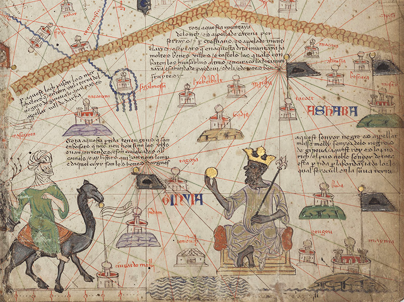
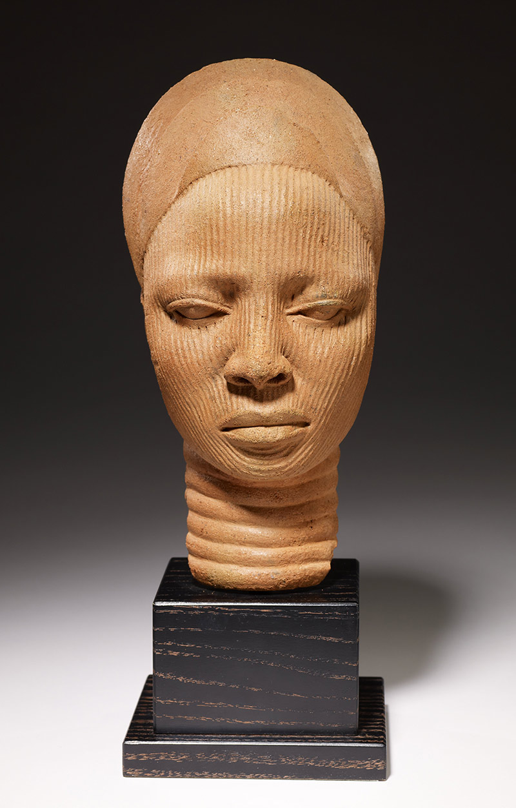

We should expunge, forever, the epithet ‘precolonial’ or any of its cognates from all aspects of the study of Africa and its phenomena. We should banish title phrases, names and characterisations of reality and ideas containing the word.

我们应该从非洲及其现象研究的各个方面永远删除“前殖民地”这个绰号或其任何同源词。我们应该摒弃包含这个词的标题短语、名称和对现实和想法的描述。

To those who might be put off by the severity of the proposal, or its ideological-police ring, I hear you and ask only that, with just a little patience, you hear me out.

对于那些可能因提案的严厉性或其意识形态警察的影响而被推迟的人，我听到你的声音，只要求你耐心地听我说完。

  
It will not take much to jolt us out of the present unthinking in assuming that ‘precolonial’ or ‘traditional’, and ‘indigenous’, has any worthwhile role to play in our attempt to track, describe, explain and make sense of African life and history.

假设“前殖民地”或“传统”和“土著”在我们试图追踪、描述、解释和理解非洲生活的过程中可以发挥任何有价值的作用，这将很快使我们摆脱目前的不思索和历史。

When ‘precolonial’ is used for describing African ideas, processes, institutions and practices, through time, it misrepresents them.

当“前殖民地”被用来描述非洲的思想、过程、制度和实践时，它会歪曲它们。

  
When deployed to explain African experience and institutions, and characterise the logic of their evolution through history, it is worthless and theoretically vacuous.

当用来解释非洲的经验和制度，并描述其历史演变的逻辑时，它毫无价值，而且在理论上是空洞的。

  
The concept of ‘precolonial’ anything hides, it never discloses; it obscures, it never illuminates; it does not aid understanding in any manner, shape or form.

“前殖民地”的概念隐藏起来，从不公开；它遮蔽，它从不照亮；它不会以任何方式、形状或形式帮助理解。

Let us begin with the fact that the ubiquitous phrase is almost exclusive in its application to Africa: ‘precolonial Africa’. How often do we encounter this designation in discourses about other continents?

让我们从一个无处不在的短语几乎只适用于非洲的事实开始：“前殖民地非洲”。我们在有关其他大陆的话语中多久遇到一次这种称呼？

  
If not, what explains the peculiar representation – treating the continent as if it were a single unit of analysis – when it comes to Africa?

如果不是，当谈到非洲时，如何解释这种特殊的表现形式——将大陆视为一个单一的分析单位？

  
I am afraid it comes from a not-so-kind genealogy that always takes Africa to be a simple place, homogenises its peoples and their history, and treats their politics and thought as if they were uncomplicated, each substitutable for the other across time and space.

恐怕它来自一种不那么友善的谱系，它总是把非洲当成一个简单的地方，将非洲的人民和历史同质化，把他们的政治和思想当作简单的东西来对待，它们可以跨越时间和空间相互替代。空间。

  
Once you are thinking of ‘Africa’ as a simple whole, it becomes easier to grossly misrepresent an entire continent in the temporal frame of ‘precolonial’.

一旦您将“非洲”视为一个简单的整体，就更容易在“前殖民地”的时间框架中严重歪曲整个大陆。

In reality, ‘precolonial’ Africa never existed. It is a figment of the imagination of scholars, analysts, political types, for whom Africa is a homogeneous place that they need not think too hard about, much less explain to audiences.

实际上，“前殖民地”非洲从未存在过。这是学者、分析家、政治人物的想象力的虚构，对他们来说，非洲是一个同质化的地方，他们不需要考虑太多，更不用说向观众解释了。

  
It was Georg Wilhelm Friedrich Hegel, a racist philosopher, who argued in the 1820s that Africa was a land ‘outside of Time’ and not a part of the movement of ‘History’. Our intellectual forebears in the 19th century fought against this false characterisation. They were the first to remind people of the fact that Africa had always been a part of the movement of history and the global circuit of ideas.

种族主义哲学家乔治·威廉·弗里德里希·黑格尔 (Georg Wilhelm Friedrich Hegel) 在 1820 年代提出，非洲是一块“时间之外”的土地，而不是“历史”运动的一部分。我们 19 世纪的知识分子先辈们反对这种错误的描述。他们首先提醒人们，非洲一直是历史运动和全球思想循环的一部分。

  
They knew what was behind Hegel’s effort to divide Africa into ‘Africa proper’, or ‘Black Africa’, and ‘European Africa’ – it was his need to reconcile his idea that Africa stood outside of history with the undeniable reality of the attainments of ancient Egypt.

他们知道黑格尔将非洲划分为“非洲本土”或“黑非洲”和“欧洲非洲”的努力背后的原因——他需要调和他认为非洲处于历史之外的想法与不可否认的现实成就古埃及。

  
His ‘solution’ was to identify the achievements of Egyptian Africans as coming from exogenous sources and to remove it from ‘Africa proper’.

他的“解决方案”是将埃及非洲人的成就确定为来自外来来源，并将其从“非洲本土”中移除。

All who talk glibly about ‘precolonial’ Africa, insofar as the designation bespeaks a temporal horizon, award an undeserved victory to the [racist philosopher](https://aeon.co/essays/racism-is-baked-into-the-structure-of-dialectical-philosophy). Of course, the ‘pre’ in ‘precolonial’ supposedly designates ‘a time before’ colonialism appeared on the continent. But how do we deign to describe a period from the beginning of time to the moment when the European, modernity-inflected colonial phenomenon showed up?

所有谈论“前殖民地”非洲的人，只要这个名称预示着时间的地平线，都将不应得的胜利授予种族主义哲学家。当然，“precolonial”中的“pre”被认为是指殖民主义出现在非洲大陆“之前的一段时间”。但是，我们如何屈尊描述从时间开始到欧洲现代性殖民现象出现的那一刻呢？

  
It accords more of a mythological than a historical status to the arrival of modern European colonialism in Africa and its long and deep history. The ‘precolonial’ designation, in practice, even excludes two earlier European-inspired colonialisms in Africa.

它赋予现代欧洲殖民主义在非洲的到来及其悠久而深刻的历史更多的是神话而非历史地位。在实践中，“前殖民地”名称甚至排除了非洲早期的两个受欧洲启发的殖民主义。

  
After all, for those of us who know our history, Roman and Byzantine/Ottoman colonial presences on the African continent were not without legacies on the continent, too.

毕竟，对于我们这些了解我们历史的人来说，罗马和拜占庭/奥斯曼帝国在非洲大陆的殖民存在在非洲大陆也并非没有遗产。

Was ancient Egypt part of some precolonial formation? That strains credulity  
古埃及是某种前殖民地形成的一部分吗？这让人难以置信  

For one thing, the role of African thinkers in the evolution of Christianity becomes elided by a periodisation that does not see a continuity between African events and events elsewhere, from Europe to Asia to the Americas.

一方面，非洲思想家在基督教演变中的作用被分期忽略了，这种分期看不到非洲事件与从欧洲到亚洲再到美洲的其他地方的事件之间的连续性。

  
It also makes it difficult to track demographic continuities when it comes to cultural hybridities, including citizenship, in different parts of the Mediterranean continuum.

这也使得在涉及地中海连续体不同部分的文化混合性（包括公民身份）时难以追踪人口连续性。

  
And, as long as Roman colonialism lasted in North Africa, the region was not hermetically sealed from the rest of the continent, both across the Sahara, and east to the northern reaches of present-day Kenya.

而且，只要罗马殖民主义在北非持续存在，该地区就不会与非洲大陆的其他地区完全隔绝，无论是穿过撒哈拉沙漠，还是向东到当今肯尼亚的北部地区。

As used, the term ‘precolonial’ Africa and the distortions it represents cannot illuminate our understanding of Africa and its history.

正如所使用的那样，“前殖民地”非洲一词及其所代表的扭曲无法阐明我们对非洲及其历史的理解。

More importantly, it is wrong to think of colonialism as a non-African phenomenon that was only brought in from elsewhere and imposed on the continent. Africa has given rise to a rich tapestry of diverse colonialisms originating in different parts of the continent. How are we to understand them?

更重要的是，将殖民主义视为一种非非洲现象，只是从其他地方引进并强加于非洲大陆的想法是错误的。非洲孕育了起源于非洲大陆不同地区的各种殖民主义。我们如何理解它们？

  
For example, if ‘precolonial Morocco’ refers to the time before France colonised Morocco, it must deny that the 800-year Moorish colonisation of the Iberian Peninsula, much of present-day France and much of North Africa was a colonialism. For, if it were, then ‘colonial Morocco’ must predate ‘precolonial Morocco’. I do not know how any of this helps us understand the history of Morocco.

例如，如果“前殖民时期的摩洛哥”指的是法国殖民摩洛哥之前的时间，它就必须否认摩尔人对伊比利亚半岛、当今法国大部分地区和北非大部分地区长达 800 年的殖民统治是一种殖民主义。因为，如果是的话，那么“殖民地摩洛哥”一定早于“前殖民地摩洛哥”。我不知道这些如何帮助我们了解摩洛哥的历史。

  
Similarly, a ‘precolonial’ Egypt that refers to Egypt before modern European imperialism would also deny Mohammed Ali’s colonial adventures at the head of Egypt in southern Europe and Asia Minor. Was ancient Egypt part of some precolonial formation? That strains credulity.

同样，指代现代欧洲帝国主义之前的埃及的“前殖民地”埃及也会否认穆罕默德·阿里在南欧和小亚细亚以埃及为首的殖民冒险。古埃及是某种前殖民地形成的一部分吗？这让人难以置信。

  
To conceive of the history of Africa and Africans in terms only, or primarily, of their relation to modern European empires disappears the history of Africans as colonisers of realms beyond the continent’s land borders, especially in Europe and Asia.

仅根据或主要根据非洲和非洲人与现代欧洲帝国的关系来构想非洲和非洲人的历史，就会抹杀非洲人作为大陆陆地边界以外领域的殖民者的历史，尤其是在欧洲和亚洲。

It is bad enough that the term distorts the history of African states’ involvement in overseas provinces. It is worse that it misdescribes the evolution of different African polities over time. The deployment of ‘precolonial Africa’ is undergirded by a few implausible assumptions.

这个词歪曲了非洲国家参与海外省份的历史，这已经够糟糕的了。更糟糕的是，它错误地描述了不同非洲政体随时间的演变。 “前殖民地非洲”的部署得到了一些难以置信的假设的支持。

  
We assume either that there were no previous forms of colonialism in the continent, or that they do not matter. We talk as if colonialism was brought to Africa by Europe, after the 1884-85 Berlin West Africa Conference. But it takes only a pause to discover that this is false.

我们假设该大陆以前没有任何形式的殖民主义，或者它们无关紧要。我们谈论的好像殖民主义是在 1884-85 年柏林西非会议之后由欧洲带到非洲的。但只要稍作停顿，就会发现这是错误的。

Mansa Musa, the ninth king of the Mali Empire, holding a golden orb or coin: from Sheet 6 of a Catalan Atlas (1375) detailing the Western Sahara. Courtesy the Bibliothèque Nationale de France, Paris

马里帝国第九代国王曼萨·穆萨 (Mansa Musa) 手持金球或金币：来自详细描述西撒哈拉的加泰罗尼亚地图集 (1375) 第 6 页。由巴黎法国国家图书馆提供

African history is replete with accounts of empires and kingdoms. By their nature, empires incorporate elements of colonisation in them. If this be granted, Africa must have had its fair share of colonisers and colonialists in its history.

非洲历史充满了帝国和王国的记载。就其本质而言，帝国在其中融入了殖民元素。如果这一点成立，那么非洲在其历史上一定有过相当多的殖民者和殖民者。

  
When, according to the mythohistory (the founding myth of the empire) of Mali, Sundiata gathered different nations, cultures, political leaders and others to form the empire in the mid-13th century, he did not first seek the consent of his subjects. It was in the aftermath of their being subdued by his superior force that he did what Jean-Jacques Rousseau in the 18th century insisted all rulers should do if their rule is to escape repeated challenges and last for an appreciable length of time: turn might into right.

根据马里的神话历史（帝国的开国神话），桑迪亚塔在13世纪中叶聚集不同民族、文化、政治领袖等人组建帝国时，并没有事先征求臣民的同意。正是在他们被他的优势力量制服之后，他做了 18 世纪让-雅克·卢梭 (Jean-Jacques Rousseau) 坚持认为所有统治者都应该做的事情，如果他们的统治是为了逃避反复的挑战并持续相当长的时间：把强权变成正确的。

  
Ethiopia, another veritable empire, is a multinational, multilingual, multicultural state whose members were not willing parties to their original incorporation into the polity.

埃塞俄比亚是另一个名副其实的帝国，它是一个多民族、多语言、多文化的国家，其成员并不愿意最初加入政体。

  
Whether you think of the Oromo or the Somali, many of their successor states within Ethiopia are, as I write this, still conducting anticolonial struggles against the Ethiopian state.

无论你想到奥罗莫人还是索马里人，在我写这篇文章时，他们在埃塞俄比亚境内的许多继承国仍在进行反对埃塞俄比亚国家的反殖民斗争。

Ọ̀yọ́ was an empire whose reaches, at its peak in the 17th and 18th centuries, extended from its capital in present-day Nigeria’s southwest as far west as present-day Togo, with complex systems of governance for the capital and for outlying areas. As an imperial formation, Ọ̀yọ́ was also a significant colonising power in West Africa.

Ọ̀yọ́ 是一个帝国，其势力范围在 17 世纪和 18 世纪达到顶峰，从位于今尼日利亚西南部的首都向西延伸至今多哥，对首都和边远地区拥有复杂的治理体系。作为帝国阵营，Ọ̀yọ́ 也是西非重要的殖民势力。

  
The Nigerian archaeologist Akinwumi Ogundiran [maintains](https://www.cambridge.org/core/books/abs/power-and-landscape-in-atlantic-west-africa/formation-of-an-oyo-imperial-colony-during-the-atlantic-age/1469532085615128EC18AFAE65D71406) that Ẹdẹ-Ilé, another city in southwest Nigeria, was founded by Ọ̀yọ́ denizens as a frontier colony to secure the border of the empire against competing potentates who, significantly, were their non-Yorùbá neighbours.

尼日利亚考古学家 Akinwumi Ogundiran 坚持认为，尼日利亚西南部的另一个城市 Ẹdẹ-Ilé 是由 Ọ̀yọ́ 居民建立的边境殖民地，目的是确保帝国边界免受竞争的君主，这些君主显然是他们的非约鲁巴邻居。

  
Additionally, there are other areas within Nigeria and in other parts of Africa where various forms of colonisation took place.

此外，尼日利亚和非洲其他地区的其他地区也发生了各种形式的殖民化。

So it seems as if Africa is no different from other parts of the world where varieties of colonisation and imperialism flourished before the arrival of the modern version. The modern colonialism that came to Africa in the 19th century has since so dominated our imaginations that it has distorted how we see many aspects of history, including that of colonialism and empire themselves.

因此，非洲似乎与世界其他地区没有什么不同，在现代版本到来之前，各种殖民主义和帝国主义在这些地区蓬勃发展。 19 世纪来到非洲的现代殖民主义一直主宰着我们的想象，它扭曲了我们对历史许多方面的看法，包括殖民主义和帝国本身。

Let’s continue with how the idea of ‘precolonial Africa’ cannot but misdescribe the history of the continent. For instance, the Fanti banded together in the third quarter of the 19th century to give themselves a constitutional monarchy in a confederacy founded on a written charter. They did so not to counter British colonialism but to protect themselves from their old nemesis, Asante imperialism.

让我们继续讨论“前殖民地非洲”的概念是如何错误地描述非洲大陆的历史的。例如，范蒂人在 19 世纪的第三个季度联合起来，在一个建立在书面宪章基础上的邦联中给自己一个君主立宪制。他们这样做不是为了对抗英国的殖民主义，而是为了保护自己免受宿敌阿桑特帝国主义的侵害。

  
Scholars continue to ignore the Fanti’s world-historical constitution, but that does not diminish its importance.

学者们继续忽视范蒂的世界历史宪法，但这并没有削弱它的重要性。

  
The Fanti constitution attempted to improve governance with modern innovations; it placed science in the service of development and progress of their societies, including to advance urbanism and economics; and it created schools for girls.

凡提宪法试图通过现代创新来改善治理；它使科学为社会的发展和进步服务，包括促进城市化和经济发展；它为女孩创建了学校。

  
Their constitution shows Fanti societies were far from their description in much scholarship as simple, inward-directed, almost outside the movement of ideas and peoples in the world as it was then.

他们的宪法表明，范蒂社会远非他们在许多学术界所描述的那样简单、内向、几乎不受当时世界思想和人民运动的影响。

By the 19th century, coastal Ghana had been the location for several quite cosmopolitan communities.

到 19 世纪，沿海的加纳已经成为几个相当国际化的社区的所在地。

  
If you think there is some pristine ‘precolonial Africa’ before modern European imperialism, you are very unlikely to see this complex Ghanaian society for what it was: peopled by indigenous groups, Asians, North and South Americans, and Europeans speaking and interacting in numerous languages from which some Pidgin had emerged for purposes of commerce. These are elements that are unlikely to register with people for whom ‘precolonial Fanti society and identity’, to be genuine, must be static and uncontaminated in the aforementioned ways. This is yet another way the epithet limits thinking.

如果你认为在现代欧洲帝国主义之前存在一些原始的“前殖民地非洲”，你就不太可能看到这个复杂的加纳社会的本来面目：土著群体、亚洲人、北美和南美人以及欧洲人以多种语言交流和互动出于商业目的，一些洋泾浜语从中出现。这些元素不太可能被那些“前殖民时期的范蒂社会和身份”真正的人所接受，这些人必须以上述方式保持静态和未受污染。这是绰号限制思维的另一种方式。

Similarly, 18th-century Fulani empire-builders adopted the language of the Hausa peoples whom they conquered; but, into the 21st century, the Fulani continue to hold sway in parts of northern Nigeria, and many who live there continue to view themselves as victims of Fulani colonisation. It was cooperation between Fulani and British arms and subterfuges in the early parts of the 20th century that helped to preserve their empire.

同样，18 世纪的富拉尼帝国缔造者采用了他们征服的豪萨人的语言；但是，进入 21 世纪，富拉尼人继续在尼日利亚北部的部分地区占据主导地位，许多住在那里的人继续将自己视为富拉尼殖民化的受害者。 20 世纪初期，富拉尼人与英国的武器和诡计之间的合作帮助维护了他们的帝国。

The ‘precolonial Africa’ epithet implies that we don’t take the history of Africa seriously  
“前殖民地非洲”这个绰号暗示我们没有认真对待非洲的历史  

When we look past the ahistorical conceit of ‘precolonial Africa’ what we find is that, within the continent, clearly colonial hierarchies characterised relations between and among different African polities and peoples.

当我们审视“前殖民地非洲”的非历史自负时，我们发现，在非洲大陆内部，明显的殖民等级制度是非洲不同政体和人民之间关系的特征。

  
So, the object that the term ‘precolonial Africa’ is used to describe – ie, ‘Africa before European colonisation’ – is full of colonisation that remains illegible to its proponents. This misdescription perpetuates the racist claim that Africa is the land that Time forgot.

因此，“殖民前非洲”一词用来描述的对象——即“欧洲殖民之前的非洲”——充满了对其支持者来说仍然难以辨认的殖民化。这种错误描述延续了种族主义的说法，即非洲是被时间遗忘的土地。

  
Regardless of how often we invoke the caveat ‘I am not trying to say that African phenomena are homogeneous or that things are the same everywhere, but we have enough likenesses among them to enable us to speak of them as being more convergent than divergent,’ the truth is that ‘precolonial Africa’ is nothing if not homogenising.

无论我们多么频繁地援引“我并不是要说非洲现象是同质的或者到处都是一样的，但我们在它们之间有足够的相似之处，使我们能够说它们更趋同而不是发散”这样的警告，事实是，“前殖民地非洲”如果没有同质化就什么都不是。

It renders invisible significant bodies of ideas that the world would do well to mind, if only we would deign to acquaint ourselves with them and rid ourselves of our colonial cathexes.

它呈现出无形的重要思想体系，如果我们愿意屈尊去了解它们并摆脱我们的殖民地精神贯注，世界就会很好地记住这些思想体系。

  
For example, the long history of multination states such as Ọ̀yọ́ must be differentiated from small kingdoms like Ondo or even Ilé-Ifè. Ilé-Ifè enjoys the reputation as the spiritual homeland of Yorùbá peoples, and these polities contain many variations in modes of governance that have evolved over time. Should we speak of ‘precolonial Yorùbáland’? It’s self-evidently unhelpful.

例如，Ọ̀yọ́ 等多民族国家的悠久历史必须与翁多甚至 Ilé-Ifè 等小王国区分开来。 Ilé-Ifè 享有约鲁巴人精神家园的美誉，这些政体包含许多随着时间的推移而演变的治理模式。我们应该谈论“前殖民地约鲁巴兰”吗？这显然是无益的。

  
Given what we know of the change of the Ọ̀yọ́ state, over history, from its origins in prehistory through its shifting capital cities and ebbs and flows in its expanse, the reach of its authority, the changes in its types of governance, its diplomatic history, the civilisation it embodied and more, describing all of this as ‘precolonial’ will capture a mere sliver – the time it shared with modern, European colonialism – of its history beginning, effectively, in 1893.

鉴于我们所知道的 Ọ̀yọ́ 国家的历史变化，从史前时期的起源到首都城市的变迁、扩张的起伏、权力的范围、治理类型的变化、外交历史，它所体现的文明以及更多，将所有这些描述为“前殖民地”，将捕捉到其历史的一小部分 - 它与现代欧洲殖民主义共享的时间 - 实际上是在 1893 年。

Yoruba shrine head (12th to 14th century), terracotta, Nigeria. Courtesy the Minneapolis Institute of Art

约鲁巴神社头像（12 至 14 世纪），赤土陶器，尼日利亚。由明尼阿波利斯艺术学院提供

It is even more complicated. Ìbàdàn, a new city-state that came into being in its present state in the early 19th century, was – because its leading lights at the beginning were predominantly of Ọ̀yọ́ ethnicity within the Yorùbá nation – tenuously under the sway of the Ọ̀yọ́ Empire, itself in decline.

它甚至更复杂。 Ìbàdàn 是一个新的城邦，在 19 世纪初形成了现在的状态，因为它一开始的领军人物主要是约鲁巴族内的 Ọ̀yọ́ 族裔 - 脆弱地处于 Ọ̀yọ́ 帝国的控制之下，本身在下降。

  
To talk of ‘precolonial Ìbàdàn’, dating its history thereby by British colonial interference beginning in 1893, is to miss out the many ways in which it was a new kind of polity under a new mode of governance.

谈论“前殖民地 Ìbàdàn”，从而将它的历史追溯到 1893 年开始的英国殖民干涉，就是错过了它是一种新的治理模式下的一种新政体的许多方面。

  
Yes, Ìbàdàn’s chiefs were beholden to Ọ̀yọ́ and they appeared as if they were continuous with the monarchical system that dominated Ọ̀yọ́. Yet it was neither a monarchy nor did it mimic the grounds of political legitimacy that undergirded the Ọ̀yọ́ dynastic ruling class.

是的，Ìbàdàn 的酋长们受惠于 Ọ̀yọ́，他们似乎与统治 Ọ̀yọ́ 的君主制度保持一致。然而，它既不是君主制，也没有模仿巩固 Ọ̀yọ́ 王朝统治阶级的政治合法性基础。

  
Ignoring these novel emergences is part of what I mean by the poor quality of knowledge produced under the inspiration of the three-period analytical framework of history. There are no dynasties or ruling families in Ìbàdàn.

忽略这些新奇的出现是我所说的在历史的三阶段分析框架的启发下产生的低质量知识的一部分。 Ìbàdàn 没有朝代或统治家族。

  
This is just one example of the kind of complexity and change in political forms obscured by locutions such as ‘precolonial Yorùbáland’ or ‘precolonial Ìbàdàn’.

这只是政治形式的复杂性和变化被“前殖民地约鲁巴兰”或“前殖民地奥巴丹”等用语所掩盖的一个例子。

Perhaps the most damning aspect of the deployment of the ‘precolonial Africa’ epithet is its implication that we don’t take the history of Africa seriously.

也许使用“前殖民地非洲”这个绰号最可恶的方面是它暗示我们没有认真对待非洲的历史。

  
It tells the world that African history has only three periods – precolonial Africa, Africa under European colonial rule, and postcolonial Africa – that is, assuming we wish to entertain the idea of ‘postcolonial history’ given the debate in historiography and the philosophy of history regarding the legitimacy of the idea of ‘contemporary history’. As I have [argued](https://www.tandfonline.com/doi/abs/10.1080/00064246.2014.997604) elsewhere, we African scholars must be the only ones whose people’s history has just three periods: one long _precolonial_ period, which could be anywhere from the beginning of time to when colonialism, however construed, started; a short _colonial_ period, which would leave Ethiopia, Egypt and Liberia out of its orbit; and the present _postcolonial_ period. In the case of Liberia, for instance, it would mean only two periods, colonial and postcolonial, because its history is nowhere continuous with the histories of the autochthonous peoples who were displaced to establish it.

它告诉世界，非洲历史只有三个时期——前殖民时期的非洲、欧洲殖民统治下的非洲和后殖民时期的非洲——也就是说，假设我们希望在历史编纂学和历史哲学的争论中接受“后殖民历史”的概念关于“当代历史”观念的合法性。正如我在别处所论证的那样，我们非洲学者一定是唯一一个其人民的历史只有三个时期的人：一个漫长的前殖民时期，可以是从时间开始到殖民主义开始的任何时间，无论如何解释；短暂的殖民时期，这将使埃塞俄比亚、埃及和利比里亚脱离其轨道；和现在的后殖民时期。例如，就利比里亚而言，它只意味着两个时期，即殖民时期和后殖民时期，因为它的历史与为建立它而流离失所的本土人民的历史没有任何连续性。

That this schema cannot be productive of serious history-writing, especially when it comes to our long past, seems to escape us.

这种模式无法产生严肃的历史写作，尤其是当涉及到我们漫长的过去时，我们似乎没有意识到这一点。

  
Because we do not invest in disciplines that will allow us serious access to knowledge of the past, expansively conceived – archaeology, geology, botany, palaeoanthropology, language and linguistics, religion and so on – we end up unwittingly presenting myths and legends as the stuff of our past, as if, as is the case elsewhere, we cannot derive deeper understanding from our material artefacts. We are unwittingly cooperating in our exclusion from history enacted by our enslavers and colonisers.

因为我们没有投资于能让我们认真获取过去知识的学科，扩展构想——考古学、地质学、植物学、古人类学、语言和语言学、宗教等等——我们最终不知不觉地把神话和传说当作东西我们的过去，就好像，就像其他地方的情况一样，我们无法从我们的物质人工制品中获得更深刻的理解。我们正在不知不觉中合作，将我们排除在我们的奴隶主和殖民者制定的历史之外。

So the idea of ‘precolonial Africa’ is theoretically vacuous, limiting and, ultimately, obscures more than it illuminates.

o “前殖民地非洲”的概念在理论上是空洞的、局限的，并且最终模糊多于它所阐明的。

  
People are apt to forget a simple idea when they deal with African phenomena: theories do not follow geographical or cultural lines, and theories are never event- or culture-specific; they are better when they explain more phenomena with the fewest concepts, and, also, as long as they are applied to, in the present case, human-inflected actions, practices, processes and events. If they are good for such in Ọ̀yọ́, they must be good for similar ones in Siam. What theoretical framework is it that offers no clear boundaries for its referents, applies indiscriminately to empires as to non-state societies, to primitive social formations and sophisticated civilisations alike, without qualification? Only if we fail to pay attention to these substantial differences or think that, as is often the case, ‘it is Africa, after all’, can we evince no qualms about continuing to rely on this framework of understanding.

人们在处理非洲现象时容易忘记一个简单的想法：理论不遵循地理或文化界限，理论从不特定于事件或文化；当它们用最少的概念解释更多的现象时，它们会更好，而且，只要它们适用于，在目前的情况下，人类影响的行动、实践、过程和事件。如果他们对 Ọ̀yọ́ 有好处，那么他们在暹罗也一定对类似的人有好处。什么理论框架没有为其指涉对象提供明确的界限，不加限制地不加区别地适用于帝国和非国家社会，适用于原始社会形态和复杂文明等？只有当我们不注意这些实质性差异，或者像往常一样认为“毕竟是非洲”时，我们才能毫不犹豫地继续依赖这种理解框架。

The rise and reign of the ‘precolonial Africa’ paradigm requires ignoring African intellectuals. We pay little attention to the works of [African intellectuals](https://aeon.co/essays/africas-ancient-scripts-counter-european-ideas-of-literacy) before our time, especially those who fought the colonisers, who pioneered the tradition of writing history, offering analysis and criticism and explanatory models, and generally, telling African stories and history beyond oral traditions.

“前殖民地非洲”范式的兴起和统治需要忽视非洲知识分子。我们很少关注以前非洲知识分子的作品，特别是那些与殖民者作战的人，他们开创了书写历史的传统，提供分析和批评和解释模型，并且通常超越口头传统讲述非洲故事和历史。

  
Our stellar African intellectual forebears engaged in [making sense](https://aeon.co/essays/consolation-philosophy-and-the-struggle-of-reason-in-africa) of their respective societies’ place in the world. How did they do it?

我们杰出的非洲知识分子先辈致力于理解他们各自社会在世界上的地位。他们是如何做到的呢？

  
How, for instance, did they account for the evolution of their institutions, practices and processes through time, when they essayed to describe or explain such to themselves or to outsiders desirous of such knowledge, or even as preparatory to moving their societies along to better places? How did they accommodate Africa’s place in the global exchange of ideas and the movement of goods and peoples across the world’s boundaries from time immemorial?

例如，当他们试图向自己或渴望获得此类知识的外人描述或解释这些内容时，他们如何解释他们的制度、实践和过程随时间的演变，甚至是为推动他们的社会走向更好的社会做准备地方？自远古以来，他们如何适应非洲在全球思想交流以及货物和人员跨越世界边界流动中的地位？

Here is a good illustration. Ladipo Solanke (1886-1958) was a frontline anticolonialist intellectual and legal practitioner.

这是一个很好的例子。 Ladipo Solanke（1886-1958 年）是前线的反殖民主义知识分子和法律从业者。

  
He was a leader of the West African Students’ Union and was an ardent advocate of a self-governing West African federation, following the fashion of Australia and Canada, as a unit within the British Empire.

他是西非学生会的领导人，并且是一个自治的西非联邦的热心倡导者，效仿澳大利亚和加拿大的时尚，作为大英帝国的一个单位。

  
As part of his efforts to educate the world, especially the anti-Black racists of his time who denied the humanity of Africans and insisted that Africa had not contributed anything to the march of civilisation, Solanke wrote the pamphlet _United West Africa (or Africa) at the Bar of the Family of Nations_ (1927). Solanke presumed that West Africa was or could be a nation. This was an attitude shared by many West African intellectuals who insisted that, despite the traditions of particularism that marked the land, nations are not natural but historical creations.

作为他教育世界的努力的一部分，特别是他那个时代的反黑人种族主义者，他们否认非洲人的人性，并坚持认为非洲对文明的进步没有任何贡献，索兰克写了小册子联合西非（或非洲）在国际家庭律师协会（1927 年）。索兰克假定西非是或可能是一个国家。这是许多西非知识分子的共同态度，他们坚持认为，尽管这片土地有特殊主义的传统，但民族不是自然的，而是历史的产物。

  
They thought that they, like Europeans or Americans, could forge a nation out of the plurality of ethnic groups to be found in their region.

他们认为他们可以像欧洲人或美国人一样，从他们所在地区的多个种族群体中建立一个国家。

  
They had no quarter for the later substitution, brought to us by colonial anthropology, of the idea of ‘tribe’ and the associated idea of ‘tribalism’ as the natural unit of African peoples and societies.

他们对后来由殖民人类学带给我们的“部落”观念和相关的“部落主义”观念作为非洲人民和社会的自然单位的替代观念没有立足之地。

Solanke’s periodisation for African history is especially relevant. It covers the four chapters of his pamphlet, viz:

索兰克对非洲历史的分期尤其重要。它涵盖了他的小册子的四个章节，即：

> Chapter 1 – West Africa in Ancient Times  
> 第一章——古代的西非  

> Chapter 2 – West Africa in Medieval Times  
> 第 2 章——中世纪的西非  

> Chapter 3 – West Africa in Modern Times  
> 第 3 章——近代的西非  

> Chapter 4 – West Africa’s three ‘Rs’, namely Restoration, Regeneration and Rise; alias West Africa in Future
> 
> 第 4 章——西非的三个“R”，即恢复、再生和崛起；在未来别名西非

In contrast with the distortions wrought by the ‘precolonial Africa’ epithet, including its silencing of the history of Africa, Solanke was well aware that Africa had a long history.

与“前殖民地非洲”绰号所造成的扭曲（包括对非洲历史的沉默）形成鲜明对比的是，索兰克很清楚非洲有着悠久的历史。

  
He knew that Egypt as well as Carthage were part of the history of Africa, and that they were colonial powers. Solanke was able to think more clearly about African history than many of our contemporary intellectuals. In the beginning of Chapter 1, on ‘government’, taking a comparative approach to his subject matter, he reminded his readers that ‘there is yet very little to say about West Africa’ during ancient times ‘by way of written evidence’.

他知道埃及和迦太基都是非洲历史的一部分，并且是殖民大国。索兰克能够比我们同时代的许多知识分子更清楚地思考非洲历史。在关于“政府”的第 1 章开头，他对他的主题采取了比较方法，提醒他的读者，在古代“通过书面证据”，“关于西非的话题还很少”。

  
He quickly added that the region was no different from ‘all other nations past and present’ that ‘also have very little to say about themselves at this same period’.

他很快补充说，该地区与“过去和现在的所有其他国家”没有什么不同，这些国家“在同一时期对自己也没什么好说的”。

  
He went on to claim that ancient Egyptian civilisation had global influence in the then world and ‘ancient Egyptians, Phoenicians, the Abyssinians, and the Carthaginians’ all had ‘close contact with West Africa through trade several centuries before Christ’.

他接着声称，古埃及文明在当时的世界具有全球影响力，“古埃及人、腓尼基人、阿比西尼亚人和迦太基人”都“在公元前几个世纪通过贸易与西非有着密切的联系”。

  
But this did not mean that attainments by West Africans in ‘governments, education, trade, industry and religion’ could be attributed to foreigners, or that there is any discontinuity between what obtains in the region in the modern era and their antecedents from antiquity.

但这并不意味着西非人在“政府、教育、贸易、工业和宗教”方面的成就可以归功于外国人，也不意味着现代在该地区取得的成就与他们从古代获得的成就之间存在任何不连续性。

Tripolitania, Cyrenaica and Sirte predate European colonialism by centuries  
的黎波里塔尼亚、昔兰尼加和苏尔特比欧洲殖民主义早了几个世纪  

In the preceding section, Solanke places Africa in the general course of world history.  
在前一节中，索兰克将非洲置于世界历史的总进程中。  
  
He conveys his interest in the specific place of West Africa and in particular states and societies therein, both in terms of their individual histories and their connections with other parts of the world. Notably, Solanke does not use colonialism as the axis of periodisation.

他表达了他对西非特定地点的兴趣，特别是其中的国家和社会，无论是在他们的个人历史还是他们与世界其他地区的联系方面。值得注意的是，索兰克没有使用殖民主义作为分期的轴心。

  
For that reason, there is no need to turn the centuries or aeons into some nebulous ‘precolonial period’, homogenising distinctive historical periods and societies as whatever they were relative to colonialism.

出于这个原因，没有必要将几个世纪或亿万年变成一些模糊的“前殖民时期”，将独特的历史时期和社会同化为与殖民主义相关的任何事物。

  
The term represents an embarrassingly shallow privileging of modern European colonialism in the sweep of African history.

这个词代表了现代欧洲殖民主义在整个非洲历史中令人尴尬的肤浅特权。

We would benefit from remembering the Nigerian historian J F Ade Ajayi’s corrective that colonialism is an episode in African history, not its principal, much less sole, shaper. Take any of Africa’s native civilisations. We have evidence for Yorùbá civilisation going back 1,000 years at least. Benin history also goes back at least 1,000 years. Then, in 1897, the Bini lost a war to the British and came, as war booty, under British control, and not even as a colony or a protectorate.

我们将受益于记住尼日利亚历史学家 J F Ade Ajayi 的纠正，即殖民主义是非洲历史上的一个插曲，而不是其主要的，更不用说唯一的塑造者了。以非洲的任何本土文明为例。我们有至少 1000 年前约鲁巴文明的证据。贝宁的历史也至少可以追溯到 1000 年前。然后，在 1897 年，比尼人在一场战争中输给了英国人，并作为战利品落入英国人的控制之下，甚至没有作为殖民地或保护国。

  
All of a sudden, Benin’s whole history – with its dynastic calendar, its imperial records and reaches, including control of Europeans within its borders for centuries till that fateful incident – was subsumed under ‘precolonial Benin’.

突然之间，贝宁的整个历史——包括它的王朝历法、它的帝国记录和影响范围，包括几个世纪以来对欧洲人在其境内的控制，直到那个致命的事件——被归入“前殖民贝宁”。

  
Thenceforth, Benin was to be understood primarily, if not solely, in terms of its relation to one European conqueror. All that came before 1897 is now ‘precolonial Benin’.

从那时起，人们对贝宁的理解，即使不是唯一，也主要是根据它与一位欧洲征服者的关系。 1897 年之前的一切现在都是“殖民前贝宁”。

Ironically, this dominant organising principle of African history hinders our understanding even of European colonialism in Africa. It encourages us to ignore the many important continuities in African phenomena.

具有讽刺意味的是，非洲历史的这一主导组织原则甚至阻碍了我们对欧洲在非洲的殖民主义的理解。它鼓励我们忽视非洲现象中许多重要的连续性。

  
It asks us to neglect why and how some African groups welcomed European intervention and embraced modern forms of rule, in part, as their escape from local colonial overlords or from certain ways of ordering life and thought in their original cultures.

它要求我们忽略一些非洲群体为何以及如何欢迎欧洲干预并接受现代形式的统治，部分原因是他们逃离了当地的殖民霸主或逃离了其原始文化中某些安排生活和思想的方式。

  
We paper over many long-standing hierarchies among groups and the dynamics of intergroup relations that had previously structured ideas of citizenship, political legitimacy, succession systems, even geopolitical boundaries, and we wonder why the limited toolkit bequeathed by scholarship that takes colonialism as its singular pole for periodisation does not avail in our contemporary situation. We saw previously that, in coming together to give themselves a new constitution, the Fanti were trying to ally with the British and against the Dutch as well as their local threat, the much bigger and stronger Asante kingdom. Many women utilised the new private laws birthed by colonialism to breach local regulations respecting marriage, child custody, and inheritance rules.

我们掩盖了许多长期存在的群体之间的等级制度和群体间关系的动态，这些关系以前构建了公民身份、政治合法性、继任系统，甚至地缘政治边界的概念，我们想知道为什么学术遗留下来的有限工具包以殖民主义为唯一分期的极点在我们当代的情况下没有用。我们之前看到，为了共同制定新宪法，范蒂人试图与英国人结盟，对抗荷兰人以及他们在当地的威胁，即更大更强大的阿桑特王国。许多妇女利用殖民主义诞生的新私法违反当地有关婚姻、子女监护和继承规则的规定。

Organising the history of Africa in relation to European colonialism also conceals local versions of colonial state relations and the different models of citizenship in Africa’s long history of states, nations and constitutions.

组织非洲与欧洲殖民主义的历史也掩盖了殖民地国家关系的地方版本以及非洲国家、民族和宪法的悠久历史中的不同公民模式。

  
Many of these models need a more sophisticated calendar and dating system to lead us to their relevance and complexities. Ethiopia, for example, has always been an agglomeration of once-independent states under Amharic hegemony.

许多这些模型需要更复杂的日历和约会系统来引导我们了解它们的相关性和复杂性。例如，埃塞俄比亚一直是阿姆哈拉霸权下曾经独立的国家的聚集地。

  
But to speak of ‘precolonial Ethiopia’ would be to commit to something that never happened. Unlike Ethiopia’s colonisation of Eritrea and Somalia, which lasted far longer, Italy’s so-called colonisation of Ethiopia barely lasted five years!

但是，谈论“前殖民时期的埃塞俄比亚”就是承诺从未发生过的事情。与埃塞俄比亚对厄立特里亚和索马里的殖民持续时间要长得多不同，意大利对埃塞俄比亚的所谓殖民仅仅持续了五年！

  
How then do we conceive of Ethiopian history such that we grasp its evolution as a multination state, some of whose internal strains and stresses owe to the dynamics of local colonisation when it comes to ‘Western Somalia’ (previously Ogaden), Eritrea (now independent), or Oromia?

那么我们如何构想埃塞俄比亚的历史，以便我们将其演变理解为一个多民族国家，当谈到“西索马里”（以前的欧加登）、厄立特里亚（现在独立), 还是奥罗米亚？

After all, two of these and other components are constituent units of present-day Ethiopia.  
毕竟，其中两个和其他组成部分是当今埃塞俄比亚的组成单位。  

Or to take another example, how do we make sense of the fact that the repeated threat to the corporate integrity of the Libyan state cannot be understood or named in terms of Italian colonialism?

或者再举一个例子，我们如何理解对利比亚国家企业完整性的反复威胁不能用意大利殖民主义来理解或命名这一事实？

  
It can be traced, instead, to happenings as far back as biblical times and the continuing concatenations of peoples and regions in the country. Tripolitania, Cyrenaica and Sirte predate European colonialism by centuries.

相反，它可以追溯到圣经时代发生的事情以及该国人民和地区的持续联系。的黎波里塔尼亚、昔兰尼加和苏尔特比欧洲殖民主义早了几个世纪。

  
Competition among them represents continuities that our current fixation on European shenanigans cannot begin to unravel.

他们之间的竞争代表了我们目前对欧洲恶作剧的关注无法开始解开的连续性。

Egypt from the 16th to the 18th centuries was a satrapy of the Ottoman Empire before the genius of Mohammed Ali in the 19th century turned it into a local coloniser, if not imperial power, dominating regions to the north, in the Mediterranean and southern Europe, and to the south, especially Sudan.

埃及从 16 世纪到 18 世纪是奥斯曼帝国的一个总督辖区，直到 19 世纪穆罕默德·阿里的天才将其转变为当地的殖民者，如果不是帝国权力，则统治着北部、地中海和南欧地区，向南，尤其是苏丹。

  
All of the Iberian Peninsula and huge portions of southern Europe including huge swaths of France and Italy were, at some points in the past, colonies of African potentates. Do we speak of precolonial Spain?

在过去的某些时候，整个伊比利亚半岛和南欧的大部分地区，包括法国和意大利的大片地区，都是非洲君主的殖民地。我们谈论前殖民时期的西班牙吗？

  
Would anyone organise all of Spanish history in terms of its colonisation by the Moors, or of Malta and portions of Italy earlier by Carthage and later by Syria and Arabia by Egypt under Ali?

有人会根据摩尔人对西班牙的殖民历史，或者更早的迦太基对马耳他和意大利部分地区的殖民，以及后来阿里统治下的埃及对叙利亚和阿拉伯的殖民，来组织整个西班牙历史吗？

  
Spain does not deign to deny its Moor-inflected past – it has monetised it in the tourism industry – even as there are ongoing debates about its place in its history. Meanwhile, Moorish rule lasted longer there than British rule lasted in any part of Africa.

西班牙并没有屈尊否认其受摩尔人影响的过去——它已经在旅游业中将其货币化——尽管关于它在其历史中的地位的争论仍在继续。与此同时，摩尔人统治在那里的时间比英国统治非洲任何地方的时间都长。

Perhaps the most pernicious effect of deploying the various iterations of ‘precolonial’ is the way it marginalises ideas, especially [philosophy](https://aeon.co/essays/why-the-western-philosophical-canon-is-xenophobic-and-racist), in Africa.

或许，部署“前殖民地”的各种迭代的最有害影响是它边缘化思想的方式，尤其是非洲的哲学。

  
Because ‘precolonial’ takes colonialism as the dividing line for organising ideas within its temporality and forces us to conceive of spaces relative to how they stand in the arrival and dispersal of colonialism in the continent, we, unwittingly for the most part, end up talking as if ideas, practices, processes and institutions can be understood within frameworks delineated by the precolonial, colonial and postcolonial schema. So, when we are looking at philosophy or modes of governance – to take two arbitrary examples – given our justifiable hostility to things colonial, we construe ‘precolonial’ as necessarily having nothing to do with the colonial, the latter understood as having ‘European’, ‘Western’ or ‘modern’ provenance while, simultaneously, interpreting it as ‘traditional’, ‘indigenous’ and the like.

因为“前殖民主义”将殖民主义作为在其时间性内组织思想的分界线，并迫使我们根据殖民主义在非洲大陆的到来和扩散中所处的位置来构想空间，所以我们在很大程度上不知不觉地结束了谈话就好像思想、实践、过程和制度可以在前殖民、殖民和后殖民图式所描绘的框架内得到理解。因此，当我们审视哲学或治理模式时——举两个任意的例子——鉴于我们对殖民事物的合理敌意，我们将“前殖民”解释为必然与殖民无关，后者被理解为具有“欧洲” 、“西方”或“现代”来源，同时将其解释为“传统”、“本土”等。

The misdescription we identified above induces misinterpretation as well as a misrecognition of the genealogy and exchange of ideas, the evolution of institutions, and the identity of thinkers in the area. The problem is profound.

我们在上面发现的错误描述会导致误解以及对该地区的家谱和思想交流、制度的演变以及思想家身份的误解。问题很深。

  
Because of the primacy accorded to identity in the business of finding ideas and institutions that could be separated from anything European, Western or modern, African scholars for a long time contorted themselves into finding ‘African philosophy’ that was authentically ‘African’, were even willing to give up on the very term ‘philosophy’ and called their ideational production ‘African Traditional Thought’. The driving question was a matter of whether or not such ideas had been ‘contaminated’ by colonialism and its appurtenant practices, ideas, processes and institutions. When a scholar announces an interest in studying ‘Traditional African Political Thought’, in light of our analysis so far, the first question to ask is whether ‘traditional’ in this formulation has any room for evolution such that we can periodise ‘traditional thought’. Of course, I am assuming what should be obvious: is the thought involved the same throughout history, or were there changes induced by both exogenous and endogenous causes to it, and how are those changes to be understood? The other problem takes us to the next section of this discussion: the problem of facilely deploying an entire continent as a unit of analysis.

由于在寻找可以与任何欧洲、西方或现代事物区分开来的思想和制度的过程中，身份被赋予了首要地位，因此非洲学者长期以来一直在努力寻找真正属于“非洲”的“非洲哲学”，甚至愿意放弃“哲学”这个术语，并将他们的思想产物称为“非洲传统思想”。驱动的问题是这些想法是否被殖民主义及其附属实践、想法、过程和制度“污染”了。当一位学者宣布有兴趣研究“传统非洲政治思想”时，根据我们目前的分析，首先要问的问题是，这种提法中的“传统”是否有任何进化空间，以便我们可以对“传统思想”进行分期.当然，我假设应该是显而易见的：整个历史所涉及的思想是否相同，或者是否有外因和内因同时引起的变化，以及如何理解这些变化？另一个问题将我们带到本次讨论的下一部分：轻松部署整个大陆作为分析单元的问题。

Let us recall the temporal framework adopted by Solanke above.  
让我们回顾一下上面索兰克采用的时间框架。  
  
Anyone reading his account is immediately enabled to situate his ideas about what transpired in medieval West Africa in relation to what was happening at other places in Africa, nay, the world, within the same temporal boundaries.

任何阅读他的叙述的人都会立即将他关于中世纪西非发生的事情与非洲其他地方发生的事情的想法联系起来，不，世界，在同一时间界限内。

  
This enables us to see how similar ideas found in different parts of our world do not have to be explained in terms of influences or common origins.

这使我们能够看到如何不必根据影响或共同起源来解释在我们世界不同地区发现的相似想法。

  
That way, we would have no difficulty identifying African contributions to the global circuit of ideas in ancient times, in medieval times and right to the present. And such contributions would not be limited to so-called ‘authentic’, ‘indigenous’ or ‘traditional’ African fare.

这样，我们就可以毫不费力地确定非洲在古代、中世纪和现在对全球思想循环的贡献。此类贡献将不仅限于所谓的“正宗”、“本土”或“传统”非洲美食。

  
The tendency to treat Africa as a unit of analysis motivated by a wrong-headed approach, which took challenging Europe’s ignorant elucidations of African phenomena as the primary object, has issued in genealogies and narratives of intellectual history that bear no resemblance to how things really happened in history, or how African thinkers actually conducted themselves in the global circuit of ideas. This is why Africa hardly ever features in the annals of philosophy, and chronologies in philosophy anthologies do not carry African entries in frameworks demarcated by the Gregorian calendar.

出于一种错误的方法，将非洲作为一个分析单位的倾向，以挑战欧洲对非洲现象的无知解释为主要目标，在思想史的谱系和叙述中出现，与事情的真实发生毫无相似之处在历史上，或者非洲思想家实际上如何在全球思想循环中行事。这就是为什么非洲几乎从未出现在哲学编年史中，哲学选集中的年表也没有在公历划定的框架中载入非洲条目。

We offer more to the world and ourselves than exotica and garnishes for their discourses  
我们为世界和我们自己提供的不仅仅是异国情调和装饰他们的话语  

Historically, from Egypt to the rest of the Mediterranean continuum and beyond, to areas of southern Europe and what used to be called Asia Minor, Africa, Africans and their ideas and intellectual work were neither a mute nor a subordinate presence in philosophy and the history of ideas. From ancient times till the 19th century when modern European colonialism began to hold sway, Africans have without interruption been philosophers.

从历史上看，从埃及到地中海连续体的其他地区以及更远的地区，再到南欧地区以及过去被称为小亚细亚的地区，非洲人及其思想和智力工作在哲学和历史中既不是沉默的也不是从属的存在的想法。从古代到19世纪现代欧洲殖民主义开始盛行，非洲人从不间断地成为哲学家。

  
The history of philosophy must be made to take account of African participation in medieval philosophy – Christian, Islamic or secular, it does not matter – as well as theology, mathematics, astronomy, etc.

哲学史必须考虑到非洲参与中世纪哲学——基督教、伊斯兰教或世俗哲学——以及神学、数学、天文学等。

  
African-derived Roman senators or poet laureates are no less African for having become Roman notables, just as Alexander the Great does not become any less Mediterranean for having had his legacy domesticated in medieval Mali.

源自非洲的罗马元老院议员或桂冠诗人在成为罗马名人后同样是非洲人，正如亚历山大大帝在中世纪的马里将他的遗产归化为地中海人一样。

  
The origins of the monastic tradition in the Catholic Church did not owe only their physical location to the deserts of present-day Algeria. [Maimonides](https://aeon.co/essays/neither-philosophy-nor-religion-can-contain-maimonides) was no less an African presence for his Jewishness. And we certainly do not wish to obscure the role that African minds – for example, Saint Augustine and Saint Anthony – have played in the development of Catholic philosophy and theology.

天主教会修道院传统的起源并不仅仅归功于它们在当今阿尔及利亚沙漠的地理位置。迈蒙尼德因其犹太人身份而在非洲同样存在。我们当然不想掩盖非洲思想——例如圣奥古斯丁和圣安东尼——在天主教哲学和神学发展中所发挥的作用。

It is fair to ask: what about ideas and practices that could not be immediately traced to the literate cultures that I have so far referenced? I do not see any problem here, either.

可以公平地问：那些不能立即追溯到我迄今为止所提到的有文字文化的想法和实践呢？我在这里也没有看到任何问题。

  
Again, the key is in distancing ourselves from references like ‘precolonial’ or ‘traditional’ in identifying African phenomena.

同样，关键在于在识别非洲现象时远离“前殖民地”或“传统”等参考。

  
We should take seriously the fact that every political arrangement with a modicum of complexity and sophistication is a response to one of the central questions of political philosophy – who ought to rule when not all can rule?

我们应该认真对待这样一个事实，即每一种稍微复杂和精密的政治安排都是对政治哲学核心问题之一的回应——当不是所有人都能统治时，谁应该统治？

  
With this foundational question in mind, it becomes easier to look at African modes of governance for the answers they offer. The fact that their founding principles were not written does not make them any less complex or without a discernible history.

考虑到这个基本问题，从非洲的治理模式中寻找答案就变得更容易了。他们的基本原则没有被写下来这一事实并没有使他们变得不那么复杂或没有可辨别的历史。

  
The challenge for scholars is to begin to address African life and history and ideas in relation to those principles. When we have identified those principles, we should, as is done for other philosophical traditions, explore them for coherence, cogency and normativity.

学者们面临的挑战是开始处理与这些原则相关的非洲生活、历史和思想。当我们确定了这些原则后，我们应该像对其他哲学传统所做的那样，探索它们的连贯性、说服力和规范性。

  
For example, the problem of the obligation to obey political authorities is no less present in the Ọ̀yọ́ monarchical state while it was supreme than in the United Kingdom of the 17th century to which Thomas Hobbes’s _Leviathan_ was one response. What was the basis of the legitimacy of the rulers back then?

例如，服从政治权威的义务问题在 Ọ̀yọ́ 至高无上的君主制国家中的存在程度不亚于 17 世纪的英国，托马斯·霍布斯 (Thomas Hobbes) 的利维坦 (Leviathan) 就是其中之一。当时统治者的合法性依据是什么？

  
Once we settle on this way of studying our philosophical heritage, the road is open to tracking how our institutions, practices and processes have evolved over time, by what or whom they have been influenced, and so on.

一旦我们确定了这种研究哲学遗产的方式，追踪我们的制度、实践和过程如何随时间演变、受到什么或谁的影响等的道路就打开了。

Ọ̀yọ́ is one of the longest-lasting states in West Africa. It enjoyed at least 1,000 years of recorded history, from 1000 CE till now. Ọ̀yọ́ governance was monarchical with a hierarchy of lower chiefs and other functionaries. It did not start out as an empire, a polity that conquers and rules others, we know that for a fact.

Ọ̀yọ́ 是西非持续时间最长的州之一。从公元 1000 年到现在，它至少有 1000 年的历史记载。 Ọ̀yọ́ 治理是君主制的，具有较低的酋长和其他官员的等级制度。它最初并不是一个帝国，一个征服和统治他人的政体，我们知道这是事实。

  
We then need to know on what principles the legitimacy of the king’s rule was based. Yes, heredity was central, but we also know that, while it lasted as an imperial power, the Crown Prince was mandated to die with his father whenever the latter passed on as king.

然后我们需要知道国王统治的合法性基于什么原则。是的，世袭是核心，但我们也知道，虽然它作为皇权存在，但每当父亲去世时，皇太子就被授权与他的父亲同归于尽。

Here is an unusual constitutional arrangement redolent with possibilities for different kinds of philosophical analysis. When was this rule regarding the Crown Prince introduced? We know it ended around 1859.

这是一种不寻常的宪法安排，让人联想到不同类型的哲学分析的可能性。这条关于太子的规定是什么时候出台的？我们知道它在 1859 年左右结束。

  
We might obtain some insights into the place of heterodoxies among Ọ̀yọ́ thinkers and other intellectual types by exploring why and whether there were external influences, for instance, from immediate neighbours and Islam when it was introduced into the capital of the realm, in the very constitution of the system originally, and in its variation, over time. We can do the same for so-called stateless communities. After all, many such communities evolved modes of governance that enabled them to allocate public goods, keep social conflicts in check, ensure the safety of life and limbs and possessions, if not property, and so on. Lumping them all in some precolonial mist is not analysis; it is anti-intellectual abdication. Dispensing with this organising device will make for a vast expansion of the fields of enquiry, and for new research in African history under frameworks from archaeology to palaeoanthropology, art history to musicology, history to religion. We offer more to the world and ourselves than exotica and garnishes for their discourses.

我们可能会通过探索为什么以及是否存在外部影响，例如，当它被引入王国的首都时，在宪法中受到来自近邻和伊斯兰教的影响，我们可能会深入了解 Ọ̀yọ́ 思想家和其他知识分子类型中异端的位置随着时间的推移，最初的系统及其变化。我们可以为所谓的无国籍社区做同样的事情。毕竟，许多这样的社区进化出了治理模式，使他们能够分配公共物品、控制社会冲突、确保生命、肢体和财产（如果不是财产）的安全等等。将它们全部混为一谈前殖民时期的迷雾并不是分析；而是分析。这是反智的退位。放弃这种组织方式将大大扩展研究领域，并在从考古学到古人类学、艺术史到音乐学、历史到宗教的框架下对非洲历史进行新的研究。我们为世界和我们自己提供的不仅仅是异国情调和装饰他们的话语。

To date, the works of individual thinkers, their respective places in the annals of thought across the globe and their contributions to the perennial questions of philosophy in their own domains have not been part of Africa’s intellectual history and philosophy.

迄今为止，个别思想家的作品、他们各自在全球思想史中的地位以及他们对各自领域中长期存在的哲学问题的贡献还没有成为非洲思想史和哲学的一部分。

  
Because we are working within the Gregorian calendar that most of the world now follows, we are able to zero in, as a matter of historical specificity, on particular thinkers in particular periods, working on their own or being parts of discursive communities not limited to their own vicinities. Thus, we end up with more robust and more adequate renderings of the historicity of African ideas and thinkers in Africa and their place in the world. Eighteenth-century philosophy can open up beyond Königsberg to [Timbuktu](https://www.hsrcpress.ac.za/books/the-meanings-of-timbuktu). Nineteenth-century philosophy can take seriously the exertions of James Africanus Beale Horton, Rif’ā’ah al-Ṭahṭāwī and Fukuzawa Yukichi – in Sierra Leone, Egypt and Japan, respectively – in their engagement with modernity and what it meant for their respective societies. Horton wanted Africans to embrace modernity, and both al-Ṭahṭāwī and Yukichi are regarded as the principal proponents of modernity in their respective locations in the 19th century.

因为我们在世界上大部分地区现在遵循的公历内工作，所以我们能够将特定时期的特定思想家归零，作为历史特殊性，他们自己工作或成为话语社区的一部分，不限于他们自己的附近。因此，我们最终对非洲思想和思想家在非洲的历史性及其在世界上的地位进行了更有力和更充分的描述。十八世纪的哲学可以从柯尼斯堡延伸到廷巴克图。 19 世纪的哲学可以认真对待 James Africanus Beale Horton、Rif'ā'ah al-Ṭahṭāwī 和 Fukuzawa Yukichi 的努力——分别在塞拉利昂、埃及和日本——他们与现代性的接触及其对各自社会的意义.霍顿希望非洲人拥抱现代性，而 al-Ṭahṭāwī 和 Yukichi 都被视为 19 世纪各自所在地区现代性的主要支持者。

All this would be invisible to the trinity of precolonial, colonial and postcolonial division of African history for organising states and ideas, practices and institutions, processes and thinkers and intellectual movements through time.

所有这一切对于非洲历史的前殖民地、殖民地和后殖民地划分的三位一体是不可见的，用于组织国家和思想、实践和制度、过程和思想家以及随着时间的推移的知识运动。

  
Tossing the retrograde ‘precolonial’ epithet in the dustbin can bring only gains in expanding our knowledge, enriching our conceptual repertoires, and telling stories that are closer to the truth than the alternative.

将逆行的“前殖民地”绰号扔进垃圾箱只会带来扩展我们的知识、丰富我们的概念库以及讲述比其他选择更接近真相的故事的收获。

It is time to say bye-bye to the idea of a ‘precolonial’ anything in our intellectual discourses respecting Africa.

现在是时候向我们关于非洲的知识话语中的“前殖民地”概念说再见了。
