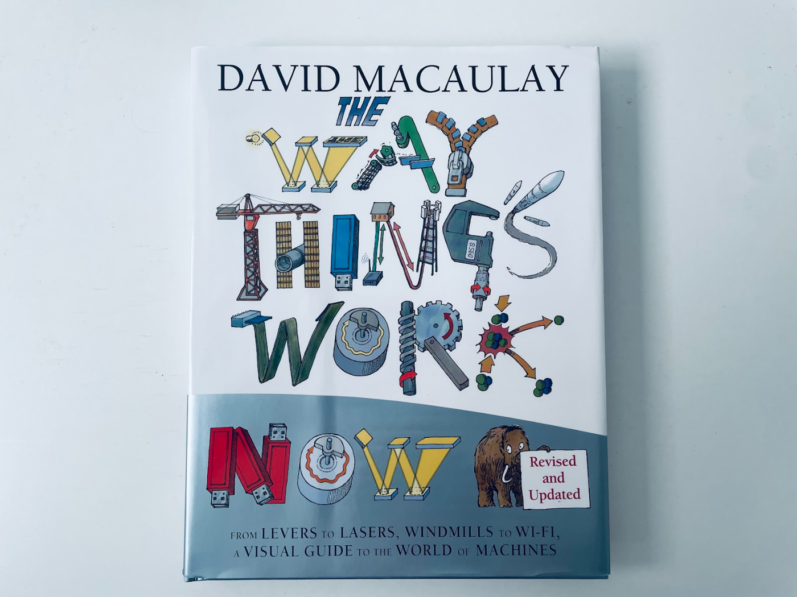
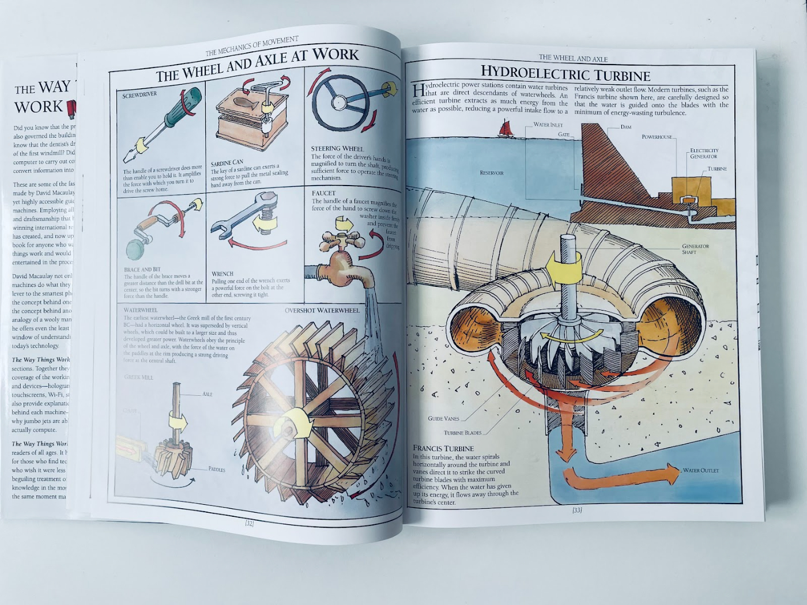
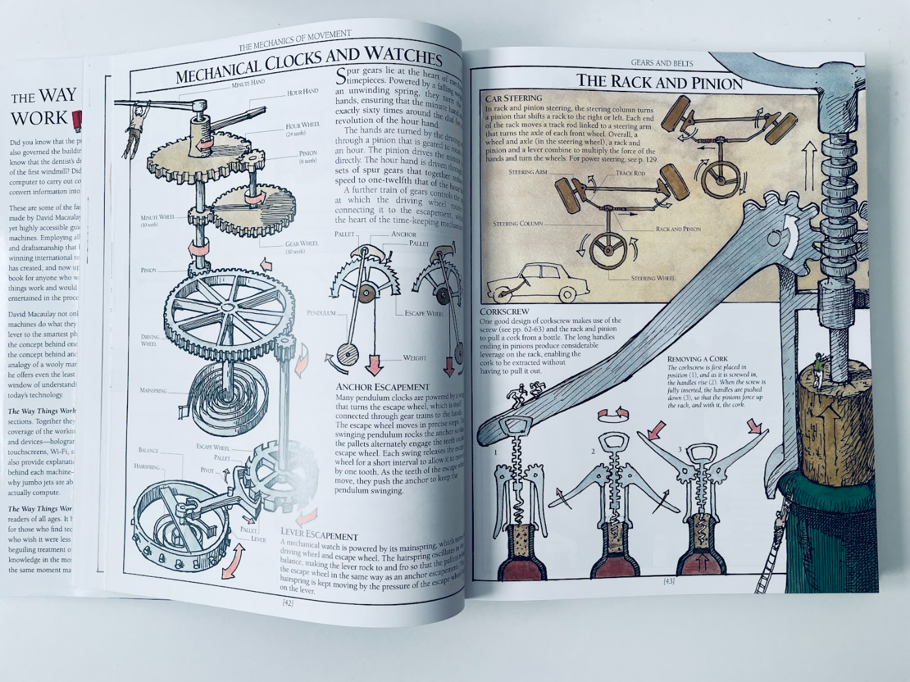

Business is filled with physics metaphors: Porter’s “[five forces](https://every.to/divinations/your-actual-competition-227088),” Helmer’s “[seven powers](https://every.to/divinations/disrupting-disruption-helmers-razor-925554),” startup accelerators, organizational inertia, wedges, leverage, momentum—I could go on.  
商业充满了物理隐喻：波特的“五力”、海尔默的“七力”、创业加速器、组织惯性、楔子、杠杆、动力——我可以继续说下去。

Businesspeople are attracted to physics jargon because it makes them sound smart. But on a deeper level, it makes the world feel more predictable and in our control. It reminds us that mere mortals have built machines that put men on the moon and bought them safely back to Earth.  
商人被物理行话所吸引，因为这让他们听起来很聪明。但在更深层次上，它让世界感觉更可预测，更受我们控制。它提醒我们，只有凡人才能制造出将人类送上月球并安全送回地球的机器。  
Surely we can hit our growth targets this quarter—right? 🥲  
我们当然可以在本季度实现我们的增长目标——对吗？ 🥲

Some people dislike the use of physics jargon in business. They think the metaphors don’t make sense and only serve to make people seem superficially smart. There is some truth to that, but ultimately, I disagree—physics jargon is cool.  
有些人不喜欢在商业中使用物理术语。他们认为这些比喻没有意义，只会让人看起来表面上很聪明。这有一定的道理，但最终，我不同意——物理学术语很酷。

When you exapt a concept from one domain and use it in another—“exaptation” itself being a great example, which I borrowed from evolutionary biology—you’re subtly encouraging people to think about the things that two different systems might have in common.  
当你从一个领域扩展一个概念并在另一个领域使用它时——“扩展”本身就是一个很好的例子，我从进化生物学中借用了它——你在巧妙地鼓励人们思考两个不同系统可能具有的共同点。  
You’re initiating a process where, for each idea you come across, you instinctively contemplate how it might have an analog in a different domain. It’s not just a way to communicate. It’s a way to think.  
你正在启动一个过程，在这个过程中，对于你遇到的每个想法，你本能地考虑它如何在不同的领域中有一个类似物。这不仅仅是一种交流方式。这是一种思考方式。

But if you want to take full advantage of this way of thinking, you need to actually understand what the concepts mean in their original setting. Only then can you benefit from the metaphor. Otherwise it’s just an empty label. You only know _the name of the thing_, but [names don’t constitute knowledge](https://www.youtube.com/watch?v=lFIYKmos3-s).  
但是如果你想充分利用这种思维方式，你需要真正理解这些概念在其原始设置中的含义。只有这样你才能从这个比喻中受益。否则它只是一个空标签。你只知道事物的名称，但名称并不构成知识。

I’ve had a nagging feeling that I should learn more about the physical and mechanical terms that get thrown around in business. So I picked up—and have been devouring—a book called [_The Way Things Work_](https://www.amazon.com/Way-Things-Work-Now/dp/0544824385/ref=asc_df_0544824385/?tag=hyprod-20&linkCode=df0&hvadid=312079243837&hvpos=&hvnetw=g&hvrand=6182738484055193325&hvpone=&hvptwo=&hvqmt=&hvdev=c&hvdvcmdl=&hvlocint=&hvlocphy=9031175&hvtargid=pla-464489771724&psc=1&tag=&ref=&adgrpid=63669393353&hvpone=&hvptwo=&hvadid=312079243837&hvpos=&hvnetw=g&hvrand=6182738484055193325&hvqmt=&hvdev=c&hvdvcmdl=&hvlocint=&hvlocphy=9031175&hvtargid=pla-464489771724) by David Macaulay.  
我有一种挥之不去的感觉，我应该更多地了解业务中随处可见的物理和机械术语。所以我拿起了——并且一直如饥似渴地阅读——大卫·麦考利 (David Macaulay) 的一本名为《事物运作方式》(The Way Things Work) 的书。

The first chapter is about simple machines like wedges, pulleys, gears, levers, cranks, cams, belts, and more. I had only a foggy idea what most of these were and how they worked before I started reading; it’s been a delight to learn.  
第一章是关于简单的机器，如楔子、滑轮、齿轮、杠杆、曲柄、凸轮、皮带等。在我开始阅读之前，我对其中大部分是什么以及它们是如何工作的只有一个模糊的想法；学习很愉快。  
Each page has short explanations for how these machines work, accompanied by charmingly analog illustrations.  
每页都有关于这些机器如何工作的简短说明，并附有迷人的模拟插图。

As I turned the pages, it started to dawn on me how an array of tools relies on the same few mechanical principles to work.  
当我翻过几页时，我开始明白一系列工具是如何依赖相同的一些机械原理来工作的。

Gears, levers, pulleys, wedges, and more are all ways of producing a [mechanical advantage](https://www.youtube.com/watch?v=JnYVz1TSmBQ): they convert small input forces into larger output forces. The increase in force doesn’t result from these devices having an internal motor; there is no extra energy being created. The way they work is far more clever: they exploit the link between **force** and **distance**.  
齿轮、杠杆、滑轮、楔子等都是产生机械优势的方式：它们将小的输入力转化为更大的输出力。力的增加不是因为这些设备有内部马达；没有额外的能量被创造出来。他们的工作方式要聪明得多：他们利用力和距离之间的联系。

The classic example of a mechanical advantage is a lever, which allows you to lift heavy objects short distances by applying a small force over a larger distance. In the illustration below, when you push down on the left side, the distance the opposite side moves is reduced by ~3.  
机械优势的典型例子是杠杆，它允许您通过在较大距离上施加较小的力来提升较短距离的重物。在下图中，当您向下推左侧时，另一侧移动的距离会减少 ~3。  
33x, but the force of this movement is magnified by ~3.33x. A useful trade-off!  
33 倍，但此运动的力量被放大了 ~3.33 倍。一个有用的权衡！

This same idea of trading distance for force shows up in a surprisingly wide variety of everyday situations.  
这种以距离换力的想法同样出现在各种各样的日常情况中。

For example, it’s easier to open a door from the side furthest from the hinge because of leverage. It’s why the door handles are always on that side.  
例如，由于杠杆作用，从离铰链最远的一侧打开门会更容易。这就是为什么门把手总是在那一侧的原因。  
With a knife, force is converted from a wide area around the grip to a tiny point at the sharp edge, so it can cut through dense objects like a block of cheese. It’s the same amount of force, but reduced to a tiny space.  
使用刀子时，力从握把周围的大面积区域转换为锋利边缘的微小点，因此它可以切开像一块奶酪这样致密的物体。它是相同数量的力，但减少到一个很小的空间。

Scissors are like knives and levers combined: the area closest to the hinge cuts with the most force, because the blades travel a shorter distance.  
剪刀就像刀和杠杆的组合：离铰链最近的区域剪力最大，因为刀片移动的距离较短。

A mechanical advantage is useful in a physical context when you want to overcome resistance, like lifting a heavy object or cutting through something dense. In a business context, there are a few different kinds of resistance.   
当你想克服阻力时，机械优势在物理环境中很有用，比如举起重物或切开密集的东西。在商业环境中，有几种不同类型的阻力。

One is an organization’s inertia. It’s hard to get a company to do a new thing, and the bigger the organization, the harder it is to change. Companies that are trying to change tend to require an equal and opposite force to overcome the inertia.  
一是组织的惰性。很难让一家公司做一件新事，而且组织越大，改变就越难。试图改变的公司往往需要一种平等而相反的力量来克服惯性。  
Large enterprise sales teams are built around signing a single customer, while on the small business end of the market all you need is a few quick calls around an otherwise self-serve solution. When an executive wants their company to change, they often hire expensive, [high-status](https://www.overcomingbias.com/2012/01/why-so-much-consulting.html) consultants like McKinsey to make a plan that gets everyone on board.  
大型企业销售团队是围绕与单个客户签约而建立的，而在市场的小型企业端，您所需要的只是围绕其他自助服务解决方案的几个快速电话。当一位高管希望他们的公司发生变化时，他们通常会聘请像麦肯锡这样的昂贵、地位高的顾问来制定一个让每个人都参与的计划。

If organizational inertia is one form of resistance that you might want to overcome, what are the business equivalents of simple machines that create mechanical advantage and multiply your input force into a much larger output force?  
如果组织惯性是您可能想要克服的一种阻力形式，那么创造机械优势并将您的输入力乘以更大的输出力的简单机器的业务等价物是什么？  
And if they exist, do they have an equivalent trade-off of physical machines where you have to apply the force over a longer distance to gain leverage?  
如果它们存在，它们是否具有物理机器的等效权衡，您必须在更长的距离上施加力以获得杠杆作用？

Maybe! Startups often hyper-focus on a small number of customers that share specific traits. This compresses all of the startup’s energy and force into a small space. It’s the opposite of being “spread thin.  
或许！初创公司通常过度关注少数具有特定特征的客户。这将初创公司的所有能量和力量压缩到一个小空间里。这与“摊薄”相反。  
” The advantage of this approach is that you’re more likely to solve a problem, overcome inertia, and gain adoption by the customers you focus on. The trade-off is that it might be questionable how many more customers you’ll be able to find. I call this a [market wedge](https://every.to/divinations/the-market-wedge-how-to-pick-your-initial-market?sid=13838), where you sacrifice scale for power.  
” 这种方法的优势在于，您更有可能解决问题、克服惯性并获得您关注的客户的采用。权衡是，您可能会怀疑您还能找到多少客户。我称之为市场楔子，您可以在其中牺牲规模来换取权力。

Sometimes in mechanical systems you want to do the opposite, and sacrifice power for scale—or, put another way, sacrifice force for distance/speed.  
有时在机械系统中你想做相反的事情，为了规模而牺牲力量——或者换句话说，为了距离/速度而牺牲力量。

A perfect physical example is a bicycle. When you’re in high gear, each rotation of your pedal turns the wheels many times, thanks to the mechanics of gears.  
一个完美的物理例子是自行车。当您处于高速档时，踏板的每一次旋转都会使车轮转动多次，这要归功于齿轮的力学原理。

The trade-off, as anyone knows who’s ever tried to ride uphill in high gear, is that your gain in speed comes at the cost of force. It’s the opposite of leverage. But in some situations, such as riding downhill, that might be exactly what you want.  
权衡，任何人都知道，谁曾经试图骑高速上坡，你的速度增益是以力量为代价的。它与杠杆相反。但在某些情况下，例如下坡骑行，这可能正是您想要的。

An analogy in the business world is when companies introduce products that are designed to reach a lot of people, even if they might not make a lot of money or have long-term defensibility.  
商业世界中的一个类比是，当公司推出旨在覆盖很多人的产品时，即使它们可能赚不到很多钱或没有长期的防御能力。  
This trade-off can be worth it when you want to establish a lot of new customer relationships, and you’re banking on the fact that you can introduce new products or deepen the value over time. I call this a [product wedge](https://every.to/divinations/product-wedges-a-complete-guide?sid=13838), and there are many famous examples. Two of my favorites: 1) Apple’s iPod was an “okay” business on its own, but brilliant in that it bought so many new people into the Apple ecosystem.  
当您想建立大量新的客户关系，并且您指望可以推出新产品或随着时间的推移加深价值时，这种权衡是值得的。我称之为产品楔子，有很多著名的例子。我最喜欢的两个：1) Apple 的 iPod 本身是一项“还可以”的业务，但它的出色之处在于它吸引了如此多的新人进入 Apple 生态系统。  
2) Instagram’s first users cared more about making photos look good using filters than they did about the Instagram network, because nobody was there yet. But over time Instagram grew a network, which made it far more valuable than a photo editing app.  
2) 相较于 Instagram 网络，Instagram 的第一批用户更关心使用滤镜让照片看起来好看，因为那时还没有人。但随着时间的推移，Instagram 发展了一个网络，这使其比照片编辑应用程序更有价值。

It’s amazing how the same concepts of mechanical advantage show up in both the  physical and business worlds, with each having its own trade-offs to consider.  
令人惊奇的是，机械优势的相同概念如何同时出现在物理世界和商业世界中，每个世界都有自己的权衡取舍需要考虑。  
They aren’t perfect analogs, but it’s worth it if it provides inspiration to dig deeper and understand the world around you beneath the surface, beyond having a passing familiarity with the names of things.  
它们不是完美的类比，但如果它能提供灵感，让你更深入地挖掘并了解你周围的世界，而不仅仅是对事物名称的短暂熟悉，那么它是值得的。
