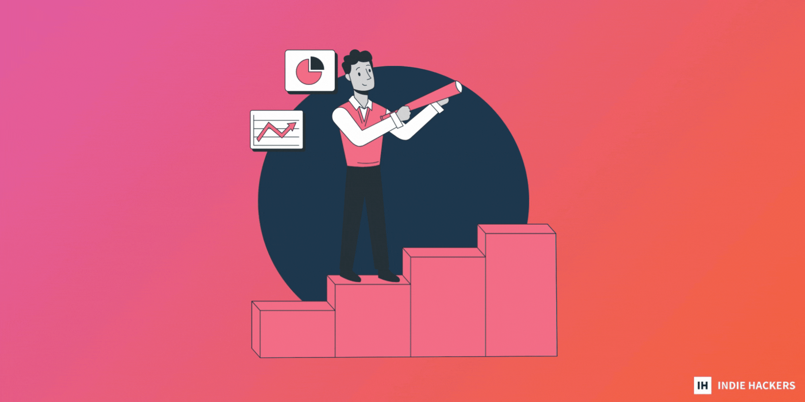

## 👩🏫 51 Random Startup Lessons 👩
🏫 51 节随机入门课程

_by [Justin Alb 通过贾斯汀阿尔布](https://www.indiehackers.com/Justin_Alb)_

It’s been more than a decade since I started building tech products, some with large teams, others with just a few people. Some of them succeeded, others failed for good. However, they all taught me many valuable lessons.  
自从我开始构建技术产品以来已经有十多年了，有些是大型团队，有些则只有几个人。他们中的一些人成功了，另一些人永远失败了。然而，他们都教会了我许多宝贵的经验。

I'm sharing them below. Hope they're helpful for you!  
我在下面分享它们。希望它们对您有所帮助！

### The startup chronicles 创业编年史

1.  Testing is key: You might think you have the best idea ever, but in the end, only the user will tell you what works and what doesn’t.  
    测试是关键：你可能认为你有最好的想法，但最终只有用户会告诉你什么可行，什么不可行。
2.  Don’t dwell on mistakes or misfortunes. Learn your lesson and do better next time.  
    不要老想着错误或不幸。吸取教训，下次做得更好。
3.  Influencer marketing is a gamble.  
    影响者营销是一场赌博。
4.  Users have high expectations, even for a free product.  
    用户有很高的期望，即使是免费产品也是如此。
5.  Work vacations are the best form of team building.  
    工作假期是团队建设的最佳形式。
6.  People will call everything they don’t understand a scam.  
    人们会将他们不了解的一切称为骗局。
7.  A little praise for a job well done can go a long way.  
    对出色的工作给予一点表扬可以起到很大的作用。
8.  Coffee, sweets, beer, and wine: These are four things that boost employee motivation and morale.  
    咖啡、糖果、啤酒和葡萄酒：这四样东西可以提高员工的积极性和士气。
9.  Users are very set in their ways, and it’s hard to change their habits. This makes it very challenging to break into any market with a new product. You will need to prove that your product is worth their attention in a minute or less.  
    用户的方式非常固定，很难改变他们的习惯。这使得用新产品打入任何市场都非常具有挑战性。您需要在一分钟或更短的时间内证明您的产品值得他们关注。
10.  Higher seniority hires don't necessarily make for a better team.  
    资历更高的员工不一定会组成更好的团队。
11.  When working with influencers or bloggers, check to see if any other brands have been working with them long term.  
    与有影响力的人或博主合作时，请检查是否有其他品牌长期与他们合作。
12.  Hiring people with varied skillsets, rather than focusing on what’s required for the position, improves overall workplace agility.  
    雇用具有不同技能的人，而不是专注于职位所需的人，可以提高整体工作场所的灵活性。
13.  Morning stand-ups (15 minute meetings) to catch up can be an amazing thing for smaller teams.  
    早上的站立会议（15 分钟的会议）对于较小的团队来说可能是一件了不起的事情。
14.  An in-house team is usually better than an outsourced one.  
    内部团队通常比外包团队更好。
15.  You will have to knock on a million doors until you get one to open.  
    你将不得不敲一百万扇门，直到你打开一扇门。
16.  Prices for hotels vary depending on whether you’re viewing the website on a computer or a mobile device.  
    酒店的价格会有所不同，具体取决于您是在计算机上还是在移动设备上查看网站。
17.  Whatever you’re inquiring for, follow up two to three times. To some, it’s spammy, but to others, it might be the reminder that they needed. Bet on the latter.  
    无论您询问什么，请跟进两到三次。对某些人来说，这是垃圾邮件，但对其他人来说，这可能是他们需要的提醒。赌后者。
18.  Change blog headlines every once in a while and note the traffic. You’ll see what performs and what doesn’t.  
    每隔一段时间更改博客标题并注意流量。您会看到什么有效，什么无效。
19.  Explain your product to potential customers as if they were four years old.  
    向潜在客户解释您的产品，就好像他们是四岁的孩子一样。
20.  Satisfied workers are those who have their freedom and feel trusted.  
    满意的员工是那些拥有自由并感到被信任的人。
21.  Test, test, test: Just because something worked once doesn’t mean that it will work again, and vice versa.  
    测试、测试、测试：仅仅因为某些东西曾经起作用并不意味着它会再次起作用，反之亦然。
22.  Make your copy as short as possible, unless it’s a blog post or Indie Hackers post.  
    使您的副本尽可能短，除非它是博客文章或 Indie Hackers 帖子。
23.  Give _ChatGPT_ a try if you’re stuck on something. What do you have to lose? Maybe it will offer something you haven’t thought of.  
    如果您遇到困难，请尝试一下 _ChatGPT_。你有什么损失？也许它会提供您没有想到的东西。
24.  Know when to pivot if something’s not working, and when to give up. Don’t keep trying to improve something that has low value.  
    如果某些事情不起作用，知道什么时候转向，什么时候放弃。不要一直试图改进价值低的东西。
25.  Sharing your successes publicly will motivate you to keep going.  
    公开分享您的成功将激励您继续前进。
26.  An animal-friendly office is a good idea!  
    一个对动物友好的办公室是个好主意！
27.  Try out TikTok: If you don’t find your audience there, at least you’ll have fun.  
    试试 TikTok：如果你在那里找不到你的观众，至少你会玩得开心。
28.  Sell and advertise your product everywhere you go.  
    随时随地销售和宣传您的产品。
29.  The free Slack version is enough for most of the functions you might need. Don’t overpay.  
    免费的 Slack 版本足以满足您可能需要的大部分功能。不要多付钱。
30.  Utilize Facebook Groups, but don’t be too straightforward. A few roundabouts will do the job (and not get you thrown out!).  
    使用 Facebook 群组，但不要太直截了当。几个环形交叉路口就可以完成这项工作（而且不会让你被扔出去！）。
31.  When it comes to press, sell your knowledge, not your product. You’ll get coverage, and sometimes, even do-follow links.  
    说到媒体，卖的是你的知识，而不是你的产品。您会得到报道，有时甚至会关注链接。
32.  Putting all your eggs in one basket is a mistake. Even when one thing works very well, don’t quit on others. You never know when it’s going to change.  
    将所有鸡蛋放在一个篮子里是错误的。即使一件事情做得很好，也不要放弃其他事情。你永远不知道什么时候会改变。
33.  Marketing will never sell a product if it’s not filling in a certain gap in the market.  
    如果产品不能填补市场上的某个空白，营销就永远不会销售产品。
34.  It's essential to jump on trends _on time._ This is especially true when it comes to social media and blogs. The sooner you cover it, the higher you come up in Google searches.  
    及时赶上潮流很重要。在社交媒体和博客方面尤其如此。你越早覆盖它，你在谷歌搜索中的排名就越高。
35.  Share your struggles with like-minded people. Sometimes one comment can give you the needed answers and new ideas that will push you forward.  
    与志同道合的人分享您的奋斗经历。有时一条评论可以为您提供所需的答案和新想法，从而推动您前进。
36.  Try out OnePitch, a free platform that finds the perfect journalists according to your pitch.  
    试用 OnePitch，这是一个免费平台，可根据您的推介找到完美的记者。
37.  Get your tracking right: If you don’t know where your installs are coming from, you don’t know what you're doing well.  
    正确跟踪：如果您不知道安装的来源，您就不知道自己在做什么。
38.  It’s crucial to send an accurate product message. You might lose potential clients by emphasizing the parts of your product that are not as important.  
    发送准确的产品信息至关重要。你可能会因为强调产品中不那么重要的部分而失去潜在客户。
39.  To grow your Twitter audience, follow people who follow the brands that you're competing with. Let them know you’re there, and that you have more to offer.  
    要增加您的 Twitter 受众，请关注那些关注与您竞争的品牌的人。让他们知道您在那里，并且您可以提供更多。
40.  Top notch customer support is one of the very first steps to a successful product. Invest in it.  
    一流的客户支持是产品成功的第一步。投资它。
41.  Personalize everything you do. No one is interested in communication that seems to be written by a bot.  
    个性化您所做的一切。没有人对似乎由机器人编写的通信感兴趣。
42.  Getting bored with your own product happens every once in a while.  
    每隔一段时间就会对自己的产品感到厌倦。
43.  The benefits, not the features, are what sell a product.  
    产品的卖点是好处，而不是功能。
44.  Re-share everything you write on Medium.  
    重新分享您在 Medium 上写的所有内容。
45.  Be transparent. Even the smallest lie may ruin what you’ve built later, and it’s not worth it.  
    保持透明。即使是最小的谎言也可能会毁掉你后来建立的东西，这是不值得的。
46.  Sharing your behind-the-scenes puts any product closer to its current or potential user.  
    分享您的幕后花絮可以让任何产品更接近其当前或潜在用户。
47.  No problem is unsolvable. All of them are temporary.  
    没有解决不了的问题。所有这些都是暂时的。
48.  The product won’t die without you. Take time off or burnout will eventually set in.  
    没有你，产品不会消亡。请假，否则最终会出现倦怠。
49.  Sometimes, the problem is not your product. It could simply be bad timing...like launching a travel product in the middle of a pandemic (me!).  
    有时，问题不在于您的产品。这可能只是时机不对……比如在大流行期间推出旅游产品（我！）。
50.  Doing everything by yourself is almost never the best option.  
    自己做所有事情几乎从来都不是最好的选择。
51.  If your audience is worldwide, work on adding as many languages as you can at some point. It will add a touch of care.  
    如果您的受众遍布全球，请在某个时间点添加尽可能多的语言。它会增加一丝关怀。

_Bonus:_ No one uses that ping pong table that’s shown in every startup work announcement.  
奖励：没有人使用每个启动工作公告中显示的乒乓球桌。

_What would you add to this list? Share with other founders below!  
你会在这个列表中添加什么？与下面的其他创始人分享！_
