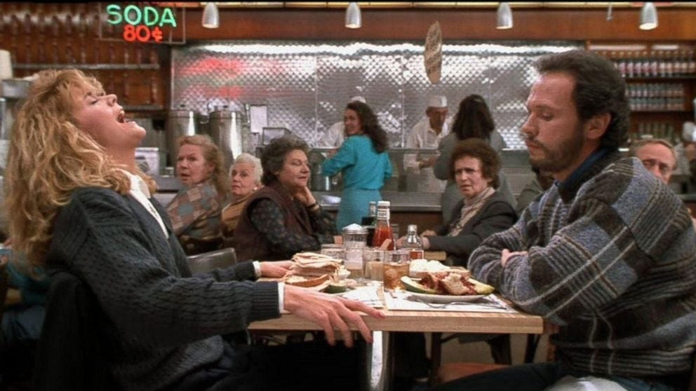
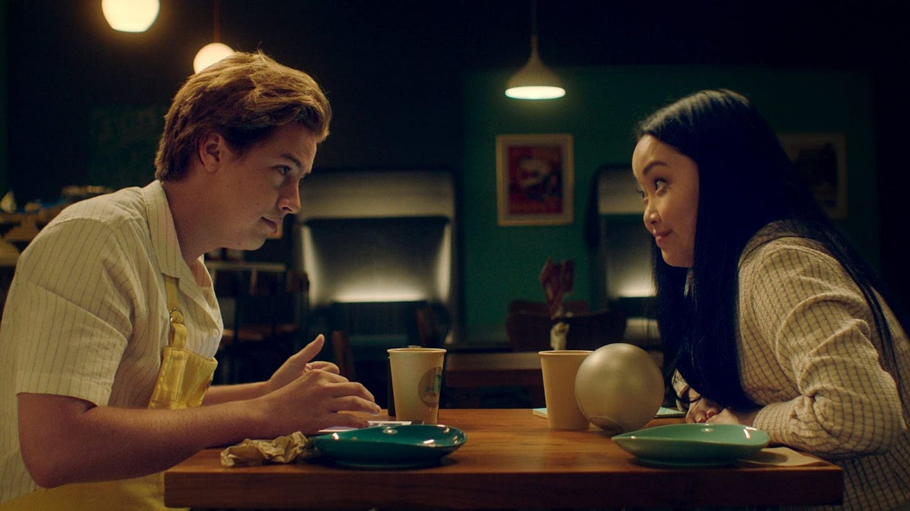

Last week I saw _M3GAN_ 上周我看到了 M3GAN, the new horror-comedy starring Allison Williams and a robot-doll in a blond wig. I liked it enough. The doll character is genuinely well-done—a seemingly hard-to-nail mix of creepy and campy—but I walked out of the theater with a vaguely empty feeling.  
，由艾莉森威廉姆斯和一个戴着金色假发的机器人娃娃主演的新恐怖喜剧。我很喜欢它。洋娃娃的角色真的做得很好——令人毛骨悚然和野蛮的混合体似乎难以钉牢——但我带着一种隐隐约约的空虚感走出了剧院。  
I couldn’t quite place it until I started talking with my friends about where the movie was set, and I realized I had no idea. One answer is somewhere in Silicon Valley, given its bald critique of big tech. It didn’t actually feel like Silicon Valley, though.  
直到我开始和我的朋友谈论电影的拍摄地，我才确定它的位置，然后我意识到我不知道。一个答案是在硅谷的某个地方，因为它对大型科技公司的直言不讳的批评。不过，它实际上并不像硅谷。  
It didn’t feel like anywhere at all. Every backdrop was generic and crisp: the scrubbed tech-compound where Gemma (Allison Williams) works; the bland, Wayfair-decorated house she lives in; the clean, non-specific streets she drives on. I thought little of this while watching.  
根本感觉不到任何地方。每个背景都是通用而清晰的：Gemma（Allison Williams）工作的擦洗过的科技化合物；她住的平淡无奇、装饰精美的房子；她开车经过的干净、不特定的街道。我看的时候很少考虑这个。  
The movie looked expensive and professional, or at least had the hallmarks of those things: glossy, filtered, smooth.  
这部电影看起来既昂贵又专业，或者至少具有这些东西的特点：光泽、过滤、流畅。  
Only after it ended did it occur to me that it seemed, like so many other contemporary movies and shows, to exist in a phony parallel universe we’ve come to accept as relevant to our own.  
只有在它结束后，我才意识到它似乎像许多其他当代电影和节目一样，存在于一个我们已经接受为与我们自己相关的虚假平行宇宙中。

Single workaholic Gemma’s house (top) and the “toy testing room” at her office (bottom) ([via IMDB](https://www.imdb.com/title/tt8760708/mediaindex?ref_=tt_mv_close))  
单身工作狂 Gemma 的房子（上）和她办公室的“玩具测试室”（下）（来自 IMDB）

To be clear, this isn’t about whether the movie was “realistic.” Movies with absurd, surreal, or fantastical plots can still communicate something honest and true. It’s actually, specifically, about how movies these days _look._ That is, more flat, more fake, over-saturated, or else over-filtered, like an Instagram photo in 2012, but rendered in commercial-like high-def.  
需要明确的是，这与电影是否“真实”无关。具有荒诞、超现实或奇幻情节的电影仍然可以传达一些诚实和真实的东西。实际上，具体来说，是关于当今电影的外观。也就是说，更平坦、更虚假、过度饱和或过度过滤，就像 2012 年的 Instagram 照片，但以类似商业的高清格式呈现。This applies to prestige television, too. There are more green screens and sound stages, more CGI, more fixing-it-in-post.  
这也适用于有声望的电视。有更多的绿幕和声场，更多的 CGI，更多的后期修复。  
As these production tools have gotten slicker and cheaper and thus more widely abused, it’s not that everything looks obviously shitty or too good to feel true, it’s actually that most things look mid in the exact same way.  
随着这些生产工具变得更灵活、更便宜，因此被更广泛地滥用，并不是所有的东西看起来都很糟糕或好得让人感觉不真实，实际上大多数东西看起来都一样。  
The ubiquity of the look is making it harder to spot, and the overall result is weightless and uncanny. An endless stream of glossy vehicles that are easy to watch and easier to forget.  
外观无处不在，让人更难发现，整体效果轻盈而不可思议。层出不穷的光鲜亮丽的车辆，易于观看，也更容易被遗忘。  
I call it the “Netflix shine,” inspired by one of the worst offenders, although some reading on the topic revealed others call it (more boringly) the “Netflix look.”  
我把它称为“Netflix 闪耀”，灵感来自最严重的违规者之一，尽管一些关于该主题的阅读显示其他人称之为（更无聊）“Netflix 外观”。

In a 2022 _Vice_ piece called [“Why Does Everything on Netflix Look Like That,”](https://www.vice.com/en/article/ake3j5/why-does-everything-on-netflix-look-like-that)  
在 2022 年的一篇名为“为什么 Netflix 上的一切都像那样”的文章中， writer Gita Jackson describes the Netflix look as unusually bright and colorful, or too dark, the characters lit inexplicably by neon lights, everything shot at a medium close-up.  
作家 Gita Jackson 形容 Netflix 的画面异常明亮和多彩，或者太暗了，人物被霓虹灯莫名其妙地照亮，一切都以中等特写镜头拍摄。  
She discovered this aesthetic monotony is in part due to the fact that Netflix requires the same “technical specifications from all its productions.” This is of course an economic choice: more consistency = less risk.  
她发现这种审美单调的部分原因是 Netflix 要求“所有产品都采用相同的技术规格”。这当然是一种经济选择：更高的一致性 = 更低的风险。  
They’ve also structured their budgets to favor pre-production costs like securing top talent. So despite the fact that their budgets are high, they’re spending it all on what is essentially marketing, pulling resources away from things like design and location.  
他们还调整了预算以支持预生产成本，例如确保顶尖人才。因此，尽管他们的预算很高，但他们将所有资金都花在了本质上的营销上，将资源从设计和选址等方面抽走了。  
This style-over-substance approach is felt in most things Netflix makes, and it’s being replicated across the industry. (For more proof of concept, Rachel Syme’s  
这种风格重于实质的方法体现在 Netflix 制作的大多数产品中，并且正在整个行业中复制。 （有关概念的更多证明，Rachel Syme 的[recent](https://www.newyorker.com/magazine/2023/01/16/how-much-more-netflix-can-the-world-absorb-bela-bajaria) _[New Yorker](https://www.newyorker.com/magazine/2023/01/16/how-much-more-netflix-can-the-world-absorb-bela-bajaria)_ [profile](https://www.newyorker.com/magazine/2023/01/16/how-much-more-netflix-can-the-world-absorb-bela-bajaria) of Netflix Global Head of Television Bela Bajaria is perfectly tuned and genuinely chilling. I’m still thinking about her “Art is Truth” blazer and lack of jet lag despite constant world travel. She’s a walking metaphor.)  
Netflix 全球电视主管贝拉·巴贾里亚 (Bela Bajaria) 最近在《纽约客》(New Yorker) 的简介经过完美调校，真正令人不寒而栗。我还在想着她的“艺术就是真理”运动夹克，尽管经常在世界各地旅行，但也没有时差反应。她是一个行走的隐喻。）

I’m not a film buff, so I write this from a layman’s perspective. But every time I watch something made before 2000, it looks so beautiful to me—not otherworldly or majestic, but beautiful in the way the world around me is beautiful. And I don’t think I’m just being nostalgic.  
我不是电影迷，所以我是从外行的角度写的。但每次我看到 2000 年之前制作的东西时，我都觉得它很美——不是超凡脱俗或宏伟壮观，而是像我周围的世界一样美丽。而且我不认为我只是怀旧。  
Consider these two popular rom-com movies stills: The first from  
考虑这两部流行的 rom-com 电影剧照：第一部来自_When Harry Met Sally_, shot on film in 1989, the second from _Moonshot_, shot digitally in 2022.  
当哈利遇到莎莉时，1989 年用胶片拍摄，第二部来自 Moonshot，于 2022 年以数字方式拍摄。

_When Harry Met Sally_ (1989) 当哈利遇见莎莉 (1989)

_Moonshot_ (2022) 登月 (2022)

The latter is more polished and “perfect,” but to what effect? It looks _strange_  
后者更加精致和“完美”，但效果如何？看起来很奇怪, surreal, both dim and bright at the same time. Everything is inexplicably blue or yellow, and glows like it’s been FaceTuned. Meg Ryan and Billy Crystal, meanwhile, are sitting in a downtown New York deli that actually exists.  
，超现实主义，既暗淡又明亮。一切都是莫名其妙的蓝色或黄色，并且像经过 FaceTuned 一样发光。与此同时，梅格瑞恩和比利克里斯托坐在纽约市中心一家真实存在的熟食店里。  
The image is a little grainy, the lighting falling somewhere in the normal daytime range, and they look like regular human beings. The table’s lopsided, the kitchen’s bent out of shape—the charm is earned.  
图像有点粗糙，光线落在正常白天范围内的某个地方，他们看起来像普通人。桌子歪了，厨房弯曲变形了——魅力是赚来的。  
Today the restaurant might be built on a sound stage, or shot in front of a green screen, the appearance of daylight added in post-production. They could make it look convincing and moody, but it would lack character.  
今天，餐厅可能建在摄影棚上，或者在绿幕前拍摄，后期制作中添加了日光的外观。他们可以让它看起来令人信服和喜怒无常，但它会缺乏个性。  
It would feel somehow outside the world we inhabit every day, because it would be.  
它会以某种方式感觉在我们每天居住的世界之外，因为它会。

At the risk of using an anonymous Redditor as an expert, lol, I found a comment under a thread called [“Why do movies look so weird now?”](https://www.reddit.com/r/movies/comments/ytlu96/why_do_movies_looks_so_weird_now/) that captures a lot of these same complaints:   
冒着使用匿名 Redditor 作为专家的风险，大声笑，我在一个名为“为什么电影现在看起来这么奇怪？”的帖子下发现了一条评论。捕获了很多相同的抱怨：

> “Everyone is lit perfectly and filmed digitally on raw and tweaked to perfection. It makes everything have a fake feeling to it. Commercials use the same cameras and color correction so everything looks the same.  
> “每个人都被完美地照亮并以原始数字方式拍摄并调整到完美。它使一切都有一种虚假的感觉。广告使用相同的相机和色彩校正，所以一切看起来都一样。  
> Every shot looks like it could be used in a stock photo and it looks completely soulless. No film grain, no shadows on faces, and no wide shots. I have a theory that going from tungsten to LED lighting added to this as well.  
> 每张照片看起来都可以用在库存照片中，而且看起来完全没有灵魂。没有胶片颗粒，脸上没有阴影，也没有广角镜头。我有一个理论，从钨丝灯到 LED 灯也加入其中。  
> Tungsten allows for more accurate color in camera but LEDs are cheaper, cooler, and more convenient. So the solution is to film on a nice digital camera and fix the color in post. However, this makes for less creativity on set and less use of shadows.  
> 钨灯使相机的色彩更准确，但 LED 更便宜、更凉爽、更方便。所以解决方案是用一台漂亮的数码相机拍摄并在后期修复颜色。然而，这会降低现场的创造力和阴影的使用。  
> Green screens make it worse as they also require flatter lighting to work. Marvel films are very obviously mostly made in post and they all look very flat and not real. Even shitty low-budget 90's comedies look better and I think this can be attributed to the lighting.”  
> 绿屏使情况变得更糟，因为它们还需要更平坦的照明才能工作。很明显，漫威电影大多是后期制作的，它们看起来都很平淡，不真实。即使是低预算的 90 年代低劣喜剧也看起来更好，我认为这可以归因于灯光。”

Another user mentioned that shooting on film required a level of forethought, planning, and patience that digital simply doesn’t.  
另一位用户提到，用胶片拍摄需要一定程度的深思熟虑、计划和耐心，而数字技术根本不需要。  
Similar to the predicament brought on by smartphone cameras and our now-endless photo rolls, the result is more, sure, and at higher fidelity, but not necessarily better. A photo today has never been worth less. I’ve long believed that constraints can improve creative work.  
类似于智能手机相机和我们现在无穷无尽的照片卷带来的困境，结果更确定，保真度更高，但不一定更好。今天的照片从未如此值钱。我一直相信约束可以改善创造性工作。  
But today’s shrinking production budgets, paired with the limitlessness of computer technology, aren’t inspiring scrappiness. They’re inspiring laziness. It’s too easy to fix things in post.  
但如今不断缩减的制作预算，再加上计算机技术的无限发展，并没有激发斗志。他们正在激发懒惰。在后期修复问题太容易了。  
Why wait around all day for the light to be just right when you can make it look half as good in Final Cut Pro for half the price? There’s an expansive possibility to digitization that defies the logic of constraint.  
当您可以用一半的价格在 Final Cut Pro 中让它看起来有一半好时，为什么还要整天等待光线恰到好处呢？数字化有很大的可能性违反约束逻辑。

That the film and TV industry is obsessed with making as much money as possible isn’t a surprise. But as with any cost-cutting strategy, the approach is necessarily an expression of priorities. What’s worth the trouble? What isn’t?  
电影和电视行业痴迷于尽可能多地赚钱并不奇怪。但与任何削减成本的策略一样，这种方法必然是优先事项的表达。有什么值得麻烦的？什么不是？  
Looking at what studios are and aren’t willing to spend on today paints a pretty unflattering (if predictable) picture of modern values. And what’s interesting is how recognizable those values are across other pillars of culture.  
看看今天的工作室愿意和不愿意在什么上花钱，就会描绘出一幅相当不讨人喜欢（如果可以预见）的现代价值观图景。有趣的是，这些价值观在其他文化支柱中的知名度如何。  
To name a few: the idea that imperfection is inhibitive to beauty; an over-emphasis on growth, speed, ease, and innovation; a cynical over-reliance on marketing; a lack of interest in locality and place; the funneling of resources to the top; the focus on content over form, entertainment over art.  
仅举几例：不完美阻碍美丽的想法；过分强调增长、速度、轻松和创新；愤世嫉俗地过度依赖营销；对地方和地点缺乏兴趣；将资源输送到高层；内容重于形式，娱乐重于艺术。  
I could be talking about anything here—the beauty and cosmetics industry, tech, corporate America, manufacturing, social media, politics, labor disputes.  
我可以在这里谈论任何事情——美容和化妆品行业、科技、美国企业、制造业、社交媒体、政治、劳资纠纷。

I’m not saying the proliferation of shitty-looking shows and movies will bring about our cultural downfall, only that they express, in a satisfyingly literal way, a specific wrong-think that’s pervading our off-screen lives, too.  
我并不是说看起来很糟糕的节目和电影的泛滥会导致我们的文化垮台，只是它们以令人满意的字面意思表达了一种特定的错误想法，这种想法也弥漫在我们的银幕外生活中。  
Most usefully, their hollowness offers, by way of counter-example, a key to what does feel meaningful: texture, substance, imperfection, slowing down, taking the scenic route, natural light, places you can touch, making more considered creative choices, making  
最有用的是，通过反例，它们的空心提供了一个关键，让我们感觉有意义：质地、物质、不完美、放慢速度、走风景路线、自然光、你可以触摸的地方、做出更深思熟虑的创造性选择，制作_less_. There’s a certain momentum to the mid right now, but there are other ways forward, if we’re willing to indulge them.  
较少的。现在中间有一定的势头，但如果我们愿意放纵的话，还有其他前进的道路。

My favorite thing I read last week was [“The ‘Scooby Doo’ Psyop,”](https://www.garbageday.email/p/the-scooby-doo-psyop) by Ryan Broderick for his _newsletter_ Garbage Day about the specific badness of Mindy Kaling’s new show (and an introduction to the phrase “sacrificial trash”). Friday’s [15 Things](https://haleynahman.substack.com/p/15-things-i-consumed-this-week-2f3) also included my latest investment purchase, my favorite new iPhone feature, my “eh” review of a buzzy new book, and more. The [rec of the week](https://haleynahman.substack.com/p/15-things-i-consumed-this-week-2f3/comments) was, selfishly, “veggie sides that travel well,” lol, because I needed ideas for a dinner party on Friday. And you delivered!  
上周我最喜欢读的是瑞安布罗德里克 (Ryan Broderick) 为他的时事通讯垃圾日 (Garbage Day) 撰写的“The ‘Scooby Doo’ Psyop”，内容涉及明迪卡林 (Mindy Kaling) 新节目的具体缺点（以及对“牺牲垃圾”一词的介绍）。周五的 15 件事还包括我最近的投资购买、我最喜欢的 iPhone 新功能、我对一本热门新书的“嗯”评论等等。自私地说，本周的推荐是“适合旅行的素食面”，哈哈，因为我需要周五晚宴的想法。你交付了！

Tuesday’s podcast will be a pop culture roundup with Avi and my siblings Andy and Kelly (finally got them back on the pod!). We’ll be discussing M3GAN, nepo babies, Jen Shah, and that Madonna video, among other things…  
星期二的播客将是 Avi 和我的兄弟姐妹 Andy 和 Kelly 的流行文化综述（终于让他们回到了播客中！）。我们将讨论 M3GAN、nepo babies、Jen Shah 和麦当娜的视频，等等……

Hope you have a nice Sunday!  
希望你有一个愉快的星期天！  
Haley 海莉
