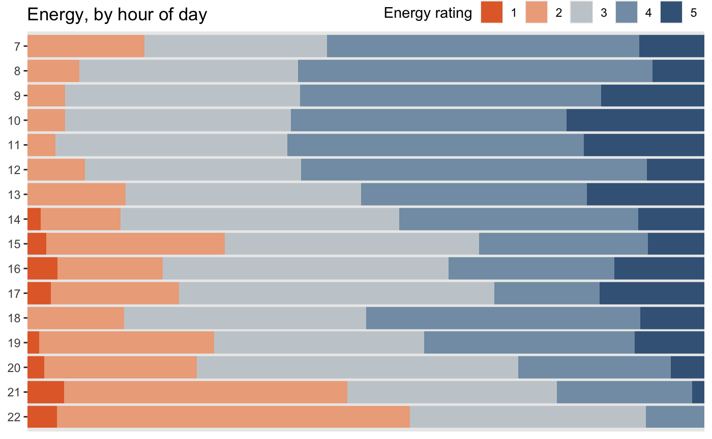
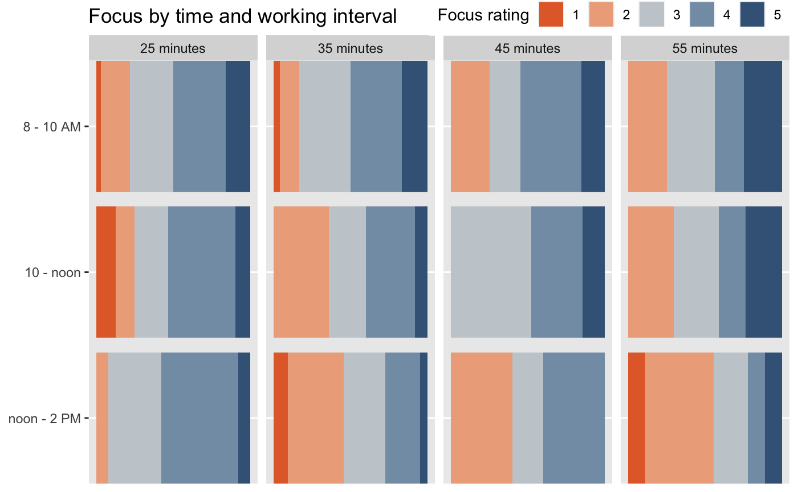
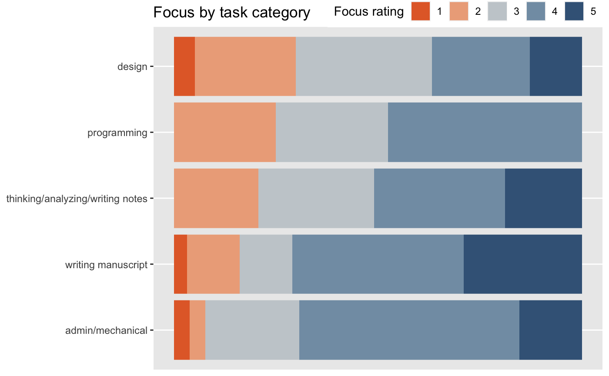

_Part of “Letters from the Lab”, a series of informal essays on my research written for [patrons](https://patreon.com/quantumcountry). Originally published November 2022; made publicly available January 2023. You can also [listen](https://andymatuschak.org/static/stillness/stillness.m4a) to this essay (21 minutes)_.  
“Letters from the Lab”的一部分，这是为赞助人撰写的关于我的研究的一系列非正式文章。最初发表于 2022 年 11 月；于 2023 年 1 月公开发布。您还可以收听这篇文章（21 分钟）。

A consistent challenge in my development as a researcher has been: how to cultivate deep, stable concentration in the face of complex, ill-structured creative problems?  
作为一名研究人员，我在发展过程中一直面临的挑战是：面对复杂、结构不良的创造性问题，如何培养深度、稳定的专注力？

In roles oriented around operation and execution, I benefited enormously from standard “productivity” advice. Task managers and time-planning tools were essential. But now, task managers and calendars only help with the least important pieces of my work.  
在以运营和执行为导向的角色中，我从标准的“生产力”建议中受益匪浅。任务管理器和时间规划工具必不可少。但现在，任务管理器和日历只能帮助我处理最不重要的工作。

Bill Thurston [writes](http://mathoverflow.net/users/9062/bill-thurston): 比尔瑟斯顿写道：

> Mathematics is a process of staring hard enough with enough perseverance at the fog of muddle and confusion to eventually break through to improved clarity.  
> 数学是一个以足够的毅力和足够的毅力凝视混乱和混乱的迷雾，最终突破到更清晰的过程。

This description resonates more with my experience of design research than anything _Getting Things Done_ has to say, valuable though it was in my past life. To make progress in my present work, I need to “stare hard enough and with enough perseverance at the fog of muddle and confusion.  
这个描述比我在设计研究方面的经验更能引起共鸣，而不是 Getting Things Done 必须要说的，尽管它在我过去的生活中很有价值。为了在目前的工作中取得进步，我需要“足够努力地、足够坚持地盯着混乱和混乱的迷雾。  
” But if I’d read that last sentence five years ago, I don’t think I’d have really understood what it meant. I wouldn’t have grasped how difficult it is to stare this way, or how impossible progress is without this state of mind. Here’s what I might tell my past self:  
” 但如果我在五年前读到最后一句话，我想我不会真正理解它的意思。如果没有这种心态，我不会明白以这种方式凝视是多么困难，或者进步是多么不可能。以下是我可能会告诉过去的自己：

“Why is this so hard? Because you’re utterly habituated to steady progress—to completing things, to producing, to solving. When progress is subtle or slow, when there’s no clear way to proceed, you flinch away. You redirect your attention to something safer, to something you _can_ do. You jump to implementation prematurely; you feel a compulsion to do more background reading; you obsess over tractable but peripheral details. These are all displacement behaviors, ways of not sitting with the problem.  
“为什么这么难？因为你完全习惯于稳步前进——完成事情、生产、解决问题。当进展微妙或缓慢时，当没有明确的前进方向时，你就会退缩。您将注意力转移到更安全的事情上，转移到您可以做的事情上。你过早地跳到实施；你觉得有必要做更多的背景阅读；你痴迷于易处理但次要的细节。这些都是置换行为，是不坐视问题的方式。  
Though each instance seems insignificant, the cumulative effect is that your stare rarely rests on the fog long enough to penetrate it. Weeks pass, with apparent motion, yet you’re just spinning in place. You return to the surface with each glance away.  
尽管每个实例看起来都微不足道，但累积的影响是你的凝视很少停留在迷雾上足够长的时间以穿透它。几周过去了，明显的运动，但你只是在原地旋转。每看一眼你就会回到表面。  
You must learn to remain in the depths.”  
你必须学习留在深处。”

I’ve gotten much better at this. I need to get much better still! I’d like to share a few notes about my progress with this problem—mostly just reflecting “aloud”.  
我在这方面做得好多了。我还需要变得更好！我想分享一些关于我在这个问题上取得进展的笔记——主要是“大声”反映。  
My strategies aren’t at all intended to generalize, but I hope that my experiences might offer some hints to others seeking more depth.  
我的策略根本不是为了概括，但我希望我的经历可以为其他寻求更深入的人提供一些提示。

## Why flinch away? Some personal psychology  
为什么退缩？一些个人心理

First: why do I flinch away when progress is slow and next steps are unclear? Why do some people seem _not_ to flinch away? I’ve noticed a few patterns at play.  
第一：当进展缓慢且后续步骤不明确时，为什么我会退缩？为什么有些人似乎不退缩？我注意到有一些模式在起作用。

The first seems to be faulty expectations. I spent years in the tech industry; I internalized the pace of progress appropriate to industry problems. Some part of me expects that same pace on a totally different class of problems.  
第一个似乎是错误的期望。我在科技行业工作了多年；我内化了适合行业问题的进展速度。我的某些部分期望在完全不同类别的问题上以相同的速度。  
The slow pace of research problems feels viscerally much less stimulating than I’m used to. Unbidden, my attention seeks out other more immediately rewarding targets.  
研究问题的缓慢步伐从内心深处感觉比我习惯的要少得多。不请自来，我的注意力会寻找其他更立竿见影的目标。  
Sometimes this is obvious (“answer email”, “browse Twitter”); but behaviors like “read some papers” or “hack together a prototype” are often subtle grasps for more immediate stimulation.  
有时这是显而易见的（“回复电子邮件”、“浏览 Twitter”）；但是像“阅读一些论文”或“拼凑一个原型”这样的行为往往是对更直接刺激的微妙把握。

It’s possible to get a feel for this effect on very short time scales. If I find myself sucked into an hour-long Twitter binge, I’ll become noticeably more habituated to ultra-fast reward cycles. For hours afterwards, everything else will feel much slower, way less stimulating.  
可以在非常短的时间范围内感受这种效果。如果我发现自己陷入了长达一个小时的 Twitter 狂欢，我会明显地更加习惯于超快的奖励周期。几个小时后，其他一切都会感觉慢得多，刺激也少得多。  
I’ll suddenly need real willpower to read a book for a solid hour. The acute effect wears off after a few hours, but some fraction of it persists into the next day.  
我会突然需要真正的意志力来读一本书整整一个小时。几个小时后，急性作用会消失，但其中一部分会持续到第二天。

What to do about faulty expectations? An illustrative list:  
错误的期望怎么办？说明性清单：

-   Collect vivid stories which reinforce a more realistic pace of progress for this type of work. Memoirs of scientists and artists are great for this. Mason Curry’s [Daily Rituals](https://www.amazon.com/Daily-Rituals-How-Artists-Work/dp/0307273601) is a nice anthology in this vein.  
    收集生动的故事，以加强此类工作的更现实的进步步伐。科学家和艺术家的回忆录对此非常有用。梅森库里的日常仪式是一本很好的选集。
-   Practice [mentally noting](https://en.wikipedia.org/wiki/Mental_noting) the impulses as they arise; make it a game to catch them as “early” as possible, listening for ever-quieter cravings.  
    练习在头脑中注意生起的冲动；让它成为尽可能“早”抓住他们的游戏，倾听越来越安静的渴望。
-   Savor the subtle insights which really do occur regularly in research. Think of it like cultivating a much more sensitive palate.  
    品味研究中确实经常出现的微妙见解。可以把它想象成培养更敏感的味觉。
-   Consciously fortify myself when interacting with industry people; don’t compare my pace to theirs; don’t accidentally internalize their values. This is quite tough for me living in San Francisco. I’m immersed in industry culture here, and most of my friends are founders.  
    在与业内人士交往中有意识地强化自己；不要将我的步伐与他们的进行比较；不要不小心内化了他们的价值观。这对住在旧金山的我来说相当艰难。我在这里沉浸在行业文化中，我的朋友大多是创始人。

Another important pattern for me is fear. When progress isn’t evident, I quietly wonder: “Is this a good idea after all? Is progress even possible? Is the problem here that _I’m not good enough_ to make progress?” When I exert willpower to press on, I inflame those automatic fears. “Wait, I’m continuing anyway?! That’ll only make my incompetence more obvious! Others will lose respect for me; I’ll get cut out of things; I’ll end up alone and miserable.  
对我来说另一个重要的模式是恐惧。当进展不明显时，我会悄悄地想：“这到底是个好主意吗？有可能取得进展吗？这里的问题是我不够好，无法进步吗？”当我施加意志力继续前进时，我会激起那些本能的恐惧。 “等等，我还要继续吗？！那只会让我的无能更加明显！别人会失去对我的尊重；我会被排除在外；我最终会孤独而痛苦。  
” As a deeply lonely teenager, I learned that I could earn others’ regard and become valued in a community by “doing cool stuff on the internet.” So, even today, my automatic response to these fears is to switch to an activity which produces some kind of visible output.  
” 作为一个非常孤独的少年，我了解到我可以通过“在互联网上做一些很酷的事情”来赢得他人的尊重并在社区中受到重视。所以，即使在今天，我对这些恐惧的自动反应是切换到产生某种可见输出的活动。  
Make a prototype, write up some notes, sketch a concept. These are appropriate behaviors at times, of course, but not when pursued as fearful substitutes for what I’m actually trying to do.  
做一个原型，写一些笔记，勾画一个概念。当然，这些有时是适当的行为，但当我将其作为我实际尝试做的事情的可怕替代品来追求时，就不是这样了。

What to do about fearful reactions? An illustrative list:  
应对恐惧反应怎么办？说明性清单：

-   These fears are modulated by my faulty expectations; see previous list.  
    这些恐惧是由我错误的期望调节的；参见之前的列表。
-   Visualize close friends; notice that our relationships don’t seem even slightly contingent on the status of my work. Notice that less-close relationships which _do_ seem contingent don’t feel terribly precious; notice that I don’t fear losing them.  
    想象亲密的朋友；请注意，我们的关系似乎与我的工作状态无关。请注意，看似偶然的不太亲密的关系并不会让人觉得非常珍贵；请注意，我不害怕失去它们。
-   Feel into the past work that’s most gratifying in hindsight; notice that it is never the flailing result of an impulse to produce “output”. Notice that this work is exclusively the product of perseverance and unchartable paths.  
    回顾过去的工作，事后看来最令人欣慰；请注意，它绝不是产生“输出”的冲动的结果。请注意，这项工作完全是毅力和未知路径的产物。
-   [Mentally note](https://en.wikipedia.org/wiki/Mental_noting) these fearful sensations, as early as possible.  
    尽早在心里注意这些可怕的感觉。
-   Obvious tactics everyone recommends for this sort of thing: therapy, meditation, psychedelics.  
    每个人都为这类事情推荐的明显策略：治疗、冥想、迷幻药。

Another pattern has to do with my stance towards the work. I’m much more likely to flinch away from difficulty when I view my research problem as a task, as something to be accomplished.  
另一种模式与我对工作的态度有关。当我将我的研究问题视为一项任务，视为需要完成的事情时，我更有可能在遇到困难时退缩。  
I’m much less likely to flinch away when I’m feeling intensely curious, when I truly want to understand something, when it’s a landscape to explore rather than a destination to reach. Happily, curiosity can be cultivated.  
当我感到非常好奇时，当我真的想了解某事时，当它是一个值得探索的风景而不是一个到达的目的地时，我就不太可能退缩。幸运的是，好奇心是可以培养的。  
And curiosity is much more likely than task-orientation to lead me to interesting ideas.  
好奇心比任务导向更有可能引导我产生有趣的想法。

I make a practice of regularly checking in about whether I have a dutiful stance towards some aspect of my research. Once I notice, I can usually summon curiosity by asking lots of questions, imagining potential implications, and so onMichael Nielsen has some great notes on tactics for this in his [Notes on creative contexts](https://michaelnotebook.com/creative_context/index.html).. Often I need to improve the framing, to find one which better expresses what I’m deeply excited about. If I can’t find a problem statement which captures my curiosity, it’s best to drop the project for now.  
我习惯于定期检查我是否对我研究的某些方面持尽职尽责的态度。一旦我注意到，我通常可以通过问很多问题来唤起好奇心，想象潜在的影响，等等迈克尔尼尔森在他的关于创造性背景的笔记中有一些关于策略的很好的笔记。通常我需要改进框架，找到一个这更好地表达了我非常兴奋的事情。如果找不到引起我好奇心的问题陈述，最好暂时放弃该项目。

Curiosity can also totally change my relationship to setbacks. Say I’ve run an experiment, collected the data, done the analysis, and now I’m writing an essay about what I’ve found.  
好奇心也可以完全改变我与挫折的关系。假设我进行了一项实验，收集了数据，进行了分析，现在我正在写一篇关于我发现的文章。  
Except, halfway through, I notice that one column of the data really doesn’t support the conclusion I’d drawn. Oops. It’s tempting to treat this development as a frustrating impediment—something to be overcome expediently.  
除了，中途，我注意到一列数据确实不支持我得出的结论。哎呀。人们很容易将这种发展视为一个令人沮丧的障碍——需要权宜之计地加以克服。  
Of course, that’s exactly the wrong approach, both emotionally and epistemically. Everything becomes much better when I react from curiosity instead: “Oh, wait, wow! Fascinating! What is happening here? What can this teach me? How might this change what I try next?  
当然，无论是在情感上还是在认知上，这都是完全错误的方法。当我出于好奇而做出反应时，一切都会变得更好：“哦，等等，哇！迷人！这里发生了什么？这能教我什么？这会如何改变我下一步的尝试？  
” The same applies to writing. For example, when one topic doesn’t seem to fit a narrative structure, it often feels like a problem I need to “get out of the way”. It’s much better to wonder: “Hm, why do I have this strong instinct that this point’s related?  
” 这同样适用于写作。例如，当一个话题似乎不符合叙事结构时，我常常觉得这是一个需要“让开”的问题。最好是想知道：“嗯，为什么我有这种强烈的直觉，这与这一点有关？  
Is there some more powerful unifying theme waiting to be identified here?”  
是否有一些更强大的统一主题等待在这里确定？”I notice that I _really_ struggle to generate curiosity about problems in programming. Maybe it’s because I’ve been doing it so long, but I think it’s because my problems are usually with ephemeral ideas, incidental to what I actually care about.  
我注意到我真的很难产生对编程问题的好奇心。也许是因为我已经做了这么久，但我认为这是因为我的问题通常是短暂的想法，与我真正关心的事情无关。  
When I’m fighting some godforsaken Javascript build system, I don’t feel even _slightly_ curious to “really” understand those parochial machinations. I know they’re just going to be replaced by some new tool next year. When I’m debugging some dataflow race condition, I can at least get a little interested in fundamental problems of program structure.  
当我与一些被遗弃的 Javascript 构建系统作斗争时，我对“真正”理解那些狭隘的阴谋诡计一点都不好奇。我知道明年它们将被一些新工具取代。当我调试一些数据流竞争条件时，我至少可以对程序结构的基本问题产生一点兴趣。  
Long ago, that was my full-time job! Unfortunately, most of my programming problems these days are the parochial kind. They make me resent programming, which is a shame: it was once the most joyful activity of my life!  
很久以前，那是我的全职工作！不幸的是，这些天我的大部分编程问题都是狭隘的。他们让我讨厌编程，这是一种耻辱：它曾经是我生命中最快乐的活动！

## Big morning block 大早块

I’m wary of metrics, and I don’t think concentration lends itself to sensible KPIs. But in my experience, most of my progress has come from careful monitoring and reflection over time—a mixture of qualitative and quantitative data, all seasoned with much salt.  
我对指标持谨慎态度，我认为集中度不适合合理的 KPI。但根据我的经验，我的大部分进步都来自于长期的仔细监测和反思——定性和定量数据的混合，所有这些都加了很多盐。

The most important practical thing I’ve done for my depth of concentration is this: I do my primary creative work in one giant unbroken block, starting 7-8AM and ending 1-2PM, with no meetings or extended breaks.  
我为提高注意力深度所做的最重要的实际事情是：我在一个巨大的连续街区内完成我的主要创意工作，从早上 7 点到 8 点开始，到下午 1 点到 2 点结束，没有会议或延长休息时间。  
I think the important thing here is not the solution, which is probably specific to me, but the process I used to reach it.  
我认为这里重要的不是解决方案，这可能是我特有的，而是我用来实现它的过程。

My initial prompt was mundane: if I want to take a meeting, when should I schedule it to cause minimal disruption? I tried coupling meetings with lunch breaks; I tried end-of-day; I tried mid-afternoon coffee dates.  
我最初的提示很普通：如果我想开会，我应该安排什么时候开会以尽量减少干扰？我尝试将会议与午休结合起来；我试过一天结束；我尝试了下午三点的咖啡约会。  
Reviewing my journals, I noticed that no matter what I did, I almost never got much depth in the afternoon. Evenings usually felt even worse.  
回顾我的日记，我注意到无论我做什么，我几乎都没有在下午得到太多的深度。晚上通常感觉更糟。

I’ve long been fascinated by what William James [has called “the energies of men”](https://en.wikisource.org/wiki/The_Energies_of_Men):  
长期以来，我一直对 William James 所说的“男人的能量”着迷：

> I wish to spend this hour on one conception of functional psychology, a conception never once mentioned or heard of in laboratory circles, but used perhaps more than any other by common, practical men — I mean the conception of the amount of energy available for running one’s mental and moral operations by.  
> 我想用这个小时来讨论功能心理学的一个概念，这个概念在实验室圈子里从未被提及或听说过，但可能比其他任何普通人使用得更多，实用的人——我的意思是跑步可用能量的概念一个人的心理和道德运作。  
> Practically every one knows in his own person the difference between the days when the tide of this energy is high in him and those when it is low, though no one knows exactly what reality the term energy covers when used here, or what its tides, tensions, and levels are in themselves.  
> 实际上每个人都知道他自己身上这种能量潮汐高潮和低潮的日子之间的区别，尽管没有人确切知道在这里使用能量一词时所涵盖的现实，或者它的潮汐是什么，紧张和水平本身。

Years ago, I got an Apple Watch app called [Tracker](https://apps.apple.com/us/app/tracker-mood-energy-diary/id1187822249#?platform=messages). It’s very simple: it taps me on the wrist at a few random times each day, and asks me to indicate my mental energy level on a 1-to-5 scaleYou can make it ask about whatever you like (rather than energy level) and configure whatever response scale you like. But there’s a significant caveat: this app includes no data visualizations of any kind. It just gives you a JSON dump, which I analyzed using R.. What’s important about this app is that it samples randomly, rather than relying on me to choose when I record samples; and also that it’s an unobtrusive one-tap interaction. The notification appears on my wrist with five buttons; I tap one; it disappears.  
多年前，我得到了一款名为 Tracker 的 Apple Watch 应用程序。这很简单：它每天随机敲打我的手腕几次，然后要求我以 1 到 5 的比例表示我的心理能量水平。你可以让它问任何你喜欢的问题（而不是能量水平）和配置您喜欢的任何响应比例。但有一个重要的警告：这个应用程序不包含任何类型的数据可视化。它只是给你一个 JSON 转储，我使用 R 分析了它。这个应用程序的重要之处在于它随机采样，而不是依赖我在记录样本时选择；而且这是一种不显眼的一键式交互。通知出现在我的手腕上，有五个按钮；我点击一个；它消失了。  
At no point am I looking at my phone.  
我从不看手机。

I’ve used this app for years to run experiments involving my energy levels. Turning to this data again in the context of my meeting question, a clear story quickly emerged. Here’s a year of data (~50-75 samples per hour):  
多年来，我一直使用这个应用程序来运行涉及我的能量水平的实验。在我的会议问题的背景下再次转向这些数据，一个清晰的故事很快就出现了。这是一年的数据（每小时约 50-75 个样本）：

Conditioned by years in a typical office, I’d been working from roughly 8 AM through noon, then taking an extended break for lunch and to recharge, then returning to my desk around 1:30 or 2 PM for a second round… which never seemed to go all that well. That was a huge mistake!  
多年以来，我一直在典型的办公室工作，从早上 8 点到中午一直工作，然后延长休息时间吃午饭和充电，然后在下午 1:30 或下午 2 点左右回到我的办公桌进行第二轮……从来没有似乎一切顺利。那是一个巨大的错误！  
I’ve still got lots of mental energy around noon, and even around 1 PM. I was taking a break during that period, then returning just in time for my 2 PM energy nose-dive, which doesn’t recover until a much shorter second wind at around 6-7 PMI did an extended experiment with 20-30 minute afternoon naps around 2-3PM (~8th waking hour). They felt nice, so I still do them sometimes, but they didn’t substantially improve my afternoon mental energy levels. Null results also for mid-afternoon exercise..  
中午左右，甚至下午 1 点左右，我仍然精神充沛。在那段时间我正在休息，然后正好赶上我下午 2 点的能量急剧下降，直到下午 6-7 点左右出现更短的第二次风时才恢复，并在下午 20-30 分钟进行了扩展实验下午 2-3 点左右小睡（约第 8 个小时）。它们感觉很好，所以我有时仍会这样做，但它们并没有显着提高我下午的精神能量水平。午后锻炼的结果也为空。

So this year I’ve worked in one big, 6-7 hour block, starting between 7-8AM and wrapping up between 1-2PM. I prepare lunch in advance  
所以今年我工作了一个 6-7 小时的大块，从早上 7-8 点开始，到下午 1-2 点结束。我提前准备午饭I’ve also done experiments around how lunch affects my mental energy. I can’t distinguish a chopped salad, a quiche, and a protein-centric sandwich in my energy levels, but egregiously carb-y choices like burritos and pastries do hurt my energy.  
我还做过关于午餐如何影响我的精神能量的实验。我无法在能量水平上区分切碎的沙拉、乳蛋饼和以蛋白质为中心的三明治，但像墨西哥卷饼和糕点这样的极端碳水化合物选择确实会损害我的能量。  
I usually eat a chopped salad for lunch these days.  
这些天我午餐通常吃切碎的沙拉。 and eat it at my desk. Depth of concentration is cumulative, and precious. An extra hour or two of depth is enormously valuable. I reliably get more done—and with more depth—in that 6-7 hour morning block than I’d previously done in 9-10 hours throughout the day.  
在我的办公桌上吃。专注的深度是累积的，也是宝贵的。额外一两个小时的深度是非常有价值的。与我之前全天 9-10 小时相比，我确实在早上 6-7 小时的时间段内完成了更多的工作——而且更深入。

This feels wonderful. By 2PM, I’ve done my important work for the day. I know that no more depth-y work is likely, and that I’ll only frustrate myself if I try—so I free myself from that pressure  
这感觉太棒了。到下午 2 点，我已经完成了当天的重要工作。我知道不可能再有深度的工作了，而且如果我尝试的话，我只会让自己感到沮丧——所以我让自己摆脱了那种压力I notice that some part of me feels ashamed to say that I’m “done” working at 2PM. This is probably because in my previous roles, I really could solve problems and get more done by simply throwing more hours at the work.  
我注意到我的某些部分感到羞于说我在下午 2 点“完成”工作。这可能是因为在我以前的角色中，我真的可以通过简单地投入更多时间来解决问题并完成更多工作。  
That’s just obviously not true in my present work, as I’ve learned through much frustration. Reading memoirs of writers, artists, and scientists, I see that 2-4 hours per day seems to be the norm for a primary creative working block.  
这在我目前的工作中显然不是真的，因为我从很多挫折中了解到。阅读作家、艺术家和科学家的回忆录，我发现每天 2-4 小时似乎是主要创意工作块的常态。  
Separately, and I don’t want to harp on this because I want this essay to be about quality, not quantity, but: I think most people are laughably misled about how much time they truly work. In a median morning block, I complete the equivalent of 1225-minute pomodoros.  
另外，我不想在这个问题上喋喋不休，因为我希望这篇文章是关于质量而不是数量的，但是：我认为大多数人在他们真正工作了多少时间这一点上被可笑地误导了。在中等的上午时段，我完成了相当于 1225 分钟的番茄钟。  
When I worked at large companies, getting 8 done before 6PM was a rarity—even though I’d assiduously arrange my calendar to maximize deep work!  
当我在大公司工作时，在下午 6 点之前完成 8 件事是很少见的——尽管我会刻意安排我的日历以最大限度地开展深度工作！. I take meetings; I exercise; I meditate; I go on long walks. I’ll often do shallower initial reads of papers and books in the afternoon, or handle administrative tasks. Sometimes I’ll do easy programming work. It’s all “bonus time”, nothing obligatory.  
.我参加会议；我运动;我沉思；我去散步。我通常会在下午初步阅读论文和书籍，或者处理行政任务。有时我会做简单的编程工作。这都是“奖励时间”，没有什么强制性的。  
My life got several hours more [slack](https://www.lesswrong.com/posts/yLLkWMDbC9ZNKbjDG/slack) when I adopted this schedule, and yet my output improved. Wonderful!  
当我采用这个时间表后，我的生活多了几个小时，但我的产出却有所提高。精彩的！

## Tuning breaks 调整中断

I simplified a bit in this last section. I don’t actually work in a 6-7 hour unbroken block. My experience has been that intermittent short breaks—5 minutes, not 15 or 30—help depth of concentration enormously.  
我在最后一节中做了一些简化。我实际上并没有连续工作 6-7 个小时。我的经验是间歇性的短暂休息——5 分钟，而不是 15 或 30 分钟——极大地帮助集中注意力。

The best explanation I have is that the work is simply too difficult, or that I’m simply not conditioned enough, to focus deeply and continuously for hours. If I try, then I rapidly burn myself out.  
我能得到的最好解释是这项工作实在是太难了，或者我根本没有足够的条件，无法持续几个小时地深度集中注意力。如果我尝试，那么我很快就会筋疲力尽。  
What this feels like, in the moment, is that I’ll find I need to apply more and more willpower to maintain my concentration, until the pressure’s too much, and I give in to distraction to release it.  
此刻的感觉是，我会发现我需要运用越来越多的意志力来保持注意力，直到压力太大，然后我屈服于分心以释放它。

A short break lets my willpower muscles recharge. Five minutes works well for me; longer periods erode depth more sharply. If the break is done right, it won’t disrupt depth of concentration much.  
短暂的休息让我的意志力肌肉恢复活力。五分钟对我来说很好；较长的周期会更剧烈地侵蚀深度。如果休息得当，就不会影响注意力的深度。  
The important thing is to diligently avoid doing anything cognitive during the break: reading or thinking about another topic imposes higher switching costs. My favorite activity is to do simple household chores. I’ll pick things up, wash dishes, and prep vegetables for dinner.  
重要的是要努力避免在休息期间做任何认知性的事情：阅读或思考另一个话题会带来更高的转换成本。我最喜欢的活动是做简单的家务。我会收拾东西，洗碗，为晚餐准备蔬菜。  
The temptation is to look at my phone during breaks, to read something, to answer messages—but that’s a terrible idea. It brings me all the way back to the surface, makes me claw my way back to depth again when the break timer ends.  
诱惑是在休息时看我的手机，阅读一些东西，回复消息——但这是一个糟糕的主意。它让我一路回到水面，让我在休息计时器结束时再次回到深处。

But what should the working interval be between breaks? The standard “[pomodoro](https://en.wikipedia.org/wiki/Pomodoro_Technique)” recommendation is a 25 minute working period, followed by a 5 minute break. When I’m really struggling to concentrate, a shorter working period does help—it feels like lifting lighter weights at the gym. But the breaks do impose a real switching cost.  
但是休息之间的工作间隔应该是多少？标准的“番茄钟”建议是工作 25 分钟，然后休息 5 分钟。当我真的很难集中注意力时，缩短工作时间确实有帮助——感觉就像在健身房举起更轻的重量。但是中断确实会带来实际的转换成本。  
Sometimes they interrupt a smoothly-chugging train of thought; sometimes it takes a few minutes to resume in the next session. And of course there’s a practical time cost. The typical pomodoro schedule consumes 17% of the working period in breaks.  
有时他们会打断顺畅的思路；有时需要几分钟才能在下一个会话中恢复。当然还有实际的时间成本。典型的番茄钟时间表将 17% 的工作时间用于休息。  
In practice, I find that I’ll take a couple minutes to finish what I’m doing and settle back in at my desk when the timer goes off. I was surprised to measure the true cost at 28% of my total time spent on breaks!  
在实践中，我发现我会花几分钟时间来完成我正在做的事情，并在计时器响起时回到我的办公桌前安顿下来。我惊讶地发现，真正的成本占我总休息时间的 28%！

Would longer working intervals be better? Or would the price paid in focus be higher than the benefit of less time spent on breaks? I ran an experiment. Every morning, I randomly chose a working interval: 25, 35, 45, or 55 minutes, with 5 minute breaksI just use the timer function on my Apple Watch. There are apps for this, but I’m often working with a paper notebook away from my computer. And I don’t want to use my phone.. I recorded a time sheet with subjective focus ratings and task information. I did this for 40 days, 10 for each interval.  
更长的工作间隔会更好吗？或者集中注意力所付出的代价是否会高于减少休息时间所带来的好处？我做了一个实验。每天早上，我随机选择一个工作间隔：25、35、45 或 55 分钟，中间休息 5 分钟，我只是使用 Apple Watch 上的计时器功能。有这方面的应用程序，但我经常在远离计算机的地方使用纸质笔记本。而且我不想使用手机。我记录了一张带有主观焦点评级和任务信息的时间表。我这样做了 40 天，每个间隔 10 天。

The aggregate findings were unsurprising. Time efficiency is much better for longer working intervals: the median 45 and 55 minute days had almost an hour of extra real working time. Conversely, longer intervals produced less reliable deep focus.  
总体调查结果并不令人意外。工作间隔时间越长，时间效率越好：工作时间平均为 45 分钟和 55 分钟的工作日有将近一个小时的额外实际工作时间。相反，较长的间隔会产生不太可靠的深度聚焦。  
Shallow focus was about twice as likely with 55 minute intervals by comparison to 25 minute intervals. But the most interesting result was that the effect of long working intervals on focus _shifted_ throughout the day, as depicted in this figure:  
与 25 分钟间隔相比，55 分钟间隔的浅聚焦可能性大约是其两倍。但最有趣的结果是，长时间工作间隔对注意力的影响在一天中发生了变化，如下图所示：

For the first two hours of the day, longer working blocks don’t seem to impose a noticeable penalty on focus. But by the end of the day, long blocks have shallow focus half the time, while short blocks might actually have gotten _more_ focused.  
在一天的前两个小时，较长的工作时间段似乎不会对注意力造成明显的影响。但到一天结束时，长块有一半时间的焦点很浅，而短块实际上可能会更集中。

So for the past two months, my schedule has been: 55 minute intervals before 10 AM; 45 minute intervals between 10 AM and noon; 25 minute intervals afterwards.  
所以在过去的两个月里，我的日程安排是： 上午 10 点之前间隔 55 分钟；上午 10 点到中午 45 分钟一班；之后间隔 25 分钟。  
I hit higher depth-of-focus ratings more often now than I did before this change, and I’ve added ~45 minutes of clocked working time onto my morning blocks—without actually making them any longer.  
与此更改之前相比，我现在更频繁地获得更高的焦点深度评级，而且我已经在我的早晨时段增加了约 45 分钟的计时工作时间——实际上并没有让它们更长。

The data also suggest that, as expected, some kinds of tasks are easier to focus on than others:  
数据还表明，正如预期的那样，某些类型的任务比其他任务更容易集中注意力：

This figure suggests I might try varying the working interval with the difficulty of the task.  
这个数字表明我可以尝试根据任务的难度改变工作间隔。  
I’d need to be careful there; for example, in the case of programming, the scores are poor in this sample because the programming I was doing was so mundane and annoying, and I didn’t want to be doing it—not because it was difficult.  
我在那里需要小心；例如，在编程的情况下，这个示例的分数很低，因为我正在做的编程太平凡和烦人了，我不想这样做——不是因为它很难。

## Micro problem-solving 微观问题解决

I’ve discussed some big changes I’ve made which have helped my depth of concentration. But day to day, much of the work is in training myself to notice small impediments to depth. Lots of tiny problem solving. Here’s a non-exhaustive list:  
我已经讨论了我所做的一些重大改变，这些改变有助于我集中注意力。但日复一日，大部分工作都是训练自己注意深度的小障碍。很多小问题解决。这是一个非详尽的列表：

-   One obvious category is around technology and internet use.  
    一个明显的类别是围绕技术和互联网使用。

-   I use [Focus](https://heyfocus.com/) to block obvious displacement activities during my working block (email, Twitter), but I noticed myself dodging difficult work by diving down literature rabbit holes, or endlessly chasing visual reference material, or pulling on some irrelevant technical thread.  
    我使用 Focus 来阻止我工作期间（电子邮件、推特）明显的转移活动，但我注意到自己通过潜入文献兔子洞、无休止地追逐视觉参考材料或拉一些不相关的技术线程来躲避困难的工作。  
    So now the WiFi is off by default on my computer in the morning.  
    所以现在早上我的电脑上的 WiFi 默认是关闭的。

-   I noticed that sometimes I’d re-enable the WiFi because I _really actually_ needed to look something up… and then I’d forget to turn it off. So I made an [Alfred workflow](https://andymatuschak.org/files/wifi-alfred.zip) which turns it back on for an explicitly-specified period, so that I have to say “give me internet for 3 minutes.”  
    我注意到有时我会重新启用 WiFi，因为我真的需要查找一些东西……然后我会忘记将其关闭。所以我做了一个 Alfred 工作流程，在明确指定的时间段内重新打开它，所以我不得不说“给我上网 3 分钟”。

-   It goes without saying, but no internet on my phone before I sit down at my desk. I don’t want anyone else’s thoughts in my head before I start thinking my own.  
    不用说，但在我坐在办公桌前之前，我的手机上没有互联网。在我开始思考自己的想法之前，我不希望别人的想法出现在我的脑海中。

-   I’d find myself looking at my phone during breaks, even though I know it harms focus. So now I use [Forest](https://www.forestapp.cc/) in the morning. It lets me use my phone to play music but blocks just about everything else.  
    我会发现自己在休息时看手机，尽管我知道这会损害注意力。所以现在我早上使用 Forest。它可以让我用手机播放音乐，但几乎可以阻止其他一切。

-   But then I had a problem: sometimes packages would arrive, and I’d need to buzz them in; my dog walker would tell me they’ll arrive soon. So I configured a “[Focus](https://support.apple.com/en-us/HT212608)” mode on my iPhone which only allows notifications from the couple sources I really want to be responsive to in the morning. This mode’s on a schedule, so that it’s automatically enabled during my working block.  
    但后来我遇到了一个问题：有时包裹会到达，我需要用蜂鸣器把它们送进来；我的遛狗人会告诉我他们很快就会到达。所以我在我的 iPhone 上配置了一个“专注”模式，它只允许来自我真正想要在早上响应的几个来源的通知。这种模式是按计划进行的，所以它会在我工作期间自动启用。
-   When I’m stuck, I’ll often find myself feeling sleepy. I think this is just a consequence of expecting more stimulation than I’m getting. When I notice this, I play energetic music, do a quick exercise, etc.  
    当我陷入困境时，我经常会感到困倦。我认为这只是期待比我得到的刺激更多的结果。当我注意到这一点时，我会播放充满活力的音乐，进行快速锻炼等。
-   If I spend a working interval flailing, never sinking below the surface, the temptation is to double-down, to “make up for it”.  
    如果我在工作间歇中挣扎，从不沉没在表面之下，那么诱惑就是加倍努力，“弥补”。  
    But the right move for me is usually to go sit in a different room with only my notebook, and to spend the next working interval writing or sketching by hand about the problem.  
    但对我来说正确的做法通常是去另一个房间，只带着我的笔记本，然后在接下来的工作时间里用手写或画出问题的草图。
-   Administrative tasks are a constant temptation for me: aha, a task I can complete! How tantalizing! But these tasks are rarely important. So I explicitly prohibit myself from doing any kind of administrative work for most of the morning.  
    行政任务对我来说是一个不断的诱惑：啊哈，我能完成的任务！多么诱人！但这些任务很少是重要的。所以我明确禁止自己在上午的大部分时间里做任何类型的行政工作。  
    In the last hour or two, if I notice myself getting weary and unfocused, I’ll sometimes switch gears into administrative work as a way to “rescue” that time. Otherwise I do these tasks in the afternoon; I’ve trained myself not to mind if they’re very delayed or dropped.  
    在最后一两个小时里，如果我发现自己变得疲倦和注意力不集中，我有时会转而从事行政工作，以此来“拯救”那段时间。否则我会在下午完成这些任务；我已经训练自己不要介意他们是否非常延迟或掉线。  
    (My apologies to anyone waiting on a reply to an email.)  
    （对于等待回复电子邮件的任何人，我深表歉意。）
-   I noticed that I’d often take a few minutes to transition fully from a break into a new working interval. After some experimentation, I’ve found that a 15\-second meditation lets me make that shift immediately. Body scans work well for me.  
    我注意到我经常需要几分钟才能从休息完全过渡到新的工作间隔。经过一些实验，我发现 15 秒的冥想可以让我立即做出这种转变。身体扫描对我来说效果很好。
-   When I’m doing very difficult intellectual work, I find that being around other people harms it. When I’m doing work I don’t want to be doing (e.g. mundane programming), I find that being around other people helps my depth of focus.  
    当我在做非常困难的智力工作时，我发现和其他人在一起会伤害它。当我在做我不想做的工作时（例如平凡的编程），我发现和其他人在一起有助于我更专注。
-   Music of some kind seems to help me focus, but the right kind depends on the work I’m doing.  
    某种音乐似乎可以帮助我集中注意力，但正确的音乐取决于我正在做的工作。  
    If what I’m doing is very difficult (tempting dullness), it should be something subdued, repetitive, and non-vocal; if it’s easy (tempting boredom and distraction), it should be active, something I’d want to sing along to.  
    如果我正在做的事情非常困难（诱人的沉闷），那么它应该是柔和的、重复的、无声的；如果它很容易（诱人的无聊和分心），它应该是活跃的，我想一起唱的东西。
-   To preserve the sanctity of my morning working blocks, I almost never accept meetings before 2PM. This makes it tough to meet with Europeans, an awkward 7\-9 hours away. I solve that problem by offering them weekend morning slots.  
    为了保护我早上工作时间的神圣性，我几乎从不接受下午 2 点之前的会议。这使得与欧洲人会面变得很困难，距离 7-9 小时很尴尬。我通过为他们提供周末上午时段来解决这个问题。
-   If I want to make more progress on a difficult creative project, a good way to ratchet up the intensity of my work is to add weekend mornings. Trying to work more hours on weekdays rarely gets me anywhere with difficult intellectual work.  
    如果我想在一个困难的创意项目上取得更多进展，一个提高工作强度的好方法是增加周末的早晨。试图在工作日工作更多的时间很少让我从事困难的智力工作。
-   I’ve noticed that unhealthy afternoon/evening activities can easily harm the next morning’s focus, by habituating me to immediate gratification.  
    我注意到不健康的下午/晚上活动很容易损害第二天早上的注意力，让我习惯于即时满足。

-   For a while, I’d regularly listen to audiobooks and podcasts when walking. But this contributed to an internal expectation of constant stimulation. I’ve pulled back: better to let my mind wander.  
    有一段时间，我经常在走路时听有声读物和播客。但这导致了对持续刺激的内部期望。我退缩了：最好让我的思绪四处游荡。  
    Now I listen to those things when exercising and cooking, since I find that the physical stimulus is distracting enough to keep me from doing much useful thinking.  
    现在我在锻炼和做饭时听那些东西，因为我发现身体刺激足以分散我的注意力，使我无法进行很多有用的思考。

-   Twitter, Mail, and so on are disabled on my phone so that even in the afternoon/evening, these automatic activities don’t scatter the next day’s focus.  
    推特、邮件等在我的手机上被禁用，因此即使在下午/晚上，这些自动活动也不会分散第二天的注意力。

Key to much of what I’ve described here is a journal, and a practice of weekly, monthly, quarterly, and annual review.  
我在这里描述的大部分内容的关键是日记，以及每周、每月、每季度和每年回顾的做法。  
I don’t think the details of those reviews is very important—most of the benefit just seems to come from regularly reflecting on what I’m trying and what’s happening as a result.  
我不认为这些评论的细节非常重要——大部分的好处似乎只是来自定期反思我正在尝试的事情以及结果发生了什么。  
It’s really about developing a rich mental model of what focus and perseverance feel like, and what factors seem to support or harm those states of mind.  
这实际上是关于开发一个丰富的心理模型，了解专注和毅力的感觉，以及似乎支持或损害这些心理状态的因素。

On that note, I should mention: everything I’ve written here applies to the kind of work Thurston was talking about—work which requires staring hard enough and with enough perseverance at a fog of muddle and confusion. Sometimes what’s needed is to explore aimlessly.  
在这一点上，我应该提一下：我在这里写的所有内容都适用于瑟斯顿所说的那种工作——需要足够努力地凝视并以足够的毅力面对混乱和混乱的迷雾的工作。有时需要的是漫无目的的探索。  
Sometimes a problem requires playful lightness and expansiveness. These modes need a completely different set of practices, and they’re often best with others. Sometimes I just need to execute; and then traditional productivity advice helps enormously.  
有时，一个问题需要俏皮的轻盈和广阔。这些模式需要一套完全不同的实践，而且它们通常最适合与其他模式搭配使用。有时我只需要执行；然后传统的生产力建议有很大帮助。  
But deep insight is generally the bottleneck to my work, and producing it usually involves the sort of practices I’ve described here.  
但深刻的洞察力通常是我工作的瓶颈，而产生它通常涉及我在这里描述的那种实践。

___

Thanks to Catherine Olsson, Kanjun Qiu, and Michael Nielsen for many helpful conversations on this subject. It’s likely that Michael introduced me to the Bill Thurston quote years ago, but I’m not sure.  
感谢 Catherine Olsson、Kanjun Qiu 和 Michael Nielsen 就此主题进行的许多有益对话。迈克尔很可能在几年前向我介绍了比尔瑟斯顿的名言，但我不确定。  
Thanks to Sara LaHue for suggesting that I look into interactions between time of day and working interval on depth of focus.  
感谢 Sara LaHue 建议我研究一天中的时间和工作间隔之间在焦点深度方面的相互作用。

___

My work is made possible by a crowd-funded research-grant from my [Patreon community](https://www.patreon.com/quantumcountry). If you find my work interesting, you can [become a member](https://patreon.com/quantumcountry) to help make more of it happen. You’ll get more essays like this one, previews of prototypes, and events like seminars and unconferences.  
我的 Patreon 社区的众筹研究资助使我的工作成为可能。如果您觉得我的工作很有趣，您可以成为会员以帮助实现更多。您会收到更多类似这篇文章、原型预览以及研讨会和非会议等活动。

Special thanks to my sponsor-level patrons as of January 2023: [Adam Marblestone](http://www.adammarblestone.org/), [Adam Wiggins](https://twitter.com/hirodusk), [Andrew Sutherland](https://asuth.com/), [Ben Springwater](https://twitter.com/benspringwater), [Bert Muthalaly](http://somethingdoneright.net/), Boris Verbitsky, [Calvin French-Owen](http://calv.info/), [Dan Romero](https://danromero.org/), [David Wilkinson](https://david.wilkinson.xyz/about), [fnnch](https://fnnch.com/), [Heptabase](https://heptabase.com/), [James Hill-Khurana](https://jameshk.com/), James Lindenbaum, [Jesse Andrews](https://m4ke.org/), [Kevin Lynagh](https://kevinlynagh.com/), [Kinnu](http://kinnu.xyz/), [Lambda AI Hardware](https://lambdalabs.com/), [Ludwig Petersson](https://twitter.com/ludwig), [Maksim Stepanenko](http://maksim.ms/), [Matt Knox](http://mattknox.com/), [Mickey McManus](http://www.t-1ventures.com/), [Mintter](http://mintter.com/), [Nathan Lippi](http://nathanlippi.com/), [Patrick Collison](https://patrickcollison.com/), Paul Sutter, [Peter Hartree](https://peterhartree.co.uk/), [Ross Boucher](http://rossboucher.com/), [Russel Simmons](https://github.com/rsimmons/), [Salem Al-Mansoori](https://twitter.com/uncomposition)[Sana Labs](https://www.sanalabs.com/), [Thomas Honeyman](https://thomashoneyman.com/), Todor Markov, [Tooz Wu](https://twitter.com/toozwu), William Clausen, [William Laitinen](https://www.exigeinternational.com/), [Yaniv Tal](https://twitter.com/yanivgraph).  
特别感谢截至 2023 年 1 月的赞助商级赞助人：Adam Marblestone、Adam Wiggins、Andrew Sutherland、Ben Springwater、Bert Muthalaly、Boris Verbitsky、Calvin French-Owen、Dan Romero、David Wilkinson、fnnch、Heptabase、James Hill-Khurana 、詹姆斯·林登鲍姆、杰西·安德鲁斯、凯文·莱纳、金努、Lambda AI 硬件、路德维希·彼得森、马克西姆·斯捷潘年科、马特·诺克斯、米奇·麦克马纳斯、明特、内森·里皮、帕特里克·科里森、保罗·萨特、彼得·哈特里、罗斯·鲍彻、拉塞尔·西蒙斯、塞勒姆·艾尔-Mansoori Sana Labs、Thomas Honeyman、Todor Markov、Tooz Wu、William Clausen、William Laitinen、Yaniv Tal。

Next unlocked “Letter from the Lab”: [Implicit practice: a sight reading parable](https://andymatuschak.org/sight-reading)  
已解锁《实验室来信》：内隐练习：视奏寓言
