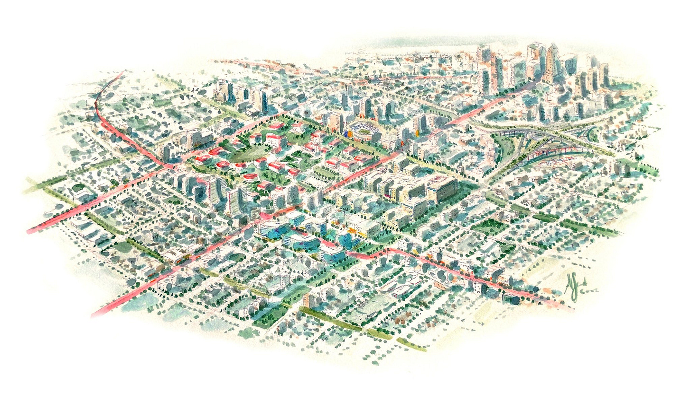
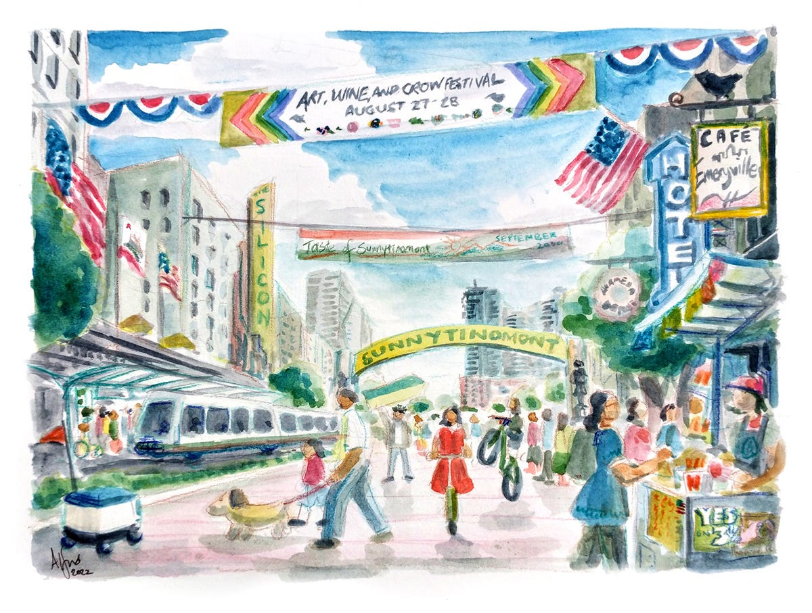
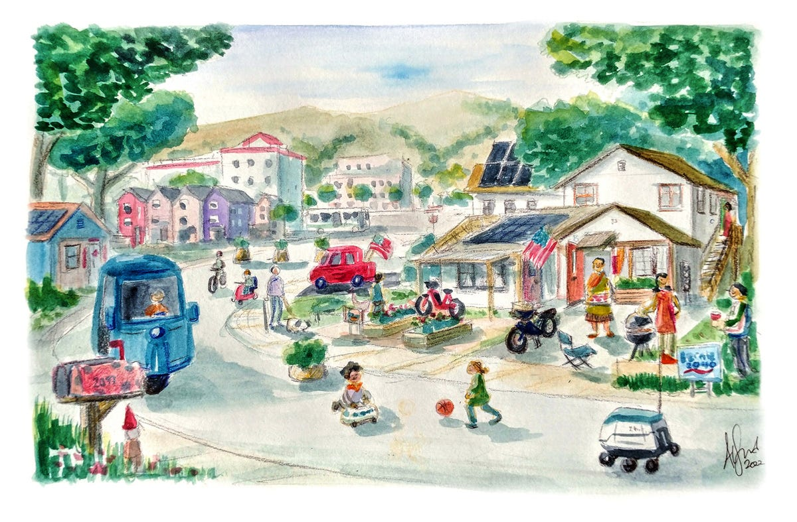

_I’ve always believed that it’s very important to visualize what the city of the future will look like.  
我一直认为，想象未来城市的样子非常重要。  
Our discussions of urbanism tend to focus on the micro details — a specific policy or a specific project — or on vague generalizations like “density”, “displacement”, or “mixed-use development”.  
我们对城市化的讨论往往侧重于微观细节——具体政策或具体项目——或模糊的概括，如“密度”、“置换”或“混合用途开发”。  
But neither of these allows us to imagine the goal we’re working toward — for that, we need a concrete vision.  
但这些都不允许我们想象我们正在努力实现的目标——为此，我们需要一个具体的愿景。_

_Back in 2021 [I wrote a post about some of the people](https://noahpinion.substack.com/p/drawing-pictures-of-cities)  
回到 2021 年，我写了一篇关于一些人的帖子 who are trying to imagine the future of the American city. Among these, the person I’ve taken the most inspiration from is Alfred Twu.  
试图想象美国城市的未来。其中，给我启发最多的人是Alfred Twu。  
An artist and architect who works on housing and transportation projects, Twu is currently a planning commissioner who is running for a seat on the board of AC Transit.  
Twu 是一名从事住房和交通项目的艺术家和建筑师，目前是一名规划专员，正在竞选 AC Transit 的董事会席位。[His website](http://www.alfredtwu.com/) and [Twitter account](https://twitter.com/alfred_twu) are treasure troves of images of what our cities could look like, as well as various other incisive urbanist commentary. So I’m quite happy that Alfred has agreed to write a guest post about the future of the American city.  
他的网站和 Twitter 帐户是我们城市可能是什么样子的图像宝库，以及其他各种敏锐的城市规划评论。所以我很高兴阿尔弗雷德同意写一篇关于美国城市未来的客座文章。_

_Twu’s central thesis is that the future city has to be something we evolve toward — we can’t and won’t tear up and rebuild our cities, so we have to think about how to change them gradually in the direction of something that’s more livable for everyone.  
Twu 的中心论点是，未来的城市必须是我们发展的方向——我们不能也不会撕毁和重建我们的城市，所以我们必须考虑如何逐步改变它们，使其朝着更宜居的方向发展为了每一个。_

What does the city of the future look like in the USA? Let’s take a trip to Any City, USA of the mid 21st century.  
美国的未来城市是什么样的？让我们去21世纪中叶的美国任何城市旅行。  
  With a look at the existing situation, current trends, and recent government policy, let’s take a look at where we’ll work, how we’ll get around, and where and who we’ll live with in the coming decades.   
看看当前的情况、当前的趋势和最近的政府政策，让我们看看未来几十年我们将在哪里工作、我们将如何出行以及我们将在哪里和与谁一起生活。

The city of tomorrow has many familiar streets and sights of the city of today - after all, it’s a remodel, not a rebuild.  
明天的城市有许多熟悉的街道和今天城市的景点——毕竟，这是改造，而不是重建。  
While other countries have the option of building new cities or neighborhoods beyond the edge of existing ones, the US already used up most land within commuting distance in the 20th century on low density suburbs.  
虽然其他国家可以选择在现有城市或社区的边缘之外建设新城市或社区，但美国在 20 世纪已经在低密度郊区用尽了通勤距离内的大部分土地。  
Most of us will live in places that already exist today, but with changes.    
我们大多数人将生活在今天已经存在的地方，但会发生变化。

Healthcare, education, and technology are expected to continue to be among the [fastest growing jobs](https://www.bls.gov/ooh/fastest-growing.htm)  
医疗保健、教育和技术预计将继续成为增长最快的工作岗位 over the next couple of decades, especially when it comes to high paying jobs. Related to this, and also expected to grow, are two other categories of people: students and retirees.  
在接下来的几十年里，尤其是在高薪工作方面。与此相关并预计会增长的还有另外两类人：学生和退休人员。  
  Both those providing and those using education and healthcare services want to be close to colleges and hospitals.  
那些提供和使用教育和医疗服务的人都希望靠近大学和医院。

While high tech / green tech manufacturing will also grow, due to automation the factories themselves are not major employment centers, and due to the massive amounts of space needed, are located outside the city.  
虽然高科技/绿色科技制造业也将增长，但由于自动化，工厂本身并不是主要的就业中心，而且由于需要大量空间，工厂位于城外。

With people changing jobs [on average every four years](https://www.bls.gov/news.release/tenure.nr0.htm), it pays to be close to lots of them. This is one of the biggest feature of living in a city, especially for households with multiple people: you want to be able to change jobs without forcing your family to move.   
由于人们平均每四年换一次工作，因此接近他们中的许多人是值得的。这是生活在城市的最大特点之一，尤其是对于多人家庭：你希望能够在不强迫家人搬家的情况下换工作。This will be especially true for multigenerational households.  [Already making up nearly a quarter of the population](https://www.pewresearch.org/social-trends/2022/03/24/the-demographics-of-multigenerational-households/), multigenerational households as well as other forms of group living are likely to grow in popularity in the future as rising productivity in the rest of the economy makes childcare and home healthcare, which are notoriously hard to automate, much more expensive to hire someone to do.  
对于多代同堂的家庭尤其如此。已经占人口近四分之一的多代家庭以及其他形式的集体生活在未来可能会越来越受欢迎，因为其他经济领域生产力的提高使得儿童保育和家庭医疗保健变得难以实现自动化，请人来做要贵得多。

With online shopping continuing to reduce the amount and size of retail stores, dining and entertainment keeps business districts going.  
随着网上购物不断减少零售店的数量和规模，餐饮和娱乐使商业区得以运转。  
  In the 20th century, malls included food courts to provide a place to eat in between shopping; in the 21st century, the food is the destination itself.  
在 20 世纪，购物中心包括美食广场，为购物者提供用餐场所；在 21 世纪，食物本身就是目的地。  
  Other major anchors for business districts could include public services such as libraries and museums, as well as sports and convention centers.  
商业区的其他主要支柱可能包括公共服务，例如图书馆和博物馆，以及体育和会议中心。

The new heart of many a city is the research university with a medical center. Unlike the office buildings that emptied out after 5pm, colleges and hospitals have activity going on around them into the night and weekends.  
许多城市的新心脏是设有医疗中心的研究型大学。与下午 5 点后清空的办公楼不同，大学和医院周围的活动一直持续到深夜和周末。  
Clustered nearby are a variety of businesses revolving around these hubs, including research spinoffs, entertainment and dining, and health services.  
附近聚集了围绕这些中心的各种业务，包括研究衍生产品、娱乐和餐饮以及医疗服务。

From a distance, the downtown skyline’s boxy office towers are joined by newer, narrower residential towers.  
从远处看，市中心天际线四四方方的办公楼与较新、较窄的住宅楼相连。  
With many office jobs remaining partially or fully remote, downtowns - and the cities that relied on them as a tax base and economic engine - had to reinvent themselves as not just a place to work, but a place to live.  
由于许多办公室工作仍然部分或完全偏远，市中心 - 以及依赖它们作为税收基础和经济引擎的城市 - 不得不将自己重塑为不仅是工作场所，而且是生活场所。

While few commercial buildings are converted into housing - [the layout and plumbing systems are so different between the two types of buildings that it’s expensive](https://sf.streetsblog.org/2022/05/17/spur-talk-convert-offices-to-housing/). Instead, commercial land is converted into residential use, with smaller, obsolete commercial buildings, garages, and parking lots being demolished and replaced by housing.  
虽然很少有商业建筑被改建为住宅 - 两种类型的建筑之间的布局和管道系统差异很大，因此价格昂贵。相反，商业用地被改造成住宅用地，较小、陈旧的商业建筑、车库和停车场被拆除，取而代之的是住房。

Housing production has finally caught up with job growth.  While more places have upzoned to allow apartment buildings in most of the city, the bulk of the new homes are along commercial corridors. Part of it is political.  For example, in California, [SB50](https://sf.curbed.com/2019/5/10/18563360/senate-bill-50-chart-sb50-explainer-housing-transit), a bill to allow mid-rise apartment buildings within walking distance of transit stations, faced massive opposition and failed as it included rezoning of single family house zones.  In contrast, in 2022, a bill that rezoned commercial zones only, [AB2011](https://www.gov.ca.gov/2022/09/28/california-to-build-more-housing-faster/) gained broad support and was signed into law.  
房屋生产终于赶上了就业增长。虽然更多的地方已经升级为允许在城市的大部分地区建造公寓，但大部分新房都位于商业走廊沿线。其中一部分是政治性的。例如，在加利福尼亚州，SB50 法案允许中层公寓楼在公交车站的步行距离内，但遭到了强烈反对，但由于其中包括对单户住宅区的重新分区而失败。相比之下，在 2022 年，一项仅对商业区进行重新分区的法案 AB2011 获得了广泛支持并签署成为法律。

Equally importantly, commercial zones have lots that are large enough to fit the 100+ unit buildings that the US multifamily construction industry is built around.  As slow as zoning changes might feel, finance adapts at an even slower pace.  [Private development is often financed by pension funds, large corporations, and other institutional investors](https://www.jchs.harvard.edu/sites/jchs.harvard.edu/files/apgar_research_brief.pdf) that need an economy of scale.  A mid-rise, 6-story apartment building with 200-300 units takes up a whole block.   
同样重要的是，商业区的地块足够大，可以容纳 100 多栋美国多户住宅建筑业所围绕的单元建筑。尽管分区变化可能感觉很慢，但金融适应的速度甚至更慢。私人开发通常由养老基金、大公司和其他需要规模经济的机构投资者提供资金。一栋200-300套的中高层6层公寓楼，占了整整一个街区。

Highrise buildings use less land, but still require more space than a typical residential house lot.  For example, a single stair highrise has a [floorplate of 7,000+ square feet, while a building with two stairs has floors of 10,000+ square feet](https://letsgola.wordpress.com/2015/02/09/high-rise-codes-housing-affordability-in-los-angeles/)  
高层建筑使用的土地较少，但仍需要比典型住宅用地更多的空间。例如，单层楼梯的高层建筑面积为 7,000 多平方英尺，而两层楼梯的建筑面积为 10,000 多平方英尺.  Since some side and rear yards are also needed for the windows in the back and sides of the building to face into, even for highrise a minimum lot of at least 10,000 to 15,000 square feet is needed.  
.由于建筑物背面和侧面的窗户也需要一些侧院和后院，因此即使是高层建筑也需要至少 10,000 至 15,000 平方英尺的地块。  
  That’s much bigger than a typical house lot, but is about the size of a gas station, convenience store, or other small commercial lot.    
这比典型的住宅大得多，但大约相当于加油站、便利店或其他小型商业地块的大小。

Besides housing, the other big transformation is around transportation. A lot of road infrastructure was sized for everyone driving to downtown office jobs at the same time.  
除了住房，另一大变革是交通。许多道路基础设施的规模适合同时开车去市中心办公室工作的每个人。  
Remote work, flexible schedules, as well as some commuters shifting to electric bikes means a lot of underutilized road space.  Some streets may be converted into greenways or slow streets for bike commuting, and downtown freeways can be removed.    
远程工作、灵活的时间表以及一些通勤者转向电动自行车意味着大量未充分利用的道路空间。一些街道可能会被改造成绿道或慢速街道供自行车上下班，市中心的高速公路也可能会被拆除。

It is unknown when self-driving cars will be widely accepted. However, small delivery robots operating at low speeds raise fewer safety issues and are likely to become a common sight.     
无人驾驶汽车何时会被广泛接受尚不得而知。然而，低速运行的小型送货机器人引起的安全问题较少，并且很可能成为常见的景象。

A potential use for former freeway land is a park that doubles as a flood control channel.  
前高速公路土地的一个潜在用途是一个兼作防洪通道的公园。  
  As for the big interchanges soaring above the neighborhoods at the edge of downtown - like the steel mills of the industrial age, some of the giant freeway interchanges take on a second career as a unique recreation or arts center, a monument from an earlier time.  
至于耸立在市中心边缘社区之上的大型立交桥——例如工业时代的钢铁厂，一些巨大的高速公路立交桥作为独特的娱乐或艺术中心成为了第二职业，成为更早时期的纪念碑。

Note that higher density living does not mean smaller living spaces.  Most people will continue to want big homes - the urban American dream isn’t a studio apartment, but a large townhouse or condo.  Here is an example of an 1,800 square foot, three-bedroom flat.  
请注意，更高密度的生活并不意味着更小的生活空间。大多数人将继续想要大房子——城市美国梦不是单间公寓，而是大型联排别墅或公寓。这是一个 1,800 平方英尺的三居室公寓的示例。  
  For comparison, the median size of a new detached house in 2022 is around 2,500 square feet.  
相比之下，2022 年新建独立屋的中位面积约为 2,500 平方英尺。

This particular example shows a [single-stair building](https://slate.com/business/2021/12/staircases-floor-plan-twitter-housing-apartments.html)  
这个特殊的例子展示了一个单层建筑 - common in most of the world, where two homes on each floor share a stair and elevator.  
\- 在世界大部分地区都很常见，每层楼的两个家庭共用一个楼梯和电梯。  
  In contrast to the hotel-style layout of many US apartment buildings today, where apartments face one side or the other along a long hallway, single stair layouts allow apartments to have windows facing multiple directions, providing cross ventilation and better views.  
与当今许多美国公寓楼的酒店式布局不同，公寓沿着长长的走廊面向一侧或另一侧，单楼梯布局允许公寓的窗户面向多个方向，提供交叉通风和更好的视野。

Higher density living will require a change in the government’s role in homebuilding.  
更高密度的生活需要改变政府在住宅建设中的角色。  
In the past, government spent money building roads and utilities to make suitable lots of land for building cheap houses, which while built by private businesses, relied on the indirect subsidy of government funded infrastructure.  
过去，政府花钱修建道路和公用事业，以腾出合适的土地来建造便宜的房子，而这些房子是由私营企业建造的，依赖于政府资助的基础设施的间接补贴。  
  The new system may involve subsidizing the homes themselves instead, or a  
新系统可能涉及补贴房屋本身，或者[cross-subsidy system such as social housing](https://www.californiasocialhousing.org/), where profits from homes for high income residents cover part of the cost of homes for low income residents in the same building .  
交叉补贴制度，例如社会住房，其中高收入居民住房的利润可以弥补同一栋楼内低收入居民住房的部分成本。

For most places, especially on side streets and in neighborhoods that are currently just houses, change will be incremental. A street becomes a playground with the addition of a few planters at each end.  
对于大多数地方，尤其是小巷和目前只有房屋的社区，变化将是渐进的。一条街道变成了游乐场，每端都增加了几个花盆。  
A garage is remodeled into an accessory dwelling unit, adding a second family to a home - or perhaps a small business. While many families might keep a full size car for trips outside the city, a golf-cart sized  
一个车库被改造成了一个附属的住宅单元，为一个家庭增加了第二个家庭——或者可能是一个小企业。虽然许多家庭可能会为出城旅行保留一辆全尺寸汽车，但一辆高尔夫球车大小[neighborhood vehicle](https://en.wikipedia.org/wiki/Neighborhood_Electric_Vehicle) or electric bike replaces the second car.  
附近的车辆或电动自行车取代了第二辆车。

Besides the changes to the physical environment, the people in US cities also change. Mixed race families are a growing part of the population, and we’re also seeing a wider range of living arrangements, from multigenerational families to groups of friends living together.  
除了物理环境的变化，美国城市中的人也在发生变化。混血家庭在人口中的比例越来越大，我们也看到了更广泛的生活安排，从多代家庭到一群朋友住在一起。  
  Variety, diversity, and flexibility will be a big part of the US city of the future. This might be the most important and lasting change of all.  
多样性、多样性和灵活性将成为美国未来城市的重要组成部分。这可能是所有变化中最重要和最持久的变化。

Of course, the scenes described above are not an end condition that will remain static, but rather, simply a snapshot in time of a society that remains on the move.  
当然，上述场景并不是一成不变的终结条件，而只是一个仍在移动的社会的时间快照。  
From trolleys to Art Deco, many things in the US have made the journey within a lifetime from being cutting edge symbols of modernity to being well-loved landmarks from an earlier time.  
从手推车到装饰艺术风格，美国的许多事物都在一生中完成了从现代性的尖端象征到早期深受喜爱的地标的旅程。  
Technology, our economy, lifestyle, and cities will continue to change, and what is futuristic today will be a further future’s historic neighborhood.  
技术、我们的经济、生活方式和城市将继续发生变化，今天的未来主义将成为更远未来的历史街区。
