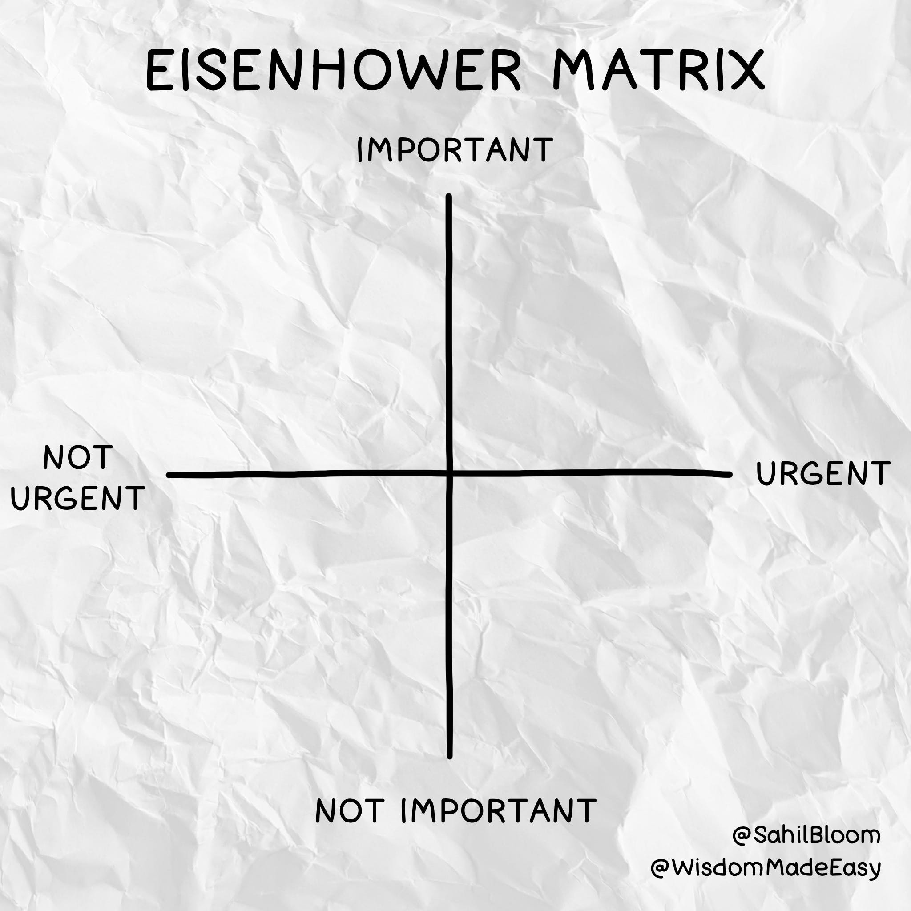
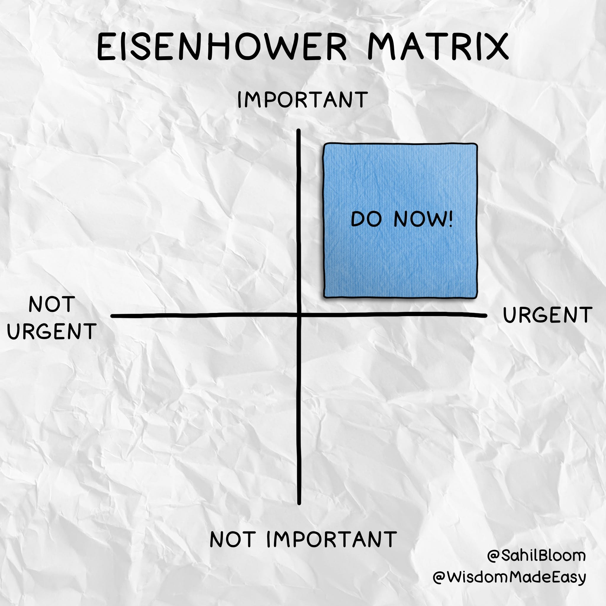
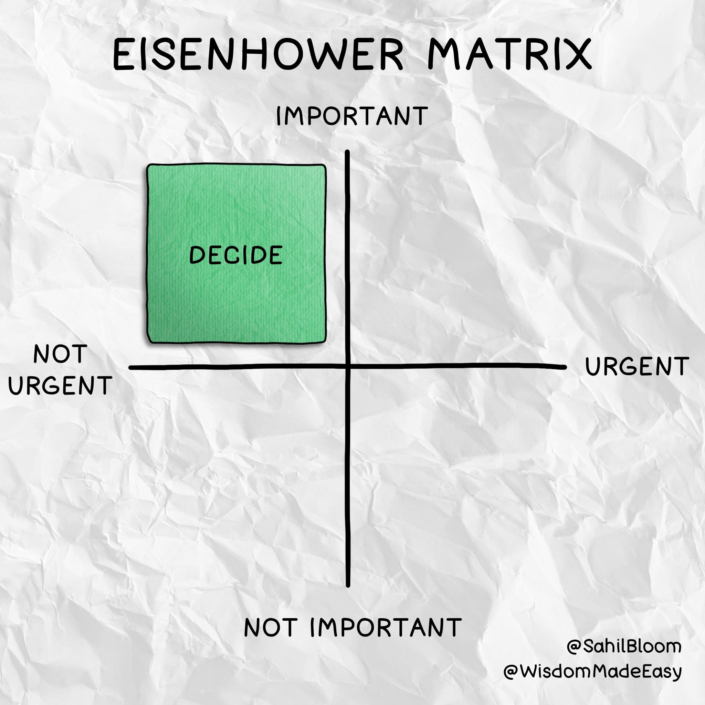
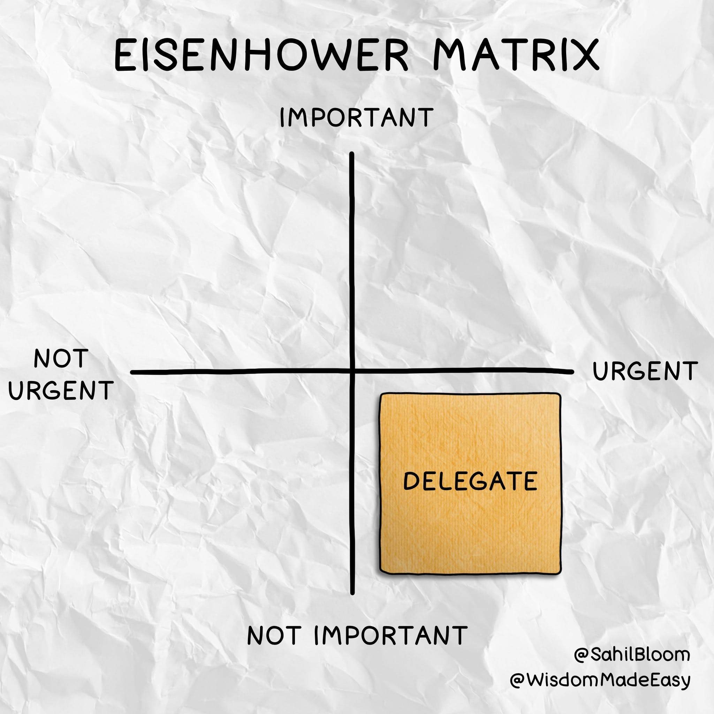
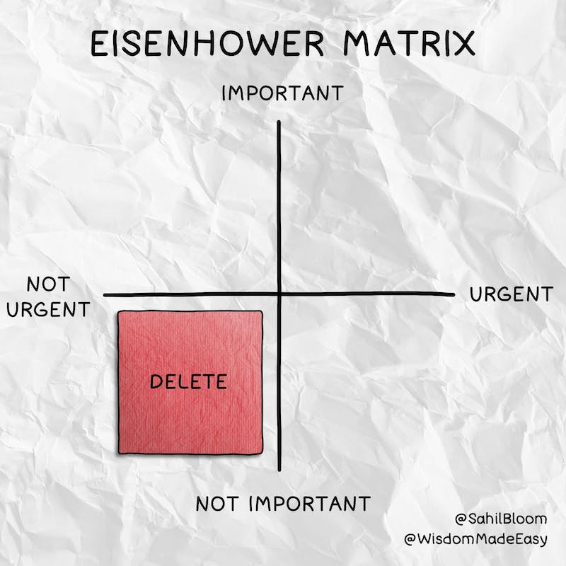
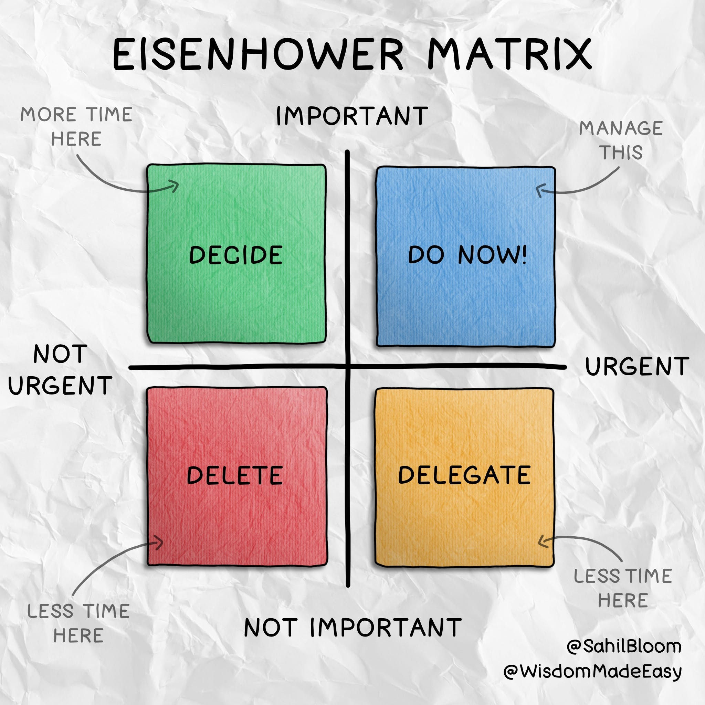

_Photo by_ [_Adam Bouse_](https://unsplash.com/ko/@adambouse?utm_source=unsplash&utm_medium=referral&utm_content=creditCopyText)__  
亚当·布斯摄

Here's a common scene: 这是一个常见的场景：

It's Monday morning and although the week just started, you're already scrambling from task to task, moving from one stress-inducing fire to the next. It feels like the minute one fire is out, another one is sparked.  
现在是星期一早上，虽然一周才刚刚开始，但您已经在一项又一项任务中手忙脚乱，从一个引发压力的大火转移到下一个。感觉就像一团火熄灭的那一刻，另一团又被点燃了。  
By noon, you're well aware that the week is going to be yet another energy-draining fight to survive.  
到中午时分，你很清楚这一周将是另一场为生存而耗费精力的战斗。

Friday comes around and despite the hours you logged, it’s hard to point to any substantive progress. There was a lot of movement, but no forward progress—a “rocking horse” week, if you will.  
周五到了，尽管你记录了几个小时，但很难指出任何实质性进展。有很多动作，但没有前进的进展——如果你愿意的话，这是一个“摇马”周。

If this sent a little chill down your spine, you're not alone. Trust me, I've been there.  
如果这让您脊背发凉，那么您并不孤单。相信我，我去过那里。

Here's the simple, powerful tool that helped me focus my energy and escape.  
这是帮助我集中精力逃脱的简单而强大的工具。

## Separating Urgent & Important 区分紧急和重要

President Dwight D. Eisenhower—or Ike as his friends called him—was an American military officer and politician born in Denison, Texas in 1890.  
德怀特·D·艾森豪威尔总统——他的朋友们都这么叫他艾克——是一位美国军官和政治家，1890 年出生于得克萨斯州的丹尼森。

His list of personal and professional accolades is long:  
他的个人和专业荣誉名单很长：

-   The West Point graduate rose through the ranks of the military to achieve the 5-star rank of general in the United States Army.  
    这位西点军校毕业生在军队中晋升为美国陆军五星级将军。
-   During World War II, he served as Supreme Commander of the Allied Expeditionary Force in Europe and led the famed invasion of Normandy from the Western Front.  
    第二次世界大战期间，他担任欧洲盟军远征军最高指挥官，并领导了著名的诺曼底西线入侵行动。
-   Eisenhower served as President of Columbia University and the first Supreme Commander of NATO before being elected as the 34th President of the United States, a role he occupied from 1953 to 1961.  
    Eisenhower served as President of Columbia University and the first Supreme Commander of NATO before being elected as the 34th President of the United States, a role he occupied from 1953 to 1961.

As his military and civilian accomplishments indicate, Eisenhower was a highly-effective leader and executive. He became known for his prolific, almost otherworldly productivity.  
正如他的军事和文职成就所表明的那样，艾森豪威尔是一位高效的领导者和执行官。他以其多产的、几乎超凡脱俗的生产力而闻名。

His secret: He never confused the urgent with the important.  
他的秘诀是：他从不混淆紧急与重要。

"What is important is seldom urgent and what is urgent is seldom important." - Dwight D. Eisenhower  
“重要的事情很少是紧急的，紧急的事情很少是重要的。” - 德怀特·D·艾森豪威尔

We can define the two terms as follows (hat tip to [Brett McKay](https://twitter.com/brettmckay)):  
我们可以如下定义这两个术语（向 Brett McKay 致敬）：

-   URGENT: A task that requires immediate attention to complete.  
    紧急：需要立即关注才能完成的任务。
-   IMPORTANT: A task that contributes to your long-term mission, values, or goals.  
    重要提示：一项有助于您的长期使命、价值观或目标的任务。

With this separation and grounding, let's walk through the tool: The Eisenhower Matrix.  
有了这种分离和基础，让我们来看看这个工具：艾森豪威尔矩阵。

## The Eisenhower Matrix 艾森豪威尔矩阵

The Eisenhower Matrix is a visualization tool that forces you to differentiate between the urgent and the important in order to prioritize and manage your time more effectively.  
艾森豪威尔矩阵是一种可视化工具，可迫使您区分紧急事项和重要事项，以便更有效地确定时间的优先级和管理时间。

The matrix was popularized by Stephen R. Covey in his famous [7 Habits of Highly Effective People](https://www.amazon.com/Habits-Highly-Effective-People-Powerful/dp/0743269519/ref=tmm_pap_swatch_0?_encoding=UTF8&qid=&sr=).  
该矩阵由 Stephen R. Covey 在其著名的《高效能人士的 7 个习惯》中推广。

Here’s how the 2x2 matrix works:  
2x2 矩阵的工作原理如下：

-   X-Axis: Not Urgent to Urgent X 轴：不紧急到紧急
-   Y-Axis: Not Important to Important  
    Y 轴：不重要到重要

Visualizations by [Wisdom Made Easy](https://wisdommadeeasy.com/)  
Wisdom Made Easy 的可视化

The four quadrants of the 2x2 to consider:  
要考虑的 2x2 的四个象限：

-   Important & Urgent 重要且紧急
-   Important & Not Urgent 重要不紧急
-   Not Important & Urgent 不重要不紧急
-   Not Important & Not Urgent 不重要也不紧急

Let's walk through each one and how to use it:  
让我们来看看每一个以及如何使用它：

### Important & Urgent 重要且紧急

These are tasks that require immediate, focused attention—but also contribute to your long-term mission or goals.  
这些任务需要立即集中注意力，但也有助于您的长期使命或目标。

These are "Do Now!" tasks. 这些是“现在就做！”任务。

Goal: In the short-term, you want to handle these immediately, but in the long-term, you want to manage the important tasks such that they rarely become urgent.  
目标：短期内，您希望立即处理这些任务，但从长远来看，您希望管理重要任务，使它们很少变得紧急。

_Sahil Note: Life gets much less stressful when you realize that \*URGENT\* is very rarely that urgent. Fake Urgency often pulls you away from Real Importance. It has a doubly-damning effect.  
Sahil 注：当您意识到\*紧急\*很少那么紧急时，生活的压力就会大大减轻。虚假的紧迫感常常让你远离真正的重要性。它具有双重诅咒效果。_

### Important & Not Urgent 重要不紧急

These tasks are your compounders—they build long-term value in your life.  
这些任务是你的复合器——它们在你的生活中建立长期价值。

These are "Decide" tasks, as you can strategize and schedule when to focus on them.  
这些是“决定”任务，因为您可以制定战略并安排何时关注它们。

Goal: Spend more time on these tasks—plan the time to do deep work here. In the long-term, this is where you should try to spend most of your time and energy.  
目标：花更多时间在这些任务上——计划时间在这里做深度工作。从长远来看，这是你应该尝试花费大部分时间和精力的地方。

### Not Important & Urgent 不重要不紧急

These tasks are the "beware" category—they can drain time and energy without contributing to your long-term goals or vision.  
这些任务属于“当心”类别——它们会耗费时间和精力，而无助于您的长期目标或愿景。

These are "Delegate" tasks. 这些是“委托”任务。

Goal: Spend less time here and slowly try to build systems that allow you to delegate these tasks to people for whom they will be important.  
目标：在这里花更少的时间，慢慢地尝试构建允许您将这些任务委派给对他们很重要的人的系统。

### Not Important & Not Urgent 不重要也不紧急

These are the time wasting tasks and activities that drain your energy and sap your productivity.  
这些是浪费时间的任务和活动，会耗尽您的精力并降低您的工作效率。

These are "Delete" tasks. 这些是“删除”任务。

Goal: Spend less time here. 目标：在这里花更少的时间。

_Sahil Note: It’s tempting to classify all "leisure" activities like relaxing and watching TV into this quadrant, but if these activities help you recharge, they may actually be important.  
Sahil 注：将放松和看电视等所有“休闲”活动归类到这个象限很诱人，但如果这些活动能帮助你充电，它们实际上可能很重要。  
For example, I would consider our evening TV ritual to be an important part of my wife and my relationship. It's a simple way that we recharge together. Think carefully before deleting tasks that may be helping you reset.  
例如，我会认为我们晚上看电视的仪式是我和我妻子关系的重要组成部分。这是我们一起充电的简单方法。在删除可能帮助您重置的任务之前，请仔细考虑。_

## Putting It All Together 把它们放在一起

The Eisenhower Matrix is a powerful productivity tool on two levels:  
艾森豪威尔矩阵在两个层面上是一个强大的生产力工具：

1.  In the present, it helps you organize and prioritize your tasks and time. If you're feeling overwhelmed, it creates a forced slowdown that will allow you to zoom out and assess where you should be spending your time.  
    目前，它可以帮助您组织任务和时间并确定其优先级。如果您感到不知所措，它会造成强制减速，让您缩小范围并评估您应该花时间的地方。
2.  In the long-term, it teaches you to focus on the important and avoid the (largely) unnecessary urgency that fills our days.  
    从长远来看，它教会你专注于重要的事情，避免充斥我们生活的（大部分）不必要的紧迫感。

The Ultimate Goal: Spend most of your time on the important tasks that contribute to your long-term mission, values, or goals.  
终极目标：将大部分时间花在有助于实现长期使命、价值观或目标的重要任务上。

To summarize the takeaways: 总结要点：

-   Manage the top-right 管理右上角
-   Spend most of your time in the top-left  
    大部分时间都在左上角
-   Spend less time in the bottom half  
    花更少的时间在下半场

I write a lot about productivity, but I have never found a single tool that is more useful than the Eisenhower Matrix. I find myself turning to it regularly, especially when I have a lot on my plate and need to reset my focus.  
我写了很多关于生产力的文章，但我从来没有找到比艾森豪威尔矩阵更有用的工具。我发现自己经常转向它，尤其是当我有很多事情要做并且需要重新调整我的注意力时。
