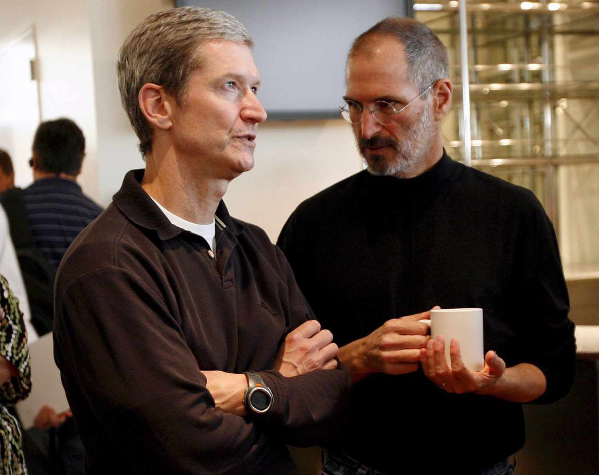

-   

Dec 21, 2022 • 8 min read  
2022 年 12 月 21 日 • 8 分钟阅读

Tim Cook and Steve Jobs. Original photo by Monica M Davey for Shutterstock  
蒂姆库克和史蒂夫乔布斯。 Monica M Davey 为 Shutterstock 拍摄的原始照片

[The end of the heroic age of the tech giants](https://amazonchronicles.ghost.io/amazons-heroic-phase/) _does not_ imply that tech giants are in decline, but confusing the two is natural. Observers and analysts usually talk that way about companies, especially tech companies and the platforms they enable: they grow, mature, then decline (in relevance if not in revenue).  
科技巨头英雄时代的结束并不意味着科技巨头正在衰落，但混淆两者是很自然的。观察家和分析师通常以这种方式谈论公司，尤其是科技公司及其支持的平台：它们成长、成熟，然后衰退（如果不是收入，则相关）。

In general, what characterizes this phase of the tech giants' development is a shift from unlocking user creativity and customer value to doubling down on surveillance, usually augmented by AI.  
总的来说，科技巨头发展的这一阶段的特点是从释放用户创造力和客户价值转向加倍监控，通常由 AI 增强。  
Mass surveillance was always an important emergent part of the tech giants’ strategy, but was arguably secondary to delighting users and giving them greater capabilities. Now surveillance and nonhuman solutions are dominant, and the creative possibilities are now almost all residual.  
大规模监控一直是科技巨头战略中一个重要的新兴部分，但可以说是次要的，以取悦用户并赋予他们更大的能力。现在监视和非人类解决方案占主导地位，创造性的可能性现在几乎都剩下了。

(Yes, [this "emergent/dominant/residual" schema is a Raymond Williams reference](https://theoria.art-zoo.com/dominant-residual-and-emergent-raymond-williams/).)  
（是的，这个“紧急/显性/残留”模式是雷蒙德·威廉姆斯的参考。）

The stock market is one measure of growth and decline, and it's fair to say the stock market is worried about Big Tech. Last month, [The New York Times wrote about tech losses and their drag on the overall stock market](https://www.nytimes.com/2022/11/10/business/tech-meta-apple-tesla-stocks.html):  
股市是衡量增长和衰退的一个指标，可以说股市对大型科技公司感到担忧。上个月，纽约时报报道了科技股的损失及其对整个股市的拖累：

> Everybody with broad stock market holdings owns tech stocks, and those accounted for most of the market’s gains last year. But now, tech-stock declines have pulled down the overall market.  
> 每个持有大量股票的人都持有科技股，这些股票占了去年市场涨幅的大部分。但现在，科技股的下跌拉低了整个市场。  
> The information technology sector alone — which includes Apple, Alphabet, Microsoft and Nvidia — accounted for 44 percent of the decline of the entire S&P 500 this year through October. But that understates tech’s negative impact on the market this year.  
> 仅信息技术板块——包括苹果、Alphabet、_微软_和英伟达——就占今年截至 10 月整个标准普尔 500 指数跌幅的 44%。但这低估了今年科技对市场的负面影响。

> Meta, Alphabet and Netflix are classified in the S&P 500 as communications services stocks; Amazon, Uber and Tesla are in the consumer discretionary category. Each is unique, but in common parlance, they are all tech stocks, and when you include everything [that fits](https://www.nytimes.com/2016/08/07/your-money/when-every-company-is-a-tech-company-does-the-label-matter.html) under this expansive rubric, you will have enumerated nearly all of the stock market’s losses.  
> Meta、Alphabet 和 Netflix 在标准普尔 500 指数中被归类为通信服务股；亚马逊、优步和特斯拉属于非必需消费品类别。每一只都是独一无二的，但用通俗的话说，它们都是科技股，当你把符合这个广泛标准的所有东西都包括在内时，你就会列举出几乎所有的股市损失。

A year ago, Amazon was worth the equivalent of $170.32 per share; as of December 20, 2022, it's worth $85.19 per share, slashing its market capitalization almost exactly in half. Meta, Tesla, and Netflix have fared worse; Apple has done a fair bit better, but is still down 23.52% year-over-year.  
一年前，亚马逊的市值相当于每股 170.32 美元；截至 2022 年 12 月 20 日，其每股价值为 85.19 美元，市值几乎减半。 Meta、Tesla 和 Netflix 的情况更糟；苹果的表现要好一些，但仍同比下降 23.52%。

The downturn in the tech market is partly driven by general concerns about the economy and projections that most consumers will cut inessential and high-price purchases (or anything requiring access to cheap credit) first. Many investors are also specifically skeptical about streaming media, _VR_, and digital advertising. Tech companies that went through the stratosphere two years ago are coming back to Earth as more investors see their pandemic growth curve as _accelerated_ rather than _accelerating_. No more easy digital gains, no longer a firm conviction that tech companies will eat everyone else's lunch — these companies are what they are. If you're a growth investor, that's hard to swallow.  
科技市场的低迷部分是由于对经济的普遍担忧以及大多数消费者将首先减少不必要和高价购买（或任何需要获得廉价信贷的东西）的预测。许多投资者还特别怀疑流媒体、虚拟现实和数字广告。两年前经历过平流层的科技公司正在重返地球，因为越来越多的投资者认为他们的流行病增长曲线正在加速而不是加速。不再容易获得数字收益，不再坚信科技公司会吃掉其他人的午餐——这些公司就是它们。如果您是成长型投资者，那将很难接受。

I think the tech giants' current stock troubles _influence_ the end of their heroic phase without being _identical_ to it. The stock market influences companies in two ways: it creates incentives or disincentives for investors, and in turn does the same for executives, whose wealth is typically bound up in their stock holdings and options.  
我认为科技巨头目前的股票问题影响了他们英雄阶段的结束，但并不等同于它。股票市场以两种方式影响公司：它对投资者产生激励或抑制作用，反过来对高管也有同样的作用，他们的财富通常与股票持有量和期权密切相关。

The market is no longer rewarding potential growth, reinvesting in research and development, hiring lots of employees, or acquiring smaller companies, so companies and their executives are much less inclined to pursue any of those.  
市场不再奖励潜在增长、再投资于研发、雇用大量员工或收购较小的公司，因此公司及其高管不太愿意追求任何这些。  
Instead of accelerating growth, we're seeing accelerated attempts to manage or ward off decline, where decline is much more narrowly construed as a loss of profits and revenue, rather than market share, user relevance, or technological innovation.  
我们看到的不是加速增长，而是加速尝试管理或避免衰退，其中衰退被更狭义地解释为利润和收入的损失，而不是市场份额、用户相关性或技术创新。

Companies — and here again, Amazon is a prime example — would rather keep up their profits and share prices than sacrificing either to be seen as a leader in customer satisfaction or technical expertise.  
公司——在这里，亚马逊再次成为一个典型的例子——宁愿保持利润和股价，也不愿牺牲被视为客户满意度或技术专长方面的领导者。  
In its first decade, Amazon focused almost exclusively on serving its customers, and in its second, fought hard for a place among the other tech giants like Microsoft, Apple, and Google, competing with them for hires, customers, and in the public consciousness.  
在第一个十年里，亚马逊几乎完全专注于为客户服务，在第二个十年里，亚马逊努力在_微软_、苹果和谷歌等其他科技巨头中争取一席之地，与他们争夺员工、客户和公众意识.  
Taken together, we can think of the first twenty-five or so years of Amazon as the company's heroic phase.  
总而言之，我们可以将亚马逊的头二十五年左右视为公司的英雄阶段。

Throughout those twenty-five years, the stock market rewarded Amazon's behavior with high share prices even when its profits were low (partly through artful accounting and partly through continual reinvestment in more hires, more markets, more infrastructure).  
在这 25 年中，股票市场以高股价回报了亚马逊的行为，即使它的利润很低（部分是通过巧妙的会计处理，部分是通过持续再投资更多的员工、更多的市场、更多的基础设施）。  
Now, those market rewards are gone, and Amazon is correspondingly entering a different phase in the company's history.  
现在，那些市场回报已经不复存在，亚马逊相应地进入了公司历史上的一个不同阶段。

These market dynamics are not unique to Amazon. The same pressures are affecting the entire sector.  
这些市场动态并非亚马逊独有。同样的压力正在影响整个行业。

The other way you can think about the tech giants' decline is by studying its customer products themselves. As an exercise (why not?), let me give a deliberately one-sided, polarized and polarizing account of where the tech giants stand today.  
思考科技巨头衰落的另一种方式是研究其客户产品本身。作为练习（为什么不呢？），让我故意片面、两极分化地说明科技巨头今天所处的位置。

You want to talk some shit? Let's talk some shit!  
你想说些废话吗？说点废话吧！

Google/Alphabet haven't come up with a new signature product in years. Their heroic phase peaked with Gmail and Google Maps; in retrospect, Google Books signaled both the height and the necessary limit of their ambitions to index and make available all the world's knowledge.  
Google/Alphabet 已经很多年没有推出新的标志性产品了。他们的英雄阶段在 Gmail 和谷歌地图上达到顶峰；回想起来，Google Books 标志着他们索引和提供全世界知识的雄心壮志的高度和必要的限制。  
Jokes about the company's willingness to launch and then abandon new messaging products every few years reveal a culture that's given itself over to internal power politics, where engineers and team leaders get credit (and promotions) for launching new products but not making them work better once they've launched.  
关于公司愿意每隔几年推出然后放弃新消息产品的笑话揭示了一种内部权力政治的文化，在这种文化中，工程师和团队领导因推出新产品而获得荣誉（和晋升），但并没有使它们一次变得更好他们已经发射了。

The other read on Google is that they actually have been developing new products, especially in AI, for their own internal use, but are caught in a Microsoft-sized strategy tax where they can't risk their reputation and gazillions in ad revenue by introducing these internal products to the public.  
谷歌的另一则报道是，他们实际上一直在开发新产品，尤其是在人工智能方面，供自己内部使用，但陷入了_微软_规模的战略税中，他们无法通过引入来冒着声誉和巨额广告收入的风险这些内部产品向公众开放。  
Ten years ago, Google/Alphabet had such a reputation for solving intractable problems that people talked seriously if misguidedly about the company ["saving" cites like my hometown Detroit](https://www.quora.com/Can-Google-save-Detroit-somehow) — a process that's repeated itself with nearly all the tech giants, [including Amazon](https://amazonchronicles.ghost.io/pennies-to-dollars-the-problems-with-amazon-s-plans-for-detroit/).  
十年前，谷歌/Alphabet 在解决棘手问题方面享有盛誉，以至于人们严肃地谈论该公司是否被误导地“拯救”了像我的家乡底特律这样的城市——几乎所有科技巨头都在重复这个过程，包括亚马逊。

Now, it's unclear whether Alphabet can even save itself. Even in its core business, Google has given up on offering the best, most relevant search results in favor of shilling its own products.  
现在，Alphabet 能否自救尚不清楚。即使在其核心业务中，谷歌也放弃了提供最好、最相关的搜索结果，转而支持自家产品。  
Insofar as it's still engaged with the world, it's much less interested in offering up new or better consumer products than it is working to spread its surveillance machinery all over the globe. (ProPublica recently published a particularly grisly example of this, with [Alphabet trying to gain access to, digitize, and use AI to analyze a DoD-owned archive of dead soldiers' tissue samples and DNA](https://www.propublica.org/article/google-human-tissue-jpc-military).)  
就它仍然与世界接轨而言，它对提供新的或更好的消费产品的兴趣远不如它致力于在全球范围内推广其监控机器。 （ProPublica 最近发布了一个特别可怕的例子，Alphabet 试图访问、数字化和使用 AI 来分析国防部拥有的阵亡士兵组织样本和 DNA 档案。）

Mass surveillance is one way around diminishing customer returns, but Facebook/Meta has discovered limits to this strategy. Apple threw up a wall around Facebook’s ability to hoover up data, and the business is still reeling.  
大规模监控是减少客户回报的一种方式，但 Facebook/Meta 发现了这种策略的局限性。 Apple 为 Facebook 收集数据的能力设置了一堵墙，而该业务仍在摇摇欲坠。  
Zuckerberg's company is looking for an escape hatch with virtual reality,but _VR_ has yet to find traction and may never do so in Facebook’s vision of it.  
扎克伯格的公司正在寻找虚拟现实的出口，但 _VR_ 尚未找到牵引力，而且在 Facebook 的愿景中可能永远不会出现。

A year ago, [Ben Thompson at Stratechery wrote an article](https://stratechery.com/2021/microsoft-and-the-metaverse/) arguing that Microsoft, not Meta, was best positioned to take advantage of _VR_. I still think about this post a lot, especially its (surprisingly persuasive!) contention that the most compelling use case for _VR_ is probably remote office work. I won't lie; it reminds me of the Simpsons joke about the [Yard Work Simulator](https://youtu.be/0g4SCdox_pI). Sometimes I wish cyberpunk had been a more specific warning manual.  
一年前，Stratechery 的本·汤普森 (Ben Thompson) 写了一篇文章，认为_微软_而非 Meta 最有可能利用 _VR_。我仍然经常想起这篇文章，尤其是它（令人惊讶的有说服力！）的论点，即 _VR_ 最引人注目的用例可能是远程办公室工作。我不会说谎；它让我想起了辛普森一家关于庭院工作模拟器的笑话。有时我希望赛博朋克是一本更具体的警告手册。

Still, it's much better to be in Meta's position, with social apps that people enjoy using, than Twitter's.  
不过，处于 Meta 的位置，拥有人们喜欢使用的社交应用程序，比 Twitter 的要好得多。

Let's be clear: Twitter was in trouble long before Elon Musk bought it. That's why he was in a position to buy it, why founder Jack Dorsey endorsed Musk's purchase, and why its board members sued to enforce the sale at the inflated price Musk offered.  
让我们明确一点：在埃隆·马斯克 (Elon Musk) 收购之前很久，Twitter 就陷入了困境。这就是为什么他有能力购买它，为什么创始人杰克多尔西支持马斯克的购买，以及为什么其董事会成员起诉以马斯克提供的虚高价格强制执行出售。

But today — wow! Twitter is a garbage fire, forced by its own disastrous prospects to sell itself to a man with no positive vision for it, who either bought the company on a whim or with the goal of remaking it in his own twisted image, then immediately recanted and tried to get out of the deal.  
但是今天——哇！ Twitter 是一场垃圾大火，迫于自身灾难性的前景，将自己卖给了一个对它没有积极愿景的人，这个人要么一时兴起买下了这家公司，要么目的是按照自己的扭曲形象重塑它，然后立即放弃并试图摆脱这笔交易。  
Musk and his cronies are now stripping Twitter to the bone, while also skullfucking its most desirable users. They are welcoming trolls, bullies, and actual Nazis back on the platform. Meanwhile, users and advertisers flee what appears to be the pettiest midlife crisis in human history.  
马斯克和他的亲信现在正在将 Twitter 剥离得一干二净，同时也在对最理想的用户进行脑残。他们欢迎巨魔、恶霸和真正的纳粹分子回到平台上。与此同时，用户和广告商逃离了这场看似人类历史上最微不足道的中年危机。

We’re a long way from the social media network that helped bring the Arab Spring and Black Lives Matter to the world. Even if the "heroic phase" of Twitter was always overstated, the company as currently run is designed to extinguish whatever liberatory potential it may have once shown.  
我们距离帮助将“阿拉伯之春”和“黑人的命也是命”推向世界的社交媒体网络还有很长的路要走。即使 Twitter 的“英雄阶段”总是被夸大，但目前运营的公司旨在消除它曾经表现出的任何解放潜力。  
If there's a point to Musk's actions beyond his own incompetence and ideological blinders, it might be to salt the earth so nothing like Twitter can ever grow again. (And no, Musk stepping down as CEO, if and when that happens, doesn't change any of this.)  
如果马斯克的行为除了他自己的无能和意识形态盲点之外还有其他意义的话，那可能就是在地球上撒盐，这样推特之类的东西就再也无法增长了。 （不，马斯克辞去首席执行官一职，如果发生这种情况，也不会改变这一切。）

With Twitter, Meta, and YouTube, we're touching the joint businesses of media and tech.  
通过 Twitter、Meta 和 YouTube，我们正在触及媒体和技术的联合业务。  
Tech companies’ dream of becoming the new Hollywood (and old Hollywood’s dreams of retaking the lead in tech) have been brutally beaten back, as market growth is taking a back seat to cost-cutting and a new focus on profitability.  
科技公司成为新好莱坞的梦想（以及旧好莱坞重新夺回科技领先地位的梦想）遭到了残酷的打击，因为市场增长正在让位于削减成本和重新关注盈利能力。  
Netflix, Prime, Spotify, and other studios are all realizing you can’t count on big budgets and global markets to deliver profit-making hits.  
Netflix、Prime、Spotify 和其他工作室都意识到您不能指望大预算和全球市场来提供盈利的点击。

We're waking up from several dreams about tech and media, all at once: the dream of global scale, the dream of a fundamental reshaping of the entertainment business, the dream of serving the longest tail of users, and the dream that tech companies with their troves of data could know better than blinkered studio executives.  
我们同时从关于技术和媒体的几个梦想中醒来：全球规模的梦想、从根本上重塑娱乐业的梦想、服务最长尾巴用户的梦想，以及科技公司的梦想。凭借他们的大量数据，他们可能比狭隘的工作室高管更清楚。  
But first, the artists and technicians who signed onto these projects are the hardest hit, losing jobs, losing residual revenue, losing bargaining power.  
但首先，签约这些项目的艺术家和技术人员受到的打击最大，他们失去了工作，失去了剩余收入，失去了议价能力。

Meanwhile, the whole world of user-created content is fragmenting audiences, even as it mines their choices to feed the algorithm. If you're a creator, you’re only as good as your latest viral craze, which might not even reach most of your users.  
与此同时，整个用户创建内容的世界正在分散观众，即使它挖掘他们的选择来喂养算法。如果您是一名创作者，那么您的实力取决于最新的病毒式传播热潮，而这甚至可能无法触及您的大多数用户。  
Creators are increasingly asking for a slice of the pie. User-created video (and podcasts, and _newsletter_s) doesn't have to be a utopia to be a still-growing field that’s worth watching.  
创作者越来越多地要求分一杯羹。用户创建的视频（以及播客和时事通讯）不一定是乌托邦，也能成为一个值得关注的仍在发展的领域。

Even Apple and Microsoft, who brought computing into the home and then out into the streets, are circling the wagons, refining their products but not shifting paradigms. (Try explaining the value of rewriting the OS for _AR_M-based chipsets versus pointing to an iPhone.) Sure, they're still making technical innovations, and yes, comparatively, they’re welcoming shores in a sea of instability.  
即使是将计算技术带入家庭然后又走上街头的苹果和_微软_，也在绕着马车转，改进他们的产品，但没有改变范式。 （尝试解释为基于 _AR_M 的芯片组重写操作系统与指向 iPhone 相比的价值。）当然，他们仍在进行技术创新，而且是的，相对而言，他们在不稳定的海洋中欢迎海岸。  
But ultimately, despite their good stewardship, Apple and Microsoft are just as flat-footed in the face of a looming recession and changing consumer behavior as anyone else.  
但最终，尽管苹果和_微软_管理得当，但面对迫在眉睫的经济衰退和不断变化的消费者行为，苹果和_微软_与其他任何人一样措手不及。

___

Across the board, layoffs and hiring freezes have everyone scared. People don’t want to move jobs. Young graduates are going unhired. Companies aren’t getting the new talent they need to replenish their burned-out, checked-out, or ready-to-move-on-to-the-next-big-thing workers.  
总体而言，裁员和招聘冻结让每个人都感到害怕。人们不想换工作。年轻的毕业生正在失业。公司没有得到他们需要的新人才来补充他们精疲力竭、离职或准备跳槽到下一件大事的员工。  
A stuck-in-place, aging, threatened, and opinionated workforce is a prime target for unionization. In my opinion, this would be a welcome development, but from the tech giants’ perspective, it would be a total disaster.  
停滞不前、老龄化、受到威胁和固执己见的劳动力是工会化的主要目标。在我看来，这将是一个可喜的发展，但从科技巨头的角度来看，这将是一场彻头彻尾的灾难。

What happens when engineers stop thinking of their interests as fundamentally aligned with the companies' owners and management, and develop their own class consciousness?  
如果工程师不再认为他们的利益与公司的所有者和管理层在根本上是一致的，而是发展他们自己的阶级意识，会发生什么？  
Tech companies are not pursuing automation purely out of intellectual interest; they are trying to solve looming labor problems that can no longer be ignored.  
科技公司并非纯粹出于智力兴趣而追求自动化；他们正在努力解决迫在眉睫的、无法再被忽视的劳工问题。

All of this is the backdrop for these companies moving away from human customers and human workers, towards AI solutions, invisible infrastructure, and business, government, or military contracts.  
所有这些都是这些公司从人类客户和人类工人转向人工智能解决方案、无形基础设施以及商业、政府或军事合同的背景。  
The ideal for a tech company in 2023 is either docile humans ready to consume what they've been given, or better still, no humans at all.  
2023 年科技公司的理想状态是要么温顺的人类准备好消费他们所得到的东西，要么更好的是，根本没有人类。

Both of these declines — the decline of the consumer experience and the decline of the market forecasts — are driving tech companies' retreat from what I'm calling their heroic phase. But neither are identical to it.  
这两种下降——消费者体验的下降和市场预测的下降——正在推动科技公司从我所说的英雄阶段撤退。但两者都不相同。

We can imagine — in fact, I predict — that these companies' stock prices will rebound along with the rest of the market. Their profits will soar — the newfound emphasis on profits rather than reinvestment _demands_ that they soar. Their technical innovations will continue, especially in AI, automation, and cloud computing. And yes, customers from you and me to the DoD will continue to shop for, use, and stream their products.  
我们可以想象——事实上，我预测——这些公司的股价将与市场的其他部分一起反弹。他们的利润将飙升——新发现的对利润而非再投资的重视要求他们飙升。他们的技术创新将继续，尤其是在人工智能、自动化和云计算方面。是的，从你我到国防部的客户将继续购买、使用和流式传输他们的产品。

The main difference is that it's now clearer than ever before that these companies' interests are not the same as their customers', or their workers'. There's nothing universal about the technology revolution, no rising tide that lifts all boats.  
主要区别在于，现在比以往任何时候都更加清楚，这些公司的利益与其客户或员工的利益不同。技术革命没有普遍性，也没有托起所有船只的涨潮。  
We have to give up that fiction in order to see things as they really are.  
我们必须放弃那种虚构，才能看到事物的真实面目。
