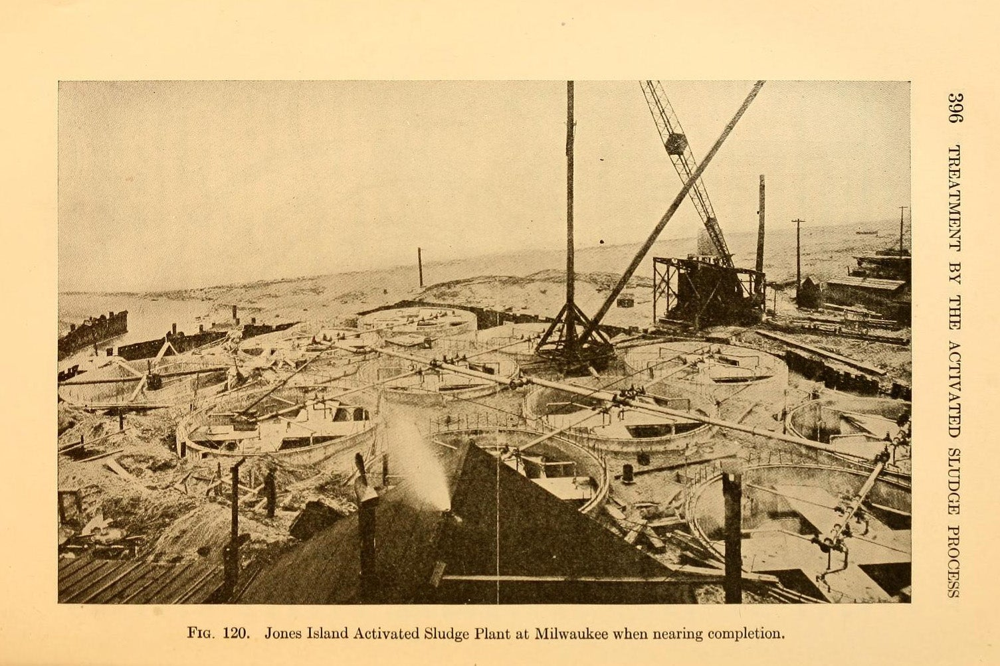
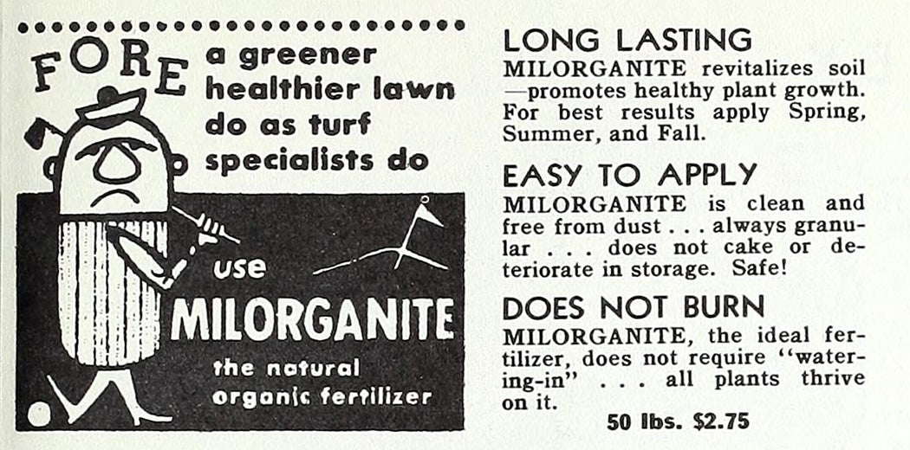

The precepts of [circular economy](https://www.jstor.org/stable/44164300?mag=waste-not-want-not)—reusing water, using biodegradable plastic, composting food leftovers so they can be returned to the soil rather than become landfill—are among the hottest ideas of our century.  But what about recycling what our food becomes _after_ we eat it? Yes, that means excrement, a critical substance in the thoroughly functioning circular economy, seems to be left out of the equation.  
循环经济的原则——重复利用水、使用可生物降解的塑料、将食物残渣堆肥以便将它们返回土壤而不是成为垃圾填埋场——是本世纪最热门的想法之一。但是，如何回收我们吃完的食物呢？是的，这意味着排泄物，一种在循环经济中发挥重要作用的关键物质，似乎被排除在外。

When you next go grocery shopping, check where your food comes from. Most hails from the bread baskets of our planet, often places with warmer weather. As that food grew, it extracted nutrients from the land. But, as we consume it, we don’t return these nutrients back to the earth that fed us.  
下次去杂货店购物时，请检查食物的来源。大多数来自我们星球上的面包篮，通常是天气较暖和的地方。随着食物的生长，它从土地中吸取养分。但是，当我们食用它时，我们不会将这些营养物质返回给养育我们的地球。  
That’s a problem. When we grow our food in location A, but eat and excrete it in location B, we create what scientists call “the metabolic rift.” [Even Karl Marx warned us about](https://www.jstor.org/stable/10.1086/210315?mag=waste-not-want-not) this problem. The prominent 19th century philosopher and economist, who most famously focused on critique of politics and political economy, also understood the issues of soil fertility, organic recycling, and sustainability.  
这是一个问题。当我们在 A 地种植食物，但在 B 地进食和排泄食物时，我们就产生了科学家所说的“代谢裂隙”。甚至卡尔·马克思也警告过我们这个问题。这位 19 世纪著名的哲学家和经济学家以对政治和政治经济学的批判而闻名，他也了解土壤肥力、有机循环和可持续性等问题。

Marx lamented that farmlands were depleted but didn’t pin down where consumed but undigested nutrients end up. Today, we know exactly what happens to them. As we eat, we take the nutrients, such as [nitrogen](https://daily.jstor.org/the-greenhouse-gas-thats-more-potent-than-carbon-dioxide/), phosphorus, and potassium, out of farmlands and deposit them, by way of [wastewater effluent](https://daily.jstor.org/a-history-of-human-waste-as-fertilizer/), someplace else—usually in a nearby body of water. Our industrial treatment systems separate the so-called biosolids out of the sewage stream, purify the water, and release it back to nature, but they rarely extract these essential nutrients in the process.  
马克思哀叹农田已经枯竭，但没有确定被消耗但未消化的养分最终去了哪里。今天，我们确切地知道他们发生了什么。在我们进食的过程中，我们从农田中吸收了氮、磷和钾等营养物质，并通过废水排放将它们沉积在其他地方——通常是在附近的水体中。我们的工业处理系统将所谓的生物固体从污水流中分离出来，净化水，然后将其释放回自然界，但它们很少在这个过程中提取这些必需的营养物质。  
Instead of fertilizing the fields then, the nutrients fertilize the waterways—and wreak havoc in them.  
那时，营养物质没有给田地施肥，而是给水道施肥——并对水道造成严重破坏。

The nutrients overfertilize the water, causing what scientists call [eutrophication or nitrogen overloading](https://www.jstor.org/stable/1353028?mag=waste-not-want-not), which fuels [toxic algae blooms](http://toxic%20algae%20blooms/), destroys coastal marshes, [kills mangrove forests](https://daily.jstor.org/why-myanmar-jailed-mangrove-activists/), and smothers corals. What happens with the remaining [biosolids](https://daily.jstor.org/what-to-do-about-biosolids/)—a euphemism for the malodorous, pathogen-infested black muck—is equally ugly. Sometimes it’s burned, releasing carbon dioxide in the atmosphere and contributing to greenhouse gas emissions.  
营养物质使水体过度施肥，导致科学家称之为富营养化或氮超载，从而助长有毒藻类大量繁殖、破坏沿海沼泽、杀死红树林并扼杀珊瑚。剩下的生物固体——对恶臭、病原体滋生的黑色淤泥的委婉说法——发生的事情同样丑陋。有时它会燃烧，在大气中释放二氧化碳并导致温室气体排放。  
Sometimes it’s dried and landfilled together with trash, where it rots, and, as with burning, similarly ramps up greenhouse gasses.  
有时它会被晒干并与垃圾一起填埋，在那里腐烂，并且与燃烧一样，同样会增加温室气体。

Meanwhile, although unsightly and smelly, biosolids are full of the same essential nutrients—nitrogen, phosphorus, and potassium—on which plants thrive. They are also full of undigested organic matter, so when processed properly to kill pathogens, [biosolids make for rich compost](https://daily.jstor.org/chinese-peasants-taught-the-usda-to-farm-organically-in-1909/). Applying biosolids to land has a slew of agricultural benefits, as a [recent study](https://www.sciencedirect.com/science/article/pii/S2666790821002056) demonstrated when it was applied to barren and sandy soils. Doing so perpetuates circular agriculture: we take food from the earth and we replenish its nutrients with our metabolic output.  
同时，虽然难看且有异味，但生物固体富含植物赖以生长的相同必需营养素——氮、磷和钾。它们还充满未消化的有机物，因此当经过适当处理以杀死病原体时，生物固体可以制成丰富的堆肥。将生物固体施用于土地具有一系列农业效益，正如最近的一项研究表明，将其应用于贫瘠的沙质土壤。这样做可以使循环农业永存：我们从地球上获取食物，并通过新陈代谢来补充营养。

Why then do municipalities burn or landfill such assets? Part of it is expense; converting biosolids to fertilizer that’s safe to put on the fields is costly. It requires specialized equipment that many wastewater plants lack. But there are societal reasons, too.  
为什么市政当局要焚烧或填埋这些资产？其中一部分是费用；将生物固体转化为可安全施用于田间的肥料成本高昂。它需要许多污水处理厂所缺乏的专用设备。但也有社会原因。  
For about 200 years we had been conditioned to think of sewage as an ultimate waste, epitomizing disease and as such it must be destroyed through burning or stashed as far away from us as possible in landfill.  
大约 200 年来，我们一直习惯于将污水视为最终的废物，是疾病的缩影，因此必须通过焚烧或将其埋在离我们尽可能远的垃圾填埋场中销毁。  
Taxpayers are willing to pay for clean water, but not processing sewage, which they misperceive as the ultimate waste substance.  
纳税人愿意为清洁水付费，但不愿意为处理污水付费，他们将污水误认为是最终的废物。

With that broken cycle, farmlands grow barren, while rivers and oceans are choked by the overabundance of nitrogen and other nutrients that remain, unextracted, in the effluent. We compensate by replenishing farmlands with chemicals such as [synthetic nitrogen](https://www.jstor.org/stable/41356356?mag=waste-not-want-not)—made with fossil fuels and  [extremely polluting to produce](https://cen.acs.org/environment/green-chemistry/Industrial-ammonia-production-emits-CO2/97/i24)—thus perpetuating this vicious cycle. There are currently 8 billion people on this planet who need food to survive. This problem will only worsen if we don’t change how we handle our sewage. We must figure out how to return our sludge back to land.  
随着这个循环的中断，农田变得贫瘠，而河流和海洋则因污水中未提取的过量氮和其他营养物质而窒息。我们通过用合成氮等化学物质补充农田来补偿——这些化学物质是用化石燃料制成的，对生产造成极大污染——从而使这种恶性循环长期存在。目前这个星球上有 80 亿人需要食物才能生存。如果我们不改变处理污水的方式，这个问题只会恶化。我们必须弄清楚如何将我们的污泥返回土地。

The good news is that the necessary tools already exist to do so. Even better, there are technologies that [turn human waste into humanure](https://daily.jstor.org/a-history-of-human-waste-as-fertilizer/). Some are [old](https://daily.jstor.org/the-early-history-of-human-excreta/) and others new, some cook it, and others whip it like a milkshake—but each has a story to tell.  
好消息是必要的工具已经存在。更好的是，有些技术可以将人类排泄物转化为人文。有些是旧的，有些是新的，有些是煮的，有些像奶昔一样搅打——但每一种都有一个故事要讲。

## Milorganite: Human-Made in Milwaukee Since 1925  
Milorganite：自 1925 年以来在密尔沃基人工制造

In 1914, the Milwaukee Sewerage Commission began to experiment with a new approach for wastewater treatment. Developed in Europe and called the activated sludge method, it employed microorganisms that normally break down fecal matter in nature to do just that—eat through it to decompose it. The [Jones Island Sewage Plant](https://www.mmsd.com/about-us/history) went into production in 1925—the first and largest in the nation to tap into nature’s power to clean wastewater. But while these bacteria decomposed excrement, the gooey and gunky end product left behind still needed to be dealt with. [Agronomist Oyvind Juul Noer](https://ojnoer.ars.wisc.edu/mission-history/) realized that the muck contained high levels of nitrogen, phosphor us, and potassium or NPK—the key fertilizers plants need to grow. Compared to manure and chemical fertilizer, this [microbe-processed sludge produced superior growth](https://www.prweb.com/releases/2012milorganite/06organicfertilizer/prweb9563797.htm) results. Milwaukee sewage authorities figured out how to dry and process the muck into pellets and began churning out this human-made fertilizer.  
1914 年，密尔沃基污水处理委员会开始试验一种新的废水处理方法。它在欧洲开发并称为活性污泥法，它利用通常在自然界中分解粪便的微生物来做到这一点——吃掉它来分解它。琼斯岛污水处理厂于 1925 年投入生产，是美国第一个也是最大的一个利用大自然的力量来净化废水的污水处理厂。但是，虽然这些细菌分解了排泄物，但留下的粘糊糊的最终产品仍然需要处理。农学家 Oyvind Juul Noer 意识到淤泥中含有高含量的氮、磷、钾或氮磷钾——植物生长所需的关键肥料。与粪肥和化肥相比，这种经过微生物处理的污泥产生了更好的生长效果。密尔沃基污水处理部门想出了如何将粪便干燥并加工成颗粒，并开始大量生产这种人造肥料。

An advertisement for Milorganite  
Milorganite 的广告

Called Milorganite, after Milwaukee Organic Nitrogen, it was first sold for commercial use in 1926. _The_ _Sewage Works Journal_ wrote that it “[was very uniform in character and strength](https://www.jstor.org/stable/25028397?mag=waste-not-want-not).” In 1952, Milorganite was sold throughout the United States as well as in Canada and Mexico. Moreover, Milorganite was a rich source of vitamin B12, which was in such high demand at the time that some independent laboratories experimented [with extracting it from Milorganite](https://www.jstor.org/stable/25031890?mag=waste-not-want-not), and even considered setting up large-scale production facilities to do so. In 1962, it was touted at the model facility producing “genuine Milorganite,” the “’granddaddy’ of large activated plants in the United States,” and [worthy of “an inspection trip.”](https://www.jstor.org/stable/25034449?mag=waste-not-want-not)  
它被称为 Milorganite，以 Milwaukee Organic Nitrogen 命名，于 1926 年首次出售用于商业用途。污水处理厂杂志写道，它“在特性和强度上非常均匀”。 1952 年，Milorganite 销往美国各地以及加拿大和墨西哥。此外，Milorganite 是维生素 B12 的丰富来源，当时维生素 B12 的需求量如此之大，以至于一些独立实验室尝试从 Milorganite 中提取它，甚至考虑建立大规模的生产设施来这样做。 1962 年，它在生产“真正的 Milorganite”的模型设施中受到吹捧，是“美国大型活性植物的‘祖父’”，值得“参观考察”。

As Milwaukee’s population grew, so did its sludge output—and the plant, too. In 1994 it moved into a new, bigger building, and continues to chug along today, following the same [complex and lengthy process](https://www.jstor.org/stable/24664046?mag=waste-not-want-not), in which the sludge is dried, heated, cooled, and mixed with various compounds. Among the largest such recycling programs in the world, Milorganite has generated well [over 9 billion](https://www.prweb.com/releases/2012milorganite/06organicfertilizer/prweb9563797.htm) pounds of “humanure,” enough to wrap around the earth 3.8 times and fertilize 78 million lawns.  
随着密尔沃基人口的增长，它的污泥产量也在增长——工厂也是如此。 1994 年，它搬进了一座新的、更大的建筑，并在今天继续前进，遵循同样复杂而漫长的过程，其中污泥被干燥、加热、冷却，并与各种化合物混合。在世界上最大的此类回收计划中，Milorganite 已经产生了超过 90 亿磅的“人粪”，足以环绕地球 3.8 圈并为 7800 万片草坪施肥。

## Cambi, the Sludge Pressure Cooker  
Cambi，污泥高压锅

What’s cooking up at Thames Water sewage treatment facilities? Well, sludge of course. Thames Water employs special pressure cookers to process London’s waste. Called Cambi, the system which consists of several massive silvery tanks chugs along, [simmering sludge](https://www.cambi.com/what-we-do/thermal-hydrolysis/how-does-thermal-hydrolysis-work/) at about 356°F at a pressure of about 6 atmospheres.  
Thames Water 污水处理设施正在发生什么？好吧，当然是污泥。 Thames Water 使用特殊的压力锅来处理伦敦的垃圾。这个名为 Cambi 的系统由几个巨大的银色水箱组成，在大约 6 个大气压的压力下，在大约 356°F 的温度下沸腾污泥。

The original Cambi system had nothing to do with sewage or sanitation. Originating in Norway, it was built to break down byproducts of the paper industry.  
最初的 Cambi 系统与污水或卫生设施无关。它起源于挪威，旨在分解造纸工业的副产品。  
It derives its name from cambium,  a part of the tree that promotes the growth of cellular mass, a layer of cells that keep dividing and giving rise to other tissues.  
它的名字来源于形成层，形成层是促进细胞团生长的树的一部分，细胞团是一层不断分裂并产生其他组织的细胞。

When paper industries process plant material, they generate thick cellulose waste that’s hard to break down. To decompose it, Norwegian scientists and engineers cooked leftovers under high temperature and pressure, in a method they named the Cambi Thermal Hydrolysis Process, or CambiTHP.  
当造纸工业加工植物材料时，它们会产生难以分解的粘稠纤维素废料。为了分解它，挪威科学家和工程师在高温高压下烹制剩菜，他们将这种方法命名为 Cambi 热水解过程，或 CambiTHP。  
  Soon, it became clear that the process had other useful applications—such as cooking up sludge, and in the 1990s, the first Cambi system went into production in Norway.  
很快，人们就清楚地知道该过程还有其他有用的应用——例如蒸煮污泥，并且在 1990 年代，第一个 Cambi 系统在挪威投入生产。

The UK sewage companies became interested in Cambi around the 1990s after the imposition of new, more stringent environmental regulations governing sewage disposal. [Thames Water](https://www.jstor.org/stable/10.2307/26662326?mag=waste-not-want-not) was the first company [to install Cambi](https://www.cambi.com/resources/references/europe/united-kingdom/chertsey/) and other utilities followed shortly after. Once cooked, the sludge is loaded up into massive holding tanks called biodigesters, where various microorganisms that feed on the biomass in nature, eat through it. The microbes achieve two things.  
在实施新的、更严格的污水处理环境法规后，英国污水处理公司在 1990 年代左右对 Cambi 产生了兴趣。 Thames Water 是第一家安装 Cambi 的公司，其他公用事业公司紧随其后。一旦煮熟，污泥就会被装入称为生物消化器的大型储罐中，各种以自然界中的生物质为食的微生物会吞噬它。微生物完成了两件事。  
They turn the goo into a wet, soil-like substance that farmers use as fertilizer. And they also generate biogas, which consists mostly of methane which can be used to heat the Cambi cookers or power vehicles that run on natural gas.  
他们将粘性物质变成一种潮湿的、类似土壤的物质，农民将其用作肥料。它们还产生沼气，沼气主要由甲烷组成，可用于加热 Cambi 炊具或为使用天然气的汽车提供动力。

Today, there are [84 Cambi installations](https://www.cambi.com/) at work processing the metabolic output of 114 million people in 26 countries and six continents. They pressure-cook sewage in Santiago, Chile, and Sydney, Australia. They hum along in Anyang, South Korea and Athens, Greece. They process sludge everywhere from Singapore to Washington, DC.  
今天，有 84 个 Cambi 装置在处理 26 个国家和六大洲 1.14 亿人的新陈代谢输出。他们在智利圣地亚哥和澳大利亚悉尼对污水进行加压蒸煮。他们在韩国安阳和希腊雅典一起哼唱。从新加坡到华盛顿特区，他们到处都在处理污泥。

## Lystek, the Sewage Smoothie-Maker  
Lystek，污水冰沙制造商

In the early 2000s, Ajay Singh and Owen Ward, two scientists at the University of Waterloo in Ontario, Canada, noticed something strange about the local traffic. A number of trucks were regularly driving around the city of Waterloo with seemingly no good reason.  
2000 年代初，加拿大安大略省滑铁卢大学的两位科学家 Ajay Singh 和 Owen Ward 注意到当地交通有些奇怪。许多卡车经常无缘无故地在滑铁卢市周围行驶。  
What were the trucks carrying, Singh and Ward wanted to know. The answer was jarring: human waste. The trucks were disposing of the city’s sewage sludge.  
辛格和沃德想知道卡车运载的是什么。答案很刺耳：人类排泄物。卡车正在处理城市的污水污泥。

Singh and Ward were no strangers to sludge—albeit to a different type. These scientists had worked on the leftover byproducts of oil refineries, also an unwanted substance.  
辛格和沃德对污泥并不陌生——尽管是不同的类型。这些科学家曾研究过炼油厂剩余的副产品，这也是一种不需要的物质。  
They decided to devise a way of converting the hot potato biosolids into something desirable and sought a cheap and easy way to break down pathogens and make the goo safe for agricultural use.  
他们决定设计一种方法，将烫手的马铃薯生物固体转化为理想的东西，并寻求一种廉价且简单的方法来分解病原体，并使粘性物质可安全用于农业。

They first tried doing it with enzymes, which worked but was expensive. Then, they tried something cheaper: A kitchen blender. They mixed biosolids with caustic soda—an alkali substance that destroy bacterial cells—and whipped up a sewage smoothie.  
他们首先尝试用酶来做，虽然有效但价格昂贵。然后，他们尝试了更便宜的东西：厨房搅拌机。他们将生物固体与苛性钠——一种破坏细菌细胞的碱性物质——混合，搅打成污水冰沙。  
That proved economical and efficient, and the duo formed a company named Lystek to scale up the process.  
事实证明这既经济又高效，两人成立了一家名为 Lystek 的公司来扩大这一过程。

They replaced the kitchen blender with a big, high-tech one with a blade so sharp it cut most pathogens into bits. They substituted caustic soda with the less expensive potassium hydroxide or lime. They heated the mix to about 158 degrees F by pumping in low-pressure steam.  
他们用一个大型高科技搅拌机取代了厨房搅拌机，其刀片非常锋利，可以将大多数病原体切成碎片。他们用更便宜的氢氧化钾或石灰代替了苛性钠。他们通过泵入低压蒸汽将混合物加热到大约 158 华氏度。  
The resulting substance was a product with nearly undetectable pathogen levels, suitable for agricultural applications, which they called LysteMize (from optimize).  
由此产生的物质是一种病原体水平几乎检测不到的产品，适用于农业应用，他们称之为 LysteMize（来自优化）。

Lystek’s team added important plant nutrients, such as calcium, magnesium, and zinc, and christened their mix LysteGro. In 2013, Lystek commissioned a [processing facility in](https://www.jstor.org/stable/44010966?mag=waste-not-want-not) [Dundalk](https://www.jstor.org/stable/44010966?mag=waste-not-want-not), Canada. Now its technology is used at [over a dozen locations](https://lystek.com/all-projects/), from Canada to the United States, with a new plant [under construction in](https://lystek.com/projects/sharjah-uae/) [the](https://lystek.com/projects/sharjah-uae/) [United Arab Emirates](https://lystek.com/projects/sharjah-uae/).  
Lystek 的团队添加了重要的植物营养素，例如钙、镁和锌，并将他们的混合物命名为 LysteGro。 2013 年，Lystek 在加拿大邓多克启用了一家加工设施。现在，它的技术被用于从加拿大到美国的十几个地方，并且在阿拉伯联合酋长国正在建设一个新工厂。

Historically, the biggest concern over using [human waste as fertilizer](https://daily.jstor.org/a-history-of-human-waste-as-fertilizer/) were the number of pathogens it contained—an issue modern tech addresses. A newer concern is the problem of hormones, antibiotics, and PFAS—the forever chemicals originating from factories that can contaminate sewage, rendering it unfit for agriculture.  
从历史上看，将人类排泄物用作肥料的最大担忧是其中含有的病原体数量——这是现代技术解决的一个问题。一个较新的问题是激素、抗生素和 PFAS 的问题——这些来自工厂的永久化学物质会污染污水，使其不适合农业生产。  
But the sewage industry is already working on ways to address these. Even the most stable chemical compounds fall apart under high temperatures and pressures; [called pyrolysis](https://www.tandfonline.com/doi/full/10.1080/10962247.2021.2009935), one such process may be the path to their destruction. More recently, scientists at Northwestern University, found a way to break down [PFAS at nearly room temperature and pressure](https://www.science.org/doi/10.1126/science.abm8868?cookieSet=1#Science), thanks to a chemical trick. These novel methods can pave the way to implementing sludge recycling on a wider scale. After all, if we keep wasting our waste, the earth won’t have the stamina to feed us. The way to close the metabolic rift we’ve wrought is with our metabolic output.  
但污水处理行业已经在研究解决这些问题的方法。即使是最稳定的化合物也会在高温高压下分解；称为热解，其中一个过程可能是它们被破坏的途径。最近，西北大学的科学家们发现了一种在接近室温和压力的情况下分解 PFAS 的方法，这要归功于一种化学技巧。这些新方法可以为更大规模地实施污泥回收利用铺平道路。毕竟，如果我们继续浪费我们的废物，地球将没有足够的精力养活我们。关闭我们造成的新陈代谢裂痕的方法是我们的新陈代谢输出。

___

[Support JSTOR Daily! Join our new membership program on Patreon today.  
支持 JSTOR 日报！今天加入我们在 Patreon 上的新会员计划。](https://bit.ly/30jM88p)
