Here are some visual design rules you can learn once and use many times in your career. They’re safe.  
这里有一些视觉设计规则，您可以一次学习并在您的职业生涯中多次使用。他们很安全。

## Don’t use pure black or white, only near-black and near-white  
不要使用纯黑或纯白，只能使用近黑和近白

Pure black looks unnatural on a screen, and pure white is too bright. Use close-to-black and close-to-white instead. Any other references to “black” and “white” in these rules assume you’re following this rule.  
纯黑色在屏幕上看起来不自然，纯白色太亮。改用接近黑色和接近白色。这些规则中对“黑色”和“白色”的任何其他引用均假定您遵守此规则。

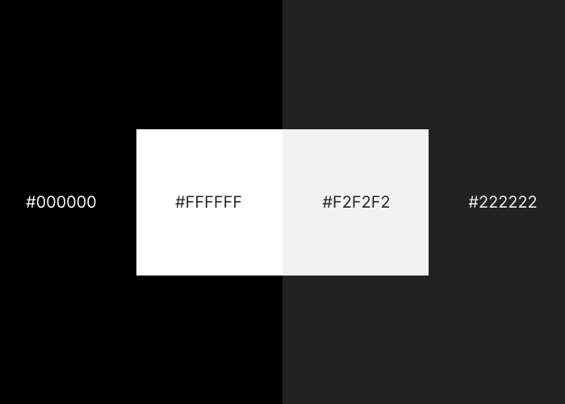

## Saturate your neutrals  
饱和你的中立

A neutral is generally a black, white, or grey. If you use colour in your interface, add a little bit of that colour to your neutrals. If you use the HSB colour system ([and you should](https://learnui.design/blog/the-hsb-color-system-practicioners-primer.html)) less than 5 Saturation should do it.  
中性色通常是黑色、白色或灰色。如果您在界面中使用颜色，请在中性色中添加一点该颜色。如果您使用 HSB 颜色系统（并且您应该这样做），饱和度应小于 5。

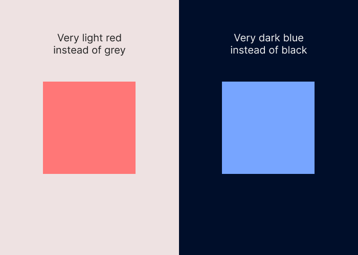

## Use high contrast for important elements  
对重要元素使用高对比度

Important elements means buttons, content, or anything else that the user needs to notice. Elements that the user does not need to notice (e.g. structural elements, drop-shadows) can use as little contrast as possible.  
重要元素是指按钮、内容或用户需要注意的任何其他内容。用户不需要注意的元素（例如结构元素、阴影）可以使用尽可能少的对比度。

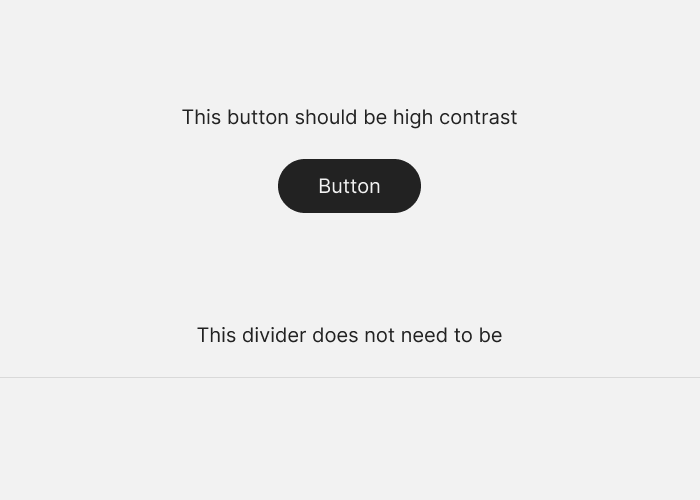

## Everything in your design should be deliberate  
设计中的一切都应该经过深思熟虑

This is vague, but important. You should be deliberate about absolutely everything in your design. This means whitespace, alignment, size, spacing, colour, shadows. Everything. If I point at a random part of your design and you don't have an explanation for why it looks that way, you’re not finished.  
这是模糊的，但很重要。您应该对设计中的所有事情都深思熟虑。这意味着空白、对齐、大小、间距、颜色、阴影。一切。如果我随机指向你设计的一个部分，而你没有解释为什么它看起来那样，那么你还没有完成。  

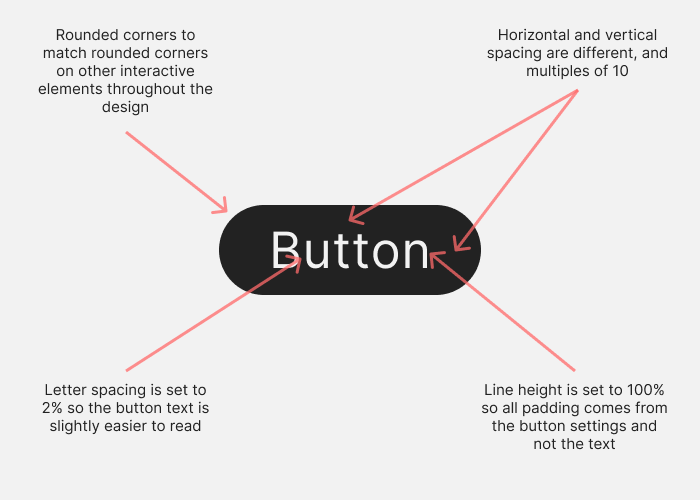

## Optical alignment is often better than mathematical alignment  
光学对准通常优于数学对准

Mathematical alignment is when you tell your design software to centre something in its container and think you’re done. But some shapes don’t suit being aligned in this way. Very often you will need to align things by eye so that it looks good.  
数学对齐是当您告诉您的设计软件将某些东西放在其容器中并认为您已经完成时。但是有些形状不适合以这种方式对齐。很多时候你需要用眼睛对齐东西，这样看起来才好看。

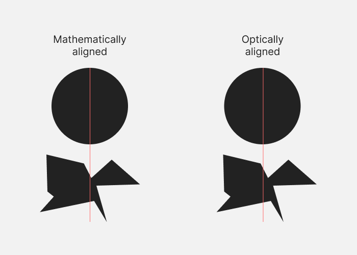

## Lower letter spacing and line height with larger text. Raise them with smaller text  
较小的字母间距和行高与较大的文本。用较小的文字提高它们

This applies to all text. The bigger the text, the less space you need between each letter and each line. The reverse is also true.  
这适用于所有文本。文本越大，每个字母和每行之间所需的空间就越小。反之亦然。

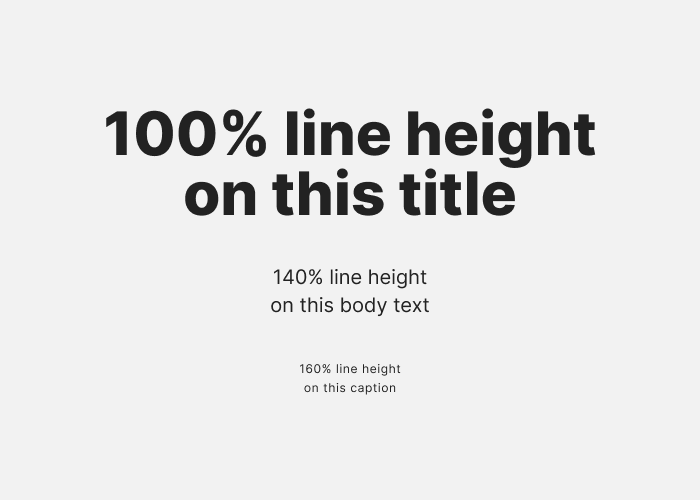

## Container borders should contrast with both the container and the background  
容器边框应与容器和背景形成对比

Example: If you have a card with a 1px border and a dark background, and it sits on top of an even darker background, the 1px border should be lighter than both of them. It should not be set to a brightness somewhere between the card and page background colours.  
示例：如果您有一张带有 1px 边框和深色背景的卡片，并且它位于更暗的背景之上，则 1px 边框应该比两者都亮。它不应设置为介于卡片和页面背景颜色之间的某个亮度。  
The same applies to light background colours: the 1px border should be darker than both background colours.  
这同样适用于浅色背景颜色：1px 边框应该比两种背景颜色都暗。

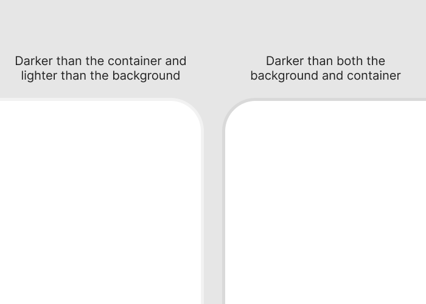

## Everything should be aligned with something else  
一切都应该与其他事物保持一致

If something is not aligned with anything else in the interface, it looks terrible. Ideally each element will be aligned with other elements based on some kind of logic.  
如果某些东西与界面中的其他任何东西不对齐，它看起来就很糟糕。理想情况下，每个元素都将根据某种逻辑与其他元素对齐。

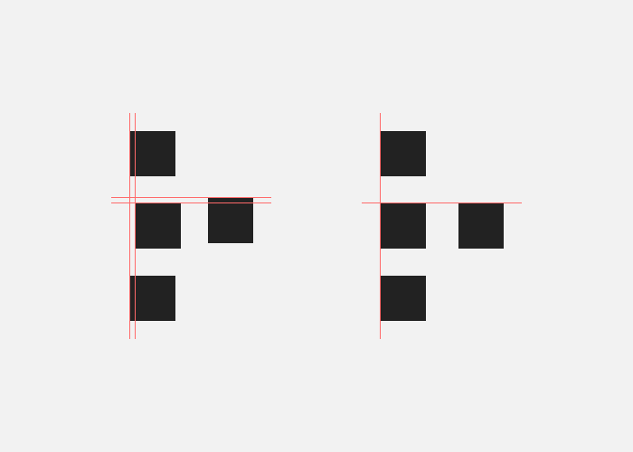

## Colours in a palette should have distinct brightness values  
调色板中的颜色应具有不同的亮度值

It’s OK if some colours in your palette share the same brightness value, but if a colour has a different brightness value it should be noticeably different.  
如果调色板中的某些颜色具有相同的亮度值是可以的，但如果颜色具有不同的亮度值，则应该明显不同。

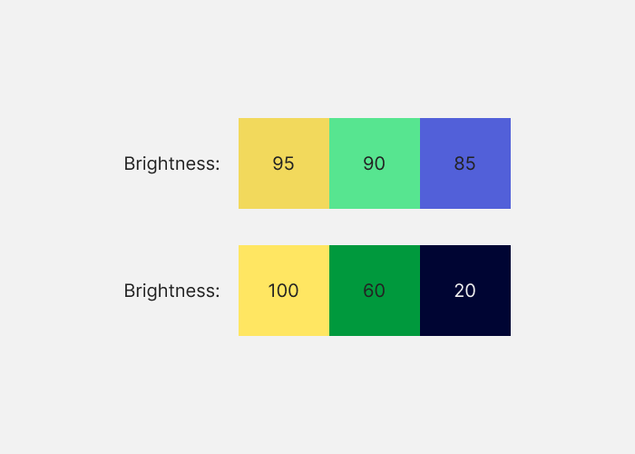

## If you saturate your neutrals you should use warm or cool colours, not both  
如果你使你的中性色饱和，你应该使用暖色或冷色，而不是两者都用

Having some neutrals with a little bit of warm colour and some with cool colours looks bad.  
一些中性色带有一点暖色，一些中性色带有冷色，看起来很糟糕。

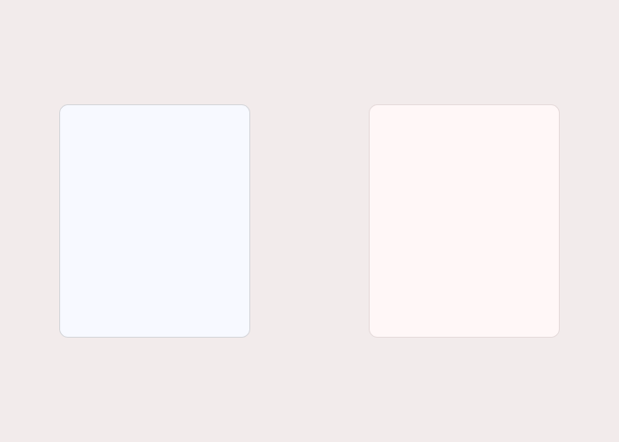

## Measurements should be mathematically related  
测量应该在数学上相关

The spacing you use between elements, and the size of elements, should be determined by some kind of scale. This will help the design to look consistent. In the example below, every element uses multiples of 8.  
您在元素之间使用的间距以及元素的大小应该由某种比例来确定。这将有助于设计看起来一致。在下面的示例中，每个元素都使用 8 的倍数。  
Horizontal and vertical grids based on a scale help if you want to make sure elements like pictures are the right size.  
如果您想确保图片等元素的大小合适，则基于比例的水平和垂直网格会有所帮助。

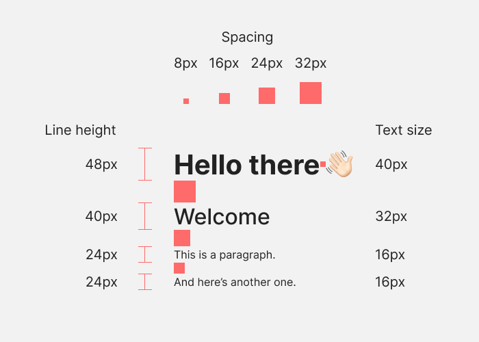

## Elements should go in order of visual weight  
元素应该按照视觉重量的顺序排列

If you have a series of elements in a row or column, and some are more visually heavy than others (two buttons and three links, for example), you should arrange them like a triangle. The visually heaviest element should go first, and the least heavy element last, in order.  
如果您在一行或一列中有一系列元素，并且有些元素比其他元素在视觉上更重（例如，两个按钮和三个链接），您应该将它们排列成三角形。视觉上最重的元素应该放在最前面，最轻的元素最后，按顺序排列。  
One caveat is that the visually heaviest element should be on the outside edge. If your elements are against the right edge of the design, for example, the heaviest element should be against the right edge.  
一个警告是视觉上最重的元素应该在外边缘。例如，如果您的元素紧靠设计的右边缘，则最重的元素应该紧靠右边缘。

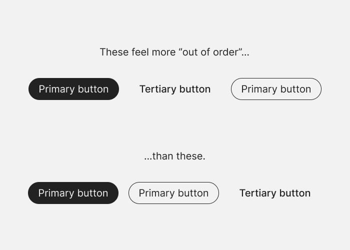

## Use a 12 column grid  
使用 12 列网格

If you’re going to break your design up into vertical columns, use 12 columns. A 12 column grid can be broken up into 1 column, 2 columns, 3 columns, and 4 columns, so it gives you a lot of flexibility.  
如果您要将设计分解为垂直列，请使用 12 列。一个 12 列的网格可以分解为 1 列、2 列、3 列和 4 列，因此它为您提供了很大的灵活性。

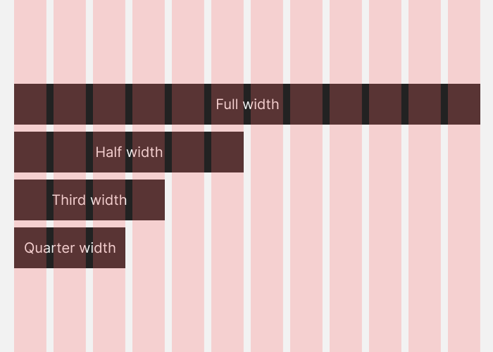

## Spacing should go between points of high contrast  
间距应该在高对比度点之间

When you’re measuring out space between elements in a design—for example if you want 100px of vertical space between blocks of content on a landing page—the spacing should be from one point of high contrast to the next.  
当您测量设计中元素之间的空间时——例如，如果您想要在着陆页上的内容块之间留出 100 像素的垂直空间——间距应该是从一个高对比度点到下一个高对比度点。

A white background with black paragraphs of text means that the points of contrast will be the end of one paragraph and the start of the next.  
带有黑色段落的白色背景意味着对比点将是一个段落的结尾和下一个段落的开头。  
But if you put a black background behind one white paragraph, the spacing should run from the end of one paragraph to the start of the black background, then again from the start of the black background to the start of the paragraph.  
但是如果你把一个黑色背景放在一个白色段落后面，间距应该从一个段落的结尾到黑色背景的开头，然后再从黑色背景的开头到段落的开头。

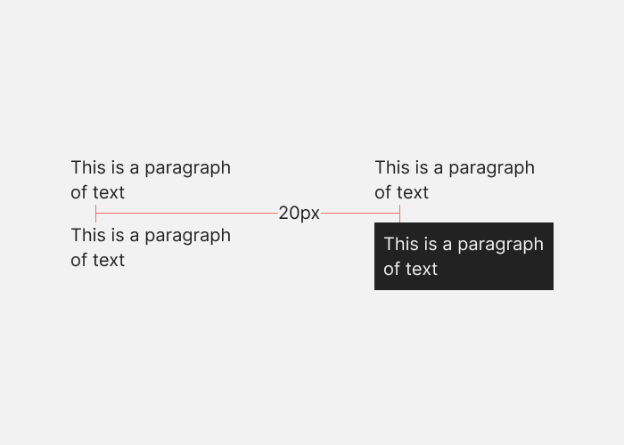

## Closer elements should be lighter  
更近的元素应该更轻

As elements on the screen get closer to the user, they should get lighter. This applies to both light and dark mode UIs.  
随着屏幕上的元素离用户越来越近，它们应该变得更轻。这适用于浅色和深色模式 UI。

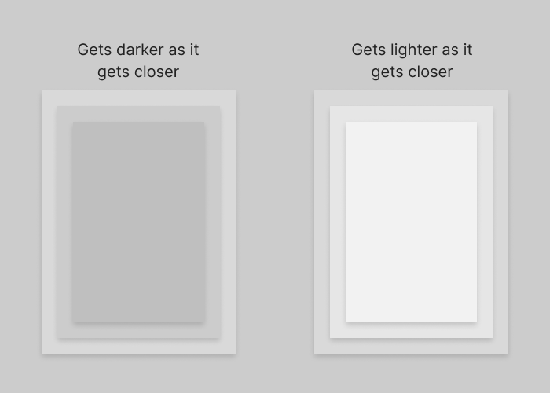

## Make drop shadow blur values double their distance values  
使投影模糊值加倍其距离值

e.g. If you create a shadow which extends 4 pixels on the Y axis, use a blur value of 8 pixels. As the element gets “closer” to the viewer, it’s a good idea to also lower the opacity of the shadow.  
例如如果创建在 Y 轴上延伸 4 个像素的阴影，请使用 8 个像素的模糊值。随着元素离观众越来越近，降低阴影的不透明度也是个好主意。

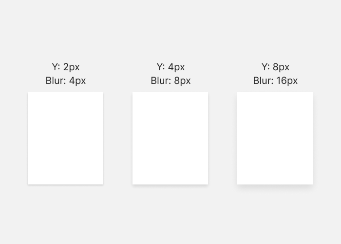

## Put simple on complex or complex on simple  
简单置于复杂或复杂于简单

A complex background (e.g. a colourful gradient fill) works best if the foreground (e.g. text) is simple. And a complex foreground element is best on a simple background. You can put simple on simple, but it tends to look plain. Complex on complex should be avoided because it’s hard to pull off.  
如果前景（例如文本）简单，则复杂的背景（例如彩色渐变填充）效果最佳。复杂的前景元素最好放在简单的背景上。你可以把简单放在简单上，但它往往看起来很普通。应该避免复杂上的复杂，因为它很难实现。

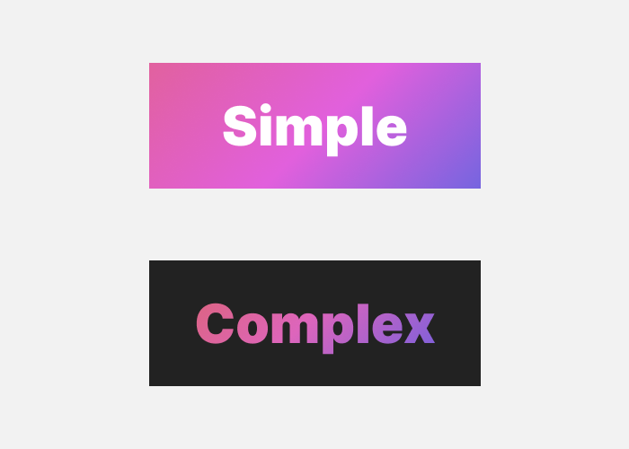

## Keep container colours within brightness limits  
将容器颜色保持在亮度限制内

The brightness difference between background and container should be within 12% for dark interfaces, and 7% for light interfaces. These percentages refer to the brightness value in the HSB colour system.  
深色界面背景与容器亮度差在12%以内，浅色界面7%以内。这些百分比指的是 HSB 颜色系统中的亮度值。

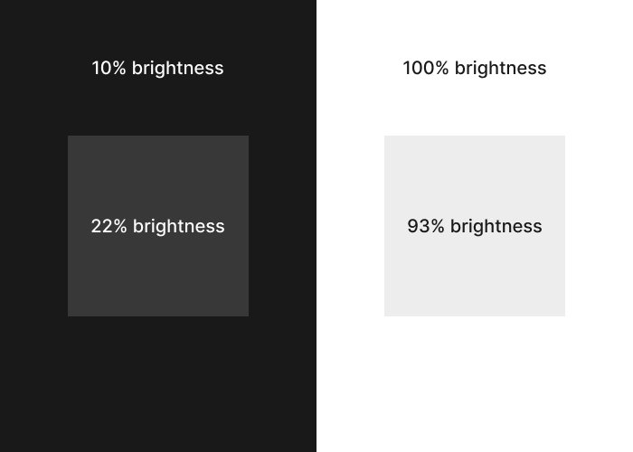

## Make outer padding the same or more than inner padding  
使外部填充与内部填充相同或更多

In containers, inner padding is the space between elements inside the container. Outer padding is the space between the elements and the edges of the container. This outer padding should be the same or more than the inner padding.  
在容器中，内部填充是容器内部元素之间的空间。外部填充是元素和容器边缘之间的空间。这个外部填充应该与内部填充相同或更多。

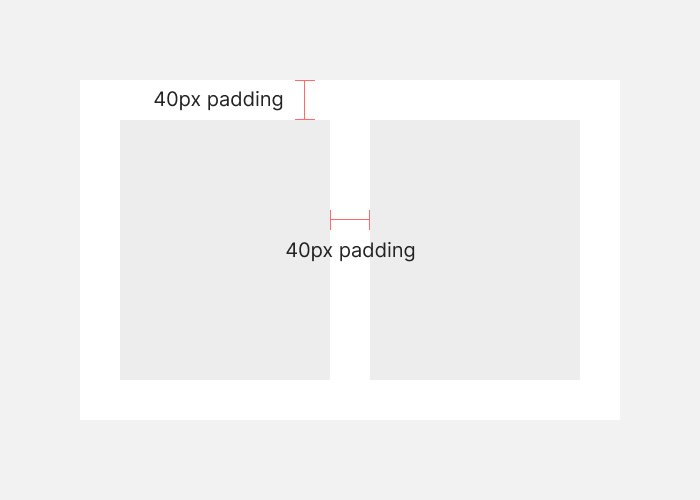

## Keep body text at 16px or above  
保持正文在 16 像素或以上

16px is the default text size in most browsers. Text below this size gets more and more hard to read, so it’s safest to avoid it for body text. The higher you go beyond 16px, the easier the text is to read.  
16px 是大多数浏览器中的默认文本大小。小于此大小的文本越来越难以阅读，因此最安全的做法是避免将其用于正文。超过 16px 的字数越高，文本就越容易阅读。

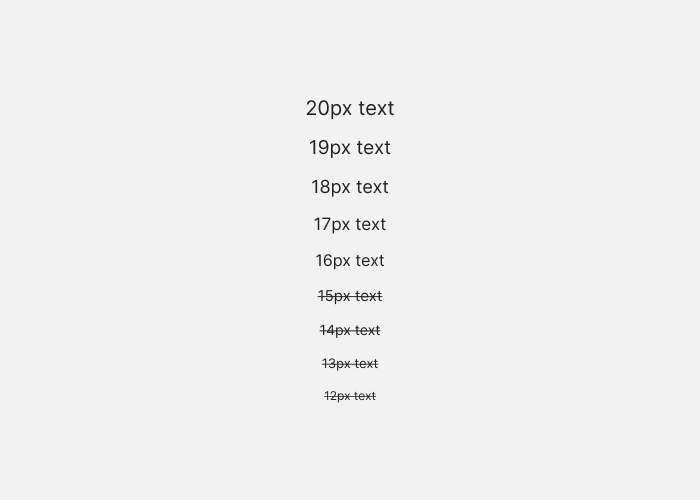

## Use a line length around 70 characters  
使用 70 个字符左右的行

It doesn’t matter too much if your line length is 60 or 80 characters, but go too far either side of that and you might run into subtle readability issues.  
如果你的行长度是 60 或 80 个字符，这无关紧要，但如果太长，你可能会遇到微妙的可读性问题。

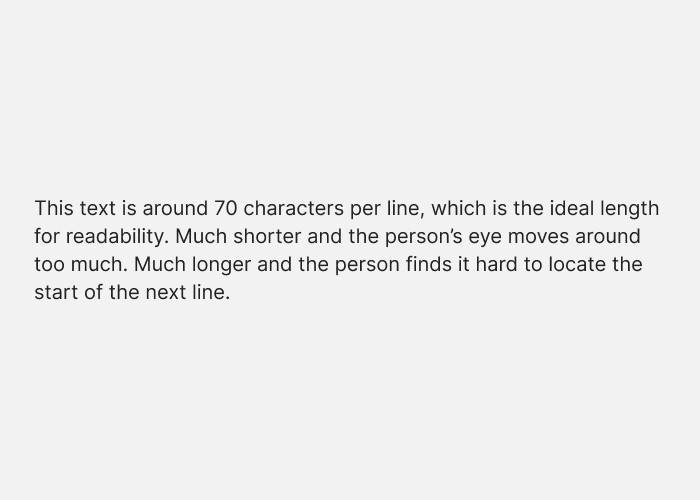

## Make horizontal padding twice the vertical padding in buttons  
将按钮中的水平填充设为垂直填充的两倍

Buttons are most often wider than they are tall. In the example below, the padding above and below the label is 30px, and the padding to the left and right is 60px.  
按钮通常比高度宽。在下面的示例中，标签上下的 padding 为 30px，左右 padding 为 60px。

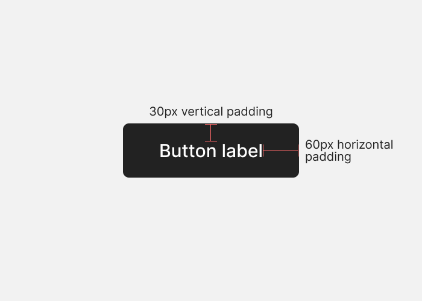

## Use two typefaces at most  
最多使用两种字体

A second typeface is an opportunity to reinforce the concept behind a design. It also helps add some variety to a design. It’s rarely necessary to use more than two, and it’s harder to pull off.  
第二种字体是强化设计背后概念的机会。它还有助于为设计增加一些多样性。很少需要使用两个以上，而且更难实现。

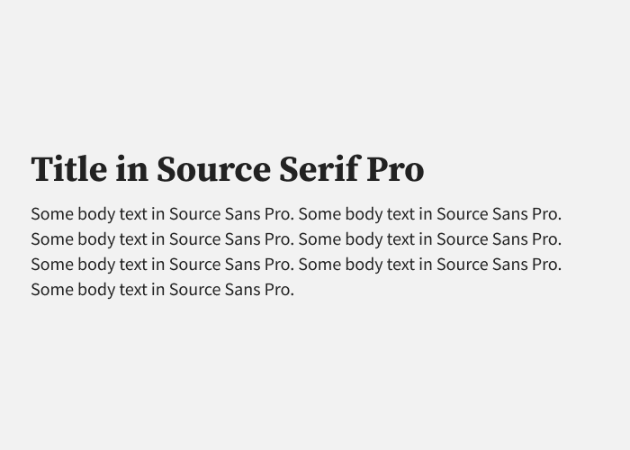
