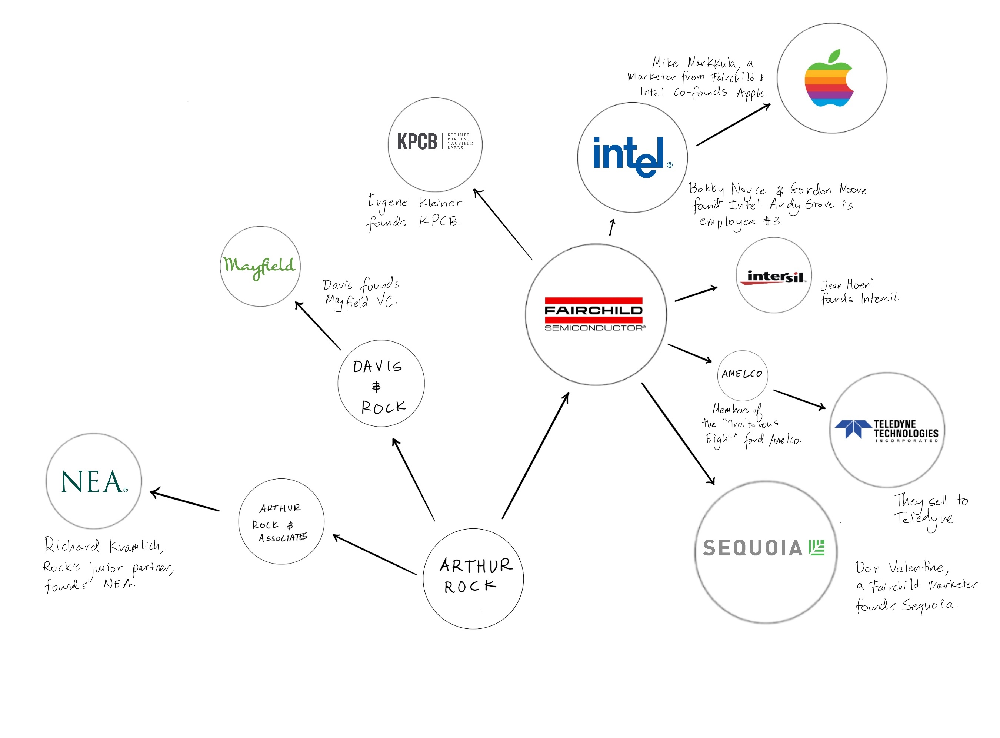
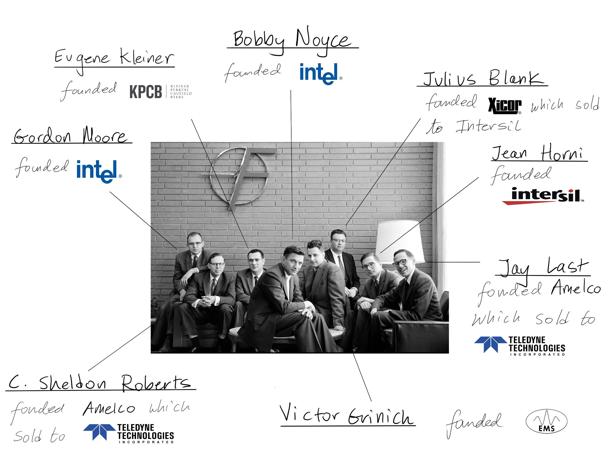

Where does anything begin?  
一切从哪里开始？  

A sheet of newspaper dances across an empty sidewalk. What caused its motion?  
一张报纸在空荡荡的人行道上飞舞。是什么引起了它的运动？

The wind, we might say. The wind swept it forward and made it move.   
风，我们可以说。风把它吹向前，让它动起来。  

But what caused the wind?   
但是是什么引起了风呢？

Well, the car, we might respond. By speeding past, it created the wind, which swept the paper.   
好吧，汽车，我们可能会回应。它飞驰而过，产生了风，吹过纸。  

And what moved the car?   
是什么推动了汽车？

The engine, we answer. The engine propelled the car, which made the wind, which sent the newspaper sailing over the stone.   
引擎，我们回答。引擎推动着汽车，产生了风，风把报纸吹过石头。

We could play this game indefinitely, jumping from engine to driver, driver to body, body to muscles, muscles to atoms, digressing in any number of directions until we arrived at an inevitable conclusion: someone or something plays billiards with the universe; Saturn to side pocket, Mars kissed off the cushion, Earth banked into the far corner.   
我们可以无限期地玩这个游戏，从引擎跳到驾驶员，从驾驶员跳到身体，身体跳到肌肉，肌肉跳到原子，在任何方向上都离题，直到我们得出一个不可避免的结论：某人或某物与宇宙打台球；土星到侧袋，火星亲吻垫子，地球倾斜到远处的角落。

The Greek philosopher Aristotle referred to that first catalyst as the Unmoved Mover, the solitary galvanizer that depends on nothing and upon which all other actions rely.  
希腊哲学家亚里士多德将第一个催化剂称为“不动的推动者”，即不依赖任何东西但所有其他行动都依赖的孤独的激励者。  
This being or force holds the cue in hand and plays the opening break shot that, billions of years later, sends a sheet of newspaper across your path.   
这个存在或力量掌握着线索并打出开场白，数十亿年后，一张报纸横过你的路径。

If Silicon Valley has an Unmoved Mover, it is Arthur Rock. The man who began his career as an investment banker in New York provided the impetus for the tech industry to flourish in San Francisco Bay.  
如果硅谷有一个不动声色的推动者，那就是 Arthur Rock。这位在纽约开始其投资银行家职业生涯的人为科技行业在旧金山湾的蓬勃发展提供了动力。  
As one of the first venture capitalists — he may be the author of the very term "venture capital" — Rock financed and guided some of the most impactful and influential technology businesses of the last century, including Intel, Scientific Data Systems, and Apple.  
作为最早的风险投资家之一——他可能是“风险投资”一词的作者——洛克资助并指导了上个世纪一些最具影响力和影响力的技术企业，包括英特尔、科学数据系统和苹果公司。

In doing so, he not only achieved remarkable returns but came to define a style of patient founder-focused investing.   
在这样做的过程中，他不仅获得了可观的回报，而且还定义了一种以耐心的创始人为中心的投资风格。  

**In today's briefing, we'll discuss:   
在今天的简报中，我们将讨论：**

1.  The "Traitorous Eight" and the makings of Silicon Valley  
    “叛徒八人”和硅谷的气质
2.  Davis & Rock, a historic venture firm  
    Davis & Rock，一家历史悠久的风险投资公司
3.  Recognizing genius at Intel  
    识别英特尔的天才
4.  Mentoring Steve Jobs  
    指导史蒂夫·乔布斯
5.  Lessons from a legend  
    传奇的教训

In the process, we'll uncover how contemporary founders and investors might apply the genius of venture capital's catalyst.   
在此过程中，我们将揭示当代创始人和投资者如何应用风险投资催化剂的天才。

## The Traitorous Eight  
八强

No one at Hayden, Stone & Company (HSC) was sure what to do with the letter.   
Hayden, Stone & Company (HSC) 的任何人都不确定如何处理这封信。  

It had arrived on the desk of one of the bank's managers, written by a client's son. Over a few pages, Eugene Kleiner, a scientist at Shockley Semiconductor, asked for help from his father's financiers. He made an unorthodox request:   
它已经到达银行一位经理的办公桌上，是一位客户的儿子写的。在几页中，肖克利半导体公司的科学家尤金克莱纳向他父亲的金融家寻求帮助。他提出了一个非正统的要求：  

> This prospectus is to introduce a group of senior scientists and engineers that have been working together at Shockley Semiconductor Laboratory...A group feeling arose that rather than leave one by one, we believe we are much more valuable to an employer as a group.   
> 这份招股书是要介绍一群一直在肖克利半导体实验室一起工作的资深科学家和工程师……一个群体的感觉产生了，与其一个一个离开，我们相信我们作为一个群体对雇主更有价值。  

Kleiner hoped that with HSC's help, he might secure a new place of employment for himself and his six colleagues.  
克莱纳希望在 HSC 的帮助下，他可以为自己和他的六位同事找到一个新的工作岗位。  

Shockley Labs was a prestigious place to work in 1957, even if it was in the comparative research backwater of Palo Alto. A year earlier, Dr. Shockley had been awarded the Nobel Prize in Physics for his work on transistors.  
肖克利实验室在 1957 年是一个享有盛誉的工作场所，即使它位于帕洛阿尔托的比较研究死水区。一年前，肖克利博士因其在晶体管方面的工作而获得诺贝尔物理学奖。  
But while Shockley was widely regarded as a genius, he was far from an ideal boss, prone to erratic outbursts and fits of paranoia. Once, in a cloud of suspicion, the Nobel laureate tried to convince the entire office to undergo a lie detector test.  
但是，虽然肖克利被广泛认为是天才，但他远非理想的老板，容易反复无常地爆发和偏执。有一次，在疑云重重的情况下，这位诺贝尔奖获得者试图说服整个办公室接受测谎仪测试。  
Eugene Kleiner and his peers had had enough; one way or another, they were going to leave Shockley. Either HSC would find an employer to take them aboard, or they would go their separate ways.   
Eugene Kleiner 和他的同行们已经受够了；不管怎样，他们要离开肖克利。要么 HSC 会找到雇主接纳他们，要么他们会分道扬镳。  

Born in Rochester, New York, Arthur Rock had arrived at HSC after studying at Syracuse and Harvard Business School. As a young man, he'd worked in his parents' candy store upstate and sold magazines door-to-door.  
Arthur Rock 出生于纽约罗切斯特，在锡拉丘兹大学和哈佛商学院学习后来到 HSC。年轻时，他曾在父母位于北部的糖果店工作，并挨家挨户推销杂志。  
That salesmanship still hadn't made him much of a talker, though: with sharp, narrow features and a pointed style of speech, Rock cut an unusually stern figure, especially for someone just thirty years old.   
不过，这种推销技巧并没有使他成为一个健谈的人：罗克有着棱角分明的五官和尖锐的讲话风格，给人一种异常严肃的感觉，尤其是对于一个只有三十岁的人来说。  

He'd developed a reputation at HSC as an astute picker of technology stocks. In particular, he'd worked on General Transistor, a manufacturer of equipment used in hearing aids. Whereas other investors worried about the limitations of the technology, Rock saw enormous potential.   
他在 HSC 以精明的科技股挑选者而闻名。特别是，他曾在 General Transistor 工作，这是一家助听器设备制造商。尽管其他投资者担心这项技术的局限性，但洛克却看到了巨大的潜力。  

> It was obvious to me that these things were going to be used for a lot more than hearing aids...They weren't used in computers at the time, but it was perfectly evident to anyone who studied the subject that it wouldn't be long before they would.  
> 对我来说很明显，这些东西的用途远不止助听器……当时它们还没有用在电脑上，但对任何研究过这个主题的人来说，很明显它不会早于他们。  

Though he was just a junior banker, that experience meant it was only a matter of time before Kleiner's letter landed on Arthur Rock's desk. Where others saw an inconvenience, Rock smelled opportunity.    
尽管他只是一名初级银行家，但那次经历意味着克莱纳的信迟早会出现在阿瑟·洛克的办公桌上。在其他人看到不便的地方，罗克却嗅到了机会。  

He reviewed the details of the seven men, scanning the names.   
他查看了这七个人的详细信息，扫描了名字。  

_Gordon Moore  
戈登摩尔  
C. Sheldon Roberts  
C. 谢尔顿·罗伯茨  
Eugene Kleiner  
尤金克莱纳  
Victor Grinich  
维克多·格里尼奇  
Julius Blank  
朱利叶斯·布兰克  
Jean Hoerni  
让·霍尔尼  
Jay Last  
杰·拉斯特_  

Each was highly educated and experienced, having worked at SRI International, Dow Chemical, the Naval Research Lab, Western Electric, and the California Institute of Technology.    
每个人都受过高等教育，经验丰富，曾在 SRI International、陶氏化学、海军研究实验室、西部电气和加州理工学院工作。  

"These were, by their resumés, very superior people," Rock later recalled. "And I thought, 'Oh gee, maybe there's something here, something more valuable than just being an employee.'"  
“从他们的简历来看，这些人都是非常优秀的人，”洛克后来回忆道。 “我想，‘天哪，也许这里有一些东西，比仅仅成为一名员工更有价值的东西。’”  

_Maybe_, Rock thought, _he could encourage the men to start a company_.   
也许，罗克想，他可以鼓励这些人创办公司。  

He flew out to the West Coast a few days later. Along with his senior colleague Bud Coyle, described as a "ruddy-faced Irishman," Rock met the seven Shockley deserters for breakfast in the august "Redwood Room.  
几天后他飞到西海岸。罗克和他的资深同事巴德·科伊尔（被称为“红脸爱尔兰人”）一起在庄严的“红木屋”与七名肖克利逃兵共进早餐。  
" Rock might have been surprised when doling out handshakes to discover an eighth man had joined the cause; at the eleventh hour, Eugene Kleiner and his colleagues had persuaded their coworker Robert Noyce to join them.   
当握手时发现第八个人加入了这项事业，洛克可能会感到惊讶；在最后一刻，尤金·克莱纳和他的同事说服了他们的同事罗伯特·诺伊斯加入他们。  

Handsome with dark, thick hair and a penetrating gaze, Rock must have noticed the gravity Noyce carried, even among peers. It can only have encouraged Rock's belief in his idea.   
留着浓密的黑发和敏锐的目光，洛克一定注意到了诺伊斯所具有的引力，即使在同龄人中也是如此。它只能鼓励洛克对他的想法的信念。  

At the end of the meal, Rock shared his proposition: the scientists should forget about finding a new _job_ — it was time to build something of their own. It was a bold idea at the time, but all eight agreed. They would be able to do much more exciting work and run things the way _they_ wanted to. Rock and Coyle suggested each researcher receive 10% of the new entity, with HSC taking 20%.   
用餐结束时，洛克分享了他的建议：科学家们应该忘记寻找新工作——是时候建立自己的东西了。这在当时是个大胆的想法，但八个人都同意了。他们将能够做更多令人兴奋的工作，并按照他们想要的方式经营事情。 Rock 和 Coyle 建议每位研究人员获得新实体的 10%，HSC 获得 20%。  

Fifty years later, Arthur Rock laughed about that moment.   
五十年后，亚瑟·洛克 (Arthur Rock) 对那一刻大笑起来。  

"That's where the famous 80-20 began," he said, referring to venture capital's traditional carry. "For all you venture capitalists, if there are any in the room, you can thank me for your 20 percent."  
“这就是著名的 80-20 开始的地方，”他说，指的是风险投资的传统利差。 “对于你们所有的风险投资家，如果房间里有任何人，你们可以感谢我的 20%。”  

Coyle pulled out ten 1-dollar bills to seal the commitment, suggesting each man signed all of them. With the ersatz contracts signed, Arthur Rock got to work.   
Coyle 拿出十张 1 美元的钞票来签署承诺，建议每个人都在上面签名。签署了 ersatz 合同后，Arthur Rock 开始工作。  

Starting a tech company in those days was a tricky proposition. There was no formal risk capital asset class, with most venture-style funding conducted by the Rockefellers and other wealthy families on the East Coast.  
在那些日子里创办一家科技公司是一个棘手的提议。没有正式的风险资本资产类别，大多数风险投资是由洛克菲勒家族和东海岸的其他富裕家族进行的。  
That meant that Rock was going to have to rely on the interest of corporations to forge the new laboratory.  
这意味着洛克将不得不依靠公司的利益来打造新实验室。  

Rock outlined a list of over 35 enterprises he thought might be willing to finance the venture in exchange for benefitting from the work of the cutting-edge researchers.   
Rock 列出了超过 35 家企业的名单，他认为这些企业可能愿意为该企业提供资金，以换取从前沿研究人员的工作中获益。  

He scrawled the names on a sheet of yellow legal paper:   
他在一张黄色的法律文件上潦草地写下了这些名字：  

_Ford  
General Mills  
通用磨坊  
Western Union  
西联汇款  
Motorola  
摩托罗拉  
General Dynamics   
通用动力公司_  

The list went on and on. Surely one of these companies would jump at the chance to bring the "California group," as they referred to themselves, under their auspices?   
名单还在继续。这些公司中的一家肯定会抓住机会将他们自称的“加利福尼亚集团”置于他们的支持之下吗？  

In an early example of portfolio support, Rock reached out to every single business. And each time, he was rebuffed. Yes, these were "superior people," but they were on the West Coast and wanted to stay there — that was little good to the majority of electronics companies out East.  
在投资组合支持的早期示例中，Rock 接触了每一家企业。而每一次，他都被拒绝了。是的，这些人是“优秀的人”，但他们在西海岸并想留在那里——这对东部的大多数电子公司来说没什么好处。  
Even for those able to countenance the Eight's preference to remain in California, how should a deal be structured? Giving stock options to employees just didn't make sense, let alone to an unproven joint-venture. As Rock later told it:   
即使对于那些能够支持八人组留在加利福尼亚的偏好的人来说，应该如何安排交易？向员工提供股票期权是没有意义的，更不用说给未经证实的合资企业了。正如洛克后来所说：  

> All were interested, but no one knew how to incorporate the group without offending the existing employees in the company. No one was offering stock options at the time, except at the executive level and they didn't see how they could do it for some employees and not for others.  
> 所有人都很感兴趣，但没有人知道如何在不冒犯公司现有员工的情况下将团队合并。当时没有人提供股票期权，除了行政级别，他们不知道如何为某些员工而不是其他员工提供股票期权。  

It must have been tempting to quit at this point and let Kleiner, Noyce, Moore, and Co. drift apart, each to their siloed laboratories. But Rock kept going, and finally, he found someone willing to talk to the men: Sherman Fairchild.   
在这一点上，一定很想退出，让 Kleiner、Noyce、Moore 和 Co. 分开，各自回到各自的孤立实验室。但洛克继续前进，最后，他找到了愿意与这些人交谈的人：谢尔曼费尔柴尔德。  

The son of a wealthy Republican congressman (Fairchild senior had financed the creation of IBM), Fairchild utilized his father's connections to win government contracts for his aerial photography equipment, leading to the creation of Fairchild Aerial Camera Corporation in 1920.  
Fairchild 是一位富有的共和党国会议员的儿子（Fairchild senior 资助了 IBM 的创建），Fairchild 利用他父亲的关系为他的航空摄影设备赢得了政府合同，导致 Fairchild Aerial Camera Corporation 于 1920 年成立。  
In the years that followed, Fairchild built a technical empire, expanding into lunar photography — used by NASA on Apollo 15, 16, and 17 — airplane manufacturing and recording equipment.   
在随后的几年里，Fairchild 建立了一个技术帝国，扩展到月球摄影——美国宇航局在阿波罗 15、16 和 17 号上使用——飞机制造和记录设备。  

By the summer of 1957, Fairchild was 61 years old and in the twilight of his career. But he still possessed a fascination with new technology and a willingness to take risks. He agreed to take a meeting.   
到 1957 年夏天，费尔柴尔德 61 岁，正处于职业生涯的暮年。但他仍然对新技术着迷并愿意冒险。他同意开会。  

Noyce handled the presentation. He explained the group's belief that silicon, not germanium, was the key to making commercially viable semiconductors. Fairchild would later admit that Noyce's passion and force proved the decisive factor.   
诺伊斯负责演示。他解释了该小组的信念，即硅而非锗是制造具有商业可行性的半导体的关键。费尔柴尔德后来承认，诺伊斯的热情和力量是决定性因素。  

A deal was struck: Fairchild would loan the group $1.38 million to start their laboratory, structured as a subsidiary of the existing business. In exchange, the parent company could buy the division outright for $3 million within eight years.   
双方达成协议：Fairchild 将向该集团贷款 138 万美元，用于启动他们的实验室，该实验室是现有业务的子公司。作为交换，母公司可以在八年内以 300 万美元的价格完全收购该部门。  

It didn't take nearly that long. With Noyce, Moore, Hoerni, Kleiner, and the rest of the group installed at Fairchild, progress was rapid. Within six months, Fairchild Semiconductor turned a profit, and within just two years, the parent company exercised its right to purchase the unit for $3 million.  
几乎没花那么长时间。随着 Noyce、Moore、Hoerni、Kleiner 和其他团队成员在 Fairchild 的就职，进展非常迅速。在六个月内，飞兆半导体公司扭亏为盈，而在短短两年内，母公司行使其以 300 万美元购买该部门的权利。  
In 1959, led by Noyce, the group created the first commercially viable integrated circuit embedded in a silicon chip.    
1959 年，在诺伊斯的领导下，该小组创建了第一个商业上可行的嵌入硅芯片的集成电路。  

It's hard to overstate how influential Fairchild Semiconductor proved to be. Not only did it put the "silicon" in "Silicon Valley," but it served as the breeding ground for a crop of generational technologists and entrepreneurs.  
事实证明，飞兆半导体公司的影响力怎么强调都不为过。它不仅将“硅”置于“硅谷”中，而且成为一代代技术专家和企业家的温床。  
The "Traitorous Eight," as Shockley branded them, proved prolific, founding companies like Intel, Xicor, and Intersil.  
肖克利称他们为“叛徒八人”，事实证明他们是多产的，创立了英特尔、Xicor 和 Intersil 等公司。

That represented the start of a larger movement. As of 2014, an estimated 92 companies trace their roots back to Fairchild Semiconductor founders and employees (some suggest the number is closer to 400), with $2 trillion in value created.  
这代表了一场更大运动的开始。截至 2014 年，估计有 92 家公司的根源可以追溯到 Fairchild Semiconductor 的创始人和员工（有人认为这个数字接近 400 家），创造了 2 万亿美元的价值。  
That includes Apple, Advanced Micro Devices, and Applied Materials, as well as venture firms like KPCB and Sequoia.   
其中包括 Apple、Advanced Micro Devices 和 Applied Materials，以及 KPCB 和 Sequoia 等风险投资公司。  

It may never have happened were it not for Arthur Rock's intervention and stroke of inspiration: talented engineers should be incentivized to build.   
如果不是 Arthur Rock 的干预和灵感之笔，这可能永远不会发生：应该激励有才华的工程师去建造。

## Davis & Rock  
戴维斯和洛克

Despite his success orchestrating Fairchild Semiconductor's formation, Rock didn't relocate to the West Coast until 1961. In New York, he further burnished his reputation at HSC as a shrewd stock-picker, advocating for a basket of science and technology companies that rose 457% between 1958 and 1961.  
尽管他成功地策划了仙童半导体的成立，但 Rock 直到 1961 年才搬迁到西海岸。在纽约，他作为精明的选股者进一步提升了他在 HSC 的声誉，支持一揽子科技公司股价上涨 457 1958 年至 1961 年间的百分比。  
That included companies like Hewlett-Packard and Teledyne. The latter company would play a significant role in Rock's future.   
其中包括惠普和 Teledyne 等公司。后者将在 Rock 的未来中发挥重要作用。  

Rock's success was, in part, down to his exceptional understanding of the right vectors upon which to analyze these businesses.  
Rock 的成功部分归功于他对分析这些业务所依据的正确向量的非凡理解。  
Reflecting on that skill, Rock highlighted the kind of thinking that would come to dominate the venture capital industry with its focus on the future rather than the present state:    
回顾这种技能，Rock 强调了将主导风险投资行业的思维方式，它关注未来而不是当前状态：  

> Most fellows were approaching electronics stocks the wrong way. They wanted to know a company's revenues and earnings this year. That's crazy. The industry is in its infancy. Knowing where past earnings or present ones are coming from is no help.   
> 大多数人都以错误的方式接近电子股。他们想知道一家公司今年的收入和收益。太疯狂了。该行业还处于起步阶段。知道过去或现在的收入从何而来无济于事。  

Perhaps realizing that he was one of the few financiers on the East Coast that thought about businesses in this way, Rock decided to cross the country in 1961.  
或许意识到自己是东海岸为数不多的以这种方式思考企业的金融家之一，洛克决定在 1961 年穿越美国。  
He'd noticed, increasingly, that the best scientists were coalescing around Stanford University, where Fred Terman, head of the engineering school, had fanned the flames of technical entrepreneurship:   
他越来越注意到，最优秀的科学家聚集在斯坦福大学周围，工程学院院长弗雷德·特曼 (Fred Terman) 在斯坦福大学煽动了技术创业的火焰：  

> Fred Terman did two things. He allowed doctoral students and professors to start companies while they were still at Stanford, and he convinced Stanford to lease some of its land to individuals to start companies.   
> 弗雷德特曼做了两件事。他允许博士生和教授在斯坦福大学期间就可以创办公司，并说服斯坦福大学将其部分土地出租给个人创办公司。  

Rock wanted to be near those kinds of people — the kind of men he'd gotten to know as part of the Fairchild deal. He packed up his life in New York City and, with acquaintance Thomas Davis, founded a West Coast investment firm focused on funding new companies.   
Rock 想接近这类人——他在 Fairchild 交易中结识的那种人。他结束了在纽约市的生活，并与熟人托马斯·戴维斯 (Thomas Davis) 一起创立了一家专注于为新公司提供资金的西海岸投资公司。  

Davis & Rock raised $5 million, with Rock putting in $175K of his own money. The rest primarily came from Rock's East Coast network, including Harvard Business School classmate Fayez Sarofim (the second-largest shareholder in Kinder Morgan) and Teledyne founder Henry Singleton.  
Davis & Rock 筹集了 500 万美元，其中 Rock 自己出资 17.5 万美元。其余主要来自Rock的东海岸网络，包括哈佛商学院同学Fayez Sarofim（金德摩根第二大股东）和Teledyne创始人Henry Singleton。  
It didn't take the new entity long to invest in one of its LPs:   
新实体很快就投资了其中一家有限合伙人：  

> I raised the initial money for Teledyne a few months before I moved to California. And then when Davis and Rock was formed, we made a follow-on investment. In fact, I knew I was going to do that when I set the thing up, and I was on their board for 34 years.  
> 在我搬到加利福尼亚之前的几个月，我为 Teledyne 筹集了初始资金。然后当 Davis and Rock 成立时，我们进行了后续投资。事实上，当我开始做这件事的时候，我就知道我会这么做，而且我在他们的董事会工作了 34 年。  

That marked the beginning of a remarkable run. Over the following seven years, Davis & Rock would invest just $3 million of the $5 million raised into only 15 companies. It returned $100 million to investors.   
这标志着一段非凡的旅程的开始。在接下来的 7 年里，Davis & Rock 仅将筹集到的 500 万美元中的 300 万美元投资于 15 家公司。它向投资者返还了 1 亿美元。  

Portfolio companies included:   
投资组合公司包括：  

-   **Scientific Data Systems**, a maker of scientific computers. **300-380x.**   
    Scientific Data Systems，一家科学计算机制造商。300-380x。
-   **Teledyne**, a conglomerate of scientific businesses. That included Amelco, founded by members of the Traitorous Eight. **233x.**   
    Teledyne，一家科学企业集团。其中包括由 Traitorous Eight.233x 成员创立的 Amelco。
-   **Astrodata**, an Epsco spin-off focused on "data processing equipment." **7.4x**.   
    Astrodata，Epsco 的衍生产品，专注于“数据处理设备”。7.4x。
-   **Anadex** Instruments, a manufacturer of electronics. **+2x**.   
    Anadex Instruments，一家电子产品制造商。+2x。
-   **SAGIMO**, a real estate company focused on the French market. **+2x**.   
    SAGIMO，一家专注于法国市场的房地产公司。+2x。
-   **General Capacitor**. **Bankrupt**.   
    通用电容。破产了。
-   **International Holding Corp**, an insurance fund started by Davis & Rock, that subsequently acquired General Corp. **Unknown**.   
    International Holding Corp，一家由 Davis & Rock 发起的保险基金，随后收购了 General Corp.Unknown。
-   **Benrus**, a watch manufacturer. **Unknown**.   
    手表制造商 Benrus。未知。
-   **Intersil**, a manufacturer of integrated circuits for watches developed by Traitorous Eight member, Jean Hoerni. **Unknown**.  
    Intersil，由叛八成员让·霍尔尼开发的手表集成电路制造商。未知。  
    

As illustrated, the bulk of the 33x fund return came from Teledyne and Scientific Data Systems (SDS).   
如图所示，33 倍的基金回报大部分来自 Teledyne 和 Scientific Data Systems (SDS)。  

The latter company was founded by Max Pavelsky, a Packard Bell engineer with a management style that made an impression on Arthur Rock.   
后者由 Max Pavelsky 创立，他是 Packard Bell 的一名工程师，其管理风格给 Arthur Rock 留下了深刻印象。  

> I was convinced Palevsky was going to make money. Very few people turn me on the way he did...Max was and is a very interesting man... He was a very, very good manager. But his style was different than most people's style.  
> 我确信 Palevsky 会赚钱。很少有人像他那样打动我……马克斯过去是，现在也是一个非常有趣的人……他是一位非常非常优秀的经理。但他的风格与大多数人的风格不同。  
> His was an easy going, slap you on the back, put your feet up on the table \[type of person\]. I think he was the first executive I ever came across who didn't wear a tie.  
> 他是一个随和的人，拍拍你的背，把你的脚放在桌子上 \[type of person\]。我认为他是我遇到的第一位不打领带的高管。  

In Pavelsky, Rock saw a reaffirmation of the lesson he'd taken from the Fairchild transaction — remarkable _people_, not ideas, were the secret to great investments. According to Rock, Davis & Rock invested $257,000 into Pavelsky's venture, a decision that would return as much as 380x.   
在 Pavelsky 身上，罗克再次确认了他从 Fairchild 交易中吸取的教训——卓越的人才，而不是想法，才是伟大投资的秘诀。根据 Rock 的说法，Davis & Rock 向 Pavelsky 的合资企业投资了 257,000 美元，这一决定将带来高达 380 倍的回报。  

In addition to delivering absurd returns, together, Davis & Rock's partners solidified a style of venture investing and talent spotting that has influenced every successor to some degree or another.  
除了提供荒谬的回报外，Davis & Rock 的合作伙伴还巩固了一种风险投资和人才发现的风格，这种风格在某种程度上影响了每一位继任者。  
  Davis best articulated this approach in a 1966 speech to the Western Electronic Manufacturers Association. During his address, he noted a focus on six founder characteristics.   
戴维斯在 1966 年向西部电子制造商协会发表的演讲中最清楚地阐述了这种方法。在他的演讲中，他强调了六个创始人特征。  

-   **Integrity**. "The guts to take responsibility, admit mistakes, face the facts."  
    正直。 “勇于承担责任，承认错误，面对事实。”
-   **Motivation**. "This is the key criterion...The motivation of the man I want to back is to build a large, important company. To him, the products and product fields are not objects of affection or evidences of his brilliance, but merely the means to achieve his goal as a builder/manager.  
    动机。 “这是关键标准......我想支持的人的动机是建立一个大的，重要的公司。对他来说，产品和产品领域不是感情的对象或他才华横溢的证据，而仅仅是手段实现他作为建设者/经理的目标。  
    And he intends to keep sweating and sweating and sweating to attain this goal."  
    他打算继续流汗、流汗、流汗，以实现这一目标。”
-   **Market-oriented (the desire to sell)**. "The man I like to back...has interest only in things that people are going to buy, buy soon and buy in quantity...He knows that everything has to be sold.  
    以市场为导向（销售欲望）。 “我喜欢支持的人……只对人们将要购买、很快购买并大量购买的东西感兴趣……他知道一切都必须出售。  
    He's quite different from many engineers I have seen whose reaction to every slump in sales is to run back into the laboratory to invent something they hope will sell itself."  
    他与我见过的许多工程师截然不同，他们对每一次销售低迷的反应都是跑回实验室发明一些他们希望能自行销售的东西。”
-   **Skills and experience. "**The man to back in starting a company must have the technical capability to create in his chosen fields...he should have had experience in actually managing operations of substantial size.  
    技能和经验。 “支持创办公司的人必须具备在他选择的领域创造的技术能力……他应该有实际管理大规模运营的经验。
-   **Accounting ability (understanding of financial levers)**. "A real manager has a deep appreciation of the role inspired accounting can play in his company. Without accurate information on costs, the really astute manager knows he cannot price his product appropriately, or bid on contracts with any assurance.  
    会计能力（对财务杠杆的理解）。 “一个真正的经理对受启发的会计在他的公司中可以发挥的作用有着深刻的认识。没有准确的成本信息，真正精明的经理知道他不能适当地为他的产品定价，或者在有任何保证的情况下投标合同。  
    And he cannot tell where to place his efforts in cost reduction."  
    而且他不知道应该在哪里努力降低成本。”
-   **Leadership**. "I won't try to describe this quality."  
    领导。 “我不会试图描述这种品质。”  
    

He also identified the attributes the pair looked for in businesses.   
他还确定了两人在企业中寻找的属性。  

-   **Manufacturing over services**. "I like manufacturing because you sell your design repetitively, and the more you sell, the more profitably you can produce, either by breaking the production down into less and less skilled activities or through employment of machines."  
    制造重于服务。 “我喜欢制造业，因为你重复地销售你的设计，你销售的越多，你生产的利润就越高，要么通过将生产分解为越来越低技能的活动，要么通过使用机器。”
-   **Sophisticated products.** "It is a lot easier to prove superiority in such products than in, for instance, alphabet soup, cigarettes, light bulbs, and printed circuit boards."  
    复杂的产品。“与字母汤、香烟、灯泡和印刷电路板等产品相比，证明此类产品的优越性要容易得多。”
-   **Existing, growing markets.** "I like to back a man who wants to operate in fields which already have markets of around $100 million and which are still growing rapidly... say, 15 percent to 20 percent or more a year."  
    现有的、不断增长的市场。“我喜欢支持一个想要在已经拥有大约 1 亿美元市场并且仍在快速增长的领域经营的人……比如说，每年 15% 到 20% 或更多。”  
    

The polar opposite of Davis personality-wise, Rock usually opted for fewer words. When asked about his approach, Rock noted:   
与戴维斯的性格截然相反，洛克通常选择更少的话。当被问及他的方法时，洛克指出：  

> Well, it's all about the people...Good ideas and good products are a dime a dozen….good people are rare.  
> 好吧，一切都与人有关……好主意和好产品比比皆是……好人很少见。  

Rock exercised that ethos for the rest of his career.   
洛克在他余下的职业生涯中都在践行这种精神。

## 45,000x

In 1968, Davis & Rock's partnership expired. While there was no bad blood between the two men, they decided to go their separate ways, in part because of byzantine securities laws that would have required Rock to step down from SDS's board.   
1968 年，Davis & Rock 的合作伙伴关系到期。虽然两人之间并无敌意，但他们决定分道扬镳，部分原因是复杂的证券法要求罗克从 SDS 董事会辞职。  

Arguably, the best was yet to come for both. Tommy Davis went on to found Mayfield, a celebrated fund in its own right. Meanwhile, Arthur Rock was about to play a pivotal role in the founding of another historic business.   
可以说，两者的最佳时机尚未到来。汤米·戴维斯 (Tommy Davis) 继续创立了 Mayfield，这是一家著名的基金。与此同时，Arthur Rock 即将在另一家具有历史意义的企业的创立中发挥关键作用。  

Passed over for promotion, Bobby Noyce decided it was time to leave Fairchild Semiconductor. The Traitorous Eight had created game-changing technology, but there was little incentive to stay now the unit was wholly owned by Fairchild. By 1968, only Noyce and Gordon Moore remained.  
由于升职失败，Bobby Noyce 决定是时候离开 Fairchild Semiconductor。叛徒八人创造了改变游戏规则的技术，但现在该部门已由 Fairchild 全资拥有，因此几乎没有动力留下来。到 1968 年，只剩下诺伊斯和戈登摩尔。  
And once they had an idea for a new business — focused on using silicon for computer memory — they knew who to call.   
一旦他们有了新业务的想法——专注于将硅用于计算机内存——他们就知道该给谁打电话。  

> \[N\]oyce called me and said, 'Gee, I think maybe Gordon and I do want to leave Fairchild Semiconductor and go into business for ourselves.' And so we talked about it for a while and I asked him how much money they needed and he said two and a half million dollars.  
> \[N\]oyce 打电话给我说，‘哎呀，我想也许 Gordon 和我确实想离开 Fairchild Semiconductor 自己创业。’所以我们谈了一会儿，我问他他们需要多少钱，他说两五十万美元。  
> And I said, 'Well, how much money are you guys willing to put up?' He thought about it for a while and said, 'Well, we'll each put up a quarter of a million dollars,' which represented a fairly good portion of their net worth at the time."  
> 我说，'好吧，你们愿意出多少钱？他想了想说，‘好吧，我们每人出 25 万美元，’这在他们当时的净资产中占了相当大的一部分。”  

Rock did not doubt the capabilities of the founding pair. Later in life, he would remark that he was "never 100 percent sure that a company would make it, except for Intel \[the company they founded\]. Of that, I was absolutely sure."  
洛克并不怀疑这对创始夫妇的能力。在晚年，他会说他“从来没有 100% 确定一家公司会成功，除了英特尔 \[他们创立的公司\]。对此，我绝对确定。”  

It wasn't called Intel at that point, of course, referred to instead as "NM Electronics," borrowing from the founders' initials.   
当然，当时它并没有被称为英特尔，而是借用了创始人姓名首字母的名称“NM Electronics”。  

Once again, Rock sprung into action, making the play that set the rest in motion. He wrote a two and a half-page business plan for NM Electronics "devised to say nothing." In an afternoon, he raised a $2.5 million seed round from 15 investors for 50% of the business.  
洛克又一次迅速行动起来，让其他人开始行动。他为 NM Electronics 写了一份长达两页半的商业计划书，“设计得一言不发”。一个下午，他从 15 位投资者那里筹集了 250 万美元的种子轮资金，获得了公司 50% 的股份。  
Reflecting on his work, Rock remarked:   
回顾他的工作，洛克说：  

> It was easy. Noyce and Moore were extremely well known and had a proven record. They had done fantastic things at Fairchild Semiconductor, and there was no real competition at the time, so it wasn't a difficult call.  
> 很容易。诺伊斯和摩尔非常有名，而且成绩斐然。他们在 Fairchild Semiconductor 做了一些了不起的事情，当时没有真正的竞争，所以这不是一个困难的决定。  
> The financing was so sought after that people were calling Moore's wife to try to get into it.  
> 融资如此受追捧，以至于人们打电话给摩尔的妻子试图参与其中。  

In exchange for his help (and personal investment), Rock received 10% of Noyce and Moore's company. Over the following decades, Rock was ever-present at Intel, an active member of the board, even serving as chairman.  
作为他的帮助（和个人投资）的交换，洛克获得了诺伊斯和摩尔公司 10% 的股份。在接下来的几十年里，罗克一直在英特尔工作，是董事会的活跃成员，甚至担任董事长。  
By the time he stepped down in 1999, Intel was worth $225 billion, a 45,000x markup from the initial $5 million at which the firm was valued.   
到他 1999 年卸任时，英特尔市值已达 2250 亿美元，比公司最初估值 500 万美元高出 45,000 倍。

## The opera of Apple  
苹果的歌剧

By 1977, Arthur Rock was flying solo. After Davis & Rock had expired, he'd formed Arthur Rock & Associates, bringing in Richard Kramlich as a junior partner. Kramlich would go on to found New Enterprise Associates, another leading venture firm.  
到 1977 年，Arthur Rock 开始单飞。在 Davis & Rock 到期后，他成立了 Arthur Rock & Associates，引入了 Richard Kramlich 作为初级合伙人。 Kramlich 将继续创建另一家领先的风险投资公司 New Enterprise Associates。  
While Arthur Rock & Associates performed well, it didn't match Davis & Rock's numbers. Using a structure reminiscent of today's "solocapitalists," Rock reverted to a leaner operation, forming Arthur Rock & Co. The new firm had just two members, Rock, and his secretary.   
虽然 Arthur Rock & Associates 表现不错，但与 Davis & Rock 的数字不符。洛克使用一种让人想起今天的“独资资本家”的结构，恢复了更精简的运作，成立了亚瑟洛克公司。新公司只有两名成员，洛克和他的秘书。  

It was thanks to an old friend that Rock found his next win.   
多亏了一位老朋友，洛克才找到了他的下一场胜利。  

Mike Markkula had worked as a marketing manager, first at Fairchild and later at Intel. After retiring at the age of 32, he'd been coaxed back into action by a strange, lank-haired young founder: Steve Jobs.  
迈克·马库拉 (Mike Markkula) 曾担任营销经理，先是在 Fairchild，后来在英特尔。在 32 岁退休后，他被一位奇怪的、头发平平的年轻创始人哄骗起来：史蒂夫·乔布斯 (Steve Jobs)。  
Markkula joined the upstart's new venture, Apple, bringing $250,000 with him, most of which came in the form of a personal loan.   
Markkula 带着 250,000 美元加入了新贵的新企业 Apple，其中大部分以个人贷款的形式出现。  

As the Apple co-founder with most business acumen — both Jobs and Wozniak were predominantly technical — Markkula was tasked with leading its fundraising efforts. Of course, he reached out to Fairchild's facilitator to see if he was willing to meet with Apple's young founders. Rock was not impressed.  
作为最具商业头脑的 Apple 联合创始人——乔布斯和沃兹尼亚克都主要是技术人员——马库拉的任务是领导其筹款工作。当然，他联系了 Fairchild 的协调人，看他是否愿意与 Apple 的年轻创始人会面。罗克没有留下深刻印象。

> I met with Steve Jobs and Steve Wozniak. They kind of turned me off as people. Steve had a beard and goatee, didn't wear shoes, wore terrible clothes, hair down to his collar, and probably hadn't had a haircut in twenty years...  
> 我会见了史蒂夫乔布斯和史蒂夫沃兹尼亚克。他们有点把我拒之门外。史蒂夫留着胡子和山羊胡子，不穿鞋，穿着破烂的衣服，头发一直垂到衣领，而且可能二十年没剪过头发了……  
> He looked as if he had just come back from seeing that guru he had in India, and he kind of smelled that way too.  
> 他看起来好像刚从他在印度见到的那位上师回来，身上也有那种味道。  

Thankfully for him, Markkula persuaded Rock to attend the Homebrew Computer Show, located in San Jose. After the Two Steves had failed to make a positive personal impression, Markkula hoped the technology would do the talking.  
值得庆幸的是，Markkula 说服了 Rock 参加了位于圣何塞的 Homebrew Computer Show。在两位史蒂夫未能给人留下积极的个人印象之后，马库拉希望技术能够说话。  
When Rock showed up to the large auditorium, filled with budding technological projects, he noticed that one table proved the biggest draw:   
当 Rock 出现在满是新兴技术项目的大礼堂时，他注意到一张桌子最吸引人：  

> I walked over to the Apple booth, and I couldn't get close to it. People were piled up behind the booth. I began to figure maybe there was something to this.   
> 我走到苹果展台，却无法靠近。摊位后面挤满了人。我开始想也许这其中有什么。  

Convinced by popular opinion as well as Markkula's involvement, Rock invested $57,400. After jumping aboard, Rock would develop a meaningful relationship with Steve Jobs, who described him as "like a father.  
受大众舆论和 Markkula 参与的影响，Rock 投资了 57,400 美元。跳上船后，洛克与史蒂夫·乔布斯建立了有意义的关系，史蒂夫·乔布斯形容他“像父亲一样。  
" In addition to his business mentorship, Rock took Jobs to his first opera, Tosca, hosted him at his ski lodge in Aspen, and shared his other passions. Jobs later recounted an exemplary episode of Rock's holistic tutelage:   
“除了他的商业指导外，洛克还带乔布斯去看了他的第一部歌剧《托斯卡》，在他位于阿斯彭的滑雪小屋招待了他，并分享了他的其他爱好。乔布斯后来讲述了洛克全面指导的一段堪称典范的情节：  

> I remember driving into San Francisco one time, and I said to him, 'God, that Bank of America building is ugly,' and he said, 'No, it's the best,' and he proceeded to lecture me, and he was right of course.  
> 我记得有一次开车去旧金山，我对他说，‘天哪，美国银行那栋大楼太丑了，’他说，‘不，那是最好的’，然后他开始教训我，他是对的当然。  

The trust that Rock and Jobs built complicated matters when it came time for Apple's board to pick between the company's founder and professional CEO, John Sculley. Rock sided with the latter, a decision that pained Jobs.   
当苹果董事会在公司创始人和专业 CEO 约翰斯卡利之间做出选择时，洛克和乔布斯建立的信任变得复杂。洛克支持后者，这个决定让乔布斯很痛苦。  

> He chose Sculley over me. That really threw me for a loop. I never thought he would abandon me.  
> 他选择了斯卡利而不是我。这真的让我陷入了困境。我从没想过他会抛弃我。  

By the time Jobs returned, Rock had left the company's board, stepping down after Apple began to directly compete with Intel. At the 1980 IPO, Rock's Apple holdings were reportedly valued at $14 million, a return of 244x. Today, those shares would be worth over $21 billion.   
乔布斯回来时，洛克已经离开公司董事会，在苹果开始与英特尔直接竞争后辞职。据报道，在 1980 年的 IPO 中，Rock 持有的 Apple 股票估值为 1400 万美元，回报率为 244 倍。今天，这些股票的价值将超过 210 亿美元。

## Lessons

Have you heard of Hikaru Nakamura?   
你听说过中村光吗？  

Though even passing chess fans will recognize the name and grumpily ponderous face of Magnus Carlsen, many fewer may have heard of Nakamura. And yet, both men are world number ones: Carlsen, the king of the men's game, and one of the all-time greats, Nakamura, the champion of "blitz chess."   
虽然即使路过的国际象棋迷也能认出马格努斯卡尔森的名字和他那张脾气暴躁、笨重的脸，但听说过中村的人可能更少。然而，两人都是世界排名第一：卡尔森，男子棋王，以及史上最伟大的棋手之一，“闪电战国际象棋”冠军中村。  

In all ways but one, blitz chess is the same as the traditional game. The difference is speed: blitz requires players to make their moves within 10 minutes or less. By altering that parameter, different talents are amplified — players rely less on calculation and more on instinct.  
除了一个方面，闪电战国际象棋在所有方面都与传统游戏相同。不同之处在于速度：闪电战要求玩家在 10 分钟或更短时间内完成动作。通过改变这个参数，不同的天赋被放大了——玩家更少地依赖计算，更多地依赖直觉。  
That favors players like Nakamura, only ranked #18 in traditional chess, while disadvantaging those like Fabiano Caruana. Though world number two in the classical game, Caruana slumps to #38 in blitz, his slower style wilting under time pressure.   
这有利于像 Nakamura 这样的棋手，在传统国际象棋中仅排名第 18 位，而不利于像 Fabiano Caruana 这样的棋手。尽管卡鲁阿纳在古典比赛中排名世界第二，但在闪电战中却跌至第 38 位，他的慢速风格在时间压力下萎靡不振。  

(Carlsen, the cognitive freak, sees his relative skill dip only marginally; he is #2 in blitz chess.)   
（卡尔森，认知怪胎，认为他的相对技能仅略有下降；他在闪电战国际象棋中排名第二。）  

Modern venture capital looks a lot like a "blitz chess" version of the original. The influx of capital and proliferation of funds have created a competitive dynamic in which speed is one of the most crucial vectors of differentiation.  
现代风险投资看起来很像原始版本的“闪电战棋”。资本的涌入和资金的激增创造了一种竞争动态，其中速度是最重要的差异化载体之一。  
That's forced modern investors to adopt a more proactive stance, meeting companies where they are and front-running deals by building an audience. It makes drawing lessons from Arthur Rock's success somewhat difficult, equivalent to studying Capablanca or Spassky's moves to improve one's rapid game.   
这迫使现代投资者采取更积极主动的立场，与公司会面，并通过建立受众来抢先交易。这使得从 Arthur Rock 的成功中吸取教训变得有些困难，相当于学习 Capablanca 或 Spassky 的动作来提高一个人的快速比赛。  

Rock himself seemed to recognize venture had changed since his heyday, noting a shift beginning at the turn of the millennium:   
洛克本人似乎意识到自他的鼎盛时期以来，风险投资已经发生了变化，并指出在千禧年之交开始的转变：  

> I get my kicks out of building companies. \[Early VCs\] were all company builders. And people entering the business in the late 1990s were promoters. They're always promoting their companies and promoting their deals.  
> 我从建立公司中得到乐趣。 \[早期的风投\]都是公司的建设者。 1990 年代后期进入该行业的人都是发起人。他们总是在推销他们的公司，推销他们的交易。  

Of course, every great chess player _does_ study the work of early masters, even if they wish to apply themselves within the confines of a compressed game. And so, though there are undoubted differences in the manner of play, lessons remain.  
当然，每一位伟大的国际象棋棋手都会研究早期大师的作品，即使他们希望将自己应用于压缩游戏的范围内。因此，尽管游戏方式无疑存在差异，但教训仍然存在。  
In particular, Arthur Rock's work exemplifies four rules, some of which run counter to common venture practice.   
尤其是，Arthur Rock 的工作举例说明了四个规则，其中一些与常见的风险实践背道而驰。  

1.  Stubborn on the person, flexible on the structure.  
    执着于人，灵活于构。
2.  Find a mafia.  
    找黑手党。
3.  Dare to manage.  
    敢于经营。
4.  Advocate, not friend.  
    倡导者，不是朋友。

### Stubborn on the person, flexible on the structure  
执着于人，灵活于构

Rock's style was defined by a focus on the person. That, more than anything else, was the true non-negotiable.   
Rock 的风格定义为对人的关注。最重要的是，这是真正的不容谈判的。  

> The key is faith, faith in people...When people want backing, I look at their personal philosophies and judge whether they are limited people. Some guys want to play the game safe, not take any chances and keep small.  
> 关键是信仰，对人的信仰……当人要靠山的时候，我看他们个人的理念，判断他们是不是有限的人。有些人想安全地玩游戏，不冒险，保持小个子。  

As described in our telling of the Davis & Rock story, Rock favored high-integrity, mission-driven founders. He would spend extensive time with builders before choosing to back them. More than vetting the technology or business model, Rock wanted to understand what made people tick.  
正如我们在讲述 Davis & Rock 的故事时所描述的那样，Rock 偏爱高度正直、以使命为导向的创始人。在选择支持他们之前，他会花大量时间与建筑商打交道。除了审查技术或商业模式，洛克还想了解是什么让人们兴奋。  
In particular, he was keen to separate the self-interested from the true, driven builder.   
特别是，他热衷于将自利的人与真正的、有动力的建设者区分开来。  

> I don't like businessmen who are too promotional. I like a man who has a dream, who wants money to do something with, not just to have. If a guy has a good idea, I can figure out how much money I can make on it. I want _him_ working on the _idea_.  
> 我不喜欢过于促销的商人。我喜欢一个有梦想的人，他想要用钱来做点什么，而不仅仅是拥有。如果一个人有一个好主意，我可以计算出我可以赚多少钱。我想让他研究这个想法。  

While Rock was stubborn about who he worked with, he was flexible on the structures of the arrangement. With no set way of operating, Rock showed a willingness to trial different models, dependent on the circumstances, showing formal creativity.   
虽然洛克对与谁合作很固执，但他对安排的结构很灵活。由于没有固定的操作方式，Rock表现出愿意根据情况尝试不同模型的意愿，表现出形式上的创造力。  

We see this from the very beginning. Rather than simply shipping the Traitorous Eight off to another employer, Rock devised a way for the group to stay together and work on their research.  
我们从一开始就看到了这一点。洛克并没有简单地将叛徒八人运送给另一位雇主，而是设计了一种让团队聚在一起并从事研究的方法。  
He recognized that starting a company from scratch was not realistic, and so secured a corporate sponsor that provided the founders and his investment firm access to upside.  
他认识到白手起家是不现实的，因此获得了一家企业赞助商，为创始人和他的投资公司提供了上涨空间。  

At Davis & Rock, he formed an insurance fund to conduct a buyout, and later, he engaged with Noyce and Moore in an almost incubatory capacity. Rock started his relationship with Intel on the ground floor, raising money and helping to drive strategy.   
在 Davis & Rock，他成立了一个保险基金来进行收购，后来，他以几乎是孵化器的身份与诺伊斯和摩尔接触。 Rock 在底层开始与英特尔的关系，筹集资金并帮助推动战略。  

Today, though many investors would not wish to admit it, Rock's preferences have traded places. The formalization of the asset class means that structural creativity is rare — deals are conducted within set parameters.  
今天，尽管许多投资者不愿意承认，但洛克的偏好已经发生了变化。资产类别的形式化意味着结构性创造力是罕见的——交易是在设定的参数范围内进行的。  
While this increases the speed of transaction (and, to some extent, protects against abusive terms), it represents a limitation.   
虽然这提高了交易速度（并且在某种程度上防止滥用条款），但它代表了一种限制。  

Meanwhile, the compressed cycle of modern investing has forced more flexibility when it comes to the founder. Investors must be willing to provide financing with less information and more uncertainty over the individual's motivations and abilities.  
与此同时，现代投资的压缩周期迫使创始人更加灵活。投资者必须愿意在信息较少且对个人动机和能力存在更多不确定性的情况下提供融资。  
(To those that argue they can deduce such information in a single thirty-minute meeting: I do not believe you.)   
（对于那些争辩说他们可以在一次三十分钟的会议中推断出此类信息的人：我不相信你。）  

Where possible, Rockian investors will find ways to bring deliberation to the process — particularly when it comes to the person at the helm — while developing a creative, flexible mindset elsewhere.   
在可能的情况下，Rockian 投资者会想方设法在这个过程中进行深思熟虑——尤其是当涉及到掌舵人时——同时在其他地方培养一种创造性、灵活的思维方式。  

### Find a mafia  
寻找黑手党

Arthur Rock recognized that serendipity played a role in his success:   
Arthur Rock 认识到机缘巧合在他的成功中发挥了作用：  

> You've got to be lucky. Everybody's going to be lucky at some time or another. The thing I'd say is that I was lucky enough to be lucky early.   
> 你一定很幸运。每个人都会时不时地走运。我要说的是，我很幸运能早点幸运。  

He was referring, of course, to his connection to the Traitorous Eight and his subsequent involvement in founding Fairchild Semiconductor.  
当然，他指的是他与叛逆八人的关系以及他随后参与创立仙童半导体公司。  
Fortune indeed favored Rock in delivering that letter to his desk (though many others couldn't see its value), but what separated him was his ability to turn one stroke of luck into ten.   
《财富》杂志确实青睐洛克将那封信送到他的办公桌上（尽管许多其他人看不到它的价值），但让他与众不同的是他能够将幸运变成十。  

While other investment bankers might have felt their work was finished after closing the transaction, Rock developed a genuine relationship with the eight scientists. That would serve as the bedrock for future success, with Rock capitalizing on the emergence of a "Fairchild Mafia.  
虽然其他投资银行家在完成交易后可能会觉得他们的工作已经完成，但洛克与八位科学家建立了真正的关系。这将成为未来成功的基石，罗克利用了“仙童黑手党”的出现。  
" Investments in Intel, Apple, and Intersil all arose from connections to the semiconductor unit.   
" 对英特尔、苹果和 Intersil 的投资都来自与半导体部门的联系。  

Establishing a position within a powerful Mafia is an almost singularly valuable foothold. High-performance businesses tend to have a large number of high-performance people. The shared characteristic among this group is _professional competence_ — precisely the dimension upon which VCs evaluate investments. This is fundamentally different from other communities (affinity groups, for example), in which the shared characteristic may be irrelevant to an investor (a love of Japanese cinema).  
在强大的黑手党中确立地位几乎是一个非常有价值的立足点。高绩效企业往往拥有大量高绩效人才。这个群体的共同特征是专业能力——正是 VC 评估投资的维度。这与其他社区（例如亲和团体）有着根本的不同，在其他社区中，共同特征可能与投资者无关（对日本电影的热爱）。  
Alumni groups have the shared characteristic of relative academic ability, but this translates less directly to startup success, and ties tend to weaken over time. Ultimately, owning the right Mafia can deliver a steady stream of vetted deal flow.   
校友群体具有相对学术能力的共同特征，但这并不能直接转化为创业成功，而且这种联系往往会随着时间的推移而减弱。最终，拥有合适的 Mafia 可以提供源源不断的经过审查的交易流。  

Modern investors have found success emulating that approach and can continue to do so. While PayPal boasts the most storied contemporary Mafia, recent companies have developed strong diasporas, including Uber and Airbnb.  
现代投资者已经成功效仿这种方法，并且可以继续这样做。虽然 PayPal 拥有最传奇的当代黑手党，但最近的公司已经发展了强大的侨民，包括 Uber 和 Airbnb。  
While early investors in those businesses (and others like them) will have a natural head start, there is room for outsiders to create a niche, particularly among less mature companies.  
虽然这些企业（以及其他类似企业）的早期投资者自然会处于领先地位，但外部人士仍有创造利基市场的空间，尤其是在不太成熟的公司中。  

For example, if an investor believes Figma — on track to be a generational company — will produce a crop of promising entrepreneurs, they may be able to establish a reputation as a design-friendly capitalist.  
例如，如果投资者相信 Figma——有望成为一家世代相传的公司——将培养出一批有前途的企业家，他们可能会建立起对设计友好的资本家的声誉。  
In concert, they may court mid-level and senior executives entering their last year of an earnout. Over time, such efforts might compound into a genuine competitive advantage: recognition as the first port-of-call for talent leaving the business.  
同时，他们可能会吸引进入最后一年的中层和高级管理人员。随着时间的推移，这些努力可能会形成真正的竞争优势：被公认为人才离职的第一站。  

The success of such efforts is likely to be idiosyncratic and highly dependent on the investor's abilities. But should they find a hit, the characteristics of a Mafia make it much easier to find successors.   
这种努力的成功很可能是特殊的并且高度依赖于投资者的能力。但如果他们成功了，黑手党的特点会让他们更容易找到继任者。

### Dare to manage  
敢于经营

If contemporary venture capital can be damned by a single phrase, it is this one: "Let me know how I can be helpful."   
如果当代风险投资可以用一句话来诅咒，那就是这句话：“让我知道我能如何提供帮助。”  

Those words have become synonymous with a certain type of well-intentioned but vacuous venture investor. The implication is that VCs are effectively useless, banal moneymen at pains to _appear_ rather than _be_ helpful.   
这些词已成为某种类型的善意但空洞的风险投资者的代名词。这意味着风险投资实际上是无用的、平庸的金钱人，他们煞费苦心地表现出来而不是乐于助人。  

This portrayal has risen in correlation to another stereotype: founder as genius. As deals have become more competitive, firms have jockeyed to position themselves as increasingly "founder-friendly.  
这种描述与另一种刻板印象相关：创始人是天才。随着交易变得更具竞争力，公司纷纷将自己定位为越来越“对创始人友好”。  
" Often, this manifests in a stance of obsequiousness in which the venture firm depicts themselves as lowly capitalists in service of a numinous ability beyond questioning. The not-so-hidden message of many funds' websites is this: _you're brilliant, we're sorry, we'll get out of the way._  
“ 通常，这表现为一种阿谀奉承的姿态，在这种姿态中，风险投资公司将自己描绘成卑微的资本家，为一种无可置疑的超凡能力服务。许多基金网站不那么隐藏的信息是：你很聪明，我们对不起，我们让开。   

Arthur Rock would have had absolutely none of this.  
Arthur Rock绝对不会有这些。  

Though he believed in listening more than speaking, Rock recognized that he possessed a business acumen that many founders might not have developed. _Of course_, Jobs was a genius, but Rock realized he was not beyond coaching or advice. And while an interlocutor might note the age and experience gap between the two men, Rock was willing to share an opinion from the beginning of his investment career.  
虽然他相信倾听多于说话，但洛克认识到他拥有许多创始人可能没有开发的商业敏锐度。当然，乔布斯是个天才，但洛克意识到他并非无法接受指导或建议。虽然对话者可能会注意到两人之间的年龄和经验差距，但洛克从他的投资生涯开始就愿意分享自己的观点。  
He did so even among entrepreneurs who undoubtedly understood their technology far better than he did. In the process, he demonstrated that founders were not mythical creatures but fallible humans.   
他甚至在毫无疑问比他更了解他们的技术的企业家中这样做。在这个过程中，他证明了创始人不是虚构的人物，而是容易犯错的人。  

Fundamentally, Rock saw himself as an active force in a company's life, not a passive one. He noted that the venture industry seemed to have moved away from this positioning:   
从根本上说，罗克将自己视为公司生活中的主动力量，而不是被动力量。他指出，风险投资行业似乎已经偏离了这一定位：  

> There's a huge difference in a lot of venture capital firms. I think maybe Kleiner Perkins and a couple of the other older ones still try to give some management help. There's so much money around that they're fighting to get into deals, and decisions are being made over the telephone.  
> 许多风险投资公司之间存在巨大差异。我想也许 Kleiner Perkins 和其他几家年长的公司仍在尝试提供一些管理帮助。周围有太多的钱，以至于他们都在为达成交易而战，而且都是通过电话做出决定。  
> People are calling up saying, I've got to be in this deal, without ever knowing anything about it.  
> 人们打电话说，我必须参与这笔交易，但我对此一无所知。  

In capitulating to the "cult of the founder," investors do themselves and their portfolio companies a disservice. As one CEO remarked of Rock, "his individual contribution has been the difference between success and failure for us."   
在屈服于“创始人崇拜”的过程中，投资者对自己和他们的投资组合公司造成了伤害。正如一位 CEO 对 Rock 所说的那样，“他的个人贡献决定了我们的成败。”

### Advocate, not friend  
倡导者，不是朋友

Arthur Rock did not seek to become friends with founders. Some described his style as "detached and clinical," while others noted being scared of him. Instead, he sought to act as an honest broker  — highlighting issues, pushing weak thinking, and inspiring through his commitment to the cause.  
Arthur Rock 并没有寻求与创始人成为朋友。一些人将他的风格描述为“超然和冷静”，而另一些人则表示害怕他。相反，他试图充当一个诚实的经纪人——突出问题，推动薄弱的思想，并通过他对事业的承诺来鼓舞人心。  
As one entrepreneur noted:   
正如一位企业家所说：  

> Arthur could provide capital and guidance. But he also had a third role, by showing commitment – devoting yourself to success, disciplining yourself for success, to make the right decisions to be successful. That helped him build great companies.  
> 亚瑟可以提供资金和指导。但他还有第三个角色，通过表现出承诺——致力于成功，为成功而自律，为成功做出正确的决定。这帮助他建立了伟大的公司。  

Related to the previous lesson, Rock maintained a professional relationship with his portfolio company founders. This seems to have enabled him to more easily offer constructive criticism, something that may be made difficult by a more casual friendship.   
与上一课相关，洛克与他的投资组合公司创始人保持着专业关系。这似乎使他能够更容易地提出建设性的批评，而更随意的友谊可能会使事情变得困难。  

The motivation behind the "let me know how I can be helpful" mantra is the modern VC's desire to be friends with everyone.  
“让我知道我如何能有所帮助”这句口头禅背后的动机是现代 VC 渴望与所有人成为朋友。  
Increased competition means that anything other than full-throated approbation carries a risk — getting branded as "unfriendly to founders," even fleetingly, can impact one's deal flow. As alluded to above, that's created a class of VC cheerleaders.  
日益激烈的竞争意味着除了全力认可之外的任何事情都会带来风险——被贴上“对创始人不友好”的标签，即使是短暂的，也会影响一个人的交易流程。正如上面提到的，这创造了一个 VC 啦啦队班级。  
While that may insulate investors from passing castigation, it limits candid discussion. As investors onboard new portfolio founders, they may consider maintaining a more Rockian distance.   
虽然这可能使投资者免于受到惩罚，但它限制了坦诚的讨论。当投资者加入新的投资组合创始人时，他们可能会考虑保持更大的洛基距离。  

Many in Silicon Valley may not know Arthur Rock's name. He wouldn't mind, of course; he once said that he'd "rather be known as a skier." But the cradle of technological advancement could not have existed without him.   
硅谷的许多人可能不知道亚瑟洛克的名字。他当然不会介意；他曾经说过，他“宁愿被称为滑雪者”。但是，没有他就不可能有技术进步的摇篮。  

Viewed through a particular lens, the flourishing of today's tech and venture market can be traced back, movement by movement, action by action, to an investment banker, sitting at a desk, reading a letter.   
从一个特定的镜头来看，今天的科技和风险市场的繁荣可以追溯到一个投资银行家坐在办公桌前读一封信，一个又一个的动作，一个动作一个动作。  

\_\_\_\_  

_My thanks to Ho Nam, Sajith Pai, and Neckar Capital.  
感谢 Ho Nam、Sajith Pai 和 Neckar Capital。_

The Generalist’s work is provided for informational purposes only and should not be construed as legal, business, investment, or tax advice. You should always do your own research and consult advisors on these subjects.  
通才的工作仅供参考，不应被解释为法律、商业、投资或税务建议。您应该始终就这些主题进行自己的研究并咨询顾问。  
Our work may feature entities in which Generalist Capital, LLC or the author has invested.  
我们的作品可能以 Generalist Capital, LLC 或作者投资的实体为特色。
