

## Ran Out Of Content Ideas? How To Find Additional Content Opportunities Using Search Console  

用完了内容创意？如何使用 Search Console 查找其他内容机会

Feb 1, 2023

5 minutes read

## Share to

I like to think of myself as quite the connoisseur of Keyword Research; if there are any content ideas out there for a given niche, I will find them.  

我喜欢认为自己是关键字研究的鉴赏家；如果有任何针对特定细分市场的内容创意，我会找到它们。

Now and then, however, I find I’ve created so much content or, I’m working with a website that’s so random, I seem to exhaust my list of content ideas pretty quickly.  

然而，时不时地，我发现我创建了太多的内容，或者，我正在使用一个如此随机的网站，我似乎很快就用完了我的内容创意列表。

In this short guide, I’ll show you what we do when this happens, to quickly generate hundreds of additional content ideas that aren’t easily surfaced using traditional keyword research tools.  

在这个简短的指南中，我将向您展示发生这种情况时我们会做什么，以快速生成数百个使用传统关键字研究工具不容易浮出水面的额外内容创意。

## How to quickly find new content ideas in Search Console without a tool  

如何在不使用工具的情况下在 Search Console 中快速找到新的内容创意

Your search console is a goldmine of queries that keyword research tools may not have in their database. Our goal here is to leverage that data and find the keywords our site is sometimes visible for, but likely doesn’t have any content for.  

您的搜索控制台是关键字研究工具数据库中可能没有的查询的金矿。我们的目标是利用这些数据并找到我们网站有时可见但可能没有任何内容的关键字。

You could start by adding a few filters until you get something that looks like this:  

您可以先添加一些过滤器，直到得到如下所示的内容：

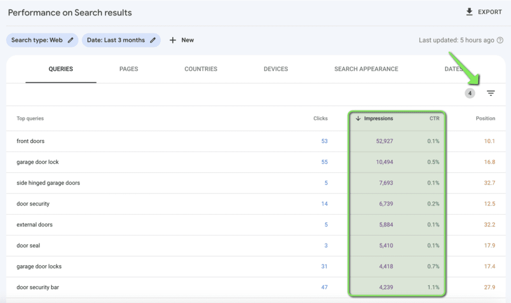

I’ve added a filter to only show keywords where the impressions are above 100 but the click-through rate is less than 1.2%.  

我添加了一个过滤器，只显示展示次数高于 100 但点击率低于 1.2% 的关键字。  

I would then scan down and find any keywords that I’m getting a lot of impressions for (a sort of proxy for search volume) but have really low clickthrough rates and/or poor average position.  

然后我会向下扫描并找到我获得大量印象（一种搜索量的代理）但点击率非常低和/或平均排名很差的关键字。  

The idea behind this is this: if a certain post is getting loads of impressions for a given query, Google considers it somewhat relevant to that query.  

这背后的想法是：如果某个帖子针对给定查询获得了大量印象，Google 认为它与该查询有些相关。  

However, the low CTR and average position likely means the post does not fully cover the user’s intent and I should write a more comprehensive post targeting that specific query.  

然而，低点击率和平均排名可能意味着帖子没有完全涵盖用户的意图，我应该针对特定查询写一篇更全面的帖子。

For example, in the screenshot below, this particular site got 522 impressions in 3 months for the query “fire door gaps”, but had a really low CTR (0.6%):  

例如，在下面的屏幕截图中，这个特定网站在 3 个月内因查询“fire door gaps”获得了 522 次展示，但点击率非常低 (0.6%)：

When I dig into the data, there is a general guide on the website titled “Fire Door Regulation Guide” which ranks for this keyword but not very well hence the low CTR. So I could try and optimise the existing article for this, but our free [SERP similarity tool](https://www.keywordinsights.ai/serp-similarity/) quickly shows us that the terms “fire door gap” and “fire door regulations” have completely different results:  

当我深入研究数据时，网站上有一个名为“Fire Door Regulation Guide”的一般指南，该指南对该关键字排名但不是很好，因此点击率很低。所以我可以尝试为此优化现有文章，但我们的免费 SERP 相似性工具很快向我们展示了术语“fire door gap”和“fire door regulations”有完全不同的结果：

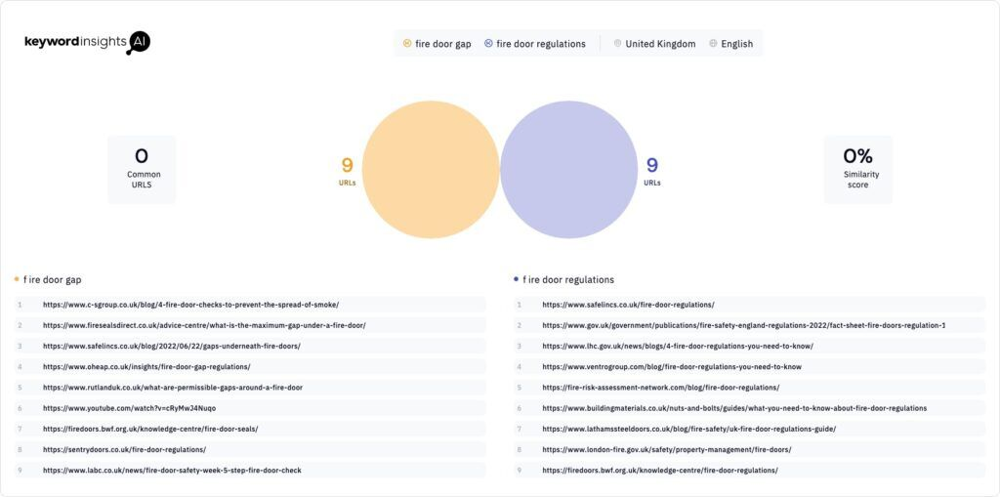

Consequently, to have the best chance of becoming more visible for this “high impression” keyword, I should consider creating a separate, specific piece dedicated to targeting that keyword.  

因此，为了让这个“印象深刻”的关键词变得更加明显，我应该考虑创建一个单独的、特定的部分来专门针对该关键词。

This is a great way to find, and spin out, new content ideas. However, if we were to integrate [Keyword Insights](https://www.keywordinsights.ai/) into the process we can improve the results and speed _significantly._ Read on to see how.  

这是寻找和衍生出新内容创意的好方法。但是，如果我们将关键字洞察集成到流程中，我们可以显着改善结果和速度。继续阅读以了解如何操作。

## How to quickly find new content ideas in Search Console with Keyword Insights  

如何使用关键字洞察在 Search Console 中快速找到新的内容创意

The above process for finding new content ideas could benefit from 3 big improvements:  

上述寻找新内容创意的过程可以受益于 3 大改进：

1.  In the above example, I was only able to take into account the impressions of a single keyword, “fire door gaps”. It’s likely there are many similar keywords that mean the same thing in the account, it’s just not easy to quickly find and group them all together.  
    
    在上面的示例中，我只能考虑单个关键字“fire door gaps”的印象。帐户中可能有许多相似的关键字表示相同的东西，快速找到并将它们组合在一起并不容易。  
    
    Collectively, the sum of their impressions is likely to be MUCH more than the 522 that the single keyword had. If I was prioritising which content to write next, I’d choose one where the collective “cluster” of keywords was higher than another cluster.  
    
    总的来说，他们的印象总和可能远远超过单个关键字的 522。如果我要优先考虑接下来要写的内容，我会选择关键字的集体“集群”高于另一个集群的内容。
2.  It’s hard to quickly work out which keywords actually trigger long-form content.  
    
    很难快速找出哪些关键字实际触发了长篇内容。  
    
    The site I’m using in this example is an e-commerce store, so a lot of the queries which fit my criteria (high impressions, but low CTR) likely relate to products and need to be captured by pages which are more transactional in nature.  
    
    我在这个例子中使用的网站是一个电子商务商店，所以很多符合我的标准的查询（高印象，但低点击率）可能与产品相关，需要被更多交易的页面捕获自然。  
    
    You’ll see in the first screenshot there are keywords like “front door”. Of course, this is likely not to be a “content opportunity”.  
    
    您会在第一个屏幕截图中看到诸如“前门”之类的关键字。当然，这很可能不是“内容机会”。
3.  Without flicking between different tabs in Search Console, or taking the time to set up data studio (or “looker studio” as it’s now known), it’s hard to quickly see what the URL is that is ranking for a given keyword and even harder to work out exactly how bad or well we are ranking for that keyword  
    
    如果不在 Search Console 中的不同选项卡之间切换，或者不花时间设置数据工作室（或现在已知的“looker studio”），就很难快速查看给定关键字排名的 URL 是什么，甚至更难准确计算出我们对该关键字的排名有多差或多好

Incorporating Keyword Insight’s [clustering tool](https://www.keywordinsights.ai/features/keyword-clustering/) into the process will provide a solution to each of these.  

将 Keyword Insight 的聚类工具整合到流程中将为这些问题中的每一个提供解决方案。

**Step 1  

步骤1**

Navigate to the “performance” section of Search Console and export all the queries:  

导航到 Search Console 的“性能”部分并导出所有查询：

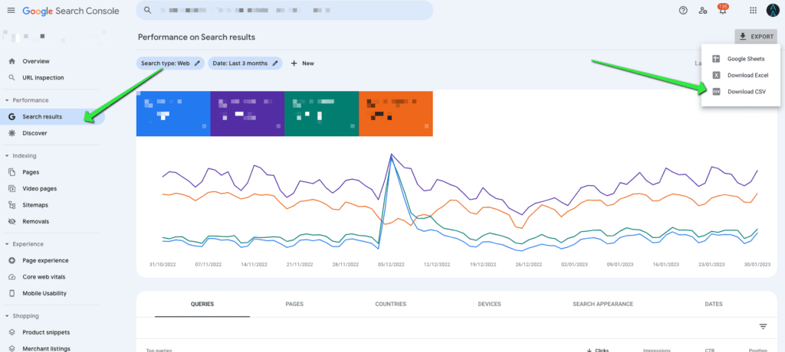

**Step 2  

第2步**

Head to the clustering module within Keyword Insights and select “cluster”, “context” and “rank”:  

前往关键字洞察中的集群模块并选择“集群”、“上下文”和“排名”：

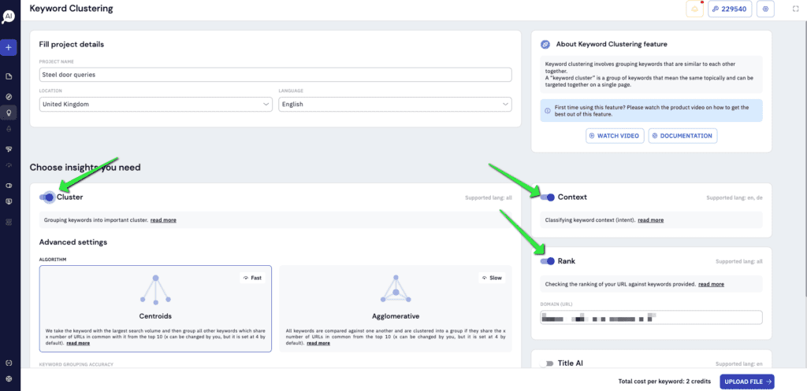

Make sure you put your target domain in the “rank” box as we’ll be seeing where the site ranks for each of the queries in Search Console (so you won’t have to flick between different tabs or set up a complex report in Looker Studio).  

确保将目标域放在“排名”框中，因为我们会在 Search Console 中看到网站对每个查询的排名（这样您就不必在不同的选项卡之间切换或在中设置复杂的报告）旁观者工作室）。  

Leave the other settings as default for now and click “upload file”.  

现在将其他设置保留为默认设置，然后单击“上传文件”。

**Step 3  

步骤 3**

Upload the “queries” CSV that you just downloaded from Search Console. You’ll then want to map the keywords and search volume by selecting “top queries” as the keyword and “impressions” as the search volume.  

上传您刚刚从 Search Console 下载的“查询”CSV。然后，您需要通过选择“热门查询”作为关键字和“印象”作为搜索量来映射关键字和搜索量。

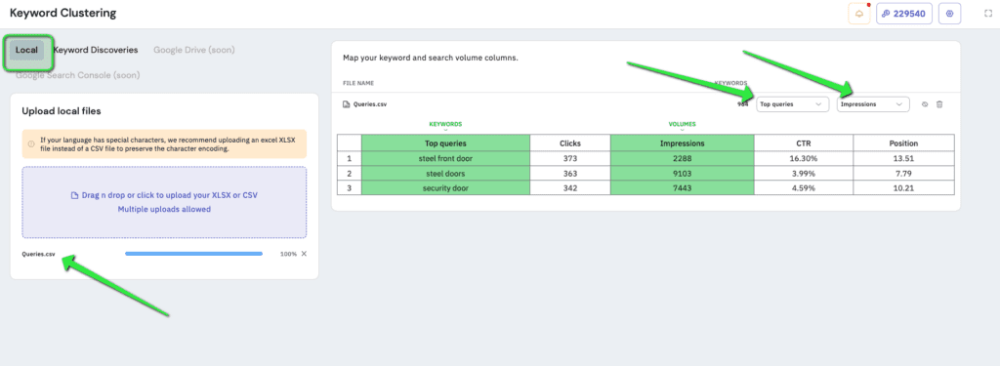

At this point, you can add other sources of keyword research if you wish. In fact, we allow you to add as many CSVs as you need and the columns don’t need to match up, as we’ll ask you to map them in the tool:  

此时，您可以根据需要添加其他关键字研究来源。事实上，我们允许您根据需要添加任意数量的 CSV，并且列不需要匹配，因为我们会要求您在工具中映射它们：

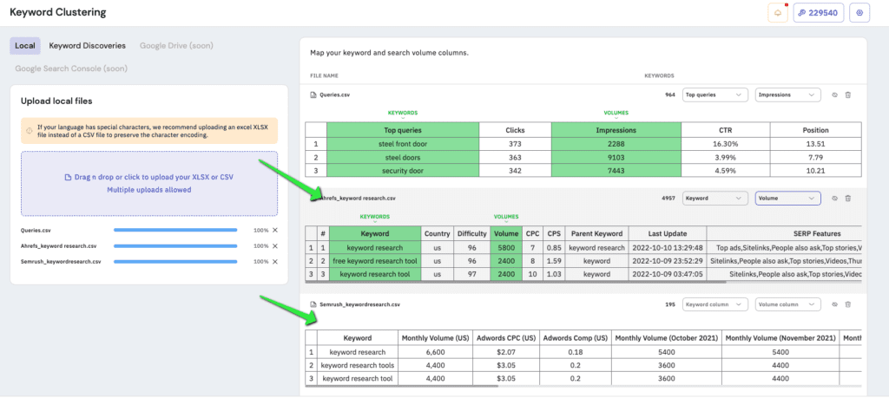

The screenshot above is just showing that you can add more CSVs. For this particular client, and the rest of the article, I actually only used the Search Console Queries.  

上面的屏幕截图只是显示您可以添加更多 CSV。对于这个特定的客户端以及本文的其余部分，我实际上只使用了搜索控制台查询。  

Also, the eagle-eyed among you may have noticed there will also be a Search Console integration coming soon so you don’t even need to download the queries and re-upload them:  

此外，眼尖的人可能已经注意到 Search Console 集成即将推出，因此您甚至不需要下载查询并重新上传它们：

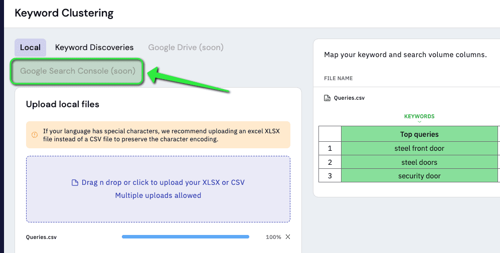

Anyway – step 4!  

无论如何 - 第 4 步！

**Step 4  

步骤4**

Click “summary” and then generate the report:  

点击“summary”，然后生成报告：

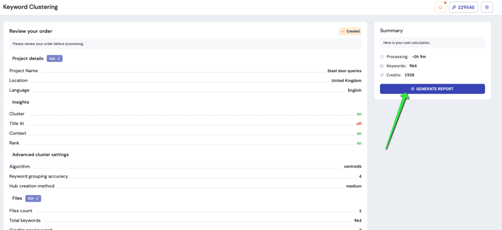

**Step 5  

步骤 5**

Go and make a cup of tea or coffee whilst the report runs. Depending how on many queries you uploaded it should only take a few minutes.  

在报告运行时去泡杯茶或咖啡。根据您上传的查询数量，它应该只需要几分钟。

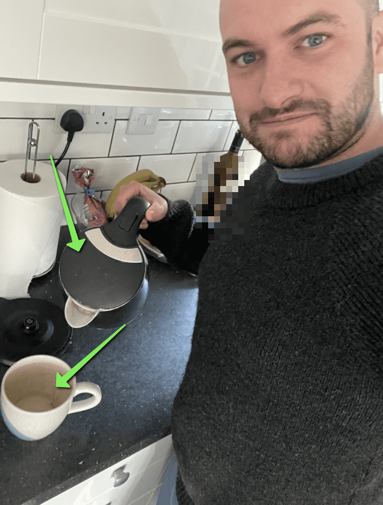

**Step 6  

步骤 6**

Open your report. It’ll have been sent to your email or you can access it in the “projects” tab of the tool. I’d recommend opening the Google Docs version of the report as it’s easier to use the pivot tables. It’s what we’ll be using for the rest of this guide.  

打开你的报告。它会发送到您的电子邮件，或者您可以在该工具的“项目”选项卡中访问它。我建议打开报告的 Google Docs 版本，因为它更容易使用数据透视表。这就是我们将在本指南的其余部分使用的内容。

Once the report is open, navigate to the “pivot table by keyword” tab and click the edit button to open the pivot table editor. You’ll then want to add a filter and select the “article” option:  

打开报告后，导航到“按关键字的数据透视表”选项卡，然后单击编辑按钮以打开数据透视表编辑器。然后你会想要添加一个过滤器并选择“文章”选项：

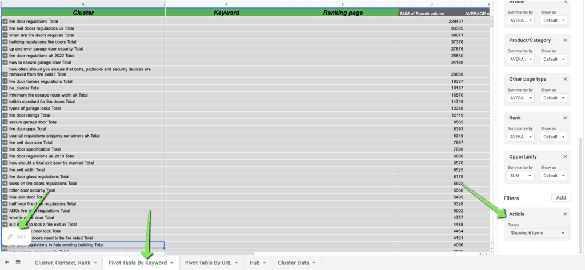

Once you’ve added the filter, unselect any number between 1-5. Basically, you’re leaving the numbers 6, 7, 8, 9 and 10 selected:  

添加过滤器后，取消选择 1-5 之间的任何数字。基本上，您要选择数字 6、7、8、9 和 10：

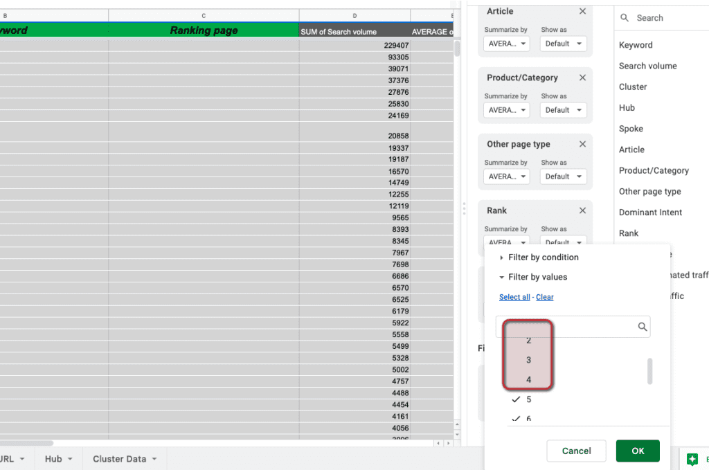

What this has done is left the keywords, and keyword clusters, that are more likely to be informational than transactional. This solves one of the major improvements that could be made to the process that I mentioned earlier:  

这所做的是留下关键字和关键字集群，它们更可能是信息性的而不是交易性的。这解决了可以对我之前提到的流程进行的一项重大改进：

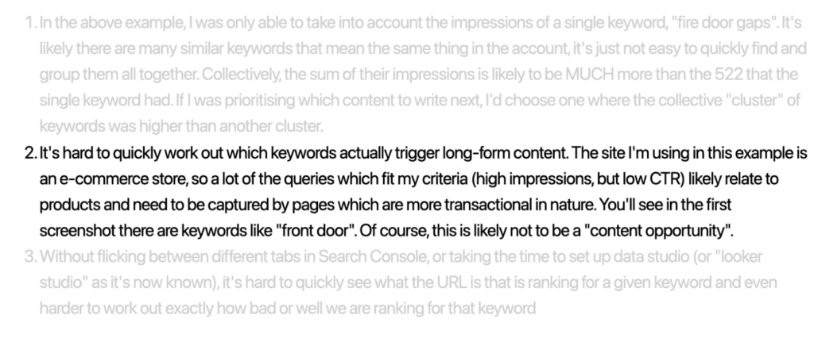

If you’d like to know exactly how/why this filter works, read more on our keyword context metric [here](https://www.keywordinsights.ai/features/search-intent/) (there’s a great video at the bottom of the page you should watch).  

如果您想确切了解此过滤器的工作原理/原因，请在此处阅读有关我们的关键字上下文指标的更多信息（您应该观看页面底部的精彩视频）。

**Step 7  

步骤 7**

Scan down the results and find a “cluster” of keywords where the average rank is low (or the opportunity is high. The opportunity basically looks at the average monthly search volume and takes into account where you currently rank and works out an “opportunity”.  

向下扫描结果并找到平均排名较低（或机会较高）的关键字“集群”。机会基本上查看平均每月搜索量并考虑您当前的排名并计算出“机会” .  

If you ranked in position 1, the opportunity would be “0” as you already have all the “opportunity”). In this example, I’ve found the “fire gaps” keyword again, where our average rank is on page 2 and the opportunity is decent too.  

如果您排在第 1 位，则机会将为“0”，因为您已经拥有所有“机会”）。在这个例子中，我再次找到了“fire gaps”关键字，我们的平均排名在第 2 页，机会也不错。

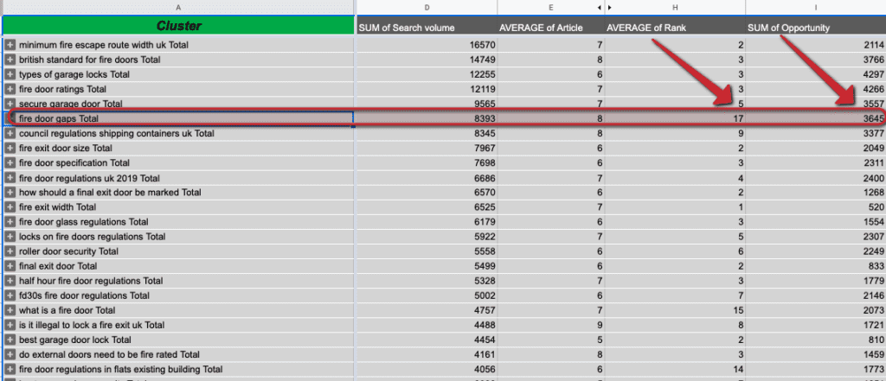

When you expand the cluster, you’ll notice there are many other, similar keywords each with its own search volume (or impressions):  

当您扩展集群时，您会注意到还有许多其他相似的关键字，每个关键字都有自己的搜索量（或展示次数）：

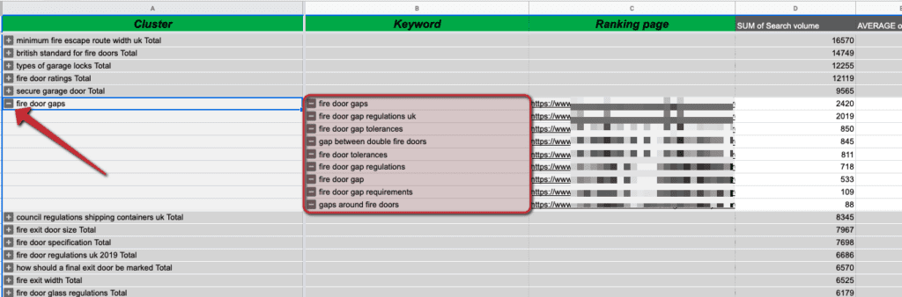

You’ll notice this has solves the remaining 2 of our improvements mentioned earlier:  

您会注意到这已经解决了我们之前提到的其余 2 项改进：

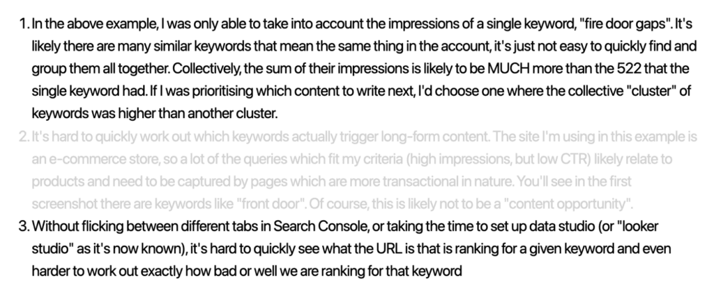

To summarise, by downloading the queries from Search Console and uploading them into our clustering tool you’re able to get a report which quickly groups all the similar keywords in the account together, pulls through your current average rank and tells you which ones are informational intent.  

总而言之，通过从 Search Console 下载查询并将它们上传到我们的集群工具中，您可以获得一份报告，该报告可以快速将帐户中所有相似的关键字组合在一起，提取您当前的平均排名并告诉您哪些是信息性的意图。  

You’ll often find many of the keywords here weren’t making themselves obvious using normal keyword research tools, probably because they didn’t “have any volume” or were quite obscure but, as we’ve seen, our impressions say otherwise.  

你会经常发现这里的许多关键词使用普通的关键词研究工具并不明显，可能是因为它们没有“任何数量”或者非常晦涩，但正如我们所见，我们的印象并非如此。  

Now I quite literally have around 85 new content ideas that I didn’t find during my standard keyword research process:  

现在，我确实有大约 85 个我在标准关键字研究过程中没有发现的新内容创意：

To help you write all this content, read our post on [how to quickly create content briefs](https://www.keywordinsights.ai/blog/how-to-write-an-optimised-content-brief/) that you can use to easily research and produce content which ranks by using our [content brief generator.](https://www.keywordinsights.ai/features/content-briefs/)  

为了帮助您编写所有这些内容，请阅读我们关于如何快速创建内容简介的帖子，您可以使用这些内容简介轻松地研究和制作使用我们的内容简介生成器排名的内容。

### Andy Chadwick

Andy Chadwick is a digital marketing consultant, specializing in SEO. He has been in the industry since 2013 and worked with start-up companies (he grew his own start-up to a turnover of £2.5 million in 3 years) as well as international organizations.  

Andy Chadwick 是一名数字营销顾问，专门从事 SEO。自 2013 年以来，他一直在这个行业工作，并与初创公司（他自己的初创公司在 3 年内发展到 250 万英镑的营业额）以及国际组织合作。  

He’s also worked in-house as well as agency side. Andy runs a successful SEO consulting business in the UK as well as Snippet Digital SEO consultancy with Suganthan.  

他还曾在公司内部和代理机构工作过。 Andy 在英国经营着一家成功的 SEO 咨询公司，并在 Suganthan 经营着 Snippet Digital SEO 咨询公司。  

## Related articles

Sorry, we couldn't find any posts. Please try a different search.  

抱歉，我们找不到任何帖子。请尝试不同的搜索。

## Subscribe to our _newsletter_

Subscribe to get our latest news, offers, insights, and any updates.  

订阅以获取我们的最新消息、优惠、见解和任何更新。
