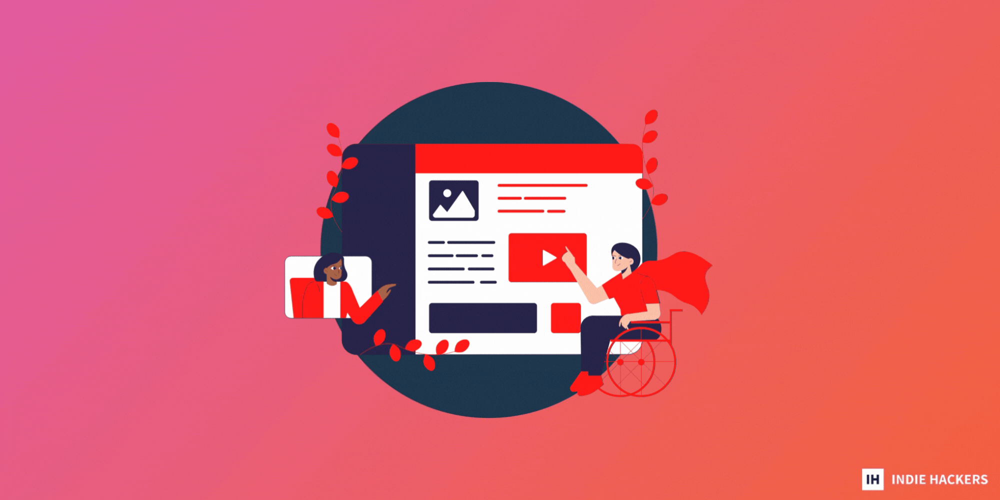

## 📖 Copywriting for Conversions  

📖 转化文案

_by [James Fleischmann  

詹姆斯·弗莱施曼 (James Fleischmann)](https://www.indiehackers.com/IndieJames)_

When it comes to writing landing page copy and CTAs, there are a few gems that are specific to indie hackers.  

在编写着陆页副本和 CTA 时，有一些专门针对独立黑客的精华。

Let's dive in!  

让我们开始吧！

### What is copywriting?  

什么是文案？

Copywriting is about conveying your product's value effectively. That's it. If you do it well, a reader from your target market will convert if it's the right solution for them. You don't need to try to get them to convert if it’s not the best solution for them.  

文案写作是关于有效地传达您的产品的价值。就是这样。如果你做得好，如果这是适合他们的解决方案，目标市场的读者就会转换。如果这不是最适合他们的解决方案，您无需尝试让他们转换。  

Manipulative copy is bad copy.  

操纵复制是错误的复制。

It's less about hacks and psychology, and more about knowing your audience, understanding their pain points, and communicating the truth of how your product can help them.  

这与技巧和心理学无关，更多的是了解您的受众，了解他们的痛点，并传达您的产品如何帮助他们的真相。

### Copywriting for conversions  

转化文案

Here are the two toughest things about copywriting:  

以下是文案写作中最棘手的两件事：

1.  Writing tight copy: You have to be so concise that it hurts. It's harder than it sounds, because it requires you to convey a lot of information in few words. Ask yourself whether every word, sentence, and paragraph adds value. If not, remove it.  
    
    写紧凑的副本：你必须如此简洁以至于它伤害。这比听起来更难，因为它需要您用几句话来传达大量信息。问问自己，每个单词、句子和段落是否都增加了价值。如果没有，请将其删除。
2.  The curse of knowledge: You know the problem you're solving and the solution you're providing, so it's very easy to assume that your reader knows it, too. They probably don't. But sometimes, they do. So, write for your readers. Don't over-explain or under-explain.  
    
    知识的诅咒：你知道你正在解决的问题和你提供的解决方案，所以很容易假设你的读者也知道它。他们可能不会。但有时，他们会这样做。所以，为你的读者而写。不要过度解释或解释不足。  
    
    This requires a lot of knowledge about what they know and don't know about your product, the market, etc.  
    
    这需要大量关于他们对你的产品、市场等了解和不了解的知识。

### Writing for conversions  

为转化而写作

Here are some tips for writing copy that converts:  

以下是编写可转换文案的一些技巧：

-   Write like a human, not like a robot or a company. Be personable and write in first-person. Write like you speak.  
    
    像人一样写作，而不是像机器人或公司。风度翩翩，以第一人称写作。像说话一样写作。
-   Write at a sixth grade level. Use jargon only if it makes sense in your niche.  
    
    写六年级的水平。仅当行话对您的利基市场有意义时才使用行话。
-   Avoid buzzwords. They aren't fooling anyone.  
    
    避免流行语。他们不是在愚弄任何人。
-   Work backwards from your objective. What do you want? To impart value? Conversions? Shares? Know the goal, and work toward it.  
    
    从你的目标向后工作。你想要什么？传递价值？转换？分享？知道目标，然后为之努力。
-   Don't bury the lede. If something will get the user to read on or convert, keep it above the fold. Deeper dives and explanations can go below the fold.  
    
    不要埋葬lede。如果某些东西会让用户继续阅读或转换，请将其放在首屏。更深入的探讨和解释可以深入浅出。
-   Directly address the needs of your target audience, and handle common objections before they can make them.  
    
    直接解决目标受众的需求，并在他们提出异议之前处理常见的异议。
-   Use social proof. Testimonials, big name customers, and number of customers all work well.  
    
    使用社会证明。客户评价、知名客户和客户数量都很好。
-   Back up what you say with numbers and data. Visual representations can sometimes help.  
    
    用数字和数据支持你所说的话。视觉表现有时会有所帮助。
-   Focus on benefits over features.  
    
    关注好处而不是功能。
-   Use [active voice](https://www.grammarly.com/blog/active-vs-passive-voice/) and descriptive language.  
    
    使用主动语态和描述性语言。
-   Have fun with it! Bored leads do not convert.  
    
    玩得开心！无聊的线索不会转换。

### Call-to-action tips  

号召性用语提示

CTAs deserve their own section because they're incredibly important:  

CTA 应该有自己的部分，因为它们非常重要：

-   Connect it to the benefit. Never use "Check out this thing" or "Get started" as a CTA.  
    
    将其与利益联系起来。永远不要使用“检查这个东西”或“开始使用”作为 CTA。
-   Start with a verb.  
    
    从一个动词开始。
-   Use first-person ("my" instead of "your").  
    
    使用第一人称（“我的”而不是“你的”）。
-   Make the button or words stand out.  
    
    使按钮或文字脱颖而出。
-   Put it at the top and bottom of your landing page. In long-form content, add it in multiple places, but make sure you don't hurt the readability. Put it between sections.  
    
    将其放在目标网页的顶部和底部。在长篇内容中，将其添加到多个位置，但要确保不影响可读性。把它放在各部分之间。

### Formatting tips  

格式化提示

-   Use effective headers.  
    
    使用有效的标题。
-   Use font and font size to your advantage; typography isn’t just for looks, it’s also for readability.  
    
    使用对您有利的字体和字体大小；排版不仅是为了外观，也是为了可读性。
-   Make it easily skimmable.  
    
    使其易于浏览。
-   Make your site clean and easy to navigate.  
    
    使您的网站干净且易于浏览。
-   If grammar and spelling are not your strong suits, or if you're writing outside of your first language, [hire an editor](https://www.indiehackers.com/post/outsourcing-from-personal-assistant-to-developer-heres-what-you-need-to-know-outsourcing-best-practices-and-more-43f7273e32).  
    
    如果语法和拼写不是您的强项，或者如果您的写作不是您的母语，请聘请一位编辑。

### SEO

SEO is obviously extremely important in copywriting, but I'm not going to cover it much in this article. I [wrote about it](https://www.indiehackers.com/post/seo-is-a-waste-of-time-for-most-indie-hackers-a8043cb033) recently if anyone needs a primer on the topic. For now, I'll just mention a couple of things:  

SEO 显然在文案写作中极其重要，但我不会在本文中过多介绍它。如果有人需要有关该主题的入门知识，我最近写了这篇文章。现在，我只提几件事：

-   Avoid keyword stuffing. That's a thing of the past. Just say what needs to be said as quickly as possible.  
    
    避免关键字堆砌。那是过去的事了。该说的话尽快说。
-   Write for humans, not Google.  
    
    为人类而不是谷歌写作。

### Frameworks  

构架

Did you know that there are copywriting frameworks? There are. Like, a lot of them. Here are a few:  

你知道有文案框架吗？有。像，很多。这里有一些：

-   AIDA: This one is the most common. Grab _attention_, hit them with _interesting_ facts, share stories to generate _desire_, and lay out your desired _action_.  
    
    AIDA：这个是最常见的。吸引注意力，用有趣的事实打动他们，分享故事以产生欲望，并提出你想要的行动。
-   AIDCA: The same, but add in _conviction_. Meaning social proof, statistics, and so forth, right before the _action_.  
    
    AIDCA：相同，但增加信念。意思是行动之前的社会证明、统计数据等。
-   PAS: This is best when you want to focus on a problem and your solution (i.e. landing pages). Present the _problem_, create _agitation_ by diving into it more, and offer a _solution_.  
    
    PAS：当你想专注于一个问题和你的解决方案（即着陆页）时，这是最好的。提出问题，通过深入研究来引起骚动，并提供解决方案。
-   ACCA: This is best if your target customers don't know the problem yet. Present the _problem_ in a way that creates awareness, explain why it's a bad thing (_comprehension_), create _conviction_ (social proof, etc.), and provide steps for _action_.  
    
    ACCA：如果你的目标客户还不知道这个问题，这是最好的。以一种能提高认识的方式提出问题，解释为什么这是一件坏事（理解），建立信念（社会认同等），并提供行动步骤。
-   QUEST: _Qualify_ who the solution is for, show that you _understand_ by relating to their problem, _educate_ them about the solution, _stimulate_ them (features, demos, social proof), and help them _transition_ into a customer by showing them the action to take.  
    
    QUEST：确定解决方案的适用对象，通过与他们的问题相关来表明您理解，就解决方案对他们进行教育，刺激他们（功能、演示、社会证明），并通过向他们展示要采取的行动来帮助他们转变为客户.

### A quick note on AI  

关于 AI 的快速说明

I'm personally not a fan of writing with AI. I think it makes humans even less capable of communicating.  

我个人不喜欢用 AI 写作。我认为这使人类的交流能力更差。

Plus, I actually tested it as an option for my other _newsletter_, and it was more work to edit it than it would have been to write it. So for me, it's not an option. But a lot of indie hackers are finding it super useful for getting started!  

另外，我实际上将它作为我的其他时事通讯的一个选项进行了测试，编辑它比编写它要费更多的功夫。所以对我来说，这不是一个选择。但是很多独立黑客发现它对于入门非常有用！

[Jan Koch](https://www.indiehackers.com/iamjankoch/history) [shared](https://www.indiehackers.com/post/steal-my-ai-copywriting-rules-to-create-epic-content-cc4734c0aa) some solid tips a few weeks back, which I thought might be helpful if you decide to try using AI!  

几周前，Jan Koch 分享了一些可靠的技巧，我认为如果您决定尝试使用 AI，这些技巧可能会有所帮助！

### Tools

-   [Grammarly](https://www.grammarly.com/).  
    
    语法上。
-   [Thesaurus](https://www.thesaurus.com/).  
    
    同义词库。
-   [Hemingway App](https://hemingwayapp.com/): Simplify your writing.  
    
    海明威应用程序：简化您的写作。
-   [Headline Analyzer](https://headlines.sharethrough.com/): Tells you whether your headline is engaging.  
    
    标题分析器：告诉您标题是否引人入胜。
-   [Convertize](https://www.convertize.com/): If you do want to do some A/B testing, this is a handy tool for that.  
    
    Convertize ：如果你确实想做一些 A/B 测试，这是一个方便的工具。
-   [The Most Dangerous Writing Prompt App](https://www.squibler.io/dangerous-writing-prompt-app): Gives you a prompt, and you write about it.  
    
    The Most Dangerous Writing Prompt App ：给你一个提示，然后你就写下来。
-   [Copy.ai](https://www.copy.ai/): If you want to go the AI route, there are a ton of options. This is a leader in the space.  
    
    Copy.ai ：如果你想走人工智能路线，有很多选择。这是该领域的领导者。
-   [Jasper](https://www.jasper.ai/): Jasper is another leading AI tool.  
    
    Jasper：Jasper 是另一个领先的 AI 工具。

### Resources  

资源

_Books:_

-   [Love-Based Copywriting System: A Step-by-Step Process to Master Writing Copy That Attracts, Inspires and Invites](https://www.goodreads.com/en/book/show/26843251-love-based-copywriting-system).  
    
    基于爱的文案系统：掌握吸引、启发和邀请文案的循序渐进过程。
-   [Building a StoryBrand: Clarify Your Message So Customers Will Listen](https://www.goodreads.com/en/book/show/34460583-building-a-storybrand).  
    
    建立故事品牌：阐明您的信息，以便客户倾听。

_Courses:  

培训班：_

-   [Copywriting Upskill](https://copyhackers.com/copywriting-upskill/).  
    
    文案提升技能。
-   [The Complete Copywriting Course](https://www.udemy.com/course/the-complete-copywriting-course/).  
    
    完整的文案写作课程。

__Newsletter_s:  

时事通讯：_

-   [Marketing Examples](https://marketingexamples.com/) by Harry Dry.  
    
    Harry Dry 的营销实例。
-   [Marketing Experiments](https://marketingexperiments.com/).  
    
    营销实验。
-   [Ariyh](https://ariyh.com/).  
    
    哎呀。

_Will you implement any of these tips into your copy? Let's chat below!  

您会将这些技巧中的任何一个应用到您的文案中吗？下面一起聊聊吧！_

_[Discuss](https://www.indiehackers.com/post/un-slimy-copywriting-for-conversions-2769caf4bf) this story.  

讨论这个故事。_
