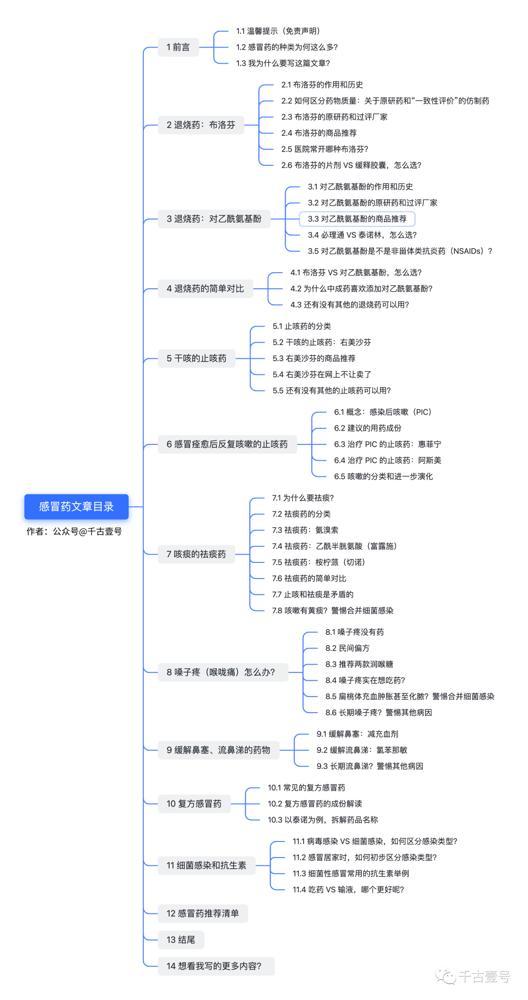

## 1 前言

### 1.1 温馨提示（免责声明）

1.  本文的受众群体暂未考虑到以下人群：老人、12 岁以下儿童、孕妇、哺乳期女性，以及有相关基础疾病的人。此类人群请优先遵循医嘱。
    
2.  本文信息仅作为科普和学习交流之用，不代表权威，不提供医学诊断，更无法取代医生对特定病人的个体化诊疗方案。
    
3.  本文仅讨论在自行购药前提下的感冒场景。具体意思是：（1）暂未考虑到非感冒症状，如病情较严重，请立即就医。（2）如果你本来就打算自行购药，本文会对你有些帮助；如果你本来就打算就医，请优先遵循医嘱，再看本文。
    
4.  本文不是万字长文，而是**四万字长文**，覆盖面广，细节丰富，保姆级别，且配有大量清晰图片，适合只字不差地阅读，也适合跳读。有阅读长文的耐心，方有治病的耐心。
    

### 1.2 感冒药的种类为何这么多？

走进你身边的任何一家药店，会发现里面最显眼的位置摆放的是感冒药，种类五花八门、数量庞杂：

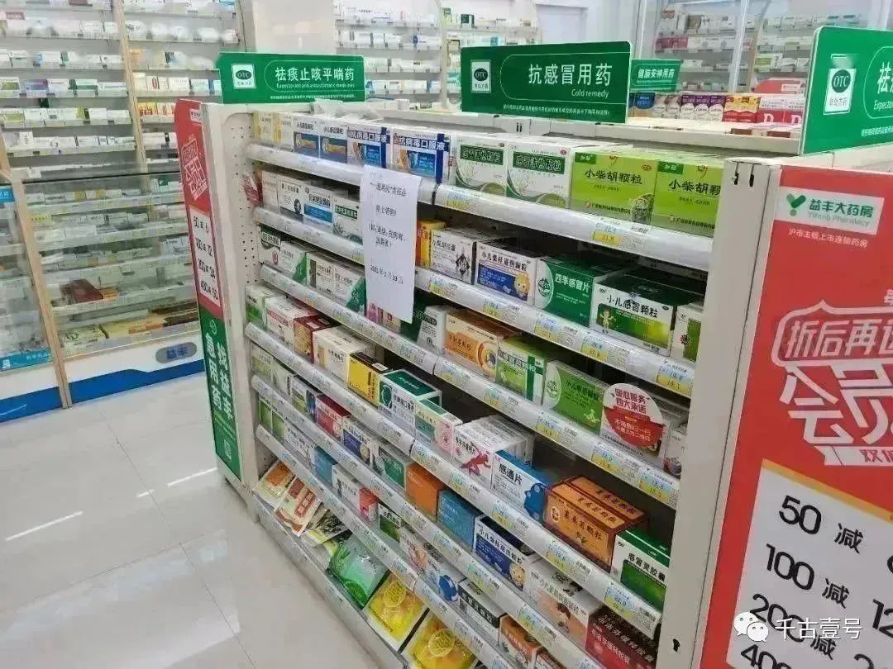

感冒药的种类为何这么多？这是我们很关心的一个问题。核心原因很简单：因为现代医学认为，到目前为止，**感冒没有特效药**。换句话说，世界上没有能“治好感冒”的感冒药。

所有的感冒药都只是**对症治疗**，感冒痊愈靠的是**我们自身的免疫力**。

怎么理解对症治疗呢？临床上就各种**治疗方法**的目的而言，可以分为三种：

-   **对因治疗**：消除病因，在理想的情况下可达到根治的目的。对应的药物称之为特效药。
    
-   **对症治疗**：不在于消除病因，而在于缓解症状。比如针对感冒的治疗，如果发烧就吃退烧药，如果咳嗽就吃止咳药。发烧、咳嗽只是症状，不是病因。前者是现象，后者是原因。
    
-   **支持治疗**：治疗的目的既不是消除病因，也不是针对某些症状，而是为了改善病人的一般情况，如营养、精神状态等。
    

大部分感冒都是病毒性感冒，现在并没有专门“杀死病毒”的药物，所以做不到对因治疗，只能做到对症治疗。

你可能会感叹：现代医学这么先进，怎么连感冒都治不好呢？可是你要知道：病毒早在人类诞生之前就已经存在。

按照时间线的发展顺序是这样的：

-   地球的年龄有 **45 亿年**左右。
    
-   单细胞生物出现在 **30 亿年**前。生命（细胞）诞生之日起，也就诞生了病毒。
    
-   人类祖先的历史，可以追溯到 **700 万年**前。那个时期人和黑猩猩开始出现分化，但活动的区域仍然离不开森林。
    

《极简人类史》的作者大卫·克里斯蒂安曾这样形象地描述人类在宇宙历史中的位置：

> 假如将 130 亿年的整个宇宙演化史简化为 13 年，那么病毒的出现大约在三年前，人类的出现大约是在 3 天前。最早的农业文明发生在 5 分钟前，工业革命的发生在不过 6 秒钟前，而世界人口达到 60 亿、第二次世界大战、阿波罗登月都只不过是最后一秒发生的事情。

人类作为地球上的一种生命，与某些微生物（比如细菌、病毒、寄生虫等）的历史相比，只是弹指一挥间。

与其感叹人类的渺小，我们更应该庆幸的是：普通感冒具有**自限性**，一周左右即可自愈。

但是，感冒期间如果症状逐渐变得严重还不治疗的话，一周之内恐怕好不了，拖久了还容易引发其他疾病。所以，如果你明显感觉到感冒症状有变严重的趋势、状态不太好，那还是有必要吃感冒药的。

所谓的“吃药七天好，不吃一周好”这句话是事后诸葛亮视角，完全站不住脚。因为人都有求生的本能，在症状逐渐加剧的情况下，不可能无动于衷。

前面讲到，感冒只能对症治疗，感冒的**症状**一般就 10 种左右：发热、咳嗽、咽喉痛、鼻塞、流鼻涕、打喷嚏、嗓子哑、肌肉酸痛、无力等等。有些症状有对应的治疗药物，有些症状没有药，有些症状有多种药。这些药物的**成份**加起来至少有 10 种，然后：

-   如果把这 10 种成份经过**排列组合**，就能出现很多种感冒药的**单方制剂**或者**复方试剂**（当然，有些感冒药不能混吃）。
    
-   同一种成份，可以由很多厂家生产，这些厂家会起不同的商品名，所以市面上就出现了无数种感冒药的**商品**。他们也会按照各自的偏好做排列组合。
    
-   另外，有些药厂会在感冒药中掺入中成药成份，中成药的范围那可就广了。
    

最终呈现在货架上的就是眼花缭乱的景象。

通过本文，希望能让你能较全面地掌握感冒的一些医学科普知识和系统认知，对常见的有效感冒药有明智的用药原则和分辨能力，不被乱象所迷惑，避免在自行购药时做出盲目选择。

### 1.3 我为什么要写这篇文章？

2021 年初，我患了一次重感冒，那时几乎所有的感冒症状我都有，而且咳嗽剧烈、嗓子哑了好几天。由于我忙于加班没空请假、没空去医院，所以通过在线问诊的方式咨询了医生。医生给我开了「布洛芬」药方让我先退烧，退烧之后再继续问诊。

我心想：布洛芬不是女生来大姨妈止痛吃的么？竟然还能退烧？真是神奇。那是我第一次关注药方里开的是什么药（以前都是医生开什么药我就吃什么，绝不会多看一眼，绝对不会去记也记不住那些药的名字）。医生告诉我说：布洛芬的主要作用是解热、镇痛、抗炎（这种消炎并不是抗生素的消炎）。

补充说明：（1）我很确定当时我得的不是新冠，因为那段时间深圳并无新增感染病例，而且我每天照常上下班，同事们并没有异常症状。（2）线上问诊的主要作用是咨询和参考，无法代替线下就医的诊断和治疗。

《创造：用非传统方式做有价值的事》一书中提到，顶级投资大师 Bill Gurley 曾经这样说过：

> “你无法靠外力变成最聪明或者最鲜亮的那一类人，但你可以成为最有见识的人，你可以在搜集和整理信息方面超越其他所有人。”

而我就是在做这件事。从那以后，我以**布洛芬**作为切入点，开始密切关注各种感冒药的成份和效果，关注感冒的症状以及相关医学常识，在全网查阅资料做交叉验证，留意身边的人和事，逐渐对感冒有了比较系统的了解。也是从那时候开始，我有意在家里准备了一些常用药，以备不时之需。

写下这篇文章，一方面是希望把自己对感冒的网状认识，通过树状的句法，用线性的文字展开，写作的唯一奖赏是写作本身；另一方面是希望广大读者能够对自己的身心健康更加关注，写作不是写文章，而是影响现实世界。经历了三年疫情和全民感染之后，我们每个人最大的愿望是：国泰民安，家人健康。

接下来的段落，我会介绍和推荐一些常用的感冒药**成份**和感冒药**商品**，并穿插一些感冒相关的科普知识，争取让你在理论和实践上获得双重收获。

## 2 退烧药：布洛芬

发烧是身体免疫反应的一种表现，因此当遇到发烧时，不要着急用药；其他症状同理。

常见的退烧药成份有两种：布洛芬、对乙酰氨基酚。

目前，世界卫生组织(WHO)和美国儿科学会(AAP)向全球儿童推荐的不良反应小的退烧药只有两种：对乙酰氨基酚和布洛芬。说明它们是经过了历史检验的，二者的临床效益（疗效、安全性、成本）比较接近，不存在孰优孰劣之说。

这一段，我们先来讲讲布洛芬。

### 2.1 布洛芬的作用和历史

布洛芬的英语是 Ibuprofen，第一个单词是大写的 I；主要作用是：止痛、退烧、抗炎；化学成分为：对异丁苯丙酸；属于**非甾体类抗炎药**（NSAIDs，也称作非类固醇消炎药）。

布洛芬于 1961 年由英国化学家**斯图尔特·亚当斯**（Stewart Adams）发明。1961 年的某一天，亚当斯要参加一个重要的医学会议并发表[演讲](https://mp.weixin.qq.com/s?__biz=MzI5ODUyMTE0Mg==&mid=2247489237&idx=1&sn=be7e59ed52d904110f66a786648b3745&scene=21#wechat_redirect)，偏偏前一天大醉一场，整个人头痛欲裂。为了演讲的顺利进行，他服用了一款刚刚新合成的化合物——对异丁苯丙酸，谨慎起见他将服用的剂量定为 600 毫克。没想到真有效果，头痛立马得到缓解，布洛芬就这么意外诞生了。

在 1961 年成功合成布洛芬之前，亚当斯在这方面研究了 10 年，就是为了帮助**类风湿性关节炎**患者，找到一种可以替代阿司匹林、副作用更小的**非甾体类抗炎药**。

阿司匹林（Aspirin）于 1897 年问世，是第一种非甾体类抗炎药，被称为医学史上三大经典药物之一（另外两种是青霉素、安定）。20 世纪初，治疗类风湿性关节炎的常用止痛药是阿司匹林，但必须在非常高的剂量下使用，而且副作用明显，常导致患者出现过敏、出血、消化不良等副作用。我们在看当时的美国西部片里经常有相关镜头，那些人需要大把大把地服用阿司匹林才能止痛。布洛芬发明之后，阿司匹林逐渐退出历史舞台。

1962 年，亚当斯所在的公司 Boots 成功获得布洛芬的专利。虽然布洛芬为 Boots 公司带来了丰厚的回报，但亚当斯与他的伙伴们在专利授权后并未因此赚到一分钱。其中的原因也非常简单：亚当斯发明布洛芬是一个职务行为，知识产权归 Boots 公司所有，亚当斯和伙伴只具有“发明人”的署名权。2019 年 1 月 31 日，亚当斯在诺丁汉去世，享年 95 岁。

布洛芬于 1969 年作为处方药于英国上市，主治关节炎疼痛；1974 年作为处方药于美国上市。1983 年，布洛芬作为非处方药在各药店得到普及。1980 年，中国的山东新华药厂通过仿制实现布洛芬的工业化生产。1985 年，布洛芬的专利到期后，各个厂商纷纷投入生产。**20 世纪 90 年代，布洛芬全球销售额突破 10 亿美元**，使其成为第一款销售额突破 10 亿美元的解热镇痛类药物。

有意思的是，布洛芬（ibuprofen）的别名比较难听，叫拔怒风。

### 2.2 如何区分药物质量：关于原研药和“一致性评价”的仿制药

2022 年 12 月份是全民感染新冠的时候，大部分人都有发烧的经历。这让很多人知道了市面上最常见、也是最为推荐的退烧药有两种：布洛芬、对乙酰氨基酚。当你了解这个常识时，估计已经超过一半的人。

在看了这么多关于退烧药的文章之后，我发现有两个关键词非常重要，这两个词是“**原研药**”、“**一致性评价**”。了解这两个词，可以说是我近期最大的收获，这让我深刻地认识到：不同厂家生产的布洛芬，效果是不一样的；其他药物同理。当你知道这个常识时，可能已经超过了 99%的人。

药物一般分为[两种](https://mp.weixin.qq.com/s?__biz=MzkwMDMwNjE0Mg==&mid=2247595732&idx=2&sn=6686f0230c115f38e4fde35efde2c0ef&scene=21#wechat_redirect)：

-   **原研药：指原创研究的新药**，是中华人民共和国知识产权局授予的发明专利保护期的药品或国家发改委文件中标示为原研制的药品。
    
-   **仿制药：指以原研药为参考对比**，在通用名、剂量、安全性、效力、质量、作用以及适应证上相同的**一种仿制品。**
    

大部分有实力研发新药的是国外巨头药企，一款新药平均耗资 10 亿美元，有 20 年专利保护期，保护期内不得仿制，这样的药在国内被通俗称为进口药。专利过期后，由原生产商生产的药品就是[原研药](https://mp.weixin.qq.com/s?__biz=MzI2NDUyODcwMg==&mid=2247484265&idx=1&sn=3aaf28a47ea7582f681a70adfe5e6850&scene=21#wechat_redirect)，由其他药企仿制生产出来的药品就是**仿制药**。

可见，原研药的研发成本很高，从研发到上市，一般需要十几年，往往价格昂贵。仿制药的研发一般只需要一年多，价格便宜。比如，布洛芬从 1953 年开始研发到在英国获批上市共用了 17 年时间。

原研药的质量肯定是过硬的，那仿制药的质量要如何区分呢？这就涉及一个[很重要的概念](https://mp.weixin.qq.com/s?__biz=MzU3NzYxOTY5OQ==&mid=2247484757&idx=1&sn=368670f50c2def60b25b209e6a1fd32d&scene=21#wechat_redirect)——**仿制药的一致性评价：**

> 指对已经批准上市的仿制药，按与原研药品质量和疗效一致的原则，分期分批进行质量一致性评价工作，通过评价的仿制药在质量与药效上达到与原研药一致的水平，在临床上可替代原研药。
> 
> 这不仅可以节约医疗费用，同时也可提升我国的仿制药质量和制药行业的整体发展水平，保证公众用药安全有效。

简单来说，**一个仿制药如果通过了一致性评价，那我们就可以认为使用它的疗效和安全性都和用原研药是相当的**。

我国[从 2016 年开始](https://mp.weixin.qq.com/s?__biz=MjM5ODAwNzQ2MA==&mid=2650646799&idx=1&sn=c1be6aab43b4379869274dc78f97abb9&scene=21#wechat_redirect)推行仿制药的一致性评价。自 2016 年 3 月国务院发布《关于开展仿制药质量和疗效一致性评价的意见》以来，截至 [2021 年底](https://mp.weixin.qq.com/s?__biz=Mzg2OTE0ODI5NQ==&mid=2247590862&idx=1&sn=dbf4743cb24addb332b009ebd769360c&scene=21#wechat_redirect)，我国共有 693 个药品品种、2045 个商品通过了一致性评价。

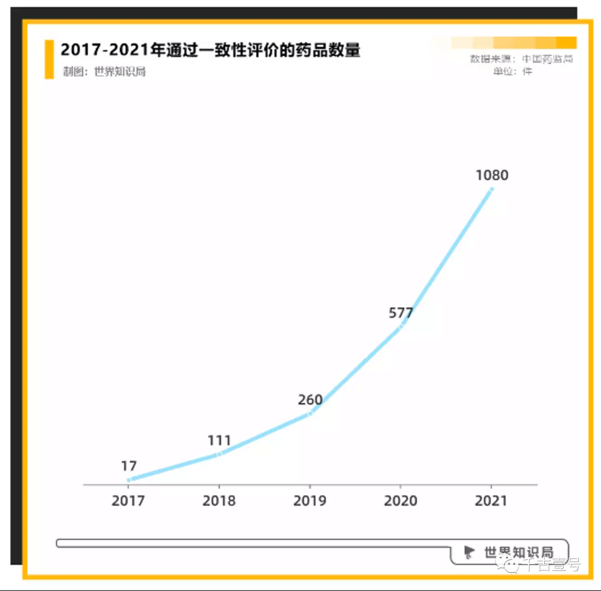

【划重点】怎么判断一个药物的质量可靠呢？我们现在有答案了：首先是**原研药**的质量最好，其次是通过“**一致性评价**”的仿制药质量也不错。我们在接下来推荐药物商品时，会将这个标准作为第一推荐原则。

通过一致性评价的药品包装上，大部分都有“仿制药一致性评价”[标志](https://mp.weixin.qq.com/s?__biz=Mzg2OTE0ODI5NQ==&mid=2247590862&idx=1&sn=dbf4743cb24addb332b009ebd769360c&scene=21#wechat_redirect)，如下图所示：

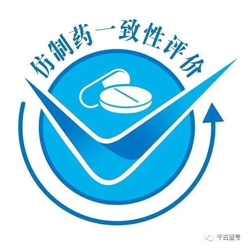

当然，也有一些过评的药物，商品包装上并没有上面这个标志。如果想要查准确、完整的原研药信息和药物过评信息，需要去一些医学知识库网站查询。

### 2.3 布洛芬的原研药和过评厂家

目前，市面上销售的布洛芬商品有 564 种，其中布洛芬片就有 376 种。不同厂家生产的布洛芬，药效的区别是比较大的。这么多厂家（企业）生产的布洛芬，要怎么选呢？

其实这很好选，建议优先选择原研药，其次选择“通过一致性评价”的仿制药。满足条件的商品数量不多，你在这个范围里选即可。我们来挨个看看。

1、布洛芬的**原研药**：

-   **布洛芬混悬液**、**布洛芬混悬滴剂**：原研公司是美国的强生，商品名是**美林**。这是给 6 个月以上~12 岁以下的儿童用的。
    
-   **布洛芬缓释胶囊**：原研公司是英国的葛兰素史克（GSK），国内商品名是**芬必得**，国外商品名是 Advil。国内由其子公司——中美天津史克制药有限公司（中美史克）生产上市。
    
-   **精氨酸布洛芬**：原研公司是意大利的赞邦集团，商品名是**司百得**，剂型包括**颗粒**和**片剂**。国内由意大利赞邦集团（Zambon）[在中国投资成立](https://mp.weixin.qq.com/s?__biz=MzU1ODI0NzczOQ==&mid=2247486206&idx=1&sn=f558c59862a728431962e1e88c992255&scene=21#wechat_redirect)的独资制药企业——海南赞邦制药有限公司生产上市。
    

到这里你可能有个疑问：布洛芬片（注意我说的是片剂）的原研公司是谁呢？其实也是 GSK。准确来说，整个布洛芬这个成份的原研公司就是 GSK。具体历史[1]是这样的：

> 布洛芬最早的原研剂型是片剂和口服液，由美国强生旗下的麦克尼尔（MCNEIL）公司申报，但是后来由于质量问题停产了。
> 
> 葛兰素史克是 1984 年申报了片剂和口服液，1990 年又获批胶囊剂，这三个剂型目前进口到国内的只有胶囊剂（芬必得）。芬必得是最早进入中国的布洛芬缓释胶囊。
> 
> 因此，基于以上信息，我们国家的医药品监督管理总局**指定**芬必得为布洛芬缓释胶囊的原研药。

由此可见，随着时间的推移，原研药并不是固定不变的，谁是原创发明或者当下谁的质量最好，我们国家在引入时就指定它为原研药，指定它为仿制药的**参比制剂**。

2、布洛芬通过“**一致性评价**”的仿制药——截至 2022 年 1 月，布洛芬有[8 个剂型](https://mp.weixin.qq.com/s?__biz=Mzg4Mzg0MzA5NA==&mid=2247532709&idx=2&sn=825805b4c49aaf779157afbb8c507e7f&scene=21#wechat_redirect)、35 个厂家、53 个商品通过了一致性评价：

-   布洛芬缓释胶囊有 12 家企业过评
    
-   布洛芬颗粒 9 家
    
-   布洛芬片 8 家
    
-   布洛芬注射液 4 家
    
-   布洛芬混悬液 4 家
    
-   精氨酸布洛芬颗粒 2 家
    
-   布洛芬软胶囊 1 家
    
-   布洛芬混悬滴剂 1 家
    

其他剂型暂时没有企业过评。

布洛芬的过评厂家，详细表格数据如下：

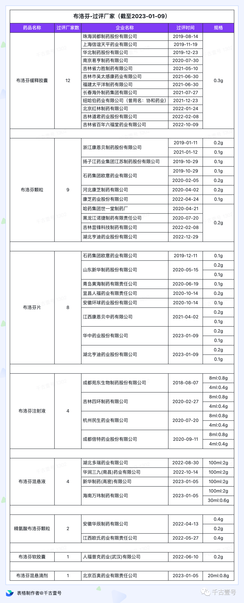

### 2.4 布洛芬的商品推荐

我们在上面讲到，布洛芬的原研药有 3 种，通过一致性评价的仿制药有 53 种，已经把选择范围大大缩小了。但对于有选择困难症的人来说，这其实还是挺难选的。

这里根据我的个人经验，**推荐四种我认为很不错的布洛芬商品**，并附上商品图。如有需要，你可以直接照着商品图购买（当然，前提是买得到、有货）：

1、布洛芬混悬液、布洛芬混悬滴剂，推荐商品：**美林**。这是给 6 个月以上~12 岁以下的儿童用的。

2、布洛芬缓释胶囊，推荐商品：**芬必得**。规格有 0.3g、0.4g。如果是发高烧，建议选 0.4g。

3、布洛芬片，推荐厂家：**新华**。规格有 0.1g、0.2g。建议选 0.2g。

4、精氨酸布洛芬颗粒、精氨酸布洛芬片，推荐商品：**司百得**。常见规格有 0.2g、0.4g，建议选 0.4g。

上面这四种商品，我们来挨个看看。

1、**美林 布洛芬混悬液**，商品图如下：

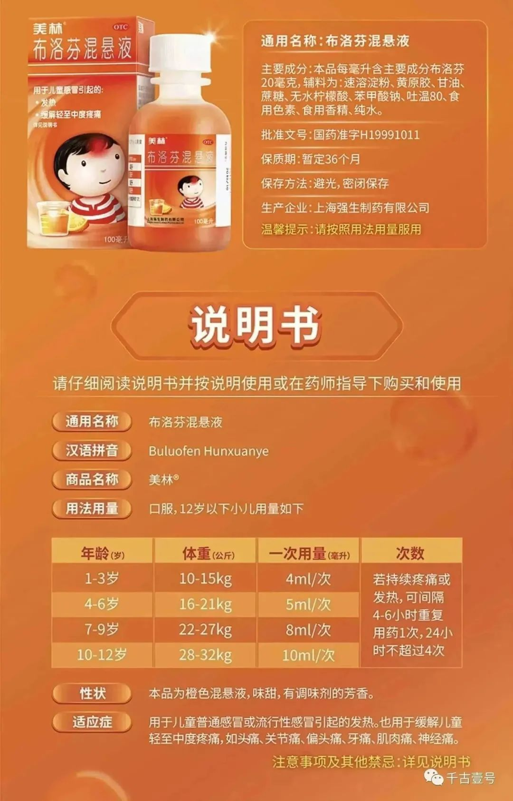

**美林 布洛芬混悬滴剂**，商品图：

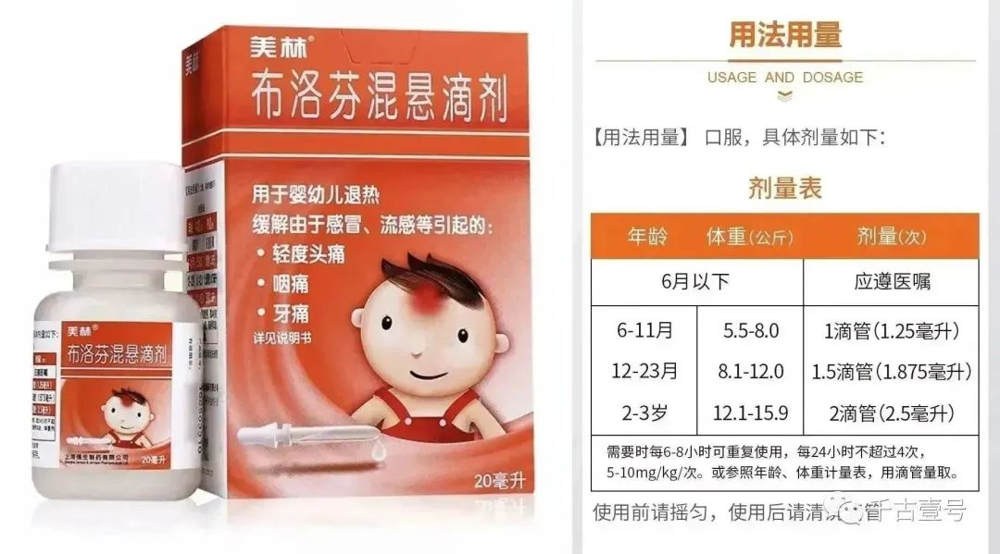

2、**芬必得 布洛芬缓释胶囊**，0.3g，胶囊的颜色是橙色；保质期三年左右；参考价格￥28。商品图如下：

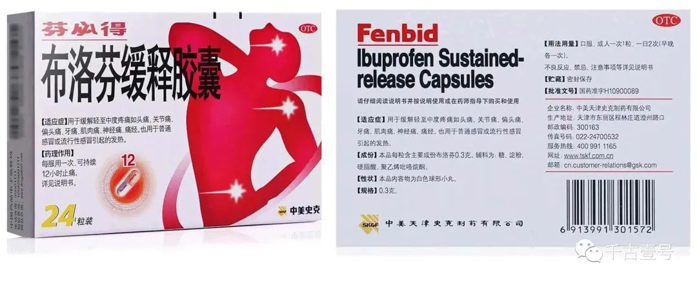

**芬必得 布洛芬缓释胶囊**，0.4g，胶囊的颜色是蓝色；保质期三年左右；参考价格￥32。商品图如下：

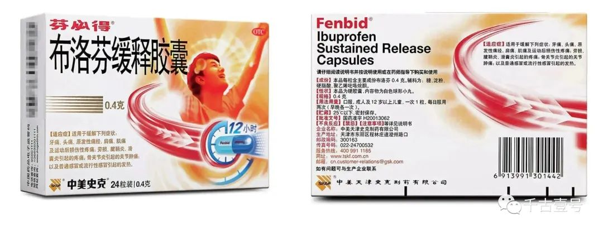

上面这张图，可以读出这款药的这些信息，希望你能熟悉：

-   成份：布洛芬
    
-   通用名：布洛芬
    
-   商品名：芬必得
    
-   药品名称：布洛芬缓释胶囊
    
-   厂家：中美史克
    
-   剂型：胶囊
    
-   规格：0.4g
    
-   OTC：over-the-counter drug，非处方药。
    

缓释胶囊的研发背景是这样的：**布洛芬并不完美，它的半衰期短，药效过得很快**。临睡前吃下，痛感正好在半夜酣睡时发作，让人半夜疼醒，继续给药。为了延长药效，这就有了布洛芬缓释胶囊。

3、**新华 布洛芬片**，0.2g，瓶装 60 片；保质期两年左右；参考价格￥25。商品图如下：

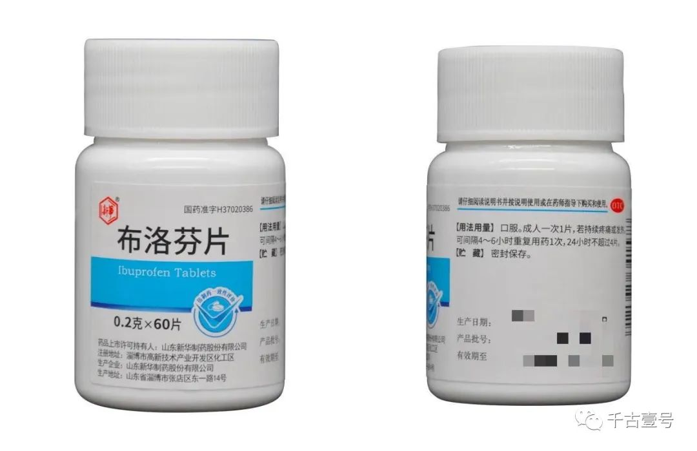

**新华 布洛芬片**，0.2g，瓶装 100 片；形状是长条形的；保质期两年左右；参考价格￥30。商品图如下：

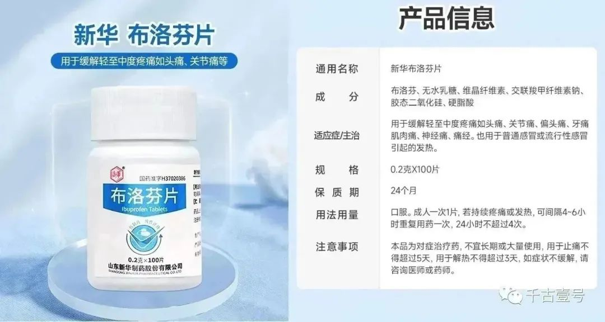

如果你想买布洛芬片，我最推荐的品牌是「新华」。新华的布洛芬片为啥能独领风骚呢？

山东新华制药厂始创于 1943 年，公司于 1993 年改制，三年后上市，是中国第一家化学合成制药企业。

20 世纪 80 年代，随着布洛芬的专利逐渐到期后，中国开始试产布洛芬，最早仅有山东新华制药厂和西南合成制药厂两家企业。2007 年，西南合成制药因为一些原因停产布洛芬，慢慢地[新华制药一家独大](https://mp.weixin.qq.com/s?__biz=MzIzMTQ0MzAyMw==&mid=2247501239&idx=1&sn=fe5967b5a1bb6a5dbf7d2114756fc1f8&scene=21#wechat_redirect)。

国内最早的布洛芬专利申请于 1988 年，为山东新华制药厂申请的“高生物利用度的布洛芬片剂的制法”专利（目前该专利已显示为无效状态）。

我国是布洛芬**原料药**的全球最大生产国和出口国，**产量占全球的 40%**。目前为止，全球布洛芬原料药产能前三的药企分别是：新华制药每年产能 8000 吨、亨迪药业每年产能 3500 吨、巴斯夫每年产能 3000 吨。前两家是中国公司，第三家是德国公司。

可见新华的布洛芬是全球闻名的，而且价格很便宜。由于布洛芬的原研药在国内均未提供片剂，所以如果你想买片剂的话，我个人最推荐的是新华。

新华布洛芬片都是瓶装的（60 片、100 片），比较适合居家备药和诊所用药，但不方便旅行携带、不方便送人、医院也不方便直接开一整瓶给你。我内心倒是很希望中美史克或者新华能推出布洛芬片的盒装版，一盒 24 粒左右，满足不同人群的需求。

如果你非要买盒装的布洛芬片，不用担心，还好有接下来要介绍的精氨酸布洛芬，就是价格稍贵了些。

4、**司百得 精氨酸布洛芬颗粒**，0.4g；保质期三年左右；一盒 12 包的参考价￥45。商品图如下：

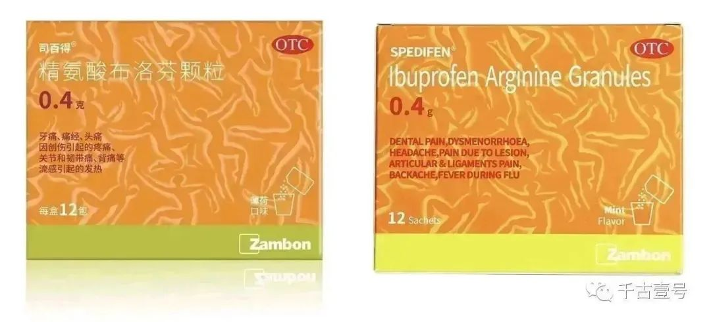

**司百得 精氨酸布洛芬片**，04g；盒装有 8 片或者 12 片；保质期三年左右；12 片装的参考价￥48。商品图如下：

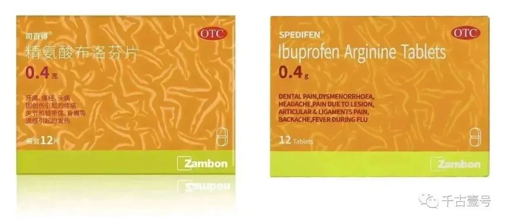

司百得片剂的包装非常精致，用的是纸铝复合膜。拆开包装后，药丸的体积比较大，和一般的胶囊体积差不多。一般的胶囊是空心的，它是实心的，如果觉得不好吞服的话，可以买颗粒。

司百得的片剂和颗粒，退烧疗效都差不多，你可以根据需要选择剂型和规格。可我发现颗粒销量比片剂销量高很多很多，因为生产布洛芬颗粒的厂家，只有司百得的质量最好，独树一帜，而生产布洛芬片的好厂家到处都是。司百得的颗粒于 2005 年上市，历史悠久；司百得的片剂于 2011 年上市，那个时候布洛芬片的市场很大，竞争很激烈。

其实，司百得的颗粒和片剂，是稍微有些区别的。我们都知道，布洛芬作为退烧药而言，片剂的起效时间（一般需要等 1 个小时左右）比缓释胶囊（一般需要等 2 到 4 个小时）更快；更神奇的是，精氨酸布洛芬颗粒的起效时间比布洛芬片还要快，只需要等半个小时左右。打个比方，喝一碗粥或者吃一碗米饭，哪个吸收更快呢？

这一切还要从**精氨酸布洛芬**这个成份的历史说起。这个药于 1994 年在西班牙首次上市，它的[研发背景](https://mp.weixin.qq.com/s?__biz=MzU3NDM5ODM1MQ==&mid=2247646141&idx=1&sn=1872216516155d93b407d1fa3584a6f1&scene=21#wechat_redirect)是：布洛芬自身的水溶性很低，做速效制剂很困难，如果加助溶剂（如乙醇）又可能不利于病人接受，特别是儿童。

所以，研究人员**把酸性布洛芬与碱性精氨酸成盐后使其水溶液显中性**，利于人体接受，还能减轻布洛芬对胃肠道的副作用；精氨酸本身就是人体的营养成分，克服了含乙醇为助溶剂的缺点。

总体上，**精氨酸布洛芬比普通布洛芬的起效速度更快，其他安全性和有效性基本一致。**

### 2.5 医院常开哪种布洛芬？

在医院里，医生常开哪种布洛芬？

根据米内网样本医院终端销售数据，2022 年前三季度院内销售 Top20 的[布洛芬产品排行](https://mp.weixin.qq.com/s?__biz=Mzg4Mzg0MzA5NA==&mid=2247532068&idx=1&sn=7127c918488f9293f55ee77e68a26d74&scene=21#wechat_redirect)如下图：

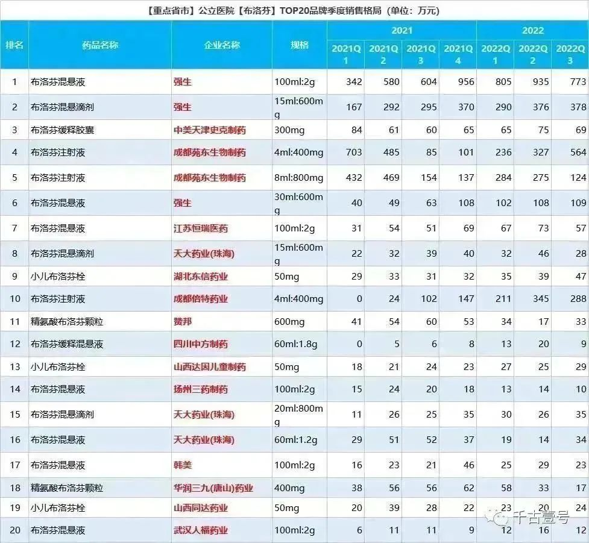

可以看到，除了注射剂外，混悬液和缓释胶囊是医生最常用的两种布洛芬口服剂型，强生和中美史克一直是医院最常用的口服布洛芬品牌。

个人在选择布洛芬时，没必要完全参考医院的销售排行，因为个人备药和医院用药的原则还是有些区别的。区别在哪里？我们继续往下看。

### 2.6 布洛芬的片剂 VS 缓释胶囊，怎么选？

根据前面的介绍，成人使用的布洛芬剂型一般分为：缓释胶囊、片剂、颗粒。如果按照**起效速度**做排序，**从快到慢**依次是：**精氨酸布洛芬颗粒 > 精氨酸布洛芬片 > 普通的布洛芬片 > 布洛芬缓释胶囊**。

如果你用想最快的速度退烧，可以买精氨酸布洛芬颗粒，只是价格贵了些。价格很好地反映了市场行情。

从市场行情来看，布洛芬的**胶囊**和**片剂**卖得最多、最为普及、价格亲民，我们就把这两种作为代表单独拿来说说。

1、**优缺点对比：**

-   **片剂**的优点是起效时间快（快速起效，一般只需要等 1 个小时左右），缺点是药效的持续作用时间较短（6 小时左右，具体看剂量），需要每 6 小时服用一次，病情可能在半夜发作。服药后，建议每隔一小时量一次体温，观察体温变化。
    
-   **缓释胶囊**的缺点是起效时间慢（一般需要等 2 到 4 个小时），优点是药效的持续作用时间很长（持续镇痛 12 个小时左右，具体看剂量），早晚各服用一次即可。服药后，建议每隔 2 小时量一次体温，观察体温变化。此外，缓释胶囊的副作用比片剂更小。
    

2、**选择建议**：

退烧时，布洛芬到底是选片剂还是缓释胶囊呢？我个人的建议是：

（1）**如果没有禁忌、身体没什么毛病，建议优先选片剂**。我是看了很多资料后基本确定了这一点。

因为片剂退烧的见效更快。相比之下，缓释胶囊要等好几个小时才见效，这中间的过程其实挺难熬的，只能躺着什么也做不了。而且发烧一般容易反复，吃完缓释胶囊可能还没等药效来呢，然后体温又上升了。

当然，退烧吃缓释胶囊是完全可以的，我自己的退烧经历中，吃过片剂，也吃过缓释胶囊，都挺过来了。

为什么医院更喜欢开缓释胶囊呢？一方面因为芬必得是原研药，比很多片剂的质量更好；而且提供 24 粒盒装版，而其他很多布洛芬片动辄一瓶 100 粒，一次怎么吃的完呢？另一方面是为了普适性，医生面对的是各种类型的个性化人群，要把副作用降到最低，而缓释胶囊的副作用更小。

（2）布洛芬的**禁忌**是：孕妇及哺乳期女性禁用布洛芬；6 个月以上至 12 岁以下儿童禁用布洛芬片和缓释胶囊，应选择混悬液或者混悬滴剂；对其他 NSAIDs 类药物过敏的人，禁用布洛芬；肠胃、肾脏有严重的基础疾病患者禁用布洛芬；备孕女性不建议用布洛芬。

（3）布洛芬的**副作用**是：服用过多的话，可能对**肠胃和肾脏**有损伤。布洛芬是通过**肾脏**分解和排毒，所以，如果肠胃、肾脏有轻微的基础疾病，建议选择缓释胶囊，副作用小一些；如果肠胃、肾脏有较严重的基础疾病，建议不要吃布洛芬，可以考虑换成对乙酰氨基酚。

当然，不管你有没有基础疾病，我都建议在**饭后**半小时服用布洛芬，对肠胃的伤害最小。再加上布洛芬是通过肾脏分解和排毒，所以服用布洛芬的前后半小时，建议多喝热水。

（4）我还有一个大胆的想法，你要是感兴趣的话可以一试：白天吃片剂，晚上吃缓释胶囊。这样的话，既能保证白天迅速退烧，也不需要半夜起来给药了。

（5）在没有禁忌的前提下，可以结合你自己的经验判断：如果你吃布洛芬缓释胶囊完全没效果，则建议换成布洛芬的片剂；如果吃布洛芬没效果，则建议换成对乙酰氨基酚。

3、**发烧容易反复**：

这里我需要给你提个醒，**发烧一般会反复**，这是很正常的现象，即便吃退烧药之后退了烧，也容易再次发烧，烧个三四天都是有可能的。所以，我建议你吃完布洛芬之后，每隔一两个小时就量一次体温，如果你的体温一直没有降下来，那可能吃缓释胶囊对你来说没效果，建议换成片剂或者换成别的退烧药；如果你的体温中途降下来过，后来又上升了，那说明你吃的退烧药是有效果的，发烧反复本就是正常现象。

4、**连续服用不能超过三天**？

布洛芬的说明书上写到这样一个注意事项：

> 布洛芬用于解热不得超过三天，如症状不缓解，请咨询医师或药师。

这句话的意思是，布洛芬连续复用不能超过三天？当然不是。准确来说，我的理解是这样的，连续吃三天之后：

-   如果发烧症状一直没有得到缓解，说明吃它是没有用的，所以服用不要超过三天。这才是对上面那句话的解释。
    
-   如果这三天里中间退过几次烧，但第四天又反复发烧，说明吃它是有效果的，第四天可以继续吃。发烧、退烧，反复三四天是很正常的。
    
-   如果第五、第六天还在烧，就别再吃了，得去医院看看了，这可能不是感冒这么简单。
    
-   布洛芬连续复用不得超过五天，避免过量使用对身体造成损害。
    

## 3 退烧药：对乙酰氨基酚

对乙酰氨基酚是与布洛芬并驾齐驱的另一种常见退烧药。

### 3.1 对乙酰氨基酚的作用和历史

对乙酰氨基酚（英语：Acetaminophen、Paracetamol、简称：APAP）的主要作用是：止痛、退烧；几乎没有抗炎作用。它的别名很形象，叫「扑热息痛」。

对乙酰氨基酚于 1877 年由美国约翰·霍普金斯大学的化学教授 Harmon Northrop Morse 发明。这个药物被合成之后，在后来的 70 年里都没有人意识到它的价值。

1955 年，强生公司的对乙酰氨基酚在美国上市，商品名泰诺林（Tylenol）；1956 年，葛兰素史克（GSK）的对乙酰氨基酚在英国上市，商品名 Panadol。1963 年，对乙酰氨基酚列入英国药典，并因其较小的副作用和与其它药物的相互作用[2]而流行开来[3]。1995 年，对乙酰氨基酚引入国内。

### 3.2 对乙酰氨基酚的原研药和过评厂家

目前，市面上销售的对乙酰氨基酚商品有 2700 种，其中对乙酰氨基酚片就有 901 种。不同厂家生产的对乙酰氨基酚，药效的区别是比较大的。

对乙酰氨基酚，**建议优先选择原研药，其次选择“通过一致性评价”的仿制药。**

1、对乙酰氨基酚的**原研药**：

-   对乙酰氨基酚口服混悬液、对乙酰氨基酚混悬滴剂：原研公司是是美国的**强生**（Johnson& Johnson），商品名是**泰诺林（Tylenol）**。这是给 3 个月以上~12 岁以下儿童用的。
    
-   对乙酰氨基酚片：原研公司是英国的葛兰素史克（GSK），国内由其子公司——中美天津史克制药有限公司（中美史克）生产上市，商品名是**必理通（Panadol）**，在香港名叫**必理痛（Panadol）**。
    
-   对乙酰氨基酚缓释片：原研公司是是美国的**强生**（Johnson& Johnson），商品名是**泰诺林（Tylenol）**。
    

2、对乙酰氨基酚通过“**一致性评价**”的仿制药——截至 2022 年 1 月，对乙酰氨基酚仅有**对乙酰氨基酚片**这一个剂型通过一致性评价，过评厂家数量为 28 家、商品数量为 30 个，其中绝大多数规格为 0.5g。

对乙酰氨基酚的过评厂家，详细表格数据如下：

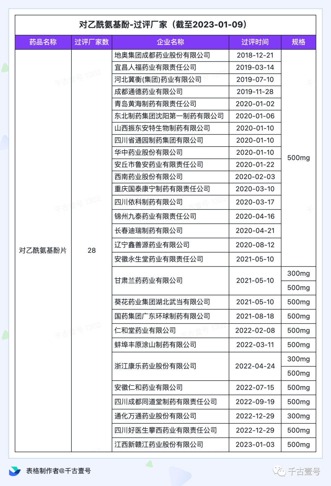

### 3.3 对乙酰氨基酚的商品推荐

上面讲到，对乙酰氨基酚的原研药有 3 种，通过一致性评价的仿制药有 30 种，已经把选择范围大大缩小了。

对乙酰氨基酚作为退烧药，如果想进一步缩小选择范围，我首先推荐**必理通**和**泰诺林**，其次推荐**通德**的对乙酰氨基酚片。

1、**泰诺林 对乙酰氨基酚口服混悬液**，这是给 3 个月以上~12 岁以下的儿童用的。商品图如下：

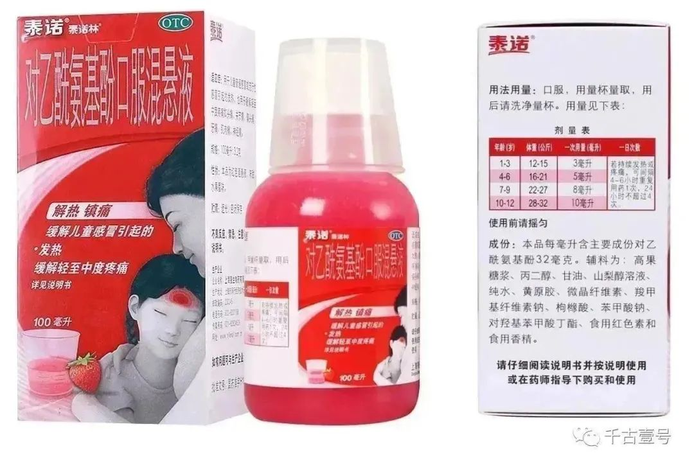

**泰诺林 对乙酰氨基酚混悬滴剂**，这也是给 3 个月以上~12 岁以下的儿童用的。商品图如下：

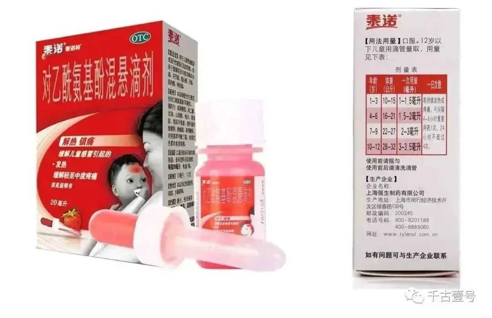

2、**必理通 对乙酰氨基酚片**，0.5g，保质期三年左右；10 片装的参考价格￥10 左右。商品图如下：

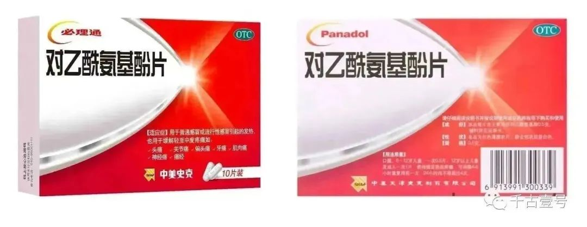

3、**泰诺林 对乙酰氨基酚缓释片**，0.65g；保质期三年左右；18 片装的参考价格￥35 左右。商品图如下：

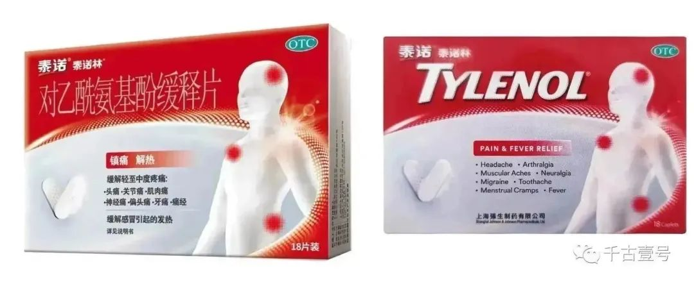

有个小细节值得点赞是，泰诺林的包装盒是封口的。

4、**通德 对乙酰氨基酚片**，0.5g；保质期 2 年左右；20 片装的参考价￥10 左右。商品图如下：

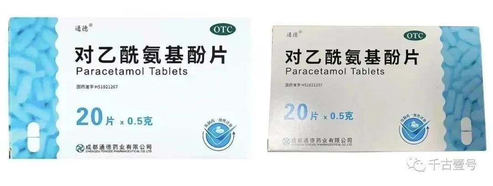

成都通德药业前身为原国营成都制药三厂（国家定点的三大生化制药企业之一），始建于 1958 年，公司是西南地区最大的单体原料药生产基地之一，为国际 CMO 发展联盟发起单位和四川省企业技术中心，“通德”商标还被评为“成都市著名商标”，其原料药“穿心莲内酯”国内销量排名第一。

2019 年 11 月，通德药业的对乙酰氨基酚片通过一致性评价。在 2019 年 12 月至 2022 年 2 月对乙酰氨基酚片的药品[集中采购](https://mp.weixin.qq.com/s?__biz=MzAxMDk2ODI0OA==&mid=2247585738&idx=1&sn=bef6e524a7be5c2bd5132cd6ed8b5327&scene=21#wechat_redirect)中，成都通德药业的中标占比为 37.3%，在所有中标企业中排名第一；第二名是宜昌人福药业的乙酰氨基酚片，中标占比为 18.1%。

### 3.4 必理通 VS 泰诺林，怎么选？

必理通和泰诺林这两个退烧药都是原研药，也都是片剂，**必理通是普通片剂，泰诺林是缓释片**。要怎么选呢？我个人的建议是：

（1）**如果没有禁忌，建议优先选择普通片剂（必理通）**。因为缓释片（泰诺林）的起效时间比较慢。

（2）对乙酰氨基酚的**禁忌**是：孕妇及哺乳期女性慎用普通片剂（必理通），**可以用缓释片（泰诺林）**，服用前请遵循医嘱；2 个月以上至 12 岁以下儿童禁用片剂，应选择儿童版的泰诺林（混悬液或者混悬滴剂）；对其他 NSAIDs 类药物过敏的人，慎用对乙酰氨基酚；肝脏有严重的基础疾病患者禁用对乙酰氨基酚。

（3）对乙酰氨基酚的**副作用**是：服用过多后，容易导致急性肝损伤。对乙酰氨基酚是通过**肝脏**分解和排毒，所以，如果肝脏有轻微的基础疾病，建议选择泰诺林，副作用小些；如果肝脏有较严重的基础疾病，建议不要吃对乙酰氨基酚，可以考虑换成布洛芬。

（4）在没有禁忌的前提下，可以结合你自己的经验判断：如果你吃泰诺林完全没效果，则建议换成必理通；如果吃必理通没效果，则建议换成布洛芬。

### 3.5 对乙酰氨基酚是不是非甾体类抗炎药（NSAIDs）？

对乙酰氨基酚是非甾体类抗炎药（NSAIDs）吗？吃退烧药的人一般不会关注，但是这个话题在医学领域是绕不开的，国内外学界曾一直存在争议，甚至有些医生都分不清楚。本着授人以渔的原则，你有必要简单了解一下。

**先说结论**：对乙酰氨基酚不属于非甾体**抗炎药**（NSAIDs），不应该归为 NSAIDs；如果非要归类，可以归为非甾体**解热镇痛药**，避免用药选择困难。

非甾体抗炎药(Non-Steroidal Anti-Inflammatory Drug，简称 NSAIDs)，[顾名思义](https://mp.weixin.qq.com/s?__biz=MjM5MjgwOTI5MQ==&mid=2650218772&idx=1&sn=51cf2c6e4e35a31f8da09faaa7fd3f48&scene=21#wechat_redirect)就是一类化学结构上不含甾体，却具有抗炎作用的药，这里的非甾体是相对于化学结构上有甾体的抗炎药而言的，临床上有甾体的抗炎药是 强的松、地塞米松 等糖皮质激素。

-   **非甾体抗炎药（NSAIDs）**：是一类通过抑制前列腺素合成酶且不含有甾体结构的抗炎药，该类药物具有抗炎、抗风湿、止痛、退热和抗凝血等作用，在临床上广泛用于骨关节炎、类风湿关节炎、发热和各种疼痛症状的缓解。NSAIDs 至今已发现几十种，我们比较熟悉的主要有布洛芬、阿司匹林、萘普生、塞来昔布、双氯芬酸、洛索洛芬等。
    
-   **甾体类抗炎药**：是指肾上腺皮质所分泌的糖皮质激素及其人工合成的衍生物。如临床常用的强的松、地塞米松等。这类药物的主要药理功效是“[四抗](https://mp.weixin.qq.com/s?__biz=Mzg4NzYzNTIwNA==&mid=2247493733&idx=1&sn=1e21b0232034134c8f047e4651db72c9&scene=21#wechat_redirect)”，即抗炎、抗休克、抗免疫以及抗（细菌）毒素。
    

国外很多网站和用药软件是把对乙酰氨基酚与 NSAIDs 区分开的。比如：

-   药物网站——Drugs（www.drugs.com）
    
-   用药查询软件——Lexicomp 的药理学分类
    
-   在外文文献检索网站——pubmed（https://pubmed.ncbi.nlm.nih.gov/）以主题词搜索对乙酰氨基酚和布洛芬，也是不同的药理学分类。
    
-   最新的美国食品药品监督管理局（FDA）公告强调，对乙酰氨基酚不属于 NSAIDs，不受 怀孕 20 周以上避免使用 的限制，而 NSAIDs 则受此限制。
    

主要区别如下：

对乙酰氨基酚和 NSAIDs 的主要区别如下：

（1）作用机制不同、抗炎作用不同。NSAIDs 非常明确地通过抑制**外周**的环氧化酶（COX），从而抑制一种叫做前列腺素的物质起到抗炎的作用。

而对乙酰氨基酚虽然临床使用的历史悠久，但是它的作用机制直到现在还没有完全研究清楚，新近的研究进展表明对乙酰氨基酚主要的作用部位是在**中枢神经**系统，而在外周的作用非常弱，所以它的抗炎作用非常弱，没有临床意义。

（2）副作用不同。起作用的部位不同，不仅会影响药物的抗炎作用，也会影响药物的不良反应发生情况。NSAIDs 共同的不良反应包括肠胃溃疡、心血管危害、凝血功能改变、对肾脏的损害等，但这些都不是对乙酰氨基酚的主要不良反应。

对乙酰氨基酚最需要警惕的一个不良反应是肝脏毒性，而这也恰恰是非甾体抗炎药不太常见的一个不良反应。

## 4 退烧药的简单对比

### 4.1 布洛芬 VS 对乙酰氨基酚，怎么选？

幸福的烦恼在于选择太多，退烧的烦恼在于走进药店不知道该选哪个药，终极烦恼在于医疗挤兑的时候药被抢完没得选。

布洛芬、对乙酰氨基酚这两种药，到底哪个好呢？@[药评中心](https://mp.weixin.qq.com/s?__biz=MzAwNDQwODY5Mw==&mid=2665017814&idx=1&sn=fa1dc05bed9dec386889c75e74a97c23&scene=21#wechat_redirect)整理过一张对比图还挺详细：

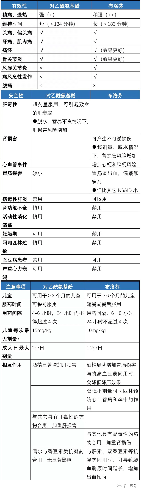

布洛芬和对乙酰氨基酚，单纯作为退烧药而言，简单对比：

-   布洛芬：退烧效果更好，且具有抗炎作用；副作用比对乙酰氨基酚大一点。
    
-   对乙酰氨基酚：退烧效果比布洛芬弱一点，但起效速度比布洛芬快一点；副作用更少一点；适用人群范围更广，禁忌更少。
    

如果你明确知道自己吃哪一种药退烧有效，那可以继续保持；如果两种都对你有效，那更好，选择性更多。如果你不知道选哪一个，**这里给出我的个人建议**：

（1）如果没有禁忌的话，建议优先选择**布洛芬**。因为它的退烧效果更好。

很多人担心布洛芬的副作用比对乙酰氨基酚大，其实完全没必要担心。这两种药都是非常温和的退烧药/止痛药；都是非处方药；上市到现在都有 70 年的历史了，很成熟。你一年能感冒几次呢？只要按照说明书的剂量要求服用，不要超标，这点剂量完全不用担心副作用的问题。比布洛芬猛的止痛药、抗炎药多的去了，很多都是处方药你未必有机会接触。

（2）如果对其中一种药有禁忌，则建议选择另一种药。禁忌如下：

-   布洛芬的**禁忌**是：孕妇及哺乳期女性禁用布洛芬，可以用对乙酰氨基酚（泰诺林比必理通更安全），服用前请遵循医嘱；6 个月以上至 12 岁以下儿童禁用布洛芬片和缓释胶囊，应选择混悬液或者混悬滴剂；对其他 NSAIDs 类药物过敏的人，禁用布洛芬；肠胃、肾脏有严重的基础疾病患者禁用布洛芬；肠胃、肾脏有轻微的基础疾病的人，建议选择布洛芬的缓释胶囊，或者改吃对乙酰氨基酚；备孕女性不建议用布洛芬，可以用对乙酰氨基酚。
    
-   对乙酰氨基酚的**禁忌**是：3 个月以上至 12 岁以下儿童禁用片剂，应选择混悬液或者混悬滴剂；对其他 NSAIDs 类药物过敏的人，慎用对乙酰氨基酚；肝脏有严重的基础疾病患者禁用对乙酰氨基酚；肝脏有轻微基础疾病的人，建议选择对乙酰氨基酚的缓释片，或者改吃布洛芬。
    

（3）在没有禁忌的前提下，可以结合你自己的经验判断：如果你吃这种药没效果，则建议改吃另一种。

总之，所谓的风险是相对的，成人短期使用，其风险相对可控，不需要特别担心。

### 4.2 为什么中成药喜欢添加对乙酰氨基酚？

有个规律是：在复方感冒药里，不管是西药还是中成药，最喜欢添加的成份是**对乙酰氨基酚**，其次是马来酸氯苯那敏。（备注：复方感冒药即添加了[多种成份](https://mp.weixin.qq.com/s?__biz=MjM5MDIzMDMwMA==&mid=2656136151&idx=1&sn=9953366019346b4e3c03e438fdaa7266&scene=21#wechat_redirect)的感冒药。）

-   含对乙酰氨基酚的复方西药[4]有 80 多种。
    
-   含对乙酰氨基酚的中成药[5]有 40 种。其中，生产维 C 银翘片这一种药的厂家就有 300 多家，这市场可真够大的。
    

很多人说清热解毒的中成药，只有对乙酰氨基酚真正起到了退烧的作用，其他成份只是安慰剂。我认为有一定的道理。

西药里添加对乙酰氨基酚是名正言顺，中药里怎么也加对乙酰氨基酚呢？这挺讽刺的。这个问题需要拆解为两步：

（1）为什么中成药里添加的退烧药是西药？

答案显而易见，说明中药里还没有找到明确用于退烧且副作用在合理范围内的药物，就算有也尚未获得医学界和大众市场的认可。

（2）为什么中成药里添加的退烧药是对乙酰氨基酚，而不是布洛芬？

因为对乙酰氨基酚的副作用更小，适用人群更广。虽然对乙酰氨基酚比布洛芬的退烧效果弱一点，但作为一款复方感冒药，它的作用是综合性的，厂家在生产时当然是希望能覆盖到更多的人群，这是出于**普适性**的考量。

无论是选择对乙酰氨基酚，还是选择布洛芬，或者说，不管是选择哪一种药，都是在**收益**和**风险**之间做平衡。想要低风险的话，要么收益低，要么成本大；想要高收益的话，要么风险高，要么成本大。咦？这和投资逻辑还挺像的。

另外需要提醒你的是：既然很多复方感冒药里添加了乙酰氨基酚，所以退烧药你千万别吃重复了，吃之前记得看清楚说明书上的成分表。

### 4.3 还有没有其他的退烧药可以用？

说起常见的退烧药，现在你肯定能脱口而出是布洛芬和对乙酰氨基酚。有时候一种药对某些人效果不明显，换一种就好很多。还有些人因为身体原因不适合吃某些药。

可是，退烧药只知道这两种就够了吗？生活不可能永远安逸和平静，在资源有限的前提下、在人人自危的极端情况下，你得知道比别人更多的有用信息，才能提高生存概率。

2022 年 12 月份上下是全民感染新冠的时期，由于医疗挤兑导致很多人买不到布洛芬和对乙酰氨基酚。买不到这两种退烧药，就只能硬抗吗？当然不是。

在有效的退烧药中，首先推荐的是**布洛芬**和**对乙酰氨基酚**，第三个推荐是**洛索洛芬**，第四个推荐是**双氯芬酸**。这四个药的排序有先后，顺序越靠前越推荐。

布洛芬、洛索洛芬、双氯芬酸都是属于 NSAIDs。NSAIDs 是一个庞大的家族，至今发现了几十种，它们的作用原理[类似](https://mp.weixin.qq.com/s?__biz=MzU3NDM5ODM1MQ==&mid=2247646141&idx=1&sn=1872216516155d93b407d1fa3584a6f1&scene=21#wechat_redirect)，都有一些共性，比如都有退热、镇痛、抗炎的功效；比如不良反应类似，大小略有不同。

1、我们先来介绍下洛索洛芬。

洛索洛芬（Loxoprofen）作为 NSAIDs，是由日本的“第一三共株式会社”研发，于 1977 年成为专利药物，1986 年 7 月在日本上市，推出后即成为日本 NSAIDs 药中销量第一的品种。听这组织的名字像是什么社团？其实它是全球著名的跨国原研制药集团[6]，总部位于日本东京。

**洛索洛芬**的原研公司是日本的“第一三共株式会社”，国内商品名是**乐松**；国内由其全资子公司——第一三共制药（上海）有限公司生产上市。

商品推荐：洛索洛芬的商品我个人只推荐**乐松**。

**乐松 洛索洛芬钠片**，60mg\*20 片，保质期三年左右；参考价格￥22 元左右；属于处方药。商品图如下：

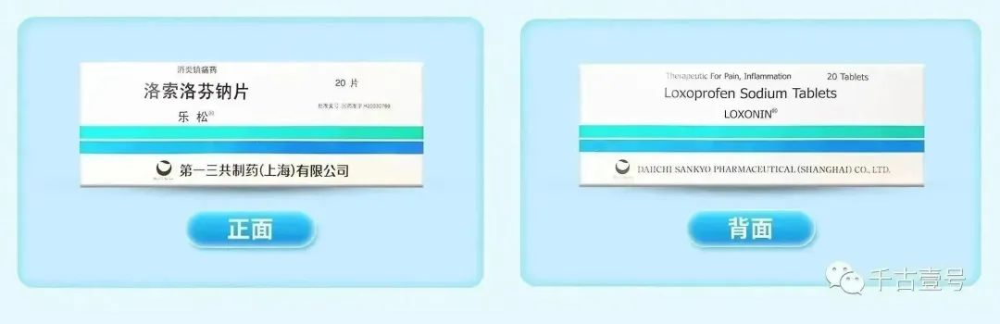

洛索洛芬、洛索洛芬钠有啥区别呢？是一个意思。

如果实在买不到乐松，可以考虑以下几个厂家的洛索洛芬，它们都通过了仿制药的**一致性评价**：

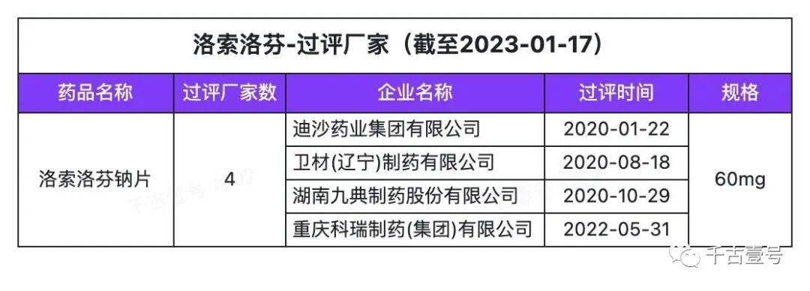

洛索洛芬临床常用于类风湿关节炎、手术后的外伤、拔牙后的消炎镇痛，也可用于退烧。

对于有些人来说，洛索洛芬甚至可能比布洛芬更适合缓解发烧和疼痛症状，价钱也不贵。因为洛索洛芬在骨科风湿科比较常用，而一般头疼脑热的时候医生不太会开这个药，所以在民间[知名度不高](https://mp.weixin.qq.com/s?__biz=MzI0NDA5MDYyNA==&mid=2648257058&idx=1&sn=c5a35c936b5d7338399648a77bc413f3&scene=21#wechat_redirect)，但是它作为退烧药是很好用的，而且很容易买到。

罗欣药业的[文章](https://mp.weixin.qq.com/s?__biz=MzUzMDEwMjAyMQ==&mid=2247491889&idx=1&sn=31e94da4e9ec8cf60a7bbade8d39857c&scene=21#wechat_redirect)整理了洛索洛芬和布洛芬的对比，显示洛索洛芬的退烧效果更强、起效时间更快：

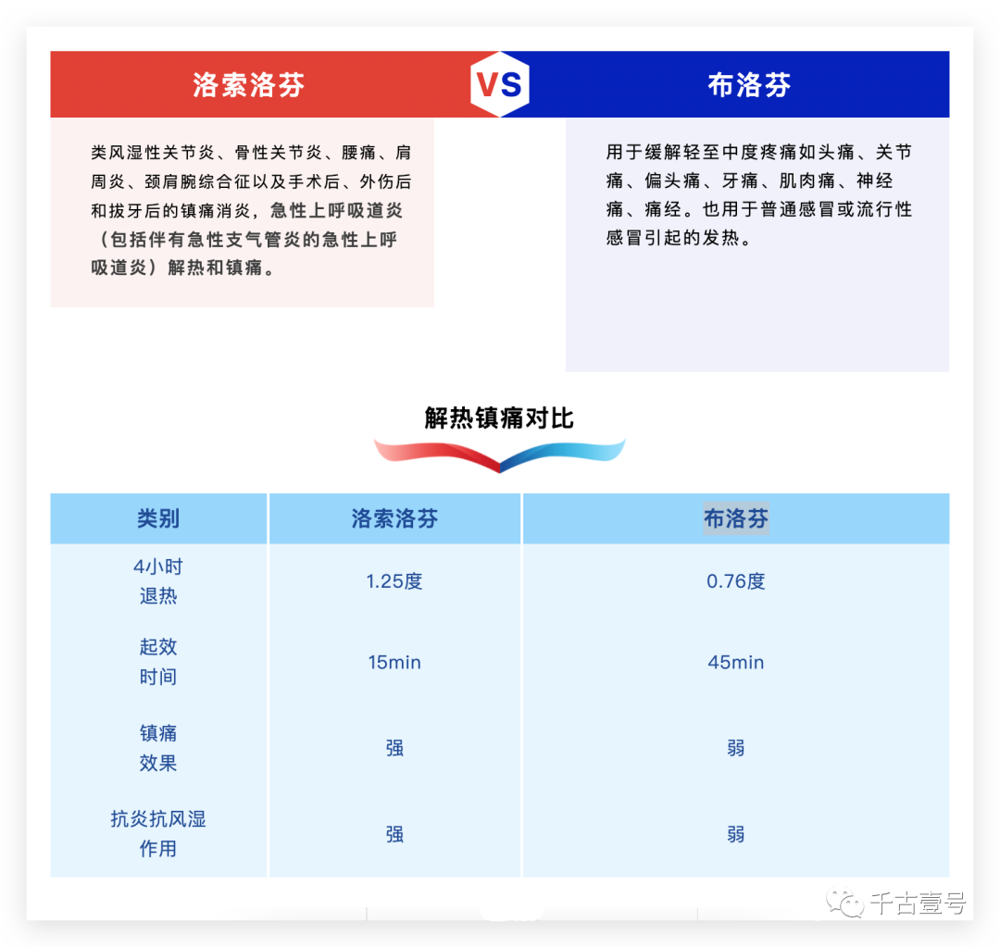

2、再来介绍一下双氯芬酸。

双氯芬酸（Diclofenac）作为 NSAIDs 的历史如下：

-   最早由 Alfred Sallmann 和 Rudolf Pfister 合成，并于 1973 年通过**瑞士**的 Ciba-Geigy 公司(现在的 Novartis)在瑞士、日本首先生产上市，商品名为扶他林（Voltaren）。
    
-   Ciba-Geigy 于 1996 年并入山德士公司（Sandoz Laboratories），后被诺华公司（Novartis）收购；后来诺华又将双氯芬酸的一部分生产线出售给了葛兰素史克公司（GSK）。
    
-   所以，现在国内市面上生产扶他林的厂家为葛兰素史克（GSK）。
    

也就是说，双氯芬酸这个成份的原研厂家是诺华公司（Novartis）。具体到不同剂型的药物，又有好几个原研厂家。**双氯芬酸的原研药**如下：

-   双氯芬酸**二乙胺乳胶剂**：原研公司是英国的葛兰素史克（GSK），商品名是**扶他林（Voltaren）**。
    
-   双氯芬酸钠**肠溶片**、双氯芬酸钠**缓释片**：原研公司是瑞士的诺华公司（Novartis），商品名是**扶他林（Voltaren）**。
    
-   双氯芬酸钠**双释放肠溶胶囊**：原研公司是瑞士的诺华公司（Novartis），商品名是**戴芬（Difene）**。
    

商品推荐：作为退烧药而言，洛索洛芬的商品我只推荐**扶他林**，首先推荐**扶他林 双氯芬酸钠肠溶片**，其次推荐**扶他林 双氯芬酸钠缓释片**。因为缓释片的退烧起效时间比较慢；其次，肠溶片的规格更小，调整[用药剂量](https://mp.weixin.qq.com/s?__biz=MzAwNDQwODY5Mw==&mid=2665018050&idx=1&sn=26aff43f137bac0c11a3bd7faa4c4993&scene=21#wechat_redirect)时更方便；还有，肠溶片的保质期有 5 年，缓释片的保质期只有 2 年。

**扶他林-双氯芬酸钠肠溶片**，25mg\*30 片；保质期五年左右；参考价格￥23 元左右；属于处方药。商品图如下：

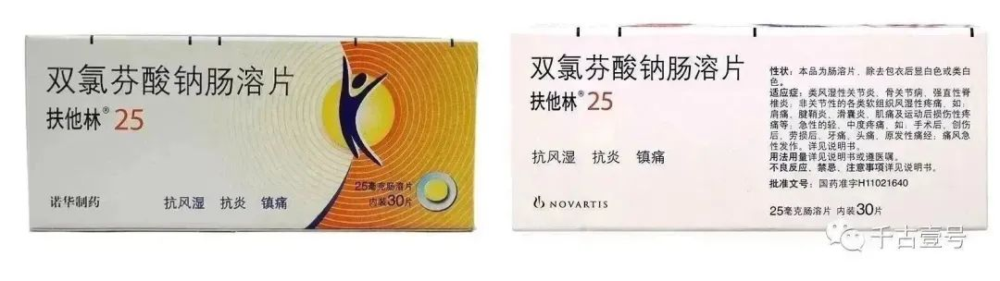

**扶他林 双氯芬酸钠缓释片**，75mg\*10 片；保质期两年左右；参考价格￥28 元左右；属于处方药。商品图如下：

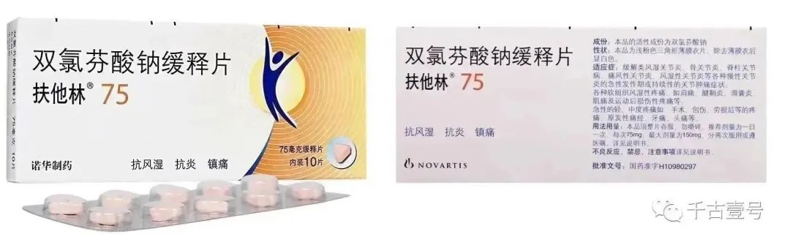

双氯芬酸、双氯芬酸钠有啥区别呢？是一个意思。

如果实在买不到扶他林，可以考虑以下几个厂家的双氯芬酸，它们都通过了仿制药的**一致性评价**：

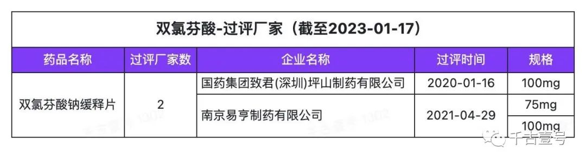

## 5 干咳的止咳药

感冒中最严重的症状，除了发烧，就是咳嗽。一直发烧怕把脑子烧坏了（防杠：重点是“怕”，不是真的烧坏了），一直咳嗽连半夜都睡不好觉。这两者都严重影响我们的生活质量和精神状态。

咳嗽反射是一种最基本的保护性反射。当有异物或病原体刺激呼吸道粘膜，我们就会通过咳嗽反射将其咳出气道。如果遇到咳痰的症状，一些含有病原微生物的痰液就是这样被我们排出体外的。

轻微咳嗽，一般不用需要使用药物，等待自愈即可。怎么才算轻微？你自己把握。

咳嗽分两种：干咳（无痰的咳嗽）、咳痰（有痰的咳嗽）。

这一段我们来讲讲干咳的止咳药物。

### 5.1 止咳药的分类

镇咳药物分为两种：中枢性镇咳药、外周性镇咳药。如下：

1、**中枢性镇咳药**：对延脑中枢具有抑制作用。根据其是否具有成瘾性和麻醉作用又分为依赖性和非依赖性镇咳药。

1.1、**中枢性镇咳药-依赖性镇咳药**：为吗啡类生物碱及其衍生物，具有十分明显的镇咳作用，但因为具有成瘾性，仅在其它药物治疗无效时短暂使用。常见药物有可待因（codeine）、福尔可定（pholcodine）等。这些均是阿片受体激动剂，通过激动阿片受体来发挥作用。因其成瘾性问题，大多数情况下不会使用、也不建议使用这些药物止咳。

1.2、**中枢性镇咳药-非依赖性镇咳药**：多为人工合成的镇咳药。常见药物介绍如下：

-   **右美沙芬**（dextromethorphan）：目前临床上应用最广的镇咳药，其镇咳作用与可待因相等或稍强。
    
-   **喷托维林**（pentoxyverine）：别名“咳必清”，镇咳强度为可待因的三分之一，兼有中枢性和外周性镇咳作用。对儿童的止咳效果好于成人，是儿童止咳的首选药物，适用于 5 岁以上儿童。但该药具有抗惊厥和解痉的作用，青光眼及心功能不全者慎用。
    
-   右啡烷（dextrophan）：为右美沙芬的代谢产物，患者的耐受性更好，今后可能取代右美沙芬而广泛应用于临床治疗。
    

2、**外周性镇咳药**：也称为末梢镇咳药，通过抑制咳嗽反射弧中的某一环节而起到镇咳作用。这类药物包括局部麻醉药和黏膜防护剂。常见药物介绍如下：

-   **那可丁**（narcodine）：阿片所含的异哇琳类生物碱，作用与可待因相当，无依赖性，对呼吸中枢无抑制作用，适用于不同原因引起的咳嗽。临床一般用于复方制剂中。
    
-   苯丙哌林（benproperine）：非麻醉性镇咳药，镇咳强度为可待因的 2~4 倍。可抑制外周传入神经，亦可抑制咳嗽中枢。镇咳效果较强，适用于剧烈的干咳，但作用持续时间较短。
    
-   莫吉司坦（moguisteine）：外周性非麻醉性镇咳药，作用较强。
    

**小结**：右美沙芬是目前临床上应用最广、也是最为推荐的镇咳药，我们接下来详细讲讲。

### 5.2 干咳的止咳药：右美沙芬

治疗干咳的药物中，最常见、临床上应用最广、也是最为推荐的止咳药成份是**氢溴酸右美沙芬**，大众喜欢简称为**右美沙芬**。

“氢溴酸”这三个字是怎么多出来的呢？严谨的描述是：通常是将右美沙芬（Dextromethorphan）的氢溴酸盐，即氢溴酸右美沙芬（Dextromethorphan hydrobromide）放在药品中作为止咳药。

**右美沙芬**是 1950 年由瑞士的医药研发公司——**罗氏**（Hoffman Roche）公司，通过改造**吗啡**结构，重新合成的一种具备镇咳效果的**右旋性吗啡衍生物**，常用于各种呼吸道感染引起的咳嗽治疗；在 1954 年被批准用于治疗咳嗽。在常规剂量下，右美沙芬的活性代谢产物右啡烷与位于髓质的 σ 阿片样受体结合，通过抑制**延脑的咳嗽中枢**，发挥止咳作用。

作为异构体，其左旋性化合物有镇痛作用，右旋物即右美沙芬没有镇痛作用而具有明显的镇咳作用。临床研究表明，右美沙芬是一种有效的**中枢镇咳药**。

### 5.3 右美沙芬的商品推荐

右美沙芬在市面上常见的剂型有两种：片剂和口服液。

**氢溴酸右美沙芬片**的原研公司是美国的**强生**，**右美沙芬愈创甘油醚口服溶液**的原研公司是英国的葛兰素史克（**GSK**）。这两家公司的右美沙芬都没有在国内上市。

国内的右美沙芬仿制药，目前只有**片剂**这一个剂型通过了“一致性评价”。市面上生产右美沙芬片的厂家有 10 个，其中过评的厂家有 3 个。过评厂家信息如下：

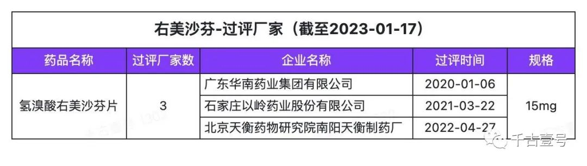

商品推荐：如上方表格所示，右美沙芬的过评厂家只有三家：华南药业、以岭药业、天衡制药，你在这三个厂家里选就可以了。如果想要进一步缩小选择范围，我个人最推荐的厂家是**华南药业**，商品信息如下。

**华南牌 氢溴酸右美沙芬片**，15mg\*12 片；保质期三年左右；参考价格￥7 左右；处方药。商品图如下：

如果买不到上面这三个厂家的右美沙芬片，还可以考虑买**白云山**的右美沙芬片，虽然它没有过评，但是效果也不错，而且我在很多地方看到有卖，有一定的市场占有率，在科普文章中的出镜率也很高。商品信息如下。

**白云山 氢溴酸右美沙芬片**，15mg\*24 片；保质期两年左右；参考价格￥15 左右；处方药。商品图如下：

根据米内网的[数据](https://mp.weixin.qq.com/s?__biz=Mzg4Mzg0MzA5NA==&mid=2247533057&idx=1&sn=68034f4f73d64a59d8e748cbfed2e44d&scene=21#wechat_redirect)显示，在重点省市公立医院终端的右美沙芬片销售排行中，华南药业的市场份额是 84.85％，白云山的市场份额是 3.03%。

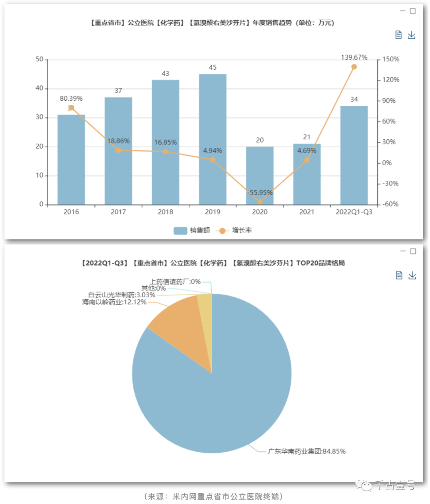

另外，还有一款药叫「右美沙芬愈创甘油醚口服溶液」，在网上卖得很多。老实说，我不是很推荐这个药。这个药的成份是右美沙芬+愈创甘油醚，作用是止咳+祛痰。如果你仅仅是干咳的话，吃右美沙芬就够了，没必要再多吃一种成份；如果你有咳痰的话，止咳药和祛痰药不建议同时吃，因为止咳和祛痰是矛盾的，这一点我后面讲祛痰药的时候再具体说。

### 5.4 右美沙芬在网上不让卖了

右美沙芬曾经在很长一段时间里，都是 OTC 类药物（非处方药），网上和线下药店无门槛购买；但是，这两年却做出了诸多限制：2021 年 12 月开始成为了处方药，2022 年 12 月 1 日起禁止在网上销售右美沙芬的**口服单方制剂**。

（温馨提示：右美沙芬的复方制剂，网上可以继续卖。）

为何变化这么大呢？这就不得不提到右美沙芬的历史[7]。在右美沙芬之前，曾出现过很多种止咳药。

1804 年，德国药剂师 Friedrich Sertürner 从罂粟（制取鸦片的主要原料）中提取出吗啡（Morphine），其强力镇痛作用马上受到追捧，同时也有人用吗啡镇咳。这种直接作用于神经中枢的止咳药镇咳作用非常强大，但随之而来的强烈成瘾性令人恐慌。

1832 年，法国化学家 Pierre Robiquet 从罂粟的众多其他活性成分中提取出可待因，此后，可待因被广泛用作止痛药和止咳药，但仍然具有成瘾性。

化学家们赶紧再去寻找化学结构类似但不容易成瘾的替代药物。

1874 年，英国化学家 Charles Wright 在实验室里用吗啡和乙酸酐第一次合成了二乙酰吗啡（也就是“海洛因”）。1898 年，拜耳公司将这种新成分作为一款拳头产品推向市场，声称其镇痛、止咳作用远超过鸦片和吗啡，而成瘾性却可以忽略不计，这款药物马上成为药店里的畅销止咳产品。后来大家都知道了，海洛因反而成为了成瘾性极强的“毒品之王”。拜耳公司不得不在 1913 年彻底停产海洛因。

拜耳公司本来是想解决吗啡、可待因的成瘾性问题，没想到却更加臭名昭著，招致了更严重的成瘾性。

可待因在鸦片中的含量为 1%~3%，吗啡在鸦片中的含量为 4%~21%。中枢性镇咳药从鸦片到吗啡、可待因、海洛因，难道一定和上瘾划等号吗？

终于，1950 年，瑞士的医药公司通过改造吗啡结构，成功提取出了右美沙芬。其化学结构与吗啡、海洛因非常近似，但作用受体的选择性却跟海洛因、可待因不同，经过长期临床观察未发现其在规定剂量下产生成瘾性。

右美沙芬片的说明书上，关于「药理作用」曾经一直是这么写的：

> 本品为中枢性镇咳药，可抑制延脑咳嗽中枢而产生镇咳作用。其镇咳作用与可待因相等或稍强。一般治疗剂量不抑制呼吸，**长期服用无成瘾性和耐受性**。

在接下来的 70 年里，右美沙芬的发展顺风顺水：

-   1956 年被美国食品药品管理局（FDA）列为非处方药，且被 FDA 誉为“现代最安全” 的中枢镇咳药。
    
-   1961 年在世界麻醉药会议上被定为非麻醉药。
    
-   1989 年，世界卫生组织称右美沙芬是一种无麻醉性、无耐药性、高效、安全，**可以替代可待因**的非依赖性中枢镇咳药。
    
-   1988 年在我国注册，1990 年生产上市，国内批准其临床适应症为上呼吸道感染（如感冒、咽炎）、支气管炎等引起的咳嗽。
    
-   1993 年, 美国报道了 2 例青少年因娱乐目的使用含有右美沙芬成分的止咳糖浆的病例，同时提醒关注其滥用潜力，尤其是在青少年中的滥用。
    
-   2008 年，FDA 建议含有镇咳药（包括右美沙芬）的非处方类咳嗽和感冒制剂应谨慎用于儿童，并禁用于 2 岁以下幼儿。
    
-   2021 年，氢溴酸右美沙芬片在国内重点省市公立医院终端销售额为 21 万元，同比增长 4.69%。2022 年销售额继续增长，前三季度销售额为 34 万元，同比增长 139.67%。
    

从上面的历史数据可以看出，右美沙芬作为一种镇咳药，的确功不可没。

然而，将右美沙芬视作“新型毒品”的群体并不在少数，且以青少年为主。根据「中新经纬」的[报道](https://mp.weixin.qq.com/s?__biz=MzI0NDU5OTAzMA==&mid=2247537111&idx=2&sn=c3a610e29632d4ca84b32e668bf6b401&scene=21#wechat_redirect)，自 2016 年底开始，北京高新医院接诊的右美沙芬成瘾患者持续增加，大部分都是青少年学生为主。其中三分之一为医源性成瘾（因治病过量服药导致的成瘾）。

紧接着，右美沙芬的管制越来越严格：

（1） 2021 年 12 月[8]，国家药监局将原本属于 OTC 的右美沙芬转为处方药；还对药品说明书进行了修订，新修订的药品说明书中不良反应增加了乏力、肌肉不自主收缩、腹部不适、视幻觉、精神错乱等内容，增加了过量服用右美沙芬可能引起神志不清等症状；删除了长期服用无成瘾性和耐受性表述。

右美沙芬片的说明书上，关于「药理作用」的最新说明是这样的：（删除了长期服用无成瘾性和耐受性表述）

> 本品为中枢性镇咳药，可抑制延脑咳嗽中枢而产生镇咳作用。其镇咳作用与可待因相等或稍强。一般治疗剂量不抑制呼吸。

（2）2022 年 12 月 1 日[9]，国家药监局制定了《药品网络销售禁止清单（第一版）》，以下药物在禁止清单中：

-   含麻黄碱类复方制剂（不包括含麻黄的中成药）
    
-   含麻醉药品口服复方制剂
    
-   含曲马多口服复方制剂
    
-   **右美沙芬口服单方制剂**
    

总的来说，虽然右美沙芬的成瘾性相比可待因低很多，但不意味着完全没有成瘾风险。目前有一些关于不遵医嘱超量、超期服用右美沙芬导致成瘾的报道。所以用药务必遵照说明书用量，或遵医嘱。

### 5.5 还有没有其他的止咳药可以用？

其他止咳药或多或少有止咳的作用，但未必适合作为首选药物，建议先了解清楚。上文未提到的其他止咳药比如：

1、苏黄止咳胶囊、通宣理肺丸、急支糖浆：这几个都是止咳的中成药。用不用看你对中成药的喜爱程度。

2、复方甘草片：为复方制剂，含有甘草流浸膏、阿片粉、八角茴香油、樟脑等成分，用于镇咳祛痰。由于其含有阿片成分，存在成瘾性的问题因而不宜长期使用。2020 年 3 月，国家要求对复方甘草片加强监管，对其不良反应、注意事项等进行修订。

3、复方甘草合剂、[复方甘草口服溶液](https://mp.weixin.qq.com/s?__biz=MzU0MjY3MDI3MA==&mid=2247490465&idx=1&sn=8628c343e64cb58c6d2c20d3047baf1b&scene=21#wechat_redirect)：不推荐使用，里面有个成份是阿片酊，容易成瘾。

## 6 感冒痊愈后反复咳嗽的止咳药

### 6.1 概念：感染后咳嗽（PIC）

有许多人，感冒已经基本痊愈了，其他症状都没有，就只剩反复咳嗽，持续了好几周，即便是去做肺部 CT 扫描，也没有异常。这种现象在医学上有个专有名词叫「感染后咳嗽」，英文简称 PIC，英文全称 postinfectious cough。你很有必要了解一下。

**感染后咳嗽**（PIC）的[定义](https://mp.weixin.qq.com/s?__biz=MzU2NzQzNDQwNw==&mid=2247499117&idx=1&sn=3252351f51eeb40e724a4d7c25b03c1f&scene=21#wechat_redirect)是：

> 当呼吸道感染急性期症状消失后，咳嗽仍持续且迁延不愈，表现为刺激性干咳或咳少许白色黏液痰，通常持续 3 ～ 8 周，胸部影像学无异常，临床上称之为**感染后咳嗽**（PIC），是**亚急性咳嗽**最常见的病因。其中以病毒感冒后引起的咳嗽最为常见，所以又称「感冒后咳嗽」。
> 
> 在排除其它咳嗽病因后可诊断为 PIC。

感染后咳嗽（PIC）有个特点[10]：一般是单纯的咳嗽，不会有大量的浓痰，不发热，也不影响你的精神状态，就是单纯的咳嗽。

感染后咳嗽（PIC）的原因[11]是气道内有大量的炎症细胞，释放出**组胺**等炎症因子，刺激呼吸道的咳嗽感应器，导致**咳嗽**，或者嗓子**发痒**。此时建议服用抗组胺药物，联合镇咳药物效果更好。而减充血剂常与抗组胺药连用，有利于消除**咽部**黏膜充血、肿胀。

### 6.2 建议的用药成份

1、**建议的用药成份**：

治疗 PIC 的口服药物，建议的用药**成份组合**是：**止咳药物**（比如 右美沙芬）+**抗组胺药物**（比如 氯苯马敏 或者 酮替芬）+**减充血剂**（比如 伪麻黄碱）。这三个成份的作用如下：

-   **止咳药物**：比如右美沙芬是中枢镇咳药物，其镇咳效果与可待因相同，目前已成为临床上复方镇咳类药物的常见成分。
    
-   **抗组胺药物**：首选第一代 H1 受体拮抗剂，代表药物有 氯苯那敏 或者 酮替芬，酮替芬的 H1 受体拮抗作用为氯苯那敏的 10 倍，且作用时间较长。需警惕，因第一代抗组胺药物容易引起嗜睡的不良反应，用药期间不宜驾驶车辆或操作机器。
    
-   **减充血剂**：常与抗组胺药连用。代表药物有 盐酸伪麻黄碱，可选择性地收缩上呼吸道毛细血管，消除**鼻咽部黏膜充血、肿胀**；减轻鼻塞症状，对全身其他脏器的血管无明显收缩作用，对心率、心律、血压和中枢神经无明显影响，但严重的高血压、冠心病、脑血管病、服用单胺氧化酶抑制剂者禁用。
    

右美沙芬的作用是止咳，在上一小段详细介绍过，不再赘述；新登场的抗组胺药物是这个药物组合中的重点，后面的段落中我会专门讲到它。

2、**建议的药物**：

结合以上描述和相关临床经验，治疗感染后咳嗽（PIC）的口服药物，推荐以下两种复方制剂：（二选一即可）

-   药物 1：**美敏伪麻**口服溶液，最推荐的商品是**惠菲宁**。成份包括：盐酸伪麻黄碱（减充血剂）、右美沙芬（中枢性镇咳药）、氯苯那敏（抗组胺药）。
    
-   药物 2：**复方甲氧那明**胶囊，最推荐的商品是**阿斯美**。成份包括：盐酸甲氧那明（β 受体激动剂）、那可丁（外周性镇咳药）、氨茶碱（平喘药）、氯苯那敏（抗组胺药）。
    

阿斯美和惠菲宁之间该选哪个请遵医嘱。我提供两个信息仅供参考：

（1）惠非宁的成份中，右美沙芬是中枢镇咳药物，长期服用可能会有成瘾性。阿斯美的成分中有氨茶碱，与很多抗生素不能连用。

（2）有临床研究表明，阿斯美对 PIC 的[疗效良好](https://mp.weixin.qq.com/s?__biz=MjM5MzA0MzEyNw==&mid=402541176&idx=1&sn=a3896daec378ffc74bf727f49fbaf00c&scene=21#wechat_redirect)，总有效率可达 90.10％，惠菲宁的总有效率可达 88%。

当然，你不要指望这俩是神药，当治疗效果不佳时，仍需进一步查明咳嗽病因。

我们来详细看看这两种药。

### 6.3 治疗 PIC 的止咳药：惠菲宁

1、**适用症状**：

惠非宁可以治疗的症状很广，包括：

-   感冒痊愈后的**反复咳嗽**（PIC）
    
-   感冒期间，咳嗽+流鼻涕+鼻塞
    
-   感冒期间，有咳嗽+嗓子痒的症状（不流鼻涕），但是吃右美沙芬效果不佳。此时可以搭配抗组胺药物联用；或者改吃惠菲宁，因为右美沙芬+抗组胺药物+减充血剂连用的止咳效果更好。
    

2、**惠菲宁的商品信息**：

惠菲宁（Robitussin）是由美国惠氏公司生产的商品，该公司于2009年被美国辉瑞收购。

**惠菲宁 美敏伪麻口服溶液**，100ml/瓶；保质期30个月；参考价格￥22；处方药。商品图如下：

### 6.4 治疗 PIC 的止咳药：阿斯美

1、**适用症状**：

阿斯美的知名度很高，很多正规医院都在[普遍使用](https://mp.weixin.qq.com/s?__biz=MzI1ODk4NjI5MQ==&mid=2247487897&idx=1&sn=a306c8340310b3e2d4d97dc41ecc549d&scene=21#wechat_redirect)。阿斯美可以治疗的症状很多，不仅可以止咳、祛痰，也可以平喘，包括：

-   感冒痊愈后的**反复咳嗽**（PIC）
    
-   感冒期间的**剧烈咳嗽**
    
-   支气管哮喘
    

2、**阿斯美的注意事项**：

还有很重要的一点我还需要提醒你：阿斯美作为复方制剂，在于其他药物联用时，有一些注意事项。比如：

（1）避免重复吃同一种成份；

（2）阿斯美里的氯苯那敏成份，有嗜睡的副作用。

（2）【非常重要】阿斯美中包含了**氨茶碱**，所以不要与**大环内酯类抗生素**（红霉素、罗红霉素、克拉霉素等）、**喹诺酮类抗生素**（依诺沙星、环丙沙星、培氟沙星、诺氟沙星、氧氟沙星、左氧氟沙星等）、**四环素类**（米诺环素、多西环素等）、**林可酰胺类**（克林霉素、林可霉素等）合用[12]主要为恶心、呕吐、面红、烦躁、谵妄、肌肉震颤、惊厥、昏迷、呼吸增快、心动过速甚至心力衰竭。两种特殊抗菌药物：阿奇霉素、莫西沙星与氨茶碱的相互作用无临床意义，可以合用。

2010 年，《京华时报》就曾报道广东江门一 18 岁女孩因联用罗红霉素、复方甲氧那明造成茶碱中毒死亡。

3、**阿斯美的历史和成份介绍**：

（关于阿斯美的前世今生，网上的资料非常少，这里仅简单介绍。）

复方甲氧那明胶囊（Compound Methoxyphenamine Capsules）商品名为**阿斯美**，是由日本的“第一三共株式会社”研发，自 1984 年在我国上市，主要用于治疗支气管哮喘、慢性支气管炎，以及其他呼吸系统疾病引起的咳嗽、咳痰和喘息等症状，是《咳嗽的诊断与治疗指南》推荐用药。阿斯美一个药物、四种成分、五大作用，全面改善患者咳嗽、喘息症状。

每粒阿斯美胶囊包含的成份是：盐酸甲氧那明 12.5mg、那可丁 7mg、氨茶碱 25mg、马来酸氯苯那敏 2mg。每个成份的[药理分析](https://mp.weixin.qq.com/s?__biz=MzI4NTkyMzMyMA==&mid=2247487579&idx=1&sn=a61195b368415db03482c8e87c31465d&scene=21#wechat_redirect)：

-   盐酸甲氧那明：是 β2 肾上腺素受体激动剂，可舒张气道、**抑制支气管痉挛**，降低气道高反应性，减轻气道阻塞，缓解哮喘发作时的咳嗽。
    
-   那可丁：外周性**镇咳**药物，镇咳作用与可待因相当，无依赖性、无中枢抑制作用，适用于不同原因引起的咳嗽。
    
-   氨茶碱：**松弛支气管平滑肌**、抑制过敏介质释放，以及**促进排痰**和抗炎作用。
    
-   马来酸氯苯那敏：是 H1 受体拮抗剂，可通过拮抗气道、支气管 H1 受体，发挥**抗组胺**作用，减轻上呼吸道炎症引起的咳嗽。
    

4、**阿斯美的商品信息**：

**复方甲氧那明胶囊**的商品中，我只推荐**阿斯美**。国内生产复方甲氧那明胶囊的有三个厂家，商品分别是：阿斯美、诺尔彤、克之。阿斯美是原研药，诺尔彤 和 克之 均未通过仿制药的“一致性评价”。

**阿斯美 复方甲氧那明胶囊**，60 粒，保质期三年左右；参考价格￥50；处方药。商品图如下：

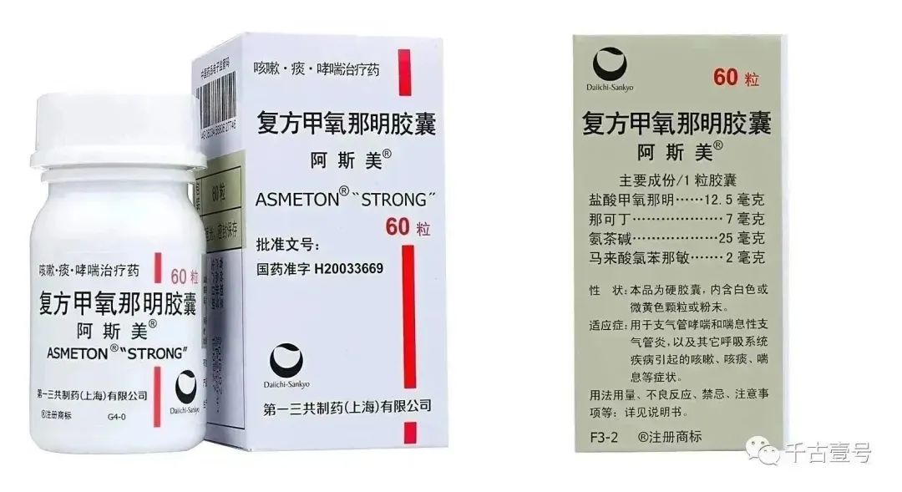

### 6.5 咳嗽的分类和进一步演化

咳嗽的病因和治疗非常复杂。

咳嗽是机体的防御性神经反射，有利于清除呼吸道分泌物和有害因子。成人咳嗽通常按时间分为 3 类：

-   急性咳嗽（<3 周）
    
-   亚急性咳嗽（3~8 周）
    
-   慢性咳嗽（>8 周）
    

如果咳嗽时间过长，通常需要去医院做[肺部 CT](https://mp.weixin.qq.com/s?__biz=MzI2NTYwNjIyNA==&mid=2247514710&idx=1&sn=c19e6459afdf91a3d8dcfcb4264a2a63&scene=21#wechat_redirect)或者**胸片**，还要做**血常规**检查。这个检查是为了诊断肺部是否有异常。[肺部异常](https://mp.weixin.qq.com/s?__biz=MzIzMjg4NzIzNg==&mid=2247498266&idx=1&sn=6f58a07cf44e671f2408070a60187807&scene=21#wechat_redirect)包括：[肺结节](https://mp.weixin.qq.com/s?__biz=MzI2NTYwNjIyNA==&mid=2247516546&idx=1&sn=53ee8a0057657b5b29f670a48463d53f&scene=21#wechat_redirect)、肺炎、慢阻肺、哮喘、肺癌等。

如果持续 5 天高烧不退，或者体温已经正常了一两天之后突然又高烧（不咳嗽），则也有可能是肺部有异常。一般来说，得肺炎的人血氧饱和度会比较低，建议先在家里用血氧仪测一下血氧。

比如新冠病毒感染中，很多重症患者得肺炎的概率特别高；还有一些轻症患者，因为时间咳嗽，也得了肺结节或者肺炎。

我最近还听朋友说到一件不可思议的事情，他的同事因咳嗽导致[肋骨骨折](https://mp.weixin.qq.com/s?__biz=MzAwOTgzMTUyMg==&mid=2247498154&idx=2&sn=b950ec47b0643b6140baeeb95caca5ad&scene=21#wechat_redirect)，真长见识了。

还有很多人常说的“白肺”，就是属于严重的肺炎。医学博主@郝希纯医生对[白肺](https://mp.weixin.qq.com/s?__biz=MzI2NTYwNjIyNA==&mid=2247515665&idx=1&sn=55c87e9475ef5a96bc718dbd2b83adde&scene=21#wechat_redirect)一词解释得比较清楚：

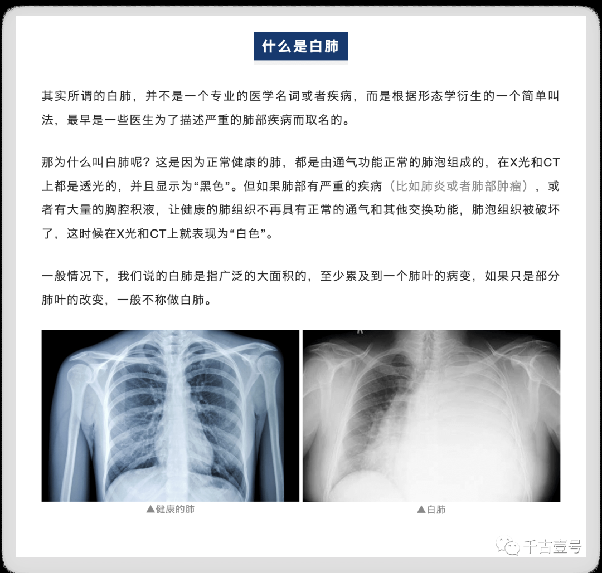

咳嗽的病因主要分为以下几种：

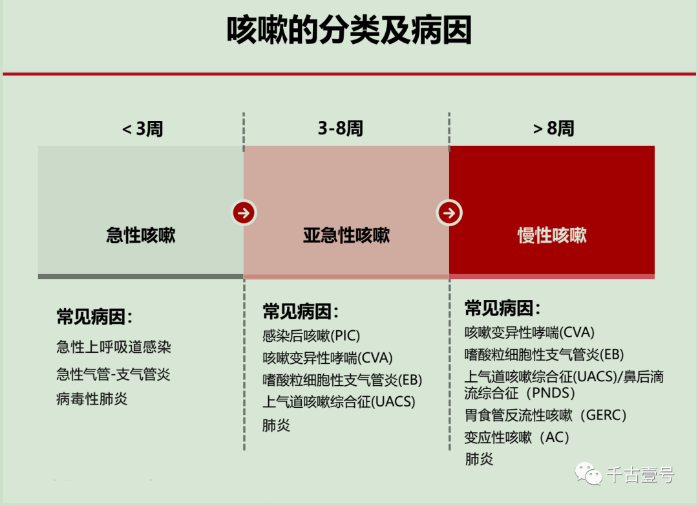

《[咳嗽的诊断与治疗指南（2021）](https://mp.weixin.qq.com/s?__biz=MzIzNDA0Mjc4OA==&mid=2652206094&idx=1&sn=27ecfaed75e984a5d49c7bb23b1ad809&scene=21#wechat_redirect)》提供的咳嗽病因诊断流程如下：

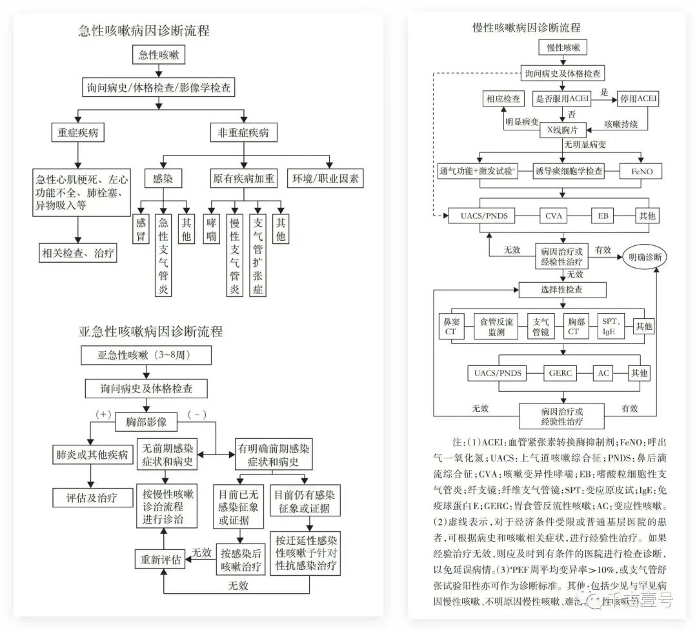

《新型冠状病毒感染咳嗽的诊断与治疗专家共识 》中，关于新冠病毒感染引起的咳嗽，诊断流程则更为复杂：

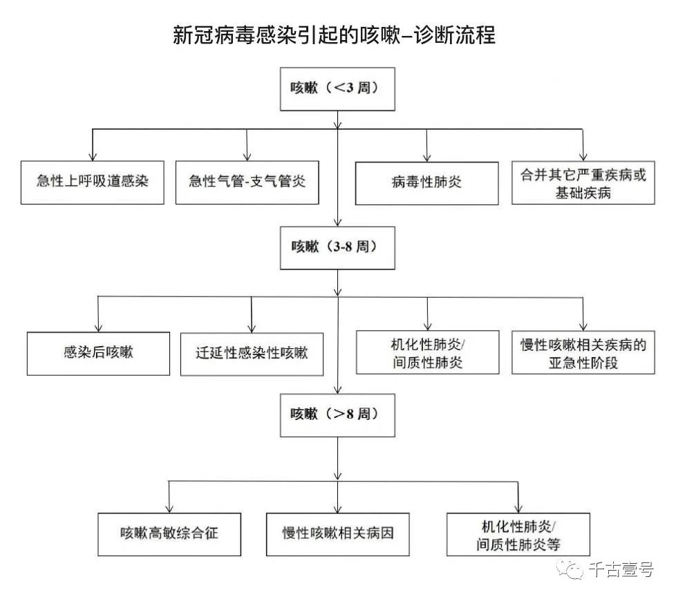

上呼吸道和下呼吸道：

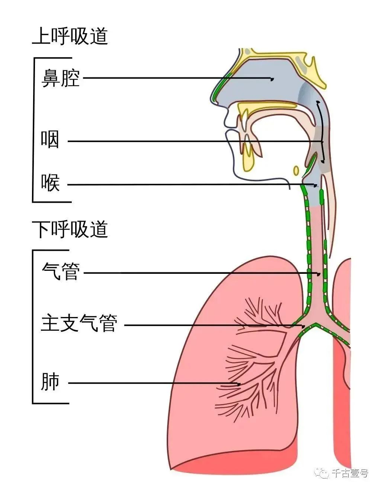

由此可见，咳嗽可不是感冒这么简单，呼吸内科是一门很大、很深的学问。

## 7 咳痰的祛痰药

### 7.1 为什么要祛痰？

痰液是呼吸道炎症的[产物](https://mp.weixin.qq.com/s?__biz=MzU2NzQzNDQwNw==&mid=2247500430&idx=1&sn=004add31e06e0a37a69fbdb605e56d66&scene=21#wechat_redirect)，当人体呼吸道受到外界因素刺激时，导致分泌液的量增加，黏稠度的发生变化，形成痰液。

痰液主要由水分、黏液、病原微生物、炎症细胞以及坏死脱落的黏膜上皮细胞等组成。痰液的粘性主要来自酸性糖蛋白。酸性糖蛋白分子含有双硫键，具有一定的粘性，是白色痰液的主要成份。

咳痰是呼吸系统疾病的常见症状。临床上，患者的咳痰情况，痰的颜色、性状、量、有无特殊气味，痰中是否带血，痰液是否分层，以及咳痰与体位的关系等等都能为临床提供诊断的依据。

痰液可刺激呼吸道粘膜引起咳嗽，痰液的过度分泌、痰液增多、粘稠难以排出还会加重感染，使气道阻塞加重、引起喘憋、呼吸困难，严重时可能导致患者窒息。因此**使用祛痰药物促进痰液排出也就成为了一个非常重要的治疗手段**。

所以你要注意：咳痰时，痰液会造成气道阻塞，痰液里的病原体会加重感染，所以**要把痰液排出来，而不是吞进去**。

### 7.2 祛痰药的分类

祛痰药：也称“化痰药”，通过**稀释痰液、降低痰液粘稠度、促进气道廓清**等机制，或者加速呼吸道黏膜纤毛运动、增强纤毛的清除功能，使痰液易于排出，适用于**有痰且不易咳出**的患者。

祛痰药按照[作用机制](https://mp.weixin.qq.com/s?__biz=MzA5MjIxMzgxMg==&mid=2653377125&idx=1&sn=af1baba77f92a60653d0e06fba0faae9&scene=21#wechat_redirect)可以分为以下几种：

1、**刺激性祛痰药**：通过其挥发性，加稀释加热后吸入蒸汽，可以刺激呼吸道，使呼吸道黏膜轻度充血，加快局部血液循环，并且湿润呼吸道，使痰液易于咳出。由于此类药物使用不方便，吸入蒸汽时有烫伤呼吸道的风险，而且药物的挥发性成分对眼、鼻、喉也会产生刺激，**已很少使用**。常用药物包括：桉叶油、愈创木酚、安息香酊、松节油等。

2、**恶心性祛痰药**：通过刺激胃黏膜的迷走神经引起轻度恶心，反射性促进气管和支气管腺体分泌增加。由于这些腺体中浆液腺占多数，可使痰液变稀，易于咳出。目前临床上较少单独应用此类祛痰药，一般**多用于复方制剂**。常用药物包括：**愈创甘油醚**、氯化铵、碘化钾等。

3、**黏液溶解剂**：使痰液中酸性糖蛋白的多糖纤维裂解，让呼吸道黏液腺和杯状细胞合成酸性糖蛋白减少，从而降低痰液黏稠度，易于咳出。此类药物**在临床上应用最广**。常用药物包括：**氨溴索**、溴己新、**乙酰半胱氨酸**、羧甲司坦、厄多司坦等。

4、**黏液稀释剂**：主要作用于气管、支气管的黏液产生细胞，促其分泌黏滞性低的分泌物，使呼吸道分泌的流变性恢复正常，痰液由黏变稀，易于咳出。此类药物**在临床上也有使用**。常用药物包括：**桉柠蒎**、桃金娘油等。

**小结**：临床目前应用最广、也是最为推荐的祛痰药是：**氨溴索、乙酰半胱氨酸、桉柠蒎**。下面分别详细这几种药。

### 7.3 祛痰药：氨溴索

缓解咳痰的药物中，最知名的祛痰药是**盐酸氨溴索**，简称**氨溴索**。

1、**氨溴索的历史**：

-   1965 年，德国的勃林格殷格翰公司首次将化学合成物盐酸氨溴索研制成功，一年后申请专利。
    
-   1978 年，氨溴索（Ambroxol）首次以**沐舒坦**（Mucosolvan）作为商品名在德国上市。在德国健康协会注册后，盐酸氨溴索已经在一百多个国家被广泛应用于临床和实验室研究。
    
-   1979 年，德国发现沐舒坦除了促黏液腺分泌活性，还具有刺激肺表面活性物质分泌并使其保持正常的功能。
    
-   1984 年，在德国，所有口服类盐酸氨溴索可作为非处方药购买。
    
-   1994 年沐舒坦片剂在中国上市，2000 年沐舒坦口服溶液在中国上市，2008 年沐舒坦缓释胶囊在中国上市。
    

氨溴索于 1965 年研发成功，但要到 1979 年才开始在医疗上使用。

2、氨溴索的原研药——**沐舒坦的历史**：

氨溴索的原研公司是德国的勃林格殷格翰（Boehringer Ingelheim）公司，商品名是**沐舒坦**（Mucosolvan）。沐舒坦的名气非常大，然而很遗憾的是，这款药从 2018 年开始就在国内**停产**了，以后想买都买不到了（海淘除外）。准确来说，沐舒坦的口服药物（片剂、口服液）在国内停产了，注射液依然正常生产。此外，沐舒坦在全球的生产业务已经卖给了法国的赛诺菲（Sanofi）公司。

为什么会停产呢？可能与下面这段历史有关：

> 2017 年 11 月 28 日，国家食品药品监督管理总局收到上海勃林格殷格翰药业有限公司报告。报告显示，勃林格殷格翰公司决定在中国范围内对特定批次的沐舒坦注射液实施主动召回。
> 
> 这批沐舒坦注射液由勃林格殷格翰公司的西班牙工厂生产，然后由上海勃林格殷格翰药业有限公司贴标签、包装并放到中国市场。召回原因是：西班牙工厂在留样稳定性试验中检测到有关物质的量有偏高的现象，但所有的检测结果都在产品质量标准范围内。
> 
> 勃林格殷格翰公司基于对现有数据的评估，并没有监测到受影响批次产品的安全性风险。而此次主动召回的只是在标准范围内出现有关物质含量偏高现象的批次。
> 
> 沐舒坦厂家的 OTC 团队已经于 2017 年 11 月和 2018 年 5 月分批解散，产品也会相应地停产，退出中国市场。
> 
> 勃林格殷格翰中国与浙江医药科技发展有限公司宣布达成战略合作协议：自 2018 年 1 月 1 日起，勃林格殷格翰将在中国独家授权其呼吸产品沐舒坦注射液给浙江医药科技发展有限公司（浙医医药），勃林格殷格翰仍为该产品的所有者和生产者。

因为 2017 年某个批次的沐舒坦质量有问题，就直接停产了？这可真够戏剧性的。况且，有问题的只是注射液而已，口服药可太无辜了。当然，我估计还有一部分原因是勃林格殷格翰公司的相关业务经营不善，否则也不会把沐舒坦的全球业务卖给赛诺菲公司。

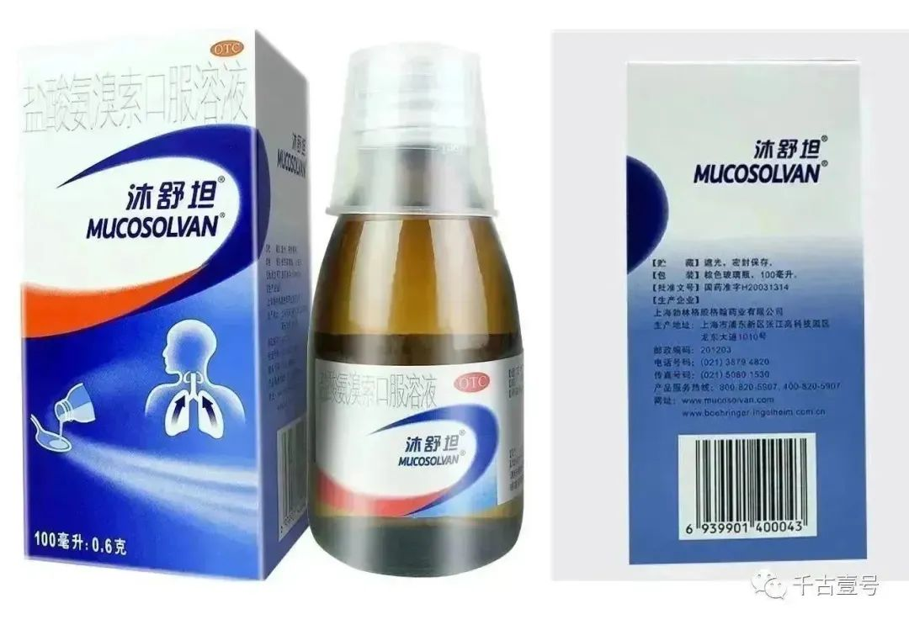

3、**氨溴索的商品推荐**：

氨溴索的口服药物中，剂型包括：盐酸氨溴索**片**、盐酸氨溴索**分散片**、盐酸氨溴索**胶囊**、盐酸氨溴索**口服溶液**。

既然氨溴索的原研药**沐舒坦**已停产，那就买“通过一致性评价”的仿制药。氨溴索的过评厂家如下：

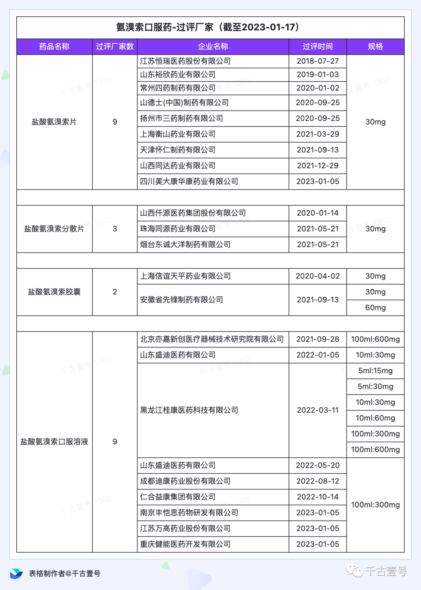

上面的表格可以看到，氨溴索的过评厂家还是比较多的，在这个范围里选就可以了；市面上卖氨溴索口服溶液的商品特别多，有将近 60 种，但大部分没有过评，要注意。如果想进一步缩小选择范围，我个人推荐**安普索**和**抒坦清**这两个商品，前者是山德士公司生产的普通片剂，后者是山西仟源医药公司生产的分散片。这两个的商品信息如下。

**安普索 盐酸氨溴索片**，30mg\*20 片；保质期五年左右；参考价格 ￥12.5 左右；非处方药。商品图如下：

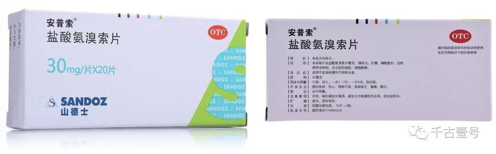

**抒坦清 盐酸氨溴索分散片**，30mg\*20 片；保质期两年左右；参考价格￥9 元左右；非处方药。商品图如下：

### 7.4 祛痰药：乙酰半胱氨酸（富露施）

祛痰药中，当你能将氨溴索脱口而出时，也一定不要忘了乙酰半胱氨酸，因为它俩是最常见的两种祛痰药。还有一点比较特别，孕妇不能吃氨溴索，但可以吃乙酰半胱氨酸。还有啊，它的气味有一股恶臭。

乙酰半胱氨酸对白色黏痰或脓痰均有效，适用于大量黏痰阻塞引起呼吸困难、术后咳痰困难、各种原因引起的痰液黏稠不易咳出的患者。

此外，乙酰半胱氨酸经常用来做雾化吸入；以及治疗间质性肺炎[13]。

1、**乙酰半胱氨酸的历史**：

乙酰半胱氨酸（Acetylcysteine），又叫作 N-乙酰半胱氨酸（N-acetylcysteine），简称为 NAC；于 1960 年首次作为粘液溶解剂被发现，并获得专利，1968 年投入医用。

乙酰半胱氨酸可使痰液中连接糖蛋白肽链的二硫键（S-S）断裂，使其变成小分子肽链并液化，同时还能使痰液中的 DNA 纤维断裂，降低痰液的黏滞性，从而易于咳出；此外，还可以通过抑制细菌的生长和繁殖，协同提高抗生素的抗菌作用。其抗氧化、抗炎等作用也已经被发掘。

乙酰半胱氨酸的产品最早是由是意大利的赞邦集团（Zambon）研发，商品名是**富露施**。1998 年意大利赞邦集团在中国投资成立了独资制药企业——海南赞邦制药有限公司，其研发的原研药——富露施 乙酰半胱氨酸颗粒于 2000 年获批在国内上市，雾化剂型于 2006 年在国内上市。

2、**乙酰半胱氨酸的原研药和过评厂家**：

乙酰半胱氨酸的原研公司是意大利的赞邦集团，商品名是**富露施**，国内上市的剂型包括颗粒、片剂、泡腾片、雾化吸入。

国内生产乙酰半胱氨酸的仿制药商品有 30 多种，其中通过“一致性评价”的商品有 13 种。过评信息如下：

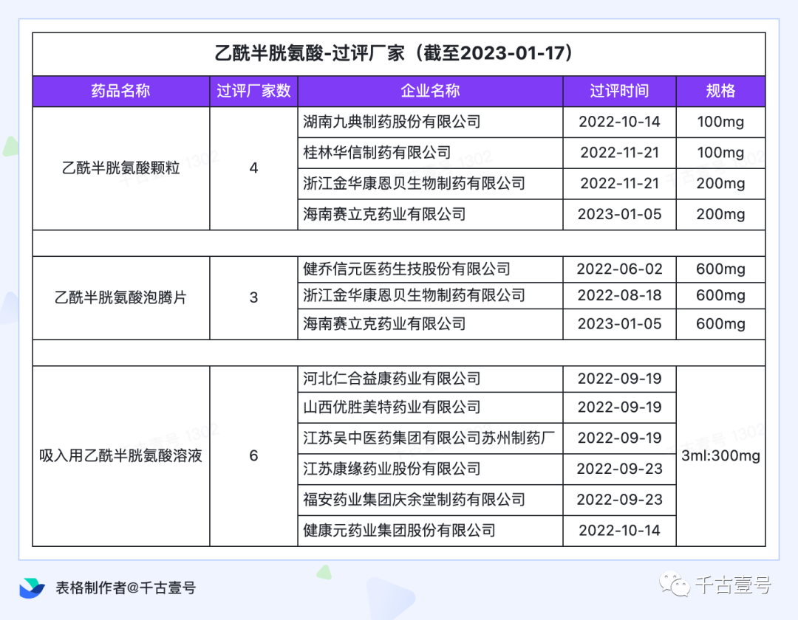

3、**乙酰半胱氨酸的商品推荐**：

乙酰半胱氨酸的商品中，我最推荐的是它的原研药，商品名是**富露施**，剂型选片剂或者颗粒都可以；哮喘患者禁用，胃溃疡患者慎用，孕妇遵循医嘱后可以用。注意，规格要选 0.2g，不是 0.6g。因为 0.6g 是治疗肺病的，不是治疗感冒的。

温馨提示，乙酰半胱氨酸的水溶液中，**有硫化氢的臭味**，部分患者可能会引起恶心。颗粒在冲泡后服用吸收更快，但它的气味更难闻；片剂闻起来也有一点点怪味，但还能接受。

**富露施 乙酰半胱氨酸片**，0.2g\*20 片；保质期三年左右；参考价格￥45 左右；非处方药。商品图如下：

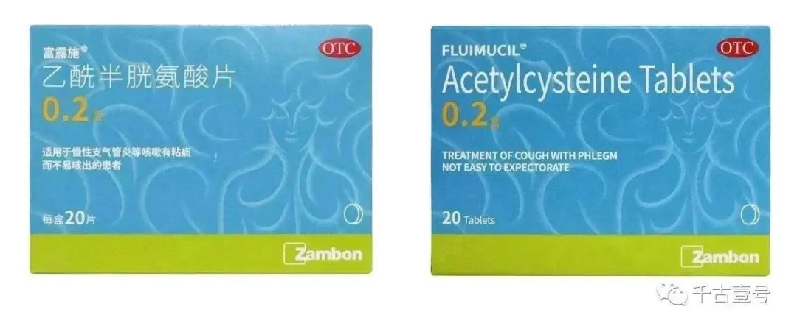

**富露施 乙酰半胱氨酸颗粒**，0.2g\*10 包；保质期三年左右；参考价格￥30 左右；非处方药。商品图如下：

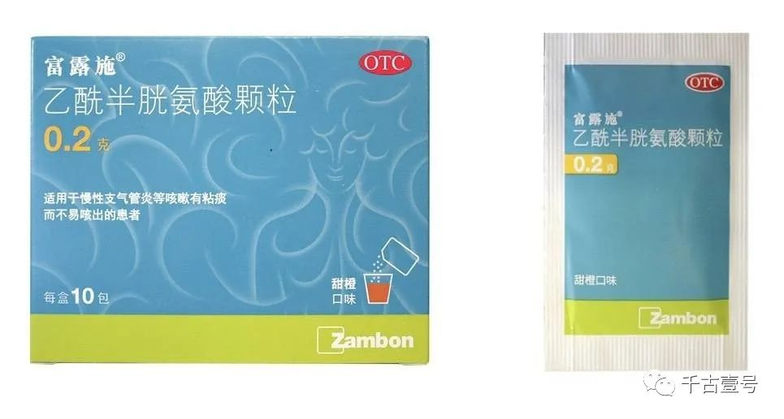

### 7.5 祛痰药：桉柠蒎（切诺）

1、**桉柠蒎（切诺）的介绍**：

**桉柠蒎肠溶胶囊**是北京远大九和药业有限公司推出的国内独家品种，商品名为“**切诺**”；是由桃金娘桉属、芸香科桔属及松科属植物的提取物所组成，主要成分为桉油精、柠檬烯及 α-蒎烯；这三种成分能协同作用能达到镇咳、祛痰、抗炎等作用，能显著提高呼吸道粘液清除效率。临床上常用于急慢性支气管炎、肺炎、支气管扩张、肺脓肿、慢性阻塞性肺部疾患、肺部真菌感染、肺结核和矽肺等呼吸道疾病。

桉柠蒎肠溶胶囊于 1998 年获得中国医学科学院科技进步一等奖，属于国家级二类新药。2005 年获 CFDA 批准生产批文；2007 年儿童装批准上市；桉柠蒎肠溶胶囊与德国的保时佳大药厂生产的标准桃金娘油（商品名为“**吉诺通**”）疗效相同。随着桉柠蒎市场的扩大，进口标准桃金娘油注册批文到期后，已退出中国市场。

2、**切诺的注意事项**：

切诺为黄色肠溶胶软**胶囊**，内容物为浅黄色透明**油状液体**。

切诺的成分是从植物中提取的天然产物，商品的批准文号是 H 开头，即化学药品，说的通俗一点就是西药。切诺虽然是西药，但它在禁忌、注意事项、慎用人群、药物相互作用、药物过量反应等方面和中药类似，就四个字：尚不明确。与其他感冒药相比，切诺算是很新的药，尚不明确的地方需要时间答案。

服药时有一点要注意：切诺须在饭前半小时，用**凉开水送服**（先烧开水，再让水彻底凉下来），禁用热开水；不可嚼破。因为：（1）柠檬烯是从植物的挥发油中提取的，含有挥发油的药品在温度过高时会导致其有效成分的流失。（2）一旦胶囊破裂，在胃部释放药物，就会产生胃酸，非常难受。饭前服用就是为了避免与过多胃酸起反应。

此外，切诺属于比较难吃的药，它的难吃[14]不是在吃的过程中，而是在肠胃溶解之后，有一股奇怪的味道往上蹿，在呼吸时从咽喉钻出来。

3、**切诺的商品信息**：

**切诺 桉柠蒎肠溶胶囊**，0.3g\*15 粒；保质期 3 年左右；参考价格￥35；处方药。商品图如下：

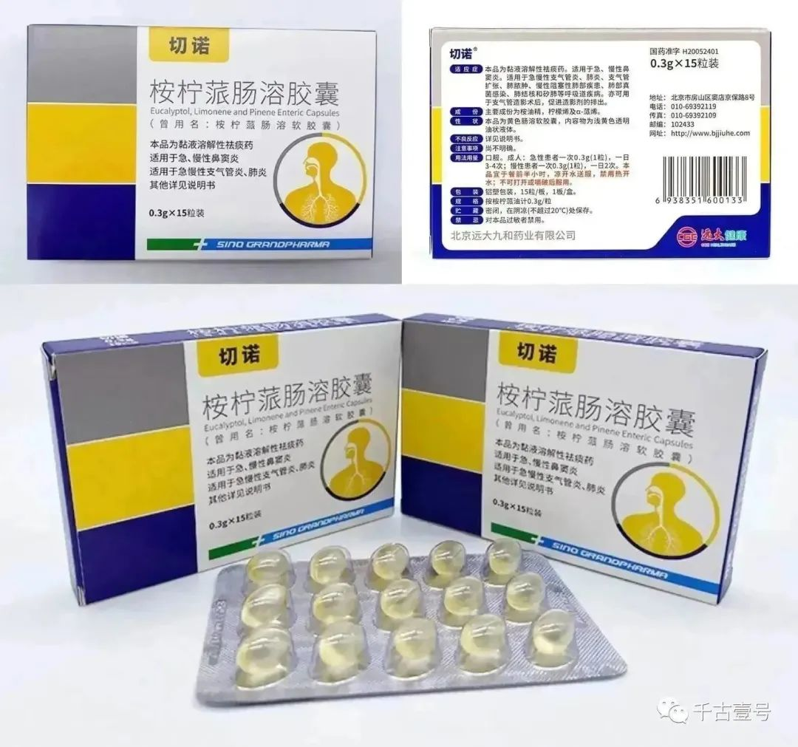

### 7.6 祛痰药的简单对比

1、**三种祛痰药如何选择**：

最常见的三种祛痰药是氨溴索、乙酰半胱氨酸（富露施）、桉柠蒎（切诺）。

如果你明确知道自己吃哪一种祛痰药有效，那可以继续保持。如果你不知道选哪一个，**这里给出我的个人建议**：

（1）在没有禁忌的前提下：如果偏向于吃西药，可以选氨溴索或者富露施。如果偏向于吃中成药，可以吃切诺。切诺虽然属于化学药品，但是取材和注意事项与中成药类似。也可以结合你自己的经验判断：如果你吃这种药没效果，则建议改吃另一种。

（2）氨溴索的知名度最高。富露施不仅能溶解白色黏痰，也能溶解脓性痰，对于一般祛痰药无效的患者，使用富露施仍可能有效。也有一些咳痰的患者，吃氨溴索和富露施都没效果，吃切诺的效果明显。

（3）如果对其中一种药有禁忌，则建议选择另一种药。包括但不仅限于：

-   氨溴索的禁忌：孕妇慎用，可以换成富露施；哺乳期女性慎重。
    
-   乙酰半胱氨酸（富露施）的禁忌：哮喘患者禁用；2 岁以下儿童禁用。
    
-   桉柠蒎的禁忌：孕妇及哺乳期女性慎用。
    

2、**其它的祛痰药行不行**？

很多科普文章里，还提到了其他的祛痰药，比如：溴己新、愈创甘油醚、标准桃金娘油、羧甲司坦、复方甘草合剂等。这些祛痰药行不行呢？老实说，个人在购药时它们并非首选药物，既然已经有更好的选择为什么还要考虑这么多呢？至少在口服药物中，它们的知名度、适用范围、临床研究和治疗效果的综合打分并不如氨溴索、富露施、切诺这三个。常见的其他祛痰药还有：

（1）溴己新：溴己新是从鸭嘴花碱中提取的。氨溴索比溴己新的祛痰作用更强，效果更好。氨溴索是溴己新在体内的活性代谢产物，不需再经[肝酶代谢](https://mp.weixin.qq.com/s?__biz=MzA4MDAyNTM3OQ==&mid=2650291479&idx=1&sn=694cd0516ce15bbe3a84d5609dd9b792&scene=21#wechat_redirect)，直接发挥药效活性，减轻了肝脏的负担，因此毒性更小，耐受性更好。

（2）愈创甘油醚：多用于复方制剂，比如右美沙芬愈创甘油醚糖浆，用于止咳+化痰。但我个人不会首选这个复方制剂，因为止咳和祛痰是矛盾的。

愈创甘油醚是FDA批准的唯一个针对上呼吸道感染和稳定慢性支气管炎痰液相关症状的OTC药物，但也是基于一些早期研究结果；后续的临床RCT试验的结论也[不太一致](https://mp.weixin.qq.com/s?__biz=MzA5NzE5ODIyOQ==&mid=2651641191&idx=1&sn=e2a07df810fc27cab8b9b397544e91a7&scene=21#wechat_redirect)。目前在美国不建议4岁以下孩子使用。

（3）标准桃金娘油（商品名：吉诺通）：它的成分和药效，与桉柠蒎类似。吉诺通已经退出中国市场，不好买，还是买切诺吧。

（4）羧甲司坦：适用于治疗慢性支气管炎、支气管哮喘等疾病引起的痰液粘稠、咳痰困难患者。感冒通常是急性的，所以这个药不适用。此外，羧甲司坦的原研公司是法国的赛诺菲，原研药并未在国内上市；市面上生产羧甲司坦的仿制药商品有 100 多种，但过评的商品只有 3 种，可见这个药比较小众。

（5）川贝枇杷膏、复方鲜竹沥液：成份都是中成药，用不用看你对中药的偏爱程度。

（6）强力枇杷露、宣肺止嗽合剂：成份都是中成药。这两种药里都含有一种成分——罂粟壳。罂粟壳的主要成分吗啡、可待因具有强烈镇咳作用；但用药过量容易导致成瘾，需慎用。

### 7.7 止咳和祛痰是矛盾的

1、**止咳和祛痰是矛盾的**：

去药店买药的人常有这么一个需求：“我想要一款止咳祛痰药。”看似没什么毛病，止咳祛痰、止咳祛痰，大家好像都这么说。

可是，止咳和祛痰是矛盾的。我第一次听说这个观点时，有些刷新认知。在理解这句话之前，我们需要先知道祛痰的原理是什么。

“祛痰药”也称之为“化痰药”，是通过**稀释痰液、降低痰液粘稠度，然后让痰顺利排出来**。有些人咳痰时喜欢将痰液吞咽，这是不对的，痰液中有很多病原体，要吐出来才行。咳痰的难受之处恰恰在这里，大部分感冒的人咳痰时，痰很难排出来，所以才需要祛痰药。当然你也不要逼迫自己一定要把痰液排出来，能排则排，顺其自然就好。有些肺病比较严重的人，由于排痰困难，不得不用上吸痰器。

感冒时，痰液是通过什么方式排出来的呢？就是咳嗽的方式。所以，祛痰药的疗效就是要让你咳嗽，让你排痰。你还要去止咳干什么呢？很多人抱怨说：“为什么医生给我开的祛痰药，没效果呀？我还是一直咳嗽。”其实，不是因为没效果，是因为效果太好了。

止咳药和祛痰药不能同时吃的另一个原因是：需要遵循药物的作用原理，避免**药物相互作用**。比如：

氨溴索的说明书上明确表示：

> 避免与中枢性镇咳药（比如右美沙芬）同时使用，以免稀化的痰液堵塞气道。

乙酰半胱氨酸的说明书表示：

> 不应与镇咳药同时服用，因为镇咳药对咳嗽反射的抑制作用可能会导致支气管分泌物的积聚。

愈创甘油醚的说明书倒是没有提与右美沙芬的相互作用。所以，也有一部分人持相反的态度，觉得止咳药和祛痰药可以同时服用。他们认为：“止咳不是一下子就见效的，在吃止咳药+祛痰药的同时，残存的咳嗽反射可以让痰液排出来。”市面上售卖的一款止咳+祛痰的复方药倒是很畅销，叫“右美沙芬愈创甘油醚糖浆”，虽然我个人不是很认同这个药物，但不否认，这种药的存在，既可以很好地迎合不同的声音，也可以满足许多人的伪需求：“我想要一款既能止咳、又能祛痰的药。”

2、**为什么祛痰药的种类这么多**？

说起退烧药，很多人都能脱口而出布洛芬和对乙酰氨基酚；说起止咳药，右美沙芬榜上有名。可说起祛痰药，却有很多，一只手都不够数。

为什么会出现这样的局面呢？是因为祛痰药已经很成熟了吗？错，恰恰是因为祛痰药不如退烧药、止咳药那么成熟。

发烧的时候，退烧药的作用是降温，效果显著；咳嗽的时候，右美沙芬对延脑中枢有抑制作用，因为延脑中有一群神经细胞组成了“咳嗽中枢”，所以止咳效果也比较明显。

可是，祛痰药的所用仅限于「排痰」，不是「止痰」，通过药物促进排痰的客观难度并不大，所以可选的药物也很多。也就是说，目前的祛痰药只是为了稀释已经出现的痰液，并没有办法让呼吸道停止分泌粘稠的痰液，后者目前是靠自身的免疫力恢复。

我甚至看到一个德国的[测评数据](https://mp.weixin.qq.com/s?__biz=MzAwOTgxMzMwNQ==&mid=2247929014&idx=1&sn=7ef7c40d9c82403e6d41d1b5ba269942&scene=21#wechat_redirect)，说氨溴索的综合祛痰效果只是达到了及格的效果。

3、**止咳药和祛痰药联用时，怎么吃比较科学**？

我们如果把咳嗽的症状从轻到重拆解一下，大致可以分为这几个阶段：

-   阶段 0：不咳
    
-   阶段 1：干咳
    
-   阶段 2：咳嗽+咳痰（排痰顺利）
    
-   阶段 3：咳嗽+咳痰+排痰困难
    

祛痰药的作用仅限于从阶段 3 恢复到阶段 2。当然，不排除部分人恢复得比较好，可以跳过阶段 2，直接到阶段 1，甚至直接到阶段 0。

当你处于阶段 3 时，如果你想把止咳药和祛痰药联用，我提供两种思路，供你参考：

-   思路 1：先吃祛痰药，等恢复到阶段 2 或者阶段 1 时，再吃止咳药。如果你当前处于阶段 2 的话，祛痰药是无法发挥作用的，所以不需要吃祛痰药，只吃止咳药就行。处于阶段 1 时，当然也是毫无疑问只吃止咳药就行。
    
-   思路 2：白天吃祛痰药，晚上吃止咳药。将这两个药错开用，白天化痰，让痰液顺利咳出；晚上止咳，提升睡眠质量。
    

### 7.8 咳嗽有黄痰？警惕合并细菌感染

如果痰液从白色转变成黄色甚至绿色，则需要警惕，很有可能是病毒感染后**合并细菌感染**。合并细菌感染的意思是：一开始是病毒感染，后来随着感冒症状的加重，又多出了细菌感染。

如果你一定要听严谨的说法，可以这样[描述](https://mp.weixin.qq.com/s?__biz=MzA5Nzc0OTg3OQ==&mid=2650949735&idx=1&sn=411ad7bce1ff0be01b4a706391918d0f&scene=21#wechat_redirect)：

> 在急性病毒或细菌感染下，痰液中除了坏死组织，还存在活的中性粒细胞，导致痰液呈黄色。而在气道过敏时会出现淡黄色的痰，则是由于嗜酸性粒细胞的存在。
> 
> 中性粒细胞、嗜酸性粒细胞都是白细胞，痰中的黄、绿颜色正是白细胞释放的结晶过氧化物酶带来的。
> 
> 在急性病毒或细菌感染下，白细胞是一般免疫反应的一部分。也就是说，在呼吸道病毒感染性疾病过程中特定时间，痰液变成的带有白色、黄色或绿色，并非是继发细菌感染的结果，而是参与炎症反应的白细胞，尤其是中性粒细胞数量大增所致。
> 
> 因此，**仅凭痰的颜色是没办法准确判断是细菌感染还是病毒感染，千万不要一出现黄痰就自行服用抗菌药物**。

这至少说明，随着[痰液颜色](https://mp.weixin.qq.com/s?__biz=MzAwMzU2NzA2Ng==&mid=2685539603&idx=2&sn=188a1724a5011d10da514dac45b7fe3d&scene=21#wechat_redirect)的变化和加深，症状在逐渐加重，需要警惕合并细菌感染，甚至更严重的症状。

合并细菌感染需要联用抗细菌药物，即“抗生素”。抗生素是处方药，药物的种类和注意事项比较多，建议遵循医嘱后使用。

## 8 嗓子疼（喉咙痛）怎么办？

发烧、咳嗽是感冒中最要紧的两个症状，第三个要紧的就是嗓子疼（喉咙疼），“刀片嗓”一词因此得名。

咽喉分为两个部分，咽和喉：咽在上部，位置偏后；喉在下部，位置偏前。

感冒引起的咽痛通常属于“急性扁桃体炎”、“急性咽炎”、或者“急性喉炎”。因为感冒有自限性，所以这些诊断的前面加上“急性”两个字的另一个好处是减轻你的焦虑。

### 8.1 嗓子疼没有药

发烧和咳嗽都有成熟的感冒药，可是很遗憾，嗓子疼没有药，至少没有明确对症治疗的药物。针对病毒性感冒，绝大部分人在多喝温热水的过程中，会在一周内恢复。

### 8.2 民间偏方

由于嗓子疼没有药，所以民间出现了很多偏方。这些偏方对于有些人来说，有些用处；对于另外大多数人来说有点用处，聊胜于无；对于少数真正拥有”刀片嗓“疼痛难忍吞咽苦难的人来说，作用可以忽略不计，杯水车薪。最好的方法就是多喝热水。

下面这些偏方不保证有用，可以拓展视野了解一些，选择性尝试。这些方法包括但不仅限于：

-   冰糖炖雪梨
    
-   西红柿拌糖[15]
    
-   吃润喉糖、薄荷糖。清凉的薄荷醇，有镇痛效果。糖是含在嘴里，不是直接吃下去（应该不用我提醒吧）。
    
-   盐水漱口：这个方法好操作，也更安全。可以改善黏液纤毛清除功能，并引起口腔和喉咙的血管收缩（减少充血），缓解喉咙肿胀，减轻喉咙痛的表现。
    
-   喝蜂蜜。高浓度的糖浆能够像一层衣服一样包裹住咽喉处的黏膜，缓解炎症，同时会刺激我们分泌更多唾液。
    
-   咽喉含片：西瓜霜润喉片、金嗓子喉片、复方青橄榄利咽含片（慢严舒柠）、地喹氯胺含片等。
    
-   咽喉喷剂：西瓜霜喷剂、开喉剑喷雾剂、金喉健喷雾剂、双氯芬酸钠喷雾剂等。
    
-   [其他中成药](https://mp.weixin.qq.com/s?__biz=MzIzMDg0MzQ1OQ==&mid=2247516779&idx=1&sn=83a14ffe4d9dda3660d6ce66d9fbd4e0&scene=21#wechat_redirect)：蒲地蓝消炎片/蒲地蓝消炎口服液、龙角散、六神丸、清咽滴丸、青果丸等。
    
-   吃冰淇淋、吃雪糕&冰棒、喝冰水等，让嗓子麻木一会儿。
    
-   喝柠檬水，补充维生素 C
    
-   室内使用加湿器，保持空气湿润，达到给呼吸道补水的效果，对缓解鼻塞、喉咙痛都有一点作用。
    
-   吃黄桃罐头：作为安慰剂，它起码可以补充能量和维 C。
    

你看到没有，光是含片、喷剂、各种中成药，这些常见的药就有十几种，简直是百花齐放的盛观，说明感冒嗓子疼确实没有明确有效的药物。

### 8.3 推荐两款润喉糖

缓解嗓子疼的一种很方便的方法是吃润喉糖。如果你想尝试这种方法，我推荐两款还不错的润喉糖：**哲库林**（Zirkulin）、**使立消**（Strepsils）。商品信息如下。

1、**哲库林**（Zirkulin）润喉糖，30 粒装；无糖版；德国生产；保质期三年左右；参考价格￥48 左右。商品图如下：

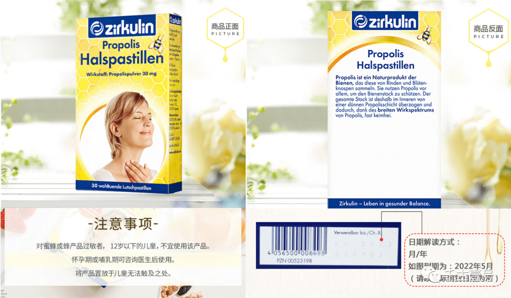

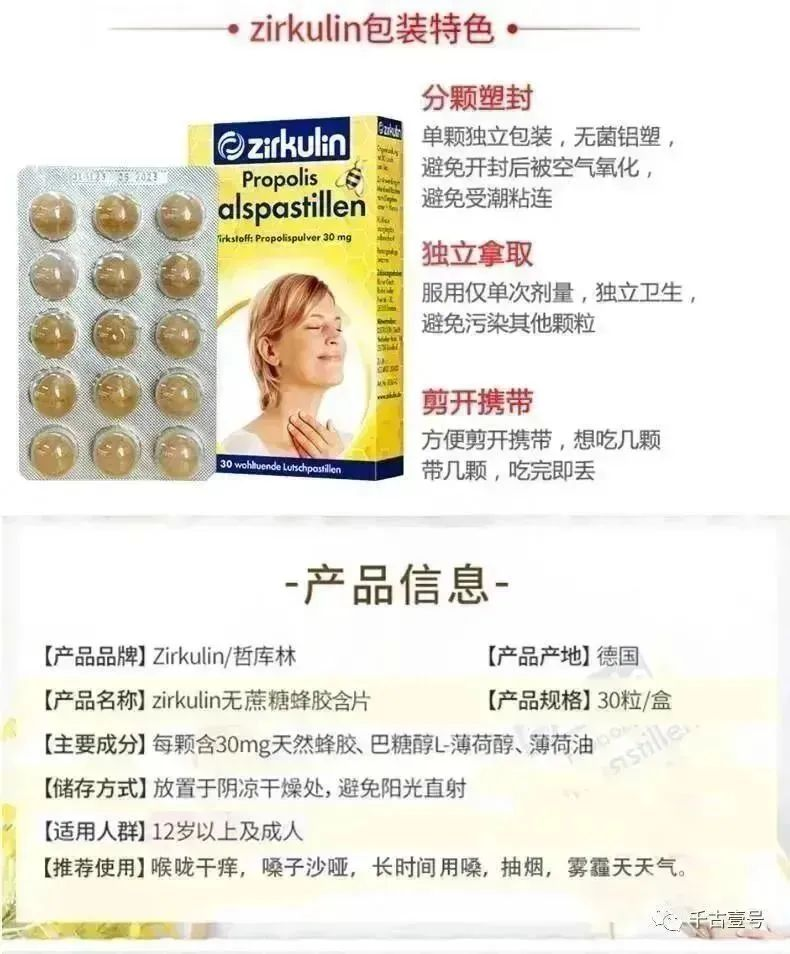

哲库林的主要成分是蜂胶、薄荷醇、薄荷油；并用巴糖醇代替了蔗糖，所以糖尿病患者也可以使用。

2、**使立消**（Strepsils）润喉糖，36 粒装；英国生产；保质期三年左右；参考价格￥80 左右。商品图如下：

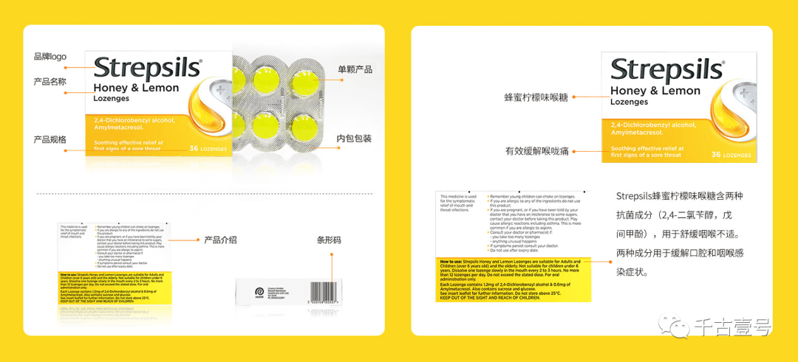

正反面

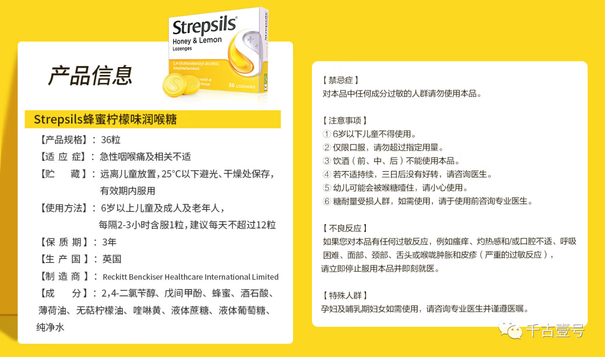

产品信息

注意，**使立消**（Strepsils）润喉糖有很多种口味：

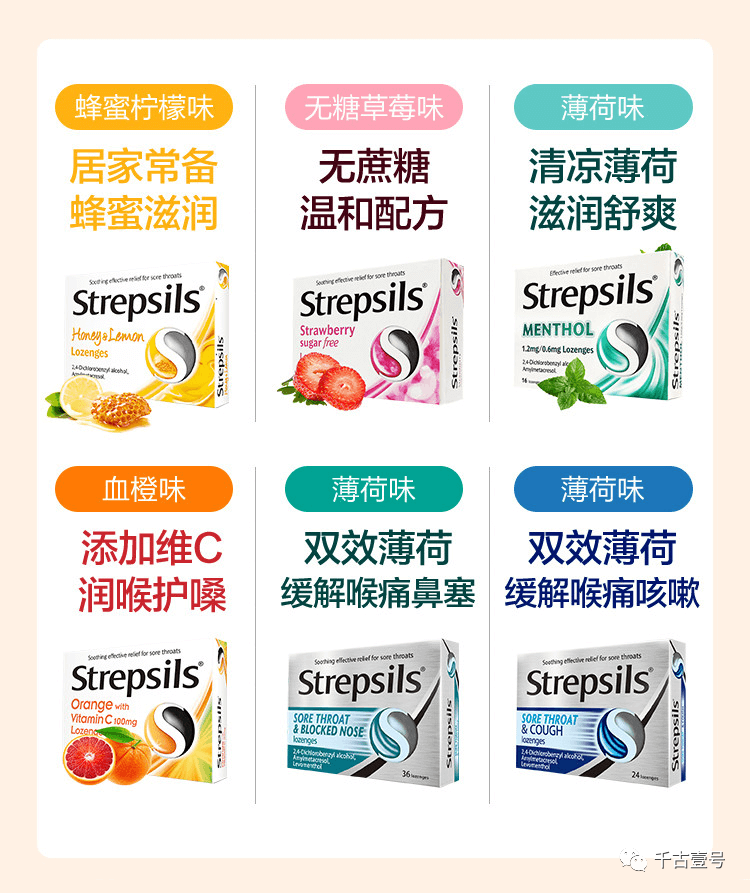

如果针对感冒中的嗓子疼症状，选左上角的第一种「蜂蜜柠檬味」就好；如果是针对糖尿病人，可以选第二种「无糖草莓味」，但是这种口味少了蜂蜜和薄荷油的成分，效果要打些折扣。其他口味的，我认为暂时没必要研究了，它们无法代替感冒药。

### 8.4 嗓子疼实在想吃药？

如果嗓子疼实在想吃药，也不是没有。我提供两种思路供你参考。

第一种药是[布洛芬](https://mp.weixin.qq.com/s?__biz=MzI0NDA5MDYyNA==&mid=2648257089&idx=1&sn=ad14f4456a6154832a84c4573a1cc246&scene=21#wechat_redirect)。没错，布洛芬既可以退烧，也可以止痛和消炎。你忘了吗？很多女生来大姨妈就是吃布洛芬。嗓子疼吃布洛芬缓解，这是被许多医生公认的。

第二种药是康复新液[16]说有奇效，可以治疗咽部的黏膜破损。但是，如果我告诉你康复新液的成份，你可能需要很大的勇气才能喝得下去这个气味腥臭的液体，它的成份是美洲大蠊干燥虫体提取物，通俗一点就是——蟑螂水。

**好医生 康复新液**，100ml 装；保质期 3 年左右；参考价格￥25 左右；处方药。商品图：

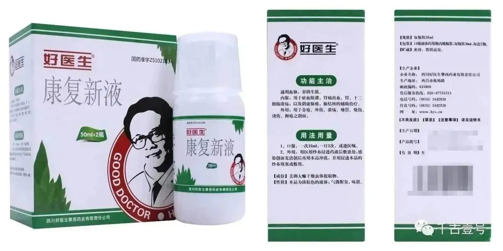

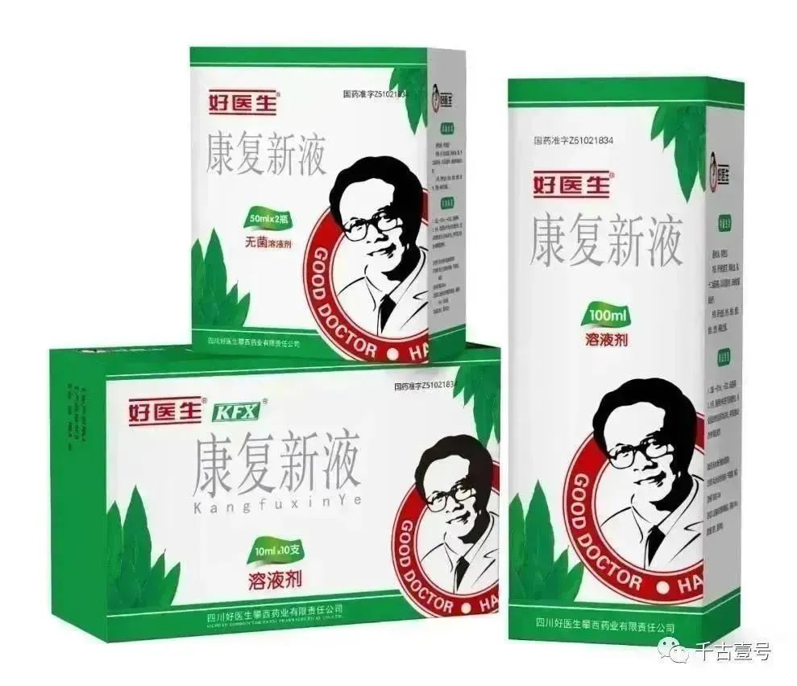

市面上目前生产康复新液的有四个厂家，都差不多：

-   四川好医生攀西药业有限责任公司
    
-   昆明赛诺制药股份有限公司
    
-   湖南科伦制药有限公司
    
-   内蒙古京新药业有限公司
    

### 8.5 扁桃体充血肿胀甚至化脓？警惕合并细菌感染

嗓子疼的进一步发展，可能会出现扁桃体充血肿胀的表现，严重时还会在表面出现大量的脓性分泌物，这很有可能时出现了细菌感染，排排在第一位的是**链球菌性咽炎**。这往往需要就医，经医生明确诊断为细菌感染后，酌情使用抗生素抗感染治疗，[因为](https://mp.weixin.qq.com/s?__biz=MzU3NDM5ODM1MQ==&mid=2247648713&idx=1&sn=1451166d58c44aabda61474ad1dd5f5b&scene=21#wechat_redirect)不是所有细菌感染都是链球菌性的（注意，扁桃体肿胀需与扁桃体肥大相鉴别）。

合并细菌感染需要联用抗细菌药物，即“抗生素”。抗生素是处方药，药物的种类和注意事项比较多，建议遵循医嘱后使用。

如果不方便去医院，也可以自己拍摄一张咽喉部照片，通过在线问诊的方式让医生看看。拍摄时用棉签或者筷子压住舌根，同时发出啊的声音，记得开启闪光灯拍照并上传原图。

比如下面这张图，如果出现黄点点一般就是化脓的表现：

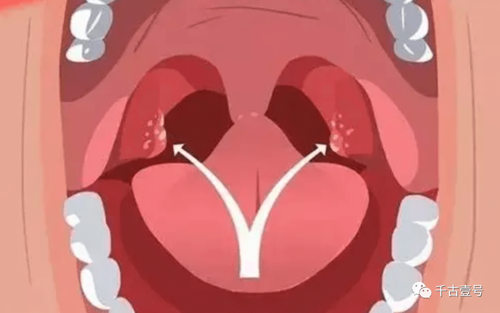

### 8.6 长期嗓子疼？警惕其他病因

如果长期嗓子疼，则需要警惕可能是由[其他病因](https://mp.weixin.qq.com/s?__biz=MzAwMTUxMjYwNQ==&mid=2657749671&idx=2&sn=891f032cada6bd65aa9d92eaca3f4f65&scene=21#wechat_redirect)引起，比如：慢性咽炎、慢性喉炎、胃食管反流病等。

咽喉是消化系统和呼吸系统的一部分，最后再来复习一下咽和喉的部位：

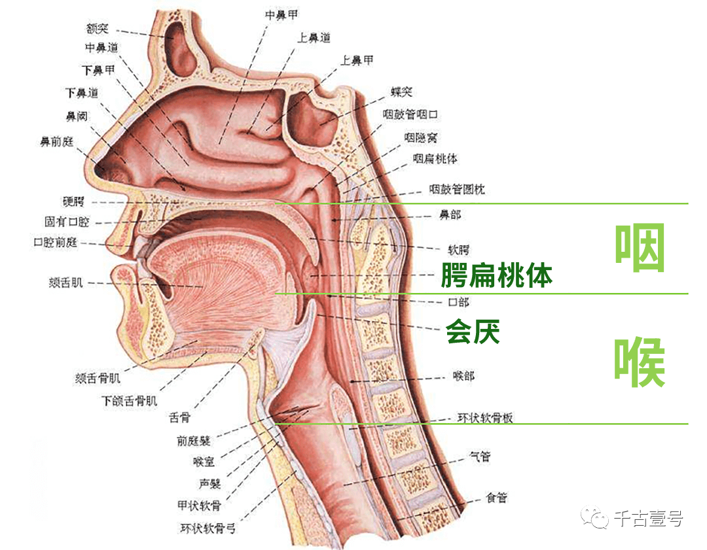

## 9 缓解鼻塞、流鼻涕的药物

鼻塞、流鼻涕是感冒中最轻的症状，大多数情况下不需要用药。当然不排除有些人的症状就是很严重，所以必要时还得用药。

### 9.1 缓解鼻塞：减充血剂

鼻子如果完全堵了还是挺难受的，江湖上有“水泥鼻”一词如雷贯耳。如果鼻塞已经严重到影响正常生活的话，用药会好受一些。

[再者](https://mp.weixin.qq.com/s?__biz=MjM5MjgwOTI5MQ==&mid=2650218735&idx=1&sn=2fac2240193d224df6c68c512b64a0b9&scene=21#wechat_redirect)，鼻孔堵住后就只能通过嘴巴呼吸，如果一晚上都是张嘴呼吸，不仅影响睡眠不利于自身免疫力清除病毒，也会导致第二天嗓子干涩不舒服。

感冒时，缓解鼻塞最推荐的药物类型是**减充血剂**，这在临床上已经是比较成熟的治疗方案了。顾名思义，这类药的作用是，**减少鼻咽部黏膜充血**；可以直接收缩**鼻咽黏膜**血管，减轻充血肿胀，快速改善鼻塞症状。针对鼻部症状，只能改善鼻塞；无法改善喷嚏、鼻痒、流涕等[症状](https://mp.weixin.qq.com/s?__biz=Mzg5MzE1Mzc3MQ==&mid=2247484370&idx=1&sn=6c5fb6b3c82f8fe6a4f84ad9d8cddc5c&scene=21#wechat_redirect)。

常见的减充血剂包括这四种药：羟 qiǎng 甲唑 zuò 啉 lín、赛洛唑啉、萘 nài 甲唑啉、伪麻黄碱。这四种药的剂型如下：

-   喷雾剂/滴鼻液：盐酸**羟甲唑啉**喷雾剂、盐酸**赛洛唑啉**鼻用喷雾剂、盐酸**萘甲唑啉**滴鼻液。
    
-   口服药：**伪麻黄碱**。无法购买单方制剂，常存在于复方制剂中。
    

喷雾剂/滴鼻液的效果比口服药的起效更快，因为鼻黏膜可以直接吸收药物。

我还要提醒一点：减充血剂在使用时，**连续用药不得超过 7 天**（建议用 4 天停 3 天），**每日用药不能超过 3 次**，用药过频易致反跳性鼻充血，久用可致**药物性鼻炎**，产生药物依赖。萎缩性鼻炎及鼻腔干燥者禁用。

1、**喷雾剂/滴鼻液的对比**：

缓解鼻塞的这三种喷雾剂对比，[丁香医生](https://mp.weixin.qq.com/s?__biz=MjA1ODMxMDQwMQ==&mid=2657825890&idx=1&sn=3481c7c26767525bbefa84a9366d7f76&scene=21#wechat_redirect)整理得比较全面：

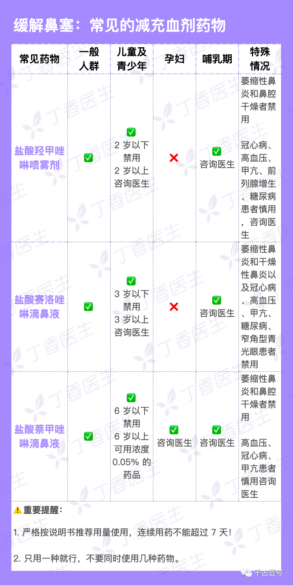

在没有药物禁忌的前提下，这三种药都可以。选择困难症的人如果非要选一种，该怎么选呢？我建议选**羟甲唑啉**（商品名：达芬霖），因为相对温和。理由如下：

（1）药效强度：萘甲唑啉>赛洛唑啉>羟甲唑啉。持续时间[17]：羟甲唑啉（8 小时）>赛洛唑啉（5-6 小时）>萘甲唑啉（3-4 小时）。副作用从大到小：萘甲唑啉>赛洛唑啉>羟甲唑啉。也就是说，**萘甲唑啉的药效更强，但副作用更大，一般不推荐使用**。

（2）[有些医生说](https://mp.weixin.qq.com/s?__biz=MzIwNDk2NTcyNg==&mid=2247501075&idx=2&sn=a6cc1da5f5bf2b137e3593c1270abfb0&scene=21#wechat_redirect)，萘甲唑啉因为副作用太大，容易形成药物依赖性，这款药早就被淘汰了。

接下来我可以告诉你，哪些商品的知名度相对比较高。

2、**喷雾剂/滴鼻液的商品推荐**：

-   盐酸**羟甲唑啉**喷雾剂，推荐商品：**达芬霖**
    
-   盐酸**赛洛唑啉**鼻用喷雾剂，推荐商品：**诺通**，分成人款和儿童款。
    
-   盐酸**萘甲唑啉**滴鼻液，这个药比前面两个的药效更强，但副作用更大，一般不建议使用。这个药的名字俗称“滴鼻净”，价格很便宜，几块钱就能买到，推荐商品：**三益**（商品图我就不贴了）。
    

商品信息如下。

**达芬霖** 盐酸**羟甲唑啉**喷雾剂，10ml:5mg；150 喷；保质期三年左右；参考价格￥20 左右；非处方药。商品图：

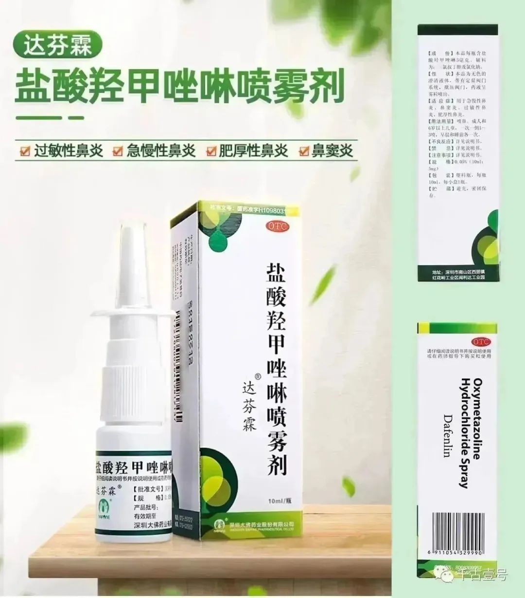

**诺通** 盐酸**赛洛唑啉**鼻用喷雾剂，成人款，10ml；保质期两年左右；参考价格￥50 左右；非处方药。商品图：

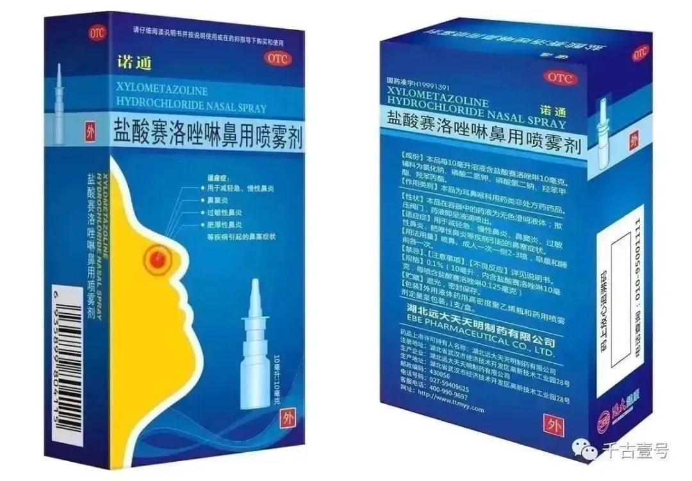

3、**伪麻黄碱的介绍**：

要了解“伪麻黄碱”，首先要知道“麻黄碱”。

麻黄碱最初是从名叫麻黄的植物中提取出的一种生物碱，也因这种植物得名。1885 年，日本有机化学家长井长义首先从麻黄中分离出麻黄素（即麻黄碱）。

伪麻黄碱是从麻黄碱中提炼出来的吗？当然不是。麻黄碱是从麻黄植物中提取的天然物质；伪麻黄碱是在实验室合成的化学物质，工业制取一般从带有苯甲醛的葡萄糖酵母发酵液中提取。前者是天然物质，后者是人造物质。

从化学结构式上看，麻黄碱、伪麻黄碱只有立体异构的区别——左旋：麻黄碱、右旋：伪麻黄碱。

化学结构的区别导致了伪麻黄碱中枢作用比麻黄碱弱，也就是说，在缓解感冒时带来的鼻部不适如鼻塞、流鼻涕的同时，精神兴奋、失眠等中枢方面的不良反应有所减轻，故而伪麻黄碱比麻黄碱更安全。

因为麻黄碱、伪麻黄碱的化学分子结构与俗称“冰毒”的甲基苯丙胺（去氧麻黄碱）极近相似，通过并不复杂的化学转化，麻黄碱、伪麻黄碱就可能被制成冰毒。

伪麻黄碱属于**管制药品**，根据《危险化学品安全管理条例》、《易制毒化学品管理条例》，本品受公安部门管制。在药店单独买是买不到的，可以买到含伪麻黄碱的复方制剂，且需要实名登记。

作为感冒药的常见成分，伪麻黄碱在临床上的使用经验已超过了百年。经过长期大量的临床研究和广泛的临床应用，证明它可快速缓解感冒鼻塞症状，安全性良好，而且选择性收缩上呼吸道血管，故而中枢影响较小。

伪麻黄碱口服后经由胃肠道吸收，由肾脏经尿液排出，尿液中的伪麻黄碱结构绝大部分没有改变，[会以原型排出](https://mp.weixin.qq.com/s?__biz=MzIyMDA3MTgxNQ==&mid=2652443676&idx=2&sn=e0bdad1d64382fd9b2474a4c7f57f7fa&scene=21#wechat_redirect)，比较安全。

### 9.2 缓解流鼻涕：氯苯那敏

缓解感冒流鼻涕的症状，最推荐的药物成份是**氯苯那敏**，它属于第一代抗组胺药物。

这么多抗组胺药，为什么氯苯那敏最常见？这就要先了解抗组胺药物的分类。

1、**抗组胺药的分类**：

抗组胺药一般分为三类：

-   第一代抗组胺药：可以治疗过敏；可以治疗感冒中的流鼻涕，效果比较好；可以治疗干咳中的嗓子痒；还可以[治疗晕车](https://mp.weixin.qq.com/s?__biz=Mzg2NDEzNTk4OA==&mid=2247494979&idx=1&sn=be894db35a174743a791349ca208d086&scene=21#wechat_redirect)。此药的半衰期较短。副作用是**嗜睡**，因为可以透过血脑屏障，产生中枢抑制作用；服药期间，不要开车。
    

常见药物有：**氯苯那敏**（扑尔敏）、苯海拉明、酮替芬等。

-   第二代抗组胺药：没有嗜睡的副作用。治疗过敏的效果比第一代要好；可以治疗感冒流鼻涕，但效果不如第一代；无法治疗干咳中的嗓子痒，因为没有抗胆碱的作用；无法治疗晕车，因为第二代抗组胺药不能透过血脑屏障，无法对中枢系统的组胺 H1 受体产生抑制作用，也就发挥不了抗晕车的效果。
    

常见药物有：氯雷他定、西替利嗪等。

-   第三代抗组胺药：属于第二代的衍生物或代谢产物。没有嗜睡的副作用。可以长期使用，副作用比第一代、第二代都小。
    

常见药物有：地氯雷他定、左西替利嗪等。

2、为什么**第一代**抗组胺药，治疗流鼻涕的效果更好？

第一代抗组胺药（比如氯苯那敏）有抗过敏、抗胆碱作用，并有亲脂性，易透过血脑屏障。（1）抗过敏作用：通过阻断 H1 受体而抑制小血管扩张，降低血管通透性，有助于消除或减轻普通感冒者的打喷嚏和流涕等症状。（2）[抗胆碱作用](https://mp.weixin.qq.com/s?__biz=MzA5MjIxMzgxMg==&mid=2653370215&idx=1&sn=78092b4376d9e2531898b3a90b7364ed&scene=21#wechat_redirect)：有助于减少分泌物、减轻咳嗽症状，且透过血脑屏障与脑细胞的组胺受体结合，抑制组胺对中枢系统的兴奋作用，而减少组胺对咳嗽受体的刺激作用，有一定的中枢镇咳作用。可用于普通感冒引起的咳嗽、感染后咳嗽（PIC）。

考虑到「氯苯那敏」的嗜睡副作用，很多复方感冒药中会额外加入「**咖啡因**」，用于中和嗜睡的副作用。如果你认为嗜睡的副作用对你正在进行的生活或工作没有影响，则不需要加入咖啡因。

第二代抗组胺药物、第三代抗组胺药物因不易透过血脑屏障，也基本无抗胆碱作用，不是感冒药中的首选药物。

**3、氯苯那敏 VS 酮替芬的对比**：

感冒流鼻涕中，最推荐的药物成份是**氯苯那敏**。酮替芬能不能用呢？最好在医生的指导下使用。

氯苯那敏具有组胺 H1 受体阻断作用，常用于普通感冒引起的流鼻涕、咳嗽中的嗓子痒。

酮替芬具有**强**组胺 H1 受体阻断作用，**强度是氯苯那敏的 10 倍**，且作用时间长；同时还可以抑制过敏介质释放；适用于过敏性鼻炎和过敏性支气管哮喘等变态反应性[疾病](https://mp.weixin.qq.com/s?__biz=MzA4NDI5MzYzNA==&mid=2650666856&idx=3&sn=d33ba01f00d15fb8db2086c52a1fa1e2&scene=21#wechat_redirect)。

4、**氯苯那敏的历史**：

**氯苯那敏**（Chlorpheniramine），又称**扑尔敏**，全称是马来酸氯苯那敏（Chlorpheniramine Maleate）。

-   1910 年，Henry Dale 和 Patrick Laidlaw 发现组胺：当出现过敏症状时，人体会释放组胺这种物质。
    
-   1937 年，意大利的药理学家 Daniel Bovet 用化学方法合成了历史上第一个抗组胺药物，即 2-异丙基-5 甲基苯氧乙基二乙胺，并证实该药在体内外均具抗过敏活性，他也因此获得 1957 年的诺贝尔生理学与医学奖。
    
-   1947 年，美国的先灵葆雅公司（2009 年被默沙东并购）站在巨人的肩膀上研制并合成出了氯苯那敏，成为第一代抗组胺药物的代表。
    
-   1950 年，美国的拜耳（Bayer）公司开始生产并销售[18]氯苯那敏，即 Chlor-Trimeton。
    
-   1981 年，氯苯那敏片首次在国内上市，由四川攀西生物药业公司生产。
    
-   1988 年，先灵葆雅公司开发的第二代抗组胺药物——氯雷他定（开瑞坦）成功上市，标志着人类进入清醒抗过敏时代。
    
-   从 1937 年第一个抗组胺药开发至今，已有 50 余种 H1 受体拮抗剂供临床应用。
    
-   氯苯那敏至今仍作为多种复方药物的抗过敏成分广泛使用。
    

5、**氯苯那敏的商品推荐**：

氯苯那敏的原研公司是美国的拜耳公司，原研药未在国内上市。建议选通过“一致性评价”的仿制药。氯苯那敏的过评厂家有两个，在这两个里面选就可以了：

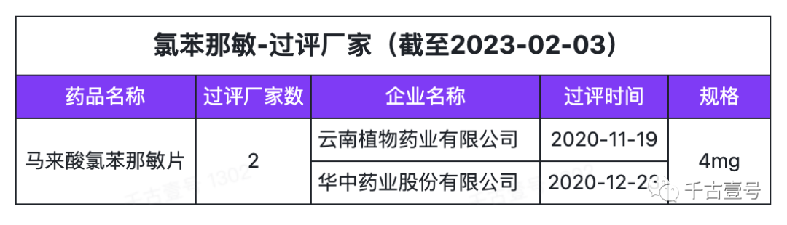

氯苯那敏很便宜，五块钱就能买到 100 片。如果想进一步缩小选择范围，我推荐华中药业股份有限公司的氯苯那敏片，商品名是**维福佳**，这个商品的知名度最高；另一个厂家的氯苯那敏，很少看到有卖。维福佳的商品信息如下。

**维福佳 马来酸氯苯那敏片**，4mg\*100 片；保质期 2 年左右；参考价格￥5；非处方药。商品图：

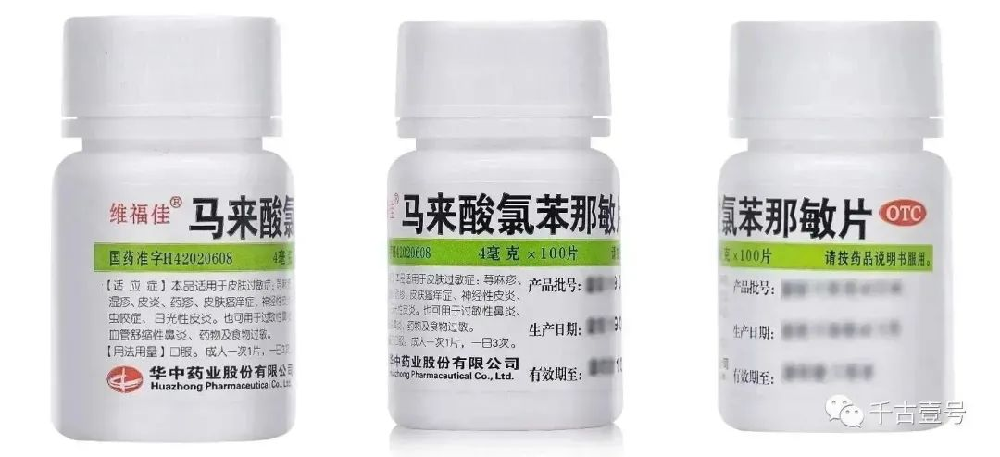

### 9.3 长期流鼻涕？警惕其他病因

如果长期流鼻涕，可能是过敏性鼻炎、鼻窦炎等病因，建议咨询医生。

## 10 复方感冒药

市面上买复方感冒药（即“复方制剂“）的人，远比买”单方制剂“的人要多得多。可如果不清楚复方感冒药的成份和作用而盲目购买的话，这是非常不理智的行为。

复方感冒药是很方便、很科学的药，它的特点是将多种不同功效的药物成份组合在一起，最终制成一种药。假如你的感冒有两种、甚至更多种症状的话，买”二合一“甚至”三合一“成份的复方感冒药显然更方便、更高效。可如果你只有一种症状，是完全没必要买复方制剂的。

在使用复方感冒药时，必须至少遵循**以下三个原则**，缺一不可：

（1）吃药之前先看成份，熟悉每一种成份的功效和副作用，对症下药。避免用错药，避免多余用药，避免长期用药。

（2）同一种成份，不要重复用药，避免过量用药。

（3）多个成份之间，能否联用？避免药物相互作用后产生的副作用。

有些人对复方感冒药很谨慎：”为什么一定要买复方感冒药？我可以自己配呀。“你当然可以拿单方制剂自己配，可在这之前，你要先熟悉复方感冒药的配方。

接下来，我们就来看看市面上常见的复方感冒药，它们的成份和功效是什么。

### 10.1 常见的复方感冒药

下面这个表格列举了一些常见的复方感冒药，及其有效成份。这个表格的目的是让你在吃药前，先看清成份再选择，不再迷茫：

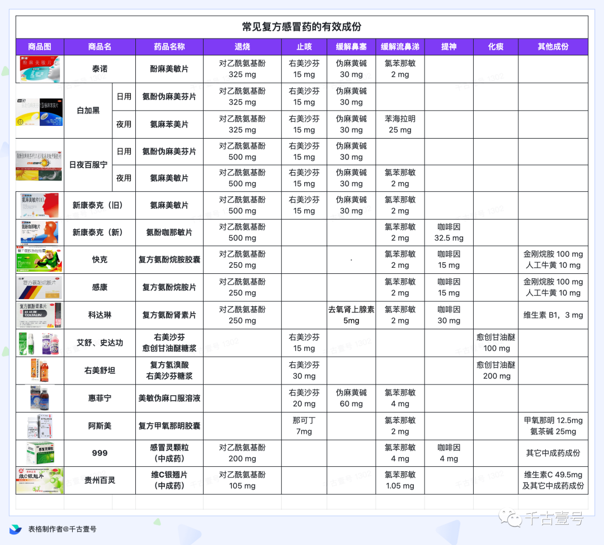

### 10.2 复方感冒药的成份解读

1、请将上方表格中复方感冒药的成份进行反复阅读和拆解，进而，你将至少掌握以下重要规律：

（1）了解每一种配方的作用、剂量、注意事项、适用人群、副作用，然后对症下药。这很有必要。

（2）复方感冒药中最有价值的成份是伪麻黄碱。伪麻黄碱作为管制品无法单独购买；只能买复方制剂，避免被提纯。你如果实在想要减充血剂的单方制剂，可以选羟甲唑啉、赛洛唑啉等鼻用喷雾剂。

（3）如果那些复方感冒药的配方被市场证明是安全的，你也可以参考它们的成份和剂量，自己买单方制剂自己配。

2、通过上面的表格可以看出，复方感冒药的成份至少有这几类：

（1）退烧药：一般是对乙酰氨基酚。原理是通过抑制环氧化酶减少前列腺素的合成，发挥解热镇痛作用。

（2）止咳药：代表药物是右美沙芬。通过抑制延髓咳嗽中枢发挥作用，其镇咳作用与可待因相等或略强。

（3）减充血剂：属于肾上腺素受体激动剂，代表药物是伪麻黄碱。也有少数感冒药使用的是甲基麻黄碱、去氧肾上腺素等，其减充血作用比伪麻黄碱稍弱。这类感冒药的原理是：通过发挥其收缩上呼吸道毛细血管的作用，消除鼻咽部黏膜充血，从而缓解鼻塞等症状。

（4）抗组胺药：代表药物是氯苯那敏，也有少数感冒药使用的是苯海拉明、溴苯那敏等。主要作用是减轻感冒所致的流涕、打喷嚏等症状。有嗜睡的副作用。

（5）提神类：代表药物是咖啡因，一般与氯苯那敏等抗组胺药联合使用。咖啡因的提神作用可以中和氯苯那敏的嗜睡副作用。

（6）祛痰药：代表药物是愈创甘油醚，原理是：反射性地引起支气管腺体分泌增加，降低痰液浓度。

（7）抗病毒药：代表药物是金刚烷胺。金刚烷胺是最早用于抑制流感病毒的抗病毒药，原理是：阻止病毒侵入细胞，可减轻病毒的感染程度。流感病毒和普通感冒病毒有些区别，金刚烷胺只对甲型流感病毒有抑制作用，而对普通感冒的鼻病毒、冠状病毒没有作用。另外，对抗流感病毒有更好的专用药，名字叫——“奥司他韦”，推荐商品——达菲、可威。

### 10.3 以泰诺为例，拆解药品名称

泰诺 酚麻美敏片，这款药的药物成份和商品品牌非常经典，保质期有五年。如果你同时具备“发烧+干咳+鼻塞+流鼻涕”的症状的话，泰诺是很适合的药。我们以它为例，来进一步了解复方感冒药。

1、**泰诺的商品信息**：

**泰诺 酚麻美敏片**，保质期五年左右；有 10 片/盒、20 片/盒；20 片/盒的参考价格￥40 左右；处方药。商品图如下：

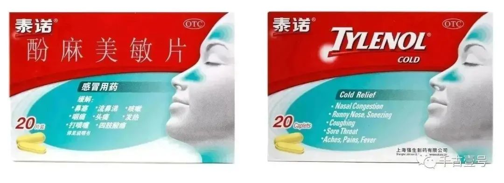

从上面的商品图中，可以这款药的如下信息：

-   商品名：泰诺
    
-   药品名称：酚麻美敏片
    
-   厂家：强生制药
    
-   剂型：片剂
    
-   成份及适用症状：对乙酰氨基酚 325 mg（退烧）、右美沙芬 15 mg（止咳）、伪麻黄碱 30 mg（缓解鼻塞）、氯苯那敏 2 mg（缓解流鼻涕）。
    

2、**拆解“酚麻美敏”这四个字**：

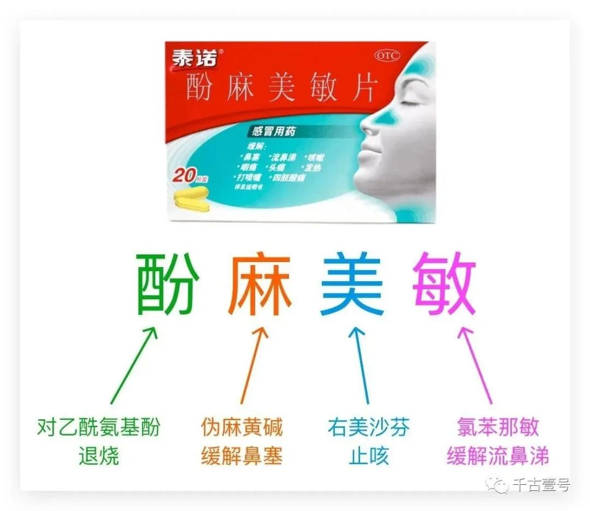

通过上面这张图可以看出，“酚麻美敏”这四个字代表了四个成份的简称。

其他复方感冒药的药品名称，起名字也是同理，将成份的简称拼在一起。如果最终组成的名字太长，就会改用另一种命名方案：直接在其中一种成份的前面加上“复方”两个字，代表那些没有在简称中体现出来的成份；比如“复方甲氧那明胶囊”中有四种成份，“甲氧那明”是一种成份，“复方”代表另外三种成份。

3、**泰诺和泰诺林，别搞混了**：

很多人分不清泰诺和泰诺林的区别，甚至有些医生都搞混了，这实在不是一件体面的事。正确答案是：

-   **泰诺**：复方制剂，全称是泰诺 酚麻美敏片；包含四种成份：对乙酰氨基酚 325 mg（退烧止痛）、右美沙芬 15 mg（止咳）、伪麻黄碱 30 mg（缓解鼻塞）、氯苯那敏 2 mg（缓解流鼻涕）。
    
-   **泰诺林**：单方制剂，全称是泰诺林 对乙酰氨基酚缓释片；只包含一种成份：对乙酰氨基酚 650mg（退烧止痛）。另外还有儿童版的泰诺林，成份相同，剂型和剂量不同。
    

泰诺和泰诺林的英文都是 Tylenol，但是中文的含义完全不同。

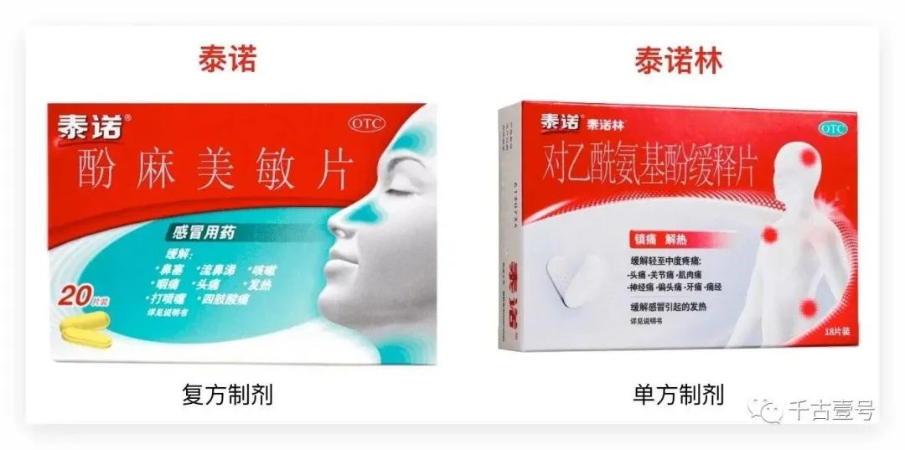

再说个题外话，“新康泰克”有四种商品，你可别搞混了，感兴趣的话可以自行查阅。

## 11 细菌感染和抗生素

### 11.1 病毒感染 VS 细菌感染，如何区分感染类型？

90%以上的感冒属于病毒性感冒，吃抗生素是没有用的。抗生素只针对细菌性感冒有效。细菌性感冒一般有这两种情况：

-   情况 1：只患了细菌性感冒。这种情况发生概率比较小。
    
-   情况 2：合并细菌感染。一开始是病毒性感冒，后来随着病情的加重，又增加了细菌性感染。情况 2 比情况 1 发生的概率高。
    

医院要怎么判断患者的感冒是病毒感染还是细菌感染呢？一般是先抽血，做**血常规**；然后根据医生的**经验**观察患者的症状和临床表现，进行综合判断。针对少数患者，可能还会额外查一下 C-反应蛋白（CRP）、降钙素原（PCT），这两个指标都需要通过血液检查看出来。

1、**血常规如何区分感染类型**：

-   **白细胞**降低或**淋巴细胞**升高，倾向于**病毒感染**。
    
-   **白细胞**升高和**中性粒细胞**升高，倾向于**细菌感染**。
    

以上是一般经验，适用于普通感冒的大多数情况，但临床上总是有例外[19]。如果碰到不能区分的情况，医生就要做其他的检查、详细询问病史、认真体格检查，综合所有的临床资料来分析。

比如，有时候还会检查血液中的**C-反应蛋白**（CRP）、**降钙素原**（PCT），如果这两个指标升高，则细菌感染的可能性非常大。这两个指标属于[感染标志物](https://mp.weixin.qq.com/s?__biz=MzIzMDg0MzQ1OQ==&mid=2247515434&idx=1&sn=a48396c0de3651519dadad0d1a6ac6c0&scene=21#wechat_redirect)，比血常规的指标更准。

此外，还会观察患者的痰液颜色进行综合判断。

以上这些都是线索，最重要的是要找出**感染源**。

2、**医院做血常规的另一个目的**：

感冒去医院看门诊时，很多时候医生给病人做血常规的首要目的不是为了判断是不是细菌感染，而是为了**筛查**。意思是，“你觉得你是感冒，万一你不是感冒，是患了其他病呢？要知道，很多病因的症状和感冒很相似。”因为医生对陌生病人此前的情况不了解，所以才会有许多严谨的流程。这既是对医生的免责，也是对病人考虑周全。

你可能会问：“为什么我去诊所或者社康看感冒，也没见医生给我抽血呢？一上来就打吊瓶。”一方面是诊所的医疗条件有限，另一方面是因为，如果诊所看不好，会有医院兜底，这在医学领域叫做“分级诊疗”。

### 11.2 感冒居家时，如何初步区分感染类型？

有些情况下，我们可能暂时不方便去医院；或者在发生医疗挤兑的极端情况下，没有医疗资源的支持。这就需要我们先根据症状，初步判断自己的感冒是病毒感染还是细菌感染，避免延误治疗。

感冒居家时，可以先初步观察自身的[症状](https://mp.weixin.qq.com/s?__biz=MzA5MjIxMzgxMg==&mid=2653351131&idx=1&sn=b4b61fe7c2d7644334ff88e08fca0c7a&scene=21#wechat_redirect)。如果有以下症状的一条或多条，则有一定概率患细菌感染：

（1）体温完全恢复正常 3 天后再次发烧。

（2）咳黄脓痰，痰量明显增多；或者黄脓痰持续 3 天以上，且量不见减少；或者，甚至痰中带血。

（3）扁桃体充血肿胀，甚至化脓。

（4）持续大量流黄脓鼻涕。

（5）颈部淋巴结至少有一个肿大，按压时较疼。

（6）感冒伴有耳朵流脓，考虑是细菌感染引起的急性中耳炎。

（7）用血氧仪监测血氧饱和度：

-   血氧在 95%~100%之间：正常。
    
-   血氧在 91%~94%之间：令人担忧，有点缺氧，肺部可能有异常，建议就医。必要时做肺部 CT 或者胸片检查。
    
-   血氧为 90%甚至更低：非常令人担忧，极度缺氧，建议立即就医，做详细检查。
    

当然，以上并不能作为细菌感染的[严格证据](https://mp.weixin.qq.com/s?__biz=Mzg5NjcwNDEwOQ==&mid=2247485125&idx=1&sn=041ab088fc59380a792fe37d466e6914&scene=21#wechat_redirect)，但需要引起警惕并怀疑是细菌感染。

居家防疫时，血氧仪也可以准备一下：

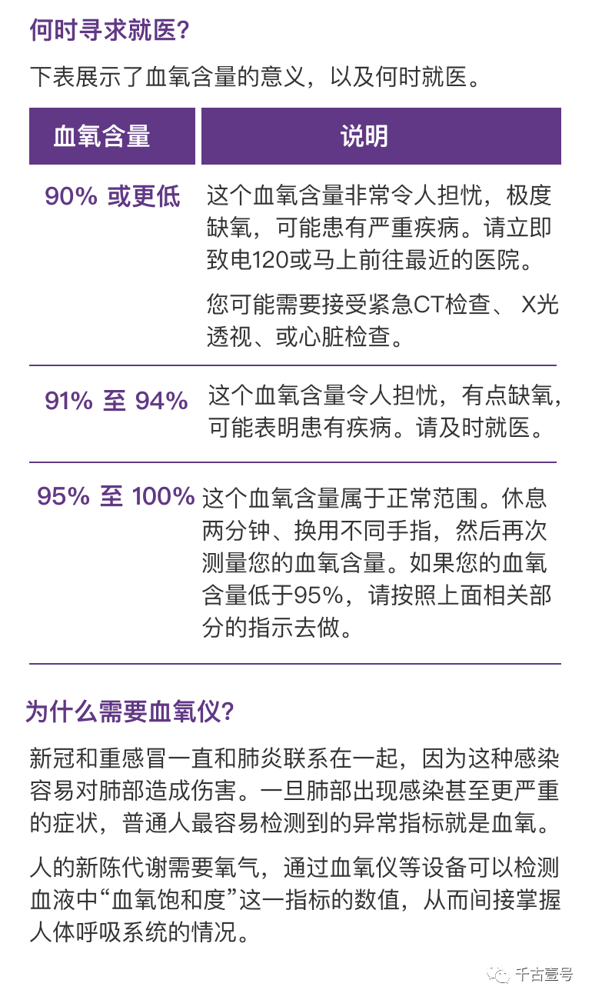

### 11.3 细菌性感冒常用的抗生素举例

大多数抗生素都是处方药，使用起来比较复杂，注意事项也很多。

如果有任何一个医学博主准确地跟你说“感冒如果遇到 XX 症状，就吃 XX 这个抗生素”的话，请一定不要信。因为抗生素的使用方法比较复杂、选择范围很多、利弊明显。当你逐渐深入地去了解时会发现，抗生素的使用真的是一门“平衡利弊得失”的艺术。

说到利弊，不得不提到抗生素的滥用容易导致细菌产生**耐药性**，还有对身体的**肾毒性**。抗生素的耐药性问题正日趋严重，值得引起大家关注。

说到使用的[复杂性](https://mp.weixin.qq.com/s?__biz=MzIzMDg0MzQ1OQ==&mid=2247515146&idx=1&sn=2c54d7fbc4f8ddf0d24171c8982da80a&scene=21#wechat_redirect)，至少包括：抗生素的[抗菌谱](https://mp.weixin.qq.com/s?__biz=MzAwNDQwODY5Mw==&mid=2664986256&idx=2&sn=0bfa2bdb68af5138f1bd61d66edb6b6b&scene=21#wechat_redirect)；抗生素的广谱和窄谱之分；光是头孢，就有[五代](https://mp.weixin.qq.com/s?__biz=MzA5MjIxMzgxMg==&mid=2653372623&idx=2&sn=b6b0b2529727fd9e3c6efc2342e256ed&scene=21#wechat_redirect)，代代有不同；针对严重感染患者的**降阶梯治疗**；抗生素的联用注意事项等。

本文无法准确告诉你应该使用哪一种抗生素。以我目前获取的知识和经验，我可以告诉你的是，感冒常用的几种抗生素有哪些。

**细菌性感冒常用的抗生素举例**：

（1）青霉素类：**阿莫西林**（推荐商品“阿莫仙”）、阿莫西林克拉维酸钾（推荐商品“君尔清”）。抗菌谱很广。注意，**青霉素过敏患者禁用阿莫西林**。怎么判断是否过敏呢？需要做皮试（尤其是在输液前）。

（2）头孢菌素类：**头孢克洛**（属于第二代头孢，推荐商品“希刻劳”）、头孢地尼（属于第三代头孢）。抗菌谱很广。一代头孢抗菌谱偏革兰阳性菌，三代头孢抗菌谱偏革兰阴性菌，且一代头孢的肾毒性更大。二代头孢[兼顾阴阳菌](https://mp.weixin.qq.com/s?__biz=MzA5MDAxMjY4MQ==&mid=2649533172&idx=1&sn=8a66ee0a774062d4de891abb8d1f1afa&scene=21#wechat_redirect)，更适合细菌性感冒患者。

青霉素与头抱类的药物之间有 10%的交叉过敏性[20]，所以不建议互相替换，除非是曾经有使用史或者替换史；如果非要互相替换，则建议先做皮试。

（3）喹诺酮类：**左氧氟沙星**（推荐商品“可乐必妥”）、莫西沙星。抗菌谱也很广，对青霉素过敏、对头孢菌素无效的患者，是个不错的方案。注意，**未成年人（18 岁以下）禁用喹诺酮类抗生素，避免影响骨骼发育**。

（4）大环内酯类：**阿奇霉素**（推荐商品“希舒美”）。抗菌谱偏革兰阳性菌和非典型菌，但是对革兰阴性菌一般无效。阿奇霉素的优点是：半衰期长，用药频次少；使用前无需皮试；没有喹诺酮类药物如此严格的年龄限制；对**支原体、衣原体**等非典型菌有显著效果。因此在临床应用很广泛。

以上内容不能作为自行使用的依据。感冒**一旦明确诊断为细菌感染，就应该遵医嘱、规范使用抗菌药物**。

### 11.4 吃药 VS 输液，哪个更好呢？

感冒时，吃药或者输液，哪个更好呢？先说结论：**非必要不输液**。输液应该放在给药方案的最后一位。

我记得我小时候感冒发烧，经常输液。现在回想起来，感觉挺傻的。因为完全没必要。

从一般的经验来看，输液比吃药好得更快，这是比较明显的优势。口服药物是先进入肠胃吸收，然后进入肝肾解毒，再进入血液到达感染部位；输液是直接进入血液到达感染部位。

但是输液的风险和副作用比吃药大很多。对于绝大多数感冒患者来说，吃药足以达到治疗目标；有时会做雾化，但也到不了输液的程度。你可能会说：“我就是那少部分人呀，我就是要输液”，如果真是这样，你可能已经达到了住院的标准。

感冒输液时，乡村医生最喜欢用的“四件套”是：**抗生素、激素**、抗病毒、感冒药，根据患者具体情况调整剂量；持续 3~5 天。还有些医生喜欢用“三素一糖”：抗生素、激素、维生素、葡萄糖。典型的[经验治疗](https://mp.weixin.qq.com/s?__biz=MTg0MzMwODA0MQ==&mid=2653495883&idx=1&sn=5b7bcbd4bc3895e76878dffa17483bfa&scene=21#wechat_redirect)是这样的：抗生素主要是**头孢类或者青霉素类**抗生素；激素主要是小剂量**地塞米松**，5mg 每天；另外使用一些有抗病毒效果的中成药；如果是高烧患者则会额外加布洛芬或者对乙酰氨基酚等退烧药。如果想见效更快呢？秘诀就把抗生素和地塞米松[加大药量](https://mp.weixin.qq.com/s?__biz=MzI0NDA5MDYyNA==&mid=2648257075&idx=1&sn=d8e2165bfb86d84b7b976c3e222985de&scene=21#wechat_redirect)。有些医生甚至会预防性地使用抗生素。

可是，这些抗生素和激素，跟本文在前面讲到的感冒药，并没有太大交集。因为这些抗生素和激素的副作用是比较大的，一般情况下不建议使用。我们可以下面这些信息中侧面印证。

> 2022 年 12 月，各个地区陆续出台了《关于加强村卫生室用药管理的紧急通知》，**要求各地村卫生室规范用药，不要滥用抗生素、激素、维生素等药物，非必要不输液**。
> 
> 输液、盲目使用抗生素、激素退热都是不可取的。必须严格遵守“能口服不肌注、能肌注不输液的原则”。
> 
> 针对感冒的治疗，在没有并发症和严重感染的情况下，主要以口服药物以及对症治疗和休息为主要手段。**输液这种给药方式之所以被世卫组织放在给药方式的最后一位**，就是因为输液本身就暗藏着较大的风险。

很多患者会说一瓶吊瓶下去烧很快就退了，身体感觉舒服多了，与其在家烧三天难受还不如打两天点滴好得快，这疗效确实好的很，但你知道为何会好得快吗？这是**糖皮质激素**（比如地塞米松）发挥的“功劳”，它是一种强力免疫抑制剂，从根本上抑制身体抵御病毒感染的炎症反应，因而一针下去[立竿见影](https://mp.weixin.qq.com/s?__biz=MzI2NTMzMjQxMQ==&mid=2247499185&idx=1&sn=26757210ea72ec948ae96e98ffc6fc97&scene=21#wechat_redirect)，但是长期使用副作用很大，2003 年的“非典”，由于大量使用地塞米松治疗导致很多人产生了股骨头坏死甚至落下严重残疾。

对比一下两种药的退烧和抗炎效果：布洛芬属于非甾体抗炎药（NSAIDs），相对安全；地塞米松属于甾体类抗炎药，抗炎作用很强，但副作用相对较大，临床常用于[重症患者](https://mp.weixin.qq.com/s?__biz=MjM5NDA1ODEzOA==&mid=2650370483&idx=1&sn=eab9e87c39340f0611ed840834bdc2bc&scene=21#wechat_redirect)，普通的感冒发烧没有必要使用。

此外，抗生素针对病毒感染没有任何作用，而且抗生素的滥用容易让病菌产生耐药性。

所以，我的建议是：感冒时，非必要不输液。

## 12 感冒药推荐清单

针对本文在前面详细讲到的病毒性感冒药，在此列出清单如下，方便你在自行购药时快速浏览。

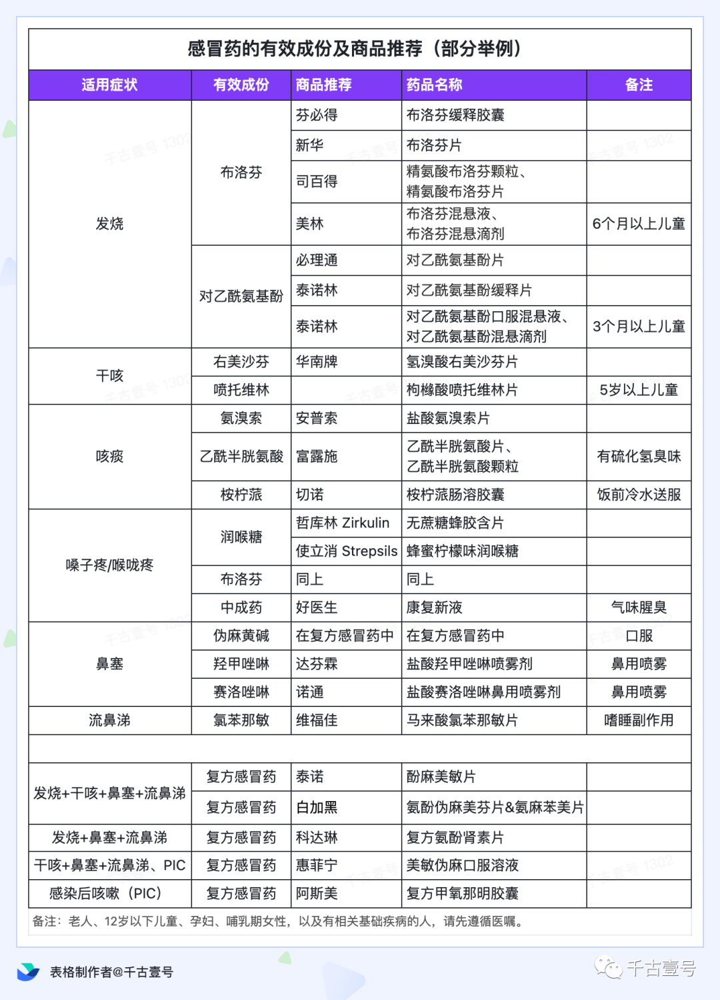

## 13 结尾

我没有医学背景，也不认识医生朋友，本文的参考资料，绝大部分都来自互联网，以及我的生活经验。我查阅了无数的呼吸内科相关知识，将这些信息做交叉验证，并结合我自己的生活经验和观察，然后进行系统性思考，最终写下本文。

我知道很多医学博主在写科普文章时会参考 UpToDate 网站的医学知识库。这个网站很权威，但是费用太贵了，我还买不起。

有的医学博主说，某某药不能用。那是因为他怕你不知道注意事项导致滥用甚至误用，他的科普对象需要考虑到所有层次的人，所以作者会不断做自我审查，避免承担无端的风险。这样就会导致：写出来的内容虽然严谨，可难免束手束脚，千篇一律。这也就不难解释，有些医生对阿斯美爱不释手，屡试不爽；还有些对阿斯美嗤之以鼻，慎之又慎。可我想对读者说的是：如果你对医学常识足够了解，你是能够掌握一些分寸的，不要盲目听“网上说的”。

对于许多科普文章（包括本文）：有一个原则要牢记：如果他只讲好处不说坏处，只讲结论不分析原因，只说这个方案不行但就是不说什么方案可行，那就不值得听。

另外，为了不让文章犯基本的常识性错误，我还买了一本医学专业的教材《内科学（第九版）》书进行学习。这本书是医学专业的官方教材，出版社是人民卫生出版社，非常权威；而且非常厚实，总共有 将近1000页，前面的150页讲的是讲呼吸内科知识。你如果有兴趣，也可以买来研读。

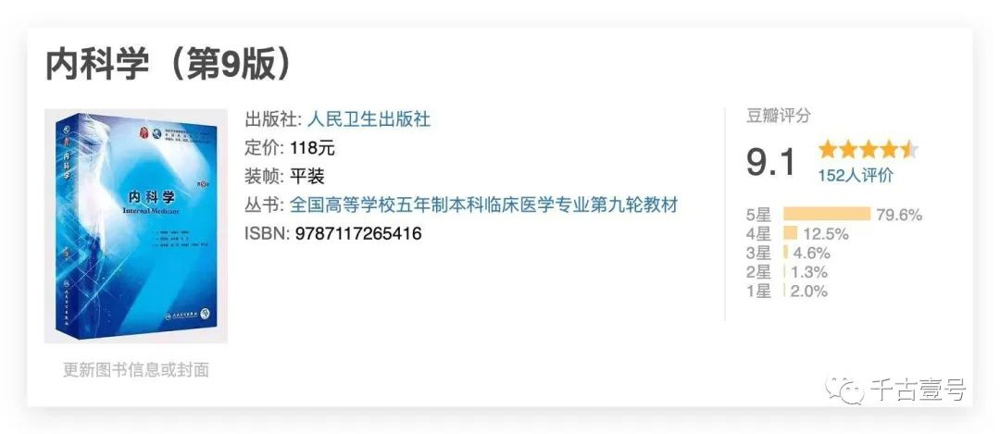

我举这些例子是想告诉大家，只要你有钻研精神、利用好开放的互联网、观察生活细节，就能用知识和经验武装自己，改善自己的生活。做这些事并不需要花太多成本，不需要你有多专业的学术能力。虽说术业有专攻，可在有些情况下，我们也要学会自救。

本文在努力编写一个较为完备的科普知识体系，可仍然只涉及了呼吸内科中很小的一个领域，而且尚未覆盖到老人、小孩、孕妇、哺乳期等特殊人群。用保险行业的专业术语说，本文的受众群体是“标准体”，而每个人的具体情况、个体差异比标准体要复杂很多。如果再加上抗生素、基础疾病等维度，会发现呼吸内科是一门很深的学问。

本文作为医学科普文章的一条线索，希望能抛砖引玉，引发各位读者关注身心健康，并持续学习、思考和探索医学常识。

## 14 想看我写的更多内容？

有不少读者可能对我说：“你每年才写这么几篇文章，根本不够看呐。能不能更新勤快一点？”

其实，**我在过去的一年多里写了400篇短文**，但不是在公众号里写的，而是在「小报童」里写的。公众号里我主要写万字长文，且更新频率很低。小报童是我写作的主战场，我在这里以千字短文的形式频繁更新。

**如果你想看我写的更多内容**，如果你真心支持我，不妨扫码订阅我的小报童专栏，订阅后还可以获得与我深度交流的机会：

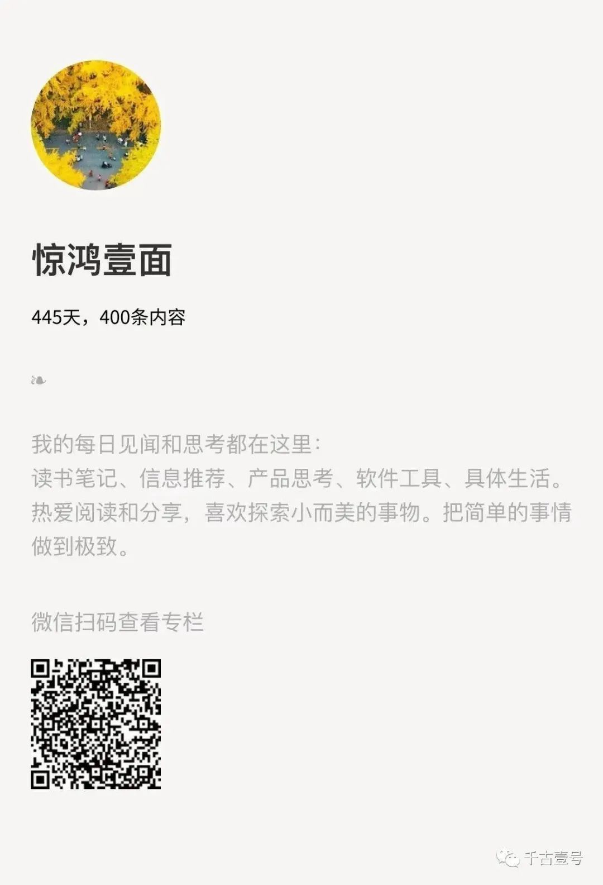

如果扫码失败，可以在微信浏览器输入 https://xiaobot.net/p/qianguyihao 打开。

我的每日见闻和思考都会写在小报童里，且毫无保留，内容类型包括：信息推荐、读书笔记、产品思考、软件工具、具体生活等各个方面。

我想写的内容是能对我们的生活、学习、工作产生实实在在帮助的内容。写作不是写文章，而是影响现实世界。

### 参考资料

\[1\]

具体历史: _https://weibo.com/1424528383/MjwBTkxBZ_

\[2\]

相互作用: _http://fdjpkc.fudan.edu.cn/d201236/2012/0208/c12185a22726/page.htm_

\[3\]

流行开来: _http://yao.dxy.cn/article/107173_

\[4\]

复方西药: _https://weibo.com/1259952773/Mk2dXEEEd_

\[5\]

中成药: _https://weibo.com/1259952773/J29pEieyG_

\[6\]

跨国原研制药集团: _http://www.a-hospital.com/w/%E7%AC%AC%E4%B8%80%E5%88%B6%E8%8D%AF%E4%B8%89%E5%85%B1%E6%A0%AA%E5%BC%8F%E4%BC%9A%E7%A4%BE_

\[7\]

右美沙芬的历史: _https://zhuanlan.zhihu.com/p/99769874_

\[8\]

2021 年 12 月: _https://www.nmpa.gov.cn/directory/web/nmpa/yaopin/ypggtg/20211227162159192.html_

\[9\]

2022 年 12 月 1 日: _https://www.nmpa.gov.cn/xxgk/ggtg/qtggtg/20221130200847133.html_

\[10\]

特点: _https://weibo.com/1782073923/Mp0kRlrVt_

\[11\]

原因: _https://weibo.com/1424528383/MpBdYEh05_

\[12\]

合用: _https://mp.weixin.qq.com/s/rWtFJXjn3nZPOi1fjBgh4A_

\[13\]

疗间质性肺炎: _https://m.haodf.com/neirong/wenzhang/6353616399.html_

\[14\]

难吃: _https://m.weibo.cn/5546573911/4850568710062965_

\[15\]

西红柿拌糖: _https://m.weibo.cn/status/4845452970691572_

\[16\]

康复新液: _https://mp.weixin.qq.com/s/fAq-eP6scPIpUdev\_s1ZOw_

\[17\]

持续时间: _https://www.zhihu.com/question/54477681_

\[18\]

销售: _https://www.sohu.com/a/271688787\_100183764_

\[19\]

例外: _https://m.haodf.com/neirong/wenzhang/7767226195.html_

\[20\]

交叉过敏性: _https://weibo.com/ttarticle/x/m/show#/id=2309404629276711584191_
