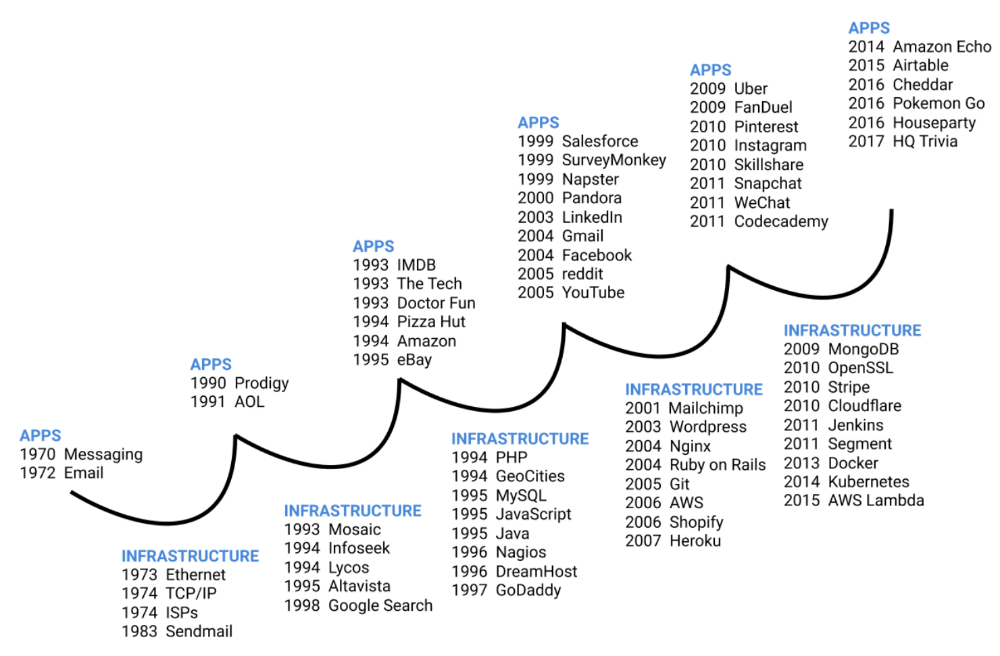
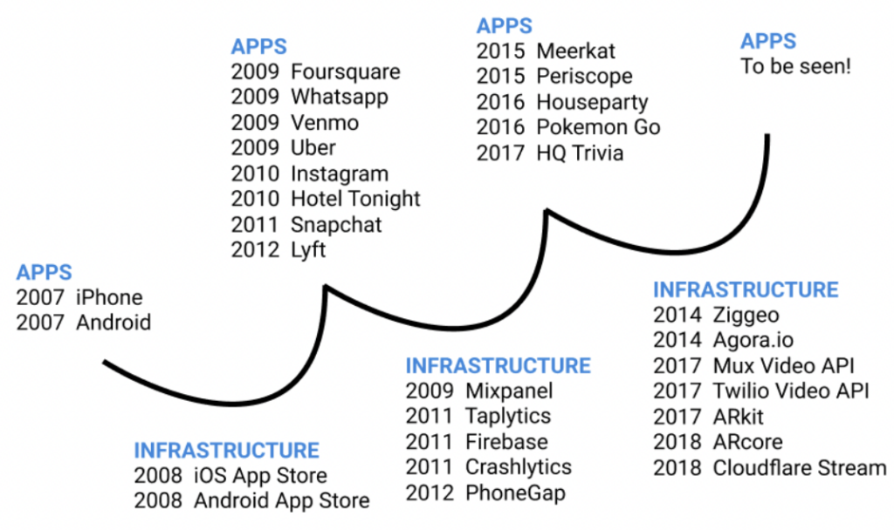
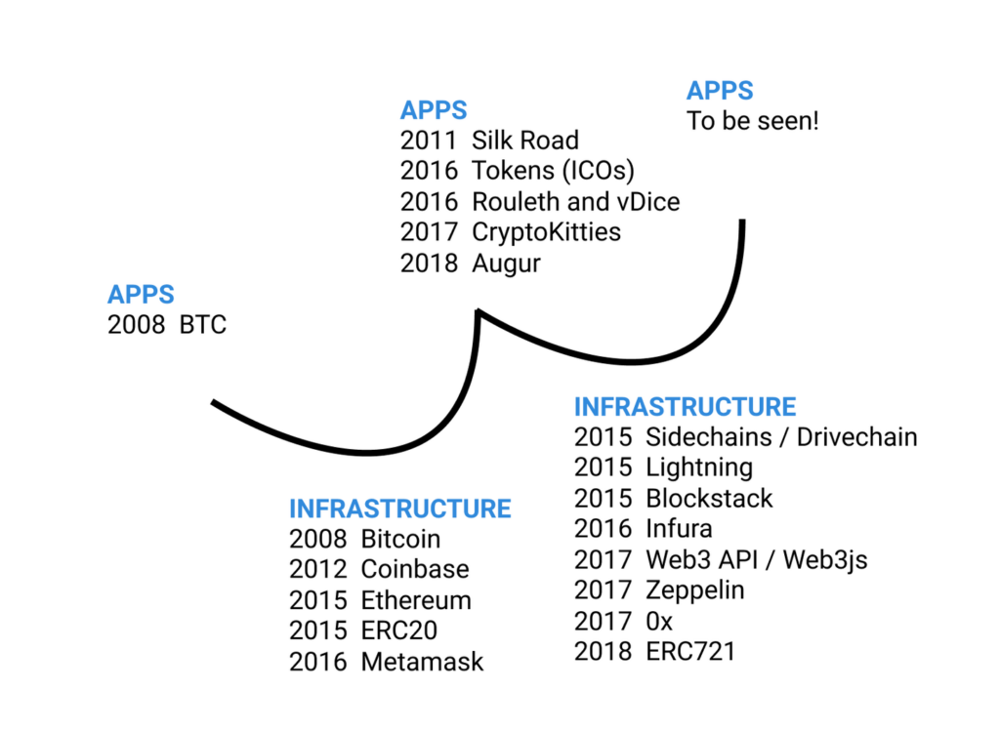

A common narrative in the _Web 3.0_ community is that we are in an infrastructure phase and the right thing to be working on right now is building out that infrastructure: better base chains, better interchain interoperability, better clients, wallets and browsers.  

_Web 3.0_社区中的一个常见说法是，我们正处于基础设施阶段，现在要做的正确事情是构建基础设施：更好的基础链、更好的链间互操作性、更好的客户端、钱包和浏览器。  

The rationale is: first we need tools that make it easy to build and use apps that run on blockchains, and once we have those tools, then we can get started building those apps.  

理由是：首先，我们需要一些工具，让构建和使用在区块链上运行的应用变得容易，一旦我们有了这些工具，我们就可以开始构建这些应用。

But when we talk to founders who are building infrastructure, we keep hearing that the biggest challenge for them is to get developers to build apps on top. Now if we are really in an infrastructure phase, why would that be?  

但当我们与正在构建基础设施的创始人交谈时，我们不断听到他们面临的最大挑战是让开发人员在上面构建应用程序。如果我们真的处于基础设施建设阶段，为什么会这样呢？

Our hypothesis is that this is not actually how things play out. We are not in an infrastructure phase, but rather in another turn of the _apps-infrastructure cycle_. And in fact, the history of new technologies shows that apps beget infrastructure, not the other way around. It’s not that first we build all the infrastructure, and once we have the infrastructure we need, we begin to build apps. It’s exactly the opposite.  

我们的假设是，事情实际上并不是这样发展的。我们现在不是在基础设施阶段，而是在应用程序-基础设施周期的另一个转折点。事实上，新技术的历史表明，应用程序产生基础设施，而不是相反。我们并不是首先构建所有的基础设施，一旦我们有了所需的基础设施，我们开始构建应用程序。事实恰恰相反。

A big part of why this is even a topic of conversation is that everyone now knows that “platforms” are often the largest value opportunities (true for Facebook, Amazon/AWS, Twilio, etc.) — so there is naturally a rush to build a major platform that captures value.  

这之所以成为一个话题，很大程度上是因为现在每个人都知道，“平台”往往是最大的价值机会（Facebook、亚马逊/AWS、Twilio等都是如此）。- 因此，人们自然会急于建立一个能够捕捉价值的大型平台。  

 This may be even more true in the distributed web where value often — but not always — accrues in the [protocol layer](https://www.usv.com/blog/fat-protocols) rather than the applications that sit on top.  

这在分布式网络中可能更是如此，在分布式网络中，价值通常（但不总是）在协议层而不是在位于顶层的应用程序中积累。

But, as we will see: platforms evolve from an iterative cycle of apps=>infrastructure=>apps=>infrastructure and are rarely built in an outside vacuum.  

但是，正如我们将要看到的：平台是从应用程序=〉基础架构=〉应用程序=〉基础架构的迭代循环中发展而来的，很少是在外部真空中构建的。

**First, apps inspire infrastructure. Then that infrastructure enables new apps.  

首先，应用程序激发了基础设施。然后，该基础架构支持新的应用程序。**

What we see in the sequence of events of major platform shifts is that first there is a breakout app, and then that breakout app inspires a phase where we build infrastructure that makes it easier to build similar apps, and infrastructure that allows the broad consumer adoption of those apps.  

我们在平台重大转变的事件序列中看到的是，首先出现了一个突破性的应用程序，然后这个突破性的应用程序激发了一个阶段，在这个阶段，我们构建基础设施，使构建类似的应用程序变得更容易，并让消费者广泛采用这些应用程序。  

Kind of like this:  

就像这样：

Apps and infrastructure evolve in responsive cycles, not distinct, separate phases.  

应用程序和基础架构在响应周期中发展，而不是在不同的阶段中发展。

For example, light bulbs (the app) were invented before there was an electric grid (the infrastructure). You don’t need the electric grid to have light bulbs.  

例如，灯泡（应用程序）是在电网（基础设施）出现之前发明的。你不需要电网来装灯泡。  

But to have the broad consumer adoption of light bulbs, you do need the electric grid, so the breakout app that is the light bulb came first in 1879, and then was followed by the electric grid starting 1882. (The USV team book club is now reading [The Last Days Of Night](https://www.amazon.com/Last-Days-Night-Novel/dp/0812988922) about the invention of the light bulb).  

但是要让消费者广泛接受灯泡，你确实需要电网，所以灯泡这个突破性的应用程序在1879年出现，然后从1882年开始出现电网。(The USV团队读书俱乐部现在正在阅读关于灯泡发明的《夜的最后几天》）。

Another example: Planes (the app) were invented before there were airports (the infrastructure). You don’t need airports to have planes.  

另一个例子：飞机（应用程序）是在机场（基础设施）出现之前发明的。你不需要机场来拥有飞机。  

But to have the broad consumer adoption of planes, you do need airports, so the breakout app that is an airplane came first in 1903, and inspired a phase where people built airlines in 1919, airports in 1928 and air traffic control in 1930 only after there were planes.  

但要让广大消费者接受飞机，你确实需要机场，所以突破性的飞机应用程序在1903年出现，并激发了一个阶段，人们在1919年建造航空公司，1928年建造机场，1930年建立空中交通管制，直到有了飞机。

Sometimes all the infrastructure you need is a beach and some spare parts.  

有时你所需要的基础设施只是一个海滩和一些备件。

The same pattern follows with the internet.  

互联网也是如此。  

We start with the first apps: messaging (1970) and email (1972), which then inspire infrastructure that makes it easier to have broad consumer adoption of messaging and email: Ethernet (1973), TCP/IP (1973), and Internet Service Providers (1974).  

我们从第一个应用程序开始：消息传递（1970）和电子邮件（1972），它们激发了基础架构，使消费者更容易广泛地采用消息传递和电子邮件：以太网（1973）、TCP/IP（1973）和互联网服务提供商（1974）。  

Then there is the next wave of apps, which are web portals (Prodigy in 1990, AOL in 1991), and web portals inspire us to build infrastructure (search engines and web browsers in the early 1990’s). Then there is the next wave of apps, which are early sites like Amazon.  

然后是下一波应用程序，即门户网站（1990年的Prodigy，1991年的AOL），门户网站激励我们建立基础设施（20世纪90年代初的搜索引擎和Web浏览器）。然后是下一波应用程序，这是早期的网站，如亚马逊。  

com in 1994, which leads to a phase where we build infrastructure like programming languages (PHP in 1994, Javascript and Java in 1995) that make it easier to build websites.  

com，这导致了一个阶段，我们建立基础设施，如编程语言（PHP在1994年，Javascript和Java在1995年），使建立网站更容易。  

Then there is the next wave of more complicated apps like Napster (1999), Pandora (2000), Gmail (2004) and Facebook (2004) which leads to infrastructure that makes it easier to build more complex apps (NGINX and Ruby on Rails in 2004, AWS in 2006). And the cycle continues.  

然后是下一波更复杂的应用程序，如Napster（1999年）、Pandora（2000年）、Gmail（2004年）和Facebook（2004年），这导致了更容易构建更复杂应用程序的基础设施（2004年的NGINX和Ruby on Rails，2006年的AWS）。如此循环往复。#0 #1 #

We also see this pattern with our most recent iteration of mobile apps: first we had a suite of popular mobile apps that relied heavily on streaming video: Snapchat (2011), Periscope (2014), Meerkat (2015), and Instagram Stories (2016).  

我们在最新的移动应用程序迭代中也看到了这种模式：首先，我们有一套非常依赖流媒体视频的流行移动应用程序：《快聊》（2011）、《潜望镜》（2014）、《猫鼬》（2015）和《Instagram的故事》（2016）。  

And now, we are seeing companies building infrastructure that makes it easy for mobile apps to add video: Ziggeo (2014), Agora.io (2014), Mux (2017), Twilio Video API (2017), Cloudflare Stream (2018).  

现在，我们看到一些公司正在建设基础设施，使移动的应用程序更容易添加视频：Ziggeo（2014年）、Agora.io（2014年）、多路复用器（2017年）、Twilio视频API（2017年）、云闪流（2018年）。

This cycle also correctly explains the sequence of events in _Web 3.0_. We start with the first breakout app: BTC (2008), on top of the Bitcoin network (as the first infrastructure), followed closely by Silk Road (2011) as the most infamous early crypto app.  

这个循环也正确地解释了_Web 3.0_中的事件序列。我们从第一个突破性应用程序开始：BTC（2008年），在比特币网络之上（作为第一个基础设施），紧随其后的是丝绸之路（2011年），作为最臭名昭著的早期加密应用程序。  

This inspires new infrastructure like Sidechains and Drivechain (2015), Ethereum Smart Contracts and ERC20 (2015), Lightning (2015) that make it easy to build new apps, and infrastructure like Coinbase (2012) and Metamask (2016) that enable consumer adoption of these new apps.  

这激发了新的基础设施，如侧链和驱动链（2015年）、以太坊智能合约和ERC20（2015年）、闪电（2015年），这些基础设施使构建新应用变得容易，而Coinbase（2012年）和Metamask（2016年）等基础设施使消费者能够采用这些新应用。  

This new infrastructure then enables the next wave of apps: tokens/ICOs (2017) and early dapps (Rouleth and vDice in 2016, CryptoKitties in 2017), which inspire new infrastructure: Infura (2016) and _Web3_js and Zeppelin (2017). We’re now waiting for the next big apps that will help guide the next wave of infrastructure.  

然后，此新基础架构将支持下一波应用程序：token/ICO（2017年）和早期的dapp（2016年的Rouleth和vDice，2017年的CryptoKitties），它们激发了新的基础设施：Infura（2016）以及_Web3_js和齐柏林飞艇（2017）。我们现在正在等待下一个大的应用程序，这将有助于指导下一波的基础设施。#0 #1 #

**The Adjacent Possible  

相邻的可能性**

The common theme in the development of each major platform (electricity, cars, planes, the web, mobile, etc.) is that we build what we can given the tools available to us at the moment.  In [Where Do Good Ideas Come From](https://www.amazon.com/Where-Good-Ideas-Come-Innovation/dp/1594485380), Steven Johnson refers to this as _The Adjacent Possible._  In other words, you can open the door to the next room, but you can’t really skip steps and open the back door from the front porch.  It is hard to successfully build infrastructure that is too far ahead of the apps market.  

每个主要平台（电力、汽车、飞机、网络、移动等）开发的共同主题就是我们利用目前可用的工具来建造我们所能建造的东西。 在《好主意从何而来》一书中，史蒂文·约翰逊将其称为"相邻可能性"。换句话说，你可以打开隔壁房间的门，但你不能真的跳过几步，从前廊打开后门。 很难成功地构建远远领先于应用市场的基础设施。

Each time the apps => infrastructure cycle repeats, new apps are made possible because of the infrastructure that was built in the cycles before.  

每当apps =〉基础设施循环重复时，新的应用程序就会因为之前循环中构建的基础设施而成为可能。  

For example, YouTube could be built in 2005 but not in 1995 because YouTube only makes sense after the deployment of infrastructure like broadband in the early 2000’s, which happened in the infrastructure phase following the first hit dot com sites like eBay, Amazon, AskJeeves and my favorite, Neopets.  

例如，YouTube可以建在2005年，但不能建在1995年，因为YouTube只有在21世纪初宽带等基础设施部署之后才有意义，这发生在eBay、Amazon、AskJeeves和我最喜欢的Neopets等第一批热门网站之后的基础设施阶段。

Chris Dixon and Fred Wilson talk about this concept in a [recent episode of the a16z podcast](https://a16z.com/2018/09/23/tech-trends-disruption-innovation-internet-crypto/). Chris has a board game from the dot com era called Dot Bomb that makes fun of the silly dot coms of the late 1990’s. And what he points out is that all the ‘silly’ ideas of the dot com era are now the billion dollar unicorns.  

克里斯·狄克逊和弗雷德·威尔逊在最近一期的a16 z播客中谈到了这个概念。克里斯有一个来自网络时代的棋盘游戏，叫做“点炸弹”，它取笑90年代末愚蠢的网络游戏。他指出，网络时代所有“愚蠢”的想法现在都是价值数十亿美元的独角兽。  

What is now possible several app => infrastructure cycles into the internet made no sense just one or two apps => infrastructure cycles in.  

现在可能的是，几个应用程序=〉基础设施周期进入互联网没有意义，只有一两个应用程序=〉基础设施周期进入。

That is the crux of what we mean by the myth of the infrastructure phase — if we think about an “infrastructure phase” divorced from the apps that will use it, we run the risk of building too far ahead, in a speculative vacuum.  

这就是我们所说的基础设施阶段神话的关键所在--如果我们认为“基础设施阶段”与使用它的应用程序脱节，我们就有可能在投机真空中建设得太远。  

 We need the cycle of apps=>infrastructure=>apps=>infrastructure to keep us honest.  

我们需要应用程序=〉基础设施=〉应用程序=〉基础设施的循环来保持我们的诚实。

As there are more and more cycles in each new platform it gets cheaper to build and use those apps. Building usv.com in 1995 would have cost us many orders of magnitude more than it would cost to build today, and creating _Web 3.0_ apps costs more in cash, effort and time today than it will 15 years from now.  

随着每个新平台的周期越来越多，构建和使用这些应用程序的成本越来越低。如果usv.com在1995年建立www.example.com，我们的成本将比今天高出许多个数量级，而今天创建_Web3_.0应用程序所花费的现金、精力和时间也比15年后要多。

**Development Frameworks Versus Investing Frameworks  

发展框架与投资框架**

Putting our investor hats on for a second, it’s important to distinguish between technological frameworks that explain when something can be built, and investment frameworks that explain when something can be a good investment.  

先把我们的投资者帽子戴上，重要的是要区分技术框架和投资框架，技术框架解释什么时候可以建立一些东西，投资框架解释什么时候可以是一个好的投资。

The apps=>infrastructure=>apps=>infrastructure cycle explains when apps or infrastructure can be built, but doesn’t necessarily explain when to invest in apps versus when when to invest in infrastructure.  

应用程序=〉基础设施=〉应用程序=〉基础设施周期解释了何时可以构建应用程序或基础设施，但不一定解释了何时投资于应用程序和何时投资于基础设施。

Take light bulbs for example. Yes, they were invented before the grid, but looking at it from an investor perspective, no one sold a lot of lightbulbs until the grid was in place.  

以灯泡为例。是的，它们是在电网出现之前发明的，但从投资者的角度来看，在电网出现之前，没有人卖出很多灯泡。

**Wrapping Up  

收尾**

One question we had is: why is it that apps come first in the cycle, and not infrastructure first? One reason is that it doesn’t make sense to create infrastructure until there are apps asking you to solve their infrastructure problems.  

我们的一个问题是：为什么在这个周期中应用程序排在第一位，而不是基础设施排在第一位？一个原因是，在应用程序要求您解决其基础架构问题之前，创建基础架构是没有意义的。  

How do you know that the infrastructure you are building solves a real problem until you have app teams that you are solving for?  

在您拥有要为其解决问题的应用程序团队之前，您如何知道您正在构建的基础架构能够解决真实的问题？  

It will be a challenge to build crypto infrastructure now until there is a breakout crypto app that other developers want to emulate and need better dev tools and infrastructure to do so.  

现在构建加密基础设施将是一个挑战，直到有一个突破性的加密应用程序，其他开发人员希望模仿，并需要更好的开发工具和基础设施来做到这一点。

There is a narrative in the crypto space that first we need to build great tools, and once we have the tools, then we can build apps.  

在加密领域有一种说法，首先我们需要建立伟大的工具，一旦我们有了工具，然后我们就可以建立应用程序。  

But what we hope to have shown is that in other platform shifts, we are able to build the first few apps before there are great tools (though it is more cash and time intensive), and then those early apps inspire us to build tools.  And the cycle repeats.  

但我们希望展示的是，在其他平台的转变中，我们能够在伟大的工具出现之前开发最初的几个应用程序（尽管这需要更多的资金和时间），然后这些早期的应用程序激励我们开发工具。 如此循环往复。

Happy building.  

快乐的建筑。

_**Update (10/5/18):**_  _This post has gotten a lot of attention, has generated some great discussion, and has produced some useful feedback._   

更新（10/5/18）：这篇文章得到了很多关注，引发了一些很好的讨论，并产生了一些有用的反馈。

_First: duly noted that we spent most of our time here looking backwards at historical precedent, and thus that our diagram on the decentralized web / web3 / crypto was a) admittedly thin, and b) really just focused on the ETH ecosystem.  

第一：我们在这里花了大部分时间回顾历史先例，因此我们关于去中心化的web/web3/crypto的图表a）公认很薄，b）实际上只关注ETH生态系统。  

  We have updated that diagram to be a little more clear, and to include important concepts from the BTC ecosystem.  Thanks to [Dennis Porteaux](https://twitter.com/DennisPortoMD/) for the [excellent analysis on this](https://twitter.com/DennisPortoMD/status/1047143498108014592).  

我们已经更新了该图，使其更加清晰，并包含了BTC生态系统中的重要概念。 感谢Dennis Porteaux对此的出色分析。_

_Second: our favorite piece of feedback is that crytpo networks, in fact, really blur the line between apps an infrastructure, due their open and interopable nature. That is one of our favorite aspects of them.  

第二：我们最喜欢的反馈是，由于crytpo网络的开放性和互操作性，它实际上模糊了应用程序和基础设施之间的界限。这是我们最喜欢的方面之一。  

  So, for instance, an “app” (like CryptoKitties, or any smart contract, or Bitcoin itself) can be infrastructure if someone builds on it.  Of course, there are components of these networks that are \*\*only\*\* infrastructure (Lightning, Zeppelin, etc), but the line is blurred.  

例如，一个“应用程序”（如CryptoKitties、任何智能合约或比特币本身）如果建立在它的基础上，就可以成为基础设施。当然，这些网络的某些组件 \*\* 只是 \*\* 基础设施（如闪电、齐柏林飞艇等），但界限是模糊的。  

  Whereas in the past a platform (like Amazon or Facebook) had to make a conscious decision to open up APIs and become a platform, crypto apps are generally open and interoperable from day 1.  This only makes the apps=>infrastructure=>apps_\=>_infrastructure cycle tighter.  Thanks to [Denis Nazarov](https://twitter.com/Iiterature/status/1047163184833069061) and [Jutta Steiner](https://twitter.com/jutta_steiner) for really articulating this.  

在过去，平台（如亚马逊或Facebook）必须有意识地决定开放API并成为一个平台，而加密应用程序通常从第一天起就是开放和互操作的。 这只会让应用程序=〉基础设施=〉应用程序=〉基础设施周期变得更紧。 感谢丹尼斯·纳扎罗夫和尤塔·施泰纳真正阐明了这一点。_
