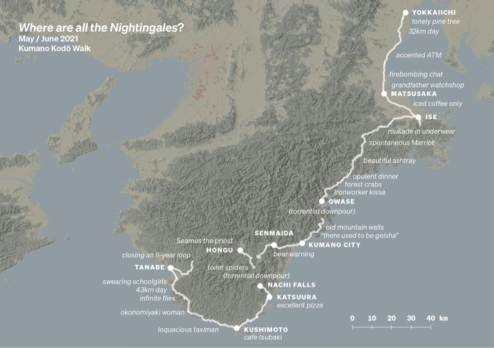

M  

米ost writers have a system in place to drive the work they do. My own system, for example, is mad and unpredictable, and it’s based on a mysterious alchemy of guilt, panic, dumb luck, and caffeine-induced tweaking.  

大多数作家都有一个系统来推动他们所做的工作。例如，我自己的系统是疯狂的和不可预测的，它基于一种神秘的内疚、恐慌、运气不好和咖啡因引起的调整的炼金术。

[Craig Mod](http://www.twitter.com/craigmod), on the other hand, has a fascinating (and slightly less neurotic) method for driving his work as a writer: walking.  

另一方面，克雷格·莫德 (Craig Mod) 作为一名作家，有一种迷人的（而且稍微不那么神经质）的方法来推动他的工作：步行。

[Craig](https://every.to/c/interviews) thinks of a walk as an operating system that he can use to support, feed, and inspire all the basic functions of his writing. [Walking](https://every.to/c/physical-health) gets his mind moving, stimulates his bottomless curiosity, and energizes his creative force.  

克雷格将散步视为一种操作系统，他可以用它来支持、喂养和激发他写作的所有基本功能。步行让他的思想动起来，激发他无尽的好奇心，激发他的创造力。

But it’s more than that: the whole gamut of work Craig does, whether digital, or tangibly, unapologetically analog—is supported by his approach to walking.  

但不仅如此：克雷格所做的所有工作，无论是数字的，还是有形的、毫无歉意的模拟——都得到了他的步行方式的支持。  

Both how he writes and what he writes about are inextricably linked to the process, discipline, and experience of putting one foot in front of another.  

他的写作方式和所写的内容都与将一只脚放在另一只脚前的过程、纪律和经验有着千丝万缕的联系。

The results speak for themselves. Craig’s [writing](https://every.to/c/writing-tips) has developed an engaged and loyal following over the years—tens of thousands of people read his multiple _newsletter_s, and his work has appeared in publications like _Eater_, _Wired_, _The New Yorker_, and _The Atlantic_.  

结果不言自明。多年来，克雷格的作品培养了一批忠实的追随者——成千上万的人阅读了他的多篇时事通讯，他的作品出现在 Eater、Wired、纽约客和大西洋等出版物上。

His greatest love, though, is making books. It’s the most tangible and soul-satisfying work product of all his walking. The latest is [Kissa by Kissa](https://shop.specialprojects.jp/products/kissa-by-kissa-2nd-ed?variant=36385832861851), currently going into its third artisanal printing, and there’s another opus marching towards the presses in September.  

不过，他最大的爱好是出书。这是他所有行走中最有形、最令人心灵满足的工作成果。最新的是 Kissa 的 Kissa，目前正在进行第三次手工印刷，还有另一部作品将于 9 月印刷。

So how does Craig transform steps into words, and words into books? Let's take a stroll together to see how walking enables Craig to do what he does.  

那么克雷格是如何将步骤转化为文字，又将文字转化为书籍的呢？让我们一起漫步，看看步行如何让克雷格做他所做的事。

___

_Want access to 60+ Superorganizers interviews, productivity essays, and the other 10+ _newsletter_ on Every? Subscribe for $1:  

想要访问 Every 上的 60 多个超级组织者访谈、生产力论文和其他 10 多个时事通讯？订阅 1 美元：_

___

## **Craig Mod introduces himself  

克雷格·莫德自我介绍**

When people ask what I do, to keep it simple, I just say I'm a writer and I work on books.  

当人们问我做什么时，为简单起见，我只是说我是一名作家，我在写书。

## **Walking—and walking in Japan—is a core part of my identity  

走路——在日本走路——是我身份的核心部分**

I’ve lived in Japan for most of my adult life, and I went on my first ‘real’ walk here about twenty years ago. I’ve gone on countless big walks around Japan—sometimes with friends and mentors, but more often alone.  

我成年后的大部分时间都住在日本，大约二十年前我在这里进行了第一次“真正的”散步。我在日本进行了无数次远足——有时与朋友和导师一起，但更多时候是一个人。

Last month, I finished a 435-kilometer walk along a few routes of the Kumano Kodō UNESCO World Heritage pilgrimage trail:  

上个月，我沿着联合国教科文组织世界遗产熊野古道的几条路线完成了435公里的步行：

Arriving in the rhythm of a long walk can take a few days, but I find that once I’m there, a momentum takes over—I get a natural high, the mind seems to open up, I become more [creative](https://every.to/c/creative-work), and I start to truly _notice_ things.   

以长途步行的节奏到达目的地可能需要几天时间，但我发现一旦到了那里，就会有一股动力占据了上风——我自然而然地兴奋起来，头脑似乎开阔了，我变得更有创造力，我开始真正注意到事物。

Through walking, I feel like I accidentally discovered a way of more fully interacting with place, and of connecting with people in situations that I would never otherwise get to be in.  

通过步行，我觉得我无意中发现了一种与地方更充分互动的方式，并在我永远无法进入的情况下与人建立联系。  

For example, I spend a lot of my time on these walks talking with farmers, say, or charcoal makers—folks I’d otherwise never bump into in my ‘normal’ life. But in the context of a long walk, our paths naturally converge.  

例如，在这些散步中，我花了很多时间与农民或木炭制造商交谈——否则我在“正常”生活中永远不会遇到这些人。但在长途跋涉的背景下，我们的路径自然会汇合。

Since my earliest walks, I’ve been investigating what I can _do_ with walks. I like to carry out experiments to see what the experience of the walk might lead me to create or publish, in sounds, images, and words.  

从我最早的散步开始，我就一直在研究我能用散步做什么。我喜欢进行实验，看看散步的经历可能会引导我以声音、图像和文字的形式创作或出版什么。

## **I think of my walks as an operating system—a platform for creative work  

我认为我的散步是一个操作系统——一个创造性工作的平台**

For me, a walk is a [tool](https://every.to/c/productivity-tools) or platform upon which I can build, sort of like an operating system. When I become fully immersed in ‘walk mode’ the operating system begins to hum along, becoming almost autonomous, and I find the experience of this incredibly empowering.  

对我来说，散步是我可以在其上构建的工具或平台，有点像操作系统。当我完全沉浸在“步行模式”中时，操作系统开始嗡嗡作响，几乎变得自主，我发现这种令人难以置信的体验。  

It just feels like the world and my place within it vibrates at a higher, more finely tuned level.   

感觉就像世界和我在其中的位置在更高、更精细的水平上振动。

I realize this sounds somewhat insane, and I suppose that’s true—but a long walk contains within it the act of losing your mind: the long hours, the endless kilometers.  

我意识到这听起来有点疯狂，我想这是真的——但长途步行包含着失去理智的行为：漫长的时间，无尽的公里数。  

On a properly executed long walk, it feels like the world pops from HD to 4K in terms of detail and texture, if that makes any sense.  

在适当执行的长途步行中，感觉世界在细节和纹理方面从 HD 突然变成 4K，如果这有任何意义的话。

As I walk throughout the day, I find myself thinking about what I will write that night. And I become absorbed by engaging with the towns and villages I pass through and connecting with the people I meet.  

当我整天走路时，我发现自己在思考那天晚上我要写什么。通过与我经过的城镇和村庄接触并与我遇到的人建立联系，我变得全神贯注。

If I’ve ‘programmed’ the operating system well, I’ll get into that elevated state of creativity and rigor.   

如果我已经很好地“编程”了操作系统，我将进入创造性和严谨性的提升状态。

## **I program my walks by setting rules  

我通过设定规则来规划我的步行**

Different walks have different rules, but when I’m on a walk, a typical rule is that I consume no newspapers, articles, or podcasts, and I use no social networks—nothing that could mentally teleport me out of the walk. I use [Freedom](https://freedom.to/) to block all of this on my laptop and smartphone.   

不同的散步有不同的规则，但当我在散步时，一个典型的规则是我不看报纸、文章或播客，也不使用社交网络——任何可以在精神上将我传送到散步之外的东西。我使用 Freedom 在我的笔记本电脑和智能手机上阻止所有这些。

That doesn’t mean I don’t use technology on my walks. Under the rules I made for a walk last year on the historic Tōkaidō road between Tokyo and Kyoto, I produced videos every day, made recordings of ambient sounds on the walk for my [SW945](https://sw945.craigmod.com/) podcast, and wrote and published essays every night.  

这并不意味着我不会在散步时使用技术。根据我去年在东京和京都之间历史悠久的 Tōkaidō 路上散步的规则，我每天制作视频，为我的 SW945 播客录制散步时的环境声音，并每晚撰写和发表文章。

That meant that after a full day of walking, I had to import gigabytes of data, process audio, process video, export it, get it into a YouTube-friendly format, write and edit a _newsletter_, then push it through my complicated publishing system.   

这意味着在走了一整天之后，我必须导入数 GB 的数据、处理音频、处理视频、导出它、将其转换为适合 YouTube 的格式、撰写和编辑时事通讯，然后将其推送到我复杂的发布系统.

So even if I felt completely spent, and was certain that I would die if I didn’t get to sleep immediately, the rules I set created an accountability that I took seriously: they said that I had to get all of this done.  

因此，即使我感到筋疲力尽，并且确定如果我不立即入睡我会死，我制定的规则创造了一种我认真对待的责任：他们说我必须完成所有这些。  

And because I was in this elevated, ascetic walking mode, I did! I got it all done—even if I was nearly falling asleep at the keyboard.  

因为我处于这种高尚的苦行者步行模式，所以我做到了！我完成了这一切——即使我在键盘前差点睡着了。

Of course, when I come to the end of a walk, I'm absolutely zonked and I need a few weeks to recover—but I feel more of a deep-seated sense of being energized and having used my body and mind well, rather than pure exhaustion—and I love working this way.  

当然，当我走到散步的尽头时，我完全晕了过去，我需要几周的时间才能恢复——但我更多的是感受到一种深层次的活力和身心得到充分利用的感觉，而不是而不是纯粹的疲惫——我喜欢这样工作。

## **I use Google Sheets to plan all my walks  

我使用 Google 表格来计划我所有的步行**

Planning a walk on a spreadsheet is a critical part of my [process](https://every.to/c/productivity). I take care of all the logistics and planning in advance, so I don’t have to think about the day-to-day. I can be 100% present _in_ the walk. Even choosing a hotel for the next day would occupy too much mental space while in the walk itself. I’d rather that time be spent on photography, writing, synthesis, or recovery.  

计划在电子表格上散步是我过程的关键部分。我会提前处理所有后勤和计划，所以我不必考虑日常事务。我可以在步行中 100% 在场。即使选择第二天的酒店，在步行过程中也会占据太多的精神空间。我宁愿把时间花在摄影、写作、合成或恢复上。

Here’s the Sheet for my walk on the Nakasendō in 2019. As you can see, each row is a day of walking, with a starting and an end point. Sometimes a day takes up multiple rows, with a row for each town I’ll be passing through.  

这是我 2019 年在 Nakasendō 散步的表格。如您所见，每一行都是一天的步行，有起点和终点。有时一天占用多行，一行代表我将经过的每个城镇。  

I include an estimated distance of the walk (usually an underestimate!), actual distance once I’ve walked it, and everywhere I’m going to stay. I book all my accommodations in advance—a lot of inns in Japan don’t have websites, and have to be booked with a phone call.  

我包括步行的估计距离（通常是低估！），步行后的实际距离，以及我将要停留的所有地方。我所有的住宿都是提前预定的——日本很多旅馆都没有网站，必须打电话预定。  

This takes ages. I probably spend a dozen hours on the phone and websites mapping out a month of walking.  

这需要很长时间。我可能会在电话和网站上花费十几个小时来规划一个月的步行路程。

I keep a record of each inn’s cost, and whether or not meals are included with my lodging. That way I know in advance if I need to make special plans for food. I also have a column for general notes, where I record hotel reviews or keep a record of places of historical interest.  

我记录了每家旅馆的费用，以及我的住宿是否包含膳食。这样我就可以提前知道我是否需要为食物制定特别的计划。我还有一个一般笔记栏，我会在其中记录酒店评论或保留历史名胜的记录。

Making these spreadsheets in advance of a walk serves as a kind of forcing function for me, too: with the days ‘set’ in advance, my chances of slacking off in the middle of a particularly rigorous walk are greatly reduced.  

在散步前制作这些电子表格对我来说也是一种强迫功能：随着提前“设定”的日子，我在特别严格的散步中懈怠的机会大大减少了。  

I try to be kind to myself by keeping the days reasonable, but I know that if I were planning it all in real-time, I’d be much more of a wimp, take much more time off, and be far less rigorous.  

我试图通过合理安排日子来善待自己，但我知道，如果我实时计划这一切，我会更像一个懦夫，请假更多，而且不那么严格。

## **My ‘horizon goal’ is to make books  

我的“远期目标”是出书**

Rather than having a singular set of [goals](https://every.to/c/goals) that I try to reach, I have one, main ‘horizon goal’. To stick within the walking metaphors: the horizon is something you’ll never reach, no matter how long you walk—it’s something you keep moving towards.  

我没有试图达到的一组单一目标，而是有一个主要的“远景目标”。套用步行的隐喻：地平线是您永远无法到达的地方，无论您走多远——它是您不断前进的地方。

The horizon goal I’ve been moving towards for the last thirty years is bookmaking. Since I was a kid, I’ve looked at books as work or objects to aspire to, and now, having made some myself, I'm even more inspired by their power.  

在过去的三十年里，我一直在努力实现的地平线目标是博彩。从我还是个孩子的时候起，我就把书看作是一件值得向往的作品或物品，现在，我自己做了一些书，它们的力量让我更加受到鼓舞。

My latest book is [_Kissa by Kissa_](https://shop.specialprojects.jp/products/kissa-by-kissa-2nd-ed), about my experiences of walking 1000 kilometers of Japanese countryside along the old Nakasendō highway. It sits somewhere between travelogue, photo book, and ethnographic study.  

我的最新一本书是 Kissa 的 Kissa，讲述了我沿着古老的中山道公路在日本乡村行走 1000 公里的经历。它介于游记、相册和民族志研究之间。

The title refers to ‘_kissaten_’: small old-style cafés that dot the Japanese countryside and cities. These places often serve some variant on the curiously alluring American-influenced—but uniquely Japanese—pizza toast, which is exactly what it sounds like, as you can see in one of my photos!  

标题指的是“kissaten”：散布在日本乡村和城市的小型老式咖啡馆。这些地方经常提供一些奇特诱人的受美国影响但独特的日本披萨吐司的变体，正如您在我的一张照片中看到的那样，听起来确实像这样！

_Kissa by Kissa_ was produced entirely in Japan. I’m proud of the work that the book gave to the people involved in production—from the paper makers, to the printers and binders.  

Kissa by Kissa 完全在日本生产。我为这本书为参与生产的人们所做的工作感到自豪——从造纸商到印刷商和装订商。  

My goal was not to optimize for lowest cost of production, but rather to create an ecosystem feeding back into high-quality, sustainably priced books, produced by well-paid and talented print technicians.  

我的目标不是针对最低生产成本进行优化，而是创建一个生态系统，反馈给由高薪且才华横溢的印刷技术人员制作的高质量、价格合理的书籍。

## **I hope that everything I do supports my horizon goal  

我希望我所做的一切都支持我的地平线目标**

Many of my ongoing [projects](https://every.to/c/project-management) may seem like they have little to do with the production of physical books. But I think of everything I do as a series of experiments that inform the development and content of the books I may make in the future.  

我正在进行的许多项目似乎与实体书的制作没什么关系。但我认为我所做的一切都是一系列实验，这些实验为我未来可能制作的书籍的发展和内容提供了信息。

For that reason, I try to ensure that the constellation of projects I take on elevates my book work. At the moment, those projects include [three](https://craigmod.com/roden/) [separate](https://craigmod.com/ridgeline/) [_newsletter_s](https://craigmod.com/huh/welcome/), which go out to tens of thousands of subscribers per month. I think of them as my public sketchbooks.   

出于这个原因，我努力确保我所从事的一系列项目能够提升我的著作质量。目前，这些项目包括三个独立的时事通讯，每月发送给数万名订阅者。我将它们视为我的公共速写本。

I also produce a podcast called [On Margins](https://craigmod.com/onmargins/), made of interviews with folks about ‘book-shaped’ work—people writing books or designing books or publishing books.  

我还制作了一个名为 On Margins 的播客，采访了人们关于“书本型”工作的人——人们写书、设计书或出版书。

## **My membership program acts as an accelerant for my horizon goal  

我的会员计划是我的远景目标的促进剂**

The most powerful tool I’ve found for helping me achieve my book-making goal is [Special Projects](https://craigmod.com/membership/), the membership program I started a little over two years ago.  

我发现帮助我实现出书目标的最强大工具是特殊项目，这是我两年多前开始的会员计划。

For one thing, the members provide me with a sense of community—a collection of interesting and talented people I can bounce ideas off. They also keep me honest—I try to be accountable to them, which drives me to be the best creative version of myself.  

一方面，这些成员为我提供了一种社区感——一群有趣而有才华的人，我可以从中汲取灵感。他们也让我保持诚实——我努力对他们负责，这驱使我成为最有创造力的自己。

My members help me with planning, too. Earlier this year, I held what I called a ‘board meeting’, where I gave a presentation about what I’m going to produce this year, when, and why. I’ve never been big on granular [scheduling](https://every.to/c/time-management), so this was one of the first times in my life that I’ve ever planned a whole year out.  

我的成员也帮我做计划。今年早些时候，我召开了一次我称之为“董事会会议”的会议，会上我介绍了我今年要制作什么、什么时候制作以及为什么制作。我从来都不擅长精细的日程安排，所以这是我一生中第一次计划一整年的时间。

I went through the year month by month, and we discussed making another book based on my walks—the plan is to finish it in mid-summer, launch in August, and go to print in September.  

我逐月经历了这一年，我们讨论了根据我的散步再写一本书——计划是在仲夏完成，8 月发行，9 月印刷。  

I found the process weirdly useful, and it’s something I plan on continuing to run going forward, perhaps on a once-every-six-months schedule.  

我发现这个过程非常有用，而且我计划继续运行它，也许是每六个月一次的时间表。

## **How I avoid the pitfalls of a membership program  

我如何避免会员计划的陷阱**

I try to avoid what I think is the scariest part of running a membership program—having it become a gilded cage.  

我尽量避免我认为是运行会员计划最可怕的部分——让它变成一个镀金的笼子。

That can happen if, for example, you get good at publishing _newsletter_s, but instead of continuing to write _newsletter_s about subjects you’re interested in, you end up becoming the person who writes about _how_ to write _newsletter_s. You become the meta-version of yourself.  

例如，如果您擅长发布时事通讯，但您没有继续撰写有关您感兴趣的主题的时事通讯，而是最终成为撰写有关如何撰写时事通讯的人，就会发生这种情况。你成为你自己的元版本。

In other words, you end up not doing the stuff you set out to do at the beginning.  

换句话说，你最终没有做你一开始就打算做的事情。  

It’s easy for that to happen, too—it tends to be more profitable (it’s a form of self-help, which is always quite profitable), and it can be easier to grow—but it’s something I’ve always been wary of.  

这也很容易发生——它往往更有利可图（这是一种自助形式，总是很有利可图），而且它可以更容易成长——但这是我一直警惕的事情。

In my case, with Special Projects, I’m lucky that I’ve never felt like I had to make any compromises to get members. [Growth](https://every.to/c/growth) has been slow. But over the years, I’ve cultivated a following of people who seem to appreciate the weird tenor of work that I’m doing, and they want to see that continue.  

就我而言，对于特殊项目，我很幸运，我从来没有觉得我必须做出任何妥协才能获得会员。增长一直很缓慢。但多年来，我培养了一群人，他们似乎欣赏我所做工作的怪异基调，他们希望看到这种情况继续下去。

So I don’t offer members-only how-to-run-membership-programs classes, or a book on _newsletter_ writing. Instead, Special Projects has been tied to the creation of well-made, limited-edition books—which is the very thing I’ve wanted to do all along.  

所以我不提供仅限会员的如何运行会员计划课程，或一本关于时事通讯写作的书。相反，特别项目与制作精良的限量版书籍的创作联系在一起——这正是我一直想做的事情。

## **I divide my time into chunks to help with focus-shifting  

我将时间分成小块以帮助转移注意力**

The different things that I do—walking, writing, admin work, keeping up with my members, and actually making books—require some different modes of working. I’ve found that the best way to handle the necessary shifts in focus is to divide my work into chunks.  

我所做的不同事情——散步、写作、管理工作、与我的成员保持联系，以及实际制作书籍——需要一些不同的工作模式。我发现处理必要的焦点转移的最佳方法是将我的工作分成块。  

Sometimes those chunks are a few hours or days, and sometimes, those chunks have to be quite big—weeks or months.  

有时这些块是几个小时或几天，有时，这些块必须非常大——几周或几个月。

When I was doing production work for _Kissa by Kissa_ in 2020, for example, I wasn’t really doing any real creative writing.  

例如，当我在 2020 年为 Kissa 的 Kissa 做制作工作时，我并没有真正进行任何真正的创意写作。  

Instead, there was a two-month period where all I did was think about book production—stuff like paper types, how to develop images depending on the paper, different ways of binding, and how to set up order fulfillment once the book was published.  

相反，有两个月的时间，我所做的一切都是在考虑书籍制作——比如纸张类型、如何根据纸张开发图像、不同的装订方式以及书籍出版后如何设置订单履行等.

Obviously, ‘walk mode’ takes up a huge chunk of time. Going on a long walk requires a specific quality of time to give to the work. I chunked out a huge block of time for that month-long walk I did on the old Tōkaidō highway in November last year:  

显然，“步行模式”占用了大量时间。长途步行需要特定质量的时间来完成工作。去年 11 月，我在旧 Tōkaidō 高速公路上进行了长达一个月的步行，为此我抽出了一大块时间：

Then, after that walk was over, at the beginning of this year, I decided not to ‘be creative’ until February. Instead, I chunked the whole month of January into catching up on administrative work, as well as writing up some reflections on the past year.  

然后，在那次散步结束后，在今年年初，我决定在二月份之前不要“有创意”。相反，我把一月份的整个月都花在了行政工作上，并写了一些对过去一年的反思。  

I was able to finish off a lot of the tasks that tend to feel like ‘homework’ and are therefore easy to put off. But once that was done, I was free to dive back into more creative spaces.  

我能够完成很多任务，这些任务往往感觉像是“家庭作业”，因此很容易拖延。但一旦完成，我就可以自由地回到更有创意的空间。

And when I had made the decision to go on a walk this May and June, I just circled those two months in my calendar, and completely blocked off that chunk of time as well.  

当我决定今年五六月去散步时，我只是在我的日历中圈出那两个月，并完全屏蔽了那段时间。

## **Some of the tools I use  

我使用的一些工具**

I’ve described myself as a ‘mega geek’, and I use a wide array of sometimes onerous tools—which I’m constantly tweaking and refining—to get things done.  

我将自己描述为“超级极客”，我会使用各种有时繁琐的工具——我会不断调整和完善它们——来完成工作。

For email, I use the Mail app on Mac OS, which I find to be fantastic and reliable. [Things](https://culturedcode.com/things/) is my main [to-do](https://every.to/c/to-do-lists) organizer. I mainly use the ‘Today’ view, and every night before I go to bed, I’ll set up my next day in there. I also find it useful for postponing things—you can hit Cmd-S and arrow key down to push out a to-do to a later date.  

对于电子邮件，我使用 Mac OS 上的邮件应用程序，我发现它非常棒且可靠。 Things 是我主要的待办事项组织者。我主要使用“今天”视图，每天晚上睡觉前，我都会在那里设置第二天。我还发现它对推迟事情很有用——你可以按 Cmd-S 并按下箭头键将待办事项推迟到以后的日期。  

So each day, stuff I’ve queued up in advance or pushed out automatically pops into my Today view. It’s a [system](https://every.to/c/productivity-tools) that has worked well for me. I’ve been using Things for… thirteen years!  

因此，每天，我提前排队或自动推出的内容都会弹出到我的“今日”视图中。这是一个对我来说效果很好的系统。我使用 Things 已经……十三年了！

I write the drafts of my _newsletter_s and essays in [Ulysses](https://ulysses.app/), and I use [FSNotes](https://fsnot.es/) as my main note-taking program since I switched to it from NV-alt. I use it for meeting notes, or during my weekly therapy sessions, for example. I also use it for drafting [Instagram](https://every.to/c/instagram) posts:  

我在 Ulysses 中撰写时事通讯和论文的草稿，自从我从 NV-alt 切换到 FSNotes 后，我将其用作我的主要笔记程序。例如，我用它来做会议记录，或者在每周的治疗过程中。我也用它来起草 Instagram 帖子：

I use [Figma](https://www.figma.com/) as a kind of generic sketchbook. I have a giant [Figma](https://every.to/c/figma) file for Special Projects—here’s where I try out different typefaces for the branding, and organize and create assets and icons:  

我将 Figma 用作一种通用速写本。我有一个用于特殊项目的巨大 Figma 文件——在这里我尝试了不同的品牌字体，并组织和创建资产和图标：

I used to work with Figma’s co-founder and CEO Dylan Field ten or eleven years ago, and it’s been fantastic to see that company do as well as it’s done. Dylan’s a great guy and Figma is a great product—it’s essentially an infinitely large canvas for creativity.  

十年或十一年前，我曾与 Figma 的联合创始人兼首席执行官 Dylan Field 共事，看到这家公司做得和现在一样好真是太棒了。 Dylan 是一个很棒的人，而 Figma 是一个很棒的产品——它本质上是一个无限大的创造力画布。  

I’m proud of what they’ve built.  

我为他们建造的东西感到自豪。

I use the [Hugo](https://gohugo.io/) static site tool to make my [homepage](https://craigmod.com/)—I love having total control over how it looks and feels (though I wouldn’t recommend this to everyone!). Messing around with code is a kind of cheap therapy for me.  

我使用 Hugo 静态站点工具制作我的主页——我喜欢完全控制它的外观和感觉（尽管我不会向所有人推荐这个！）。摆弄代码对我来说是一种廉价疗法。  

I also like being able to publish on my own domain, and not being attached to a venture-backed platform that will make me publish or shape my work in ways that aren’t of my own choosing.  

我也喜欢能够在自己的域上发布，而不是依附于风险投资支持的平台，这将使我以非我自己选择的方式发布或塑造我的作品。

I run [Memberful](https://memberful.com/) as the backend for Special Projects, which is great because it plugs into [Campaign Monitor](https://www.campaignmonitor.com/)—which I use as my email and _newsletter_ provider—and into Stripe, for payments and payouts. The whole setup is fairly nimble and independent.  

我运行 Memberful 作为特殊项目的后端，这很棒，因为它可以插入 Campaign Monitor（我将其用作我的电子邮件和时事通讯提供商）和 Stripe，用于付款和支出。整个设置相当灵活和独立。

## **I deliberately set up forcing functions for myself  

我特意给自己设置了强制功能**

A creative person—a novelist, say—who writes a lot and publishes a new novel every couple of years is someone who probably has a system that makes words come out.  

一个有创造力的人——比如小说家——写了很多东西，每隔几年就会出版一部新小说，这样的人可能有一个让文字出来的系统。  

They’re either naturally good at creating that system themselves, or they rely upon some external motivator they’ve set up.  

他们要么天生擅长自己创建该系统，要么依赖于他们设置的一些外部动力。

One example is the author Karl Ove Knausgård, who has had a massive output in terms of words written and published. His forcing function in writing his multi-volume _My Struggle_ was to get on the phone with his editor daily and read him everything he’d written that day. Accountability leads to productivity.  

一个例子是作者 Karl Ove Knausgård，他在撰写和发表的文字方面拥有大量产出。他在撰写多卷本《我的奋斗》时的强迫作用是每天与他的编辑通电话，并向他朗读他当天写的所有内容。问责制带来生产力。

For me, _newsletter_s are my forcing function. Whether I’m at home or in the middle of a walk, writing _newsletter_s forces me to look back on what I’ve done, seen, and thought about over the last week or month.   

对我来说，时事通讯是我的强制功能。无论我是在家还是在散步，写时事通讯都会迫使我回顾过去一周或一个月我所做、看到和思考的事情。

By having set deadlines as part of my day-to-day, I find that I produce more.  

通过将截止日期作为我日常工作的一部分，我发现我的产出更多。

I even use Japan’s weather as a forcing function: I would have preferred to wait a bit longer before going on the walk I did this past May and June, but I had to get it done before the monsoon season began.  

我什至将日本的天气作为一个强制函数：我宁愿多等一会儿再去散步，我在过去的五月和六月进行了散步，但我必须在季风季节开始之前完成它。  

Otherwise, I would have had to wait until November or December—and I want to be setting out on yet another walk then!  

否则，我将不得不等到 11 月或 12 月——那时我想再出发一次！

## **When it comes to creative work, the more you do the better  

说到创造性工作，你做得越多越好**

If you're trying to write an 80,000 word novel and you only write 80,000 words, it might be acceptable. But if you wrote 300,000 or 400,000 words and cut that back to 80,000, it’s almost certain that it would be a better novel.  

如果你想写一部 80,000 字的小说，而你只写了 80,000 字，这可能是可以接受的。但如果你写了 300,000 或 400,000 字，然后将其减少到 80,000，几乎可以肯定它会是一部更好的小说。

_Kissa by Kissa_ is one example. It only has 12,000 or 13,000 words in it, even though I wrote more than ten times that amount. That’s an interesting kind of reduction: basically a tenth of what I wrote became that book. To me, that feels like a durable ratio.  

Kissa 的 Kissa 就是一个例子。它只有 12,000 或 13,000 字，尽管我写了十倍以上。这是一种有趣的减少：基本上我写的十分之一变成了那本书。对我来说，这感觉像是一个持久的比率。

The last two or three years have been the most productive of my life. I feel that I’ve been honest with my own impulses—I’ve spent time in a way that feels very much aligned with how I hope to spend it. It feels as if time itself and my place within time are being respected.  

过去的两三年是我一生中最富有成效的一年。我觉得我对自己的冲动很诚实——我花时间的方式与我希望的方式非常一致。感觉好像时间本身和我在时间中的位置都受到了尊重。  

And because of the sheer output of work I have to show for it, I think I’ll be able to look back on this period of my life and not feel like I burned it twiddling my thumbs.  

而且由于我必须为此展示的大量工作成果，我想我将能够回顾这段人生，而不会觉得自己把拇指烧焦了。

## **Massive scale alone doesn’t excite me  

仅凭大规模并不能使我兴奋**

Back when I was working in Silicon Valley, I worked on software that was used by tens of millions of people—and I was kind of shocked to discover how little of an emotional impact that level of scale had on me.  

当我在硅谷工作时，我开发的软件被数以千万计的人使用——我有点震惊地发现这种规模对我的情感影响微乎其微。

I have nothing against mammoth scale in and of itself, but to me, doing something ‘big’ just for the sake of ‘big’ isn't interesting. I’m simply not interested in working on a _newsletter_ that has 300,000 subscribers if I’m not passionately ensorcelled by what the _newsletter_ is about.   

我并不反对庞大的规模本身，但对我来说，仅仅为了“大”而做“大”的事情并不有趣。如果我不被时事通讯的内容所迷惑，我根本没有兴趣制作拥有 300,000 名订阅者的时事通讯。

Not that I’d turn up my nose at a chance, for example, to work on a [book](https://every.to/c/books) with a big New York publisher! But it would have to be a project that got the publisher excited, while also being fully aligned with my interests. I’m all for ways of working that enable me to reach a bigger audience _while also staying true to my creative goals_.  

并不是说我会拒绝任何机会，例如，与纽约一家大型出版商合作出版一本书！但它必须是一个让出版商兴奋的项目，同时也完全符合我的兴趣。我完全赞成能够让我接触到更多观众同时又忠于我的创意目标的工作方式。

For me, there’s a happiness cutoff line when it comes to scale. Do I want to be operating on a micro scale of tens of people? No, but the scale at which I’m producing books right now—thousands or tens of thousands—feels like a powerful one.  

对我来说，当涉及到规模时，有一条幸福的分界线。我想在几十人的微观规模上运作吗？不，但我现在正在制作书籍的规模——数千或数万——感觉就像一个强大的。  

It’s financially sustainable, reaches a decently-sized audience, and I don’t have to compromise on my vision.  

它在财务上是可持续的，吸引了相当多的观众，而且我不必在我的愿景上妥协。

I’m very thankful to everyone who supports my work. I feel extremely grateful to have the audience that I do, and be able to produce work at this level—it's fantastic.   

我非常感谢所有支持我工作的人。我非常感谢拥有像我这样的观众，并且能够制作出这个水平的作品——这太棒了。

## **A book recommendation  

一本书推荐**

I'm in the middle of [reading](https://every.to/c/book-recommendations) [_The Ministry For The Future_](https://www.goodreads.com/book/show/50998056-the-ministry-for-the-future) by Kim Stanley Robinson on Kindle.  

我正在 Kindle 上阅读 Kim Stanley Robinson 的 The Ministry For The Future。

The book is set in a fuzzy near-future, maybe fifteen or twenty years down the road. The author speculates about some of the potential effects of climate change, as well as some possible mitigation efforts.  

这本书设定在一个模糊的不久的将来，也许十五或二十年后。作者推测了气候变化的一些潜在影响，以及一些可能的缓解措施。  

It's very wonky, with a lot of technical information about climate change and its political and organizational aspects.  

它非常不稳定，有很多关于气候变化及其政治和组织方面的技术信息。

The author could simply have written a bunch of essays about climate change and why our institutional structures keep us from passing meaningful legislation to combat it.  

作者本可以简单地写一堆关于气候变化的文章，以及为什么我们的体制结构阻止我们通过有意义的立法来应对气候变化。  

Instead, he does an amazing job of incorporating those elements into the swirl of a story to make us feel—on an emotional level—what the world faces if we don’t take action. He casts the banal in well-_craft_ed myth, and from that, one hopes, action will be inspired.  

相反，他出色地将这些元素融入故事的漩涡中，让我们在情感层面上感受到，如果我们不采取行动，世界将面临什么。他用精心制作的神话铸造平庸，人们希望从中激发行动。

That’s the real power of writing!  

这就是写作的真正力量！
