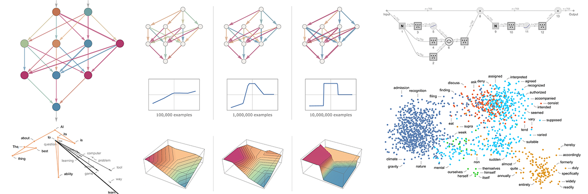

## It’s Just Adding One Word at a Time  

它只是一次添加一个词

That [_ChatGPT_](https://chat.openai.com/) can automatically generate something that reads even superficially like human-written text is remarkable, and unexpected. But how does it do it? And why does it work? My purpose here is to give a rough outline of what’s going on inside _ChatGPT_—and then to explore why it is that it can do so well in producing what we might consider to be meaningful text. I should say at the outset that I’m going to focus on the big picture of what’s going on—and while I’ll mention some engineering details, I won’t get deeply into them.  

_ChatGPT_ 可以自动生成一些表面上看起来像人类书写文本的东西，这是非常了不起的，也是出乎意料的。但是它是怎么做到的呢？为什么它有效？我在这里的目的是粗略概述 _ChatGPT_ 内部发生的事情，然后探讨为什么它可以如此出色地生成我们认为有意义的文本。我应该在一开始就说，我将专注于正在发生的事情的大局——虽然我会提到一些工程细节，但我不会深入探讨它们。  

(And the essence of what I’ll say applies just as well to other current “large language models” \[LLMs\] as to _ChatGPT_.)  

（我要说的内容的本质同样适用于其他当前的“大型语言模型”\[LLM\] 以及 _ChatGPT_。）

The first thing to explain is that what _ChatGPT_ is always fundamentally trying to do is to produce a “reasonable continuation” of whatever text it’s got so far, where by “reasonable” we mean “what one might expect someone to write after seeing what people have written on billions of webpages, etc.”  

首先要解释的是，_ChatGPT_ 一直在从根本上尝试做的是为它目前所获得的任何文本生成一个“合理的延续”，其中“合理”的意思是“人们可能期望某人在看到人们的内容后写下什么”已经在数十亿的网页上写过，等等。”

So let’s say we’ve got the text “_The best thing about AI is its ability to_”. Imagine scanning billions of pages of human-written text (say on the web and in digitized books) and finding all instances of this text—then seeing what word comes next what fraction of the time. _ChatGPT_ effectively does something like this, except that (as I’ll explain) it doesn’t look at literal text; it looks for things that in a certain sense “match in meaning”. But the end result is that it produces a ranked list of words that might follow, together with “probabilities”:  

所以假设我们有文本“关于 AI 的最好的事情是它的能力”。想象一下扫描数十亿页的人工文本（比如在网络上和数字化书籍中）并找到该文本的所有实例——然后在几分之一的时间内查看下一个单词。 _ChatGPT_ 有效地做了类似的事情，除了（正如我将解释的那样）它不看文字；它寻找在某种意义上“意义匹配”的事物。但最终结果是它会生成一个可能跟在后面的单词的排名列表，以及“概率”：

And the remarkable thing is that when _ChatGPT_ does something like write an essay what it’s essentially doing is just asking over and over again “given the text so far, what should the next word be?”—and each time adding a word.  

值得注意的是，当 _ChatGPT_ 做一些事情（比如写一篇文章）时，它本质上只是一遍又一遍地问“给定目前的文本，下一个词应该是什么？”——每次都添加一个词。  

(More precisely, as I’ll explain, it’s adding a “token”, which could be just a part of a word, which is why it can sometimes “make up new words”.)  

（更准确地说，正如我将要解释的，它是在添加一个“标记”，它可能只是一个词的一部分，这就是为什么它有时可以“组成新词”的原因。）

But, OK, at each step it gets a list of words with probabilities. But which one should it actually pick to add to the essay (or whatever) that it’s writing? One might think it should be the “highest-ranked” word (i.e. the one to which the highest “probability” was assigned).  

但是，好吧，在每一步它都会得到一个带有概率的单词列表。但是它实际上应该选择哪一个来添加到它正在写的文章（或其他）中？人们可能认为它应该是“排名最高”的词（即分配给最高“概率”的词）。  

But this is where a bit of voodoo begins to creep in.  

但这就是一点伏都教开始蔓延的地方。  

Because for some reason—that maybe one day we’ll have a scientific-style understanding of—if we always pick the highest-ranked word, we’ll typically get a very “flat” essay, that never seems to “show any creativity” (and even sometimes repeats word for word).  

因为出于某种原因——也许有一天我们会对——如果我们总是选择排名最高的词，我们通常会得到一篇非常“平淡”的文章，似乎永远不会“表现出任何创造力” ”（甚至有时逐字重复）。  

But if sometimes (at random) we pick lower-ranked words, we get a “more interesting” essay.  

但如果有时（随机）我们选择排名较低的词，我们会得到一篇“更有趣”的文章。

The fact that there’s randomness here means that if we use the same prompt multiple times, we’re likely to get different essays each time.  

这里存在随机性这一事实意味着，如果我们多次使用相同的提示，我们很可能每次都会得到不同的论文。  

And, in keeping with the idea of voodoo, there’s a particular so-called “temperature” parameter that determines how often lower-ranked words will be used, and for essay generation, it turns out that a “temperature” of 0.8 seems best.  

而且，为了与巫毒教的思想保持一致，有一个特定的所谓“温度”参数决定了低级别单词的使用频率，对于论文生成，事实证明 0.8 的“温度”似乎是最好的。  

(It’s worth emphasizing that there’s no “theory” being used here; it’s just a matter of what’s been found to work in practice. And for example the concept of “temperature” is there because exponential distributions [familiar from statistical physics](https://writings.stephenwolfram.com/2023/02/computational-foundations-for-the-second-law-of-thermodynamics/#textbook-thermodynamics) happen to be being used, but there’s no “physical” connection—at least so far as we know.)  

（值得强调的是，这里没有使用“理论”；这只是发现在实践中起作用的问题。例如，“温度”的概念之所以存在，是因为碰巧使用了统计物理学中熟悉的指数分布，但没有“物理”联系——至少就我们所知是这样。）

Before we go on I should explain that for purposes of exposition I’m mostly not going to use the full system that’s in _ChatGPT_; instead I’ll usually work with a simpler GPT-2 system, which has the nice feature that it’s small enough to be able to run on a standard desktop computer. And so for essentially everything I show I’ll be able to include explicit [Wolfram Language](https://www.wolfram.com/language/) code that you can immediately run on your computer. (Click any picture here to copy the code behind it.)  

在我们继续之前，我应该解释一下，出于阐述的目的，我主要不会使用 _ChatGPT_ 中的完整系统；相反，我通常会使用更简单的 GPT-2 系统，该系统的优点是它足够小，可以在标准台式计算机上运行。因此，对于我展示的所有内容，我都能够包含明确的 Wolfram 语言代码，您可以立即在您的计算机上运行这些代码。 （单击此处的任何图片以复制其背后的代码。）

For example, here’s how to get the table of probabilities above. First, we have to [retrieve the underlying “language model” neural net](https://resources.wolframcloud.com/NeuralNetRepository):  

例如，这里是如何获得上面的概率表。首先，我们必须检索底层的“语言模型”神经网络：

Later on, we’ll look inside this neural net, and talk about how it works. But for now we can just apply this “net model” as a black box to our text so far, and ask for the top 5 words by probability that the model says should follow:  

稍后，我们将深入了解这个神经网络，并讨论它是如何工作的。但是现在我们可以将这个“网络模型”作为一个黑盒子应用到我们的文本中，并按模型说应该遵循的概率要求前 5 个词：

This takes that result and makes it into an explicit formatted “[dataset](https://www.wolfram.com/language/elementary-introduction/2nd-ed/45-datasets.html)”:  

这会获取该结果并将其变成一个明确格式化的“数据集”：

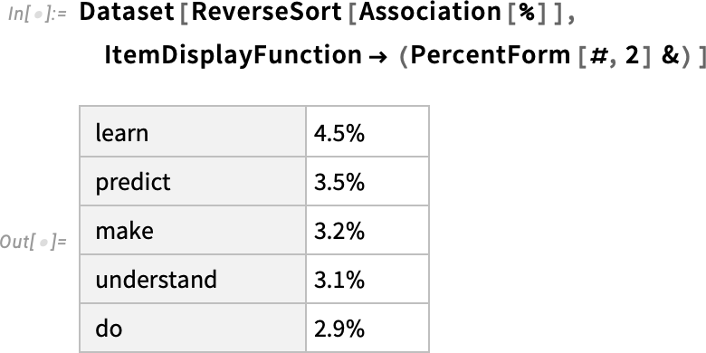

Here’s what happens if one repeatedly “applies the model”—at each step adding the word that has the top probability (specified in this code as the “decision” from the model):  

下面是如果重复“应用模型”会发生什么——在每一步添加具有最高概率的词（在此代码中指定为模型的“决定”）：

What happens if one goes on longer? In this (“zero temperature”) case what comes out soon gets rather confused and repetitive:  

如果持续更长时间会发生什么？在这种（“零温度”）情况下，很快就会出现相当混乱和重复的情况：

But what if instead of always picking the “top” word one sometimes randomly picks “non-top” words (with the “randomness” corresponding to “temperature” 0.8)? Again one can build up text:  

但是，如果不是总是选择“顶级”词，而是有时随机选择“非顶级”词（“随机性”对应于“温度”0.8）怎么办？同样可以构建文本：

And every time one does this, different random choices will be made, and the text will be different—as in these 5 examples:  

每次这样做时，都会做出不同的随机选择，文本也会不同——如以下 5 个示例所示：

It’s worth pointing out that even at the first step there are a lot of possible “next words” to choose from (at temperature 0.8), though their probabilities fall off quite quickly (and, yes, the straight line on this log-log plot corresponds to an _n_–1 [“power-law” decay that’s very characteristic of the general statistics of language](https://www.wolframscience.com/nks/notes-8-8--zipfs-law/)):  

值得指出的是，即使在第一步，也有很多可能的“下一个词”可供选择（温度为 0.8），尽管它们的概率下降得很快（而且，是的，这个对数对数图上的直线对应于 n –1 “幂律”衰减，这是语言一般统计数据的典型特征）：

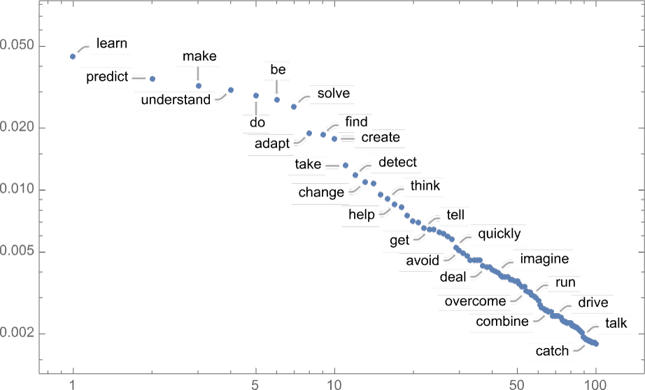

So what happens if one goes on longer? Here’s a random example. It’s better than the top-word (zero temperature) case, but still at best a bit weird:  

那么，如果持续时间更长会怎样？这是一个随机的例子。它比顶级词（零温度）的情况要好，但充其量还是有点奇怪：

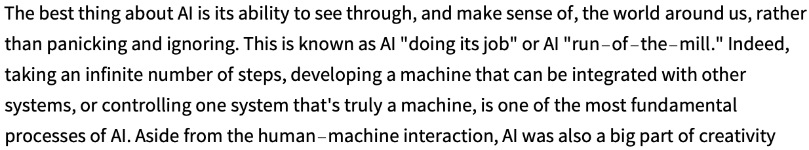

This was done with the [simplest GPT-2 model](https://resources.wolframcloud.com/NeuralNetRepository/resources/GPT2-Transformer-Trained-on-WebText-Data/) (from 2019). With the newer and [bigger GPT-3 models](https://platform.openai.com/docs/model-index-for-researchers) the results are better. Here’s the top-word (zero temperature) text produced with the same “prompt”, but with the biggest GPT-3 model:  

这是使用最简单的 GPT-2 模型（从 2019 年开始）完成的。使用更新更大的 GPT-3 模型，结果更好。这是使用相同的“提示”但使用最大的 GPT-3 模型生成的顶级词（零温度）文本：

And here’s a random example at “temperature 0.8”:  

这是“温度 0.8”的随机示例：

## Where Do the Probabilities Come From?  

概率从何而来？

OK, so _ChatGPT_ always picks its next word based on probabilities. But where do those probabilities come from? Let’s start with a simpler problem. Let’s consider generating English text one letter (rather than word) at a time. How can we work out what the probability for each letter should be?  

好的，所以 _ChatGPT_ 总是根据概率选择下一个词。但这些概率从何而来？让我们从一个更简单的问题开始。让我们考虑一次生成一个字母（而不是单词）的英文文本。我们如何计算出每个字母的概率应该是多少？

A very minimal thing we could do is just take a sample of English text, and calculate how often different letters occur in it. So, for example, [this counts letters in the Wikipedia article](https://www.wolfram.com/language/elementary-introduction/2nd-ed/34-associations.html#i-8) on “cats”:  

我们可以做的一件非常简单的事情就是取一个英文文本样本，然后计算不同字母在其中出现的频率。因此，例如，这会计算维基百科关于“猫”的文章中的字母：

And this does the same thing for “dogs”:  

这对“狗”做了同样的事情：

The results are similar, but not the same (“o” is no doubt more common in the “dogs” article because, after all, it occurs in the word “dog” itself). Still, if we take a large enough sample of English text we can expect to eventually get at least fairly consistent results:  

结果相似，但不相同（“o”无疑在“dogs”文章中更常见，因为毕竟它出现在“dog”一词本身中）。尽管如此，如果我们采用足够大的英文文本样本，我们可以期望最终得到至少相当一致的结果：

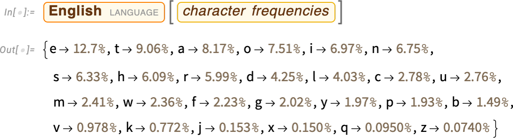

Here’s a sample of what we get if we just generate a sequence of letters with these probabilities:  

如果我们只生成具有这些概率的字母序列，下面是我们得到的示例：

We can break this into “words” by adding in spaces as if they were letters with a certain probability:  

我们可以通过添加空格将其分解为“单词”，就好像它们是具有一定概率的字母一样：

We can do a slightly better job of making “words” by forcing the distribution of “word lengths” to agree with what it is in English:  

我们可以通过强制“词长”的分布与英语中的一致来更好地制作“词”：

We didn’t happen to get any “actual words” here, but the results are looking slightly better. To go further, though, we need to do more than just pick each letter separately at random. And, for example, we know that if we have a “q”, the next letter basically has to be “u”.  

我们在这里没有碰巧得到任何“实际单词”，但结果看起来稍微好一些。不过，要走得更远，我们需要做的不仅仅是随机挑选每个字母。而且，例如，我们知道如果我们有一个“q”，下一个字母基本上必须是“u”。

Here’s a plot of the probabilities for letters on their own:  

这是字母本身的概率图：

And here’s a plot that shows the probabilities of pairs of letters (“2-grams”) in typical English text. The possible first letters are shown across the page, the second letters down the page:  

这是一个图表，显示了典型英文文本中字母对（“2-grams”）的概率。可能的第一个字母显示在整个页面上，第二个字母显示在页面下方：

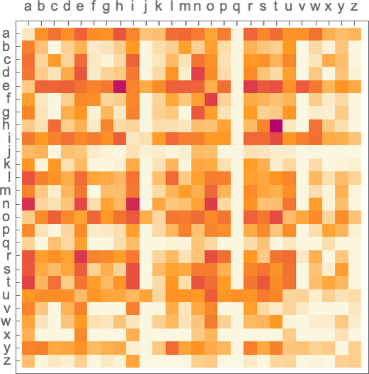

And we see here, for example, that the “q” column is blank (zero probability) except on the “u” row. OK, so now instead of generating our “words” a single letter at a time, let’s generate them looking at two letters at a time, using these “2-gram” probabilities.  

例如，我们在这里看到，除了“u”行之外，“q”列是空白的（概率为零）。好的，现在不是一次生成一个字母的“单词”，而是使用这些“2-gram”概率一次生成两个字母。  

Here’s a sample of the result—which happens to include a few “actual words”:  

这是结果的示例——其中恰好包含一些“实际单词”：

With sufficiently much English text we can get pretty good estimates not just for probabilities of single letters or pairs of letters (2-grams), but also for longer runs of letters. And if we generate “random words” with progressively longer _n_\-gram probabilities, we see that they get progressively “more realistic”:  

有了足够多的英文文本，我们不仅可以对单个字母或字母对（2-grams）的概率，而且可以对更长的字母串的概率进行很好的估计。如果我们生成 n-gram 概率逐渐变长的“随机词”，我们会看到它们逐渐变得“更真实”：

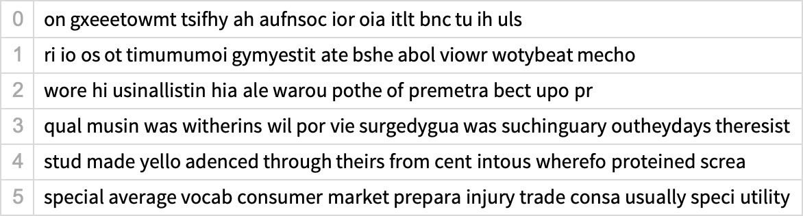

But let’s now assume—more or less as _ChatGPT_ does—that we’re dealing with whole words, not letters. There are about 40,000 [reasonably commonly used words in English](https://reference.wolfram.com/language/ref/WordList.html). And by looking at a large corpus of English text (say a few million books, with altogether a few hundred billion words), we can get an [estimate of how common each word is](https://reference.wolfram.com/language/ref/WordFrequencyData.html). And using this we can start generating “sentences”, in which each word is independently picked at random, with the same probability that it appears in the corpus. Here’s a sample of what we get:  

但是现在让我们假设——或多或少像 _ChatGPT_ 所做的那样——我们正在处理整个单词，而不是字母。英语中大约有 40,000 个合理常用的单词。通过查看大量的英语文本语料库（比如几百万本书，总共有几千亿个单词），我们可以估计每个单词的出现频率。使用它我们可以开始生成“句子”，其中每个词都是随机独立挑选的，其出现在语料库中的概率相同。这是我们得到的示例：

Not surprisingly, this is nonsense. So how can we do better? Just like with letters, we can start taking into account not just probabilities for single words but probabilities for pairs or longer _n_\-grams of words. Doing this for pairs, here are 5 examples of what we get, in all cases starting from the word “cat”:  

毫不奇怪，这是无稽之谈。那么我们怎样才能做得更好呢？就像字母一样，我们不仅可以开始考虑单个单词的概率，还可以考虑成对或更长的 n-gram 单词的概率。对成对执行此操作，这里有 5 个我们得到的例子，在所有情况下都从“猫”这个词开始：

It’s getting slightly more “sensible looking”. And we might imagine that if we were able to use sufficiently long _n_\-grams we’d basically “get a _ChatGPT_”—in the sense that we’d get something that would generate essay-length sequences of words with the “correct overall essay probabilities”. But here’s the problem: there just isn’t even close to enough English text that’s ever been written to be able to deduce those probabilities.  

它变得更加“明智”。我们可能会想象，如果我们能够使用足够长的 n-gram，我们基本上会“得到一个 _ChatGPT_”——从某种意义上说，我们会得到一些东西，它会生成文章长度的单词序列，并带有“正确的整体文章”概率”。但这就是问题所在：甚至没有足够多的英文文本能够推断出这些概率。

In a [crawl of the web](https://commoncrawl.org/) there might be a few hundred billion words; in books that have been digitized there might be another hundred billion words. But with 40,000 common words, even the number of possible 2-grams is already 1.6 billion—and the number of possible 3-grams is 60 trillion.  

在网络爬行中可能有几千亿个单词；在已经数字化的书籍中，可能还有 1000 亿字。但是对于 40,000 个常用词，即使是 2-gram 的可能数量也已经是 16 亿——而 3-gram 的可能数量是 60 万亿。  

So there’s no way we can estimate the probabilities even for all of these from text that’s out there.  

所以我们无法从现有的文本中估计所有这些的概率。  

And by the time we get to “essay fragments” of 20 words, the number of possibilities is larger than the number of particles in the universe, so in a sense they could never all be written down.  

而到了20个字的“作文碎片”，可能性的数量比宇宙中的粒子数量还要多，所以从某种意义上说，它们永远不可能全部写下来。

So what can we do? The big idea is to make a model that lets us estimate the probabilities with which sequences should occur—even though we’ve never explicitly seen those sequences in the corpus of text we’ve looked at. And at the core of _ChatGPT_ is precisely a so-called “large language model” (LLM) that’s been built to do a good job of estimating those probabilities.  

所以，我们能做些什么？最重要的想法是建立一个模型，让我们估计序列应该出现的概率——即使我们从未在我们查看的文本语料库中明确看到这些序列。 _ChatGPT_ 的核心正是所谓的“大型语言模型”（LLM），它的构建是为了很好地估计这些概率。

## What Is a Model?  

什么是模型？

Say you want to know (as [Galileo did back in the late 1500s](https://archive.org/details/bub_gb_49d42xp-USMC/page/404/mode/2up)) how long it’s going to take a cannon ball dropped from each floor of the Tower of Pisa to hit the ground. Well, you could just measure it in each case and make a table of the results.  

假设你想知道（就像伽利略在 1500 年代后期所做的那样）从比萨斜塔的每一层楼掉落的炮弹需要多长时间才能落地。好吧，你可以在每种情况下测量它并制作一个结果表。  

Or you could do what is the essence of theoretical science: make a model that gives some kind of procedure for computing the answer rather than just measuring and remembering each case.  

或者你可以做理论科学的本质：建立一个模型，给出某种程序来计算答案，而不是仅仅测量和记住每个案例。

Let’s imagine we have (somewhat idealized) data for how long the cannon ball takes to fall from various floors:  

假设我们有（有点理想化的）炮弹从不同楼层落下所需时间的数据：

How do we figure out how long it’s going to take to fall from a floor we don’t explicitly have data about? In this particular case, we can use known laws of physics to work it out. But say all we’ve got is the data, and we don’t know what underlying laws govern it.  

我们如何计算出从我们没有明确数据的地板上掉下来需要多长时间？在这种特殊情况下，我们可以使用已知的物理定律来解决它。但是假设我们所拥有的只是数据，而我们不知道受其约束的基本法律。  

Then we might make a mathematical guess, like that perhaps we should use a straight line as a model:  

那么我们可能会做一个数学上的猜测，比如也许我们应该用一条直线作为模型：

We could pick different straight lines. But this is the one that’s on average closest to the data we’re given. And from this straight line we can estimate the time to fall for any floor.  

我们可以选择不同的直线。但这是平均最接近我们给出的数据的那个。从这条直线我们可以估计任何楼层下降的时间。

How did we know to try using a straight line here? At some level we didn’t. It’s just something that’s mathematically simple, and we’re used to the fact that lots of data we measure turns out to be well fit by mathematically simple things.  

我们怎么知道在这里尝试使用直线？在某种程度上我们没有。这只是数学上简单的东西，我们已经习惯了这样一个事实，即我们测量的大量数据被证明与数学上简单的东西非常吻合。  

We could try something mathematically more complicated—say _a_ + _b_ _x_ + _c_ _x_2—and then in this case we do better:  

我们可以尝试一些数学上更复杂的东西——比如 a + b x + c x 2 ——然后在这种情况下我们做得更好：

Things can go quite wrong, though. Like here’s [the best we can do](https://reference.wolfram.com/language/ref/FindFit.html) with _a_ + _b_/_x_ + _c_ sin(_x_):  

不过，事情可能会变得很不对劲。就像这是我们可以用 a + b/x + c sin(x) 做的最好的事情：

It worth understanding that there’s never a “model-less model”. Any model you use has some particular underlying structure—then a certain set of “knobs you can turn” (i.e. parameters you can set) to fit your data. And in the case of _ChatGPT_, lots of such “knobs” are used—actually, 175 billion of them.  

值得理解的是，从来没有“无模型模型”。你使用的任何模型都有一些特定的底层结构——然后是一组特定的“你可以转动的旋钮”（即你可以设置的参数）来适应你的数据。在 _ChatGPT_ 的案例中，使用了很多这样的“旋钮”——实际上是 1750 亿个。

But the remarkable thing is that the underlying structure of _ChatGPT_—with “just” that many parameters—is sufficient to make a model that computes next-word probabilities “well enough” to give us reasonable essay-length pieces of text.  

但值得注意的是，_ChatGPT_ 的底层结构——“仅”有那么多参数——足以构建一个模型，该模型“足够好”地计算下一个词的概率，从而为我们提供合理的论文长度文本。

## Models for Human-Like Tasks  

类人任务模型

The example we gave above involves making a model for numerical data that essentially comes from simple physics—where we’ve known for several centuries that “simple mathematics applies”. But for _ChatGPT_ we have to make a model of human-language text of the kind produced by a human brain. And for something like that we don’t (at least yet) have anything like “simple mathematics”. So what might a model of it be like?  

我们上面给出的例子涉及为本质上来自简单物理学的数值数据建立模型——几个世纪以来我们就知道“简单的数学适用”。但是对于 _ChatGPT_，我们必须制作一个人类大脑产生的那种人类语言文本模型。对于类似的东西，我们（至少现在）没有像“简单数学”这样的东西。那么它的模型可能是什么样的呢？

Before we talk about language, let’s talk about another human-like task: recognizing images. And as a simple example of this, let’s consider images of digits (and, yes, this is a [classic machine learning example](https://resources.wolframcloud.com/NeuralNetRepository/resources/050b1a0a-f43a-4c28-b7e0-72607a918467/)):  

在我们谈论语言之前，让我们谈谈另一个类似人类的任务：识别图像。作为一个简单的例子，让我们考虑一下数字图像（是的，这是一个经典的机器学习例子）：

One thing we could do is get a bunch of sample images for each digit:  

我们可以做的一件事是为每个数字获取一堆示例图像：

Then to find out if an image we’re given as input corresponds to a particular digit we could just do an explicit pixel-by-pixel comparison with the samples we have.  

然后，为了确定我们作为输入给出的图像是否对应于特定数字，我们可以与我们拥有的样本进行明确的逐像素比较。  

But as humans we certainly seem to do something better—because we can still recognize digits, even when they’re for example handwritten, and have all sorts of modifications and distortions:  

但作为人类，我们似乎确实做得更好——因为我们仍然可以识别数字，即使它们是手写的，并且有各种修改和扭曲：

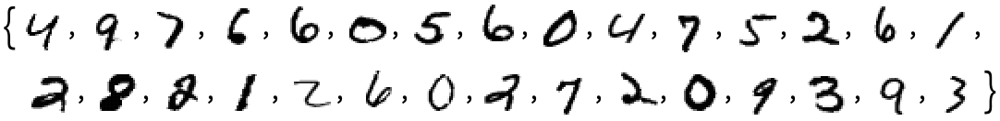

When we made a model for our numerical data above, we were able to take a numerical value _x_ that we were given, and just compute _a + b x_ for particular _a_ and _b_. So if we treat the gray-level value of each pixel here as some variable _xi_ is there some function of all those variables that—when evaluated—tells us what digit the image is of? It turns out that it’s possible to construct such a function. Not surprisingly, it’s not particularly simple, though.  

当我们为上面的数值数据建立模型时，我们能够采用给定的数值 x，并仅计算特定 a 和 b 的 a + b x。因此，如果我们在这里将每个像素的灰度值视为某个变量 xi，是否存在所有这些变量的某个函数——在评估时——告诉我们图像的数字是多少？事实证明，构造这样一个函数是可能的。毫不奇怪，它并不是特别简单。  

And a typical example might involve perhaps half a million mathematical operations.  

一个典型的例子可能涉及 50 万个数学运算。

But the end result is that if we feed the collection of pixel values for an image into this function, out will come the number specifying which digit we have an image of. Later, we’ll talk about how such a function can be constructed, and the idea of neural nets.  

但最终结果是，如果我们将一幅图像的像素值集合输入该函数，输出的将是指定我们拥有图像的数字的数字。稍后，我们将讨论如何构建这样的函数，以及神经网络的概念。  

But for now let’s treat the function as black box, where we feed in images of, say, handwritten digits (as arrays of pixel values) and we get out the numbers these correspond to:  

但是现在让我们把这个函数当作黑盒子，我们输入图像，比如手写数字（作为像素值数组），然后我们得到这些对应的数字：

But what’s really going on here? Let’s say we progressively blur a digit. For a little while our function still “recognizes” it, here as a “2”. But soon it “loses it”, and starts giving the “wrong” result:  

但是这里到底发生了什么？假设我们逐渐模糊了一个数字。有一段时间我们的函数仍然“识别”它，这里是“2”。但很快它就“失去了它”，并开始给出“错误”的结果：

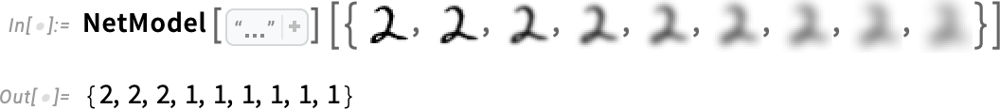

But why do we say it’s the “wrong” result? In this case, we know we got all the images by blurring a “2”.  

但为什么我们说这是“错误”的结果呢？在这种情况下，我们知道我们通过模糊“2”得到了所有图像。  

But if our goal is to produce a model of what humans can do in recognizing images, the real question to ask is what a human would have done if presented with one of those blurred images, without knowing where it came from.  

但是，如果我们的目标是建立一个模型来说明人类在识别图像方面可以做什么，那么真正要问的问题是，如果人类在不知道其中一张模糊图像的情况下会做什么。

And we have a “good model” if the results we get from our function typically agree with what a human would say. And the nontrivial scientific fact is that for an image-recognition task like this we now basically know how to construct functions that do this.  

如果我们从函数中得到的结果通常与人类所说的一致，那么我们就有了一个“好的模型”。重要的科学事实是，对于像这样的图像识别任务，我们现在基本上知道如何构建执行此操作的函数。

Can we “mathematically prove” that they work? Well, no. Because to do that we’d have to have a mathematical theory of what we humans are doing. Take the “2” image and change a few pixels.  

我们能“用数学证明”它们有效吗？好吧，不。因为要做到这一点，我们必须对我们人类正在做的事情有一个数学理论。拍摄“2”图像并更改几个像素。  

We might imagine that with only a few pixels “out of place” we should still consider the image a “2”. But how far should that go? It’s a question of [human visual perception](https://www.wolframscience.com/nks/chap-10--processes-of-perception-and-analysis#sect-10-7--visual-perception). And, yes, the answer would no doubt be different for bees or octopuses—and potentially [utterly different for putative aliens](https://writings.stephenwolfram.com/2021/11/the-concept-of-the-ruliad/#alien-views-of-the-ruliad).  

我们可能会想象只有几个像素“不合适”，我们仍然应该认为图像是“2”。但这应该走多远？这是人的视觉感知问题。而且，是的，对于蜜蜂或章鱼来说，答案无疑会有所不同——而且对于假定的外星人来说，答案可能会完全不同。

## Neural Nets  

神经网络

OK, so how do our typical models for tasks like [image recognition](https://writings.stephenwolfram.com/2015/05/wolfram-language-artificial-intelligence-the-image-identification-project/) actually work? The most popular—and successful—current approach uses [neural nets](https://reference.wolfram.com/language/guide/NeuralNetworks.html). Invented—in a form remarkably close to their use today—[in the 1940s](https://www.wolframscience.com/nks/notes-10-12--history-of-ideas-about-thinking/), neural nets can be thought of as simple idealizations of how [brains seem to work](https://www.wolframscience.com/nks/notes-10-12--the-brain/).  

好的，那么我们用于图像识别等任务的典型模型实际上是如何工作的呢？目前最流行且最成功的方法是使用神经网络。神经网络是在 1940 年代发明的——以一种非常接近它们今天使用的形式——可以被认为是大脑似乎如何工作的简单理想化。

In human brains there are about 100 billion neurons (nerve cells), each capable of producing an electrical pulse up to perhaps a thousand times a second.  

在人类大脑中，大约有 1000 亿个神经元（神经细胞），每个神经元每秒都能产生多达一千次的电脉冲。  

The neurons are connected in a complicated net, with each neuron having tree-like branches allowing it to pass electrical signals to perhaps thousands of other neurons.  

神经元连接在一个复杂的网络中，每个神经元都有树状分支，可以将电信号传递给可能有数千个其他神经元。  

And in a rough approximation, whether any given neuron produces an electrical pulse at a given moment depends on what pulses it’s received from other neurons—with different connections contributing with different “weights”.  

在粗略的近似中，任何给定神经元是否在给定时刻产生电脉冲取决于它从其他神经元接收到什么脉冲——不同的连接产生不同的“权重”。

When we “see an image” what’s happening is that when photons of light from the image fall on (“photoreceptor”) cells at the back of eyes they produce electrical signals in nerve cells.  

当我们“看到图像”时，发生的事情是，当来自图像的光子落在眼睛后部的（“光感受器”）细胞上时，它们会在神经细胞中产生电信号。  

These nerve cells are connected to other nerve cells, and eventually the signals go through a whole sequence of layers of neurons.  

这些神经细胞与其他神经细胞相连，最终信号通过一系列神经元层。  

And it’s in this process that we “recognize” the image, eventually “forming the thought” that we’re “seeing a 2” (and maybe in the end doing something like saying the word “two” out loud).  

正是在这个过程中，我们“识别”了图像，最终“形成了我们正在“看到一个 2”的想法（也许最后会做一些事情，比如大声说出“二”这个词）。

The “black-box” function from the previous section is a “mathematicized” version of such a neural net. It happens to have 11 layers (though only 4 “core layers”):  

上一节中的“黑盒”函数是此类神经网络的“数学化”版本。它恰好有 11 层（尽管只有 4 个“核心层”）：

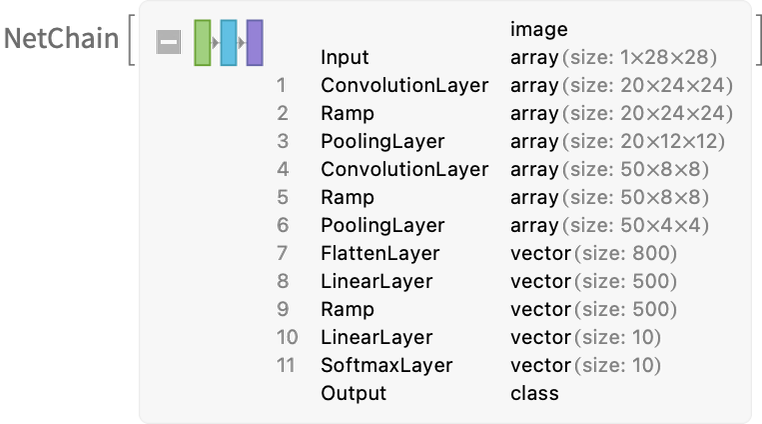

There’s nothing particularly “theoretically derived” about this neural net; it’s just something that—[back in 1998—was constructed as a piece of engineering](https://resources.wolframcloud.com/NeuralNetRepository/resources/LeNet-Trained-on-MNIST-Data/), and found to work. (Of course, that’s not much different from how we might describe our brains as having been produced through the process of biological evolution.)  

这个神经网络没有什么特别的“理论上推导出来的”；它只是在 1998 年作为一项工程构建并被发现有效的东西。 （当然，这与我们描述大脑是通过生物进化过程产生的方式并没有太大区别。）

OK, but how does a neural net like this “recognize things”? The key is the [_notion_ of attractors](https://www.wolframscience.com/nks/chap-6--starting-from-randomness#sect-6-7--the-notion-of-attractors). Imagine we’ve got handwritten images of 1’s and 2’s:  

好的，但是像这样的神经网络如何“识别事物”？关键是吸引子的概念。假设我们有 1 和 2 的手写图像：

We somehow want all the 1’s to “be attracted to one place”, and all the 2’s to “be attracted to another place”. Or, put a different way, if an image is somehow “[closer to being a 1](https://www.wolframscience.com/nks/notes-10-12--memory-analogs-with-numerical-data/)” than to being a 2, we want it to end up in the “1 place” and vice versa.  

我们不知何故希望所有 1 都“被吸引到一个地方”，而所有 2 都“被吸引到另一个地方”。或者，换句话说，如果图像以某种方式“更接近于 1”而不是 2，我们希望它最终位于“1 位”，反之亦然。

As a straightforward analogy, let’s say we have certain positions in the plane, indicated by dots (in a real-life setting they might be positions of coffee shops). Then we might imagine that starting from any point on the plane we’d always want to end up at the closest dot (i.e.  

作为一个简单的类比，假设我们在平面上有特定的位置，用点表示（在现实生活中，它们可能是咖啡店的位置）。然后我们可能会想象，从平面上的任何一点开始，我们总是希望在最近的点结束（即  

we’d always go to the closest coffee shop). We can represent this by dividing the plane into regions (“attractor basins”) separated by idealized “watersheds”:  

我们总是去最近的咖啡店）。我们可以通过将平面划分为由理想化的“分水岭”分隔的区域（“吸引盆地”）来表示：

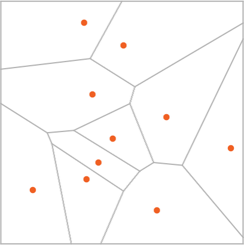

We can think of this as implementing a kind of “recognition task” in which we’re not doing something like identifying what digit a given image “looks most like”—but rather we’re just, quite directly, seeing what dot a given point is closest to.  

我们可以将其视为实现一种“识别任务”，在该任务中我们不是在识别给定图像“看起来最像”的数字之类的事情——而是我们只是非常直接地看到给定图像中的点是什么点最近。  

(The “Voronoi diagram” setup we’re showing here separates points in 2D Euclidean space; the digit recognition task can be thought of as doing something very similar—but in a 784-dimensional space formed from the gray levels of all the pixels in each image.)  

（我们在这里展示的“Voronoi 图”设置在 2D 欧几里得空间中分离点；数字识别任务可以被认为是在做一些非常相似的事情——但是在一个由所有像素的灰度级形成的 784 维空间中每个图像。）

So how do we make a neural net “do a recognition task”? Let’s consider this very simple case:  

那么我们如何让神经网络“做识别任务”呢？让我们考虑这个非常简单的案例：

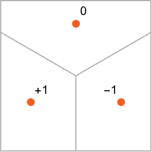

Our goal is to take an “input” corresponding to a position {_x_,_y_}—and then to “recognize” it as whichever of the three points it’s closest to. Or, in other words, we want the neural net to compute a function of {_x_,_y_} like:  

我们的目标是获取对应于位置 {x,y} 的“输入”——然后将其“识别”为与它最接近的三个点中的那个。或者，换句话说，我们希望神经网络计算 {x,y} 的函数，例如：

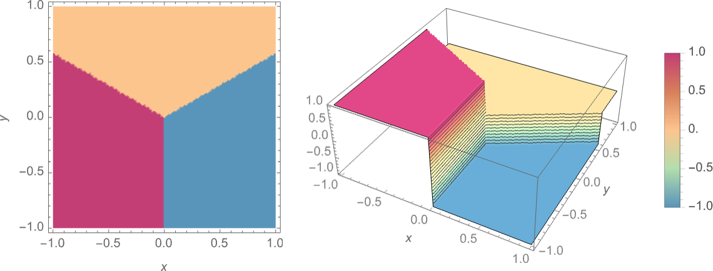

So how do we do this with a neural net? Ultimately a neural net is a connected collection of idealized “neurons”—usually arranged in layers—with a simple example being:  

那么我们如何使用神经网络做到这一点呢？最终，神经网络是理想化“神经元”的连接集合——通常分层排列——一个简单的例子是：

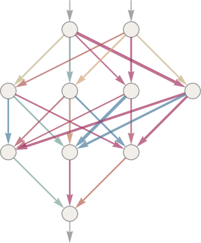

Each “neuron” is effectively set up to evaluate a simple numerical function. And to “use” the network, we simply feed numbers (like our coordinates _x_ and _y_) in at the top, then have neurons on each layer “evaluate their functions” and feed the results forward through the network—eventually producing the final result at the bottom:  

每个“神经元”都被有效地设置为评估一个简单的数值函数。为了“使用”网络，我们只需在顶部输入数字（比如我们的坐标 x 和 y），然后让每一层上的神经元“评估它们的功能”并通过网络传递结果——最终产生最终结果在底部：

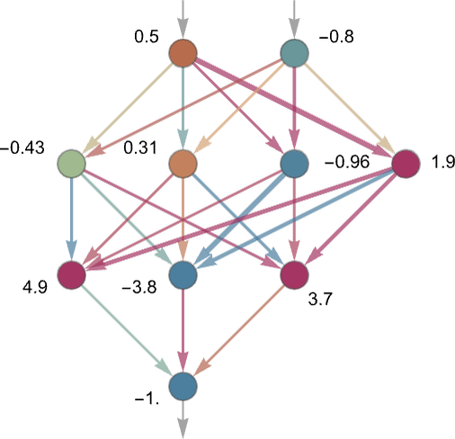

In the traditional (biologically inspired) setup each neuron effectively has a certain set of “incoming connections” from the neurons on the previous layer, with each connection being assigned a certain “weight” (which can be a positive or negative number).  

在传统的（受生物学启发的）设置中，每个神经元实际上都具有来自前一层神经元的一组特定“传入连接”，每个连接都被分配了特定的“权重”（可以是正数或负数）。  

The value of a given neuron is determined by multiplying the values of “previous neurons” by their corresponding weight, then adding these up and multiplying by a constant—and finally applying a “thresholding” (or “activation”) function.  

给定神经元的值是通过将“先前神经元”的值乘以它们相应的权重，然后将它们相加并乘以一个常数来确定的——最后应用“阈值”（或“激活”）函数。  

In mathematical terms, if a neuron has inputs _x_ = {_x_1, _x_2 …} then we compute _f_\[_w_ . _x_ + _b_\], where the weights _w_ and constant _b_ are generally chosen differently for each neuron in the network; the function _f_ is usually the same.  

用数学术语来说，如果一个神经元有输入 x = {x1, x2 …} 那么我们计算 f\[w 。 x + b\]，其中通常为网络中的每个神经元选择不同的权重 w 和常量 b；函数 f 通常是相同的。

Computing _w_ . _x_ + _b_ is just a matter of matrix multiplication and addition. The “activation function” _f_ introduces nonlinearity (and ultimately is what leads to nontrivial behavior). Various activation functions commonly get used; here we’ll just use [Ramp](http://reference.wolfram.com/language/ref/Ramp.html) (or ReLU):  

计算 w 。 x + b 只是矩阵乘法和加法的问题。 “激活函数”f 引入了非线性（最终导致了非平凡的行为）。通常使用各种激活函数；这里我们只使用 [Ramp](http://reference.wolfram.com/language/ref/Ramp.html) （或 ReLU）：

For each task we want the neural net to perform (or, equivalently, for each overall function we want it to evaluate) we’ll have different choices of weights.  

对于我们希望神经网络执行的每项任务（或者，等效地，对于我们希望它评估的每个整体功能），我们将有不同的权重选择。  

(And—as we’ll discuss later—these weights are normally determined by “training” the neural net using machine learning from examples of the outputs we want.)  

（而且——正如我们稍后将讨论的——这些权重通常是通过使用机器学习从我们想要的输出示例中“训练”神经网络来确定的。）

Ultimately, every neural net just corresponds to some overall mathematical function—though it may be messy to write out. For the example above, it would be:  

最终，每个神经网络都只对应于一些整体的数学函数——尽管写出来可能会很麻烦。对于上面的示例，它将是：

The neural net of _ChatGPT_ also just corresponds to a mathematical function like this—but effectively with billions of terms.  

_ChatGPT_ 的神经网络也恰好对应于这样的数学函数——但实际上有数十亿项。

But let’s go back to individual neurons. Here are some examples of the functions a neuron with two inputs (representing coordinates _x_ and _y_) can compute with various choices of weights and constants (and [Ramp](https://reference.wolfram.com/language/ref/Ramp.html) as activation function):  

但是让我们回到单个神经元。以下是具有两个输入（表示坐标 x 和 y）的神经元可以使用各种权重和常数（以及 [Ramp](https://reference.wolfram.com/language/ref/Ramp.html) 作为激活函数）进行计算的函数示例：

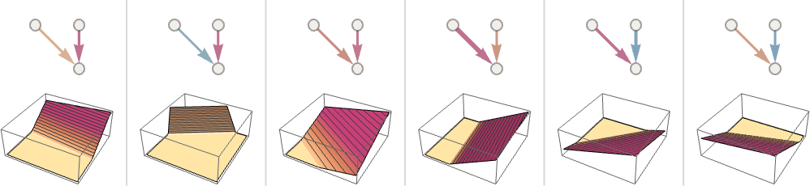

But what about the larger network from above? Well, here’s what it computes:  

但是上面更大的网络呢？好吧，这是它的计算结果：

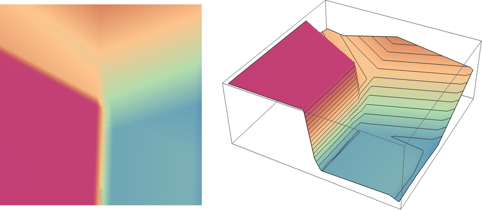

It’s not quite “right” , but it’s close to the “nearest point” function we showed above.  

它不是很“正确”，但它接近我们上面展示的“最近点”功能。

Let’s see what happens with some other neural nets. In each case, as we’ll explain later, we’re using machine learning to find the best choice of weights. Then we’re showing here what the neural net with those weights computes:  

让我们看看其他一些神经网络会发生什么。在每种情况下，正如我们稍后将解释的那样，我们都在使用机器学习来找到最佳的权重选择。然后我们在这里展示具有这些权重的神经网络计算的内容：

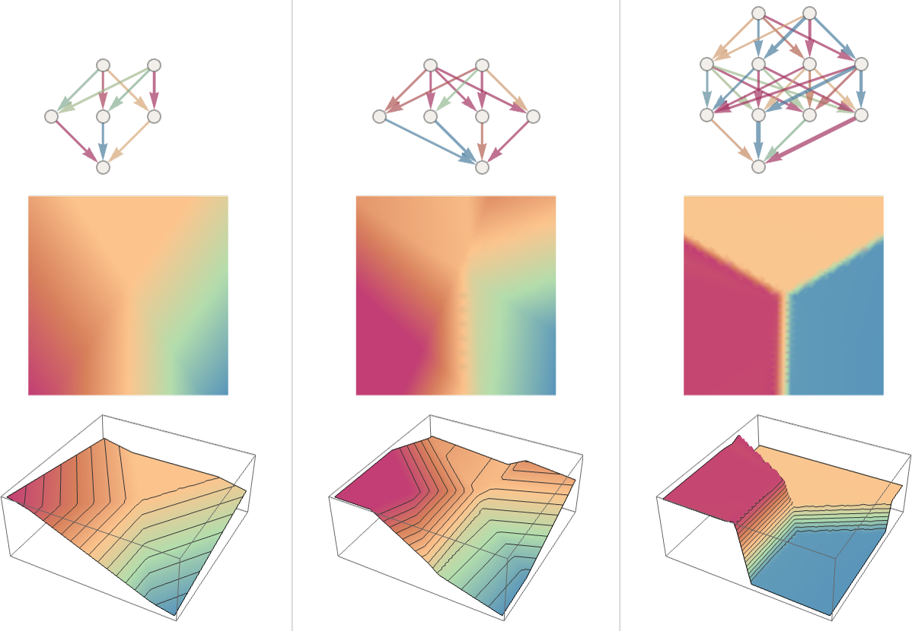

Bigger networks generally do better at approximating the function we’re aiming for. And in the “middle of each attractor basin” we typically get exactly the answer we want. But [at the boundaries](https://www.wolframscience.com/nks/notes-10-12--memory-analogs-with-numerical-data/)—where the neural net “has a hard time making up its mind”—things can be messier.  

更大的网络通常能更好地逼近我们的目标函数。在“每个吸引盆的中间”，我们通常会得到我们想要的答案。但在边界——神经网络“难以做出决定”的地方——事情可能会更加混乱。

With this simple mathematical-style “recognition task” it’s clear what the “right answer” is. But in the problem of recognizing handwritten digits, it’s not so clear. What if someone wrote a “2” so badly it looked like a “7”, etc.?  

通过这个简单的数学式“识别任务”，“正确答案”是什么一目了然。但是在识别手写数字的问题上，就不是那么清楚了。如果有人把“2”写得很糟糕，看起来像“7”等等怎么办？  

Still, we can ask how a neural net distinguishes digits—and this gives an indication:  

尽管如此，我们仍可以询问神经网络如何区分数字——这给出了一个指示：

Can we say “mathematically” how the network makes its distinctions? Not really. It’s just “doing what the neural net does”. But it turns out that that normally seems to agree fairly well with the distinctions we humans make.  

我们可以“从数学上”说网络是如何区分的吗？并不真地。它只是“做神经网络做的事”。但事实证明，这通常似乎与我们人类所做的区分相当吻合。

Let’s take a more elaborate example. Let’s say we have images of cats and dogs. And we have a [neural net that’s been trained to distinguish them](https://writings.stephenwolfram.com/2015/05/wolfram-language-artificial-intelligence-the-image-identification-project/). Here’s what it might do on some examples:  

让我们举一个更详细的例子。假设我们有猫和狗的图像。我们有一个经过训练可以区分它们的神经网络。以下是它在某些示例中可能执行的操作：

Now it’s even less clear what the “right answer” is. What about a dog dressed in a cat suit? Etc. Whatever input it’s given, the neural net is generating an answer. And, it turns out, to do it a way that’s reasonably consistent with what humans might do.  

现在更不清楚“正确答案”是什么了。一只穿着猫套装的狗呢？等等。无论给出什么输入，神经网络都会生成一个答案。而且，事实证明，这样做的方式与人类可能做的事情相当一致。  

As I’ve said above, that’s not a fact we can “derive from first principles”. It’s just something that’s empirically been found to be true, at least in certain domains. But it’s a key reason why neural nets are useful: that they somehow capture a “human-like” way of doing things.  

正如我上面所说的，这不是我们可以“从第一原则推导出来”的事实。这只是根据经验证明是正确的，至少在某些领域是这样。但这是神经网络有用的一个关键原因：它们以某种方式捕获了“类似人类”的做事方式。

Show yourself a picture of a cat, and ask “Why is that a cat?”. Maybe you’d start saying “Well, I see its pointy ears, etc.” But it’s not very easy to explain how you recognized the image as a cat. It’s just that somehow your brain figured that out.  

给自己看一张猫的照片，然后问“为什么那是猫？”。也许你会开始说“好吧，我看到它尖尖的耳朵，等等。”但是要解释你是如何将图像识别为一只猫并不是很容易。只是你的大脑以某种方式想通了。  

But for a brain there’s no way (at least yet) to “go inside” and see how it figured it out. What about for an (artificial) neural net? Well, it’s straightforward to see what each “neuron” does when you show a picture of a cat.  

但是对于大脑来说，没有办法（至少现在）“进入内部”并看看它是如何计算出来的。对于（人工）神经网络呢？好吧，当你展示一张猫的照片时，很容易看出每个“神经元”做了什么。  

But even to get a basic visualization is usually very difficult.  

但即使是获得基本的可视化通常也非常困难。

In the final net that we used for the “nearest point” problem above there are 17 neurons. In the net for recognizing handwritten digits there are 2190. And in the net we’re using to recognize cats and dogs there are 60,650.  

在我们用于上述“最近点”问题的最终网络中，有 17 个神经元。在识别手写数字的网络中有 2190 个。在我们用来识别猫和狗的网络中有 60,650 个。  

Normally it would be pretty difficult to visualize what amounts to 60,650-dimensional space. But because this is a network set up to deal with images, many of its layers of neurons are organized into arrays, like the arrays of pixels it’s looking at.  

通常情况下，很难将 60,650 维空间可视化。但是因为这是一个为处理图像而设置的网络，它的许多神经元层被组织成阵列，就像它正在查看的像素阵列一样。

And if we take a typical cat image  

如果我们拍一张典型的猫的照片

then we can represent the states of neurons at the first layer by a collection of derived images—many of which we can readily interpret as being things like “the cat without its background”, or “the outline of the cat”:  

然后我们可以通过一组派生图像来表示第一层神经元的状态——其中许多我们可以很容易地解释为“没有背景的猫”或“猫的轮廓”之类的东西：

By the 10th layer it’s harder to interpret what’s going on:  

到第 10 层时，很难解释发生了什么：

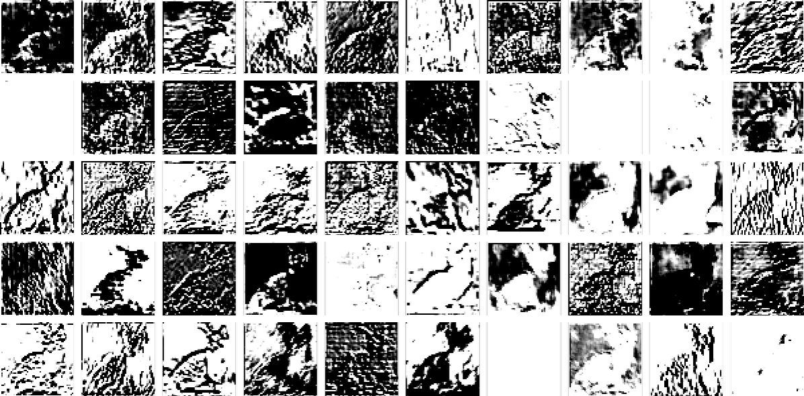

But in general we might say that the neural net is “picking out certain features” (maybe pointy ears are among them), and using these to determine what the image is of. But are those features ones for which we have names—like “pointy ears”? Mostly not.  

但总的来说，我们可能会说神经网络正在“挑选出某些特征”（也许尖耳朵就是其中之一），并使用这些特征来确定图像的内容。但是那些特征是我们有名字的吗——比如“尖耳朵”？大多数情况下不是。

Are our brains using similar features? Mostly we don’t know.  

我们的大脑是否使用相似的功能？大多数情况下我们不知道。  

But it’s notable that the first few layers of a neural net like the one we’re showing here seem to pick out aspects of images (like edges of objects) that seem to be similar to ones we know are picked out by the first level of visual processing in brains.  

但值得注意的是，像我们在这里展示的神经网络的前几层似乎挑选出图像的某些方面（如物体的边缘），这些方面似乎与我们知道的第一层挑选出来的相似。大脑中的视觉处理。

But let’s say we want a “theory of cat recognition” in neural nets. We can say: “Look, this particular net does it”—and immediately that gives us some sense of “how hard a problem” it is (and, for example, how many neurons or layers might be needed).  

但是假设我们想要神经网络中的“猫识别理论”。我们可以说：“看，这个特定的网络做到了”——这立刻让我们感觉到这个问题“有多难”（例如，可能需要多少神经元或层）。  

But at least as of now we don’t have a way to “give a narrative description” of what the network is doing. And maybe that’s because it truly is computationally irreducible, and there’s no general way to find what it does except by explicitly tracing each step.  

但至少到目前为止，我们还没有办法对网络正在做什么进行“叙述性描述”。也许那是因为它确实在计算上是不可约的，而且除了明确地跟踪每个步骤之外，没有通用的方法可以找到它的作用。  

Or maybe it’s just that we haven’t “figured out the science”, and identified the “natural laws” that allow us to summarize what’s going on.  

或者也许只是我们还没有“弄清楚科学”，并确定了让我们总结正在发生的事情的“自然法则”。

We’ll encounter the same kinds of issues when we talk about generating language with _ChatGPT_. And again it’s not clear whether there are ways to “summarize what it’s doing”. But the richness and detail of language (and our experience with it) may allow us to get further than with images.  

当我们谈论使用 _ChatGPT_ 生成语言时，我们会遇到同样的问题。同样不清楚是否有办法“总结它在做什么”。但是语言的丰富性和细节（以及我们对它的体验）可能会让我们比图像走得更远。

## Machine Learning, and the Training of Neural Nets  

机器学习和神经网络的训练

We’ve been talking so far about neural nets that “already know” how to do particular tasks.  

到目前为止，我们一直在谈论“已经知道”如何执行特定任务的神经网络。  

But what makes neural nets so useful (presumably also in brains) is that not only can they in principle do all sorts of tasks, but they can be incrementally “trained from examples” to do those tasks.  

但是，神经网络之所以如此有用（大概在大脑中也是如此），是因为它们不仅原则上可以完成各种任务，而且可以逐步“从示例中训练”来完成这些任务。  

When we make a neural net to distinguish cats from dogs we don’t effectively have to write a program that (say) explicitly finds whiskers; instead we just show lots of examples of what’s a cat and what’s a dog, and then have the network “machine learn” from these how to distinguish them.  

当我们制作一个神经网络来区分猫和狗时，我们实际上不必编写一个（比方说）明确找到胡须的程序；相反，我们只是展示了很多关于什么是猫什么是狗的例子，然后让网络从这些例子中“机器学习”如何区分它们。

And the point is that the trained network “generalizes” from the particular examples it’s shown.  

重点是经过训练的网络从它显示的特定示例中“概括”。  

Just as we’ve seen above, it isn’t simply that the network recognizes the particular pixel pattern of an example cat image it was shown; rather it’s that the neural net somehow manages to distinguish images on the basis of what we consider to be some kind of “general catness”.  

正如我们在上面看到的那样，网络不仅仅是识别了它所显示的示例猫图像的特定像素模式；相反，神经网络以某种方式设法根据我们认为是某种“一般猫”的东西来区分图像。

So how does neural net training actually work? Essentially what we’re always trying to do is to find weights that make the neural net successfully reproduce the examples we’ve given.  

那么神经网络训练实际上是如何工作的呢？本质上，我们一直在尝试做的是找到使神经网络成功重现我们给出的示例的权重。  

And then we’re relying on the neural net to “interpolate” (or “generalize”) “between” these examples in a “reasonable” way.  

然后我们依靠神经网络以“合理”的方式“插入”（或“概括”）这些示例“之间”。

Let’s look at a problem even simpler than the nearest-point one above. Let’s just try to get a neural net to learn the function:  

让我们看一个比上面的最近点问题更简单的问题。让我们试着让一个神经网络来学习这个函数：

For this task, we’ll need a network that has just one input and one output, like:  

对于这项任务，我们需要一个只有一个输入和一个输出的网络，例如：

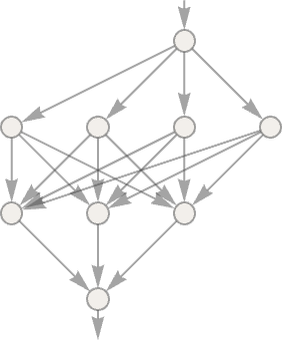

But what weights, etc. should we be using? With every possible set of weights the neural net will compute some function. And, for example, here’s what it does with a few randomly chosen sets of weights:  

但是我们应该使用什么重量等？对于每组可能的权重，神经网络将计算一些函数。并且，例如，这是它对一些随机选择的权重集所做的事情：

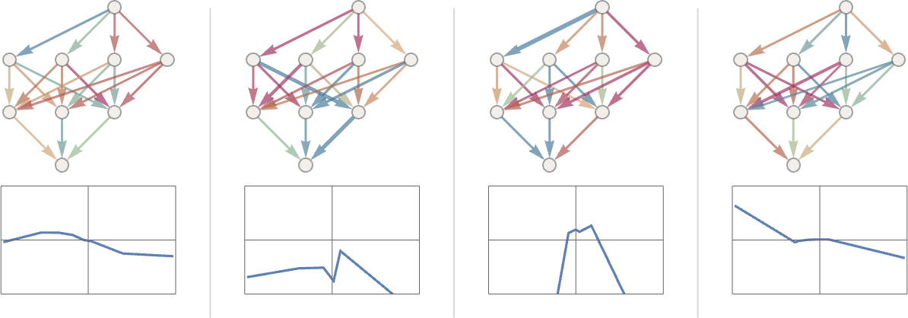

And, yes, we can plainly see that in none of these cases does it get even close to reproducing the function we want. So how do we find weights that will reproduce the function?  

而且，是的，我们可以清楚地看到，在这些情况下，它都没有接近再现我们想要的功能。那么我们如何找到能够重现该功能的权重呢？

The basic idea is to supply lots of “input → output” examples to “learn from”—and then to try to find weights that will reproduce these examples. Here’s the result of doing that with progressively more examples:  

基本思想是提供大量“输入→输出”示例以“学习”——然后尝试找到能够重现这些示例的权重。以下是使用越来越多的示例执行此操作的结果：

At each stage in this “training” the weights in the network are progressively adjusted—and we see that eventually we get a network that successfully reproduces the function we want. So how do we adjust the weights?  

在此“训练”的每个阶段，网络中的权重都会逐渐调整——我们看到最终我们得到了一个成功重现我们想要的功能的网络。那么我们如何调整权重呢？  

The basic idea is at each stage to see “how far away we are” from getting the function we want—and then to update the weights in such a way as to get closer.  

基本思想是在每个阶段查看“我们离获得我们想要的功能还有多远”——然后以更接近的方式更新权重。

To find out “how far away we are” we compute what’s usually called a “loss function” (or sometimes “cost function”). Here we’re using a simple (L2) loss function that’s just the sum of the squares of the differences between the values we get, and the true values.  

为了找出“我们有多远”，我们计算通常称为“损失函数”（或有时称为“成本函数”）的东西。这里我们使用一个简单的 (L2) 损失函数，它只是我们得到的值与真实值之间的差值的平方和。  

And what we see is that as our training process progresses, the loss function progressively decreases (following a certain “learning curve” that’s different for different tasks)—until we reach a point where the network (at least to a good approximation) successfully reproduces the function we want:  

我们看到的是，随着训练过程的进行，损失函数逐渐减小（遵循针对不同任务不同的特定“学习曲线”）——直到我们达到网络（至少是一个很好的近似值）成功重现的点我们想要的功能：

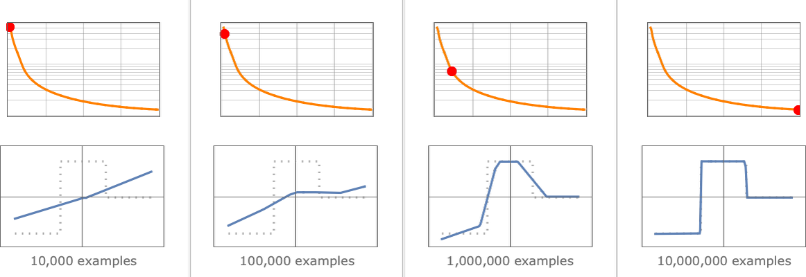

Alright, so the last essential piece to explain is how the weights are adjusted to reduce the loss function. As we’ve said, the loss function gives us a “distance” between the values we’ve got, and the true values.  

好了，最后要解释的重要部分是如何调整权重以减少损失函数。正如我们所说，损失函数为我们提供了所获得的值与真实值之间的“距离”。  

But the “values we’ve got” are determined at each stage by the current version of neural net—and by the weights in it. But now imagine that the weights are variables—say _wi_. We want to find out how to adjust the values of these variables to minimize the loss that depends on them.  

但是“我们得到的值”在每个阶段都由当前版本的神经网络及其中的权重决定。但现在假设权重是变量——比如 wi。我们想找出如何调整这些变量的值以最小化依赖于它们的损失。

For example, imagine (in an incredible simplification of typical neural nets used in practice) that we have just two weights _w_1 and _w_2. Then we might have a loss that as a function of _w_1 and _w_2 looks like this:  

例如，想象一下（在实践中使用的典型神经网络的令人难以置信的简化中）我们只有两个权重 w 1 和 w 2 。然后我们可能会损失 w 1 和 w 2 的函数，如下所示：

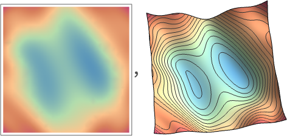

Numerical analysis provides a variety of techniques for finding the minimum in cases like this. But a typical approach is just to progressively follow the path of steepest descent from whatever previous _w_1, _w_2 we had:  

数值分析提供了多种技术来找到这种情况下的最小值。但是，一种典型的方法是从我们之前的 w 1 和 w 2 逐步遵循最陡下降的路径：

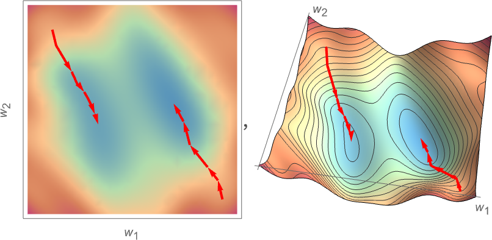

Like water flowing down a mountain, all that’s guaranteed is that this procedure will end up at some local minimum of the surface (“a mountain lake”); it might well not reach the ultimate global minimum.  

就像水流下山一样，唯一能保证的是这个过程最终会到达地表的某个局部最小值（“高山湖泊”）；它很可能达不到最终的全球最低限度。

It’s not obvious that it would be feasible to find the path of the steepest descent on the “weight landscape”. But calculus comes to the rescue.  

在“重量景观”上找到最陡下降的路径并不明显。但是微积分来拯救。  

As we mentioned above, one can always think of a neural net as computing a mathematical function—that depends on its inputs, and its weights. But now consider differentiating with respect to these weights.  

正如我们上面提到的，人们总是可以将神经网络视为计算一个数学函数——这取决于它的输入和它的权重。但现在考虑区分这些权重。  

It turns out that the chain rule of calculus in effect lets us “unravel” the operations done by successive layers in the neural net.  

事实证明，微积分的链式法则实际上让我们“解开”神经网络中连续层所做的操作。  

And the result is that we can—at least in some local approximation—“invert” the operation of the neural net, and progressively find weights that minimize the loss associated with the output.  

结果是我们可以——至少在某些局部近似中——“反转”神经网络的操作，并逐步找到使与输出相关的损失最小化的权重。

The picture above shows the kind of minimization we might need to do in the unrealistically simple case of just 2 weights. But it turns out that even with many more weights (_ChatGPT_ uses 175 billion) it’s still possible to do the minimization, at least to some level of approximation.  

上图显示了在只有 2 个权重的不切实际的简单情况下我们可能需要进行的最小化。但事实证明，即使有更多的权重（_ChatGPT_ 使用 1750 亿），仍然可以进行最小化，至少达到某种程度的近似。  

And in fact the big breakthrough in “deep learning” that occurred around 2011 was associated with the discovery that in some sense it can be easier to do (at least approximate) minimization when there are lots of weights involved than when there are fairly few.  

事实上，2011 年左右发生的“深度学习”的重大突破与以下发现有关，即在某种意义上，当涉及很多权重时比当涉及的权重很少时更容易进行（至少近似）最小化。

In other words—somewhat counterintuitively—it can be easier to solve more complicated problems with neural nets than simpler ones.  

换句话说——有点违反直觉——用神经网络解决更复杂的问题比解决更简单的问题更容易。  

And the rough reason for this seems to be that when one has a lot of “weight variables” one has a high-dimensional space with “lots of different directions” that can lead one to the minimum—whereas with fewer variables it’s easier to end up getting stuck in a local minimum (“mountain lake”) from which there’s no “direction to get out”.  

粗略的原因似乎是，当一个人有很多“权重变量”时，他就有一个高维空间，“有很多不同的方向”，可以将一个人引向最小值——而变量越少，就越容易结束陷入局部最低点（“高山湖泊”），没有“走出去的方向”。

It’s worth pointing out that in typical cases there are many different collections of weights that will all give neural nets that have pretty much the same performance.  

值得指出的是，在典型情况下，有许多不同的权重集合，它们都会给出具有几乎相同性能的神经网络。  

And usually in practical neural net training there are lots of random choices made—that lead to “different-but-equivalent solutions”, like these:  

通常在实际的神经网络训练中，会做出很多随机选择——这会导致“不同但等效的解决方案”，如下所示：

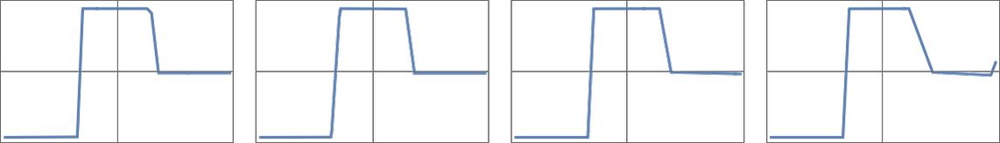

But each such “different solution” will have at least slightly different behavior. And if we ask, say, for an “extrapolation” outside the region where we gave training examples, we can get dramatically different results:  

但是每个这样的“不同的解决方案”都会有至少略微不同的行为。如果我们要求，比如说，在我们提供训练示例的区域之外进行“外推”，我们会得到截然不同的结果：

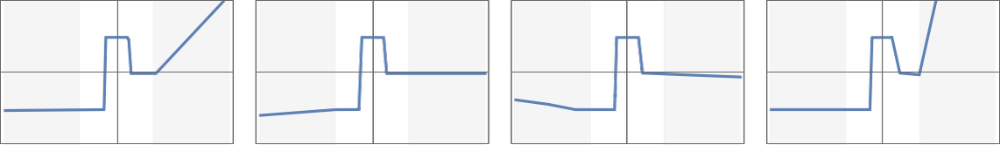

But which of these is “right”? There’s really no way to say. They’re all “consistent with the observed data”. But they all correspond to different “innate” ways to “think about” what to do “outside the box”. And some may seem “more reasonable” to us humans than others.  

但其中哪一个是“正确的”？实在是没法说。它们都“与观察到的数据一致”。但它们都对应于不同的“先天”方式来“思考”“跳出框框”做什么。有些对我们人类来说似乎比其他的“更合理”。

## The Practice and Lore of Neural Net Training  

神经网络训练的实践与知识

Particularly over the past decade, there’ve been many advances in the art of training neural nets. And, yes, it is basically an art. Sometimes—especially in retrospect—one can see at least a glimmer of a “scientific explanation” for something that’s being done.  

特别是在过去十年中，神经网络训练技术取得了许多进步。而且，是的，它基本上是一门艺术。有时——尤其是回想起来——人们至少可以对正在做的事情看到一丝“科学解释”。  

But mostly things have been discovered by trial and error, adding ideas and tricks that have progressively built a significant lore about how to work with neural nets.  

但大多数事情都是通过反复试验发现的，添加的想法和技巧逐渐建立了关于如何使用神经网络的重要知识。

There are several key parts. First, there’s the matter of what architecture of neural net one should use for a particular task. Then there’s the critical issue of how one’s going to get the data on which to train the neural net.  

有几个关键部分。首先，对于特定任务应该使用哪种神经网络架构的问题。然后是一个关键问题，即如何获取用于训练神经网络的数据。  

And increasingly one isn’t dealing with training a net from scratch: instead a new net can either directly incorporate another already-trained net, or at least can use that net to generate more training examples for itself.  

并且越来越多的人不再处理从头开始训练网络：相反，一个新网络可以直接合并另一个已经训练过的网络，或者至少可以使用该网络为自己生成更多训练示例。

One might have thought that for every particular kind of task one would need a different architecture of neural net. But what’s been found is that the same architecture often seems to work even for apparently quite different tasks. At some level this reminds one of the [idea of universal computation](https://www.wolframscience.com/nks/chap-11--the-notion-of-computation#sect-11-3--the-phenomenon-of-universality) (and my [Principle of Computational Equivalence](https://www.wolframscience.com/nks/chap-12--the-principle-of-computational-equivalence/)), but, as I’ll discuss later, I think it’s more a reflection of the fact that the tasks we’re typically trying to get neural nets to do are “human-like” ones—and neural nets can capture quite general “human-like processes”.  

人们可能认为，对于每一种特定类型的任务，都需要不同的神经网络架构。但我们发现，即使是表面上截然不同的任务，相同的架构似乎也常常适用。在某种程度上，这让人想起了通用计算的想法之一（以及我的计算等效性原理），但是，正如我稍后将讨论的那样，我认为这更多地反映了这样一个事实，即我们通常试图获得神经网络的任务要做的事情都是“类人”的——神经网络可以捕获相当普遍的“类人过程”。

In earlier days of neural nets, there tended to be the idea that one should “make the neural net do as little as possible”. For example, in [converting speech to text](https://reference.wolfram.com/language/ref/SpeechRecognize.html) it was thought that one should first analyze the audio of the speech, break it into phonemes, etc.  

在神经网络的早期，人们往往认为应该“让神经网络做的事情越少越好”。例如，在将语音转换为文本时，人们认为应该首先分析语音的音频，将其分解为音素等。  

But what was found is that—at least for “human-like tasks”—it’s usually better just to try to train the neural net on the “end-to-end problem”, letting it “discover” the necessary intermediate features, encodings, etc. for itself.  

但发现的是——至少对于“类人任务”——通常最好只尝试在“端到端问题”上训练神经网络，让它“发现”必要的中间特征、编码等。

There was also the idea that one should introduce complicated individual components into the neural net, to let it in effect “explicitly implement particular algorithmic ideas”.  

还有一种想法是，应该将复杂的单个组件引入神经网络，让它实际上“明确地实现特定的算法思想”。  

But once again, this has mostly turned out not to be worthwhile; instead, it’s better just to deal with very simple components and let them “organize themselves” (albeit usually in ways we can’t understand) to achieve (presumably) the equivalent of those algorithmic ideas.  

但是再一次，这大多是不值得的。相反，最好只处理非常简单的组件并让它们“自我组织”（尽管通常以我们无法理解的方式）以实现（大概）与那些算法思想等价的东西。

That’s not to say that there are no “structuring ideas” that are relevant for neural nets. Thus, for example, having [2D arrays of neurons with local connections](https://reference.wolfram.com/language/ref/ConvolutionLayer.html) seems at least very useful in the early stages of processing images. And having patterns of connectivity that concentrate on “looking back in sequences” seems useful—as we’ll see later—in dealing with things like human language, for example in _ChatGPT_.  

这并不是说不存在与神经网络相关的“结构化思想”。因此，例如，具有局部连接的二维神经元阵列似乎至少在处理图像的早期阶段非常有用。专注于“按顺序回顾”的连接模式似乎很有用——我们稍后会看到——在处理人类语言之类的事情时，例如在 _ChatGPT_ 中。

But an important feature of neural nets is that—like computers in general—they’re ultimately just dealing with data. And current neural nets—with current approaches to neural net training—[specifically deal with arrays of numbers](https://reference.wolfram.com/language/guide/NetEncoderDecoder.html). But in the course of processing, those arrays can be completely rearranged and reshaped. And as an example, [the network we used for identifying digits above](https://resources.wolframcloud.com/NeuralNetRepository/resources/LeNet-Trained-on-MNIST-Data/) starts with a 2D “image-like” array, quickly “thickening” to many channels, but then [“concentrating down” into a 1D array](https://reference.wolfram.com/language/ref/AggregationLayer.html) that will ultimately contain elements representing the different possible output digits:  

但神经网络的一个重要特征是——就像一般的计算机一样——它们最终只是处理数据。目前的神经网络——采用当前的神经网络训练方法——专门处理数字数组。但在处理过程中，这些阵列可以完全重新排列和重塑。举个例子，我们上面用来识别数字的网络从一个二维“类图像”数组开始，迅速“加厚”到许多通道，然后“向下集中”成一个一维数组，最终包含代表不同数字的元素可能的输出数字：

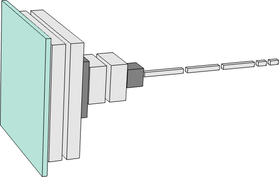

But, OK, how can one tell how big a neural net one will need for a particular task? It’s something of an art. At some level the key thing is to know “how hard the task is”. But for human-like tasks that’s typically very hard to estimate.  

但是，好吧，如何判断完成一项特定任务需要多大的神经网络？这是一门艺术。在某种程度上，关键是要知道“任务有多难”。但是对于通常很难估计的类似人类的任务。  

Yes, there may be a systematic way to do the task very “mechanically” by computer. But it’s hard to know if there are what one might think of as tricks or shortcuts that allow one to do the task at least at a “human-like level” vastly more easily. It might take [enumerating a giant game tree](https://writings.stephenwolfram.com/2022/06/games-and-puzzles-as-multicomputational-systems/) to “mechanically” play a certain game; but there might be a much easier (“heuristic”) way to achieve “human-level play”.  

是的，可能有一种系统的方法可以通过计算机非常“机械地”完成任务。但很难知道是否存在人们可能认为的技巧或捷径，可以让人们至少在“类人水平”上更容易地完成任务。可能需要枚举一个巨大的游戏树才能“机械地”玩某个游戏；但可能有一种更容易（“启发式”）的方式来实现“人类水平的游戏”。

When one’s dealing with tiny neural nets and simple tasks one can sometimes explicitly see that one “can’t get there from here”. For example, here’s the best one seems to be able to do on the task from the previous section with a few small neural nets:  

当一个人处理微小的神经网络和简单的任务时，有时可以明确地看到一个人“无法从这里到达那里”。例如，对于上一节中的任务，使用几个小型神经网络似乎可以做到最好：

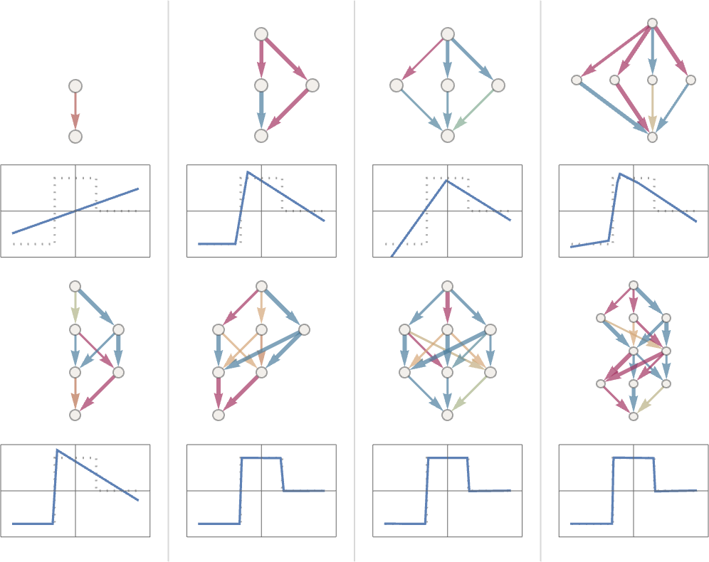

And what we see is that if the net is too small, it just can’t reproduce the function we want. But above some size, it has no problem—at least if one trains it for long enough, with enough examples.  

而我们看到的是，如果网络太小，它就无法重现我们想要的功能。但超过一定规模，它没有问题——至少如果一个人训练它足够长的时间，有足够的例子。  

And, by the way, these pictures illustrate a piece of neural net lore: that one can often get away with a smaller network if there’s a “squeeze” in the middle that forces everything to go through a smaller intermediate number of neurons.  

顺便说一句，这些图片说明了一个神经网络知识：如果中间有一个“挤压”迫使一切都通过较小的中间神经元数量，那么人们通常可以用较小的网络逃脱。  

(It’s also worth mentioning that “no-intermediate-layer”—or so-called “[perceptron](https://en.wikipedia.org/wiki/Perceptron)”—networks can only learn essentially linear functions—but as soon as there’s even one intermediate layer it’s [always in principle possible](https://en.wikipedia.org/wiki/Universal_approximation_theorem) to approximate any function arbitrarily well, at least if one has enough neurons, though to make it feasibly trainable one typically has some kind of [regularization or normalization](https://reference.wolfram.com/language/ref/BatchNormalizationLayer.html).)  

（还值得一提的是，“无中间层”——或所谓的“感知器”——网络只能学习本质上的线性函数——但只要有一个中间层，原则上总是可以任意很好地逼近任何函数，至少如果一个人有足够多的神经元，尽管为了使其易于训练，通常会有某种正则化或归一化。）

OK, so let’s say one’s settled on a certain neural net architecture. Now there’s the issue of getting data to train the network with.  

好吧，假设一个人已经确定了某种神经网络架构。现在有获取数据来训练网络的问题。  

And many of the practical challenges around neural nets—and machine learning in general—center on acquiring or preparing the necessary training data. In many cases (“supervised learning”) one wants to get explicit examples of inputs and the outputs one is expecting from them.  

围绕神经网络和一般机器学习的许多实际挑战都集中在获取或准备必要的训练数据上。在许多情况下（“监督学习”），人们希望获得明确的输入示例和期望的输出示例。  

Thus, for example, one might want images tagged by what’s in them, or some other attribute. And maybe one will have to explicitly go through—usually with great effort—and do the tagging.  

因此，例如，人们可能想要用图像中的内容或其他一些属性来标记图像。也许人们必须明确地通过——通常需要付出巨大的努力——并进行标记。  

But very often it turns out to be possible to piggyback on something that’s already been done, or use it as some kind of proxy. And so, for example, one might use alt tags that have been provided for images on the web.  

但事实证明，通常可以利用已经完成的事情，或将其用作某种代理。因此，例如，人们可能会使用为网络上的图像提供的 alt 标签。  

Or, in a different domain, one might use closed captions that have been created for videos. Or—for language translation training—one might use parallel versions of webpages or other documents that exist in different languages.  

或者，在不同的域中，人们可能会使用为视频创建的隐藏式字幕。或者——对于语言翻译培训——人们可能会使用平行版本的网页或其他以不同语言存在的文档。

How much data do you need to show a neural net to train it for a particular task? Again, it’s hard to estimate from first principles.  

您需要多少数据才能显示神经网络以针对特定任务对其进行训练？同样，很难根据第一性原理进行估计。  

Certainly the requirements can be dramatically reduced by using “transfer learning” to “transfer in” things like lists of important features that have already been learned in another network. But generally neural nets need to “see a lot of examples” to train well.  

当然，通过使用“迁移学习”来“迁移”诸如已经在另一个网络中学习的重要特征列表之类的东西，可以显着降低要求。但一般来说，神经网络需要“看很多例子”才能训练好。  

And at least for some tasks it’s an important piece of neural net lore that the examples can be incredibly repetitive. And indeed it’s a standard strategy to just show a neural net all the examples one has, over and over again.  

至少对于某些任务来说，这是神经网络知识的一个重要部分，即这些示例可以难以置信地重复。事实上，一遍又一遍地向神经网络展示所有示例是一种标准策略。  

In each of these “training rounds” (or “epochs”) the neural net will be in at least a slightly different state, and somehow “reminding it” of a particular example is useful in getting it to “remember that example”.  

在每一轮“训练轮”（或“轮次”）中，神经网络至少会处于略有不同的状态，并且以某种方式“提醒它”一个特定的例子有助于让它“记住那个例子”。  

(And, yes, perhaps this is analogous to the usefulness of repetition in human memorization.)  

（而且，是的，也许这类似于人类记忆中重复的用处。）

But often just repeating the same example over and over again isn’t enough. It’s also necessary to show the neural net variations of the example. And it’s a feature of neural net lore that those “data augmentation” variations don’t have to be sophisticated to be useful.  

但通常只是一遍又一遍地重复同一个例子是不够的。还需要显示示例的神经网络变体。神经网络知识的一个特点是，这些“数据增强”变体不必复杂到有用。  

Just slightly modifying images with basic image processing can make them essentially “as good as new” for neural net training. And, similarly, when one’s run out of actual video, etc.  

只需使用基本图像处理对图像进行轻微修改，就可以使它们在神经网络训练中基本上“像新的一样好”。而且，类似地，当一个人的实际视频用完时，等等。  

for training self-driving cars, one can go on and just get data from running simulations in a model videogame-like environment without all the detail of actual real-world scenes.  

对于训练自动驾驶汽车，人们可以继续在类似视频游戏的模型环境中运行模拟并获取数据，而无需了解真实世界场景的所有细节。

How about something like _ChatGPT_? Well, it has the nice feature that it can do “unsupervised learning”, making it much easier to get it examples to train from. Recall that the basic task for _ChatGPT_ is to figure out how to continue a piece of text that it’s been given.  

像 _ChatGPT_ 这样的东西怎么样？嗯，它有一个很好的特性，它可以进行“无监督学习”，这使得它更容易获得训练的例子。回想一下，_ChatGPT_ 的基本任务是找出如何继续给定的一段文本。  

So to get it “training examples” all one has to do is get a piece of text, and mask out the end of it, and then use this as the “input to train from”—with the “output” being the complete, unmasked piece of text.  

因此，要获得它的“训练示例”，您所要做的就是获取一段文本，屏蔽掉它的结尾，然后将其用作“训练的输入”——“输出”是完整的，未屏蔽的一段文字。  

We’ll discuss this more later, but the main point is that—unlike, say, for learning what’s in images—there’s no “explicit tagging” needed; _ChatGPT_ can in effect just learn directly from whatever examples of text it’s given.  

我们稍后会对此进行更多讨论，但重点是——与学习图像中的内容不同——不需要“显式标记”； _ChatGPT_ 实际上可以直接从给定的任何文本示例中学习。

OK, so what about the actual learning process in a neural net? In the end it’s all about determining what weights will best capture the training examples that have been given.  

好的，那么神经网络中的实际学习过程又如何呢？最后，这一切都是为了确定什么权重最能捕捉到已经给出的训练示例。  

And there are all sorts of detailed choices and “hyperparameter settings” (so called because the weights can be thought of as “parameters”) that can be used to tweak how this is done. There are different [choices of loss function](https://reference.wolfram.com/language/ref/CrossEntropyLossLayer.html) (sum of squares, sum of absolute values, etc.). There are different ways to do loss minimization (how far in weight space to move at each step, etc.).  

并且有各种详细的选择和“超参数设置”（之所以这样称呼是因为权重可以被认为是“参数”）可以用来调整这是如何完成的。损失函数有不同的选择（平方和、绝对值和等）。有不同的方法可以进行损失最小化（每一步在权重空间中移动多远等）。  

And then there are questions like how big a “batch” of examples to show to get each successive estimate of the loss one’s trying to minimize.  

然后还有一些问题，例如要显示多少“批次”示例才能获得对试图最小化的损失的每个连续估计。  

And, yes, one can apply machine learning (as we do, for example, in Wolfram Language) to automate machine learning—and to automatically set things like hyperparameters.  

而且，是的，人们可以应用机器学习（就像我们在 Wolfram 语言中所做的那样）来自动化机器学习——并自动设置诸如超参数之类的东西。

But in the end the whole process of training can be characterized by seeing how the loss progressively decreases (as in this [Wolfram Language progress monitor for a small training](https://reference.wolfram.com/language/ref/NetTrain.html)):  

但最后整个训练过程可以通过观察损失如何逐渐减少来表征（如在这个 Wolfram 语言的小型训练进度监视器中）：

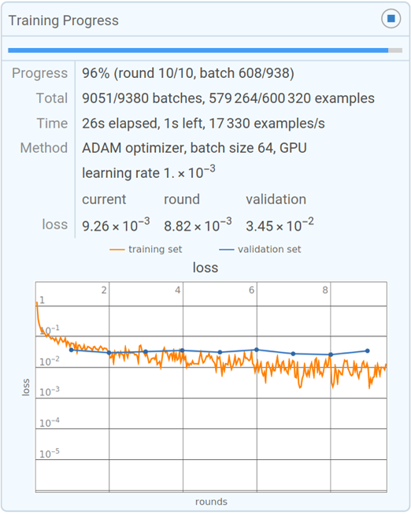

And what one typically sees is that the loss decreases for a while, but eventually flattens out at some constant value.  

人们通常看到的是损失会减少一段时间，但最终会趋于稳定在某个恒定值。  

If that value is sufficiently small, then the training can be considered successful; otherwise it’s probably a sign one should try changing the network architecture.  

如果该值足够小，则可以认为训练成功；否则，这可能是一个应该尝试更改网络架构的标志。

Can one tell how long it should take for the “learning curve” to flatten out? Like for so many other things, there seem to be approximate [power-law scaling relationships](https://arxiv.org/pdf/2001.08361.pdf) that depend on the size of neural net and amount of data one’s using. But the general conclusion is that training a neural net is hard—and takes a lot of computational effort.  

有人能说出“学习曲线”变平需要多长时间吗？与许多其他事物一样，似乎存在近似的幂律比例关系，这取决于神经网络的大小和一个人使用的数据量。但一般的结论是训练神经网络很困难——并且需要大量的计算工作。  

And as a practical matter, the vast majority of that effort is spent doing operations on arrays of numbers, which is what GPUs are good at—which is why neural net training is typically limited by the availability of GPUs.  

实际上，绝大多数工作都花在了对数字数组的操作上，这是 GPU 擅长的——这就是为什么神经网络训练通常受到 GPU 可用性的限制。

In the future, will there be fundamentally better ways to train neural nets—or generally do what neural nets do? Almost certainly, I think.  

在未来，是否会有根本上更好的方法来训练神经网络——或者通常做神经网络所做的事情？几乎可以肯定，我想。  

The fundamental idea of neural nets is to create a flexible “computing fabric” out of a large number of simple (essentially identical) components—and to have this “fabric” be one that can be incrementally modified to learn from examples.  

神经网络的基本思想是从大量简单（本质上相同）的组件中创建一个灵活的“计算结构”，并使这种“结构”成为可以逐步修改以从示例中学习的结构。  

In current neural nets, one’s essentially using the ideas of calculus—applied to real numbers—to do that incremental modification. But it’s increasingly clear that having high-precision numbers doesn’t matter; 8 bits or less might be enough even with current methods.  

在当前的神经网络中，人们基本上是在使用微积分的思想——应用于实数——来进行增量修改。但越来越清楚的是，拥有高精度数字并不重要；即使使用当前方法，8 位或更少可能就足够了。

With [computational systems like cellular automata](https://www.wolframscience.com/nks/chap-2--the-crucial-experiment#sect-2-1--how-do-simple-programs-behave) that basically operate in parallel on many individual bits it’s never been clear [how to do this kind of incremental modification](https://content.wolfram.com/uploads/sites/34/2020/07/approaches-complexity-engineering.pdf), but there’s no reason to think it isn’t possible. And in fact, much like with the “[deep-learning breakthrough of 2012](https://en.wikipedia.org/wiki/AlexNet)” it may be that such incremental modification will effectively be easier in more complicated cases than in simple ones.  

对于像元胞自动机这样的计算系统，基本上是在许多单独的位上并行操作，一直不清楚如何进行这种增量修改，但没有理由认为这是不可能的。事实上，就像“2012 年的深度学习突破”一样，这种增量修改在更复杂的案例中可能比在简单案例中更容易。

Neural nets—perhaps a bit like brains—are set up to have an essentially fixed network of neurons, with what’s modified being the strength (“weight”) of connections between them. (Perhaps in at least young brains significant numbers of wholly new connections can also grow.  

神经网络——也许有点像大脑——被设置为具有基本固定的神经元网络，修改的是它们之间连接的强度（“权重”）。 （也许至少在年轻的大脑中，大量全新的联系也会增长。  

) But while this might be a convenient setup for biology, it’s not at all clear that it’s even close to the best way to achieve the functionality we need. And something that involves the equivalent of progressive network rewriting (perhaps reminiscent of our [Physics Project](https://www.wolframphysics.org/)) might well ultimately be better.  

) 但是，虽然这对于生物学来说可能是一个方便的设置，但它是否接近实现我们所需功能的最佳方式还不清楚。一些涉及渐进式网络重写的东西（可能让人想起我们的物理项目）最终可能会更好。

But even within the framework of existing neural nets there’s currently a crucial limitation: neural net training as it’s now done is fundamentally sequential, with the effects of each batch of examples being propagated back to update the weights.  

但即使在现有神经网络的框架内，目前也存在一个关键限制：现在进行的神经网络训练基本上是顺序的，每批示例的效果都会被传播回来更新权重。  

And indeed with current computer hardware—even taking into account GPUs—most of a neural net is “idle” most of the time during training, with just one part at a time being updated.  

事实上，对于当前的计算机硬件——即使考虑到 GPU——大多数神经网络在训练期间的大部分时间都是“空闲”的，一次只更新一个部分。  

And in a sense this is because our current computers tend to have memory that is separate from their CPUs (or GPUs). But in brains it’s presumably different—with every “memory element” (i.e. neuron) also being a potentially active computational element.  

从某种意义上说，这是因为我们当前的计算机往往具有与其 CPU（或 GPU）分离的内存。但在大脑中，它可能是不同的——每个“记忆元素”（即神经元）也是一个潜在的活跃计算元素。  

And if we could set up our future computer hardware this way it might become possible to do training much more efficiently.  

如果我们能够以这种方式设置我们未来的计算机硬件，则可能会更有效地进行培训。

## “Surely a Network That’s Big Enough Can Do Anything!”  

“当然，一个足够大的网络可以做任何事情！”

The capabilities of something like _ChatGPT_ seem so impressive that one might imagine that if one could just “keep going” and train larger and larger neural networks, then they’d eventually be able to “do everything”.  

_ChatGPT_ 之类的功能似乎令人印象深刻，以至于人们可能会想象，如果可以“继续”并训练越来越大的神经网络，那么它们最终将能够“无所不能”。  

And if one’s concerned with things that are readily accessible to immediate human thinking, it’s quite possible that this is the case.  

如果一个人关心的是人类可以直接思考的事物，那么情况很可能就是这样。  

But the lesson of the past several hundred years of science is that there are things that can be figured out by formal processes, but aren’t readily accessible to immediate human thinking.  

但过去数百年的科学经验告诉我们，有些事情可以通过形式化的过程来解决，但人类的直接思维却不容易理解。

Nontrivial mathematics is one big example. But the general case is really computation. And ultimately the issue is the phenomenon of [computational irreducibility](https://www.wolframscience.com/nks/chap-12--the-principle-of-computational-equivalence#sect-12-6--computational-irreducibility). There are some computations which one might think would take many steps to do, but which can in fact be “reduced” to something quite immediate. But the discovery of computational irreducibility implies that this doesn’t always work.  

非平凡的数学就是一个重要的例子。但一般情况确实是计算。最终的问题是计算不可约现象。有些计算人们可能认为需要很多步骤才能完成，但实际上可以“简化”为非常直接的事情。但是计算不可约性的发现意味着这并不总是有效。  

And instead there are processes—probably like the one below—where to work out what happens inevitably requires essentially tracing each computational step:  

取而代之的是一些过程——可能像下面的过程——计算出不可避免地发生的事情需要基本上跟踪每个计算步骤：

The kinds of things that we normally do with our brains are presumably specifically chosen to avoid computational irreducibility. It takes special effort to do math in one’s brain.  

我们通常用大脑做的事情大概是专门选择来避免计算不可约性的。在一个人的大脑中做数学需要特别的努力。  

And it’s in practice largely impossible to “think through” the steps in the operation of any nontrivial program just in one’s brain.  

在实践中，仅仅在大脑中“思考”任何重要程序的操作步骤基本上是不可能的。

But of course for that we have computers. And with computers we can readily do long, computationally irreducible things. And the key point is that there’s in general no shortcut for these.  

但当然为此我们有电脑。有了计算机，我们可以很容易地做长时间的、计算上不可简化的事情。关键是这些通常没有捷径。

Yes, we could memorize lots of specific examples of what happens in some particular computational system. And maybe we could even see some (“computationally reducible”) patterns that would allow us to do a little generalization.  

是的，我们可以记住许多特定的计算系统中发生的具体例子。也许我们甚至可以看到一些（“计算上可简化的”）模式，这些模式可以让我们进行一些概括。  

But the point is that computational irreducibility means that we can never guarantee that the unexpected won’t happen—and it’s only by explicitly doing the computation that you can tell what actually happens in any particular case.  

但要点是，计算不可约性意味着我们永远无法保证不会发生意想不到的事情——只有通过明确地进行计算，您才能知道在任何特定情况下实际发生了什么。

And in the end there’s just a fundamental tension between learnability and computational irreducibility. Learning involves in effect [compressing data by leveraging regularities](https://www.wolframscience.com/nks/chap-10--processes-of-perception-and-analysis/). But computational irreducibility implies that ultimately there’s a limit to what regularities there may be.  

最后，可学习性和计算不可约性之间存在根本的紧张关系。学习实际上涉及通过利用规律性来压缩数据。但计算不可约性意味着最终可能存在的规律性是有限的。

As a practical matter, one can imagine building little computational devices—like cellular automata or Turing machines—into trainable systems like neural nets. And indeed such devices can serve as good “tools” for the neural net—like [Wolfram|Alpha can be a good tool for _ChatGPT_](https://writings.stephenwolfram.com/2023/01/wolframalpha-as-the-way-to-bring-computational-knowledge-superpowers-to-chatgpt/). But computational irreducibility implies that one can’t expect to “get inside” those devices and have them learn.  

实际上，人们可以想象将元胞自动机或图灵机等小型计算设备构建到神经网络等可训练系统中。事实上，此类设备可以作为神经网络的良好“工具”——例如 Wolfram|Alpha 可以成为 _ChatGPT_ 的良好工具。但计算不可约性意味着人们不能指望“进入”这些设备并让它们学习。

Or put another way, there’s an ultimate tradeoff between capability and trainability: the more you want a system to make “true use” of its computational capabilities, the more it’s going to show computational irreducibility, and the less it’s going to be trainable.  

或者换句话说，能力和可训练性之间存在最终权衡：你越希望系统“真正利用”其计算能力，它就越会表现出计算不可约性，而可训练性就越低。  

And the more it’s fundamentally trainable, the less it’s going to be able to do sophisticated computation.  

而且它从根本上可训练的越多，它进行复杂计算的能力就越小。

(For _ChatGPT_ as it currently is, the situation is actually much more extreme, because the neural net used to generate each token of output is a pure “feed-forward” network, without loops, and therefore has no ability to do any kind of computation with nontrivial “control flow”.)  

（对于目前的_ChatGPT_，情况其实要极端得多，因为用来生成输出的每个token的神经网络是一个纯粹的“前馈”网络，没有循环，因此没有能力做任何类型的使用非平凡的“控制流”进行计算。）

Of course, one might wonder whether it’s actually important to be able to do irreducible computations. And indeed for much of human history it wasn’t particularly important.  

当然，有人可能想知道能够进行不可约计算是否真的很重要。事实上，在人类历史的大部分时间里，它并不是特别重要。  

But our modern technological world has been built on engineering that makes use of at least mathematical computations—and increasingly also more general computations. And if we look at the natural world, it’s [full of irreducible computation](https://www.wolframscience.com/nks/chap-8--implications-for-everyday-systems/)—that we’re slowly understanding how to emulate and use for our technological purposes.  

但是我们的现代技术世界是建立在至少使用数学计算的工程之上的——而且越来越多地使用更通用的计算。如果我们看看自然界，它充满了不可简化的计算——我们正在慢慢理解如何模拟和使用我们的技术目的。

Yes, a neural net can certainly notice the kinds of regularities in the natural world that we might also readily notice with “unaided human thinking”.  

是的，神经网络当然可以注意到自然界中的各种规律性，我们也可以通过“独立的人类思维”轻松地注意到这些规律性。  

But if we want to work out things that are in the purview of mathematical or computational science the neural net isn’t going to be able to do it—unless it effectively “uses as a tool” an “ordinary” computational system.  

但是，如果我们想解决数学或计算科学范围内的问题，神经网络将无法做到——除非它有效地“将”“普通”计算系统“用作工具”。

But there’s something potentially confusing about all of this. In the past there were plenty of tasks—including writing essays—that we’ve assumed were somehow “fundamentally too hard” for computers. And now that we see them done by the likes of _ChatGPT_ we tend to suddenly think that computers must have become vastly more powerful—in particular surpassing things they were already basically able to do (like progressively computing the behavior of computational systems like cellular automata).  

但所有这一切都可能令人困惑。过去有很多任务——包括写论文——我们认为对计算机来说“从根本上来说太难了”。现在我们看到它们是由 _ChatGPT_ 之类的公司完成的，我们倾向于突然认为计算机一定变得更加强大——特别是超越了它们基本上已经能够做到的事情（比如逐步计算像元胞自动机这样的计算系统的行为） .

But this isn’t the right conclusion to draw. Computationally irreducible processes are still computationally irreducible, and are still fundamentally hard for computers—even if computers can readily compute their individual steps.  

但这不是得出正确的结论。计算上不可约的过程仍然是计算上不可约的，并且从根本上说对计算机来说仍然是困难的——即使计算机可以很容易地计算出它们的各个步骤。  

And instead what we should conclude is that tasks—like writing essays—that we humans could do, but we didn’t think computers could do, are actually in some sense computationally easier than we thought.  

相反，我们应该得出的结论是，我们人类可以完成但我们认为计算机无法完成的任务——比如写论文——实际上在某种意义上在计算上比我们想象的要容易。

In other words, the reason a neural net can be successful in writing an essay is because writing an essay turns out to be a “computationally shallower” problem than we thought.  

换句话说，神经网络之所以能够成功地写一篇论文，是因为写一篇论文被证明是一个比我们想象的“计算更浅”的问题。  

And in a sense this takes us closer to “having a theory” of how we humans manage to do things like writing essays, or in general deal with language.  

从某种意义上说，这使我们更接近“拥有一种理论”，即我们人类如何设法完成诸如撰写论文或一般处理语言之类的事情。

If you had a big enough neural net then, yes, you might be able to do whatever humans can readily do. But you wouldn’t capture what the natural world in general can do—or that the tools that we’ve fashioned from the natural world can do.  

如果你有一个足够大的神经网络，那么，是的，你可以做任何人类容易做的事情。但是你不会捕捉到自然界一般可以做什么——或者我们从自然界中创造出来的工具可以做什么。  

And it’s the use of those tools—both practical and conceptual—that have allowed us in recent centuries to transcend the boundaries of what’s accessible to “pure unaided human thought”, and capture for human purposes more of what’s out there in the physical and computational universe.  

正是这些工具——包括实用工具和概念工具——的使用让我们在最近几个世纪超越了“纯粹的独立人类思想”所能达到的界限，并为人类目的捕捉更多物理和计算领域的东西宇宙。

## The Concept of Embeddings  

嵌入的概念

Neural nets—at least as they’re currently set up—are fundamentally based on numbers. So if we’re going to to use them to work on something like text we’ll need a way to [represent our text with numbers](https://reference.wolfram.com/language/guide/NetEncoderDecoder.html). And certainly we could start (essentially as _ChatGPT_ does) by just assigning a number to every word in the dictionary. But there’s an important idea—that’s for example central to _ChatGPT_—that goes beyond that. And it’s the idea of “embeddings”. One can think of an embedding as a way to try to represent the “essence” of something by an array of numbers—with the property that “nearby things” are represented by nearby numbers.  

神经网络——至少目前是这样——基本上是基于数字的。因此，如果我们要使用它们来处理文本之类的东西，我们将需要一种方法来用数字表示我们的文本。当然，我们可以通过为字典中的每个单词分配一个数字来开始（基本上就像 _ChatGPT_ 所做的那样）。但有一个重要的想法——例如 _ChatGPT_ 的核心——超出了这一范围。这就是“嵌入”的概念。人们可以将嵌入视为一种尝试用数字数组表示某事物的“本质”的方法——具有“附近的事物”由附近的数字表示的属性。

And so, for example, we can think of a word embedding as trying to [lay out words in a kind of “meaning space”](https://reference.wolfram.com/language/ref/FeatureSpacePlot.html) in which words that are somehow “nearby in meaning” appear nearby in the embedding. The actual embeddings that are used—say in _ChatGPT_—tend to involve large lists of numbers. But if we project down to 2D, we can show examples of how words are laid out by the embedding:  

因此，例如，我们可以将词嵌入视为试图在一种“意义空间”中布置词，其中以某种方式“意义接近”的词出现在嵌入的附近。实际使用的嵌入——比如在 _ChatGPT_ 中——往往涉及大量数字列表。但是如果我们向下投影到 2D，我们可以展示嵌入如何布置单词的示例：

And, yes, what we see does remarkably well in capturing typical everyday impressions. But how can we construct such an embedding?  

而且，是的，我们所看到的在捕捉典型的日常印象方面做得非常好。但是我们如何构建这样的嵌入呢？  

Roughly the idea is to look at large amounts of text (here 5 billion words from the web) and then see “how similar” the “environments” are in which different words appear.  

大致的想法是查看大量文本（这里有 50 亿个单词来自网络），然后查看不同单词出现的“环境”“有多相似”。  

So, for example, “alligator” and “crocodile” will often appear almost interchangeably in otherwise similar sentences, and that means they’ll be placed nearby in the embedding.  

因此，例如，“鳄鱼”和“鳄鱼”通常会在其他相似的句子中几乎互换出现，这意味着它们将被放置在嵌入的附近。  

But “turnip” and “eagle” won’t tend to appear in otherwise similar sentences, so they’ll be placed far apart in the embedding.  

但是“turnip”和“eagle”不会倾向于出现在其他相似的句子中，因此它们在嵌入中会相距很远。

But how does one actually implement something like this using neural nets? Let’s start by talking about embeddings not for words, but for images.  

但是如何使用神经网络实际实现这样的东西呢？让我们先谈谈嵌入，而不是文字嵌入，而是图像嵌入。  

We want to find some way to characterize images by lists of numbers in such a way that “images we consider similar” are assigned similar lists of numbers.  

我们想找到一些方法来通过数字列表来表征图像，以便为“我们认为相似的图像”分配相似的数字列表。

How do we tell if we should “consider images similar”? Well, if our images are, say, of handwritten digits we might “consider two images similar” if they are of the same digit. Earlier we discussed a neural net that was trained to recognize handwritten digits.  

我们如何判断我们是否应该“考虑图像相似”？好吧，如果我们的图像是手写数字，如果它们是相同的数字，我们可能会“认为两个图像相似”。之前我们讨论了一个经过训练可以识别手写数字的神经网络。  

And we can think of this neural net as being set up so that in its final output it puts images into 10 different bins, one for each digit.  

我们可以认为这个神经网络被设置为在其最终输出中将图像放入 10 个不同的容器中，每个数字一个。

But what if we “intercept” what’s going on inside the neural net before the final “it’s a ‘4’” decision is made? We might expect that inside the neural net there are numbers that characterize images as being “mostly 4-like but a bit 2-like” or some such.  

但是，如果我们在做出最终“它是‘4’”决定之前“拦截”神经网络内部正在发生的事情呢？我们可能期望在神经网络内部有一些数字将图像描述为“大部分像 4，但有点像 2”或类似的东西。  

And the idea is to pick up such numbers to use as elements in an embedding.  

这个想法是选择这些数字作为嵌入中的元素。

So here’s the concept.  

这就是概念。  

Rather than directly trying to characterize “what image is near what other image”, we instead consider a well-defined task (in this case digit recognition) for which we can get explicit training data—then use the fact that in doing this task the neural net implicitly has to make what amount to “nearness decisions”.  

我们不是直接尝试描述“什么图像靠近什么其他图像”，而是考虑一个明确定义的任务（在本例中为数字识别），我们可以获得明确的训练数据——然后使用这样一个事实，即在执行此任务时神经网络隐含地必须做出相当于“接近度决定”的事情。  

So instead of us ever explicitly having to talk about “nearness of images” we’re just talking about the concrete question of what digit an image represents, and then we’re “leaving it to the neural net” to implicitly determine what that implies about “nearness of images”.  

因此，我们不必明确地谈论“图像的接近性”，我们只是在谈论图像代表什么数字的具体问题，然后我们“将其留给神经网络”来隐含地确定这意味着什么关于“图像的接近度”。

So how in more detail does this work for the digit recognition network? We can think of the network as consisting of 11 successive layers, that we might summarize iconically like this (with activation functions shown as separate layers):  

那么这对数字识别网络有何更详细的作用呢？我们可以认为网络由 11 个连续的层组成，我们可以像这样总结一下（激活函数显示为单独的层）：

At the beginning we’re feeding into the first layer actual images, represented by 2D arrays of pixel values.  

一开始我们将实际图像输入第一层，由像素值的二维数组表示。  

And at the end—from the last layer—we’re getting out an array of 10 values, which we can think of saying “how certain” the network is that the image corresponds to each of the digits 0 through 9.  

最后——从最后一层——我们得到了一个包含 10 个值的数组，我们可以认为这是在说网络“有多确定”图像对应于 0 到 9 的每个数字。

Feed in the image and the values of the neurons in that last layer are:  

输入图像  ，最后一层神经元的值是：

In other words, the neural net is by this point “incredibly certain” that this image is a 4—and to actually get the output “4” we just have to pick out the position of the neuron with the largest value.  

换句话说，神经网络在这一点上“非常确定”该图像是 4——并且要实际获得输出“4”，我们只需选择具有最大值的神经元的位置。

But what if we look one step earlier? The very last operation in the network is a so-called [softmax](https://reference.wolfram.com/language/ref/SoftmaxLayer.html) which tries to “force certainty”. But before that’s been applied the values of the neurons are:  

但是，如果我们早一步看呢？网络中的最后一个操作是所谓的 softmax，它试图“强制确定性”。但在此之前，神经元的值是：

The neuron representing “4” still has the highest numerical value. But there’s also information in the values of the other neurons.  

代表“4”的神经元仍然具有最高的数值。但是其他神经元的值中也有信息。  

And we can expect that this list of numbers can in a sense be used to characterize the “essence” of the image—and thus to provide something we can use as an embedding.  

我们可以期望这个数字列表在某种意义上可以用来表征图像的“本质”——从而提供一些我们可以用作嵌入的东西。  

And so, for example, each of the 4’s here has a slightly different “signature” (or “feature embedding”)—all very different from the 8’s:  

因此，例如，这里的每个 4 都有一个略微不同的“签名”（或“特征嵌入”）——都与 8 非常不同：

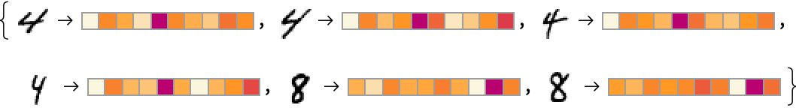

Here we’re essentially using 10 numbers to characterize our images. But it’s often better to use much more than that. And for example in our digit recognition network we can get an array of 500 numbers by tapping into the preceding layer.  

在这里，我们基本上使用 10 个数字来表征我们的图像。但通常使用更多会更好。例如，在我们的数字识别网络中，我们可以通过进入前一层来获得一个包含 500 个数字的数组。  

And this is probably a reasonable array to use as an “image embedding”.  

这可能是一个用作“图像嵌入”的合理数组。

If we want to make an explicit visualization of “image space” for handwritten digits we need to “reduce the dimension”, effectively by projecting the 500-dimensional vector we’ve got into, say, 3D space:  

如果我们想对手写数字的“图像空间”进行显式可视化，我们需要“降维”，有效地将我们进入的 500 维向量投影到 3D 空间中：

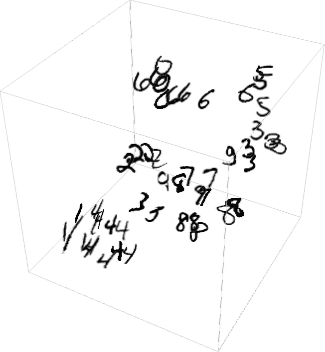

We’ve just talked about creating a characterization (and thus embedding) for images based effectively on identifying the similarity of images by determining whether (according to our training set) they correspond to the same handwritten digit.  

我们刚刚讨论了通过确定（根据我们的训练集）它们是否对应于相同的手写数字来有效地识别图像的相似性来为图像创建特征（并因此嵌入）。  

And we can do the same thing much more generally for images if we have a training set that identifies, say, which of 5000 common types of object (cat, dog, chair, …) each image is of.  

如果我们有一个训练集可以识别每张图像属于 5000 种常见对象（猫、狗、椅子等）中的哪一种，我们就可以对图像做更普遍的事情。  

And in this way we can make an image embedding that’s “anchored” by our identification of common objects, but then “generalizes around that” according to the behavior of the neural net.  

通过这种方式，我们可以通过我们对常见对象的识别来“锚定”图像嵌入，然后根据神经网络的行为“围绕它进行概括”。  

And the point is that insofar as that behavior aligns with how we humans perceive and interpret images, this will end up being an embedding that “seems right to us”, and is useful in practice in doing “human-judgement-like” tasks.  

关键是，只要这种行为与我们人类感知和解释图像的方式一致，这最终将成为一种“对我们来说似乎正确”的嵌入，并且在实践中有助于执行“类似人类判断”的任务。

OK, so how do we follow the same kind of approach to find embeddings for words? The key is to start from a task about words for which we can readily do training. And the standard such task is “word prediction”. Imagine we’re given “the \_\_\_ cat”.  

好的，那么我们如何遵循相同的方法来查找单词的嵌入呢？关键是从一个我们可以很容易地进行训练的关于单词的任务开始。而标准的此类任务是“单词预测”。想象一下，我们得到了“\_\_\_ 猫”。  

Based on a large corpus of text (say, the text content of the web), what are the probabilities for different words that might “fill in the blank”? Or, alternatively, given “\_\_\_ black \_\_\_” what are the probabilities for different “flanking words”?  

基于大量文本（比如网络文本内容），不同单词可能“填空”的概率是多少？或者，换句话说，给定“\_\_\_ black \_\_\_”，不同“侧翼词”的概率是多少？

How do we set this problem up for a neural net? Ultimately we have to formulate everything in terms of numbers. And one way to do this is just to assign a unique number to each of the 50,000 or so common words in English.  

我们如何为神经网络设置这个问题？最终我们必须用数字来表述一切。一种方法是为大约 50,000 个常用英语单词中的每一个分配一个唯一编号。  

So, for example, “the” might be 914, and “ cat” (with a space before it) might be 3542. (And these are the actual numbers used by GPT-2.) So for the “the \_\_\_ cat” problem, our input might be {914, 3542}. What should the output be like?  

因此，例如，“the”可能是 914，而“cat”（前面有一个空格）可能是 3542。（这些是 GPT-2 实际使用的数字。）所以对于“the \_\_\_ cat”问题，我们的输入可能是 {914, 3542}。输出应该是什么样的？  

Well, it should be a list of 50,000 or so numbers that effectively give the probabilities for each of the possible “fill-in” words.  

好吧，它应该是一个包含 50,000 个左右数字的列表，可以有效地给出每个可能的“填充”词的概率。  

And once again, to find an embedding, we want to “intercept” the “insides” of the neural net just before it “reaches its conclusion”—and then pick up the list of numbers that occur there, and that we can think of as “characterizing each word”.  

再一次，为了找到一个嵌入，我们想要在神经网络“得出结论”之前“拦截”它的“内部”——然后选择出现在那里的数字列表，我们可以想到作为“表征每个词”。

OK, so what do those characterizations look like? Over the past 10 years there’ve been a sequence of different systems developed ([word2vec](https://resources.wolframcloud.com/NeuralNetRepository/resources/ConceptNet-Numberbatch-Word-Vectors-V17.06/), [GloVe](https://resources.wolframcloud.com/NeuralNetRepository/search/?i=GloVe), [BERT](https://resources.wolframcloud.com/NeuralNetRepository/search/?i=BERT), [GPT](https://resources.wolframcloud.com/NeuralNetRepository/resources/GPT2-Transformer-Trained-on-WebText-Data/), …), each based on a different neural net approach. But ultimately all of them take words and characterize them by lists of hundreds to thousands of numbers.  

好的，那么这些特征是什么样的呢？在过去的 10 年里，开发了一系列不同的系统（word2vec、GloVe、BERT、GPT ……），每个系统都基于不同的神经网络方法。但最终，他们所有人都接受单词并通过成百上千个数字的列表来表征它们。

In their raw form, these “embedding vectors” are quite uninformative. For example, here’s what GPT-2 produces as the raw embedding vectors for three specific words:  

在它们的原始形式中，这些“嵌入向量”提供的信息非常少。例如，这是 GPT-2 为三个特定单词生成的原始嵌入向量：

If we do things like measure distances between these vectors, then we can find things like “nearnesses” of words. Later we’ll discuss in more detail what we might consider the “cognitive” significance of such embeddings.  

如果我们做诸如测量这些向量之间的距离之类的事情，那么我们就可以找到诸如单词“接近度”之类的事情。稍后我们将更详细地讨论我们可能认为这种嵌入的“认知”意义是什么。  

But for now the main point is that we have a way to usefully turn words into “neural-net-friendly” collections of numbers.  

但现在的重点是我们有一种方法可以有效地将单词转换为“神经网络友好”的数字集合。

But actually we can go further than just characterizing words by collections of numbers; we can also do this for sequences of words, or indeed whole blocks of text. And inside _ChatGPT_ that’s how it’s dealing with things. It takes the text it’s got so far, and generates an embedding vector to represent it. Then its goal is to find the probabilities for different words that might occur next.  

但实际上我们可以走得更远，而不仅仅是通过数字集合来表征单词；我们也可以对单词序列或整个文本块执行此操作。在 _ChatGPT_ 内部，这就是它处理事情的方式。它采用到目前为止获得的文本，并生成一个嵌入向量来表示它。然后它的目标是找到接下来可能出现的不同单词的概率。  

And it represents its answer for this as a list of numbers that essentially give the probabilities for each of the 50,000 or so possible words.  

它将它的答案表示为一个数字列表，这些数字基本上给出了 50,000 个左右可能单词中每个单词的概率。

(Strictly, _ChatGPT_ does not deal with words, but [rather with “tokens”](https://platform.openai.com/tokenizer)—convenient linguistic units that might be whole words, or might just be pieces like “pre” or “ing” or “ized”. Working with tokens makes it easier for _ChatGPT_ to handle rare, compound and non-English words, and, sometimes, for better or worse, to invent new words.)  

（严格来说，_ChatGPT_ 不处理单词，而是处理“标记”——方便的语言单位，可以是整个单词，也可以只是像“pre”、“ing”或“ized”这样的片段。使用标记可以更容易让 _ChatGPT_ 处理罕见的、复合的和非英语的单词，有时，无论好坏，都会发明新词。）

## Inside _ChatGPT_  

内部聊天GPT

OK, so we’re finally ready to discuss what’s inside _ChatGPT_. And, yes, ultimately, it’s a giant neural net—currently a version of the so-called GPT-3 network with 175 billion weights. In many ways this is a neural net very much like the other ones we’ve discussed. But it’s a neural net that’s particularly set up for dealing with language.  

好的，我们终于准备好讨论 _ChatGPT_ 的内容了。而且，是的，最终，它是一个巨大的神经网络——目前是所谓的 GPT-3 网络的一个版本，具有 1750 亿个权重。在许多方面，这是一个与我们讨论过的其他网络非常相似的神经网络。但它是一个专门为处理语言而设置的神经网络。  

And its most notable feature is a piece of neural net architecture called a “transformer”.  

它最显着的特征是一种称为“变压器”的神经网络架构。

In the first neural nets we discussed above, every neuron at any given layer was basically connected (at least with some weight) to every neuron on the layer before.  

在我们上面讨论的第一个神经网络中，任何给定层的每个神经元基本上都连接（至少有一些权重）到之前层上的每个神经元。  

But this kind of fully connected network is (presumably) overkill if one’s working with data that has particular, known structure. And thus, for example, in the early stages of dealing with images, it’s typical to use so-called [convolutional neural nets](https://reference.wolfram.com/language/ref/ConvolutionLayer.html) (“convnets”) in which neurons are effectively laid out on a grid analogous to the pixels in the image—and connected only to neurons nearby on the grid.  

但是，如果一个人正在处理具有特定已知结构的数据，那么这种完全连接的网络（大概）是矫枉过正的。因此，例如，在处理图像的早期阶段，通常使用所谓的卷积神经网络（“convnets”），其中神经元有效地布置在类似于图像中的像素的网格上 - 并连接仅适用于网格上附近的神经元。

The idea of transformers is to do something at least somewhat similar for sequences of tokens that make up a piece of text. But instead of just defining a fixed region in the sequence over which there can be connections, transformers instead introduce the _notion_ of “[attention](https://reference.wolfram.com/language/ref/AttentionLayer.html)”—and the idea of “paying attention” more to some parts of the sequence than others. Maybe one day it’ll make sense to just start a generic neural net and do all customization through training.  

转换器的想法是对构成一段文本的标记序列做一些至少有点相似的事情。但是，Transformer 不是仅仅在序列中定义一个固定的区域，在该区域上可以有连接，而是引入了“注意力”的概念——以及“关注”序列的某些部分而不是其他部分的想法。也许有一天，启动一个通用的神经网络并通过训练进行所有定制会变得有意义。  

But at least as of now it seems to be critical in practice to “modularize” things—as transformers do, and probably as our brains also do.  

但至少就目前而言，“模块化”事物在实践中似乎很关键——就像变形金刚所做的那样，可能就像我们的大脑所做的那样。

OK, so what does _ChatGPT_ (or, rather, the GPT-3 network on which it’s based) actually do? Recall that its overall goal is to continue text in a “reasonable” way, based on what it’s seen from the training it’s had (which consists in looking at billions of pages of text from the web, etc.  

好的，那么 _ChatGPT_（或者更确切地说，它所基于的 GPT-3 网络）实际上做了什么？回想一下，它的总体目标是以“合理”的方式继续文本，基于它从它所接受的培训中看到的内容（包括从网络上查看数十亿页的文本等）。  

) So at any given point, it’s got a certain amount of text—and its goal is to come up with an appropriate choice for the next token to add.  

) 所以在任何给定点，它都有一定数量的文本——它的目标是为下一个要添加的标记提出一个合适的选择。

It operates in three basic stages. First, it takes the sequence of tokens that corresponds to the text so far, and finds an embedding (i.e. an array of numbers) that represents these.  

它分三个基本阶段运作。首先，它采用到目前为止与文本相对应的标记序列，并找到表示这些标记的嵌入（即数字数组）。  

Then it operates on this embedding—in a “standard neural net way”, with values “rippling through” successive layers in a network—to produce a new embedding (i.e. a new array of numbers).  

然后它以“标准神经网络方式”对该嵌入进行操作，值“波及”网络中的连续层——以生成新的嵌入（即新的数字数组）。  

It then takes the last part of this array and generates from it an array of about 50,000 values that turn into probabilities for different possible next tokens.  

然后它获取该数组的最后一部分，并从中生成一个包含大约 50,000 个值的数组，这些值变成不同可能的下一个标记的概率。  

(And, yes, it so happens that there are about the same number of tokens used as there are common words in English, though only about 3000 of the tokens are whole words, and the rest are fragments.)  

（而且，是的，碰巧使用的标记数量与英语中常用单词的数量大致相同，尽管只有大约 3000 个标记是完整的单词，其余的都是片段。）

A critical point is that every part of this pipeline is implemented by a neural network, whose weights are determined by end-to-end training of the network.  

一个关键点是该管道的每个部分都由神经网络实现，其权重由网络的端到端训练确定。  

In other words, in effect nothing except the overall architecture is “explicitly engineered”; everything is just “learned” from training data.  

换句话说，除了整体架构之外，实际上没有任何东西是“明确设计的”；一切都只是从训练数据中“学到”的。

There are, however, plenty of details in the way the architecture is set up—reflecting all sorts of experience and neural net lore.  

然而，架构的设置方式有很多细节——反映了各种经验和神经网络知识。  

And—even though this is definitely going into the weeds—I think it’s useful to talk about some of those details, not least to get a sense of just what goes into building something like _ChatGPT_.  

而且——尽管这肯定会成为杂草——我认为讨论其中的一些细节很有用，尤其是了解构建像 _ChatGPT_ 这样的东西需要什么。

First comes the embedding module. Here’s a schematic Wolfram Language representation for it for GPT-2:  

首先是嵌入模块。这是 GPT-2 的 Wolfram 语言示意图：

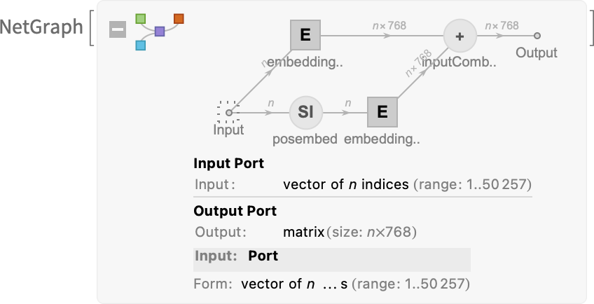

The input is a [vector of _n_ tokens](https://reference.wolfram.com/language/ref/netencoder/SubwordTokens./%20html) (represented as in the previous section by integers from 1 to about 50,000). Each of these tokens is converted (by a [single-layer neural net](https://reference.wolfram.com/language/ref/EmbeddingLayer.html)) into an embedding vector (of length 768 for GPT-2 and 12,288 for _ChatGPT_’s GPT-3). Meanwhile, there’s a “secondary pathway” that takes the [sequence of (integer) positions](https://reference.wolfram.com/language/ref/SequenceIndicesLayer.html) for the tokens, and from these integers creates another embedding vector. And finally the embedding vectors from the token value and the token position are [added together](https://reference.wolfram.com/language/ref/ThreadingLayer.html)—to produce the final sequence of embedding vectors from the embedding module.  

输入是一个包含 n 个标记的向量（与上一节中一样，用 1 到大约 50,000 之间的整数表示）。这些标记中的每一个都被（通过单层神经网络）转换为一个嵌入向量（GPT-2 的长度为 768，_ChatGPT_ 的 GPT-3 的长度为 12,288）。同时，有一个“次级路径”，它采用标记的（整数）位置序列，并从这些整数创建另一个嵌入向量。最后，将来自标记值和标记位置的嵌入向量相加——以生成来自嵌入模块的嵌入向量的最终序列。

Why does one just add the token-value and token-position embedding vectors together? I don’t think there’s any particular science to this. It’s just that various different things have been tried, and this is one that seems to work.  

为什么只是将令牌值和令牌位置嵌入向量加在一起？我不认为这有什么特别的科学。只是已经尝试了各种不同的东西，而这似乎是可行的。  

And it’s part of the lore of neural nets that—in some sense—so long as the setup one has is “roughly right” it’s usually possible to home in on details just by doing sufficient training, without ever really needing to “understand at an engineering level” quite how the neural net has ended up configuring itself.  

这是神经网络知识的一部分——在某种意义上——只要设置“大致正确”，通常只需进行足够的训练就可以了解细节，而无需真正“理解”工程水平”相当神经网络最终如何配置自己。

Here’s what the embedding module does, operating on the string _hello hello hello hello hello hello hello hello hello hello bye bye bye bye bye bye bye bye bye bye_:  

下面是嵌入模块所做的，操作字符串 hello hello hello hello hello hello hello hello hello hello bye bye bye bye bye bye bye bye bye bye bye bye：

The elements of the embedding vector for each token are shown down the page, and across the page we see first a run of “_hello_” embeddings, followed by a run of “_bye_” ones. The second array above is the positional embedding—with its somewhat-random-looking structure being just what “happened to be learned” (in this case in GPT-2).  

每个标记的嵌入向量的元素显示在页面下方，在整个页面中，我们首先看到一系列“hello”嵌入，然后是一系列“bye”嵌入。上面的第二个数组是位置嵌入——其看起来有点随机的结构正是“碰巧学到的”（在本例中为 GPT-2）。

OK, so after the embedding module comes the “main event” of the transformer: a sequence of so-called “attention blocks” (12 for GPT-2, 96 for _ChatGPT_’s GPT-3). It’s all pretty complicated—and reminiscent of typical large hard-to-understand engineering systems, or, for that matter, biological systems. But anyway, here’s a schematic representation of a single “attention block” (for GPT-2):  

好的，在嵌入模块之后是转换器的“主要事件”：一系列所谓的“注意力块”（GPT-2 为 12 个，_ChatGPT_ 的 GPT-3 为 96 个）。这一切都非常复杂——让人想起典型的大型难以理解的工程系统，或者就此而言，生物系统。但无论如何，这是单个“注意力块”（针对 GPT-2）的示意图：

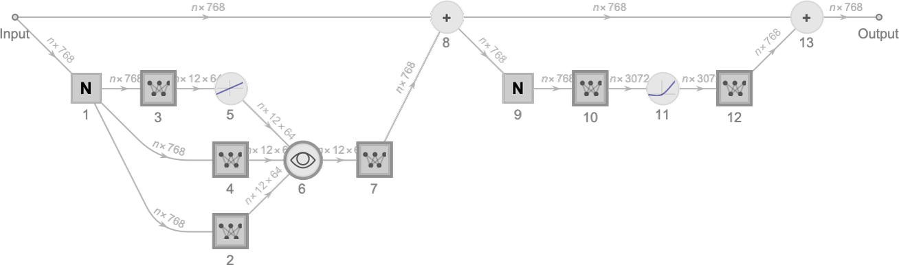

Within each such attention block there are a collection of “attention heads” (12 for GPT-2, 96 for _ChatGPT_’s GPT-3)—each of which operates independently on different chunks of values in the embedding vector.  

在每个这样的注意力块中，都有一组“注意力头”（GPT-2 有 12 个，_ChatGPT_ 的 GPT-3 有 96 个）——每个注意力头都独立地对嵌入向量中的不同值块进行操作。  

(And, yes, we don’t know any particular reason why it’s a good idea to split up the embedding vector, or what the different parts of it “mean”; this is just one of those things that’s been “found to work”.)  

（而且，是的，我们不知道为什么拆分嵌入向量是个好主意的任何特定原因，或者它的不同部分“意味着”什么；这只是那些“被发现有效”的事情之一.)

OK, so what do the attention heads do? Basically they’re a way of “looking back” in the sequence of tokens (i.e. in the text produced so far), and “packaging up the past” in a form that’s useful for finding the next token. [In the first section above](https://writings.stephenwolfram.com/2023/02/what-is-chatgpt-doing-and-why-does-it-work/#its-just-adding-one-word-at-a-time) we talked about using 2-gram probabilities to pick words based on their immediate predecessors.  

好的，注意力头是做什么的？基本上，它们是一种在标记序列中“回顾”（即在到目前为止生成的文本中），并以一种有助于查找下一个标记的形式“打包过去”的方式。在上面的第一部分中，我们讨论了使用 2-gram 概率根据其直接前身来选择单词。  

What the “attention” mechanism in transformers does is to allow “attention to” even much earlier words—thus potentially capturing the way, say, verbs can refer to nouns that appear many words before them in a sentence.  

变形金刚中的“注意”机制所做的是允许“注意”甚至更早的单词——因此可能捕捉到动词可以引用在句子中出现在它们之前的许多单词的名词的方式。

At a more detailed level, what an attention head does is to recombine chunks in the embedding vectors associated with different tokens, with certain weights.  

在更详细的层面上，注意力头所做的是重新组合与不同标记相关联的嵌入向量中的块，具有一定的权重。  

And so, for example, the 12 attention heads in the first attention block (in GPT-2) have the following (“look-back-all-the-way-to-the-beginning-of-the-sequence-of-tokens”) patterns of “recombination weights” for the “_hello_, _bye_” string above:  

因此，例如，第一个注意力块（在 GPT-2 中）中的 12 个注意力头具有以下内容（“look-back-all-the-way-to-the-beginning-of-the-sequence-of- tokens）上面的“hello,bye”字符串的“重组权重”模式：

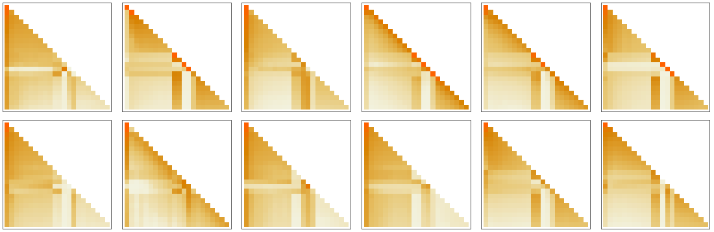

After being processed by the attention heads, the resulting “re-weighted embedding vector” (of length 768 for GPT-2 and length 12,288 for _ChatGPT_’s GPT-3) is passed through a standard [“fully connected” neural net layer](https://reference.wolfram.com/language/ref/LinearLayer.html). It’s hard to get a handle on what this layer is doing. But here’s a plot of the 768×768 matrix of weights it’s using (here for GPT-2):  

经过注意力头处理后，生成的“重新加权嵌入向量”（GPT-2 的长度为 768，_ChatGPT_ 的 GPT-3 的长度为 12,288）通过标准的“全连接”神经网络层。很难掌握这一层在做什么。但这是它使用的 768×768 权重矩阵的图（此处为 GPT-2）：

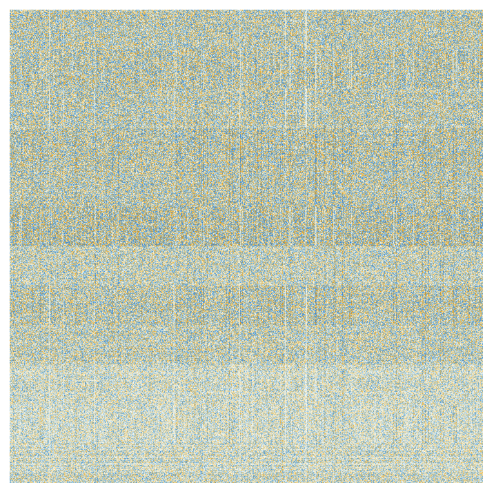

Taking 64×64 moving averages, some (random-walk-ish) structure begins to emerge:  

采用 64×64 移动平均线，一些（随机游走式）结构开始出现：

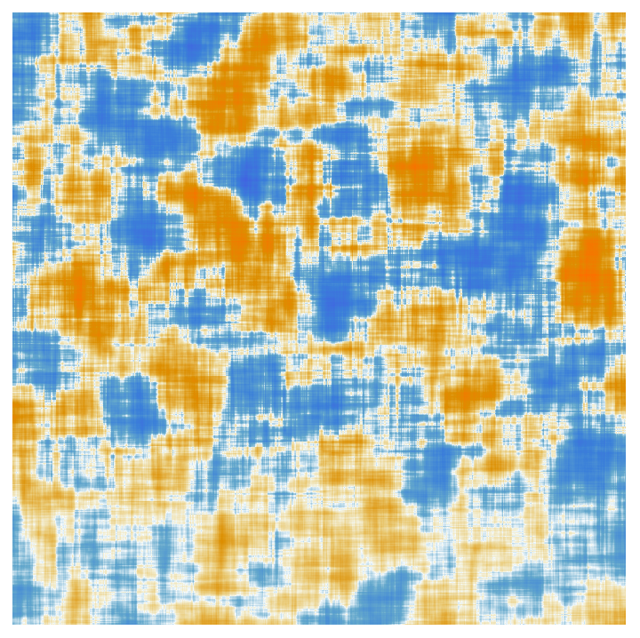

What determines this structure? Ultimately it’s presumably some “neural net encoding” of features of human language. But as of now, what those features might be is quite unknown. In effect, we’re “opening up the brain of _ChatGPT_” (or at least GPT-2) and discovering, yes, it’s complicated in there, and we don’t understand it—even though in the end it’s producing recognizable human language.  

什么决定了这个结构？最终它可能是人类语言特征的某种“神经网络编码”。但截至目前，这些功能可能是什么还不得而知。实际上，我们正在“打开 _ChatGPT_（或至少是 GPT-2）的大脑”并发现，是的，它很复杂，而且我们不理解它——尽管最终它产生了可识别的人类语言.

OK, so after going through one attention block, we’ve got a new embedding vector—which is then successively passed through additional attention blocks (a total of 12 for GPT-2; 96 for GPT-3).  

好的，所以在经过一个注意力块之后，我们得到了一个新的嵌入向量——然后它连续地通过额外的注意力块（GPT-2 总共 12 个；GPT-3 96 个）。  

Each attention block has its own particular pattern of “attention” and “fully connected” weights. Here for GPT-2 are the sequence of attention weights for the “hello, bye” input, for the first attention head:  

每个注意力块都有自己特定的“注意力”和“完全连接”权重模式。对于 GPT-2，这里是第一个注意力头的“你好，再见”输入的注意力权重序列：

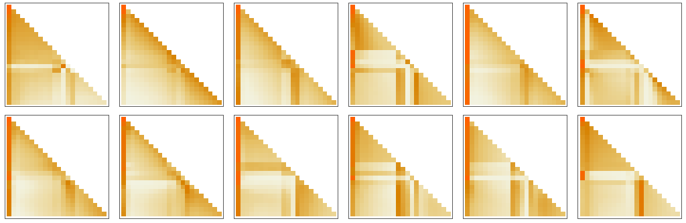

And here are the (moving-averaged) “matrices” for the fully connected layers:  

以下是全连接层的（移动平均）“矩阵”：

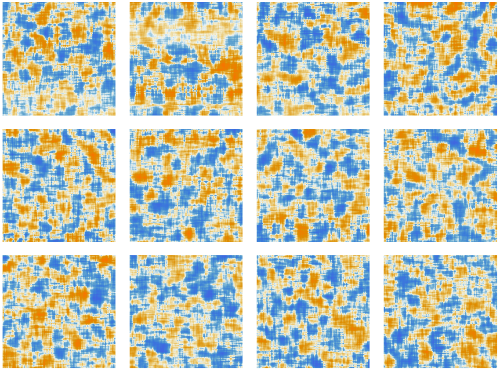

Curiously, even though these “matrices of weights” in different attention blocks look quite similar, the distributions of the sizes of weights can be somewhat different (and are not always Gaussian):  

奇怪的是，尽管不同注意力块中的这些“权重矩阵”看起来非常相似，但权重大小的分布可能有些不同（并不总是高斯分布）：

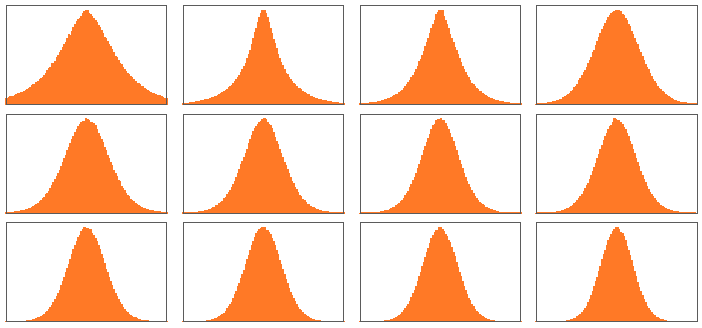

So after going through all these attention blocks what is the net effect of the transformer? Essentially it’s to transform the original collection of embeddings for the sequence of tokens to a final collection. And the particular way _ChatGPT_ works is then to pick up the last embedding in this collection, and “decode” it to produce a list of probabilities for what token should come next.  

那么在经历了所有这些注意力块之后，变压器的净效应是什么？本质上，它是将标记序列的原始嵌入集合转换为最终集合。然后，_ChatGPT_ 的特定工作方式是选取该集合中的最后一个嵌入，并将其“解码”以生成下一个应该出现的令牌的概率列表。

So that’s in outline what’s inside _ChatGPT_. It may seem complicated (not least because of its many inevitably somewhat arbitrary “engineering choices”), but actually the ultimate elements involved are remarkably simple.  

这就是 _ChatGPT_ 内部的概述。它可能看起来很复杂（尤其是因为它有许多不可避免地有些武断的“工程选择”），但实际上涉及的最终元素非常简单。  

Because in the end what we’re dealing with is just a neural net made of “artificial neurons”, each doing the simple operation of taking a collection of numerical inputs, and then combining them with certain weights.  

因为最终我们要处理的只是一个由“人工神经元”组成的神经网络，每个神经元都进行简单的操作，即获取一组数字输入，然后将它们与一定的权重组合起来。

The original input to _ChatGPT_ is an array of numbers (the embedding vectors for the tokens so far), and what happens when _ChatGPT_ “runs” to produce a new token is just that these numbers “ripple through” the layers of the neural net, with each neuron “doing its thing” and passing the result to neurons on the next layer. There’s no looping or “going back”. Everything just “feeds forward” through the network.  

_ChatGPT_ 的原始输入是一个数字数组（到目前为止标记的嵌入向量），当 _ChatGPT_ “运行”以生成新标记时发生的只是这些数字“波及”神经网络的各个层，每个神经元“做它的事情”并将结果传递给下一层的神经元。没有循环或“返回”。一切都只是通过网络“前馈”。

It’s a very different setup from a typical computational system—like a [Turing machine](https://www.wolframscience.com/nks/chap-3--the-world-of-simple-/%20programs/#sect-3-4--turing-machines)—in which results are repeatedly “reprocessed” by the same computational elements. Here—at least in generating a given token of output—each computational element (i.e. neuron) is used only once.  

它与典型的计算系统（如图灵机）的设置截然不同，在图灵机中，结果由相同的计算元素反复“重新处理”。在这里——至少在生成给定的输出标记时——每个计算元素（即神经元）只使用一次。

But there is in a sense still an “outer loop” that reuses computational elements even in _ChatGPT_. Because when _ChatGPT_ is going to generate a new token, it always “reads” (i.e. takes as input) the whole sequence of tokens that come before it, including tokens that _ChatGPT_ itself has “written” previously. And we can think of this setup as meaning that _ChatGPT_ does—at least at its outermost level—involve a “feedback loop”, albeit one in which every iteration is explicitly visible as a token that appears in the text that it generates.  

但在某种意义上，即使在 _ChatGPT_ 中，仍然存在重用计算元素的“外循环”。因为当 _ChatGPT_ 要生成一个新令牌时，它总是“读取”（即作为输入）在它之前的整个令牌序列，包括 _ChatGPT_ 本身先前“写入”的令牌。我们可以认为这种设置意味着 _ChatGPT_ 确实——至少在其最外层——涉及一个“反馈循环”，尽管在这个循环中，每次迭代都明确可见，作为它生成的文本中出现的标记。

But let’s come back to the core of _ChatGPT_: the neural net that’s being repeatedly used to generate each token. At some level it’s very simple: a whole collection of identical artificial neurons. And some parts of the network just consist of (“[fully connected](https://reference.wolfram.com/language/ref/LinearLayer.html)”) layers of neurons in which every neuron on a given layer is connected (with some weight) to every neuron on the layer before. But particularly with its transformer architecture, _ChatGPT_ has parts with more structure, in which only specific neurons on different layers are connected. (Of course, one could still say that “all neurons are connected”—but some just have zero weight.)  

但让我们回到 _ChatGPT_ 的核心：被重复用于生成每个令牌的神经网络。在某种程度上，它非常简单：一整套相同的人工神经元。网络的某些部分仅由（“完全连接的”）神经元层组成，其中给定层上的每个神经元都连接（具有一定权重）到前一层上的每个神经元。但特别是在其 transformer 架构中，_ChatGPT_ 的部分结构更加复杂，其中仅连接不同层上的特定神经元。 （当然，我们仍然可以说“所有神经元都是相连的”——但有些只是权重为零。）

In addition, there are aspects of the neural net in _ChatGPT_ that aren’t most naturally thought of as just consisting of “homogeneous” layers.  

此外，_ChatGPT_ 中神经网络的某些方面并非最自然地被认为仅由“同质”层组成。  

And for example—as the iconic summary above indicates—inside an attention block there are places where “multiple copies are made” of incoming data, each then going through a different “processing path”, potentially involving a different number of layers, and only later recombining.  

例如——正如上面的标志性摘要所示——在一个注意力块内，有一些地方对输入数据进行“多份复制”，然后每一份都经过不同的“处理路径”，可能涉及不同数量的层，并且只后来重组。  

But while this may be a convenient representation of what’s going on, it’s always at least in principle possible to think of “densely filling in” layers, but just having some weights be zero.  

但是，尽管这可能是对正在发生的事情的一种方便表示，但至少在原则上总是可以考虑“密集填充”层，但只是让一些权重为零。

If one looks at the longest path through _ChatGPT_, there are about 400 (core) layers involved—in some ways not a huge number. But there are millions of neurons—with a total of 175 billion connections and therefore 175 billion weights. And one thing to realize is that every time _ChatGPT_ generates a new token, it has to do a calculation involving every single one of these weights. Implementationally these calculations can be somewhat organized “by layer” into highly parallel array operations that can be conveniently be done on GPUs.  

如果看通过 _ChatGPT_ 的最长路径，大约涉及 400 个（核心）层——在某些方面并不是一个很大的数字。但是有数百万个神经元——总共有 1750 亿个连接，因此有 1750 亿个权重。需要意识到的一件事是，每次 _ChatGPT_ 生成一个新令牌时，它都必须对这些权重中的每一个进行计算。在实现上，这些计算可以在某种程度上“按层”组织成高度并行的数组操作，这些操作可以在 GPU 上方便地完成。  

But for each token that’s produced, there still have to be 175 billion calculations done (and in the end a bit more)—so that, yes, it’s not surprising that it can take a while to generate a long piece of text with _ChatGPT_.  

但是对于生成的每个令牌，仍然需要完成 1750 亿次计算（最终会更多）——因此，是的，使用 _ChatGPT_ 生成长文本可能需要一段时间也就不足为奇了。

But in the end, the remarkable thing is that all these operations—individually as simple as they are—can somehow together manage to do such a good “human-like” job of generating text.  

但最终，值得注意的是，所有这些操作——单独来看都很简单——可以以某种方式共同完成如此出色的“类人”文本生成工作。  

It has to be emphasized again that (at least so far as we know) there’s no “ultimate theoretical reason” why anything like this should work.  

必须再次强调的是（至少就我们所知）没有“最终的理论原因”为什么这样的事情应该有效。  

And in fact, as we’ll discuss, I think we have to view this as a—potentially surprising—scientific discovery: that somehow in a neural net like _ChatGPT_’s it’s possible to capture the essence of what human brains manage to do in generating language.  

事实上，正如我们将要讨论的那样，我认为我们必须将此视为一个可能令人惊讶的科学发现：在某种程度上，在像 _ChatGPT_ 这样的神经网络中，有可能捕捉到人类大脑在生成语言时所做的事情的本质.

## The Training of _ChatGPT_  

_ChatGPT_的训练

OK, so we’ve now given an outline of how _ChatGPT_ works once it’s set up. But how did it get set up? How were all those 175 billion weights in its neural net determined? Basically they’re the result of very large-scale training, based on a huge corpus of text—on the web, in books, etc.—written by humans.  

好的，我们现在已经概述了 _ChatGPT_ 设置后的工作方式。但是它是如何设置的呢？它的神经网络中的所有 1750 亿个权重是如何确定的？基本上，它们是非常大规模训练的结果，基于大量的文本语料库——在网络上，在书籍中，等等——由人类编写。  

As we’ve said, even given all that training data, it’s certainly not obvious that a neural net would be able to successfully produce “human-like” text. And, once again, there seem to be detailed pieces of engineering needed to make that happen.  

正如我们所说，即使给定了所有训练数据，神经网络能否成功生成“类人”文本当然也不是显而易见的。而且，再一次，似乎需要详细的工程来实现这一点。  

But the big surprise—and discovery—of _ChatGPT_ is that it’s possible at all. And that—in effect—a neural net with “just” 175 billion weights can make a “reasonable model” of text humans write.  

但 _ChatGPT_ 的最大惊喜和发现是它完全有可能。而且——实际上——一个“只有”1750 亿个权重的神经网络可以为人类书写的文本建立一个“合理的模型”。

In modern times, there’s lots of text written by humans that’s out there in digital form. The public web has at least several billion human-written pages, with altogether perhaps a trillion words of text.  

在现代，有很多人类编写的文本以数字形式存在。公共网络至少有数十亿个人工编写的页面，总共可能有一万亿个单词的文本。  

And if one includes non-public webpages, the numbers might be at least 100 times larger. So far, more than 5 million digitized books have been made available (out of 100 million or so that have ever been published), giving another 100 billion or so words of text.  

如果其中包含非公开网页，则该数字可能至少要大 100 倍。到目前为止，已经提供了超过 500 万本数字化图书（在已经出版的大约 1 亿本图书中），提供了另外 1000 亿左右的文字。  

And that’s not even mentioning text derived from speech in videos, etc. (As a personal comparison, [my total lifetime output of published material](https://www.stephenwolfram.com/publications/) has been a bit under 3 million words, and over the [past 30 years I’ve written](https://writings.stephenwolfram.com/2012/03/the-personal-analytics-of-my-life/) about 15 million words of email, and altogether typed perhaps 50 million words—and in just the past couple of years I’ve spoken more than 10 million words on [livestreams](https://www.stephenwolfram.com/livestreams). And, yes, I’ll train a bot from all of that.)  

这甚至还没有提到从视频等中的语音中提取的文本。（作为个人比较，我一生发表的材料总产量略低于 300 万字，而在过去的 30 年里，我写了大约 1500 万字的电子邮件，总共输入了大约 5000 万个单词——而在过去的几年里，我在直播中说了超过 1000 万个单词。而且，是的，我会用所有这些来训练一个机器人。）

But, OK, given all this data, how does one train a neural net from it? The basic process is very much as we discussed it in the simple examples above.  

但是，好的，给定所有这些数据，如何从中训练神经网络？基本过程与我们在上面的简单示例中讨论的非常相似。  

You present a batch of examples, and then you adjust the weights in the network to minimize the error (“loss”) that the network makes on those examples.  

您提供了一批示例，然后调整网络中的权重以最小化网络在这些示例上产生的错误（“损失”）。  

The main thing that’s expensive about “back propagating” from the error is that each time you do this, every weight in the network will typically change at least a tiny bit, and there are just a lot of weights to deal with.  

从错误“反向传播”的主要代价是每次执行此操作时，网络中的每个权重通常至少会发生一点点变化，并且只有很多权重需要处理。  

(The actual “back computation” is typically only a small constant factor harder than the forward one.)  

（实际的“反向计算”通常只比正向计算难一个小的常数因子。）

With modern GPU hardware, it’s straightforward to compute the results from batches of thousands of examples in parallel. But when it comes to actually updating the weights in the neural net, current methods require one to do this basically batch by batch.  

使用现代 GPU 硬件，可以直接从数千个示例的批次中并行计算结果。但是当涉及到实际更新神经网络中的权重时，当前的方法基本上需要一个批次地执行此操作。  

(And, yes, this is probably where actual brains—with their combined computation and memory elements—have, for now, at least an architectural advantage.)  

（而且，是的，这可能是真正的大脑——结合计算和记忆元素——目前至少具有架构优势的地方。）

Even in the seemingly simple cases of learning numerical functions that we discussed earlier, we found we often had to use millions of examples to successfully train a network, at least from scratch.  

即使在我们之前讨论过的看似简单的学习数值函数的案例中，我们也发现我们经常必须使用数百万个示例才能成功训练网络，至少是从头开始。  

So how many examples does this mean we’ll need in order to train a “human-like language” model? There doesn’t seem to be any fundamental “theoretical” way to know. But in practice _ChatGPT_ was successfully trained on a few hundred billion words of text.  

那么这意味着我们需要多少示例才能训练“类人语言”模型？似乎没有任何基本的“理论”方法可以知道。但在实践中，_ChatGPT_ 成功地训练了数千亿字的文本。

Some of the text it was fed several times, some of it only once. But somehow it “got what it needed” from the text it saw. But given this volume of text to learn from, how large a network should it require to “learn it well”?  

有些文本被输入了几次，有些只被输入了一次。但不知何故，它从它看到的文本中“得到了它需要的东西”。但是考虑到要学习的文本量，“学好”需要多大的网络？  

Again, we don’t yet have a fundamental theoretical way to say. Ultimately—as we’ll discuss further below—there’s presumably a certain “total algorithmic content” to human language and what humans typically say with it.  

同样，我们还没有一个基本的理论方法可以说。最终——正如我们将在下面进一步讨论的那样——人类语言和人们通常用它说的话大概有某种“总算法内容”。  

But the next question is how efficient a neural net will be at implementing a model based on that algorithmic content. And again we don’t know—although the success of _ChatGPT_ suggests it’s reasonably efficient.  

但下一个问题是神经网络在实现基于该算法内容的模型时的效率如何。同样，我们也不知道——尽管 _ChatGPT_ 的成功表明它相当高效。

And in the end we can just note that _ChatGPT_ does what it does using a couple hundred billion weights—comparable in number to the total number of words (or tokens) of training data it’s been given. In some ways it’s perhaps surprising (though empirically observed also in smaller analogs of _ChatGPT_) that the “size of the network” that seems to work well is so comparable to the “size of the training data”. After all, it’s certainly not that somehow “inside _ChatGPT_” all that text from the web and books and so on is “directly stored”. Because what’s actually inside _ChatGPT_ are a bunch of numbers—with a bit less than 10 digits of precision—that are some kind of distributed encoding of the aggregate structure of all that text.  

最后我们可以注意到，_ChatGPT_ 使用几千亿个权重来完成它所做的事情——在数量上与给定的训练数据的单词（或标记）总数相当。在某些方面，这可能令人惊讶（尽管在更小的 _ChatGPT_ 类似物中也有经验观察到）似乎运作良好的“网络规模”与“训练数据的规模”如此可比。毕竟，肯定不是以某种方式“在 _ChatGPT_ 内部”所有来自网络和书籍等的文本都“直接存储”了。因为 _ChatGPT_ 内部实际上是一堆数字——精度略低于 10 位——是所有文本聚合结构的某种分布式编码。

Put another way, we might ask what the “effective information content” is of human language and what’s typically said with it. There’s the raw corpus of examples of language. And then there’s the representation in the neural net of _ChatGPT_. That representation is very likely far from the “algorithmically minimal” representation (as we’ll discuss below). But it’s a representation that’s readily usable by the neural net.  

换句话说，我们可能会问人类语言的“有效信息内容”是什么，通常用它来表达什么。有语言示例的原始语料库。然后是 _ChatGPT_ 神经网络中的表示。该表示很可能与“算法最小”表示相去甚远（我们将在下面讨论）。但它是一种很容易被神经网络使用的表示。  

And in this representation it seems there’s in the end rather little “compression” of the training data; it seems on average to basically take only a bit less than one neural net weight to carry the “information content” of a word of training data.  

在这种表示中，训练数据似乎最终“压缩”得很少；平均而言，似乎基本上只需要不到一个神经网络权重就可以承载训练数据单词的“信息内容”。

When we run _ChatGPT_ to generate text, we’re basically having to use each weight once. So if there are _n_ weights, we’ve got of order _n_ computational steps to do—though in practice many of them can typically be done in parallel in GPUs. But if we need about _n_ words of training data to set up those weights, then from what we’ve said above we can conclude that we’ll need about _n_2 computational steps to do the training of the network—which is why, with current methods, one ends up needing to talk about billion-dollar training efforts.  

当我们运行 _ChatGPT_ 生成文本时，我们基本上必须使用每个权重一次。因此，如果有 n 个权重，我们就有 n 个计算步骤要做——尽管在实践中，其中许多通常可以在 GPU 中并行完成。但是，如果我们需要大约 n 个单词的训练数据来设置这些权重，那么根据我们上面所说的，我们可以得出结论，我们将需要大约 n 2 个计算步骤来进行网络训练——这就是为什么，用目前的方法，最终需要谈论数十亿美元的培训工作。

## Beyond Basic Training  

超越基础训练

The majority of the effort in training _ChatGPT_ is spent “showing it” large amounts of existing text from the web, books, etc. But it turns out there’s another—apparently rather important—part too.  

训练 _ChatGPT_ 的大部分工作都花在“向它展示”来自网络、书籍等的大量现有文本上。但事实证明，还有另一个——显然相当重要的——部分。

As soon as it’s finished its “raw training” from the original corpus of text it’s been shown, the neural net inside _ChatGPT_ is ready to start generating its own text, continuing from prompts, etc. But while the results from this may often seem reasonable, they tend—particularly for longer pieces of text—to “wander off” in often rather non-human-like ways.  

一旦它从显示的原始文本语料库完成“原始训练”，_ChatGPT_ 中的神经网络就准备好开始生成自己的文本，从提示继续等。但是，虽然由此产生的结果通常看起来是合理的，它们往往——尤其是对于较长的文本——以通常非常不像人类的方式“游荡”。  

It’s not something one can readily detect, say, by doing traditional statistics on the text. But it’s something that actual humans reading the text easily notice.  

这不是人们可以通过对文本进行传统统计而轻易检测到的东西。但这是真正阅读文本的人很容易注意到的东西。

And a [key idea in the construction of _ChatGPT_](https://openai.com/blog/instruction-following/) was to have another step after “passively reading” things like the web: to have actual humans actively interact with _ChatGPT_, see what it produces, and in effect give it feedback on “how to be a good chatbot”. But how can the neural net use that feedback? The first step is just to have humans rate results from the neural net.  

构建 _ChatGPT_ 的一个关键想法是在“被动阅读”诸如网络之类的东西之后再迈出一步：让真实的人主动与 _ChatGPT_ 互动，看看它产生了什么，并实际上给它反馈“如何成为一个好的聊天机器人”。但是神经网络如何使用该反馈呢？第一步只是让人类对神经网络的结果进行评分。  

But then another neural net model is built that attempts to predict those ratings. But now this prediction model can be run—essentially like a loss function—on the original network, in effect allowing that network to be “tuned up” by the human feedback that’s been given.  

但随后建立了另一个神经网络模型，试图预测这些评级。但现在这个预测模型可以在原始网络上运行——本质上就像一个损失函数，实际上允许该网络根据给出的人类反馈“调整”。  

And the results in practice seem to have a big effect on the success of the system in producing “human-like” output.  

而实践中的结果似乎对系统能否成功产生“类人”输出有很大影响。

In general, it’s interesting how little “poking” the “originally trained” network seems to need to get it to usefully go in particular directions.  

总的来说，有趣的是，“最初训练的”网络似乎需要很少的“戳”才能让它有效地朝着特定的方向前进。  

One might have thought that to have the network behave as if it’s “learned something new” one would have to go in and run a training algorithm, adjusting weights, and so on.  

人们可能认为，要让网络表现得好像它“学到了一些新东西”，就必须进入并运行训练算法、调整权重等。

But that’s not the case. Instead, it seems to be sufficient to basically tell _ChatGPT_ something one time—as part of the prompt you give—and then it can successfully make use of what you told it when it generates text. And once again, the fact that this works is, I think, an important clue in understanding what _ChatGPT_ is “really doing” and how it relates to the structure of human language and thinking.  

但事实并非如此。相反，基本上告诉 _ChatGPT_ 一次就足够了——作为你给出的提示的一部分——然后它可以在生成文本时成功地利用你告诉它的内容。再一次，我认为，这个有效的事实是理解 _ChatGPT_ “真正在做什么”以及它与人类语言和思维结构的关系的重要线索。

There’s certainly something rather human-like about it: that at least once it’s had all that pre-training you can tell it something just once and it can “remember it”—at least “long enough” to generate a piece of text using it. So what’s going on in a case like this?  

它肯定有一些很像人类的东西：至少一旦它接受了所有的预训练，你可以只告诉它一次，它就可以“记住它”——至少“足够长”以使用它生成一段文本.那么在这样的情况下发生了什么？  

It could be that “everything you might tell it is already in there somewhere”—and you’re just leading it to the right spot. But that doesn’t seem plausible.  

可能是“您可能告诉它的所有内容都已经存在于某处”——而您只是将其引导到正确的位置。但这似乎不太合理。  

Instead, what seems more likely is that, yes, the elements are already in there, but the specifics are defined by something like a “trajectory between those elements” and that’s what you’re introducing when you tell it something.  

相反，似乎更有可能的是，是的，元素已经在那里，但细节是由诸如“这些元素之间的轨迹”之类的东西定义的，这就是你在告诉它某些东西时要介绍的内容。

And indeed, much like for humans, if you tell it something bizarre and unexpected that completely doesn’t fit into the framework it knows, it doesn’t seem like it’ll successfully be able to “integrate” this.  

事实上，就像人类一样，如果你告诉它一些完全不符合它所知道的框架的奇怪和意想不到的东西，它似乎无法成功地“整合”这个。  

It can “integrate” it only if it’s basically riding in a fairly simple way on top of the framework it already has.  

只有当它基本上以一种相当简单的方式在它已有的框架之上运行时，它才能“集成”它。

It’s also worth pointing out again that there are inevitably “algorithmic limits” to what the neural net can “pick up”. Tell it “shallow” rules of the form “this goes to that”, etc.  

还值得再次指出的是，神经网络可以“拾取”的内容不可避免地存在“算法限制”。告诉它“这个到那个”等形式的“浅”规则。  

, and the neural net will most likely be able to represent and reproduce these just fine—and indeed what it “already knows” from language will give it an immediate pattern to follow.  

，并且神经网络很可能能够很好地表示和重现这些——事实上，它从语言中“已经知道”的东西会给它一个立即遵循的模式。  

But try to give it rules for an actual “deep” computation that involves many potentially computationally irreducible steps and it just won’t work.  

但是尝试为涉及许多潜在的计算不可简化步骤的实际“深度”计算提供规则，它就是行不通的。  

(Remember that at each step it’s always just “feeding data forward” in its network; never looping except by virtue of generating new tokens.)  

（请记住，在每个步骤中，它始终只是在其网络中“向前馈送数据”；除非生成新令牌，否则从不循环。）  

Of course, the network can learn the answer to specific “irreducible” computations. But as soon as there are combinatorial numbers of possibilities, no such “table-lookup-style” approach will work.  

当然，网络可以学习特定“不可约”计算的答案。但是一旦存在组合数的可能性，这种“查表式”的方法就不会奏效了。  

And so, yes, just like humans, it’s time then for neural nets to “reach out” and use actual computational tools. (And, yes, [Wolfram|Alpha](https://www.wolframalpha.com/) and [Wolfram Language](https://www.wolfram.com/language/) are [uniquely suitable](https://writings.stephenwolfram.com/2023/01/wolframalpha-as-the-way-to-bring-computational-knowledge-superpowers-to-chatgpt/), because they’ve been built to “talk about things in the world”, just like the language-model neural nets.)  

所以，是的，就像人类一样，现在是神经网络“伸出援手”并使用实际计算工具的时候了。 （而且，是的，Wolfram|Alpha 和 Wolfram 语言是独一无二的，因为它们被构建为“谈论世界上的事物”，就像语言模型神经网络一样。）

## What Really Lets _ChatGPT_ Work?  

真正让 _ChatGPT_ 发挥作用的是什么？

Human language-and the processes of thinking involved in generating it—have always seemed to represent a kind of pinnacle of complexity.  

人类语言——以及产生它的思维过程——似乎总是代表着一种复杂性的顶峰。  

And indeed it’s seemed somewhat remarkable that human brains—with their network of a “mere” 100 billion or so neurons (and maybe 100 trillion connections) could be responsible for it.  

事实上，人类的大脑——“仅仅”有 1000 亿左右的神经元（可能还有 100 万亿个连接）的网络——可能对它负责，这似乎有些不同寻常。  

Perhaps, one might have imagined, there’s something more to brains than their networks of neurons—like some new layer of undiscovered physics. But now with _ChatGPT_ we’ve got an important new piece of information: we know that a pure, artificial neural network with about as many connections as brains have neurons is capable of doing a surprisingly good job of generating human language.  

也许，人们可能会想，除了神经元网络之外，大脑还有更多的东西——比如一些新的未被发现的物理学层。但现在通过 _ChatGPT_，我们获得了一条重要的新信息：我们知道，一个纯粹的人工神经网络，其连接数量与大脑神经元数量相当，能够出色地生成人类语言。

And, yes, that’s still a big and complicated system—with about as many neural net weights as there are words of text currently available out there in the world.  

而且，是的，这仍然是一个庞大而复杂的系统——神经净权重与世界上目前可用的文本单词一样多。  

But at some level it still seems difficult to believe that all the richness of language and the things it can talk about can be encapsulated in such a finite system. Part of what’s going on is no doubt a reflection of the ubiquitous phenomenon (that first became evident in the [example of rule 30](https://www.wolframscience.com/nks/chap-2--the-crucial-experiment#sect-2-1--how-do-simple-programs-behave)) that computational processes can in effect greatly amplify the apparent complexity of systems even when their underlying rules are simple. But, actually, as we discussed above, neural nets of the kind used in _ChatGPT_ tend to be specifically constructed to restrict the effect of this phenomenon—and the computational irreducibility associated with it—in the interest of making their training more accessible.  

但在某种程度上，似乎仍然很难相信语言的所有丰富性和它可以谈论的事物都可以封装在这样一个有限的系统中。部分正在发生的事情无疑反映了普遍存在的现象（首先在规则 30 的例子中变得明显），即计算过程实际上可以大大放大系统的表面复杂性，即使它们的基本规则很简单。但是，实际上，正如我们上面所讨论的，_ChatGPT_ 中使用的那种神经网络往往是专门构建来限制这种现象的影响——以及与之相关的计算不可约性——以使它们的训练更容易获得。

So how is it, then, that something like _ChatGPT_ can get as far as it does with language? The basic answer, I think, is that language is at a fundamental level somehow simpler than it seems. And this means that _ChatGPT_—even with its ultimately straightforward neural net structure—is successfully able to “capture the essence” of human language and the thinking behind it. And moreover, in its training, _ChatGPT_ has somehow “implicitly discovered” whatever regularities in language (and thinking) make this possible.  

那么，像 _ChatGPT_ 这样的东西是如何在语言方面取得如此成就的呢？我认为，基本的答案是语言在基本层面上比看起来要简单得多。这意味着 _ChatGPT_——即使具有最终简单的神经网络结构——也能够成功地“捕捉到”人类语言的本质及其背后的思想。此外，在其训练中，_ChatGPT_ 以某种方式“隐含地发现”了语言（和思维）中的任何规律性使这成为可能。

The success of _ChatGPT_ is, I think, giving us evidence of a fundamental and important piece of science: it’s suggesting that we can expect there to be major new “laws of language”—and effectively “laws of thought”—out there to discover. In _ChatGPT_—built as it is as a neural net—those laws are at best implicit. But if we could somehow make the laws explicit, there’s the potential to do the kinds of things _ChatGPT_ does in vastly more direct, efficient—and transparent—ways.  

我认为，_ChatGPT_ 的成功为我们提供了一项基础且重要的科学证据：它表明我们可以期待新的主要“语言法则”——以及有效的“思想法则”——在那里可以发现.在 _ChatGPT_ 中——作为神经网络构建——这些法则充其量是隐含的。但是，如果我们能以某种方式使法律明确，就有可能以更直接、高效和透明的方式做 _ChatGPT_ 所做的事情。

But, OK, so what might these laws be like? Ultimately they must give us some kind of prescription for how language—and the things we say with it—are put together. Later we’ll discuss how “looking inside _ChatGPT_” may be able to give us some hints about this, and how what we know from building computational language suggests a path forward. But first let’s discuss two long-known examples of what amount to “laws of language”—and how they relate to the operation of _ChatGPT_.  

但是，好吧，那么这些法律可能是什么样的呢？最终，他们必须为我们提供某种关于语言——以及我们用它说的话——是如何组合在一起的处方。稍后我们将讨论“深入了解 _ChatGPT_”如何能够为此提供一些提示，以及我们从构建计算语言中了解到的知识如何为我们指明前进的道路。但首先让我们讨论两个众所周知的例子，说明什么是“语言法则”——以及它们与 _ChatGPT_ 的操作有何关系。

The first is the syntax of language. Language is not just a random jumble of words. Instead, there are (fairly) definite [grammatical rules](https://www.wolframscience.com/nks/notes-10-12--computer-and-human-languages/) for how words of different kinds can be put together: in English, for example, nouns can be preceded by adjectives and followed by verbs, but typically two nouns can’t be right next to each other.  

首先是语言的句法。语言不仅仅是随机的单词组合。相反，对于如何将不同种类的词放在一起有（相当）明确的语法规则：例如，在英语中，名词可以放在形容词之前，后面可以跟动词，但通常两个名词不能紧挨着每个名词其他。  

Such grammatical structure can (at least approximately) be captured by a set of rules that define how what amount to [“parse trees” can be put together](https://reference.wolfram.com/language/ref/TextStructure.html):  

这种语法结构可以（至少近似地）通过一组规则来捕获，这些规则定义了如何将“解析树”放在一起：

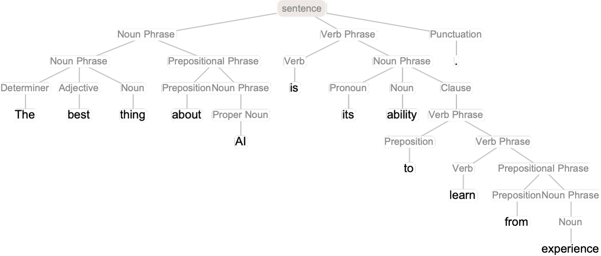

_ChatGPT_ doesn’t have any explicit “knowledge” of such rules. But somehow in its training it implicitly “discovers” them—and then seems to be good at following them. So how does this work? At a “big picture” level it’s not clear.  

_ChatGPT_ 对此类规则没有任何明确的“了解”。但在训练过程中，它以某种方式隐含地“发现”了它们——然后似乎很擅长跟随它们。那么这是如何工作的呢？在“大局”层面上还不清楚。  

But to get some insight it’s perhaps instructive to look at a much simpler example.  

但是为了获得一些洞察力，看一个更简单的例子可能会有所启发。

Consider a “language” formed from sequences of (’s and )’s, with a [grammar that specifies](https://www.wolframscience.com/nks/notes-7-9--nested-lists/) that parentheses should always be balanced, as represented by a parse tree like:  

考虑一种由 ('s 和 )'s 序列形成的“语言”，其语法指定括号应始终平衡，如解析树所示：

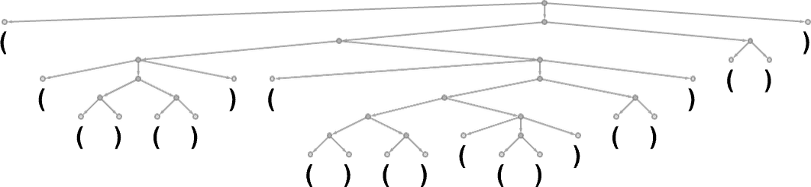

Can we train a neural net to produce “grammatically correct” parenthesis sequences? There are various ways to handle sequences in neural nets, but let’s use transformer nets, as _ChatGPT_ does. And given a simple transformer net, we can start feeding it grammatically correct parenthesis sequences as training examples. A subtlety (which actually also appears in _ChatGPT_’s generation of human language) is that in addition to our “content tokens” (here “(” and “)”) we have to include an “End” token, that’s generated to indicate that the output shouldn’t continue any further (i.e. for _ChatGPT_, that one’s reached the “end of the story”).  

我们能否训练神经网络生成“语法正确”的括号序列？有多种方法可以处理神经网络中的序列，但让我们像 _ChatGPT_ 一样使用 transformer 网络。给定一个简单的 transformer 网络，我们可以开始将语法正确的括号序列作为训练示例。一个微妙之处（实际上也出现在 _ChatGPT_ 生成的人类语言中）是除了我们的“内容标记”（此处为“(”和“)”）之外，我们还必须包含一个“结束”标记，它的生成是为了表明输出不应该再继续（即对于 _ChatGPT_，那个已经到达“故事的结尾”）。

If we set up a transformer net with just one attention block with 8 heads and feature vectors of length 128 (_ChatGPT_ also uses feature vectors of length 128, but has 96 attention blocks, each with 96 heads) then it doesn’t seem possible to get it to learn much about parenthesis language.  

如果我们建立一个只有一个注意力块的变压器网络，它有 8 个头和长度为 128 的特征向量（_ChatGPT_ 也使用长度为 128 的特征向量，但有 96 个注意力块，每个有 96 个头）那么它似乎不可能得到它来学习更多关于括号语言的知识。  

But with 2 attention heads, the learning process seems to converge—at least after 10 million or so examples have been given (and, as is common with transformer nets, showing yet more examples just seems to degrade its performance).  

但是有了 2 个注意力头，学习过程似乎收敛了——至少在给出了 1000 万左右的例子之后（而且，就像 transformer 网络一样，展示更多的例子似乎只会降低它的性能）。

So with this network, we can do the analog of what _ChatGPT_ does, and ask for probabilities for what the next token should be—in a parenthesis sequence:  

因此，通过这个网络，我们可以模拟 _ChatGPT_ 所做的事情，并在括号序列中询问下一个标记应该是什么的概率：

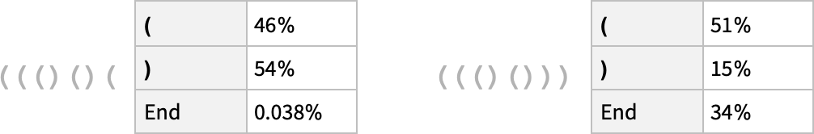

And in the first case, the network is “pretty sure” that the sequence can’t end here—which is good, because if it did, the parentheses would be left unbalanced.  

在第一种情况下，网络“非常确定”序列不能在这里结束——这很好，因为如果结束了，括号就会不平衡。  

In the second case, however, it “correctly recognizes” that the sequence can end here, though it also “points out” that it’s possible to “start again”, putting down a “(”, presumably with a “)” to follow.  

然而，在第二种情况下，它“正确识别”序列可以在这里结束，尽管它也“指出”可以“重新开始”，在后面放一个“(”，大概是一个“)” .  

But, oops, even with its 400,000 or so laboriously trained weights, it says there’s a 15% probability to have “)” as the next token—which isn’t right, because that would necessarily lead to an unbalanced parenthesis.  

但是，哎呀，即使有 400,000 左右经过艰苦训练的权重，它仍然表示有 15% 的概率将“)”作为下一个标记——这是不对的，因为这必然会导致括号不平衡。

Here’s what we get if we ask the network for the highest-probability completions for progressively longer sequences of (‘s:  

如果我们要求网络为逐渐变长的 ('s:

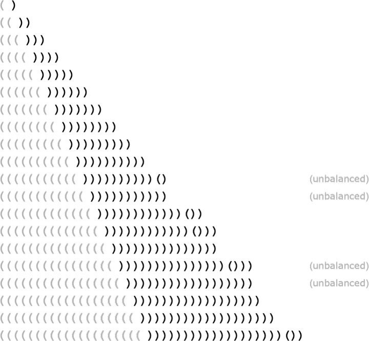

And, yes, up to a certain length the network does just fine. But then it starts failing. It’s a pretty typical kind of thing to see in a “precise” situation like this with a neural net (or with machine learning in general).  

而且，是的，网络达到一定长度就可以正常工作。但随后它开始失败。在神经网络（或一般的机器学习）这样的“精确”情况下，这是非常典型的事情。  

Cases that a human “can solve in a glance” the neural net can solve too. But cases that require doing something “more algorithmic” (e.g. explicitly counting parentheses to see if they’re closed) the neural net tends to somehow be “too computationally shallow” to reliably do.  

人类“一眼就能解决”的情况，神经网络也能解决。但是需要做一些“更多算法”的事情（例如显式计算括号以查看它们是否闭合）的情况下，神经网络往往“计算量太浅”而无法可靠地完成。  

(By the way, even the full current _ChatGPT_ has a hard time correctly matching parentheses in long sequences.)  

（顺便说一句，即使是完整的当前 _ChatGPT_ 也很难正确匹配长序列中的括号。）

So what does this mean for things like _ChatGPT_ and the syntax of a language like English? The parenthesis language is “austere”—and much more of an “algorithmic story”. But in English it’s much more realistic to be able to “guess” what’s grammatically going to fit on the basis of local choices of words and other hints.  

那么这对于 _ChatGPT_ 和英语等语言的语法意味着什么呢？括号中的语言是“朴素的”——更像是一个“算法故事”。但是在英语中，能够根据当地的单词选择和其他提示“猜测”语法上适合的内容要现实得多。  

And, yes, the neural net is much better at this—even though perhaps it might miss some “formally correct” case that, well, humans might miss as well.  

而且，是的，神经网络在这方面要好得多——尽管它可能会错过一些“形式上正确”的案例，嗯，人类也可能会错过。  

But the main point is that the fact that there’s an overall syntactic structure to the language—with all the regularity that implies—in a sense limits “how much” the neural net has to learn.  

但要点是，语言的整体句法结构这一事实——以及所有暗示的规律性——在某种意义上限制了神经网络必须学习的“多少”。  

And a key “natural-science-like” observation is that the transformer architecture of neural nets like the one in _ChatGPT_ seems to successfully be able to learn the kind of nested-tree-like syntactic structure that seems to exist (at least in some approximation) in all human languages.  

一个关键的“类自然科学”观察是，像 _ChatGPT_ 中的神经网络的转换器架构似乎能够成功地学习似乎存在的那种嵌套树状句法结构（至少在某些近似值）在所有人类语言中。

Syntax provides one kind of constraint on language. But there are clearly more. A sentence like “Inquisitive electrons eat blue theories for fish” is grammatically correct but isn’t something one would normally expect to say, and wouldn’t be considered a success if _ChatGPT_ generated it—because, well, with the normal meanings for the words in it, it’s basically meaningless.  

句法对语言提供了一种约束。但显然还有更多。像“Inquisitive electrons eat blue theory for fish”这样的句子在语法上是正确的，但不是人们通常期望说的话，如果 _ChatGPT_ 生成它也不会被认为是成功的——因为，好吧，对于里面的话，基本没什么意思。

But is there a general way to tell if a sentence is meaningful? There’s no traditional overall theory for that. But it’s something that one can think of _ChatGPT_ as having implicitly “developed a theory for” after being trained with billions of (presumably meaningful) sentences from the web, etc.  

但是有没有一种通用的方法来判断一个句子是否有意义？没有传统的整体理论。但人们可以将 _ChatGPT_ 视为在用来自网络等的数十亿（可能有意义的）句子进行训练后隐含地“开发了一种理论”。

What might this theory be like? Well, there’s one tiny corner that’s basically been known for two millennia, and that’s [logic](https://writings.stephenwolfram.com/2018/11/logic-explainability-and-the-future-of-understanding/). And certainly in the syllogistic form in which Aristotle discovered it, logic is basically a way of saying that sentences that follow certain patterns are reasonable, while others are not. Thus, for example, it’s reasonable to say “All X are Y.  

这个理论可能是什么样的？好吧，有一个小角落基本上已经为人所知两千年了，这是合乎逻辑的。当然，在亚里士多德发现它的三段论形式中，逻辑基本上是一种说法，即遵循某些模式的句子是合理的，而其他则不是。因此，例如，说“所有 X 都是 Y。  

This is not Y, so it’s not an X” (as in “All fishes are blue. This is not blue, so it’s not a fish.”).  

这不是 Y，所以它不是 X”（如“所有的鱼都是蓝色的。这不是蓝色的，所以它不是鱼。”）。  

And just as one can somewhat whimsically imagine that Aristotle discovered syllogistic logic by going (“machine-learning-style”) through lots of examples of rhetoric, so too one can imagine that in the training of _ChatGPT_ it will have been able to “discover syllogistic logic” by looking at lots of text on the web, etc. (And, yes, while one can therefore expect _ChatGPT_ to produce text that contains “correct inferences” based on things like syllogistic logic, it’s a quite different story when it comes to more sophisticated formal logic—and I think one can expect it to fail here for the same kind of reasons it fails in parenthesis matching.)  

正如人们可以有点异想天开地想象亚里士多德通过大量修辞示例（“机器学习风格”）发现了三段论逻辑一样，我们也可以想象在 _ChatGPT_ 的训练中它能够“发现三段论逻辑”通过查看网络上的大量文本等。（而且，是的，虽然人们因此可以期望 _ChatGPT_ 生成包含基于诸如三段论逻辑之类的东西的“正确推论”的文本，但当它出现时，情况就完全不同了到更复杂的形式逻辑——我认为人们可以预期它在这里会失败，原因与它在括号匹配中失败的原因相同。）

But beyond the narrow example of logic, what can be said about how to systematically construct (or recognize) even plausibly meaningful text? Yes, there are things like [Mad Libs](https://en.wikipedia.org/wiki/Mad_Libs) that use very specific “phrasal templates”. But somehow _ChatGPT_ implicitly has a much more general way to do it. And perhaps there’s nothing to be said about how it can be done beyond “somehow it happens when you have 175 billion neural net weights”. But I strongly suspect that there’s a much simpler and stronger story.  

但是，除了逻辑的狭隘例子之外，关于如何系统地构建（或识别）甚至看似有意义的文本还能说些什么呢？是的，像 Mad Libs 这样的东西使用非常具体的“短语模板”。但不知何故，_ChatGPT_ 隐含了一种更通用的方法来做到这一点。也许除了“当你有 1750 亿个神经网络权重时它会以某种方式发生”之外，关于如何完成它可能没有什么可说的。但我强烈怀疑还有一个更简单、更强大的故事。

## Meaning Space and Semantic Laws of Motion  

意义空间和语义运动定律

We discussed above that inside _ChatGPT_ any piece of text is effectively represented by an array of numbers that we can think of as coordinates of a point in some kind of “linguistic feature space”. So when _ChatGPT_ continues a piece of text this corresponds to tracing out a trajectory in linguistic feature space. But now we can ask what makes this trajectory correspond to text we consider meaningful.  

我们在上面讨论过，在 _ChatGPT_ 中，任何一段文本都有效地由一组数字表示，我们可以将其视为某种“语言特征空间”中的一个点的坐标。因此，当 _ChatGPT_ 继续一段文本时，这对应于在语言特征空间中描绘出一条轨迹。但是现在我们可以问是什么让这个轨迹对应于我们认为有意义的文本。  

And might there perhaps be some kind of “semantic laws of motion” that define—or at least constrain—how points in linguistic feature space can move around while preserving “meaningfulness”?  

是否可能存在某种“语义运动定律”来定义（或至少限制）语言特征空间中的点如何在保持“意义”的同时四处移动？

So what is this linguistic feature space like? Here’s an example of how single words (here, common nouns) might get laid out if we project such a feature space down to 2D:  

那么这个语言特征空间是什么样的呢？下面是一个示例，说明如果我们将这样的特征空间投影到 2D，单个词（这里是普通名词）可能会如何布局：

We saw another example above based on words representing plants and animals. But the point in both cases is that “semantically similar words” are placed nearby.  

我们在上面看到了另一个基于代表植物和动物的词的例子。但这两种情况的要点是“语义相似的词”被放置在附近。

As another example, here’s how words corresponding to different parts of speech get laid out:  

再举一个例子，下面是对应于不同词性的词是如何排列的：

Of course, a given word doesn’t in general just have “one meaning” (or necessarily correspond to just one part of speech).  

当然，一个给定的词通常并不只有“一个意思”（或者必然只对应一个词性）。  

And by looking at how sentences containing a word lay out in feature space, one can often “tease apart” different meanings—as in the example here for the word “crane” (bird or machine?):  

通过查看包含一个词的句子如何在特征空间中布局，人们通常可以“梳理”不同的含义——就像这里的例子中的单词“crane”（鸟还是机器？）：

OK, so it’s at least plausible that we can think of this feature space as placing “words nearby in meaning” close in this space. But what kind of additional structure can we identify in this space? Is there for example some kind of _notion_ of “parallel transport” that would reflect “flatness” in the space? One way to get a handle on that is to look at analogies:  

好的，所以我们可以将这个特征空间视为将“意义附近的词”放在这个空间的附近，这至少是合理的。但是我们可以在这个空间中识别出什么样的附加结构呢？例如，是否存在某种可以反映空间“平坦度”的“平行传输”概念？解决这个问题的一种方法是看类比：

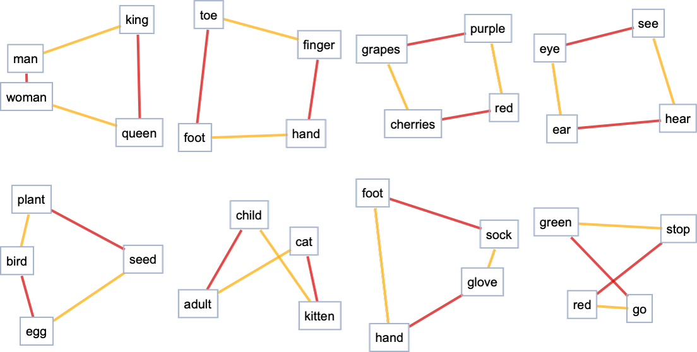

And, yes, even when we project down to 2D, there’s often at least a “hint of flatness”, though it’s certainly not universally seen.  

而且，是的，即使我们向下投影到 2D，通常至少会有“平坦的迹象”，尽管它肯定不是普遍存在的。

So what about trajectories? We can look at the trajectory that a prompt for _ChatGPT_ follows in feature space—and then we can see how _ChatGPT_ continues that:  

那么轨迹呢？我们可以查看 _ChatGPT_ 提示在特征空间中遵循的轨迹——然后我们可以看到 _ChatGPT_ 如何继续：

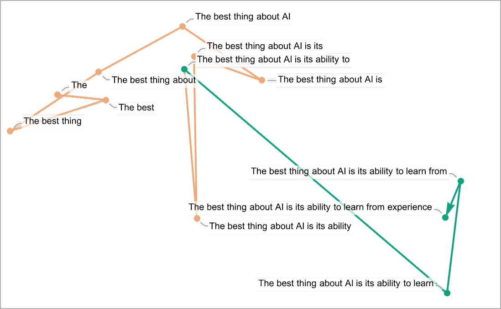

There’s certainly no “geometrically obvious” law of motion here. And that’s not at all surprising; we fully expect this to be a [considerably more complicated story](https://writings.stephenwolfram.com/2021/09/multicomputation-a-fourth-paradigm-for-theoretical-science/#linguistics). And, for example, it’s far from obvious that even if there is a “semantic law of motion” to be found, what kind of embedding (or, in effect, what “variables”) it’ll most naturally be stated in.  

这里肯定没有“几何上明显”的运动定律。这一点也不奇怪；我们完全希望这是一个相当复杂的故事。而且，例如，即使找到了“语义运动定律”，它最自然地会在哪种嵌入（或实际上是什么“变量”）中被陈述，这远非显而易见。

In the picture above, we’re showing several steps in the “trajectory”—where at each step we’re picking the word that _ChatGPT_ considers the most probable (the “zero temperature” case). But we can also ask what words can “come next” with what probabilities at a given point:  

在上图中，我们展示了“轨迹”中的几个步骤——在每个步骤中，我们都选择了 _ChatGPT_ 认为最有可能的词（“零温度”情况）。但我们也可以问，在给定的时间点，哪些词可以“下一个”出现，概率是多少：

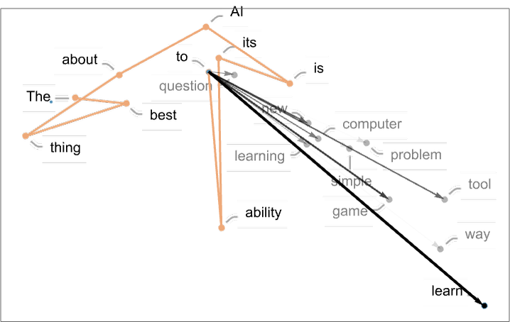

And what we see in this case is that there’s a “fan” of high-probability words that seems to go in a more or less definite direction in feature space. What happens if we go further? Here are the successive “fans” that appear as we “move along” the trajectory:  

我们在这种情况下看到的是，有一个高概率词的“扇形”似乎在特征空间中或多或少地朝着确定的方向发展。如果我们走得更远会发生什么？以下是我们“沿着”轨迹“移动”时出现的连续“扇形”：

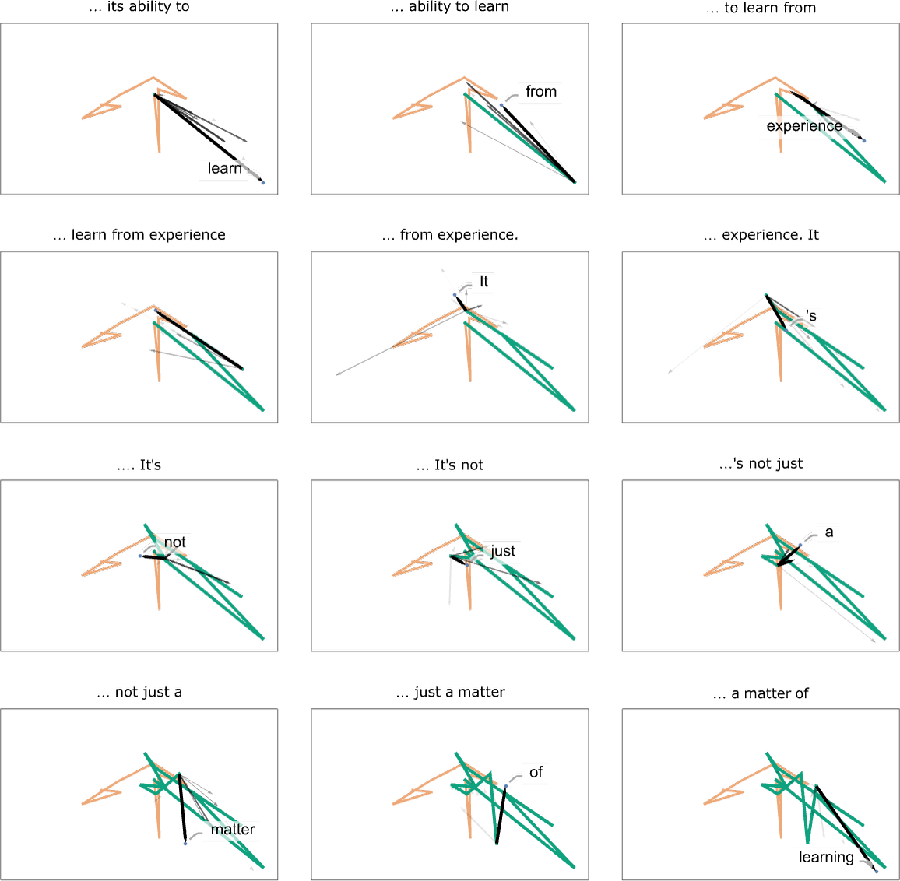

Here’s a 3D representation, going for a total of 40 steps:  

这是一个 3D 表示，总共需要 40 个步骤：

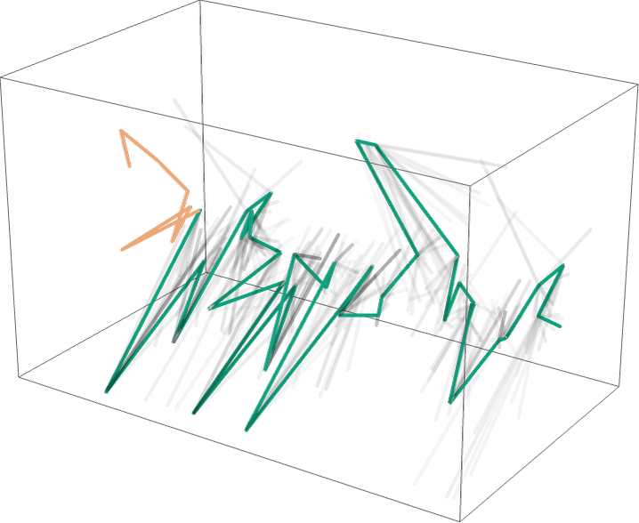

And, yes, this seems like a mess—and doesn’t do anything to particularly encourage the idea that one can expect to identify “mathematical-physics-like” “semantic laws of motion” by empirically studying “what _ChatGPT_ is doing inside”. But perhaps we’re just looking at the “wrong variables” (or wrong coordinate system) and if only we looked at the right one, we’d immediately see that _ChatGPT_ is doing something “mathematical-physics-simple” like following geodesics. But as of now, we’re not ready to “empirically decode” from its “internal behavior” what _ChatGPT_ has “discovered” about how human language is “put together”.  

而且，是的，这看起来一团糟——并且没有做任何事情来特别鼓励人们可以期望通过实证研究“_ChatGPT_ 在内部做什么”来识别“类数学物理”“语义运动定律”的想法.但也许我们只是在查看“错误的变量”（或错误的坐标系），如果我们只查看正确的变量，我们会立即看到 _ChatGPT_ 正在做一些“数学-物理-简单”的事情，比如遵循测地线。但截至目前，我们还没有准备好从其“内部行为”中“经验解码”_ChatGPT_“发现”的关于人类语言如何“组合”的内容。

## Semantic Grammar and the Power of Computational Language  

语义语法和计算语言的力量

What does it take to produce “meaningful human language”? In the past, we might have assumed it could be nothing short of a human brain. But now we know it can be done quite respectably by the neural net of _ChatGPT_. Still, maybe that’s as far as we can go, and there’ll be nothing simpler—or more human understandable—that will work. But my strong suspicion is that the success of _ChatGPT_ implicitly reveals an important “scientific” fact: that there’s actually a lot more structure and simplicity to meaningful human language than we ever knew—and that in the end there may be even fairly simple rules that describe how such language can be put together.  

产生“有意义的人类语言”需要什么？在过去，我们可能会认为它可能就是人脑。但是现在我们知道它可以通过 _ChatGPT_ 的神经网络来完成。不过，也许这就是我们所能达到的极限，没有比这更简单——或更容易理解——的方法了。但我强烈怀疑 _ChatGPT_ 的成功隐含地揭示了一个重要的“科学”事实：有意义的人类语言实际上比我们所知道的结构和简单性要多得多——而且最终甚至可能有相当简单的规则描述如何将这种语言组合在一起。

As we mentioned above, syntactic grammar gives rules for how words corresponding to things like different parts of speech can be put together in human language. But to deal with meaning, we need to go further.  

正如我们上面提到的，句法语法给出了如何将对应于不同词类的词用人类语言组合在一起的规则。但要处理意义，我们需要走得更远。  

And one version of how to do this is to think about not just a syntactic grammar for language, but also a semantic one.  

如何做到这一点的一个版本是不仅要考虑语言的句法语法，还要考虑语义语法。

For purposes of syntax, we identify things like nouns and verbs. But for purposes of semantics, we need “finer gradations”. So, for example, we might identify the concept of “moving”, and the concept of an “object” that “maintains its identity independent of location”.  

为了句法的目的，我们识别名词和动词之类的东西。但出于语义的目的，我们需要“更精细的渐变”。因此，例如，我们可能会识别“移动”的概念，以及“保持其身份独立于位置”的“对象”的概念。  

There are endless specific examples of each of these “semantic concepts”. But for the purposes of our semantic grammar, we’ll just have some general kind of rule that basically says that “objects” can “move”. There’s a lot to say about how all this might work ([some of which I’ve said before](https://writings.stephenwolfram.com/2016/10/computational-law-symbolic-discourse-and-the-ai-constitution/)). But I’ll content myself here with just a few remarks that indicate some of the potential path forward.  

这些“语义概念”中的每一个都有无穷无尽的具体例子。但是为了我们的语义语法的目的，我们只是有一些通用的规则，基本上说“对象”可以“移动”。关于这一切如何运作，有很多话要说（其中一些我之前已经说过）。但我将在这里只发表一些说明一些潜在前进道路的评论。

It’s worth mentioning that even if a sentence is perfectly OK according to the semantic grammar, that doesn’t mean it’s been realized (or even could be realized) in practice.  

值得一提的是，即使一个句子按照语义文法完全OK，也不代表它在实践中已经实现（甚至可以实现）。  

“The elephant traveled to the Moon” would doubtless “pass” our semantic grammar, but it certainly hasn’t been realized (at least yet) in our actual world—though it’s absolutely fair game for a fictional world.  

“大象到月球旅行”无疑会“通过”我们的语义语法，但它在我们的现实世界中肯定还没有实现（至少现在）——尽管这对于虚构的世界来说绝对是公平的游戏。

When we start talking about “semantic grammar” we’re soon led to ask “What’s underneath it?” What “model of the world” is it assuming? A syntactic grammar is really just about the construction of language from words.  

当我们开始谈论“语义语法”时，我们很快就会问“它的背后是什么？”它假设了什么样的“世界模型”？句法语法实际上只是关于从单词构建语言。  

But a semantic grammar necessarily engages with some kind of “model of the world”—something that serves as a “skeleton” on top of which language made from actual words can be layered.  

但是语义语法必然涉及某种“世界模型”——充当“骨架”的东西，在其上可以叠加由实际单词构成的语言。

Until recent times, we might have imagined that (human) language would be the only general way to describe our “model of the world”. Already a few centuries ago there started to be formalizations of specific kinds of things, based particularly on mathematics.  

直到最近，我们可能还认为（人类）语言是描述我们的“世界模型”的唯一通用方式。几个世纪前就开始对特定种类的事物进行形式化，特别是基于数学。  

But now there’s a much more general approach to formalization: [computational language](https://writings.stephenwolfram.com/2019/05/what-weve-built-is-a-computational-language-and-thats-very-important/).  

但现在有一种更通用的形式化方法：计算语言。

And, yes, that’s been my big project over the course of more than four decades (as now embodied in the [Wolfram Language](https://www.wolfram.com/language/)): to develop a precise symbolic representation that can talk as broadly as possible about things in the world, as well as abstract things that we care about. And so, for example, we have symbolic representations for [cities](https://reference.wolfram.com/language/ref/entity/City.html) and [molecules](https://reference.wolfram.com/language/guide/MolecularStructureAndComputation.html) and [images](https://reference.wolfram.com/language/guide/ImageRepresentation.html) and [neural networks](https://reference.wolfram.com/language/guide/NeuralNetworkConstruction.html), and we have built-in knowledge about how to compute about those things.  

而且，是的，这一直是我四十多年来的一个大项目（现在体现在 Wolfram 语言中）：开发一种精确的符号表示，可以尽可能广泛地谈论世界上的事物，以及抽象的我们关心的事情。因此，例如，我们有城市、分子、图像和神经网络的符号表示，我们有关于如何计算这些东西的内置知识。

And, after decades of work, we’ve covered a lot of areas in this way. But in the past, we haven’t particularly dealt with “[everyday discourse](https://writings.stephenwolfram.com/2016/10/computational-law-symbolic-discourse-and-the-ai-constitution/)”. In “I bought two pounds of apples” we can [readily represent](https://reference.wolfram.com/language/ref/entity/Food.html) (and do nutrition and other computations on) the “two pounds of apples”. But we don’t (quite yet) have a symbolic representation for “I bought”.  

而且，经过几十年的工作，我们已经以这种方式涵盖了很多领域。但在过去，我们并没有专门处理“日常话语”。在“我买了两磅苹果”中，我们可以很容易地表示（并对其进行营养和其他计算）“两磅苹果”。但我们（目前还）没有“我买了”的符号表示。

It’s all connected to the idea of semantic grammar—and the goal of having a generic symbolic “construction kit” for concepts, that would give us rules for what could fit together with what, and thus for the “flow” of what we might turn into human language.  

这一切都与语义语法的想法有关——以及拥有一个通用的概念符号“构建工具包”的目标，这将为我们提供规则，说明什么可以与什么相匹配，从而为我们可能转向的“流程”提供规则成人类语言。

But let’s say we had this “symbolic discourse language”. What would we do with it? We could start off doing things like generating “locally meaningful text”.  

但是假设我们有这种“符号话语语言”。我们会用它做什么？我们可以开始做一些事情，比如生成“本地有意义的文本”。  

But ultimately we’re likely to want more “globally meaningful” results—which means “computing” more about what can actually exist or happen in the world (or perhaps in some consistent fictional world).  

但最终我们可能想要更多“具有全球意义”的结果——这意味着“计算”更多关于世界上实际存在或发生的事情（或者可能在一些一致的虚构世界中）。

Right now in Wolfram Language we have a huge amount of built-in computational knowledge about lots of kinds of things.  

现在，在 Wolfram 语言中，我们拥有大量关于各种事物的内置计算知识。  

But for a complete symbolic discourse language we’d have to build in additional “calculi” about general things in the world: if an object moves from A to B and from B to C, then it’s moved from A to C, etc.  

但是对于一个完整的符号话语语言，我们必须构建关于世界上一般事物的额外“计算”：如果一个对象从 A 移动到 B，从 B 移动到 C，那么它就从 A 移动到 C，等等。

Given a symbolic discourse language we might use it to make “standalone statements”. But we can also use it to ask questions about the world, “Wolfram|Alpha style”. Or we can use it to state things that we “want to make so”, presumably with some external actuation mechanism.  

给定一种符号话语语言，我们可以用它来做出“独立陈述”。但我们也可以用它来询问有关世界的问题，“Wolfram|Alpha 风格”。或者我们可以用它来陈述我们“想要这样做”的事情，大概是通过某种外部驱动机制。  

Or we can use it to make assertions—perhaps about the actual world, or perhaps about some specific world we’re considering, fictional or otherwise.  

或者我们可以用它来做出断言——也许是关于现实世界，或者是关于我们正在考虑的某个特定世界，无论是虚构的还是其他的。

Human language is fundamentally imprecise, not least because it isn’t “tethered” to a specific computational implementation, and its meaning is basically defined just by a “social contract” between its users.  

人类语言从根本上来说是不精确的，尤其是因为它没有“束缚”到特定的计算实现，而且它的含义基本上只是由用户之间的“社会契约”来定义。  

But computational language, by its nature, has a certain fundamental precision—because in the end what it specifies can always be “unambiguously executed on a computer”. Human language can usually get away with a certain vagueness.  

但计算语言，就其本质而言，具有一定的基本精度——因为最终它指定的内容总是可以“在计算机上明确执行”。人类语言通常可以带有一定的模糊性。  

(When we say “planet” does it include exoplanets or not, etc.?) But in computational language we have to be precise and clear about all the distinctions we’re making.  

（当我们说“行星”时，它是否包括系外行星，等等？）但是在计算语言中，我们必须准确和清楚我们所做的所有区分。

It’s often convenient to leverage ordinary human language in making up names in computational language. But the meanings they have in computational language are necessarily precise—and might or might not cover some particular connotation in typical human language usage.  

利用普通的人类语言用计算语言组成名字通常很方便。但它们在计算语言中的含义必然是精确的——并且可能涵盖也可能不涵盖典型人类语言用法中的某些特定含义。

How should one figure out the fundamental “ontology” suitable for a general symbolic discourse language? Well, it’s not easy. Which is perhaps why little has been done in these since the primitive beginnings Aristotle made more than two millennia ago.  

应该如何找出适用于一般符号话语语言的基本“本体论”？好吧，这并不容易。这也许就是为什么自从亚里士多德两千年前的原始开端以来，在这些方面几乎没有做过什么。  

But it really helps that today we now know so much about how to think about the world computationally (and it doesn’t hurt to have a “fundamental metaphysics” from our [Physics Project](https://www.wolframphysics.org/) and the [idea of the ruliad](https://writings.stephenwolfram.com/2021/11/the-concept-of-the-ruliad/)).  

但这真的很有帮助，今天我们现在对如何通过计算思考世界了解得如此之多（而且从我们的物理项目和 ruliad 的想法中获得“基础形而上学”也没有什么坏处）。

But what does all this mean in the context of _ChatGPT_? From its training _ChatGPT_ has effectively “pieced together” a certain (rather impressive) quantity of what amounts to semantic grammar. But its very success gives us a reason to think that it’s going to be feasible to construct something more complete in computational language form.  

但是，在 _ChatGPT_ 的背景下，这一切意味着什么？通过其培训，_ChatGPT_ 有效地“拼凑”了一定数量（相当令人印象深刻）的语义语法。但它的成功让我们有理由认为，以计算语言形式构建更完整的东西是可行的。  

And, unlike what we’ve so far figured out about the innards of _ChatGPT_, we can expect to design the computational language so that it’s readily understandable to humans.  

而且，与我们迄今为止对 _ChatGPT_ 内部结构的了解不同，我们可以期望设计出易于人类理解的计算语言。

When we talk about semantic grammar, we can draw an analogy to syllogistic logic. At first, syllogistic logic was essentially a collection of rules about statements expressed in human language. But (yes, two millennia later) [when formal logic was developed](https://writings.stephenwolfram.com/2018/11/logic-explainability-and-the-future-of-understanding/#the-history), the original basic constructs of syllogistic logic could now be used to build huge “formal towers” that include, for example, the operation of modern digital circuitry. And so, we can expect, it will be with more general semantic grammar.  

当我们谈论语义语法时，我们可以类比三段论逻辑。起初，三段论逻辑本质上是关于用人类语言表达的陈述的规则集合。但是（是的，两千年后）当形式逻辑得到发展时，三段论逻辑的原始基本结构现在可以用来构建巨大的“形式塔”，例如，包括现代数字电路的操作。因此，我们可以预期，它将具有更一般的语义语法。  

At first, it may just be able to deal with simple patterns, expressed, say, as text.  

起初，它可能只能处理简单的模式，比如以文本形式表达。  

But once its whole computational language framework is built, we can expect that it will be able to be used to erect tall towers of “generalized semantic logic”, that allow us to work in a precise and formal way with all sorts of things that have never been accessible to us before, except just at a “ground-floor level” through human language, with all its vagueness.  

但是一旦它的整个计算语言框架建立起来，我们可以期待它能够被用来竖起“广义语义逻辑”的高塔，让我们能够以精确和形式化的方式处理各种具有我们以前从未接触过，除了通过人类语言在“底层”，以及它的所有模糊性。

We can think of the construction of computational language—and semantic grammar—as representing a kind of ultimate compression in representing things.  

我们可以将计算语言和语义语法的构造视为表示事物表示的一种最终压缩。  

Because it allows us to talk about the essence of what’s possible, without, for example, dealing with all the “turns of phrase” that exist in ordinary human language. And we can view the great strength of _ChatGPT_ as being something a bit similar: because it too has in a sense “drilled through” to the point where it can “put language together in a semantically meaningful way” without concern for different possible turns of phrase.  

因为它让我们能够谈论可能的本质，而不用去处理普通人类语言中存在的所有“短语转折”。我们可以将 _ChatGPT_ 的强大之处视为有点类似的东西：因为它在某种意义上也已经“钻透”到它可以“以语义上有意义的方式将语言组合在一起”的程度，而不用担心不同的可能转向短语。

So what would happen if we applied _ChatGPT_ to underlying computational language? The computational language can describe what’s possible. But what can still be added is a sense of “what’s popular”—based for example on reading all that content on the web.  

那么如果我们将 _ChatGPT_ 应用于底层计算语言会发生什么？计算语言可以描述什么是可能的。但仍然可以添加的是一种“流行”的感觉——例如基于阅读网络上的所有内容。  

But then—underneath—operating with computational language means that something like _ChatGPT_ has immediate and fundamental access to what amount to ultimate tools for making use of potentially irreducible computations.  

但是，在底层，使用计算语言进行操作意味着像 _ChatGPT_ 这样的东西可以直接和基本地访问相当于使用潜在不可简化计算的终极工具。  

And that makes it a system that can not only “generate reasonable text”, but can expect to work out whatever can be worked out about whether that text actually makes “correct” statements about the world—or whatever it’s supposed to be talking about.  

这使得它成为一个不仅可以“生成合理的文本”的系统，而且可以期望找出任何可以解决的问题，即该文本是否真的对世界做出了“正确”的陈述——或者它应该谈论的任何东西。

## So … What Is _ChatGPT_ Doing, and Why Does It Work?  

那么……_ChatGPT_ 在做什么，它为什么起作用？

The basic concept of _ChatGPT_ is at some level rather simple. Start from a huge sample of human-created text from the web, books, etc. Then train a neural net to generate text that’s “like this”.  

_ChatGPT_ 的基本概念在某种程度上相当简单。从来自网络、书籍等的大量人工文本样本开始。然后训练神经网络生成“像这样”的文本。  

And in particular, make it able to start from a “prompt” and then continue with text that’s “like what it’s been trained with”.  

特别是，让它能够从“提示”开始，然后继续使用“就像它被训练的那样”的文本。

As we’ve seen, the actual neural net in _ChatGPT_ is made up of very simple elements—though billions of them. And the basic operation of the neural net is also very simple, consisting essentially of passing input derived from the text it’s generated so far “once through its elements” (without any loops, etc.  

正如我们所见，_ChatGPT_ 中的实际神经网络由非常简单的元素组成——尽管有数十亿个。神经网络的基本操作也非常简单，主要包括传递从到目前为止生成的文本派生的输入“一次通过其元素”（没有任何循环等）。  

) for every new word (or part of a word) that it generates.  

) 对于它生成的每个新词（或词的一部分）。

But the remarkable—and unexpected—thing is that this process can produce text that’s successfully “like” what’s out there on the web, in books, etc. And not only is it coherent human language, it also “says things” that “follow its prompt” making use of content it’s “read”.  

但值得注意的是——也是出乎意料的——这个过程可以产生成功地“像”网络上、书籍中等地方的文本。它不仅是连贯的人类语言，而且“说的东西”“遵循”它的提示”利用它“阅读”的内容。  

It doesn’t always say things that “globally make sense” (or correspond to correct computations)-because (without, for example, [accessing the “computational superpowers” of Wolfram|Alpha](https://writings.stephenwolfram.com/2023/01/wolframalpha-as-the-way-to-bring-computational-knowledge-superpowers-to-chatgpt/)) it’s just saying things that “sound right” based on what things “sounded like” in its training material.  

它并不总是说“全局有意义”（或对应于正确的计算）——因为（例如，没有访问 Wolfram|Alpha 的“计算能力”）它只是说“听起来正确”的事情基于培训材料中“听起来像”什么东西。

The specific engineering of _ChatGPT_ has made it quite compelling. But ultimately (at least until it can use outside tools) _ChatGPT_ is “merely” pulling out some “coherent thread of text” from the “statistics of conventional wisdom” that it’s accumulated. But it’s amazing how human-like the results are.  

_ChatGPT_ 的特定工程使其非常引人注目。但最终（至少在它可以使用外部工具之前）_ChatGPT_“只是”从它积累的“传统智慧的统计数据”中提取一些“连贯的文本线索”。但令人惊讶的是，结果与人类相似。  

And as I’ve discussed, this suggests something that’s at least scientifically very important: that human language (and the patterns of thinking behind it) are somehow simpler and more “law like” in their structure than we thought. _ChatGPT_ has implicitly discovered it. But we can potentially explicitly expose it, with semantic grammar, computational language, etc.  

正如我所讨论的，这表明至少在科学上非常重要的事情：人类语言（及其背后的思维模式）在某种程度上比我们想象的更简单，在结构上更“像法律”。 _ChatGPT_ 隐含地发现了它。但是我们可以通过语义语法、计算语言等显式地公开它。

What _ChatGPT_ does in generating text is very impressive—and the results are usually very much like what we humans would produce. So does this mean _ChatGPT_ is working like a brain? Its underlying artificial-neural-net structure was ultimately modeled on an idealization of the brain. And it seems quite likely that when we humans generate language many aspects of what’s going on are quite similar.  

_ChatGPT_ 在生成文本方面所做的工作令人印象深刻——结果通常与我们人类产生的结果非常相似。那么这是否意味着 _ChatGPT_ 像大脑一样工作？它的底层人工神经网络结构最终以大脑的理想化为模型。当我们人类生成语言时，似乎很可能发生的事情的许多方面都非常相似。

When it comes to training (AKA learning) the different “hardware” of the brain and of current computers (as well as, perhaps, some undeveloped algorithmic ideas) forces _ChatGPT_ to use a strategy that’s probably rather different (and in some ways much less efficient) than the brain. And there’s something else as well: unlike even in typical algorithmic computation, _ChatGPT_ doesn’t internally “have loops” or “recompute on data”. And that inevitably limits its computational capability—even with respect to current computers, but definitely with respect to the brain.  

当谈到训练（又名学习）时，大脑和当前计算机的不同“硬件”（以及可能还有一些未开发的算法思想）迫使 _ChatGPT_ 使用可能相当不同的策略（并且在某些方面更少高效）比大脑。还有其他一些东西：与典型的算法计算不同，_ChatGPT_ 内部没有“循环”或“重新计算数据”。这不可避免地限制了它的计算能力——即使是对当前的计算机而言，但绝对是对大脑而言。

It’s not clear how to “fix that” and still maintain the ability to train the system with reasonable efficiency. But to do so will presumably allow a future _ChatGPT_ to do even more “brain-like things”. Of course, there are plenty of things that brains don’t do so well—particularly involving what amount to irreducible computations. And for these both brains and things like _ChatGPT_ have to seek “outside tools”—like [Wolfram Language](https://www.wolfram.com/language/).  

目前尚不清楚如何“解决这个问题”并仍然保持以合理效率训练系统的能力。但这样做可能会让未来的 _ChatGPT_ 做更多“类似大脑的事情”。当然，大脑在很多事情上做得并不好——尤其是涉及到不可简化的计算。对于这些，大脑和 _ChatGPT_ 之类的东西都必须寻求“外部工具”——比如 Wolfram 语言。

But for now it’s exciting to see what _ChatGPT_ has already been able to do. At some level it’s a great example of the fundamental scientific fact that large numbers of simple computational elements can do remarkable and unexpected things.  

但就目前而言，看到 _ChatGPT_ 已经能够做到的事情令人兴奋。在某种程度上，这是基本科学事实的一个很好的例子，即大量简单的计算元素可以做出非凡和意想不到的事情。  

But it also provides perhaps the best impetus we’ve had in two thousand years to understand better just what the fundamental character and principles might be of that central feature of the human condition that is human language and the processes of thinking behind it.  

但它也可能为我们提供了 2000 年来最好的动力，以更好地理解人类状况的核心特征（即人类语言及其背后的思维过程）的基本特征和原则。

## Thanks  

谢谢

I’ve been following the development of neural nets now for about 43 years, and during that time I’ve interacted with many people about them.  

我关注神经网络的发展已有大约 43 年了，在那段时间里，我与很多人就它们进行了互动。  

Among them—some from long ago, some from recently, and some across many years—have been: Giulio Alessandrini, Dario Amodei, Etienne Bernard, Taliesin Beynon, Sebastian Bodenstein, Greg Brockman, Jack Cowan, Pedro Domingos, Jesse Galef, Roger Germundsson, Robert Hecht-Nielsen, Geoff Hinton, John Hopfield, Yann LeCun, Jerry Lettvin, Jerome Louradour, Marvin Minsky, Eric Mjolsness, Cayden Pierce, Tomaso Poggio, Matteo Salvarezza, Terry Sejnowski, Oliver Selfridge, Gordon Shaw, Jonas Sjöberg, Ilya Sutskever, Gerry Tesauro and Timothee Verdier.  

其中一些来自很久以前，一些来自最近，还有一些跨越多年——包括：Giulio Alessandrini、Dario Amodei、Etienne Bernard、Taliesin Beynon、Sebastian Bodenstein、Greg Brockman、Jack Cowan、Pedro Domingos、Jesse Galef、Roger Germundsson , 罗伯特·赫克特-尼尔森, 杰夫·辛顿, 约翰·霍普菲尔德, Yann LeCun, 杰里·莱特文, 杰罗姆·卢拉杜尔, 马文·明斯基, 埃里克·姆约尔斯内斯, 凯登·皮尔斯, 托马索·波吉奥, 马特奥·萨尔瓦雷扎, 特里·塞诺夫斯基, 奥利弗·塞尔弗里奇, 戈登·肖, 乔纳斯·舍伯格, 伊利亚·萨茨克维尔, Gerry Tesauro 和 Timothee Verdier。  

For help with this piece, I’d particularly like to thank Giulio Alessandrini and Brad Klee.  

对于这篇文章的帮助，我要特别感谢 Giulio Alessandrini 和 Brad Klee。

## Additional Resources  

其他资源
