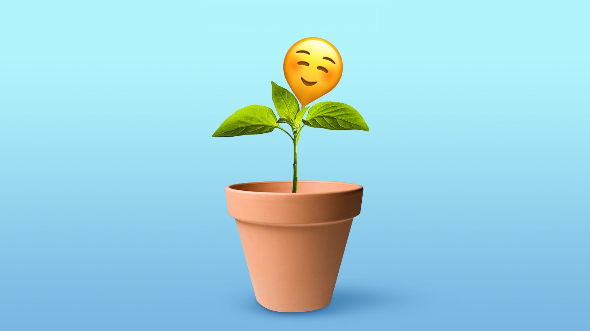

-   [Anna Braz  
    
    安娜布拉兹](https://www.axios.com/authors/abraz)

Illustration: Natalie Peeples/Axios  

插图：Natalie Peeples/Axios

Our house plants don't just look nice. They make us happier and healthier.  

我们的室内植物不仅看起来不错。它们让我们更快乐、更健康。

**Why it matters:** Many of our jobs keep us indoors — away from nature — and the pandemic magnified that problem. But it turns out being around nature is essential to health.  

为什么重要：我们的许多工作让我们呆在室内——远离大自然——而大流行病加剧了这个问题。但事实证明，亲近自然对健康至关重要。

**Here are just some of the perks:  

这里只是一些好处：**

-   Interacting with plants can [increase life satisfaction](https://internationaljournalofwellbeing.org/index.php/ijow/article/view/445), [reduce anxiety and stress](https://www.mdpi.com/1660-4601/11/3/3453/htm?h=1), [spark creativity](https://www.sciencedirect.com/science/article/abs/pii/S0169204610002835), [boost productivity](https://westernusc.ca/wp-content/uploads/2017/03/20170716-_Motion-6-Appendix-3.pdf) and even mitigate symptoms of [PTSD](https://www.sciencedirect.com/science/article/abs/pii/S0165178113000474) and [dementia](https://www.cambridge.org/core/journals/canadian-journal-on-aging-la-revue-canadienne-du-vieillissement/article/abs/effects-of-horticulture-therapy-on-engagement-and-affect/6CF3841DB3241B82B8F3BD0D2C052A6F), studies have shown.  
    
    研究表明，与植物互动可以提高生活满意度，减少焦虑和压力，激发创造力，提高生产力，甚至可以减轻创伤后应激障碍和痴呆症的症状。
-   And certain plants are [natural air purifiers](https://www.countryliving.com/uk/wellbeing/a668/houseplants-to-purify-house-air/) for your house.  
    
    某些植物是您家中的天然空气净化器。

**"When we have plants** in our home or take a hike, we see decreases in anxiety and stress," says Melinda Knuth, a horticulture professor at North Carolina State. "Just being around a plant can decrease the cortisol levels in our saliva."  

“当我们在家里种植植物或远足时，我们会发现焦虑和压力会减少，”北卡罗来纳州的园艺学教授梅琳达·克努斯 (Melinda Knuth) 说。 “只是在植物周围可以降低我们唾液中的皮质醇水平。”

-   Humans get a subconscious positive jolt from the smell of flowers, the chirping of birds and the sound of rushing water, she says.  
    
    她说，人们会从花香、鸟鸣和流水声中获得潜意识的积极震撼。

**What's happening:** Plants sales soared during the pandemic as Americans coped with being stuck inside by bringing nature into their homes.  

发生了什么：在大流行期间植物销量飙升，因为美国人通过将大自然带入家中来应对被困在家里的问题。

-   Plant nurseries in the U.S. saw sales jump 10%-15% in 2020, per a Garden Center [survey](https://www.nurserymag.com/article/2021-houseplant-hysteria/). Many of these sellers were small, mom-and-pop shops that are now thriving due to our revived interest in plants.  
    
    根据花园中心的一项调查，2020 年美国苗圃的销售额增长了 10%-15%。这些卖家中有许多都是小型的夫妻店，由于我们对植物的兴趣重新燃起，它们现在正在蓬勃发展。
-   And a whopping 89% of consumers owned at least two houseplants in 2021, according to a Floral Marketing Fund [report](https://floralmarketingfund.org/wp-content/uploads/2021/12/Consumer-Houseplant-Purchasing-Final-Report-2021-For-Public_compressed.pdf).  
    
    根据花卉营销基金的一份报告，2021 年高达 89% 的消费者拥有至少两株室内植物。

**Zoom in:** Watering and tending to plants and then watching them bloom is great for our minds.  

放大：浇水和照料植物，然后看着它们开花，这对我们的思想非常有益。

-   A key sign of poor mental health is losing interest and pleasure in activities. Plants can curb that by bringing passion and routine into our lives, says Justin Puder, a psychologist in Florida.  
    
    心理健康状况不佳的一个关键迹象是对活动失去兴趣和乐趣。佛罗里达州的心理学家贾斯汀·普德 (Justin Puder) 说，植物可以通过将激情和日常生活带入我们的生活来遏制这种情况。

-   Asiyah Muhsin, a wellness coach and retired nurse, started buying plants to cope with her own mental health after a suicide attempt. "They made me feel safe, heard and seen," she says. Now she uses plant-caregiving to help clients.  
    
    Asiyah Muhsin 是一名健康教练和退休护士，她在自杀未遂后开始购买植物来应对自己的心理健康。 “他们让我感到安全，被听到和被看到，”她说。现在，她使用植物护理来帮助客户。
-   The Horticultural Society of New York — the Hort — understands the value of people-plant relationships. They offer [Rikers GreenHouse](https://www.thehort.org/programs/greenhouse/) — a two-acre plot of land on Rikers Island where experts guide incarcerated individuals through therapeutic horticulture, says Hilda Krus, a director at the Hort.  
    
    纽约园艺协会 (Hort) 了解人与植物关系的价值。他们提供 Rikers GreenHouse——Rikers 岛上一块两英亩的土地，专家们在这里通过治疗性园艺指导被监禁的人，Hort 的主任希尔达·克鲁斯 (Hilda Krus) 说。

**The bottom line:** Consider buying a plant from a local nursery to brighten up your home — or add to your collection if you're already an avid plant owner — and reap the benefits.  

底线：考虑从当地的苗圃购买一株植物来点亮你的家——或者如果你已经是一个狂热的植物所有者，可以添加到你的收藏中——并从中获益。