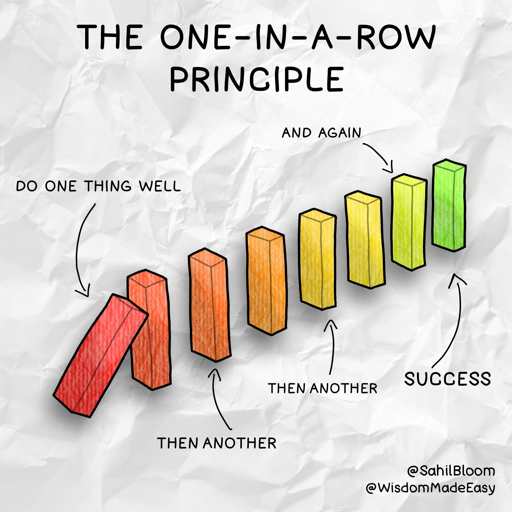

One of the most significant obstacles we face on our journey to progress is intimidation at what the progress will require.  

我们在进步之旅中面临的最重大障碍之一是对进步的要求感到恐慌。

At times, I've found myself paralyzed by the mere thought of what effort and tenacity will be required of me to achieve whatever I am striving towards:  

有时，一想到我需要付出多大的努力和毅力才能实现我正在努力实现的目标，我发现自己已经瘫痪了：

-   The number of days of consistent, deliberate effort to get my body into the physical form I want it to be in.  
    
    为了让我的身体进入我想要的身体形态而持续、刻意努力的天数。
-   The hours of writing to complete my book project.  
    
    完成我的图书项目的写作时间。
-   The accumulated minutes spent meditating, breathing, or journaling to build a warrior's mind.  
    
    花在冥想、呼吸或写日记上的累积时间来培养战士的头脑。

It's certainly easier if you can find a process you fall in love with, but the intimidation factor remains significant. This intimidation has stopped growth in its tracks on too many occasions.  

如果你能找到一个你爱上的过程，那当然会更容易，但恐吓因素仍然很重要。这种恐吓在太多场合阻止了它的发展。

I've written in the past about my [30-for-30 Approach](https://www.sahilbloom.com/newsletter/the-30-for-30-challenge) (30 minutes per day for 30 straight days) or the [Two-Day Rule](https://www.sahilbloom.com/newsletter/the-annual-planning-guide) (never skip two days in a row), both of which have served me well—but they require a certain degree of upfront discipline and commitment that we may not always possess.  

我过去曾写过我的 30 对 30 方法（每天 30 分钟，连续 30 天）或两天法则（永远不要连续跳过两天），这两种方法都对我很有帮助——但是他们需要一定程度的前期纪律和承诺，而我们可能并不总是具备这些。

**_Sometimes the _notion_ of needing to commit to a string of actions is enough to stop us from taking the first action.  

有时，需要采取一系列行动的想法足以阻止我们采取第一个行动。_**

So we arrive at the core question of today's piece: How can we get over the hump of the initial intimidation to get started and build momentum?  

因此，我们得出了今天文章的核心问题：我们如何才能克服最初的恐吓，开始行动并建立势头？

The One-in-a-Row Principle...  

一排原则...

## The Power of One  

一个人的力量

I recently started listening to [Greenlights](https://www.amazon.com/Greenlights/dp/B08HLW2JXD/ref=tmm_aud_swatch_0?_encoding=UTF8&qid=&sr=), the Matthew McConaughey memoir, read by the author in incredible, theatrical fashion.  

我最近开始听 Matthew McConaughey 的回忆录 Greenlights，作者以令人难以置信的戏剧方式阅读。

_Photo by_ [_Ethan Rougon_](https://unsplash.com/@ethanethan?utm_source=unsplash&utm_medium=referral&utm_content=creditCopyText)__  

伊桑·鲁贡摄

In the middle of the book, McConaughey talks about his first big break in Hollywood in the movie Dazed and Confused.  

在这本书的中间，麦康纳谈到了他在电影《茫然与困惑》中在好莱坞的第一次重大突破。

Reflecting on this "lucky" break and the impact it had on his career, he formulates an incredible framework for thinking about progress and growth:  

反思这次“幸运”的休息及其对他职业生涯的影响，他制定了一个令人难以置信的思考进步和成长的框架：

_"Any success takes one in a row. Do one thing well, then another. Once, then once more. Over and over until the end, then it’s one in a row again."  

“任何成功都需要一个连续的。做好一件事，然后做另一件事。一次，然后再一次。一遍又一遍，直到最后，然后又是一个连续的。”_

We can deconstruct anything to the atomic unit—to just executing once.  

我们可以将任何东西解构为原子单元——只执行一次。

One-in-a-Row. Simple. Brilliant.  

一个在一排。简单的。杰出的。

I've often mused on the fact that success is just the byproduct of making a large stack of individually good decisions. Imagining the large stack required to get to where you're going can be scary, but with the One-in-a-Row Principle, you never have to think about that.  

我经常思考这样一个事实，即成功只是做出大量个人正确决定的副产品。想象到达你要去的地方所需的大量筹码可能会很可怕，但根据一排原则，你永远不必考虑这个问题。

You just have to think about this one decision.  

你只需要考虑这个决定。

In a famous interview with Charlie Rose, actor Will Smith talked about the mentality that drove him forward in his career:  

在对查理罗斯的一次著名采访中，演员威尔史密斯谈到了推动他在职业生涯中前进的心态：

_"You don’t set out to build a wall. You don’t start by saying, ‘I’m going to build the biggest, baddest wall that’s ever been built.’ You don’t start there. You say,_ **_‘I’m going to lay this brick as perfectly as a brick can be laid.’ If you do that every single day, soon you will have a wall_**_."_  

“你不会着手建造一堵墙。你不会一开始就说，‘我要建造有史以来最大、最糟糕的墙。’你不会从那里开始。你会说，‘我‘要把这块砖砌得尽可能完美。’如果你每天都这样做，很快你就会有一堵墙。”

_Photo by_ [_Math_](https://unsplash.com/@builtbymath?utm_source=unsplash&utm_medium=referral&utm_content=creditCopyText)__  

数学摄影

Don't worry about the next brick, or the last brick, just focus on this brick.  

不要担心下一块砖，或最后一块砖，只关注这块砖。

## Focusing on the Present  

着眼于当下

In my baseball pitching days, I had a coach that used to say, "You're only as good as your next pitch."  

在我投球的日子里，我有一位教练常说，“你的表现取决于你的下一次投球。”

The idea was that the only thing to focus on is the next pitch. No matter how good or bad your last one was—or how many future pitches you'll need to execute to win—it's only the next one that you can control right now.  

这个想法是唯一要关注的是下一个音高。无论您的上一个有多好或多坏——或者您需要执行多少次未来的投球才能获胜——您现在只能控制下一个。  

It's only the next pitch that has any bearing on where you'll be after it.  

只有下一个音高才能影响您的目标。

It took me years to realize: This wasn't really about baseball (at least not _only_ about baseball).  

我花了好几年才意识到：这真的不是关于棒球的（至少不仅仅是棒球）。

-   Focusing on the past is dangerous.  
    
    专注于过去是危险的。
-   Focusing on the future is paralyzing.  
    
    着眼于未来会让人瘫痪。
-   Focusing on the present is beautiful.  
    
    专注于当下是美好的。

So the next time you find yourself struggling with the intimidation of the future, change the narrative:  

所以下次当你发现自己在为未来的恐惧而苦苦挣扎时，改变一下叙述方式：

Just focus on executing one-in-a-row.  

只需专注于连续执行一个。

Do one thing well, then another, then another. Then do it again.  

做好一件事，然后做另一件事，然后再做另一件事。然后再做一次。

  

