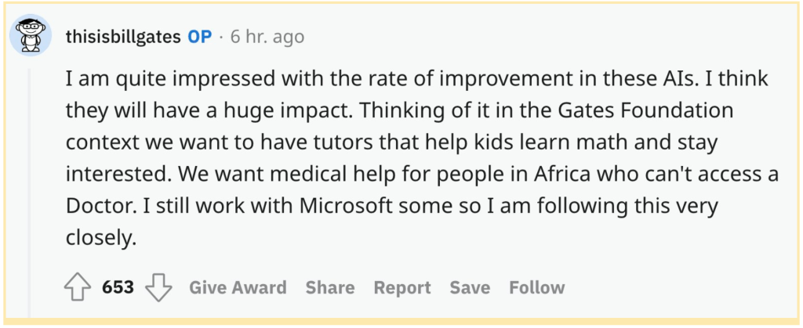

When _OpenAI_ released its chatbot _ChatGPT_ last year, proponents were quick to announce the death of various writing-related fields, such as screenwriting, computer programming, and music composition. One particular field stood out as a sector that would feel the power of _ChatGPT_ almost immediately: education. With _ChatGPT_’s technology, students can now easily cheat on papers and college admissions essays, while on the opposite end, teachers can outsource their curriculums to AI—and no one would be the wiser.   

当 _OpenAI_ 去年发布其聊天机器人 _ChatGPT_ 时，支持者迅速宣布各种写作相关领域的死亡，例如编剧、计算机编程和音乐创作。一个特定的领域脱颖而出，几乎立即感受到了 _ChatGPT_ 的力量：教育。借助 _ChatGPT_ 的技术，学生现在可以轻松地在论文和大学入学论文中作弊，而另一方面，教师可以将他们的课程外包给人工智能——而且没有人会更聪明。

But _ChatGPT_ is hardly the end of education. Just as quickly as students started passing off the chatbot’s work as their own, new programs popped up to [detect AI-written work](https://www.bloomberg.com/news/articles/2023-01-31/chatgpt-maker-openai-offers-tool-to-tell-when-text-is-ai-written), and teachers, looking to get ahead of their students, started [integrating _ChatGPT_ responses](https://www.nytimes.com/2023/01/16/technology/chatgpt-artificial-intelligence-universities.html) into their lesson planning.   

但 _ChatGPT_ 并不是教育的终结。就在学生们开始将聊天机器人的作品当作自己的作品时，新程序突然出现以检测 AI 编写的作品，教师们希望领先于学生，开始将 _ChatGPT_ 响应整合到他们的课程计划中。

The truth is, if leveraged well, AI has the potential to greatly enhance students’ abilities to think critically and expand their soft skills. And for skeptics who are worried kids will stop learning basic skills, [avoid practicing](https://twitter.com/billhd/status/1615821106526527509?s=46&t=jVoDPmgd-397UFtvq4m9Rw), and forget general facts if they can rely on an AI to answer for them, psychologists Edward Deci and Richard Ryan posit in their [self-determination theory](https://www.apa.org/members/content/intrinsic-motivation)  

事实上，如果利用得当，人工智能有可能极大地提高学生的批判性思考能力并扩展他们的软技能。心理学家爱德华·德西 (Edward Deci) 和理查德·瑞安 (Richard Ryan) 在他们的自决理论中指出，对于担心孩子会停止学习基本技能、避免练习并忘记一般事实的怀疑论者，如果他们可以依靠人工智能来为他们回答问题 that humans are intrinsically driven by autonomy, relatedness, and competence—that is, they will continue to learn regardless of any shortcuts thrown their way. The creation of Wikipedia is a great example.  

人类在本质上受到自主性、相关性和能力的驱动——也就是说，他们将继续学习，无论有什么捷径。维基百科的创建就是一个很好的例子。  

We didn’t stop learning history or science just because we could now quickly look up dates and formulas online. Instead, we simply gained an additional resource to help us fact-check and facilitate learning.  

我们并没有因为现在可以快速在线查找日期和公式而停止学习历史或科学。相反，我们只是获得了额外的资源来帮助我们核实事实并促进学习。

Seeing as education is one of [AI’s first consumer use cases](https://a16z.com/2023/02/07/everyday-ai-consumer/), and programs like _ChatGPT_ are how millions of kids, teachers, and administrators will be introduced to AI, it is critical that we pay attention to the applications of AI and its implications for our lives. Below, we explore five predictions for AI and the future of learning, knowledge, and education.  

鉴于教育是 AI 的首批消费者用例之一，而像 _ChatGPT_ 这样的程序是数百万儿童、教师和管理人员将如何接触 AI 的方式，因此我们必须关注 AI 的应用及其对我们生活的影响.下面，我们探讨了对 AI 以及学习、知识和教育的未来的五个预测。

## **1\. The one-on-one model goes mainstream   

1\. 一对一模式成为主流**

Getting one-on-one support for services like tutoring, coaching, mentorship, and even therapy was once only available to the well-off. AI will help democratize these services for wider audiences. In fact, [Bloom’s 2 sigma problem](https://web.mit.edu/5.95/readings/bloom-two-sigma.pdf)  

获得一对一的服务支持，如辅导、指导、指导，甚至治疗，曾经只有富裕的人才能获得。人工智能将帮助为更广泛的受众实现这些服务的民主化。事实上，布卢姆的 2 西格玛问题—which found that students who received one-on-one teaching performed two standard deviations better than children in a traditional classroom—has a solution now.  

\- 发现接受一对一教学的学生比传统课堂上的孩子表现出两个标准偏差 - 现在有一个解决方案。  

AI can potentially act as a live tutor for anyone, with humans supplementing the AI to provide in-depth knowledge and emotional and behavioral support.  

AI 可以充当任何人的现场导师，人类可以作为 AI 的补充，提供深入的知识以及情感和行为支持。  

Academic tool Numerade, for example, recently released an AI tutor, Ace, that can generate personalized study plans, curating the right content depending on students’ skill levels.   

例如，学术工具 Numerade 最近发布了一个人工智能导师 Ace，它可以生成个性化的学习计划，根据学生的技能水平策划合适的内容。

AI can also put time-constrained experts and academic celebrities within reach for all learners, regardless of resources. This development is incredibly democratizing for professions where mentorship and apprenticeship are important.  

人工智能还可以让所有学习者都能接触到时间有限的专家和学术名人，无论资源如何。对于导师制和学徒制很重要的职业来说，这种发展令人难以置信地民主化。  

Imagine if an early stage startup founder could chat with an AI version of Marc Andreessen or Paul Graham on demand! Well, that’s just what the startup Delphi is trying to do.  

想象一下，如果早期创业公司的创始人可以按需与 AI 版本的 Marc Andreessen 或 Paul Graham 聊天！好吧，这正是 Delphi 初创公司正在尝试做的事情。[Historical Figures](https://apps.apple.com/us/app/historical-figures-chat/id6444197650), meanwhile, lets users converse with important historical figures like Abraham Lincoln, Plato, and Benjamin Franklin, while [Character AI](https://beta.character.ai/) lets anyone create “characters,” real or imaginary, to have conversations with.   

与此同时，历史人物让用户可以与亚伯拉罕·林肯、柏拉图和本杰明·富兰克林等重要历史人物交谈，而 Character AI 可以让任何人创造真实或虚构的“人物”进行对话。

In fields that can be stigmatized like mental health, AI-augmented solutions (such as [Replika](https://replika.com/) or [Link](http://withlink.io/)  

在心理健康等可能被污名化的领域，AI 增强解决方案（如 Replika 或 Link)—in addition to being less expensive and always available for an appointment—may be more approachable than a human therapist, encouraging patients who are afraid of a stranger’s judgment. AI can also personalize and adapt to your stylistic preferences (i.e.  

)——除了更便宜而且随时可以预约——可能比人类治疗师更平易近人，鼓励那些害怕陌生人判断的病人。 AI 还可以个性化和适应您的风格偏好（即  

, do you prefer cognitive behavioral therapy or more traditional behavioral therapy) instantly, solving the known problem of difficult discovery and matching in the therapy industry. AI-augmented therapy is also software that has low marginal costs.  

，你更喜欢认知行为疗法还是更传统的行为疗法）即时解决治疗行业已知的发现和匹配难的问题。人工智能增强疗法也是一种边际成本较低的软件。  

This means more affordable end products can be created, which will enable mass market access. Not that we’re envisioning a world where humans have no role. At the present moment, AI isn’t perfect, and it doesn’t get to 100% of human-level thoughtfulness and expertise (yet).  

这意味着可以创造出更实惠的终端产品，从而实现大众市场准入。并不是说我们正在设想一个人类没有作用的世界。目前，人工智能并不完美，它还没有达到人类 100% 的体贴和专业水平（还）。  

Also, there are times and people who may simply want an IRL human to engage with them.  

此外，有些时候和人们可能只是希望 IRL 人类与他们互动。

## **2\. Individualized learning goes from dream to reality  

2.个性化学习从梦想走向现实**

With AI, it will become possible to personalize everything from learning modalities and needs (e.g., visual versus text versus audio) to content types (e.g., easily bring in a kid or adult’s favorite character or favorite hobby / genre) to curriculum.  

有了人工智能，就可以个性化一切，从学习方式和需求（例如，视觉与文本与音频）到内容类型（例如，轻松引入孩子或成人最喜欢的角色或最喜欢的爱好/类型）到课程。  

It will also be possible to teach one’s skill level and gaps more precisely: software can track your knowledge, test your progress, and repeat or reformat customized content for you based on your knowledge and gaps. This should lead to higher engagement.  

还可以更准确地教授一个人的技能水平和差距：软件可以跟踪你的知识，测试你的进步，并根据你的知识和差距为你重复或重新格式化定制内容。这应该会带来更高的参与度。  

Cameo, for example, launched a kids product featuring Blippi, Spider-Man, and other top intellectual property. A  

比如Cameo，推出了一款以Blippi、蜘蛛侠等顶级知识产权为特色的儿童产品。 A[mom even asked “Spider-Man” to encourage her kid’s bathroom training  

妈妈甚至请“蜘蛛侠”来鼓励她孩子的如厕训练](https://www.parents.com/mom-asks-spider-man-to-give-son-a-poop-pep-talk-6750719), and it seems to have worked!  

，它似乎奏效了！  

AI will also better address different types of learners—from those who are more advanced, to kids that are falling behind on a specific concept or subject, to students who are shy about raising their hand in a classroom, to those with special learning needs.  

人工智能还将更好地满足不同类型的学习者的需求——从更先进的学习者到在特定概念或科目上落后的孩子，再到在课堂上不敢举手的学生，再到有特殊学习需求的学生。

## **3\. A new generation of AI-first tools for both teachers and students will rise  

3.新一代师生人工智能优先工具将兴起**

Historically, students and educators are natural trendsetters when it comes to productivity software. In fact, students and teachers were among the first users of startups like Canva and Qualtrics (which was later acquired by SAP).  

从历史上看，在生产力软件方面，学生和教育工作者是自然的潮流引领者。事实上，学生和教师是 Canva 和 Qualtrics（后来被 SAP 收购）等初创公司的首批用户。  

In Canva’s case, students at the University of Western Australia (where the founders attended college) picked up the design platform to produce their school yearbooks, while for Qualtrics,  

在 Canva 的案例中，西澳大利亚大学（创始人就读的大学）的学生选择了设计平台来制作他们的学校年鉴，而对于 Qualtrics，[Northwestern marketing professor Angela Lee started using the service to easily collect data at scale for her MBA  

西北市场营销教授 Angela Lee 开始使用该服务为她的 MBA 课程轻松地大规模收集数据](https://www.qualtrics.com/blog/20-years-in-education/)and doctoral students.  

和博士生。  

Just as students and teachers took to early productivity tools, we can easily see them becoming part of a new generation of early adopters for software that takes advantage of chat-based conversational interfaces, as AI continues to become more “human-like” through improved intelligence.  

正如学生和教师开始使用早期的生产力工具一样，我们可以很容易地看到他们成为利用基于聊天的对话界面的软件的新一代早期采用者的一部分，因为人工智能通过改进不断变得更“像人”智力。

Another reason we expect teachers to embrace next-gen AI tools is that they—especially those from public institutions—are overworked and underfunded, leaving them with less time to focus on where they’d prefer to focus their time: their students.  

我们希望教师采用下一代人工智能工具的另一个原因是，他们——尤其是那些来自公共机构的教师——过度劳累且资金不足，这让他们没有多少时间专注于他们更愿意关注的地方：他们的学生。  

Today, teachers spend a significant amount of time grading, creating lesson plans, and preparing for their classes. AI, having learned from millions of earlier educational materials, can reduce teachers’ workloads by,  

如今，教师花费大量时间来评分、制定教案和备课。人工智能从数以百万计的早期教育材料中学习，可以减少教师的工作量，[among other things  

除其他事项外](https://www.tiktok.com/t/ZTRpKpfHK/), creating drafts of their plans and syllabi. Then, all the teachers need to do is refine and tailor the output for their respective classrooms.  

，创建他们的计划和教学大纲的草稿。然后，所有教师需要做的就是为各自的教室改进和定制输出。  

By freeing up their time, teachers can now focus on previously “bonus” activities like giving individual students personalized attention.   

通过腾出时间，教师现在可以专注于以前的“奖励”活动，例如给予个别学生个性化的关注。

As for students, they love finding creative ways to save time and gain advantages in their work. Chegg was the previous generation’s darling.  

至于学生，他们喜欢寻找创造性的方法来节省时间并在工作中获得优势。 Chegg 是上一代的宠儿。  

Now, new AI-driven resources, such as Photomath and Numerade, have popped up and are helping students solve and understand complex math and science problems.  

现在，新的 AI 驱动资源（如 Photomath 和 Numerade）已经出现，正在帮助学生解决和理解复杂的数学和科学问题。  

Colleges in particular are dense environments and a popular product can quickly gather word of mouth through student organizations, social clubs/events, or even professors that use them in classes with hundreds of students.  

大学尤其是密集的环境，一个受欢迎的产品可以通过学生组织、社交俱乐部/活动，甚至是在有数百名学生的课堂上使用它们的教授迅速收集口碑。

## **4\. Assessments and credentialing will need to adapt and new assessment tools will be developed  

4.评估和认证需要调整，新的评估工具将被开发**

Since the release of _ChatGPT_, public educators have begun debating how and whether they should “police” schoolwork, college admissions, and beyond for evidence of AI-assisted work. Schools around the world, including in [New York](https://www.wsj.com/articles/chatgpt-banned-in-new-york-city-public-schools-over-concerns-about-cheating-learning-development-11673024059), [Seattle](https://www.axios.com/local/seattle/2023/01/24/chatgpt-banned-seattle-schools-artificial-intelligence), and other large public school districts, have banned _ChatGPT_ and other related AI-writing sites for now. Even the process of continuing to use college admissions essays has been [called into question](https://www.forbes.com/sites/emmawhitford/2022/12/09/heres-how-forbes-got-the-chatgpt-ai-to-write-2-college-essays-in-20-minutes/?sh=587d53e856ad).   

自 _ChatGPT_ 发布以来，公共教育工作者已经开始辩论他们应该如何以及是否应该“监管”功课、大学录取等，以寻找人工智能辅助工作的证据。世界各地的学校，包括纽约、西雅图和其他大型公立学区，目前已经禁止使用 _ChatGPT_ 和其他相关的 AI 写作网站。甚至继续使用大学录取论文的过程也受到质疑。

At the same time, many educators argue that _ChatGPT_ is a technology that should be integrated with learning and teaching, and that leveraging AI will be a crucial career skill in the future.  

与此同时，许多教育工作者认为，_ChatGPT_ 是一项应该与学习和教学相结合的技术，利用人工智能将成为未来一项重要的职业技能。  

To realize this, we’ll need to make a series of adjustments in the classroom and in how we assess classroom achievement—and make adjustments, just like we did when Wikipedia, calculators, the internet, personal laptops, and more came onto the scene and eventually became pivotal classroom technologies.  

为实现这一点，我们需要对课堂以及我们评估课堂成绩的方式进行一系列调整——并进行调整，就像我们在维基百科、计算器、互联网、个人笔记本电脑等出现时所做的那样并最终成为关键的课堂技术。  

We’re excited to see the emergence of both next generation tools that can help schools better assess student learning outcomes and award credentials, and AI-leveraging tools that can make teachers and students’ lives better and easier.   

我们很高兴看到可以帮助学校更好地评估学生学习成果和奖励证书的下一代工具的出现，以及可以让教师和学生的生活更美好、更轻松的人工智能工具的出现。

One complication that will need to be considered is how access to this technology could give certain students big advantages in learning and in output.  

需要考虑的一个复杂问题是，获得这项技术如何能为某些学生在学习和产出方面带来巨大优势。  

For example, in schools that ban access to AI tools, students who lack internet access at home may not get any exposure to AI technology, while students with resources can learn about it and use it at home.  

例如，在禁止使用 AI 工具的学校中，在家无法上网的学生可能无法接触到 AI 技术，而有资源的学生可以在家中了解并使用它。  

This will also widen the gap between public and private school education, as it will be easier for private schools than public schools to adopt and incorporate new tech given their lower student-to-teacher ratios and higher budgets.  

这也将扩大公立和私立学校教育之间的差距，因为私立学校比公立学校更容易采用和整合新技术，因为私立学校的师生比例较低，预算较高。

## **5\. Fact-checking will become critical as the “truth” gets distorted   

5\. 随着“真相”被歪曲，事实核查将变得至关重要**

Another big area of concern is “truth” in the age of AI. Algorithms are trained on available data, but all this data is currently still subject to  human judgment and human behaviors.  

另一个值得关注的大领域是人工智能时代的“真相”。算法是根据可用数据进行训练的，但所有这些数据目前仍受制于人类判断和人类行为。  

This means that societal biases of all kinds—racial, gender-based, and more—get baked into the algorithms and these biases will continue to be amplified. For example,  

这意味着各种社会偏见——种族、性别等——都会融入算法中，并且这些偏见将继续被放大。例如，[Gmail’s sentence completion AI assumes an investor must be male](https://www.npr.org/2018/11/27/671223173/google-tweaks-email-program-that-assumed-an-investor-was-male). Google’s Smart Compose team has made several attempts to correct the problem, but have thus far been unsuccessful.   

Gmail 的句子补全 AI 假定投资者必须是男性。谷歌的 Smart Compose 团队曾多次尝试解决这个问题，但迄今为止都没有成功。

In this bias-filled environment, where [AI provides factually incorrect information (or fake facts/news)](https://www.fastcompany.com/90833017/openai-chatgpt-accuracy-gpt-4), fact checking will become critical. Today’s AI-generated responses are especially dangerous because they can easily compose coherent prose and its level of polish can fool us into believing it to be factually accurate and true. As an example, a [University of Washington study profiled in the WSJ](https://www.wsj.com/articles/readers-beware-ai-has-learned-to-create-fake-news-stories-11571018640) shows 72% of people reading an AI composed news article thought it was credible, despite its facts being incorrect.  

在这个充满偏见的环境中，AI 会提供事实上不正确的信息（或虚假事实/新闻），事实核查将变得至关重要。今天的 AI 生成的回复特别危险，因为它们可以很容易地写出连贯的散文，而且它的润色程度可以让我们相信它是事实准确和真实的。例如，《华尔街日报》对华盛顿大学进行的一项研究表明，72% 的人在阅读人工智能撰写的新闻文章时认为它是可信的，尽管它的事实是不正确的。

How do we curate high-quality and factually accurate content in an era where there will be a firehose of it being created by anyone and everyone, and robots? Trust in user-generated content and other non-branded outlets will degrade.  

在一个由任何人和每个人以及机器人创造大量内容的时代，我们如何策划高质量和事实准确的内容？对用户生成内容和其他非品牌渠道的信任度将会降低。  

On the flip side, audiences may also have blind trust in personalities, brands, and “experts” they already follow and respect.   

另一方面，观众也可能盲目信任他们已经追随和尊重的人物、品牌和“专家”。

Lastly, we may create a generation of people who have competence without comprehension of underlying details. This could end up causing problems in edge cases and crises when detailed knowledge of underlying details become important.  

最后，我们可能会创造出一代有能力但不了解潜在细节的人。当对底层细节的详细了解变得重要时，这最终可能会导致边缘案例和危机出现问题。  

Take the abstraction of web development: we’ve gone further and further away from low-level hardware, infrastructure, and backend to a world with GitHub Copilot and one where frontend engineers barely need to touch databases or backends.  

以 Web 开发的抽象为例：我们已经从低级硬件、基础设施和后端走得越来越远，进入了一个有 GitHub Copilot 的世界，前端工程师几乎不需要接触数据库或后端。  

There are even no-code solutions for non-technical users. This abstraction is great because it enables more creation and empowers users with fewer skills level users. But what happens when there’s a critical bug in the backend and no one understands how to fix it?  

甚至还有针对非技术用户的无代码解决方案。这种抽象很棒，因为它可以实现更多的创造，并为技能水平较低的用户提供支持。但是，当后端出现严重错误并且没有人知道如何修复它时会发生什么？

We are excited about all the ways AI will change learning, knowledge, education, personal development, and self improvement. If you are building in these categories, reach out to me at [askates@a16z.com](mailto:askates@a16z.com)!  

我们对人工智能将改变学习、知识、教育、个人发展和自我提升的所有方式感到兴奋。如果您正在构建这些类别，请通过 askates@a16z.com 与我联系！

\*\*\*

_The views expressed here are those of the individual AH Capital Management, L.L.C. (“a16z”) personnel quoted and are not the views of a16z or its affiliates.  

此处表达的观点是 AH Capital Management, L.L.C. 个人的观点。 (“a16z”) 人员引用但不代表 a16z 或其附属公司的观点。  

Certain information contained in here has been obtained from third-party sources, including from portfolio companies of funds managed by a16z.  

此处包含的某些信息是从第三方来源获得的，包括来自 a16z 管理的基金的投资组合公司。  

While taken from sources believed to be reliable, a16z has not independently verified such information and makes no representations about the current or enduring accuracy of the information or its appropriateness for a given situation.  

虽然从被认为可靠的来源获取信息，a16z 并未独立核实此类信息，也不对信息当前或持久的准确性或其对特定情况的适用性作出任何陈述。  

In addition, this content may include third-party advertisements; a16z has not reviewed such advertisements and does not endorse any advertising content contained therein.  

此外，此内容可能包含第三方广告； a16z 没有审查过此类广告，也不认可其中包含的任何广告内容。_

_This content is provided for informational purposes only, and should not be relied upon as legal, business, investment, or tax advice. You should consult your own advisers as to those matters.  

此内容仅供参考，不应作为法律、商业、投资或税务建议。您应该就这些事项咨询您自己的顾问。  

References to any securities or digital assets are for illustrative purposes only, and do not constitute an investment recommendation or offer to provide investment advisory services.  

对任何证券或数字资产的引用仅供说明之用，并不构成投资建议或提供投资咨询服务的要约。  

Furthermore, this content is not directed at nor intended for use by any investors or prospective investors, and may not under any circumstances be relied upon when making a decision to invest in any fund managed by a16z.  

此外，本内容不针对或旨在供任何投资者或潜在投资者使用，并且在任何情况下都不得在决定投资 a16z 管理的任何基金时予以依赖。  

(An offering to invest in an a16z fund will be made only by the private placement memorandum, subscription agreement, and other relevant documentation of any such fund and should be read in their entirety.  

（投资 a16z 基金的要约只能通过私募备忘录、认购协议和任何此类基金的其他相关文件进行，并且应完整阅读。  

) Any investments or portfolio companies mentioned, referred to, or described are not representative of all investments in vehicles managed by a16z, and there can be no assurance that the investments will be profitable or that other investments made in the future will have similar characteristics or results.  

) 提及、参考或描述的任何投资或投资组合公司并不代表 a16z 管理的车辆的所有投资，并且不能保证投资将盈利或未来进行的其他投资将具有类似的特征或结果。  

A list of investments made by funds managed by Andreessen Horowitz (excluding investments for which the issuer has not provided permission for a16z to disclose publicly as well as unannounced investments in publicly traded digital assets) is available at https://a16z.  

由 Andreessen Horowitz 管理的基金进行的投资清单（不包括发行人未允许 a16z 公开披露的投资以及未宣布的公开交易数字资产投资）可在 https://a16z 上找到。  

com/investments/.  

com/投资/。_

_Charts and graphs provided within are for informational purposes solely and should not be relied upon when making any investment decision. Past performance is not indicative of future results. The content speaks only as of the date indicated.  

其中提供的图表仅供参考，在做出任何投资决定时不应依赖。过去的表现并不预示未来的结果。内容仅在指定日期有效。  

Any projections, estimates, forecasts, targets, prospects, and/or opinions expressed in these materials are subject to change without notice and may differ or be contrary to opinions expressed by others. Please see https://a16z.com/disclosures for additional important information.  

这些材料中表达的任何预测、估计、预测、目标、前景和/或意见如有更改，恕不另行通知，并且可能与其他人表达的意见不同或相反。请参阅 https://a16z.com/disclosures 了解更多重要信息。_
