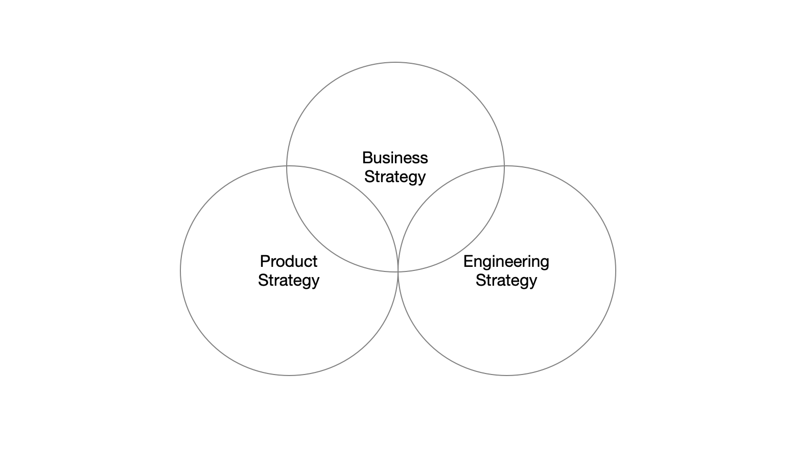

Once you become an engineering executive, an invisible timer starts ticking in the background. Tick tick tick. At some point that timer will go off, at which point someone will rush up to you demanding an engineering strategy.  

一旦你成为一名工程主管，一个无形的计时器就开始在后台滴答作响。滴答滴答。在某些时候，这个计时器会响起，这时有人会冲到你面前要求制定工程战略。  

It won’t be clear what they mean, but they will want it, really, really badly. If we just had an engineering strategy, their eyes will implore you, things would be okay. For a long time, those imploring eyes haunted me, because I simply didn’t know what to give them: what _is_ an engineering strategy?  

他们的意思并不清楚，但他们会想要，真的，非常想要。如果我们有一个工程战略，他们的眼睛会恳求你，事情就会好起来。在很长一段时间里，这些恳求的目光一直困扰着我，因为我根本不知道该给他们什么：什么是工程策略？

From [Magnitudes of exploration](https://lethain.com/magnitudes-of-exploration/), which described Stripe’s aspirational approach to balancing between technical standardization and exploration, to _Staff Engineer_’s [Writing engineering strategy](https://staffeng.com/guides/engineering-strategy) (which I rewrote four times from scratch), I kept iterating on my definition.  

从描述Stripe在技术标准化和探索之间取得平衡的理想方法的Magnitudes of exploration，到Staff Engineer的写作工程策略（我从头开始重写了四次），我不断地迭代我的定义。

Operating in the executive role, I’ve finally been able to solidify my point of view on what engineering strategy should accomplish, and how an engineering executive can guide that strategy’s creation.  

在执行的过程中，我终于能够巩固我的观点，即工程战略应该实现什么，以及工程执行人员如何指导该战略的建立。  

Starting where I was a few years ago–not quite knowing what engineering strategy was–we’ll work through:  

从我几年前的情况开始--不大知道工程战略是什么--我们将通过工作。

-   An example engineering strategy  
    
    一个工程战略的例子
-   Richard Rumelt’s definition of strategy: diagnosis, guiding policies, and coherent actions  
    
    理查德-鲁梅尔特对战略的定义：诊断、指导性政策和一致的行动
-   How and when to write your engineering strategy  
    
    如何以及何时撰写你的工程战略
-   Dealing with undocumented strategies in other functions  
    
    处理其他功能中的无文件的策略
-   Structuring your guiding policies around your: resource allocation, fundamental rules, and how decision are made  
    
    围绕资源分配、基本规则和决策方式制定指导性政策
-   Maintaining the right altitude in your strategy by ensuring guiding principles are: applicable, enforced, and create leverage  
    
    通过确保指导原则的适用性、执行性和创造杠杆作用，在你的战略中保持正确的高度。
-   The most common kinds of coherent actions in engineering strategies  
    
    工程战略中最常见的几种连贯行动
-   Whether strategy should be executive-lead  
    
    战略是否应该由行政人员主导

While the engineering organization may contain many strategies, there is only one overarching engineering strategy.  

虽然工程组织可能包含许多战略，但只有一个总体的工程战略。  

This document–often an implicit document that no one’s ever quite written down–is your constitutional document for running engineering, and writing it is one of the most valuable things you’ll do as an engineering executive.  

这份文件--通常是一份隐含的文件，没有人完全写下来--是你管理工程的宪法文件，编写它是你作为一个工程主管所做的最有价值的事情之一。

## Example strategy  

战略实例

_I’m starting with an example strategy to demonstrate the concepts we’ll work through in this piece._ _If you’d prefer to end with this example, you’re encouraged to skip this section and return after reading the rest._  

我从一个例子的策略开始，来展示我们在这篇作品中所要学习的概念。如果你希望以这个例子作为结束，我们鼓励你跳过这一节，在阅读完其他内容后再回来。

___

The major factors we want our strategy to address are (e.g. our diagnosis of our circumstances):  

我们希望我们的战略所要解决的主要因素是（如我们对自身情况的诊断）。

-   We support three business lines (consumer, business to business, and new experiments). 80% of revenue comes from consumer, 20% from b2b, and new experiments is pre-revenue.  
    
    我们支持三条业务线（消费者、企业对企业和新实验）。80%的收入来自消费者，20%来自企业对企业，而新的实验是预收入。  
    
    We expect the majority of revenue growth this year to occur in b2b, there will be sub 15% revenue growth in consumer, and believe there is a small but real chance of outsized returns from new experiments in the next 3-5 years  
    
    我们预计今年的大部分收入增长将发生在B2B领域，消费者领域将有低于15%的收入增长，并相信在未来3-5年内，新的实验有一个小但真实的机会获得超额回报。
-   We are an engineering organization of 400 (300 engineers, 40 managers, and 10 technical program managers). We project remaining cash-flow neutral to the extent we maintain our current size  
    
    我们是一个有400人的工程组织（300名工程师、40名经理和10名技术项目经理）。我们计划在保持现有规模的前提下，保持现金流的中性。
-   The #1 concern in our most recent [developer productivity survey](https://infraeng.dev/developer-survey/) is test flakiness. Further, our test stability dashboards show stability has decreased ~40% YoY, causing one in three builds to fail incorrectly  
    
    在我们最近的开发人员生产力调查中，第一大关注点是测试的不稳定性。此外，我们的测试稳定性仪表板显示稳定性同比下降了约40%，导致每三个构建中就有一个错误地失败。
-   Since growing to 400 engineers, we’re seeing a significant spike in culture survey that folks don’t have the necessary information to do their work. As we followed up, we heard that people are particularly feeling unaware of releases and decisions being made on other teams  
    
    自从发展到400名工程师后，我们看到文化调查中出现了一个明显的高峰，即人们没有必要的信息来完成他们的工作。在我们的跟踪调查中，我们听到人们特别感到对其他团队的发布和决策不了解。

Our guiding policies to solve for those constraints are:  

我们解决这些制约因素的指导性政策是。

-   **Maintain 4:1 product engineer to infrastructure engineer ratio.** This has been our ratio for the past several years, and it’s worked fairly well, so we intend to maintain it.  
    
    保持4:1的产品工程师和基础设施工程师比例。这是我们过去几年的比例，而且效果相当好，所以我们打算保持这个比例。
    
    For our next strategy refresh, we intend to also explicitly break out security and data engineering ratios, with the hope of becoming more deliberate in our staffing efforts there  
    
    在我们的下一次战略更新中，我们还打算明确列出安全和数据工程的比例，希望在人员配置方面变得更加慎重。
    
-   **Target 45% product engineering resourcing towards b2b, 35% towards consumers, and 10% towards new bets.** **The remaining 10% will be focused on a 12 month investment into developer productivity.** Relative to last year, we’re shifting about 20% more capacity towards b2b, as we see significant revenue growth happening there, and haven’t seen growth rebound in consumer.  
    
    目标是45%的产品工程资源用于B2B，35%用于消费者，10%用于新投资。剩下的10%将专注于对开发人员生产力的12个月投资。与去年相比，我们将把大约20%的能力转向B2B，因为我们看到那里正在发生重大的收入增长，而消费者方面还没有看到增长反弹。  
    
    We want to maintain an ongoing investment towards new bets, but nothing has shown enough traction yet to warrant spinning out into its own business line. This shift will result in some team movement.  
    
    我们希望保持对新赌注的持续投资，但目前还没有任何东西显示出足够的牵引力，以保证将其分离出来成为自己的业务线。这种转变将导致一些团队的流动。
    
    The 10% investment towards developer productivity won’t impact team structure, instead each team will have some portion of its time prioritized towards developer productivity work (described in more detail in the “actions” section)  
    
    对开发者生产力的10%的投资不会影响团队结构，相反，每个团队将有一部分时间被优先用于开发者生产力工作（在 "行动 "部分有更详细的描述）。
    
-   **Stay cash-flow neutral.** We will avoid any actions that make us cash-flow negative. Particularly we will avoid hiring that grows our current headcount. In cases where staying cash-flow neutral is in conflict with using vendors for commodity solutions, have a discussion including the head of engineering  
    
    保持现金流中立。我们将避免任何使我们的现金流为负的行动。特别是，我们将避免增加我们目前的员工人数的招聘。在保持现金流中立与使用供应商的商品解决方案相冲突的情况下，要与工程主管进行讨论。
    
-   **Use our standard technology stack and process (or escalate to tech spec review).** We use our standard technology stack and processes (documented on our wiki) for all projects. Any projects that wants to introduce a new technology or deviate from our standard processes should be reviewed through our tech spec review process.  
    
    使用我们的标准技术栈和流程（或升级到技术规格审查）。我们在所有项目中使用我们的标准技术栈和流程（在我们的维基上有记录）。任何想要引入新技术或偏离我们标准流程的项目都应通过我们的技术规格审查程序进行审查。  
    
    This allows us to ensure we maximize the impact of our developer productivity investments, our security investments, facilitate easy cross-team transfers, and critically eases maintaining our compliance controls.  
    
    这使我们能够确保我们的开发人员生产力投资和安全投资的影响最大化，促进跨团队的转移，并在很大程度上简化了维护我们的合规控制。
    
    I appreciate that this can feel draconian. This policy’s aim is to ensure we’re placing deliberate innovation bets, and completing our inflight bets before making new ones. The aim is _not_ to avoid all new bets, and we encourage surfacing new ideas to tech spec review process for consideration  
    
    我明白，这可能会让人感觉很严厉。这项政策的目的是确保我们审慎地进行创新投注，并在进行新的投注之前完成我们的机上投注。我们的目的不是要避免所有的新赌注，我们鼓励将新的想法提交给技术规格审查过程，以供考虑。
    
-   **If it’s unclear and seems risky, or there’s significant disagreement, quickly escalate technical issues to tech spec review, and other issues up the management chain.** If there’s no written decision, the decision is risky or a trap-door decision, and it’s unclear who the owner is, then you should escalate! Technical decisions should escalate to tech spec review, and other decisions should escalate up the management chain.  
    
    如果不清楚，似乎有风险，或有重大分歧，迅速将技术问题升级到技术规格审查，以及其他问题升级到管理链。如果没有书面决定，决定是有风险的，或者是一个陷阱门的决定，而且不清楚谁是所有者，那么你应该升级技术决定应该升级到技术规格审查，而其他决定应该升级到管理链。
    
    Escalations are often viewed as “negative” or “hostile”, but I want to really push back on that framing. Escalations are a natural part of working together, and allow us to quickly make decisions with the necessary context to make effective decisions.  
    
    升级往往被视为 "消极 "或 "敌对"，但我想真正反驳这种框架。升级是共同工作的一个自然部分，使我们能够在必要的背景下迅速作出决定，以做出有效的决定。  
    
    Escalations are only slow if we (in tech spec review, or in the management team) are slow, and we should fix that by addressing latency rather than assuming process is inherently slow!  
    
    只有当我们（在技术规格审查中，或在管理团队中）的速度很慢时，升级才会很慢，我们应该通过解决延迟问题来解决这个问题，而不是假设流程本来就很慢！"。
    
-   **All technical changes announced in #tech-updates, all releases shared in #shipped.** In an attempt to reduce surprises from technical decisions not being communicated widely, as well as cross-product impacting changes being shipped without visibility to other impacted teams, we are requiring both changes be communicated within #tech-updates and #shipped channels respectively.  
    
    所有的技术变化都在#tech-updates中公布，所有的发布都在#shipped中分享。为了减少因技术决定没有被广泛传达而产生的意外，以及跨产品影响的变化在其他受影响的团队看不到的情况下被发布，我们要求这两种变化分别在#tech-updates和#shipped频道中传达。
    
    It’s possible we’ll need a heavier solution, but we want to start with something simple  
    
    我们有可能需要一个更重的解决方案，但我们想从简单的东西开始。
    

While many of these guiding policies are continued from last year, several of them do require specific one-time actions to implement:  

虽然这些指导性政策中有许多是延续去年的，但其中有几项确实需要采取具体的一次性行动来实施。

-   **Org updates to shift product engineering from consumer to b2b.** We’re shifting about 10% of product engineering capacity towards b2b engineering, in support of b2b’s accelerating revenue growth. This will result in several teams moving across organizations.  
    
    组织更新，将产品工程从消费者转向B2B。我们正在将大约10%的产品工程能力转向B2B工程，以支持B2B加速的收入增长。这将导致几个团队跨组织流动。  
    
    There will be a small number of individuals moving as well, and generally we’re facilitating mobility towards b2b.  
    
    也会有少量的个人流动，一般来说，我们在促进向B2B的流动。
    
    See details in B2B Priorities update  
    
    详情见B2B优先事项更新
    
-   **Test Stability working group moving forward.** As documented in the recent Test Stability update, we’ll be devoting 10% of product engineering time this year towards improving test stability.  
    
    测试稳定性工作小组在前进。正如最近的测试稳定性更新中所记载的，我们今年将把10%的产品工程时间用于提高测试稳定性。  
    
    We will also be devoting a significant amount of infrastructure engineering time there as well, with test stability being their third stability (behind security and overall site stability).  
    
    我们也将在那里投入大量的基础设施工程时间，测试稳定性是他们的第三个稳定性（仅次于安全和网站整体稳定性）。
    
    Read the latest Test Stability update for more details  
    
    阅读最新的测试稳定性更新以了解更多细节
    
-   **Tech spec review: now also doing light-weight async reviews.** We’re asking tech spec review to take on a larger role in reviewing technical decisions, but at the same time we want to acknowledge the feedback that it’s taking 1-2 weeks for tech spec review to provide actionable feedback on many questions coming their way.  
    
    技术规格审查：现在也做轻量级的异步审查。我们要求技术规格审查在审查技术决定方面发挥更大的作用，但同时我们也要承认这样的反馈：技术规格审查需要1-2周的时间来对许多问题提供可操作的反馈。  
    
    We’re now asking that all requests to TSR start in chat, at which point TSR will handle them immediately async if feasible, and only ask more complex topics to come to a weekly review session.  
    
    我们现在要求所有向TSR提出的请求都从聊天开始，如果可行的话，TSR会立即异步处理这些请求，只要求更复杂的主题来参加每周的审查会议。
    
    We also intend to expand staffing on TSR in the next four weeks, update coming on that shortly  
    
    我们还打算在未来四周内扩大TSR的人员配置，很快就会有最新进展。
    

If you have questions on the engineering strategy, we’ll be discussing it at our next engineering Q&A on Wednesday, and you’re also welcome to ask in #eng-ask-anything at anytime!  

如果你对工程策略有疑问，我们将在周三的下一次工程问答中讨论，同时也欢迎你随时在#eng-ask-anything中提问。

___

_That ends the example engineering strategy, and now we’ll move on to breaking down the various components.  

这就结束了工程策略的例子，现在我们将继续分解各个组成部分。_

## Defining strategy  

确定战略

Richard Rumelt’s [Good Strategy, Bad Strategy](https://www.amazon.com/dp/B004J4WKEC) is the most approachable book on strategy that I’ve read, and I’ve learned a great deal from it. Most importantly, it provides a concise, useful definition of what strategy is. A strategy is composed of three parts:  

理查德-鲁梅尔特的《好的战略，坏的战略》是我读过的最平易近人的战略书籍，我从里面学到了很多东西。最重要的是，它为什么是战略提供了一个简明、有用的定义。一个战略由三部分组成。

1.  **Diagnosis:** a theory describing the nature of the challenge. This is trying to identify the root cause(s) at play, for example, “high work-in-progress is preventing us from finishing any tasks, so we are increasingly behind each sprint” might be a good diagnosis  
    
    诊断：一个描述挑战性质的理论。这是在试图确定起作用的根本原因，例如，"高的在制品使我们无法完成任何任务，所以我们每次冲刺都越来越落后 "可能是一个好的诊断。
2.  **Guiding policies:** the approaches you’ll apply to grapple with the challenge. Guiding policies are typically going to be implicit or explicit tradeoffs. For example, a guiding policy might be “only hire for most urgent team, do not spread hires across all teams.  
    
    指导政策：你将采用的方法来应对挑战。指导性政策通常是隐性或显性的权衡。例如，一个指导性政策可能是 "只为最紧急的团队招聘，不要在所有团队中分散招聘。  
    
    ” If a guiding policy doesn’t imply a tradeoff, you should be suspicious of it (e.g. “working harder to get it done” isn’t really a guiding policy)  
    
    "如果一项指导性政策并不意味着取舍，你应该怀疑它（例如，"更努力地工作以完成任务 "并不是真正的指导性政策）。
3.  **Coherent actions:** a set of specific actions directed by guiding policy to address challenge. This is the most important part, and I think the most exciting part, because it clarifies that a strategy is only meaningful if it leads to aligned action  
    
    连贯的行动：由指导性政策指导的一系列具体行动，以应对挑战。这是最重要的部分，我认为也是最令人兴奋的部分，因为它阐明了只有当战略导致一致的行动时才有意义。

The first time I read this definition was eye-opening, because it solved two problems I’ve been thinking about for a long time. First, how come when there is a written strategy, it’s almost always irrelevent to the situation at hand?  

我第一次读到这个定义时大开眼界，因为它解决了我长期以来一直在思考的两个问题。第一，为什么有了书面策略后，它几乎总是与眼前的情况无关？  

Second, how come so many people talk about needing strategy, but there’s almost never anything written down?  

第二，为什么这么多人都在谈论需要战略，但几乎从来没有写下什么？

The reason most written strategies don’t apply is because they’re actually visions of how things could ideally work, rather than accurate descriptions of how things work today. This means they don’t help you plot a course through today’s challenges to the desired state.  

大多数书面战略不适用的原因是，它们实际上是对事情在理想状态下如何运作的设想，而不是对今天事情如何运作的准确描述。这意味着它们不能帮助你通过今天的挑战来规划出一条通往理想状态的路线。

The reason they often aren’t written down, is that strategy is no more, or less, than how the organization tackles its problems, which executives often don’t think is valuable to write down.  

它们往往没有被写下来，原因是战略不外乎是组织如何解决其问题，而高管们往往认为这没有写下来的价值。  

That’s not to say that these undocumented strategies are consistently good strategies, they often aren’t, but if you’ve ever been upset that your company doesn’t have an engineering strategy, then I assure you that you do!  

这并不是说这些没有记录的策略是一贯的好策略，它们往往不是，但如果你曾经为你的公司没有工程策略而感到不安，那么我向你保证，你有！你有！你有！"。  

Your engineering strategy is how you approach your current challenges.  

你的工程战略是你如何对待你目前的挑战。

## Writing process  

写作过程

In _Staff Engineer_, I argued that writing an engineering strategies is like being a historian: look at how things are already working, write them down, and share what you’ve written:  

在《员工工程师》一书中，我认为写工程策略就像做一个历史学家：看看事情是如何运作的，把它们写下来，然后分享你写的东西。

> To write an engineering strategy, write five design documents, and pull the similarities out. That’s your engineering strategy. To write an engineering vision, write five engineering strategies, and forecast their implications two years into the future.  
> 
> 要写一个工程策略，要写五个设计文件，并把相似的地方拉出来。这就是你的工程战略。要写一个工程愿景，就要写五个工程战略，并预测它们在未来两年的影响。  
> 
> That’s your engineering vision.  
> 
> 这就是你的工程设想。

This remains, in my opinion, the most effective way to write useful engineering strategies as a Staff-plus engineer.  

在我看来，这仍然是作为一名职员加工程师编写有用的工程策略的最有效方法。  

That’s because enforcing strategy is the biggest challenge for Staff-plus engineers driving strategy work, and this approach collects well-documented precedents to build consensus around. That consensus is the basis for enforcing the strategy going forward.  

这是因为对于推动战略工作的Staff-plus工程师来说，执行战略是最大的挑战，而这种方法收集了有据可查的先例，以建立共识。这种共识是今后执行战略的基础。

As an engineering executive, you don’t need to rely on consensus to drive enforcement, which means you can take a much more direct path to writing your strategy document. Rather than enforcement, your biggest risks are writing a weak diagnosis or ineffective guiding policies.  

作为一个工程主管，你不需要依靠共识来推动执行，这意味着你可以采取更直接的方式来编写你的战略文件。与其说是执行，不如说你最大的风险是写出一个薄弱的诊断或无效的指导性政策。  

Managing those risks leads to a different process.  

管理这些风险会导致一个不同的过程。

The process I recommend for executives is:  

我为高管们推荐的过程是。

1.  Commit to writing this yourself! Delegation is an extremely valuable executive skill, but the engineering strategy will significantly shape how the engineering organization functions.  
    
    承诺自己写这个!授权是一种极其宝贵的执行技能，但工程战略将大大塑造工程组织的运作方式。  
    
    As the company’s engineering executive, you have the unique perspective to write this strategy, which no one else will have.  
    
    作为公司的工程主管，你有独特的视角来撰写这一战略，其他人不会有这样的视角。
    
    If you recently joined and are worried that you don’t know enough yet to write this yourself, rest assured that writing the strategy is one of the best learning opportunities you’ll get, and there are a number of safeguards in the process to catch mistakes  
    
    如果你最近加入，担心自己还不够了解，不能自己写，请放心，写策略是你最好的学习机会之一，而且在这个过程中，有很多保障措施可以抓住错误
    
2.  Identify full set of stakeholders you want to align the strategy with. While you’ll certainly want to build buy-in with the full engineering team, the stakeholders list here should be edited down a bit.  
    
    确定你要调整战略的全部利益相关者。虽然你肯定想在整个工程团队中建立起认同感，但这里的利益相关者名单应该略作修改。  
    
    It should likely include the executive team, the senior-most Staff-plus engineers, the senior-most engineering managers, and potentially a few additional business and product leaders  
    
    它可能应该包括执行团队、最资深的员工加工程师、最资深的工程经理，以及可能的一些额外的业务和产品领导人。
    
3.  From within that full set of stakeholders, identify three to five to provide early, rapid feedback. This is your strategy working group. You’ll share your roughest drafts with them, and their input will deeply shape the document.  
    
    从这些利益相关者中，确定三到五个人提供早期的快速反馈。这就是你的战略工作小组。你将与他们分享你最粗略的草案，他们的意见将深深地影响文件。
    
    I recommend several Staff-plus engineers, a few of your direct reports, and your product counterpart.  
    
    我推荐几个职员以上的工程师，几个你的直接报告，以及你的产品对应人员。  
    
    At earlier stage companies, this may well include the CEO, but remember that you’re here to do something the CEO isn’t able to do (whether it’s due to time or capability constraints), so I’d generally steer away from including the CEO in this smaller working group  
    
    在早期阶段的公司，这很可能包括首席执行官，但请记住，你是来做首席执行官不能做的事情的（无论是由于时间或能力的限制），所以我一般会避免将首席执行官包括在这个较小的工作小组中。
    
4.  Write your diagnosis section. Start with the current roadmap, competitive pressures, and financial plan. If you have cultural survey or [developer productivity survey](https://infraeng.dev/developer-survey/) data, incorporate those results in. Pull in all the problems you’ve learned in your 1:1s and team meetings. Remember to trust your judgment: you’re leading the engineering function for a reason.  
    
    写下你的诊断部分。从当前的路线图、竞争压力和财务计划开始。如果你有文化调查或开发人员生产力调查的数据，把这些结果纳入其中。把你在1对1和团队会议上了解到的所有问题都写进去。记住要相信自己的判断：你领导工程部门是有原因的。
    
    However, don’t trust your judgment too much. Once you’ve drafted the diagnosis, workshop it with the individuals in your strategy working group. I’d generally recommend doing it 1:1 with each member, as it’s easier to get direct feedback in a smaller group.  
    
    然而，不要太相信自己的判断。一旦你起草了诊断书，就与你的战略工作小组中的个人进行讨论。我一般建议与每个成员进行1对1的讨论，因为在一个较小的小组里更容易得到直接的反馈。  
    
    Meet with one group member, listen to their feedback, then incorporate that feedback before reviewing it with the next member. Once you’ve incorporated all that feedback, share a final draft with the working group before moving forward  
    
    与一个小组成员见面，听取他们的反馈意见，然后在与下一个成员审查之前纳入这些反馈意见。一旦你采纳了所有的反馈意见，在继续前进之前与工作组分享最后的草案。
    
5.  Write your guiding policies. This starts with the same process as writing your diagnosis, but it ends with an extra step.  
    
    写下你的指导性政策。这与写诊断书的过程相同，但最后多了一个步骤。
    
    After incorporating working group feedback, I highly encourage you to also get private feedback from two to three external engineering executives.  
    
    在吸收了工作组的反馈意见后，我强烈鼓励你也从两到三个外部工程主管那里获得私人反馈。  
    
    It’s only other engineering executives who will fully understand your incentives and challenges, which makes their feedback uniquely valuable.  
    
    只有其他工程主管才会完全理解你的激励措施和挑战，这使得他们的反馈具有独特的价值。  
    
    That doesn’t mean they’re necessarily right, they will be overreliant on pattern matching since they are missing most of your company’s context  
    
    这并不意味着他们一定是对的，他们会过度依赖模式匹配，因为他们缺少你公司的大部分背景。
    
6.  Now share the combined diagnosis and guiding policies with the full set of stakeholders. I recommend sharing the full document with the group, then spending time with those who have the most feedback.  
    
    现在与所有利益相关者分享综合诊断和指导性政策。我建议与小组分享完整的文件，然后花时间与那些有最多反馈的人分享。  
    
    You often won’t get much feedback at this stage, which is fine, you are now moving into socializing the plan rather than simply _craft_ing it.  
    
    在这个阶段，你往往不会得到太多的反馈，这很好，你现在正进入计划的社会化，而不是简单地制定计划。
    
    Be aware that once you share the document with the full set of stakeholders, it will almost inevitably leak out to the wider company. Companies are design to spread context, not to conceal it, and you just can’t fight that tendency.  
    
    请注意，一旦你与所有利益相关者分享文件，它几乎不可避免地会泄露给更广泛的公司。公司的设计是为了传播背景，而不是为了掩盖它，你不能对抗这种趋势。  
    
    Instead, make sure to edit out anything too sensitive to share widely, particularly changes that directly impact individuals or teams  
    
    相反，确保编辑掉任何过于敏感而不能广泛分享的内容，特别是直接影响个人或团队的变化。
    
7.  Write the coherent actions. The actions are usually less complex and less controversial than the guiding policies themselves, although not always. Iterate on the draft actions with the working group.  
    
    编写连贯的行动。这些行动通常没有指导性政策本身那么复杂，也没有那么多争议，但也不一定。与工作小组一起对行动草案进行反复讨论。  
    
    If the actions are controversial, you may want to review it with some members of the extended stakeholder group, but often that’s not necessary  
    
    如果行动是有争议的，你可能想与扩大的利益相关者群体的一些成员一起审查，但往往没有必要这样做
    
8.  You’re almost ready to share the strategy with the full organization, but there’s one step left. Partner with your working group to identify the individuals in the wider team who are most likely to be upset or to strongly disagree with the strategy.  
    
    你几乎已经准备好与整个组织分享战略了，但还剩下一步。与你的工作小组合作，确定更广泛的团队中最有可能对该战略感到不满或强烈反对的人。  
    
    Then go spend time 1:1 with those people.  
    
    然后去花时间与这些人1:1相处。
    
    Your goal is to make sure they feel heard, and that you understand their feedback. If the feedback is helpful, then incorporate it into the strategy, but be careful not to compromise the strategy to make it more popular  
    
    你的目标是确保他们感到被倾听，并且你理解他们的反馈。如果反馈是有帮助的，那么就把它纳入战略，但要注意不要为了使战略更受欢迎而损害战略。
    
9.  Share the written strategy with the engineering organization, schedule a meeting to share the strategy and the rationale behind it (as well as take questions), and establish a timeline for taking feedback.  
    
    与工程组织分享书面战略，安排一次会议来分享战略及其背后的理由（以及接受提问），并建立一个接受反馈的时间表。
    
    Try to keep this timeline short, roughly a week or so. An extended feedback timeline generates more feedback but rarely better feedback, and prevents you from taking advantage of the strategy  
    
    尽量让这个时间线短一些，大概一个星期左右。延长反馈时间线会产生更多的反馈，但很少有更好的反馈，而且会妨碍你利用这一策略。
    
10.  Finally, finalize the strategy, send out an announcement, and commit to reviewing the strategy’s impact in two months. Your engineering strategy is complete (for now, you’ll of course be updating it on at least an annual cadence)  
    
    最后，敲定战略，发出公告，并承诺在两个月内审查战略的影响。你的工程战略已经完成（目前，你当然会至少每年更新一次）。
    

Although there are a number of steps here, they can be done very quickly, and it’s much faster than the Staff-plus engineer’s documentation-driven approach. Not only is it relatively quick, this is one task that I’d recommend engineering executives start on sooner than later.  

虽然这里有很多步骤，但可以很快完成，而且比Staff-plus工程师的文档驱动方法快得多。不仅是相对快速，这也是我建议工程主管尽早开始的一项任务。

## When to write the strategy  

什么时候写策略

You can work your entire career without seeing a documented engineering strategy. When I worked at Uber, there were many rules scattered across the organization, but there was never a documented, overarching engineering strategy.  

你可以在整个职业生涯中都没有看到一个成文的工程战略。当我在Uber工作时，有许多规则分散在整个组织中，但从来没有一个成文的、总体的工程战略。  

Stripe, similarly, had no unified engineering strategy, although there were numerous technical jurisdictions, such as detailed requirements for external APIs.  

同样，Stripe也没有统一的工程策略，尽管有许多技术管辖，如对外部API的详细要求。

Shortly after joining Calm, I opened a document, titled it “Engineering Strategy”, and then stared into the blank abyss until putting it away for a year. A year later, I came back and documented three core, guiding principles: [choose boring technology](https://mcfunley.com/choose-boring-technology), resolve conflict with curiosity, and prefer vendors for commoditized functionality. These few, simple statements greatly eased decision making, allowing us to focus more time on improving our product and business.  

在加入Calm后不久，我打开了一份文件，标题是 "工程策略"，然后盯着空白的深渊，直到把它放了一年。一年后，我回来了，并记录了三个核心的指导原则：选择无聊的技术，用好奇心解决冲突，以及偏爱商品化功能的供应商。这几个简单的声明大大缓解了决策的难度，使我们能够把更多的时间放在改善我们的产品和业务上。  

(If I could go back in time, I would move “resolve conflict with curiosity” into our values rather than including it in our strategy, but it’s what I wrote at the time.)  

(如果我能回到过去，我会把 "用好奇心解决冲突 "移到我们的价值观中，而不是把它列入我们的战略中，但这是我当时写的）。

In all three cases, the organizations would have benefitted from writing a technology strategy sooner. The three questions to ask yourself before getting started are:  

在所有这三个案例中，这些组织都会因更早地编写技术战略而受益。在开始之前要问自己的三个问题是。

1.  **Are you either confident in your diagnosis or do you trust the wider engineering organization to inform your diagnosis?** If you’re not confident in your diagnosis, and you’re still not sure whose judgment to trust, then it’s too early to move forward with writing a strategy  
    
    你是对自己的诊断有信心，还是相信更广泛的工程组织为你的诊断提供信息？如果你对你的诊断没有信心，而且你还不确定应该相信谁的判断，那么，现在就开始写战略还为时过早。
2.  **Are you willing and able to enforce the strategy?** If you think that engineers will successfully escalate past your strategy to the CEO, or that you’ll be unwilling to enforce the strategy it teams ignore it, then it’s too early to work on strategy  
    
    你是否愿意并能够执行该战略？如果你认为工程师们会成功地将你的战略升级到CEO，或者你不愿意执行战略，而团队又无视它，那么现在进行战略工作还为时过早。
3.  **Are you confident the strategy will create leverage?** Strategies require an entire organization to change their beahvior, which is quite expensive, and will quickly wear down their trust in you. If you don’t have at least a year’s worth of conviction that it’ll work, then it’s not worth solidifying  
    
    你对该战略是否有信心创造杠杆效应？战略要求整个组织改变他们的行为方式，这是相当昂贵的，而且会迅速消磨他们对你的信任。如果你没有至少一年的信念，相信它能成功，那么它就不值得巩固。

If your answers to those three questions is fairly positive, then I’d push to document the strategy now rather than next month.  

如果你对这三个问题的回答是相当肯定的，那么我就会推动现在而不是下个月就把这个战略记录下来。  

While it’s reasonable to be wary of rolling out strategy too early, every bad strategy rollout I’ve seen has been rooted in the executive’s inability to listen to clear feedback. Waiting wouldn’t have improved their strategy anyway.  

虽然对过早推出战略保持警惕是合理的，但我所见过的每一个糟糕的战略推出都是源于高管无法听取明确的反馈意见。无论如何，等待并不能改善他们的战略。

## Dealing with missing company strategies  

处理缺失的公司战略问题

Engineering strategies are rarely documented, and unfortunately this is part of a larger problem: surprisingly few companies document any of their strategies.  

工程战略很少被记录下来，不幸的是这是一个更大的问题的一部分：令人惊讶的是很少有公司记录他们的任何战略。  

This is a problem, because it’s remarkably difficult to write an effective diagnosis without understanding the company’s other strategies that should inform engineering’s strategy.  

这是一个问题，因为如果不了解公司的其他战略，就很难写出有效的诊断书，而这些战略应该为工程的战略提供参考。

The good news is that these strategies do exist, even if they aren’t written down or are visions pretending to be strategies.  

好消息是，这些战略确实存在，即使它们没有被写下来，或者是假装成战略的愿景。  

The bad news is that this means you’ll have to do some work of your own to make sure you understand these other strategies before you start writing engineering’s.  

坏消息是，这意味着你必须做一些自己的工作，以确保你在开始写工程之前了解这些其他策略。

The overachieving executive’s default approach here is trying to train the company on writing good strategies, and then run a company-wide strategy documentation process.  

成绩优异的高管在这里的默认做法是试图对公司进行编写好战略的培训，然后在全公司范围内开展战略文件编制工作。  

That might work, but going that route will slow down writing a useful engineering strategy by months, quarters or years. You can probably move faster by [modeling a good strategy within engineering](https://lethain.com/model-document-share/) than trying to directly change the overall approach to strategy; if the executive team was aligned on doing strategy this way, it would already be done.  

这可能会起作用，但如果走这条路，写一个有用的工程战略就会慢上几个月、几个季度或几年。与试图直接改变战略的整体方法相比，你可以通过在工程中建立一个好的战略模型来加快进度；如果执行团队同意这样做战略，它就已经完成了。

Instead, I recommend focusing on the handful of non-engineering strategies that are most relevant to engineering, and privately documenting their strategies yourself.  

相反，我建议把重点放在与工程最相关的少数非工程策略上，并私下里自己记录他们的策略。  

The business and product strategies are usually the most important starting places, but that will vary by the particulars of your business.  

业务和产品战略通常是最重要的起点，但这将因你的业务的具体情况而有所不同。  

For each strategy you need to document, spend time with the responsible executive understanding their perspective until you can write a short draft of their strategy.  

对于你需要记录的每一项战略，要花时间与负责的高管一起了解他们的观点，直到你能写出他们战略的简短草稿。  

Once you have the draft, test it with that executive to make sure it’s generally accurate, then keep it as a private draft to inform your understanding.  

一旦你有了草案，就与该高管进行测试，以确保它总体上是准确的，然后将其作为私人草案保留，以告知你的理解。  

It may be tempting to share this written draft more widely, but instead of unlocking progress on the engineering strategy, you’ll instead find yourself in conflict with the responsible executive for undermining them.  

也许你很想更广泛地分享这份书面草案，但你非但没有释放出工程战略的进展，反而会发现自己因为破坏了这些战略而与负责任的主管发生冲突。

Some of the questions that I’ve found valuable to explore in these draft strategies are:  

我发现在这些战略草案中，一些有价值的探索问题是。

-   What are cash-flow targets?  
    
    什么是现金流目标？
-   What is the investment thesis across functions (e.g. sales and marketing, research and development, general and administrative)?  
    
    各职能部门（如销售和营销、研究和开发、一般和行政）的投资论文是什么？
-   What is the intended role of mergers and acquisitions?  
    
    合并和收购的预期作用是什么？
-   What is the business unit structure? How do the business units support one-another? How are costs expensed across business units?  
    
    什么是业务单位的结构？各业务单位如何相互支持？各个业务单位的成本是如何支出的？
-   Who are your products’ users, what do they need, and how are you prioritizing across those users?  
    
    谁是你产品的用户，他们需要什么，以及你如何在这些用户中确定优先次序？
-   How will other functions evaluate success over the next year?  
    
    其他职能部门将如何评估明年的成功？
-   What are your current distribution mechanisms, and how are you trying to change them?  
    
    你目前的分配机制是什么，你是如何试图改变它们的？
-   What are the most important competitive threats?  
    
    最重要的竞争威胁是什么？
-   What about the current strategy is _not_ working?  
    
    目前的战略有哪些地方不奏效？

Drafting these missing strategy documents is always tricky, and your goal is to pull together a reasonable sketch, not to write something perfect. If you get stuck, spend another cycle validating your diagnosis, and then move forward to guiding policies.  

起草这些缺失的战略文件总是很棘手，你的目标是拉出一个合理的草图，而不是写出完美的东西。如果你被卡住了，再花一个周期来验证你的诊断，然后再推进到指导性政策。  

If you’ve missed something important, writing the policies will often reveal the gap for you.  

如果你错过了一些重要的东西，写下政策往往会为你揭示出差距。

## Structuring your guiding policies  

构建你的指导性政策

With your diagnosis in hand, the next step is determining guiding policies. There are many, many ways to articulate your guiding policies, but I would recommend starting by answering three key questions, which I believe get at the heart of effective engineering strategy:  

有了诊断结果，下一步就是确定指导性政策。有很多很多方法来阐述你的指导政策，但我建议从回答三个关键问题开始，我相信这三个问题是有效工程战略的核心。

1.  **What is the organization’s resource allocation against its priorities?** **(And why these ones?)**  
    
    本组织对其优先事项的资源分配是什么？(为什么是这些？)
    
    Competition can be healthy, but competing internally on budget and headcount tends to reward [empire building rather than effectiveness](https://lethain.com/create-capacity/). It also means you’ll often underinvest in critical priorities like compliance or security. Avoid this sort of internal competition by ensuring your engineering strategy clearly articulates resourcing and priorities.  
    
    竞争可以是健康的，但在预算和人数上的内部竞争往往会奖励帝国的建立而不是有效性。这也意味着你往往会在关键的优先事项上投资不足，如合规性或安全性。通过确保你的工程战略清楚地阐明资源和优先事项来避免这种内部竞争。
    
    As an engineering executive, it’s particularly important to think about the priorities that no one else is asking for (especially security, reliability, compliance, and developer productivity), and ensure your investment thesis addresses those.  
    
    作为一个工程主管，考虑其他人没有要求的优先事项（特别是安全性、可靠性、合规性和开发人员的生产力），并确保你的投资论文能解决这些问题，这一点尤其重要。
    
    Just as important is connecting the resource allocation back to your diagnosis. This grounds your allocation in the specific constraints you’re solving for, and makes it clear what problems any counter-proposal must address.  
    
    同样重要的是将资源分配与你的诊断联系起来。这将使你的分配以你正在解决的具体限制因素为基础，并明确任何反建议必须解决哪些问题。
    
    **Example:** We aim to maintain a ratio of 4 product engineers for every 1 platform engineer (security, reliability, infrastructure, developer productivity, etc).  
    
    例子。我们的目标是保持4个产品工程师对1个平台工程师的比例（安全、可靠性、基础设施、开发人员生产力等）。  
    
    In addition to that standard ratio, this year we are running two major projects outside of that ratio, prioritizing a total of 10 engineers on security (all production access requires MFA and is connected to an uneditable audit-trail), and developer productivity (progressive migration of all JavaScript codebases to TypeScript)  
    
    除了这个标准比例之外，今年我们还在这个比例之外开展了两个主要项目，在安全（所有的生产访问都需要MFA，并与不可编辑的审计轨迹相连）和开发者生产力（逐步将所有的JavaScript代码库迁移到TypeScript）方面共优先考虑了10名工程师。
    
2.  **What are the fundamental rules that all teams must abide by?** **(And why do they matter?)**  
    
    什么是所有团队必须遵守的基本规则？(以及它们为什么重要？)
    
    Many of the most impactful guiding policies are predicated on broad, consistent adoption. For example, requiring all backend projects to be implemented in Golang would greatly narrow your security, compliance, and tooling needs.  
    
    许多最具影响力的指导性政策是以广泛、一致的采用为前提的。例如，要求所有的后端项目都用Golang实现，将大大缩小你的安全、合规和工具需求。  
    
    Similarly, requiring all new projects to use a specific database would narrow those needs.  
    
    同样，要求所有新项目都使用一个特定的数据库将缩小这些需求。
    
    These sorts of rules _must_ be specified at the engineering organizational level because that’s the only place where you can make the appropriate, organization-level tradeoffs.  
    
    这类规则必须在工程组织层面指定，因为只有在这里你才能做出适当的、组织层面的权衡。
    
    Folks are much more open to following rules if you explain why the rules are valuable, so I strongly recommend explicitly explaining why each rule is important. Things that are obvious to you may not be obvious to others.  
    
    如果你能解释为什么这些规则是有价值的，人们会更愿意遵守规则，所以我强烈建议明确解释为什么每条规则都很重要。对你来说很明显的事情，对其他人来说可能并不明显。
    
    **Example:** All development must use our standard development stack ( background services use Golang, frontend services use TypeScript, storage is in a service-isolated instance of Aurora PostgreSQL) and development lifecycle (standard code review, linting, and deployment processes documented in Development Lifecycle wiki).  
    
    例子。所有的开发必须使用我们的标准开发栈（后台服务使用Golang，前端服务使用TypeScript，存储在Aurora PostgreSQL的服务隔离实例中）和开发生命周期（开发生命周期维基中记录的标准代码审查、刷新和部署流程）。  
    
    Exceptions to these rules must be approved by both Tech Spec Review and CTO  
    
    这些规则的例外情况必须得到技术规格审查和CTO的批准。
    
3.  **How are decisions made within engineering?** **(And why do we work this way?)**  
    
    工程学内部是如何做出决定的？(以及为什么我们要这样工作？)
    
    Even the most comprehensive strategy will omit many important details, but it should explain how those decisions are generally made. This is a nuanced navigation of [positive and negative freedoms](https://lethain.com/company-culture-and-managing-freedoms/) between teams and others impacted by their decisions.  
    
    即使是最全面的战略也会遗漏许多重要的细节，但它应该解释这些决定一般是如何做出的。这是对团队和受其决定影响的其他人之间积极和消极自由的细微导航。
    
    You want teams to know what they can decide themselves, what they should optimize for when making those decisions, and how to move forward with decisions that they can’t make independently.  
    
    你要让团队知道他们自己能决定什么，在做这些决定时应该优化什么，以及如何推进他们不能独立做出的决定。  
    
    You also want individuals to know why you work this way: there are many implicit tradeoffs in each way of working, and these tradeoffs are often invisible to folks who are frustrated with a current process.  
    
    你也希望个人知道你为什么这样工作：每一种工作方式都有许多隐含的权衡，而这些权衡对于那些对当前流程感到沮丧的人来说往往是看不见的。
    
    **Example:** Technical decisions that deviate from the standard development stack or standard development lifecycle should be approved by Tech Spec Review and CTO. Changes to those two standards should similarly be approved by Tech Spec Review and CTO.  
    
    例子。偏离标准开发堆栈或标准开发生命周期的技术决定应得到Tech Spec Review和CTO的批准。对这两个标准的修改也应同样由技术规格评审和CTO批准。  
    
    Changes to organizational structure, hiring prioritization, and general people process should be approved by CTO. All other decisions should be made by the teams and leaders closest to the decision.  
    
    对组织结构、招聘优先级和一般人员流程的改变应该由CTO批准。所有其他的决定应该由最接近决策的团队和领导做出。  
    
    If anyone believes we are making a meaningfully suboptimal decision, please escalate that decision using our Escalation Process  
    
    如果有人认为我们正在做出一个有意义的次优决定，请使用我们的升级程序升级该决定
    

If you answer those three questions clearly, you will have an uncommonly valuable engineering strategy.  

如果你清楚地回答了这三个问题，你将拥有一个不寻常的有价值的工程战略。  

At least as importantly, the strategy will be explicit about how it ties into the surrounding company strategies, and the degree of freedom it cedes to the teams and leadership within engineering.  

至少同样重要的是，该战略将明确说明它是如何与周围的公司战略相联系的，以及它赋予工程内部的团队和领导的自由度。

Conversely, if your diagnosis doesn’t support answering these questions, then I’d push you to think more deeply about your diagnosis. It’s likely accurate, but missing an altitude that an executive is uniquely suited to bring.  

相反，如果你的诊断不支持回答这些问题，那么我会推动你更深入地思考你的诊断。它很可能是准确的，但缺少一个高管所特有的高度。

## Maintaining your guiding policies’ altitude  

保持你的指导政策的高度

It can be difficult to write guiding policies without unnecessarily constraining the teams within your organization. You can argue that each team’s roadmap and technology choices fall within the scope of engineering strategy.  

在不对组织内的团队进行不必要的限制的情况下，编写指导性政策可能很困难。你可以说，每个团队的路线图和技术选择都属于工程战略的范围。  

I recommend using engineering strategy sparsely, while ensuring you take advantage of its unique advantages.  

我建议稀疏地使用工程策略，同时确保你利用其独特的优势。

To ensure your strategy is operating at the right altitude, ask if each of your guiding policies is applicable, enforced, and creates leverage:  

为了确保你的战略在正确的高度上运行，问问你的每项指导政策是否适用、执行并创造了杠杆效应。

-   **Applicable: it can be used to navigate complex, real scenarios, particularly when making tradeoffs.  
    
    适用性：它可以用来驾驭复杂的、真实的场景，特别是在进行权衡的时候。**
    
    Much as [applicability is essential for useful values](https://lethain.com/setting-engineering-org-values/), it applies to guiding policies as well. Guiding policies should be living, useful tools. If you can’t apply them, then scrap it!  
    
    正如适用性对有用的价值观念至关重要一样，它也适用于指导性政策。指导性政策应该是活的、有用的工具。如果你不能应用它们，那就把它废掉吧!
    
    **Example:** we generally prioritize stability of the existing product over new product work. If stability work takes less than a week, teams should self-approve the work. If it takes longer, they should review sequencing one step up their management chain.  
    
    例如：我们通常将现有产品的稳定性置于新产品工作之上。如果稳定性工作需要不到一周的时间，团队应该自行批准这项工作。如果它需要更长的时间，他们应该在管理链的上一级审查排序。
    
    **Example:** we prefer SaaS vendors over building our own commodity solutions, but we only consider SaaS vendors with current SOC2 Type 2 compliance. Build versus buy decisions should be reviewed by Tech Spec Review.  
    
    例如：我们更喜欢SaaS供应商，而不是建立我们自己的商品解决方案，但我们只考虑目前符合SOC2类型的SaaS供应商。构建与购买的决定应该由技术规格评审来审查。  
    
    Exceptions to our SOC2 Type 2 policy should be approved by CTO (but won’t be granted).  
    
    我们的SOC2类型政策的例外情况应得到CTO的批准（但不会被批准）。
    
-   **Enforced: teams will be held accountable for following the guiding policy.  
    
    强制执行：团队将对遵守指导性政策负责。**
    
    Guiding policies will only actually guide an organization if they’re enforced. Every experienced engineer has their own stories of working somewhere with a standardized technology stack, hiring a new engineer that doesn’t want to use it, and the ensuing conflict.  
    
    指导性政策只有在执行的情况下才能真正指导组织。每个有经验的工程师都有自己的故事，那就是在一个有标准化技术栈的地方工作，雇佣了一个不想使用它的新工程师，随之而来的是冲突。  
    
    A policy is only effective to the extent that you are willing to enforce the policy, even if the person violating is your friend, or previously worked at a cool company.  
    
    一项政策只有在你愿意执行该政策的情况下才有效，即使违反政策的人是你的朋友，或者以前在一家很酷的公司工作。
    
    It’s hard to talk about universal examples. Instead, this is more of a cultural question for you to ask yourself: are you willing to enforce this policy? If not, look for something else that you’re willing to enforce.  
    
    很难谈及普遍的例子。相反，这更像是一个文化问题，你要问自己：你愿意执行这个政策吗？如果不是，就寻找其他你愿意执行的东西。  
    
    Often the gap between unenforcable and enforcable can be bridged by a simple nuance (e.g. “unless approved by CTO”).  
    
    通常，不可执行和可执行之间的差距可以通过一个简单的细微差别来弥合（例如 "除非得到CTO的批准"）。
    
-   **Create leverage: create compounding or multiplicative impact.  
    
    创造杠杆：创造复利或倍增的影响。**
    
    Leverage is making the organizaton more efficient, either directly (e.g. using a data interface that abstracts data privacy issues from product engineers), or indirectly (e.g.  
    
    杠杆作用是使组织更加有效，要么直接（例如使用数据接口，从产品工程师那里抽象出数据隐私问题），要么间接（例如  
    
    creating a new machine learning powered content selection tool, which means folks don’t need to argue about what content is shown where).  
    
    创建一个新的机器学习驱动的内容选择工具，这意味着人们不需要争论什么内容被显示在哪里）。
    
    Many forms of leverage are accessible to the teams within engineering, and it’s often not necessary to directly address those opportunities in your engineering strategy.  
    
    许多形式的杠杆是工程内部的团队可以获得的，而且通常没有必要在你的工程战略中直接解决这些机会。  
    
    However, some approaches must be deployed at the engineering strategy layer to be impactful, particularly standardization strategies that require org-wide commitment (e.g. everyone uses TypeScript for frontend development).  
    
    然而，有些方法必须部署在工程战略层才能产生影响，特别是需要整个组织承诺的标准化战略（例如，每个人都使用TypeScript进行前端开发）。
    
    Engineering strategy also needs to solve for scenarios where no team is capable of prioritizing a given effort, despite the effort being very valuable, such as a compliance or privacy initiative that doesn’t fall cleanly into any given teams scope but is necessary for continued business operation.  
    
    工程策略还需要解决这样的情况：尽管某项工作非常有价值，但没有团队有能力对其进行优先排序，例如，合规性或隐私倡议并不完全属于任何特定团队的范围，但对于持续的业务运营是必要的。
    
    **Example:** Google historically constrained development to four languages: Python, C++, Go, and Java. They enforced this fairly rigoriously, and it created leverage in their development tooling.  
    
    例子。谷歌在历史上将开发限制在四种语言。Python、C++、Go和Java。他们相当严格地执行了这一规定，这为他们的开发工具创造了有利条件。  
    
    Each new project happening within that ecosystem increases a centralized tooling team’s impact on the company.  
    
    在该生态系统中发生的每个新项目都会增加集中式工具团队对公司的影响。
    
    A closely related example is Dan McKinley’s [Choose Boring Technology](https://mcfunley.com/choose-boring-technology), which advocates building leverage by constraining technology choice, which was heavily enforced during Kellan Elliott-McCrea’s era of Etsy engineering leadership.  
    
    一个密切相关的例子是Dan McKinley的Choose Boring Technology ，它主张通过限制技术选择来建立杠杆，这在Kellan Elliott-McCrea的Etsy工程领导时代得到了大力的执行。
    
    **Example:** Uber (in 2014) had an implicit technology strategy, related to its _Let Builders Build_ value, of letting teams select their own tools.  
    
    例子。Uber（在2014年）有一个隐含的技术战略，与它的Let Builders Build价值有关，即让团队选择他们自己的工具。  
    
    This aimed to create leverage by allowing teams to select the best tool for the job at hand, and was enforced through both engineering leadership’s absence of an enforced counter-policy, and permissive service tool which merrily ran any Docker container.  
    
    这旨在通过允许团队为手头的工作选择最好的工具来创造优势，并通过工程领导层没有强制执行的反政策，以及允许运行任何Docker容器的服务工具来执行。
    
    This approach is implicitly grounded in the theory that teams’ individual gains would outweight the inability to operate a high-leverage developer productivity team.  
    
    这种方法隐含的理论基础是，团队的个人收益将超过无法操作高杠杆的开发者生产力团队。  
    
    More importantly it highlights the value of explicit engineering strategy: otherwise you get implicit engineering strategy, which is often ineffective.  
    
    更重要的是，它强调了明确的工程策略的价值：否则你会得到隐含的工程策略，而这往往是无效的。
    
    While ineffective in this case, in a consulting company that built bespoke tools for other companies, it’s possible this guiding policy would be very effective.  
    
    虽然在这种情况下没有效果，但在一个为其他公司建造定制工具的咨询公司，这种指导性政策可能会非常有效。
    

If one of your guiding policies doesn’t meet these criteria, but is necessary to address your diagnosis, then I wouldn’t worry about it. However, if you find that _many_ of your guiding policies don’t meet these criteria, then it’s worth spending time reflecting on what’s creating that gap until you’re confident that they do meet these criteria, or that these criteria don’t apply to your diagnosis.  

如果你的一项指导政策不符合这些标准，但对解决你的诊断是必要的，那么我就不会担心。然而，如果你发现你的许多指导性政策不符合这些标准，那么值得花时间思考是什么造成了这种差距，直到你确信它们确实符合这些标准，或者这些标准不适用于你的诊断。

## Coherent actions  

连贯的行动

The final component of strategy is coherent actions to implement your guiding policies. If you follow my recommended approach to structuring your guiding policies, then you’ll find three major categories of actions:  

战略的最后一个组成部分是实施指导性政策的连贯行动。如果你按照我推荐的方法来构建你的指导性政策，那么你会发现有三大类行动。

-   **Enforcements:** how will engineering’s rules be maintained? Even the most thoughtful policies won’t create leverage if they aren’t followed. Enforcement actions explain the process used to maintain policies, as well as a clear, ongoing process for evaluating exceptions.  
    
    执行：工程的规则将如何维持？即使是最周到的政策，如果不被遵守，也不会产生杠杆作用。执行行动解释了用于维护政策的过程，以及一个明确的、持续的评估例外情况的过程。  
    
    Although the formality here may feel awkward, it’s much easier to be explicit.  
    
    虽然这里的形式感可能会让人感觉很尴尬，但明确起来会容易得多。
    
    **Example:** Tech Spec Review will meet weekly and review requested exceptions to our standard development stack.  
    
    例子。技术规格审查将每周举行一次会议，审查对我们的标准开发堆栈要求的例外情况。
    
-   **Escalations:** how should folks constructively argue that a guiding policy doesn’t work or doesn’t apply to their case? Ideally, there are just a few (or even just one) escalation processes shared across all guiding policies.  
    
    升级：人们应该如何建设性地论证一项指导性政策不起作用或不适用于他们的情况？理想情况下，只有几个（甚至只有一个）升级程序，所有指导性政策都共享。  
    
    Many people view “escalations” in a very negative light, but I’d push you to rethink that perspective. Whether you acknowledge them or not, escalations are going to happen implicitly, so it’s better to acknowledge and structure that process.  
    
    许多人从非常消极的角度看待 "升级"，但我想推动你重新思考这一观点。无论你是否承认它们，升级都会暗中发生，所以最好承认并安排这一过程。
    
    **Example:** if you believe our guiding policy is meaningfully wrong, escalate up the technical or managerial reporting chain.  
    
    例如：如果你认为我们的指导性政策是有意义的错误，请向技术或管理报告链升级。
    
-   **Transitions:** how do we transition between the current state and the new state? This is particularly relevant to changes in resource allocation, which might involve people or teams changing their focus.  
    
    过渡：我们如何在当前状态和新状态之间过渡？这与资源分配的变化特别相关，这可能涉及人们或团队改变他们的重点。  
    
    In its simplest form, this might be a few people shifting focus for a quarter, for a larger shift it might be an [engineering reorganization](https://lethain.com/running-an-engineering-reorg/)  
    
    在最简单的形式下，这可能是几个人在一个季度内转移焦点，对于一个更大的转变，它可能是一个工程重组。
    
    In cases where your guiding policies requires a transition from one technical approach to another, e.g. changing your primary data storage technology, then the action is [conducting a migration](https://lethain.com/migrations/).  
    
    在你的指导政策需要从一种技术方法过渡到另一种技术方法的情况下，例如改变你的主要数据存储技术，那么该行动就是进行迁移。
    
    **Example:** we are winding down our proposed migration to services, and instead recommitting to our monolithic service. Team structure won’t be impacted, but priorities will be. First, individual teams will stop work on service migration.  
    
    例子：我们正在逐步停止向服务的迁移，转而重新承诺使用我们的单体服务。团队结构不会受到影响，但优先级会受到影响。首先，各个团队将停止服务迁移的工作。  
    
    Second, our developer productivity team will prioritize test and build stability as their top priority.  
    
    第二，我们的开发者生产力团队将把测试和构建的稳定性作为他们的首要任务。
    

These actions are a bit unusual, because engineering-scope guiding policies should persist for many months or even years. Long-lasting guiding policies require fewer one-off actions, and more enduring actions to maintain the policies over time.  

这些行动有点不寻常，因为工程范围的指导性政策应该持续许多个月甚至几年。持久的指导性政策需要更少的一次性行动，而更多的持久性行动来维持政策的长期性。  

It’s natural, and even desirable, to feel a bit anxious that your engineering strategy’s actions aren’t action-y enough. As long as they clearly connect back to your diagnosis, then you’re in good shape.  

对你的工程战略的行动不够行动化感到有点焦虑是很自然的，甚至是理想的。只要它们明确地与你的诊断相联系，那么你就会有好的结果。

## Shouldn’t strategy be bottoms-up?  

战略不应该是自下而上的吗？

Even with that efficiency argument in mind, there’s a certain type of person who encounters a strategy and immediately argues that it’s disempowering. The argument comes in a few different flavors:  

即使考虑到这种效率论证，也有某种类型的人在遇到一种策略时，会立即争辩说这是一种权力的剥夺。这种说法有几种不同的味道。

-   Strategies are top-down, removing autonomy from teams doing the work. We value autonomy, so teams should determine their own strategies  
    
    战略是自上而下的，剥夺了从事工作的团队的自主权。我们重视自主权，所以团队应该决定他们自己的战略。
-   Managers, including the engineering executive, shouldn’t set strategy, it should be owned by engineers rather than managers  
    
    管理人员，包括工程主管，不应该制定战略，应该由工程师而不是管理人员掌握。

I think these questions are a misunderstanding of how strategy works. Strategy can only be employed top-down, so it’s not a question of top-down versus bottoms-up. Instead it’s a question of whether to have strategy at all.  

我认为这些问题是对战略运作方式的误解。战略只能自上而下地运用，所以这不是一个自上而下与自下而上的问题。相反，它是一个是否要有战略的问题。  

Outside of small, slow-growing organizations that can use social pressure to enforce strategy, only top-down leadership (or groups wielding that delegated authority) are capable of enforcing a practice, which is necessary for an effective strategy.  

在那些能够利用社会压力来执行战略的小型、缓慢发展的组织之外，只有自上而下的领导层（或行使该授权的团体）才有能力执行一种做法，而这是有效战略所必需的。

When I hear questions like these, usually the concern is really about how strategy is being set (e.g. did our migration to Go ignore certain perspectives?) or with a specific strategy (e.g. is our monorepo strategy not working?).  

当我听到这样的问题时，通常关心的其实是战略是如何设定的（例如，我们迁移到围棋时是否忽略了某些观点？）或用特定的战略（例如，我们的monorepo战略是否失效？）  

If you can find the root concern, there’s almost always something interesting to learn there!  

如果你能找到关注的根源，那里几乎总是有一些有趣的东西可以学习!

If someone is genuinely opposed to a consistent organizational approach, then they’re opposed to most scalable forms of leverage.  

如果有人真正反对一致的组织方法，那么他们就反对大多数可扩展的杠杆形式。  

Certainly you can successfully run a small company that way, but it’s an expensive way to operate anything larger, and that’s a lesson for them to learn rather than your organization to suffer through. (As always, some caveats exist.  

当然，你可以成功地以这种方式经营一家小公司，但以这种方式经营任何更大的公司都是昂贵的，这是一个值得他们学习的课程，而不是你的组织要承受的。(像往常一样，存在一些注意事项。  

If your company only does prototypes that never go to production, or if you always contract out to build for other companies, then you’d be able to offload most of the costs to them instead, but I’m skeptical if that’s the right choice in most cases.)  

如果你的公司只做原型，从不投入生产，或者你总是承包给其他公司建造，那么你就可以把大部分成本转嫁给他们，但我怀疑这在大多数情况下是否是正确的选择）。

## Start simple  

开始简单

Strategy is a deep topic, and it’s easy to drown in that depth if you aren’t careful. This is why so many executives never end up writing anything.  

战略是一个很深的话题，如果你不小心，很容易淹没在这种深度中。这就是为什么那么多高管最终都没能写出什么东西。  

They start working through the diagnosis, guiding principles, actions, application, enforcement, and creating leverage, and push it off until tomorrow. Then next week. Then indefinitely.  

他们开始通过诊断、指导原则、行动、应用、执行和创造杠杆来工作，并将其推迟到明天。然后是下周。然后是无限期的。

If you look at the full set of ideas and practices here, and think, “I’m not going to do that,” then I think that’s fine. This doesn’t have to be a massive, one-time creation.  

如果你看了这里的一整套想法和做法，并认为 "我不打算这么做"，那么我认为这很好。这不一定是一个大规模的、一次性的创造。  

I firmly believe you can be a top ten percent engineering strategist by simply documenting your existing, implicit strategies. Once you’ve documented them, discussions will happen more frequently, which will create a persistent pull towards improvement.  

我坚信，只要记录下你现有的、隐含的策略，你就能成为前10%的工程战略家。一旦你把它们记录下来，讨论就会更频繁地发生，这将产生一种持续的改进动力。  

It’s better to go slowly than to avoid starting altogether.  

慢慢来总比完全避免开始要好。

Published on February 13, 2023.  

发表于2023年2月13日。
