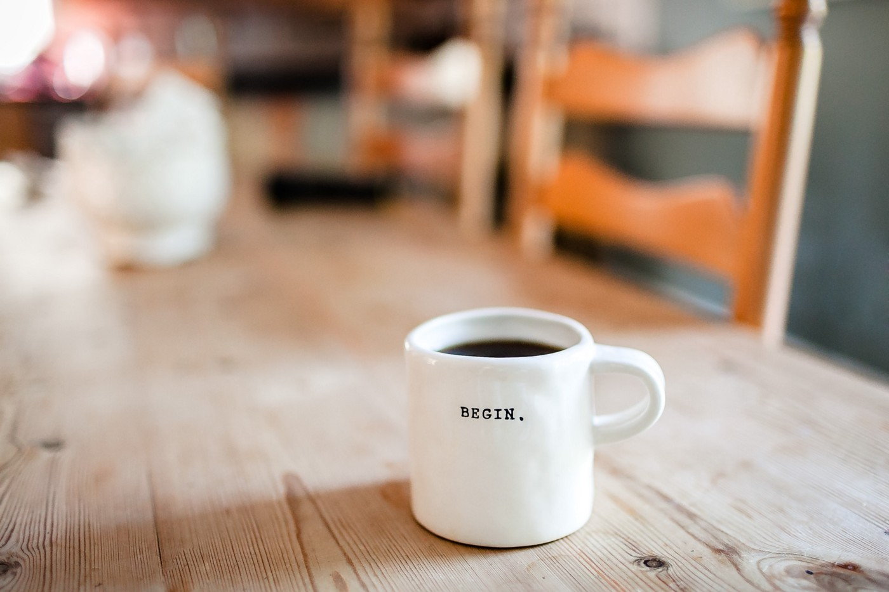

## An unconventional and compassionate guide to becoming an early bird  

成为早起的鸟儿的非常规且富有同情心的指南

Photo by [Danielle MacInnes](https://unsplash.com/@dsmacinnes?utm_source=unsplash&utm_medium=referral&utm_content=creditCopyText) on [Unsplash](https://unsplash.com/search/photos/morning?utm_source=unsplash&utm_medium=referral&utm_content=creditCopyText)  

照片由 Danielle MacInnes 在 Unsplash 上拍摄

I thought I was destined to be a night owl forever.  

我以为我注定永远是个夜猫子。

I’m no stranger to reading about the benefits of waking up early or having the same sleeping routine — all of us have probably read this at some point in our lives. I’m in my final semester of university, so the past few years of my life have been absolute chaos.  

我对阅读早起或保持相同睡眠习惯的好处并不陌生——我们所有人都可能在生活中的某个时刻读过这篇文章。我在大学的最后一个学期，所以过去几年我的生活绝对是混乱的。  

I have classes some days, work other days, and have free time on especially rare days. Having a routine seemed impossible.  

我有几天上课，其他几天工作，并且在特别罕见的日子里有空闲时间。有一个例程似乎是不可能的。

But a few months ago, I started reading [Haruki Murakami](https://en.wikipedia.org/wiki/Haruki_Murakami)’s novels. My favorite is [Norwegian Wood](https://www.goodreads.com/book/show/11297.Norwegian_Wood). Inspired by Murakami’s fascinating prose, I researched him a little.  

但是几个月前，我开始读村上春树的小说。我最喜欢的是挪威森林。受到村上春树引人入胜的散文的启发，我对他进行了一些研究。

I found this gem in a [2004 interview](https://www.theparisreview.org/interviews/2/haruki-murakami-the-art-of-fiction-no-182-haruki-murakami) he did:  

我在他 2004 年的一次采访中发现了这颗宝石：

> When I’m in writing mode for a novel, I get up at 4 a.m. and work for five to six hours. In the afternoon, I run for ten kilometers or swim for fifteen hundred meters (or do both), then I read a bit and listen to some music. I go to bed at 9 p.m.  
> 
> 当我处于小说写作模式时，我会在凌晨 4 点起床，然后工作五到六个小时。下午，我跑步十公里或游泳一千五百米（或两者都做），然后我读一点书，听听音乐。我晚上 9 点上床睡觉。
> 
> I keep to this routine every day without variation. The repetition itself becomes the important thing; it’s a form of mesmerism. I mesmerize myself to reach a deeper state of mind.  
> 
> 我每天都坚持这个例程，没有变化。重复本身成为重要的事情；这是一种催眠术。我使自己着迷以达到更深层次的精神状态。
> 
> But to hold to such repetition for so long — six months to a year — requires a good amount of mental and physical strength. In that sense, writing a long novel is like survival training. Physical strength is as necessary as artistic sensitivity.  
> 
> 但是要坚持这样的重复如此之久——六个月到一年——需要大量的精神和体力。从这个意义上说，写长篇小说就像生存训练。体力和艺术敏感度一样重要。

There’s something about the way Murakami talks about his routine that moved me. This part, in particular, stood out to me:  

村上隆谈论他的日常生活的方式让我很感动。这部分尤其让我印象深刻：

> The repetition itself becomes the important thing; it’s a form of mesmerism.  
> 
> 重复本身成为重要的事情；这是一种催眠术。

Mesmerism has been a part of my life since I was a child; it’s the sense I have every time I establish a new habit. I mesmerized myself as a child to brush my teeth every day in the morning. As an adult, I’ve mesmerized myself to be healthy by exercising regularly.  

从我还是个孩子的时候起，催眠术就已经成为我生活的一部分。每当我养成新习惯时，我都会有这种感觉。小时候，我每天早上都让自己着迷刷牙。作为一个成年人，我通过定期锻炼让自己保持健康。  

I’ve mesmerized myself to reflect on my life by adding a journaling routine.  

通过添加日记程序，我着迷了自己以反思自己的生活。

A surge of motivation struck me, knowing I had done a similar task in the past. I could become an early bird by mesmerizing myself.  

一股动力涌上心头，我知道自己过去曾做过类似的任务。通过让自己着迷，我可以成为一只早起的鸟儿。

For the past 3 months, I’ve successfully transitioned into being an early bird. I go to sleep at 9 p.m. on average 6-7 nights a week. I currently wake up between 5–5:30 a.m. naturally.  

在过去的 3 个月里，我已经成功地转变为早起的鸟儿。我晚上 9 点睡觉。平均每周 6-7 个晚上。我目前在早上 5-5:30 之间自然醒来。

I might continue experimenting with waking up even earlier, but I’m happy with my current routine and don’t want to put too much pressure on myself. After all, it’s healthy to get 8 hours of sleep, isn’t it?  

我可能会继续尝试更早起床，但我对目前的作息感到满意，不想给自己太大压力。毕竟，睡 8 小时对健康有益，不是吗？

I’ve tried to become an early bird many times in my life and this is the first time it has actually worked. Here’s what this process of “mesmerizing” myself looked like—and also a few words about what doesn’t work.  

我一生中曾多次尝试成为早起的鸟儿，这是第一次真正奏效。下面是这个“迷住”我自己的过程的样子——还有一些关于什么是行不通的。

What really worked was more gentle than you might expect. Consider this, then, a compassionate guide to waking up early.  

真正起作用的是比你想象的更温和。考虑一下，这是一个早起的富有同情心的指南。

## 🌟 Clarify Your Purpose for Waking Up Early  

🌟 明确早起的目的

Waking up before everyone else is tough. If you don’t have a reason to do it, you won’t do it.  

在其他人之前醒来很难。如果你没有理由去做，你就不会去做。

I don’t just mean purpose in the sense that you want to wake up to do something. Of course, you’re going to wake up early to do something (probably productive). But you need a purpose that extends past a basic task.  

我指的不仅仅是你想醒来做某事的意义上的目的。当然，您会早起做某事（可能是富有成效的）。但是你需要一个超越基本任务的目标。

I’m about to graduate from university and I’m about to enter arguably the most important years of my life — years where I’ll have both money and freedom. If I ever want a chance at escaping at the 9–5, I have to do something now.  

我即将大学毕业，我即将进入可以说是我生命中最重要的岁月——我将拥有金钱和自由的岁月。如果我想在朝九晚五的时候逃脱，我现在必须做点什么。  

Working in the morning is easier than working at night, so I need to set up my habits now so I can be living that life later.  

早上工作比晚上工作容易，所以我现在需要养成习惯，这样我以后才能过上那种生活。

You might already have a purpose, but if you don’t, try running a [5 Whys](https://en.wikipedia.org/wiki/5_Whys) analysis (otherwise known as root cause analysis).  

您可能已经有了目的，但如果没有，请尝试运行 5 个为什么分析（也称为根本原因分析）。

To do the _5 Whys_:  

做 5 个为什么：

1.  Form a problem statement.  
    
    形成问题陈述。
2.  Ask the question: “Why is/are/does \[your problem statement\]?”. Use your answer as the next problem statement.  
    
    问这个问题：“为什么是/是/是\[你的问题陈述\]？”。使用你的答案作为下一个问题陈述。
3.  Keep asking “why” until you’ve asked it five or more times.  
    
    不断问“为什么”，直到你问了五次或更多次。

Example:  

例子：

> **I want to wake up at 5 a.m. every day.  
> 
> 我想每天早上 5 点起床。**
> 
> Why do you want to wake up at 5 a.m. every day?  
> 
> 你为什么要每天早上 5 点起床？
> 
> **I want more time to be productive.  
> 
> 我想要更多的时间来提高工作效率。**
> 
> Why do you want to be more productive?  
> 
> 你为什么想提高工作效率？
> 
> **I want to practice writing.  
> 
> 我想练习写作。**
> 
> Why do you want to practice writing?  
> 
> 为什么要练习写作？
> 
> **I want to write books.  
> 
> 我想写书。**
> 
> Why do you want to write books?  
> 
> 你为什么想写书？
> 
> **I want to have a career doing something creative.  
> 
> 我想从事有创意的工作。**
> 
> Why do you want to have a career doing something creative?  
> 
> 你为什么想从事有创意的工作？
> 
> **I imagine it to be the most fulfilling thing someone can do in their career.  
> 
> 我认为这是一个人在其职业生涯中所能做的最有成就感的事情。**

Starting with a smaller problem and going deep to find the root cause helps you gain a better understanding of what you really want. It’ll help you understand if waking up is part of the solution to your problem.  

从较小的问题开始，深入查找根本原因有助于您更好地了解自己真正想要的是什么。它会帮助您了解醒来是否是解决问题的一部分。

Waking up early gives you a few hours every day in the morning where nobody else is going to disturb you. That’s all it is for most of us. For me, though, that’s an important part of my solution to escaping a 9–5 rut and doing work I love.  

早起会给你每天早上几个小时的时间，没有人会打扰你。这就是我们大多数人的全部。不过，对我来说，这是我摆脱朝九晚五的习惯并从事自己喜欢的工作的解决方案的重要组成部分。

## 💪 Understand What You Gain and Lose  

💪 了解你得到了什么和失去什么

When I first tried to become an early riser, I didn’t consider what I have to give up. I failed because I wasn’t willing to give up the things I enjoyed, like my weekday social life. I would go out, say I’d wake up early despite getting home late, and ultimately wake up late.  

当我第一次尝试成为一个早起者时，我并没有考虑我必须放弃什么。我失败了，因为我不愿意放弃我喜欢的事情，比如我平日的社交生活。我会出去，说我会早起，尽管回家晚了，但最终还是起得很晚。

If you accept what you lose upfront, you won’t keep trying to hold onto it when it’s gone.  

如果你提前接受你失去的东西，你就不会在它消失时继续努力抓住它。

But let’s be optimistic and start with what you’ll gain.  

但让我们保持乐观，从你将获得的开始。

## What you gain  

你得到了什么

Being an early bird means you get a few hours every day to do whatever you want. It’s likely nobody else will be awake to disturb you. You can paint, start a business, write — anything you want.  

早起意味着你每天有几个小时可以做任何你想做的事。很可能没有其他人醒来打扰您。你可以画画、创业、写作——任何你想做的事。

Your prefrontal cortex is most active right after waking up, making it optimal for creativity. I’ve noticed I write much faster in the morning than at any other time in the day.  

您的前额叶皮层在醒来后最活跃，因此最适合发挥创造力。我注意到我早上的写作速度比一天中的任何其他时间都快得多。  

Looking at the habits of famous writers, a lot of them have figured it out too (most authors write in the morning).  

看看著名作家的习惯，他们中的很多人也想通了（大多数作家都是早上写作）。

It’s a big win: a few hours of solitude with your most creative self.  

这是一个巨大的胜利：与最具创造力的自己独处几个小时。

## What you lose  

你失去了什么

There’s no free lunch. Waking up early doesn’t give you extra time. It takes off time you would otherwise have at night — unless you sleep less, which is a bad idea.  

天下没有免费的午餐。早起并不能给你额外的时间。它占用了你晚上的时间——除非你睡得少，这是个坏主意。  

If you sleep less, you either won’t be able to wake up early and become a night owl again, or you’ll be sleep-deprived and unproductive throughout the day.  

如果你睡得少，你要么无法早起，再次成为夜猫子，要么你会睡眠不足，一整天都没有效率。

In reality, I lost time since I started waking up early. I used to sleep for 6 hours and wake up from the urgency to get up and get to work. I can’t do that when I’m waking up early because there’s no urgency for me to get out of bed; I’m weak. So I sleep for 8 hours.  

实际上，自从我开始早起后，我就失去了时间。我过去常常睡 6 个小时，然后从起床和上班的紧迫感中醒来。当我早起时我不能这样做，因为我没有起床的紧迫感；我很弱。所以我睡了8个小时。  

Otherwise, the temptation to stay in bed would be too much.  

否则，赖床的诱惑太大了。

I’ve lost around 2 hours every day—but I feel rested throughout the day.  

我每天损失了大约 2 个小时——但我一整天都感到休息。

## Running out of time  

时间不多了

I finish work at 5 p.m. (haha, 9–5). That means I have 4 hours after work before I sleep. But there are a few things I need to do within that time:  

我下午 5 点下班。 （哈哈，9-5）。这意味着我下班后有 4 个小时的时间睡觉。但是在那段时间内我需要做几件事：

-   Commute (1 hour)  
    
    通勤（1 小时）
-   Cook and eat (1 hour)  
    
    烹饪和食用（1 小时）
-   Exercise (1 hour)  
    
    运动（1小时）
-   Wind down (1 hour)  
    
    放松（1 小时）

That adds up to 4 hours. There’s no time left to do anything else. Of course, these activities don’t always take an hour each, but you get the point. Winding down is especially important for me. I tried a lot of ways to get around it, but I ended up not being able to sleep.  

加起来就是4个小时。没有时间做其他事情了。当然，这些活动并不总是每次都需要一个小时，但您明白了。放松对我来说尤其重要。我尝试了很多方法来解决它，但我最终无法入睡。

To keep my sanity, I have dinner with friends on days I don’t exercise. Still, there’s a limited time I can spend with them (around 2 hours).  

为了保持理智，我在不运动的日子里会和朋友共进晚餐。不过，我可以和他们在一起的时间有限（大约 2 小时）。

It feels like I’m living in a box, but I can’t say it’s all been bad. Being able to keep up this habit makes me feel eccentric and in some way, special.  

感觉就像我住在一个盒子里，但我不能说一切都很糟糕。能够保持这个习惯让我觉得自己很古怪，而且在某种程度上很特别。

I used to watch the [life of bodybuilders](https://www.youtube.com/watch?v=TRGCNlk4RS0) and wonder how they do it; all they do is eat, train and sleep. They don’t do anything else.  

我曾经看过健美运动员的生活，想知道他们是怎么做到的；他们所做的就是吃饭、训练和睡觉。他们什么都不做。

Now I understand them. There’s a sense of purpose that comes with living in a box. You know you’re disciplining yourself for a goal.  

现在我理解他们了。住在盒子里会带来一种使命感。你知道你是为了一个目标而训练自己。

## Give yourself one day off per week  

每周给自己一天假

I’ve found that if I mess up my sleep schedule one day a week, I can still maintain it throughout the week. I tried sleeping late two or three days a week — it didn’t work. But one seems to be okay.  

我发现，如果我每周有一天打乱我的睡眠时间表，我仍然可以在整个星期内保持它。我试着每周睡两三天，但没用。但是一个好像没问题。

I love going out at night, so I’ve given myself one day a week (usually Friday) to hang out with friends for longer.  

我喜欢晚上出去玩，所以我每周抽出一天（通常是周五）和朋友出去玩更长时间。

If this is something you need to do to wake up early, I suggest you set rules for it, too. You’re less likely to fail with disciplined chaos than pure chaos. Give yourself one day a week where you’re allowed to break the rules to mitigate what you feel you are losing.  

如果这是你需要早起的事情，我建议你也为它制定规则。与纯粹的混乱相比，纪律严明的混乱更不容易失败。每周给自己一天时间，允许你打破规则，以减轻你觉得自己正在失去的东西。

## Compare the benefits with the cost  

比较收益与成本

Ask yourself these two questions:  

问自己这两个问题：

-   What will I gain with the extra time in the morning?  
    
    早上的额外时间对我有什么好处？
-   What will I lose with the lost time at night?  
    
    晚上失去的时间会失去什么？

Then ask yourself: “Do the benefits outweigh the costs?”  

然后问问自己：“收益是否大于成本？”

If they don’t, then there’s probably no point in waking up early. If they do, there are a few things that helped me that’ll probably help you.  

如果他们不这样做，那么早起可能就没有意义了。如果他们这样做了，那么有一些对我有帮助的事情可能会对你有所帮助。

## 😴 Focus on Sleeping Time  

😴 关注睡眠时间

When I told myself I was going to wake up at 5 a.m. no matter what, I failed. I’d do it if I slept too late. I’d do it if I stayed out late at night. I’d do it if I stayed up studying.  

当我告诉自己无论如何都要在早上 5 点起床时，我失败了。如果我睡得太晚，我会这样做。如果我深夜呆在外面，我会这样做。如果我熬夜学习，我会这样做。

This didn’t work. I don’t know what I was trying to do by trying to cheat the system, thinking my willpower was enough.  

这没有用。我不知道我想通过欺骗系统来做什么，认为我的意志力已经足够了。

This might work for people who have this habit already. But if you’re starting out, focus on one thing: sleeping time.  

这可能适用于已经有这种习惯的人。但是，如果您刚开始，请专注于一件事：睡眠时间。

## Get enough sleep  

足够的睡眠

A common mistake people make is thinking they can sleep the same amount as they usually do. For example, I only slept for 6 hours before, so I thought I could sleep for 6 hours and still wake up early.  

人们常犯的一个错误是认为他们可以像平时一样睡那么多觉。比如，我之前只睡了6个小时，所以我觉得我可以睡6个小时，还能早起。  

This doesn’t work because you end up sleeping in; it’s unlikely you have any willpower when it’s pitch black outside.  

这是行不通的，因为您最终会睡懒觉；当外面一片漆黑时，您不太可能有任何意志力。

For the best chances at waking up early, set a goal for 8 hours of sleep. I want to wake up at 5 a.m., so my sleeping time is 9 p.m. (8 hours before).  

为了获得早起的最佳机会，请设定 8 小时睡眠的目标。我想早上 5 点起床，所以我的睡眠时间是晚上 9 点。 （8 小时前）。

## Sleep more than needed (when you start)  

睡得比需要的多（当你开始时）

When I started, I didn’t set my alarm at 5 a.m. I set no alarm at all. With drastic changes to your sleeping schedule, you’re going to need some time to adjust. You initially need more sleep.  

当我开始的时候，我没有把闹钟定在早上 5 点。我根本没有定闹钟。随着您的睡眠时间发生巨大变化，您将需要一些时间来调整。您最初需要更多睡眠。

You have the rest of your life to wake up early. Spend some time now getting the habit into your routine. This is a marathon, not a sprint.  

你有余生要早起。现在花一些时间让这个习惯成为你的日常工作。这是一场马拉松，而不是短跑。

Waking up early means waking up when it’s still dark. Give your body some time to adjust to the darkness. It took me about a week; it might be longer or shorter for you.  

早起意味着在天还黑的时候醒来。给你的身体一些时间来适应黑暗。我花了大约一周的时间；对您来说可能更长或更短。

I naturally woke up earlier and earlier every day. Now I can successfully wake up at 5 a.m. every day.  

自然而然的，我每天都起得越来越早。现在我可以每天早上 5 点成功起床。

## 🌳 Don’t Try to Change Everything  

🌳 不要试图改变一切

You can’t introduce too much change to your life at once. Changing your sleeping pattern is a big change. I know you want to wake up and do something productive right away. You want to do all the amazing things you couldn’t do before.  

你不能一下子给你的生活带来太多改变。改变你的睡眠模式是一个很大的改变。我知道您想醒来并立即做一些富有成效的事情。你想做所有你以前做不到的惊人的事情。

Be patient. If you don’t, you’re not going to be able to do any amazing things at all.  

要有耐心。如果你不这样做，你将无法做任何令人惊奇的事情。

## You can’t change too much at once  

你不能一次改变太多

If it helps to get some empathy, imagine the life of someone who seriously needs help. An archetype would be the 30-year-old man-child who still lives in his parents’ basement and plays video games all day.  

如果这有助于获得一些同理心，想象一下一个严重需要帮助的人的生活。一个原型是 30 岁的男孩，他仍然住在父母的地下室里，整天玩电子游戏。

If you were giving him life advice, it would be something like:  

如果你给他人生建议，会是这样的：

-   Get a job.  
    
    找份工作。
-   Fix your diet.  
    
    调整饮食。
-   Go to the gym every day.  
    
    每天去健身房。
-   Read books.  
    
    看书。
-   Do a side project.  
    
    做一个副项目。

Can you imagine how they would do that? They can’t do all of these things at once! If you told them to change everything at once, it would be so overwhelming they’d stay in their old habits. You’d have more compassion for them and help them make those changes over time.  

你能想象他们会怎么做吗？他们不能一次做所有这些事情！如果你告诉他们立即改变一切，他们会保持他们的旧习惯。你会对他们有更多的同情心，并帮助他们随着时间的推移做出这些改变。

I can barely fix my diet and go to the gym at the same time, and I’d like to consider myself a healthily integrated member of society.  

我几乎不能一边控制饮食一边去健身房，我想认为自己是一个健康融入社会的成员。

Similarly, you should only change one thing at a time. For now, focus on getting to sleep early. That’s all.  

同样，您一次只能更改一件事。现在，专注于早睡。就这样。

Slowly increase your productivity as you go. If your goal is to get work done in the morning, start by doing 30 minutes of work, then an hour, and so on.  

慢慢地提高你的工作效率。如果你的目标是在早上完成工作，那么先做 30 分钟，然后一个小时，依此类推。

## Have fun in the morning (when you start)  

早上玩得开心（当你开始时）

If there’s a day you wake up feeling super motivated and ready to do work, then, by all means, do it. But if you don’t feel motivated at the start, just have fun.  

如果有一天你醒来时感觉超级有动力并准备好开始工作，那么一定要去做。但是，如果您一开始没有动力，那就玩得开心。

I spent around two weeks waking up in the morning and watching TV shows, YouTube or Twitch streams. It was actually fun — watching stuff when nobody else was around.  

我花了大约两周的时间在早上醒来看电视节目、YouTube 或 Twitch 流媒体。这实际上很有趣——在周围没有其他人的时候看东西。

Eventually, I was ready to do work. Trust me, you’ll eventually be ready to do work. There’s no way you’re going to wake up every morning to mess around for the rest of your life (if your goal is to be productive); it’ll feel like such a waste.  

最终，我准备好工作了。相信我，你最终会准备好工作的。您不可能每天早上醒来都在余生中胡思乱想（如果您的目标是提高工作效率）；会觉得很浪费。

## 🌅 Choose a Morning Routine  

🌅选择早上的例程

Even after waking up early for months, I still have trouble getting out of bed without my morning routine. I tried to skip it a few times, but it felt wrong — as if my morning routine is part of the process of waking up.  

即使早起几个月后，如果没有早上的例行公事，我仍然很难起床。我有几次试图跳过它，但感觉不对——好像我早上的例行公事是起床过程的一部分。

A morning routine not only prepares you for the day, but it mesmerizes you. Before my routine, I’m groggy and tired. After, I’m excited and awake. It’s the closest thing to magic I’ve found.  

早上的例行公事不仅让你为新的一天做好准备，而且会让你着迷。在我的例行公事之前，我昏昏沉沉又疲倦。之后，我兴奋而清醒。这是我发现的最接近魔法的东西。

It’s like my brain is telling me: “now that you’ve completed the first task of the day, you’re ready to wake up.”  

就像我的大脑在告诉我：“既然你已经完成了当天的第一项任务，你就可以醒来了。”

I journal for my morning routine — specifically, I do morning pages. It’s an exercise from Julia Cameron’s [_Artist’s Way_](https://www.goodreads.com/book/show/615570.The_Artist_s_Way) where you write 3 longhand pages without stopping to think. It’s designed to unblock artists by teaching them that perfection isn’t necessary to create.  

我记录我早上的例行公事——具体来说，我做早报。这是朱莉娅·卡梅隆 (Julia Cameron) 的《艺术家之道》(Artist's Way) 中的一项练习，您可以在其中手写 3 页，而无需停下来思考。它旨在通过教导艺术家完美不是创造所必需的来解除他们的阻碍。

Instead of 3 A4 pages, I do 4 A5 pages. I don’t know if they’re the same amount, but the exact amount of words you write doesn’t matter. It’s pretty close though.  

我做 4 个 A5 页，而不是 3 个 A4 页。我不知道它们的数量是否相同，但你写的确切字数并不重要。虽然很接近。

I keep a journal and pen next to my bed. They’re the first thing I touch (after turning the lights on) after waking up.  

我在床边放着一本日记本和一支笔。它们是我醒来后（打开灯后）触摸的第一件事。

## A routine that suits you  

适合你的套路

You might already have a morning routine or have one in mind you want to try. Or you could also do morning pages.  

您可能已经有一个早上的例行程序，或者想尝试一个。或者你也可以做早报。

Here are some other practices I recommend for morning routines:  

以下是我推荐的一些其他早上例程的做法：

-   Meditation  
    
    冥想
-   Yoga  
    
    瑜伽
-   Making tea  
    
    泡茶

The actual routine doesn’t matter — at least for waking up. You’ll get different benefits from different routines but the goal is to help you wake up. You want to teach your body what to do when you wake up.  

实际的例行程序并不重要——至少对于起床而言。您将从不同的例程中获得不同的好处，但目标是帮助您醒来。你想教你的身体在你醒来时做什么。

## ⏰ Get an Alarm That Works for You  

⏰ 获得适合您的闹钟

If there’s one piece of advice with alarms I would give, it’s this: don’t use an alarm to wake you up; instead, use it as an insurance policy.  

如果有一条关于闹钟的建议我会给出，那就是：不要用闹钟来叫醒你；相反，将其用作保险单。

When I first started using alarms, I used them to try to cheat sleep. When you use alarms this way, you end up waking up groggy and tired because you didn’t get enough sleep in the first place.  

当我第一次开始使用闹钟时，我用它们来欺骗睡眠。当你以这种方式使用闹钟时，你最终会因为一开始就没有足够的睡眠而昏昏沉沉地醒来。

If you don’t want to end up hating your alarm, make sure you set the time to the time after you want to wake up. I set it 8.5 hours after my bedtime and I wake up without it.  

如果您不想讨厌闹钟，请确保将时间设置为您想要起床后的时间。我将它设置在就寝时间后 8.5 小时，然后我醒来时没有它。

## Experiment with alarms  

试验警报

If you haven’t experimented with alarms before, you should. Different alarms suit different people. Do a quick Google search for alarms.  

如果您之前没有尝试过闹钟，您应该尝试一下。不同的闹钟适合不同的人。在 Google 上快速搜索警报。

There are all sorts of alarms out there. There are smart alarms, alarms that only work if you step out of your bed, and even phone apps where someone calls you to wake you up. The latter would never work for me, but I can see it working for someone very social.  

那里有各种各样的警报。有智能闹钟，只有在您起床时才会响起的闹钟，甚至还有可以打电话叫醒您的电话应用程序。后者永远不会为我工作，但我可以看到它对非常社交的人有用。

If you don’t want to do your own research, I have a recommendation for you.  

如果你不想自己做研究，我有一个建议给你。

## Try a light alarm  

试试轻闹钟

I use a light alarm. A light alarm wakes you up with light before it wakes you up with sound. It starts shining a light 30 minutes before the time you set and slowly gets brighter and brighter. This is useful for early birds because it’s dark early in the morning.  

我用的是光报警器。灯光闹钟先用灯光将您叫醒，然后再用声音叫醒您。它会在您设置的时间前 30 分钟开始发光，然后慢慢变得越来越亮。这对早起的鸟儿很有用，因为清晨天很黑。

I set it at 5:30 a.m., which means it starts shining at 5 a.m. I never wake up to the sound; I always wake up to the light. It hasn’t been easy to create this habit, but since I’ve made sure I get enough sleep first, the light is enough—I never have a jarring sound wake me up.  

我把它设置在早上 5:30，这意味着它会在早上 5 点开始发光。我从来没有被声音吵醒过；我总是在阳光下醒来。养成这个习惯并不容易，但既然我已经确保我先睡够了，光线就足够了——我从来没有被刺耳的声音吵醒过。

Here’s a [link to the alarm I use](https://www.amazon.com/Sunrise-Nature-Sounds-Bedside-Simulator/dp/B07P24RHTK/).  

这是我使用的闹钟的链接。

## 📵 Sleep Without Your Phone  

📵 不带手机睡觉

If you want a chance at being productive in the morning, you can’t sleep with your phone. It’s already hard to wake up before everyone else. Don’t make it harder for yourself by giving yourself easy access to addictive stimuli while you’re in bed.  

如果你想在早上有机会提高工作效率，就不能带着手机睡觉。已经很难在其他人之前醒来。不要让自己在床上容易上瘾的刺激让自己更难过。

## A boring sleeping environment  

无聊的睡眠环境

Make your sleeping environment as boring as possible. You don’t want to have any excitement before you sleep or after you wake up.  

让你的睡眠环境尽可能无聊。你不想在睡前或醒来后有任何兴奋。

The most common culprit of entertainment in bed is the phone. If you have something else that you love you use in bed like a tablet, I suggest you move that away too.  

床上最常见的娱乐罪魁祸首是手机。如果你有其他喜欢在床上使用的东西，比如平板电脑，我建议你也把它拿走。

There are two goals this achieves:  

这实现了两个目标：

-   Improves sleep  
    
    改善睡眠
-   Helps with getting out of bed  
    
    帮助起床

## No way around it  

没有办法绕过它

Before I put my phone in another room, I constantly checked it in bed. I would message my friends. I would check every social media app I had. I would watch YouTube to sleep. I thought it was good because I kept doing it and I was so used to falling asleep with entertainment.  

在我把手机放在另一个房间之前，我经常在床上检查它。我会给我的朋友发信息。我会检查我拥有的每个社交媒体应用程序。我会看 YouTube 睡觉。我认为这很好，因为我一直这样做，而且我已经习惯了在娱乐中入睡。

As long as your phone is within reach when you wake up, there’s an incredible temptation to use it in bed. I don’t know about you but I’ve stayed in bed for hours mucking around on my phone.  

只要您的手机在您醒来时触手可及，就会有一种难以置信的诱惑让您在床上使用它。我不了解你，但我已经躺在床上玩了几个小时的手机。

I have no self-control at all, so I control my environment.  

我完全没有自制力，所以我控制了我的环境。

## Put your phone in another room  

把手机放在另一个房间

It’s a simple idea, but not easy. It feels like you’re giving away your baby. But the resistance is good. It means you’re killing an addiction.  

这是一个简单的想法，但并不容易。感觉就像你在放弃你的孩子。但是抵抗力很好。这意味着你正在戒除毒瘾。

Choose a room with a place to charge your phone. This could be the living room, kitchen, or in my case, a study room. Leave your phone there and in the morning, check it after you’ve left your bed, not before.  

选择一个可以为手机充电的房间。这可能是客厅、厨房，或者就我而言，是书房。把手机留在那儿，早上起床后检查一下，而不是之前。

## 💊 Use Melatonin as Insurance  

💊 使用褪黑激素作为保险

I’ve left the most controversial for last. If you don’t want to take any substances, you can skip this section.  

我把最有争议的放在最后。如果您不想服用任何物质，您可以跳过此部分。

Melatonin is a natural hormone that regulates the sleep-wake cycle. Your body produces it at night to help you sleep. But you can also take it as a pill.  

褪黑激素是一种调节睡眠-觉醒周期的天然激素。你的身体会在晚上产生它来帮助你入睡。但您也可以将其作为药丸服用。

You can get it in the United States without a prescription. Since melatonin is found in some foods, the U.S. Dietary Supplement Health and Education Act of 1994 allows it to be sold as a dietary supplement.  

您无需处方即可在美国获得。由于褪黑激素存在于某些食物中，因此 1994 年美国膳食补充剂健康和教育法案允许将其作为膳食补充剂出售。

## Dosage  

剂量

A [2001 study](http://news.mit.edu/2001/melatonin-1017) found that the ideal dosage is 0.3 mg. The lowest amount of a melatonin dose I’ve found is 1mg. If you can find 0.3 mg, then good for you. I use 1mg and cut it into half (0.5 mg). It’s not exactly 0.3 mg, but it works for me.  

2001 年的一项研究发现，理想剂量为 0.3 毫克。我发现的最低褪黑激素剂量是 1 毫克。如果你能找到 0.3 毫克，那么对你有好处。我使用 1 毫克并将其切成两半（0.5 毫克）。它不完全是 0.3 毫克，但对我有用。  

I’ve tried different dosages, including up to 10 mg, and none of them worked as well as taking less.  

我尝试过不同的剂量，包括高达 10 毫克，但没有一种比服用更少的剂量效果更好。

## Regulate your sleep schedule  

调节你的睡眠时间表

If you don’t get to sleep on time consistently, melatonin isn’t going to save you. I tried to cheat the system. It didn’t work.  

如果您不能始终如一地按时入睡，褪黑激素也救不了您。我试图欺骗系统。它没有用。

Nevertheless, you’re sometimes going to fail. You might sleep too late. You might have a coffee too late in the day. You might wake up in the afternoon and have trouble sleeping early.  

然而，你有时会失败。你可能睡得太晚了。你可能喝咖啡的时间太晚了。您可能会在下午醒来并且难以早睡。

I fail. I’m not a perfectly disciplined monk. When it happens, I take melatonin.  

我失败了。我不是一个纪律严明的僧侣。当它发生时，我服用褪黑激素。

Even though melatonin isn’t considered an addictive substance, be cautious. There’s no evidence melatonin has dangerous effects, but you can build up a tolerance for it.  

尽管褪黑激素不被认为是一种会上瘾的物质，但还是要小心。没有证据表明褪黑激素有危险作用，但您可以建立对它的耐受性。

My recommendation is to use melatonin when you mess up your sleep schedule and can’t get to sleep at your bedtime because you’re too awake — but don’t allow that to happen too often.  

我的建议是，当你打乱了睡眠时间表并且因为太清醒而无法在就寝时间入睡时使用褪黑激素——但不要让这种情况发生得太频繁。

Photo by [Alexandra Gorn](https://unsplash.com/@alexagorn?utm_source=unsplash&utm_medium=referral&utm_content=creditCopyText) on [Unsplash](https://unsplash.com/search/photos/sleep?utm_source=unsplash&utm_medium=referral&utm_content=creditCopyText)  

亚历山德拉·戈恩 (Alexandra Gorn) 在 Unsplash 上拍摄的照片

I said a lot about sleep. That’s because most of waking up early is sleeping early, and it isn’t easy to sleep early. There are sacrifices to be made. If you’re willing to make them, you can become an early bird.  

我说了很多关于睡眠的事。那是因为早起大部分是早睡，而早睡并不容易。需要做出牺牲。如果你愿意制作它们，你可以成为早起的鸟儿。

There are glamorous parts to waking up early. You get to be productive. You get the feeling of accomplishing something before anybody else does. You get hours of solitude in a solitude-deprived, technology-focused world. I love it.  

早起有迷人的部分。你会变得富有成效。你有一种先于其他人完成某事的感觉。在一个被剥夺了孤独感、以技术为中心的世界里，你会得到数小时的孤独。我喜欢它。

👉`The Better Humans publication is a part of a network of personal development tools. For daily inspiration and insight, [subscribe to our newsletter](https://www.w3schools.com/html/coachtony.medium.com/subscribe), and for your most important goals, [find a personal coach](https://coach.me/coaching?ref=DbvXq).`👈  

👉 `The Better Humans publication is a part of a network of personal development tools. For daily inspiration and insight, [subscribe to our newsletter](https://www.w3schools.com/html/coachtony.medium.com/subscribe), and for your most important goals, [find a personal coach](https://coach.me/coaching?ref=DbvXq).` 👈
