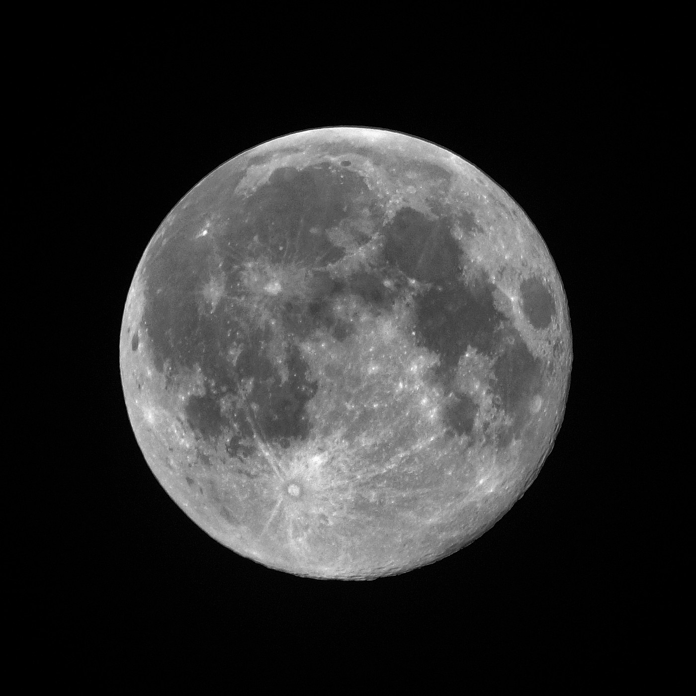

> In the house that I grew up in, there was a formula for the American Dream.  
> 
> 在我长大的房子里，有一个实现美国梦的公式。

My parents believed this so deeply that they left China with a one-way plane ticket and hundreds of dollars in folded bills, their mouths full of broken English.  

我的父母深信这一点，以至于他们带着一张单程机票和数百美元的折叠钞票离开了中国，满嘴都是蹩脚的英语。

Here is how the formula went: learn English. Get the top marks in your class. Stay at least a grade level or two ahead on math and science. Enter and win academic competitions (science fair, math tournaments, etc). Ace the SATs. Become the valedictorian of your high school.  

公式是这样的：学习英语。在班上取得最高分。在数学和科学方面至少领先一两个年级。参加并赢得学术竞赛（科学博览会、数学锦标赛等）。 SAT 高分。成为你高中的告别演说家。  

Attend an Ivy League school. Study medicine or law. Afford a life of security and comfort.  

进入常春藤盟校。学习医学或法律。负担得起安全和舒适的生活。

The formula was not for my parents, who arrived to the game in the third quarter, too late to score a decisive victory. Their eventual middle class livelihood was built from the ground up waiting tables, losing sleep, and the continual habit of sacrifice.  

这个公式不适合我的父母，他们在第三节到达比赛时来不及取得决定性的胜利。他们最终的中产阶级生活是从头开始建立起来的服务员、失眠和不断牺牲的习惯。

But for me, my lips still loose enough to adopt perfect English, my eyes acute enough to observe and adopt the guise of American culture, it became my Gatsbian green light. My parents spoke of it with an unshakeable fervor.  

但对我来说，我的嘴唇仍然松弛到可以采用完美的英语，我的眼睛仍然足够敏锐以观察和采用美国文化的伪装，它成为了我的盖茨比亚绿灯。我的父母以不可动摇的热情谈论它。  

“Zhuo Li,” they’d point out to me every time we stopped at a red light and somebody tapped our window to see if we wanted to buy the day’s paper, “If you don’t study hard and get good grades, you too will have to sell newspapers on the street corner.”  

“卓立，”每次我们在红灯前停下时，他们都会指着我，有人敲我们的窗户看我们是否想买当天的报纸，“如果你不努力学习取得好成绩，你也将不得不在街角卖报纸。”

In our circles, examples of children who had followed this formula to wild success were repeated like myths: “Auntie Wenfang’s daughter Sophia got a 1590 on her SATs and was just accepted into Harvard.  

在我们的圈子里，孩子们遵循这个公式取得巨大成功的例子像神话一样被重复着：“文芳阿姨的女儿索菲亚的SAT成绩为1590，刚刚被哈佛录取。  

” “The Tao’s son Frank did an internship at Dow Chemical lab and won first place at the science fair.” “Pam from church recently won a state piano award for her concerto performance.  

” “陶家的儿子弗兰克在陶氏化学实验室实习，获得了科学博览会的第一名。” “来自教堂的 Pam 最近因其协奏曲演奏获得了州钢琴奖。  

” Success was as uncomplicated as the times table — an unblemished report card; a Sunday dusting of the glittering trophy shelf that grew year over year; another line to add to the future resume that would transform into the entry card into the Promised Land of the Ivies.  

” 成功就像时间表一样简单——一张无瑕疵的成绩单；一个星期天为年复一年增长的闪闪发光的奖杯架除尘；添加到未来简历中的另一行将转变为进入常春藤乐土的入门卡。

In my parents’ mind, the concept of “perfect” existed. There was a right way to go about things. 99 was not as good as 100.  

在我父母的心目中，存在着“完美”的概念。有一个正确的方法来处理事情。 99 不如 100。

The American Dream, as I was taught, was less a spectrum than a binary switch.  

正如我被教导的那样，美国梦与其说是一个频谱，不如说是一个二进制开关。

I read Plato’s _Dialogues_ in high school, and in it I was introduced to the concept of Forms. Instantly I was transfixed. In the book, Socrates suggests that for everything we can think of, tangible or not — dogs, grace, friendship — there is a true ideal form of that thing.  

我在高中时读过柏拉图的对话，从中我了解到形式的概念。我顿时呆住了。在书中，苏格拉底建议，对于我们能想到的一切，无论有形与否——狗、恩典、友谊——都有一个真正的理想形式。

Yet the true ideal form is not something we mere mortals can behold. We are like prisoners tied down in a cave, a fire burning behind us as we stare straight ahead at the smooth grey walls.  

而真正的理想形态，却不是我们凡人所能看到的。我们就像被囚禁在山洞里的囚犯，当我们直视前方光滑的灰色墙壁时，身后燃烧着一团火。  

There, shadows dance — the outline of a dog wagging his tale, the dancing body of a ballerina, the swaying silhouettes of friends in song.  

在那里，影子在跳舞——一只狗在摇着它的故事的轮廓，芭蕾舞演员跳舞的身体，歌声中朋友们摇曳的身影。

If this were all that the prisoners saw, would they not think the shadows were everything? That the dark shapes moving across the wall represented dogs, grace, and friendship in all their essence and beauty?  

如果这就是囚犯们看到的一切，他们会不会认为影子就是一切？在墙上移动的黑色形状代表了狗、优雅和友谊的所有本质和美丽？

But no, we who are wiser, who are outside of the cave, who are a dimension apart, pity the cavemen. We see the real three-dimensional objects and know that they are so much more colorful, textured, and rich than shadows could ever be.  

但是不，我们这些更聪明的人，在洞穴之外，相隔一个维度的人，同情穴居人。我们看到真实的三维物体，并且知道它们比阴影更丰富多彩、更有质感、更丰富。

I could understand the allegory perfectly. It described my life: always in search of the brilliance of these Forms that I could never truly attain.  

我完全可以理解这个寓言。它描述了我的生活：总是在寻找我永远无法真正获得的这些形式的光辉。

A worthy goal, surely? A foot, an inch, a nudge closer out of the cave and toward the true light.  

一个有价值的目标，当然？一英尺，一英寸，轻轻一推，离洞穴更近，更接近真正的光。

I am sitting in a sunny conference room, my stomach fluttering. It is performance review season, and my manager is about to walk in and deliver my assessment.  

我坐在阳光明媚的会议室里，我的胃在翻腾。现在是绩效评估季节，我的经理即将走进来并进行评估。

I have sat in this chair every six months for the past few years, feeling this same cocktail of emotions: anticipation, dread, and expectation. I am equal parts Christmas kid — _Will there be a strong review or promotion under the tree? —_ beaming cheerleader — _Come on, Rah! Rah! You know you are awesome!_ — and nervous defendant waiting for the prosecution’s argument — _in what ways have I failed as a person_?  

在过去的几年里，我每六个月就坐在这把椅子上，感受同样的情绪混合物：期待、恐惧和期待。我是圣诞小子——圣诞树下会有强烈的评论或促销吗？ - 喜气洋洋的啦啦队长 - 来吧，拉！哇！你知道你很棒！ - 紧张的被告等待控方的论证 - 作为一个人，我在哪些方面失败了？

The door opens. My manager sits across from me. He is smiling. He hands me a sheet of paper. My eyes quickly skim the headline. I’ve done well — I’ve exceeded expectations. Relief floods through me. I allow myself 5 seconds to savor the feeling — I’ve done it!  

门开了。我的经理坐在我对面。他在微笑。他递给我一张纸。我的眼睛飞快地扫过标题。我做得很好——超出了预期。我如释重负。我给自己 5 秒钟的时间来品味这种感觉——我做到了！  

I’ve passed the test!  

我通过了测试！

Then, I flip past the first page, barely giving a second glance toward my strengths or the nice things colleagues have said about me.  

然后，我翻过第一页，几乎没有再看一眼我的优点或同事对我的称赞。

The second page is my quest. Here are all the things I could be doing better. Tallied here are the projects that weren’t up to par, the sloppy mistakes, and the blind spots.  

第二页是我的追求。以下是我可以做得更好的所有事情。这里记录的是不符合标准的项目、草率的错误和盲点。

My manager see this. “You’re always so eager to focus on your areas of growth, but I think you’re going to go farther with your strengths.”  

我的经理看到了这个。 “你总是那么渴望专注于你的成长领域，但我认为你会凭借自己的优势走得更远。”

“Of course,” I mutter.  

“当然，”我喃喃自语。

But I am not hearing him. The message won’t sink in for another few years.  

但我没有听到他的声音。再过几年，这个消息都不会被接受。

All I can think of at this time is how to build a better version of myself by ironing out what’s defective.  

此时我能想到的就是如何通过消除缺陷来建立一个更好的自己。

At a church event, among a cluster of mothers catching up after the last hymn is sung, my mom learned something that rocked her world.  

在一次教堂活动中，在唱完最后一首赞美诗后，在一群母亲的簇拥下，我妈妈学到了一件震撼她的世界的事。

It was the concept of _math camp_. She listened to another mother recount how her daughter spent weeks every summer out of state, in the woods somewhere, communing with a group of other precocious students over competitive math concepts.  

这是数学营的概念。她听另一位母亲讲述她的女儿每年夏天如何在州外的某个地方的树林里度过数周，与其他一群早熟的学生就竞争性数学概念进行交流。

After the camp was over and the students dispersed back to their homes, they would still see each other on the _circuit —_ the network of math competitions that happened all over the country. The mothers sighed, imagining the aptitude in those cabins, the clink of medals during the award ceremonies.  

夏令营结束后，学生们分散回家后，他们仍然会在巡回赛上见面——全国各地举行的数学竞赛网络。母亲们叹了口气，想象着那些小屋里的才能，颁奖典礼上奖牌的叮当声。

My mother shook her head ruefully as she relayed this to me. “This starts at age 10!” she exclaimed.  

妈妈把这件事告诉我时，遗憾地摇了摇头。 “这从 10 岁开始！”她惊呼。

I shrugged. I was already in high school. My math skills were fine but nothing to write home about. The part that sounded fun was the camp portion. I’d never spent weeks away from home with other students. But I knew my mother was thinking of something else.  

我耸耸肩。我已经上高中了。我的数学技能很好，但没有什么值得大书特书的。听起来很有趣的部分是营地部分。我从来没有和其他学生一起离开家几周。但我知道我妈妈在想别的事情。

Her formula was flawed. It hadn’t accounted for this. How much would the error cost?  

她的公式有缺陷。它没有考虑到这一点。错误的代价是多少？

At my high school graduation, I am seated in in the first row, in the first chair.  

在我高中毕业时，我坐在第一排的第一把椅子上。

It’s a prime position with an amazing view of the stage, and I’m wearing my too-big crinkled blue robes and hat. The mood is equal parts festive and impatient. We know this milestone — _graduation —_ is, like, a big deal. We know our parents and friends are in the audience, many working to dam the tears that will inevitably flow at seeing us cross this threshold into adulthood. Yet, we are also _so over_ this — the waiting, the speeches, the _still being here_ instead of having embarked already on that ship to our future lives.  

这是一个绝佳的位置，可以看到令人惊叹的舞台景色，我穿着太大的皱巴巴的蓝色长袍和帽子。气氛既喜庆又不耐烦。我们知道这个里程碑——毕业——就像一件大事。我们知道我们的父母和朋友都在听众中，许多人努力阻止在看到我们跨过这个门槛进入成年时不可避免地流下的眼泪。然而，我们也为此而烦恼——等待、演讲、仍然在这里，而不是已经踏上通往我们未来生活的那艘船。

Almost half a year ago, I received the fat acceptance letter to my top choice university. In the spring, I flew on a plane by myself for my first three day taste of university life at a “prospective freshmen” weekend.  

将近半年前，我收到了我心仪大学的录取通知书。春天的“准新生”周末，我独自坐飞机体验了大学生活的头三天。  

There, I pulled my first all-nighter talking about life and movies with people I’d never met before.  

在那里，我第一次通宵与素未谋面的人谈论生活和电影。  

The freedom was breathtaking — students just a few years ahead of me waxing about what to study next year, whether they wanted waffles or omelets for breakfast, creating their own formulas for the rest of their lives.  

这种自由令人叹为观止——比我早几年的学生们正在讨论明年要学什么，无论他们早餐想吃华夫饼还是煎蛋卷，为他们的余生创造自己的配方。

I felt suddenly awake, like Dorothy seeing color for the first time. I could go out and spread my arms, grasp the infinite, step into being the protagonist at the true start of my story.  

我突然清醒了，就像多萝西第一次看到颜色一样。我可以出去张开双臂，抓住无限，在我的故事真正开始时成为主角。

You would have thought that this meant I’d return changed. That I could have sailed through the rest of my months in high school. That I could have eased off from the studying, the fanatic desire for the flawless scores.  

你会认为这意味着我会改变回来。我本可以度过高中剩下的几个月。我本可以从学习中解脱出来，从对完美分数的狂热渴望中解脱出来。

But the prevailing thought in my mind as I sit in that first row, in that first chair, is that I am not up on stage, where the valedictorian and salutatorian sit, waiting to give their speeches.  

但当我坐在第一排，第一把椅子上时，我脑海中的主流想法是，我没有站在舞台上，告别演说者和致辞者坐在那里，等待发表演讲。

I am number three.  

我是三号。

My husband has a saying that if you’re satisfied with your life today, then every decision you’ve made in the past is a good one.  

我丈夫有句话说，如果你对今天的生活感到满意，那么你过去所做的每一个决定都是好的。

I disagree. We’ve had this conversation dozens of times. _You can always learn something from your past mistakes_, I say. _And knowing what I know now, I’d do so many things differently._  

我不同意。我们已经进行了数十次这样的对话。我说，你总能从过去的错误中吸取教训。知道我现在所知道的，我会做很多不同的事情。

_Like what?_ he asks.  

像什么？他问。

_I would have had a completely different college experience. Taken more classes I was genuinely interested in instead of optimizing for my resume.  

我会有完全不同的大学经历。参加了更多我真正感兴趣的课程，而不是优化我的简历。_

He grins. _But we met in college_. _And if you’d been taking calligraphy or underwater basket weaving, maybe wouldn’t have the relationship we have now._  

他咧嘴一笑。但是我们是在大学认识的。如果你一直在学习书法或水下篮子编织，也许不会有我们现在这样的关系。

It’s hard to argue with that. And I know what he means — I wouldn’t change any part of the past even if I had the opportunity to. I’ve watched enough time travel movies to know that if you help more butterflies flap their wings, you might start a tsunami on the side of the world.  

很难反驳这一点。我知道他的意思——即使我有机会，我也不会改变过去的任何部分。我看过足够多的时间旅行电影，知道如果你帮助更多的蝴蝶扇动翅膀，你可能会在世界的一侧引发海啸。

But I find an opening anyway. _It’s not about changing the past. It’s about doing it differently the next time._  

但我还是找到了一个空缺。这不是要改变过去。这是关于下次做不同的事情。

He rolls his eyes. _The next time you do college?_  

他翻了个白眼。下次你上大学吗？

He knows what I mean.  

他知道我的意思。

Looking back, even college felt structured and formulaic against the real world. After all, we still had the sturdy drumbeats of midterms and finals, the steady climb towards “graduation,” the finite set of classes and clubs.  

回想起来，即使是大学也感觉与现实世界相比是结构化和公式化的。毕竟，我们仍然有期中考试和期末考试的强劲鼓声，向“毕业”稳步攀升，班级和俱乐部的数量有限。

But working over a decade in Silicon Valley has taught us that formulas are unreliable.  

但是在硅谷工作了十多年告诉我们，公式是不可靠的。

How can anything be perfect when the assumptions of the past are so often wrong in predicting the future?  

当过去的假设在预测未来时经常是错误的时，任何事情怎么可能是完美的呢？

How can you believe you have control when, depending on whether you were at the right place at the right time, fortune smiles and bestows upon you green light after green light to wealth, prestige and power?  

当财富、声望和权力在财富、声望和权力的绿灯之后向您微笑并赐予您绿灯时，您怎么能相信自己可以控制呢，这取决于您是否在正确的时间出现在正确的地点？

Every day, there are examples. This investment went to zero. This other one multiplied like bunnies. These four years of blood, sweat and tears crumpled into nothing. This idea took two years to change an industry.  

每天都有例子。这笔投资归零。另一个像兔子一样成倍增加。这四年的血汗泪化为乌有。这个想法花了两年时间改变了一个行业。  

This asshole guy you knew is suddenly the keynote speaker at every conference. This brilliant friend is struggling to get momentum for her next new idea.  

你认识的这个混蛋突然成了每次会议的主讲人。这位聪明的朋友正在努力为她的下一个新想法寻找动力。

But really, what does perfect even mean? Is it impact, is it wealth, is it having the right manners or the right clothes? Is it the adoration of your children or your parents or your spouse? Is it being liked or talked about in the right circles?  

但实际上，完美到底意味着什么？是影响力、财富、正确的举止还是正确的着装？是你的孩子或你的父母或你的配偶的崇拜？它是否在正确的圈子中被喜欢或谈论？  

Is it the number of followers or retweets? Is it the lack of suffering, or the overcoming of suffering, or the act of suffering nobly? Is it your capacity to savor the luxury of individual moments? Is it simply the feeling that you are going up instead of down?  

是关注者的数量还是转发的数量？是没有苦难，还是克服苦难，还是高尚地忍受苦难？您有能力享受个人时刻的奢华吗？仅仅是你在上升而不是下降的感觉吗？

On every metric, there are those above and below you. Examples are a dime a dozen.  

在每个指标上，都有高于和低于您的指标。例子不胜枚举。

I look back at my parents’ American Dream. Security and comfort. I have reached it, and more.  

我回顾了我父母的美国梦。安全和舒适。我已经达到了，甚至更多。

But what is mine?  

但是我的是什么？

I am a new mother, my first child curled into the crook of my arm. I marvel at her tiny eyelashes and fists, scarcely believing I have helped bring to life a full, perfect human being.  

我是一位新妈妈，我的第一个孩子蜷缩在我的臂弯里。我惊叹于她纤细的睫毛和她的拳头，简直不敢相信我已经帮助塑造了一个完整、完美的人。

The days have blurred together. It’s been only a few weeks, but it has felt like a year. My universe has expanded, supernovas exploding silently in my heart. The quiet moments stretch out as delicate as the spaces between a spider’s web.  

日子已经模糊在一起。虽然才几周，但感觉就像过了一年。我的宇宙膨胀了，超新星在我心中悄然爆炸。安静的时刻像蜘蛛网之间的空间一样微妙。

It’s time to breastfeed. My baby grunts and roots as I gently nudge her into position, wincing as she first latches on before relaxing as she gets into a steady suck.  

是时候母乳喂养了。当我轻轻地把她推到位时，我的宝宝咕噜咕噜地叫着，在她第一次含住时畏缩了一下，然后在稳定地吸吮时放松下来。  

I’m thinking about my mother and mother-in-law, who have both welcomed me into the moms club with stories of their own journeys.  

我在想我的母亲和岳母，她们都用自己的旅程故事欢迎我加入妈妈俱乐部。

I had asked them if they breastfed.  

我问过他们是否母乳喂养。

My mother said she did, but it was a new concept at the time in China. She was part of an experimental group of mothers encouraged to try a new process at the hospital. The babies from their ward would all get wheeled in every few hours to be breastfed.  

我妈妈说她有，但这在当时的中国是一个新概念。她是鼓励在医院尝试新方法的母亲实验组的一员。每隔几个小时，他们病房里的婴儿都会被推到轮椅上接受母乳喂养。  

“I was so nervous,” she told me. “I couldn’t tell which one was my baby, so I’d wait until all the other moms picked up theirs first and assumed the remaining one was mine. Thankfully, you turned out to look like me, so that’s how I know I hadn’t messed up.”  

“我很紧张，”她告诉我。 “我分不清哪一个是我的孩子，所以我会等到所有其他妈妈都先捡起他们的，然后假设剩下的一个是我的。谢天谢地，你长得很像我，所以我才知道我没有搞砸。”

I asked her why the babies weren’t with the moms. After I gave birth, the hospital kept her in a little bassinet right next to me.  

我问她为什么孩子们不和妈妈们在一起。我生完孩子后，医院把她放在我旁边的一个小摇篮里。

“Oh no,” my mother said. “That wasn’t the protocol. They wanted the mother to get plenty of rest.”  

“哦，不，”我妈妈说。 “那不是协议。他们希望母亲得到充足的休息。”

My mother-in-law had a similar story. She didn’t breastfeed her older kids, but did with her younger. “It just wasn’t the thing back when I had my first,” she said. “The prevailing wisdom was that formula was better. Then, suddenly, breastfeeding became the recommended thing.”  

我婆婆也有类似的故事。她没有母乳喂养大孩子，而是母乳喂养小孩子。 “这不是我第一次时的样子，”她说。 “普遍的看法是配方更好。然后，突然间，母乳喂养成了推荐的事情。”

I reflect on the differences in new motherhood in just a few decades. How back then, the men stayed in the hospital waiting rooms during labor, smoking their cigarettes which we now know to kill you.  

我反思短短几十年新妈妈的不同。那时候，男人们在分娩期间呆在医院的候诊室里，抽着我们现在知道会杀死你的香烟。  

How babies were advised to sleep on their stomachs, which today we’ve associated with a higher risk of sudden infant death syndrome. How immediate skin-to-skin contact for newborns was deemed less important than it is now.  

如何建议婴儿趴着睡觉，今天我们将其与更高的婴儿猝死综合症风险联系起来。新生儿的直接皮肤接触被认为没有现在那么重要。

Imagine if you had been following all the rules perfectly as a new mother in the 1960s.  

想象一下，如果您在 1960 年代作为新妈妈一直完美地遵守所有规则。

How little we knew of the complexities of the human body. How little we know still of all that we don’t yet know.  

我们对人体的复杂性知之甚少。我们对我们还不知道的一切知之甚少。

The thing is, the rules of perfect are always changing.  

问题是，完美的规则总是在变化。

I purchased a teak table earlier this year for my patio, loving the warm honey color that reminded me of the long rays of summer.  

今年早些时候，我为我的庭院买了一张柚木桌，喜欢温暖的蜂蜜色，让我想起夏日的长光。  

A season later, the surface was a dull brown and riddled with stains, remnants of dinners involving buttered corn and grilled salmon and dollops of tartar sauce.  

一个季节后，表面变成了暗褐色，布满污渍，包括黄油玉米和烤三文鱼和几块塔塔酱的晚餐残留物。

Last week, I grimaced when I saw the table, the stains like a patch of disease. _Of course I can fix this_, I thought. A few Youtube videos and Amazon purchases later, I felt like a warrior-sage of teak, armed with speciality cleaners to battle the stains.  

上周，当我看到桌子时，我做了个鬼脸，上面的污渍就像一块病灶。我当然可以解决这个问题，我想。一些 Youtube 视频和亚马逊购买之后，我感觉自己像一个柚木战士圣人，配备专业清洁剂来对抗污渍。

The sun was high in the sky. I scrubbed the table with the cleaner, and to my delight, the dull brown lightened a few shades. My brush was the color of soot. _Go me!_ Energized, I did a second round, then a third. The honey tones began revealing themselves.  

太阳高挂在天空中。我用清洁剂擦洗桌子，令我高兴的是，暗褐色的颜色变浅了一些。我的刷子是烟灰的颜色。去我的！充满活力，我做了第二轮，然后是第三轮。甜蜜的音调开始显露出来。

But the stains persisted. I switched to a stronger brush and attacked a particularly egregious dark patch shaped like New Mexico. I put all my weight into the most vigorous scrub I could muster. To my satisfaction, I could see it weakening.  

但污渍依然存在。我换了一个更强的刷子并攻击了一个形状像新墨西哥州的特别令人震惊的黑暗斑块。我把所有的重量都放在了我能召集的最有力的磨砂膏上。令我满意的是，我可以看到它在减弱。  

I doubled down, slashing the bristles back and forth. A few minutes later, huffing, I stepped back. The stain had disappeared! One dragon down.  

我加倍努力，来回削减刷毛。几分钟后，我气喘吁吁地后退了一步。污渍消失了！一龙下来。

Across the table, there were dozens more. I felt a giddy satisfaction. I could tackle all of these. I could make the table like new, erase all these past accidents. I stretched my back and readied myself.  

桌子对面，还有几十个。我感到一种眩晕的满足感。我可以解决所有这些问题。我可以让桌子像新的一样，抹去所有这些过去的事故。我伸了个懒腰，做好了准备。

“Mommy, what are you doing?” My daughter’s face peeked out from the patio door. I hadn’t noticed that the sun had scooted across the sky, and now she was home from school.  

“妈咪，你在做什么？”我女儿的脸从露台的门里探出头来。我没有注意到太阳已经掠过天空，现在她放学回家了。

“I’m cleaning the table, Baby.”  

“我在擦桌子，宝贝。”

She couldn’t be less interested in my battle, the one I am poised to win. “Let me show you this drawing I did today!” she said waving a large blue piece of construction paper.  

她对我的战斗很感兴趣，我准备赢了。 “给你看看我今天画的这幅画吧！”她说着挥舞着一张大的蓝色建筑用纸。

I looked back at my spotted table. Twenty more minutes was all I needed. I opened my mouth to tell her, then paused.  

我回头看了看我那张有斑点的桌子。我还需要二十分钟。我张嘴想告诉她，然后停了下来。

Is perfect a noble truth we pursue, or an illusion of control that blinds us?  

完美是我们追求的崇高真理，还是蒙蔽了我们双眼的控制幻觉？

I peel off my gloves and throw my weapons in the corner.  

我脱下手套，把武器扔到角落里。

Life will always have stains.  

人生总会有污点。

Maybe it’s just about trading one kind of perfect for another.  

也许这只是将一种完美换成另一种。
