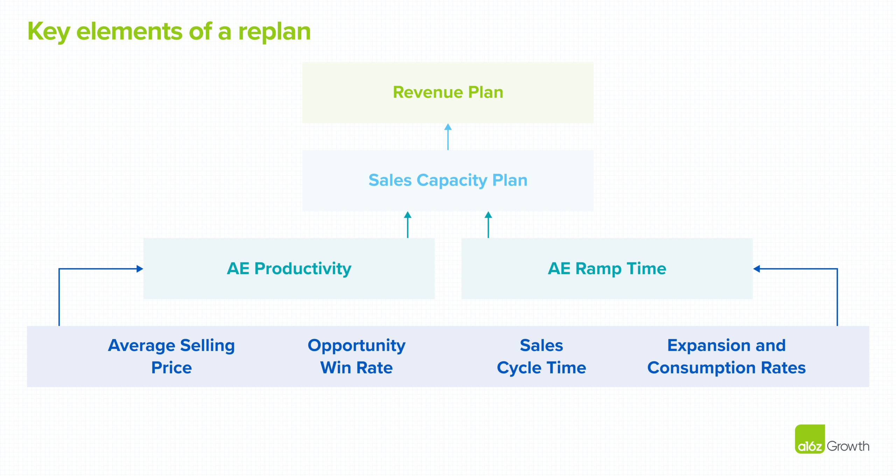

When market conditions worsen and there’s a gap between your current revenue plan and what your sales team can deliver, you need to build a credible and realistic replan.  

当市场状况恶化并且您当前的收入计划与您的销售团队可以交付的产品之间存在差距时，您需要制定一个可信且切合实际的重新计划。  

Introducing a replan can feel like pulling the handbrake on your team’s goals and expectations, but if you execute it properly, you can help them hit their new numbers and feel part of a winning team again. So what’s the first step to getting it right?   

引入重新计划感觉就像对团队的目标和期望拉手刹，但如果执行得当，您可以帮助他们达到新的目标并重新成为获胜团队的一员。那么做对的第一步是什么？

**Revisiting—and, if necessary, revising—your assumptions about account executive (AE) productivity and ramp time.   

重新审视并在必要时修改您对客户主管 (AE) 生产率和上线时间的假设。**

Though many companies skip over the nitty-gritty analysis required to reassess these assumptions, the devil is in the details. AE productivity and ramping levels are key inputs into your **sales capacity plan**  

尽管许多公司跳过了重新评估这些假设所需的细节分析，但细节决定成败。 AE 生产力和提升水平是您销售能力计划的关键输入, which underwrites the revenue plan of most B2B software companies, and they’re both particularly sensitive to economic headwinds.  

，它承保了大多数 B2B 软件公司的收入计划，它们都对经济逆风特别敏感。  

Revisiting the assumptions you’re making about these inputs when replanning allows you to more accurately forecast the overall capacity of your team—giving them a much more reasonable shot at beating their targets and, ultimately, realigning your business with your strategic plan.  

在重新规划时重新审视您对这些输入所做的假设，可以让您更准确地预测团队的整体能力——让他们有更合理的机会实现目标，并最终根据您的战略计划重新调整您的业务。  

## Choosing and inspecting the right KPIs  

选择和检查正确的 KPI

In order to figure out whether you need to adjust the AE productivity and ramping levels in your sales capacity model, you need to identify the most reliable key performance indicators (KPIs) for both of these inputs.  

为了确定您是否需要调整销售能力模型中的 AE 生产率和提升水平，您需要为这两个输入确定最可靠的关键绩效指标 (KPI)。

While key KPIs vary from business to business, the most common KPIs for subscription-based businesses selling committed spend agreements tend to be:  

虽然关键 KPI 因企业而异，但对于销售承诺支出协议的基于订阅的企业来说，最常见的 KPI 往往是：

-   average selling price (ASP),   
    
    平均售价（ASP），
-   opportunity win rate,   
    
    机会赢率，
-   sales cycle time, and   
    
    销售周期时间，以及
-   expansion or consumption rates  
    
    扩张率或消费率

A quick aside: consumption-based businesses also need to revisit their assumptions when replanning in a downturn and will likely use expansion/consumption rates as a KPI.  

顺便说一句：基于消费的企业在经济低迷时期重新规划时也需要重新审视他们的假设，并且可能会使用扩张/消费率作为 KPI。  

Their planning methodology and other KPIs will differ from what we’ve outlined for a range of reasons too complex to discuss here, but the process we’re recommending is still applicable.  

他们的规划方法和其他 KPI 将与我们概述的内容不同，原因有很多，这里无法讨论，但我们推荐的流程仍然适用。

Assessing whether these KPIs hold up against market conditions isn’t as easy as pulling a report on each of these indicators. Instead, we recommend using the below rules of thumb to spot trends in your KPI performance.   

评估这些 KPI 是否符合市场条件并不像针对每个指标生成报告那么容易。相反，我们建议使用以下经验法则来发现 KPI 绩效的趋势。

1.  **Use** **18+ months of history**, grouped by quarter or month (dictated by velocity/volume of sales cycles).  
    
    使用 18 个月以上的历史记录，按季度或月份分组（由销售周期的速度/数量决定）。
2.  At a minimum, **analyze each sales segment independently**. Depending on your scale, you may consider doing the same for each global region. The more precise your analysis, the more stock you can place in whatever trends you observe. Be sure to balance these time-intensive efforts against your planning team’s capacity.   
    
    至少，独立分析每个销售部门。根据您的规模，您可以考虑对每个全球区域执行相同的操作。你的分析越精确，你可以在你观察到的任何趋势中放置更多的股票。请务必根据规划团队的能力平衡这些耗时的工作。
3.  **Adjust for outliers** that can skew mean averages. A common example is a couple of “whale” deals that might suggest an upward trend in ASP during the period. You can adjust for this by comparing medians for each period or manually removing those outliers.  
    
    针对可能扭曲平均数的异常值进行调整。一个常见的例子是几笔“鲸鱼”交易，这可能表明在此期间平均售价呈上升趋势。您可以通过比较每个时期的中位数或手动删除这些异常值来对此进行调整。
4.  **Compare the** **average trend over the** **past 2 quarters with those of the periods prior**. Pay particular attention to like-for-like quarters and months, since seasonality can misinform your observations. For example, comparing average KPI values in H2’22 with those of H2’21, instead of those of H1’22, will likely yield more reliable comparisons.  
    
    将过去 2 个季度的平均趋势与前几个时期的平均趋势进行比较。要特别注意类似的季度和月份，因为季节性可能会误导您的观察结果。例如，将 H2'22 的平均 KPI 值与 H2'21 的平均 KPI 值进行比较，而不是将 H1'22 的平均 KPI 值进行比较，可能会产生更可靠的比较。

## Revising AE productivity and ramp level assumptions  

修改 AE 生产率和斜坡水平假设

If your KPIs have meaningfully shifted over the past 18 months, does that necessarily mean you should decrease your AE productivity and increase ramp time assumptions?  

如果您的 KPI 在过去 18 个月内发生了有意义的变化，这是否一定意味着您应该降低 AE 生产率并增加爬坡时间假设？  

This is a judgment call your planning team needs to make, but there are some additional guidelines to consider as you lock in your replanning assumptions:  

这是您的规划团队需要做出的判断，但在您锁定重新规划假设时，还需要考虑一些额外的指导方针：

-   If only one of your KPIs has trended ~10% lower over the past 2 quarters, then you may opt to hold off on changing assumptions that proved reliable in past years. It’s likely not necessary to over-rotate on a small deviation in a single metric.  
    
    如果您的 KPI 中只有一个在过去 2 个季度中下降了约 10%，那么您可能会选择推迟改变过去几年证明可靠的假设。可能没有必要在单个指标的小偏差上过度旋转。
-   However, **if one of your KPIs has decreased by considerably more than 10%, or if multiple KPIs have trended negatively over the past 2 quarters, then you should alter your planning assumptions**.   
    
    但是，如果您的一个 KPI 下降了 10% 以上，或者如果多个 KPI 在过去 2 个季度中呈负趋势，那么您应该改变您的计划假设。

## What’s next?  

下一步是什么？

If you decide your KPIs _do_ indicate a broader trend that you need to account for in your replan, you’ll then need to remodel both your AE productivity and ramping assumptions into a revised sales capacity model. Before you take that revised sales capacity model to your team, you’ll also need to [revisit your pipeline plan](https://a16z.com/2022/11/18/pipeline-cures-all/) to make sure it can support this revised capacity. And, like we mentioned, if you’re running a consumption-based business, your assessment process will look similar to the one we’ve outlined here, but you’ll have different KPIs and a different planning process.   

如果您确定您的 KPI 确实表明了您需要在重新计划中考虑的更广泛趋势，那么您将需要将您的 AE 生产率和提升假设重塑为修订后的销售能力模型。在您将修改后的销售能力模型带给您的团队之前，您还需要重新审视您的管道计划，以确保它能够支持这个修改后的能力。而且，正如我们提到的，如果您经营的是基于消费的业务，您的评估流程将与我们在此处概述的流程类似，但您将拥有不同的 KPI 和不同的规划流程。

That said, recalibrating the assumptions that feed into your sales capacity model is a critical first step toward getting your sales team back on track and feeling like they’re marching toward the same—winnable!—goal.   

也就是说，重新校准输入到您的销售能力模型中的假设是让您的销售团队重回正轨并感觉他们正在朝着同一个——可赢的！——目标迈进的关键的第一步。

\*\*\*

_The views expressed here are those of the individual AH Capital Management, L.L.C. (“a16z”) personnel quoted and are not the views of a16z or its affiliates.  

此处表达的观点是 AH Capital Management, L.L.C. 个人的观点。 (“a16z”) 人员引用但不代表 a16z 或其附属公司的观点。  

Certain information contained in here has been obtained from third-party sources, including from portfolio companies of funds managed by a16z.  

此处包含的某些信息是从第三方来源获得的，包括来自 a16z 管理的基金的投资组合公司。  

While taken from sources believed to be reliable, a16z has not independently verified such information and makes no representations about the enduring accuracy of the information or its appropriateness for a given situation.  

虽然取自被认为可靠的来源，但 a16z 并未独立核实此类信息，也不对信息的持久准确性或其对特定情况的适用性做出任何陈述。  

In addition, this content may include third-party advertisements; a16z has not reviewed such advertisements and does not endorse any advertising content contained therein.  

此外，此内容可能包含第三方广告； a16z 没有审查过此类广告，也不认可其中包含的任何广告内容。_

_This content is provided for informational purposes only, and should not be relied upon as legal, business, investment, or tax advice. You should consult your own advisers as to those matters.  

此内容仅供参考，不应作为法律、商业、投资或税务建议。您应该就这些事项咨询您自己的顾问。  

References to any securities or digital assets are for illustrative purposes only, and do not constitute an investment recommendation or offer to provide investment advisory services.  

对任何证券或数字资产的引用仅供说明之用，并不构成投资建议或提供投资咨询服务的要约。  

Furthermore, this content is not directed at nor intended for use by any investors or prospective investors, and may not under any circumstances be relied upon when making a decision to invest in any fund managed by a16z.  

此外，本内容不针对或旨在供任何投资者或潜在投资者使用，并且在任何情况下都不得在决定投资 a16z 管理的任何基金时予以依赖。  

(An offering to invest in an a16z fund will be made only by the private placement memorandum, subscription agreement, and other relevant documentation of any such fund and should be read in their entirety.  

（投资 a16z 基金的要约只能通过私募备忘录、认购协议和任何此类基金的其他相关文件进行，并且应完整阅读。  

) Any investments or portfolio companies mentioned, referred to, or described are not representative of all investments in vehicles managed by a16z, and there can be no assurance that the investments will be profitable or that other investments made in the future will have similar characteristics or results.  

) 提及、参考或描述的任何投资或投资组合公司并不代表 a16z 管理的车辆的所有投资，并且不能保证投资将盈利或未来进行的其他投资将具有类似的特征或结果。  

A list of investments made by funds managed by Andreessen Horowitz (excluding investments for which the issuer has not provided permission for a16z to disclose publicly as well as unannounced investments in publicly traded digital assets) is available at https://a16z.  

由 Andreessen Horowitz 管理的基金进行的投资清单（不包括发行人未允许 a16z 公开披露的投资以及未宣布的公开交易数字资产投资）可在 https://a16z 上找到。  

com/investments/.  

com/投资/。_

_Charts and graphs provided within are for informational purposes solely and should not be relied upon when making any investment decision. Past performance is not indicative of future results. The content speaks only as of the date indicated.  

其中提供的图表仅供参考，在做出任何投资决定时不应依赖。过去的表现并不预示未来的结果。内容仅在指定日期有效。  

Any projections, estimates, forecasts, targets, prospects, and/or opinions expressed in these materials are subject to change without notice and may differ or be contrary to opinions expressed by others. Please see https://a16z.com/disclosures for additional important information.  

这些材料中表达的任何预测、估计、预测、目标、前景和/或意见如有更改，恕不另行通知，并且可能与其他人表达的意见不同或相反。请参阅 https://a16z.com/disclosures 了解更多重要信息。  

_
