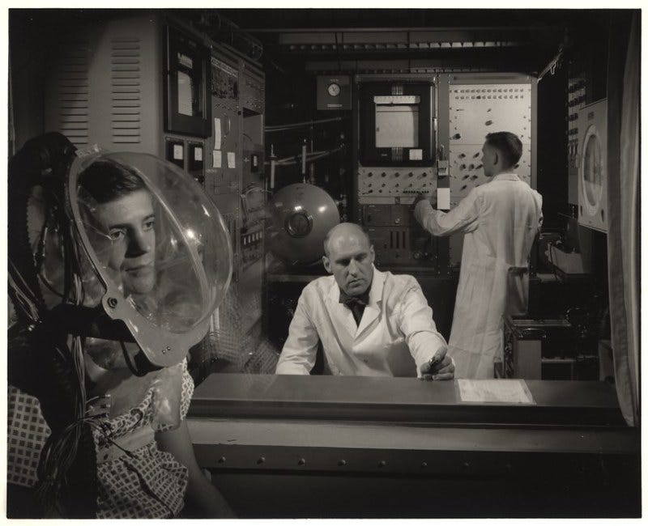
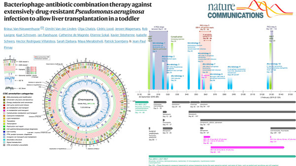
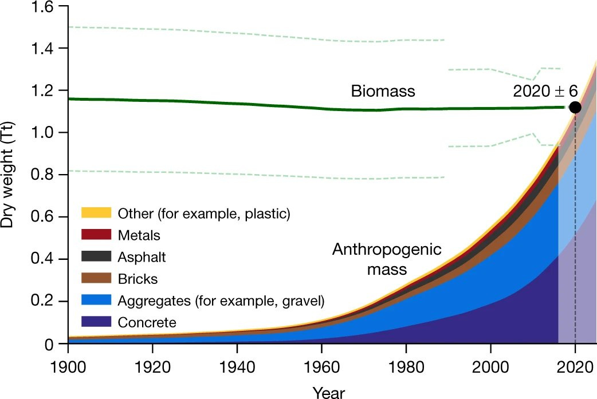

_You’re reading Codon, a _newsletter_ about the bio + tech advances and ideas enabling a brighter future for humanity. [Subscribe](https://cell.substack.com/publish/post/https://cell.substack.com/subscribe?) and [share](https://cell.substack.com/publish/post/https://cell.substack.com/?utm_source=substack&utm_medium=email&utm_content=share&action=share).  

您正在阅读 Codon，这是一份关于生物 + 技术进步和为人类创造更光明未来的想法的时事通讯。订阅和分享。_

_This is the last piece for the year. I’ll see you back here in a couple of weeks!  

这是今年的最后一部作品。几周后我会在这里见到你！_

Man wearing a pressurized oxygen mask, circa 1950s.  

大约 1950 年代，戴着加压氧气面罩的男子。

> _“History never looks like history when you are living through it. It always looks confusing and messy, and it always feels uncomfortable.”  
> 
> “当你经历历史时，历史永远不会像历史。它总是看起来很混乱和凌乱，而且总是让人感觉不舒服。”  
> 
> — [John W. Gardner](https://en.wikipedia.org/wiki/John_W._Gardner)  
> 
> — 约翰·W·加德纳_

Many writers who I deeply admire have written convincing polemics on the “stagnation of progress.” Science is getting harder, discoveries are getting smaller (on average), and both of these things are bad.  

许多我非常敬佩的作家都对“进步的停滞”写出了令人信服的论战。科学越来越难，发现越来越小（平均而言），这两件事都很糟糕。

If you take 93 physicists from the world’s top departments and ask them to compare a Nobel Prize-winning discovery from the 1910s to another from the 1980s, they’ll [usually say](https://www.theatlantic.com/science/archive/2018/11/diminishing-returns-science/575665/) that the earlier discovery was more important.  

如果你召集来自世界顶级院系的 93 位物理学家，让他们将 1910 年代获得诺贝尔奖的发现与 80 年代的另一个发现进行比较，他们通常会说更早的发现更重要。

It’s also harder to make technological leaps today compared to fifty years ago. Doubling the number of transistors on a computer chip (aka Moore’s Law) requires [18 times more researchers](https://www.aeaweb.org/articles?id=10.1257/aer.20180338) than it did in the early 1970s. And an academic paper, published today, is [less than half as likely](https://mattsclancy.substack.com/p/science-is-getting-harder) to get cited in a U.S. patent than a paper published just 30 years ago.  

与五十年前相比，今天实现技术飞跃也更加困难。将计算机芯片上的晶体管数量增加一倍（又名摩尔定律）需要的研究人员数量是 1970 年代初期的 18 倍。今天发表的学术论文被美国专利引用的可能性不到 30 年前发表的论文的一半。

These shrinking returns come in the midst of record highs.  

这些不断缩减的回报正处于历史高位之中。

More than 50,000 science and engineering PhDs are [granted each year](https://www.theatlantic.com/science/archive/2018/11/diminishing-returns-science/575665/)  

每年授予超过 50,000 个科学和工程博士学位 in the United States; that number was less than 10,000 in 1960. Federal funding for science is also (basically) at an all-time high.  

在美国；这个数字在 1960 年还不到 10,000。联邦对科学的资助也（基本上）处于历史最高水平。  

The total number of scientific papers is ramping up at an exponential clip, but the average number of authors on each paper has roughly quadrupled in the last hundred years.  

科学论文的总数呈指数级增长，但每篇论文的平均作者人数在过去一百年里大约翻了两番。

These are all imperfect metrics of biology’s progress, for one reason or another. But there is a lot of scattered evidence to suggest that science is getting less bang for its buck, even if it _**feels**_ like progress has never been faster. I’m convinced — based on anecdotal evidence, really — that biotechnology is not stagnant if benchmarked in terms of Nobel Prize-worthy discoveries per year. It’s just that a Nobel Prize is given annually for a single advance, and there’s no shortage of amazing papers waiting in the queue to win the top prize. So, of course, not every worthy person wins.  

出于某种原因，这些都是生物学进步的不完美指标。但是有很多零散的证据表明，科学正在变得越来越不划算，即使感觉进步从未像现在这样快。我相信——基于轶事证据，真的——如果以每年获得诺贝尔奖的发现为基准，生物技术不会停滞不前。只是诺贝尔奖每年都会颁发一次，而且不乏令人惊叹的论文在排队等待获得最高奖项。所以，当然，并不是每个有价值的人都会赢。

Oh, and if you take the Physics survey results that I mentioned earlier, and you do the same experiment for Medicine and Chemistry, the results are flipped — the relative importance of discoveries from the second half of the 20th century outperforms the first.  

哦，如果你拿我之前提到的物理学调查结果，对医学和化学做同样的实验，结果就会颠倒过来——20 世纪下半叶发现的相对重要性超过了上半叶。

Stagnant or not, biology has massive inefficiencies. It could — _should!_ — move much faster.  

不管停滞与否，生物学都存在巨大的低效率。它可以——应该！ - 移动得更快。

Many papers take more than a year to be published, suspended in a digital limbo under the careful eyes of journal bureaucrats. The lengthy wait probably isn’t worth it, either — peer review is [often useless](https://experimentalhistory.substack.com/p/the-rise-and-fall-of-peer-review) and a lot of bad science makes it through anyway. Lots of great ideas also never make it to a published paper because, well, they never get funded. NIH grant reviews are [horribly inconsistent](https://pubmed.ncbi.nlm.nih.gov/29507248/)  

许多论文需要一年多的时间才能发表，在期刊官僚的严密监视下，被搁置在数字化的边缘。漫长的等待可能也不值得——同行评审通常是无用的，而且很多糟糕的科学无论如何都能通过。许多伟大的想法也从来没有发表在论文上，因为，好吧，他们从来没有得到资助。 NIH 拨款审查非常不一致. If you give 25 grant proposals to 43 different reviewers, their inter-rater reliability (a measure of how consistent scores are) is basically zero, even if the grants had already received funding and high marks from previous review panels!  

.如果您向 43 位不同的审稿人提供 25 份拨款建议，他们的评定者间可靠性（衡量分数一致性的指标）基本上为零，即使拨款已经获得资金和先前评审小组的高分！  

Unfunded grants, given to the same reviewers, scored just as well as the funded ones.  

给予相同审稿人的无资金资助与有资金资助的资助得分一样。

And what about the biological literature? That, too, is a mess. Scientific papers are “unreliable by commission,” [wrote Sam Rodriques](https://www.sam-rodriques.com/post/why-is-progress-in-biology-so-slow) in a recent essay, and “unreliable by omission.” In other words, some studies (a small fraction) are simply made up. Professors or students fudge numbers to get their papers published and, if anybody calls them on their bullshit, it [could be](https://newscience.substack.com/p/laws-of-science) _[years](https://newscience.substack.com/p/laws-of-science)_ before an editor issues a retraction.  

那么生物学文献呢？那也是一团糟。山姆·罗德里克斯 (Sam Rodriques) 在最近的一篇文章中写道，科学论文“因委托而变得不可靠”，并且“因遗漏而变得不可靠”。换句话说，一些研究（一小部分）只是编造的。教授或学生为了发表论文而捏造数字，如果有人说他们在胡说八道，编辑可能要过好几年才会撤稿。

The larger problem, though, is probably sins of _omission_  

然而，更大的问题可能是疏忽之罪. Scientific journals like to publish positive results, so most negative findings never meet the pages of a glossy journal.  

.科学期刊喜欢发表积极的结果，所以大多数消极的发现永远不会出现在光鲜的期刊上。  

If someone runs experiments that show Drug A binds to Receptor B, they’ll publish it — but neglect to mention that Drug A doesn’t bind to Receptor C through Z.  

如果有人进行的实验表明药物 A 与受体 B 结合，他们会发表它——但忽略提及药物 A 不通过 Z 与受体 C 结合。  

Null results rarely trickle down to scientists, many of whom have had the painful experience of trying an experiment again and again for months, only to later find an obscure paper from the 1970s that made all their hard work moot.  

无效结果很少会传给科学家，他们中的许多人都有过数月来一次又一次地尝试实验的痛苦经历，后来却发现 1970 年代的一篇不起眼的论文让他们所有的努力都变得毫无意义。

I’m telling you these sad things — stories of stagnant science and horrid inefficiencies — to make a point: **It’s amazing that biology has made so much progress in the last year.** Biology’s advances are a testament to the human desire to explore, to fail, and then to continue on. This _newsletter_ celebrates humanity’s achievements and highlights the **top ten advances in biology** from the past twelve months.  

我告诉你这些悲伤的事情——停滞不前的科学和可怕的低效率的故事——是为了说明一个观点：生物学在去年取得了如此大的进步，真是令人惊讶。生物学的进步证明了人类渴望探索、失败，然后继续前进的愿望。这份时事通讯庆祝人类的成就，并重点介绍了过去 12 个月生物学领域的十大进步。

Everything in this list comes from a previous issue of _Codon_, so I hope you’ll point out my errors and omissions in the comments. My criteria for inclusion were simple: The list includes only papers that were posted to _bioRxiv_ or published in a journal during 2022. I’m not including company achievements — which really could be its own list — unless they published the data. Some of the items on the list include multiple papers because a whole subfield moved forward really fast.  

此列表中的所有内容均来自 Codon 的上一期，因此希望您能在评论中指出我的错误和遗漏。我的入选标准很简单：该列表仅包括 2022 年期间发布到 bioRxiv 或发表在期刊上的论文。我不包括公司成就——这实际上可能是它自己的列表——除非他们发布了数据。列表中的一些项目包括多篇论文，因为整个子领域发展得非常快。

The biggest danger in putting together a “top ten” is that it’s completely subjective, there’s a lot of great stuff that didn’t make the cut, and lots of other writers have already done it (although I haven’t yet seen a list specifically for biology). Noah Smith put out his [techno-optimism list](https://noahpinion.substack.com/p/techno-optimism-for-2023) for 2023, which includes some brief mentions of biotechnology, and _The Atlantic_ published their “[breakthroughs of the year](https://www.theatlantic.com/newsletters/archive/2022/12/technology-medicine-law-ai-10-breakthroughs-2022/672390/)” and then promptly slapped that thing behind a paywall.  

将“前十名”放在一起的最大危险在于它完全是主观的，有很多伟大的东西没有入选，而且很多其他作家已经做到了（虽然我还没有看到名单专门用于生物学）。诺亚·史密斯 (Noah Smith) 列出了他的 2023 年技术乐观名单，其中包括对生物技术的一些简短提及，而《大西洋月刊》(The Atlantic) 发表了他们的“年度突破”，然后迅速将其置于付费专区后面。

There’s a need for an entire list devoted to biology, though, because a lot of great stuff has happened that was largely overshadowed by AI. The Human Genome Project (which started in 1990) was finally [finished this year](https://www.science.org/toc/science/376/6588), as a huge team of scientists filled in the last 8% of sequence gaps. And scientists also made [mirror-image DNA](https://www.nature.com/articles/s41587-022-01337-8) using a mirror-image DNA polymerase and discovered a new class of CRISPR proteins that [cut proteins](https://cell.substack.com/p/crispr-can-cut-proteins-too-index) instead of genes. Machine learning is making big waves in protein engineering, as an algorithm was used to engineer an enzyme that can [break down PET plastics](https://cell.substack.com/p/ai-designed-enzyme-eats-plastic) faster than anything found in nature.  

但是，需要一个专门用于生物学的完整列表，因为已经发生了很多伟大的事情，而这些事情在很大程度上被人工智能所掩盖。人类基因组计划（始于 1990 年）终于在今年完成，一个庞大的科学家团队填补了最后 8% 的序列空白。科学家们还使用镜像 DNA 聚合酶制作了镜像 DNA，并发现了一类新的 CRISPR 蛋白质，它们可以切割蛋白质而不是基因。机器学习正在蛋白质工程中掀起波澜，因为一种算法被用来设计一种酶，这种酶可以比自然界中发现的任何东西都更快地分解 PET 塑料。

I’m not sure whether this year’s progress has any bearing on whether biological progress is stagnant as a whole. But one thing holds constant: Biology keeps getting weirder, and I’m here for it. ◼️  

我不确定今年的进展是否与生物进展是否整体停滞不前有关。但有一件事是不变的：生物学变得越来越奇怪，而我就是为了它而来的。 ◼️

Building a synthetic cell from purely chemical constituents is the Holy Grail of biology. It’s a feat that, if achieved, would prove that we understand the broad contours of how life works with enough detail to recreate it in the lab.  

从纯化学成分构建合成细胞是生物学的圣杯。这是一项壮举，如果实现，将证明我们了解生命如何运作的大致轮廓，并有足够的细节在实验室中重现它。  

It’d also be a starting point toward custom cells that can detect toxic pollution or manufacture medicines, without being a biosecurity risk or running risks of infection.  

它也将成为定制细胞的起点，这些细胞可以检测有毒污染或制造药物，而不会存在生物安全风险或感染风险。

Several papers moved the needle on synthetic cells this year, but two spring to mind. The first, [a preprint](https://www.biorxiv.org/content/10.1101/2022.08.29.505692v1) on _bioRxiv_, is apparently the **first demonstration that ribosomes** — large proteins that make other proteins — **can be made outside of a living cell**. It’s an important starting point for producing proteins _de novo_ within synthetic cells.  

今年有几篇论文推动了合成细胞的发展，但我想到了两篇。第一个是 bioRxiv 上的预印本，显然是第一次证明核糖体——制造其他蛋白质的大蛋白质——可以在活细胞外制造。这是在合成细胞内从头生产蛋白质的重要起点。

We also made important strides in synthetic cell division. [One study](https://www.nature.com/articles/s41467-022-33679-x) reported that synthetic division rings could be made in fat bubbles using _just five proteins_! When these proteins came together, they constricted and exerted forces on the bubbles (GIF below).  

我们还在合成细胞分裂方面取得了重要进展。一项研究报告说，仅使用五种蛋白质就可以在脂肪泡中制造合成分裂环！当这些蛋白质聚集在一起时，它们会收缩并向气泡施加力（下面的 GIF）。

Timelapse of a synthetic division ring forming inside a bubble.  

气泡内形成的合成分裂环的游戏中时光倒流。

Back in 2016, a _Nature_ paper reported the [first base editor](https://www.nature.com/articles/nature17946) protein that could swap a ‘C’ for a ‘T’ in DNA, without cleaving the genome in two. Its importance was immediately clear — lots of serious genetic diseases are caused by a single base swap in DNA, and now those mutations could be fixed.  

早在 2016 年，《自然》杂志的一篇论文就报道了第一个碱基编辑蛋白，它可以将 DNA 中的“C”替换为“T”，而无需将基因组一分为二。它的重要性立即显而易见——许多严重的遗传疾病是由 DNA 中的单个碱基交换引起的，现在这些突变可以被修复。

Base editors have come of age. These gene-editing proteins entered clinical trials just five years after their invention — a record pace — with ongoing [trials](https://www.nature.com/articles/d41573-022-00124-z) by Verve, Beam, and other companies targeting sickle cell disease, high cholesterol, and Stargardt disease.  

碱基编辑器已经成熟。这些基因编辑蛋白在发明后仅仅五年就以创纪录的速度进入临床试验，Verve、Beam 和其他公司正在进行针对镰状细胞病、高胆固醇和 Stargardt 病的试验。

One of the main challenges of base editing is that it’s tricky to edit the _mitochondrial genome_, though, and [many genetic diseases](https://www.chop.edu/conditions-diseases/mitochondrial-dna-common-mutation-syndromes) stem from there. Back in 2020, [one paper](https://www.nature.com/articles/s41586-020-2477-4) showed that a base editor could successfully get into the mitochondria and make ‘C’ to ‘T’ changes, but its promise was short-lived. In May of this year, a [follow-on paper](https://www.nature.com/articles/s41586-022-04836-5) said that, actually, these mitochondrial gene editors induce “substantial” off-target mutations, meaning that they edited more places than intended and probably do more harm than good.  

然而，碱基编辑的主要挑战之一是编辑线粒体基因组很棘手，许多遗传疾病都源于此。早在 2020 年，一篇论文就表明碱基编辑器可以成功进入线粒体并使“C”变为“T”，但它的承诺是短暂的。今年 5 月，一篇后续论文称，实际上，这些线粒体基因编辑器诱发了“大量”脱靶突变，这意味着它们编辑的位置比预期的要多，弊大于利。

But innovation is not stymied by failures. At least **three more papers** came out this year alone that have made mitochondrial base editors _[smaller](https://www.nature.com/articles/s41467-022-34784-7)_ or _[more accurate](https://doi.org/10.1016/j.cell.2022.03.039)_. It’s never been easier to get a base editor into the mitochondria or edit its DNA. I’m sure we’ll see some clinical trials specific to mitochondrial-linked diseases soon.  

但创新不会因失败而受阻。仅今年一年就至少发表了三篇论文，使线粒体碱基编辑器变得更小或更准确。让碱基编辑器进入线粒体或编辑其 DNA 从未如此简单。我相信我们很快就会看到一些针对线粒体相关疾病的临床试验。

This was a good year for phage. It’s fitting, really, because it’s also the **100-year anniversary** of Felix d’Hérelle’s famous experiment. In 1922, the Parisian microbiologist showed that phages — little viruses that infect bacteria — [could eradicate](https://jamanetwork.com/journals/jamapediatrics/article-abstract/1173780) “dysentery and other bacilli” in rabbits and small animals.  

今年对噬菌体来说是个好年头。这真的很合适，因为它也是 Felix d'Herelle 著名实验 100 周年。 1922 年，这位巴黎微生物学家证明噬菌体——感染细菌的小病毒——可以根除兔子和小动物体内的“痢疾杆菌和其他杆菌”。

We’re now living through a quasi-Renaissance of clinical therapies, and phage is pretty regularly being used to eliminate infections where antibiotics have failed (especially in European hospitals). A few weeks ago, a European team of scientists [saved a toddler’s life](https://www.nature.com/articles/s41467-022-33294-w) using an experimental phage therapy. After an organ transplant, the young boy got a drug-resistant infection that wouldn’t clear up with antibiotics. More than two years after treatment with a custom-made phage cocktail, the child is healthy at home.  

我们现在正经历着临床疗法的准复兴时期，噬菌体经常被用来消除抗生素无效的感染（尤其是在欧洲医院）。几周前，一个欧洲科学家团队使用实验性噬菌体疗法挽救了一名幼儿的生命。器官移植后，这个小男孩感染了抗生素无法清除的耐药性感染。在用定制的噬菌体鸡尾酒治疗两年多后，孩子在家中恢复健康。

And in May, a team in Denver [used phages to treat](https://doi.org/10.1016/j.cell.2022.04.024) an _M. abscessus_ infection in a boy with severe cystic fibrosis. The phages held the infection in check for more than one year until a donor lung became available. I’m sure we’ll see custom phage therapies enter the clinic in 2023.  

5 月，丹佛的一个团队使用噬菌体治疗一名患有严重囊性纤维化的男孩的脓肿分枝杆菌感染。噬菌体将感染控制了一年多，直到获得供体肺。我相信我们会在 2023 年看到定制噬菌体疗法进入临床。

[Hemgenix](https://www.fda.gov/vaccines-blood-biologics/vaccines/hemgenix), a gene therapy for hemophilia B, earned FDA approval a few months back. It will cost $3.5 million, making it the most expensive medicine ever (not good). It is safe and effective in patients [for at least two years](https://hemophilianewstoday.com/news/hemgenix-gene-therapy-benefits-sustained-2-years-phase-3-hope-b/), according to phase III trial data.  

Hemgenix 是一种治疗 B 型血友病的基因疗法，几个月前获得了 FDA 的批准。它将花费 350 万美元，使其成为有史以来最昂贵的药物（不好）。根据 III 期试验数据，它对患者至少两年是安全有效的。

Progress on a gene therapy for hemophilia A — caused by mutations in a different blood clotting protein, called VIII — has been slower. A study from May showed that a [gene therapy targeted to the liver](https://www.nature.com/articles/s41467-022-30102-3) worked pretty well in non-human primates, causing a “>10-fold increase in overall factor VIII output.” And a phase I/II clinical trial with 134 participants, published in March, showed that a gene therapy delivered using an adeno-associated virus, also to the liver, caused a [drop in bleeding events](https://www.nejm.org/doi/full/10.1056/NEJMoa2113708) for people with hemophilia. It came with a lot of side effects, though; every trial participant had at least one adverse event. Still, hemophilia was one of the ‘low-hanging’ targets for gene therapies and these are useful acid tests for other targets in the pipeline.  

血友病 A 的基因治疗进展缓慢，该病由一种名为 VIII 的不同凝血蛋白突变引起。 5 月的一项研究表明，针对肝脏的基因疗法在非人类灵长类动物中效果很好，导致“总凝血因子 VIII 输出增加 10 倍以上”。 3 月份发表的一项有 134 名参与者参与的 I/II 期临床试验表明，使用腺相关病毒进行的基因疗法，也用于肝脏，可减少血友病患者的出血事件。但是，它带来了很多副作用；每个试验参与者至少有一次不良事件。尽管如此，血友病仍是基因治疗的“低悬”目标之一，这些是对管道中其他目标的有用酸性测试。

Stem cells, harvested from mice, were used to create “embryo-like structures” this year, with working intestines, a beating heart, and the start of a brain — no sperm or eggs required.  

今年，从老鼠身上采集的干细胞被用来制造“胚胎样结构”，具有工作的肠道、跳动的心脏和大脑的开始——不需要精子或卵子。

An initial paper, by Jacob Hanna’s group in Israel, was [published in](https://doi.org/10.1016/j.cell.2022.07.028) _[Cell](https://doi.org/10.1016/j.cell.2022.07.028)_ in August. Those authors have since [formed a company](https://www.theguardian.com/science/2022/aug/03/scientists-create-worlds-first-synthetic-embryos), called Renewal Bio, “that aims to grow human synthetic embryos to provide tissues and cells for medical conditions,” according to coverage in _The Guardian_. A [preprint](https://doi.org/10.1101/2022.08.01.502371)  

以色列的 Jacob Hanna 团队发表了一篇最初的论文，于 8 月在 Cell 上发表。据《卫报》报道，这些作者后来成立了一家名为 Renewal Bio 的公司，“旨在培养人类合成胚胎，为医疗条件提供组织和细胞”。预印本 by a team from Cambridge University and Caltech was also released on August 2nd, and showed that these “synthetic embryos” accurately recapitulate “developmental events from embryonic day 5.5 to 8.  

由剑桥大学和加州理工学院的一个团队于 8 月 2 日发布，并表明这些“合成胚胎”准确地概括了“从胚胎第 5.5 天到第 8 天的发育事件。  

5, including gastrulation, and formation of the anterior-posterior axis, brain, a beating heart structure, and the development of extraembryonic tissues, including yolk sac and chorion.”  

5，包括原肠胚形成，前后轴的形成，大脑，跳动的心脏结构，以及胚胎外组织的发育，包括卵黄囊和绒毛膜。”

Synthetic embryos — which only form correctly about 0.5 percent of the time — are potentially useful for a few reasons. These structures could be used to study how organs form during development, for instance, but also to test medicines without using real embryos.  

合成胚胎——只有大约 0.5% 的时间正确形成——有几个潜在的用途。例如，这些结构可用于研究器官在发育过程中的形成方式，也可用于在不使用真实胚胎的情况下测试药物。

Embryoids after six days. From Kasey Lau _et al._ on _bioRxiv_. [Link](https://www.biorxiv.org/content/10.1101/2022.08.01.502371v1.full.pdf)  

六天后的胚胎。来自 Kasey Lau 等人。关于 bioRxiv。关联

A massive highlight from this year: The first demonstration that chemicals alone can [reprogram human cells back into stem cells](https://www.nature.com/articles/s41586-022-04593-5). The breakthrough took more than a decade of work and requires _eleven different chemicals_ and between one and two months of work, so it will need some fine-tuning. The same group [did this in mouse cells](https://www.science.org/doi/10.1126/science.1239278) way back in 2013, but the process for human cells is much more difficult.  

今年的一大亮点：首次证明仅靠化学物质就能将人类细胞重新编程为干细胞。突破需要十多年的工作，需要十一种不同的化学品和一到两个月的工作，因此需要一些微调。早在 2013 年，同一个小组就在小鼠细胞中做了这个，但人类细胞的过程要困难得多。

This also isn’t the first study to reprogram human cells; that honor belongs to Shinya Yamanaka who, in 2006, reprogrammed iPS cells by expressing four proteins (the now-famous “Yamanaka factors.”) In the decades that followed, other groups used viruses or mRNA to reprogram cells.  

这也不是第一项重新编程人类细胞的研究。这一荣誉属于山中伸弥 (Shinya Yamanaka)，他在 2006 年通过表达四种蛋白质（现在著名的“山中因子”）对 iPS 细胞进行了重编程。在随后的几十年中，其他研究小组使用病毒或 mRNA 对细胞进行重编程。  

But this chemical-only approach stands out because it’s simple to use  

但这种仅使用化学物质的方法之所以脱颖而出，是因为它使用简单_in vitro_ and the chemical cocktails can be delivered into the body using IVs — no gene-editing required. The approach provides a relatively simple tool to generate human pluripotent stem cells that can be used in regenerative medicine.  

在体外，化学混合物可以使用静脉注射输送到体内——不需要基因编辑。该方法提供了一种相对简单的工具来生成可用于再生医学的人类多能干细胞。

We are living through the Anthropocene, a terrifying moment in human history in which **man-made materials** **weigh more than all biomass on Earth** and continue to double in weight every year.  

我们生活在人类世，这是人类历史上一个可怕的时刻，人造材料的重量超过地球上所有的生物量，而且重量每年都在继续增加一倍。

“Global human-made mass exceeds all living biomass,” by Elhacham E _et al._ in _Nature_. [Link](https://www.nature.com/articles/s41586-020-3010-5)  

“全球人造质量超过所有生物量，”Elhacham E 等人。在自然界。关联

Of our existing biomass, an estimated 83 percent is held by plants. If we want to scrape our way out of this planetary dumpster fire, then, we’ll probably have to engineer plants: Make them capture more carbon, [supercharge their photosynthesis](https://cell.substack.com/p/hacking-photosynthesis), grow more food, _something!_  

在我们现有的生物质中，估计有 83% 由植物持有。如果我们想从这场行星垃圾箱大火中爬出来，那么，我们可能必须对植物进行工程设计：让它们捕获更多的碳，增强它们的光合作用，种植更多的食物，等等！

Fortunately, it’s never been easier to do that. For decades, synthetic biologists have engineered bacteria and mammalian cells with increasingly complex genetic circuits, even as plants went largely neglected. This year, two important advances shifted the balance.  

幸运的是，做到这一点从未如此简单。几十年来，合成生物学家已经对细菌和哺乳动物细胞进行了改造，使其具有越来越复杂的遗传回路，即使植物在很大程度上被忽视了。今年，两项重要进展改变了平衡。

The first is that gene-editing technologies, like CRISPR, have now been optimized to work better in plants. Prime editors, for example, are ‘search-and-replace’ gene editors that can insert, delete, or swap DNA. A new Plant Prime Editor is up to [3.4-fold more efficient](https://www.nature.com/articles/s41587-022-01254-w) in plant cells compared to other prime editors, and was used to swiftly make rice plants tolerant to herbicides in the laboratory.  

首先是基因编辑技术，如 CRISPR，现在已经过优化，可以在植物中更好地发挥作用。例如，Prime 编辑器是可以插入、删除或交换 DNA 的“搜索和替换”基因编辑器。与其他 Prime 编辑器相比，新的 Plant Prime Editor 在植物细胞中的效率提高了 3.4 倍，并被用于在实验室中迅速使水稻植物对除草剂产生耐受性。

But the bigger advance was this: A Stanford team released _[an entire genetic toolkit](https://www.science.org/doi/10.1126/science.abo4326)_ to “program” plants in much the same way that we program bacteria. The _new toolkit_ includes a host of synthetic promoters and transcription factors that can be used to control gene expression in plants. These genetic parts were used to construct gene circuits capable of Boolean logic operations in _N. benthamiana_ and _Arabidopsis_. The authors also built logic gates that could control gene expression levels in plant roots to control their lateral densities.  

但更大的进步是：斯坦福大学的一个团队发布了一个完整的基因工具包，可以像我们对细菌进行编程一样对植物进行“编程”。新工具包包括大量合成启动子和转录因子，可用于控制植物中的基因表达。这些遗传部分被用于构建能够在本塞姆氏烟草和拟南芥中进行布尔逻辑运算的基因回路。作者还建立了逻辑门，可以控制植物根部的基因表达水平，从而控制它们的侧向密度。

A genetic circuit controls how many _lateral roots_ shoot out from a plant’s roots. Lateral density increases from left to right, with a wildtype plant shown on the far right. From [Brophy](https://www.biorxiv.org/content/10.1101/2022.02.02.478917v1) _[et al.](https://www.biorxiv.org/content/10.1101/2022.02.02.478917v1)_ [on](https://www.biorxiv.org/content/10.1101/2022.02.02.478917v1) _[bioRxiv](https://www.biorxiv.org/content/10.1101/2022.02.02.478917v1)_.  

遗传回路控制着植物根部长出的侧根数量。横向密度从左到右增加，最右侧显示野生型植物。来自 Brophy 等人。关于 bioRxiv。

A notoriously difficult part of biology is that it’s hard to scale. It’s one thing to engineer a cell that can turn sugar into a cancer drug in a test tube, but an entirely different beast to do the same in a thousand-liter bioreactor.  

生物学的一个众所周知的困难部分是难以扩展。设计一个可以在试管中将糖转化为抗癌药物的细胞是一回事，但在千升生物反应器中做同样的事情是完全不同的野兽。

That’s why companies like [LanzaTech](https://lanzatech.com/) are exciting. _They’ve actually scaled up biology_ at industrial factories. They have pilot facilities that are **recycling waste carbon** from factories into **fuels and chemicals**. These plants could make hundreds of billions of gallons of fuel each year and are already scrubbing emissions at levels equivalent to taking thousands of cars off the road each year.  

这就是像 LanzaTech 这样的公司令人兴奋的原因。他们实际上已经在工业工厂扩大了生物学规模。他们有试点设施，将工厂的废碳回收成燃料和化学品。这些工厂每年可以生产数千亿加仑的燃料，并且已经达到相当于每年减少数千辆汽车上路的排放量。

A few months back, scientists from LanzaTech and Northwestern University reached [another milestone](https://www.nature.com/articles/s41587-021-01195-w): Using an engineered autotroph, called _Clostridium autoethanogenum_, they produced acetone and isopropanol at industrial scales in a process that had a _negative carbon footprint_  

几个月前，来自 LanzaTech 和西北大学的科学家们达到了另一个里程碑：使用一种名为 Clostridium autoethanogenum 的工程自养生物，他们在具有负碳足迹的过程中以工业规模生产丙酮和异丙醇. “Unlike traditional production processes, which result in release of greenhouse gases, our process fixes carbon,” they wrote in the published paper. It’s a huge step forward for biology at scale.  

. “与导致温室气体释放的传统生产过程不同，我们的过程可以固定碳，”他们在发表的论文中写道。这是大规模生物学向前迈出的一大步。  

The engineered microbes can ameliorate pollutants and produce chemicals without dragging down the atmosphere.  

经过改造的微生物可以在不拖累大气的情况下改善污染物并产生化学物质。

This will go down in the annals of human history as the “Year of Xenotransplantation.  

这将作为“异种移植年”载入人类史册。  

” With a history stretching back to the mid-1960s — when the French surgeon, Renè Kuss, transplanted a pig kidney into a person only to have it swiftly rejected by the patient’s body — xenotransplantation has been a field of failure.  

” 历史可以追溯到 20 世纪 60 年代中期——当时法国外科医生 Renè Kuss 将猪肾移植到一个人体内，但很快就被患者的身体排斥了——异种移植一直是一个失败的领域。  

The most famous example is probably the 1980s surgery of Stephanie Beauclair, or Baby Fae, who received a heart from a baboon and died shortly after.  

最著名的例子可能是 80 年代 Stephanie Beauclair 或 Baby Fae 的手术，她从狒狒那里接受了一颗心脏，但不久后就死了。

We’ve gotten a lot better at taking hearts from pigs and putting them into humans over the last forty years, though, because gene editing techniques are improving. It’s easier than ever to find all the nasty proteins in a pig’s cells which cause our body to reject the organ, and [systematically eliminate](https://www.science.org/doi/10.1126/science.aad1191) those protein-coding genes from the genome. But progress is never without pitfalls.  

不过，在过去四十年里，我们在从猪身上提取心脏并将其植入人体方面做得更好，因为基因编辑技术正在改进。现在比以往任何时候都更容易在猪的细胞中找到所有导致我们的身体排斥该器官的有害蛋白质，并从基因组中系统地消除这些蛋白质编码基因。但进步从来都不是没有陷阱的。

On January 7th of this year, a team of surgeons at the University of Maryland [transplanted a pig’s heart](https://www.technologyreview.com/2022/01/11/1043374/gene-edited-pigs-heart-transplant/) into 57 year-old David Bennett Sr. He [died two months](https://www.technologyreview.com/2022/05/04/1051725/xenotransplant-patient-died-received-heart-infected-with-pig-virus/) later.  

今年1月7日，马里兰大学的一组外科医生将一颗猪的心脏移植到57岁的老大卫贝内特体内，两个月后他去世了。

Dejection was followed by optimism when, in May, two [pig kidneys were transplanted](https://www.nejm.org/doi/full/10.1056/NEJMoa2120238) into brain-dead people and monitored over a 54-hour period. Both kidneys produced urine and biopsies did not show any signs of organ rejection.  

5 月，两只猪的肾脏被移植到脑死亡患者体内，并进行了 54 小时的监测，这让沮丧过后变得乐观起来。两个肾脏都产生了尿液，活组织检查没有显示出任何器官排斥的迹象。

The heart transplant likely failed because the [organ was infected with a pig virus](https://www.technologyreview.com/2022/05/04/1051725/xenotransplant-patient-died-received-heart-infected-with-pig-virus/), but the authors of the kidney transplant study detected no such viruses. Pig kidneys may soon make their way into the living.  

心脏移植可能因为器官感染了猪病毒而失败，但肾移植研究的作者没有检测到这种病毒。猪肾可能很快就会进入人们的生活。

“Malaria has killed half of all the people who ever lived,” if you believe this 2002 _[Nature](https://www.nature.com/articles/news021001-6)_ [article](https://www.nature.com/articles/news021001-6)  

如果您相信这篇 2002 年发表在《自然》杂志上的文章，“疟疾已经杀死了所有曾经生活过的人的一半” by John Whitfield (the claim was uncited.) Even if the claim is false, mosquitoes have collectively killed billions of people throughout human history. The insect bastards took out Alexander the Great, Alaric the Goth, and Dante.  

作者：John Whitfield（该声明未被引用。）即使该声明是错误的，在整个人类历史上，蚊子也已集体杀死了数十亿人。昆虫混蛋干掉了亚历山大大帝、哥特人阿拉里克和但丁。  

And still, in 2021, malaria killed about 620,000 people. It’s shocking, sad, and preventable. But this year was one of amazing progress.  

而且，在 2021 年，疟疾仍导致约 620,000 人死亡。这是令人震惊、悲伤和可以预防的。但今年是取得惊人进步的一年。

One malaria vaccine, called R21/Matrix-M, was tested in four African nations in a phase III trial. Its [overall efficacy was 75 percent](https://www.medpagetoday.com/meetingcoverage/astmh/101561) in young children. That’s fantastic news. A phase II trial in Mali also tested an antibody, called CIS43LS, against _P. falciparum_ infections in healthy adults. A single shot had an [efficacy of 88.2 percent](https://www.nejm.org/doi/full/10.1056/NEJMoa2206966) over a six-month span.  

一种称为 R21/Matrix-M 的疟疾疫苗在四个非洲国家进行了 III 期试验。它在幼儿中的总体疗效为 75%。这是个好消息。在马里进行的一项 II 期试验还测试了一种名为 CIS43LS 的抗体，用于对抗健康成人中的恶性疟原虫感染。在六个月的时间里，单次注射的疗效为 88.2%。

The only immunogens that are more than 90 percent effective at preventing malaria, though, are sporozoites, a spore-like part that forms during the mosquito’s lifecycle. These sporozoites are injected into the arm and [used as a vaccine](https://www.science.org/doi/10.1126/scitranslmed.abj3776), but it’s obviously difficult to collect these things from actual mosquitoes.  

不过，唯一能有效预防疟疾 90% 以上的免疫原是子孢子，这是一种在蚊子生命周期中形成的类孢子部分。这些子孢子被注射到手臂中并用作疫苗，但显然很难从真正的蚊子身上收集到这些东西。

Earlier this month, researchers created “[hundreds of millions](https://www.nature.com/articles/s41586-022-05466-7)” of sporozoites in the lab; no mosquitoes required. They basically recreated the entire “_P. falciparum_ life cycle from infectious gametocyte to infectious gametocyte without mosquitoes.” The new technique will help create vaccines against malaria much faster and more cheaply.  

本月早些时候，研究人员在实验室中创造了“数亿”子孢子；不需要蚊子。他们基本上重新创建了整个“P.从传染性配子体到没有蚊子的传染性配子体的恶性疟原虫生命周期。”这项新技术将有助于更快、更便宜地研制出抗疟疾疫苗。

See you next year,  

明年再见，  

Niko McCarty  

妮可·麦卡蒂  

([Email](mailto:nsmccarty3@gmail.com) | [Twitter](https://twitter.com/NikoMcCarty))  

（电子邮件 | 推特）
