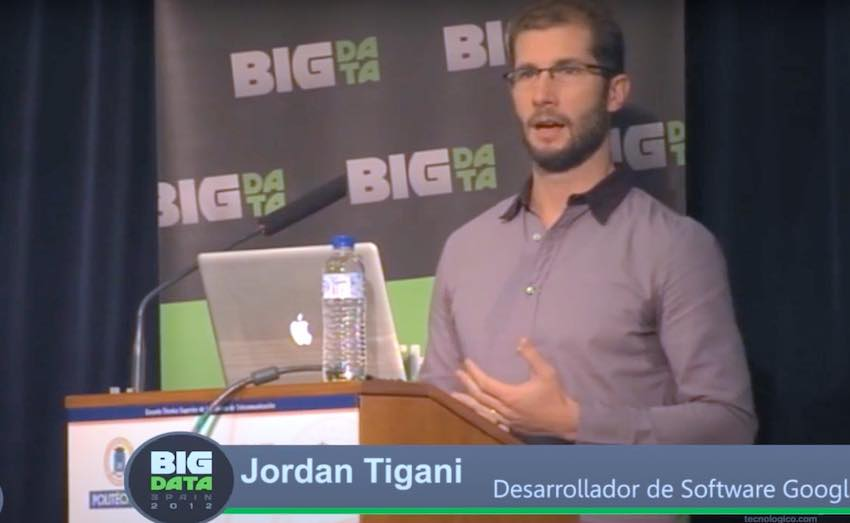
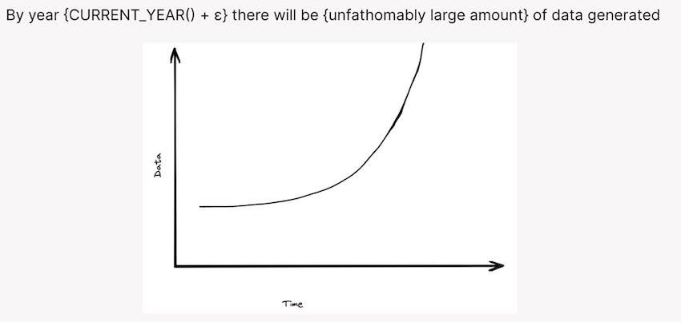
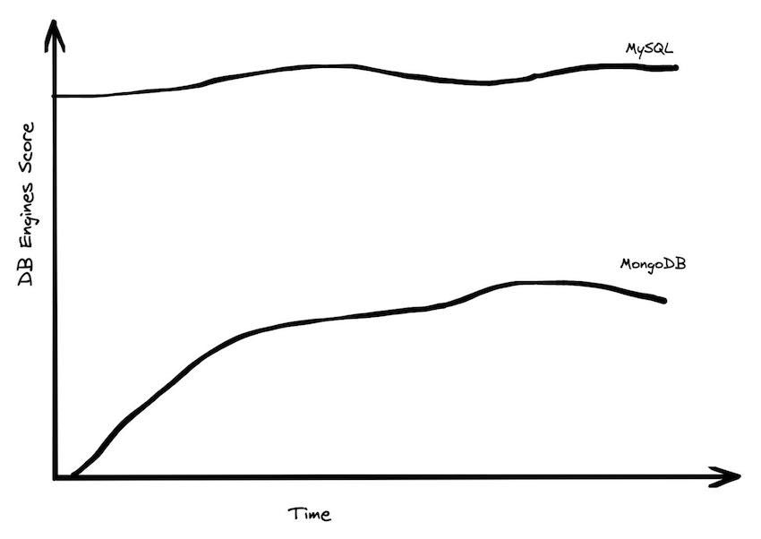
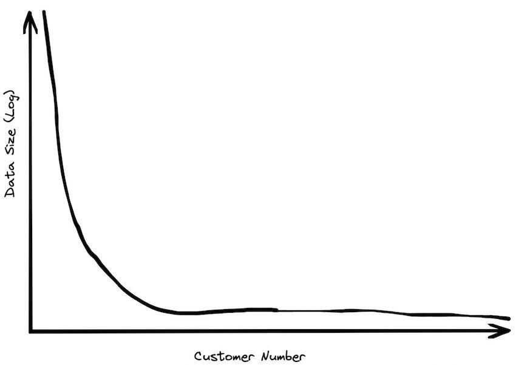
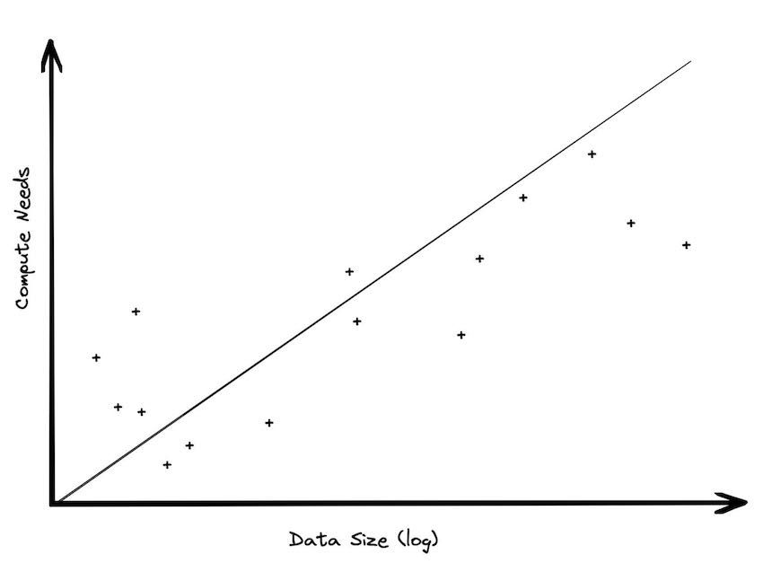
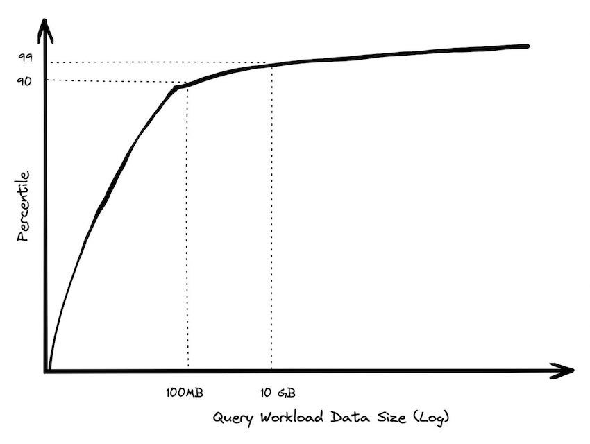
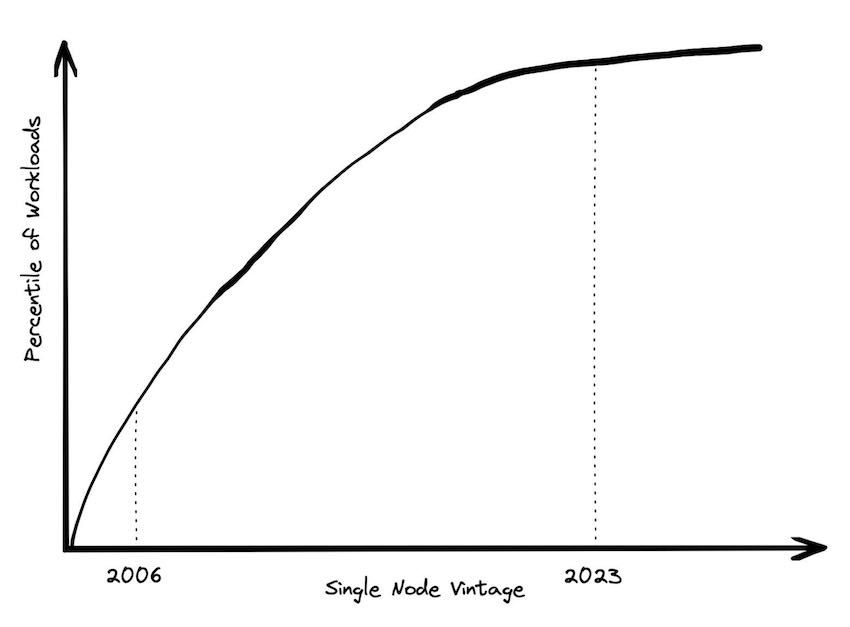

For more than a decade now, the fact that people have a hard time gaining actionable insights from their data has been blamed on its size.  

十多年来，人们很难从他们的数据中获得可操作的见解这一事实一直被归咎于数据的规模。  

“Your data is too big for your puny systems,” was the diagnosis, and the cure was to buy some new fancy technology that can handle massive scale.  

“你的数据对于你的微不足道的系统来说太大了，”这是诊断，而解决办法是购买一些能够处理大规模数据的新奇技术。  

Of course, after the Big Data task force purchased all new tooling and migrated from Legacy systems, people found that they still were having trouble making sense of their data.  

当然，在大数据任务组购买了所有新工具并从遗留系统迁移之后，人们发现他们仍然无法理解他们的数据。  

They also may have noticed, if they were really paying attention, that data size wasn’t really the problem at all.  

他们也可能已经注意到，如果他们真的注意的话，数据大小根本不是问题所在。

The world in 2023 looks different from when the Big Data alarm bells started going off. The data cataclysm that had been predicted hasn’t come to pass. Data sizes may have gotten marginally larger, but hardware has gotten bigger at an even faster rate.  

2023 年的世界看起来与大数据警钟开始响起时不同。所预测的数据灾难并没有发生。数据量可能略微变大了，但硬件却以更快的速度变大了。  

Vendors are still pushing their ability to scale, but practitioners are starting to wonder how any of that relates to their real world problems.  

供应商仍在推动他们的扩展能力，但从业者开始怀疑这与他们现实世界的问题有何关系。

## Who am I and why do I care?  

我是谁，我为什么要关心？

For more than 10 years, I was one of the acolytes beating the Big Data drum.  

10 多年来，我一直是推动大数据发展的追随者之一。  

I was a founding engineer on Google BigQuery, and as the only engineer on the team that actually liked public speaking, I got to travel to conferences around the world to help explain how we were going to help folks withstand the coming data explosion.  

我是 Google BigQuery 的创始工程师，作为团队中唯一真正喜欢公开演讲的工程师，我必须前往世界各地参加会议，帮助解释我们将如何帮助人们抵御即将到来的数据爆炸。  

I used to query a petabyte live on stage, demonstrating that no matter how big and bad your data was, we would be able to handle it, no problem.  

我曾经在台上直播查询一个PB，证明无论你的数据有多大，多坏，我们都能搞定，没问题。

_This photo was me at Big Data Spain in 2012, warning of the dangers of giant datasets and promising relief if they just use our technology.  

这张照片是我 2012 年在西班牙大数据会议上拍摄的，警告巨大数据集的危险，并承诺如果他们只使用我们的技术就会得到缓解。_

Over the next few years I spent a lot of time debugging problems that customers were having with BigQuery. I co-wrote two books and really dug into how the product was being used.  

在接下来的几年里，我花了很多时间调试客户在使用 BigQuery 时遇到的问题。我与人合着了两本书，并真正深入研究了产品的使用方式。  

In 2018, I switched to product management, and my job was split between talking to customers, many of whom were the largest enterprises in the world, and analyzing product metrics.  

2018 年，我转向产品管理，我的工作分为与客户交谈（其中许多是世界上最大的企业）和分析产品指标。

The most surprising thing that I learned was that most of the people using “Big Query” don’t really have Big Data. Even the ones who do tend to use workloads that only use a small fraction of their dataset sizes.  

我了解到的最令人惊讶的事情是，大多数使用“大查询”的人并不真正拥有大数据。即使是那些这样做的人也倾向于使用仅使用其数据集大小的一小部分的工作负载。  

When BigQuery came out, it was like science fiction for many people-- you literally couldn’t process data that fast in any other way. However, what was science fiction is now commonplace, and more traditional ways of processing your data have caught up.  

当 BigQuery 面世时，对许多人来说就像科幻小说一样——您实际上无法以任何其他方式快速处理数据。然而，科幻小说现在已经司空见惯，更传统的数据处理方式也迎头赶上。

**About this post  

关于这篇文章**

This post will make the case that the era of Big Data is over. It had a good run, but now we can stop worrying about data size and focus on how we’re going to use it to make better decisions. I’ll show a number of graphs; these are all hand-drawn based on memory.  

这篇文章将证明大数据时代已经结束。它运行良好，但现在我们可以不再担心数据大小，而是专注于我们将如何使用它来做出更好的决策。我会展示一些图表；这些都是凭记忆手绘的。  

If I did have access to the exact numbers, I wouldn’t be able to share them. But the important part is the shape, rather than the exact values.  

如果我确实可以访问确切的数字，我将无法分享它们。但重要的部分是形状，而不是确切的值。

The data behind the graphs come from having analyzed query logs, deal post-mortems, benchmark results (published and unpublished), customer support tickets, customer conversations, service logs, and published blog posts, plus a bit of intuition.  

图表背后的数据来自分析查询日志、交易事后分析、基准测试结果（已发布和未发布）、客户支持票、客户对话、服务日志和已发布的博客文章，以及一些直觉。

## The obligatory intro slide  

强制性介绍幻灯片

For the last 10 years, every pitch deck for every big data product starts with a slide that looks something like this:   

在过去的 10 年里，每一个大数据产品的每一个推销平台都是从一张看起来像这样的幻灯片开始的：

We used a version of this slide for years at Google. When I moved to SingleStore, they were using their own version that had the same chart. I’ve seen several other vendors with something similar. This is the “scare” slide. Big Data is coming! You need to buy what I’m selling!  

我们在 Google 多年来一直使用这张幻灯片的一个版本。当我搬到 SingleStore 时，他们使用的是具有相同图表的自己的版本。我见过其他几家供应商也有类似的东西。这是“恐慌”幻灯片。大数据来了！你需要买我卖的东西！

The message was that old ways of handling data were not going to work. The acceleration of data generation was going to leave the data systems of yesteryear stuck in the mud, and anyone who embraced new ideas would be able to leapfrog their competitors.  

消息是处理数据的旧方法行不通了。数据生成的加速将使过去的数据系统陷入泥潭，任何接受新想法的人都能够超越他们的竞争对手。

Of course, just because the amount of data being generated is increasing doesn’t mean that it becomes a problem for everyone; data is not distributed equally. Most applications do not need to process massive amounts of data.  

当然，仅仅因为生成的数据量在增加并不意味着它成为每个人的问题；数据分布不均。大多数应用程序不需要处理大量数据。  

This has led to a resurgence in data management systems with traditional architectures; SQLite, Postgres, MySQL are all growing strongly, while “NoSQL” and even “NewSQL” systems are stagnating.  

这导致了具有传统架构的数据管理系统的复兴； SQLite、Postgres、MySQL 都在强劲增长，而“NoSQL”甚至“NewSQL”系统则停滞不前。

MongoDB is the highest ranked NoSQL or otherwise scale-out database, and while it had a nice run-up over the years, it has been declining slightly recently, and hasn’t really made much headway against MySQL or Postgres, two resolutely monolithic databases.  

MongoDB 是排名最高的 NoSQL 或其他横向扩展数据库，虽然它多年来有不错的增长，但最近一直在小幅下降，并且与 MySQL 或 Postgres 这两个绝对单一的数据库相比并没有真正取得太大进展.  

If Big Data were really taking over, you’d expect to see something different after all these years.  

如果大数据真的接管了一切，你会期望在这些年后看到一些不同的东西。

Of course, the picture looks different in analytical systems, but in OLAP you see a massive shift from on-premise to cloud, and there aren’t really any scale-up cloud analytical systems to compare against.  

当然，在分析系统中情况看起来有所不同，但在 OLAP 中，您会看到从内部部署到云的巨大转变，并且实际上没有任何可扩展的云分析系统可以与之进行比较。

## Most people don’t have that much data  

大多数人没有那么多数据

The intended takeaway from the “Big Data is coming” chart was that pretty soon, everyone will be inundated by their data. Ten years in, that future just hasn’t materialized.  

“大数据即将到来”图表的预期要点是，很快，每个人都会被他们的数据淹没。十年过去了，那个未来还没有实现。  

We can validate this several ways: looking at data (quantitatively), asking people if it is consistent with their experience (qualitatively), and thinking it through from first principles (inductively).  

我们可以通过几种方式验证这一点：查看数据（定量），询问人们它是否与他们的经验一致（定性），并从第一原则（归纳）思考它。

When I worked at BigQuery, I spent a lot of time looking at customer sizing. The actual data here is very sensitive, so I can’t share any numbers directly. However, I can say that the vast majority of customers had less than a terabyte of data in total data storage.  

当我在 BigQuery 工作时，我花了很多时间研究客户规模。这里的实际数据非常敏感，所以我不能直接分享任何数字。但是，我可以说绝大多数客户的总数据存储量不到 1 TB。  

There were, of course, customers with huge amounts of data, but most organizations, even some fairly large enterprises, had moderate data sizes.  

当然，也有拥有大量数据的客户，但大多数组织，甚至一些相当大的企业，数据量都适中。

Customer data sizes followed a power-law distribution. The largest customer had double the storage of the next largest customer, the next largest customer had half of that, etc. So while there were customers with hundreds of petabytes of data, the sizes trailed off very quickly.  

客户数据大小服从幂律分布。最大客户的存储量是第二大客户的两倍，第二大客户的存储量是第二大客户的一半，依此类推。因此，虽然有客户拥有数百 PB 的数据，但大小很快就会下降。  

There were many thousands of customers who paid less than $10 a month for storage, which is half a terabyte. Among customers who were using the service heavily, the median data storage size was much less than 100 GB.  

有成千上万的客户每月支付不到 10 美元的存储费用，即 0.5TB。在大量使用该服务的客户中，数据存储大小的中位数远低于 100 GB。

We found further support for this when talking to industry analysts (Gartner, Forrester, etc). We would extol our ability to handle massive data sets, and they would shrug.  

在与行业分析师（Gartner、Forrester 等）交谈时，我们发现了对此的进一步支持。我们会称赞我们处理海量数据集的能力，而他们会耸耸肩。  

“This is nice,” they said, “but the vast majority of enterprises have data warehouses smaller than a terabyte.” The general feedback we got talking to folks in the industry was that 100 GB was the right order of magnitude for a data warehouse.  

“这很好，”他们说，“但绝大多数企业的数据仓库都小于 1 TB。”我们从业内人士那里得到的普遍反馈是，100 GB 是数据仓库的正确数量级。  

This is where we focused a lot of our efforts in benchmarking.  

这是我们在基准测试中集中精力的地方。

One of our investors decided to find out how big analytical data sizes really are and surveyed his portfolio companies, some which were post-exit (either had IPO’d or been acquired by larger organizations).  

我们的一位投资者决定找出分析数据的真实规模，并调查了他的投资组合公司，其中一些公司是退出后的（要么已经首次公开募股，要么被更大的组织收购）。  

These are tech companies, which are likely going to skew towards larger data sizes. He found that the largest B2B companies in his portfolio had around a terabyte of data, while the largest B2C companies had around 10 Terabytes of data. Most, however, had far less data.  

这些是科技公司，它们可能会倾向于更大的数据量。他发现他投资组合中最大的 B2B 公司拥有大约 1TB 的数据，而最大的 B2C 公司拥有大约 10TB 的数据。然而，大多数人的数据要少得多。

In order to understand why large data sizes are rare, it is helpful to think about where the data actually comes from. Imagine you’re a medium sized business, with a thousand customers. Let’s say each one of your customers places a new order every day with a hundred line items.  

为了理解为什么大数据很少见，思考数据的实际来源是有帮助的。假设您是一家中型企业，拥有 1000 名客户。假设您的每位客户每天都会下一个包含一百个订单项的新订单。  

This is relatively frequent, but it is still probably less than a megabyte of data generated per day. In three years you would still only have a gigabyte, and it would take millenia to generate a terabyte.  

这是相对频繁的，但它仍然可能少于每天生成的 1 兆字节数据。三年后你仍然只有 1 GB，而要产生 1 TB 则需要几千年。

Alternately, let’s say you have a million leads in your marketing database, and you’re running dozens of campaigns. Your leads table is probably still less than a gigabyte, and tracking each lead across each campaign still probably is only a few gigabytes.  

或者，假设您的营销数据库中有 100 万条线索，并且您正在开展数十个活动。您的线索表可能仍然不到 1 GB，并且跟踪每个活动中的每个线索可能仍然只有几 GB。  

It is hard to see how this adds to massive data sets under reasonable scaling assumptions.  

在合理的扩展假设下，很难看出这如何增加海量数据集。

To give a concrete example, I worked at SingleStore in 2020-2022, when it was a fast-growing Series E company with significant revenue and a unicorn valuation.  

举个具体的例子，我2020-2022年在SingleStore工作，当时是一家快速成长的E轮公司，收入可观，估值独角兽。  

If you added up the size of our finance data warehouse, our customer data, our marketing campaign tracking, and our service logs, it was probably only a few gigabytes. By any stretch of the imagination, this is not big data.  

如果将我们的财务数据仓库、客户数据、营销活动跟踪和服务日志的大小加起来，可能只有几 GB。无论怎么想，这都不是大数据。

## The storage bias in separation of storage and compute.  

存储和计算分离中的存储偏差。

Modern cloud data platforms all separate storage and compute, which means that customers are not tied to a single form factor. This, more than scale out, is likely the single most important change in data architectures in the last 20 years.  

现代云数据平台都将存储和计算分开，这意味着客户不受单一外形因素的束缚。这不仅仅是横向扩展，可能是过去 20 年数据架构中最重要的单一变化。  

Instead of “shared nothing” architectures which are hard to manage in real world conditions, shared disk architectures let you grow your storage and your compute independently.  

与在现实世界条件下难以管理的“无共享”架构不同，共享磁盘架构让您可以独立增加存储和计算。  

The rise of scalable and reasonably fast object storage like S3 and GCS meant that you could relax a lot of the constraints on how you built a database.  

可扩展且速度相当快的对象存储（如 S3 和 GCS）的兴起意味着您可以放宽对如何构建数据库的许多限制。

In practice, data sizes increase much faster than compute sizes. While popular descriptions of the benefits of storage and compute separation make it sound like you may choose to scale either one at any time, the two axes are not really equivalent.  

实际上，数据大小的增长速度远快于计算大小。虽然对存储和计算分离的好处的流行描述听起来好像您可以随时选择扩展其中一个，但这两个轴并不完全等同。  

Misunderstanding of this point leads to a lot of the discussion of Big Data, because techniques for dealing with large compute requirements are different from dealing with large data. It is helpful to explore why this may be the case.  

对这一点的误解导致了很多关于大数据的讨论，因为处理大计算需求的技术不同于处理大数据的技术。探索为什么会出现这种情况很有帮助。

All large data sets are generated over time. Time is almost always an axis in a data set. New orders come in every day. New taxi rides. New logging records. New games being played. If a business is static, neither growing or shrinking, data will increase linearly with time.  

所有的大数据集都是随着时间的推移而产生的。时间几乎总是数据集中的一个轴。每天都有新订单进来。新的出租车。新的日志记录。正在玩新游戏。如果业务是静态的，既不增长也不收缩，数据将随时间线性增长。  

What does this mean for analytic needs? Clearly data storage needs will increase linearly, unless you decide to prune the data (more on this later). But compute needs will likely not need to change very much over time; most analysis is done over the recent data.  

这对分析需求意味着什么？显然，数据存储需求将线性增加，除非您决定修剪数据（稍后会详细介绍）。但随着时间的推移，计算需求可能不需要改变太多；大多数分析都是针对最近的数据进行的。  

Scanning old data is pretty wasteful; it doesn’t change, so why would you spend money reading it over and over again?  

扫描旧数据非常浪费；它不会改变，那你为什么要花钱一遍又一遍地看呢？  

True, you might want to keep it around just in case you want to ask a new question of the data, but it is pretty trivial to build aggregations containing the important answers.  

诚然，您可能希望保留它以防万一您想对数据提出新问题，但构建包含重要答案的聚合非常简单。

Very often when a data warehousing customer moves from an environment where they didn’t have separation of storage and compute into one where they do have it, their storage usage grows tremendously, but their compute needs tend to not really change.  

很多时候，当数据仓库客户从他们没有存储和计算分离的环境转移到他们拥有分离的环境时，他们的存储使用量会大幅增长，但他们的计算需求往往不会真正改变。  

In BigQuery, we had a customer who was one of the largest retailers in the world. They had an on-premise data warehouse that was around 100 TB of data. When they moved to the cloud, they ended up with 30 PB of data, a 300x increase.  

在 BigQuery 中，我们有一个客户是世界上最大的零售商之一。他们有一个本地数据仓库，大约有 100 TB 的数据。当他们迁移到云端时，他们最终拥有 30 PB 的数据，增加了 300 倍。  

If their compute needs had also scaled up by a similar amount, they would have been spending billions of dollars on analytics. Instead, they spent a tiny fraction of that amount.  

如果他们的计算需求也增加了类似的数量，他们就会在分析上花费数十亿美元。相反，他们只花了这笔钱的一小部分。

This bias towards storage size over compute size has a real impact in system architecture. It means that if you use scalable object stores, you might be able to use far less compute than you had anticipated. You might not even need to use distributed processing at all.  

这种对存储大小而不是计算大小的偏见对系统架构产生了实际影响。这意味着如果您使用可扩展的对象存储，您可能能够使用比预期少得多的计算。您甚至可能根本不需要使用分布式处理。

## Workload sizes are smaller than overall data sizes  

工作负载大小小于整体数据大小

The amount of data processed for analytics workloads is almost certainly smaller than you think. Dashboards, for example, very often are built from aggregated data. People look at the last hour, or the last day, or the last week’s worth of data.  

为分析工作负载处理的数据量几乎肯定比您想象的要少。例如，仪表板通常是根据聚合数据构建的。人们查看过去一小时、最后一天或上周的数据。  

Smaller tables tend to be queried more frequently, giant tables more selectively.  

较小的表往往会被更频繁地查询，而大表则更有选择性。

A couple of years ago I did an analysis of BigQuery queries, looking at customers spending more than $1000 / year. 90% of queries processed less than 100 MB of data.  

几年前，我对 BigQuery 查询进行了分析，查看了每年花费超过 1000 美元的客户。 90% 的查询处理的数据少于 100 MB。  

I sliced this a number of different ways to make sure it wasn’t just a couple of customers who ran a ton of queries skewing the results. I also cut out metadata-only queries, which are a small subset of queries in BigQuery that don’t need to read any data at all.  

我以多种不同的方式对此进行了切片，以确保不仅仅是几个客户运行了大量查询来扭曲结果。我还删除了纯元数据查询，它们是 BigQuery 中根本不需要读取任何数据的查询的一小部分。  

You have to go pretty high on the percentile range until you get into the gigabytes, and there are very few queries that run in the terabyte range.  

在进入千兆字节之前，您必须在百分位数范围内走得相当高，并且在 TB 范围内运行的查询非常少。

> Customers with giant data sizes almost never queried huge amounts of data  
> 
> 数据量巨大的客户几乎从不查询海量数据

Customers with moderate data sizes often did fairly large queries, but customers with giant data sizes almost never queried huge amounts of data. When they did, it was generally because they were generating a report, and performance wasn’t really a priority.  

数据量适中的客户通常会进行相当大的查询，但数据量巨大的客户几乎从不查询大量数据。当他们这样做时，通常是因为他们正在生成报告，而性能并不是真正的优先事项。  

A large social media company would run reports over the weekend to prepare for executives on Monday morning; those queries were pretty huge, but they were only a tiny fraction of the hundreds of thousands of queries they ran the rest of the week.  

一家大型社交媒体公司会在周末发布报告，为周一早上的高管做准备；这些查询非常庞大，但它们只是他们在本周余下时间运行的数十万个查询中的一小部分。

Even when querying giant tables, you rarely end up needing to process very much data. Modern analytical databases can do column projection to read only a subset of fields, and partition pruning to read only a narrow date range.  

即使在查询巨型表时，您也很少需要处理大量数据。现代分析数据库可以进行列投影以仅读取字段的子集，并进行分区修剪以仅读取较窄的日期范围。  

They can often go even further with segment elimination to exploit locality in the data via clustering or automatic micro partitioning. Other tricks like computing over compressed data, projection, and predicate pushdown are ways that you can do less IO at query time.  

他们通常可以通过分段消除更进一步，通过聚类或自动微分区来利用数据中的局部性。压缩数据计算、投影和谓词下推等其他技巧是您可以在查询时减少 IO 的方法。  

And less IO turns into less computation that needs to be done, which turns into lower costs and latency.  

更少的 IO 转化为需要完成的更少计算，从而转化为更低的成本和延迟。

There are acute economic pressures incentivizing people to reduce the amount of data they process. Just because you can scale out and process something very fast doesn’t mean you can do so inexpensively.  

巨大的经济压力促使人们减少他们处理的数据量。仅仅因为您可以非常快速地横向扩展和处理某些东西并不意味着您可以以低廉的成本做到这一点。  

If you use a thousand nodes to get a result, that is probably going to cost you an arm and a leg. The Petabyte query I used to run on stage to show off BigQuery cost $5,000 at retail prices. Very few people would want to run something so expensive.  

如果您使用一千个节点来获得结果，那可能会让您付出沉重的代价。我曾经在舞台上运行以炫耀 BigQuery 的 PB 查询零售价为 5,000 美元。很少有人愿意运行如此昂贵的东西。

Note that the financial incentive to processing less data holds true even if you’re not using a pay-per-byte-scanned pricing model. If you have a Snowflake instance, if you can make your queries smaller, you can use a smaller instance, and pay less.  

请注意，即使您没有使用按扫描字节数付费的定价模型，处理较少数据的经济动机也适用。如果你有一个 Snowflake 实例，如果你可以让你的查询更小，你可以使用一个更小的实例，并且支付更少。  

Your queries will be faster, you can run more concurrently, and you generally will pay less over time.  

您的查询会更快，您可以并发运行更多，而且随着时间的推移，您通常会支付更少的费用。

## Most data is rarely queried  

大多数数据很少被查询

A huge percentage of the data that gets processed is less than 24 hours old. By the time data gets to be a week old, it is probably 20 times less likely to be queried than from the most recent day. After a month, data mostly just sits there.  

得到处理的数据中有很大一部分不到 24 小时。到数据保存一周时，查询的可能性可能比最近一天低 20 倍。一个月后，数据大多就在那里。  

Historical data tends to be queries infrequently, perhaps when someone is running a rare report.  

历史数据往往很少被查询，也许当有人正在运行一个罕见的报告时。

Data storage age patterns are a lot flatter. While a lot of data gets discarded pretty quickly, a lot of data just gets appended to the end of tables. The most recent year might only have 30% of the data but 99% of data accesses.  

数据存储时代模式要扁平得多。虽然很多数据很快被丢弃，但很多数据只是附加到表的末尾。最近一年可能只有 30% 的数据，但 99% 的数据访问。  

The most recent month might have 5% of data but 80% of data accesses.  

最近一个月可能有 5% 的数据，但有 80% 的数据访问。

The quiescing of data means that data working set sizes are more manageable than you would expect. If you have a petabyte table that has 10 years worth of data, you might rarely access any of the data older than the current day, which might have less than 50 GB compressed.  

数据的静止意味着数据工作集大小比您预期的更易于管理。如果您有一个包含 10 年数据的 PB 表，您可能很少访问任何早于当天的数据，这些数据可能压缩了不到 50 GB。

## The Big Data Frontier keeps receding  

大数据前沿不断后退

One definition of “Big Data” is “whatever doesn’t fit on a single machine.. By that definition, the number of workloads that qualify has been decreasing every year.  

“大数据”的一个定义是“任何不适合单台机器的东西……根据这个定义，符合条件的工作负载数量每年都在减少。

In 2004, when the Google MapReduce paper was written, it would have been very common for a data workload to not fit on a single commodity machine. Scaling up was expensive. In 2006, AWS launched EC2, and the only size of instance you could get was a single core and 2 GB of RAM.  

在 2004 年撰写 Google MapReduce 论文时，数据工作负载不适合单个商品机器的情况非常普遍。扩大规模是昂贵的。 2006 年，AWS 推出了 EC2，您可以获得的实例大小只有单核和 2 GB 内存。  

There were a lot of workloads that wouldn’t fit on that machine.  

有很多工作负载不适合那台机器。

Today, however, a standard instance on AWS uses a physical server with 64 cores and 256 GB of RAM. That’s two orders of magnitude more RAM. If you’re willing to spend a little bit more for a memory-optimized instance, you can get another two orders of magnitude of RAM.  

然而，今天，AWS 上的标准实例使用具有 64 个内核和 256 GB RAM 的物理服务器。这是两个数量级的 RAM。如果您愿意为内存优化实例多花一点钱，您可以获得另外两个数量级的 RAM。  

How many workloads need more than 24TB of RAM or 445 CPU cores?  

有多少工作负载需要超过 24TB 的 RAM 或 445 个 CPU 内核？

It used to be that larger machines were a lot more expensive. However, in the cloud, a VM that uses a whole server only costs 8x more than one that uses an 8th of a server. Cost scales up linearly with compute power, up through some very large sizes.  

过去，更大的机器要贵得多。然而，在云中，使用整个服务器的 VM 的成本仅比使用 8 分之一服务器的 VM 高 8 倍。成本随着计算能力线性增加，直到达到一些非常大的规模。  

In fact, if you look at the benchmarks published in the original dremel paper using 3,000 parallel nodes, you can get similar performance on a single node today (more on this to come).  

事实上，如果您查看使用 3,000 个并行节点在原始 dremel 论文中发布的基准测试，您现在可以在单个节点上获得类似的性能（稍后会详细介绍）。

## Data is a Liability  

数据是一种责任

An alternate definition of Big Data is “when the cost of keeping data around is less than the cost of figuring out what to throw away.” I like this definition because it encapsulates why people end up with Big Data.  

大数据的另一种定义是“当保存数据的成本低于弄清楚要丢弃什么的成本时”。我喜欢这个定义，因为它概括了为什么人们最终会得到大数据。  

It isn’t because they need it; they just haven’t bothered to delete it. If you think about many data lakes that organizations collect, they fit this bill entirely: giant, messy swamps where no one really knows what they hold or whether it is safe to clean them up.  

这不是因为他们需要它；而是因为他们需要它。他们只是懒得删除它。如果你想想组织收集的许多数据湖，它们完全符合这个要求：巨大、凌乱的沼泽，没有人真正知道它们拥有什么，也不知道清理它们是否安全。

The cost of keeping data around is higher than just the cost to store the physical bytes. Under regulations like GDPR and CCPA, you are required to track all usage of certain types of data. Some data needs to be deleted within a certain period of time.  

保存数据的成本高于存储物理字节的成本。根据 GDPR 和 CCPA 等法规，您需要跟踪某些类型数据的所有使用情况。有些数据需要在一定时间内删除。  

If you have phone numbers in a parquet file that sit around for too long in your data lake somewhere, you may be violating statutory requirements.  

如果您的 parquet 文件中的电话号码在您的数据湖中的某处停留时间过长，则您可能违反了法定要求。

Beyond regulation, data can be an aid to lawsuits against you. Just as many organizations enforce limited email retention policies in order to reduce potential liability, the data in your data warehouse can likewise be used against you.  

除了监管之外，数据还可以帮助您提起诉讼。正如许多组织实施有限的电子邮件保留政策以减少潜在责任一样，您数据仓库中的数据同样可能被用来对付您。  

If you’ve got logs from five years ago that would show a security bug in your code or missed SLA, keeping old data around can prolong your legal exposure.  

如果您有五年前的日志，这些日志会显示您的代码中存在安全漏洞或错过了 SLA，那么保留旧数据可能会延长您的法律风险。  

There is a possibly apocryphal story I’ve heard about a company keeping its data analytics capabilities secret in order to prevent them from being used during a legal discovery process.  

我听说过一个可能是杜撰的故事，说一家公司将其数据分析能力保密，以防止它们在法律发现过程中被使用。

Code often suffers from what people call “bit rot” when it isn’t actively maintained. Data can suffer from the same type of problem; that is, people forget the precise meaning of specialized fields, or data problems from the past may have faded from memory.  

当代码没有得到积极维护时，它经常会出现人们所说的“位腐烂”。数据可能会遇到相同类型的问题；也就是说，人们忘记了专业领域的确切含义，或者过去的数据问题可能已经从记忆中消失了。  

For example, maybe there was a short-lived data bug that set every customer id to null. Or there was a huge fraudulent transaction that made it look like Q3 2017 was a lot better than it actually was.  

例如，可能存在将每个客户 ID 设置为空的短暂数据错误。或者有一个巨大的欺诈交易让 2017 年第三季度看起来比实际情况要好得多。  

Often business logic to pull out data from a historical time period can get more and more complicated.  

从历史时间段提取数据的业务逻辑通常会变得越来越复杂。  

For example, there might be a rule like, “ if the date is older than 2019 use the revenue field, between 2019 and 2021 use the revenue\_usd field, and after 2022 use the revenue\_usd\_audited field.  

例如，可能有这样的规则，“如果日期早于 2019 年，则使用收入字段，2019 年至 2021 年之间使用 revenue\_usd 字段，2022 年之后使用 revenue\_usd\_audited 字段。  

” The longer you keep data around, the harder it is to keep track of these special cases. And not all of them can be easily worked around, especially if there is missing data.  

” 保存数据的时间越长，跟踪这些特殊情况就越困难。并非所有这些都可以轻松解决，尤其是在缺少数据的情况下。

If you are keeping around old data, it is good to understand why you are keeping it. Are you asking the same questions over and over again? If that is the case, wouldn’t it be far less expensive in terms of storage and query costs to just store aggregates?  

如果您要保留旧数据，最好了解为什么要保留它。你是否一遍又一遍地问同样的问题？如果是这样的话，就存储和查询成本而言，仅存储聚合是否会便宜得多？  

Are you keeping it for a rainy day? Are you thinking that there are new questions you might want to ask? If so, how important is it? How likely is it that you’ll really need it? Are you really just a data hoarder?  

你把它留着以备不时之需吗？您是否认为您可能想提出新的问题？如果是这样，它有多重要？您真正需要它的可能性有多大？你真的只是一个数据囤积者吗？  

These are all important questions to ask, especially as you try to figure out the true cost of keeping the data.  

这些都是要问的重要问题，尤其是当您试图计算出保留数据的真实成本时。

## Are you in the BIg Data One Percent?  

你是大数据的百分之一吗？

Big Data is real, but most people may not need to worry about it. Some questions that you can ask to figure out if you’re a “Big Data One-Percenter”:  

大数据是真实存在的，但大多数人可能不需要担心。您可以提出一些问题来确定您是否是“大数据 One-Percenter”：

-   Are you really generating a huge amount of data?  
    
    您真的会生成大量数据吗？
-   If so, do you really need to use a huge amount of data at once?  
    
    如果是这样，您真的需要一次使用大量数据吗？
-   If so, is the data really too big to fit on one machine?  
    
    如果是这样，数据真的太大而无法放在一台机器上吗？
-   If so, are you sure you’re not just a data hoarder?  
    
    如果是这样，你确定你不仅仅是一个数据囤积者吗？
-   If so, are you sure you wouldn’t be better off summarizing?  
    
    如果是这样，您确定总结一下会更好吗？

If you answer no to any of these questions, you might be a good candidate for a new generation of data tools that help you handle data at the size you actually have, not the size that people try to scare you into thinking that you might have someday.  

如果您对这些问题中的任何一个回答“否”，那么您可能是新一代数据工具的理想人选，这些工具可以帮助您以实际拥有的规模处理数据，而不是人们试图恐吓您以为您可能拥有的规模有一天。
