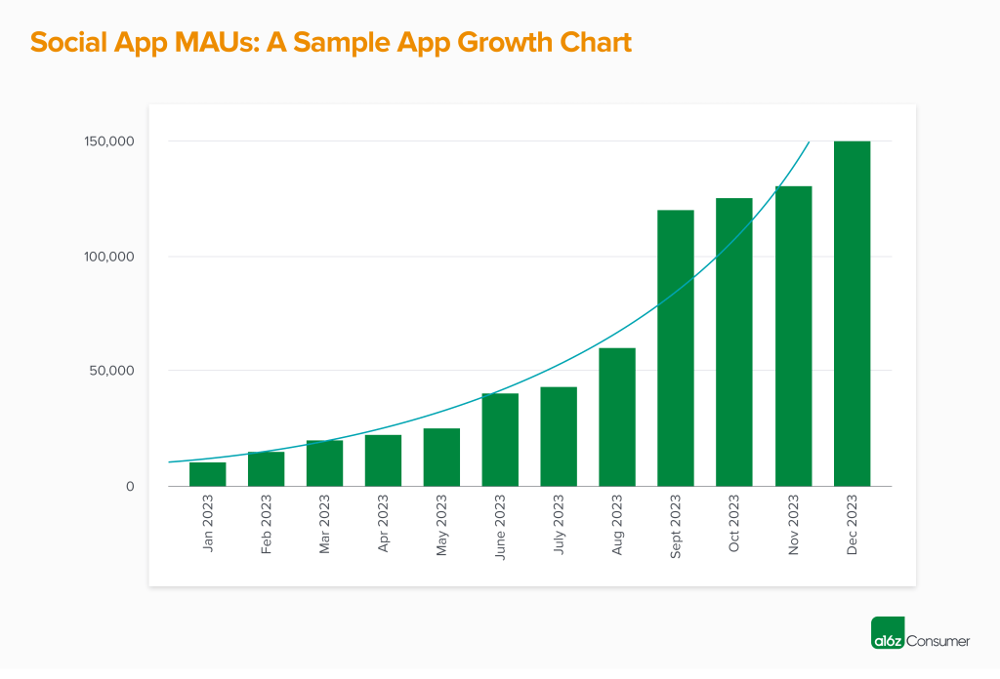
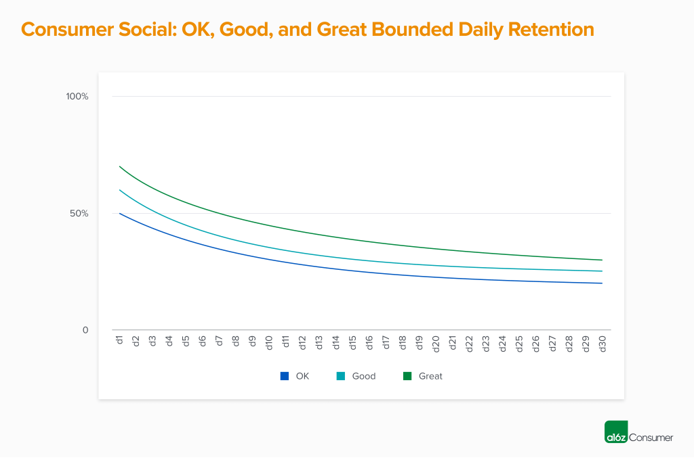
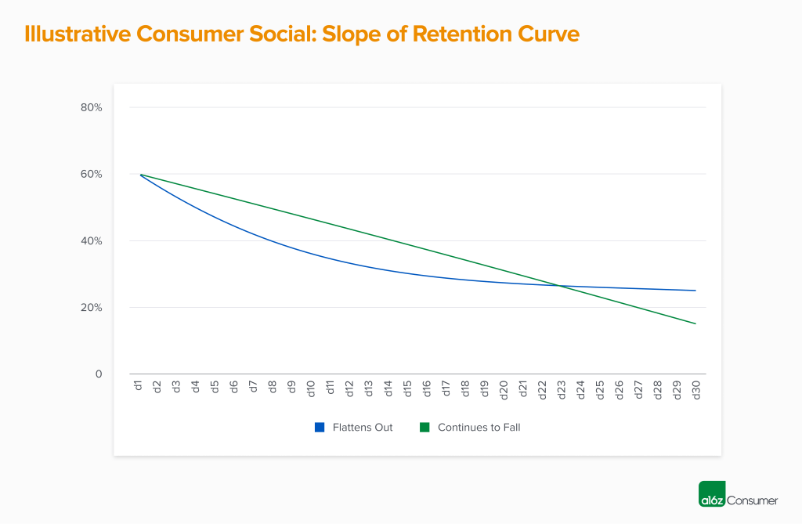
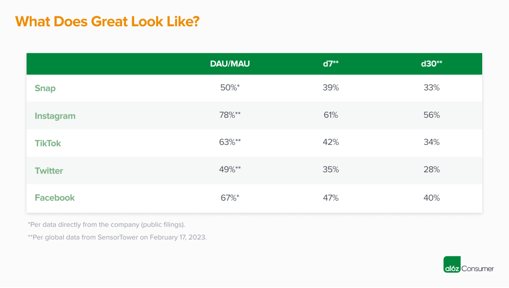

When a new social app starts to “work,” it feels like magic, but often looks like a black box.  

当一个新的社交应用程序开始“工作”时，感觉就像变魔术一样，但通常看起来像一个黑盒子。

What causes a product to take off, and then continue to pick up steam—to the point where millions of people are using it daily for years to come?   

是什么导致产品起飞，然后继续升温——以至于数以百万计的人在未来几年每天都在使用它？

This is especially tricky because most social apps don’t look like much in the early days. Facebook started as a way for Harvard students to rate their classmates as “hot or not,” and Snapchat was seen as just a sexting app in its early days.  

这尤其棘手，因为大多数社交应用在早期看起来都不太像。 Facebook 最初是哈佛学生用来评价同学“性感与否”的一种方式，而 Snapchat 在早期仅被视为一款色情短信应用。  

Success in the consumer social space can feel random.   

消费者社交空间的成功可能是随机的。

After years of leading growth at Snap and two years making investments at a16z, I’ve formed a different view about why certain products take off. Yes, developing a truly great social product can feel like trying to catch lightning in a bottle.  

在 Snap 多年领先增长并在 a16z 进行两年投资之后，我对某些产品为何起飞的原因形成了不同的看法。是的，开发一个真正伟大的社交产品就像试图在瓶子里捕捉闪电一样。  

But once a product is “out in the wild,” assessing its performance—and potential—is a bit more scientific than people think. A few early data points tend to predict whether a social app will plateau at 10,000 active users or go mainstream with millions of users.  

但是，一旦产品“投入使用”，评估其性能和潜力就比人们想象的要科学一些。一些早期数据点倾向于预测一款社交应用程序是会稳定在 10,000 名活跃用户还是成为拥有数百万用户的主流。

Here are the metrics that I look for in early stage consumer social products—as well as how to measure them.  

以下是我在早期阶段的消费者社交产品中寻找的指标，以及如何衡量它们。

## Growth

When benchmarking growth, you first need to define your core metric. For most consumer social apps, this is daily active users (DAUs), as you want to have people using your product every day.  

在对增长进行基准测试时，您首先需要定义核心指标。对于大多数消费者社交应用，这是每日活跃用户 (DAU)，因为您希望人们每天都使用您的产品。For apps with a less frequent use case, weekly active users (WAUs) is also acceptable as a starting metric. You’ll eventually need to upgrade to DAUs if you want a shot at securing a coveted slot on the home screen, i.e.  

对于使用频率较低的应用，每周活跃用户 (WAU) 也可以作为起始指标。如果你想在主屏幕上获得令人垂涎的位置，你最终需要升级到 DAU，即  

, “the most important real estate on your phone,” as Mark Zuckerberg has put it.  

，正如马克扎克伯格所说，“你手机上最重要的不动产”。

You’ll want to see this core user metric growing—maybe not with perfect consistency, but when you look back at your graph the trend should be “up and to the right.” Many social apps may see step-change spikes in growth (e.g., the app goes viral and gets 50k new downloads in a day!  

你会希望看到这个核心用户指标在增长——也许不是完全一致，但当你回顾你的图表时，趋势应该是“向上和向右”。许多社交应用程序可能会出现阶跃式增长峰值（例如，该应用程序病毒式传播并在一天内获得 5 万次新下载！  

), but to truly unlock acquisition, you’ll want to see growth that lands around or above some baseline level almost every month. This sometimes “spiky” growth is also why it’s important to have excellent retention (  

)，但要真正解锁获取，您将希望看到几乎每个月的增长都在某个基线水平附近或之上。这种有时“突飞猛进”的增长也是为什么拥有出色的留存率很重要的原因（_more on this below_), so you can capitalize on viral moments and retain those users.  

更多内容见下文），这样您就可以利用病毒式传播的时刻并留住这些用户。

Based on a16z’s private benchmarks of hundreds of early stage social apps, here’s what OK, good, and great look like for monthly user growth in seed-stage consumer social companies:   

基于 a16z 对数百个早期社交应用程序的私人基准测试，以下是种子期消费者社交公司每月用户增长的良好、良好和出色表现：

-   OK – 20%  
    
    好的 – 20%
-   Good – 35%  
    
    好 – 35%
-   Great – 50%  
    
    很好——50%

Ideally, all or almost all of this growth comes organically. There’s a practical reason for this. Social apps often can’t monetize until later, so they don’t have as much cash to burn on paid marketing.  

理想情况下，所有或几乎所有这些增长都是有机的。这是有实际原因的。社交应用通常要到后来才能获利，因此它们没有那么多现金可用于付费营销。  

More intuitively, social apps should be inherently viral, with users wanting to invite their friends to make the experience even better. If this isn’t happening, there may be more to unlock in the product.   

更直观地说，社交应用程序应该具有内在的病毒性，用户希望邀请他们的朋友来改善体验。如果这没有发生，则产品中可能还有更多内容需要解锁。

Many social apps experiment with _some_ paid marketing in the early days, either to acquire an initial user base or to test the app with influencers or ambassadors. However, if more than 10-20% of your users are coming from paid sources at the early stages, you’ll likely want to rethink your acquisition strategy. **No amount of marketing dollars can fix a product**, so make sure that your growth is coming from the product itself.   

许多社交应用程序在早期尝试进行一些付费营销，以获取初始用户群或与影响者或大使一起测试应用程序。但是，如果超过 10-20% 的用户在早期阶段来自付费来源，您可能需要重新考虑您的获取策略。再多的营销资金也无法修复产品，因此请确保您的增长来自产品本身。

## Engagement  

订婚

Growing your user base is great, but you also need to look at _how_ these users are engaging with your product. There are a few ways we analyze how engaged a social app’s user base is.   

扩大用户群固然很好，但您还需要了解这些用户如何使用您的产品。我们可以通过几种方法来分析社交应用程序用户群的参与度。

First, we look at engagement ratios, the most popular of which is DAU / MAU. Of your monthly active users, how many are also in the app every day? The higher this number is, the better. Here’s how we benchmark DAU / MAU:   

首先，我们看一下参与率，其中最受欢迎的是 DAU / MAU。在您的每月活跃用户中，有多少人每天也在使用该应用？这个数字越高越好。以下是我们如何对 DAU / MAU 进行基准测试：

-   OK – 25%   
    
    好的 – 25%
-   Good – 40%  
    
    好 – 40%
-   Great – 50%+  
    
    很好——50%+

Other ratios here are daily to weekly active users (DAU / WAU) and weekly to monthly active users (WAU / MAU), but we see DAU / MAU as the most important.   

这里的其他比率是每日活跃用户与每周活跃用户 (DAU / WAU) 以及每周活跃用户与每月活跃用户 (WAU / MAU)，但我们认为 DAU / MAU 是最重要的。

However, while these ratios are helpful, they don’t capture an important nuance: the behavior of your power users. **Enter… the L-ness curve!**  

然而，尽管这些比率很有用，但它们并没有捕捉到一个重要的细微差别：高级用户的行为。输入……L-ness 曲线！ This metric looks at the distribution of users by number of days active over a certain time period, and can be measured on either a weekly or monthly basis.  

该指标根据特定时间段内的活跃天数查看用户分布，可以每周或每月进行衡量。  

 For example, on a weekly basis, how many of your WAUs are active one day per week, two days per week, three days per week, and so on.   

例如，每周有多少 WAU 在每周一天、每周两天、每周三天等处于活动状态。

Best-in-class social apps have an L-ness curve that “smiles,” or even better, has a “crooked smile” that skews right. Similar to the DAU / MAU ratio, this means that users are making your product a regular part of their life.   

一流的社交应用程序具有“微笑”的 L-ness 曲线，或者更好的是，具有向右倾斜的“歪嘴笑”。类似于 DAU / MAU 比率，这意味着用户正在使您的产品成为他们生活的一部分。

One way to interpret your L-ness curve is to look at how many users are at or above a certain level of engagement. For a weekly L-ness curve, we often look at L5+, or how many users are in the app five, six, or seven days a week, as this indicates a near-daily use behavior.  

解释 L-ness 曲线的一种方法是查看有多少用户达到或超过一定的参与度。对于每周的 L-ness 曲线，我们通常会查看 L5+，或者每周有 5 天、6 天或 7 天使用应用程序的用户数量，因为这表明几乎每天都有使用行为。  

Here’s how we benchmark L5+ performance:   

以下是我们如何对 L5+ 性能进行基准测试：

-   OK – 30%  
    
    好的 – 30%
-   Good – 40%  
    
    好 – 40%
-   Great – 50%+  
    
    很好——50%+

## Retention  

保留

For social apps, the rubber hits the road at retention. It’s the lifeblood of an app, and the hardest metric to “game”.  

对于社交应用程序，橡胶在保留时上路。这是应用程序的生命线，也是“游戏”最难衡量的指标。  

Having tried to increase the retention rate during my time at Snap, I can assure you that improving the day 30 (d30) retention even 1% at scale was an incredible feat.  

我在 Snap 期间曾尝试提高留存率，我可以向你保证，将第 30 天 (d30) 留存率大规模提高 1% 都是一项了不起的壮举。

One primary metric matters with retention: – n-day retention, which is also known as bounded retention. This strict definition looks at what percentage of an original cohort enters the app on each specific day. For example, d7 retention for users in cohort A is calculated as:   

一个与留存率相关的主要指标是：- n 天留存率，也称为有界留存率。这个严格的定义着眼于每个特定日期原始群组中有多少百分比进入该应用程序。例如，同类群组 A 中用户的 d7 留存率计算如下：

(Users in cohort A who entered the app specifically on d7) / (Users in cohort A)   

（专门在 d7 进入该应用的同类群组 A 中的用户）/（同类群组 A 中的用户）

The alternative to n-day retention is unbounded retention. This looks at how many users entered an app up to and including a specific day. Unbounded d7 retention would be calculated as:   

n 天保留的替代方法是无限保留。这会查看在特定日期（包括特定日期）之前有多少用户进入了应用程序。无限制的 d7 保留计算如下：

(Users in cohort A who entered the app sometime between d1 – 7) / (Users in cohort A)   

（在 d1 – 7 之间的某个时间进入应用程序的群组 A 中的用户）/（群组 A 中的用户）

We find unbounded retention to be less valuable in short-term measurements, as it’s fairly idiosyncratic between companies. For example, 50% unbounded d7 retention could mean that 50% of users are coming back on d1, and no one is coming back d2 – d7.  

我们发现无限保留在短期衡量中价值较低，因为它在公司之间相当特殊。例如，50% 的无限 d7 留存率可能意味着 50% 的用户在 d1 回来，而没有人在 d2 – d7 回来。  

Or, it could mean that 7% of users are coming back each day.  Both of these are clearly very different things in terms of user behavior.   

或者，这可能意味着 7% 的用户每天都会回来。就用户行为而言，这两者显然是截然不同的事情。

For n-day retention, we focus on three primary points in time: d1, d7, and d30. These metrics tend to be closely linked.  

对于 n 天保留，我们关注三个主要时间点：d1、d7 和 d30。这些指标往往密切相关。  

For example, the more users you can get to an “aha” moment in onboarding (d0), the more will come back on d1—and the more likely they will be to still be engaged on d7 and d30. Here’s how we benchmark n-day retention:   

例如，您在入职 (d0) 中获得“顿悟”时刻的用户越多，回到 d1 的用户就越多，他们在 d7 和 d30 上继续参与的可能性就越大。以下是我们如何衡量 n 天留存率：

-   OK – d1 50%, d7 35%, d30 20%  
    
    好的 – d1 50%, d7 35%, d30 20%
-   Good – d1 60%, d7 40%, d30 25%  
    
    良好 – d1 60%、d7 40%、d30 25%
-   Great – d1 70%, d7 50%, d30 30%  
    
    很好——d1 70%，d7 50%，d30 30%

We also look at how quickly your retention curve flattens out. In the best possible case, you retain all your d1 users through d30, but we haven’t yet seen this in real data, as it’s almost impossible to accomplish.  

我们还会查看您的保留曲线变平的速度。在最好的情况下，你可以保留所有 d1 到 d30 的用户，但我们还没有在真实数据中看到这一点，因为这几乎是不可能实现的。  

In most cases, we see the “slope of the line” start to flatten between d7 – d14, and hit a plateau by d20.   

在大多数情况下，我们看到“线的斜率”在 d7 – d14 之间开始变平，并在 d20 达到平台。

If there is a significant degradation of retention between, for example, d7 and d30, and your cohorts haven’t yet flattened out by d30, this can be an area of concern as it implies that your longer-term retention may not hold up.  

例如，如果在 d7 和 d30 之间存在显着的留存率下降，并且您的群组在 d30 之前还没有趋于平稳，这可能是一个值得关注的领域，因为这意味着您的长期留存率可能无法维持。  

We see this most often for products that “juice” early retention via heavy early notification loads, which may work for the first few weeks but tend to become less effective over time.   

我们最常看到的是通过大量早期通知负载“榨取”早期保留的产品，这些产品可能在最初几周有效，但随着时间的推移往往会变得不那么有效。

For some consumer social apps, we also look at weekly retention. We do believe that the biggest social companies eventually become daily use case products, so index much more heavily on daily retention numbers.  

对于一些消费者社交应用程序，我们还会查看每周留存率。我们确实相信，最大的社交公司最终会成为日常用例产品，因此对日常保留数字的索引要多得多。  

However, weekly retention can sometimes be relevant for companies that have built a tool that they’re transitioning into a network. To use Chris Dixon’s  

但是，每周保留有时与已经构建了正在过渡到网络的工具的公司相关。使用 Chris Dixon 的[famous framework](https://cdixon.org/2015/01/31/come-for-the-tool-stay-for-the-network): Come for the tool, stay for the network.   

famous framework：为工具而来，为网络而留。

Similar to daily retention, weekly retention is measured on a bounded, n-week basis. For example, w4 retention would be calculated as:   

与每日留存率类似，每周留存率以有限的 n 周为基础进行衡量。例如，w4 留存率计算如下：

(Users in cohort A who entered the app sometime during week 4) / (Users in cohort A)  

（在第 4 周的某个时间进入应用程序的同类群组 A 中的用户）/（同类群组 A 中的用户）

Here’s how we benchmark weekly retention:   

以下是我们如何衡量每周留存率：

-   OK – w1 40%, w4 20%  
    
    好的——w1 40%，w4 20%
-   Good – w1 55%, w4 30%  
    
    好——w1 55%，w4 30%
-   Great – w1 75%, w4 50%   
    
    太棒了——w1 75%，w4 50%

## Other

Beyond the metrics above, there are a few other things to keep in mind when looking at your consumer social app metrics:   

除了上述指标之外，在查看您的消费者社交应用指标时，还需要牢记一些其他事项：

-   The higher your n count is, the more valuable your metrics are. While [we love](https://twitter.com/TurnerNovak/status/1397183441066680327?s=20) joining apps in TestFlight, we’ve found that metrics from very early adopters sometimes don’t hold up when an app is released “into the wild” for public use.   
    
    您的 n 数越高，您的指标越有价值。虽然我们喜欢在 TestFlight 中加入应用程序，但我们发现当应用程序“公开”发布供公众使用时，来自早期采用者的指标有时并不成立。

Why? Early users tend to be the highest engagement and the highest retention. This is either because they know the founding team (and want to support you!) or because they’re the best possible fit for your product (which is why they found you so early).  

为什么？早期用户往往参与度最高，留存率最高。这要么是因为他们了解创始团队（并想支持你！），要么是因为他们最适合你的产品（这就是为什么他们这么早找到你的原因）。  

We tend to find that a few thousand active users is where metrics start to be predictive of how an app will perform at scale.   

我们往往会发现，从几千名活跃用户开始，指标就可以预测应用程序的大规模运行情况。

-   Similarly, the longer your time frame is, the more valuable your metrics are. When an app is first released, there’s often an early bump in users.  
    
    同样，你的时间框架越长，你的指标就越有价值。首次发布应用程序时，通常会在早期出现用户激增。This is particularly true if you’ve built a waitlist on platforms like TikTok and see a flood of registrations once the app opens up.  
    
    如果您在 TikTok 等平台上建立了候补名单，并且在应用程序打开后看到大量注册，情况尤其如此。  
    
    This excitement tends to translate to strong early engagement and retention metrics, especially if you’ve done a good job building the hype around your company.  
    
    这种兴奋往往会转化为强大的早期参与和保留指标，特别是如果你在公司周围做得很好的话。 Users will be very active for the first few days, or even the first few weeks.   
    
    最初几天，甚至最初几周，用户会非常活跃。

However, social apps often take a few iterations to work, so it’s not surprising to see acquisition and engagement drop off sharply after this initial spike. This is another case where d1 to d7, or d7 to d30, retention degradation can be fairly stark.  

然而，社交应用程序通常需要几次迭代才能发挥作用，因此在最初的峰值之后看到获取和参与度急剧下降也就不足为奇了。这是另一种情况，其中 d1 到 d7，或 d7 到 d30，保留退化可能相当明显。  

When possible, we like to see several cohorts of users hit at least that d30 retention mark, as this is a much more accurate indicator than the early numbers.   

如果可能，我们希望看到多个用户群组至少达到 d30 留存率标记，因为这是比早期数字更准确的指标。

-   Point-in-time numbers are great, but cohorts are even better! When evaluating social apps, we ask for almost all metrics over time, so we can see what the trend looks like. For example, instead of seeing your n-day retention data for the most recent cohort, or blended across all users, we’ll want to analyze this data on a monthly basis.   
    
    时间点数字很棒，但队列更好！在评估社交应用程序时，我们会询问几乎所有随时间变化的指标，以便我们了解趋势。例如，我们不想查看最近同类群组的 n 天保留数据，也不想查看所有用户的混合数据，而是希望按月分析此数据。

What we’re looking for is metrics that are stable, or even improve cohort by cohort. A good social app has [strong network effects](https://a16z.com/2018/12/13/network-effects-dynamics-in-practice/), which means that the product should be getting more valuable as more users join! If you’re not seeing this, it may mean that the product is struggling to scale beyond early adopters.  

我们正在寻找的是稳定的指标，甚至可以逐个改善队列。一个好的社交应用具有强大的网络效应，这意味着随着更多用户的加入，产品应该会变得更有价值！如果您没有看到这一点，则可能意味着该产品正在努力超越早期采用者。

Thanks for reading! If you’re building a social app with metrics that track to our “great” benchmarks, as set by the most successful social app companies of the past 20 years and seen below, please reach out to [bryan@a16z.com](mailto:bryan@a16z.com). I’d love to hear from you.   

谢谢阅读！如果您正在构建一个社交应用程序，其指标符合我们过去 20 年最成功的社交应用程序公司设定的“伟大”基准，请联系 bryan@a16z.com。我很想听听你的意见。

And if your metrics don’t fall into the “great” category yet, don’t be discouraged! We’ve seen (and invested in) many companies where the v0 (or even v5!) was not **quite**  

如果您的指标还没有落入“优秀”类别，请不要气馁！我们已经看到（并投资于）许多公司，其中 v0（甚至 v5！）并不完全 right…but the team kept iterating and eventually landed on a magical product.  

是的……但是团队不断迭代并最终找到了一个神奇的产品。  

As a reminder, Facebook started as a “hot or not” style site called FaceMash, Twitter was originally a podcasting platform called Odeo, and Instagram was a hybrid check-in and photo-sharing app called Brbn. And before TikTok hit it big, there was Musical.ly!  

提醒一下，Facebook 最初是一个名为 FaceMash 的“热门与否”风格的网站，Twitter 最初是一个名为 Odeo 的播客平台，而 Instagram 是一个名为 Brbn 的混合签到和照片共享应用程序。在 TikTok 大放异彩之前，就有了 Musical.ly！

\*\*\*

_The views expressed here are those of the individual AH Capital Management, L.L.C. (“a16z”) personnel quoted and are not the views of a16z or its affiliates.  

此处表达的观点是 AH Capital Management, L.L.C. 个人的观点。 (“a16z”) 人员引用但不代表 a16z 或其附属公司的观点。  

Certain information contained in here has been obtained from third-party sources, including from portfolio companies of funds managed by a16z.  

此处包含的某些信息是从第三方来源获得的，包括来自 a16z 管理的基金的投资组合公司。  

While taken from sources believed to be reliable, a16z has not independently verified such information and makes no representations about the current or enduring accuracy of the information or its appropriateness for a given situation.  

虽然从被认为可靠的来源获取信息，a16z 并未独立核实此类信息，也不对信息当前或持久的准确性或其对特定情况的适用性作出任何陈述。  

In addition, this content may include third-party advertisements; a16z has not reviewed such advertisements and does not endorse any advertising content contained therein.  

此外，此内容可能包含第三方广告； a16z 没有审查过此类广告，也不认可其中包含的任何广告内容。_

_This content is provided for informational purposes only, and should not be relied upon as legal, business, investment, or tax advice. You should consult your own advisers as to those matters.  

此内容仅供参考，不应作为法律、商业、投资或税务建议。您应该就这些事项咨询您自己的顾问。  

References to any securities or digital assets are for illustrative purposes only, and do not constitute an investment recommendation or offer to provide investment advisory services.  

对任何证券或数字资产的引用仅供说明之用，并不构成投资建议或提供投资咨询服务的要约。  

Furthermore, this content is not directed at nor intended for use by any investors or prospective investors, and may not under any circumstances be relied upon when making a decision to invest in any fund managed by a16z.  

此外，本内容不针对或旨在供任何投资者或潜在投资者使用，并且在任何情况下都不得在决定投资 a16z 管理的任何基金时予以依赖。  

(An offering to invest in an a16z fund will be made only by the private placement memorandum, subscription agreement, and other relevant documentation of any such fund and should be read in their entirety.  

（投资 a16z 基金的要约只能通过私募备忘录、认购协议和任何此类基金的其他相关文件进行，并且应完整阅读。  

) Any investments or portfolio companies mentioned, referred to, or described are not representative of all investments in vehicles managed by a16z, and there can be no assurance that the investments will be profitable or that other investments made in the future will have similar characteristics or results.  

) 提及、参考或描述的任何投资或投资组合公司并不代表 a16z 管理的车辆的所有投资，并且不能保证投资将盈利或未来进行的其他投资将具有类似的特征或结果。  

A list of investments made by funds managed by Andreessen Horowitz (excluding investments for which the issuer has not provided permission for a16z to disclose publicly as well as unannounced investments in publicly traded digital assets) is available at https://a16z.  

由 Andreessen Horowitz 管理的基金进行的投资清单（不包括发行人未允许 a16z 公开披露的投资以及未宣布的公开交易数字资产投资）可在 https://a16z 上找到。  

com/investments/.  

com/投资/。_

_Charts and graphs provided within are for informational purposes solely and should not be relied upon when making any investment decision. Past performance is not indicative of future results. The content speaks only as of the date indicated.  

其中提供的图表仅供参考，在做出任何投资决定时不应依赖。过去的表现并不预示未来的结果。内容仅在指定日期有效。  

Any projections, estimates, forecasts, targets, prospects, and/or opinions expressed in these materials are subject to change without notice and may differ or be contrary to opinions expressed by others. Please see https://a16z.com/disclosures for additional important information.  

这些材料中表达的任何预测、估计、预测、目标、前景和/或意见如有更改，恕不另行通知，并且可能与其他人表达的意见不同或相反。请参阅 https://a16z.com/disclosures 了解更多重要信息。_
