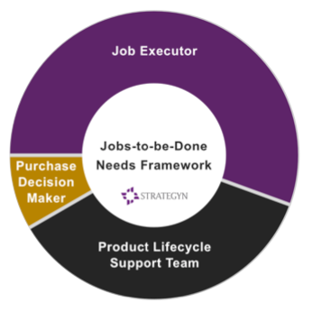
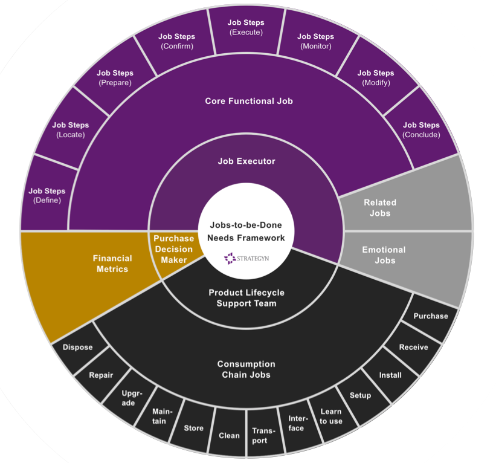
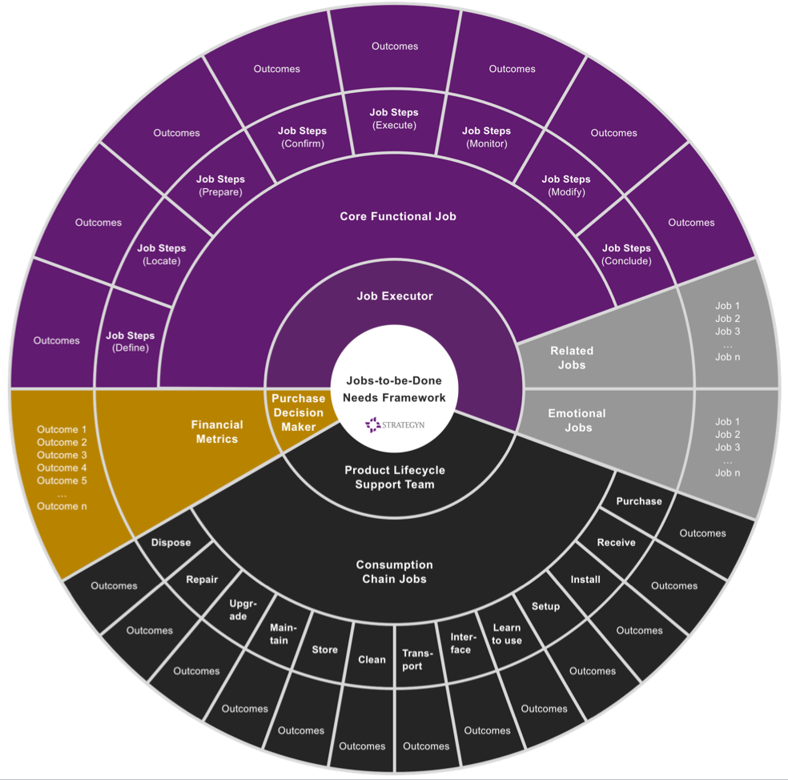
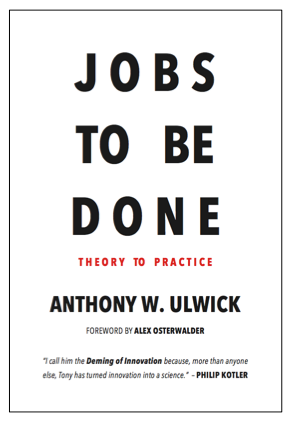

## Jobs Theory provides a framework for categorizing, defining, capturing and organizing the inputs that are required to make innovation predictable.  

工作理论提供了一个框架，用于对使创新可预测所需的输入进行分类、定义、捕获和组织。

Imagine if all the developers, marketers, strategists and R&D managers in your company shared a common understanding of what a need is and which customer needs are unmet. Such alignment and focus changes everything. So how can this be achieved?  

想象一下，如果贵公司的所有开发人员、营销人员、战略家和研发经理都对什么是需求以及哪些客户需求未得到满足达成共识。这种对齐和专注改变了一切。那么如何实现呢？

Harvard Business School marketing professor Theodore Levitt said, “People don’t want to buy a quarter-inch drill. They want a quarter-inch hole!” Clayton Christensen says, “People buy products and services to get a job done”.  

哈佛商学院市场营销教授西奥多莱维特说，“人们不想买四分之一英寸的钻头。他们想要一个四分之一英寸的洞！” Clayton Christensen 说，“人们购买产品和服务是为了完成工作”。

These are the basic constructs of [Jobs-to-be-Done](https://strategyn.com/jobs-to-be-done/) Theory, but these constructs are only the tip of the iceberg. The theory has a game-changing implication:  

这些是 Jobs-to-be-Done Theory 的基本结构，但这些结构只是冰山一角。该理论具有改变游戏规则的意义：

> **Jobs-to-be-Done Theory provides a framework for defining, categorizing, capturing, and organizing all your customers’ needs.  
> 
> Jobs-to-be-Done Theory 提供了一个框架，用于定义、分类、捕获和组织所有客户的需求。**
> 
> **Moreover, when using this framework, a complete set of need statements can be captured in days — rather than months — and the statements themselves are valid for years — rather than quickly becoming obsolete.  
> 
> 此外，使用此框架时，可以在几天内（而不是几个月内）捕获一整套需求陈述，并且这些陈述本身有效期多年——而不是很快就过时了。**

Needless to say, if you are not using Jobs Theory as the foundation for a needs framework, you are arguably missing out on the biggest benefit of the theory’s application.  

不用说，如果您不使用工作理论作为需求框架的基础，那么您可能会错过该理论应用的最大好处。

Historically, the primary cause of failed products and services is a misalignment with customer needs. This is not surprising given that 95% of product teams do not agree on what a customer “need” even is.  

从历史上看，产品和服务失败的主要原因是与客户需求不一致。这并不奇怪，因为 95% 的产品团队甚至不同意客户“需要”的内容。  

Using this needs framework, product teams can deeply understand the jobs its customers are trying to get done and the metrics they use to measure success.  

使用此需求框架，产品团队可以深入了解其客户试图完成的工作以及他们用来衡量成功的指标。

Armed with knowledge of all the customers’ needs, a product team can:  

了解所有客户需求后，产品团队可以：

-   Determine which needs are unmet  
    
    确定哪些需求未得到满足
-   Discover segments of customers with unique sets of unmet needs  
    
    发现具有独特未满足需求集的客户群
-   Systematically conceptualize breakthrough products  
    
    系统地概念化突破性产品
-   Predict which new concepts and offerings will win in the marketplace  
    
    预测哪些新概念和产品将赢得市场
-   Align the actions of marketing, development, and R&D to orchestrate the systematic creation of customer value  
    
    协调营销、开发和研发的行动，以协调系统地创造客户价值

The **Jobs-to-be-Done Needs Framework**, described in detail below, reveals the 3 types of external customers that companies serve, the 5 types of jobs they are trying to get done, and what types of inputs are required to bring predictability to the innovation process. These are the key inputs into the [Outcome-Driven Innovation process](https://strategyn.com/outcome-driven-innovation-process/).  

下面详细描述的待完成工作需求框架揭示了公司服务的 3 种类型的外部客户、他们试图完成的 5 种类型的工作，以及需要哪些类型的投入才能为公司带来可预测性创新过程。这些是成果驱动创新流程的关键输入。

## Who are your customers?  

谁是你的客户？

Before a company can define all its customers’ needs, it must first define all its customers. While a B2C company may find this to be a simple exercise, many B2B companies struggle.  

在一家公司能够定义其所有客户的需求之前，它必须首先定义其所有客户。虽然 B2C 公司可能会觉得这是一项简单的工作，但许多 B2B 公司却很挣扎。  

Through our consulting work we have conducted exhaustive research; we have concluded that the types of customers a company serves are best grouped into three categories:  

通过我们的咨询工作，我们进行了详尽的研究；我们得出的结论是，公司服务的客户类型最好分为三类：

1.  **The job executor:** this is the person using the product to get the core functional job done.  
    
    工作执行者：这是使用产品来完成核心功能工作的人。
2.  **The product lifecycle support team**: this consists of the varying groups of people who support the product throughout its lifecycle. This includes people who install, transport, repair, maintain, upgrade or dispose of the product. They execute consumption chain jobs.  
    
    产品生命周期支持团队：由在产品整个生命周期中支持产品的不同人员组成。这包括安装、运输、修理、维护、升级或处置产品的人员。他们执行消费链作业。
3.  **The buyer:** this is the person responsible for making the financial purchase decision.  
    
    买方：这是负责做出财务购买决定的人。

A toothbrush manufacturer will discover that the consumer typically plays all three roles; the consumer is the product user, the supporter of the product throughout its lifecycle, and the buyer. This situation is common in B2C markets.  

牙刷制造商会发现，消费者通常扮演着所有这三个角色；消费者是产品的使用者，是产品整个生命周期的支持者，也是购买者。这种情况在B2C市场很常见。

Conversely, if your company manufactures surgical medical instruments, then the surgeon is the job executor. The product lifecycle support team may consist of nurses, bio-meds and others and the buyer is typically a buying group in hospital administration.  

相反，如果您的公司生产外科医疗器械，那么外科医生就是工作执行者。产品生命周期支持团队可能由护士、生物医学和其他人员组成，买家通常是医院管理部门的采购团队。  

This type of complexity is common in B2B companies.  

这种复杂性在 B2B 公司中很常见。

While many possibilities exist, the customer types fall nicely into these 3 categories, as can be seen in Figure 1. They form the basis for the Jobs-to-be-Done Needs Framework.  

虽然存在许多可能性，但客户类型很好地归入这 3 个类别，如图 1 所示。它们构成了待完成工作需求框架的基础。

**This categorization is meaningful as each customer type has a different set of needs.  

这种分类很有意义，因为每种客户类型都有不同的需求。**

Figure 1: Customer types  

图 1：客户类型

## **What types of jobs are they getting done?  

他们正在完成哪些类型的工作？**

The **Jobs-to-be-Done Needs Framework** reveals the 5 types of jobs that the job executor, the product lifecycle support team and the buyer are trying to get done.  

Jobs-to-be-Done Needs Framework 揭示了工作执行者、产品生命周期支持团队和购买者试图完成的 5 种工作类型。

The job executor is trying to get 3 distinct jobs done:  

工作执行者试图完成 3 个不同的工作：

**The core functional job:** This is defined as the underlying process the job executor is trying to get done in a given situation. It is the focal point around which a market is defined and the reason a market exists.  

核心功能工作：这被定义为工作执行者在给定情况下试图完成的底层过程。它是定义市场的焦点，也是市场存在的原因。  

“Repairing a rotator cuff,” “passing on life lessons to children,” and “protecting against a cyber attack” are all examples of core functional jobs-to-be-done. The goal of any product is to help get a core functional job done better and more cheaply than competing solutions.  

“修复肩袖”、“给孩子们传授人生课程”和“防止网络攻击”都是需要完成的核心职能工作的例子。任何产品的目标都是帮助核心功能工作比竞争解决方案更好、更便宜地完成。

**Related jobs:** These are additional functional jobs the job executor is trying to get done either before, during or following the execution of the core job.  

相关工作：这些是工作执行者在核心工作执行之前、期间或之后试图完成的附加功能工作。  

With an understanding of these related jobs, and which, if any, are underserved, a company can devise solutions that help its customers get multiple jobs done, making its product more valuable.  

通过了解这些相关工作，以及哪些工作（如果有的话）服务不足，公司可以设计解决方案来帮助其客户完成多项工作，从而使其产品更有价值。

**Emotional jobs:** These are statements that describe the way the job executor wants to be perceived or feel when executing the core functional job. Social jobs are included in this categorization.  

情绪化工作：这些陈述描述了工作执行者在执行核心职能工作时希望被感知或感受的方式。社会工作包括在这个分类中。  

These inputs are valuable when it comes to creating a value proposition that incorporates both functional and emotional components, which strongly connect with customers.  

在创建结合功能和情感成分的价值主张时，这些输入很有价值，这与客户有着密切的联系。

**Consumption chain jobs:** The product lifecycle support team is trying to execute a number of jobs throughout the product lifecycle.  

消费链作业：产品生命周期支持团队试图在整个产品生命周期中执行大量作业。  

These jobs include product installation, set up, and storing, transporting, maintaining, repairing, cleaning, upgrading, and disposing of the product — all impacting the customer experience. These consumption chain jobs are shown in black in Figure 2.  

这些工作包括产品安装、设置和存储、运输、维护、修理、清洁、升级和产品处置——所有这些都会影响客户体验。这些消费链作业在图 2 中以黑色显示。  

The types of consumption chain jobs that must be considered in a market vary depending on the type of offering under consideration; we have created separate frameworks for hardware, software, service and consumable offerings.  

市场中必须考虑的消费链工作类型因所考虑的产品类型而异；我们为硬件、软件、服务和消费品创建了单独的框架。

**The purchase decision job:** This is the job that the purchase decision maker executes using a financial lens to try to decide which product or service to acquire. Here we want to know what financial and/or performance metrics are used to make the purchase decision.  

购买决策工作：这是购买决策者使用财务镜头执行的工作，试图决定购买哪种产品或服务。在这里，我们想知道哪些财务和/或绩效指标用于做出购买决定。  

These metrics are what we call financial desired outcomes.  

这些指标就是我们所说的财务预期结果。

Figure 2: Job types  

图 2：作业类型

## **The customer’s desired outcomes  

客户期望的结果**

The power of Jobs Theory is that the customer’s job-to-be-done is the anchor point for “where” to create value. That anchor point, while useful, does not contain enough information to indicate “how” to be successful in a market.  

工作理论的力量在于，客户的待完成工作是“在哪里”创造价值的定位点。该锚点虽然有用，但没有包含足够的信息来指示“如何”在市场上取得成功。  

For example, knowing that people struggle to “manage their monthly spending,” does not inform us precisely where in the job they are struggling.  

例如，知道人们难以“管理他们的每月支出”，并不能准确地告诉我们他们在工作中的哪个方面遇到困难。

To gain a deep understanding of the customer’s job-to-be-done, a company must be able to discover the customer’s “needs” associated with getting that job done.  

为了深入了解客户需要完成的工作，公司必须能够发现与完成该工作相关的客户“需求”。

When looking at a market through a jobs-to-be-done lens, customer needs can be discovered by studying the customer’s core functional job as a process.  

当通过待完成工作的视角观察市场时，可以通过将客户的核心职能工作作为一个过程来研究来发现客户需求。  

Tactically, the core functional job can be broken down into steps using what we call a job map as described in the 2008 Harvard Business Review article, [The Customer-Centered Innovation Map](https://hbr.org/2008/05/the-customer-centered-innovation-map). With the job map in place, companies can then seek to discover the metrics customers use to measure success as they try to get each step in the job done. These metrics, which we call “desired outcomes,” bring predictability to innovation.  

从战术上讲，可以使用我们称之为工作地图的方法将核心职能工作分解为多个步骤，如 2008 年哈佛商业评论文章“以客户为中心的创新地图”中所述。有了工作地图，公司就可以寻求发现客户在尝试完成工作中的每一步时用来衡量成功的指标。这些我们称之为“预期结果”的指标为创新带来了可预测性。

A desired outcome statement is a specially constructed need statement that has a unique set of characteristics: desired outcomes are devoid of solutions, stable over time, measureable, controllable, structured for reliable prioritization in a quantitative customer survey, and are tied to the underlying process (or job) the customer is trying to get done.  

期望的结果陈述是专门构建的需求陈述，具有一组独特的特征：期望的结果没有解决方案，随着时间的推移稳定，可测量，可控，结构化以在定量客户调查中进行可靠的优先排序，并与基础流程相关联（或工作）客户正在努力完成。

There are typically 50–150 outcomes that people use to measure the success of a core functional job and 10–30 outcomes per relevant consumption chain job. These are the ingredients that come together to bring predictability to innovation.  

人们通常使用 50-150 个结果来衡量核心职能工作的成功，每个相关消费链工作有 10-30 个结果。这些是共同为创新带来可预测性的要素。  

How all the pieces fit together can be seen in the complete **Jobs-to-be-Done Needs Framework**, shown in Figure 3.  

在完整的 Jobs-to-be-Done Needs Framework 中可以看到所有部分是如何组合在一起的，如图 3 所示。

Figure 3: The Jobs-to-be-Done Needs Framework  

图 3：待完成的工作需求框架

## **What are the implications?  

有什么影响？**

The **Jobs-to-be-Done Needs Framework** is a structured guide for navigating the complexity involved in understanding all the needs in a market.  

Jobs-to-be-Done Needs Framework 是一个结构化指南，用于应对理解市场所有需求所涉及的复杂性。  

Given the avalanche of customer data that companies consider each day, this framework reveals what inputs are needed, how they should be categorized and organized, why they are captured, and how they should be utilized.  

考虑到公司每天都要考虑的大量客户数据，该框架揭示了需要哪些输入、应该如何对它们进行分类和组织、为什么要捕获它们以及应该如何利用它们。

Without these essential insights, innovation remains a game of chance and product teams end up guessing on the best path forward. Having the right inputs changes everything. It revolutionizes the way products are conceived, tested, created, marketed and sold.  

没有这些重要的洞察力，创新仍然是一场机会游戏，产品团队最终只能猜测最佳的前进道路。拥有正确的输入会改变一切。它彻底改变了产品的构思、测试、创造、营销和销售方式。

The **Jobs-to-be-Done Needs Framework** brings order to a historically unstructured, chaotic practice.  

Jobs-to-be-Done Needs Framework 为历史上非结构化、混乱的实践带来了秩序。

Learn more: **download a FREE PDF or AUDIO version** of my latest [Jobs-to-be-Done book](https://jobs-to-be-done-book.com/), **JOBS TO BE DONE: Theory to Practice**.  

了解更多：下载我最新的 Jobs-to-be-Done 一书的免费 PDF 或音频版本，JOBS TO BE-DONE：从理论到实践。

**Want to become an ODI practitioner?** You can now access the same online education and certification [**innovation training**](https://my.strategyn.com/pages/home) platform that Strategyn uses to onboard its own practitioners.  

想成为ODI从业者？现在，您可以访问 Strategyn 用于培训自己的从业者的同一在线教育和认证创新培训平台。

To learn more about Strategyn’s Jobs-to-be-Done consulting offerings, go to [**Strategyn.com**](https://strategyn.com/).  

要了解有关 Strategn 的 Jobs-to-be-Done 咨询产品的更多信息，请访问 Strategn.com。
