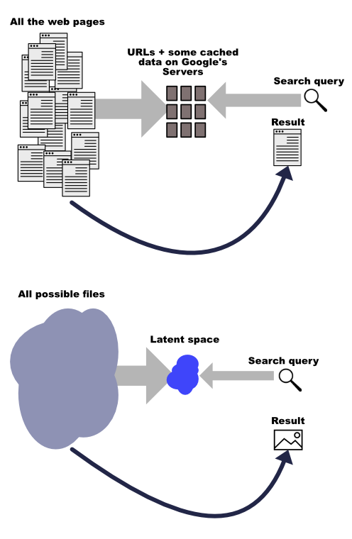

_Welcome to the first installment of my new tutorial series on AI content generation. Part 2 covers [tasks and models](https://www.jonstokes.com/p/ai-content-generation-part-2-tasks). Part 3 is a [deep dive into Stable Diffusion](https://www.jonstokes.com/p/getting-started-with-stable-diffusion). Part 4 is a look at [what’s next for AI content generation](https://www.jonstokes.com/p/ai-content-generation-part-4-whats). Sign up now to make sure you don’t miss future installments!  

欢迎来到我关于人工智能内容生成的新教程系列的第一部分。第二部分涉及任务和模型。第三部分是对稳定扩散的深入研究。第四部分是对人工智能内容生成的下一步的展望。现在就注册，以确保你不会错过未来的内容!_

_If you’re building in any of the spaces I cover in this Substack, then you can [use this form to tell me about it](https://airtable.com/shrypue3MSXxsZEDS) and I may be able to help you get connected with funding.  

如果你正在建设我在这个Substack中所涉及的任何空间，那么你可以使用这个表格告诉我，我可能会帮助你获得资金的连接。_

I love those fake modern-day _Seinfeld_ bits people post to Twitter. Just recently, the one below had me rolling because I can really picture the entire scene and hear all the actors’ voices in myd:  

我喜欢人们在Twitter上发布的那些假的现代Seinfeldbits。就在最近，下面这段话让我忍俊不禁，因为我真的可以想象出整个场景，听到所有演员的声音在我耳边响起。

If you’ve been following the red-hot AI content generation scene, then you’re probably already aware that it’s likely a matter of months before authentic-looking video of newly invented _Seinfeld_ bits like this can be generated by anyone with a few basic, not-especially-technical skills. Instead of tweeting little 250-character dialogues like the one above, _Seinfeld_ fans will tweet video clips complete with flawlessly matching laugh tracks.  

如果你一直在关注红红火火的人工智能内容生成场景，那么你可能已经意识到，像这样新发明的Seinfeldbits的真实视频很可能在几个月内就可以由任何拥有一些基本的、并非特别技术的技能的人生成。Seinfeldfans将在推特上发表250字的对话，而不是在推特上发表与笑声完美匹配的视频片段。

A technology called **deep learning** is bringing what can only be described as miracles within the reach of ordinary creators. Whether you’re making text, images, video, or code, and whether you’re looking to work alongside an AI or have the AI do most of the work for you, you’re about to get superpowers.   

一种名为深度学习的技术为普通创作者带来了只能用奇迹来形容的东西。无论你是制作文本、图像、视频还是代码，无论你是想与人工智能一起工作还是让人工智能为你做大部分工作，你都将获得超能力。

In fact, AI superpowers are already here for creators who are willing to invest a little time in understanding how these machine learning-based content tools work. In this new series of posts, I’ll give you an overview of the content generation space, covering everything from the ideas behind it to how to use specific tools.  

事实上，对于那些愿意投入一点时间了解这些基于机器学习的内容工具如何工作的创作者来说，人工智能的超能力已经在这里。在这个新的系列文章中，我将给你一个内容生成空间的概述，涵盖从背后的想法到如何使用具体工具的一切。

**Who this introduction is for:  

这个介绍是为谁准备的。**

-   Content creators who want to use these tools to enhance their work, but aren’t quite sure where to start.  
    
    想使用这些工具来加强他们的工作，但不太确定从哪里开始的内容创作者。
    
-   Creators who may not be quite ready to take the plunge, but who do want to understand the role this technology is playing in the markets where they’re trying to make a living.  
    
    创作者们可能还没有做好准备，但他们确实想了解这项技术在他们试图谋生的市场中发挥的作用。
    
-   Journalists and academics who are trying to understand the impact this technology will have on society.  
    
    试图了解这项技术将对社会产生的影响的记者和学者们。
    
-   Investors and builders who are looking for good places to get involved in the space.  
    
    投资者和建筑商，他们正在寻找参与该领域的好地方。
    

AI content generation is a very rapidly evolving space — I’ve started on a few tutorials for specific tools (watch this space for those to come out) and found that things can literally change by the hour, as new builds are pushed out. There’s also a constant stream of new tools launching, a testament to investor interest and market demand.  

人工智能内容生成是一个非常快速发展的领域--我已经开始为特定的工具编写一些教程（请关注本空间的内容），并发现随着新版本的推送，事情简直可以按小时变化。也有源源不断的新工具推出，证明了投资者的兴趣和市场需求。

Given the amount of churn and evolution in the AI content ecosystem, the best way to come to gain a profitable working knowledge of it is to invest a bit of time in understanding it on its own terms. This doesn’t mean you need to know how deep learning works, how to do matrix math, what a transformer is, or any other low-level concepts. Rather, you need a functional, high-level sense of what’s going on behind the scenes of all these apps and tools, because **the behind-the-scenes stuff doesn’t change nearly as fast** as the user-facing tools do.  

鉴于人工智能内容生态系统的大量流失和演变，来获得有利可图的工作知识的最佳方式是投入一点时间来理解它本身的条款。这并不意味着你需要知道深度学习如何工作，如何做矩阵数学，什么是变压器，或任何其他低层次的概念。相反，你需要对所有这些应用程序和工具的幕后情况有一个功能性的、高层次的认识，因为幕后的东西不像面向用户的工具那样变化得那么快。

I’ve divided up the core concepts you need to know by level, from lowest level to highest level:  

我把你需要知道的核心概念按级别划分，从最低级别到最高级别。

1.  Machine learning basics. (_This article_)  
    
    机器学习基础知识。(这篇文章)
    
2.  [Tasks and models](https://www.jonstokes.com/p/ai-content-generation-part-2-tasks).  
    
    任务和模式 .
    
3.  Applications. (_Coming soon…_)  
    
    应用。(即将推出...)
    

Each article in this series will cover one of these levels, and I’ll also publish a few detailed “click this, type that” articles at the “Applications” level that walk you through how to get started with specific tools.  

这个系列的每一篇文章都将涵盖其中的一个层次，我还将在 "应用 "层次发表一些详细的 "点击这个，输入那个 "的文章，指导你如何开始使用特定的工具。

Note that the rate of change of the field gets faster as you move up each level. So machine learning basics are the most stable layer, and the knowledge you gain about this area will remain useful for the longest. Contrast this to the top layer, where there are so many products launching that this part of the present article will already be slightly out-of-date by the time I publish it.  

请注意，随着你每一层的上升，该领域的变化速度会越来越快。因此，机器学习的基础知识是最稳定的一层，你在这个领域获得的知识将在最长的时间内保持有用。与此相对应的是顶层，那里有很多产品推出，以至于本篇文章的这部分内容在我发表时已经略显过时了。

Here’s main the advantage of starting at the bottom and working up: all the changes in a layer are built from concepts in the layers below; so if you understand layers 1 and 2, then you’ll immediately be able to grasp and use new (or iterated) products in layer 3.  

这里主要是指从底层开始向上工作的优势：一个层的所有变化都是建立在下面的层的概念之上的；所以如果你理解了第1和第2层，那么你就能立即掌握和使用第3层的新（或迭代）产品。

**The bottom line:** If you skip the core concepts laid out in the next few sections and jump straight to the tools in subsequent installments, you’ll miss most of the value of this post. So read the parts of this post that will stay useful the longest, and skim the more practical content that follows with a plan to revisit it as-needed.  

底线：如果你跳过后面几节阐述的核心概念，直接跳到后面几节的工具上，你会错过本帖的大部分价值。因此，请阅读本篇文章中有用时间最长的部分，然后略过后面更实用的内容，并计划在需要时重新审视它。

All the AI content generation tools I’ll cover in this series can be lumped into one of three main categories:  

我在这个系列中要介绍的所有人工智能内容生成工具都可以归为三个主要类别之一。

1.  **Generation:** This is probably what you’re here for, i.e., using ML to make new things.  
    
    代：这可能是你在这里的目的，即使用ML来制造新的东西。
    
2.  **Classification:** All forms of analysis, feature/object extraction, and so on go in this bucket.  
    
    分类：所有形式的分析、特征/对象提取等都在这个桶里。
    
3.  **Transformation:** This includes translating languages, but there are plenty of other tasks that you might want to do that fall under the heading of transforming an input into a tweaked or altered version of itself.   
    
    转化：这包括翻译语言，但还有很多你可能想做的其他任务，都属于将输入转化为一个经过调整或改变的版本的范畴。
    

I’ve made an [Airtable of some AI-based content tools](https://airtable.com/shrDxAxCCxAZVtMnt) I’ll cover in this series, tagged by the three categories above.  

我把我在这个系列中要涉及的一些基于人工智能的内容工具做成了一个Airtable，并以上述三个类别为标签。

Note that many of these tools do multiple things, and as we’ll soon learn the line between one category and another can sometimes be arbitrary.  

请注意，这些工具中有许多是做多种事情的，而且我们很快就会知道，一个类别和另一个类别之间的界限有时是任意的。

What if I told you that every configuration of bits that can possibly exist — every abstract concept or idea, every work of art, every piece of music, everything we can put into a digital file for display or playback on a computer or in a VR headset — is already out there on the number line and that the act of turning any given chunk of information into a readable file involves first locating that thing in the eternal, pre-existing space of numbers and then reversing enough local entropy to give that number a physical form?  

如果我告诉你，每一个可能存在的比特配置--每一个抽象的概念或想法，每一件艺术作品，每一段音乐，所有我们可以放入数字文件在电脑或VR头盔上显示或播放的东西--都已经在数线上了，而把任何给定的信息块变成可读文件的行为，首先要在永恒的、预先存在的数字空间中找到那个东西，然后扭转足够的局部熵，给那个数字一个物理形式，那会怎么样？

This sounds woo, and maybe it is, but it’s a very useful way to look at the world if you want to understand machine learning. That’s because a trained AI model contains a kind of internal representation of a (hopefully useful and interesting) chunk of the space of all possible digital files. When we use these models, we’re poking around in that space to see what we can find.  

这听起来很拗口，也许确实如此，但如果你想了解机器学习，这是看世界的一种非常有用的方式。这是因为一个训练有素的人工智能模型包含一种对所有可能的数字文件空间的（希望是有用和有趣的）内部表示。当我们使用这些模型时，我们在这个空间里探究，看看我们能找到什么。

_See the Appendix at the bottom of this article for more on this fascinating topic.  

关于这个引人入胜的话题，请参见本文底部的附录。_

The animation above shows me entering a [text](https://beta.openai.com/playground) **[prompt](https://beta.openai.com/playground)** [into GPT-3](https://beta.openai.com/playground) and getting an output in reply. You might naively imagine that this prompt is a type of command — that I’m ordering GPT-3 to do a thing for me (in this case, to create a new block of text). That’s certainly one way to think of a prompt, but it’s not the best way, nor is it the way ML researchers and AI experts think of prompts.  

上面的动画显示我在GPT-3中输入了一个文本提示，并得到了一个输出的回复。你可能会天真地认为这个提示是一种命令--我命令GPT-3为我做一件事（在这种情况下，创建一个新的文本块）。这当然是思考提示的一种方式，但它不是最好的方式，也不是ML研究人员和AI专家思考提示的方式。

A better way to think about what’s going on in the animation above is to **think of the prompt as a search query**, exactly like the kinds of queries you’d type into Google to locate a particular piece of information on Google’s servers. You’re sending a search query to the model, and the model then does the following steps:  

思考上述动画中发生的事情的一个更好的方法是，把提示看作是一个搜索查询，就像你在谷歌上输入的各种查询，以便在谷歌的服务器上找到某条信息。你正在向模型发送一个搜索查询，然后模型会进行以下步骤。

1.  Translates your input query into a set of coordinates on the surface of all possible digital files (that it has seen before and knows about), and then  
    
    将你的输入查询翻译成所有可能的数字文件表面上的一组坐标（它以前见过并知道的），然后
    
2.  Returns to you as output the file that’s closest to your coordinates in that space (often after going through multiple iterative steps of narrowing in on the target).  
    
    向你输出在该空间中与你的坐标最接近的文件（通常是在经历了缩小目标的多个迭代步骤之后）。
    

So when you feed a model like GPT-3 or Stable Diffusion a prompt, what’s actually going on behind the scenes is you’re giving the model some direction about where in the space of its possible outputs to begin looking in order for it to locate the thing you’re asking it to “generate.”  

因此，当你给像GPT-3或稳定扩散这样的模型提供提示时，实际上在幕后进行的是你给模型一些方向，让它在其可能的输出空间中开始寻找，以便找到你要求它 "生成 "的东西。

This “search query” framework is useful because it lets you magically import all the intuitions and skills you’ve built up from years of searching Google, and turn them to the task of AI content generation more or less unaltered.  

这个 "搜索查询 "框架很有用，因为它可以让你神奇地导入你从多年的谷歌搜索中建立起来的所有直觉和技能，并将它们或多或少地用于人工智能内容生成的任务。

Most Google users might start with a general query, and then refine the query over multiple searches in order to steadily narrow down the list of results to suit their goals for that session. You’ll use this exact same process with many AI content generation tools:  

大多数谷歌用户可能会从一个一般的查询开始，然后在多次搜索中细化查询，以便稳步缩小结果列表，以适应他们在该时段的目标。你将在许多人工智能内容生成工具中使用这个完全相同的过程。

1.  Give the tool a search query  
    
    给该工具一个搜索查询
    
2.  Evaluate the results  
    
    评估结果
    
3.  Tweak the query, then return to step #1.  
    
    对查询进行调整，然后返回到步骤1。
    

Just like Google has in its vast servers an organized, structured representation of a portion of all the web pages in existence on the internet, a language model like GPT-3 or an image generation model like Imagen has in its internal “memory” an organized, structured representation of all the text or images it was trained on.  

就像谷歌在其庞大的服务器中对互联网上存在的所有网页的一部分有组织、有结构的表示一样，像GPT-3这样的语言模型或像Imagen这样的图像生成模型在其内部 "存储器 "中对其训练的所有文本或图像有组织、有结构的表示。

And just like Google has “memorized” only the part of the web it has crawled, Stable Diffusion has “memorized” only the part of the space of all possible images it has been trained on.  

就像谷歌只 "记忆 "了它所抓取的网络部分，稳定扩散也只 "记忆 "了它所训练的所有可能的图像空间的部分。

We can now make the following useful mental mappings between web search-related concepts and AI image generation-related concepts:  

我们现在可以在网络搜索相关概念和人工智能图像生成相关概念之间进行以下有用的心理映射。

-   Crawling => training  
    
    爬行 => 训练
    
-   Searching => prompting  
    
    搜索 => 提示
    
-   Refining a search => refining a prompt  
    
    完善搜索 => 完善提示
    
-   Filtering a search => setting parameters on the model  
    
    筛选搜索=>在模型上设置参数
    

**The bottom line:** When using AI content generation tools, it’s best to think of the prompts you’re feeding them as a search query instead of a command. The skills and intuitions you already have from using Google will help you when it comes to crafting a suitable prompt for a model.  

底线：在使用人工智能内容生成工具时，最好把你给它们的提示看作是一个搜索查询，而不是一个命令。当涉及到为模型制作一个合适的提示时，你从使用谷歌中已经拥有的技能和直觉将帮助你。

If content generation is really a form of search, then you’re probably wondering how categorization and analysis fit into this picture. I could explain this using the integer and timeline language introduced earlier, but you’ll gain a better sense of how AI does what it does if we nuance the picture a bit.  

如果内容生成真的是一种搜索形式，那么你可能想知道分类和分析是如何融入这幅画面的。我可以用前面介绍的整数和时间轴语言来解释这个问题，但如果我们对图片进行一些细微的调整，你会对人工智能的作用有更好的认识。

Instead of thinking of every digital file on your hard drive as a single, really large integer, try imagining that it’s a group of three integers that form a set of coordinates to a point in 3D space, like the point at the x, y, and z coordinates in the image below.  

与其把你硬盘上的每个数字文件想成一个真正的大整数，不如试着想象它是一组三个整数，构成了三维空间中一个点的坐标集，比如下图中x、y、z坐标的那个点。

Consider the example of a file that’s a color picture of a vehicle of some type. Let’s say we wanted to turn that digital picture into a single point in 3D space and plot it on a 3D plot like the one above. (I’ll get to why we’d want to do this in a moment.) To do this, we need to figure out which aspects of the picture will form our x, y, and z axes:  

考虑一个文件的例子，它是某种类型的车辆的彩色图片。假设我们想把这张数字图片变成三维空间中的一个点，并把它绘制在一个像上面这样的三维图上。(要做到这一点，我们需要弄清楚图片的哪些方面将构成我们的X、Y和Z轴。

-   **Dimensions and color:** We could make the height of the picture (in pixels) the x-axis, the width of the picture the y-axis, and the average color of all the pixels the z-axis.  
    
    尺寸和颜色：我们可以把图片的高度（像素）作为X轴，图片的宽度作为Y轴，而所有像素的平均颜色作为Z轴。
    
-   **Abstract concepts:** We could make the three axes could be “automobile,” “horse-and-buggy,” and “bicycle,” and we could plot the photograph as a single point on the graph by measuring how close it is to one of these three concepts. A picture of a motorcycle, for instance, might sit in the region between “automobile” and “bicycle,” while a picture of a tricycle pulling a wagon might sit in the region between “horse-and-buggy” and “bicycle.”  
    
    抽象概念：我们可以把三条轴定为 "汽车"、"马车 "和 "自行车"，我们可以通过测量照片与这三个概念中的一个概念的接近程度，将其作为一个点绘制在图表上。例如，一张摩托车的照片可能位于 "汽车 "和 "自行车 "之间的区域，而一辆拉着马车的三轮车的照片可能位于 "马车 "和 "自行车 "之间的区域。
    

Ultimately, we’ll pick whatever three characteristics of pictures are most important to us, and then use them to turn our picture into a single point in 3D space.  

最终，我们会选择图片的任何三个特征对我们来说是最重要的，然后用它们来把我们的图片变成三维空间中的一个点。

Let’s say we apply the “automobile” vs. “bicycle” vs. “horse-and-buggy” coordinate scheme to a picture of a motorcycle. If we’re scoring each of these three attributes on a scale of 0 to 10, with 0 having the least “automobileness” (or “bicycleness,” or “horse-and-bugginess”) and 10 having the most. If we gave the motorcycle a score of `3 automobile`, `4 bicycle`, and `0 horse-and-buggy`, we’d get something like the following plot:  

假设我们将 "汽车 "与 "自行车 "与 "马车 "的坐标方案应用于一张摩托车的图片。如果我们给这三种属性的每一种打分，从0到10，0的 "汽车性"（或 "自行车性"，或 "马车性"）最小，10的最多。如果我们给摩托车打上 `3 automobile` 、 `4 bicycle` 和 `0 horse-and-buggy` 的分数，我们就会得到类似下面的图。

We can’t do much with a single point in space, so we’ll repeat the process above — let’s use — on a folder of 10 pictures, all showing some form of vehicle.  

我们对空间中的一个点做不了什么，所以我们将重复上面的过程--让我们用--在一个由10张图片组成的文件夹上，所有图片都显示某种形式的车辆。

Plotting the above dataset using the automobile/bicycle/horse-and-buggy scheme might give us a 3D shape that looks something like the following:  

使用汽车/自行车/马和小汽车方案绘制上述数据集，可能会给我们一个看起来像以下的三维形状。

Even if you hadn’t seen a copy of the pictures in the folder, you could actually glance at this shape and tell that most of the pictures in that directory are some kind of automobile. Just from looking at the shape of the 3D volume, the points make when they’re distributed along the x, y, and z axes, we can infer useful things about the dataset as a whole.  

即使你没有看到文件夹中的图片副本，你实际上也可以瞥一眼这个形状，就知道那个目录中的大部分图片是某种汽车。仅仅从三维体积的形状来看，当这些点沿x、y和z轴分布时，我们可以推断出关于整个数据集的有用的东西。

The internal “memory” of a deep learning model consists of a multidimensional version of something like the simple volume above. The training process for an image model like Stable Diffusion involves showing the model a large number of pictures so that it can extract different features and qualities of the pictures (like “automobileness,” “bicycleness,” or “horse-and-bugginess”). It then clusters compressed representations of images together in this multidimensional space, so that different regions of it tend to correspond to similar types of images.  

深度学习模型的内部 "存储器 "由一个类似上述简单体积的多维版本组成。像 "稳定扩散 "这样的图像模型的训练过程包括向模型展示大量的图片，以便它能够提取图片的不同特征和质量（如 "汽车性"、"自行车性 "或 "马和杂耍性"）。然后，它在这个多维空间中把图片的压缩表征聚在一起，这样它的不同区域往往对应于类似的图片类型。

The finished, trained model, then, is a highly compressed, digital representation of a multidimensional space of concepts and features — a **latent space** — that the machine has extracted from the training dataset during its training phase. In this space, similar things tend to be clustered near one another along one or more dimensions, while unlike things are located further apart.  

那么，经过训练的成品模型是一个高度压缩的、由概念和特征组成的多维空间的数字表示--Alatent空间--机器在训练阶段从训练数据集中提取的。在这个空间里，相似的事物往往沿着一个或多个维度聚集在一起，而不相似的事物则相距较远。

Note that the model’s latent space doesn’t literally store images in a readable file format like JPG or PNG, and then organize these files together somehow. It’s not a database. Rather, the model’s configuration of numerical **weights** stores different attributes and features of a training image — edges, shapes, colors, and even abstract concepts related to what’s depicted — in such a way that a configuration of bits adjacent to (and therefore similar to) that image can be recovered from the space of all possible digital files by pointing queries at the region of latent space that the training image has left unique impressions on.   

请注意，该模型的潜在空间并不是从字面上将图像存储在JPG或PNG等可读文件格式中，然后以某种方式将这些文件组织在一起。它不是一个数据库。相反，模型的数字权重配置存储了训练图像的不同属性和特征--边缘、形状、颜色，甚至与所描述的内容有关的抽象概念--以这样一种方式，与该图像相邻（因此与之相似）的比特配置可以通过指向训练图像留下独特印象的潜空间区域的查询，从所有可能的数字文件空间中恢复。

When Stable Diffusion was trained, it wasn’t trained solely on images. Rather, the images had relevant text with them, so this text is also organized in the model’s latent space alongside the relevant images.  

在训练Stable Diffusion时，它并不是只针对图像进行训练。相反，图像上有相关的文字，所以这些文字也与相关的图像一起被组织在模型的潜在空间中。

Pinterest was allegedly a big source of training data for Stable Diffusion, so [this is the kind of thing](https://www.pinterest.com/pin/497577458843716208/) the model would have seen when it was being trained:  

据称，Pinterest是 "稳定扩散 "的一个重要训练数据来源，所以这是该模型在训练时应该看到的东西。

The tags, description, and other text associated with the image above on the Pinterest page would have probably been sucked into the model along with the image itself so that those terms are clustered near the truck in the model’s latent space.  

与Pinterest页面上的图片相关的标签、描述和其他文本可能会和图片本身一起被吸入模型，因此这些术语在模型的潜在空间中被聚集在卡车附近。

It’s important to note that while text associated with an image is the model’s only source of English (or whatever language) words that it can associate with concepts, the concepts would still be there in the model even if we were to leave out the words. The model would still figure out, based on images alone, that trucks are different from cars, which are different from bicycles, which are different from covered wagons. We’d have no way to locate those concepts by inputting English words into the trained model, but they’d still be there in latent space.  

值得注意的是，虽然与图像相关的文字是模型能够与概念相关联的英语（或其他语言）词汇的唯一来源，但即使我们撇开这些词汇，这些概念仍然会出现在模型中。该模型仍然会根据图像发现，卡车与汽车不同，与自行车不同，与有篷马车不同。我们没有办法通过向训练有素的模型输入英语单词来定位这些概念，但它们仍然存在于潜在的空间中。

We already saw how AI content generation really amounts to searching a space of possible digital files using a specially constructed search query, but now that we know more about how models are trained, we can see that all three of the core functions of AI content tools are all really just variants on search. Depending on the type of task you’re doing, you’ll give the model a particular type of input and ask it for a particular type of output.  

我们已经看到，人工智能内容生成实际上相当于使用专门构建的搜索查询来搜索可能的数字文件空间，但现在我们更了解模型是如何训练的，我们可以看到，人工智能内容工具的所有三个核心功能实际上都只是搜索的变种。根据你正在做的任务类型，你会给模型一个特定类型的输入，并要求它提供一个特定类型的输出。

For image generation models like [DALL-E 2](https://openai.com/dall-e-2/), [Stable Diffusion](https://beta.dreamstudio.ai/), and [Imagen](https://imagen.research.google/), the process breaks down as follows:   

对于像DALL-E 2、稳定扩散和Imagen这样的图像生成模型，其过程分解如下。

-   **Generation**: text => image  
    
    生成：文本 => 图像
    
-   **Classification**: image => text  
    
    分类：图像 => 文本
    
-   **Transformation**: image => image (or text => text)  
    
    变换：图像=>图像（或文本=>文本）。
    

When you’re doing “AI content generation,” then, you’re using a text query to return the image that’s at a point in the latent space. When you’re doing “AI image classification,” you’re using an image query to return the text that’s near the input image in latent space. And when you’re doing an image transformation or a even text summary, you’re searching the latent space for a file that’s near the file you used as input.  

当你在做 "人工智能内容生成 "时，你使用文本查询来返回潜空间中某一点的图像。当你做 "人工智能图像分类 "时，你正在使用图像查询来返回潜空间中靠近输入图像的文本。而当你在做图像转换或甚至文本摘要时，你在潜空间中搜索靠近你用作输入的文件。

It should now be clear why people toss Google-query-like terms into their DALL-E prompts, terms like “trending on artstation",” “unreal engine,” and so on. Such terms get your query nearer to the part of the model’s latent space that represents knowledge about the input images that these words associated with them in the training phase.  

现在应该很清楚为什么人们会在他们的DALL-E提示中抛出类似谷歌查询的术语，如 "artstation上的趋势"、"虚幻引擎 "等术语。这样的术语使你的查询更接近模型的潜在空间部分，该部分代表了这些词在训练阶段与之相关的输入图像的知识。

When you count up to a new whole number that you personally have never counted up to (or summed or multiplied up to) before, would you claim to have “created” or “invented” that whole number, or even to have “discovered” it? None of these terms really feels right, so maybe it’s we can just say you “found” it, or “stumbled across” it, or “located” it.  

当你数到一个新的整数，而你个人以前从未数到（或求和或乘法），你会声称 "创造 "或 "发明 "了这个整数，或者甚至 "发现 "了它？这些术语都不太合适，所以也许我们可以说你 "发现 "了它，或者 "偶然发现 "了它，或者 "找到 "了它。

Most people’s intuition about numbers — especially whole numbers (i.e., numbers without a decimal place) — is that they “exist” in some meaningful way as an “objective” part of the universe. The sense that we have when we’re counting, multiplying, adding, subtracting, or doing other mathematical operations, is not that each result is a brand new number that’s coming into the world, but that we’re merely producing a representation of a number that already exists.  

大多数人对数字--尤其是整数（即没有小数点的数字）的直觉是，它们以某种有意义的方式作为宇宙的一个 "客观 "部分而 "存在"。当我们在计数、乘法、加法、减法或进行其他数学运算时，我们的感觉并不是每一个结果都是一个全新的数字出现在这个世界上，而是我们只是在产生一个已经存在的数字的代表。

Here’s the weird part (at least, it’s weird for me… your mileage may vary): every digital file of any size _is also an integer_, or rather it’s more accurate to say that every file has a single integer representation. If I have a very small digital file that consists only of the bits `0010`, then the integer version of that file is `2`. And on it goes out to files zettabytes in size and integers that are larger than the number of atoms in the universe.  

这里有一个奇怪的部分（至少对我来说是奇怪的......你的想法可能会有所不同）：每一个任何大小的数字文件也是一个整数，或者更准确地说，每个文件都有一个单一的整数表示。如果我有一个非常小的数字文件，只由比特 `0010` 组成，那么这个文件的整数版本就是 `2` 。再往下看，文件大小为zettabytes，整数比宇宙中的原子数量还要大。

So to the extent that numbers somehow “exist” out there in reality apart from what we humans think or say about them, every digital file that you could put on a computer — every iTunes music download, every movie, every picture, every podcast — already “exists” on the regular old integer number line we all know from grade school. Every file on your laptop was “real” as an integer before you represented it in little electronic pulses, and that integer would still be “real” even if you were to launch your laptop into the sun.  

因此，在数字以某种方式 "存在 "于现实中的程度上，除了我们人类对它们的想法或说法之外，你可以放在电脑上的每一个数字文件--每一个iTunes音乐下载、每一部电影、每一张图片、每一个播客--已经 "存在 "于我们从小学时就知道的普通整数线上。在你用小电子脉冲表示之前，你笔记本电脑上的每个文件都是 "真实 "的整数，而且即使你把你的笔记本电脑发射到太阳上，这个整数仍然是 "真实 "的。

The question of “what does it mean to say that numbers really exist?” is an [old one for philosophers](https://plato.stanford.edu/entries/philosophy-mathematics/), but computers in general and AI in specific bring this esoteric question into the realm of things it’s useful for non-nerds to ponder.  

对于哲学家来说，"说数字真的存在是什么意思？"这个问题是一个古老的问题，但一般的计算机和具体的人工智能将这一深奥的问题带入了对非知识分子有用的领域，让他们思考。

The reason this question suddenly matters for you as a sophisticated user of AI in your daily life is that taking it seriously will give you a set of useful intuitions about how AI works — intuitions that you’ll share with the people who develop AI for the rest of us to use, and that will guide you not just the “how” but the “why” of specific platforms, user interface elements, and best practices.  

作为日常生活中人工智能的高级用户，这个问题之所以突然变得重要，是因为认真对待这个问题会给你一套关于人工智能如何工作的有用直觉--你会与开发人工智能供我们其他人使用的人分享这些直觉，而且这些直觉不仅会指导你 "如何"，而且会指导你 "为什么 "具体平台、用户界面元素和最佳实践。

[Share](https://www.jonstokes.com/p/ai-content-generation-part-1-machine?utm_source=substack&utm_medium=email&utm_content=share&action=share)
