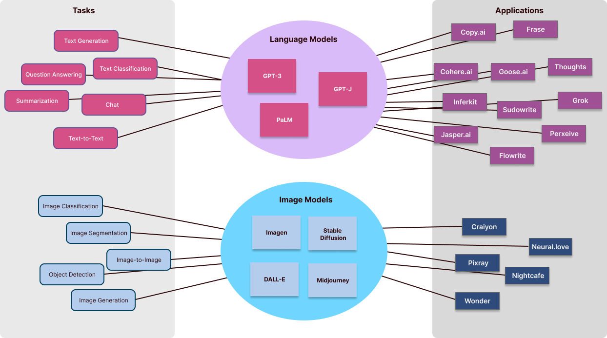
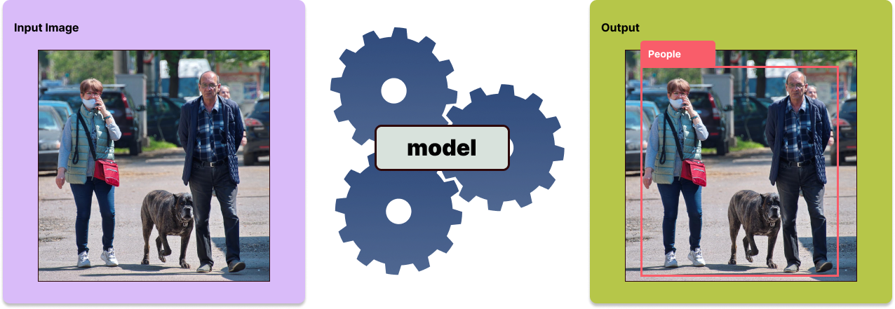
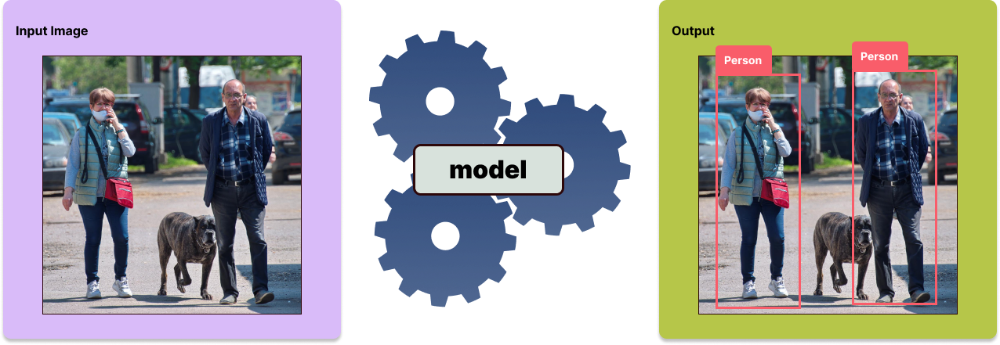
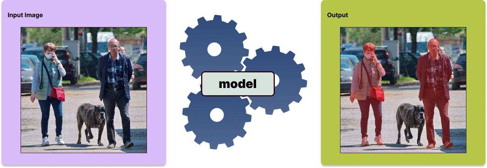
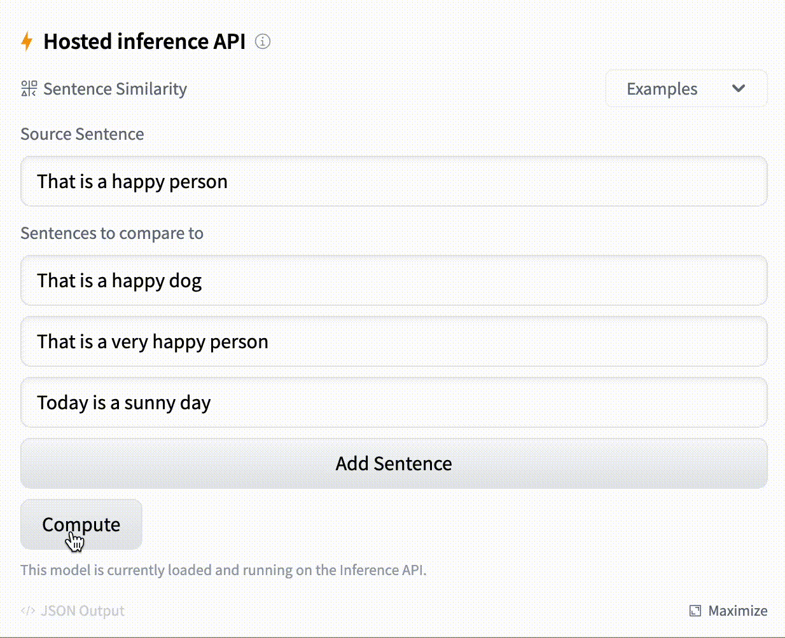
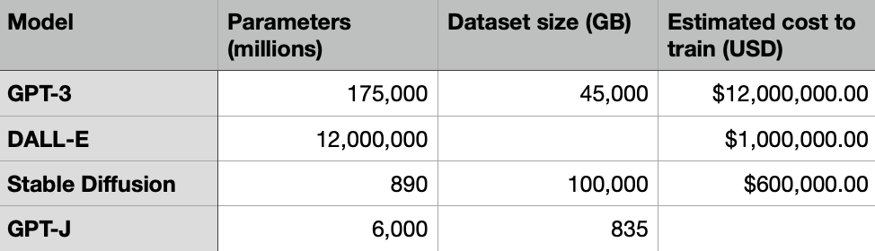

_This is Part 2 of an ongoing series on AI content generation — how and why it works, and how to use the new tools that are coming out. [Part I](https://www.jonstokes.com/p/ai-content-generation-part-1-machine) lays a conceptual foundation for everything discussed in the present article, so be sure and read it if you missed it. Part 3 is a [deep dive into Stable Diffusion](https://www.jonstokes.com/p/getting-started-with-stable-diffusion). Part 4 is a look at [what’s next for AI content generation](https://www.jonstokes.com/p/ai-content-generation-part-4-whats). Subscribe now so you don’t miss any future installments!  

这是正在进行的关于人工智能内容生成系列的第二部分--它是如何和为什么工作的，以及如何使用正在出现的新工具。第一部分为本文所讨论的一切奠定了概念基础，所以如果你错过了，请务必阅读。第三部分是对稳定扩散的深入探讨。第四部分是对人工智能内容生成的下一步的展望。现在就订阅吧，这样你就不会错过任何未来的文章了。_

_If you’re building in any of the spaces I cover in this Substack, then you can [use this form to tell me about it](https://airtable.com/shrypue3MSXxsZEDS) and I may be able to help you get connected with funding.  

如果你正在建设我在这个Substack中所涉及的任何空间，那么你可以使用这个表格告诉我，我可能会帮助你获得资金的连接。_

Despite how fast the machine learning space moves, you can navigate the rapidly shifting terrain if you know what kinds of problems ML researchers are racing to solve.  

尽管机器学习领域的发展速度如此之快，但如果你知道ML研究人员正在竞相解决哪些类型的问题，你就可以在快速变化的地形中找到方向。

-   There’s a constellation of **discrete tasks** that researchers are trying to apply ML to, tasks where the success conditions are pretty well understood and where progress can be easily measured and communicated to potential users.  
    
    研究人员正试图将ML应用于一个离散的任务群，这些任务的成功条件已被很好地理解，其进展可以很容易地被测量并传达给潜在的用户。
    
-   **Large models** are developed, refined, and trained to accomplish one or more of these tasks. They’re then released for public use, either in user-facing product form (Google), as an API (OpenAI), or as open-source software (Stability AI).  
    
    大型模型被开发、完善和训练，以完成一个或多个这样的任务。然后，它们被释放出来供公众使用，或者以面向用户的产品形式（谷歌），作为API（OpenAI），或者作为开源软件（稳定AI）。
    
-   B2B and B2C software developers build **user-facing apps** on top of those models by calling APIs that give them access to the tasks the models can perform.  
    
    B2B和B2C软件开发者通过调用API，在这些模型之上建立面向用户的应用程序，使他们能够访问模型所能执行的任务。
    

Not only are there many different markets for ML, but there are many different kinds of markets — and _all of these markets will be powered by a much smaller number of discrete capabilities that ML researchers will enable_. So if you understand the capabilities and the models, you’ll have a much easier time keeping up with the constant flow of new apps.  

不仅有许多不同的ML市场，而且有许多不同种类的市场--所有这些市场都将由ML研究人员启用的数量少得多的离散能力来驱动。因此，如果你了解这些能力和模型，你将更容易跟上不断涌现的新应用。

The bulk of this article, then, is an overview of ML tasks and models that’s aimed at orienting you to the space and giving you something to refer back to as you explore further on your own. I’ll start by breaking down some of the tasks in that figure above, then we’ll look at the model layer, and finally, I’ll end with pointers to resources for keeping up with the app churn.  

那么，本文的大部分内容是对ML任务和模型的概述，目的是让你了解这个空间的方向，并在你自己进一步探索时给你一些参考。我将从分解上图中的一些任务开始，然后我们将看看模型层，最后，我将指出保持与应用程序的流动有关的资源。

**Contents**:  

内容。

-   Machine learning tasks  
    
    机器学习任务
    
    -   Training vs. inputs  
        
        培训与投入
        
    -   An aside about cognition  
        
        关于认知的一个旁证
        
    -   Interpreting images  
        
        解释图像
        
    -   Transforming and generating images  
        
        变换和生成图像
        
    -   Interpreting text  
        
        解释文本
        
    -   Transforming and generating text  
        
        转化和生成文本
        
-   Getting to know the models  
    
    了解模型
    
    -   GPT-3
        
    -   GPT-J
        
    -   DALL-E 2
        
    -   Stable Diffusion  
        
        稳定的扩散
        

The sections below focus on machine learning tasks that deal with text and images. Once you’ve got these under your belt, it’s pretty easy to understand these same tasks when they’re translated to audio and video. The names and functions are recognizable across domains, so there’s not a lot of need to repeat the material.  

下面的章节重点介绍处理文本和图像的机器学习任务。一旦你掌握了这些，当这些任务被转化为音频和视频时，就很容易理解这些任务。这些名称和功能在各个领域都是可识别的，所以没有太多的必要重复这些材料。

There are some fundamental types of ML tasks we’ll encounter in both images and texts. In the previous article, I put these tasks into three main categories: generation, classification, and transformation. We can expand that task list, though, to make it a bit more granular and descriptive:  

在图像和文本中，我们都会遇到一些基本类型的ML任务。在上一篇文章中，我把这些任务分为三个主要类别：生成、分类和转换。不过，我们可以扩展这个任务列表，使其更加细化和描述性。

1.  **Classifying a whole** thing, e.g., “this sentence expresses a negative feeling,” or “this is a photograph of a natural environment.”  
    
    对整个事物进行分类，例如，"这句话表达了一种消极的感觉"，或者 "这是一张自然环境的照片"。
    
2.  **Classifying part** of a thing, e.g., “this word in this sentence is a noun,” or “this region of pixels contains a tree.”  
    
    对一个事物的一部分进行分类，例如，"这个句子中的这个词是一个名词"，或者 "这个像素区域包含一棵树"。
    
3.  **Comparing two things** to measure sameness/difference, e.g., “this caption does/doesn’t fit with this image.”  
    
    比较两件事情，以衡量相同/不同，例如，"这个标题与这个图像相符/不相符"。
    
4.  **Extracting part** of a thing, e.g., “here’s a sentence from this document that’s an answer to a question,” or “here are all the faces in this photograph.”  
    
    提取一个事物的一部分，例如，"这是这个文件中的一个句子，是一个问题的答案"，或者 "这是这张照片中的所有面孔"。
    
5.  **Transforming** a thing, e.g., “here’s a version of your input text at a lower grade level,” or “here’s a version of your input photograph of Robert De Niro rendered as a My Little Pony character.”  
    
    转化一个东西，例如，"这是你输入的文本的一个较低等级的版本，"或 "这是你输入的罗伯特-德尼罗的照片的一个版本，被渲染成我的小马的角色"。
    
6.  **Generating** a thing, e.g., “here’s the text an informed writer might produce in response to your prompt, or “here’s the image a talented artist might paint in response to your prompt.”  
    
    生成一件事，例如，"这是一个有见识的作家根据你的提示可能产生的文字，或者 "这是一个有才华的艺术家根据你的提示可能画的图像。"
    
7.  **Predicting** a thing, e.g., “here’s the likely next word in this incomplete sentence you just typed,” or “here are the likely pixels that might fill in the gaps in your input image.  
    
    预测一件事，例如，"这是你刚刚输入的这个不完整的句子中可能出现的下一个词"，或者 "这是你输入的图像中可能填补空白的像素。
    

There’s plenty of slippage between the above categories, so it’s best not to get too hung up on putting different tasks into the “correct” one. For instance, text and image generation is actually a flavor of prediction; also, extraction depends on classification, and the distinction between “whole” and “part” can change with context. But generally speaking, the above is a good list of the kinds of things ML does.  

上述类别之间有很多滑移，所以最好不要过于纠结于把不同的任务归入 "正确 "的类别。例如，文本和图像的生成实际上是预测的一种风味；另外，提取取决于分类，而 "整体 "和 "部分 "之间的区别会随着上下文而改变。但一般来说，以上是一个很好的清单，列出了ML所做的各种事情。

We can also split the above list into two even more general categories:  

我们还可以将上述清单分成两个更一般的类别。

-   Numbers 1-4 are about **interpreting** a piece of input to identify, label, classify, and separate things that are the same from things that are different.  
    
    数字1-4是关于解释一块输入物，以识别、标记、分类，并将相同的东西与不同的东西分开。
    
-   Numbers 5-7 are about **generating** a new thing that shares desired similarities with the input thing.  
    
    数字5-7是关于生成一个与输入事物具有所需相似性的新事物。
    

It’s weird the way that you can kind of break down ML tasks into “reading vs. writing,” isn’t it? (Or, at least it’s weird to me.) And just like with reading and writing, the different task categories depend on one another in interesting ways.  

你可以把ML任务分解为 "阅读与写作"，这很奇怪，不是吗？(或者，至少对我来说很奇怪。)就像阅读和写作一样，不同的任务类别以有趣的方式相互依赖。

Another point worth pondering — especially if you’re an AGI skeptic — is the way that for a human to demonstrate an understanding of some phenomenon, topic, text, art, vocational skill, or other object of study, we’d expect them to be able to do some amount of all of the above types of tasks in relation to that object. In other words, in the course of being formally evaluated as a student or apprentice in some area, you’re going to need to do a mix of all six of the above before you’re judged as having mastered the material.   

另一个值得深思的问题--尤其是如果你是一个AGI怀疑论者--是这样的：对于人类来说，要证明对某种现象、话题、文本、艺术、职业技能或其他研究对象的理解，我们会期望他们能够就该对象做一些上述所有类型的任务量。换句话说，在作为某个领域的学生或学徒被正式评估的过程中，你需要做上述所有六种类型的混合，然后才被判定为掌握了材料。

Computers are getting very good at all of the above task types in isolation and in specific contexts. At some point soon, some system somewhere will be very good at all using all six of these task types together in general and novel contexts. Anyway, more on this topic in the “What’s Next?” post I’m working on.  

计算机在孤立的和特定的环境中对上述所有的任务类型都变得非常擅长。不久之后，某个地方的某个系统将非常擅长在一般情况下和新情况下一起使用所有这六种任务类型。总之，在我正在写的 "下一步是什么？"一文中会有更多关于这个主题的内容。

Some types of tasks you’ll encounter in ML will have more than one input. For instance, if you’re comparing and/or contrasting two things, you have to supply both of those things in order for the model to do its work. Or, you may have to supply some additional context along with your original input, e.g., for a question answering model, you’ll supply a question alongside a block of text from which the model can extract the relevant answer.  

你在ML中遇到的某些类型的任务会有一个以上的输入。例如，如果你在比较和/或对比两件事情，你必须提供这两件事情，以使模型完成它的工作。或者，你可能必须在提供原始输入的同时提供一些额外的背景，例如，对于一个问题回答模型，你将提供一个问题和一个文本块，模型可以从中提取相关的答案。

The difference between what models are trained on in the training phase, vs. what inputs we’re asking them to work with in actual use, is one of those things it can be hard to keep straight in your head in your first encounters with machine learning.  

模型在训练阶段的训练与我们在实际使用中要求它们处理的输入之间的区别，是你第一次接触机器学习时很难在头脑中保持清晰的东西之一。

When it comes to the models typically used in AI content generation, one way to keep the difference between inputs and training data straight is to remember the concept of latent space and to think about everything in terms of search.  

谈到通常用于人工智能内容生成的模型，保持输入和训练数据之间差异的一个方法是记住潜在空间的概念，并从搜索的角度考虑一切。

-   **Training** is about building a mathematical representation of a set of relationships between concepts and information out there in the real world (whatever that is).  
    
    训练是关于在现实世界中的概念和信息之间建立一套数学表示方法（不管那是什么）。
    
-   **Inputs** are about locating one or more regions in latent space and then asking:  
    
    输入是指在潜在空间中定位一个或多个区域，然后询问。
    
    -   _For a single input_ we can ask: What information does this point in latent space represent, or what can we find in the vicinity of this point, or what’s opposite to it? (_I.e., generation, transformation, and prediction tasks_.)  
        
        对于一个单一的输入，我们可以问：这个潜伏空间的点代表什么信息，或者我们可以在这个点的附近找到什么，或者与它相对的是什么？(即生成、转换和预测任务。)
        
    -   _For multiple inputs_ we can ask one or more of:  
        
        对于多个输入，我们可以问一个或多个问题。
        
        -   How far apart or close together are these points in latent space? (_I.e., classification and extraction tasks._)  
            
            这些点在潜在空间中相距多远或相近？(即分类和提取任务。)
            
        -   What’s at the midpoint between these points, or what’s adjacent to them? (_I.e., generation, prediction, and transformation tasks._)  
            
            在这些点之间的中点是什么，或者与它们相邻的是什么？(即生成、预测和转换任务。)
            

You can see in the list above that I’ve framed all six of the task types from the first section as searches of latent space for one or more points, and as I said above we humans use all of them together to demonstrate mastery of a domain of study or endeavor. Probably nothing, right?  

你可以在上面的列表中看到，我把第一节中的所有六种任务类型都框定为对一个或多个点的潜在空间的搜索，正如我上面所说的，我们人类把所有这些任务放在一起，以证明对某个研究领域或努力的掌握。可能什么都没有，对吗？

I think the source of the aforementioned confusion when it comes to training vs. inputs is that we humans don’t really experience learning as a thing you do all at once and that’s separate from applying what you’ve learned. We do go through periods of intensive study in different domains, but these mainly just prepare us to be more efficient absorbers of new knowledge and insights when we actually set out to apply whatever we spent time studying for.  

我认为，当谈到培训与投入时，上述困惑的来源是，我们人类并没有真正体验到学习是一件你一下子就能做到的事情，这与应用你所学的东西是分开的。我们确实经历了不同领域的强化学习阶段，但这些主要是为我们做好准备，以便在我们真正着手应用我们花时间学习的东西时，能够更有效地吸收新知识和见解。

In this respect, the current generation of machine learning models are almost more like athletes than they are like scholars — they’re jocks, not nerds. They train and train and train to do a specific thing, then they go out and do the thing in a setting where their performance is measured. The faster and more accurately they do the thing they’ve trained for, the better we say they are. And the slower and sloppier they are at doing the thing, the more training we say they need.  

在这方面，目前这一代的机器学习模型几乎更像运动员，而不是学者--他们是运动员，而不是书呆子。他们为了做一件特定的事情而不断训练，然后他们出去做这件事，在一个环境中，他们的表现被衡量。他们做的事情越快、越准确，我们就说他们越好。而他们在做这件事时越慢、越草率，我们就说他们需要更多的训练。

Given that the Greek root of the words “scholar” and “school” is _skohle_, which means “leisure, spare time, idleness, ease” — basically the opposite of “training” — I don’t think we’ll have an artificially intelligent scholar until we’ve devised a way for the models to be bored in a productive way. At some point on the way to AGI, there will have to be a conversation that goes like:  

鉴于 "学者 "和 "学校 "这两个词的希腊语词根是skohle，意思是 "休闲、闲暇、闲散、轻松"--基本上与 "训练 "相反--我认为在我们设计出一种方法让模型以富有成效的方式感到无聊之前，我们不会有一个人工智能学者。在通往AGI的道路上的某个时刻，将不得不进行这样的对话。

Boss: “Why did this machine’s energy use just spike? I don’t see any inputs or outputs.”  

老板："为什么这台机器的能源使用量刚刚飙升？我没有看到任何输入或输出。"

Researcher: “I have no idea what it’s doing, or if anything concrete will come out of this session. Hopefully, it’s figuring something out and not just wasting electricity!”  

研究员："我不知道它在做什么，也不知道这次会议是否会有什么具体成果。希望它是在搞清楚一些事情，而不是在浪费电！"

At the root of all the things we do with machine learning and images — from smart Photoshop plug-ins to steering self-driving cars — are three basic functions, listed below in ascending order of how hard and specific they are:  

我们用机器学习和图像做的所有事情--从智能Photoshop插件到驾驶自动驾驶汽车--的根源是三个基本功能，下面按照它们的难度和具体程度依次列出。

1.  Image classification  
    
    图像分类
    
2.  Object detection  
    
    物体检测
    
3.  Image segmentation  
    
    图像分割
    

**Image classification** is the easiest to implement because you only need to train the model to tell what’s in the image. For example, we could pretty easily build a simple image classifier to sort the contents of our personal photo library into one of three buckets — animal, vegetable, or mineral — by training a neural network on photos tagged with one of the three categories.  

图像分类是最容易实现的，因为你只需要训练模型来分辨图像中的内容。例如，我们可以很容易地建立一个简单的图像分类器，通过对标记为三个类别之一的照片进行神经网络训练，将我们的个人照片库的内容分为三个桶--动物、蔬菜或矿物。

Image classification use cases include:  

图像分类用例包括。

-   Detecting tissue anomalies and other signs of ill health in medical images.  
    
    检测医疗图像中的组织异常和其他不健康的迹象。
    
-   Locating geographic features in satellite imagery for agricultural or military purposes.  
    
    为农业或军事目的在卫星图像中定位地理特征。
    

But what about photographs with more than one type of thing in them? For such images, models trained to do **object detection** can tell us about the different objects depicted in the image and even draw simple bounding boxes around them. You’d use object detection to break apart a street scene into cars, people, and landscape features, for purposes of doing surveillance or building a self-driving car.  

但是，如果照片里有不止一种类型的东西呢？对于这样的图像，经过训练的物体检测模型可以告诉我们图像中描述的不同物体，甚至在它们周围画出简单的边界框。你可以用物体检测将一个街道场景分解为汽车、人和景观特征，以便进行监控或建造一辆自动驾驶汽车。

Object detection use-cases include:  

物体检测的用例包括。

-   Labeling or tagging photographs in a personal photo library  
    
    在个人照片库中给照片贴上标签或标记
    
-   Visual navigation system for a robot or self-driving vehicle  
    
    机器人或自动驾驶汽车的视觉导航系统
    
-   Generating text descriptions of the contents of images for the visually impaired  
    
    为视力障碍者生成图像内容的文字描述
    

**Image segmentation** is essentially a finer-grained version of object detection, where instead of drawing crude bounding boxes around the objects in the image and then enumerating them, the model actually classifies all the pixels according to what type of object they belong to.  

图像分割本质上是物体检测的细粒度版本，它不是在图像中的物体周围绘制粗糙的边界框，然后对它们进行列举，而是根据它们属于哪种类型的物体，对所有的像素进行分类。

Image segmentation use-cases include:  

图像分割的用例包括。

-   Photo editing, where you want to select an object in order to remove or manipulate it.  
    
    照片编辑，你想选择一个对象，以便删除或处理它。
    
-   Chroma keying (i.e., shooting video in front of a green screen, then swapping backgrounds).   
    
    色度抠像（即在绿色屏幕前拍摄视频，然后调换背景）。
    

In practice, different types of ML-powered content generation and manipulation tools will use one or more of these three capabilities, depending on the type of task you’re performing with them. It may not even be clear which capability is being used, since there’s plenty of overlap between each of these tasks.  

在实践中，不同类型的由ML驱动的内容生成和操作工具将使用这三种能力中的一种或多种，这取决于你用它们执行的任务类型。甚至可能不清楚正在使用哪种能力，因为这些任务之间有很多重叠。

In the previous article, we covered the theory behind how AI image generation tools like Stable Diffusion work, and you learned that image generation and image-to-image transformation are simply two variants of the same functionality.  

在上一篇文章中，我们介绍了像稳定扩散这样的AI图像生成工具的工作原理，你了解到图像生成和图像到图像的转换只是同一功能的两个变种。

To recap, **image generation** models take in a text prompt and create a new image based on it by searching the model’s latent space.  

简而言之，图像生成模型接受一个文本提示，并通过搜索模型的潜在空间在此基础上创建一个新图像。

Image generation use cases include:  

图像生成的用例包括。

-   Creating new artwork for articles, stories, and games from sketches and existing artwork  
    
    根据草图和现有的艺术作品为文章、故事和游戏创造新的艺术作品
    
-   Generation of keyframes for animation or other types of video  
    
    为动画或其他类型的视频生成关键帧
    

The best way to understand **image-to-image generation** is to watch someone do it:  

了解图像到图像生成的最好方法是看别人做。

<iframe src="https://www.youtube-nocookie.com/embed/Y4KpZjlmfFI?start=24&amp;rel=0&amp;autoplay=0&amp;showinfo=0&amp;enablejsapi=0" frameborder="0" loading="lazy" gesture="media" allow="autoplay; fullscreen" allowautoplay="true" allowfullscreen="true" width="728" height="409" data-immersive-translate-effect="1"></iframe>

Image-to-image use cases include:  

图像到图像的用例包括。

-   Quickly turning crude drawings into fully realized images  
    
    迅速将粗糙的图画变成完全实现的图像
    
-   “Spinning” a copyrighted (and even watermarked) image so that you get a royalty-free version.  
    
    "旋转 "受版权保护的（甚至是有水印的）图像，这样你就能得到一个免版税的版本。
    

Alongside computer vision, natural language processing (NLP) represents one of the oldest families of problems in AI. Early AI pioneers initially thought many NLP tasks would be solved pretty quickly, but they vastly underestimated how hard language is to work with and how closely tied to Big Questions of consciousness and mind language problems are.  

与计算机视觉一样，自然语言处理（NLP）代表了人工智能中最古老的问题系列之一。早期的人工智能先驱们最初认为许多NLP任务会很快得到解决，但他们大大低估了语言是多么难处理，以及语言问题与意识和心灵的大问题是多么密切相关。

> _**Note:**_ _Many of the example images and animated GIFs in the sections below were generated using [Hugging Face](https://huggingface.co/), which is a great site for exploring different models and tasks._  
> 
> 注：以下各节中的许多示例图像和GIF动画都是用Hugging Face生成的，这是一个探索不同模型和任务的伟大网站。

**Text classification** is about analyzing a text and assigning relevant labels to it, exactly like image classification does with images. Social media platforms use text classification to determine if a post constitutes harassment or spam. Financial firms use text classification to perform sentiment analysis on news reports and social media posts, to anticipate how the market might respond to a new development like a product release or an earnings report.  

文本分类是指分析文本并为其分配相关标签，就像图像分类对图像所做的那样。社交媒体平台使用文本分类来确定一个帖子是否构成骚扰或垃圾邮件。金融公司使用文本分类来对新闻报道和社交媒体帖子进行情感分析，以预测市场可能对产品发布或收益报告等新发展做出的反应。

If you’re using Gmail, then you’re already making heavy use of text classification models.  

如果你在使用Gmail，那么你已经在大量使用文本分类模型了。

**Sentence similarity** is a task where the model tries to determine how similar (and different) a given input sentence is from one or more other input sentences.  

句子相似性是一项任务，模型试图确定一个给定的输入句子与一个或多个其他输入句子的相似（和不同）程度。

Text transformation and generation works largely the same way that image transformation and generation work, and in some cases the same model can actually be trained to work with either type of input (i.e., pixels or words).  

文本转换和生成的工作方式与图像转换和生成的工作方式大体相同，在某些情况下，同一个模型实际上可以被训练成与两种输入类型（即像素或文字）一起工作。

**Text generation** is what you’re here for, no doubt — the automated creation of original texts from short prompts.  

毫无疑问，文本生成是你在这里的目的--根据简短的提示自动创建原始文本。

**Translating** from one language to another is one of the earliest uses for NLP, and it’s still a very hard problem with plenty of parts left to solve. I go into some of the lasting difficulties in [this article on machine translation](https://www.jonstokes.com/p/the-politics-of-machine-translation). In a nutshell, translation has so many subtleties that are so intimately tied to deep problems in knowledge, language, and consciousness that we’ll probably always be working on it in some form or another.  

从一种语言到另一种语言的翻译是NLP最早的用途之一，而且它仍然是一个非常困难的问题，还有很多部分需要解决。我在这篇关于机器翻译的文章中谈到了一些持久的困难。总而言之，翻译有许多微妙之处，与知识、语言和意识方面的深层问题密切相关，我们可能会一直以某种形式研究它。

**Summarization** is an area where language models have made great progress. Texts can be capably summarized by current-gen models, their core concepts and ideas distilled down into a readable text that’s targeted at a specific difficulty level.  

归纳是语言模型取得巨大进展的一个领域。文本可以被当前的模型很好地总结出来，其核心概念和想法被提炼成针对特定难度的可读文本。

**Text-to-text generation** is essentially the same as the image-to-image capability described above. Such models are already finding use as “article spinners,” where “spinning” is SEO-speak for rewriting someone else’s content so that it smells original to Google.   

文本到文本的生成本质上与上述的图像到图像的能力相同。这样的模型已经被用作 "文章旋转器"，其中 "旋转 "是SEO术语，即改写别人的内容，使其在谷歌看来是原创的。

I used the article rewriter tool at copymatic.ai to rewrite this section.  

我使用copymatic.ai的文章改写工具来改写这一部分。

We can also use text-to-text generation to change the difficulty level of the language used in a piece of text, for instance, to make it more accessible to the cognitively impaired. But who are we kidding with this — the vast majority of use cases are going to involve article spinning for SEO and marketing.  

我们还可以使用文本到文本的生成来改变一篇文章中使用的语言的难度，例如，使其更容易被认知障碍者接受。但是，我们用这个来骗谁呢--绝大多数的用例都会涉及到为SEO和营销而进行的文章旋转。

**Conversational models** are currently in widespread use in chatbots of the kind that pop up when you visit a site for the first time and ask you if you need any help. The performance of these chat models will continue to improve, especially on narrowly defined domain-specific topics, so that they’ll ultimately replace quite a bit of the helpdesk and support workload in many markets.  

对话模型目前在聊天机器人中得到了广泛的应用，当您第一次访问一个网站时就会跳出来问您是否需要任何帮助。这些聊天模型的性能将继续提高，特别是在狭义的特定领域主题上，因此它们最终会在许多市场上取代相当多的服务台和支持工作量。

**Question answering** is often [used alongside](https://machinelearning.apple.com/research/open-domain-question-answering-goes-conversational) conversational models in a product support context, but it’s a separate task. Specifically, this task involves examining a corpus and extracting question/answer pairs. A conversational chatbot can then use the output of these models to recognize questions and surface the correct answer for users.  

在产品支持的背景下，问题回答经常与对话模型一起使用，但这是一个独立的任务。具体来说，这项任务涉及检查语料库并提取问题/答案对。然后，对话式聊天机器人可以使用这些模型的输出来识别问题并为用户提供正确的答案。

**Named entity recognition** is the textual version of the object detection described above, where words in a block of input text are tagged with terms like “person,” “animal,” “time,” “corporation,” etc. Many models are so good at NER now that they can exceed human performance.  

命名实体识别是上述对象检测的文本版本，在一个输入文本块中的词被标记为 "人"、"动物"、"时间"、"公司 "等术语。现在，许多模型在NER方面非常出色，它们可以超过人类的表现。

One of the reasons the main section in the middle of that diagram at the beginning of this article — the part showing the models themselves — is so centralized relative to the regions on either side of it, is that it costs a lot of money to train a large model with billions of parameters. (**Note:** That middle part is by no means a comprehensive list of models; I just put some of the main ones in there.)  

本文开头那张图中间的主要部分--显示模型本身的部分--相对于它两侧的区域来说是如此集中的原因之一是，训练一个拥有数十亿参数的大型模型需要花费大量资金。(注：中间部分绝不是一个全面的模型列表；我只是把一些主要的模型放在那里）。

Because of the way performance in ML seems to scale with the number of parameters and the size of the dataset, bigger is going to be better for the foreseeable future. This means a handful of massive, expensive models with a constrained set of capabilities will lie behind the massive, constantly churning ecosystem of user-facing apps.  

由于ML的性能似乎随着参数的数量和数据集的大小而扩展，在可预见的未来，更大的将会更好。这意味着，在面向用户的应用程序的庞大、不断变化的生态系统背后，将有少数大规模、昂贵的模型，其能力受到限制。

To be clear: it’s expensive to _train_ these models, but once they’re trained then they’re an order of magnitude less expensive to _run_. Take Stable Diffusion as an example. It cost about $600K to train it, but you can run it on a decent gaming PC or a good laptop.   

说白了：训练这些模型的成本很高，但一旦训练好了，它们的运行成本就会降低一个数量级。以 "稳定扩散 "为例。训练它的成本约为60万美元，但你可以在一台体面的游戏电脑或一台好的笔记本电脑上运行它。

If you have better data or can fill in the missing gaps in the above, please get in touch with me. Some of these numbers aren’t public and are estimates.  

如果你有更好的数据，或能填补上述缺失的空白，请与我联系。其中一些数字并不公开，是估计值。

So while a certain amount of centralization is inevitable when it comes to training, using the trained models and even tweaking the weights to incorporate new training data is increasingly something anyone with a good GPU can do. But for now, we’re still in the era of model centralization.  

因此，虽然在训练时，一定程度的集中化是不可避免的，但使用训练好的模型，甚至调整权重以纳入新的训练数据，越来越多的人只要有一个好的GPU就能做到。但现在，我们仍然处于模型集中化的时代。

[GPT-3](https://beta.openai.com/docs/models/gpt-3) was the first large language model (LLM) to really shock many AI skeptics by delivering on some of the machine learning hype in an undeniable way. My own “shocked by GPT-3” story is that when it was announced, I read a really solid essay on how it worked and some philosophical issues with it, and it was some six months before I learned that that essay had itself been written by GPT-3.  

GPT-3是第一个大型语言模型（LLM），它以一种不可否认的方式实现了一些机器学习的炒作，真正震惊了许多人工智能的怀疑者。我自己的 "被GPT-3震惊 "的故事是，当它被宣布时，我读了一篇关于它如何工作和一些哲学问题的真正可靠的文章，大约六个月后我才知道那篇文章本身就是由GPT-3写的。

When GPT-3’s predecessor, [GPT-2](https://github.com/openai/gpt-2), was released in early 2019, the technology was still obviously deficient but also pretty promising. Watching GPT-2 go was kind of like watching a dog ride a surfboard — surprising and cute, but that’s mostly it. Based on our experience with GPT-2, I don’t think many of us were really prepared for the magnitude of the jump in output quality that GPT-3 was capable of. It was almost like a state change had taken place, like the jump from water to ice — something qualitatively different had happened.  

当GPT-3的前身GPT-2 ，在2019年初发布时，该技术显然仍有缺陷，但也相当有希望。看GPT-2的过程有点像看一只狗骑在冲浪板上--令人惊讶和可爱，但主要就是这样。基于我们对GPT-2的经验，我认为我们中的许多人对GPT-3在输出质量方面的跳跃幅度没有真正的准备。这几乎就像发生了一个状态变化，就像从水到冰的跳跃--发生了一些质的不同。

So what was **GPT-3’s big innovation** that somehow hoisted OpenAI’s LLMs from the realm of “yeah, neat trick” to “omg it’s a better writer than many undergrads”? In a word, scale. The OpenAI team took the basic architecture they’d been working with since the original GPT and turned up the number of parameters from GPT-2’s 1.5 billion to a whopping 175 billion.  

那么，GPT-3的重大创新是什么，它以某种方式将OpenAI的法律硕士从 "是啊，整洁的技巧 "的领域提升到 "OMG它是一个比许多本科生更好的作家"？一句话，规模。OpenAI团队采用了他们从最初的GPT开始工作的基本架构，并将参数数量从GPT-2的15亿提高到了惊人的1750亿。

There are four different versions of GPT-3 available, each at a different size and cost level and codenamed after different historical figures. In ascending order of size and cost to use, these versions are:  

有四个不同版本的GPT-3，每个版本都有不同的尺寸和成本水平，并以不同的历史人物命名。按照尺寸和使用成本的递增顺序，这些版本是。

-   GPT-3 Ada at 2.7 billion parameters  
    
    GPT-3 Ada的27亿个参数
    
-   GPT-3 Babbage at 6.7 billion parameters  
    
    GPT-3巴贝奇在67亿的参数下
    
-   GPT-3 Curie at 13 billion parameters  
    
    GPT-3居里在130亿参数下
    
-   GPT-3 Davinci at 175 billion parameters  
    
    GPT-3 Davinci在1750亿的参数下
    

The vast majority of the popular AI-powered content apps out there, in every vertical from marketing to SEO to content planning, are using GPT-3 under the hood. If you see an app doing text generation from prompts, it’s usually safe to assume it’s GPT-3-powered unless you find out otherwise. A specialized version of GPT-3, Codex, is also behind the popular code generation tool [GitHub Copilot](https://github.com/features/copilot).  

绝大多数流行的人工智能内容应用程序，从营销到SEO到内容规划的每个垂直领域，都在引擎盖下使用GPT-3。如果你看到一个应用程序从提示中生成文本，通常可以安全地认为它是由GPT-3驱动的，除非你发现其他情况。GPT-3的一个专门版本Codex，也是流行的代码生成工具GitHub Copilot的背后。

**Stats**:

-   _Company_: [OpenAI](https://openai.com/)  
    
    公司。 兴业银行
    
-   _Launched_: June 2020  
    
    推出。2020年6月
    
-   _Parameters_: 175 billion  
    
    参数。1750亿
    
-   _Training datasets_: [Common Crawl](https://commoncrawl.org/), [Wikipedia](https://wikipedia.org/), proprietary datasets  
    
    训练数据集。常见的抓取，维基百科，专有数据集
    

**Capabilities**:  

能力。

-   Text generation  
    
    文本生成
    
-   Summarization  
    
    归纳总结
    
-   Named entity recognition  
    
    命名实体识别
    
-   Translation  
    
    翻译
    

**Read more**:  

阅读更多。

-   [Model card  
    
    模型卡](https://github.com/openai/gpt-3/blob/master/model-card.md)
    
-   [Language Models are Few-Shot Learners  
    
    语言模型是少数的学习者](https://arxiv.org/abs/2005.14165)
    
-   [OpenAI’s GPT-3 vs. Open Source Alternatives  
    
    OpenAI的GPT-3与开源替代品的比较](https://www.ankursnewsletter.com/p/openais-gpt-3-vs-open-source-alternatives)
    
-   [EleutherAI’s GPT-J vs OpenAI’s GPT-3  
    
    EleutherAI的GPT-J vs OpenAI的GPT-3](https://analyticsindiamag.com/eleutherais-gpt-j-vs-openais-gpt-3/)
    

[GPT-J](https://github.com/kingoflolz/mesh-transformer-jax/#gpt-j-6b) is an alternative to GPT-3 that’s **important because** **it’s open-source**. Because access to GPT-3 is tightly controlled by OpenAI (this is done in the name of “safety”), we can expect to see more such open alternatives in the future.  

GPT-J是GPT-3的一个替代品，它的重要性在于它是开源的。由于对GPT-3的访问受到OpenAI的严格控制（这是以 "安全 "的名义进行的），我们可以期待在未来看到更多这样的开放替代方案。

This model works about as well as earlier, smaller versions of GPT-3, but still can’t quite keep up with the leading edge, yet.   

这个模型的效果和早期的小型GPT-3版本差不多，但仍然不能完全跟上领先的步伐，还没有。

**Stats**:

-   _Company_: [EleutherAI](https://www.eleuther.ai/)  
    
    公司。 兴业银行
    
-   _Launched_: June 2021  
    
    推出。2021年6月
    
-   _Parameters_: 6 billion  
    
    参数。60亿
    
-   _Training dataset_: The Pile  
    
    训练数据集。痔疮
    

**Capabilities**:  

能力。

-   Text generation  
    
    文本生成
    
-   Summarization  
    
    归纳总结
    
-   Named entity recognition  
    
    命名实体识别
    
-   Translation  
    
    翻译
    
-   Code generation  
    
    代码生成
    

[DALL-E 2](https://openai.com/dall-e-2/) is the latest and most advanced AI image generation model from OpenAI. Right now, its performance on prompts is leading the pack, but of course, that could change by the time you read this. (Have I mentioned this space moves fast?)  

DALL-E 2是OpenAI最新和最先进的AI图像生成模型。现在，它在提示方面的表现处于领先地位，但当然，当你读到这篇文章时，这可能会发生变化。(我有没有提到这个领域的发展速度？）

DALL-E 2’s predecessor, the 12-billion parameter [DALL-E](https://openai.com/blog/dall-e/), was built on essentially the same architecture as GPT-3, but it was trained on a combination of pixels and text. DALL-E 2 introduced a different, more complex architecture that enabled it to reduce the number of parameters while increasing performance.  

DALL-E 2的前身，120亿个参数的DALL-E，基本上建立在与GPT-3相同的架构上，但它是在像素和文本的组合上进行训练。DALL-E 2引入了一个不同的、更复杂的架构，使其能够在提高性能的同时减少参数的数量。

Internally, DALL-E 2 actually makes use of two main components:  

在内部，DALL-E 2实际上利用了两个主要部分。

-   **CLIP**: A fairly straightforward comparative model that was [actually introduced](https://openai.com/blog/clip/) at the same time as the original DALL-E and that’s trained to do the simple job of comparing an input image with an input text caption and measuring how well the image and caption fit with one another.  
    
    剪辑：一个相当直接的比较模型，实际上是与最初的《达利》同时推出的，它被训练来做一个简单的工作，即比较一个输入的图像和一个输入的文字说明，并衡量图像和说明彼此之间的契合程度。
    
-   **unCLIP**: A module consisting of a pair of submodels that work together to effectively pull stored image attributes back out of CLIP’s latent space and turn them into images:  
    
    unCLIP：一个由一对子模型组成的模块，它们一起工作，有效地将存储的图像属性从CLIP的潜在空间中拉回来，并将它们变成图像。
    
    -   A **prior model** that’s trained to convert an input text prompt to an image location in the CLIP model’s latent space.  
        
        一个经过训练的先验模型，将输入的文本提示转换成CLIP模型潜在空间中的图像位置。
        
    -   A **decoder model** that uses a technique called **diffusion** to convert into an image the point in CLIP’s latent space that the prior model located.  
        
        一个解码器模型，使用一种叫做扩散的技术，将先前模型所定位的CLIP潜伏空间中的点转换为图像。
        

When you use DALL-E 2 for image generation, you enter a text prompt into a text encoder that then feeds the encoded text into the prior model. The prior finds an _image embedding_ that’s located near the text prompt in the CLIP model’s latent space (an _embedding_ is a sequence of numbers that are the coordinates for a location in latent space). This image embedding is fed into the decoder model, which produces an output image.  

当你使用DALL-E 2生成图像时，你将一个文本提示输入一个文本编码器，然后将编码后的文本送入先前模型。先验模型在CLIP模型的潜伏空间中找到一个位于文本提示附近的图像嵌入（嵌入是一串数字，是潜伏空间中一个位置的坐标）。这个图像嵌入被送入解码器模型，它产生一个输出图像。

If you didn’t understand any of the above, I’ll try to boil it down using terms introduced in the previous article.  

如果你对上述内容不理解，我将尝试用上一篇文章中介绍的术语将其归纳出来。

CLIP has been trained on image + caption pairs so that when used by itself it can accurately score how well different captions fit with an image. Image source: [OpenAI](https://openai.com/blog/clip/).  

CLIP已经在图像+标题对上进行了训练，所以当它自己使用时，可以准确地对不同的标题与图像的配合程度进行评分。图片来源。 OpenAI .

The CLIP model has a latent space that represents abstract knowledge about text and images, and the relationships between different features and concepts — just like we talked about in the previous article. In fact, imagine that CLIP’s latent space is a kind of brain matter that contains learned knowledge about concepts like “dog,” “swimsuit,” “birthday cake,” “above,” “below,” “wearing,” and so on, and can relate those concepts to one another both visually and textually (because it was trained to relate images to captions).  

CLIP模型有一个潜在的空间，代表了关于文本和图像的抽象知识，以及不同特征和概念之间的关系--就像我们在上一篇文章中谈到的。事实上，想象一下，CLIP的潜空间是一种脑物质，它包含了关于 "狗"、"泳装"、"生日蛋糕"、"上面"、"下面"、"穿着 "等概念的学习知识，并能在视觉上和文本上将这些概念相互联系起来（因为它被训练为将图像与说明联系起来）。

**DALL-E 2’s special trick** is that has a submodel (the decoder) that’s trained to take as input a set of coordinates in the fully trained CLIP model’s latent space and turn those coordinates into pictures that represent that region of CLIP’s latent space in some meaningful way.  

DALL-E 2的特殊技巧是，它有一个子模型（解码器），它被训练成在完全训练好的CLIP模型的潜空间中接受一组坐标作为输入，并把这些坐标变成图片，以某种有意义的方式代表CLIP潜空间的那个区域。

So in a way, DALL-E 2 consists of one model (CLIP) that knows how images and words fit together and understands the relationships among abstract concepts drawn from both texts and images, and a second, “mind-reading” pair of models (unCLIP) that can use a text prompt to turn a region of that original model’s “memory” into an image that more or less visually represents what’s in that region that was located by the text prompt.  

因此在某种程度上，DALL-E 2由一个模型（CLIP）和另一个 "读心 "的模型（unCLIP）组成，前者知道图像和文字是如何结合在一起的，并理解从文本和图像中得出的抽象概念之间的关系，后者可以利用文本提示将该原始模型 "记忆 "中的一个区域变成图像，或多或少直观地代表文本提示定位的那个区域中的内容。

One advantage of training DALL-E 2 to generate images from the image embeddings of a pre-trained model, is that such embeddings are a lot less computationally expensive to train on than the compressed pixel representations used by DALL-E. This boost in efficiency is probably a big reason why DALL-E 2 is rumored to have almost 3.5 times fewer parameters than DALL-E yet gives better results than its larger predecessor.  

训练DALL-E 2从预先训练好的模型的图像嵌入生成图像的一个好处是，这种嵌入比DALL-E使用的压缩像素表示的计算成本低得多。这种效率的提升可能是DALL-E 2据传比DALL-E少了3.5倍的参数，但却比其较大的前辈有更好的结果的一个重要原因。

**Stats**:

-   _Company_: [OpenAI](https://openai.com/)  
    
    公司。 兴业银行
    
-   _Launched_: January 2021  
    
    推出。2021年1月
    
-   _Parameters_: Speculated to be 3.5 billion, though no numbers have been released. (Compare 12 billion for DALL-E.)  
    
    参数。推测为35亿，尽管没有公布数字。(相比之下，《DALL-E》为120亿。）
    
-   _Training dataset_: Proprietary  
    
    训练数据集。专有的
    

**Capabilities**:  

能力。

-   Image generation from a text prompt.  
    
    根据文本提示生成图像。
    
-   Image transformation (i.e., blending a pair of input images, or producing variations on an input image).  
    
    图像转换（即混合一对输入图像，或产生输入图像的变化）。
    
-   Inpainting (i.e., modifying specific features or aspects of an image based on a text prompt).  
    
    绘画（即根据文本提示修改图像的特定特征或方面）。
    

**Read more**:  

阅读更多。

-   [Hierarchical Text-Conditional Image Generation with CLIP Latents  
    
    使用CLIP潜望镜的分层文本条件的图像生成](https://arxiv.org/abs/2204.06125)
    
-   [How DALL-E 2 Actually Works  
    
    DALL-E 2实际上是如何工作的](https://www.assemblyai.com/blog/how-dall-e-2-actually-works/)
    
-   [CLIP: Connecting Text and Images  
    
    剪辑：连接文本和图像](https://openai.com/blog/clip/)
    

[Stable Diffusion](https://stability.ai/blog/stable-diffusion-public-release) is a diffusion-based image generator that works on some of the same principles as DALL-E 2’s diffusion-based prior and decoder models described above, but its explicit goal is to democratize access to AI tools and enable an era of **decentralized AI**. (Much, much more to come in this newsletter on the topic of decentralized AI, so stay tuned.)  

稳定扩散是一个基于扩散的图像生成器，其工作原理与上述DALL-E 2的基于扩散的先验和解码器模型相同，但其明确的目标是使人工智能工具的使用民主化，并实现一个去中心化的人工智能时代。(本通讯中关于去中心化人工智能的话题还有很多很多，敬请关注）。

The Stability AI team has taken two key approaches with Stable Diffusion to further this decentralizing, democratizing agenda:  

稳定的人工智能团队通过稳定扩散采取了两个关键的方法来推进这一去中心化、民主化的议程。

1.  Stable Diffusion’s architecture makes it **less expensive to train** than some prior models like the original DALL-E. (I’m not sure it’s cheaper than DALL-E 2, though, but more on this below.)  
    
    稳定扩散的架构使它的训练成本低于之前的一些模型，如原始的DALL-E。(但我不确定它是否比DALL-E 2便宜，但下面会有更多的内容）。
    
2.  Both the training data and the actual resulting model weights are **open-source** and freely available to the public, which means that not only can anyone run Stable Diffusion locally, but anyone can retrain it or tweak the weights by training it further on new data.  
    
    训练数据和实际产生的模型权重都是开源的，并免费提供给公众，这意味着任何人不仅可以在本地运行稳定扩散，而且可以通过在新数据上进一步训练来重新训练或调整权重。
    

Stable Diffusion has some important similarities to what I’ve described above for DALL-E 2. It first trains an encoder on text-image pairs, then it trains a diffusion-based decoder model to turn image embeddings from the encoder into images. (As near as I can tell, and I’m still getting my mind around how these models work so I’m open to correction, Stable Diffusion is a lot like DALL-E 2 but without the prior model — i.e., if DALL-E 2 just trained the decoder submodel to work on the output from the text encoder.)  

它首先对文本-图像对进行编码训练，然后训练一个基于扩散的解码器模型，将来自编码器的图像嵌入变成图像。(据我所知，我还在思考这些模型是如何工作的，所以我愿意接受纠正，稳定扩散很像DALL-E 2，但没有先前的模型--也就是说，如果DALL-E 2只是训练解码器子模型来处理文本编码器的输出。)

It’s also the case that Stable Diffusion was trained on a specific, [art-focused subset](https://laion.ai/blog/laion-aesthetics/) of the open-source LAION database. This is why it’s so good at generating different types of artistic-looking output, but not quite as good as DALL-E 2 at photorealistic output.  

还有一种情况是，稳定扩散是在开源的LAION数据库的一个特定的、以艺术为重点的子集上训练的。这就是为什么它在生成不同类型的艺术外观输出方面如此出色，但在逼真输出方面却不如《达利》2。

Stable Diffusion’s open-source nature spurred immense **controversy** in some quarters when it was released. For whatever reason, people who couldn’t be bothered to get up in arms about the equally open-source text generator GPT-J got pretty exercised about the potential for Stable Diffusion to put artists out of work, empower perverts, perpetuate societal biases, and so on and so forth.  

Stable Diffusion的开源性质在它发布时在某些方面引起了巨大的争议。不管是什么原因，那些对同样开源的文本生成器GPT-J不屑一顾的人，对《稳定扩散》有可能使艺术家失业、使变态者得逞、使社会偏见永久化，等等等等，都感到相当的不安。

I’ll spend a lot more time on Stable Diffusion, both its architecture and the surrounding controversy, in later articles and podcasts, so stay tuned for all that.  

我将在以后的文章和播客中花更多时间讨论稳定扩散，包括它的结构和周围的争议，所以请继续关注这一切。

Because of Stable Diffusion’s open-source nature, I expect to see its functionality integrated into a lot of apps in the coming weeks and months. As diffusion-powered, locally-run apps and features proliferate, this will drive a fresh wave of demand for CPU and GPU power on the client.  

由于Stable Diffusion的开源性质，我希望在未来几周和几个月内看到它的功能被集成到很多应用程序中。随着由扩散驱动的、本地运行的应用程序和功能激增，这将推动对客户端CPU和GPU能力的新一轮需求。

**Stats**:

-   _Company_: [Stability AI](https://stability.ai/)  
    
    公司。 稳定的AI
    
-   _Launched_: August 2022  
    
    推出。2022年8月
    
-   _Parameters_: 890 million  
    
    参数：8.9亿
    
-   Trained on: An art-focused subset of [LAION 5b](https://laion.ai/blog/laion-aesthetics/)  
    
    训练的对象。以艺术为重点的LAION 5b的子集
    

**Capabilities**:  

能力。

-   Image generation from a text prompt.  
    
    根据文本提示生成图像。
    
-   Image transformation (i.e., blending a pair of input images, or producing variations on an input image).  
    
    图像转换（即混合一对输入图像，或产生输入图像的变化）。
    
-   Inpainting (i.e., modifying specific features or aspects of an image based on a text prompt).  
    
    绘画（即根据文本提示修改图像的特定特征或方面）。
    

**Read more**:  

阅读更多。

-   [Stable Diffusion launch announcement  
    
    稳定扩散 "启动公告](https://stability.ai/blog/stable-diffusion-announcement)
    
-   [High-Resolution Image Synthesis with Latent Diffusion Models  
    
    用潜伏扩散模型进行高分辨率图像合成](https://arxiv.org/abs/2112.10752)
    
-   [How and why Stable Diffusion works for text to image generation  
    
    稳定扩散法如何以及为何适用于文本到图像的生成](https://www.paepper.com/blog/posts/how-and-why-stable-diffusion-works-for-text-to-image-generation/)
    

[Share](https://www.jonstokes.com/p/ai-content-generation-part-2-tasks?utm_source=substack&utm_medium=email&utm_content=share&action=share)
