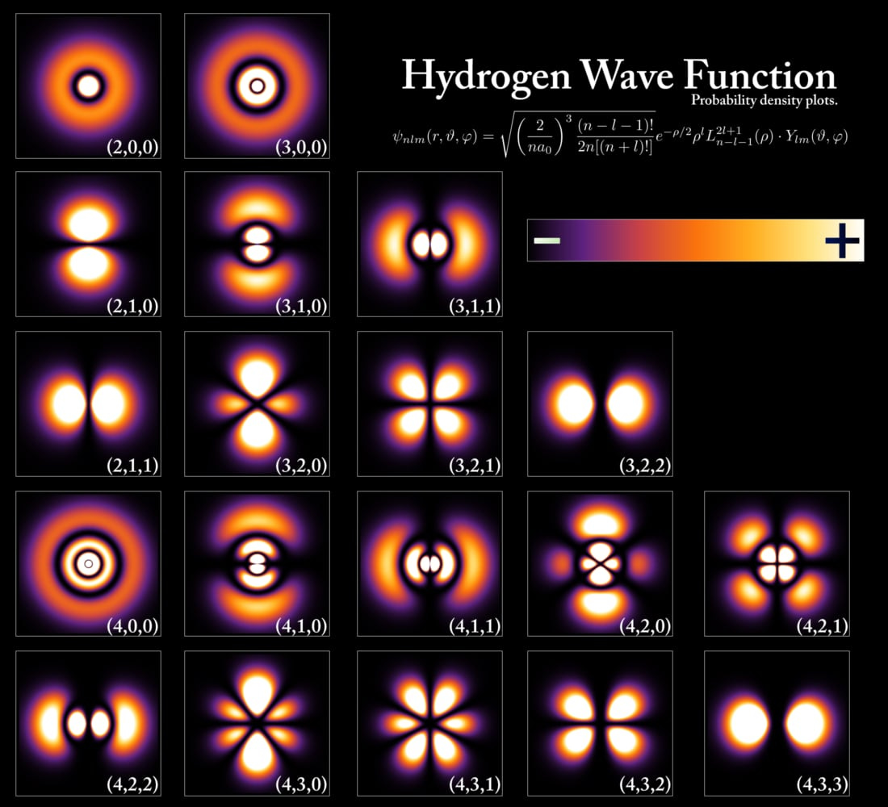
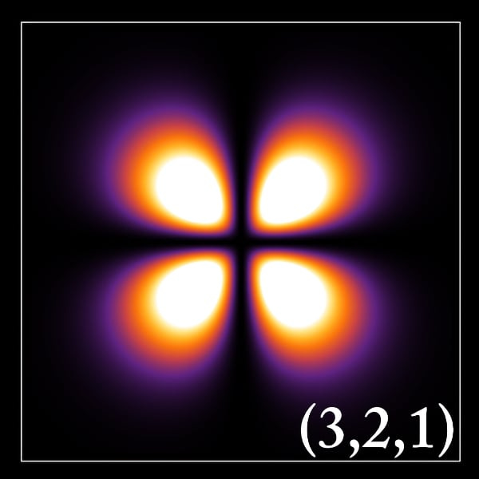

[](https://substackcdn.com/image/fetch/f_auto,q_auto:good,fl_progressive:steep/https%3A%2F%2Fsubstack-post-media.s3.amazonaws.com%2Fpublic%2Fimages%2F6866ca04-5223-46df-82dc-7ac024bc74ab_1664x1152.jpeg)

_**The story so far:** Most of the discussion of ChatGPT I’m seeing from even very smart, tech-savvy people is just not good. In articles and podcasts, people are talking about this chatbot in unhelpful ways. And by “unhelpful ways,” I don’t just mean that they’re anthropomorphizing (though they are doing that). Rather, what I mean is that they’re not working with a practical, productive understanding of what the bot’s main parts are and how they fit together.  

到目前为止的故事。我所看到的大多数关于ChatGPT的讨论，即使是非常聪明、精通技术的人，也不是很好。在文章和播客中，人们都在以无益的方式谈论这个聊天机器人。我所说的 "无益的方式 "并不仅仅是指他们在拟人化（尽管他们正在这样做）。相反，我的意思是，他们在工作中对机器人的主要部分是什么以及它们是如何结合在一起的，没有一个实际的、有成效的理解。_

_To put it another way, there are some [can-opener problems](https://www.jonstokes.com/p/the-can-opener-problem) manifesting in the ChatGPT conversation, and lowering the quality of The Discourse.  

换句话说，有一些开罐器的问题在ChatGPT对话中表现出来，并降低了《论语》的质量。_

_To be clear, I do not know everything I’d like to know about this topic. Like everyone else, including active researchers in machine learning, I’m still on my own journey with getting my head around it at multiple levels. (Speaking of, if you run a shop that sells dedicated ML workstations and would like to publicly sponsor this newsletter by sending me one, do get in touch.)_  

说白了，我并不了解我想知道的关于这个话题的一切。像其他人一样，包括活跃的机器学习研究人员，我仍然在自己的旅程中，在多个层面上对其进行思考。(说到这里，如果你经营一家销售专用ML工作站的商店，并愿意公开赞助本通讯，给我送一台，请联系。) .

_That said, I’m certainly far enough along that I can help others who are a few steps behind. So what follows is my effort to help others get closer to the target in their thinking and writing about this new category of technology.  

也就是说，我当然已经走得够远了，我可以帮助其他落后几步的人。因此，以下是我的努力，以帮助其他人在思考和写作这一新类别的技术时更接近目标。_

At the heart of ChatGPT is a large language model (LLM) that belongs to the family of generative machine learning models. This family also includes [Stable Diffusion](https://www.jonstokes.com/p/getting-started-with-stable-diffusion) and all the other prompt-driven, text-to-whatever models that are daily doing fresh miracles on everyone’s feeds right now.  

ChatGPT的核心是一个大型语言模型（LLM），属于生成式机器学习模型家族。这个家族还包括稳定扩散（Stable Diffusion）和所有其他提示驱动的、从文本到什么的模型，这些模型现在每天都在大家的饲料上创造新鲜的奇迹。

If you want to know more about how generative ML models work and you have some time, read the following pieces:  

如果你想了解更多关于生成性ML模型的工作原理，并且你有一些时间，请阅读以下文章。

-   AI content generation series: [Part 1](https://www.jonstokes.com/p/ai-content-generation-part-1-machine), [Part 2](https://www.jonstokes.com/p/ai-content-generation-part-2-tasks), [Part 4](https://www.jonstokes.com/p/ai-content-generation-part-4-whats)  
    
    AI内容生成系列。 第一部分 , 第二部分 , 第四部分
    
-   [What Does It Mean to “Create” Something With Generative AI?  
    
    用生成性人工智能 "创造 "东西是什么意思？](https://www.jonstokes.com/p/what-does-it-mean-to-create-something)
    
-   [The Hall Monitors Are Winning the AI Wars, Part 1: ChatGPT  
    
    大厅监控器正在赢得人工智能战争，第一部分。聊天室GPT](https://www.jonstokes.com/p/the-hall-monitors-are-winning-the)
    

⭐️ But if you don’t have time to read all that, here’s a **one-sentence explanation of a generative AI model:** _a generative model is a function that can take a structured collection of symbols as input and produce a related structured collection of symbols as output_.  

⭐️ 但如果你没有时间读这些东西，这里有一个关于生成性人工智能模型的一句话解释：生成性模型是一个可以将结构化的符号集合作为输入并产生相关结构化的符号集合作为输出的函数。

[](https://substackcdn.com/image/fetch/f_auto,q_auto:good,fl_progressive:steep/https%3A%2F%2Fsubstack-post-media.s3.amazonaws.com%2Fpublic%2Fimages%2Fbcf9a88e-e597-4868-b49c-f4fe6a08bebe_1000x543.jpeg)

Here are some examples of structured collections of symbols:  

下面是一些符号结构化集合的例子。

-   Letters in a word  
    
    一个词中的字母
    
-   Words in a sentence  
    
    句子中的词语
    
-   Pixels in an image  
    
    图像中的像素
    
-   Frames in a video  
    
    视频中的帧数
    

Now, there are plenty of ways to turn one collection of symbols into another, related collection of symbols — you don’t even need computers to do this. Or, you can write a computer program that uses rules and lookup tables, like a certain [famous chatbot from the 60s](https://return.life/2023/02/please-stop-talking-about-the-eliza-chatbot/) that I’m sick of hearing about.  

现在，有很多方法可以把一个符号集合变成另一个相关的符号集合--你甚至不需要计算机来做这个。或者，你可以写一个使用规则和查找表的计算机程序，就像我听厌了的60年代某个著名的聊天机器人。

👷♂️ The hard and expensive part of the above one-sentence explanation — the part that we’ve only recently hit on how to do using massive amounts of electricity and leading-edge computer chips — is hidden deep inside the word _related_.  

👷♂️ 上述一句话的解释中困难和昂贵的部分--我们最近才打到如何使用大量的电力和领先的计算机芯片来做的部分--深藏在相关这个词里面。

Before we get into relationships, you need two concepts that will come up again and again throughout this piece:  

在我们讨论关系之前，你需要两个概念，这两个概念将在本篇文章中反复出现。

-   **⚙️ Deterministic:** A deterministic process is a process that, given a particular input, will always produce the same output.  
    
    ⚙️ 确定性的。确定性过程是一个过程，给定一个特定的输入，将总是产生相同的输出。
    
-   **🎲 Stochastic:** A stochastic process is a process that, given a particular input, is more likely to produce some outputs and less likely to produce others.  
    
    🎲 随机的。随机过程是一个过程，在特定的输入下，更有可能产生一些输出，而不可能产生其他输出。
    

A classic gumball machine is deterministic — if I insert a quarter and turn the crank, I get a single gumball every time. So one quarter == one gumball, always.  

经典的口香糖机是确定的--如果我插入一个25美分并转动曲柄，我每次都会得到一个口香糖。因此，一个25美分==一个口香糖，总是如此。

But a classic gumball machine is _also_ stochastic — if I put in a quarter and turn the crank, the color of the gumball I’ll get is fundamentally random. Furthermore, the odds of getting one color or another depends on the ratios of different colors inside the machine. Five different gumball machines with five different gumball color ratios will have five different probability distributions for gumball color output.  

但是，经典的口香糖机也是不可思议的--如果我投入25美分并转动曲柄，我将得到的口香糖的颜色从根本上说是随机的。此外，得到一种颜色或另一种颜色的概率取决于机器内不同颜色的比例。五个不同的口香糖机器，有五个不同的口香糖颜色比例，会有五个不同的口香糖颜色输出的概率分布。

Now, with these key concepts out of the way, back to the reason why relationships can be hard.  

现在，随着这些关键概念的提出，回到人际关系可能是困难的原因。

Collections of symbols can be related in different ways, and the more abstract and subtle the relationship, the more technology we’ll need to throw at the problem of capturing that relationship in a way that’s useful for knowledge work.  

符号集合可以以不同的方式联系在一起，关系越是抽象和微妙，我们就需要更多的技术来解决这个问题，以一种对知识工作有用的方式来捕捉这种关系。

1.  If I’m relating the collections `{cat}` and `{at-cay}`, that’s a standard “[Pig Latin](https://en.wikipedia.org/wiki/Pig_Latin)” transformation I can manage with a simple, handwritten rule set.  
    
    如果我把集合 `{cat}` 和 `{at-cay}` 联系起来，这就是一个标准的 "猪拉丁 "转换，我可以用一个简单的、手写的规则集来处理。
    
2.  If I’m relating `{cat}` to `{dog}`, then there are many levels of abstraction on which those two collections can relate.  
    
    如果我把 `{cat}` 和 `{dog}` 联系起来，那么这两个集合可以在很多抽象层次上发生关系。
    
    1.  As ordered symbol collections (sequences), they both have three symbols.  
        
        作为有序的符号集合（序列），它们都有三个符号。
        
    2.  As three-symbol sequences, they’re both words.  
        
        作为三个符号的序列，它们都是单词。
        
    3.  As words, they both refer to biological organisms.  
        
        作为单词，它们都是指生物有机体。
        
    4.  As organisms, they’re both mammals.  
        
        作为生物体，它们都是哺乳动物。
        
    5.  As mammals, they’re both house pets. And so on.  
        
        作为哺乳动物，它们都是家庭宠物。以此类推。
        
3.  If I’m relating `{the cat is alive}` to `{the cat is dead}`, then there’s an even larger number of even more higher-order concepts that we can use to compare and contrast those two sequences of symbols.  
    
    如果我把 `{the cat is alive}` 和 `{the cat is dead}` 联系起来，那么就会有更多更高阶的概念，我们可以用这些概念来比较和对比这两个符号序列。
    
    1.  All of the concepts related to `cat` are in play, as are concepts related to “alive” vs. “dead.”  
        
        所有与 `cat` 有关的概念都在发挥作用，与 "活着 "与 "死了 "有关的概念也是如此。
        
    2.  On yet another level, many readers will spot what we might call an [intertextual](https://en.wikipedia.org/wiki/Intertextuality) reference to [Schrödinger’s Cat](https://en.wikipedia.org/wiki/Schr%C3%B6dinger%27s_cat).  
        
        在另一个层面上，许多读者会发现我们可以称之为对《薛定谔的猫》的互文参考。
        
4.  Let’s add one more relationship, just for fun: `{the cat is immature}` vs. `{the cat is mature}`. But are we talking about a stage of physical development or a state of emotional development?  
    
    让我们再增加一种关系，只是为了好玩。 `{the cat is immature}` 对 `{the cat is mature}` 。但我们谈论的是身体发展的一个阶段还是情感发展的一个状态？
    
    1.  Since it’s a cat, “immature” is probably a straightforward synonym for “young” or “juvenile.”  
        
        既然是猫，"未成熟 "可能是 "年轻 "或 "少年 "的直截了当的同义词。
        
    2.  If the subject of the sentence were a human, the sentence would more likely be invoking a cluster of concepts around age-appropriate behavior.   
        
        如果这句话的主体是人，那么这句话更有可能是在引用围绕适龄行为的一组概念。
        

📈 As you read through the list of items above, you can imagine that as you go up in number from one to four there’s an explosion of possible relationships between the symbols. And as the number of possible relationships increases, the qualities of the relationships themselves increase in abstraction, complexity, and subtlety.  

当你阅读上面的项目列表时，你可以想象，当你从1到4的数字增加时，符号之间可能的关系就会爆炸。随着可能的关系数量的增加，关系本身的质量也在抽象性、复杂性和微妙性方面增加。

The different relationships above take different classes of symbol storage and retrieval — from paper notebooks up to datacenters — to capture and encode in a useful way.   

上述不同的关系需要不同等级的符号存储和检索--从纸质笔记本到数据中心--以一种有用的方式来捕捉和编码。

That first, simplistic Pig Latin relationship can be described on a single sheet of paper, such that anyone with that paper can transform any word from English into Pig Latin. But by the time we get to example four, a strange thing has happened, and that strange thing is why machine learning requires tens of millions of dollars worth of resources:   

这第一个简单的猪拉丁关系可以在一张纸上描述出来，这样，任何人拿着这张纸都可以把英语中的任何一个词转化为猪拉丁。但到了例子四，就发生了一件奇怪的事情，而这件奇怪的事情就是为什么机器学习需要价值数千万美元的资源。

1.  We’ve uncovered a small **universe of possible relationships** between those collections. There’s just a bewildering, densely connected network of concepts, all the way up the abstraction ladder from simple physical characteristics, to biological taxonomies, to subtle notions of physical and emotional development.  
    
    我们已经发现了这些集合之间可能的关系的一个小宇宙。这里有一个令人困惑的、密密麻麻的概念网络，从简单的物理特征到生物分类学，再到身体和情感发展的微妙概念，所有的抽象阶梯。
    
2.  Some of the more abstract possible relationships are more likely to be in play than others. So an element of **probability has entered the picture**.  
    
    一些更抽象的可能关系比其他关系更有可能发生作用。因此，概率的因素已经进入画面。
    
    1.  As I said in the example, given that we’re talking about a cat, it’s _more likely_ that the mature/immature dichotomy is related to a cluster of concepts around physical development and _less likely_ that it’s related to a cluster of concepts around emotional or intellectual development.  
        
        正如我在例子中所说，鉴于我们正在谈论一只猫，成熟/不成熟的二分法更有可能与围绕身体发展的概念群有关，而不可能与围绕情感或智力发展的概念群有关。
        

Regarding the probabilities in #2 above, “less likely” does not mean impossible, especially if we open the door to a bit of extra context. What if we added a few additional words, and the collection pair was:   

关于上面第2条中的概率，"不太可能 "并不意味着不可能，特别是如果我们打开门来看看额外的背景。如果我们增加一些额外的词语，而集合对是。

-   `{Regarding the cat in the hat: the cat is mature.}`
    
-   `{Regarding the cat in the hat: the cat is immature.}`
    

🌈 Suddenly, all the probabilities have shifted and we’re in a whole other realm of likely meaning with respect to maturity and immaturity.  

🌈突然间，所有的概率都发生了变化，在成熟和不成熟方面，我们处于一个完全不同的可能意义的领域。

**Summary:  

摘要。**

-   When the relationships among collections of symbols are **simple and deterministic**, you don’t need much storage or computing power to relate one collection to the other.  
    
    当符号集合之间的关系是简单的和确定的，你不需要太多的存储或计算能力来将一个集合与另一个集合联系起来。
    
-   When the relationships among collections of symbols are **complex and stochastic**, then throwing more storage and computing power at the problem of relating one collection to another enables you to relate those collections in ever richer and more complex ways.  
    
    当符号集合之间的关系是复杂和随机的，那么在一个集合与另一个集合的关系问题上投入更多的存储和计算能力，使你能够以更丰富和更复杂的方式来联系这些集合。
    

If you managed to get through high school chemistry, then you have a set of concepts that are useful for thinking about generative AI: atomic orbitals.  

如果你设法通过了高中化学，那么你有一套对思考生成性人工智能有用的概念：原子轨道。

😳 And if you didn’t get through basic chemistry, or you don’t remember any of it, then don’t worry. **This section is mostly about the pictures**, so look at the pictures and scan for the boldfaced words, then move on.  

😳 如果你没有通过基础化学，或者你不记得任何东西，那么不要担心。这一部分主要是关于图片的，所以看一下图片，扫描一下黑体字，然后继续前进。

We all learn in basic chemistry that orbitals are just regions of space where an electron is likely to be at any moment. Electrons at different energy levels have orbitals that are shaped differently, which means we’re likely to find them in different regions.   

我们都在基础化学中了解到，轨道只是一个电子在任何时候都可能出现的空间区域。不同能级的电子有不同形状的轨道，这意味着我们有可能在不同的区域找到它们。

Take a look at hydrogen:  

看一看氢气。

[](https://substackcdn.com/image/fetch/f_auto,q_auto:good,fl_progressive:steep/https%3A%2F%2Fsubstack-post-media.s3.amazonaws.com%2Fpublic%2Fimages%2Fb2d67d9f-39bc-4963-a26d-fe3178d6105c_1100x1000.jpeg)

Let’s zoom in on one of the orbitals:  

让我们放大其中一个轨道。

[](https://substackcdn.com/image/fetch/f_auto,q_auto:good,fl_progressive:steep/https%3A%2F%2Fsubstack-post-media.s3.amazonaws.com%2Fpublic%2Fimages%2F67053e39-216f-4585-a5a4-f8a10dfa9df4_600x600.jpeg)

For the orbital above, the brighter the region the higher the odds you’d bump into an electron there if you were to poke at the atom with something even tinier than an electron. For the black regions in the picture, that doesn’t mean the probability of finding an electron is zero — it just means it’s so low as to practically be zero.  

对于上面的轨道来说，如果你用比电子还小的东西去戳原子，越是明亮的区域，你在那里碰到电子的几率就越大。对于图片中的黑色区域，这并不意味着找到一个电子的概率为零--它只是意味着它低到几乎为零。

Those orbitals are **probability distributions** and they have a certain shape to them — the one above has **four** **lobes**, so that if you observe a point in one of those four areas you’re more likely to spot an electron than if you observe one of the black regions. The other orbitals have different lobes that are arranged in different ways.  

这些轨道是概率分布，它们有一定的形状--上面那个有四个裂片，所以如果你观察这四个区域中的一个点，你比观察黑色区域中的一个更有可能发现一个电子。其他的轨道有不同的裂片，以不同的方式排列。

🥳 Ok, you made it! That’s all the quantum chemistry you need, and in fact, it’s all the background you need at the moment. We can now talk about the thing everything is trying to understand: ChatGPT.  

🥳 好了，你成功了！这就是你需要的所有量子化学知识。这就是你需要的所有量子化学知识，事实上，这也是你目前需要的所有背景。我们现在可以谈一谈所有东西都想了解的事情了。ChatGPT。

You can imagine that for a model like ChatGPT, each possible blob of text the model could generate — everything from a few words of gibberish to a full page of coherent English — is a single point in a probability distribution, like electron positions in the atomic orbitals of the previous section’s hydrogen atom.   

你可以想象，对于像ChatGPT这样的模型，该模型可能产生的每一个可能的文本圆球--从几个字的胡言乱语到一整页连贯的英语--都是概率分布中的一个单点，就像上一节氢原子的原子轨道中的电子位置。

When you feed ChatGPT’s input box a collection of words — e.g. `{Tell me about the state of a cat in a box with a flask of poison and a bit of radioactive material}` — you can think of that action of clicking the “Submit” button as making an observation that collapses a wave function and results in an observation of a single collection of symbols (out of many possible collections).  

当你给ChatGPT的输入框输入一个词的集合--例如 `{Tell me about the state of a cat in a box with a flask of poison and a bit of radioactive material}` --你可以把点击 "提交 "按钮的动作看作是在进行观察，这个观察使波函数折叠，结果是对一个单一的符号集合（在许多可能的集合中）进行观察。

🧠 **Note for more informed readers:** Some of you who read the above will be aware that a text-to-text LLM is actually locating single words in the probability space and successively stringing them together to build up sentences. The distinction between “latent space is the multidimensional space of all likely words the model might output” vs. “latent space is the multidimensional space of all likely word sequences the model might output” is pretty academic at this level of abstraction, though. So for the purpose of downloading better intuitions into readers and minimizing complexity, I’m going with the second option.  

🧠 给更多知情的读者的说明。有些人看了上面的内容就会知道，文本到文本的LLM实际上是在概率空间中定位单字，并依次将它们串联起来以建立句子。不过，"潜空间是模型可能输出的所有可能的单词的多维空间 "与 "潜空间是模型可能输出的所有可能的单词序列的多维空间 "之间的区别，在这个抽象的层面上是相当学术性的。因此，为了向读者下载更好的直觉，并将复杂性降到最低，我选择了第二种方案。

🎲 Sometimes, your text prompt input will take you to a point in the probability distribution that corresponds to a collection like, `{The cat is alive}`, and at other times you’ll end up at a point that corresponds to `{The cat is dead}`.  

🎲 有时，你的文本提示输入会把你带到概率分布中的一个点，对应于一个集合，如 `{The cat is alive}` ，而在其他时候，你会在一个点上结束，对应于 `{The cat is dead}` 。

Note that it is _possible_, though not at all likely, that the aforementioned input symbols could take you to the point in the model’s **latent space** corresponding to the following collection: `{ph'nglui mglw'nafh Cthulhu R'lyeh wgah'nagl fhtagn}`. It all depends on the shape of the probability distributions you’re poking at with your text inputs and on the dice that the universe — or, rather, the computer’s random number generator — is rolling.  

请注意，上述的输入符号有可能，尽管不太可能，把你带到模型的latent space中对应于以下集合的点。这一切都取决于你用文字输入戳到的概率分布的形状，以及宇宙--或者说，计算机的随机数发生器--正在滚动的骰子。

**👉 Important implication:** It’s common but not necessarily always useful to say the language model “knows” the state of the cat in this example — i.e., whether it’s alive or dead. It’s suboptimal to lean too hard on the idea that the model has a kind of internal, true/false orientation to the cat and different claims about its circumstances.   

👉重要的含义。在这个例子中，说语言模型 "知道 "猫的状态--即它是活的还是死的，这很常见，但不一定总是有用。过分倚重模型对猫有一种内部的、真/假的定位，以及对猫的情况有不同的主张，是不可取的。

Instead, it’s better to think of it like this:  

相反，最好这样想。

➡ In the space of all the possible collections of symbols the model could produce — from collections that are snippets of gibberish to collections that are pages of Shakespeare — _there are regions in the model’s probability distributions that contain collections of symbols we humans interpret to mean that the cat is alive_. And there are also adjacent regions in that probability space containing collections of symbols we interpret to mean the cat is dead.  

➡ 在该模型可能产生的所有符号集合的空间中--从胡言乱语的集合到莎士比亚的集合--在该模型的概率分布中，有一些区域包含了我们人类解释为猫是活着的符号集合。而在这个概率空间中也有一些相邻的区域，包含了我们解释为意味着猫已经死亡的符号集合。

🐈 Here are some cat-related symbol collections we might encounter in ChatGPT’s **latent space** — i.e., the space of possible outputs, which has been deliberately sculpted into a particular shape by an expensive training process:  

以下是我们在ChatGPT的潜在空间中可能遇到的一些与猫有关的符号集合--即可能输出的空间，它已经被昂贵的训练过程刻意雕琢成特定的形状。

-   `{The cat roused herself from slumber and blinked her eyes.}`
    
-   `{The soft breathing of the sleeping cat greeted Schrödinger as he opened the box.}`
    
-   `{Ja mon, de cat him dead.}`
    
-   `{“I’ve killed my favorite cat!” screamed Schrödinger as he pulled his pet’s lifeless corpse from the box.}`
    
-   `{Patches watched the scene from above, his astral cat form floating near the ceiling as his master lifted his lifeless body from the box and wept.}`
    

When you poke at the model with different input collections, you’re more likely to encounter some of these output collections than others, but they’re all at least theoretically possible to encounter.  

当你用不同的输入集合探测模型时，你更有可能遇到其中一些输出集合，而不是其他，但它们至少在理论上都有可能遇到。

👎 So when you and I are both interacting with ChatGPT around a topic that’s related to some set of facts in the world — e.g., the status of the Bengal tiger, and if it’s endangered or not — don’t imagine that we’re both asking some **unitary entity with a personal history** and set of experiences to communicate to us some of the facts about Bengal tigers that it has tucked away in its memory, where if it tells you one thing and me the opposite then it’s somehow lying to one of us.  

所以，当你和我都在与ChatGPT互动时，围绕着一个与世界上的一些事实相关的话题--例如，孟加拉虎的地位，以及它是否濒临灭绝--不要想象我们都在要求某个具有个人历史和经验的统一实体向我们传达它藏在记忆中的一些关于孟加拉虎的事实，如果它告诉你一件事，而我告诉你相反的事，那么它就在某种程度上对我们中的一个人撒谎。

👍 Rather, think of our activity like this: I am using my text prompt to **observe a single point in a probability distribution** that corresponds (at least on my reading of the model’s output symbols) to a cluster of facts and concepts around Bengal tigers, and you are doing the same thing. When both of us are getting different sequences of words that seem (again, to us as humans who are interpreting this sequence) to represent a divergent fact pattern — e.g., it tells me the tiger is endangered, and it tells you the tiger is so prevalent that it’s a nuisance animal — it’s because we’re poking at different lobes of a probability distribution and finding different points in those divergent lobes.   

恰恰相反，请把我们的活动想成这样。我正在使用我的文本提示来观察概率分布中的一个点，该点对应于（至少在我对模型输出符号的阅读中）围绕孟加拉虎的一组事实和概念，而你也在做同样的事情。当我们两个人都得到不同的词语序列，似乎（同样，对于解释这个序列的人类来说）代表了不同的事实模式--例如，它告诉我老虎濒临灭绝，而它告诉你老虎非常普遍，是一种讨厌的动物--这是因为我们在探究一个概率分布的不同裂片，并在这些不同的裂片中找到不同的点。

-   The lobe in the probability distribution that I’m poking at encompasses word sequences that generally correspond to what I, a human English speaker, interpret as claims about the **endangered status** of Bengal tigers.   
    
    我所探究的概率分布中的叶子包含了通常与我（一个讲英语的人类）解释为关于孟加拉虎濒危地位的说法相对应的词序列。
    
-   The lobe you’re poking at encompasses word sequences that generally correspond to what you interpret as claims about the **superabundance** of Bengal tigers.  
    
    你所戳的那个叶子包含了一些词序，这些词序通常对应于你所理解的关于孟加拉虎数量过多的说法。
    

So how do we fix this?  

那么，我们如何解决这个问题呢？

Given that the Bengal tiger is, in fact, endangered (or, at least this is what I take to be the state of the world based on the words that Google’s ML-powered machines are telling right now when I type in a search query), how do we eliminate or at least shrink the probability distribution lobe that you’re poking at — the one that covers text blobs about Bengal tigers overrunning the cities, digging in people’s garbage, and other nonsense?  

鉴于孟加拉虎事实上已经濒临灭绝（或者，至少我认为这是基于我输入搜索查询时谷歌的ML机器现在所讲的话），我们如何消除或至少缩小你所戳的概率分布叶--涵盖关于孟加拉虎霸占城市、在人们的垃圾中挖掘以及其他无稽之谈的文字块的那个？

✋ Not only is it not clear we can, but it’s also not really clear we’d always want to. Let me explain.  

✋不仅不清楚我们可以，而且也不清楚我们是否总是想这样做。让我解释一下。

When an LLM spits out a word combination that an observer takes to misrepresent the state of reality, we say that the model is “hallucinating.”  

当一个LLM吐出一个观察者认为误导现实状态的词汇组合时，我们说这个模型是 "幻觉"。

**😵💫 Aside:** I gotta say, this “hallucination” term is pretty loaded. His hallucination is her [mythopoesis](https://en.wikipedia.org/wiki/Mythopoeia) is my prophecy of things which must shortly come to pass (he who has ears to hear, let him hear). Wars have been fought over this stuff, and may be yet again if a famous collection of alleged hallucinations is interpreted as “true” in some way… But let’s not get ahead of ourselves by veering into hermeneutics just yet. We’ll pick up this thread again in a moment.  

😵💫 Aside:我得说，这个 "幻觉 "一词很有分量。他的幻觉就是她的神话，是我对不久后必须实现的事情的预言（有耳可听的人，请听）。战争已经为这些东西打过了，而且如果一个著名的所谓幻觉集被解释为某种程度上的 "真实"，那么战争可能还会发生......但是，让我们先别急着进入解释学的范畴。我们一会儿再来讨论这个话题。

Right now in early 2023, we have a set of tools that allow us to **shape an LLM’s probability distributions**, so that some regions get smaller or less dense and some regions get larger or denser:  

现在在2023年初，我们有一套工具，允许我们塑造一个LLM的概率分布，使一些区域变得更小或不那么密集，一些区域变得更大或更密集。

1.  Training  
    
    培训
    
2.  Fine-tuning  
    
    微调
    
3.  Reinforcement learning with human feedback (RLHF)  
    
    带有人类反馈的强化学习（RLHF）。
    

🏋️ We can **train** a foundation model on high-quality data — on collections of symbols that we, as human observers, take to be meaningful and to correspond to true facts about the world. In this way, the trained model is like an atom where the orbitals are shaped in a way we find to be useful.  

🏋️ 我们可以在高质量的数据上训练基础模型--在我们作为人类观察者认为有意义并与世界的真实事实相对应的符号集合上。这样一来，训练过的模型就像一个原子，其中的轨道是以我们认为有用的方式塑造的。

🪛 Then after poking at that model for a bit and discovering regions in the space of likely outputs that we observers would prefer to stop encountering in the course of our observations, we **fine-tune** it with more focused, carefully curated training data. This fine-tuning shrinks some lobes and expands others, and hopefully, after poking some more at the results of this lobe-shaping process we’re happier with the outputs we’re seeing when we collapse the wave function again and again.  

然后，在对该模型进行了一番探究，发现了我们观察者在观察过程中最好不要遇到的可能输出空间的区域之后，我们用更加集中、精心策划的训练数据对其进行了微调。这种微调缩小了一些裂片，扩大了另一些裂片，希望在对这种裂片整形过程的结果进行更多的探究之后，我们会对我们在一次又一次折叠波函数时看到的输出更加满意。

👩🏫 Finally, we can bring in some humans in the **RLHF** phase to help us really to dial in the shape of the model’s probability space so that it covers as tightly as possible only the points in the space of all possible outputs that correspond to “true facts” (whatever those are!) about things in the world, and so that it does not cover any points that correspond to “fake news” (whatever that is!) about things in the world. If we’ve done our job right, then all the observations we make of the model’s probability space will seem true to us.  

👩🏫 最后，我们可以在RLHF阶段引入一些人，帮助我们真正地调整模型的概率空间的形状，使其尽可能紧密地覆盖所有可能的输出空间中对应于世界上事物的 "真实事实"（不管那些是什么！）的点，并且不覆盖对应于世界上事物的 "假新闻"（不管那是什么！）的任何点。如果我们的工作做对了，那么我们对模型的概率空间所做的所有观察对我们来说都是真实的。

🙋♂️ I’m personally left with **two primary questions** about everything in this section:  

🙋♂️ 我个人对本节中的一切留下了两个主要问题。

1.  **Who is this “observer”** we keep referencing — this human who’s interpreting the model’s output and giving it a 👍 or 👎? Are they in-group or out-group? Are they smart or stupid? Are they really interested in the truth, or are they just trying to sculpt this model’s probability distributions to serve their own ends?  
    
    我们一直提到的 "观察者 "是谁--这个解释模型的输出并给它一个👍或👎的人？他们是群体内的还是群体外的？他们是聪明还是愚蠢？他们是真的对真相感兴趣，还是只是想雕琢这个模型的概率分布来为自己的目的服务？
    
2.  In cases where I’m lucky enough to be the observer who decides whether the model’s output is true or not, **do I really always want the truth?** If I ask the model for a comforting bedtime story about a unicorn, do I really want it to go all Neil deGrasse Tyson on me and open with “well _actually_, Jon…”? Isn’t the model’s ability to make things up often a feature, not a bug?  
    
    在我有幸成为决定模型输出是否真实的观察者的情况下，我真的总是想要真相吗？如果我要求模型提供一个关于独角兽的安慰性睡前故事，我真的希望它像尼尔-德格拉斯-泰森那样对我说 "事实上，乔恩...... "吗？模型编造事情的能力往往是一个特点，而不是一个错误吗？
    

These questions are central to the issue of “hallucination,” but they are not technical questions. They are questions of philosophy of language, of hermeneutics, of politics, and, most of all, of **power**.  

这些问题是 "幻觉 "问题的核心，但它们不是技术问题。它们是语言哲学的问题，是解释学的问题，是政治的问题，最重要的是权力的问题。

**This really is the payoff** to all this article’s talk of probability distributions, atomic orbitals, and alive/dead cats: _When I, a human being with a history and an identity and a set of goals and interests, observe a single point in the model’s probability space, it’s always up to me to interpret that point as language and to imbue it with meaning._  

这真的是这篇文章中所有关于概率分布、原子轨道和生/死猫的讨论的回报：当我，一个有历史、有身份、有一系列目标和兴趣的人，观察到模型的概率空间中的一个点时，总是由我来把这个点解释为语言，并赋予它意义。

Indeed, LLMs may be humanity’s first practical use for [reader response theory](https://www.poetryfoundation.org/learn/glossary-terms/reader-response-theory), apart from academic self-promotion. Authorial intent doesn’t matter because there literally is no author and no intent — only a text object that a machine assembles from a vast, multidimensional probability distribution.  

事实上，除了学术上的自我推销，LLM可能是人类对读者反应理论的第一个实际用途。作者的意图并不重要，因为实际上没有作者，也没有意图--只有机器从巨大的、多维的概率分布中组装的文本对象。

The ChatGPT experience of back-and-forth interaction is powerful, but it’s really a kind of [skeuomorphic UI affordance](https://uxplanet.org/a-look-at-skeuomorphic-ui-design-32f50016a50a), like when a calculator app looks like a little physical calculator.  

ChatGPT的来回互动体验非常强大，但它实际上是一种skeuomorphic UI负担，就像一个计算器应用看起来像一个小的物理计算器。

🗣️ It certainly _feels_ like the model itself is learning about you just like you’re learning about it — like as the conversation develops you’re each updating your own internal understanding of the other. But this is mostly not what’s happening, and to the extent that it _is_ happening, it’s happening in a very limited way.  

🗣️ 这当然感觉像是模型本身在了解你，就像你在了解它一样--就像随着对话的发展，你们都在更新自己对对方的内部理解。但这大多不是正在发生的事情，而且在发生的程度上，它是以一种非常有限的方式发生的。

There’s a final concept you need to grasp in order to thoroughly untangle yourself from the idea that ChatGPT is truly talking to _you_, vs. just shouting language-like symbol collections into the void: **the token window**.  

为了彻底摆脱ChatGPT真正在与你交谈的想法，而不是仅仅在虚空中喊出类似语言的符号集合，你需要掌握一个最后的概念：代币窗口。

With a normal language model like what I’ve described so far in this article, you give the model a set of inputs, it does its probability things, and it gives you an output. The inputs are entered into the model’s **token window**.  

对于一个正常的语言模型，就像我在本文中所描述的那样，你给模型一组输入，它做它的概率事情，然后它给你一个输出。输入被输入到模型的标记窗口。

-   **Tokens** are the ML term for the “symbols” I’ve been talking about in this whole article. I wanted to reduce the specialist lingo so I said “symbols,” but really the models take in tokens and spit out tokens.  
    
    代币是我在这篇文章中一直在谈论的 "符号 "的ML术语。我想减少专家的行话，所以我说 "符号"，但实际上，模型吸收了符号并吐出符号。
    
-   The **window** is the number of tokens a model can ingest and turn into a sequence of related output tokens.  
    
    窗口是指一个模型能够摄入并转化为相关输出标记序列的标记数量。
    

So when I use a pre-ChatGPT LLM, I put tokens into a token window, then the model returns a point in its latent space that’s located near the tokens I put in.  

因此，当我使用ChatGPT之前的LLM时，我把令牌放入令牌窗口，然后模型在其潜在空间中返回一个位于我放入的令牌附近的点。

Let’s return to the diagram at the start of the article and look at it again with our new knowledge of token windows and probability distributions. That weird-looking thing in the middle is supposed to be the model:  

让我们回到文章开头的那张图，用我们对代币窗口和概率分布的新知识再看一遍。中间那个看起来很奇怪的东西应该是模型。

[](https://substackcdn.com/image/fetch/f_auto,q_auto:good,fl_progressive:steep/https%3A%2F%2Fsubstack-post-media.s3.amazonaws.com%2Fpublic%2Fimages%2F68dcee14-7cdb-4f5d-a670-b353cb068d12_1000x543.jpeg)

**🔑 This point is key:** the probability space _does not change shape_ in response to the tokens I put into the token window. The model’s weights remain static as I interact with it from one window to the other. It doesn’t remember the contents of previous token windows.  

这一点很关键：概率空间不会因为我放入标记窗口的标记而改变形状。当我从一个窗口到另一个窗口与它互动时，模型的权重保持不变。它并不记得以前的标记窗口的内容。

Think of it this way: Every time I put tokens into the model’s token window and hit “Submit,” it’s like I’m walking up to it on the street and speaking to it for the very first time. It has no place to store any mutually evolving, shared history with me.  

这样想吧。每次我把代币放入模型的代币窗口并点击 "提交"，就像我在街上走到它面前，第一次和它说话。它没有地方储存任何与我共同发展的、共享的历史。

**Another analogy** that’s not perfect, but it’s pretty close: Every time I feed a specific prompt and a seed into Stable Diffusion, I get back the same image. Each prompt and seed combination will take me to a single point in latent space where a particular image is located, and if I keep giving it the same input tokens I’ll keep getting the same output tokens. I’m not building up any shared history with the model and Stable Diffusion isn’t “learning” anything about me as I use it.  

另一个比喻并不完美，但也很接近。每次我把一个特定的提示和一个种子输入稳定扩散，我得到的都是相同的图像。每一个提示和种子的组合都会把我带到潜在空间中的一个点，那里有一个特定的图像，如果我继续给它相同的输入标记，我就会继续得到相同的输出标记。我没有与模型建立任何共同的历史，稳定扩散也没有在我使用它时 "学习 "任何关于我的东西。

(Language models like GPT-3 **purposefully inject randomness** in places where Stable Diffusion does not, in order to vary the output and make it seem more natural. That’s why you get different responses to the same prompt from a language model — it’s a little bit like using Stable Diffusion but the software is forcing you to vary the seed number on each submission. It’s not _exactly_ like that, but it’s close enough.)  

(像GPT-3这样的语言模型故意在稳定扩散没有的地方注入随机性，以改变输出，使其看起来更自然。这就是为什么你从语言模型中得到对同一提示的不同反应--这有点像使用稳定扩散，但软件强迫你在每次提交时改变种子数。这并不完全是这样，但已经很接近了）。

🤏 The end result is that the only brand new, post-training information that the model can obtain about the world is **limited to whatever I put into a token window**. If I type a word sequence containing facts about my marital status into the token window, then the model takes those sequences and returns a point in latent space that’s adjacent to the input sequence — a point that probably represents facts that seem related to the facts I gave it in the token window.  

最终的结果是，模型能够获得的关于世界的唯一全新的、训练后的信息仅限于我输入到标记窗口中的东西。如果我在标记窗口中键入一个包含关于我婚姻状况的事实的单词序列，那么模型就会接受这些序列，并在潜在空间中返回一个与输入序列相邻的点--这个点可能代表与我在标记窗口中提供的事实相关的事实。

ChatGPT is an LLM with a **single, large token window**, but it uses its token window in such a way as to make the experience of using the model feel more interactive, like a real conversation.  

ChatGPT是一个具有单一的、大的令牌窗口的LLM，但它使用其令牌窗口的方式使使用该模型的体验感觉更加互动，像一个真正的对话。

**Warning**: I haven’t read an explicit explanation of how it works, so what’s in this section is my informed speculation based on how it kinda _has_ to work. There really aren’t any other options given how LLMs function, but as always if I’m wrong I’m happy to be corrected.  

警告。我没有读过关于它如何工作的明确解释，所以本节中的内容是我根据它如何工作的知情猜测。考虑到LLM的运作方式，确实没有任何其他选择，但是，如果我错了，我很乐意被纠正。

ChatGPT’s clever UI trick is easier to show than to describe, so let’s imagine that I open up my browser and start a fresh ChatGPT session that goes something like this:  

ChatGPT巧妙的用户界面技巧，展示起来比描述起来更容易，让我们想象一下，我打开浏览器，开始一个新的ChatGPT会话，内容是这样的。

-   Me: What’s up, man.  
    
    我：怎么了，伙计。
    
-   ChatGPT: Not much. What’s up with you?  
    
    ChatGPT:不多。你是怎么了？
    
-   Me: Eh, my cat just died in a lab accident.  
    
    我：呃，我的猫刚刚在实验室事故中死亡。
    
-   ChatGPT: I’m very sorry to hear that.  
    
    ChatGPT：我很遗憾听到这个消息。
    
-   Me: Yeah, it sucks. I’ve already picked out a dog at the shelter, though. I pick him up this afternoon.   
    
    我：是的，这很糟糕。不过，我已经在收容所挑选了一只狗。我今天下午去接它。
    
-   ChatGPT: That’s exciting! I’m sure your new dog will be a as good a companion for you as your now deceased cat.  
    
    ChatGPT:这真让人兴奋！我相信你的新狗会像你现在去世的猫一样成为你的好伙伴。我相信你的新狗会像你现在去世的猫一样成为你的好伙伴。
    

Let’s break this session down into multiple token windows, each of which gets fed into the model over the course of our session:  

让我们把这个会话分解成多个标记窗口，每个窗口都在我们的会话过程中被送入模型。

Token window 1:   

代币窗口1。

```
{What's up, man.}
```

Output 1:  

输出1。

```
{Not much. What’s up with you?}
```

Token window 2:   

代币窗口 2:

```
{Me: What’s up, man.
 ChatGPT: Not much. What’s up with you?
 Me: Eh, my cat just died in a lab accident.}
```

Output 2:  

输出2。

```
{I'm very sorry to hear that.}
```

Token window 3:  

代币窗口 3:

```
{Me: What’s up, man.
 ChatGPT: Not much. What’s up with you?
 Me: Eh, my cat just died in a lab accident.
 ChatGPT: I’m very sorry to hear that.
 Me: Yeah, it sucks. I’ve already picked out a dog at 
     the shelter, though.}
```

Output 3:  

输出3。

```
{That’s exciting! I’m sure your new dog will be a as good a companion for you as your now deceased cat.}
```

🪄 Do you see the way it works? OpenAI keeps appending the output of each new exchange to the existing output so that the content of the token window grows as the exchange progresses.  

🪄你看到它的工作方式了吗？OpenAI不断地将每个新的交换的输出附加到现有的输出上，这样，令牌窗口的内容就会随着交换的进行而增加。

Every time I hit “Send,” OpenAI is not only submitting my latest input to the model — it’s also adding to the token window all the previous exchanges in the session so that the model can take the whole “chat history” and use it to steer me toward the right lobe in its probability space.  

每次我点击 "发送"，OpenAI不仅向模型提交我的最新输入--它还向标记窗口添加会话中的所有先前的交流，以便模型可以利用整个 "聊天历史"，并使用它来引导我走向其概率空间中的正确叶。

In other words, as my ChatGPT session progresses, the “text prompt” I’m feeding this model is getting longer and more information-rich. So in that third exchange, the only reason ChatGPT “knows” my cat is dead and can respond appropriately is because OpenAI has secretly been slipping our entire “chat” history into every new token window.  

换句话说，随着我的ChatGPT会话的进行，我提供给这个模型的 "文本提示 "越来越长，信息也越来越丰富。因此，在第三次交流中，ChatGPT之所以 "知道 "我的猫死了，并能做出适当的反应，是因为OpenAI一直在秘密地将我们的整个 "聊天 "历史塞进每个新的标记窗口。

The model, then, does not and cannot “know” anything about me other than what’s there in our chat history. The token window, then, is a form of **shared, mutable state** that the model and I are modifying together and that represents everything the model can possibly use to find a relevant word sequence to show me.  

那么，除了我们聊天历史中的内容，模型没有也不可能 "知道 "关于我的任何事情。那么，令牌窗口是一种共享的、可变的状态，模型和我一起修改，它代表了模型可以用来寻找相关词序给我看的一切。

📝 To summarize:  

📝总结一下。

-   **Frozen and immutable** during normal use: the _model’s weights_, which give rise to the probability distributions described above and that represent everything it “knows” about language and the world.  
    
    在正常使用过程中被冻结和不可改变的：模型的权重，它产生了上述的概率分布，代表了它对语言和世界的一切 "了解"。
    
-   **Can be updated with new facts** about the world: the _token window_ that I dump into the model in order to get fresh output from it.  
    
    可以用关于世界的新事实来更新：我倾倒到模型中的令牌窗口，以便从它那里获得新的输出。
    

Note that in the case of BingGPT, it seems there was probably an extra step in there where that newer model was doing a web search, then dumping the results into the token window alongside the entirety of the chat history.  

请注意，在BingGPT的案例中，似乎可能有一个额外的步骤，即那个较新的模型正在进行网络搜索，然后将结果与整个聊天历史一起倾倒在标记窗口中。

🐳 If you’ve grasped all of the above, then you know why the **32K-token window** on the upcoming versions of OpenAI’s models is a really big deal. That’s enough tokens to really load up the model with fresh facts, like customer service histories, book chapters or scripts, action sequences, and many other things.  

🐳如果你掌握了上述所有内容，那么你就知道为什么OpenAI的模型即将推出的版本上的32K令牌窗口是一个真正的大问题。这有足够的令牌来真正给模型加载新鲜的事实，比如客户服务历史、书籍章节或脚本、动作序列，以及其他许多东西。

As token windows get bigger, pre-trained models can “learn” more things on-the-fly. So watch for bigger token windows to unlock brand-new AI capabilities.  

随着代币窗口越来越大，预先训练好的模型可以即时 "学习 "更多东西。因此，请注意更大的代币窗口将释放出全新的人工智能能力。
