_This is the latest, application-focused installment of my series on AI content generation. [Part 1](https://www.jonstokes.com/p/ai-content-generation-part-1-machine) covers machine learning basics, and [Part 2](https://www.jonstokes.com/p/ai-content-generation-part-2-tasks) explains the details of tasks and models. Part 4 is a look at [what’s next for AI content generation](https://www.jonstokes.com/p/ai-content-generation-part-4-whats). Please consider subscribing so you **don’t miss any future tutorials!  

这是我关于人工智能内容生成系列的最新一期，以应用为重点。第一部分包括机器学习基础知识，第二部分解释了任务和模型的细节。第四部分是对人工智能内容生成的下一步的展望。请考虑订阅，这样你就不会错过任何未来的教程!**_

_If you’re building in any of the spaces I cover in this Substack, then you can [use this form to tell me about it](https://airtable.com/shrypue3MSXxsZEDS) and I may be able to help you get connected with funding.  

如果你正在建设我在这个Substack中所涉及的任何空间，那么你可以使用这个表格告诉我，我可能会帮助你获得资金的连接。_

With the open-source release of [Stable Diffusion](https://stability.ai/blog/stable-diffusion-public-release) in August 2022, content creators who want to get started with AI image generation now have an affordable option with three critical advantages over [Open AI’s DALL-E 2](https://openai.com/dall-e-2/):  

随着2022年8月 "稳定扩散 "的开源发布，想要开始使用人工智能图像生成的内容创作者现在有了一个负担得起的选择，与Open AI的DALL-E 2相比，有三个关键优势。

1.  It’s open to developers to implement in their apps without any oversight or censorship from the model maker. (Compare DALL-E 2’s [terms of use](https://openai.com/api/policies/terms/), which they will enforce.)   
    
    它对开发者开放，可以在他们的应用程序中实施，不受任何监督或模型制造商的审查。(相比之下，《DALL-E 2》的使用条款，他们会强制执行）。
    
2.  It’s capable of producing images that DALL-E 2 will not due to copyright or “AI safety” reasons.  
    
    由于版权或 "人工智能安全 "的原因，它能够制作出《DALL-E 2》所不具备的图像。
    
3.  You own the images you produce. (Compare OpenAI’s ownership of all the images produced by its DALL-E models.)  
    
    你拥有你产生的图像。(比较一下OpenAI对其DALL-E模型产生的所有图像的所有权）。
    

For now, DALL-E 2 is still where it’s at for photorealistic images, but if you can make more artistic and artificial-looking images work for your application, then you have a rapidly growing menu of Stable Diffusion-based options to choose from.  

目前，DALL-E 2仍然是逼真图像的最佳选择，但如果你能使更多的艺术和人造图像适用于你的应用，那么你有一个快速增长的基于稳定扩散的菜单可供选择。

But wow, there are already a lot of ways to run Stable Diffusion — it’s overwhelming. (At least, I personally find it pretty overwhelming!) But if you’re willing to invest a little time into learning the basics, you can get started without spending any money at all.  

但是，哇，已经有很多方法来运行稳定扩散--这让人不知所措。(至少，我个人觉得它很难应付！）但是，如果你愿意投入一点时间来学习基础知识，你可以不花任何钱就开始使用。

[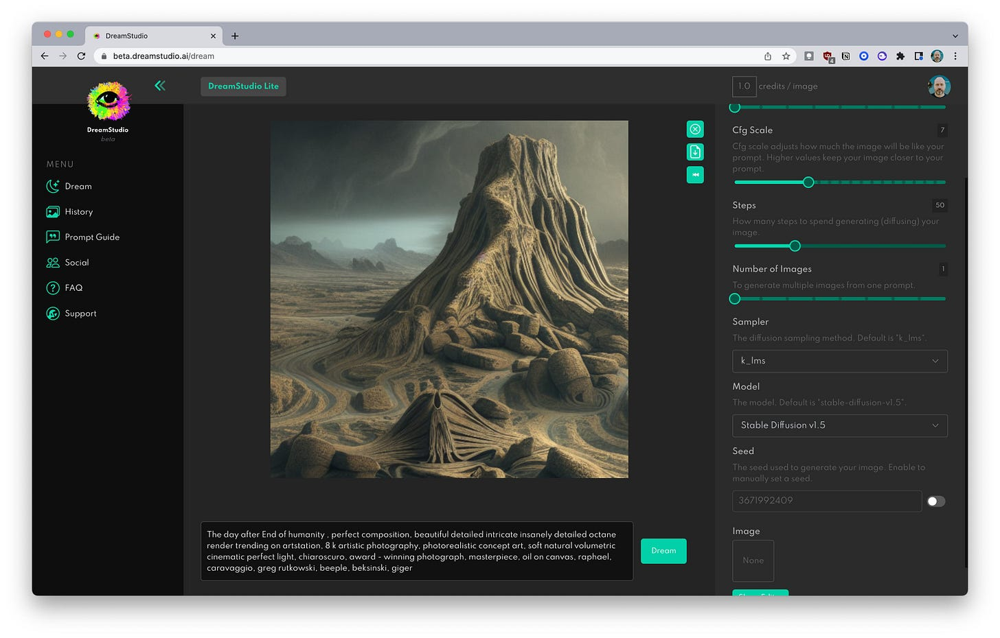](https://substackcdn.com/image/fetch/f_auto,q_auto:good,fl_progressive:steep/https%3A%2F%2Fbucketeer-e05bbc84-baa3-437e-9518-adb32be77984.s3.amazonaws.com%2Fpublic%2Fimages%2Fa4a51352-0275-439b-b8b7-a6ea3e559b1c_3498x2234.jpeg)

You’ve probably already messed around a bit with Stable Diffusion courtesy of the Stability AI team’s in-house cloud app, [Dream Studio](https://beta.dreamstudio.ai/). If you haven’t, then stop what you’re doing and go sign up so you can follow along with the rest of this section.  

你可能已经在稳定AI团队的内部云应用程序Dream Studio的帮助下，对稳定扩散进行了一些操作。如果你还没有，那么请停止你正在做的事情，去注册，这样你就可以跟随本节的其他内容。

You may end up using some other tool — I’m personally using and recommending **[PlaygroundAI.com](https://playgroundai.com/)** right now — but I do recommend keeping a freebie Dream Studio account because it’s always going to have support for new features that will then trickle out to other apps.  

你可能最终会使用一些其他的工具--我个人现在正在使用并推荐PlaygroundAI.com--但我确实建议保留一个免费的Dream Studio账户，因为它总是会有对新功能的支持，然后会渗透到其他应用程序。

Building on the knowledge and intuitions we gained in [Part 1](https://www.jonstokes.com/p/ai-content-generation-part-1-machine) and [Part 2](https://www.jonstokes.com/p/ai-content-generation-part-2-tasks) of the series on AI content generation, let’s dive into how to work with Stable Diffusion using Dream Studio. What you learn here will apply to other apps based on this model.  

基于我们在人工智能内容生成系列的第一部分和第二部分中获得的知识和直觉，让我们深入了解如何使用Dream Studio与Stable Diffusion一起工作。你在这里学到的东西将适用于基于这种模式的其他应用程序。

Stable Diffusion takes two primary inputs and translates these into a fixed point in its model’s latent space:  

稳定扩散需要两个主要的输入，并将其转化为其模型潜在空间中的一个固定点。

1.  A **seed** integer
    
2.  A text **prompt**  
    
    一个文本提示
    

_The same seed and the same prompt given to the same version of Stable Diffusion will **output the same image every time**_. In other words, the following relationship is fixed:  

相同的种子和相同的提示给相同版本的 "稳定扩散"，每次都会输出相同的图像。换句话说，以下关系是固定的。

`seed + prompt = image`

If your experiments with Stable Diffusion have resulted in you getting different images for the same prompt (and they probably have), it’s because you were using a random seed integer every time you submitted the prompt:  

如果你的稳定扩散实验导致你在同一提示下得到不同的图像（可能是这样），那是因为你每次提交提示时都使用了一个随机种子整数。

Just click the toggle to the right in the Dream Studio interface to manually put in a specific seed.  

只要在Dream Studio界面点击右边的切换键，就可以手动放入特定的种子。

(Interestingly, this fixed relationship between the seed, prompt, and output image means you can take a given Stable Diffusion output image and seed, and then [run the model in reverse](https://twitter.com/EMostaque/status/1567165566342893571) to get the original text prompt. As far as I know, though, none of the apps in this article support this capability.)  

(有趣的是，种子、提示和输出图像之间的这种固定关系意味着你可以取一个给定的稳定扩散输出图像和种子，然后反向运行模型以获得原始文本提示。但据我所知，本文中的所有应用程序都不支持这一功能）。

One practical application for the `seed + prompt = image` equation is that by holding the seed constant you can then subtly tweak the prompt to iterate closer to the exact image you want.  

`seed + prompt = image` 方程的一个实际应用是，通过保持种子不变，你就可以巧妙地调整提示，使其迭代得更接近你想要的确切图像。

[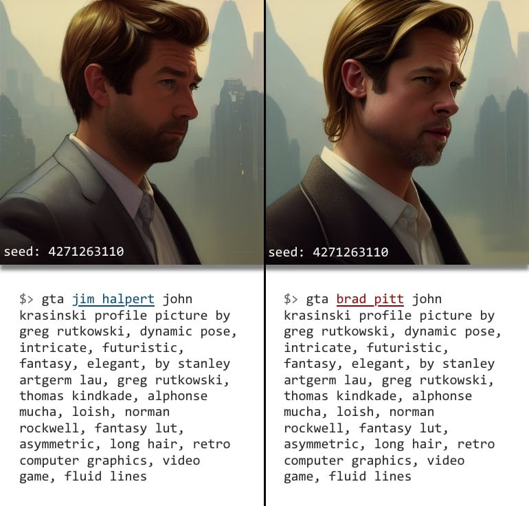](https://substackcdn.com/image/fetch/f_auto,q_auto:good,fl_progressive:steep/https%3A%2F%2Fbucketeer-e05bbc84-baa3-437e-9518-adb32be77984.s3.amazonaws.com%2Fpublic%2Fimages%2Fa04ef5d6-8f10-4f54-98bd-73b37ebade5a_770x736.jpeg)

I held the seed fixed but varied two words in the prompt, i.e., `jim halpert` => `brad pitt`.  

我把种子固定下来，但在提示中改变了两个词，即 `jim halpert` => `brad pitt` 。

In the picture above, you can see that I fixed the seed at `4271263110` and then changed some of the prompt wording in order to tweak the resulting image. What I’m doing here is navigating around a small region of the model’s latent space, looking for the results I want.  

在上图中，你可以看到我把种子固定在 `4271263110` ，然后改变了一些提示的措辞，以调整产生的图像。我在这里做的是在模型的潜在空间的一个小区域内进行导航，寻找我想要的结果。

Changing the seed by even a small amount will usually jump me to a different region of latent space, so if I want to experiment with bigger changes then I can try that.  

即使是少量改变种子，通常也会让我跳到潜伏空间的不同区域，所以如果我想实验更大的变化，那么我可以尝试。

[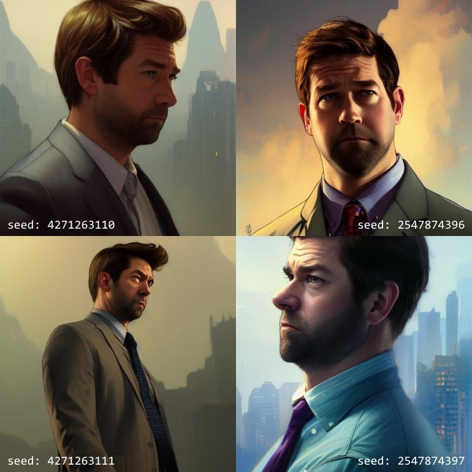](https://substackcdn.com/image/fetch/f_auto,q_auto:good,fl_progressive:steep/https%3A%2F%2Fbucketeer-e05bbc84-baa3-437e-9518-adb32be77984.s3.amazonaws.com%2Fpublic%2Fimages%2F5449314d-7668-415e-9cf5-f0c89b1447dc_770x770.jpeg)

I held the prompt fixed across all four images but varied the seed.  

我在所有四幅图像中都固定了提示，但改变了种子。

This business of tweaking your text prompt in order to navigate the model’s latent space to find what you want has a name: **prompt engineering**.  

调整你的文本提示，以便在模型的潜在空间中找到你想要的东西，这种业务有一个名字：提示工程。

This isn’t the place for a full introduction to this… I dunno, is it art or science? Whatever it is, a deep dive into it will come in a later, dedicated post. But you do need to understand some basics because prompt engineering presents a set of novel user interface requirements that the first wave of AI content generation apps is frantically trying to solve.  

这里不是全面介绍这个......我不知道，它是艺术还是科学？不管它是什么，对它的深入研究将在以后的专门文章中进行。但你确实需要了解一些基础知识，因为提示工程提出了一系列新颖的用户界面要求，第一波人工智能内容生成应用程序正在疯狂地试图解决这些问题。

[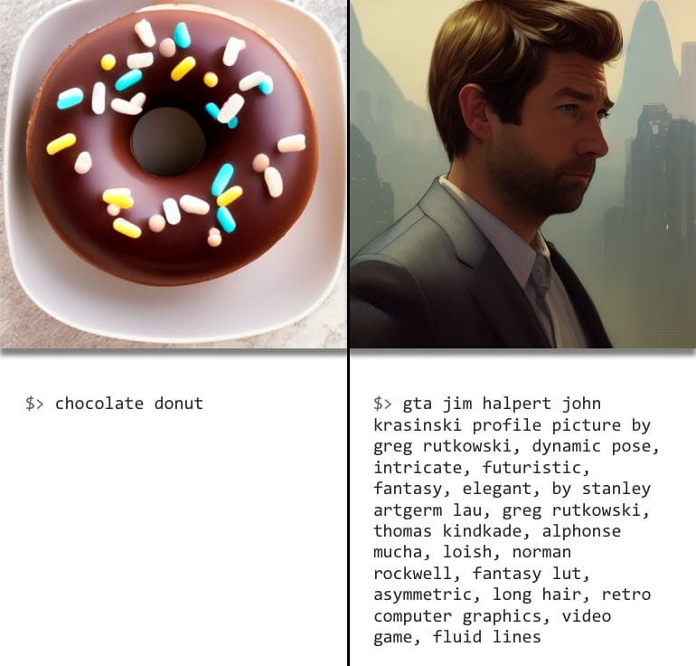](https://substackcdn.com/image/fetch/f_auto,q_auto:good,fl_progressive:steep/https%3A%2F%2Fbucketeer-e05bbc84-baa3-437e-9518-adb32be77984.s3.amazonaws.com%2Fpublic%2Fimages%2Ff4064832-3af6-48ba-b1b5-64a1f8e62f6d_770x736.jpeg)

Short prompt vs long prompt. Longer prompts can give you more control over the output if you’re careful.  

短提示与长提示。如果你小心的话，较长的提示可以让你对输出有更多的控制。

Just like with a Google search, where you try to add specifics to your query so you can narrow in on the right URL in Google’s database, adding specifics to your prompt will get you into the right region of the model’s latent space.  

就像在谷歌搜索中，你试图在你的查询中添加具体内容，这样你就可以在谷歌数据库中缩小正确的URL，在你的提示中添加具体内容将使你进入模型的潜在空间的正确区域。

It’s really hard to know where to get started with building a prompt because no matter how well you think you’ve explained yourself to the AI, the odds that you’ll miss the target on the first try are quite high.  

真的很难知道从哪里开始建立一个提示，因为无论你认为你已经向人工智能解释得多好，你第一次尝试就错过目标的几率是相当高的。

Take my 9-year-old daughter’s first DALL-E 2 request for a “unicorn hand sanitizer,” which I turned into the prompt: “A realistic photograph of a unicorn-themed hand sanitizer dispenser.”   

就拿我9岁的女儿第一次提出的 "独角兽洗手液 "的要求来说，我把它变成了提示。"一张以独角兽为主题的洗手液分配器的逼真照片"。

[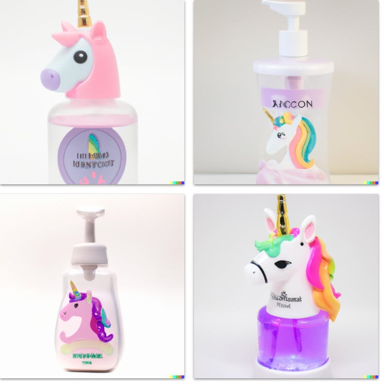](https://substackcdn.com/image/fetch/f_auto,q_auto:good,fl_progressive:steep/https%3A%2F%2Fbucketeer-e05bbc84-baa3-437e-9518-adb32be77984.s3.amazonaws.com%2Fpublic%2Fimages%2Ffdab362b-341a-48ff-9bee-9ebc14d47851_800x800.jpeg)

These images were generated with OpenAI’s DALL-E 2, but included to illustrate the point in the anecdote.  

这些图像是用OpenAI的DALL-E 2生成的，但包括在内是为了说明轶事中的观点。

To me, the results above looked spot-on — this was exactly what I was envisioning in my mind’s eye when she gave me the prompt to type in. But she gave these images a big thumbs down because _she_ had envisioned a unicorn-themed hand sanitizer dispenser mounted to a wall.  

对我来说，上面的结果看起来很准确--当她给我提示输入时，这正是我在脑海中设想的。但是她对这些图片竖起了大拇指，因为她设想的是一个安装在墙上的独角兽主题洗手液分配器。

In this case, once we specified “wall-mounted” in the prompt we got closer to the goal:  

在这种情况下，一旦我们在提示中指定 "壁挂式"，我们就更接近目标了。

[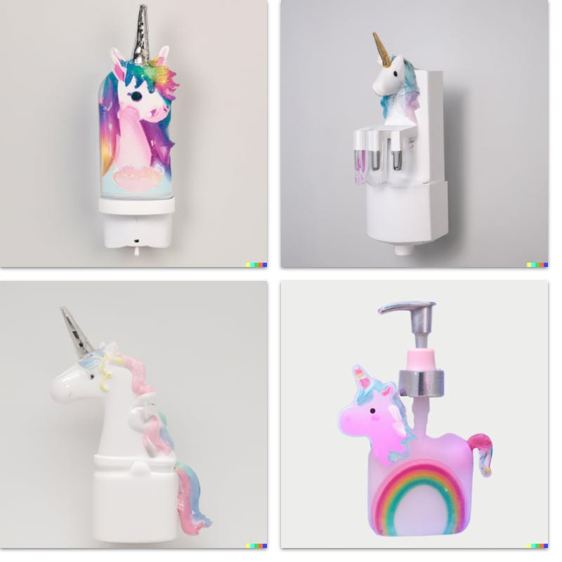](https://substackcdn.com/image/fetch/f_auto,q_auto:good,fl_progressive:steep/https%3A%2F%2Fbucketeer-e05bbc84-baa3-437e-9518-adb32be77984.s3.amazonaws.com%2Fpublic%2Fimages%2Ff3083433-5311-4951-be6c-9cf8fcda969e_800x800.jpeg)

As above, these are DALL-E 2 generations, not Stable Diffusion.  

如上所述，这些是DALL-E 2代，不是稳定扩散。

This story nicely illustrates an important rule of prompt engineering: _the more specific the idea you have of what you want to see, the more relevant words you’ll need to add to the prompt in order to produce it_.   

这个故事很好地说明了提示工程的一个重要规则：你对你想看到的东西的想法越具体，你就需要在提示中加入更多的相关词语，以便产生它。

Notice that I said “more _relevant_ words,” above. The “relevant” is important because you can make a long, rambling prompt that’s still too vague. You need to pile on the modifiers that most closely relate to the result you want.  

请注意，我在上面说了 "morerelevantwords"。相关 "很重要，因为你可以做一个冗长的、漫无边际的提示，但还是太模糊了。你需要堆积与你想要的结果最密切相关的修饰语。

**Here’s a tip:** Imagine you’re writing a description of your desired image for a web page, which people will be putting into Google to search for your image. Ask yourself what terms users would probably type into Google in order to find your image if they had already seen it and wanted to locate it again. Make a list of those terms, and then use all of them in the prompt.  

这里有一个提示：想象一下，你正在为一个网页写一个你想要的图像的描述，人们会把这个描述输入谷歌来搜索你的图像。问问自己，如果用户已经看过你的图片并想再次找到它，他们可能会在谷歌上输入哪些词来寻找你的图片。把这些词列出来，然后在提示中使用所有这些词。

The drawback to the search query approach I’ve advocated here and in [previous](https://www.jonstokes.com/p/ai-content-generation-part-1-machine) [articles](https://www.jonstokes.com/p/ai-content-generation-part-2-tasks) is that the Google interface often gives you an effectively infinite number of results for both URLs and images. So we’re all accustomed to pecking out a short search query and then scrolling until we find what we’re looking for.   

我在这里和以前的文章中提倡的搜索查询方法的缺点是，谷歌界面经常给你一个有效的无限数量的URL和图片的结果。因此，我们都习惯于啄出一个简短的搜索查询，然后滚动，直到我们找到我们要找的东西。

Google also personalizes your results by taking in a lot of other data, from your prior search history to your geographic location, in order to infer search intent and improve quality. A page of Google results, then, reflects all the detailed knowledge that Google has about me and my particular interests.   

谷歌还通过吸收大量其他数据，从你以前的搜索历史到你的地理位置，来推断搜索意图和提高质量，从而使你的结果个性化。因此，谷歌的一页结果反映了谷歌对我和我的特殊兴趣的所有详细了解。

AI content generation tools have none of this added capability, yet. There’s no hidden support from personalized algorithms — it’s just you, the model, and the prompt. And of course, there’s no scrolling (yet). So if you can imagine a world where Google gave you only a handful of completely unpersonalized results before making you modify your prompt and resubmit, that’s the mindset you’ll need for Stable Diffusion and similar tools.  

人工智能内容生成工具还没有这种附加能力。没有来自个性化算法的隐藏支持--只有你、模型和提示。当然，也没有滚动（还没有）。因此，如果你能想象这样一个世界：谷歌在让你修改提示并重新提交之前，只给你少数几个完全非个性化的结果，这就是你对稳定扩散和类似工具所需要的心态。

I’m currently thinking of my prompts as having two parts:  

我目前认为我的提示有两个部分。

1.  The **subject** I’m trying to render, i.e., a liger, a cityscape, a winged cyborg demigod, etc.  
    
    我试图呈现的主题，即一只老虎、一个城市景观、一个有翅膀的半机械人，等等。
    
2.  The **style** I want the subject to be rendered in, i.e., photorealistic, Unreal engine render, anime, Studio Ghibli, pastels on canvas, etc.  
    
    我想要的主题渲染风格，即逼真、虚幻引擎渲染、动漫、吉卜力工作室、画布上的粉彩，等等。
    

When I’m putting together a prompt, then, I’ll think about the modifiers I want for the subject so that get the specific thing I’m imagining, and then I’ll try to polish it with a string of style modifiers.  

那么，当我把一个提示放在一起时，我会思考我想要的主题的修饰语，以便得到我想象中的具体事物，然后我会尝试用一串风格修饰语来打磨它。

[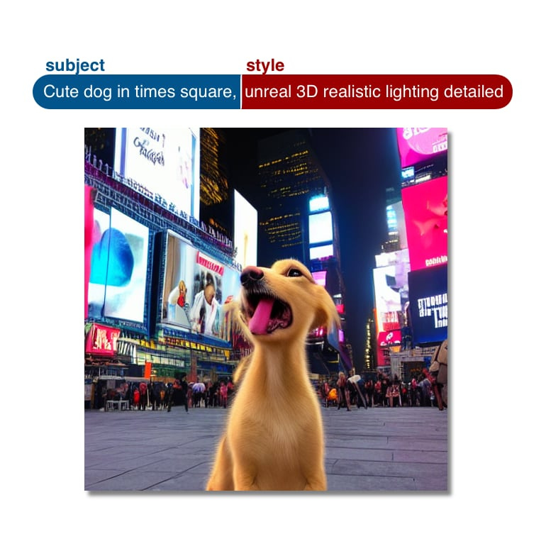](https://substackcdn.com/image/fetch/f_auto,q_auto:good,fl_progressive:steep/https%3A%2F%2Fbucketeer-e05bbc84-baa3-437e-9518-adb32be77984.s3.amazonaws.com%2Fpublic%2Fimages%2F126cf0a6-d486-4896-a874-038850c9bbaf_770x770.jpeg)

There are two ways to get better at prompt engineering:  

有两种方法可以使提示工程做得更好。

1.  Practice  
    
    实践
    
2.  Stealing other people’s prompts and then repeating step 1  
    
    盗用他人的提示语，然后重复步骤1
    

In other words, you’re going to need a way to practice and a source of high-quality prompts to imitate. Solving the first of these problems is going to involve making decisions about where you run Stable Diffusion (on your local machine or in the cloud), and about what tools you use for prompt discovery.  

换句话说，你需要一个练习的方法和一个可以模仿的高质量提示源。解决这些问题中的第一个问题将涉及到决定你在哪里运行稳定扩散（在你的本地机器上或在云端），以及决定你使用什么工具来发现提示。

The cost, functionality, and accessibility parameters that will make one mix of tools better than the other for your specific case are not only impossible to predict, but they change literally every 12 hours or so because of the pace of new releases in this space. I’ll offer some guidance below on the “local vs. cloud” question, but otherwise the only thing I can do is tell you what I’m currently doing and ask for other people to post their workflows in the comments.  

成本、功能和可及性参数将使一种工具组合在你的特定情况下比另一种更好，这不仅是无法预测的，而且由于这一领域的新版本的速度，它们实际上每12小时左右就会改变。我将在下面就 "本地与云 "的问题提供一些指导，但除此之外，我唯一能做的就是告诉你我目前在做什么，并请其他人在评论中公布他们的工作流程。

For prompt discovery, I’m currently using **[Krea.ai](https://krea.ai/)**. I’ve found this tool to be really effective for finding interesting images that I’d like to adapt, and my kids and their friends (whom we’ve recently AI-pilled) are also big fans of it. Krea.ai supports browsing and searching, and I find I use both depending on my needs.  

对于提示发现，我目前正在使用Krea.ai。我发现这个工具在寻找我想改编的有趣图片方面非常有效，我的孩子和他们的朋友（我们最近用AI填充了他们）也是它的忠实粉丝。Krea.ai支持浏览和搜索，我发现我根据自己的需要使用这两种方式。

[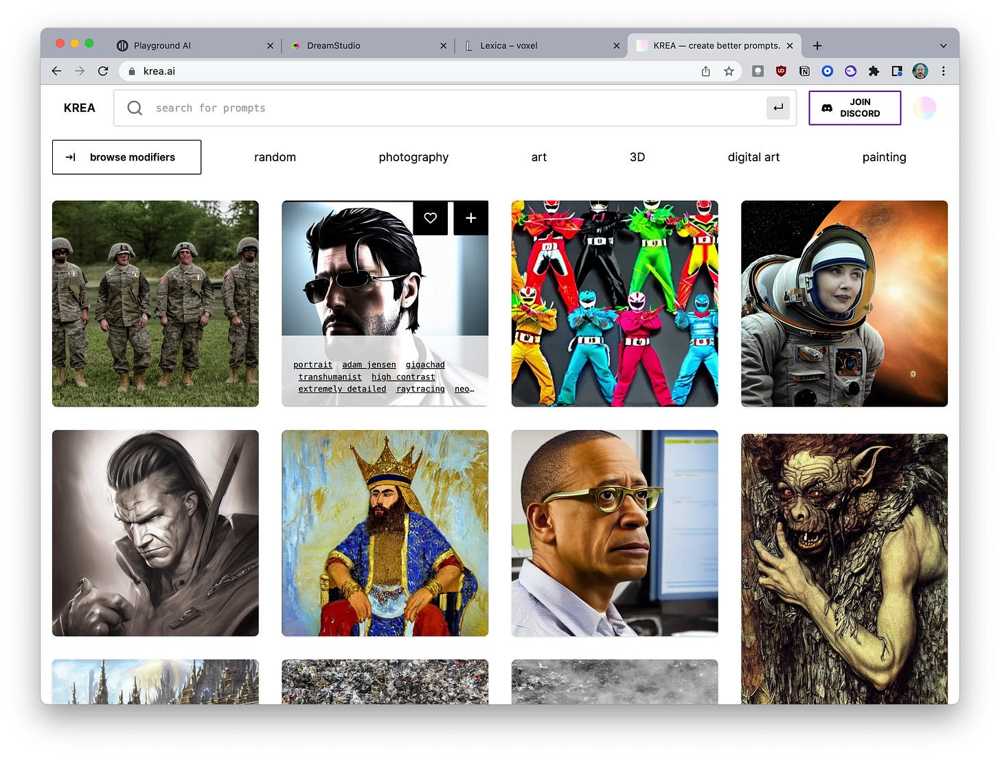](https://substackcdn.com/image/fetch/f_auto,q_auto:good,fl_progressive:steep/https%3A%2F%2Fbucketeer-e05bbc84-baa3-437e-9518-adb32be77984.s3.amazonaws.com%2Fpublic%2Fimages%2F66a2690f-5a95-42a3-ad1e-cd6508f86a97_2760x2094.jpeg)

In addition to Krea.ai, there are two other similar prompt sources I’ve come across that I like:  

除了Krea.ai，我还遇到了另外两个类似的提示来源，我很喜欢。

-   [Lexica.art  
    
    Lexica.art](https://lexica.art/)
    
-   [Arthub.ai  
    
    Arthub.ai](https://arthub.ai/)
    

I’d say bookmark as many of these types of prompt discovery tools as you find, and use them all. (Also, please share any new ones you come across in the comments.)  

我想说的是，只要你找到这些类型的提示发现工具，就把它们记在书上，并全部使用。(另外，请在评论中分享你遇到的任何新的工具）。

[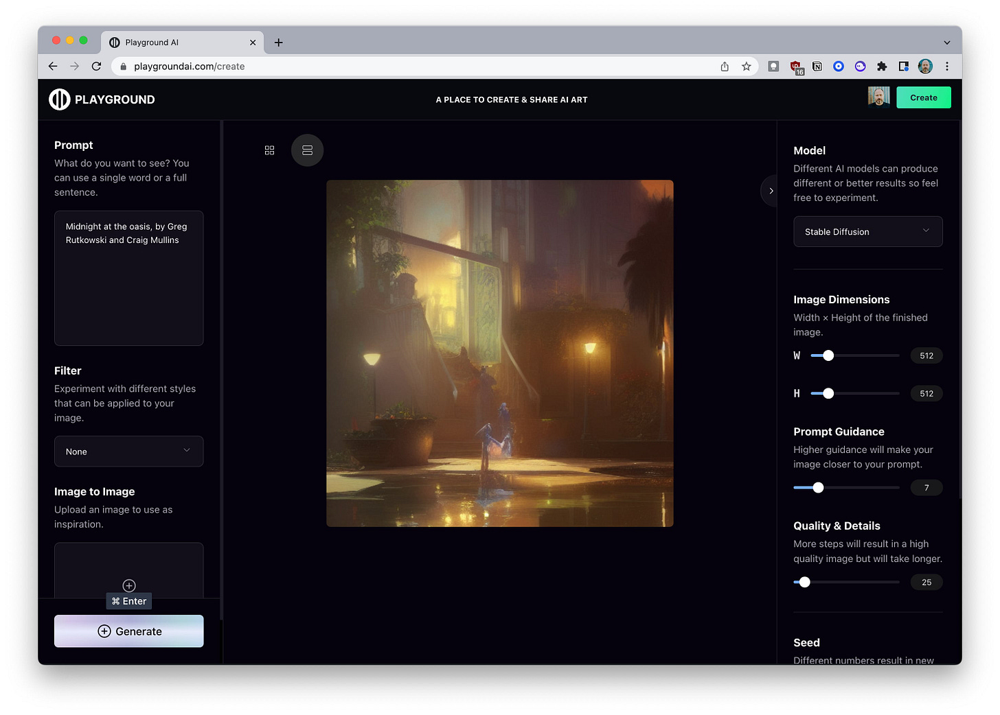](https://substackcdn.com/image/fetch/f_auto,q_auto:good,fl_progressive:steep/https%3A%2F%2Fbucketeer-e05bbc84-baa3-437e-9518-adb32be77984.s3.amazonaws.com%2Fpublic%2Fimages%2F5911fcb1-c52f-4751-997c-139db6c1fcb3_2950x2112.jpeg)

For actually iterating on the prompts that I find on Krea.ai, I’m using **[PlaygroundAI.com](https://playgroundai.com/)**. PlaygroundAI has a number of things going for it right now:  

对于实际迭代我在Krea.ai上找到的提示，我正在使用PlaygroundAI.com。PlaygroundAI现在有很多事情要做。

-   The team behind it is very good. (I know who it is but I’m sworn to secrecy!)  
    
    它背后的团队非常好。(我知道是谁，但我发誓要保密！)
    
-   They are iterating rapidly. I’m in their Discord and there’s a constant flow of new features.  
    
    他们正在快速迭代。我在他们的Discord中，有一个不断涌现的新功能。
    
-   They’re not charging for prompts, yet.  
    
    他们还没有对提示进行收费。
    
-   They expose all the useful customization options.  
    
    他们暴露了所有有用的定制选项。
    
-   _\*whispers\*_ you can use DALL-E 2 with it!  
    
    \*低声说\*你可以用它来使用《达利2》！\*\*\*。
    

So while I used Dream Studio for the intro to this article, I’m currently using PlaygroundAI to do all my image generation.   

因此，虽然我在本文的介绍中使用了Dream Studio，但我目前正在使用PlaygroundAI来完成我所有的图像生成。

When PlaygroundAI implements image credits or some other form of payments and quotas, I may start recommending a local install just for the learning phase. The ultimate point is that you want to be able to do experiments and learn without worrying about the cost. Whatever combination of tools lets you do that is the one you want to start out with.  

当PlaygroundAI实现图像信用或其他形式的付款和配额时，我可能会开始推荐一个本地安装，只是为了学习阶段。最终的一点是，你希望能够在不担心成本的情况下进行实验和学习。无论什么样的工具组合都能让你做到这一点，这就是你想开始使用的工具。

**Read more:  

阅读更多。**

-   [Prompt Engineering: From Words To Art  
    
    提示工程。从文字到艺术](https://www.saxifrage.xyz/post/prompt-engineering)
    
-   [I made a list of useful resources for prompt engineering on SD  
    
    我做了一个关于SD的提示工程的有用资源清单](https://www.reddit.com/r/StableDiffusion/comments/wkq73p/i_made_a_list_of_useful_resources_for_prompt/)
    
-   [Stable Diffusion: Prompt Guide And Examples  
    
    稳定的扩散。提示性指南和实例](https://strikingloo.github.io/stable-diffusion-vs-dalle-2)
    
-   [The DALL-E 2 Prompt Book  
    
    DALL-E 2》的提示书](https://dallery.gallery/the-dalle-2-prompt-book/)
    
-   [Me and someone else have created a prompt engineering sheet for DALL-E 2!  
    
    我和其他人已经为《达利》2创建了一个提示工程表!](https://www.reddit.com/r/dalle2/comments/v3jxud/me_and_someone_else_have_created_a_prompt/)
    

One of the UI patterns I’m seeing emerge in image generation tools is the “filter” metaphor.  

我看到图像生成工具中出现的UI模式之一是 "过滤器 "隐喻。

[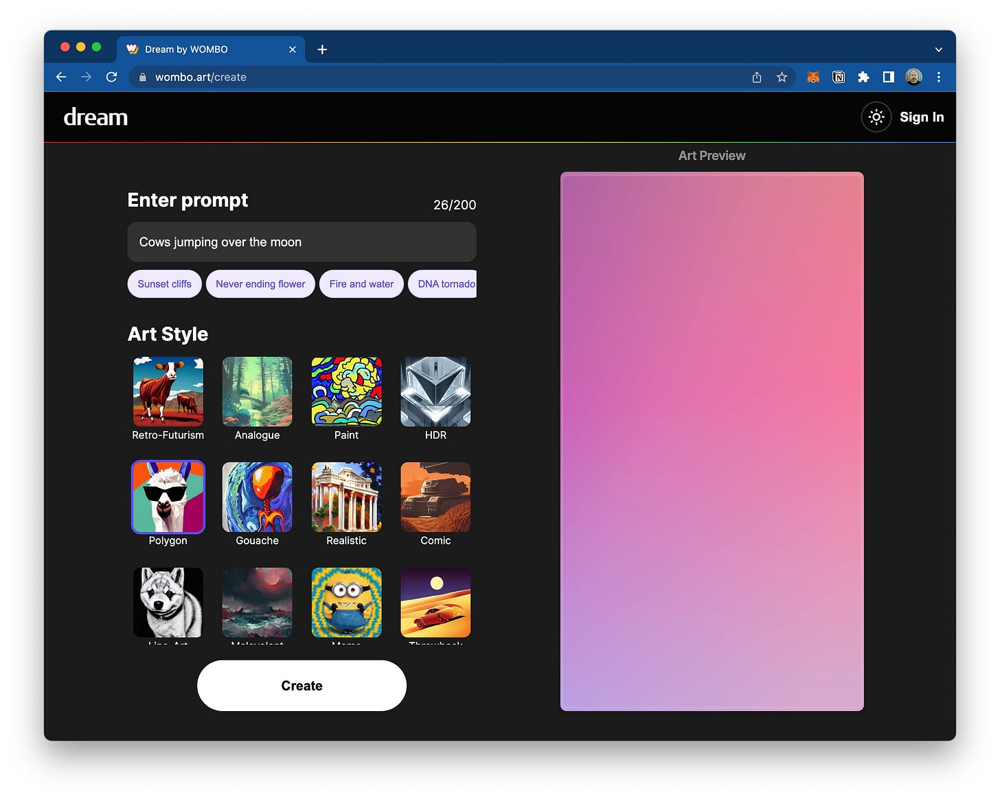](https://substackcdn.com/image/fetch/f_auto,q_auto:good,fl_progressive:steep/https%3A%2F%2Fbucketeer-e05bbc84-baa3-437e-9518-adb32be77984.s3.amazonaws.com%2Fpublic%2Fimages%2F58f3c017-71b2-44e2-ba32-d5769bd15d6a_2550x2038.jpeg)

The idea here is that you enter a prompt, click a “filter” option, and the model renders your prompt in that style. I think some naive users are going to imagine these as filters on the model’s output, but they’re really filters on your text _input_.   

这里的想法是，你输入一个提示，点击一个 "过滤器 "选项，然后模型将你的提示渲染成那种风格。我想一些天真的用户会把这些想象成模型输出的过滤器，但它们实际上是你的文本输入的过滤器。

What’s actually going on here is that the platform is just appending some style words to your (presumably subject-only) prompt before feeding it into the model.  

实际上，这里发生的事情是，平台只是在将你的提示（大概只有主题）送入模型之前，附加了一些样式词。

I don’t know that I love this “filter” idea. It would be better to frame these as “mix-ins,” “added ingredients,” “modifiers,” or even “toppings.” Something that gives a flavor of the way the platform is adding some words to your prompt to get the desired effect.  

我不知道我是否喜欢这个 "过滤器 "的想法。最好是将这些框定为 "混合剂"、"添加成分"、"修饰剂"，甚至是 "配料"。一些能让人感受到平台在你的提示中加入一些词语以获得预期效果的方式。

I also think that the platform should always show you the full text of the resulting prompt string after whatever modifications it’s making are applied.I personally derive value from the training I get from clicking on different options and seeing a kind of “command line” view of how they’re modifying the input prompt. Thankfully, more of the tools are starting to do this, at least on my informal survey.  

我还认为，平台应该始终向你展示它所做的任何修改之后所产生的提示字符串的全文。我个人从点击不同的选项并看到它们是如何修改输入提示的一种 "命令行 "视图中获得了培训价值。值得庆幸的是，更多的工具开始这样做了，至少在我的非正式调查中是这样。

While I’m giving out free consulting advice to the field of AI image generators, I’ll also add that this subject + style distinction might be usefully surfaced in the UI. You might have one field for the subject, with some helpful guidance (tooltips, links to help pages, other affordances), and then a separate widget for applying styles to the subject.  

在我为人工智能图像生成器领域提供免费咨询建议的同时，我还要补充一点，这种主题+样式的区别可能会在用户界面中得到有效的体现。你可以为主题设置一个字段，并提供一些有用的指导（工具提示、帮助页面的链接、其他功能），然后为主题设置一个单独的小部件来应用样式。

**My recommendation** Stay away from these filters if they don’t level up your knowledge of prompt styles by showing you how they’re changing your input. You want to always be learning, because the better you are at prompt engineering the less money you’ll need to spend to get good results.   

我的建议如果这些过滤器不能通过向你展示它们是如何改变你的输入来提高你对提示风格的认识，那就远离它们吧。你要一直学习，因为你在提示工程方面做得越好，你需要花的钱就越少，以获得良好的效果。

Stable Diffusion has a number of options you can adjust to modify how it treats a particular prompt + seed pair. Some of these, like image height and width, or number of output images, are obvious. But there are two that are a little more subtle and worth looking into.  

Stable Diffusion有许多选项，你可以调整以修改它如何处理一个特定的提示+种子对。其中一些，如图像高度和宽度，或输出图像的数量，是显而易见的。但有两个选项更微妙，值得研究。

(I’m not getting into the sample option here, because in my experiments the effect is really subtle. But I may look at it in a later post.)  

(我在这里不涉及样本选项，因为在我的实验中，效果真的很微妙。但我可能会在以后的文章中研究它）。

This term stands for Classifier-Free Guidance Scale and is a measure of how close you want the model to stick to your prompt when looking for a related image to show you. (This is called “Prompt Guidance” in PlaygroundAI.) A Cfg Scale value of 0 will give you essentially a random image based on the seed, whereas a Cfg Scale of 20 (the maximum on SD) will give you the closest match to your prompt that the model can produce.  

这个术语代表无分类指导尺度，是衡量你希望模型在寻找相关图片给你看时，能多接近你的提示。(这在PlaygroundAI中被称为 "提示引导"。)Cfg Scale值为0会给你一个基于种子的随机图像，而Cfg Scale为20（SD上的最大值）会给你一个模型能产生的与提示最接近的匹配。

It’s worth trying to develop an intuition about this value in terms of latent space. The following analogy isn’t perfect, but it should give you a sense of what you’re doing:  

值得尝试从潜在空间的角度来发展对这个值的直觉。下面的比喻并不完美，但它应该让你对自己的工作有一个感觉。

Imagine your prompt is a flashlight with a variable-width beam, and you’re shining it onto the model’s latent space volume to highlight a particular region — your output image will be drawn from somewhere within that region, depending on the seed.  

想象一下，你的提示是一束宽度可变的手电筒，你把它照在模型的潜在空间体积上，以突出一个特定的区域--你的输出图像将从该区域的某个地方提取，这取决于种子的情况。

-   Dialing the Cfg Scale toward **zero produces an extremely wide beam** that highlights the entire latent space — your output could come from literally anywhere.   
    
    将Cfg刻度拨到零会产生一个极宽的光束，突出整个潜伏空间--你的输出几乎可以来自任何地方。
    
-   Dialing the Cfg Scale toward **20 produces a beam so narrow** that at the extreme it turns into a laser pointer that illuminates a single point in latent space.  
    
    将Cfg刻度拨向20，产生的光束非常窄，在极端情况下，它变成了一个激光指示器，照亮了潜伏空间的一个点。
    

With the command line version of Stable Diffusion, you can actually use a **negative cfg scale value**. Negative values work the same as above, but the output you get is from the _opposite side_ of latent space to the point you highlighted. So with our prompt-as-flashlight analogy, you’re still highlighting the same region or point in latent space, but then you’re taking the extra step of finding its opposite coordinates and rendering the image from those.  

在稳定扩散的命令行版本中，你实际上可以使用一个负的cfg比例值。负值的工作原理与上述相同，但你得到的输出是来自潜伏空间的反面，即你所强调的那一点。所以用我们的提示作为闪光灯的比喻，你仍然是在强调潜空间中的同一个区域或点，但你要采取额外的步骤，找到它的相反坐标，并从这些坐标渲染图像。

For a more technical discussion of this parameter, see **[this paper](https://arxiv.org/abs/2112.10741)** by the OpenAI team.  

关于这个参数的更多技术讨论，请看OpenAI团队的这篇论文。

To give you a sense of what this looks like in practice, what follows are sets of images with all other options (including prompt + seed) held the same, but cfg scale is changed as indicated below each image:  

为了让你了解实际情况，下面是几组图片，所有其他选项（包括提示+种子）都保持不变，但cfg的比例有所改变，如每张图片下面所示。

To give some useful variety to the above illustrations, I tried to pick an abstract image, a simple image, and a product photo image from Pinterest. It’s actually kind of hard to detect a pattern there, because, for the product photo and the simple image, the lower cfg scale value yielded the most dramatic changes, whereas the opposite was true for the abstract image.  

为了给上述插图提供一些有用的变化，我试着从Pinterest挑选了一张抽象图片、一张简单图片和一张产品照片。实际上，很难发现其中的规律，因为对于产品照片和简单图片，较低的cfg比例值产生了最显著的变化，而抽象图片则相反。

For some really nice animations that take a single prompt + seed and walk it up the cfg scale from 0 on up to different values, check out these Reddit threads:  

对于一些非常好的动画，采取单一的提示+种子，并将其从0向上走到不同的值的cfg刻度，请查看这些Reddit线程。

-   [Steps and CFG Scale Tests  
    
    台阶和CFG量表测试](https://www.reddit.com/r/StableDiffusion/comments/wnlsn8/steps_and_cfg_scale_tests/)
    
-   [CGF Test - Same prompt with cfg scale from 0.0 to 24.0 in 0.25 increments  
    
    CGF测试 - 相同的提示，cfg比例从0.0到24.0，增量为0.25。](https://www.reddit.com/r/StableDiffusion/comments/wkurew/cgf_test_same_prompt_with_cfg_scale_from_00_to/)
    
-   [A Study of Scale: CFG 0.0 to 100.0, for science!)  
    
    规模的研究。CFG 0.0到100.0，为了科学！)](https://www.reddit.com/r/StableDiffusion/comments/wxen7x/a_study_of_scale_cfg_00_to_1000_for_science/)
    

Stable Diffusion gets its name from the fact that it belongs to a class of generative machine learning called **diffusion models**. These models are essentially de-noising models that have learned to take a noisy input image and clean it up.  

稳定扩散的名字来自于它属于一类称为扩散模型的生成式机器学习的事实。这些模型本质上是去噪模型，它们已经学会了接受一个嘈杂的输入图像并对其进行清理。

[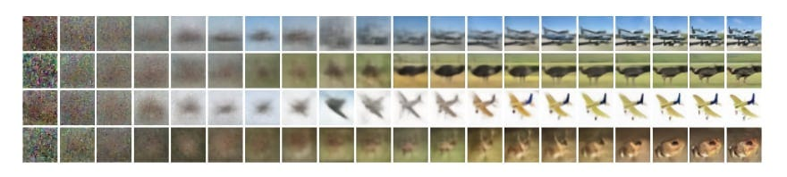](https://substackcdn.com/image/fetch/f_auto,q_auto:good,fl_progressive:steep/https%3A%2F%2Fbucketeer-e05bbc84-baa3-437e-9518-adb32be77984.s3.amazonaws.com%2Fpublic%2Fimages%2Fa3e4e2f0-9caf-46e0-bfcd-e147cd39e08e_880x198.jpeg)

An example of deriving images from noise using diffusion. [Source (PDF)](https://arxiv.org/pdf/2006.11239.pdf)  

利用扩散从噪声中得出图像的例子。 资料来源 (PDF)

A simple diffusion model — one that doesn’t have a text component that lets a text prompt guide the de-noising process toward a particular point in latent space — will produce a random image given an input that’s purely random noise. Or, if you give it an input with a bit of noise, it’ll try to clean that up for you.  

一个简单的扩散模型--一个没有文字成分的模型，让文字提示引导去噪过程走向潜在空间中的一个特定点--将产生一个随机的图像，给定的输入是纯粹的随机噪声。或者，如果你给它一个带有一点噪声的输入，它将试图为你清理。

Crucially, these models do their de-noising work over a series of passes, or steps.  

最重要的是，这些模型通过一系列的通道或步骤进行去噪工作。

1.  The model takes a noisy input image, then produces a slightly less noisy output image.   
    
    该模型接受一个有噪声的输入图像，然后产生一个噪声稍小的输出图像。
    
2.  Then the program feeds that output image _back_ through the model for another de-noising pass.  
    
    然后，程序将该输出图像反馈到模型中，进行另一次去噪处理。
    
3.  The program repeats steps 1-2 above, feeding the output of step 2 back into step 1 as input until we tell it to stop.  
    
    程序重复上述第1-2步，将第2步的输出作为输入反馈到第1步，直到我们告诉它停止。
    

The number of de-noising passes the image makes through the model is the number of **diffusion steps**.   

图像通过该模型的去噪次数就是扩散步骤的数量。

Most of the tools we’ll be working with won’t let you put the value `1` in for the number of steps — `10` is the common minimum. But if you work with a local tool and do only one step, you’ll get something like the following (prompt was `Midnight at the oasis`):  

我们将要使用的大多数工具都不会让你在步骤数上输入 `1` 这个值-- `10` 是常见的最小值。但如果你使用本地工具，只做一个步骤，你会得到类似下面的结果（提示是 `Midnight at the oasis` ）。

[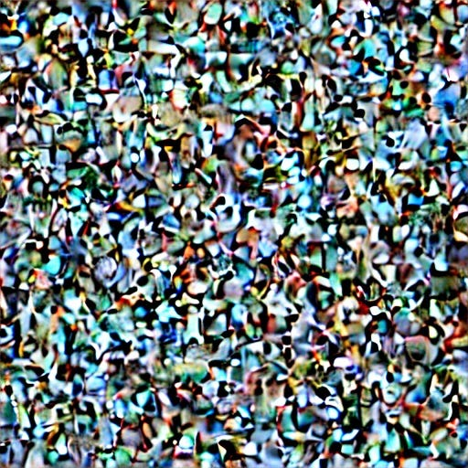](https://substackcdn.com/image/fetch/f_auto,q_auto:good,fl_progressive:steep/https%3A%2F%2Fbucketeer-e05bbc84-baa3-437e-9518-adb32be77984.s3.amazonaws.com%2Fpublic%2Fimages%2F04838af7-51c6-43a3-89c9-6754924a790f_512x512.jpeg)

From the prompt, “Midnight at the oasis,” with only one diffusion step.  

根据提示，"绿洲的午夜"，只有一个扩散步骤。

Cranking the number of steps up to 10 yields the following:  

将步数提高到10步，可以得到以下结果。

The prompt “Midnight at the oasis” with the same seed as above but ten diffusion steps.  

提示 "绿洲的午夜"，种子与上述相同，但有十个扩散步骤。

Often, depending on the type of image, it’s hard to predict what the impact of adding steps will be. A general rule of thumb is that **more steps mean more detail**, but in some cases, you may not want this.  

通常情况下，根据图像的类型，很难预测增加步骤会有什么影响。一般的经验法则是，更多的步骤意味着更多的细节，但在某些情况下，你可能不希望这样。

For instance, I actually like the low-diffusion cat model below the best out of all the options — it gets closer to what I had in mind with my prompt. You’ll need to experiment and find out.  

例如，在所有选项中，我实际上最喜欢下面的低扩散猫模型--它更接近于我心中的提示。你需要进行实验并找出答案。

You’ve probably seen some demos already of Stable Diffusion turning people’s lame drawings (or their kids’ lame drawings) into legit-looking art. This is real and is very cool. But the other thing you can do is modify your images to fill in parts that are missing using a technique called **inpainting**.   

你可能已经看过一些稳定扩散的演示，将人们的蹩脚画（或他们孩子的蹩脚画）变成合法的艺术作品。这是真的，而且非常酷。但你可以做的另一件事是修改你的图像，用一种叫做绘画的技术来填补缺少的部分。

As is the case for prompt engineering, working with images deserves a more extensive, dedicated guide. But just to get you started, I’ll briefly describe how both of these tools work.  

就像提示工程的情况一样，用图像工作值得一个更广泛的、专门的指南。但为了让你开始，我将简要介绍这两个工具的工作原理。

I can now realize my dream of being an expert Procreate user!  

我现在可以实现我的梦想，成为Procreate的专家用户了！"。

When it comes to image modification, you’re going to take everything you’ve learned so far about text to image and add two new inputs:  

当涉及到图像修改时，你要把你到目前为止所学到的关于文本到图像的所有知识，增加两个新的输入。

1.  A source image that acts as a kind of second prompt.  
    
    一个源图像，作为一种第二提示。
    
2.  An **image strength** value that acts more or less like the cfg scale value does for the text prompt, i.e., it sets the amount of influence the image will have over your outcome.  
    
    Animage强度值，其作用或多或少类似于cfg比例值对文本提示的作用，也就是说，它设置图像对你的结果的影响程度。
    

So just as with text-to-image, you’ll have a text prompt and all the other options described above, but in addition to those, you’ll set the above two options.  

因此，就像文本转图像一样，你会有一个文本提示和上述所有其他选项，但除了这些之外，你还要设置上述两个选项。

The trick with image-to-image generation is that you’ll need to work the image strength and cfg scale sliders in tandem to get the result you’re looking for. I tried a number of variants before I settled on the output you see above — some of them were just barely recognizable from my input image, while others were just a cleaned-up version of my sketch.  

图像到图像生成的诀窍是，你需要把图像强度和cfg比例滑块配合起来，才能得到你所期望的结果。我尝试了很多变体，然后才确定了上面的输出结果--其中一些几乎无法从我的输入图像中识别出来，而另一些只是我的草图的清理版本。

[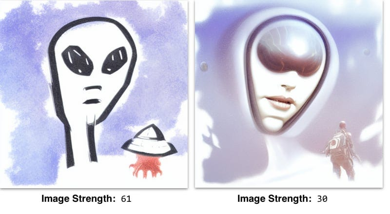](https://substackcdn.com/image/fetch/f_auto,q_auto:good,fl_progressive:steep/https%3A%2F%2Fbucketeer-e05bbc84-baa3-437e-9518-adb32be77984.s3.amazonaws.com%2Fpublic%2Fimages%2F24683eb0-9d25-4b56-9ab6-e64955429805_800x439.jpeg)

The composition of the prompt matters a lot, too. For the above, I used PlaygroundAI and some of their prompt modifiers to produce:  

提示的构成也很重要。对于上述情况，我使用PlaygroundAI和他们的一些提示修改器来制作。

> _Alien head in front of a spaceship, professional ominous concept art, by artgerm and greg rutkowski, an intricate, elegant, highly detailed digital painting, concept art, smooth, sharp focus, illustration, in the style of simon stalenhag, wayne barlowe, and igor kieryluk.  
> 
> 宇宙飞船前的外星人头像，专业不祥的概念艺术，由artgerm和greg rutkowski创作，是一幅复杂、优雅、高度详细的数字画，概念艺术，流畅、锐利的焦点，插图，具有西蒙-斯塔伦哈格、韦恩-巴罗和伊戈尔-基里卢克的风格。_

I’m still exploring the different subject + style combinations, and given the combinatorial explosion of knobs I have to tweak, I’m sure I’ll be doing so for a very long time. Just like prompt engineering, transforming images with this tool will be its own art form, and you’ll benefit from as much practice and experimentation as you can get.  

我仍然在探索不同的主题+风格组合，鉴于我必须调整的旋钮的组合爆炸，我相信我将会在很长一段时间内这样做。就像提示工程一样，用这个工具改造图像将是它自己的艺术形式，你会从尽可能多的实践和实验中受益。

Stable Diffusion can be used to “fill in” the missing parts of images. My main application for this right now is when my output image is missing a part that I want to see. When this happens, I’ll upload the image to Dream Studio’s image editor, shrink it a bit, then put in the original prompt and seed combination.   

稳定扩散可以用来 "填补 "图像的缺失部分。我现在对此的主要应用是当我的输出图像缺少我想看的部分时。当这种情况发生时，我会把图像上传到Dream Studio的图像编辑器中，把它缩小一点，然后放入原始提示和种子组合。

[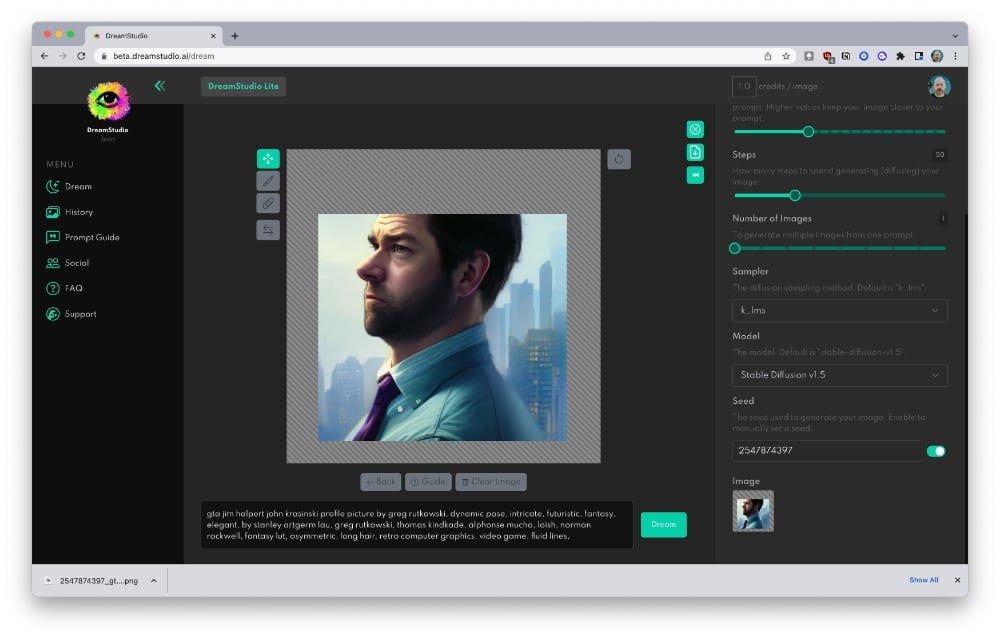](https://substackcdn.com/image/fetch/f_auto,q_auto:good,fl_progressive:steep/https%3A%2F%2Fbucketeer-e05bbc84-baa3-437e-9518-adb32be77984.s3.amazonaws.com%2Fpublic%2Fimages%2F29d26fac-12ab-4627-b290-9c4a6d656c00_1000x639.jpeg)

Dream Studio’s image editor. I had to cut a little bit more of the top of dude’s head off to make this work, otherwise, the bit of hair at the top of the image left a weird line.  

梦想工作室的图像编辑器。我不得不把花花公子的头顶再剪掉一点才行，否则，图像顶部的那点头发会留下一条奇怪的线。

The results are pretty good but might need to be cleaned up in a traditional photo editing tool.  

结果相当不错，但可能需要用传统的照片编辑工具进行清理。

When it comes to using Stable Diffusion, there are two main options:  

谈到使用稳定扩散，有两个主要选择。

1.  **Cloud applications** where you pay by purchasing and spending credits.  
    
    云计算应用，你通过购买和消费点数来支付。
    
2.  A **local installation** that’s free to run and use.  
    
    一个可以免费运行和使用的本地安装。
    

Each of these has its advantages and disadvantages, which I break down, below.  

每种方法都有其优势和劣势，我在下面进行了分析。

**Cloud pros:  

云计算专家。**

-   Social
    
-   Can be used on tablets, Chromebooks, and other low-power devices  
    
    可以在平板电脑、Chromebook和其他低功耗设备上使用
    
-   Fast access to the latest features and versions (this is a big deal in this space)  
    
    快速获得最新的功能和版本（这在这个领域是个大问题）。
    

**Cloud cons:  

云的弊端。**

-   Metered billing via credits  
    
    通过信用额度进行计量计费
    
-   It costs to experiment  
    
    实验的成本
    
-   The app you’re using could be manipulating your input prompt in opaque ways that change without you knowing it (i.e. they’re changing the alterations they make to your prompt which results in unexpected results).  
    
    你所使用的应用程序可能以不透明的方式操纵你的输入提示，在你不知情的情况下发生变化（即他们改变了对你的提示的改动，导致了意想不到的结果）。
    
-   Sometimes fewer options and less control  
    
    有时选择更少，控制更少
    

**Local pros:  

当地的专业人员。**

-   No need for a new account or any billing  
    
    不需要一个新的账户或任何帐单
    
-   Can experiment in unlimited amounts  
    
    可以进行无限量的实验
    

**Local cons:  

当地的弊端。**

-   Can be quite slow, depending on your hardware  
    
    可能相当慢，取决于你的硬件
    
-   You need real hardware to run it  
    
    你需要真正的硬件来运行它
    
-   Installers are still new and not as rapidly updated  
    
    安装人员仍然是新的，没有那么快的更新。
    
-   Local apps are buggy, incomplete  
    
    本地应用程序有缺陷，不完整
    
-   If you go the command line route, installation can be a beast depending on your platform and your knowledge of Python tooling  
    
    如果你走命令行路线，安装可能是一个野兽，这取决于你的平台和你对Python工具的了解。
    

If you have enough hardware to run Stable Diffusion reasonably — i.e., a mid-tier gaming PC or a high-end laptop, like a MacBook Pro M1 with at least 16GB RAM (more RAM is better) — then there’s no real downside to doing a local installation and using that for experiments.  

如果你有足够的硬件来合理地运行 "稳定扩散"--即中级游戏电脑或高端笔记本电脑，如至少有16GB内存的MacBook Pro M1（内存越大越好）--那么做一个本地安装并用于实验就没有什么真正的坏处。

With a local install, you can use a modified version of the workflow I describe, above:  

在本地安装的情况下，你可以使用我上面描述的工作流程的修改版本。

1.  Use a tool like Krea.ai for prompt discovery  
    
    使用像Krea.ai这样的工具进行及时发现
    
2.  Put those prompts into your local machine for experimentation and iteration  
    
    把这些提示放到你的本地机器上进行实验和迭代
    

**Warning:** Unlike the cloud applications, some of the local options don’t keep track of past images alongside their prompts and seeds. Or maybe they keep track of the prompt but not the seed (DiffusionBee is this way). You really need this history if you’re going to learn and improve. So when you’re using your local installation, you may need to manually keep track of the prompt + seed + image combinations in some manner. Right now, my only recommendation is to save the image files with the seed and prompt as the filename, e.g. `15504320_rainbow_lolcat_cthulu_in_candyland_unreal_3D_trending_on_artstation.jpg`.  

警告：与云计算应用程序不同，一些本地选项不会在其提示和种子旁边跟踪过去的图像。或者说，他们记录了提示但没有记录种子（DiffusionBee就是这样）。如果你要学习和改进，你真的需要这些历史。因此，当你使用你的本地安装时，你可能需要以某种方式手动跟踪提示+种子+图像的组合。现在，我唯一的建议是以种子和提示作为文件名来保存图像文件，例如： `15504320_rainbow_lolcat_cthulu_in_candyland_unreal_3D_trending_on_artstation.jpg` 。

**Cloud apps with Stable Diffusion support:  

支持稳定扩散的云应用。**

-   [Dream Studio  
    
    梦想工作室](https://beta.dreamstudio.ai/)
    
-   [PlaygroundAI  
    
    戏园子AI](https://playgroundai.com/)
    
-   [Night Cafe  
    
    夜间咖啡馆](https://creator.nightcafe.studio/create-nft-art)
    
-   [Wombo](https://www.wombo.art/)
    

All of the cloud-based Stable Diffusion apps I’ve seen use a credit-based model, where you buy blocks of credits and then spend them generating images. The reason for this metered billing model is that using the Stable Diffusion to generate an image requires a non-trivial amount of computing resources.  

我所见过的所有基于云的稳定扩散应用程序都采用基于信用的模式，即你购买信用块，然后用它们来生成图像。这种计费模式的原因是，使用稳定扩散软件生成图像需要非同小可的计算资源。

Different options, like the number of diffusion steps (see above) and image size, require more computing resources at higher values. So as you’re generating images, pay attention as you tweak different knobs and sliders to see how they impact the cost per generation.  

不同的选项，如扩散步骤的数量（见上文）和图像大小，在较高的数值下需要更多的计算资源。因此，在你生成图像时，注意调整不同的旋钮和滑块，看它们如何影响每次生成的成本。

You can add computing resources to Stable Diffusion in two ways:  

你可以通过两种方式向 "稳定扩散 "添加计算资源。

1.  Linearly, by waiting longer for a generation to complete  
    
    线性地，通过等待更长的时间来完成一代人的工作
    
2.  In parallel, by throwing more hardware at the task and doing it faster  
    
    同时，通过将更多的硬件投入到任务中，并以更快的速度完成。
    

So as you drag certain sliders to the right and increase certain option values, you’ll need more computing resources, which will mean the image will be more expensive and will probably take longer (since most of the online platforms are going to scale via option 1 above, i.e. linear and time-based, rather than option 2, i.e. parallel and hardware-based).  

因此，当你向右拖动某些滑块并增加某些选项值时，你将需要更多的计算资源，这将意味着图像将更加昂贵，并可能需要更长的时间（因为大多数在线平台将通过上述选项1进行扩展，即线性和基于时间，而不是选项2，即并行和基于硬件）。

As of right now, the best option for running Stable Diffusion on an M1 or M2-powered macOS device is a little open-source Electron app called **[DiffusionBee](https://github.com/divamgupta/diffusionbee-stable-diffusion-ui)**. This is not going to have the performance you could wring out of an optimized, heavily tweaked command-line installation, but if you just want to get up and going on Stable Diffusion for free then this is the best way I’ve found.  

到目前为止，在配备M1或M2的macOS设备上运行稳定扩散的最佳选择是一个名为DiffusionBee的开源Electron应用程序。这不会有你可以从优化的、大量调整的命令行安装中获得的性能，但如果你只是想免费使用稳定扩散，那么这是我发现的最好方法。

(**Note:** Once again, if you come across something better that I’ve missed, please drop a link to it in the comments, along with some color on why you prefer it! 🙏)  

(注：再一次，如果你遇到了我所遗漏的更好的东西，请在评论中附上它的链接，以及你为什么喜欢它的一些颜色!🙏)

This app comes nicely packaged as a DMG file, so you use the standard non-App-Store download and install process.   

这个应用程序被很好地包装成DMG文件，所以你使用标准的非App-Store下载和安装过程。

[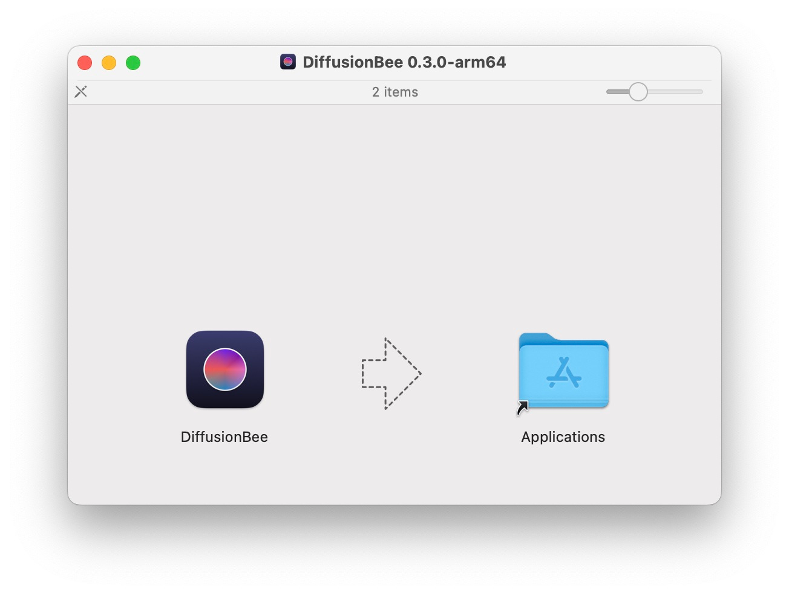](https://substackcdn.com/image/fetch/f_auto,q_auto:good,fl_progressive:steep/https%3A%2F%2Fbucketeer-e05bbc84-baa3-437e-9518-adb32be77984.s3.amazonaws.com%2Fpublic%2Fimages%2Fc4b38512-7994-4735-96b0-68af1d2d5ab9_1304x984.jpeg)

The latest version, 0.3.0, is 2.4GB, and once it runs it also has to download the model weights (about 3.4GB as of this writing, though I’ve seen them over 4GB before).   

最新的版本，0.3.0，是2.4GB，一旦运行，它还必须下载模型权重（截至本文写作时，约3.4GB，尽管我以前看到它们超过4GB）。

[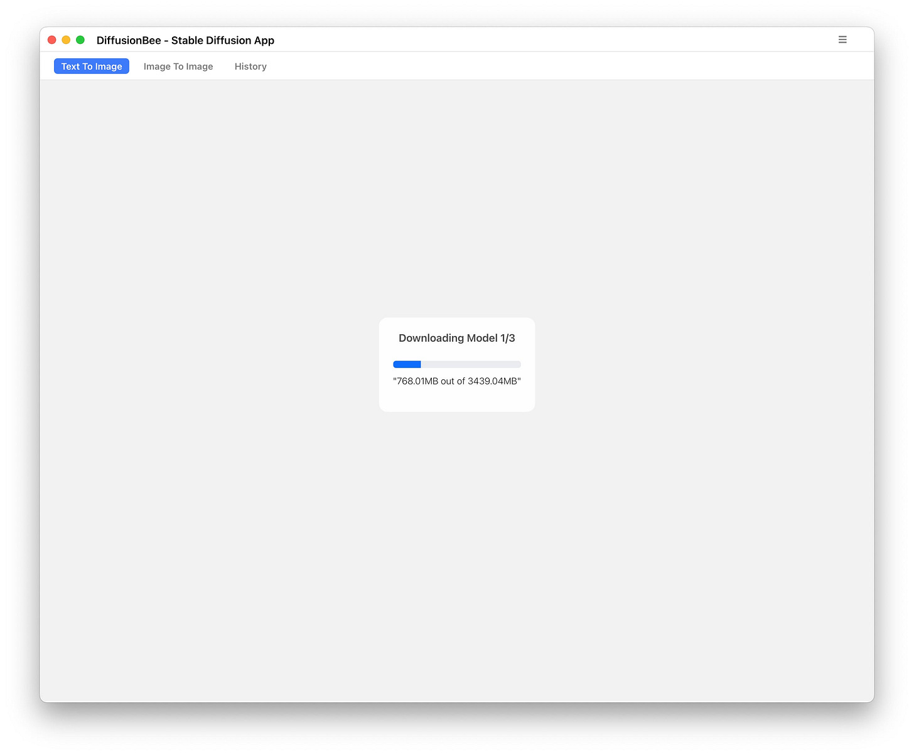](https://substackcdn.com/image/fetch/f_auto,q_auto:good,fl_progressive:steep/https%3A%2F%2Fbucketeer-e05bbc84-baa3-437e-9518-adb32be77984.s3.amazonaws.com%2Fpublic%2Fimages%2Fa01cd373-8e28-4db0-8846-3f87733a621f_2574x2128.jpeg)

I’ve confirmed that if you interrupt the network connection while the weights are downloading, the download pauses and then picks back up when you turn it back on.  

我已经确认，如果你在下载权重时中断网络连接，下载会暂停，然后在你重新打开网络时重新开始。

The interface is shown below, with a rendered prompt:  

界面如下图所示，有渲染的提示。

[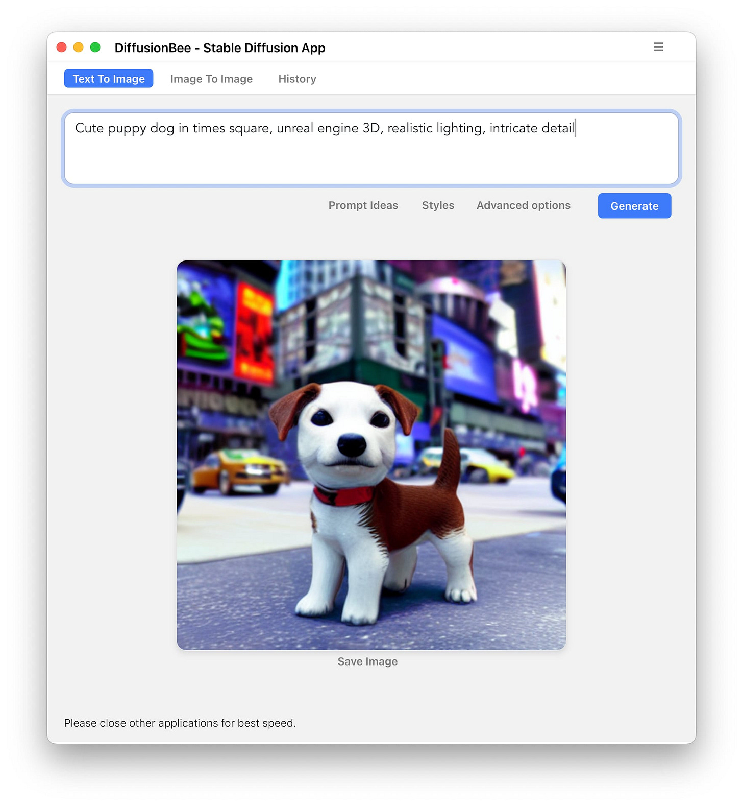](https://substackcdn.com/image/fetch/f_auto,q_auto:good,fl_progressive:steep/https%3A%2F%2Fbucketeer-e05bbc84-baa3-437e-9518-adb32be77984.s3.amazonaws.com%2Fpublic%2Fimages%2Fa9447f66-c853-4b3a-85eb-193048dcd51a_1764x1912.jpeg)

The advanced tab gives you access to the options you’ll want to play with, but there’s one thing missing, and it’s a pretty big omission: the random seed. You can enter your own seed and use it, but if your app generates a seed you’re never going to be able to figure out what it was. I can’t find any place in the UI, including the logs, that tells me what seed I used for a particular image:  

高级选项卡让你可以访问你想玩的选项，但缺少一样东西，而且是一个相当大的遗漏：随机种子。你可以输入你自己的种子并使用它，但如果你的应用程序生成了一个种子，你就永远无法弄清它是什么。我在用户界面上找不到任何地方，包括日志，告诉我我对某一特定图像使用了什么种子。

[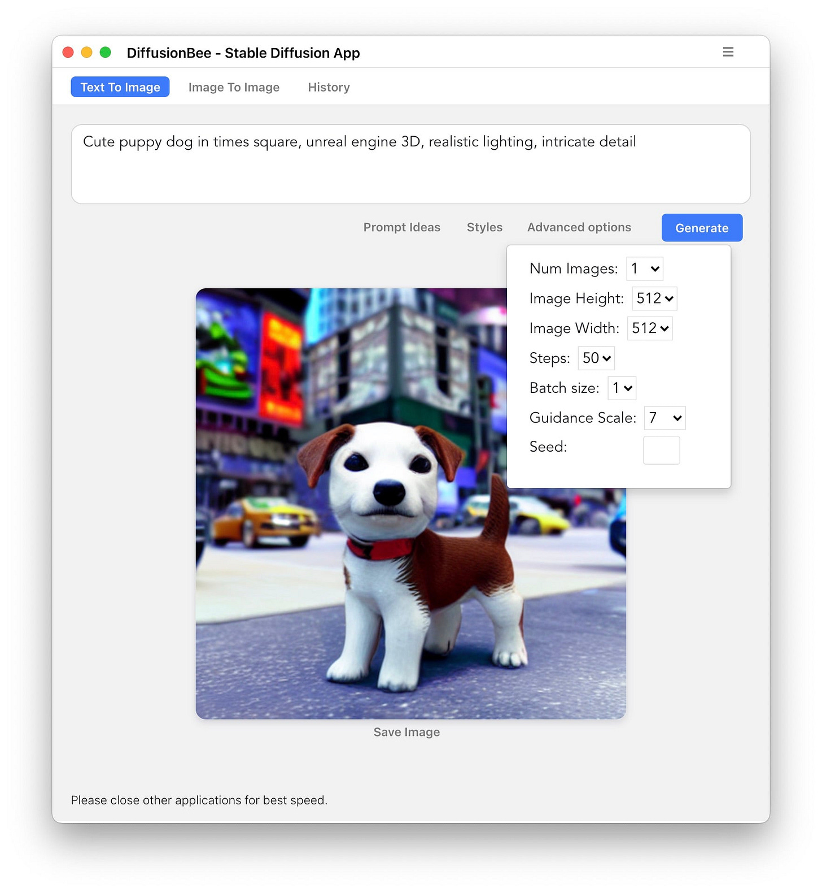](https://substackcdn.com/image/fetch/f_auto,q_auto:good,fl_progressive:steep/https%3A%2F%2Fbucketeer-e05bbc84-baa3-437e-9518-adb32be77984.s3.amazonaws.com%2Fpublic%2Fimages%2F56c6c560-d545-462f-b143-5e5348845270_1764x1912.jpeg)

This lack of a seed extends to the history — it’s only showing the prompts, not the seeds. This is a pretty big shortfall, in my opinion. It can be remedied by always bringing your own seed and keeping track of it somehow, but this is a pain. Hopefully, this seed issue will be fixed in the next version.  

这种缺乏种子的情况延伸到了历史上--它只显示提示，不显示种子。在我看来，这是一个相当大的不足之处。它可以通过总是带着你自己的种子并以某种方式跟踪它来补救，但这是一种痛苦。希望这个种子问题能在下一个版本中得到解决。

[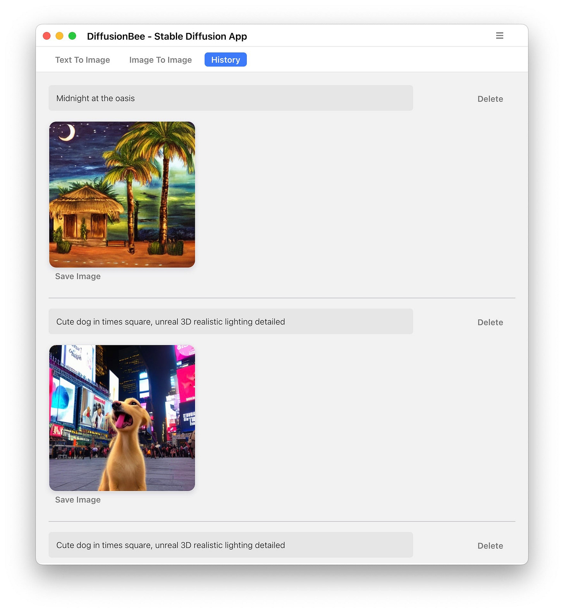](https://substackcdn.com/image/fetch/f_auto,q_auto:good,fl_progressive:steep/https%3A%2F%2Fbucketeer-e05bbc84-baa3-437e-9518-adb32be77984.s3.amazonaws.com%2Fpublic%2Fimages%2Ff843ea27-ba12-47e9-a00f-e22f3d36cc1f_1764x1912.jpeg)

My favorite feature of DiffusionBee so far is this little Styles pallet. You click these styles and it just adds the text string to your prompt. This kind of transparency is the correct way to go about this. (PlaygroundAI does this, too.) I have a ton of style modifier ideas there that are just a click away, and I can edit them easily and save the resulting prompts. I hope other apps imitate this.  

到目前为止，DiffusionBee我最喜欢的功能是这个小小的样式托盘。你点击这些样式，它就把文本字符串添加到你的提示中。这种透明度是正确的方式。(PlaygroundAI也是这样做的。)我在那里有一大堆风格修改器的想法，只要点击一下就可以了，而且我可以轻松地编辑它们，并保存所产生的提示。我希望其他应用程序也能模仿这一点。

**What about using the command line?** you ask. That is a whole other project, but a necessary one (for now) if you want to customize the model with your own images (a.k.a. [textual inversion](https://minimaxir.com/2022/09/stable-diffusion-ugly-sonic/)). That deserves its own dedicated guide.  

你问，使用命令行怎么样？这是一个完全不同的项目，但如果你想用你自己的图像来定制模型（又称文本反转），这是一个必要的项目（目前）。这值得有它自己的专门指南。

[Share](https://www.jonstokes.com/p/getting-started-with-stable-diffusion?utm_source=substack&utm_medium=email&utm_content=share&action=share)
