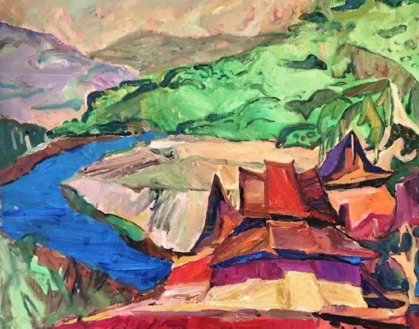

_(This piece is my year in review, this year a bit late; here’s my letter from [2021](https://danwang.co/2021-letter/))  

(这篇稿子是我的年度回顾，今年有点晚，这里是我2021年的信)_

Mountains offer the best hiding places from the state.  

山区为人们提供了最好的藏身之所。

There were a lot of state controls to escape from in 2022. Two days before Shanghai locked down in April, I was on the final flight from the city to Yunnan, the province in China’s farthest southwest. Yunnan’s landmass—slightly smaller than that of California’s—features greater geographic variation than most countries. Its north is historic Tibet, while the south feels much like Thailand. People visit the province for its spectacular nature views: rainforest, rice terraces, fast rivers, and snowy mountains. Otherwise tourists are drawn to its ethnic exoticism. As many as half of the country’s officially-recognized ethnic groups have a substantial presence there, including many of those that have historically resisted Han rule.  

2022年，有很多国家控制措施需要逃离。在4月上海封锁的前两天，我坐上了从上海飞往云南的最后一班飞机，云南是中国最偏远的西南地区的省份。云南的国土面积--略小于加利福尼亚州的国土面积--比大多数国家具有更大的地理差异性。其北部是历史悠久的西藏，而南部则很像泰国。人们访问该省是为了欣赏其壮观的自然景观：雨林、水稻梯田、湍急的河流和雪山。此外，游客还被其民族的异国情调所吸引。全国官方承认的民族中，有多达一半的民族在这里有大量的人口，包括许多历史上曾反抗过汉族统治的民族。

As Shanghai’s lockdown became protracted, a trip planned to last days grew into one that lasted months. Wandering through Yunnan gave me a chance to contemplate the culture of the mountains.  

随着上海的封锁变得旷日持久，原计划几天的旅行变成了持续数月的旅行。在云南的漫游让我有机会思考山区的文化。

They are towering in the north. These are Tibetan areas home to a meaningful chunk of the Himalayas: Yunnan’s highest peak is Kawarkapo, one of Tibetan Buddhism’s most sacred mountains. This region is unbeatable for snowy beauty. The roads around them are strewn with fluttering prayer flags and studded with impassive yaks. Something in the thinness of the air produces more vivid light, which fires up white peaks in brilliant red when the sun is low. I went on several hikes around Kawarkapo and Tiger Leaping Gorge, which offer gorgeous treks through tough terrain.  

它们耸立在北方。这些是藏族地区，是喜马拉雅山的一个重要组成部分。云南的最高峰是川卡波，是藏传佛教最神圣的山峰之一。这个地区的雪景之美无可匹敌。周围的道路上散布着飘扬的祈祷旗帜，镶嵌着无精打采的牦牛。稀薄的空气产生了更生动的光线，当太阳落山时，白色的山峰就会被烧成灿烂的红色。我在卡瓦卡波和虎跳峡周围进行了几次徒步旅行，这些地方提供了穿越艰难地形的华丽徒步旅行。

Northern Yunnan is a site of improbable mixings. Missionaries made headway into these lands in the 19th century, establishing not just a Christian population but also vineyards that continue to produce wine grapes. In a remote valley, I passed by a vineyard owned by LVMH to produce Cabernet, which retail for US$300 per bottle.  

云南北部是一个不可能混合的地方。传教士在19世纪在这些土地上取得了进展，不仅建立了基督徒人口，还建立了继续生产酿酒葡萄的葡萄园。在一个偏远的山谷里，我路过一个由LVMH集团拥有的葡萄园，生产赤霞珠，每瓶零售价为300美元。

The most stimulating parts of this region are not the cities of Lijiang or Shangri-La, but the more remote Tibetan areas. Tibetans have been subject to decades of forced assimilation to Han culture, but they still find room to practice small acts of subversion. One guide told me, for example, that monks have slipped a portrait of the Dalai Lama behind the portrait of the Panchen Lama in their monastery, allowing them to pray in good conscience. These rounds of control and evasion continue to grind on.  

这个地区最刺激的地方不是丽江或香格里拉这些城市，而是更偏远的藏族地区。藏族人几十年来一直受到汉族文化的强制同化，但他们仍然找到了进行小型颠覆活动的空间。例如，一位导游告诉我，僧侣们把达赖喇嘛的画像塞到他们寺院里班禅喇嘛的画像后面，使他们能够凭良心祈祷。这些一轮又一轮的控制和规避仍在继续磨合。

The mountains are gentler in the south. Tea hills are set amidst rainforest and rubber plantations in Xishuangbanna, the prefecture that sits above Laos and Burma. The weather there is sweltering. To cool down, one can take a dip in the Mekong River, which carries remarkably cold water that has flowed from the Tibetan highlands, or eat its tropical fruits: mango, papaya, durian, or so many melons. Xishuangbanna is one of China’s most biodiverse regions, home to thousands of species of trees, as well as wild elephants, peafowl, bears, and birds galore.  

南方的山势比较平缓。西双版纳州的茶山坐落在雨林和橡胶种植园中，该州位于老挝和缅甸之上。那里的天气很闷热。为了降温，人们可以在湄公河里泡澡，那里有从西藏高原流来的非常冰冷的水，或者吃那里的热带水果：芒果、木瓜、榴莲或许多瓜类。西双版纳是中国生物多样性最丰富的地区之一，这里有数千种树木，以及野生大象、雀鸟、熊和大量的鸟。

In southern Yunnan, most of the people have Southeast Asian features. Xishuangbanna hosts around a dozen of China’s official ethnic groups, some of which consist of only a few tens of thousands of people clustered around certain mountains. The most prominent group there is the Dai, while the smaller groups include the Aini, Bulang, and Hani peoples.  

在云南南部，大多数人都有东南亚特征。西双版纳有大约十几个中国官方民族，其中一些民族只有几万人，集中在某些山脉周围。那里最突出的群体是傣族，而较小的群体包括艾尼族、布郎族和哈尼族。

Most make their living off of mountain agriculture, which means planting cash crops like tea, rubber, or bananas (unless they’ve chosen to put on their ethnic dress to cater to tourists). That cultivation intermixes with the foraging of wild herbs, mushrooms, and flowers, along with occasional illicit hunting of game. A more perilous venture would be to traffic narcotics, since the area is right along the Golden Triangle.  

大多数人以山地农业为生，这意味着种植茶叶、橡胶或香蕉等经济作物（除非他们选择穿上民族服装来迎合游客）。这种种植与野生草药、蘑菇和鲜花的采摘混杂在一起，偶尔也会非法猎取野味。更危险的冒险是贩运麻醉品，因为该地区正处于金三角地区。

I ended up spending most time in the north-central city of Dali. It is located in the most temperate part of Yunnan: cooler than Xishuangbanna and sunnier than Shangri-La, bounded by a mountain range to the west and a large lake to the east. The local people are the Bai, whose cultural practices are proximate to the Han’s. My home was a wooden farmhouse in a Bai village at the foot of the mountains. If I stayed closer to the lake, the houses would be made of attractive stone, ornamented with wooden carvings and ink paintings on white wall. The Bai have a long culture of craftmaking, producing marbleware or tie-dye linens for trade.  

我最终在中北部城市大理度过了大部分时间。它位于云南温度最高的地区：比西双版纳凉爽，比香格里拉阳光充足，西边是山脉，东边是一个大湖。当地人是白族人，他们的文化习俗与汉族人相近。我的家是山脚下一个白族村庄的木制农舍。如果我住在离湖边更近的地方，房子就会用迷人的石头做成，用木雕和白墙上的水墨画来装饰。白族人有悠久的手工艺文化，生产大理石器皿或扎染亚麻布用于贸易。

Up until the early 2000s, a different Bai product attracted foreign travelers: cannabis, which grew freely around Dali. Foreigners in Beijing or Shanghai would reminisce about the good old days in Dali, where one could be beckoned by a smiling lady into an alley to purchase a baggie. The cannabis trade has been stamped out.  

直到21世纪初，一种不同的白族产品吸引了外国旅行者：大麻，它在大理周围自由生长。在北京或上海的外国人会回忆起在大理的美好时光，在那里，人们可以被一个微笑着的女士叫到巷子里购买一袋大麻。大麻贸易已被取缔。

Nowadays, it is not foreigners who travel to Dali to toke a joint, but Chinese who visit for a harder drug: cryptocurrency, NFTs, and other web3 paraphernalia. A great deal of China’s crypto community has relocated in recent years to Dali. It is not that the city has wanted to attract them; rather, its appeal is more general.  

如今，到大理旅游的不是外国人，而是中国人，他们到大理是为了寻找一种更硬的毒品：加密货币、NFT和其他网络3类工具。近年来，中国的大量加密货币社区已经迁移到大理。这并不是说这个城市想吸引他们；相反，它的吸引力更普遍。

Dali has sunny weather, nice hikes, and a big lake. I reminisce about its open-air markets, where every morning one can go to pick up fresh vegetables, fruits, rice noodles, and all sorts of pickles. Dali offers fertile farmland, attracting China’s burgeoning organic farmers, who are often youths. It has a significant foreign population that has set up sourdough bakeries, cafés with excellent croissant, and clubs playing techno. The first outdoor rave I came across in China was at an orchard in Dali. It attracts urban families as well: parents of young children would bring kids to nature-focused school programs over summers or full-time before starting primary school back in Shenzhen or Shanghai. Visitors enjoying the sun referred to the city as “Dalifornia.”  

大理天气晴朗，有漂亮的徒步旅行，还有一个大湖。我回忆起它的露天市场，每天早上人们可以去那里买新鲜的蔬菜、水果、米粉和各种腌制食品。大理有肥沃的农田，吸引了中国新兴的有机农民，他们往往是年轻人。这里有大量的外国人口，他们建立了酸面包店，有极好的羊角面包的咖啡馆，还有播放电子音乐的俱乐部。我在中国遇到的第一个户外狂欢活动是在大理的一个果园。它也吸引了城市家庭：有年幼孩子的父母会在夏天或在回到深圳或上海开始上小学之前，把孩子带到以自然为重点的学校课程。享受阳光的游客把这个城市称为 "大理州"。

Yunnan has many other interesting places besides. Kunming, its capital, is not one. That is a city like any other in the PRC, perhaps best analogized to Mexico City: an administrative center of many interesting people and places, but relatively boring compared to them. Tengchong, in Yunnan’s furthest west, is made up of Dai peoples living among volcanic springs; history buffs might visit it for its centrality along the Burma Road. More interesting is Lugu Lake on Yunnan’s northern border with Sichuan, a difficult-to-access place home to the Mosuo people, who form a matriarchal society. In the mountains one can find the Wa people, who are supposed to maintain a tradition of animal sacrifices and human headhunting.  

除此之外，云南还有许多其他有趣的地方。昆明，其首都，不是一个。那是一个与中国其他城市一样的城市，也许最好的比喻是墨西哥城：一个有许多有趣的人和地方的行政中心，但与他们相比却相对无聊。腾冲位于云南最西部，由生活在火山泉中的傣族人组成；历史爱好者可能会因为它在缅甸路的中心位置而去参观。更有趣的是位于云南北部与四川交界处的泸沽湖，这是一个难以进入的地方，是摩梭人的家园，他们形成了一个母系社会。在山区，人们可以找到佤族人，他们应该保持着以动物为祭品和猎取人头的传统。

**Climbing out of civilization  

从文明中爬出来**

Mountains have always beckoned to dissenters, rebels, and subversives. It is not only the air that thins out at higher elevations: the tendrils of the state do too. Small bands of people only need to hike a while to find a congenial refuge in the mountains; it’s far harder for imperial administrators with their vast caravans to locate all the hideouts. Throughout history, therefore, people have climbed upwards to escape the state. It is not only to take leave of the irksome suction of the tax collector; it’s also to break free of the problems that accompany dense populations—epidemics, conscription, and the threat of state-scale warfare. As a consequence, people who dwell in the mountains tend to be seen as unruly folks, be they Appalachian Americans or Highland Scots.  

山区一直在向异议者、反叛者和颠覆者招手。不仅是空气在高海拔地区变稀薄：国家的卷轴也是如此。一小群人只需要徒步走一会儿就能在山里找到一个合适的避难所；而帝国的行政官员带着他们庞大的商队要找到所有的藏身之处就难多了。因此，在整个历史上，人们一直在向上攀登，以逃避国家。这不仅是为了摆脱征税人的烦人的吸力；也是为了摆脱伴随人口密集的问题--流行病、征兵和国家规模的战争的威胁。因此，居住在山区的人往往被视为不守规矩的人，无论他们是阿巴拉契亚的美国人还是高地的苏格兰人。

Yunnan has been a distinguished refuge for peoples tired of the state. It is the heart of a vast zone of highland Southeast Asia described by James C. Scott in _The Art of Not Being Governed_—the best book I read this year (and which I will be drawing on throughout this piece). Scott writes about the innumerable hill peoples who have repaired to these mountains over the last several millennia, escaping oppression from the Burmese state, the Tibetan state, or most often, the Han-Chinese state.  

云南一直是厌倦国家的人民的一个杰出的避难所。它是詹姆斯-C-斯科特（James C. Scott）在《不被统治的艺术》（The Art of Not Being Governed）中描述的东南亚高原广大地区的中心，这是我今年读到的最好的书（我将在这篇文章中借鉴）。斯科特写道，在过去的几千年里，无数的山地人为了逃避缅甸、西藏或最常见的汉族国家的压迫，纷纷来到这些山区。

In Scott’s telling, early states (of several millennia up to a few centuries ago) did not grow because people were drawn towards “civilization” or a luminous court center. They grew because the domineering temper of a rice- or wheat-addicted despot demanded ever greater populations to produce grain surpluses for the glory of his court. The process was dialectical, as wars made the state, and the state made war. Thus most of the people in a population core consisted of captives seized in a military victory or purchased from raiders. Scott goes so far to claim that where one can find an early state, there one will find a population core sustained by coerced labor.  

在斯科特的讲述中，早期国家（几千年前到几个世纪前）的发展并不是因为人们被吸引到 "文明 "或光辉的宫廷中心。它们的增长是因为大米或小麦成瘾的暴君的霸道脾气要求越来越多的人口为他的宫廷的荣耀生产粮食盈余。这个过程是辩证的，因为战争造就了国家，而国家又造就了战争。因此，人口核心中的大多数人都是在军事胜利中缴获的俘虏或从突袭者手中购买的。斯科特甚至声称，凡是能找到早期国家的地方，都能找到靠强迫劳动维持的人口核心。

His case is that the civilization that arose from sedentary farming made people worse—in terms of health, safety, and liberty—before they made society better. Before mass cultivation of grains, most people were foragers of some sort. And they have tended to be more robust and healthy than farmers tied to a single plot of land, who faced constant danger of state appropriation, epidemic diseases, and losing everything in an environmental disaster. It’s easier to understand that there has been intense resistance by peoples everywhere to state efforts to make them sedentary, whether in Central Asia or North America—accepting that fate only after a military defeat.  

他的观点是，从定居农业中产生的文明在使社会变得更好之前，使人们在健康、安全和自由方面变得更糟。在大规模种植谷物之前，大多数人是某种形式的觅食者。他们往往比被束缚在一块土地上的农民更加强壮和健康，后者面临着国家侵占、流行病和在环境灾难中失去一切的持续危险。更容易理解的是，无论在中亚还是在北美，各地人民对国家让他们定居的努力都有强烈的抵抗--只有在军事失败后才接受这种命运。

In mountains they tend to be more safe.  

在山区，他们往往更安全。

And that, Yunnan has in abundance. The peoples who escape into the rugged highlands of Southeast Asia tend to have, in Scott’s telling, state-repellent practices. That includes cultivating diverse and shifting root crops, which are less assessable by the tax collector; adopting relatively egalitarian social structures; and practicing an oral culture, which helps to make histories and ethnic identities more malleable. These ethnic tribes have thus become “barbarians by design.” Still today, Yunnan remains one of the poorest provinces in China. The mountainous geography makes its economy more ideal for agriculture and tourism than technologically-intensive industries.  

而这一点，云南有很多。用斯科特的话说，那些逃到东南亚崎岖高原的民族往往有一些让国家讨厌的做法。这包括种植多种多样的根茎类作物，这些作物不容易被征税人评估；采用相对平等的社会结构；实行口头文化，这有助于使历史和民族身份更具可塑性。因此，这些民族部落已经成为 "设计好的野蛮人"。今天，云南仍然是中国最贫穷的省份之一。多山的地理环境使其经济更适合于农业和旅游业，而不是技术密集型产业。

It became a quietly thrilling experience to read about this highland zone while I wandered around in Yunnan. Scott writes that state administration learned to climb into the mountains by the end of the Second World War, after the deployment of railroads, telephone, helicopters, and later, information technology. But I certainly feel that the culture of Yunnan remains different from the imperial cores of Beijing and Shanghai.  

当我在云南闲逛时，阅读关于这个高原地区的资料，成了一种静静的惊险经历。斯科特写道，第二次世界大战结束时，在部署了铁路、电话、直升机以及后来的信息技术之后，国家行政部门学会了爬到山里。但我当然感觉到，云南的文化仍然不同于北京和上海的帝国核心。

Official initiatives often run out of breath before these rugged hills. These mountains protected various retreating armies, including Nationalist troops, which were not fully rooted out from the region until the early 1960s. They protected people during the Great Leap Forward, when people climbed up to forage for food. They protected villagers even during the Cultural Revolution: “When Red Guards climbed into the highlands, they found few people, no one obviously wealthy to direct their attacks upon, and little to eat. They would then just harangue the villagers for a while, stage a noisy demonstration, and then go back down the mountain, not very eager to return.”  

官方举措在这些崎岖不平的山丘前往往会耗尽气力。这些山峰保护了各种撤退的军队，包括国民党军队，直到1960年代初才从该地区完全根除。它们在大跃进期间保护了人们，当时人们爬上山去觅食。甚至在文化大革命期间，他们也保护着村民。"当红卫兵爬上高地时，他们发现人很少，没有明显的富人可以直接攻击，也没有什么东西可以吃。他们就会对村民进行一段时间的骚扰，进行一次嘈杂的示威，然后就下山了，不怎么想回来。"

Yunnan is a province that resists efficient administration even today. In general, rules in Yunnan are not consistently enforced. Is that because the officials are lazy or incompetent? Who cares, probably both. I saw how villagers circumvented regulations that threatened their way of life. The most important event to happen over the past decade was a visit from Xi Jinping in 2015, when the top leader admonished local officials to clean up the lake. Officials then jumped to implement the order. Among their measures was to direct all water from the mountains to flow into the lake. Villagers who were used to spring water from the mountains for their drinking and food production now had to drink treated water.  

即使在今天，云南也是一个抵制有效管理的省份。总的来说，云南的规则没有得到持续执行。这是因为官员们懒惰还是无能？谁在乎呢，可能都是。我看到村民如何规避威胁他们生活方式的法规。过去十年发生的最重要事件是习近平在2015年的一次访问，当时这位最高领导人告诫地方官员清理湖泊。随后，官员们开始执行这一命令。他们的措施之一是引导所有来自山区的水流入湖中。习惯于用山上的泉水来饮用和生产食物的村民现在不得不饮用经过处理的水。

Locals spoke of that water diversion as one of the most upsetting things in village history. It was not that they objected to cleaning up the lake. It was that a word from the top leader prompted local officials to deny them the best water in China, while making an at-best-minimal contribution to the cleanup. Their response was to climb further up the mountains and lay new pipes to send water to the village temple. They taught me to bring my own jugs to fill up there.  

当地人说，那次引水是村里历史上最令人不安的事情之一。这并不是说他们反对清理湖水。而是因为最高领导人的一句话，促使当地官员拒绝向他们提供中国最好的水，同时对清理工作作出最起码的贡献。他们的反应是进一步爬上山，铺设新的管道，把水送到村里的寺庙。他们教我带着自己的水壶去那里装水。

Local officials came to the village temple not with hammers to smash these pipes, but with their own jugs for filling up. Here, it is still possible to navigate around senseless directives from the central government. Dali’s culture of open drug use may have dissipated, but the region retains an ineffectualness. Distance from the party center is one reason that Yunnan has drawn a growing number of emigrés tired of the city life. That emigration accelerated this year, as the oppressiveness in big cities grew intense.  

地方官员来到村里的寺庙，不是带着锤子来砸这些管道，而是带着自己的水壶来装水。在这里，仍有可能绕过中央政府的无意义的指令。大理公开使用毒品的文化可能已经消散，但该地区仍保留着一种无效的状态。与党中央的距离是云南吸引越来越多厌倦城市生活的移民的原因之一。今年，随着大城市的压迫感越来越强烈，这种移民加速了。

**Lockdowns  

锁定**

Throughout the three years of the pandemic, China developed a weightier state apparatus, one better able to impress itself against its subjects. The government at all levels, especially local, has gained new authorities to be more intrusive into people’s lives.  

在大流行病的三年中，中国发展了一个更重的国家机器，一个更能够对其臣民留下深刻印象的机器。各级政府，特别是地方政府，获得了新的权力，可以更多地介入人民的生活。

Shanghai experienced the brunt of these measures in the spring.  

上海在春天经历了这些措施的首当其冲。

Anxiety levels grew steadily over March. Shanghai became hushed as entire residential compounds (some of which have thousands of people) were told that they were not allowed to exit from their homes for up to a fortnight due to their proximity to a positive case; as restaurants were told they must close; and as officials made multiple demands that everyone in certain districts must take a PCR test. By the end of March, it was apparent that these measures could not stop omicron. So Shanghai announced that the city would lock down, in two phases: the eastern half (Pudong) on March 27th for four days, and the western half (Puxi, where I lived) on April 1st for four days. What did lockdown mean? The ability to step foot outside one’s doorway. A fortunate few might be permitted to venture outside their apartment building, but not the residential compound.  

焦虑的程度在3月份稳步增长。当整个住宅区（其中一些有数千人）被告知由于接近阳性病例而在长达两周的时间内不允许离家；当餐馆被告知必须关闭；当官员们多次要求某些地区的每个人都必须进行PCR测试时，上海变得安静了。到3月底，这些措施显然不能阻止奥米加。因此，上海宣布全市封锁，分两个阶段：东半部（浦东）于3月27日封锁4天，西半部（浦西，我住的地方）于4月1日封锁4天。封锁意味着什么？能否踏出自己的门槛。少数幸运的人可能被允许冒险走出他们的公寓楼，但不能走出住宅区。

Shanghai’s lockdown would last more than four days: it ended after eight weeks. 25 million people were unable to leave their home or residential compounds between April and May. (Some even longer, as their compounds started locking down in March.) The main exception was the ability to go out for rounds of PCR tests conducted daily or every few days.  

上海的封锁将持续四天以上：八周后结束。在4月和5月之间，有2500万人无法离开他们的家或住宅区。(一些人甚至更久，因为他们的院子在3月就开始封锁了。）主要的例外是可以每天或每隔几天出去做几轮PCR测试。

The March 27th announcement came after city officials repeatedly denied that they would impose a full lockdown. That robbed a sense of urgency among most of my friends to stockpile essential supplies. I didn’t stockpile either, but I did decide to leave. Within an hour of the announcement, I had booked a plane ticket to Yunnan. Most people in Shanghai would suffer a bleak April.  

3月27日的公告是在市政府官员一再否认他们将实施全面封锁之后作出的。这使我的大多数朋友失去了储备必需品的紧迫感。我也没有储备，但我确实决定离开。在公告发布后的一个小时内，我订了一张去云南的机票。上海的大多数人都会在4月遭受凄凉。

Food became the overwhelming concern. Fresh vegetables and fruits ran out after a week or so. The government promised to deliver food, but that proved a logistical impossibility for a city of 25 million people: truck drivers couldn’t deliver their freight into the city, and the produce either was not enough to go around or spoiled by ultimate delivery. Nearly all my friends told me that there were a few days in mid-April when they dealt with serious food insecurity. Some with children fasted to save food for the kids. Many friends spent most of their waking hours trying to procure food, often getting up at the crack of dawn to place orders. The situation took about three weeks to improve, as people managed to set up inefficient group-buying networks, or the government-run food logistics system worked out its issues.  

食物成为压倒性的关切。新鲜的蔬菜和水果在一个星期左右就用完了。政府承诺提供食物，但事实证明，对于一个拥有2500万人口的城市来说，这在后勤方面是不可能的：卡车司机无法将货物送入城市，而农产品要么不够用，要么在最终交付时变质。几乎所有的朋友都告诉我，4月中旬有几天，他们遇到了严重的粮食不安全问题。一些有孩子的人禁食，以便为孩子们节省食物。许多朋友花了大部分清醒的时间去采购食物，经常在黎明时分起床下订单。随着人们设法建立起低效的团购网络，或者政府管理的食品物流系统解决了问题，情况在大约三周后才得到改善。

There were other problems. Anyone with a health condition was gripped by fear that their medications would run out. Everyone hoped that they wouldn’t need to access hospital treatment. One friend broke an ankle shortly before the lockdown, spending two months bedbound as she awaited surgery. Another developed a hernia. A third friend’s uncle died because he had diabetes and could not go for dialysis treatments.  

还有其他问题。任何有健康问题的人都被担心他们的药物会用完的恐惧所笼罩。每个人都希望他们不需要去医院治疗。一位朋友在封锁前不久摔断了脚踝，在等待手术的过程中卧床休息了两个月。另一位朋友患上了疝气。第三个朋友的叔叔死了，因为他有糖尿病，不能去做透析治疗。

The situation worsened if one tested positive. A trip to a centralized quarantine facility (often a bed in a convention center) would await. That was sometimes the least concern. The city’s policy was to separate children from their parents if either tested positive; fear of separation drove parents mad with worry, until an outcry prompted the city to drop the policy.  

如果一个人测试结果呈阳性，情况就会恶化。等待他们的将是前往集中的检疫设施（通常是会议中心的一张床）。这有时是最令人担忧的。该市的政策是，如果孩子的检测结果呈阳性，就将他们与父母分开；对分离的恐惧使父母担心得发狂，直到有民众抗议，促使该市放弃这一政策。

Dog-owners who couldn’t find another household willing to host their pet had to decide whether to leave it alone at home for the duration of their illness; or let it loose outside and hope for the best. (A viral video of a health worker beating a corgi to death with a shovel did not help to make the decision easier.)  

那些找不到其他家庭愿意接纳他们的宠物的狗主人不得不决定是否在他们生病期间将其单独留在家中；或者将其放养在外面，希望能有好的结果。(一个卫生工作者用铲子将一只柯基犬打死的病毒视频并没有帮助他们做出更容易的决定）。

A positive test would summon cleaning staff into one’s home, who could soak everything—clothes, books, furniture—in disinfectant.  

如果测试结果呈阳性，清洁人员就会被召入家中，他们可以将所有东西--衣服、书籍、家具浸泡在消毒剂中。

For some people, these two months were not too dreadful. The elderly would say that the lockdown wasn’t the worst thing to happen to their lives, pointing to the Cultural Revolution. A feeble joke circulated that Shanghai achieved “common prosperity,” one of Xi’s signature initiatives, in China’s most capitalist city a decade ahead of schedule because everyone had the same standard of living. Some people built camaraderie with neighbors that they otherwise would never have gotten to know, ties which endured long after lockdown. Other people of privilege might find steadier access to food or were able to wrangle a permit to go outside.  

对一些人来说，这两个月并不是太可怕。老人会说，封锁并不是他们生活中最糟糕的事情，指的是文化大革命。一个无力的笑话流传开来，上海提前十年实现了 "共同富裕"，这是习近平的标志性举措之一，在中国这个资本主义最发达的城市，因为每个人都有同样的生活标准。一些人与邻居建立了友谊，否则他们永远不会认识这些邻居，这些关系在封锁后持续了很长时间。其他有特权的人可能会找到更稳定的食物来源，或者能够获得外出许可。

But the situation grew desperate for a broader mass of folks. Banging pots and pans outside one’s window became a common form of protest; occasionally someone would be caught on camera screaming denunciations of the regime.  

但是，对于更多的人来说，情况越来越令人绝望了。在窗外敲打锅碗瓢盆成为一种常见的抗议形式；偶尔会有人被拍到，大声谴责这个政权。

For young people in particular, the lockdown came as an immense shock. They tried to speak up on social media.  

特别是对年轻人来说，封锁是一个巨大的冲击。他们试图在社交媒体上发声。

And the state responded with staggering levels of censorship. Weibo censored the first line of the national anthem: “Arise, you who refuse to be slaves.”  

而国家则以惊人的审查水平作为回应。微博对国歌的第一句话进行了审查。"起来，拒绝做奴隶的人们"。

It stopped reposts of a National People’s Congress spokesperson’s remark that hard quarantines may be unlawful.  

它阻止了对全国人民代表大会发言人关于硬隔离可能是非法的言论的转贴。

At one point, social media platforms blocked the word “Shanghai” from search results.  

社交媒体平台一度将 "上海 "一词从搜索结果中屏蔽。

Psychologically, the most difficult thing was that no one knew how long the lockdown would last: a few days or a few weeks more. Every so often a video would circulate that purported to show someone who jumped from a balcony. Friends spoke about three types of shock. First, the raw novelty of extended physical confinement. Second, the wonder of feeling food insecure in this age and in this city. Third, a disenchantment with government pronouncements. Many people kicked themselves for trusting officials who said that Shanghai would impose no lockdown. They saw how positive cases in their own neighborhoods would be absent from the city’s data releases. And they shared a recording of a health official who said that these controls were unscientific.  

在心理上，最困难的是，没有人知道封锁会持续多久：几天或几周以上。每隔一段时间就会流传一段视频，据称是有人从阳台上跳下。朋友们谈到了三种类型的震惊。首先，长时间的身体禁锢带来的原始新奇感。第二，在这个时代，在这个城市，感到食物不安全的奇妙。第三，对政府声明的不信任。许多人自责相信那些说上海不会实行禁闭的官员。他们看到他们自己社区的正面案例如何在城市的数据发布中消失。他们还分享了一位卫生官员的录音，他说这些控制是不科学的。

Case numbers peaked in Shanghai by late-April. In June, the city lifted the lockdown. At that point, many foreigners had departed the country (after an arduous negotiation with neighborhood officials to be allowed to go to the airport), some for good. Many Shanghainese who didn’t go abroad would come to Yunnan. China then enjoyed around three months of relative calm in terms of Covid controls.  

4月下旬，上海的病例数达到了顶峰。6月，该市取消了封锁。当时，许多外国人已经离开了中国（在与附近的官员进行了艰苦的谈判后，被允许去机场），有些人是永远离开了。许多没有出国的上海人则来到了云南。随后，中国在科威德管制方面享有大约三个月的相对平静。

By the time I went back to Shanghai in the summer, the city looked like it had substantially returned to normal. Two of my favorite restaurants had shut down, but otherwise the city was back to life. There was one substantial change to routine. The government demanded that every resident take a PCR test every 72 hours to enter any public venue. They enforced this requirement through contact-tracing apps: health workers would scan one’s QR code before a test; and every store or restaurant would demand a scan of the site’s QR code, both to establish location tracking and also to see evidence of a recent test. The process didn’t end up being too cumbersome since tests were free and sites were abundant. But one faced the risk of being unable to enter a space if it slipped one’s mind to test in time.  

当我在夏天回到上海的时候，这个城市看起来已经基本上恢复了正常。我最喜欢的两家餐馆已经关闭，但除此之外，这个城市又恢复了活力。日常工作有一个重大变化。政府要求每个居民每72小时进行一次PCR测试，以进入任何公共场所。他们通过接触追踪应用程序来执行这一要求：卫生工作者会在测试前扫描一个人的二维码；每个商店或餐馆都会要求扫描该地点的二维码，以建立位置追踪，并查看最近测试的证据。由于测试是免费的，而且网站很多，这个过程最终并不繁琐。但是，如果忘记了及时测试，就会面临无法进入某个空间的风险。

The system kept caseloads low in Shanghai. But through the fall, other regions failed to tame omicron. The situation was bad in several areas: Chongqing, Xinjiang, Henan, and other regions were dealing with rising caseloads that would not drop after a lockdown. People had also grown weary of extraordinary controls. Two incidents had already drawn broad outrage: after a pregnant woman in Xi’an miscarried because the hospital would not admit her without a negative test  

该系统使上海的案件量保持在低水平。但是到了秋天，其他地区未能驯服Omicron。有几个地区的情况很糟糕。重庆、新疆、河南和其他地区正在处理不断上升的案件数量，这些案件在封锁后不会下降。人们也对非常规管制感到厌倦。有两起事件已经引起了广泛的愤怒：西安的一名孕妇流产了，因为医院不允许她在没有测试结果的情况下入院。

; and after a bus carrying people late at night to a quarantine facility derailed in Guizhou, killing 27.  

在贵州，一辆深夜载人前往检疫设施的巴士出轨，造成27人死亡。

These incidents made people say that measures to control the virus were hurting more people than the virus itself.  

这些事件使人们说，控制病毒的措施比病毒本身伤害了更多人。

Cases started to rise after the party congress in mid-October, this time in the crucial city of Beijing. The capital had kept cases low throughout the year with tight social controls. By November, it looked like Beijing might lock down as Shanghai did.  

10月中旬的党代会之后，病例开始上升，这次是在关键城市北京。在整个一年中，首都通过严格的社会控制将病例保持在低水平。到了11月，看起来北京可能会像上海那样被封锁。

**Protests  

抗议活动**

The government announced measures in November to “optimize” controls, citing the need to reduce their economic impact. These measures gave several local governments the opportunity essentially to abandon restrictions. Beijing and Shanghai weren’t ready to do that. They started to tighten restrictions. That’s when protests began.  

政府在11月宣布了 "优化 "控制措施，称需要减少其经济影响。这些措施使一些地方政府有机会从根本上放弃限制。北京和上海还没有准备好这样做。他们开始收紧限制。这时，抗议活动开始了。

The protests were dispersed across several cities within a short span of time. Two attracted the most attention: those in Shanghai and those at Foxconn facilities in Henan. I was in Shanghai then. WeChat posts had started to circulate on a Saturday evening calling for people to attend a vigil on Urumqi Road in the old French Concession. They were commemorating victims of an apartment fire in Urumqi, Xinjiang, where ten people died the week before.  

抗议活动在很短的时间内分散在几个城市。有两个城市最引人注意：上海和河南的富士康工厂。当时我在上海。在一个星期六的晚上，微信帖子开始流传，呼吁人们参加在老法租界的乌鲁木齐路上的守夜活动。他们是为了纪念新疆乌鲁木齐公寓火灾的受害者，一周前有10人死亡。

Details were hazy, but people speculated that pandemic controls blocked firefighters from reaching the site. By then, everyone had expressed fears of fire hazards after they saw how authorities would block people from leaving home.  

细节很模糊，但人们推测，大流行病的控制阻止了消防员到达现场。那时，在看到当局如何阻止人们离家后，每个人都对火灾隐患表示担心。

I had gone to bed by the time the vigil started in earnest at midnight that Saturday. The next morning I saw the videos on social media: rows of police facing off against youths, who at some points started to chant “down with the Communist Party” and “Xi Jinping step down.” I lived near Urumqi Road, which is a bar and café district containing a lot of the city’s foreign population. Of course I had to go and see. When I went to the intersection on Sunday afternoon, people and police milled around, but there wasn’t much by way of big demonstrations. They would start again later in the evening, by which time police made a more systematic effort to clear the zone. They put up barricades, made people disperse, arrested some, thus halting the protests. Afterwards I was surprised that the police moved so slowly, waiting only until the second night to erect barricades.  

那个星期六的午夜，当守夜活动正式开始时，我已经睡了。第二天早上，我在社交媒体上看到了这些视频：一排排警察与年轻人对峙，他们在某些时候开始高呼 "打倒共产党 "和 "习近平下台"。我住在乌鲁木齐路附近，那里是一个酒吧和咖啡馆区，有很多城市的外国人口。我当然要去看看。周日下午我去十字路口的时候，人们和警察在周围徘徊，但并没有什么大的示威活动。他们会在傍晚时分再次开始，届时警察会做出更系统的努力来清理这个区域。他们设置了路障，让人们散开，逮捕了一些人，从而制止了抗议活动。事后我很惊讶，警察的行动如此缓慢，直到第二天晚上才竖起路障。

In area and duration, the Shanghai protests were small: a single city block over the course of two nights. But they stunned many of us in China who never expected to witness open demonstrations. Protests took place in a few other cities, but they were overwhelmingly around pandemic restrictions per se. I believe that it’s no accident that protests turned political in Shanghai, after the city’s trauma of an eight-week lockdown.  

从面积和持续时间来看，上海的抗议活动规模不大：在两个晚上的时间里，只有一个城市街区。但是他们震惊了我们许多在中国的人，他们从来没有想到会看到公开的示威活动。其他几个城市也发生了抗议活动，但它们绝大多数是围绕大流行病限制本身。我相信，在上海经历了为期八周的封锁后，抗议活动变成了政治活动，这并不是偶然的。

**From Zero Covid to Total Covid  

从零科维德到总科维德**

The state abandoned zero-Covid in December. Was that due to the protests? I expect that protests dealt the coup de grace, but they were not the main force. Local governments and the population had already been on the brink of exhaustion: severe lockdowns in various places could not bring down omicron after several weeks. Beijing looked at that situation and wondered whether the central government would be able to enforce a Shanghai-style lockdown on the population of the capital, which is meant to enjoy the greatest political pampering. On December 7, the central government abandoned most pandemic control measures. And so the virus came.  

国家在12月放弃了零科维德。那是由于抗议活动吗？我估计抗议活动是政变的关键，但它们不是主要力量。地方政府和民众已经到了精疲力竭的边缘：各个地方的严重封锁在几周后也无法使奥米加下降。北京看着这种情况，想知道中央政府是否能够对首都的民众实施上海式的封锁，而首都的民众是要享受最大的政治呵护的。12月7日，中央政府放弃了大多数大流行病控制措施。就这样，病毒来了。

I caught Covid on December 23. Most people I knew in Beijing and Yunnan had fallen sick a week or two earlier, but Shanghai had managed to delay its wave. The city was on course to tighten controls before the central government let loose: Shanghai demanded that people have a 48 hour test result (shortened from 72) to enter public venues. Then, in what I think will be a footnote lost in history, it barred people who traveled to Shanghai from going to most public venues for five days.  

我是在12月23日染上科维德的。我在北京和云南认识的大多数人在一两个星期前就生病了，但上海设法推迟了它的浪潮。在中央政府松动之前，该市就已经开始加强控制。上海要求人们有48小时的测试结果（从72小时缩短）才能进入公共场所。然后，我认为这将是一个湮没在历史中的注脚，它禁止到上海旅游的人在五天内进入大多数公共场所。

The local government did not seem ready to abandon its fine-tuned system for stopping the spread of omicron.  

当地政府似乎并不准备放弃其微调的系统来阻止欧米茄的传播。

No one else seemed prepared either. It certainly didn’t make sense to me that the state would drop all controls before the coldest month of the winter and before allowing households to prepare. Doctors and nurses had no special warning, leaving them to face a surge in patients. The propaganda authorities had no special warning, as they shifted from declaring that the virus must be stomped out in one week to declaring that health outcomes are ultimately the responsibility of the individual in the next.  

其他人似乎也没有准备。在我看来，国家在冬季最冷的月份之前，在允许家庭做准备之前，放弃所有的控制，这当然是不合理的。医生和护士们没有特别的警告，让他们面对激增的病人。宣传部门也没有特别的警告，因为他们在一周内从宣称必须消灭病毒转变为宣称健康结果最终是个人的责任。

 The Shanghai government did not appear to have special warning, since it was tightening its controls.  

上海政府似乎没有特别的警告，因为它正在加强控制。

For me, the most astonishing part of the abrupt abandonment of zero-Covid has to do with fever medications (like ibuprofen and paracetamol). The government had over the last three years put up obstacles for people to purchase fever meds. Health authorities feared that people might self-medicate at home rather than submit to the quarantines. So pharmacies would be ordered to remove fever meds from their shelves during an outbreak, or they would demand customers to furnish their national ID for contact tracing. That deterred purchases, and, I suspect, greater production by manufacturers. Therefore much of the Chinese population met their Covid wave without much fever meds on hand. As best as I can tell, China is the only country that followed a twisted logic to deny people fever medications during a fever-producing pandemic.  

对我来说，突然放弃零科维德最令人吃惊的部分与发烧药（如布洛芬和扑热息痛）有关。在过去三年里，政府为人们购买发烧药设置了障碍。卫生当局担心人们可能会在家里自行用药，而不是服从隔离措施。因此，在疫情爆发期间，药店会被命令将发烧药从货架上撤下来，或者要求顾客提供他们的国民身份证，以便追踪接触者。这阻止了购买，而且，我怀疑制造商的生产量也会增加。因此，许多中国人在手头没有多少发烧药的情况下就遇到了科维德疫情。据我所知，中国是唯一一个在发烧大流行期间遵循扭曲的逻辑拒绝给人们提供发烧药物的国家。

As Covid descended, the government tried to assure everyone that the virus is not so deadly. But whom did the propaganda authorities wheel out to deliver that comforting message? The same experts who weeks ago were saying that it would be extraordinarily irresponsible to abandon controls. One person who stayed silent was top leader Xi Jinping. He has obliquely acknowledged the abandonment of zero-Covid, referencing hard times in generic terms. He did not explain the reversal of a policy he has personally insisted on, or give comfort to a people who would face a disease that propaganda authorities spent three years terrifying them about. Neither did anyone else in the central leadership.  

随着科维德的降临，政府试图向所有人保证，这种病毒并不那么致命。但是，宣传部门让谁来传达这一安慰性的信息呢？就是那些几周前还在说放弃控制是非常不负责任的专家。一个保持沉默的人是最高领导人习近平。他已经间接承认了放弃零科威德的做法，用一般的措辞提到了困难时期。他没有解释他个人所坚持的政策的逆转，也没有安慰那些将要面对宣传部门花了三年时间吓唬他们的疾病的人民。中央领导层中的其他人也没有这样做。

The government’s strategy to comfort the population was to suppress data on death. I can sympathize with the intent to prevent mass panic. But I feel it’s unfair for Beijing to spend over two years mocking the west for high death counts and then improperly report its mortality data. (As of March 4th, the official number of Covid deaths in China was 87,468.) I suspect that China really did manage to avoid many millions dead: because omicron was really less severe, or Chinese vaccines work better than expected, or something else. But we’ll likely never know for sure.  

政府安慰民众的策略是压制有关死亡的数据。我可以同情防止大规模恐慌的意图。但是我觉得北京花了两年多的时间嘲笑西方国家的高死亡人数，然后不适当地报告其死亡数据，这是不公平的。(截至3月4日，中国官方的科维德死亡人数为87,468人。)我怀疑中国确实设法避免了数百万人的死亡：因为欧米茄确实不那么严重，或者中国的疫苗比预期的效果好，或者其他原因。但我们很可能永远无法确定。

Already by mid-January, Shanghai would once more be hopping. Bars and restaurants were full with people excited to return to normal life. I’m glad that I’ve lived through the entire Covid pandemic in China, from February 2020 (when I was in Beijing) through its end by January 2023. Everyone is glad that the controls are at last over and that the death count felt relatively low rather than obviously high. But I believe that re-opening didn’t need to be so abrupt.  

到1月中旬，上海将再次热闹起来。酒吧和餐馆里挤满了为恢复正常生活而兴奋的人们。我很高兴我经历了中国的整个科维德大流行，从2020年2月（我在北京的时候）到2023年1月结束。每个人都很高兴，控制终于结束了，死亡人数感觉相对较低，而不是明显的高。但我相信，重新开放并不需要如此突然。

I wonder how other Shanghainese are thinking. My local friends say that they were taken twice to the cleaners: first when they couldn’t stockpile essentials in April, second when they couldn’t stockpile medicine in December. They wonder why Beijing would impose such a hard lockdown in the spring if it was going to drop everything in the winter: was it only because the central government held pandemic controls hostage to a political event, namely the party congress in October? I suspect that there would be no obvious sign of Shanghainese discontent. But I think there will be a residue of resentment, manifesting unpredictably.  

我想知道其他上海人是怎么想的。我的当地朋友说，他们两次被带到了清洁工那里：第一次是在4月份他们无法储存必需品，第二次是在12月份他们无法储存药品。他们想知道，如果北京打算在冬天放弃一切，为什么还要在春天实施如此严厉的封锁：难道仅仅是因为中央政府将大流行病控制作为政治事件的人质，即十月的党代会？我怀疑不会有明显的上海人不满的迹象。但我认为会有残留的怨恨，表现得难以预料。

**Revelry or growth?  

狂欢还是成长？**

How should we reflect on 2022 in China? The starting point must be the three most important events of the year. First, zero-Covid: extraordinarily tight controls that were all abandoned in December. Second, the greater centralization of political power under Xi Jinping after the 20th Party Congress. Third, a declaration of a “limitless friendship” with Russia that had “no forbidden zones” three weeks before its invasion of Ukraine.  

我们应该如何反思2022年的中国？出发点必须是今年的三个最重要的事件。第一，零-科维德：超乎寻常的严格控制，在12月全部被放弃了。第二，党的二十大之后，习近平领导的政治权力更加集中。第三，在俄罗斯入侵乌克兰的三周前宣布与俄罗斯建立 "无禁区 "的 "无限友谊"。

In the short term, I expect that most of the suffering under three years of zero-Covid will be forgotten. People are already exuberant in the streets of Shanghai, happy to enjoy life in one of Asia’s most splendid cities. And just as people in Europe and the US put the pandemic behind them, so I believe that Chinese will.  

在短期内，我预计三年零科维德下的大部分痛苦将被遗忘。在上海的街道上，人们已经兴高采烈，高兴地在亚洲最灿烂的城市之一享受生活。就像欧洲和美国的人们把大流行病抛在脑后一样，我相信中国人也会这样。

This is unlikely, but there’s some chance that in a few years, we’ll look back on zero-Covid in the same way that we look back today on China’s 2015 stock market crash: a puzzling and painful event to live through—generating many headlines on the failures of the Chinese government—but in retrospect not really a defining crisis it seemed to be at the time.  

这不太可能，但有一些机会，在几年后，我们会像今天回顾中国2015年的股灾一样，回顾零-科维德：这是一个令人费解和痛苦的事件，产生了许多关于中国政府失败的头条新闻，但回过头来看，这不是一个真正的定义危机，在当时似乎是。

Over the longer term, I believe that the events in 2022 confirm that the Chinese Communist Party, under Xi’s leadership, would rather frolic in ideological revelry than focus on pursuing economic growth. Utopianism has seduced the party before. Over the last seven decades, China has experienced lengthy periods of stability punctuated by government-triggered chaos. The Chinese state is usually levelheaded; but every so often it succumbs to a manic episode, in which it grips the population, not relenting until it has shaken them out of their pots for backyard steel furnaces, out of their schools for class struggle, or out of their minds for dynamic zero clearing. It then comes to its senses and sets down a battered people, as the rest of the world looks on aghast. The state is then sane and sober once more, though the people feel the occasional nervous tremor.  

从长远来看，我认为2022年的事件证实了习近平领导下的中国共产党宁愿在意识形态的狂欢中嬉戏，也不愿专注于追求经济增长。乌托邦主义曾经引诱过该党。在过去的七十年里，中国经历了漫长的稳定期，其间夹杂着政府引发的混乱。中国政府通常是冷静的；但每隔一段时间，它就会屈服于一种狂躁的状态，在这种状态下，它抓住民众不放，直到把他们从锅里震出来，变成后院的钢炉，从学校里震出来，变成阶级斗争，或者从他们的头脑里震出来，变成动态清零。然后，在世界其他地方惊愕的目光中，它清醒过来，放下了被打倒的人民。然后，这个国家又恢复了理智和清醒，尽管人民偶尔会感到紧张颤抖。

Sometimes commentators will launch a tendentious debate on whether China is capitalist or socialist, state-driven or market-driven. It is never one or the other, of course. Contradictory slogans like “socialist market economy with Chinese characteristics” allow the party wide scope for ideological maneuver. Beijing’s habit is to announce several mutually-incompatible policies to simultaneously pursue, tweaking priorities as it goes along. In my view, contesting China’s system in binary terms will always be vain. But we can describe its tendencies. And on balance I believe we should think of the Chinese state today as an autocratic regime that is occasionally capable of economic pragmatism rather than a technocratic regime that slips occasionally into Marxist faults.  

有时评论员会就中国是资本主义还是社会主义，是国家驱动还是市场驱动发起一场有倾向性的辩论。当然，它从来不是一个或另一个。像 "中国特色社会主义市场经济 "这样相互矛盾的口号使党在意识形态方面有广泛的回旋余地。北京的习惯是宣布同时推行几项互不相容的政策，边走边调整重点。在我看来，用二元论来争论中国的制度永远是徒劳的。但我们可以描述它的趋势。总的来说，我认为我们应该把今天的中国看作是一个偶尔能够实行经济实用主义的专制政权，而不是一个偶尔滑向马克思主义错误的技术专家政权。

Over the last five years, Xi stepped up admonitions for the party to remember its Marxist-Leninist roots and to adopt a comprehensive view of national security, thus elevating the importance of ideology. China’s pursuit of zero-Covid subsequently allowed the party’s worst impulses to run riot. The state’s commitment to releasing credible data, long the target of skepticism, weakened further as the government simply halted reporting inconvenient data.  

在过去的五年里，习近平加强了对党的告诫，要求其牢记马克思列宁主义的根源，对国家安全采取全面的看法，从而提升了意识形态的重要性。随后，中国对零科威德的追求让党内最坏的冲动得以暴发。国家对发布可信数据的承诺，长期以来一直是怀疑论的目标，随着政府简单地停止报告不方便的数据而进一步削弱。

It expelled the bulk of American journalists in March 2020 (blaming the Wall Street Journal for carrying an insensitive headline on an editorial), while allowing little replenishment in their ranks. Its censorship of domestic voices and reproaches of foreign governments have gone into overdrive. And the pandemic has given it enormous practice in tracking individuals and detaining them.  

它在2020年3月驱逐了大部分美国记者（指责《华尔街日报》在一篇社论中使用了不敏感的标题），同时几乎不允许在他们的队伍中补充人员。它对国内声音的审查和对外国政府的指责已经进入了超速状态。这种大流行病使它在追踪和拘留个人方面获得了巨大的实践。

The Chinese state remains enormously capable. But that statement demands refinements. First, it increasingly resembles a crew of firefighters who bring extraordinary skill to dousing fires that they themselves ignited. Like in 2020, after local authorities in Wuhan censored reports of a new viral infection, requiring a mammoth national effort to contain the spread of the virus later. Or as it tried to stamp out a financial crisis in the property sector this year by triggering a different kind of crisis, as housing demand and construction collapsed. Second, China’s problem is usually not too little state capacity, but too much. Beijing shows that it’s utterly possible to fail when it succeeds, for example by bringing too much state capacity to bear on solutions like zero-Covid or a one-child policy.  

中国国家仍然有巨大的能力。但这种说法需要改进。首先，它越来越像一队消防员，他们用非凡的技能来扑灭他们自己点燃的大火。比如在2020年，在武汉地方当局审查了关于一种新的病毒感染的报告之后，需要一个巨大的国家努力来控制后来的病毒传播。或者在今年，由于住房需求和建设的崩溃，它试图通过引发不同类型的危机来杜绝房地产行业的金融危机。第二，中国的问题通常不是国家能力太少，而是太多。北京表明，它完全有可能在成功的时候失败，例如，通过将过多的国家能力用于零科威德或独生子女政策等解决方案。

2022 is thus the year that China’s long-term growth prospects became more uncertain as its political risks grow more salient. It’s not just the domestic trends of zero-Covid and greater centralization of power. Beijing decided to partner with Russia, an imperial aggressor, when it is the US and Europe that have markets and technology. Beijing views Russia as an ally that can help sustain legitimacy for authoritarian regimes.  

因此，2022年是中国的长期增长前景变得更加不确定的一年，因为其政治风险越来越突出。这不仅仅是零科威德和权力更加集中的国内趋势。当美国和欧洲拥有市场和技术的时候，北京决定与俄罗斯这个帝国侵略者合作。北京认为俄罗斯是一个盟友，可以帮助维持专制政权的合法性。

These have led two groups of people to express changes of heart on China. First, much of the foreign business community. In public survey results, many more American and European companies are reporting that they’re pausing investments in China. (See Bloomberg: “For the first time in about 25 years, China is not a top three investment priority for a majority of US firms.”  

这些导致两类人表示对中国的看法有所改变。首先，大部分外国商界人士。在公开的调查结果中，更多的美国和欧洲公司报告说，他们正在暂停在中国的投资。(见彭博社。"大约25年来第一次，中国不是大多数美国公司的前三大投资重点。"

) Over conversations, they tend to be more frank. Companies are no longer viewing China as the most reliable place to manufacture in the aftermath of the Shanghai lockdown; and European executives in particular find it difficult to advocate for greater investment after Beijing embraced Russia. The party’s lectures on Marxism, common prosperity, and “great changes unseen in a century” are bewildering to businesses. Multinationals want the infrastructure, in other words, without the drama.  

)在谈话中，他们往往会更加坦诚。在上海封锁之后，企业不再将中国视为最可靠的生产地；尤其是欧洲的高管们发现，在北京拥抱俄罗斯之后，很难倡导更大的投资。党对马克思主义、共同繁荣和 "一个世纪以来未曾有过的巨大变化 "的说教，让企业感到困惑。换句话说，跨国公司想要的是基础设施，而不是戏剧。

Executives may not be interested in Marxism-Leninism, but Marxists-Leninists are deeply interested in businesses. Companies are thus starting to think of China as a weird creature: one-third the China of old, which showers riches on the savvy; one-third Japan, an enormous market that won’t deliver booming growth; and one third Russia, a country one must potentially depart from in a hurry. Several embassies are treating China as a hardship posting. Fine, those people are wimps. But capitalists too are hesitating. For executives, a posting to China used to pave the way to the highest corporate ranks. That’s starting to feel less the case, since China is so different a market—given political complexities and data controls—that a posting there is now viewed as often a quagmire as an essential rung on the corporate ladder. The strategy of multinationals has become to maintain production for the domestic market while moving export-bound production to other countries (chiefly Vietnam and India).  

高管们可能对马克思列宁主义不感兴趣，但马克思列宁主义者却对企业深感兴趣。因此，企业开始将中国视为一种奇怪的生物：三分之一是过去的中国，它向精明的人展示财富；三分之一是日本，一个不会带来蓬勃增长的巨大市场；三分之一是俄罗斯，一个可能必须匆匆离开的国家。有几个大使馆把中国当作一个艰苦的职位。好吧，这些人是懦夫。但资本家们也在犹豫不决。对于高管来说，到中国任职曾经为他们进入公司的最高层铺平道路。现在开始觉得情况不一样了，因为中国是一个如此不同的市场--鉴于政治上的复杂性和数据控制--现在在那里任职往往被看作是一个泥潭，而不是企业阶梯上的一个重要阶梯。跨国公司的战略已经变成维持国内市场的生产，同时将出口型生产转移到其他国家（主要是越南和印度）。

The second group of alienated individuals consists of young, educated Chinese. The November protests, brief though they were, consisted of Shanghai youths frequenting the bar district, workers in Henan assembling electronics, and folks in Beijing who lived around the embassy district. It wasn’t the elderly who were in the streets. My friends despaired at two events in particular in 2022. First, when the government made it more difficult to obtain or renew passports in the spring, citing pandemic controls.  

第二类被疏远的人由年轻的、受过教育的中国人组成。11月的抗议活动虽然短暂，但由经常去酒吧区的上海青年、在河南组装电子产品的工人和住在使馆区附近的北京人组成。上街的并不是老人。我的朋友们对2022年的两个事件特别感到绝望。首先，当政府以大流行病控制为由，在春季增加了获得或更新护照的难度。

That really made people feel stuck. Second, after the party congress, when they saw that the country was intensifying its tightening course. It is perhaps not surprising that there has been a stream of articles throughout the year reporting that many Chinese entrepreneurs decided to decamp to Singapore.  

这确实让人们感到困顿。第二，在党代会之后，当他们看到国家正在加强紧缩的路线。也许这并不奇怪，在这一年里，不断有文章报道许多中国企业家决定去新加坡发展。

I’ve pointed out in each of my previous letters that Beijing strangles the country’s cultural creativity. So I’m not going to stop now. Visual arts have done okay, but it’s hard to name much else that was vibrant in 2022: most films released this year were either nationalist blockbusters or sappy romances; video games received few licenses; and book publishing slowed due to the party congress. Creative friends of mine knew that it was impossible to publish anything given the political calendar, so some of them went abroad as a kind of sabbatical this year.  

我在以前的每封信中都指出，北京扼杀了这个国家的文化创造力。所以我现在不打算停止。视觉艺术做得还不错，但很难说出2022年有什么其他的活力：今年上映的大多数电影不是民族主义的大片就是悲情的爱情片；电子游戏获得的授权很少；图书出版因党代会而放缓。我的创意朋友知道，鉴于政治日历，不可能出版任何东西，所以他们中的一些人今年出国，作为一种休假。

The censors came for me too: in February, I discovered that the Great Firewall blocked this site. I had to take a bit personally since my name makes up the URL. I haven’t managed to find any censors to be able to explain why, and there’s no reason for me to believe that I will ever be unblocked again. If I’m allowed to offer guesses, my preferred interpretation would be that the party is made up of Wagnerians upset at the strident partisanship for Italian comic opera in my [2021 letter](https://danwang.co/2021-letter/). It fits the evidence, perhaps. The hard men who govern in Beijing have a sense of the grand, treating a party congress as a Wagner opera by other means—featuring less noise but greater downfalls.  

审查员也来找我了：在2月份，我发现长城防火墙封锁了这个网站。由于我的名字构成了网址，所以我不得不采取了一些个人的做法。我没有设法找到任何审查员能够解释原因，也没有理由让我相信我将再次被解封。如果允许我提供猜测，我的首选解释是，该党是由瓦格纳人组成的，他们对我2021年的信中对意大利喜歌剧的强烈偏爱感到不满。这也许符合证据。在北京执政的硬汉们有一种宏大的感觉，他们把党代会当作其他方式的瓦格纳歌剧--产生较少的噪音，但有更大的倒退。

Could the state win back broad confidence? That’s certainly possible. By early 2023, Beijing had significantly changed its rhetoric. It dropped not just zero-Covid, but many restrictions on the property sector and hostility towards internet platforms companies. I’m skeptical however that the friendliness will last forever. The party-state is able to say the most tender words of encouragement for entrepreneurs—after it strangled their businesses—and the sweetest words on the importance of growth, after it has delivered a beating to the economy. If growth picks up once more, who can be sure that the party will not return to its ideological revelries?  

该州能否赢回广泛的信心？这当然有可能。到2023年初，北京已经大大改变了它的言辞。它不仅放弃了零科维德，还放弃了对房地产行业的许多限制和对互联网平台公司的敌意。然而，我对这种友好态度是否会永远持续持怀疑态度。党国在扼杀了企业家的业务之后，还能对他们说最温柔的鼓励话语，在对经济进行了打击之后，还能对增长的重要性说最动听的话。如果经济增长再次回升，谁能保证党不会回到它的意识形态狂欢中去？

**The authoritarian impulse  

专制主义的冲动**

It’s time to level set. China’s growth prospects are off track, but the country retains huge strengths. How do we balance everything? I think that a fair assessment should acknowledge these five propositions. First, business can still be exciting as China continues broad catch-up growth that creates flourishing in particular sectors, even if economic headwinds are stronger too. Second, China’s cities continue to be nicer places to live in (especially Shanghai—Beijingers can ignore this part), offering better provision of parks, healthcare, and retail. Third, doomers have wrongly predicted the collapse of China for 30 years. Fourth, Xi has centralized considerable power, and over the past decade has tightened limits not just on freedom of speech, but increasingly on freedom of thought. And fifth, though cities are more pleasant, a small risk of catastrophe threatens to overturn one’s life.  

现在是平定的时候了。中国的增长前景已经偏离了轨道，但该国仍有巨大的优势。我们该如何平衡一切？我认为，一个公平的评估应该承认以下五个主张。首先，随着中国继续保持广泛的追赶式增长，即使经济阻力也比较大，但商业仍然可以令人兴奋。第二，中国的城市继续成为更适合居住的地方（尤其是上海，北京人可以忽略这一部分），提供更好的公园、医疗和零售。第三，预言家们错误地预测了中国的崩溃已经有30年了。第四，习近平已经集中了相当大的权力，在过去十年中，不仅收紧了对言论自由的限制，而且越来越多地限制了思想自由。第五，虽然城市更加宜人，但小的灾难风险就有可能颠覆人的生活。

China still has room for economic growth. That’s of course what we should expect given that China’s per capita GDP is one-sixth the level of America’s. I would discount the view that its demography guarantees calamity: a gently shrinking population will create a persistent drag to growth, yes, but it won’t be immediately hefty. At the same time, there are more serious headwinds: the property sector (which has so much economic weight) is at a structural peak, the western world is trying to decouple from China, and Xi’s re-prioritization of the state sector probably won’t do miracles for productivity growth.  

中国仍有经济增长的空间。这当然是我们应该期待的，因为中国的人均GDP是美国的六分之一。我不认为中国的人口结构保证了灾难的发生：缓慢萎缩的人口将对增长产生持续的拖累，是的，但它不会马上变得很严重。同时，还有更严重的阻力：房地产行业（具有如此大的经济权重）正处于结构性高峰，西方世界正试图与中国脱钩，而习近平对国有部门的重新优先排序可能不会为生产力增长带来奇迹。

Tailwinds are obvious in particular sectors. In 2022, China became a slightly larger auto exporter than Germany. A lot of that growth came from Tesla’s facility in Shanghai, but I still consider that a marker of Chinese prowess in manufacturing. I suspect that Chinese automakers won’t capture a large share in western markets, but they are in pole position to supply the developing countries that are in the early stages of electrifying their fleets. Chinese firms continue to dominate renewables, especially solar and batteries, with a chance to repeat that success in green hydrogen. There’s so much excitement among investors in biotech and life sciences (though I find these areas hard to judge).  

在特定的行业中，尾巴风很明显。2022年，中国成为比德国略大的汽车出口国。这一增长很大程度上来自于特斯拉在上海的工厂，但我仍然认为这是中国制造能力的一个标志。我怀疑中国的汽车制造商不会在西方市场占据很大的份额，但他们在向处于车队电气化早期阶段的发展中国家供货方面处于有利地位。中国企业继续主导可再生能源，特别是太阳能和电池，并有机会在绿色氢气领域重复这一成功。生物技术和生命科学领域的投资者非常兴奋（尽管我觉得这些领域很难判断）。

China remains relatively weak in scientific research. But it is making up for that with a sound strategy, which I wrote about in the most recent issue of [Foreign Affairs](https://www.foreignaffairs.com/china/chinas-hidden-tech-revolution-how-beijing-threatens-us-dominance-dan-wang). Whereas the US has a track record of doing great science, China’s technology competitiveness is grounded in manufacturing capabilities. And sometimes China’s strategy beats America’s. Consider the solar industry, for which the US laid the scientific groundwork, only for Chinese firms to make all the photovoltaic cells. The US is undeniably more serious about manufacturing in the aftermath of the IRA and Chips Act. But I think that American policymakers are still not serious enough to pursue commoditized manufacturing for its own sake so that it can rebuild communities of engineering practice.  

中国在科学研究方面仍然相对薄弱。但它正在用一个健全的战略来弥补这一缺陷，我在最近一期的《外交事务》杂志上写到了这一点。美国有做伟大科学的记录，而中国的技术竞争力是建立在制造能力之上的。有时，中国的战略胜过美国的战略。考虑到太阳能产业，美国为该产业奠定了科学基础，而中国公司却制造了所有的光伏电池。不可否认的是，在IRA和Chips法案之后，美国对制造业更加认真。但我认为，美国的政策制定者仍然不够认真，没有为了商品化的制造业而追求商品化，以便重建工程实践社区。

It’s fair to call out my previous letter as mostly focused on China’s strengths, especially the system’s capacity for reform. And I’m still sympathetic to Beijing’s effort to prioritize certain types of growth over others. Its animosity towards cryptocurrencies, for example, does not feel invalidated by the various blowups in that sector in 2022; and I share the government’s hostility towards video games and social media. I continue to believe that Beijing has an easier time with reforming its institutions relative to the US. And that its pathologies produce a better class of problems than US tendencies: Chinese structural overcapacity due to its supply side focus, for example, is superior to American structural undercapacity due to an impotence to build.  

可以说，我之前的信主要集中在中国的优势上，尤其是中国的制度改革能力。而且我仍然同情中国政府将某些类型的增长置于其他增长之上的努力。例如，它对加密货币的敌意并没有因为2022年该行业的各种爆炸而消失；我同意政府对视频游戏和社交媒体的敌意。我仍然相信，相对于美国，北京在改革其机构方面更容易。而且，它的病态产生的问题比美国的倾向要好。例如，中国因关注供应方而导致的结构性产能过剩，比美国因无力建设而导致的结构性产能不足要好。

What I did not sufficiently appreciate is that a state that would so casually decapitate a sector like online tutoring would also have the will to visit catastrophe upon whole cities. And fear of those moves is wearing on people. I perceive a fading sense of enthusiasm among businesspeople and youths. The residue of resentment won’t wear on their faces; and I expect that the state will keep a lid on wide-scale protests. But there will be more foot-dragging and less self-initiative in response to Beijing’s centralized campaigns of inspiration.  

我没有充分认识到的是，一个会如此随意地斩断像在线辅导这样的部门的国家也会有意愿给整个城市带来灾难。人们对这些行动的恐惧正在消减。我察觉到商人和年轻人的热情在消退。怨恨的残余不会在他们的脸上留下痕迹；而且我预计国家会对大规模的抗议活动加以控制。但是会有更多的拖延和更少的自发行动来回应北京的集中式激励运动。

I acknowledge that my views may be too colored by the resentments of Shanghainese around me; and that I might be wrongfooted in my assessments. 2022 was an annus horribilis for China and a year in which the US gained self-confidence. But the reverse was true at the end of 2021, when the Biden Administration looked beset by crises and Beijing decided to smash its most profitable companies while undertaking structural reform. The tables had reversed and could again. China after all combines lengthy periods of stasis with episodes of extreme movement.  

我承认，我的观点可能过多地被我周围的上海人的怨恨所染指；而且我的评估可能是错误的。2022年对中国来说是恐怖的一年，也是美国获得自信的一年。但在2021年底，情况正好相反，当时拜登政府看起来被危机所困扰，而北京决定在进行结构性改革的同时砸掉其最赚钱的公司。情况发生了逆转，而且可能再次发生。中国毕竟将漫长的停滞期与剧烈的运动相结合。

The picture I see for the next few years however is that growth will slow further. The economy won’t return to the 2019 mid-single digit levels of growth, but something closer to US levels. I believe that China is likely to succeed on many technological endeavors, but these bright spots can’t compensate for broad deceleration. The major source of risk is that the political system is more likely to squash growth in the longer run.  

然而，我看到未来几年的情况是，增长将进一步放缓。经济不会回到2019年的中等个位数增长水平，而是更接近美国的水平。我相信，中国有可能在许多技术方面取得成功，但这些亮点无法弥补广泛的减速。风险的主要来源是，从长远来看，政治制度更有可能压制增长。

Aging autocrats turn easily cranky. It’s especially bad since factional struggle is built into the Leninist system: Xi will likely never stop feeling paranoid even if he has surrounded himself with sycophants. So I think the party-state will continue to make unforced errors. It has, after all, upset many countries with gratuitous insults. And it has managed to pull off the impossible: blowing away China’s enormous stock of human capital. China has superb entrepreneurs and artists who could bring the national glory that Xi craves only if they were allowed to do their creative work. And even any high schooler could be a more persuasive propagandist than the Ministry of Foreign Affairs if they were allowed a platform to speak. But there is so much ruination among Marxist-Leninists, who cannot suffer that there are areas outside of the party’s control. The party in recent years have sequentially alienated people inclined to be more friendly: foreign businesses, European governments, domestic artists and entrepreneurs. I bet these unforced errors will continue.  

衰老的专制者很容易变的暴躁。由于派系斗争是列宁主义制度的一部分，这一点尤其糟糕。习近平很可能永远不会停止偏执的感觉，即使他身边有很多佞臣。因此，我认为党国将继续犯非受迫性错误。毕竟，它已经用无端的侮辱惹恼了许多国家。它还成功地完成了不可能完成的任务：吹走了中国巨大的人力资本储备。中国有优秀的企业家和艺术家，只有允许他们从事创造性工作，他们才能带来习近平所渴望的国家荣耀。甚至任何一个高中生都可以成为比外交部更有说服力的宣传员，如果他们被允许有一个发言的平台。但是，在马克思列宁主义者中有那么多的毁誉参半，他们不能忍受有一些领域不在党的控制之下。近年来，该党依次疏远了倾向于更友好的人：外国企业、欧洲政府、国内艺术家和企业家。我敢打赌，这些非受迫性错误将继续下去。

I find it astonishing that the Shanghai government succeeded in keeping the population indoors for two months without even having to truck the People’s Armed Police out of their barracks. Given the enormous investment into tracking people over the last few years, I think that the leadership will give into its worst impulses as growth continues to fall. That means harsher tightening rather than permitting people a chance to be more free.  

我发现上海政府在两个月内成功地将民众关在室内，甚至不需要将人民武装警察从他们的营房里搬出来，这让人感到惊讶。鉴于在过去几年中对人民追踪的巨大投资，我认为随着增长继续下降，领导层将屈服于其最坏的冲动。这意味着更严厉的紧缩，而不是允许人们有机会获得更多自由。

**To the mountains  

到山里去**

Is there room to maneuver in an era of political tightening? Perhaps so. It’s time to follow the wisdom of the ancients and head into the mountains.  

在一个政治紧缩的时代，是否有回旋的余地？也许是的。现在是时候遵循古人的智慧，向山区进发了。

The mountains are still high, though the emperor may no longer be so far away. As Scott wrote, the state has mostly learned to climb the hills. Mostly. There are still some ways to avoid central directives once one is in the mountains. Otherwise, a more subtle form of escape is possible in population cores. One of Scott’s earlier works, _Weapons of the Weak_, documents everyday forms of peasant resistance that falls short of collective rebellion: foot dragging, petty noncompliance, feigned ignorance, or the strategic use of rude nicknames for officers of the state. Chinese are already good at this stuff. We should be sympathetic to their larger “efforts to hold one’s own against overwhelming odds—a spirit and practice that prevents the worst and promises something better.”  

山依然很高，尽管皇帝可能不再那么遥远。正如斯科特所写的那样，该州大多已经学会了爬山。大部分是这样。一旦进入山区，仍有一些方法可以避免中央指令。否则，在人口核心区就有可能采取更微妙的逃避形式。斯科特的早期作品之一《弱者的武器》记录了农民的日常抵抗形式，但没有达到集体反叛的程度：拖后腿、小的不服从、假装无知，或者战略性地使用对国家官员的粗鲁绰号。中国人已经很擅长这些东西了。我们应该同情他们更大的 "在巨大的困难面前坚持自己的努力--一种防止最坏情况发生并承诺更好的精神和做法"。

There is something about the Han-Chinese gaze that is transfixed by glories of the state, whether these take the form of big walls, big ships, or big numbers. China’s intellectual tradition is to celebrate state power. It’s perhaps not much of an exaggeration to say that imperial China monopolized the entirety of intellectuals, through its administration of the imperial examination system, which induced the country’s most ambitious to spend their lives studying texts aimed at increasing the power of the state. Thus it’s unsurprising that China failed to develop much of a liberal tradition: court philosophers tend not to be enthusiastic advocates for constraints on the court.  

汉族人的目光被国家的荣耀迷住了，无论这些荣耀是以大墙、大船还是大数字的形式出现。中国的思想传统是颂扬国家权力。也许可以毫不夸张地说，帝国中国通过实施科举制度，垄断了知识分子的全部，科举制度促使中国最富雄心的人一生都在研究旨在提高国家权力的文本。因此，中国没能发展出多少自由主义传统也就不足为奇了：宫廷哲学家往往不会热衷于倡导对宫廷的约束。

Meanwhile, it’s not a hidden fact that imperial China had its most splendid cultural flourishing when the polity was most fragmented—during times that carry faintly apocalyptic names like the Warring States period, when Confucianism and Daoism came into shape—and that it experienced its worst political decay after continuous centralization, whether Ming or Qing. Perhaps these historical patterns will repeat again.  

同时，一个不为人知的事实是，帝国中国在政体最分散的时候拥有最灿烂的文化繁荣--在带有微弱的世界末日之名的时代，如战国时期，儒家和道家开始形成，而在持续的中央集权之后，无论是明朝还是清朝，它都经历了最严重的政治衰败。也许这些历史模式会再次重复。

I’m uncomfortable with the Han-centric view that has so many gradations of barbarians, whether these are mountain folks, horse folks, or just foreign folks.  

我对以汉族为中心的观点感到不舒服，因为它有那么多等级的野蛮人，不管这些人是山民、马民，还是只是外国的人。

I wish we can celebrate the rebellious, marginal peoples that have practiced ways to stay at arms-length from the state. It might be a hard ask for the hard men in Beijing to admire unruly mountain people, many of whom have loose ethnic commitments and no written language. But life in Yunnan was much better than being in the big cities last year. “Far from being seen as a regrettable backsliding and privation,” Scott writes: “becoming a barbarian may have produced a marked improvement in safety, nutrition, and social order.”  

我希望我们能够庆祝那些反叛的、边缘的民族，他们已经实践了与国家保持距离的方法。对北京的硬汉来说，欣赏不守规矩的山民可能是一个艰难的要求，他们中的许多人有着松散的民族承诺，没有书面语言。但去年在云南的生活比在大城市要好得多。"斯科特写道："成为一个野蛮人可能在安全、营养和社会秩序方面产生了明显的改善，而不是被看作是一种令人遗憾的倒退和匮乏"。

I advocate for departing from the court center too. So it’s time to say: it’s a barbarian’s life for me.  

我也主张从法院中心出发。所以是时候说：对我来说，这是一种野蛮人的生活。

_I thank a number of people for reading a draft of this section or discussing the core ideas with me.  

我感谢一些人阅读了本节的草稿或与我讨论了核心思想。_

\*\*\*

It’s time to talk about books.  

现在是谈书的时候了。

2022 was one of my worst reading years. Covid was the cause. No regrets, of course. Travel is usually a greater source of learning than the page.  

2022年是我读书最差的年份之一。科维德是原因。当然，没有遗憾。旅行通常是比书本更重要的学习来源。

James C. Scott wrote most of the books I took with me on my trips through Asian highlands. The least interesting of his works, in my view, is Seeing Like A State: like the ministries he describes, it uses a top-down perspective to view matters more interesting from the bottom-up. Far more engaging is [**The Art of Not Being Governed**](https://amzn.to/3ZAJZmu), which describes state-repellent practices among mountain folks in Asia. [**Against the Grain**](https://amzn.to/3kLE5A6) is superb in a similar way: the careful marshaling of extensive details, written as usual in his appealing prose, to arrive at conclusion with quixotic undertones—favoring something between the gradual elimination of grains in the human diet to the total expulsion of governments in human society. I also enjoyed one of Scott’s earlier works: [**Weapons of the Weak**](https://amzn.to/3ZhMA53), an ethnographic account of his fieldwork in a Malaysian village.  

詹姆斯-C-斯科特（James C. Scott）写了我在亚洲高原旅行时带去的大部分书籍。在我看来，他的作品中最没意思的是《像国家一样看》：就像他描述的那些部委一样，它用自上而下的视角来看待自下而上的事情，更有意思。更吸引人的是《不被治理的艺术》（The Art of Not Being Governed），它描述了亚洲山区居民对国家的排斥做法。 反对谷物》以类似的方式表现得非常出色：像往常一样，用他吸引人的散文仔细整理了大量的细节，得出了带有奇异色彩的结论--倾向于在人类饮食中逐渐消除谷物到在人类社会中彻底驱逐政府之间的某种东西。我也很喜欢斯科特的一部早期作品。 弱者的武器》（Weapons of the Weak）是他在马来西亚一个村庄进行实地考察的民族学记述。

My favorite magazine is the London Review of Books, and my favorite series there are the portraits of delightful animals by Katherine Rundell. (See, for example, [Consider the Golden Mole](https://www.lrb.co.uk/the-paper/v41/n08/katherine-rundell/consider-the-golden-mole).) Her new book, [**Super-Infinite: The Transformations of John Donne**](https://amzn.to/3ZCitVv), works so well because she wrote Donne as a delightful animal. Just as some animals can be talented in many things, whether digging or hunting, so too Donne: an erotic poet turned Protestant preacher, a former Catholic turned anti-Jesuit propagandist. The book also works because Rundell adores her subject: “His poetry will not hold still. It tussles and shifts, the way desire does.” She is so earnest. After reading her on Donne, I picked up an earlier work: [Why You Should Read Children’s Books, Even Though You Are So Old and Wis**e**](https://amzn.to/3JbmHyc): “I believe in the wild and immeasurable value of pouring everything you think good or important into a text, that another might draw it out again.“  

我最喜欢的杂志是《伦敦书评》，那里我最喜欢的系列是凯瑟琳-伦德尔创作的令人愉快的动物肖像。(例如，请看《考虑金鼹鼠》。）她的新书《超级无边》。她的新书《超级无限：约翰-多恩的转变》（Super-Infinite: The Transformations of John Donne）效果很好，因为她把多恩写成了一种令人愉快的动物。就像有些动物可以在很多方面有天赋，无论是挖掘还是狩猎，多恩也是如此：一个色情诗人变成了新教传教士，一个曾经的天主教徒变成了反耶稣会的宣传者。这本书的成功还因为伦德尔崇拜她的主题。"他的诗歌不会停滞不前。他的诗歌不会停滞不前，它就像欲望一样，不断地挣扎和变化"。她是如此的认真。在读完她关于多恩的文章后，我拿起了一本更早的作品。 为什么你应该阅读儿童读物，即使你是如此年长和明智："我相信把你认为好的或重要的东西都倾注到一个文本中，使另一个人可以再次把它引出来，这是一种狂野和不可估量的价值。"

Virginia Postrel’s [**The Fabric of Civilization: How Textiles Made the World**](https://amzn.to/3yaEXBo) is a book on math, markets, female labor, science, and industrial production. Textiles stimulated many things: development of bills of exchange (started by clothiers in London), the creation of the global chemicals industry (the A in BASF stood for Anilin, a synthetic indigo dye), and the first rung on the ladder of industrialization (since so many countries have their manufacturing start by producing textiles). It is another book of fascinating details. I did not know, for example, that a Viking sail of 100 square meters would require 60 miles of yarn, such that it took less time to build a wooden ship than to spin its woolen sail.  

弗吉尼亚-波斯雷尔的《文明的织物》。纺织品如何创造了世界》是一本关于数学、市场、女性劳动、科学和工业生产的书。纺织品刺激了许多事情：汇票的发展（由伦敦的制衣商开始），全球化学工业的创建（巴斯夫的A代表Anilin，一种合成靛蓝染料），以及工业化阶梯上的第一个台阶（因为许多国家的制造业都是从生产纺织品开始）。这又是一本充满迷人细节的书。例如，我不知道，一张100平方米的维京人船帆需要60英里的纱线，这样一来，建造一艘木船所需的时间就比纺织羊毛帆所需的时间少。

[**China’s Motor: A Thousand Years of Petty Capitalism**](https://amzn.to/41M8nn8) by Hill Gates feels remarkably fresh and true for a book published in 1997. Her argument is that China has been locked between the “tributary” mode of production, or trade meant for the pleasure of the emperor, and the “petty capitalist” mode of production, which is the trade between cunning businesspeople. Gates is a committed Marxist, and her book is weakened by this insistence to examine imperial China through an Marxist framework. But it makes up for that with several brilliant insights.  

中国的马达。希尔-盖茨所写的《千年小资本主义》对于一本1997年出版的书来说，感觉非常新鲜和真实。她的论点是，中国一直被锁定在 "贡品 "生产模式和 "小资本主义 "生产模式之间，前者是为了满足皇帝的乐趣，后者是狡猾的商人之间的贸易。盖茨是一个坚定的马克思主义者，她的书因为坚持通过马克思主义框架来研究帝国中国而被削弱。但它以几个精辟的见解弥补了这一点。

The most valuable is her view that there has always been duality in China: court and traders, self-professed Marxists and rough-and-tumble entrepreneurs. Somewhat opposing tendencies are often simultaneously true in China, and that dialectic can resolve unpredictably: “In individuals and collectivities, vigorous support of some grand moral program was abruptly succeeded by equally vigorous support of something entirely different.” And: “A sophisticated bureaucracy in which poets were also expected to be engineers have been locked in an endless, cruel, but also fertile embrace with the world’s best businesspeople.” Some things really haven’t changed from imperial times. “Officials, in the name of the emperor, had many times in the past entirely restructured the agrarian economy… and always claimed the right to determine the relationships between people and land.”  

最有价值的是她认为中国一直存在着双重性：宫廷和商人，自称的马克思主义者和粗制滥造的企业家。在中国，有些对立的倾向往往同时是真实的，而这种辩证法的解决是不可预测的。"在个人和集体中，对某种宏伟的道德纲领的有力支持，突然被完全不同的东西的同样有力的支持所取代。"还有。"在一个复杂的官僚机构中，诗人也被期望成为工程师，他们与世界上最好的商人进行了无尽的、残酷的、但也是肥沃的拥抱。"有些事情确实与帝国时代没有改变。"官员们以皇帝的名义，在过去多次完全调整了农业经济......并且总是声称有权决定人与土地之间的关系。"

Highly stimulating was [**The Jesuits**](https://amzn.to/3kHpqGb), by Markus Friedrich. The Society of Jesus has been impressive for several reasons. First, its enormous capacity for feuding; it doesn’t matter how powerful the opponent was—Jansenists, the Inquisition, the Propagation for the Faith—Jesuits were willing to fight anyone, over grounds doctrinal or jurisdictional. (Their enemies paid them back in 1773, when Clement XIV suppressed the order.) Second, its robust tradition of scholarship: the Society built a network for exchanging objects and scholarship across its research centers all over the world. Also: “The fact that books by Jesuits kept landing on the papal Index of Forbidden Books was extremely embarrassing to the order’s superiors.” Third, their focus on cultivating the political, commercial, and religious elites in cities. That strategy helped the order gain political access to the Qing court in Beijing, but from a missionary point of view it was unsuccessful: the orders that focused on the Chinese countryside, like the Lazarists, won far greater numbers of converts.  

马库斯-弗里德里希(Markus Friedrich)撰写的《耶稣会》(The Jesuits)具有很强的刺激性。耶稣会之所以令人印象深刻，有几个原因。首先，其巨大的争斗能力；不管对手有多强大--赞善派、宗教裁判所、信仰传播组织--耶稣会都愿意与任何人争斗，无论是教义上的还是司法上的。(他们的敌人在1773年对他们进行了报复，克莱门特十四世镇压了该组织）。第二，其强大的学术传统：该会建立了一个网络，在世界各地的研究中心之间交换物品和学术成果。另外。"耶稣会士的书籍不断出现在教皇的《禁书索引》中，这让该会的上级领导感到非常尴尬。"第三，他们专注于培养城市的政治、商业和宗教精英。这一策略帮助耶稣会获得了与北京清廷的政治联系，但从传教的角度来看，这一策略并不成功：专注于中国农村的耶稣会，如拉萨尔派，赢得了更多的信徒。

I had not known that Jesuit entertainment drew large crowds: “Burning props were as much a part of the repertoire of Jesuit drama as scenes of war and nature. In light of such sensational multimedia spectacles, it was no wonder that Jesuit plays were often extremely well attended.”  

我不知道耶稣会的娱乐活动吸引了大量观众："燃烧的道具与战争和自然场景一样，都是耶稣会戏剧的一部分。鉴于这种耸人听闻的多媒体奇观，难怪耶稣会的戏剧经常有很多人参加"。

I couldn’t help, as I read about this Catholic order, to compare the Vatican with the Communist Party. It is not only that China is moving towards life terms for the top leader. Both the Holy See and the CCP must dedicate an immense amount of thought to make doctrine fit into a practical philosophy of governance. Sometimes they fail, producing cadres willing only to mouth Marxist or Christian pieties without believing in all the tenets of the faith. A tendency to invoke philosophy sometimes allow scholarly corners to become centers of reaction: just as the Congregation for the Doctrine of the Faith was viewed as holding back reform in recent decades, so too was the Theory Bureau of the Propaganda Department a thorn in Deng’s side during Reform and Opening. Meanwhile, every so often the leader must enforce a message for everyone to get in line, as the Jesuits did with their Thirteenth Rule: “We ought always to hold that the white which I see, I shall believe to be black, if the hierarchical church so stipulates.” That sounds quite in line with a party that would produce something like Two Establishes and Two Safeguards.  

当我读到这个天主教教团时，我忍不住将梵蒂冈与共产党作了比较。这不仅仅是中国正在走向最高领导人的终身制。罗马教廷和中国共产党都必须付出大量的思考，使教义符合实际的治理理念。有时他们会失败，培养出只愿意说马克思主义或基督教教义的干部，而不相信所有的信仰信条。援引哲学的倾向有时会使学术角成为反动中心：正如近几十年来信仰教义委员会被视为阻碍改革一样，宣传部理论局也是改革开放期间邓小平的眼中钉。同时，每隔一段时间，领导人就必须强制执行一个信息，让所有人都保持一致，就像耶稣会的第十三条规则那样："我们应该始终认为，如果等级制度的教会有规定，我看到的白色，我将认为是黑色。"这听起来很符合一个会产生类似 "两个确立 "和 "两个保障 "的政党。

\*\*\*

I wrote that Yunnan has greater geographic variation than most countries. Its cuisine does too.  

我写道，云南比大多数国家有更大的地理差异性。它的菜肴也是如此。

“Yunnan cuisine” may be an unsound category as such. Sichuan, just north of Yunnan, has a cuisine that yields easier summary, given the centrality of peppercorn and spice in a set number of cooking styles. That standardization helps to explain why Sichuan restaurants have successfully expanded throughout the country and also overseas.  

"云南菜 "可能是一个不健全的类别。四川，就在云南的北部，它的菜肴更容易总结，因为花椒和香料在一系列的烹饪风格中处于中心地位。这种标准化有助于解释为什么四川餐馆成功地扩展到了全国各地，也包括海外。

Yunnan resists any underlying unity in its cuisine. It’s a land of jungle food and mountain food, in which cooking methods that make sense for the northern snowlands don’t bear any resemblance to those in the southern rainforests. It’s not just that culinary trends tend to splinter when they enter the mountains. Border cities tend also to take inspiration from nearby regions: Tibetan, Burmese, Laotian, and Thai traditions in the west, and Sichuan, Guizhou, Guangxi and Vietnamese traditions in the east. There are many dishes particular to a mountain and its tribe. Consider the Yi people of Chuxiong, who “occasionally host a grand banquet in which they cook an entire ram. The first set of dishes comprises of up to 30 cold cuts, prepared from the hooves, face, and head, dipped in soybeans with mint.”  

云南拒绝在其菜肴中采用任何潜在的统一性。这是一片丛林食品和山区食品的土地，北方雪地的烹饪方法与南方雨林的烹饪方法没有任何相似之处。这不仅仅是因为烹饪趋势在进入山区后往往会发生分裂。边境城市也倾向于从附近地区获得灵感。西部的西藏、缅甸、老挝和泰国的传统，东部的四川、贵州、广西和越南的传统。一座山和它的部落有许多特别的菜肴。以楚雄的彝族人为例，他们 "偶尔会举办盛大的宴会，烹制整只公羊。第一道菜包括多达30个冷盘，由蹄子、脸和头制成，蘸着黄豆和薄荷。

I can describe Yunnan cuisine only through dishes special to me. I think of pickled bamboo shoots, gently fried, lending their funky sourness to fish soups. I think of ham, sometimes steamed on its own, sometimes sautéd with some chili peppers, sometimes dropped in the pot to enliven a broth. I think of whole stems of flowers, tossed with vinegar in salad. I think of various types of rice noodles, in thick strings like Udon or as thumb-sized slices, which are more supple-bodied and offer greater chewiness than noodles made of wheat. I think of simple farm cheeses—a rare find in Chinese culinary traditions—steamed with slices of ham. I think of spicy pickles, indiscriminately sharpening the flavors of noodle soups or a vegetable dish, say a quick fry of lotus root. I think of yellow strips of pea pudding, tossed in chili oil, vinegar, and some bean sprouts. I think of a simple lunch of rice cakes fried with ham, eggs, and chives. I think of stewed beef garnished with handfuls of fresh mint, of mashed potatoes that do not drown in butter but are suffused with salty pickles, and of simple pans of soup that have up to a half-dozen types of dark, leafy greens.  

我只能通过对我来说特别的菜肴来描述云南菜。我想到了腌制的竹笋，轻轻一炸，把它们的酸味加入鱼汤。我想到了火腿，有时是单独蒸的，有时是和一些辣椒一起炒的，有时是丢在锅里让肉汤更鲜活。我想到了整个花茎，在沙拉中用醋拌着吃。我想到了各种类型的米粉，像乌龙面一样粗的一串，或者拇指大小的一片，与小麦制成的面条相比，米粉的口感更柔软，更有嚼劲。我想到了简单的农场奶酪--中国烹饪传统中少有的与火腿片一起蒸的奶酪。我想到了辛辣的腌菜，不分青红皂白地削尖了面汤或蔬菜的味道，比如说快速炒制的莲藕。我想到豌豆布丁的黄色条状物，用辣椒油、醋和一些豆芽拌匀。我想到了简单的午餐，用火腿、鸡蛋和韭菜炒的年糕。我想到了用一把新鲜薄荷点缀的炖牛肉，想到了没有淹没在黄油中但充满咸味的腌菜的土豆泥，想到了有多达半打深色绿叶蔬菜的简单汤锅。

I think most of all about mushrooms, which are the pride and glory of Yunnan. Mushrooms are still too smart for us to tame in greenhouses, so the best are foraged in the wild during the rainy months of the summer. The best types offer mesmerizing combinations of flavor and mouthfeel. Their flavors tend to be best with a light sauté, combined with chili peppers for a jaunty kick, and ham slices if need be. My favorite is the Ganba, found only under pine trees, which release so much gorgeous savoriness that it can suffuse a whole plate of rice with its musk when fried. Hot butter awakens the flavors of the matsutake, a delicate and savory mushroom. (Anna Tsing’s [**The Mushroom at the End of the World**](https://amzn.to/3JaIbv0) is a fascinating account of this commodity trade, especially how Yunnan satisfies a large portion of Japan’s appetite for the matsutake.) Various types of porcinos taste best when fried with chilis, releasing their rich and meaty taste into the spicy edge into the peppers. I remember an excellent meal of morels stewed in fresh cream served over a yak steak.  

我想得最多的是蘑菇，它是云南的骄傲和荣耀。蘑菇仍然太聪明了，我们无法在温室里驯服，所以最好的是在夏季的雨季在野外采摘。最好的类型提供了令人着迷的味道和口感的组合。它们的味道往往以清淡的炒菜为最佳，再加上辣椒的刺激，如果有必要，还可以加上火腿片。我最喜欢的是只在松树下发现的甘巴，它能释放出如此多的华丽的味道，以至于在油炸时能使一整盘米饭都充满麝香。热黄油可以唤醒松茸的味道，松茸是一种精致而美味的蘑菇。 (Anna Tsing的《世界尽头的蘑菇》是对这种商品贸易的精彩描述，特别是云南如何满足了日本对松茸的大部分需求。)各种类型的猪笼草在与辣椒一起炒的时候味道最好，把它们丰富的肉味释放到辣椒的辣味中。我记得有一次吃羊肚菌时，用鲜奶油炖着牦牛牛排，味道非常好。

There are two ways that one can go wrong with mushrooms. The first is to eat them in hotpot, where their textures dissolve and flavors die over a boil. Unfortunately I have had to endure this waste before. The second is to be poisoned. Unfortunately that has happened to me too. The first time wasn’t too bad, only some vomiting. The second time was worse, involving hallucinations over the course of several days. That has not put me off from putting on boots on my feet and a basket on my back to continue my foraging adventures. Of course one has to be more careful, since every year people die of such poisonings. But one also can’t allows a fear of misfortune to develop into an impediment to culinary pleasure in the mushroom paradise of Yunnan.  

有两种方法可以让人对蘑菇产生误解。第一种是在火锅中吃它们，它们的质地会溶解，味道会在沸腾中死亡。不幸的是，我以前不得不忍受这种浪费。第二种是被毒死。不幸的是，这也发生在我身上。第一次并不太严重，只是有些呕吐。第二次更糟，在几天的时间里出现了幻觉。这并没有阻止我穿上靴子，背上篮子，继续我的觅食冒险。当然，人们必须更加小心，因为每年都有人死于这种中毒。但也不能让对不幸的恐惧发展成为在云南这个蘑菇天堂享受美食的障碍。

For my money, the food of Yunnan’s northern snowlands tend to be relatively less interesting. Tibetan dishes are simple and doughy affairs, enjoyable mostly because they offer warmth from the cold: a hotpot of yak meat accompanied by yak butter tea can be delightful. But it remains a treat only if it’s enjoyed infrequently. The food of the Naxi people in Lijiang is mostly unremarkable, which is another reason to minimize time in the city. I found a lot more to eat in Dali. It has a liberal use of pickles to enhance its dishes, and the nearby lake also offers nice assortments of fish. I never managed to find time however to enjoy one of the local Bai traditions, which is to eat the skin and raw meat of pork in the morning.  

在我看来，云南北部雪域的食物往往相对不那么有趣。藏族菜肴简单，面团多，主要是因为它们提供了寒冷的温暖：牦牛肉火锅伴有牦牛油茶，可以说是令人愉快。但只有在不经常享用的情况下，它才是一种享受。丽江纳西族人的食物大多不值得一提，这也是尽量减少在丽江的时间的另一个原因。我在大理发现有很多东西可以吃。大理大量使用腌制食品来加强其菜肴，附近的湖泊也提供不错的鱼类。然而，我从来没有找到时间去享受当地白族的一个传统，那就是在早上吃猪肉的皮和生肉。

When I miss the food of Yunnan, it is the dishes from Xishuangbanna that make me most dreamy. The city’s lifestyle is nocturnal since the people are dependent on rubber production: rubber trees are best tapped at night when temperatures are cool. Therefore the streets are fairly empty in the midday sun, coming alive in the evening. That is when people crack open beers and enjoy grilled meats before they enter the forests.  

当我怀念云南的食物时，西双版纳的菜肴最让我魂牵梦绕。这个城市的生活方式是夜间活动的，因为人们依赖橡胶生产：橡胶树最好在夜间温度低的时候采摘。因此，在正午的阳光下，街道相当空旷，到了晚上就热闹起来。这时，人们在进入森林前会打开啤酒，享受烤肉。

I’ve had meat skewers in night markets all over China. The best I’ve had is in Xishuangbanna. The Dai people tend to wrap meats with sweetgrass or banana leafs when they grill using charcoal: the result is that the meat is charred on the outside with the moisture still sealed in on the inside. They use a wide variety of meats: pork cheeks that offer wonderful chewiness, long lengths of spare ribs, and tilapia fish stuffed with herbs and chiles. These meats are garnished with piles of ginger, chilies, garlic, and lemongrass, or served more simply with a dip of chili powder.  

我在中国各地的夜市上吃过肉串。我吃过的最好的是在西双版纳。傣族人在用木炭烤肉时，往往用甜草或香蕉叶包住肉：结果是肉的外面被烤焦了，里面的水分仍然被封住。他们使用各种各样的肉类：提供美妙的咀嚼感的猪颊，长长的排骨，以及塞满草药和辣椒的罗非鱼。这些肉用成堆的姜、辣椒、大蒜和香茅作装饰，或者更简单地用辣椒粉蘸着吃。

Charcoal grilling is not the only way to cook meat in Xishuangbanna. The Dai would also throw certain meats like tripe and beef arteries into a fry, then lace the plate with ginger, chilies, garlic, and lemongrass—sharpening the fatty meat with a dazzling edge of flavor. Another way to cook, more common with the Jinuo people, is to wrap mushrooms or chicken in banana leaf with spice mixtures over a low flame. Chicken is common either over the grill or in a soup. Some of the best noodles I’ve had in China are in Xishuangbanna: tangy rice noodles in chicken broth, garnished with a few pieces of liver and an assortment of pickles.  

在西双版纳，炭火烤肉并不是唯一的烹饪方式。傣族人还会把某些肉类，如牛肚和牛动脉扔进油锅，然后在盘子里放上姜、辣椒、大蒜和柠檬草，使肥肉的味道变得更加耀眼。另一种烹饪方式，在基诺族人中更为常见，是用香蕉叶包裹蘑菇或鸡肉，用香料混合物在小火上烧烤。鸡肉很常见，要么放在烤架上，要么放在汤里。我在中国吃过的最好的一些面条是在西双版纳：在鸡汤里放上香喷喷的米粉，再配上几块猪肝和各种咸菜。

The rice is sometimes cooked inside bamboo tubes turned over a fire. A more photogenic dish is sticky rice baked inside a pineapple, in which chunks of the fruit would lend their tangy sweetness to the carbs. The vegetables in Xishuangbanna are special as well. Locals prepare salads made with young papaya or green mangoes, dressed in chilies and lime juice. Whenever I have grilled meats, I take care to order both a salad or a soup made up of bitter greens (like squash leafs and mustard greens) sometimes made more sour with tomato or pickled bamboo.  

米饭有时是在火上翻开的竹筒里煮的。一道更上镜的菜是在菠萝里烤的糯米饭，其中大块的水果会给碳水化合物带来刺激的甜味。西双版纳的蔬菜也很特别。当地人用嫩木瓜或青芒果制作沙拉，用辣椒和青柠汁拌匀。每当我吃烤肉时，我都会注意同时点一份沙拉或由苦菜（如南瓜叶和芥菜）组成的汤，有时用西红柿或腌制的竹子做得更酸。

_At one corner of northwest Yunnan, three rivers have their headwaters, at one stretch running parallel with each other at close distance: a raindrop in that area might be blown into the Mekong and be carried off towards Vietnam, into the Yangtze and go towards Shanghai, or into the Salween and end up in the Indian Ocean. I’m a fan of this nice little painting from painter Zhou Rui, depicting the course of the Mekong. Image credit to the Xishuangbanna International Art Exhibition. Elsewhere, there is something called the [Yunnan School of Painting](https://chinaartfile.wordpress.com/2020/12/30/the-yunnan-school-of-painting/).  

在云南西北部的一个角落里，有三条河流的源头，在一段距离内相互平行：该地区的雨滴可能被吹入湄公河并被带到越南，进入长江并前往上海，或进入萨尔温江并最终进入印度洋。我很喜欢画家周锐的这幅小画，描绘了湄公河的走向。图片来源：西双版纳国际艺术展。在其他地方，有一种叫做云南画派的东西。_

Open questions:  

开放的问题。

1.  Why did the minority groups in the flat plains of China’s north (be they Mongolians, Jurchens, or Manchus) tend to model themselves after the Han state, adopting its language and court customs, while the minority groups in the southwest have tended to focus on running away from Han civilizing efforts? The northern peoples were both able to quickly assume imperial rule when they conquered Han forces, but they also lost their distinctiveness after a few generations. Does geography explain this difference?  
    
    为什么中国北方平坦的平原地区的少数民族（无论是蒙古族、女真族还是满族）倾向于以汉族国家为榜样，采用汉族的语言和宫廷习俗，而西南地区的少数民族却倾向于专注于逃避汉族的文明化努力？北方民族在征服汉族势力时，都能迅速承担起帝国的统治，但也在几代人之后失去了自己的特色。地理环境是否可以解释这种差异？
2.  I wonder how other writers are integrating ChatGPT in their work. I still haven’t quite found it to be a necessary tool. I want it to be a research assistant, but that’s a non-starter given that it can’t provide research citations. And I want to use it to brainstorm, but so far I’m not good enough at prompting it to be helpful yet.  
    
    我想知道其他作家是如何将ChatGPT融入他们的工作中的。我仍然没有发现它是一个必要的工具。我想让它成为一个研究助手，但鉴于它不能提供研究引文，这是不可能的事。我想用它来进行头脑风暴，但到目前为止，我还不能很好地促使它发挥作用。
3.  What are other people’s favorite things to read about mountains?  
    
    别人最喜欢读的山里的东西是什么？
