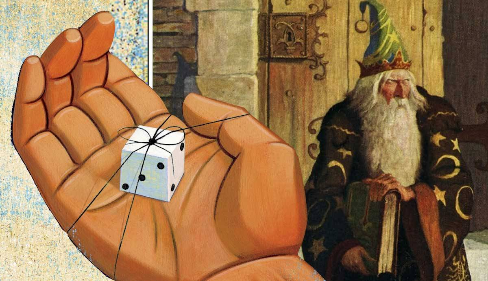
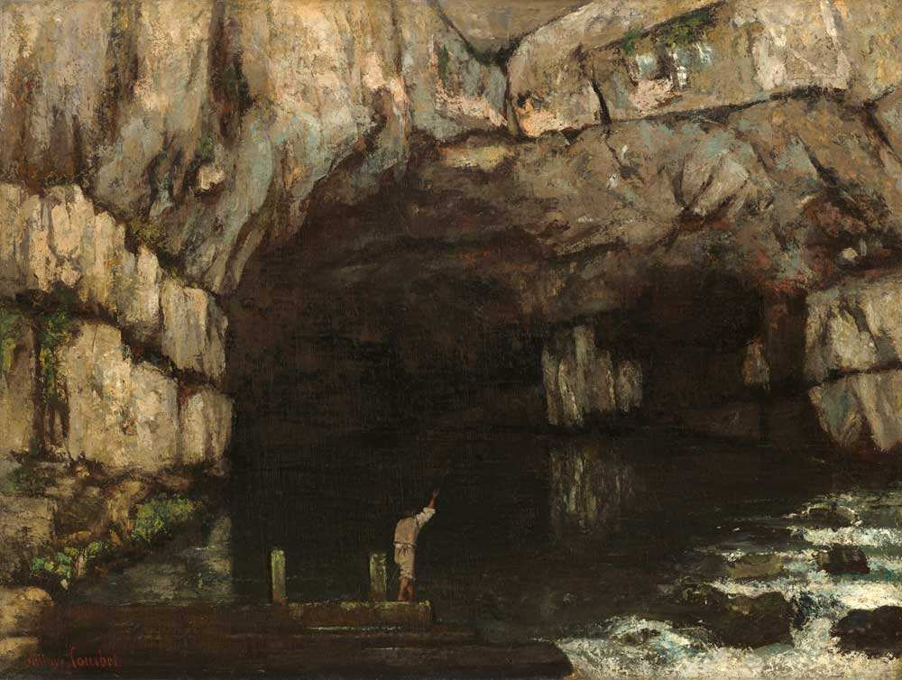
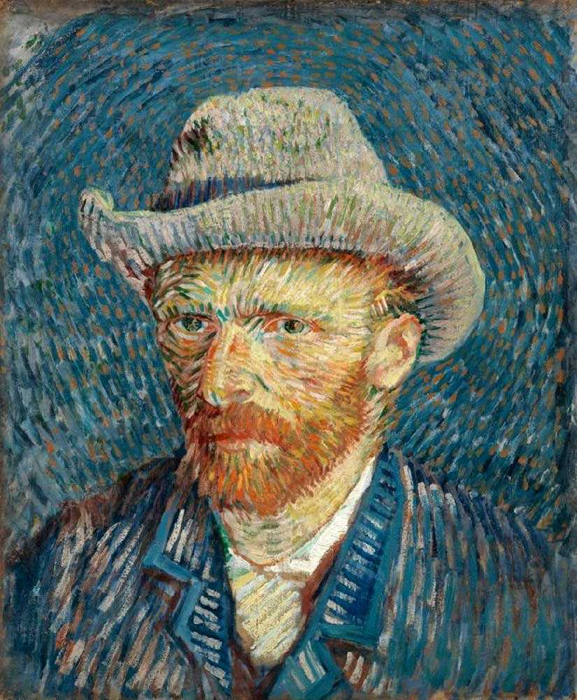
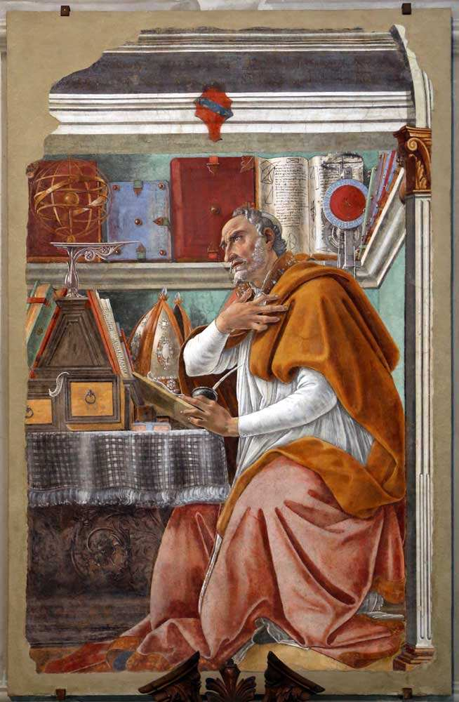
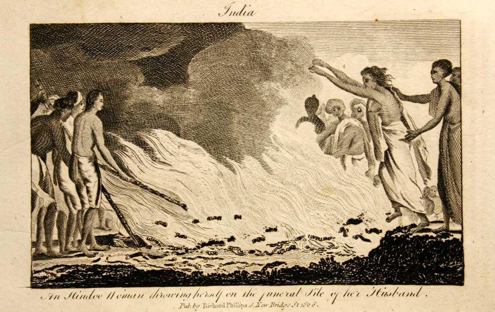
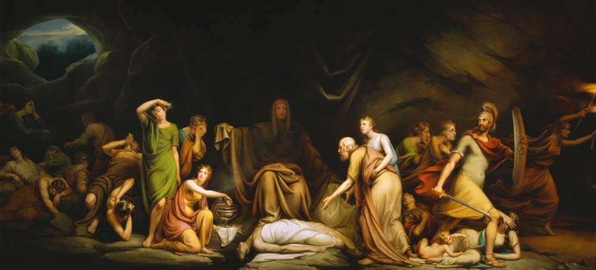
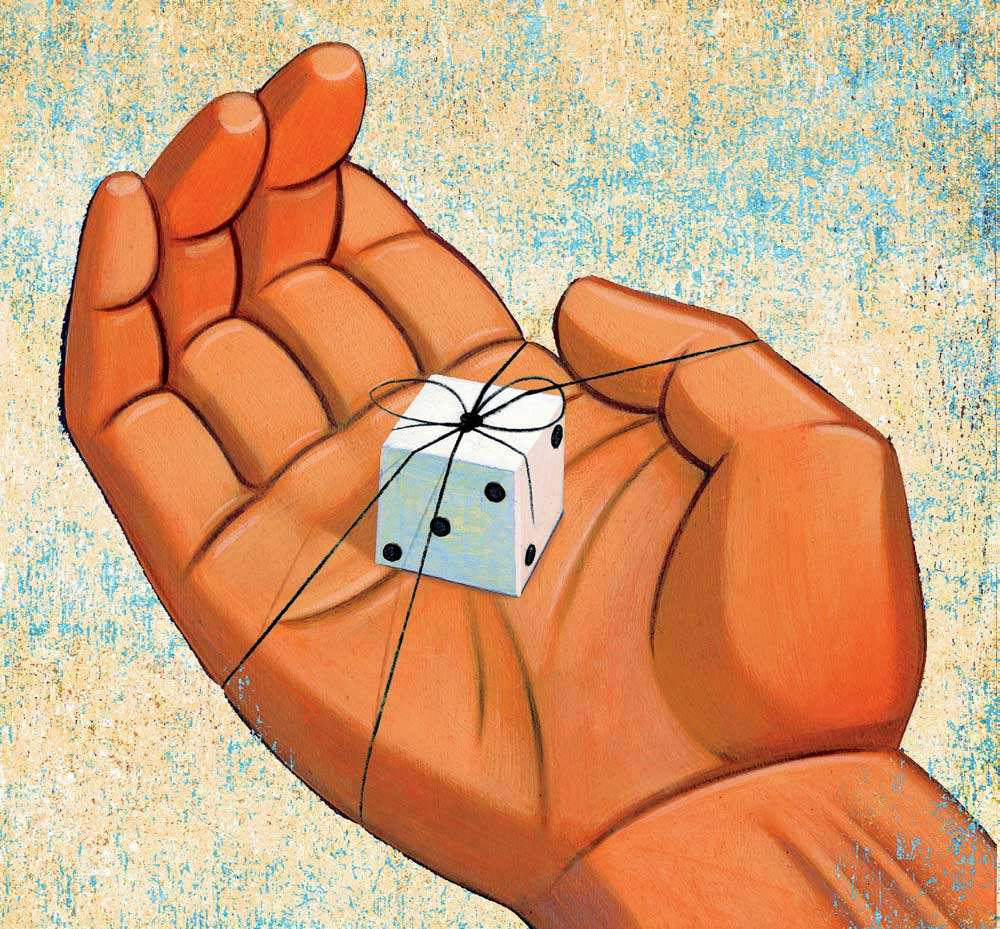
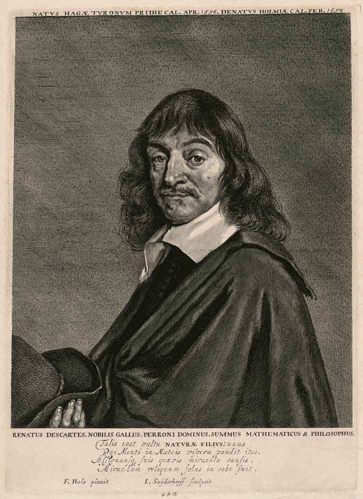
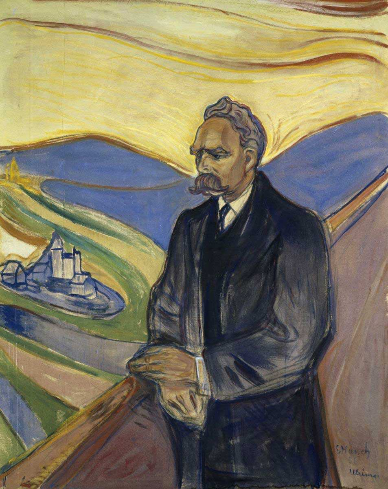
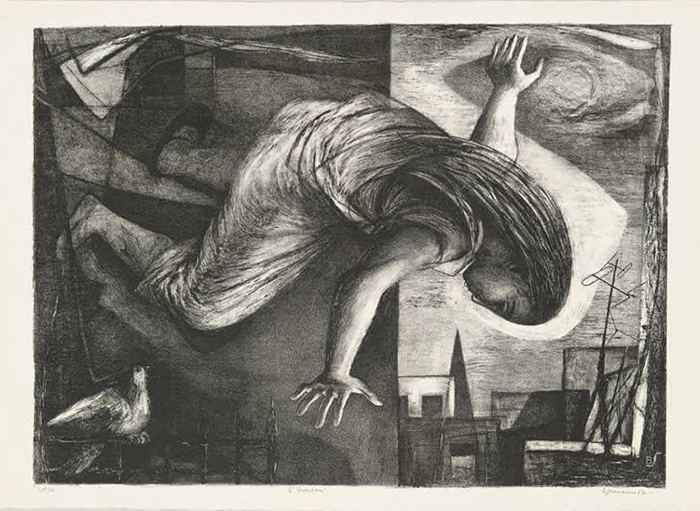

What is the meaning of life? What are good and evil? What is justice? These are some of the questions that philosophers have been asking for centuries. Philosophy is a complex and fascinating field of study that can sometimes seem daunting to beginners. And while there’s no one answer that everyone will agree on, it’s still important to know some of the most fundamental ideas in philosophy. Here are ten common philosophical concepts everyone should be familiar with, regardless of educational background.  

生命的意义是什么？什么是善与恶？什么是正义？这些是几个世纪以来哲学家们一直在问的一些问题。哲学是一个复杂而迷人的研究领域，有时对初学者来说似乎令人生畏。虽然没有一个人人都会同意的答案，但了解哲学中一些最基本的想法仍然很重要。以下是每个人都应该熟悉的十个常见的哲学概念，无论教育背景如何。

## 1\. Plato’s Theory of Ideas 

1.柏拉图的思想理论

La Grotte de la Loue, Gustave Courbet, 1864, via National Gallery of Art  

La Grotte de la Loue，古斯塔夫-库尔贝，1864年，通过国家艺术馆

[Plato](https://www.thecollector.com/who-are-the-philosopher-kings-plato-republic/) was the first to separate the “world of things” from the “world of ideas.” According to Plato, the idea (eidos) is the source of a thing, its prototype, the underlying reality of any particular object. For example, the “idea of a table” can either coincide with a particular table in reality or not match. But the “idea of the table” and the “concrete table” will continue to exist separately.  

柏拉图是第一个将 "事物的世界 "与 "观念的世界 "分开的人。按照柏拉图的说法，理念（eidos）是一个事物的源头，是它的原型，是任何特定物体的基本现实。例如，"桌子的观念 "既可以与现实中的特定桌子相吻合，也可以不吻合。但 "桌子的理念 "和 "具体的桌子 "将继续单独存在。

A vivid illustration of the division of the world into the world of ideas and the world of objects is the famous Platonic myth of the cave, in which people see not objects and other people but only their shadows on the wall of the cave. In this metaphor, the shadows projected on the wall of the cave correspond to the individual objects in the world, while the objects whose shadows are on the wall correspond to the ideas – which are more fundamental and real, in Plato’s view.  

将世界划分为理念世界和物体世界的一个生动说明是著名的柏拉图式的洞穴神话，在这个神话中，人们看到的不是物体和其他人，而只是他们在洞壁上的影子。在这个比喻中，投射在洞壁上的影子对应于世界上的各个物体，而影子在洞壁上的物体则对应于理念--在柏拉图看来，理念是更基本和真实的。

The cave for Plato is an allegory of our world, where people live, believing that the shadows on the walls of the caves are the only way to know reality. However, in reality, the shadows are just an illusion. Still, because of this illusion, it is difficult for people to pose critical questions about the existence of reality and overcome their “false consciousness.”  

洞穴对于柏拉图来说是我们世界的一个寓言，人们生活在那里，相信洞穴墙壁上的阴影是了解现实的唯一途径。然而，在现实中，这些影子只是一种幻觉。尽管如此，由于这种幻觉，人们很难对现实的存在提出批评性的问题，也很难克服他们的 "错误意识"。

Developing Platonic ideas, philosophers of later times reached the concept of the transcendent and the “thing-in-itself.”  

后来的哲学家们发展了柏拉图式的思想，达成了超越性和 "物自体 "的概念。

## 2\. The Concept of Introspection  

2.反省的概念

Self-Portrait with Grey Felt Hat, Vincent van Gogh, 1887, via Van Gogh Museum  

戴灰色毡帽的自画像，文森特-凡高，1887年，通过凡高博物馆。

Introspection is a way of achieving self-knowledge during which a person observes their internal reaction to events in the external world. Introspection is motivated by a fundamental human need to examine the self carefully, to explain to themselves why they believe what they believe and whether there is a possibility that their belief is wrong.  

自省是一种实现自我认识的方式，其间一个人观察自己对外部世界事件的内部反应。自省的动机是人类的基本需求，即仔细审视自我，向自己解释为什么他们相信他们所相信的，以及他们的信念是否有可能是错误的。

The founder of introspection as a method of inquiry is the British educator and philosopher John [Locke](https://www.thecollector.com/social-contract-theories-explained/), who, relying on the ideas of Rene [Descartes](https://www.thecollector.com/foundationalism-can-we-know-anything-philosophy/), pointed out that there are only two direct sources of all knowledge: the objects of the external world and the human mind. In this regard, all significant psychological facts of consciousness are open to study only by the subject of knowledge itself. It may well be that “blue” for one person is not at all the same as “blue” for another.  

内省作为一种探究方法的创始人是英国教育家和哲学家约翰-洛克，他根据笛卡尔的思想指出，所有知识的直接来源只有两个：外部世界的对象和人类的心灵。在这方面，所有重要的意识心理学事实都只有知识主体本身可以研究。很可能一个人的 "蓝色 "与另一个人的 "蓝色 "完全不一样。

The method of introspection helps to keep track of the stages of thinking, breaking down feelings into elements and providing a complete picture of the relationship between thoughts and actions. Introspection teaches us to think more abstractly and broadly, for example, to perceive a “big red apple” as a sensation of red, replaced by an impression of a round one and a trace of a taste sensation. But do not go too deep into introspection – excessive focus on tracking your own impressions can dull the perception of reality.  

反省的方法有助于跟踪思考的各个阶段，将感觉分解为各种元素，并提供思想和行动之间关系的完整图景。内省教会我们更抽象、更广泛地思考，例如，把 "大红苹果 "看作是红色的感觉，取而代之的是圆形的印象和一丝味觉的感觉。但不要过于深入地反省--过度关注跟踪自己的印象会使对现实的感知变得迟钝。

## 3\. The Concept of Solipsism  

3.孤独主义的概念

Illustration to the book Mysterious Stranger by Mark Twain, Author unknown, via Project Gutenberg  

马克-吐温的《神秘的陌生人》一书的插图，作者不详，通过古腾堡计划。

Solipsism is a philosophical concept according to which a person recognizes only their mind as the only reality that always exists and is always available. Mark Twain demonstrates the main message of solipsism in his story [The Mysterious Stranger](https://www.goodreads.com/book/show/102564.The_Mysterious_Stranger):  

孤独主义是一种哲学概念，根据这一概念，一个人只承认自己的思想是唯一的现实，它永远存在，而且永远可用。马克-吐温在他的故事《神秘的陌生人》中展示了唯心主义的主要信息。

“There is no God, no universe, no human race, no earthly life, no heaven, no hell. It is all a Dream, a grotesque and foolish dream. Nothing exists but you. And You are but a Thought – a vagrant Thought, a useless Thought, a homeless Thought, wandering forlorn among the empty eternities.”  

"没有上帝，没有宇宙，没有人类，没有尘世生活，没有天堂，没有地狱。这都是一个梦，一个怪诞而愚蠢的梦。除了你，什么都不存在。而你不过是一个思想--一个流浪的思想，一个无用的思想，一个无家可归的思想，在空虚的永恒中孤独地徘徊。"

The same idea, in general, is illustrated by the films _Mr. Nobody, The Beginning_, and [_The Matrix_](https://www.thecollector.com/nick-bostrom-simulation-theory/).  

总的来说，同样的想法在电影《无名先生》、《开端》和《黑客帝国》中得到了说明。

According to solipsism, only a person’s perception of reality and their thoughts are available to them, while the entire external world is beyond the bounds of certainty. Therefore, the existence of things for a person will always be only a matter of faith, since if someone requires proof of their existence, a person will not be able to provide them.  

根据唯我论，只有一个人对现实的感知和他们的思想可以利用，而整个外部世界则超出了确定性的范围。因此，事物的存在对一个人来说永远只是一个信仰问题，因为如果有人要求证明它们的存在，一个人将无法提供。

In other words, no person can be sure of the existence of anything outside of their consciousness. Solipsism is not so much doubt about the existence of reality as a recognition of the importance of the role of one’s own mind. The concept of solipsism either needs to be assimilated as it is or to accept “solipsism in reverse,” that is, to give yourself a rational explanation of the relative external world and justify why this external world still exists.  

换句话说，没有人能够确定他们意识之外的任何东西的存在。孤独主义与其说是对现实存在的怀疑，不如说是对自己心灵作用的重要性的认识。孤独主义的概念要么需要被原封不动地吸收，要么接受 "反向的孤独主义"，即给自己一个相对外部世界的合理解释，并证明这个外部世界为什么仍然存在。

## 4\. The Theodicy: The Attempt to Vindicate God  

4.4. Theodicy:试图为上帝辩护

St Augustine, Sandro Botticelli, 1480, via WikiArt  

圣奥古斯丁，桑德罗-波提切利，1480年，通过维基艺术。

If the world was created according to some higher plan, why is there so much absurdity and suffering in it? Most believers sooner or later begin to ask this question. [Theodicy](https://plato.stanford.edu/entries/evil/) comes to the aid of the desperate. It is a religious and philosophical concept according to which God is unconditionally recognized as an absolute good, from which any responsibility for the presence of evil in the world is removed.  

如果这个世界是按照某种更高的计划创造的，为什么会有这么多的荒谬和痛苦？大多数信徒迟早都会开始问这个问题。 Theodicy向绝望者伸出援助之手。这是一个宗教和哲学概念，根据这个概念，上帝被无条件地承认为一个绝对的好，从这个概念中，世界上存在的邪恶的任何责任都被消除。

[Leibniz](https://www.southampton.ac.uk/philosophy/undergraduate/decision-trees/god-and-evil/2-1.page) created this doctrine to conditionally “justify” God. The main question of this concept is: why does God not want to rid the world of misfortunes? The possible answers can be reduced to four: either God wants to rid the world of evil but cannot, or he can but does not want to, or he cannot and does not want to, or he can and wants to. The first three options do not correlate with the idea of God as the Absolute, and the last option does not explain the presence of evil in the world.  

莱布尼茨创造了这个学说，以有条件地 "证明 "上帝。这个概念的主要问题是：为什么上帝不想让世界摆脱不幸？可能的答案可以简化为四个：要么上帝想为世界除害但不能，要么他能但不想，要么他不能也不想，要么他能也想。前三个选项与上帝是绝对的想法不相关，而最后一个选项不能解释世界上邪恶的存在。

The problem of theodicy arises in any monotheistic religion where the responsibility for evil in the world should theoretically be assigned to God. In practice, laying responsibility on God is not possible since religions recognize God as a kind of ideal being who has the right to the presumption of innocence.  

神论的问题出现在任何一个一神教中，理论上说，世界上邪恶的责任应该归咎于上帝。在实践中，把责任推给上帝是不可能的，因为各宗教都认为上帝是一种理想的存在，他有无罪推定的权利。

One of the main ideas of theodicy is that God created the best of all possible worlds, and, therefore, only the best is collected in it, and the presence of evil in this world is considered only as a consequence of the need for ethical diversity. Recognizing theodicy or not is a personal matter related to one’s faith, but it is certainly worth exploring the concept.  

神论的主要观点之一是，上帝创造了所有可能的世界中最好的世界，因此，只有最好的才会被收集在其中，而这个世界上邪恶的存在只被认为是道德多样性需求的结果。是否承认odicy是一个与个人信仰有关的个人问题，但这一概念当然值得探讨。

## 5\. Moral Relativism  

5.道德相对论

An Hindoo Woman Throwing Herself on the Funeral Pyre of Her Husband, Frederic Shoberl, via WikiMedia  

一个印度教妇女把自己扔在她丈夫的葬礼火堆上，弗雷德里克-肖伯尔，通过维基媒体。

Life would be much easier if good and evil were fixed, absolute concepts. But often, we are faced with the fact that what is good in one situation may be evil in another. We are approaching [moral relativism](https://plato.stanford.edu/entries/moral-relativism/), becoming less definite about what is good and what is bad. This ethical principle denies the dichotomous division of the concepts of “good” and “evil” and does not recognize the existence of mandatory, absolute moral norms and categories.  

如果善和恶是固定的、绝对的概念，生活就会容易得多。但是，我们经常面临这样的事实：在一种情况下是善的，在另一种情况下可能是恶的。我们正在接近道德相对主义，对什么是好什么是坏变得不那么确定。这一道德原则否认 "善 "和 "恶 "概念的二分法，不承认存在强制性的、绝对的道德规范和类别。

Moral relativism, unlike moral absolutism, does not hold that there are absolute universal moral standards and principles. It is not morality that dominates the situation, but the situation over morality. That is, not just the fact of some action is important, but its context.  

道德相对主义与道德绝对主义不同，不认为存在绝对的普遍道德标准和原则。主导形势的不是道德，而是高于道德的形势。也就是说，重要的不仅仅是一些行动的事实，还有它的背景。

The philosophical doctrine of “permissiveness” recognizes each individual’s right to form their own system of values and their own ideas about the categories of good and evil and allows us to assert that morality is, in essence, a relative concept.  

允许性 "的哲学理论承认每个人都有权形成自己的价值体系和自己对善恶类别的想法，并允许我们断言道德在本质上是一个相对概念。

## 6\. Categorical Imperative or the Golden Rule of Morality  

6.绝对命令或道德的黄金法则

The Court of Death, Rembrandt Peale, 1820, via Detroit Institute of Arts  

死亡之庭，伦勃朗-皮尔，1820年，通过底特律艺术学院

“Treat others how you want to be treated” – surely many of us have heard this phrase or its semblance at least once. We usually agree that it is perceived as something familiar and self-evident. However, this is not just a common expression or proverb; this phrase is similar to an important philosophical concept in ethics, which is called the “[categorical imperative](https://www.thecollector.com/ethicists-toolbox-kant-categorical-imperative/)” or the “golden rule” of morality.  

"你希望别人怎样对待你，你就怎样对待别人"--我们中的许多人肯定至少听过一次这句话或其相似之处。我们通常同意，它被认为是熟悉和不言而喻的东西。然而，这不仅仅是一个普通的表达或谚语；这句话类似于伦理学中的一个重要哲学概念，被称为 "绝对命令 "或道德的 "黄金法则"。

The term “categorical imperative” was introduced by German philosopher Immanuel [Kant](https://www.thecollector.com/kant-philosophy-of-aesthetics/), who developed the concept of an ethics based in autonomy. According to this concept, moral principles always exist, do not depend on the environment, and must constantly connect with each other. The categorical imperative says that a person must use specific principles that guide their behavior.  

"绝对命令 "一词是由德国哲学家伊曼纽尔-康德提出的，他提出了基于自主性的伦理学概念。根据这一概念，道德原则始终存在，不依赖于环境，而且必须不断地相互联系。绝对命令说，一个人必须使用特定的原则来指导他们的行为。

According to this ethical concept, a person must act according to the maxim, which, in his opinion, _could_ become a universal law. Also, within the framework of this concept, Kant proposes not to consider the other person as a means to an end, but to treat them as the ultimate goal. Of course, such an approach will not save us from mistakes, but decisions become much more conscious if you think that every time you choose, you do so not only for yourself but for all of humanity.  

根据这一伦理观念，一个人必须按照格言行事，在他看来，格言可以成为一种普遍的法律。此外，在这一概念的框架内，康德提议不要把他人视为达到目的的手段，而是把他们视为最终目标。当然，这样的方法不会使我们免于犯错，但如果你认为每次你的选择不仅是为了你自己，也是为了全人类，那么决定就会变得更加自觉。

## 7\. Determinism/Indeterminism: Are Our Fates Sealed?  

7.决定论/非决定论。我们的命运被封住了吗？

Free Will Illustration, Jon Krause, via Harvard Magazine  

自由意志插图，Jon Krause，通过哈佛杂志

If we want to investigate free will, fate and predestination, we have to consider the concept of determinism – the philosophical doctrine of predestination, the interconnectedness of everything that is happening, and the presence of a unique cause for everything that exists. Everything is predetermined. Everything will happen according to a given pattern – this is the main postulate of [determinism](https://www.thecollector.com/baruch-spinoza-determinism-role-of-ethics-in-life/).  

如果我们想研究自由意志、命运和宿命，我们就必须考虑决定论的概念--宿命的哲学学说，正在发生的一切都相互关联，存在的一切都有一个独特的原因。一切都是预先决定的。一切都会按照既定的模式发生--这是决定论的主要假设。

Free will, according to this doctrine, does not exist, and in different interpretations of determinism, the fate of a person depends on various factors: either it is predetermined by God or by an extensive philosophically comprehended category of “nature.”  

根据这一学说，自由意志是不存在的，在决定论的不同解释中，一个人的命运取决于各种因素：要么是由上帝预先决定的，要么是由哲学上理解的广泛的 "自然 "类别决定的。

Within the framework of the doctrine of determinism, no events are considered random but are the consequence of a predetermined, but unknown to man, a chain of events. Determinism excludes belief in free will, in which all responsibility for actions lies with the person themselves, and forces the individual to entrust their fate entirely to the external world’s causality, regularity, and omnipotence. Because of this, determinism is a convenient idea for those who don’t want to take responsibility for themselves.  

在决定论的框架内，没有任何事件被认为是随机的，而是预先决定的、但人所不知的一连串事件的结果。决定论排除了对自由意志的信仰，在自由意志中，所有行为的责任都在于人本身，而迫使个人将自己的命运完全托付给外部世界的因果性、规律性和全能性。正因为如此，决定论对于那些不想为自己负责的人来说是一个方便的想法。

## 8\. Cogito Ergo Sum: I Think, Therefore I Am  

8.Cogito Ergo Sum:我想，所以我是

René Descartes, Jonas Suyderhoff, 1650s, via National Gallery of Art

[“I think, therefore I am”](https://www.thecollector.com/what-does-i-think-therefore-i-am-mean/) is a philosophical concept originating from the rationalist philosopher Rene Descartes, and a good starting point for those who doubt everything. This formula arose when Descartes was trying to find the primary, indisputable and absolute truth, based on which one can build a philosophical concept of absolute knowledge.  

"我思故我在 "是一个源于理性主义哲学家笛卡尔的哲学概念，也是那些怀疑一切的人的一个很好的起点。这个公式是在笛卡尔试图找到主要的、无可争辩的、绝对的真理时产生的，在此基础上人们可以建立一个绝对知识的哲学概念。

[Descartes](https://www.thecollector.com/foundationalism-can-we-know-anything-philosophy/) questioned everything: the outside world, his feelings, God, and public opinion. The only thing that could not be questioned was one’s own existence since the very process of doubting one’s own existence was proof of this existence. Hence the formula appeared: “I doubt, therefore, I think; I think, therefore I am,” which was transformed into “I think, therefore I am” – this phrase became the metaphysical basis of modern philosophy. It proclaimed the dominant position of the Subject, around which it became possible to build reliable knowledge.  

笛卡尔质疑一切：外部世界、他的感觉、上帝和公众意见。唯一不能质疑的是自己的存在，因为怀疑自己存在的过程本身就是对自己存在的证明。因此出现了这样的公式。"我疑，故我思；我思，故我在"，这句话被转化为 "我思，故我在"--这句话成为现代哲学的形而上学基础。它宣告了主体的主导地位，围绕它可以建立可靠的知识。

## 9\. “God Is Dead”  

9."上帝已死"

Friedrich Nietzsche, Edvard Munch, 1960, via WikiMedia  

弗里德里希-尼采，爱德华-蒙克，1960年，通过维基媒体

“[God is dead](https://www.goodreads.com/quotes/22827-god-is-dead-god-remains-dead-and-we-have-killed). God remains dead. And we have killed him. How shall we comfort ourselves, the murderers of all murderers? What was holiest and mightiest of all that the world has yet owned has bled to death under our knives: who will wipe this blood off us?”  

"上帝已经死了。上帝仍然是死的。而我们已经杀了他。我们该如何安慰自己，所有杀人犯中的杀人犯？世界上最神圣、最强大的东西，在我们的刀下流血而死：谁来擦去我们身上的血？"

In saying “God is dead,” [Nietzsche](https://www.thecollector.com/nietzsche-famous-works-and-ideas/) was not implying the death of God in a literal sense. He meant that in traditional society, the existence of God was a fact; he was in a single reality with people. But in the era of modernity, he ceased to be part of external reality, becoming an internal idea. It caused a crisis in the value system, which was previously based on the Christian worldview. It means that the time has come to revise this system – in fact, this is what the philosophy and culture of postmodernity are doing.  

尼采说 "上帝死了"，并不是在字面意义上暗示上帝的死亡。他的意思是，在传统社会中，上帝的存在是一个事实；他与人们处在一个单一的现实中。但在现代性时代，他不再是外部现实的一部分，而是成为一种内在的理念。这造成了价值体系的危机，而这个体系以前是基于基督教世界观的。这意味着现在是修订这个系统的时候了--事实上，这正是后现代性的哲学和文化正在做的。

## 10\. Existential Crisis: A Contemporary Philosophical Concept  

10.存在主义危机。一个当代的哲学概念

To Freedom, Benton Spruance, 1952, via Whitney Museum of American Art  

致自由》，Benton Spruance，1952年，通过惠特尼美国艺术博物馆

[Existentialism](https://www.thecollector.com/what-are-main-themes-existentialism/), one of the main philosophical currents of the 20th century, focuses on the uniqueness of human beings. It is also called the “philosophy of existence.” The forerunner of existentialism was the Danish philosopher Søren [Kierkegaard](https://www.thecollector.com/what-is-existentialism/). Back in the 19th century, he first formulated the concept of “existence,” opposing it to the “system” of the German idealist Hegel.  

存在主义，是20世纪的主要哲学潮流之一，着重于人类的独特性。它也被称为 "存在的哲学"。存在主义的先驱是丹麦哲学家索伦-克尔凯郭尔。早在19世纪，他首次提出了 "存在 "的概念，将其与德国唯心主义者黑格尔的 "体系 "相对立。

An existential crisis is a feeling of anxiety and anxiety associated with the loss of the meaning of life. Existential psychologists such as Irvin Yalom and Rollo May have widely studied this concept. Essentially, an existential crisis is the loss of the meaning of life.  

存在主义危机是一种与失去生命意义有关的焦虑和不安的感觉。存在主义心理学家如欧文-亚洛姆和罗洛-梅广泛研究了这个概念。从本质上讲，存在主义危机是生命意义的丧失。

An [existential crisis](https://www.thecollector.com/who-were-the-most-famous-existentialists/) can be provoked by a difficult situation in the world, uncertainty in the economic sphere, the illness of a loved one, a direct encounter with death, and great life upheavals. An existential crisis is always connected with how a person lives their life, how fully and deeply, and occurs either when this life is threatened – directly or indirectly, or in a situation where a life does not “suit” the person living it.  

引起生存危机的原因可能是世界上的困难局面、经济领域的不确定性、亲人的疾病、与死亡的直接接触以及巨大的生活动荡。存在性危机总是与一个人如何生活，如何充分和深入地生活有关，并在这种生活受到威胁--直接或间接地，或在生活不 "适合 "人的情况下发生。

The _notion_ of [existential crisis](https://www.thecollector.com/difference-between-existentialism-and-nihilism/) resulted from the collapse of the traditional value system described above. It is generated by the idea that human existence has neither a predetermined purpose nor an objective meaning. It goes against our deepest need to believe that human life has value. But the absence of the original meaning does not mean the loss of meaning in general. According to the concept of existentialism, the value of life is manifested precisely in the way a person fulfills themselves, in the choices made by them, and in their actions.  

存在主义危机的概念是由上述传统价值体系的崩溃导致的。它是由人类的存在既没有预定的目的，也没有客观的意义这一想法产生的。它违背了我们相信人类生命有价值的最深层需要。但原始意义的缺失并不意味着一般意义的丧失。根据存在主义的概念，生命的价值恰恰体现在一个人成就自己的方式，体现在他们的选择和行动中。
