_Estimated reading time: 15 minutes.  

估计阅读时间：15分钟。_

> “It’s easier to fool people than to convince them that they’ve been fooled.” — Unknown.  
> 
> "愚弄人们比说服他们被愚弄更容易"。- 不详。

I’m an expert on how technology hijacks our psychological vulnerabilities. That’s why I spent the last three years as a Design Ethicist at Google caring about how to design things in a way that defends a billion people’s minds from getting hijacked.  

我是研究技术如何劫持我们心理弱点的专家。这就是为什么在过去的三年里，我在谷歌担任设计伦理学家，关心如何以一种捍卫十亿人的思想不被劫持的方式来设计东西。

When using technology, we often focus _optimistically_ on all the things it does for us. But I want to show you where it might do the opposite.  

在使用技术时，我们经常乐观地关注它为我们做的所有事情。但我想告诉你，它可能会在哪里做相反的事情。

_Where does technology exploit our minds’ weaknesses_?  

技术在哪里利用了我们头脑的弱点？

I learned to think this way when I was a magician. Magicians start by looking for _blind spots, edges, vulnerabilities and_ _limits_ of people’s perception, so they can influence what people do without them even realizing it. Once you know how to push people’s buttons, you can play them like a piano.  

我在当魔术师的时候就学会了这样的思考方式。魔术师一开始就寻找人们认知的盲点、边缘、弱点和极限，因此他们可以在人们不知不觉中影响他们的行为。一旦你知道如何推动人们的按钮，你就可以像弹钢琴一样弹奏他们。

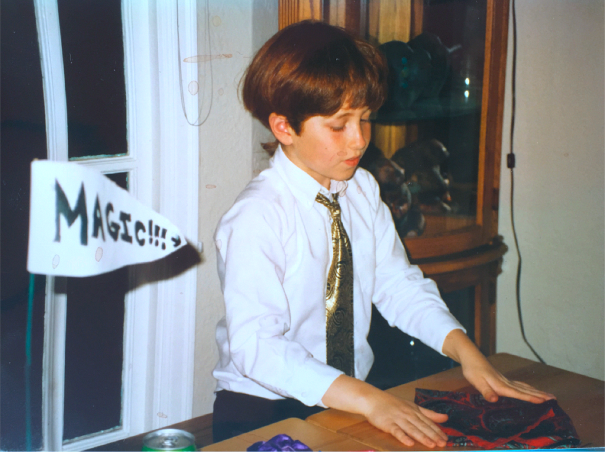

That’s me performing sleight of hand magic at my mother’s birthday party  

这是我在我母亲的生日聚会上表演的魔术。

And this is exactly what product designers do to your mind. They play your psychological vulnerabilities (consciously and unconsciously) against you in the race to grab your attention.  

而这正是产品设计师对你的思想所做的事情。他们利用你的心理弱点（有意识的和无意识的）来对付你，以抓住你的注意力。

I want to show you how they do it.  

我想告诉你他们是如何做到的。

## Hijack #1: If You Control the Menu, You Control the Choices  

劫持#1：如果你控制了菜单，你就控制了选择

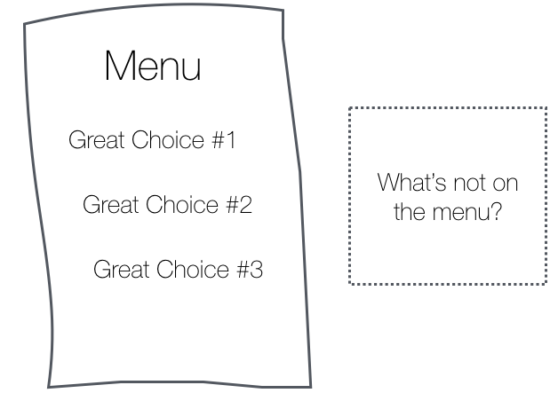

Western Culture is built around ideals of individual choice and freedom. Millions of us fiercely defend our right to make “free” choices, while we ignore how those choices are manipulated upstream by menus we didn’t choose in the first place.  

西方文化是围绕个人选择和自由的理想而建立的。我们数百万人激烈地捍卫我们做出 "自由 "选择的权利，而我们却忽略了这些选择是如何被我们首先没有选择的人操纵的。

This is exactly what magicians do. They give people the illusion of free choice while architecting the menu so that they win, no matter what you choose. I can’t emphasize enough how deep this insight is.  

这正是魔术师所做的。他们给人们自由选择的假象，同时设计菜单，使他们获胜，无论你选择什么。我怎么强调都不为过，这个洞察力是多么深刻。

When people are given a menu of choices, they rarely ask:  

当人们得到一个选择的菜单时，他们很少问。

-   “what’s not on the menu?”  
    
    "菜单上没有什么？"
-   “why am I being given _these options_ and not others?”  
    
    "为什么我得到了这些选择而不是其他选择？"
-   “do I know the menu provider’s goals?”  
    
    "我知道菜单提供者的目标吗？"
-   “is this menu _empowering_ for my original need, or are the choices actually a distraction?” (e.g. an overwhelmingly array of toothpastes)  
    
    "这个菜单是否能满足我最初的需要，或者这些选择实际上是一种干扰？"(例如：铺天盖地的牙膏系列)

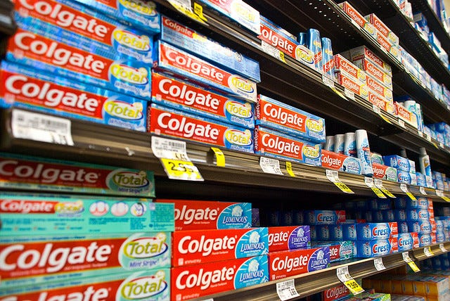

How _empowering is this menu_ of choices for the need, “I ran out of toothpaste”?  

对于 "我的牙膏用完了 "这一需求，这个选择菜单有多大的能量？

For example, imagine you’re out with friends on a Tuesday night and want to keep the conversation going. You open Yelp to find nearby recommendations and see a list of bars. The group turns into a huddle of faces staring down at their phones _comparing bars._ They scrutinize the photos of each, comparing cocktail drinks. Is this menu still relevant to the original desire of the group?  

例如，想象一下你在周二晚上和朋友出去玩，想让谈话继续下去。你打开Yelp寻找附近的推荐，看到一个酒吧列表。这群人变成了一帮人，低头盯着他们的手机比较酒吧。他们仔细查看每家的照片，比较鸡尾酒的饮料。这个菜单还与这群人最初的愿望有关吗？

It’s not that bars aren’t a good choice, it’s that Yelp substituted the group’s original question (“where can we go to keep talking?”) with a different question (“what’s a bar with good photos of cocktails?”) all by shaping the menu.  

这并不是说酒吧不是一个好的选择，而是Yelp用一个不同的问题（"什么是有好的鸡尾酒照片的酒吧？"）代替了这群人原来的问题（"我们能去哪里继续聊天？"），这一切都通过塑造菜单来实现。

Moreover, the group falls for the illusion that Yelp’s menu represents a _complete set of choices_ for where to go. While looking down at their phones, they don’t see the park across the street with a band playing live music. They miss the pop-up gallery on the other side of the street serving crepes and coffee. Neither of those show up on Yelp’s menu.  

此外，这群人还陷入了一种错觉，认为Yelp的菜单代表了去哪里的一套完整选择。当他们低头看手机时，他们没有看到街对面的公园里有乐队在演奏现场音乐。他们错过了街道另一边提供可丽饼和咖啡的弹出式画廊。这些都没有在Yelp的菜单上显示出来。

Yelp subtly reframes the group’s need “where can we go to keep talking?” in terms of photos of cocktails served.  

Yelp巧妙地重构了这群人的需求："我们可以去哪里继续聊天？"用所提供的鸡尾酒的照片来描述。

The more choices technology gives us in nearly every domain of our lives (information, events, places to go, friends, dating, jobs) — _the more we assume that our phone is always the most empowering and useful menu to pick from_. Is it?  

在我们生活的几乎每一个领域（信息、事件、去处、朋友、约会、工作），技术给我们的选择越多，我们就越认为我们的手机总是最有力和最有用的菜单。是这样吗？

**_The “most empowering” menu is different than the menu that has the most choices_**_._ But when we blindly surrender to the menus we’re given, it’s easy to lose track of the difference:  

最有力量的 "菜单与有最多选择的菜单是不同的。但是，当我们盲目地屈服于所给的菜单时，很容易就会失去对两者区别的认识。

-   “Who’s free tonight to hang out?” becomes a menu of _most recent people who texted us_ (who we could ping).  
    
    "今晚谁有空出去玩？"变成了最近给我们发短信的人的菜单（我们可以平移）。
-   “What’s happening in the world?” becomes a menu of news feed stories.  
    
    "世界上发生了什么？"成为新闻提要故事的一个菜单。
-   “Who’s single to go on a date?” becomes a menu of faces to swipe on Tinder (instead of local events with friends, or urban adventures nearby).  
    
    "谁是单身去约会？"成为Tinder上刷脸的菜单（而不是与朋友的当地活动，或附近的城市冒险）。
-   “I have to respond to this email.” becomes a menu of _keys to type a response_ (instead of empowering ways to communicate with a person).  
    
    "我必须回复这封邮件。"变成了一个输入回复的按键菜单（而不是与人沟通的授权方式）。

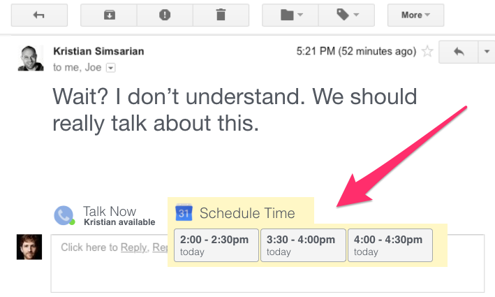

All user interfaces are menus. What if your email client gave you _empowering choices of ways to respond, instead of “what message do you want to type back?” (Design by Tristan Harris)_  

所有的用户界面都是菜单。如果你的电子邮件客户端给你授权选择回应的方式，而不是 "你想打回什么信息"，那会怎么样？(设计：Tristan Harris)

When we wake up in the morning and turn our phone over to see a list of notifications — it frames the experience of “waking up in the morning” around a menu of “all the things I’ve missed since yesterday.” (for more examples, see [Joe Edelman’s Empowering Design talk](https://vimeo.com/123488311))  

当我们早上醒来，翻开手机，看到一个通知列表--它将 "早上醒来 "的体验定格在一个 "从昨天开始我错过的所有事情 "的菜单上。(更多的例子，请看Joe Edelman的Empowering Design讲座 )

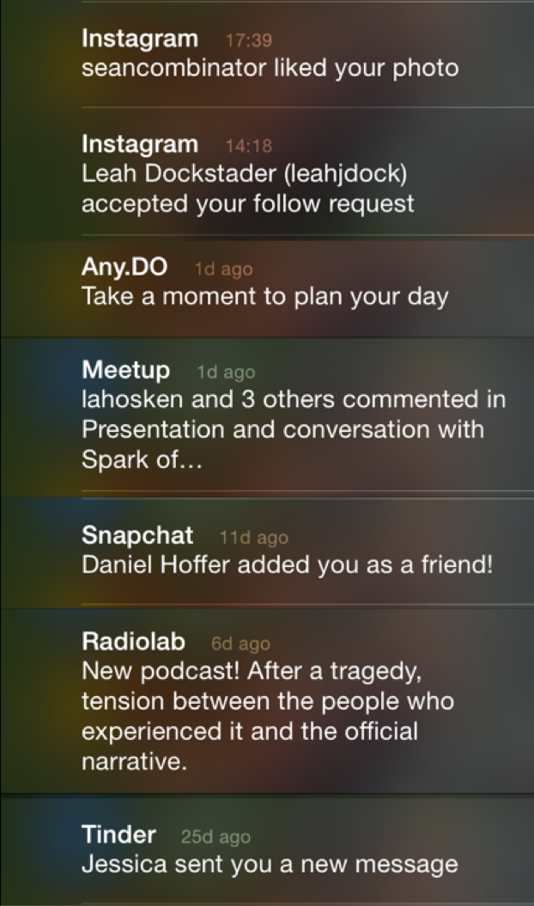

A list of notifications when we wake up in the morning — how _empowering is this menu of choices when we wake up? Does it reflect what we care about? (from_ [_Joe Edelman’s Empowering Design Talk_](https://vimeo.com/123488311)_)_  

当我们早上醒来时的通知列表--当我们醒来时，这个选择菜单的力量有多大？它是否反映了我们所关心的事情？(来自Joe Edelman的授权设计讲座 )

By shaping the menus we pick from, technology hijacks the way we perceive our choices and replaces them with new ones. But the closer we pay attention to the options we’re given, the more we’ll notice when they don’t actually align with our true needs.  

通过塑造我们所选的菜单，技术劫持了我们对选择的看法，并以新的选择取代它们。但是，我们越是密切关注我们所得到的选择，我们就越能注意到它们实际上并不符合我们的真正需求。

## **Hijack #2: Put a Slot Machine In a Billion Pockets  

劫持#2：在十亿人的口袋里放一台老虎机**

If you’re an app, how do you keep people hooked? Turn yourself into a slot machine.  

如果你是一个应用程序，你如何让人们着迷？把自己变成一台老虎机。

The average person checks their phone 150 times a day. Why do we do this? Are we making _150_ _conscious_ _choices_?  

平均每个人每天查看他们的手机150次。我们为什么要这样做？我们是否在做150次有意识的选择？

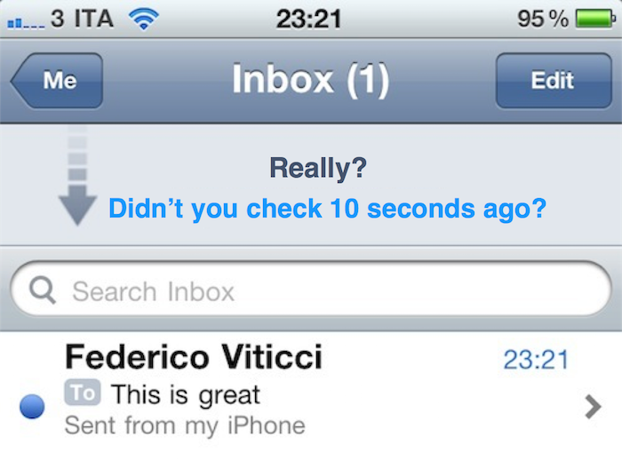

How often do you check your email per day?  

你每天检查你的电子邮件的频率是多少？

One major reason why is the #1 psychological ingredient in slot machines: [**intermittent variable rewards**](https://en.wikipedia.org/wiki/Reinforcement#Intermittent_reinforcement.3B_schedules).  

一个主要原因是老虎机中的第一大心理成分：间歇性的可变奖励。

If you want to maximize addictiveness, all tech designers need to do is link a user’s action (like pulling a lever) with a _variable reward_. You pull a lever and immediately receive either an enticing reward (a match, a prize!) or nothing. Addictiveness is maximized when the rate of reward is most variable.  

如果你想最大限度地提高成瘾性，技术设计师需要做的就是将用户的行动（如拉动一个杠杆）与可变的奖励联系起来。你拉动一个杠杆，然后立即得到一个诱人的奖励（一场比赛，一个奖品！）或者什么都没有。当奖励率最易变化时，成瘾性就会达到最大。

Does this effect really work on people? Yes. **Slot machines make more money in the United States than baseball, movies, and theme parks** [**combined**](http://www.cbsnews.com/news/slot-machines-the-big-gamble-07-01-2011/)**_._** Relative to other kinds of gambling, people get ‘problematically involved’ with slot machines [**3–4x faster**](http://99percentinvisible.org/episode/episode-78-no-armed-bandit/) according to NYU professor Natasha Dow Schull, author of _Addiction by Design._  

这种效果真的对人有效吗？是的。在美国，老虎机赚的钱比棒球、电影和主题公园加起来还要多。根据纽约大学教授娜塔莎-道-舒尔（Natasha Dow Schull）的《设计成瘾》（Addiction by Design）一书的作者，相对于其他类型的赌博，人们 "有问题地卷入 "老虎机的速度快3-4倍。

Image courtesy of Jopwell  

图片来源：乔普韦尔

**But here’s the unfortunate truth — several billion people have a slot machine their pocket:  

但不幸的事实是--几十亿人的口袋里都有一台老虎机。**

-   When we pull our phone out of our pocket, we’re _playing a slot machine_ to see what notifications we got.  
    
    当我们从口袋里掏出手机时，我们在玩老虎机，看我们得到了什么通知。
-   When we pull to refresh our email, we’re _playing a slot machine_ to see what new email we got.  
    
    当我们拉动刷新我们的电子邮件时，我们在玩老虎机，看看我们得到了什么新的电子邮件。
-   When we swipe down our finger to scroll the Instagram feed, we’re _playing a slot machine_ to see what photo comes next.  
    
    当我们用手指向下滑动来滚动Instagram feed时，我们在玩老虎机，看下一张照片是什么。
-   When we swipe faces left/right on dating apps like Tinder, we’re _playing a slot machine_ to see if we got a match.  
    
    当我们在Tinder等约会软件上左/右刷脸时，我们是在玩老虎机，看我们是否得到了一个匹配。
-   When we tap the # of red notifications, we’re _playing a slot machine_ to what’s underneath.  
    
    当我们点击#红色通知的时候，我们在玩老虎机，对下面的东西。

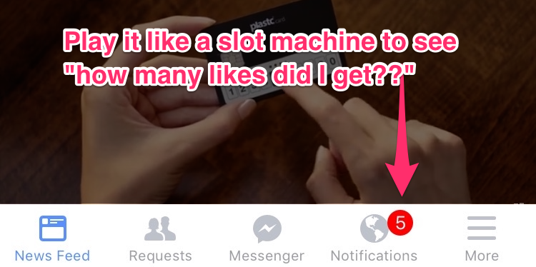

Apps and websites sprinkle intermittent variable rewards all over their products because it’s good for business.  

应用程序和网站在他们的产品中到处撒下间歇性的可变奖励，因为这对商业有利。

But in other cases, slot machines emerge by accident. For example, there is no malicious corporation behind _all of email_ who consciously chose to make it a slot machine. No one profits when millions check their email and nothing’s there. Neither did Apple and Google’s designers _want_ phones to work like slot machines. It emerged by accident.  

但在其他情况下，老虎机的出现是偶然的。例如，所有电子邮件的背后都没有恶意的公司，他们有意识地选择使其成为老虎机。当数以百万计的人检查他们的电子邮件而什么都没有的时候，没有人获利。苹果和谷歌的设计师也不希望手机像老虎机一样工作。它是偶然出现的。

But now companies like Apple and Google have a responsibility to reduce these effects by _converting intermittent variable rewards into less addictive, more predictable ones_ with better design. For example, they could empower people to set predictable times during the day or week for when they want to check “slot machine” apps, and correspondingly adjust when new messages are delivered to align with those times.  

但现在像苹果和谷歌这样的公司有责任通过更好的设计将间歇性的可变奖励转化为不那么容易上瘾、更可预测的奖励来减少这些影响。例如，他们可以授权人们在一天或一周内为他们想检查 "老虎机 "应用程序设定可预测的时间，并相应地调整新信息的发送时间，以配合这些时间。

## Hijack #3: Fear of Missing Something Important (FOMSI)  

劫持 #3: 害怕错过重要的东西 (FOMSI)

Another way apps and websites hijack people’s minds is by inducing a “1% chance you could be missing something important.”  

应用程序和网站劫持人们思想的另一种方式是诱导人们产生 "1%的机会，你可能会错过重要的东西"。

If I convince you that I’m a channel for important information, messages, friendships, or potential sexual opportunities — it will be hard for you to turn me off, unsubscribe, or remove your account — because (aha, I win) you might miss something important:  

如果我让你相信我是一个提供重要信息、消息、友谊或潜在性机会的渠道--你就很难把我关掉，取消订阅，或删除你的账户--因为（啊哈，我赢了）你可能会错过一些重要的东西。

-   This keeps us subscribed to _newsletter_s even after they haven’t delivered recent benefits (“what if I miss a future announcement?”)  
    
    这使我们保持订阅通讯，即使他们没有交付最近的利益（"如果我错过了未来的公告怎么办？"）。
-   This keeps us “friended” to people with whom we haven’t spoke in ages (“what if I miss something important from them?”)  
    
    这使我们与那些很久没有联系的人保持 "好友 "关系（"如果我错过了他们的重要信息怎么办？"）。
-   This keeps us swiping faces on dating apps, even when we haven’t even met up with anyone in a while (“what if I miss that _one hot match_ who likes me?”)  
    
    这让我们一直在约会软件上刷脸，即使我们甚至有一段时间没有和任何人见面（"如果我错过了那个喜欢我的热门对象怎么办？"）。
-   This keeps us using social media (“what if I miss that important news story or fall behind what my friends are talking about?”)  
    
    这使我们一直在使用社交媒体（"如果我错过了那个重要的新闻故事或落在我的朋友们所谈论的后面怎么办？）

But if we zoom into that fear, we’ll discover that it’s unbounded_: we’ll always miss something important_ at any point when we stop using something.  

但是，如果我们把这种恐惧放大，我们会发现它是没有界限的：当我们停止使用某些东西时，我们总会在任何时候错过一些重要的东西。

-   There are magic moments on Facebook we’ll miss by not using it for the 6th hour (e.g. an old friend who’s visiting town _right now_).  
    
    在Facebook上有一些神奇的时刻，我们会因为不使用它的第6个小时而错过（例如，一个老朋友现在正在城里访问）。
-   There are magic moments we’ll miss on Tinder (e.g. our dream romantic partner) by not swiping our 700th match.  
    
    在Tinder上，我们会因为没有刷到第700个匹配对象而错过一些神奇的时刻（例如我们梦想的浪漫伴侣）。
-   There are emergency phone calls we’ll miss if we’re not connected 24/7_._  
    
    如果我们不24小时连线，有些紧急电话我们会错过。

_But living moment to moment with the fear of missing something isn’t how we’re built to live.  

但是，一刻不停地生活，担心错过什么，这不是我们的生活方式。_

And it’s amazing how quickly, once we let go of that fear, we wake up from the illusion. When we unplug for more than a day, unsubscribe from those notifications, or go to [Camp Grounded](http://campgrounded.org/) — the concerns we thought we’d have don’t actually happen.  

而令人惊讶的是，一旦我们放开这种恐惧，我们就会从幻觉中醒来。当我们拔掉插头超过一天，取消订阅那些通知，或去参加接地营--我们认为我们会有的担忧实际上并没有发生。

_We don’t miss what we don’t see.  

我们不会错过我们没有看到的东西。_

The thought, “what if I miss something important?” is generated _in advance of unplugging, unsubscribing, or turning off_ — not after. Imagine if tech companies recognized that, and helped us proactively tune our relationships with friends and businesses in terms of what we define as “[time well spent](http://timewellspent.io/)” for our lives, instead of in terms of what we might miss.  

如果我错过了重要的东西怎么办？"这种想法是在拔掉电源、取消订阅或关闭电源之前产生的，而不是之后。想象一下，如果科技公司认识到这一点，并帮助我们主动调整与朋友和企业的关系，以我们定义的 "善用时间 "为标准，而不是以我们可能错过什么为标准。

## Hijack #4: Social Approval  

劫持 #4: 社会认可

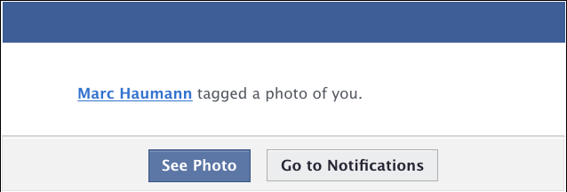

Easily one of the most persuasive things a human being can receive.  

很容易就成为人类可以接受的最有说服力的东西之一。

We’re all vulnerable to **social approval**. The need to belong, to be approved or appreciated by our peers is among the highest human motivations. But now our social approval is in the hands of tech companies.  

我们都很容易受到社会认可的影响。归属感、被同龄人认可或赞赏的需求是人类最高的动机之一。但现在我们的社会认可掌握在科技公司手中。

When I get tagged by my friend Marc, I imagine him making a _conscious choice_ to tag me. But I don’t see how a company like Facebook orchestrated his doing that in the first place.  

当我被我的朋友马克标记时，我想象他是有意识地选择标记我。但我不知道像Facebook这样的公司是如何策划他首先这么做的。

Facebook, Instagram or SnapChat can manipulate how often people get tagged in photos by automatically suggesting all the faces people should tag (e.g. by showing a box with a 1-click confirmation, “Tag Tristan in this photo?”).  

Facebook、Instagram或SnapChat可以通过自动建议人们应该标记的所有面孔来操纵人们在照片中被标记的频率（例如，通过显示一个带有一键确认的方框，"在这张照片中标记特里斯坦？"）。

So when Marc tags me, _he’s actually_ _responding to Facebook’s suggestion,_ not making an independent choice. But through design choices like this, _Facebook controls the multiplier for_ _how often millions of people experience their social approval on the line_.  

因此，当马克给我打上标签时，他实际上是在回应Facebook的建议，而不是做出独立的选择。但通过像这样的设计选择，Facebook控制了数百万人体验他们的社交认可的频率的倍数。

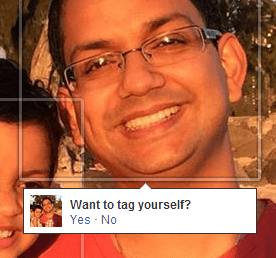

Facebook uses automatic suggestions like this to get people to tag more people, creating more social externalities and interruptions.  

Facebook使用这样的自动建议来让人们标记更多的人，创造更多的社会外部性和干扰。

The same happens when we change our main profile photo — Facebook knows that’s a moment when we’re _vulnerable to social approval_: _“what do my friends think of my new pic?”_ Facebook can rank this higher in the news feed, so it sticks around for longer and more friends will like or comment on it. Each time they like or comment on it, we’ll get pulled right back.  

当我们改变我们的主要个人资料照片时也会发生同样的情况--Facebook知道那是一个我们容易受到社会认可的时刻。"我的朋友对我的新照片有什么看法？"脸书可以在新闻推送中把它排在更高的位置，所以它停留的时间更长，更多朋友会喜欢或评论它。每次他们喜欢或评论它，我们就会被拉回来。

Everyone innately responds to social approval, but some demographics (teenagers) are more vulnerable to it than others. That’s why it’s so important to recognize how powerful designers are when they exploit this vulnerability.  

每个人都天生对社会认可有反应，但有些人群（青少年）比其他人更容易受到影响。这就是为什么认识到设计师在利用这一弱点时有多么强大是如此重要。

## Hijack #5: Social Reciprocity (Tit-for-tat)  

劫持#5：社会互惠（针锋相对）。

-   You do me a favor — I owe you one next time.  
    
    你帮我一个忙--下次我欠你一个人情。
-   You say, “thank you”— I have to say “you’re welcome.”  
    
    你说，"谢谢你"--我不得不说 "不客气"。
-   You send me an email— it’s rude not to get back to you.  
    
    你给我发邮件，不给你回信是不礼貌的。
-   You follow me — it’s rude not to follow you back. (especially for teenagers)  
    
    你关注我--不关注你是不礼貌的。(特别是对于青少年)

We are _vulnerable_ _to needing to reciprocate others’ gestures_. But as with Social Approval, tech companies now manipulate how often we experience it.  

我们很容易需要对他人的姿态做出回应。但就像社会认可一样，科技公司现在操纵着我们体验它的频率。

In some cases, it’s by accident. _Email, texting and messaging apps are social reciprocity factories_. But in other cases, companies exploit this vulnerability on purpose.  

在某些情况下，它是偶然的。电子邮件、短信和消息应用程序是社会互惠的工厂。但在其他情况下，公司是故意利用这一漏洞的。

LinkedIn is the most obvious offender. LinkedIn wants as many people creating social obligations for each other as possible, because each time they reciprocate (by accepting a connection, responding to a message, or endorsing someone back for a skill) they have to come back to linkedin.com where they can get people to spend more time.  

LinkedIn是最明显的违法者。LinkedIn希望有尽可能多的人为对方创造社交义务，因为每次互惠（通过接受一个连接、回复一个信息或为某人的技能背书），他们都必须回到linkedin.com，在那里他们可以让人们花费更多时间。

Like Facebook, LinkedIn exploits an asymmetry in perception. When you receive an invitation from someone to connect, you imagine that person making a _conscious choice_ to invite you, when in reality, they likely unconsciously responded to LinkedIn’s list of suggested contacts. In other words, LinkedIn turns your _unconscious impulses_ (to “add” a person) into new social obligations that millions of people feel obligated to repay. All while they profit from the time people spend doing it.  

像Facebook一样，LinkedIn利用了认知上的不对称性。当你收到某人的连接邀请时，你会想象这个人是有意识地选择邀请你，而实际上，他们很可能是无意识地回应了LinkedIn的建议联系人名单。换句话说，LinkedIn把你无意识的冲动（"添加 "一个人）变成了新的社会义务，让数以百万计的人感到有义务去回报。所有这些都是他们从人们花费的时间中获利。

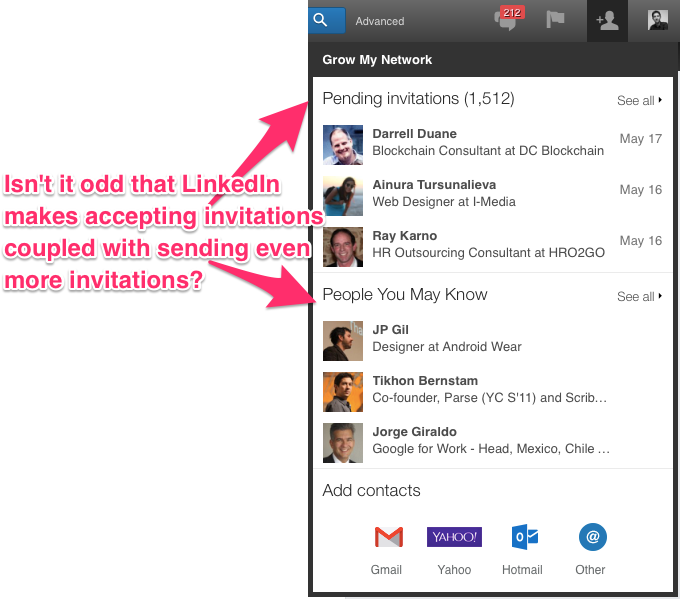

Imagine millions of people getting interrupted like this throughout their day, running around like chickens with their heads cut off, reciprocating each other — all designed by companies who profit from it.  

想象一下，数以百万计的人在一天中被这样打断，像被砍了头的鸡一样跑来跑去，相互对等--所有这些都是由那些从中获利的公司设计的。

Welcome to social media.  

欢迎来到社交媒体。

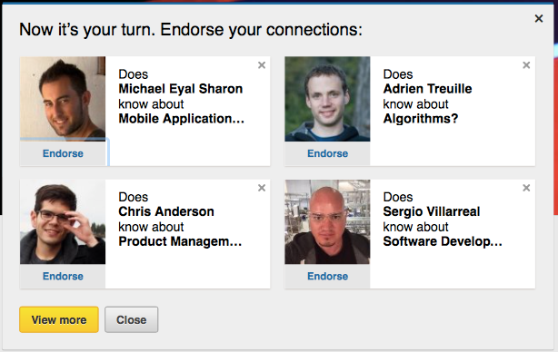

After accepting an endorsement, LinkedIn takes advantage of your bias to reciprocate by offering \*four\* additional people for you to endorse in return.  

在接受认可后，LinkedIn会利用你的偏见进行回报，为你提供\*四个\*额外的人进行认可。

Imagine if technology companies had a responsibility to minimize social reciprocity. Or if there was an independent organization that represented the public’s interests — an industry consortium or an FDA for tech — that monitored when technology companies abused these biases?  

想象一下，如果科技公司有责任将社会互惠性降到最低。或者，如果有一个代表公众利益的独立组织--一个行业联盟或科技界的FDA--在科技公司滥用这些偏见时进行监督？

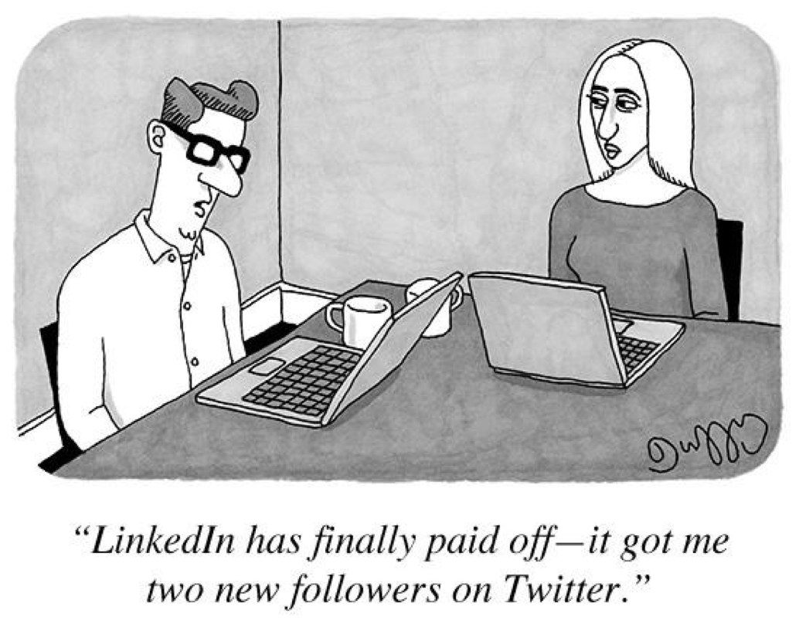

## **Hijack #6: Bottomless bowls, Infinite Feeds, and Autoplay  

劫持#6：无底洞的碗，无限的饲料，和自动播放**

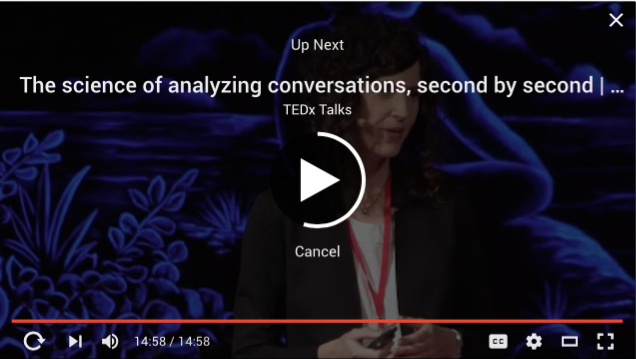

YouTube autoplays the next video after a countdown  

YouTube在倒计时后自动播放下一个视频

Another way to hijack people is to keep them consuming things, even when they aren’t hungry anymore.  

劫持人们的另一种方式是让他们继续消费东西，即使他们不再饥饿。

How? Easy. _Take an experience that was bounded and finite, and turn it into a bottomless flow_ _that keeps going_.  

怎么做？很简单。把一个有界限的、有限的经验，变成一个无底的流动，一直持续下去。

Cornell professor Brian Wansink demonstrated this in his study showing [you can trick people into keep eating soup by giving them a bottomless bowl](http://foodpsychology.cornell.edu/discoveries/bottomless-bowls) that automatically refills as they eat. With bottomless bowls, people eat 73% more calories than those with normal bowls and underestimate how many calories they ate by 140 calories.  

康奈尔大学教授布莱恩-万辛克在他的研究中证明了这一点，他的研究显示，你可以通过给人们一个无底碗，在他们吃东西的时候自动加水，从而诱使他们继续喝汤。使用无底碗的人比使用普通碗的人多吃了73%的热量，并且低估了他们所吃的热量，少了140卡路里。

Tech companies exploit the same principle. News feeds are purposely designed to auto-refill with reasons to keep you scrolling, and purposely eliminate any reason for you to pause, reconsider or leave.  

科技公司也利用了同样的原则。新闻源被故意设计成自动填充理由，让你继续滚动，并故意消除任何让你暂停、重新考虑或离开的理由。

It’s also why video and social media sites like Netflix, YouTube or Facebook _autoplay_ the next video after a countdown instead of waiting for you to make a conscious choice (in case you won’t). A huge portion of traffic on these websites is driven by autoplaying the next thing.  

这也是为什么视频和社交媒体网站，如Netflix、YouTube或Facebook在倒计时后自动播放下一个视频，而不是等待你做出有意识的选择（以防你不会）。这些网站的很大一部分流量是由自动播放下一个东西驱动的。

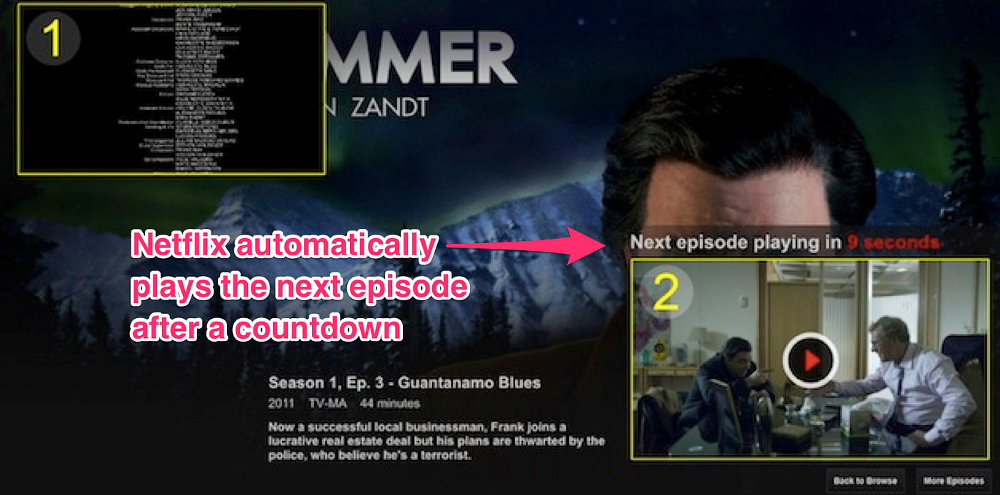

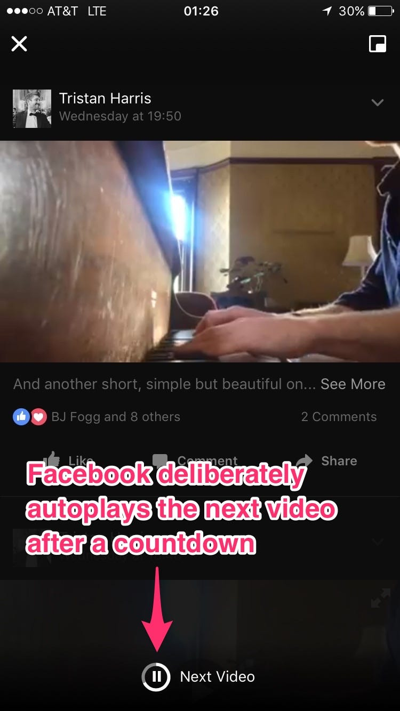

Facebook autoplays the next video after a countdown  

Facebook在倒计时后自动播放下一段视频

Tech companies often claim that “we’re just making it easier for users to see the video _they want_ to watch” when they are actually serving their business interests. And you can’t blame them, because increasing “time spent” is the currency they compete for.  

科技公司经常声称，"我们只是让用户更容易看到他们想看的视频"，而实际上他们是在为他们的商业利益服务。你不能怪他们，因为增加 "花费的时间 "是他们竞争的货币。

Instead, imagine if technology companies empowered you to _consciously bound your experience_ to align with what would be “[time well spent](http://timewellspent.io/)” for you. Not just bounding the _quantity_ of time you spend, but the _qualities_ of what would be “time well spent.”  

相反，想象一下，如果技术公司授权你有意识地约束你的经验，使之与你的 "时间花得好 "相一致。不仅仅是限制你花费的时间数量，而是限制 "花好时间 "的质量。

## Hijack #7: Instant Interruption vs. “Respectful” Delivery  

劫持#7：即时中断与 "尊重 "的传递

Companies know that messages _that interrupt people immediately are more persuasive at getting people to respond_ than messages delivered asynchronously (like email or any deferred inbox).  

公司知道，立即打断人们的信息比异步传递的信息（如电子邮件或任何推迟的收件箱）更有说服力，能让人们做出反应。

Given the choice, Facebook Messenger (or WhatsApp, WeChat or SnapChat for that matter) would _prefer to design their messaging system to_ _interrupt recipients immediately (and show a chat box)_ instead of helping users respect each other’s attention.  

如果有选择的话，Facebook Messenger（或WhatsApp、微信或SnapChat也是如此）宁愿设计他们的消息系统来立即打断收件人（并显示一个聊天框），而不是帮助用户尊重对方的注意力。

In other words, **interruption is good for business**.  

换句话说，中断对企业是有利的。

It’s also in their interest to heighten the feeling of urgency and social reciprocity. For example, Facebook automatically _tells the sender when you “saw” their message, instead of letting you avoid disclosing whether you read it_ (“now that you know I’ve seen the message, I feel even more obligated to respond.”)  

提高紧迫感和社会互惠性也符合他们的利益。例如，Facebook会自动告诉发件人你什么时候 "看到 "他们的信息，而不是让你避免透露你是否读过（"现在你知道我已经看到了信息，我觉得更有义务回应。"）。

By contrast, Apple more respectfully lets users toggle “Read Receipts” on or off.  

相比之下，苹果更恭敬地让用户切换 "阅读收据 "的开关。

The problem is, maximizing interruptions in the name of business creates a tragedy of the commons, ruining global attention spans and causing billions of unnecessary interruptions each day. This is a huge problem we need to fix with shared design standards (potentially, as part of [Time Well Spent](http://timewellspent.io/)).  

问题是，以商业的名义最大限度地提高中断率会造成公地悲剧，毁掉全球的注意力，每天造成数十亿的不必要的中断。这是一个巨大的问题，我们需要用共享的设计标准来解决（有可能，作为 "合理使用时间 "的一部分）。

## Hijack #8: Bundling Your Reasons with Their Reasons  

劫持 #8: 将你的理由与他们的理由捆绑在一起

Another way apps hijack you is by taking _your reasons_ for visiting the app (to perform a task) and _make them inseparable from the app’s business reasons_ (maximizing how much we consume once we’re there).  

应用程序劫持你的另一种方式是将你访问应用程序的原因（执行任务），并使其与应用程序的商业原因（一旦我们在那里，最大限度地提高我们的消费水平）密不可分。

For example, in the physical world of grocery stores, the #1 and #2 most popular reasons to visit are pharmacy refills and buying milk. But grocery stores want to maximize how much people buy, so they put the pharmacy and the milk at the back of the store.  

例如，在杂货店的物理世界中，最受欢迎的访问理由是药房补货和购买牛奶。但杂货店希望最大限度地提高人们的购买量，所以他们把药房和牛奶放在商店的后面。

_In other words, they make the thing customers want (milk, pharmacy) inseparable from what the business wants._ If stores were _truly organized to support people_, they would [put the most popular items in the front](http://www.economist.com/node/12792420).  

换句话说，他们使顾客想要的东西（牛奶、药房）与企业想要的东西密不可分。如果商店真的是为了支持人们，他们会把最受欢迎的商品放在前面。

Tech companies design their websites the same way. For example, when you you want to look up a Facebook event happening tonight (your reason) the Facebook app doesn’t allow you to access it without first landing on the news feed (their reasons), and that’s on purpose. _Facebook wants to convert every reason you have for using Facebook, into their reason which is to maximize the time you spend consuming things_.  

科技公司也以同样的方式设计他们的网站。例如，当你想查找今晚发生的Facebook事件（你的理由）时，Facebook应用程序不允许你在不首先登陆新闻源的情况下访问它（他们的理由），而这是故意的。脸书想把你使用脸书的每一个理由都转化为他们的理由，即最大限度地延长你消费的时间。

Instead, imagine if …  

相反，想象一下，如果...

-   Twitter gave you a _separate way_ to post a tweet than having to see their news feed.  
    
    Twitter给了你一个单独的方式来发布推文，而不是必须看到他们的新闻提要。
-   Facebook gave a _separate way_ to look up Facebook Events going on tonight, without being forced to use their news feed.  
    
    脸书给了一个单独的方式来查询今晚进行的脸书活动，而不需要被迫使用他们的新闻源。
-   Facebook gave you a _separate way_ to use Facebook Connect as a passport for creating new accounts on 3rd party apps and websites, without being forced to install Facebook’s entire app, news feed and notifications.  
    
    Facebook给了你一个单独的方式，使用Facebook Connect作为在第三方应用程序和网站上创建新账户的通行证，而不需要被迫安装Facebook的整个应用程序、新闻源和通知。

In a [Time Well Spent world](http://timewellspent.io/), there is always a _direct way_ to get what you want _separately_ from what businesses want. Imagine a digital “bill of rights” outlining design standards that forced the products used by billions of people to let them navigate directly to what they want without needing to go through intentionally placed distractions.  

在一个善用时间的世界里，总是有一种直接的方式来获得你想要的东西，而不是商家想要的东西。想象一下，一个数字 "权利法案 "概述了设计标准，迫使数十亿人使用的产品让他们直接导航到他们想要的东西，而不需要通过故意设置的干扰。

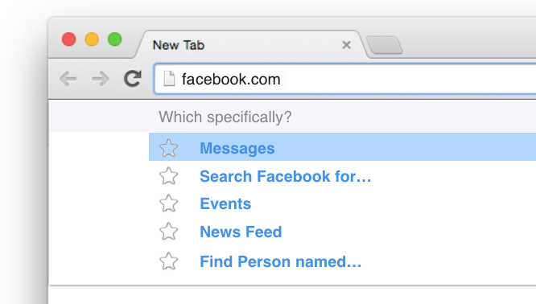

Imagine if web browsers empowered you to navigate directly to what you want — especially for sites that intentionally detour you toward their reasons.  

想象一下，如果网络浏览器授权你直接导航到你想要的东西--特别是对于那些故意让你绕道的网站，他们的理由。

## **Hijack #9: Inconvenient Choices  

劫持 #9: 不方便的选择**

We’re told that it’s enough for businesses to “make choices available.”  

我们被告知，企业只要 "提供选择 "就足够了。

-   “If you don’t like it you can always use a different product.”  
    
    "如果你不喜欢它，你总是可以使用另一种产品。"
-   “If you don’t like it, you can always unsubscribe.”  
    
    "如果你不喜欢它，你可以随时取消订阅。"
-   “If you’re addicted to our app, you can always uninstall it from your phone.”  
    
    "如果你对我们的应用程序上瘾了，你可以随时从你的手机上卸载它。"

Businesses naturally _want to make the choices they want you to make easier, and the choices they don’t want you to make harder._ Magicians do the same thing. You make it easier for a spectator to pick the thing you want them to pick, and harder to pick the thing you don’t.  

企业自然想让他们希望你做出的选择更容易，而他们不希望你做出的选择更难。魔术师也做同样的事情。你让观众更容易选择你希望他们选择的东西，而更难选择你不希望的东西。

For example, NYTimes.com lets you “make a free choice” to cancel your digital subscription. But instead of just doing it when you hit “Cancel Subscription,” they _send you an email with information on how to cancel your account by calling a phone number_ that’s only open at certain times.  

例如，NYTimes.com让你 "自由选择 "取消你的数字订阅。但是，当你点击 "取消订阅 "时，他们并没有直接这样做，而是向你发送一封电子邮件，告知你如何通过拨打一个只在特定时间开放的电话号码来取消你的账户。

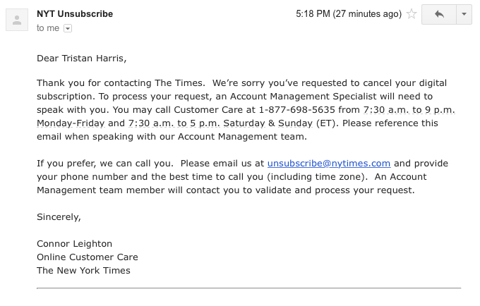

NYTimes claims it’s giving a free choice to cancel your account  

纽约时报》声称它给了一个取消账户的自由选择权

Instead of viewing the world in terms of _availability of choices_, we should view the world in terms of _friction required to enact choices_. Imagine a world where choices were labeled with how difficult they were to fulfill (like coefficients of friction) and there was an independent entity — an industry consortium or non-profit — that labeled these difficulties and set standards for how easy navigation should be.  

我们不应该以选择的可得性来看待这个世界，而应该以做出选择所需的摩擦力来看待这个世界。想象一下这样一个世界：选择被贴上标签，说明它们有多难实现（就像摩擦系数），并且有一个独立的实体--行业联盟或非营利组织--来标明这些困难，并为导航应该有多容易设定标准。

## Hijack #10: Forecasting Errors, “Foot in the Door” strategies  

劫持 #10: 预测错误，"临门一脚 "策略

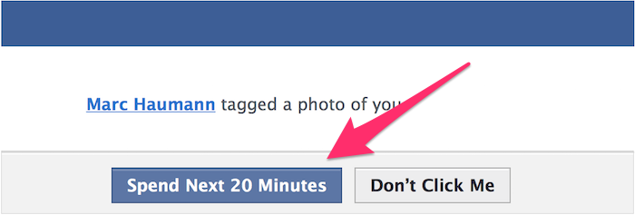

Facebook promises an easy choice to “See Photo.” Would we still click if it gave the true price tag?  

脸书承诺，"看照片 "是一个简单的选择。如果它给出真实的价格标签，我们还会点击吗？

Lastly, apps can exploit people’s inability to forecast the consequences of a click.  

最后，应用程序可以利用人们无法预测一次点击的后果。

People don’t intuitively forecast the _true cost_ _of a click_ when it’s presented to them. Sales people use “foot in the door” techniques by asking for a small innocuous request to begin with (“just one click to see which tweet got retweeted”) and escalate from there (“why don’t you stay awhile?”). Virtually all engagement websites use this trick.  

人们不会凭直觉预测点击的真正成本，当它呈现在他们面前时。销售人员通过要求一个小的无害的请求（"只需点击一下，看看哪条推特被转发了"）来使用 "脚踏实地 "的技巧，并从那里开始升级（"你为什么不多呆一会儿？"）。几乎所有的互动网站都使用这种技巧。

Imagine if web browsers and smartphones, the gateways through which people make these choices, were truly watching out for people and helped them forecast the consequences of clicks (based on real data about [what benefits and costs it actually had](https://github.com/jxe/hindsight)?).  

想象一下，如果网络浏览器和智能手机，即人们做出这些选择的网关，真正为人们着想，并帮助他们预测点击的后果（根据真实的数据，它实际上有什么好处和成本？）

That’s why I add “Estimated reading time” to the top of my posts. When you put the “true cost” of a choice in front of people, you’re treating your users or audience with dignity and respect. In a [Time Well Spent](http://timewellspent.io/) internet, choices could be framed in terms of projected cost and benefit, so people were empowered to make informed choices by default, not by doing extra work.  

这就是为什么我在文章的顶部加上 "估计阅读时间"。当你把一个选择的 "真实成本 "摆在人们面前时，你就是在用尊严和尊重对待你的用户或受众。在 "善用时间 "的互联网中，选择可以用预测的成本和收益来框定，因此人们被赋予了默认做出明智选择的权力，而不是通过做额外的工作。

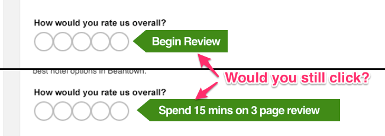

TripAdvisor uses a “foot in the door” technique by asking for a single click review (“How many stars?”) while hiding the three page survey of questions behind the click.  

TripAdvisor使用了一种 "脚踏实地 "的技术，要求用户点击一下评论（"几颗星？"），同时将三页的问题调查隐藏在点击后面。

## Summary And How We Can Fix This  

摘要以及我们如何解决这个问题

Are you upset that technology hijacks your agency? I am too. I’ve listed a few techniques but there are literally thousands. Imagine whole bookshelves, seminars, workshops and trainings that teach aspiring tech entrepreneurs techniques like these. Imagine hundreds of engineers whose job every day is to invent new ways to keep you hooked.  

你对技术劫持你的机构感到不安吗？我也是。我列举了一些技术，但实际上有成千上万种。想象一下，整个书架、研讨会、讲习班和培训都在教授有抱负的技术企业家像这样的技术。想象一下，数以百计的工程师每天的工作就是发明新的方法来让你着迷。

The ultimate freedom is a free mind, and we need technology that’s on our team to help us live, feel, think and act freely.  

最终的自由是自由的思想，我们需要与我们团队合作的技术来帮助我们自由地生活、感受、思考和行动。

We need our smartphones, notifications screens and web browsers to be exoskeletons for our minds and interpersonal relationships that put our values, not our impulses, first. [People’s time is valuable](http://timewellspent.io/). And we should protect it with the same rigor as privacy and other digital rights.  

我们需要我们的智能手机、通知屏幕和网络浏览器成为我们思想和人际关系的外骨骼，将我们的价值观而不是冲动放在第一位。人们的时间是宝贵的。我们应该像保护隐私和其他数字权利一样严格地保护它。

_Tristan Harris was a Design Ethicist at Google until 2016 where he studied how technology restructures two billion people’s attention, wellbeing and behavior. For more resources on Time Well Spent and the Center for Humane Technology, see_ [_http://humanetech.com_](http://humanetech.com/)_._  

特里斯坦-哈里斯在2016年之前一直是谷歌的设计伦理学家，他研究技术如何重组20亿人的注意力、福祉和行为。更多关于Time Well Spent和人道技术中心的资源，见 [_http://humanetech.com_](http://humanetech.com/) 。

**UPDATE: The first version of this post lacked acknowledgements to those who inspired my thinking over many years including** [**Joe Edelman**](http://nxhx.org/)**,** [**Aza Raskin**](http://azarask.in/)**,** [**Raph D’Amico**](http://www.raphdamico.com/)**,** [**Shaun Martin**](http://appliedcognitivescience.com/)**,** [**Jonathan Harris**](http://number27.org/) **and** [**Damon Horowitz**](https://www.ted.com/talks/damon_horowitz?language=en)**.**  

更新：这篇文章的第一个版本没有感谢那些多年来启发我思考的人，包括Joe Edelman , Aza Raskin , Raph D'Amico , Shaun Martin , Jonathan Harris 和 Damon Horowitz。

**My thinking on menus and choicemaking are deeply rooted in Joe Edelman’s** [**work on Human Values and Choicemaking**](http://nxhx.org/Choicemaking/)**.**  

我对菜单和选择的思考深深植根于乔-埃德尔曼的《人类价值和选择》的工作。
