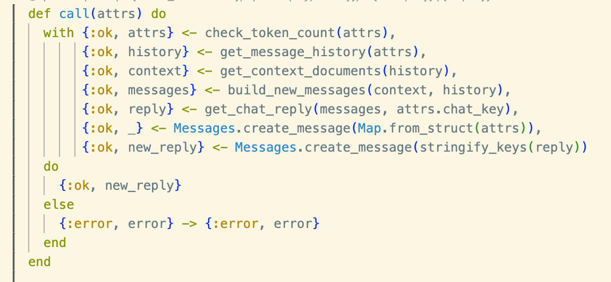
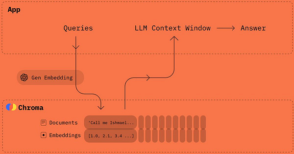

[](https://substackcdn.com/image/fetch/f_auto,q_auto:good,fl_progressive:steep/https%3A%2F%2Fsubstack-post-media.s3.amazonaws.com%2Fpublic%2Fimages%2Fed777251-96cb-4318-afa7-c7b7459d49eb_4096x3430.jpeg)

_**The story so far:** _GPT-4_ was [announced](https://openai.com/research/gpt-4) a few hours ago, and I’m sure you can find good coverage of what the model can do in your outlet of choice. I’ll link to a few resources at the end of this article, and you can explore from there.  

到目前为止的故事。_GPT-4_在几个小时前宣布，我相信你可以在你选择的媒体中找到关于该模型能做什么的良好报道。我将在本文末尾链接到一些资源，你可以从那里进行探索。_

_In this post, I’m going to skip all the usual feeds-and-speeds coverage and try to place the announcement in the context of a larger topic I was already planning to write about this week: how developers will build apps on top of _ChatGPT_ and similar models.   

在这篇文章中，我将跳过所有通常的feeds-and-speeds报道，并试图将这一宣布放在我本周已经计划写的一个更大的话题中：开发者将如何在_ChatGPT_和类似的模型之上建立应用程序。_

_As I say in the piece, I often encounter confusion about the basic mechanics of how these models can be used in software, so this is my attempt to help clear this up for everyone who’s looking at this space and trying to understand how they can adapt to it.  

正如我在文章中所说，我经常遇到关于这些模型如何在软件中使用的基本机制的困惑，所以这是我试图帮助每一个关注这一领域并试图了解如何适应这一领域的人澄清这一点。_

😶🌫️ Right now, everyone who’s watching the advances in AI fantasizes about building roughly the same app: a version of _ChatGPT_ that can do all the miracles we just saw in today’s _GPT-4_ demo, but that _also_ knows a host of facts and concepts that are stashed in some proprietary database.  

😶🌫️ 现在，每个关注人工智能进展的人都幻想着建立大致相同的应用程序：一个_ChatGPT_的版本，它可以完成我们在今天的_GPT-4_演示中刚刚看到的所有奇迹，但它也可以显示藏在一些专有数据库中的大量事实和概念。

A few examples:  

举几个例子。

-   As a **writer**, I want a version of _ChatGPT_ that knows my entire publicly available corpus of 25 years’ worth of web writing and can interactively answer questions about it — a sort of _gpt-jon_.  
    
    作为一个作家，我希望有一个版本的_ChatGPT_，知道我的整个公开的25年的网络写作语料库，并能互动地回答有关问题--一种gpt-jon。
    
-   A **SaaS company** wants a version of _ChatGPT_ that can answer customer support questions because it knows every customer’s support ticket history and all the information in the company’s knowledge base.  
    
    一家SaaS公司想要一个能够回答客户支持问题的_ChatGPT_版本，因为它知道每个客户的支持票历史和公司知识库中的所有信息。
    
-   A **large corporation** may have reams of siloed data that it wants to use for onboarding new employees via an interactive chat interface — everything from HR manuals to department-specific secrets.  
    
    一家大公司可能有成堆的孤立数据，它想通过互动聊天界面用于新员工的入职培训--从人力资源手册到部门的具体秘密，应有尽有。
    

In talking to people outside of ML hyper-nerd circles, I’ve realized that most people — even very technically savvy people — don’t quite understand how the above products will get built on top of _GPT-4_.  

在与ML超级书呆子圈子以外的人交谈时，我意识到大多数人--甚至是非常懂技术的人--都不太理解上述产品将如何建立在_GPT-4_之上。

Most people imagine, for instance, that in order to put _GPT-4_ to work on their own data, they’ll need to train a version of it on their proprietary data. So in their mind, the process will work something like this:  

例如，大多数人认为，为了让_GPT-4_在他们自己的数据上发挥作用，他们需要在他们的专有数据上训练一个版本的软件。因此，在他们看来，这个过程将是这样的。

_All the model’s training data + my proprietary data → training → inference → 🤑  

所有模型的训练数据+我的专有数据→训练→推理→🤑_

You could do all of the above, but it would be extremely expensive. It’s also not even remotely necessary.  

你可以做上述所有的事情，但这将是非常昂贵的。这也是根本没有必要的。

An alternate approach would be to **fine-tune a pre-trained model** so that it knows about a much smaller corpus. Recently, this fine-tuning approach was the best way to build apps like the above. _OpenAI_ offers fine-tuning capabilities via their API, in fact.  

But of course, you need someone on your team who knows how to do this, and for other reasons, it’s not necessarily ideal for many use cases.   

另一种方法是对预训练的模型进行微调，使其了解一个小得多的语料库。最近，这种微调方法是建立类似上述应用的最佳方式。事实上，_OpenAI_通过他们的API提供微调功能。但当然，你需要你的团队中有人知道如何做到这一点，而且由于其他原因，这对许多用例来说不一定是理想的。

💬 But there’s another way that was sort of working with GPT-3.5, and as of today’s _GPT-4_ announcement should really work quite well. I’ve taken to calling it **the CHAT stack**:  

但还有另一种方法，在GPT-3.5中还算可行，从今天的_GPT-4_公告来看，应该真的很好用。我把它叫做CHAT栈。

-   **C**ontext
    
-   **H**istory
    
-   **A**PI
    
-   **T**oken window  
    
    代币窗口
    

Not only is the CHAT stack (under whatever name we eventually settle on) how huge parts of the software ecosystem will begin to work very shortly, but it’s actually already being done — I personally just implemented it this past weekend in order to write the aforementioned _gpt-jon_ using a combination of Postgresql (with pgvector), _OpenAI_’s embeddings API, _ChatGPT_, and Discord. BingGPT worked like this, too — in its case, the specially structured database was Bing’s database of crawled web pages.  

CHAT堆栈（不管我们最终确定的名称是什么）不仅是软件生态系统的巨大部分将很快开始工作，而且实际上已经在做了--我个人在上周末刚刚实现了它，以便使用Postgresql（与pgvector）、_OpenAI_的嵌入API、_ChatGPT_和Discord的组合来编写上述的gpt-jon。BingGPT也是这样工作的--在它的案例中，特殊结构的数据库是Bing的抓取的网页数据库。

So let’s take a closer look at the CHAT stack, and then we’ll look at a few features of the newly announced _GPT-4_ model that will turbocharge it.  

因此，让我们仔细看看CHAT堆栈，然后我们再看看新宣布的_GPT-4_模型的一些功能，这些功能将使它变得更加强大。

The shortest, most effective route to building the apps described in the opener is to take advantage of _GPT-4_’s token window via a flow like the following:  

构建开场白中描述的应用程序的最短、最有效的途径是通过以下流程利用_GPT-4_的令牌窗口。

1.  The user submits a **prompt** to the chatbot, which is appended to a longer chat history that contains the most recent few user-supplied prompts and LLM-supplied responses (the chat **history**).  
    
    用户向聊天机器人提交一个提示，该提示会被附加到一个较长的聊天历史中，其中包含最近的几个用户提供的提示和LLM提供的回应（聊天历史）。
    
2.  The chatbot searches a specially structured database for the documents that are most relevant to the user’s prompt and history. This collection of relevant documents is called **context**.   
    
    聊天机器人会在一个特殊结构的数据库中搜索与用户的提示和历史最相关的文件。这个相关文件的集合被称为context。
    
3.  The chatbot then combines the user prompt, the user’s chat history, and the context documents into the **language model’s token window** via an **API**.  
    
    然后，聊天机器人通过一个API将用户提示、用户的聊天历史和上下文文件结合到语言模型的标记窗口中。
    
4.  The LLM now knows everything it was trained on plus the chat history and context we just fed it, so it can **respond** to the user’s prompt in light of that context.  
    
    LLM现在知道它所训练的所有内容，再加上我们刚刚提供给它的聊天历史和背景，所以它可以根据这些背景对用户的提示作出反应。
    

In the four-stage chatbot setup described above, the LLM understands a large body of facts about the world, and it also has been fine-tuned to respond to instructions and answer questions.  

在上述四个阶段的聊天机器人设置中，LLM理解了大量关于世界的事实，它也被微调为响应指令和回答问题。  

It can then turn that knowledge and those abilities to the task of examining the context documents the chatbot platform supplied to it alongside a chat history and a prompt in order to pull fresh facts and concepts out of that context material to _craft_ a response.  

然后，它可以将这些知识和能力用于检查聊天机器人平台提供给它的背景文件，以及聊天历史和提示，以便从背景材料中提取新的事实和概念，精心制作一个回应。

[](https://substackcdn.com/image/fetch/f_auto,q_auto:good,fl_progressive:steep/https%3A%2F%2Fsubstack-post-media.s3.amazonaws.com%2Fpublic%2Fimages%2F6c944da0-17b0-42b8-8720-35500d04d546_1999x1353.png)

The CHAT stack  

CHAT堆栈

That diagram would probably be better as an animation, but to walk through it quickly:  

这张图作为一个动画可能会更好，但要快速走完它。

1.  The context and history (which includes the most recent user-supplied prompt) are combined to form a collection of **prompt tokens**, and they’re sent through the API to the token window.  
    
    上下文和历史记录（包括最近的用户提供的提示）被组合成一个提示令牌的集合，并通过API发送到令牌窗口。
    
2.  Those prompt tokens then go into the model, which runs an inference and produces a set of **completion tokens** that have to fit into the token window alongside the input tokens (this is related to the fact that the output tokens are actually generated one at a time, so it’s filling up the token window one token at a time).  
    
    这些提示标记然后进入模型，模型运行推理并产生一组完成标记，这些标记必须与输入标记一起放入标记窗口（这与输出标记实际上是一次生成一个的事实有关，所以它是一次一个标记地填满标记窗口）。
    
3.  The **completion tokens** then go back into the chat history, so the cycle can repeat at step 1.  
    
    完成后的令牌会回到聊天历史中，因此可以重复步骤1的循环。
    

The developer owns the stuff to the left of the API boundary — the message history and the context database — while the AI provider owns the API itself and the stuff to the right of it.  

开发者拥有API边界左边的东西--消息历史和上下文数据库--而人工智能提供者拥有API本身和它右边的东西。

If you want a peek at my janky implementation, here’s the single function of (n00b) elixir that implements the whole CHAT stack:  

如果你想偷看我的古怪实现，这里是（n00b）elixir的单一函数，实现了整个CHAT堆栈。

[](https://substackcdn.com/image/fetch/f_auto,q_auto:good,fl_progressive:steep/https%3A%2F%2Fsubstack-post-media.s3.amazonaws.com%2Fpublic%2Fimages%2Fe84e1721-6b3e-4207-9250-a3465e7ee7ec_1150x532.png)

🗄️ I expect there will probably be software products and services that focus entirely on context storage and others that focus entirely on message history storage, where both types of storage are able to service requests for specific token amounts and make heavy use of embeddings to optimize token usage.  

🗄️，我预计可能会有完全专注于上下文存储的软件产品和服务，也有完全专注于消息历史存储的软件产品和服务，这两种类型的存储都能够为特定令牌数量的请求提供服务，并大量使用嵌入技术来优化令牌的使用。

Note that we can actually generalize the CHAT stack flow a bit more so that it’s not quite so chat-specific and looks more like a standard event-driven software flow:  

请注意，我们实际上可以把CHAT堆栈的流程概括得更多一些，这样它就不太针对聊天，看起来更像一个标准的事件驱动软件流程。

1.  User action creates an **event** with associated data.  
    
    用户行为创造了一个带有相关数据的事件。
    
2.  Bot does a **relevance query** of a proprietary database for documents or other assets related to that user event.  
    
    机器人对一个专有数据库进行相关性查询，以寻找与该用户事件相关的文件或其他资产。
    
3.  Bot puts the user’s event stream (including the latest event) plus the results of the relevance query into an LLM’s **token window**.  
    
    Bot将用户的事件流（包括最新的事件）加上相关性查询的结果放入一个LLM'stoken窗口。
    
4.  LLM now produces a **response**.  
    
    LLM现在产生了反应。
    

I think we’ll see a lot of this generalized pattern crop up in all kinds of places as developers get their heads around it, the tools are built out, and the APIs mature. Anything that **has an event stream** and **can benefit from predictions** is a candidate for being revolutionized by this pattern. The software landscape of 2024 will look pretty different than what we see right now as a result.  

我想我们会看到很多这种通用的模式出现在各种地方，因为开发者们都在思考这个问题，工具被建立起来了，API也成熟了。任何有事件流并能从预测中受益的东西都是被这种模式革新的候选者。因此，2024年的软件景观将与我们现在看到的相当不同。

In fact, if you have a company of any type, whether it’s software or not, you should have someone dedicated to figuring out how to apply the CHAT stack to your business. Because if you don’t, you’ll be shocked at how quickly you’re left behind.  

事实上，如果你有一个任何类型的公司，无论是否是软件公司，你都应该有一个人专门负责找出如何将CHAT堆栈应用于你的业务。因为如果你不这样做，你会对你被甩在后面的速度感到震惊。

In the CHAT stack I’ve described here, there are two types of persistent state:  

在我这里描述的CHAT堆栈中，有两种类型的持久性状态。

1.  The chat history (or event stream)  
    
    聊天历史（或事件流）。
    
2.  The context database  
    
    背景数据库
    

The **context database** is the part that contains all the proprietary that companies and writers like me want to _GPT-4_ to know about and work its magic on.  

You might think you could use ordinary document retrieval systems for this — such systems have had the ability to do relevance searches for a very long time.  

上下文数据库是包含所有像我这样的公司和作家希望_GPT-4_了解并发挥其魔力的专有部分。你可能认为你可以使用普通的文件检索系统来做这件事--这种系统有能力进行相关性搜索已经有很长一段时间了。

🤏 But because of the limited number of tokens that can go into the token window, you don’t usually want entire documents to form the basis of the context you’re supplying for every prompt.  

但由于可以进入标记窗口的标记数量有限，你通常不希望整个文件构成你为每个提示提供的上下文的基础。  

Rather, you want only the material within the documents that’s relevant to the prompt, and for extracting that material and bringing it to the surface in a context search, we can use some machine learning…. But that’s a topic for another post!  

相反，你只想得到文件中与提示有关的材料，为了提取这些材料并在上下文搜索中把它们呈现出来，我们可以使用一些机器学习....。但这是另一篇文章的主题!

There’s currently some activity going on in the area of making data stores that work for the specific use case described here, where the relevance query results should ideally take the form of a certain number of tokens worth of context (and not whole documents).  

目前，在使数据存储适用于这里所描述的特定用例方面有一些活动，其中相关性查询结果最好采取一定数量的标记值的上下文形式（而不是整个文档）。

[](https://twitter.com/atroyn/status/1625568377766035456)



[](https://twitter.com/atroyn/status/1625568377766035456)

🌊 These newer, AI-native data stores will combine with larger token windows, lower costs per token, and better-behaving bots (i.e., they’re more responsive to instructions from users) to unlock a tsunami of innovation in the coming weeks.  

这些更新的、人工智能原生的数据存储将与更大的代币窗口、更低的每个代币成本以及行为更好的机器人（即它们对用户的指令反应更灵敏）相结合，在未来几周内释放出创新的海啸。

Yeah, I said “weeks.” Buckle up.  

是的，我说 "几周"。系好安全带。

👷♂️ Because AI safety is the topic on everyone’s mind, I should unpack how the CHAT stack intersects with the challenge of testing the bots before production so they don’t end up trying to convince journalists to divorce their wives.  

👷♂️ 因为人工智能安全是每个人心中的话题，我应该解开CHAT堆栈与生产前测试机器人的挑战之间的交集，以便它们不会最终试图说服记者与他们的妻子离婚。

The chat history or event stream I described in the preceding section itself contains two types of data:  

我在上一节描述的聊天历史或事件流本身包含两种类型的数据。

1.  User-supplied data (events, messages)  
    
    用户提供的数据（事件、消息）。
    
2.  LLM-supplied data (responses to #1 above)  
    
    LLM提供的数据（对上述第1条的回应）。
    

To see how this works in a real-life API, take a look at this set of chat messages in the standard message format for the _ChatGPT_ API, taken from the API’s documentation:  

要想知道这在现实生活中的API中是如何工作的，请看这组_ChatGPT_ API的标准消息格式的聊天消息，它取自API的文档。

```
  messages=[
        {"role": "system", "content": "You are a helpful assistant."},
        {"role": "user", "content": "Who won the world series in 2020?"},
        {"role": "assistant", "content": "The Los Angeles Dodgers won the World Series in 2020."},
        {"role": "user", "content": "Where was it played?"}
    ]
```

You can see from the above that there are three roles recognized by the API, two input roles (system and user) and an output role (assistant) for the bot’s response. That last entry in the messages list, `{"role": "user", "content": "Where was it played?"}`, is actually what we’d call the “prompt” or “query” — it’s the most recent message the user typed to the bot.  

你可以从上面看到，有三个角色被API认可，两个输入角色（系统和用户）和一个输出角色（助理），用于机器人的响应。消息列表中的最后一个条目， `{"role": "user", "content": "Where was it played?"}` ，实际上就是我们所说的 "提示 "或 "查询"--它是用户向机器人输入的最近的消息。

But again, it’s that whole `messages` history with the prompt appended to the end, and not merely the prompt in isolation, that gets submitted to the LLM on each pass and that produces the bot’s next batch of output tokens.  

但同样地，每次提交给LLM的是整个 `messages` 历史和附加在末尾的提示，而不仅仅是单独的提示，并且产生机器人的下一批输出令牌。

🔄 This chat history structure, then, introduces a very important component into the chatbot experience, a component that’s the source of the “chat” paradigm’s power as a UI affordance and also its unpredictability: **reflexivity**.  

那么，这种聊天历史结构在聊天机器人的体验中引入了一个非常重要的组成部分，这个组成部分是 "聊天 "范式作为用户界面负担的力量的来源，也是它的不可预测性：反思性。

Because the outputs of previous bot exchanges are supplied as part of the input to current and future bot exchanges, the bot’s overall output is **necessarily going to drift** in ways that are absolutely impossible to predict.  

由于以前的机器人交换的产出是作为当前和未来的机器人交换的输入的一部分提供的，所以机器人的整体产出必然会以绝对无法预测的方式漂移。

This is a bit like Conways’ Game of Life, where a few simple rules applied in a reflexive manner give rise to complex, chaotic emergent behavior.  

这有点像康威的 "生命游戏"，一些简单的规则以反射性的方式应用，产生了复杂、混乱的突发行为。  

But in the case of the chatbot, the potential for chaos and drift is greatly increased by the fact that the user keeps introducing fresh randomness with his queries.   

但是在聊天机器人的情况下，由于用户不断地用他的查询引入新的随机性，所以混乱和漂移的可能性大大增加。

👺 All of this is why you can’t properly red-team these LLMs in the thorough way many people imagine. It’s not just that you can’t anticipate most of the likely chat prompts people will feed the bot — it’s that you cannot possibly imagine most of the likely _chat histories_ people will feed the bot.  

所有这些都是为什么你不能像许多人想象的那样，对这些LLM进行适当的红队。这不仅仅是因为你无法预测人们可能会给机器人提供的大部分聊天提示，而是因为你不可能想象人们可能会给机器人提供的大部分聊天历史。

That’s the key point that’s missed over and over again in simplistic discussions of safety from people who should know better — you can’t possibly iterate through a meaningful part of the space of all possible chat histories in order to validate or even [smoke test](https://en.wikipedia.org/wiki/Smoke_testing_(software)) an LLM chatbot’s latent space before production.  

这就是那些应该更了解安全问题的人在简单化的讨论中一再忽略的关键点--你不可能在所有可能的聊天历史空间中迭代出一个有意义的部分，以便在生产前验证或甚至烟熏测试LLM聊天机器人的潜在空间。

✨ _GPT-4_ does many startling miracles, which you can witness by following the links in the last section of this post or by browsing your tech news outlet of choice.  

✨ _GPT-4_创造了许多惊人的奇迹，你可以通过关注本帖最后一节的链接或浏览你选择的科技新闻渠道来见证。  

But it also does a few less glamorous things that will make those miracles easier for developers to turn into products.  

但它也做了一些不那么光彩的事情，这将使这些奇迹更容易被开发者转化为产品。

🛫 The most important place where _GPT-4_ excels is at offering what we might call **control surfaces** — these are ways that we as humans can steer the model to get better outputs from it.  

_GPT-4_最擅长的地方是提供我们称之为控制面的东西--这些是我们作为人类可以引导模型获得更好输出的方法。

For instance, there’s better support for `system` role messages — this is one of the two standard input types of messages in the API example I showed in the section on safety.   

例如，对 `system` 角色信息有更好的支持--这是我在安全一节中展示的API例子中两种标准输入类型的信息之一。

The previous version of _ChatGPT_ supported system messages for providing additional instructions and context, but these messages were often ignored.  

上一版本的_ChatGPT_支持系统消息，以提供额外的指示和背景，但这些消息经常被忽略。  

It was hard to get the model to answer in a specific voice or personality — believe me, I know because I never really got gpt-jon to sound like me.  

要让模特用特定的声音或个性来回答是很难的--相信我，我知道，因为我从未真正让gpt-jon听起来像我。

[](https://substackcdn.com/image/fetch/f_auto,q_auto:good,fl_progressive:steep/https%3A%2F%2Fsubstack-post-media.s3.amazonaws.com%2Fpublic%2Fimages%2F8694540d-08ec-445f-a38f-cbd6094e69fd_2166x836.png)

_GPT-4_ promises better system role support and a more responsive model that it’s easier to put into a specific persona or voice. This will unlock possibilities for users to bring their own voice or style to the bot’s responses.  

_GPT-4_承诺提供更好的系统角色支持和更灵敏的模型，它更容易被放入特定的角色或声音中。这将为用户把自己的声音或风格带入机器人的反应中提供可能性。

-   The kinds of companies and academic departments that currently issue updated lists of banned words, along with suggested replacements, will love this. They can make the bot speak in up-to-the-nanosecond social justice lingo.  
    
    那些目前发布最新禁词清单和建议替代词的公司和学术部门会喜欢这个。他们可以让机器人说上一秒的社会正义行话。
    
-   Companies that are based and red-pilled, and want their internal corporate bots to address users in King James English, liturgical Latin, or BAP-speak (wat mean?) will likewise have their prayers answered.  
    
    那些基于和红色填充的公司，并希望他们的内部企业机器人能用詹姆斯国王英语、礼仪拉丁语或BAP语（wat mean?）来称呼用户，他们的祈祷同样会得到回应。
    
-   Authors who want the bot to write the next chapter of their opus in their signature style can do that.  
    
    想让机器人以其标志性的风格写出其作品的下一章的作者可以这么做。
    

I could go on making stuff up, but you get the idea.  

我可以继续编造东西，但你会明白的。

Finally, the model is just **better at following human orders** and instructions of all kinds. Much of this is a result of improvements in the fine-tuning and RLHF phases, and his covered under discussions of “safety” in the technical report that was released.  

最后，该模型在遵循人类命令和各种指令方面做得更好。这在很大程度上是微调和RLHF阶段改进的结果，他在已发布的技术报告中的 "安全 "讨论中有所涉及。

👉 ‼️ The other major feature that _GPT-4_ brings with is an **enlarged token window** that’s doubled in size to 8,192 tokens. The price for this token window is $0.03 per 1,000 prompt tokens and $0.06 per 1,000 completion tokens. This is very cheap compared to just a few months ago, and I’m sure prices will drop even further as the year progresses.  

👉‼️ _GPT-4_带来的另一个主要特征是一个扩大的代币窗口，其大小增加到8192个代币。这个代币窗口的价格是每1000个提示代币0.03美元，每1000个完成代币0.06美元。与几个月前相比，这是非常便宜的，而且我相信随着今年的进展，价格会进一步下降。

There’s also a **much larger window** of 32,768 tokens that will eventually be available for everyone at double the price per token of the smaller window.  

还有一个更大的窗口，即32,768个代币，最终将以每个代币两倍于小窗口的价格提供给所有人。

These larger token window sizes will make it much easier for CHAT stack applications to get relevant context and message history into the token window without blowing out the token budget.  

这些较大的令牌窗口尺寸将使CHAT堆栈应用更容易将相关的上下文和消息历史纳入令牌窗口，而不会耗尽令牌预算。  

Given the state of current vector databases and the amount of pain involved in trying to only the most relevant parts of context documents into the token window so as not to waste tokens, the larger window will be more forgiving for the current toolchain and will be a big enabler of developer productivity.  

鉴于目前矢量数据库的状况，以及为了不浪费令牌而试图只将上下文文件中最相关的部分放入令牌窗口的痛苦程度，更大的窗口将对目前的工具链更加宽容，并将成为开发者生产力的一大推动力。

Longer-term, as context databases improve their ability to surface the most relevant collections of tokens, the larger token windows will make the _GPT-4_\-based bots feel more intelligent.  

从长远来看，随着语境数据库提高其浮现最相关的令牌集合的能力，更大的令牌窗口将使基于_GPT-4_的机器人感觉更智能。

-   [The _OpenAI_ announcement  
    
    _OpenAI_的公告](https://openai.com/research/gpt-4)
    
-   [Hacker News thread  
    
    黑客新闻主题](https://news.ycombinator.com/item?id=35154527)
    
-   [Reddit thread with many relevant links  
    
    有许多相关链接的Reddit主题](https://www.reddit.com/r/MachineLearning/comments/11rc02e/news_openai_announced_gpt4/)
    

<iframe src="https://www.youtube-nocookie.com/embed/outcGtbnMuQ?rel=0&amp;autoplay=0&amp;showinfo=0&amp;enablejsapi=0" frameborder="0" loading="lazy" gesture="media" allow="autoplay; fullscreen" allowautoplay="true" allowfullscreen="true" width="728" height="409" data-immersive-translate-effect="1"></iframe>
