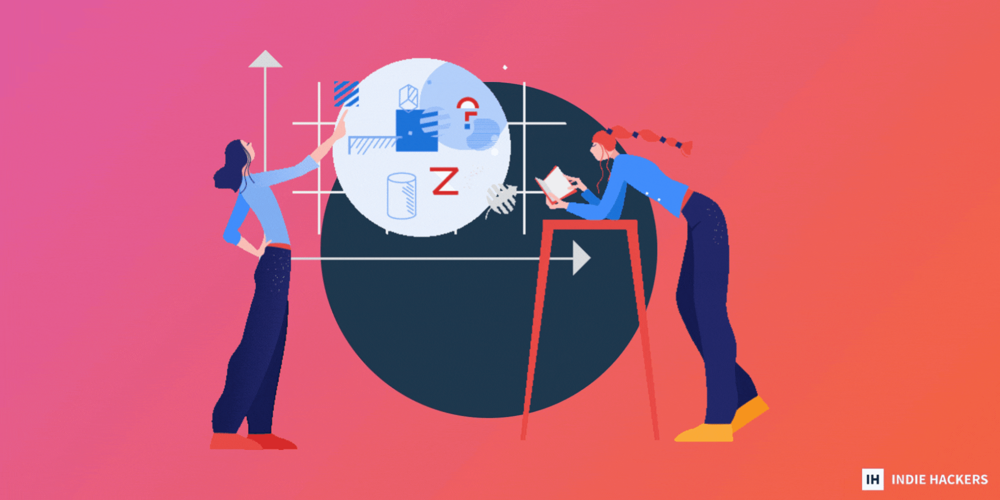
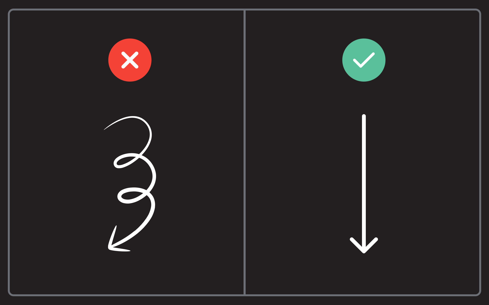
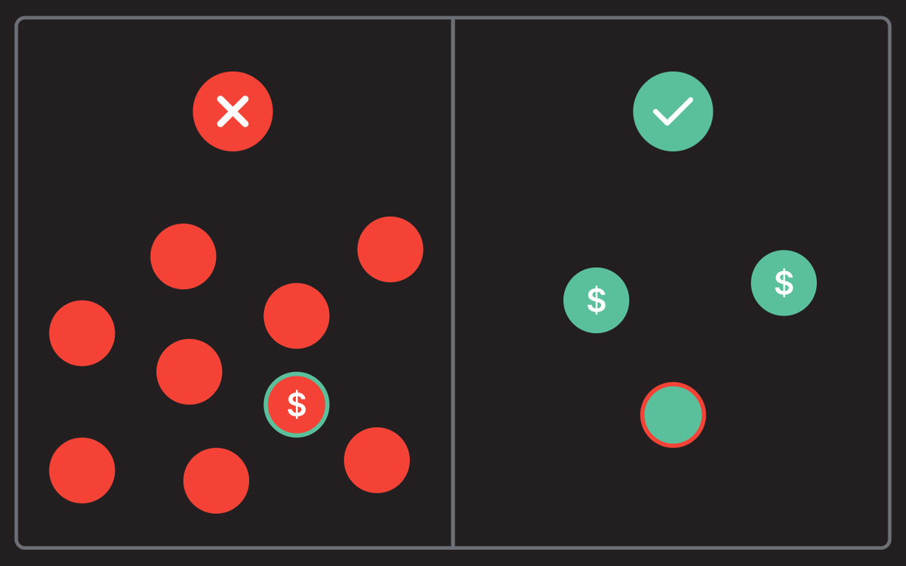
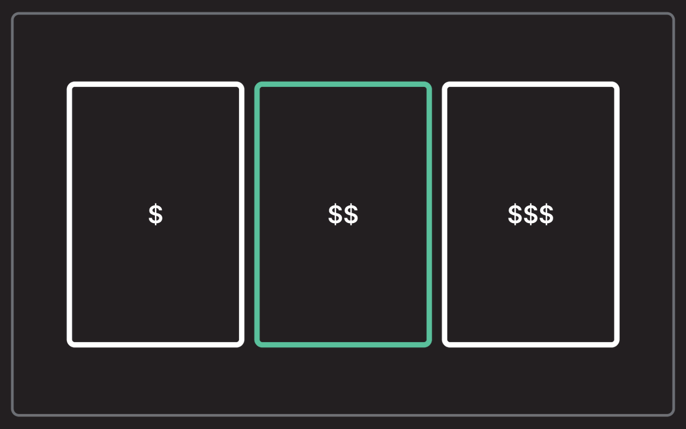
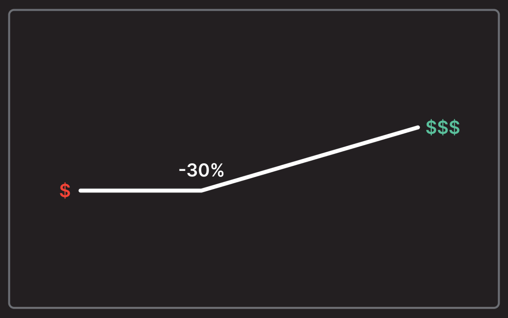
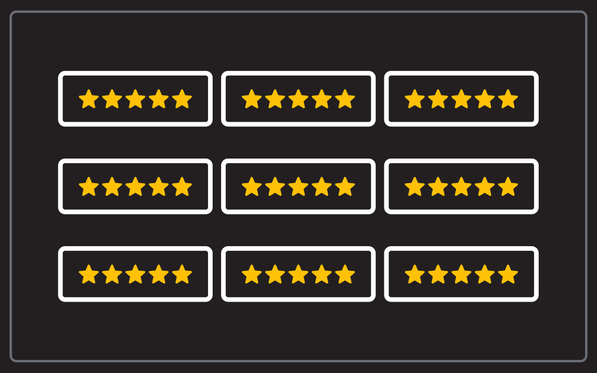
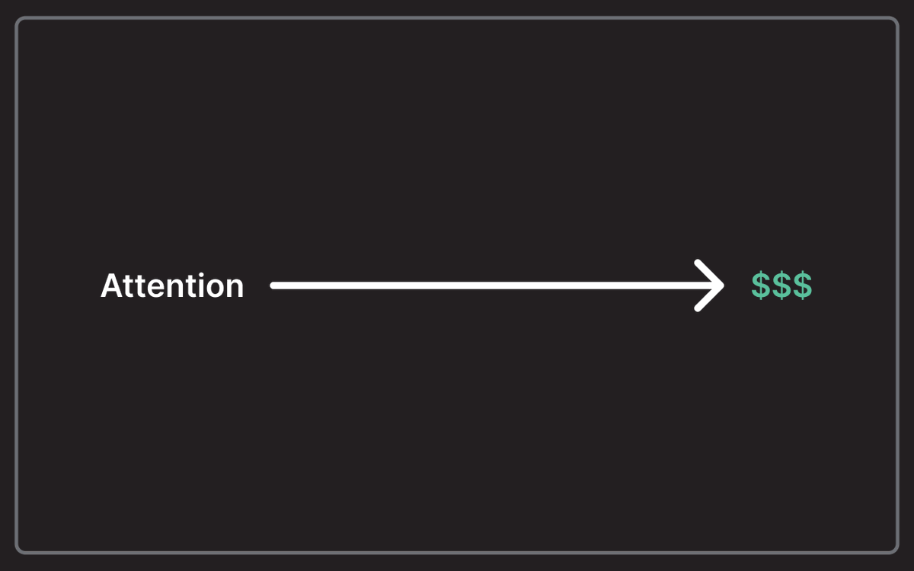
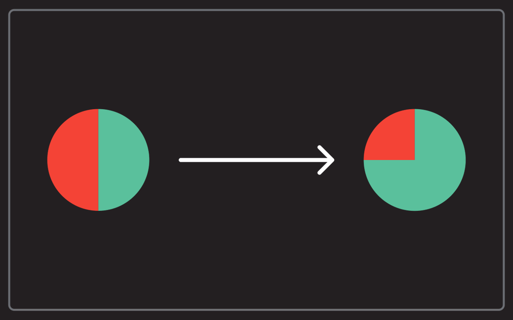

## 📈 Eight Tactics to Increase Your Conversion Rate  

📈 提高转换率的八种策略

_by [Dan Kulkov  

作者：Dan Kulkov](https://www.indiehackers.com/kronop/history)_

No founder has ever said: "No thanks, I don't need a higher conversion rate."  

没有一个创始人说过"不，谢谢，我不需要更高的转换率"。

That's why I collected eight non-trivial tactics to increase your conversion rate in 2023, even if you don't have a marketing budget. Read on for more!  

这就是为什么我收集了8个非微不足道的战术来提高你在2023年的转换率，即使你没有营销预算。继续阅读，了解更多!

### 1\. Simplify your marketing funnel  

1.简化你的营销漏斗

Companies with 50 person marketing departments can have complex multilevel marketing funnels. Most founders can't.  

拥有50人营销部门的公司可以拥有复杂的多层次营销漏斗。大多数创始人却不能。

The more complex your marketing funnel is, the more optimization you need to make it work. That's why you should shoot for minimalistic marketing funnels:  

你的营销漏斗越复杂，你需要更多的优化来使其发挥作用。这就是为什么你应该以简约的营销漏斗为目标。

-   One or two acquisition channels.  
    
    一个或两个收购渠道。
-   Two or three activation moments.  
    
    两个或三个激活的时刻。
-   One or two sales offers.  
    
    一个或两个销售提议。

Sure, you will lose some customers who need extra attention, but you will also make life easier for 95% of your users. That's how you get more paying customers.  

当然，你会失去一些需要额外关注的客户，但你也会让95%的用户的生活更轻松。这就是你获得更多付费客户的方法。

### 2\. Acquire better users  

2.获得更好的用户

Acquisition channels are not equal. If you acquire users from a crappy marketing channel, they will not buy your product, not because you are not convincing, but because traffic quality is poor.  

获取渠道是不平等的。如果你从一个蹩脚的营销渠道获取用户，他们将不会购买你的产品，不是因为你没有说服力，而是因为流量质量差。

Trying [better acquisition channels](https://blog.makerbox.club/customer-acquisition-guide/) for your product will help you get more website visitors, and help land you more customers with less effort.  

为你的产品尝试更好的获取渠道将帮助你获得更多的网站访问者，并帮助你以更少的努力获得更多的客户。

### 3\. One offer at a time  

3.一次一个报价

Want to overwhelm your users? Offer five freebies, 10 main products, and four upsell products. People will get analysis paralysis, and end up not buying anything from you.  

想让你的用户不知所措？提供5个赠品，10个主要产品和4个追加销售产品。人们会陷入分析瘫痪，最终不从你这里购买任何东西。

Or, you can have one freebie, one main product, and one upsell product. Some people will [leave unsatisfied](https://blog.makerbox.club/7-counterintuitive-pieces-of-advice/), but most users will have an easier time agreeing to your offer.  

或者，你可以有一个赠品，一个主要产品，和一个追加销售产品。有些人将会不满意地离开 ，但大多数用户会更容易同意你的提议。

Help your users focus on buying one thing, then direct them to focus on purchasing the second thing.  

帮助你的用户专注于购买一件东西，然后引导他们专注于购买第二件东西。

### 4\. Two or three pricing plans  

4.两个或三个定价计划

You should have one offer, but not just one pricing plan.  

你应该有一个报价，但不是只有一个定价计划。

Each product [should have 2-3 pricing plans](https://blog.makerbox.club/tactics-to-grow-side-hustle/). Always include an upsell pricing plan for people with money, and a down-sell pricing plan for people on a budget.  

每个产品应该有2-3个定价计划。始终包括一个针对有钱人的向上销售定价计划，以及一个针对有预算的人的向下销售定价计划。

Expensive pricing plans make your main pricing plan look better. The same goes for cheap pricing plans. Your goal is to define the most desirable plan for your business; don't offer more than three. That's too much.  

昂贵的定价计划使你的主要定价计划看起来更好。廉价的定价计划也是如此。你的目标是为你的企业定义最理想的计划；不要提供超过三个。那就太多了。  

You don't want your potential customers to get paralyzed from comparing each price.  

你不希望你的潜在客户因为比较每个价格而陷入瘫痪。

### 5\. Choose your discount strategy  

5.选择你的折扣策略

Discounts are growth drivers for founders, but only if you pick the right strategy.  

折扣是创始人的增长动力，但前提是你要选择正确的策略。

Here are four different approaches:  

这里有四种不同的方法。

-   If you have a B2B SaaS, only give discounts for upgrading to an annual plan.  
    
    如果你有一个B2B的SaaS，只对升级到年度计划给予折扣。
-   If you have a productized service or e-commerce brand, give discounts for the first order.  
    
    如果你有一个产品化的服务或电子商务品牌，为第一个订单提供折扣。
-   If you have a content product, run quarterly sales with huge discounts.  
    
    如果你有一个内容产品，每季度进行一次巨大折扣的销售。
-   If you have a premium product, don't give any discounts.  
    
    如果你有一个高级产品，不要给任何折扣。

Understand when to play the discount card!  

了解什么时候打折扣牌!

### 6\. Get more social proof  

6.获得更多的社会证明

Many indie hackers think they need to change how they describe their product to increase sales, and that's true to some extent. But remember, you already have the best promoters: Your customers. Use them to impress your website visitors with the love your product gets.  

许多独立黑客认为他们需要改变描述产品的方式来增加销售，这在某种程度上是真的。但请记住，你已经有了最好的推广者。你的客户。利用他们来打动你的网站访客，让他们对你的产品产生喜爱。

People trust people way more than they trust companies. Leverage that. Collect video testimonials, reviews from opinion leaders, and success stories from satisfied customers.  

人们对人的信任远远多于对公司的信任。利用这一点。收集视频推荐，意见领袖的评论，以及满意的客户的成功故事。

Your users need to feel that buying your product is a risk-free decision, making it a no-brainer.  

你的用户需要感觉到购买你的产品是一个无风险的决定，使之成为一个不需要考虑的问题。

### 7\. Sharpen your positioning  

7.锐化你的定位

Your users don't know everything that you know about the industry.  

你的用户并不了解你对这个行业的所有了解。

They have no idea why your key competitor sucks. They only remember 2-3 features in your product. They are clueless most of the time.  

他们不知道为什么你的主要竞争对手很糟糕。他们只记得你产品中的2-3个特点。他们在大多数时候都是无知的。

You don't have a lot of time to persuade them. You need to be convincing, clear, and concise. That's why [your positioning must be irresistible](https://blog.makerbox.club/positioning-guide-for-entrepreneurs/):  

你没有太多的时间来说服他们。你需要令人信服、清晰、简明。这就是为什么你的定位必须是不可抗拒的。

-   Who is this product for?  
    
    这个产品是为谁准备的？
-   What benefit can I get from using it?  
    
    我使用它能得到什么好处？
-   Why shouldn't I use the competitor?  
    
    为什么我不应该使用竞争者？
-   How much does it cost to achieve the promised result?  
    
    要达到承诺的结果需要多少钱？
-   Why should I believe that you can deliver the result?  
    
    我为什么要相信你能实现这个结果？

Answer these questions. Embed this data in [your marketing copy](https://blog.makerbox.club/10-copywriting-tips/). Repeat it over and over again to be consistent.  

回答这些问题。将这些数据嵌入你的营销文案中。一遍又一遍地重复它，使之保持一致。

### 8\. Reactivate undecided users  

8.重新激活未决定的用户

Not everyone is ready to buy on the spot. People need time. Use this as an opportunity to nurture potential customers to become your loyal fans.  

不是每个人都准备好当场购买。人们需要时间。将此作为一个机会，培养潜在客户成为你的忠实粉丝。

The only way to do this is to talk to them. Send free content, hang out in your community, and surprise them with limited deals.  

做到这一点的唯一方法是与他们交谈。发送免费的内容，在你的社区活动，并以有限的交易给他们带来惊喜。

Don't give up on users that didn't buy your product on the first try. Reactivate them.  

不要放弃那些第一次没有购买你产品的用户。重新激活他们。

Conversion rate optimization is all about making it easier for your users to buy your product. It's a win-win for everyone!  

转换率优化是关于让你的用户更容易购买你的产品。这对所有人来说都是双赢的!

_Will you implement any of these tips into your strategy? Let's chat below!  

你会在你的战略中实施这些提示吗？让我们在下面聊一聊!_

_[Discuss](https://www.indiehackers.com/post/8-tactics-to-increase-your-conversion-rate-without-marketing-budget-533798c002) this story.  

讨论这个故事。_
