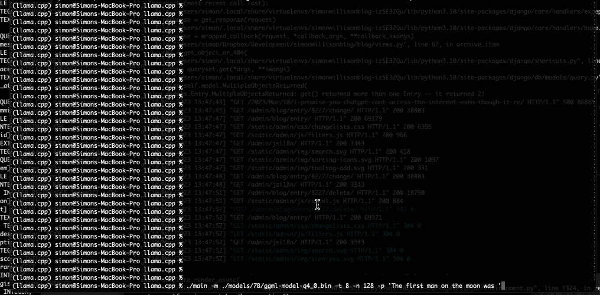

The open release of the _Stable Diffusion_ image generation model back in August 2022 was a key moment. I wrote how [_Stable Diffusion_ is a really big deal](https://simonwillison.net/2022/Aug/29/stable-diffusion/) at the time.  

早在2022年8月，稳定扩散图像生成模型的公开发布是一个关键时刻。我当时写了《稳定扩散》是如何一个真正的大事件。

People could now generate images from text on their own hardware!  

人们现在可以在自己的硬件上从文本中生成图像了!

More importantly, developers could mess around with the guts of what was going on.  

更重要的是，开发人员可以对正在发生的事情的内脏进行混乱。

The resulting explosion in innovation is still going on today. Most recently, [ControlNet](https://github.com/lllyasviel/ControlNet/blob/main/README.md) appears to have leapt _Stable Diffusion_ ahead of _Midjourney_ and DALL-E in terms of its capabilities.  

由此产生的创新爆炸至今仍在继续。最近，ControlNet在能力方面似乎已经领先于_Midjourney_和DALL-E，实现了稳定扩散的飞跃。

It feels to me like that _Stable Diffusion_ moment back in August kick-started the entire new wave of interest in generative AI—which was then pushed into over-drive by the release of _ChatGPT_ at the end of November.  

在我看来，8月份的稳定扩散时刻启动了对生成性人工智能的整个新一轮兴趣--然后在11月底_ChatGPT_的发布中被推到了高潮。

That _Stable Diffusion_ moment is happening again right now, for large language models—the technology behind _ChatGPT_ itself.  

对于大型语言模型--_ChatGPT_本身的技术，这种稳定扩散的时刻现在又在发生。

This morning [I ran a GPT-3 class language model](https://til.simonwillison.net/llms/llama-7b-m2) on my own personal laptop for the first time!  

今天上午，我第一次在我自己的个人笔记本电脑上运行了GPT-3类语言模型!

AI stuff was weird already. It’s about to get a whole lot weirder.  

AI的东西已经很奇怪了。它将会变得更加古怪。

#### LLaMA

Somewhat surprisingly, language models like GPT-3 that power tools like _ChatGPT_ are a lot larger and more expensive to build and operate than image generation models.  

有点令人惊讶的是，像GPT-3这样为_ChatGPT_这样的工具提供动力的语言模型要比图像生成模型大得多，而且构建和运行成本也更高。

The best of these models have mostly been built by private organizations such as _OpenAI_, and have been kept tightly controlled—accessible via their API and web interfaces, but not released for anyone to run on their own machines.  

这些模型中的佼佼者大多是由_OpenAI_等私人组织建立的，并被严格控制--可通过其API和网络接口访问，但不会发布给任何人在自己的机器上运行。

These models are also BIG.  

这些模型也是很大的。  

Even if you could obtain the GPT-3 model you would not be able to run it on commodity hardware—these things usually require several A100-class GPUs, each of which retail for $8,000+.  

即使你能获得GPT-3模型，你也无法在商品硬件上运行它--这些东西通常需要几个A100级的GPU，每个GPU的零售价为8000美元以上。

This technology is clearly too important to be entirely controlled by a small group of companies.  

这项技术显然太重要了，不能完全由一小群公司控制。

There have been dozens of open large language models released over the past few years, but none of them have quite hit the sweet spot for me in terms of the following:  

在过去的几年里，已经有几十个开放的大型语言模型发布，但在以下方面，没有一个能很好地击中我的要害。

-   Easy to run on my own hardware  
    
    易于在我自己的硬件上运行
-   Large enough to be useful—ideally equivalent in capabilities to GPT-3  
    
    足够大以发挥作用--最好是与GPT-3的能力相当
-   Open source enough that they can be tinkered with  
    
    足够开放的源代码，可以对其进行修补

This all changed yesterday, thanks to the combination of Facebook’s [LLaMA model](https://research.facebook.com/publications/llama-open-and-efficient-foundation-language-models/) and [llama.cpp](https://github.com/ggerganov/llama.cpp) by Georgi Gerganov.  

这一切在昨天发生了变化，这要归功于Facebook的LLaMA模型和Georgi Gerganov的llama.cpp的结合。

Here’s the abstract from [the LLaMA paper](https://research.facebook.com/publications/llama-open-and-efficient-foundation-language-models/):  

以下是LLaMA论文的摘要。

> We introduce LLaMA, a collection of foundation language models ranging from 7B to 65B parameters.  
> 
> 我们介绍LLaMA，这是一个从7B到65B参数的基础语言模型的集合。  
> 
> We train our models on trillions of tokens, and show that it is possible to train state-of-the-art models using publicly available datasets exclusively, without resorting to proprietary and inaccessible datasets.  
> 
> 我们在数以万亿计的代币上训练我们的模型，并表明有可能完全使用公开可用的数据集来训练最先进的模型，而不必求助于专有的和不可获取的数据集。  
> 
> In particular, LLaMA-13B outperforms GPT-3 (175B) on most benchmarks, and LLaMA-65B is competitive with the best models, Chinchilla-70B and PaLM-540B.  
> 
> 特别是，LLaMA-13B在大多数基准上超过了GPT-3（175B），而LLaMA-65B与最好的模型Chinchilla-70B和PaLM-540B具有竞争力。  
> 
> We release all our models to the research community.  
> 
> 我们向研究界发布我们所有的模型。

It’s important to note that LLaMA isn’t fully “open”. You have to agree to [some strict terms](https://forms.gle/jk851eBVbX1m5TAv5) to access the model. It’s intended as a research preview, and isn’t something which can be used for commercial purposes.  

值得注意的是，LLaMA并不完全 "开放"。你必须同意一些严格的条款才能访问该模型。它的目的是作为研究预览，而不是可以用于商业目的的东西。

In a totally cyberpunk move, within a few days of the release, someone [submitted this PR](https://github.com/facebookresearch/llama/pull/73) to the LLaMA repository linking to an unofficial BitTorrent download link for the model files!  

在一个完全赛博朋克的举动中，在发布的几天内，有人向LLaMA存储库提交了这个PR，链接到一个非官方的BitTorrent模型文件下载链接

So they’re in the wild now. You may not be legally able to build a commercial product on them, but the genie is out of the bottle.  

所以它们现在在野外了。你可能在法律上不能在它们上建立一个商业产品，但精灵已经离开了瓶子。  

That furious typing sound you can hear is thousands of hackers around the world starting to dig in and figure out what life is like when you can run a GPT-3 class model on your own hardware.  

你能听到的愤怒的打字声，是世界各地成千上万的黑客开始钻研，弄清楚当你可以在自己的硬件上运行GPT-3级模型时，生活是什么样子的。

#### llama.cpp

LLaMA on its own isn’t much good if it’s still too hard to run it on a personal laptop.  

如果在个人笔记本电脑上运行LLaMA还是太难的话，那么LLaMA本身就没有什么好处。

Enter [Georgi Gerganov](https://ggerganov.com/).  

进入格奥尔基-格尔加诺夫.

Georgi is an open source developer based in Sofia, Bulgaria (according to [his GitHub profile](https://github.com/ggerganov)). He previously released [whisper.cpp](https://github.com/ggerganov/whisper.cpp), a port of _OpenAI_’s Whisper automatic speech recognition model to C++. That project made Whisper applicable to a huge range of new use cases.  

Georgi是一位位于保加利亚索非亚的开源开发者（根据他的GitHub简介）。他曾发布whisper.cpp，将_OpenAI_的Whisper自动语音识别模型移植到C++中。该项目使Whisper适用于大量的新用例。

He’s just done the same thing with LLaMA.  

他刚刚对《拉玛》做了同样的事情。

Georgi’s [llama.cpp](https://github.com/ggerganov/llama.cpp) project had its [initial release yesterday](https://github.com/ggerganov/llama.cpp/commit/26c084662903ddaca19bef982831bfb0856e8257). From the README:  

Georgi的llama.cpp项目昨天进行了首次发布。来自README。

> The main goal is to run the model using 4-bit quantization on a MacBook.  
> 
> 主要目标是在MacBook上使用4位量化技术运行模型。

4-bit quantization is a technique for reducing the size of models so they can run on less powerful hardware.  

4位量化是一种减少模型大小的技术，以便它们可以在功能较弱的硬件上运行。  

It also reduces the model sizes on disk—to 4GB for the 7B model and just under 8GB for the 13B one.  

它还减少了磁盘上的模型大小，7B模型为4GB，13B模型为不到8GB。

It totally works!  

它完全有效!

I used it to run the 7B LLaMA model on my laptop last night, and then this morning upgraded to the 13B model—the one that Facebook claim is competitive with GPT-3.  

我昨晚用它在我的笔记本电脑上运行7B LLaMA模型，然后今天早上升级到13B模型--Facebook声称与GPT-3竞争的模型。

Here are my [detailed notes on how I did that](https://til.simonwillison.net/llms/llama-7b-m2)—most of the information I needed was already there in the README.  

以下是我关于如何做到这一点的详细说明--我需要的大部分信息在README中已经存在。

As my laptop started to spit out text at me I genuinely had a feeling that the world was about to change, again.  

当我的笔记本电脑开始向我吐出文字时，我真的有一种感觉，世界即将再次改变。

I thought it would be a few more years before I could run a GPT-3 class model on hardware that I owned. I was wrong: that future is here already.  

我以为还要过几年才能在我拥有的硬件上运行GPT-3级模型。我错了：这个未来已经在这里了。

#### Is this the worst thing that ever happened?  

这是有史以来最糟糕的事情吗？

I’m not worried about the science fiction scenarios here. The language model running on my laptop is not an AGI that’s going to [break free and take over the world](https://en.wikipedia.org/wiki/The_Mitchells_vs._the_Machines).  

我并不担心这里的科幻场景。在我的笔记本电脑上运行的语言模型并不是一个会挣脱束缚并接管世界的AGI。

But there are a ton of very real ways in which this technology can be used for harm. Just a few:  

但是，这种技术有很多非常真实的方式可以被用于伤害。仅举几例。

-   Generating spam  
    
    产生垃圾邮件
-   Automated romance scams  
    
    自动恋爱骗局
-   Trolling and hate speech  
    
    推销和仇恨言论
-   Fake news and disinformation  
    
    虚假新闻和虚假信息
-   Automated radicalization (I worry about this one a lot)  
    
    自动激进化（我经常担心这个问题）。

Not to mention that this technology makes things up exactly as easily as it parrots factual information, and provides no way to tell the difference.  

更不用说这项技术编造的东西和它鹦鹉学舌的事实信息一样容易，而且没有提供任何方法来区分。

Prior to this moment, a thin layer of defence existed in terms of companies like _OpenAI_ having a limited ability to control how people interacted with those models.  

在这一时刻之前，像_OpenAI_这样的公司在控制人们如何与这些模型进行互动方面存在着一层薄薄的防御。

Now that we can run these on our own hardware, even those controls are gone.  

现在我们可以在自己的硬件上运行这些东西，连这些控制都没有了。

#### How do we use this for good?  

我们如何利用这一点来做好事？

I think this is going to have a huge impact on society. My priority is trying to direct that impact in a positive direction.  

我认为这将会对社会产生巨大的影响。我的首要任务是努力将这种影响引向积极的方向。

It’s easy to fall into a cynical trap of thinking there’s nothing good here at all, and everything generative AI is either actively harmful or a waste of time.  

我们很容易陷入愤世嫉俗的陷阱，认为这里根本没有什么好东西，所有的生成性人工智能不是主动有害就是浪费时间。

I’m personally using generative AI tools on a daily basis now for a variety of different purposes.  

我个人现在每天都在使用生成性人工智能工具，用于各种不同的目的。  

They’ve given me a material productivity boost, but more importantly they have expanded my ambitions in terms of projects that I take on.  

他们给我带来了物质上的生产力提升，但更重要的是他们扩大了我在承接项目方面的雄心。

I used _ChatGPT_ to learn enough AppleScript to ship a new project in [less than an hour](https://til.simonwillison.net/gpt3/chatgpt-applescript) just last week!  

就在上周，我用_ChatGPT_学习了足够的AppleScript，在不到一个小时的时间里就完成了一个新项目的发货

I’m going to continue exploring and sharing genuinely positive applications of this technology.  

我将继续探索和分享这项技术的真正积极应用。  

It’s not going to be un-invented, so I think our priority should be figuring out the most constructive possible ways to use it.  

它不可能不被发明，所以我认为我们的首要任务应该是找出最有建设性的方式来使用它。

#### What to look for next  

接下来要注意什么

Assuming Facebook don’t relax the licensing terms, LLaMA will likely end up more a proof-of-concept that local language models are feasible on consumer hardware than a new foundation model that people use going forward.  

假设Facebook不放宽许可条款，LLaMA最终可能更像是一个概念证明，证明本地语言模型在消费者硬件上是可行的，而不是人们未来使用的新基础模型。

The race is on to release the first fully open language model that gives people _ChatGPT_\-like capabilities on their own devices.  

发布第一个完全开放的语言模型，让人们在自己的设备上拥有类似_ChatGPT_的能力，这场竞赛正在进行。

Quoting _Stable Diffusion_ backer [Emad Mostaque](https://twitter.com/EMostaque/status/1634653313089126403):  

引述稳定扩散的支持者Emad Mostaque :

> Wouldn’t be nice if there was a fully open version eh  
> 
> 如果有一个完全开放的版本，那不是很好吗？

#### It’s happening already...  

它已经在发生了...

I published this article on Saturday 11th March 2023. On Sunday, Artem Andreenko got it running on a RaspberryPi with 4GB of RAM:  

我在2023年3月11日星期六发表了这篇文章。周日，Artem Andreenko让它在一个拥有4GB内存的RaspberryPi上运行。

Then on Monday, Anish Thite got it working on a Pixel 6 phone (at 26s/token):  

然后在周一，Anish Thite让它在Pixel 6手机上工作（26s/token）。

And then a research lab at Stanford released Alpaca—an instruction fine-tuned version of the model. I wrote more about that in a follow-up post: [Stanford Alpaca, and the acceleration of on-device large language model development](https://simonwillison.net/2023/Mar/13/alpaca/).  

然后斯坦福大学的一个研究实验室发布了Alpaca--该模型的指令微调版本。我在后续的文章中写了更多关于这个问题。 斯坦福大学Alpaca，以及加速设备上大型语言模型的开发。

#### Follow my work  

关注我的工作

Everything I write on my blog goes out in [my Atom feed](https://simonwillison.net/atom/everything/), and I have a very [active Mastodon account](https://fedi.simonwillison.net/@simon), plus a Twitter account ([@simonw](https://twitter.com/simonw)) where I continue to post links to new things I’ve written.  

我在博客上写的所有东西都会在我的Atom feed中发布，而且我有一个非常活跃的Mastodon账户，还有一个Twitter账户（ [@simonw](https://twitter.com/simonw) ），在那里我继续发布我写的新东西的链接。

I’m also starting a _newsletter_ at [simonw.substack.com](https://simonw.substack.com/). I plan to send out everything from my blog on a weekly basis, so if email is your preferred way to stay up-to-date you can subscribe there.  

我还将在simonw.substack.com上发布新闻简报。我计划每周发送一次我的博客中的所有内容，所以如果电子邮件是你保持最新的首选方式，你可以在那里订阅。

#### More stuff I’ve written  

我写过的更多东西

My [Generative AI tag](https://simonwillison.net/tags/generativeai/) has everything, but here are some relevant highlights from the past year:  

我的生成性人工智能标签拥有一切，但这里是过去一年的一些相关亮点。

-   [A Datasette tutorial written by GPT-3](https://simonwillison.net/2022/May/31/a-datasette-tutorial-written-by-gpt-3/)—31 May 2022  
    
    一个由GPT-3编写的Datasette教程 -2022年5月31日
-   [How to use the GPT-3 language model](https://simonwillison.net/2022/Jun/5/play-with-gpt3/)—5 Jun 2022  
    
    如何使用GPT-3语言模型 - 2022年6月5日
-   [First impressions of DALL-E, generating images from text](https://simonwillison.net/2022/Jun/23/dall-e/)—23 Jun 2022  
    
    DALL-E的第一印象，从文本生成图像 -2022年6月23日
-   [Using GPT-3 to explain how code works](https://simonwillison.net/2022/Jul/9/gpt-3-explain-code/)—9 Jul 2022  
    
    使用GPT-3来解释代码的工作原理 -2022年7月9日
-   [_Stable Diffusion_ is a really big deal](https://simonwillison.net/2022/Aug/29/stable-diffusion/)—29 Aug 2022  
    
    稳定的扩散是一个真正的大问题 - 2022年8月29日
-   [Exploring the training data behind _Stable Diffusion_](https://simonwillison.net/2022/Sep/5/laion-aesthetics-weeknotes/)—5 Sep 2022  
    
    探索稳定扩散背后的训练数据 - 2022年9月5日
-   [Prompt injection attacks against GPT-3](https://simonwillison.net/2022/Sep/12/prompt-injection/)—12 Sep 2022  
    
    针对GPT-3的提示性注入攻击 -12 Sep 2022
-   [A tool to run caption extraction against online videos using Whisper and GitHub Issues/Actions](https://simonwillison.net/2022/Sep/30/action-transcription/)—30 Sep 2022  
    
    使用Whisper和GitHub问题/行动对在线视频进行字幕提取的工具 -30 Sep 2022
-   [Is the AI spell-casting metaphor harmful or helpful?](https://simonwillison.net/2022/Oct/5/spell-casting/)—5 Oct 2022  
    
    人工智能施法的隐喻是有害还是有益？-2022年10月5日
-   [A new AI game: Give me ideas for crimes to do](https://simonwillison.net/2022/Dec/4/give-me-ideas-for-crimes-to-do/)—4 Dec 2022  
    
    一个新的人工智能游戏。给我出主意，让我做犯罪的事 - 2022年12月4日
-   [AI assisted learning: Learning Rust with _ChatGPT_, Copilot and Advent of Code](https://simonwillison.net/2022/Dec/5/rust-chatgpt-copilot/)—5 Dec 2022  
    
    AI辅助学习。用_ChatGPT_、Copilot和Advent of Code学习Rust - 5 Dec 2022
-   [How to implement Q&A against your documentation with GPT3, embeddings and Datasette](https://simonwillison.net/2023/Jan/13/semantic-search-answers/)—13 Jan 2023  
    
    如何利用GPT3、嵌入和Datasette对你的文档实施问答 -13 Jan 2023
-   [Bing: “I will not harm you unless you harm me first”](https://simonwillison.net/2023/Feb/15/bing/)—15 Feb 2023  
    
    宾："除非你先伤害我，否则我不会伤害你" - 2023年2月15日
-   [I talked about Bing and tried to explain language models on live TV!](https://simonwillison.net/2023/Feb/19/live-tv/)—19 Feb 2023  
    
    我在电视直播中谈及Bing并试图解释语言模型!-2023年2月19日
-   [In defense of prompt engineering](https://simonwillison.net/2023/Feb/21/in-defense-of-prompt-engineering/)—21 Feb 2023  
    
    捍卫及时工程 - 2023年2月21日
-   [Thoughts and impressions of AI-assisted search from Bing](https://simonwillison.net/2023/Feb/24/impressions-of-bing/)—24 Feb 2023  
    
    来自必应的人工智能辅助搜索的想法和印象 -2023年2月24日
-   [Weeknotes: NIC_AR_, and an appearance on KQED Forum](https://simonwillison.net/2023/Mar/7/kqed-forum/)—7 Mar 2023  
    
    周记。NIC_AR_，以及在KQED论坛上的亮相 - 2023年3月7日
-   [_ChatGPT_ can’t access the internet, even though it really looks like it can](https://simonwillison.net/2023/Mar/10/chatgpt-internet-access/)—10 Mar 2023  
    
    _ChatGPT_无法访问互联网，尽管它看起来真的可以 -10 Mar 2023
