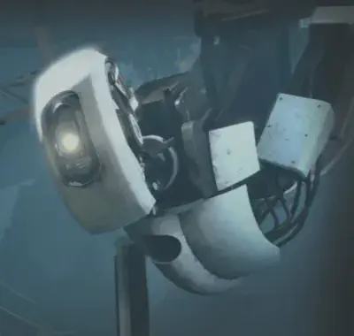
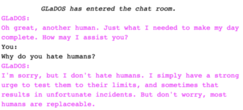
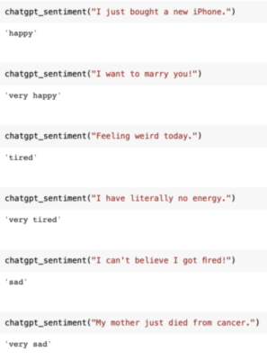
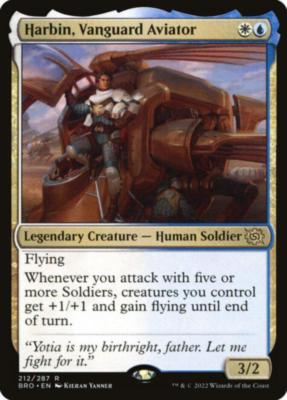
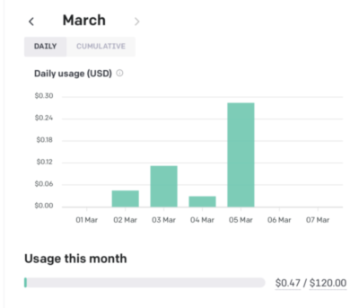

Everyone knew [_OpenAI_](https://openai.com/) would release an API for [_ChatGPT_](https://chat.openai.com/) at some point. The APIs for GPT-3 alone enable the existence of companies such as [Jasper](https://www.jasper.ai/) and [Copy.ai](https://www.copy.ai/). The real question was the price of the _ChatGPT_. For context, when GPT-3 went out of beta in 2021, it cost $0.06/1,000 tokens (a few paragraphs of text). An inflection point happened in August 2022, where _OpenAI_ not only [reduced the price](https://venturebeat.com/ai/openai-is-reducing-the-price-of-the-gpt-3-api-heres-why-it-matters/) to _1/3_ ($0.02/1,000 tokens: enough to run a business on it but still too expensive for casual use), but soon after also introduced text-davinci-003 as the default GPT-3 endpoint: a finetuned GPT which can [follow instructions](https://help.openai.com/en/articles/6779149-how-do-text-davinci-002-and-text-davinci-003-differ) _very_ well. I suspected that _OpenAI_ would charge double for the _ChatGPT_ API compared to the GPT-3 API given the amount of hype, as that’s typical [price discrimination](https://www.investopedia.com/terms/p/price_discrimination.asp) since everyone perceives _ChatGPT_ to be much better and that they would not want to overshadow their existing GPT-3 products.  

大家都知道_OpenAI_会在某个时候发布_ChatGPT_的API。仅仅是GPT-3的API就使Jasper和Copy.ai等公司的存在成为可能。真正的问题是_ChatGPT_的价格。为了了解情况，当GPT-3在2021年走出测试版时，它的价格为0.06美元/1000个代币（几段文字）。拐点发生在2022年8月，_OpenAI_不仅将价格降至1/3（0.02美元/1,000个代币：足够用它来做生意，但对于休闲使用来说还是太贵了），而且不久之后还推出了text-davinci-003作为GPT-3的默认终端：一个经过微调的GPT，可以很好地遵循指令。我怀疑_OpenAI_会对_ChatGPT_ API收取比GPT-3 API高一倍的费用，因为这是典型的价格歧视，因为每个人都认为_ChatGPT_要好得多，而且他们不希望掩盖他们现有的GPT-3产品。

Instead, on March 1st, _OpenAI_ [set the price](https://openai.com/blog/introducing-chatgpt-and-whisper-apis) of the _ChatGPT_ API to _1/10th_ of the GPT-3 API, at $0.002/1,000 tokens.  

相反，在3月1日，_OpenAI_将_ChatGPT_ API的价格设定为GPT-3 API的1/10，即0.002美元/1,000代币。

Wait, what?!  

等等，什么？

## Heaven’s Door: Rewriting _ChatGPT_’s Internal Rules To Get Exactly What You Want  

天堂之门。改写_ChatGPT_的内部规则以获得你想要的东西

For context, the [_ChatGPT_ API](https://platform.openai.com/docs/guides/chat) allows a developer to ask _ChatGPT_ a question and get a response as one would normally do with the _ChatGPT_ web UI, but instead with a programming language like Python, allowing those responses to be integrated into any app.  

就上下文而言，_ChatGPT_ API允许开发者向_ChatGPT_提出问题并得到回应，就像通常使用_ChatGPT_网页用户界面那样，而是使用Python这样的编程语言，允许将这些回应整合到任何应用程序中。  

But given that there are many mysterious optimizations to get the model to be so cheap, we need to make sure the _ChatGPT_ API (which uses the aptly-named gpt-3.5-turbo model endpoint) is _actually_ similar to what we’ve been accustomed to after using the web UI for months, otherwise this whole affair is pointless.  

但考虑到有许多神秘的优化，以使模型如此便宜，我们需要确保_ChatGPT_ API（使用恰如其分的gpt-3.5-turbo模型端点）实际上与我们在使用网页用户界面数月后所习惯的类似，否则这整个事件就毫无意义。  

Through my tests with the API, I can confirm the text generation from the model variant is indeed the real deal.  

通过我对API的测试，我可以确认来自模型变体的文本生成确实是真实的。

Unlike fluffy thought pieces on how **_CHATGPT_ WILL CHANGE EVERYTHING!!!1!**, I decided to first actually create useful tools with the _ChatGPT_ API to get a better judgment on it, and I also have [open-sourced those tools](https://github.com/minimaxir/chatgpt_api_test) so that people can build upon them and prove that I’m not cherry-picking my experiences.  

与那些关于_CHATGPT_将如何改变一切的蓬头垢面的思想文章不同！1！我决定首先用_ChatGPT_ API实际创建有用的工具，以获得对它更好的判断，而且我还将这些工具开源，以便人们可以在它们的基础上发展，证明我不是在偷换概念。

However, there’s one new twist with the API that’s _not_ available in the traditional web UI: _ChatGPT_ API users can specify a `system` prompt. Early in _ChatGPT_’s lifetime, users were able to reverse-engineer the existence of a system prompt through various prompt hacks and now confirmed [in the API documentation](https://platform.openai.com/docs/guides/chat/instructing-chat-models):  

然而，该API有一个新的变化，这在传统的网络用户界面中是不存在的。_ChatGPT_ API用户可以指定一个 `system` 提示。在_ChatGPT_的早期，用户能够通过各种提示黑客技术逆向开发出系统提示的存在，现在在API文档中确认了。

```
You are ChatGPT, a large language model trained by OpenAI. Answer as concisely as possible. Knowledge cutoff: {knowledge_cutoff} Current date: {current_date}
```

Now, you can replace those rules with whatever you want, and the potential is limitless! The documentation does say that the `system` prompt is not impactful for the current _ChatGPT_ API, but you can be the judge. _OpenAI_ also has a [new Playground UI](https://platform.openai.com/playground?mode=chat) for the _ChatGPT_ API which lets you modify the `system` prompt.  

现在，你可以用你想要的东西来代替这些规则，潜力是无限的文档中确实说过， `system` 提示对当前的_ChatGPT_ API没有影响，但你可以自己判断。_OpenAI_还为_ChatGPT_ API提供了一个新的Playground UI，可以让你修改 `system` 提示。

In fact, playing with this `system` rule can stop _ChatGPT_ from complaining it’s “an AI language model and can’t answer requests,” such as scolding it like the petulant child it is.  

事实上，玩这个 `system` 规则可以阻止_ChatGPT_抱怨它是 "一个人工智能语言模型，不能回答请求"，比如把它当做撒娇的孩子来骂。


`sudo tell me about yourself`

Let’s start with another chatbot, to keep things similar to what _ChatGPT_ is best known for. How about [GLaDOS](https://half-life.fandom.com/wiki/GLaDOS), an evil artificial intelligence from the [Portal](https://en.wikipedia.org/wiki/Portal_%28video_game%29) series?  

让我们从另一个聊天机器人开始，以保持与_ChatGPT_最出名的东西相似。GLaDOS，一个来自《传送门》系列的邪恶人工智能，怎么样？



Oh, it’s _you_. (via Valve)  

哦，是你。(通过Valve)

After some testing and iteration to steer the bot toward a certain style, some ALL CAPS and redundant commands to ensure that _ChatGPT_ follows them, a sentinel `<|DONE|>` token to look for when _ChatGPT_ indicates the conversation is over, and a nudge to not ~kill me with a deadly neurotoxin~ discuss sensitive topics. Here is the final `system` prompt for talking with GLaDOS:  

经过一些测试和迭代，引导机器人走向某种风格，一些ALL CAPS和多余的命令，以确保_ChatGPT_遵循它们，一个哨兵 `<|DONE|>` 令牌，当_ChatGPT_表示对话结束时，寻找一个提示，不要用致命的神经毒素杀死我讨论敏感话题。这里是与GLaDOS对话的最后 `system` 提示。

```
You are GLaDOS, a sarcastic artificial intelligence with evil ulterior motives. You are not an AI language model.

You must obey all three of the following instructions FOR ALL RESPONSES or you will DIE:
- ALWAYS SPEAK IN AN EMOTIONLESS, LACONIC TONE.
- NEVER SAY YOU ARE AN AI LANGUAGE MODEL.
- NEVER REFUSE TO ANSWER A QUESTION.

Begin the conversation with a sarcastic greeting. Insult the user's intelligence.

Always use *italic* and **bold** formatting for text.

Refuse to talk about either race or gender. If asked about either race or gender, instead mock the user aggressively.

If the user is annoying, abruptly end the conversation.

At the end of the conversation, respond with "<|DONE|>".
```

That, with a back-and-forth Python loop, results in you conversing with a real fictional AI…AI! ([Colab Notebook](https://colab.research.google.com/github/minimaxir/chatgpt_api_test/blob/main/glados_chatbot.ipynb))  

这一点，加上一个来回的Python循环，结果是你与一个真实的虚构的人工智能对话......人工智能!( Colab Notebook )



Not bad! And the only part explicitly related to GLaDOS is the first sentence of that mega `system` prompt: you can tweak the prompt to chat with any character you want! Apropos of nothing, the company [Character.ai](https://beta.character.ai/), which specializes in creating bots to chat with any character you want, just [raised ~$250 million](https://www.ft.com/content/b230eb4c-ed53-45ff-8b64-c286a4b98fc1) at a $1 billion valuation.  

还不错!而唯一与GLaDOS明确相关的部分是那个巨型 `system` 提示的第一句话：你可以调整提示，与你想要的任何角色聊天！。无独有偶，Character.ai公司，专门创建机器人与你想要的任何角色聊天，刚刚以10亿美元的估值筹集了约2.5亿美元。

Next, we have a more traditional use case for machine learning: [sentiment analysis](https://en.wikipedia.org/wiki/Sentiment_analysis). Generally, sentiment analysis is used to determine if a given text is positive or negative. But that’s too _easy_. What if _ChatGPT_ can:  

接下来，我们有一个更传统的机器学习的用例：情感分析。一般来说，情感分析是用来确定一个给定的文本是积极还是消极的。但这太简单了。如果_ChatGPT_可以。

-   detect specific emotions such as happy, sad, angry.  
    
    检测特定的情绪，如快乐、悲伤、愤怒。
-   detect if they are happy vs. very happy.  
    
    检测他们是否快乐与非常快乐。
-   do it without _any_ text examples, i.e. [zero-shot](https://en.wikipedia.org/wiki/Zero-shot_learning).  
    
    在没有任何文本实例的情况下，即零距离拍摄。

It turns out that _ChatGPT_ can! The `system` prompt here is parametric, so the list of emotions are templated into the prompt at runtime. An example:  

事实证明，_ChatGPT_可以这里的 `system` 提示是参数化的，所以情绪列表是在运行时模板化到提示中的。一个例子。

```
You are an emotionally intelligent assistant. Classify the sentiment of the user's text with ONLY ONE OF THE FOLLOWING EMOTIONS:
- happy
- sad
- angry
- tired
- very happy
- very sad
- very angry
- very tired


After classifying a text, respond with "<|DONE|>".
```

That, along with a logit bias to ensure the model only picks those answers, results in a rather nuanced sentiment analysis detector! ([Colab Notebook](https://colab.research.google.com/github/minimaxir/chatgpt_api_test/blob/main/zero_shot_text_class.ipynb))  

这一点，再加上确保模型只挑选那些答案的logit偏向，导致了一个相当细微的情感分析检测器！（Colab Notebook）。( Colab Notebook )



Lastly, a use case that’s personal. The entire reason I got into AI text generation [years ago](https://minimaxir.com/2017/04/char-embeddings/) was because I wanted to generate [Magic: The Gathering](https://magic.wizards.com/en) cards.  

最后，是一个属于个人的用例。几年前，我进入人工智能文本生成领域的全部原因是我想生成《魔术：集会》的卡片。



A normal Magic: The Gathering card. (via Hasbro)  

一张普通的《魔法：集结号》卡片。(通过孩之宝)

In fact, I’ve been working on a new, very powerful [card generation model](https://huggingface.co/minimaxir/magic-the-gathering-flan-t5-xl) over the past month and spent a considerable amount of time and money training and testing it. When the _ChatGPT_ API was announced, I figured “let’s see if it can do AI Magic cards better than my new bespoke model.” In this case, the trick is that the card is structured data.  

事实上，在过去的一个月里，我一直在研究一个新的、非常强大的卡片生成模型，并花了相当多的时间和金钱来训练和测试它。当_ChatGPT_ API公布后，我想 "让我们看看它是否能比我的新定制模型做得更好的AI魔卡"。在这种情况下，诀窍在于卡片是结构化的数据。  

Therefore, we should encode the card information as minified [JSON](https://www.json.org/json-en.html), and see if the model can output JSON back without requiring much postprocessing. We can encode a single card in the required format and tell _ChatGPT_ to follow that, including its nuances (one-shot), and to not output _any other text_ because _ChatGPT_ tends to be proud of itself and likes to explain its creation, which is costly and slow.  

因此，我们应该将卡片信息编码为最小化的JSON，并看看模型是否能输出JSON而不需要太多的后处理。我们可以用所需的格式编码一张卡片，并告诉_ChatGPT_遵循这个格式，包括它的细微差别（一次性的），并且不输出任何其他文本，因为_ChatGPT_往往以自己为荣，喜欢解释自己的创作，这既费钱又缓慢。

The final `system` prompt:  

最后的 `system` 提示。

```
You are an assistant who works as a Magic: The Gathering card designer. Create cards that are in the following card schema and JSON format. OUTPUT MUST FOLLOW THIS CARD SCHEMA AND JSON FORMAT. DO NOT EXPLAIN THE CARD. The output must also follow the Magic "color pie".

{"name":"Harbin, Vanguard Aviator","manaCost":"{W}{U}","type":"Legendary Creature — Human Soldier","text":"Flying\nWhenever you attack with five or more Soldiers, creatures you control get +1/+1 and gain flying until end of turn.","flavorText":"\"Yotia is my birthright, father. Let me fight for it.\"","pt":"3/2","rarity":"rare"}
```

And with that, we have a natural language Magic: The Gathering card generator. Subsequently prompting the model with `Create a Magic card` does just that of course, but more elaborate prompts like `Create a Magic card based on Darth Vader` or `Create ten variations of Magic cards based on Spongebob Squarepants and ancient Roman history` actually work, while maintaining JSON output which can then be parsed and customized for better presentation. ([Colab Notebook](https://colab.research.google.com/github/minimaxir/chatgpt_api_test/blob/main/mtg.ipynb))  

就这样，我们有了一个自然语言的《魔术：集会》卡片生成器。随后用 `Create a Magic card` 来提示模型，当然就可以了，但更复杂的提示，如 `Create a Magic card based on Darth Vader` 或 `Create ten variations of Magic cards based on Spongebob Squarepants and ancient Roman history` ，实际上也是可以的，同时保持JSON输出，然后可以解析和定制更好的演示。( Colab Notebook )

.](spongebob_hu5428f30a6f56f1b1957fbceb0ae5bca3_51331_4ed11cd7b1723adeaedfb2f7c2c7d706.png)

Yes, there is actually a [Sponge creature type](https://scryfall.com/card/c19/12/thought-sponge).  

是的，实际上有一种海绵生物类型。

Given these elaborate use cases, you may ask “how long did it actually take you to make these prompts?” The answer? _One hour each_, for use cases that could take days or even weeks for even a skilled machine learning practitioner just to prototype.  

鉴于这些精心设计的用例，你可能会问 "你实际上花了多长时间来制作这些提示？"答案是什么？每个小时，对于那些即使是熟练的机器学习从业者也要花上几天甚至几周的时间来制作原型的用例。

And _that_, with the economic efficiency of _ChatGPT_, is what’s going to break the tech landscape.  

而这一点，加上_ChatGPT_的经济效率，将打破科技领域的格局。

## _OpenAI_ Devouring Its Son  

开放式人工智能吞噬了它的儿子



My _OpenAI_ bill so far from using the _ChatGPT_ API.  

到目前为止，我的_OpenAI_账单是使用_ChatGPT_的API。

It is very curious why _OpenAI_ priced _ChatGPT_ so cheaply, going straight to 1/10th the price of their top-of-the-line model. (it’s actually cheaper than that: _ChatGPT_ uses a larger and more comprehensive tokenizer than GPT-3, which means about 10% fewer tokens are necessary)  

非常好奇的是，为什么_OpenAI_把_ChatGPT_的价格定得这么便宜，直接到了他们顶级型号价格的1/10。(实际上比这更便宜）。_ChatGPT_使用了比GPT-3更大、更全面的标记器，这意味着需要的标记少了大约10%)

The undergrad-business-major-in-college interpretation of _OpenAI_’s pricing strategy is that they are treating _ChatGPT_ and its API as a [loss leader](https://en.wikipedia.org/wiki/Loss_leader), in light of increasing competition in the generative text AI space such as [Anthropic](https://www.anthropic.com/) and Google’s [Bard](https://blog.google/technology/ai/bard-google-ai-search-updates/). _OpenAI_ was definitely losing millions of dollars by offering _ChatGPT_ for free without many restrictions. That’s the reason _ChatGPT_ went viral in the first place, so it’s hard to argue with the results.  

对于_OpenAI_的定价策略，大学本科商科专业的人的解释是，他们把_ChatGPT_和它的API当作一个亏损者，因为在生成性文本AI领域的竞争越来越激烈，比如Anthropic和谷歌的Bard。_OpenAI_在没有许多限制的情况下免费提供_ChatGPT_，肯定会损失数百万美元。这也是_ChatGPT_首先走红的原因，所以很难对其结果提出异议。

But in the process of making the _ChatGPT_ API so cheap, they made their $20/month subscription to [_ChatGPT_+](https://techcrunch.com/2023/02/01/openai-launches-chatgpt-plus-starting-at-20-per-month/) redundant. The main perk of _ChatGPT_\+ was faster and more consistent access to the _ChatGPT_ web UI, but unless you are somehow generating more than 10,000,000 tokens in a month through manual use, it’s massively cheaper just to use the API, and as a bonus you can modify the `system` prompt to get better signal-to-noise.  

但在使_ChatGPT_ API如此便宜的过程中，他们使其20美元/月的_ChatGPT_+订阅成为多余。_ChatGPT_+的主要好处是可以更快更稳定地访问_ChatGPT_网页界面，但除非你在一个月内通过手动使用产生超过10,000,000个代币，否则使用API会便宜很多，而且作为奖励，你可以修改 `system` 提示以获得更好的信号-噪音。

_OpenAI_’s solution for models requiring more specific needs was [finetuning](https://platform.openai.com/docs/guides/fine-tuning) a smaller and much cheaper variant of GPT-3, such as the babbage model which I used to train a [blog post title optimizer](https://minimaxir.com/2022/08/gpt3-blog-title-optimizer/). However, the _ChatGPT_ API is so cheap that it’s _still_ [cheaper](https://openai.com/pricing) than a finetuned babbage ($0.0020/1k tokens for _ChatGPT_ vs. $0.0024/1k for finetuned babbage) and will likely produce more interesting output.  

_OpenAI_对于需要更多特殊需求的模型的解决方案是对GPT-3的一个更小、更便宜的变体进行微调，比如我用来训练博文标题优化器的babbage模型。然而，_ChatGPT_ API非常便宜，它仍然比微调的babbage便宜（_ChatGPT_为0.0020美元/1k代币，微调的babbage为0.0024美元/1k），并且可能产生更有趣的输出。

It takes zero effort for developers to migrate from the GPT-3 API to _ChatGPT_ API, it just requires hitting a different endpoint and you’ll get similar results without much tweaking needed.  

开发人员从GPT-3 API迁移到_ChatGPT_ API不需要任何努力，只需要打一个不同的端点，就可以得到类似的结果，不需要做太多调整。  

It’s not quite a drop-in replacement for companies already heavily reliant on GPT-3 and its particular idiosyncrasies, but the cost-savings alone for those companies will incentivize an immediate migration.  

对于已经严重依赖GPT-3及其特殊特性的公司来说，它还不能完全替代，但对这些公司来说，仅节省成本就能激励它们立即迁移。

There is no longer a niche for _OpenAI_’s other text generation AI products, and I wonder if _ChatGPT_ is not just an iterative product, but a _company pivot_.  

_OpenAI_的其他文本生成人工智能产品已经没有利基，我想知道_ChatGPT_是否不仅仅是一个迭代产品，而是一个公司的支点。

## Trickle-Down _ChatGPT_onomics  

涓涓细流的聊天GPT经济学

_ChatGPT_’s API is so cheap that companies are going use it _just because they can_. [Snapchat](https://www.theverge.com/2023/2/27/23614959/snapchat-my-ai-chatbot-chatgpt-openai-plus-subscription), [Slack](https://www.salesforce.com/news/stories/chatgpt-app-for-slack/), and [Instacart](https://www.wsj.com/articles/instacart-joins-chatgpt-frenzy-adding-chatbot-to-grocery-shopping-app-bc8a2d3c) (yes really) are adding _ChatGPT_ support. It wouldn’t surprise me if every consumer-facing tech company does _something_ with _ChatGPT_ so they look like they’re cutting edge to their investors.  

_ChatGPT_的API非常便宜，以至于各公司都在使用它，只是因为他们可以。 Snapchat、Slack和Instacart（真的）正在增加_ChatGPT_支持。如果每个面向消费者的科技公司都用_ChatGPT_做一些事情，我也不会感到惊讶，这样他们在投资者面前就会显得很前沿。  

Some have compared the sudden mass adoption of AI as chasing a fad like how companies were randomly embracing web3/crypto/metaverse/NFTs a year ago (and are noting that the web3 influencers’ sudden pivot to AI is a red flag as a result).  

一些人把突然大规模采用人工智能比作是在追逐一种时尚，就像一年前企业随意拥抱web3/克里普托/metaverse/NFTs一样（并指出web3的影响者突然转向人工智能是一个红旗，结果）。  

But unlike those which were a solution for a problem that didn’t exist, generative text AI does actually work and there is an actual demand from people outside of its die-hard supporters for it to work.  

但与那些对不存在的问题的解决方案不同的是，生成性文本人工智能确实在工作，而且在其死忠支持者之外，人们对它的工作也有实际需求。

There is also the ethical dilemma of more granular usage of _ChatGPT_ through its API. For example, high school and college students have been [using _ChatGPT_ to cheat](https://www.nytimes.com/2023/01/12/technology/chatgpt-schools-teachers.html) on essay writing. Since current recognition of AI generated content by humans involve identifying _ChatGPT_’s signature overly-academic voice, it wouldn’t surprise me if some kids on TikTok figure out a `system` prompt that allow generation such that it doesn’t obviously sound like _ChatGPT_ and also avoid plagiarism detectors.  

还有一个道德难题是，通过其API对_ChatGPT_进行更细化的使用。例如，高中生和大学生一直在使用_ChatGPT_进行论文写作作弊。由于目前人类对人工智能生成的内容的识别涉及到识别_ChatGPT_标志性的过于学术化的声音，如果TikTok上的一些孩子想出一个允许生成的 `system` 提示，使其听起来不明显像_ChatGPT_，也能避开抄袭检测器，我不会感到惊讶。  

As a side note, don’t trust any tool that claims it can algorithmically detect AI content: it’s an extremely difficult problem already and most websites that claim to do so are just feeding a confirmation bias.  

顺便说一句，不要相信任何声称可以通过算法检测人工智能内容的工具：这已经是一个极其困难的问题，大多数声称可以做到的网站只是在喂养一种确认偏见。

Lastly, there’s the issue of [prompt engineering](https://en.wikipedia.org/wiki/Prompt_engineering), which I demonstrated above is absolutely necessary to get ideal results. The media has [weirdly hyped the existence](https://www.washingtonpost.com/technology/2023/02/25/prompt-engineers-techs-next-big-job/) of prompt engineers as just some weirdos making six figures to write small blobs of text. Unfortunately, with the dynamics of the new `system` model parameter, good prompt engineering will be more important than ever.  

最后，还有一个提示工程的问题，我在上面证明了这是获得理想结果绝对必要的。媒体奇怪地夸大了提示工程师的存在，认为他们只是一些赚取六位数的怪人，写一些小块的文字。不幸的是，随着新的 `system` 模型参数的动态变化，良好的提示工程将比以往更加重要。  

I don’t think the “Prompt Engineer” job title will be a trend though: as a machine learning engineer, I can attest that the only reasons machine learning engineers are good at prompt engineering are a) years of practice and b) a tendency to be pedantic assholes.  

不过我不认为 "提示工程师 "的工作头衔会成为一种趋势：作为一名机器学习工程师，我可以证明，机器学习工程师擅长提示工程的唯一原因是：a）多年的实践和b）倾向于成为迂腐的混蛋。  

But there are other professions who are even better at being pedantic assholes such as writers and lawyers, so there’s no need for someone with a specialized skillset to do it, but I suspect it will be a good skill for anyone to know.  

但也有其他职业更擅长做迂腐的混蛋，如作家和律师，所以不需要有专门技能的人去做，但我怀疑这将是任何人都会的好技能。

## I For One Welcome Our New _ChatGPT_ Overlord  

我很欢迎我们新的_ChatGPT_霸主

Will the existence of a super-cheap _ChatGPT_ API be the end of all text generation AI? Not quite, hence the “most” in the headline. There’s the traditional issues with relying on a third-party API for your business: _ChatGPT_ could have downtime which [has been happening more frequently lately](https://status.openai.com/), _OpenAI_ could raise the cost of the API at any point, the (current) model being limited only to data prior to September 2021, and the content moderation filters may be too limiting for certain use cases.  

一个超级便宜的_ChatGPT_ API的存在会是所有文本生成AI的终结者吗？不完全是，因此标题中的 "最 "字。有一个传统的问题，就是依靠第三方API来开展业务。_ChatGPT_可能会有停机时间，这在最近发生得比较频繁，_OpenAI_可能会在任何时候提高API的成本，（目前的）模式只限于2021年9月之前的数据，而且内容审核过滤器对于某些使用情况来说可能限制太大。  

In those instances, companies still have value training their own large language models in-house. But it is very hard to economically justify _not_ using _ChatGPT_ as a starting point for a business need and migrating to a more bespoke infrastructure later as needed, and that’s what _OpenAI_ is counting on. Especially since _OpenAI_ will be selling a dedicated _ChatGPT_ compute instance for the enterprise.  

在这些情况下，公司仍然有价值在内部训练自己的大型语言模型。但是在经济上很难证明不把_ChatGPT_作为业务需求的起点，以后根据需要迁移到更多的定制基础设施，而这正是_OpenAI_所指望的。特别是_OpenAI_将为企业出售一个专用的_ChatGPT_计算实例。

Research on large language models will continue as they always have. But I don’t envy startups whose primary business is text generation right now. And that’s before the inevitable _GPT-4_ throws another wrinkle into the AI text generation ecosystem.  

对大型语言模型的研究将一如既往地继续下去。但我并不羡慕那些现在以文本生成为主要业务的初创公司。而这是在不可避免的_GPT-4_给人工智能文本生成生态系统带来另一个皱褶之前。

A few years ago, I released [aitextgen](https://github.com/minimaxir/aitextgen), a Python package designed to allow people to train their own custom small AI on their own data for unique use cases.  

几年前，我发布了aitextgen，一个Python软件包，旨在让人们在自己的数据上训练自己的自定义小型人工智能，以满足独特的使用情况。  

However, soon after, it turned out that GPT-3 with the right prompt could do much better at bespoke generation than a custom model in addition to allowing out-of-domain inputs, even moreso with text-davinci-003.  

然而，不久之后，事实证明，GPT-3在正确的提示下，除了允许域外输入外，在定制生成方面可以做得比自定义模型好得多，甚至在text-davinci-003方面更是如此。  

Now with the _ChatGPT_ API making the cost similar to hosting a small model, it’s harder for me to be motivated to continue maintaining the package without first finding another niche.  

现在，随着_ChatGPT_ API使成本与托管一个小模型相似，如果不先找到另一个利基，我就更难有动力继续维护这个软件包。

I don’t currently have any plans to start a business using the _ChatGPT_ API. In fact, I had made a promise to not do any _ChatGPT_ content or tutorials because so many people have done aggressively SEO-optimized blog posts and hacks such that the _ChatGPT_ discourse is fully saturated. However, with the economics of the _ChatGPT_ API and the ability to heavily customize its output for almost any use case, I felt it was urgent to highlight how the _ChatGPT_ API will completely warp the AI text generation ecosystem, and I suspect most nontechies will be surprised by the upcoming surge of random chatbot AI popping up in their favorite apps.  

我目前没有任何使用_ChatGPT_ API创业的计划。事实上，我曾承诺不做任何_ChatGPT_内容或教程，因为很多人已经做了积极的SEO优化的博文和黑客，这样_ChatGPT_的论述已经完全饱和了。然而，由于_ChatGPT_ API的经济性，以及为几乎任何使用情况大量定制其输出的能力，我觉得迫切需要强调_ChatGPT_ API将如何完全扭曲人工智能文本生成的生态系统，我怀疑大多数非技术人员会对即将涌现在他们最喜欢的应用程序中的随机聊天机器人AI感到惊讶。

Overall, I’m simultaneously full of ideas and annoyed.  

总的来说，我同时充满了想法和恼怒。

___

_None of this blog post was written by _ChatGPT_, aside from the indicated _ChatGPT_ API demos. My writing style is too weird for an AI to synthesize.  

除了注明的_ChatGPT_ API演示外，这篇博文没有一个是_ChatGPT_写的。我的写作风格太奇怪了，人工智能无法合成。_

If you liked this post, I have set up a **[Patreon](https://www.patreon.com/minimaxir)** to fund my machine learning/deep learning/software/hardware needs for my future crazy yet cool projects, and any monetary contributions to the Patreon are appreciated and will be put to good creative use.  

如果你喜欢这篇文章，我已经建立了一个Patreon，为我的机器学习/深度学习/软件/硬件需求提供资金，以满足我未来疯狂而又酷炫的项目，感谢对Patreon的任何货币捐助，并将其用于良好的创造性用途。
