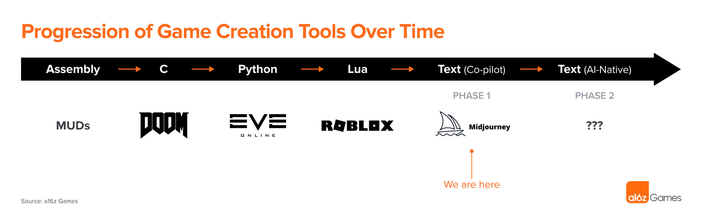
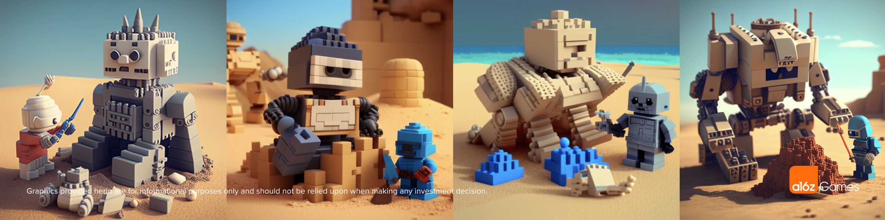
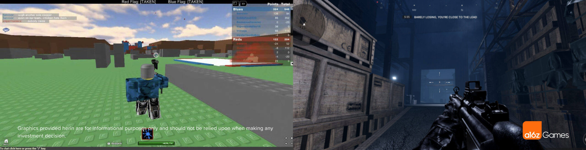
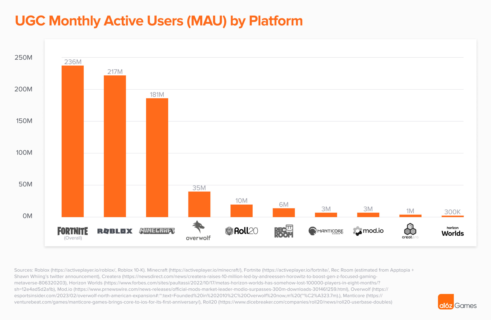
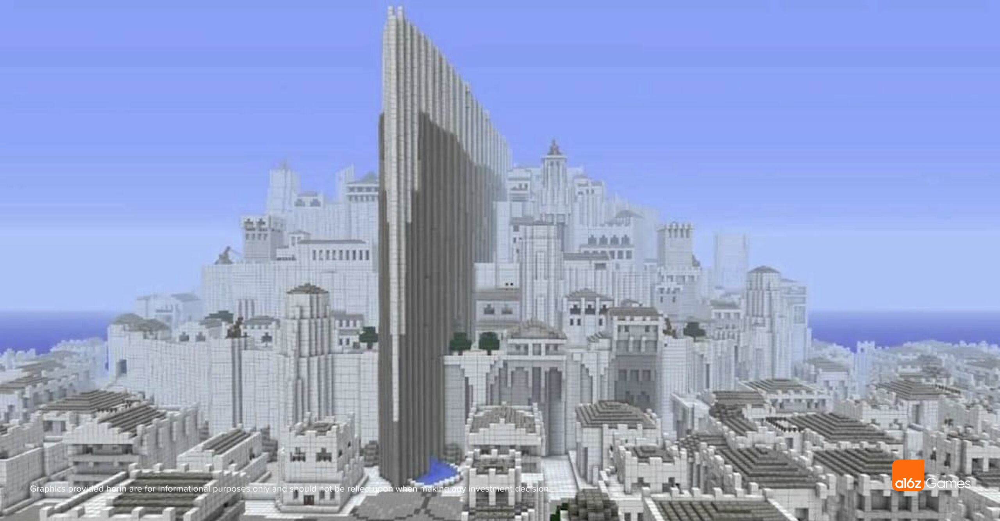
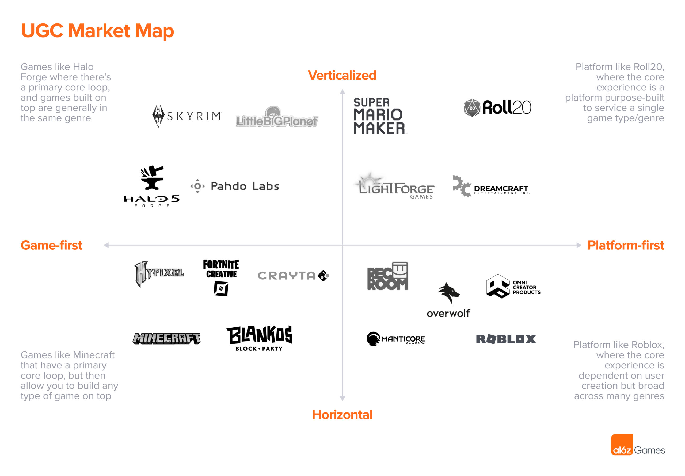
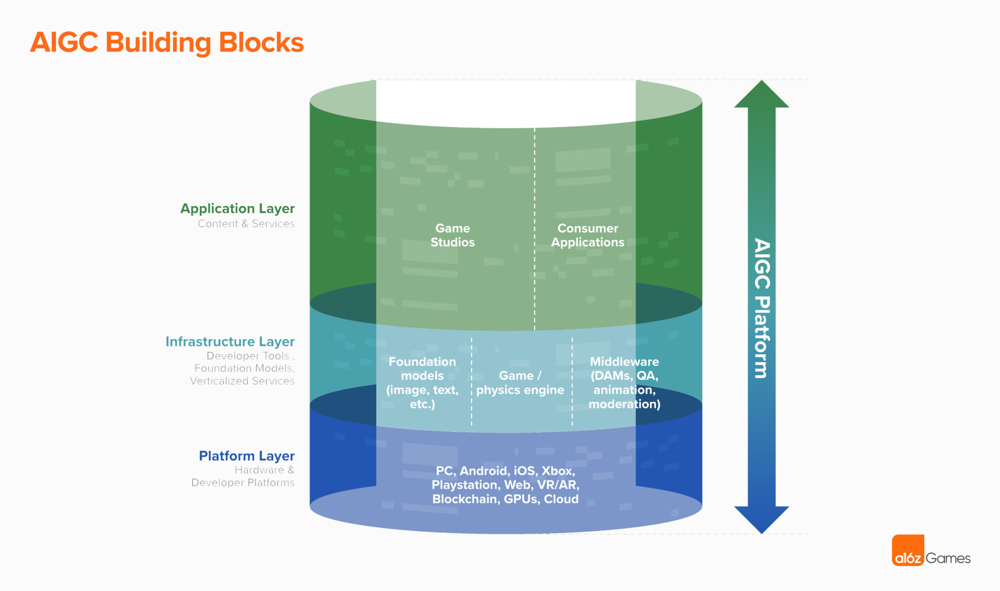

As the [Generative AI Revolution in Games](https://a16z.com/2022/11/17/the-generative-ai-revolution-in-games/) progresses, it will completely reshape User Generated Content (UGC) creating a world where anyone can build games and expanding the games market beyond what many thought was possible.  

随着游戏中生成性人工智能革命的进展，它将完全重塑用户生成内容（UGC），创造一个任何人都可以建立游戏的世界，并扩大游戏市场，超出许多人认为的可能性。  

In the coming years, deep technical knowledge or artistic mastery will no longer be essential skills needed to develop games; instead, creators will be limited only by their energy, creativity, and imagination.  

在未来几年里，深厚的技术知识或艺术造诣将不再是开发游戏所需的基本技能；相反，创作者将只受限于他们的精力、创造力和想象力。  

Ideas won’t be cheap; they’ll be precious. Most importantly, game creation will become truly democratized and millions of new game-makers will be minted.  

思想不会是廉价的，它们将是宝贵的。最重要的是，游戏创作将变得真正民主化，数百万新的游戏制作者将被铸造出来。

> Ideas are cheap. It’s only what you do with them that counts. – Isaac Asimov  
> 
> 思想是廉价的。重要的是你用它们做什么。- 艾萨克-阿西莫夫

Based on the history of UGC platforms, the recent availability of consumer-facing LLMs, and observations about previous technological shifts, we believe that the evolution from UGC games to AI-powered UGC (what we’ll refer to hereafter as _AIGC_) will occur in two phases.  

基于UGC平台的历史，最近面向消费者的LLM的出现，以及对以往技术转变的观察，我们认为从UGC游戏到AI驱动的UGC（我们在下文中称为_AIGC_）的演变将分两个阶段发生。

1.  **The first phase will focus on tooling.** Generative AI will likely act as a co-pilot to human creators by making existing UGC workflows more powerful and accessible. Incumbent UGC platforms (i.e.  
    
    第一阶段将集中在工具方面。生成性人工智能将可能作为人类创作者的副驾驶，使现有的UGC工作流程更加强大和方便。现有的UGC平台（即  
    
    Roblox) will add generative AI tools to their existing toolsets, and startups will emerge to replicate current UGC workflows but optimized for generative AI from the start.  
    
    Roblox）将把生成性人工智能工具添加到他们现有的工具集中，而初创公司将出现，以复制当前的UGC工作流程，但从一开始就为生成性人工智能进行优化。  
    
    Similar to how the internet originally started to solve minor point solutions for the government, or how the cloud was used for point solutions to start, we believe that generative AI will start with point solution tools to assist creators in their current workflow.  
    
    类似于互联网最初是如何为政府解决小的点解决方案，或者云是如何用于点解决方案开始的，我们相信生成性人工智能将从点解决方案工具开始，以协助创作者在他们目前的工作流程。
2.  **In the second phase, we believe new companies will arise that reimagine creation workflows from the ground up.** It’s likely products in phase two will look less like tools or platforms and more like engines or operating systems built foundationally with generative AI.  
    
    在第二阶段，我们相信将出现新的公司，从头开始重新想象创作工作流程。第二阶段的产品可能不太像工具或平台，而更像以生成性人工智能为基础的引擎或操作系统。  
    
    Similar to how the winning websites weren’t imitations of newspapers or how the winning mobile apps weren’t emulations of websites, we believe that an entirely new paradigm of creation will emerge with generative AI embedded deep into the foundational stack from UX to rendering pipelines.  
    
    类似于获胜的网站不是报纸的模仿，或者获胜的移动应用不是网站的模仿，我们相信，随着生成性人工智能深入到从用户体验到渲染管道的基础堆栈中，一种全新的创造模式将会出现。  
    
    Exactly what form they’ll take now, no one can truly predict.  
    
    究竟他们现在会采取什么形式，没有人能够真正预测。

In this blog post we’ll cover the history of and lessons learned from existing UGC platforms, a market map of where UGC companies are today and a framework to think about them, what we expect companies to be building and how they will compete in _AIGC_’s first phase (AI-powered tooling), and how companies might emerge in _AIGC_’s second phase (AI-powered engines).  

在这篇博文中，我们将介绍现有UGC平台的历史和经验教训，UGC公司今天的市场地图和思考它们的框架，我们期望公司在_AIGC_的第一阶段（AI驱动的工具）建立什么和如何竞争，以及在_AIGC_的第二阶段（AI驱动的引擎）可能出现的公司。

## Current State of UGC Platforms  

UGC平台的现状

The world of gaming has undergone a tectonic shift in recent years with the rise of UGC platforms like Roblox and Mine_craft_ (56M DAU and 17M DAU respectively).  

These platforms have enabled millions of people to experience the thrill and challenge of making virtual experiences and games for others by making creation tools more accessible.  

The games built have scaled with the power of the tools, now rivaling professional development teams (see gameplay from Roblox Ultimate Paintball vs. January’s Roblox Frontlines below).    

近年来，随着Roblox和Mine_craft_（分别为5600万DAU和1700万DAU）等UGC平台的崛起，游戏世界发生了结构性变化。这些平台通过提供更多的创作工具，使数百万人能够体验到为他人制作虚拟体验和游戏的快感和挑战。所建造的游戏随着工具的力量而扩大，现在可以与专业的开发团队相媲美（见下面Roblox Ultimate Paintball与1月份Roblox Frontlines的游戏画面）。

How did these two platforms become dominant players in the UGC space? Under the hood, Roblox and Mine_craft_ are very different products and they took very different paths to grow.  

Both, however, are rooted in the history of video game mods – dating back to the community of hackers that just wanted to bring their own ideas to life in the games they loved.   

这两个平台是如何成为UGC领域的主导者的？在引擎盖下，Roblox和Mine_craft_是非常不同的产品，它们采取了非常不同的发展道路。然而，两者都植根于视频游戏修改的历史中--可以追溯到黑客社区，他们只是想在他们喜爱的游戏中实现自己的想法。

One of the first popular mods was Castle Smurfenstein in the early 1980s, a mod of Id Software’s popular _Castle Wolfenstein_ game. Id followed with the release of _Doom_ in 1993, which included a WAD file package for _Doom_’s maps, sprites, textures, assets, etc. And of course, there’s _Counter-strike_, the most popular mod for Valve’s _Half Life_, and _Defense of the Ancients_, itself a mod of the popular _War_craft__ game and the precursor for Riot’s _League of Legends._ The tradition is still well and alive today; _Skyrim_, a game that launched in 2011, has over [60K mods](https://www.nexusmods.com/games) with billions of downloads.   

最早流行的MOD之一是20世纪80年代初的Castle Smurfenstein，这是Id软件公司流行的Castle Wolfenstein游戏的一个MOD。随后，Id在1993年发布了《毁灭战士》，其中包括一个WAD文件包，用于《毁灭战士》的地图、精灵、纹理、资产等等。当然，还有Counter-Strike，Valve的《半条命》最受欢迎的MOD，以及Defense of the Ancients，其本身是流行的魔兽游戏的MOD，也是Riot的《英雄联盟》的前身。这一传统在今天仍然很好地存在；2011年推出的游戏《天际》（Skyrim）有超过6万个MOD，下载量达数十亿。

Mods require a more sophisticated understanding of the game’s underlying architecture and programming, but Roblox and Mine_craft_ simplified and abstracted the game creation process.  

Roblox launched in 2006 as a UGC games platform for younger children, spawned by founder David Baszucki’s insight that some of the educational physics tools he built were used to create games.  

Roblox was designed to be composable, with shape primitives imitating lego blocks and a simpler scripting language in Lua. In comparison, Mine_craft_ drew players into its creator loop through its core building and survival gameplay. Mine_craft_ started in 2009 as a simple indie game called “Cave Game,” created by Swedish programmer Markus “Notch” Persson, who drew inspiration from base-building and block-mining games. As the Mine_craft_ tooling became more powerful, players created grand cityscapes like this one of Minas Tirith from _The_ _Lord of the Rings_.  

Mods需要对游戏的底层架构和编程有更复杂的理解，但Roblox和Mine_craft_简化和抽象了游戏创建过程。Roblox于2006年推出，是一个面向低龄儿童的UGC游戏平台，由创始人David Baszucki的洞察力催生，他建立的一些教育物理工具被用来创建游戏。Roblox的设计是可组合的，其形状基元模仿乐高积木，脚本语言为较简单的Lua。相比之下，《Mine_craft_》通过其核心的建造和生存玩法吸引玩家进入其创造者循环。Mine_craft_始于2009年，是一款名为 "洞穴游戏 "的简单独立游戏，由瑞典程序员Markus "Notch" Persson创建，他从基地建设和块状采矿游戏中获得了灵感。随着《Mine_craft_》的工具变得更加强大，玩家们创造了宏伟的城市景观，比如《指环王》中的米纳斯提力斯。

There are a few lessons that can be drawn from Roblox and Mine_craft_, though both had different origin stories, go-to-market strategies, and corporate outcomes:  

从Roblox和Mine_craft_中可以得出一些教训，尽管两者的起源故事、市场策略和企业结果都不一样。

1.  **The creator-content-player flywheel.** Both games benefitted from a strong flywheel of players who converted into creators that would make content for new players.  
    
    创作者-内容-玩家的飞轮。这两款游戏都受益于强大的玩家飞轮，他们转化为创作者，为新玩家制作内容。  
    
    There are strong network effects as the platform accumulates more great content and creators.  
    
    随着平台积累了更多优秀的内容和创作者，存在着强大的网络效应。
2.  **A powerful toolset.** Mine_craft_ and Roblox built a strong toolset for creators over many years, which enabled a diversity of new rulesets and game loops to be tested and built. Creation became a form of play.  
    
    一个强大的工具集。Mine_craft_和Roblox多年来为创作者建立了一个强大的工具集，这使得新的规则集和游戏循环的多样性得到了测试和建立。创造成为游戏的一种形式。  
    
    Even now many of the most popular Roblox games like Adopt Me! are iterations on top of popular genres like pet-oriented games.  
    
    即使是现在，许多最受欢迎的Roblox游戏，如《领养我吧！》，都是在流行的类型之上的迭代，如面向宠物的游戏。
3.  **The importance of social, organic growth.** Mine_craft_ and Roblox both benefited from strong creator adoption both from a developer and social standpoint. Many of the top YouTubers like Dream and Flamingo grew and promoted the ecosystem.  
    
    社会、有机增长的重要性。Mine_craft_和Roblox都从开发者和社会的角度受益于强大的创作者采用。许多像Dream和Flamingo这样的顶级YouTubers成长并推广了这个生态系统。
4.  **Rich creator / developer ecosystems.** Both games have community forums, tutorial videos, textbooks, and wikis, often fan made, that help newcomers acclimate to the game and help with the player-creator conversion.  
    
    丰富的创造者/开发者生态系统。这两款游戏都有社区论坛、教程视频、教科书和维基，通常是粉丝制作的，帮助新人适应游戏，并帮助玩家与创造者之间的转换。
5.  **Live-service attention.** Roblox and Mine_craft_ were both consistently updated by their developers, adding new tools, creatures, biomes, etc. as well as fixing bugs and glitches and engaging the community.  
    
    现场服务关注。Roblox和Mine_craft_都由其开发者持续更新，增加新的工具、生物、生物群落等，并修复错误和故障，吸引社区参与。
6.  **Robust Moderation.** Given the target audience and the proliferation of potentially NSFW content, both Mojang and Roblox have moderation teams to monitor the types of content being created and protect the ecosystem.  
    
    强有力的管理。鉴于目标受众和潜在的NSFW内容的扩散，Mojang和Roblox都有监管团队来监控正在创建的内容类型并保护生态系统。
7.  **Financial incentives.** Both games have Developer and Partner programs that allow creators to monetize their creations, incentivizing high quality, popular content.  
    
    财务激励。这两款游戏都有开发者和合作伙伴计划，允许创作者对其创作进行货币化，激励高质量、受欢迎的内容。

We can extend the lessons from these two games to create a structure by which to evaluate current and future UGC platforms, depending on how open, platform-first they are like Roblox and how on-rails, game-first they are like Mine_craft_.  

我们可以从这两款游戏中延伸出一个结构，据此来评估当前和未来的UGC平台，这取决于它们像Roblox一样的开放、平台优先，以及像Mine_craft_一样的轨道、游戏优先的程度。

Despite their different approaches, both games are also highly composable and horizontal, which allows for different games to be created across genres (fighting, MOBA, racing, etc.).  

尽管它们的方法不同，但这两款游戏也具有高度的可组合性和横向性，这使得不同的游戏可以跨类型创建（格斗、MOBA、赛车等）。  

However, there are some UGC games that are highly verticalized for a specific genre.  

然而，有一些UGC游戏是高度垂直于某个特定类型的。  

In Halo Forge for example, gamers are encouraged to create levels and rulesets but within the mechanics of the Halo game. Another example, [Roll20](https://roll20.net/), is a customizable platform tailored specifically for table-top role-playing games (TTRPGs). The map below segments many popular UGC platforms by how vertical vs.  

例如，在Halo Forge中，鼓励玩家在Halo游戏的机制内创建关卡和规则集。另一个例子，Roll20，是一个专门为桌面角色扮演游戏（TTRPGs）定制的平台。下面的地图按照垂直与水平的方式对许多流行的UGC平台进行了细分。  

horizontal they are, and whether they’re game-first or platform-first.  

他们的水平，以及他们是游戏优先还是平台优先。

## _AIGC_’s First Phase: AI-Optimized Workflows  

_AIGC_的第一个阶段。AI优化的工作流程

_AIGC_’s first phase will represent a transition from UGC 1.0 to AI-powered creation, where generative AI will be used to dramatically improve existing UGC workflows.  

There are two main reasons why a transition phase will occur:  

_AIGC_的第一阶段将代表从UGC 1.0到AI驱动的创作的过渡，其中生成性AI将被用来极大地改善现有的UGC工作流程。有两个主要原因会发生过渡阶段。

First, the generative AI space is still evolving rapidly – Large Language Models (LLMs) only recently became good enough to meaningfully improve text and 2D asset workflows, and 3D asset models are still a work in progress.  

As a result, the first wave of _AIGC_ platforms will likely be built flexibly, as the infrastructure layer changes over time (see below).  

Second, initial tools will also likely be built as evolutions or optimizations of existing toolsets and UI.  

Incumbents like Roblox are incentivized to streamline rather than completely transform its existing creation pipeline, and startups may choose to take the path of least resistance rather than teaching new development paradigms to creators.   

首先，生成性人工智能领域仍在快速发展--大型语言模型（LLMs）最近才变得足够好，可以有意义地改善文本和二维资产工作流程，而三维资产模型仍是一项工作进展。因此，_AIGC_平台的第一波可能会被灵活地建立起来，因为基础设施层会随着时间的推移而改变（见下文）。其次，最初的工具也可能是作为现有工具集和用户界面的演变或优化而建立的。像Roblox这样的公司有动力精简而不是完全改造其现有的创作管道，而初创公司可能会选择走阻力最小的道路，而不是向创作者教授新的开发模式。

UGC incumbents are already exploring adding generative AI capabilities to their toolset, with Roblox [adding generative AI tools to Roblox Studio](https://blog.roblox.com/2023/02/generative-ai-roblox-vision-future-creation/). Details are scant so far and Roblox faces multiple challenges including innovator’s dilemma and tech debt that has accumulated for more than a decade.  

But they also have significant scale advantages with their creators, players, and development teams. What will companies in this transition phase be focused on building?  

And what will they need to succeed?   

UGC从业者已经在探索将生成性人工智能能力添加到他们的工具集中，Roblox将生成性人工智能工具添加到Roblox Studio中。到目前为止，细节还不多，Roblox面临多种挑战，包括创新者的困境和积累了十多年的技术债务。但他们的创作者、玩家和开发团队也有明显的规模优势。在这个过渡阶段，公司将专注于建立什么？他们又将需要什么来取得成功？

1.  **AI + Human co-creation tools: Co-authoring** tools for asset generation via text, voice, or image prompts (e.g., [ControlNet](https://stablediffusionweb.com/ControlNet) for _Stable Diffusion_). **Co-writing** tools for lore, world-building, storylines, quests, and even full branching visual novel games (e.g., startups like [AI Dungeon](https://play.aidungeon.io/) and [Electric Noir](https://www.electricnoirstudios.com/) with their branching narrative games). **Co-pilot tools** for coding that will make the most technical part of UGC game development significantly more accessible for inexperienced creators (see early experiments with _GPT-4_ to auto-generate simple games like [Snake](https://twitter.com/ammaar/status/1635754631228952576?s=20)). Companies will compete on UX, flexibility, and power here. The best tools will be easy to learn for beginners but still be able to keep up with complex instruction from advanced creators.  
    
    人工智能+人类的共同创作工具。通过文本、语音或图像提示进行资产生成的共同创作工具（例如，稳定扩散的控制网）。用于传说、世界建设、故事情节、任务，甚至完整的分支视觉小说游戏的共同创作工具（例如，像AI Dungeon和Electric Noir这样的初创公司的分支叙事游戏）。编码的辅助工具将使没有经验的创作者更容易获得UGC游戏开发的技术部分（见_GPT-4_的早期实验，自动生成简单的游戏，如蛇）。公司将在用户体验、灵活性和能力方面进行竞争。最好的工具对初学者来说是容易学习的，但仍然能够跟上高级创作者的复杂指令。
2.  **Prompt sharing and search:** When great games are primarily made via prompts, it’s important to make the best prompts easily available to creators. We’ve already seen [_Midjourney_’s](https://www.midjourney.com/) Discord feed teaching the creator community in real time “recipes” for art.  
    
    Companies in this phase will compete to make great prompts available as shareable/sellable artifacts much like Roblox’s Creator Marketplace, Unreal’s Asset Store, or [PromptBase](https://www.promptbase.com/). And when these prompt libraries get very large and noisy, AI can help again with semantic search to help creators find the right prompt for their game.  
    
    提示的分享和搜索。当伟大的游戏主要是通过提示制作的时候，让创作者很容易得到最好的提示是很重要的。我们已经看到_Midjourney_的Discord feed在实时教授创作者社区的艺术 "食谱"。在这个阶段的公司将竞相将优秀的提示语作为可共享/可销售的艺术品，就像Roblox的创造者市场、虚幻的资产商店或PromptBase一样。当这些提示库变得非常大和嘈杂时，人工智能可以再次通过语义搜索来帮助创作者找到适合他们游戏的提示。
3.  **Novel game mechanics:** Unlocking new mechanics or genres that attract new players will be a strong route to creator growth.  
    
    For instance, rules-based procedural content generation has been used in game development for decades, notably in rogue-like games (Diablo, Hades).  
    
    With generative AI, creators can make those rulesets for in-game content generation much more dynamic. For instance, multiple startups like [Role](https://www.playrole.com/) and [Riftweaver](https://www.riftweaver.com/) are experimenting with allowing Dungeon Masters of their tabletop game to harness the power of generative AI and place players in custom environments, fighting new monsters generated with custom stats/lore/abilities, all at runtime.  
    
    Startups may find that competing to make one verticalized toolset great is an easier path to success than trying to build a horizontally complete platform.   
    
    新颖的游戏机制。开启吸引新玩家的新机制或类型，将是创作者增长的有力途径。例如，基于规则的程序性内容生成已经在游戏开发中使用了几十年，特别是在类似流氓的游戏中（暗黑破坏神，哈迪斯）。有了生成性人工智能，创作者可以使这些游戏内内容生成的规则集更加动态。例如，像Role和Riftweaver这样的多个初创公司正在尝试让他们桌面游戏的地下城主利用生成性人工智能的力量，将玩家置于自定义环境中，与用自定义状态/传说/能力生成的新怪物战斗，所有这些都在运行时进行。初创企业可能会发现，竞争使一个垂直化的工具集变得伟大，比试图建立一个横向的完整平台更容易成功。
4.  **Content Discovery:** Creators wielding the power of generative AI tools will produce more content than ever before.  
    
    A massive increase in choice also means players will need help connecting to the games and players that are the best fits for them.  
    
    For UGC startups, matching new players to the right game is key to retaining them and keeping the creator flywheel healthy. [Loci.ai](https://www.loci.ai/) for instance, is working on AI-powered semantic search for game assets.  
    
    内容发现。挥舞着生成性人工智能工具的创作者将比以往生产更多的内容。选择的大量增加也意味着玩家将需要帮助连接到最适合他们的游戏和玩家。对于UGC初创公司来说，将新玩家与正确的游戏相匹配是留住他们并保持创作者飞轮健康的关键。 例如，Loci.ai正在研究由人工智能驱动的游戏资产语义搜索。
5.  **Monetization:** While not directly related to _AIGC_, one way for companies in phase 1 to compete is on creator monetization. On Roblox, creators take home ~30% of the revenue they generate. Fortnite Creative users take home less than 10%.  
    
    Building creation tools with generative AI may be less costly to maintain and upgrade, allowing new platforms to pay creators better.  
    
    货币化。虽然与_AIGC_没有直接关系，但处于第一阶段的公司的竞争方式之一是创作者的货币化。在Roblox，创作者可以获得他们创造的收入的30%。而《堡垒之夜》的创意用户的收入还不到10%。用生成性人工智能构建创作工具，可能会降低维护和升级的成本，使新平台能够更好地支付创作者。
6.  **Moderation:** UGC platforms already require moderation to protect players from misconduct in many forms.  
    
    AI-powered tools will also need to be moderated themselves to prevent creators from abusing the tools, and to prevent hallucinations from creating unwelcome assets, situations, or behaviors.  
    
    These are no small tasks – Roblox reportedly employs hundreds of live moderators to keep the platform safe – but startups like [GGWP](https://www.ggwp.com/) are leveraging the power of analytical AI to moderate behavior and content.  
    
    监管。UGC平台已经需要调节，以保护玩家免受多种形式的不当行为。由人工智能驱动的工具也将需要自己进行调节，以防止创作者滥用工具，并防止幻觉创造不受欢迎的资产、情况或行为。这些都不是小任务--据报道，Roblox雇佣了数百名现场主持人来保持平台的安全--但像GGWP这样的初创公司正在利用分析性人工智能的力量来调节行为和内容。

## _AIGC_’s Second Phase: New Creation Paradigms  

_AIGC_的第二个阶段。新的创作范式

If _AIGC_’s first phase is generative AI accelerating existing UGC tools, the second phase will be generative AI powering the underlying creation engine.  

We predict that creation engines built from the ground up for generative AI might enable new creation paradigms and UX, have custom rendering capabilities, and/or be built with a programming language made specifically for AI-powered creation.  

These AI native engines may be cloud-based with reimagined technical and data architecture oriented towards rapid iteration and creation on any device at runtime.  

As a result, it will be extremely difficult for today’s UGC incumbents to win in this phase – they would have to rewrite all of their underlying technology **and** port their existing entrenched ecosystem over! So what are the potential paths that startups might take? We’d like to postulate two potential avenues – as with UGC 1.  

0, a vertical path and a horizontal path.  

如果_AIGC_的第一阶段是生成性人工智能加速现有的UGC工具，第二阶段将是生成性人工智能为底层创作引擎提供动力。我们预测，为生成性人工智能而建立的创作引擎可能会实现新的创作范式和用户体验，具有定制的渲染能力，并且/或者使用专门为人工智能驱动的创作而制作的编程语言。这些人工智能原生引擎可能是基于云的，具有重新构想的技术和数据架构，面向在任何设备上运行时的快速迭代和创作。因此，今天的UGC从业者要在这个阶段获胜将是非常困难的--他们必须重写他们所有的底层技术，并将他们现有的根深蒂固的生态系统移植过来。那么，初创企业可能采取的路径是什么？我们想假设两条潜在的途径--就像UGC 1.0一样，一条是垂直途径，另一条是水平途径。

**Companies that take the vertical path will have a narrow initial scope.** This focus could take the form of a purpose-built set of creation capabilities for a specific genre of game (serviced by a specific subset of creators). Companies like [Hidden Door](https://www.hiddendoor.co/) (storytelling games), [Roleverse](https://www.roleverse.com/) (tabletop RPG games), and [Regression Games](https://www.regression.gg/) (competitive battlebot games) are initially building focused creation tools around single genres.  

A narrow focus affords the opportunity to ship product, acquire users, collect feedback and ultimately achieve product market fit more quickly which in turn allows for purposeful, feedback-driven reinvestment into building better tools.  

Building purpose-defined tools in a narrower sandbox makes creator onboarding easier, but these same creators may struggle (and eventually churn) when trying to expand beyond those boundaries into new genres.  

But, because of their depth in a specific genre, they might be able to reinvent the creation process as Mine_craft_ did with digital lego blocks.   

走垂直路线的公司将有一个狭窄的初始范围。这一重点可以采取为特定类型的游戏（由特定的创作者子集提供服务）专门建立一套创作能力的形式。像Hidden Door（讲故事的游戏）、Roleverse（桌面RPG游戏）和Regression Games（竞争性战斗机器人游戏）这样的公司，最初都是围绕单一类型建立重点创作工具。狭窄的重点提供了运送产品、获取用户、收集反馈的机会，并最终更快地实现产品的市场适应性，这反过来又允许有目的的、反馈驱动的再投资，以建立更好的工具。在一个较窄的沙盒中建立目的明确的工具，使创作者入职更容易，但当这些创作者试图超越这些界限扩展到新的类型时，他们可能会挣扎（并最终流失）。但是，由于他们在特定类型中的深度，他们可能会像《Mine_craft_》中的数字乐高积木一样，重新发明创作过程。

**Horizontal _AIGC_ startups will look like game engine companies.** Bringing generative AI capabilities down to the foundational infrastructure layer enables novel creation workflows and tooling.  

If a new search engine were built today, it would likely start with an “answer a user’s question” rather than an indexed keyword paradigm. _AIGC_\-enabled game engines may entail similarly fundamental changes to game creation; what if these new _AIGC_ engines make Scene Graph paradigm obsolete for instance? Just as we see creators starting to [generate video without traditional animation](https://twitter.com/DonAllenIII/status/1626166239751184386?s=20) software and rendering pipelines, new techniques will likely arise which may displace real-time rendering as we know it today. Or take asset creation – companies like [Luma Labs](https://lumalabs.ai/) are building novel 3D scanning and asset generation technologies that could end up powering new game creation engines.  

What if, instead of text-prompts, we could take a video of a space and AI would automatically generate the meshes, textures, and fully rendered level in a game?  

The horizontal path is the most risky and will likely require more capital and stronger research teams but is also the path that can completely redefine game creation writ large.  

横向的_AIGC_初创企业将看起来像游戏引擎公司。将生成性人工智能能力下放到基础架构层，可以实现新颖的创建工作流程和工具。如果今天建立一个新的搜索引擎，它可能会从 "回答用户的问题 "开始，而不是从索引关键词的模式开始。支持_AIGC_的游戏引擎可能会给游戏创作带来类似的根本性变化；例如，如果这些新的_AIGC_引擎使场景图范式过时了，会怎么样？就像我们看到创作者开始在没有传统动画软件和渲染管道的情况下生成视频一样，新的技术可能会出现，从而取代我们今天所知的实时渲染。或者以资产创造为例--像Luma实验室这样的公司正在建立新的3D扫描和资产生成技术，最终可能会推动新的游戏创造引擎。如果我们可以用一段空间的视频来代替文字提示，而人工智能会自动生成游戏中的网格、纹理和完全渲染的关卡，那会怎样？横向路径是最有风险的，可能需要更多的资金和更强大的研究团队，但也是能够完全重新定义游戏创作的路径。

## Conclusion  

总结

Generative AI is set to transform and disrupt the UGC games space by democratizing game creation. Everyone is a gamer at heart, and every gamer can become a game maker. The _AIGC_ era will empower millions of people to make their first game and this new generation of game developers will unleash a wave of game design creativity that will change the games industry forever.  

More creators, more diverse games, more gamers.   

生成式人工智能将通过游戏创作的民主化来改变和颠覆UGC游戏领域。每个人的内心都是一个游戏者，每个游戏者都可以成为游戏制作者。_AIGC_时代将使数以百万计的人有能力制作他们的第一款游戏，这个新一代的游戏开发者将释放出一波游戏设计创意，永远改变游戏行业。更多的创作者，更多样化的游戏，更多的玩家。

If you’re a founder excited to build generative AI tools that will unlock this new generation of creators, feel free to reach out!   

如果你是一个对建立生成性人工智能工具感到兴奋的创始人，将释放这一新一代的创造者，请随时联系我们。

\*\*\*

_The views expressed here are those of the individual AH Capital Management, L.L.C. (“a16z”) personnel quoted and are not the views of a16z or its affiliates.  

Certain information contained in here has been obtained from third-party sources, including from portfolio companies of funds managed by a16z.  

While taken from sources believed to be reliable, a16z has not independently verified such information and makes no representations about the current or enduring accuracy of the information or its appropriateness for a given situation.  

In addition, this content may include third-party advertisements; a16z has not reviewed such advertisements and does not endorse any advertising content contained therein.  

这里所表达的观点是AH Capital Management, L.L.C.（"a16z"）人员个人的观点，而不是a16z或其关联公司的观点。这里包含的某些信息是从第三方来源获得的，包括来自a16z管理的基金的投资组合公司。虽然这些信息的来源被认为是可靠的，但a16z并没有独立核实这些信息，也不对这些信息的当前或持久的准确性或其对特定情况的适当性做出任何陈述。此外，这些内容可能包括第三方广告；a16z没有审查这些广告，也不认可其中的任何广告内容。_

_This content is provided for informational purposes only, and should not be relied upon as legal, business, investment, or tax advice. You should consult your own advisers as to those matters.  

References to any securities or digital assets are for illustrative purposes only, and do not constitute an investment recommendation or offer to provide investment advisory services.  

Furthermore, this content is not directed at nor intended for use by any investors or prospective investors, and may not under any circumstances be relied upon when making a decision to invest in any fund managed by a16z. (An offering to invest in an a16z fund will be made only by the private placement memorandum, subscription agreement, and other relevant documentation of any such fund and should be read in their entirety.  

) Any investments or portfolio companies mentioned, referred to, or described are not representative of all investments in vehicles managed by a16z, and there can be no assurance that the investments will be profitable or that other investments made in the future will have similar characteristics or results.  

A list of investments made by funds managed by Andreessen Horowitz (excluding investments for which the issuer has not provided permission for a16z to disclose publicly as well as unannounced investments in publicly traded digital assets) is available at https://a16z.  

com/investments/.  

本内容仅用于提供信息，不应作为法律、商业、投资或税务建议来依赖。你应该就这些问题咨询你自己的顾问。对任何证券或数字资产的提及仅用于说明目的，并不构成投资建议或提供投资咨询服务的提议。此外，这些内容不针对也不打算供任何投资者或潜在投资者使用，在任何情况下，在作出投资于a16z管理的任何基金的决定时，不得依赖这些内容。 (投资于A16z基金的要约将仅由任何此类基金的私募备忘录、认购协议和其他相关文件作出，应阅读其全文。)所提到、提及或描述的任何投资或投资组合公司并不代表A16z管理的所有投资，而且不能保证这些投资将是有利可图的，也不能保证未来进行的其他投资将有类似的特点或结果。Andreessen Horowitz管理的基金所做的投资清单（不包括发行人未允许a16z公开披露的投资以及未公布的对公开交易的数字资产的投资），可在https://a16z. com/investments/。_

_Charts and graphs provided within are for informational purposes solely and should not be relied upon when making any investment decision. Past performance is not indicative of future results.  

The content speaks only as of the date indicated.  

Any projections, estimates, forecasts, targets, prospects, and/or opinions expressed in these materials are subject to change without notice and may differ or be contrary to opinions expressed by others.  

Please see https://a16z.com/disclosures for additional important information.  

其中提供的图表仅用于提供信息，在做出任何投资决定时不应依赖这些图表。过去的业绩并不代表未来的结果。这些内容只代表截至所示日期的情况。这些材料中表达的任何预测、估计、预报、目标、前景和/或意见都可能在没有通知的情况下发生变化，并可能与其他人表达的意见不同或相反。其他重要信息请见https://a16z.com/disclosures。_
