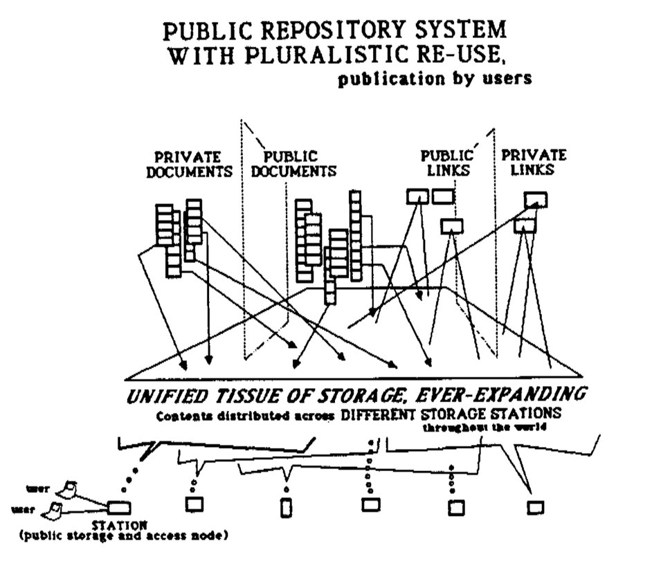
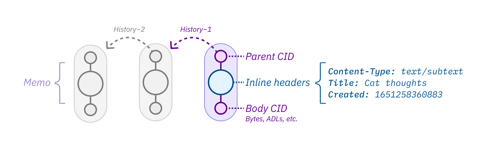
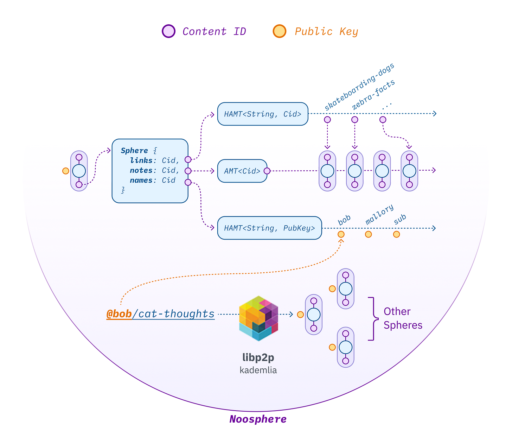
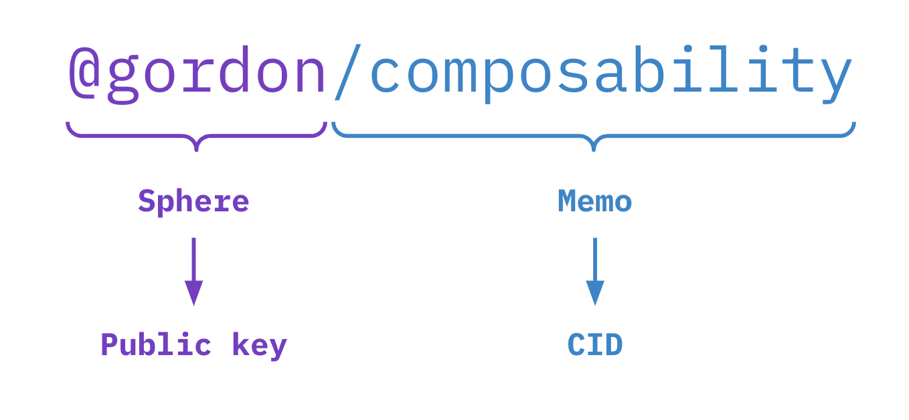
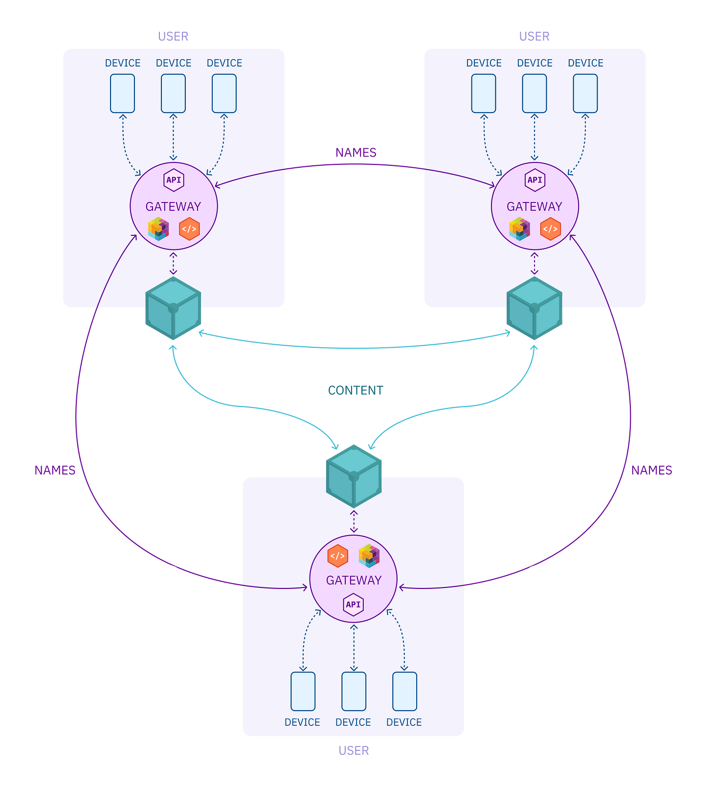

_We’ve launched [a community Discord](https://discord.gg/wyHPzGraBh) for people who are interested in contributing to the Noosphere open source project. **[Come join](https://discord.gg/wyHPzGraBh)**!  

我们为有兴趣为 Noosphere 开源项目做贡献的人们推出了一个社区 Discord。快来加入吧！_

So, that post where we explored a [redecentralized hypertext protocol](https://subconscious.substack.com/p/redecentralization)? Well, we’re actually building it.  

那么，我们探索重新去中心化超文本协议的那篇文章呢？好吧，我们实际上正在构建它。

**Github**: [subconsciousnetwork/noosphere](https://github.com/subconsciousnetwork/noosphere)  

Github：潜意识网络/noosphere  

**License**: Apache/MIT  

许可证：阿帕奇/麻省理工学院  

**Status**: in-development  

状态：开发中

[Noosphere](https://github.com/subconsciousnetwork/noosphere) is a protocol for thought. A worldwide knowledge graph on top of [IPFS](http://ipfs.tech/).  

Noosphere 是一种思想协议。 IPFS 之上的全球知识图谱。

-   **Worldwide knowledge graph**. Noosphere is a massively-multiplayer shared graph made up of smaller public and private graphs.  
    
    全球知识图谱。 Noosphere 是一个大型多人共享图，由较小的公共图和私有图组成。
    
-   **User-owned data**. Apps trap thoughts in SaaS silos. Noosphere fixes this. Everything is syndicated to IPFS, so you have [credible exit](https://subconscious.substack.com/i/47964874/credible-exit) through any IPFS node.  
    
    用户拥有的数据。应用程序将思想困在 SaaS 孤岛中。 Noosphere 解决了这个问题。一切都联合到 IPFS，因此您可以通过任何 IPFS 节点可靠地退出。
    
-   **Self-sovereign identity**. Authentication happens through user-owned [keys not ids](https://subconscious.substack.com/i/60168330/keys-not-ids-toward-personal-illegibility), using [UCAN](https://ucan.xyz/).  
    
    自我主权身份。身份验证通过用户拥有的密钥而不是 ids 使用 UCAN 进行。
    
-   **Local-first sync**. Everything works seamlessly offline. Files can be synced live to your device.  
    
    本地优先同步。一切都可以离线无缝运行。文件可以实时同步到您的设备。
    
-   **Decentralized over IPFS**. Noosphere is peer-to-peer, making it a durable repository for human knowledge. [Lots of Copies Keep Stuff Safe](https://subconscious.substack.com/p/decentralization-enables-permissionless#:~:text=LOCKSS%20stands%20for%20%22Lots%20of%20Copies%20Keep%20Stuff%20Safe%2C%22%20a%20cornerstone%20principle%20for%20robust%20digital%20preservation.%20More%20copies%20of%20data%20will%20tend%20to%20make%20it%20safer%2C%20regardless%20of%20the%20system%20used%20to%20manage%20that%20data.%0A(LOCKSS%3A%20Stanford%20Library%20Preservation)).  
    
    通过 IPFS 去中心化。 Noosphere 是点对点的，使其成为人类知识的持久存储库。大量副本确保资料安全。
    

The name? _Noosphere_ means planetary consciousness, a hypothetical new evolutionary phenomena arising from the biosphere. It’s a lighthearted joke, but also an aspiration.  

Our dream is for Noosphere to become a user-owned medium for thinking together. A little bit like…  

名字？ Noosphere意为行星意识，一种从生物圈中产生的假设的新进化现象。这是一个轻松的笑话，也是一个愿望。我们的梦想是让 Noosphere 成为用户拥有的共同思考的媒介。有点像……

Diagram of “Xanalogical storage”. (Ted Nelson, Project Xanadu)  

“Xanalogical 存储”图。 （泰德·尼尔森，上都计划）

Noosphere is a [permissionless protocol](https://subconscious.substack.com/p/decentralization-enables-permissionless), like HTTP or IMAP. You can build whatever you like on top of it. We’re going to use Noosphere to power Subconscious’ multiplayer and sync features. We hope other apps find it useful too.  

Noosphere 是一种无需许可的协议，如 HTTP 或 IMAP。你可以在它上面构建任何你喜欢的东西。我们将使用 Noosphere 为 Subconscious 的多人游戏和同步功能提供支持。我们希望其他应用程序也觉得它有用。

Nodes in the Noosphere graph are called _memos_. They’re [IPLD](https://ipld.io/) metadata envelopes with:  

Noosphere 图中的节点称为备忘录。它们是 IPLD 元数据信封，具有：

-   Headers, which contains arbitrary metadata  
    
    标头，包含任意元数据
    
-   A body CID, which points to the content  
    
    指向内容的正文 CID
    
-   A parent CID, which points to the previous version of the memo.  
    
    父 CID，指向备忘录的前一个版本。
    

What can you put into a memo? Anything you want! The body CID of a memo can point to any kind of data, indicated by the Content-Type header. JSON, Markdown, binary data, whatever your app needs.  

您可以在备忘录中放入什么？任何你想要的！备忘录的正文 CID 可以指向任何类型的数据，由 Content-Type 标头指示。 JSON、Markdown、二进制数据，无论您的应用程序需要什么。  

This makes Noosphere a general-purpose protocol that can be useful for any kind of app, not just notes.  

这使得 Noosphere 成为一种通用协议，可用于任何类型的应用程序，而不仅仅是笔记。

If you’re thinking this looks a bit like HTTP, you’re right! [The memo format is lindy](https://subconscious.substack.com/p/if-headers-did-not-exist-it-would). Like HTTP, email, or packets, Noosphere uses headers as a mechanism to enable [open-ended evolution](https://subconscious.substack.com/p/open-ended-tools-for-infinite-games).  

如果您认为这看起来有点像 HTTP，那么您是对的！备忘录格式为 lindy 。与 HTTP、电子邮件或数据包一样，Noosphere 使用标头作为实现开放式进化的机制。

Memos also have a parent CID, which points to a previous revision. By following parent CIDs, you can trace back the version history of a given memo.  

备忘录也有一个父 CID，它指向以前的修订版。通过关注父 CID，您可以追溯给定备忘录的版本历史。  

This makes Noosphere almost like a lightweight Git over IPFS, with building blocks for change history, rollback, and sync.  

这使得 Noosphere 几乎就像 IPFS 上的轻量级 Git，具有用于更改历史记录、回滚和同步的构建块。

Noosphere is a massively multiplayer knowledge graph made up of smaller public and private sub-graphs. Each of these sub-graphs is owned by an author, who signs it with a [cryptographic key](https://en.wikipedia.org/wiki/Public-key_cryptography). We call these sub-graphs _spheres._  

Noosphere 是一个大型多人知识图，由较小的公共和私人子图组成。这些子图中的每一个都由作者拥有，作者使用加密密钥对其进行签名。我们称这些子图为球体。

Spheres are essentially **index files** that map…  

球体本质上是映射的索引文件......

-   **@handles** to **public keys**  
    
    **@handles** 到公钥
    
-   **/paths** to **CIDs**  
    
    /CID 的路径
    

You can think of a sphere as being like a personal address book.  

Your sphere also functions as your data backpack and self-sovereign social graph, because if you have your sphere, you have all of the pointers you need to access your data from any IFPS node. [Credible exit](https://subconscious.substack.com/p/credible-exit)!  

您可以将球体想象成个人地址簿。您的球体还可以用作您的数据背包和自主权社交图谱，因为如果您拥有球体，您就拥有了从任何 IFPS 节点访问数据所需的所有指针。可信出口！

Spheres also power a [petname](https://subconscious.substack.com/i/53903252/cheating-zookos-triangle-with-petnames) linking system, a kind of hyperlocal distributed DNS.  

Spheres 还支持昵称链接系统，这是一种超本地分布式 DNS。

You can think of a link like `@gordon/composability` as saying “give me the latest version of `gordon`’s memo called `composability`”.  

您可以将 `@gordon/composability` 之类的链接想象成“给我 `gordon` 的备忘录的最新版本 `composability` ”。

This is similar to the concept of origins and paths in URLs. When I link to `http://example.com/composability`, I’m saying “give me `example.com`’s resource called `composability`. The plot twist is that spheres don’t point to a particular server! Instead, spheres are data structures that live on IPFS.  

So addressing on Noosphere is completely decentralized, and spheres and memos can live on many peers at once. This makes Noosphere very resilient.  

这类似于 URL 中的来源和路径的概念。当我链接到 `http://example.com/composability` 时，我是在说“给我 `example.com` 的名为 `composability` 的资源。情节转折是球体不指向特定服务器！相反，球体是存在于 IPFS 上的数据结构。因此，在 Noosphere 上寻址是完全去中心化的，而且 spheres 和 memos 可以同时存在于许多节点上。这使得 Noosphere 非常有弹性。

So, memos are envelopes for content, and spheres are address books for memos and user public keys. That covers Noosphere’s core data structures.  

因此，备忘录是内容的信封，球体是备忘录和用户公钥的地址簿。这涵盖了 Noosphere 的核心数据结构。  

But who does the work of resolving links and talking to IPFS? Sphere servers!  

但是谁来解决链接和与 IPFS 对话的工作呢？球形服务器！

Sphere servers are superpeers, personal IPFS gateways that live in the cloud and do a handful of useful things. Your sphere server…  

Sphere 服务器是超级节点，个人 IPFS 网关，位于云中并执行一些有用的操作。你的球体服务器……

-   Talks to IPFS  
    
    与 IPFS 对话
    
-   Publishes your memo and sphere updates to the DHT  
    
    将您的备忘录和球体更新发布到 DHT
    
-   Pins your stuff, and caches copies of stuff from other spheres you follow  
    
    固定你的东西，并缓存你关注的其他领域的东西副本
    
-   Resolves petnames, like a hyperlocal DNS resolver  
    
    解析昵称，如超本地 DNS 解析器
    
-   Gossips petname updates with sphere servers that follow you  
    
    八卦宠物名称更新与跟随你的球体服务器
    
-   Bridges to the web  
    
    连接网络的桥梁
    
-   Syncs with client apps  
    
    与客户端应用程序同步
    

There’s not much magic here. Sphere servers are basically boring web2 servers with a little IPFS sprinkled on top. Web 2.5?  

This guarantees us some high-quality peers that can cache and pin content, and reliably respond to requests.  

It also lets us avoid the hard problem of trying to squeeze a battery-draining full peer onto a mobile device. Mobile clients can just talk to the server over HTTP.  

We think these superpeers strike a pragmatic balance that offers the [performance and reliability of the cloud](https://subconscious.substack.com/i/59924410/scale-free-networks-emerge-because-they-are-efficient), and the resilience and [credible exit](https://subconscious.substack.com/p/credible-exit) of IPFS.  

这里没有太多魔法。 Sphere 服务器基本上是无聊的 web2 服务器，上面散布着一点 IPFS。网络 2.5？这保证了我们有一些高质量的节点可以缓存和固定内容，并可靠地响应请求。它还让我们避免了试图将电池耗尽的完整对等体压缩到移动设备上的难题。移动客户端只能通过 HTTP 与服务器通信。我们认为这些超级节点实现了务实的平衡，提供了云的性能和可靠性，以及 IPFS 的弹性和可信退出。

So that’s the idea. A decentralized worldwide knowledge graph, belonging to everybody.  

这就是我们的想法。去中心化的全球知识图谱，属于每个人。

Noosphere is open source and we’re releasing what we’ve built so far under both Apache and MIT licenses. This protocol is maximally open, and open-ended.  

Noosphere 是开源的，我们发布了迄今为止在 Apache 和 MIT 许可下构建的内容。该协议是最大程度地开放和开放的。

**Github**: [subconsciousnetwork/noosphere](https://github.com/subconsciousnetwork/noosphere)  

Github：潜意识网络/noosphere  

**License**: Apache/MIT  

许可证：阿帕奇/麻省理工学院  

**Status**: in-development  

状态：开发中

Come manifest it with us! We’re just getting started.  

快来和我们一起体现吧！我们才刚刚开始。

— [@gordonbrander](https://twitter.com/gordonbrander) and [@0xcda7a](https://twitter.com/0xcda7a)  

— [@gordonbrander](https://twitter.com/gordonbrander) 和 [@0xcda7a](https://twitter.com/0xcda7a)

### Subscribe to  

订阅潜意识**Subconscious**

The web began as a tool for thought  

网络最初是一种思考工具
