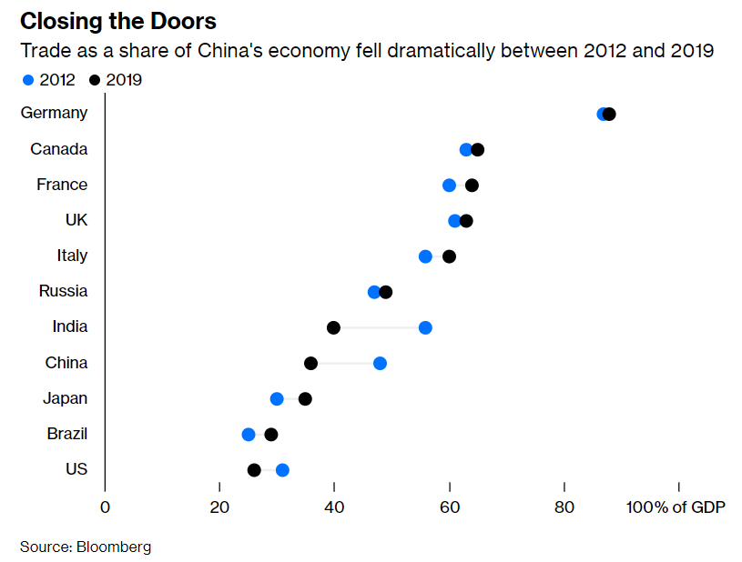
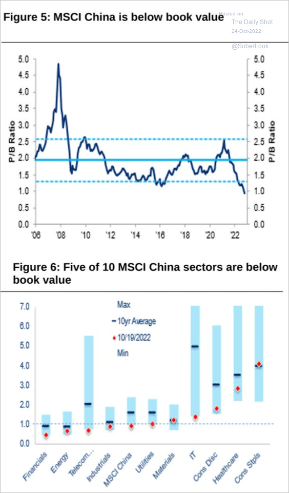

This is a big-think, “sweeping overview” sort of post.  

这是一篇宏大的、“全面概述”的帖子。  

I find myself writing more of these recently, not because there aren’t little interesting news items or econ papers or debates to focus on, but because big things are happening very fast in the world right now, and I want to try and keep track of them.  

我发现自己最近写了更多这样的东西，不是因为没有什么有趣的新闻、经济论文或辩论可以关注，而是因为现在世界上发生的大事非常快，我想试着跟踪他们中的。

After the end of the Cold War, the United States forged a new world.  

冷战结束后，美国开创了一个新世界。  

The driving, animating idea behind this new world was the belief that global trade integration would restrain international conflict.  

这个新世界背后的驱动力和活力理念是相信全球贸易一体化将抑制国际冲突。  

At first this rested on a Fukuyama-type “end of history” theory that political and economic liberalization would follow globalization, but as it became clear that various bureaucratic one-party oligarchies and petrostates (most notably China and Russia) were resistant to the end of history, the hopes for trade became more modest — at least countries that depended on each other economically would not fall into active conflict.  

起初，这基于福山式的“历史终结”理论，即政治和经济自由化将跟随全球化，但随着各种官僚的一党寡头和石油国家（最明显的是中国和俄罗斯）对终结的抵制变得越来越明显从历史上看，对贸易的希望变得更加渺茫——至少在经济上相互依赖的国家不会陷入积极的冲突。

We didn’t just pay lip service to this theory; _we bet the entire world on it_. The U.S.  

and Europe championed the admission of China into the World Trade Organization, and deliberately looked the other way on a number of things that might have given us reason to restrict trade with China (currency manipulation in the 00s, various mercantilist policies, poor labor and environmental standards).  

As a result, the global economy underwent a titanic shift. Whereas global manufacturing, trading networks, and supply chains had once been dominated by the U.S.  

, Japan, and Germany, China now came to occupy the central place in all of these:  

我们不只是口头上支持这个理论；我们把整个世界都押在上面。美国和欧洲支持中国加入世界贸易组织，并在一些可能让我们有理由限制与中国贸易的事情上故意换个角度看（00 年代的货币操纵、各种重商主义政策、劳动力匮乏）和环境标准）。结果，全球经济经历了巨大的转变。全球制造业、贸易网络和供应链曾经由美国、日本和德国主导，而中国现在开始占据所有这些的中心位置：

As of 2021, China’s manufacturing output was [equal to that of the U.S. and all of Europe combined](https://noahpinion.substack.com/p/the-war-economy-sizing-up-the-new).  

截至 2021 年，中国的制造业产出相当于美国和整个欧洲的总和。

There were were always those who fretted about this shift, but too many people were just making too much money from it to upset the apple cart. U.S. manufacturers boosted their profits — and [at least on paper](https://marginalrevolution.com/marginalrevolution/2011/03/how-much-productivity-growth-was-there-during-2007-2009.html), their productivity — by outsourcing production to China, while retail outlets (and consumers) benefitted from a flood of cheap imports.  

American companies grew their profits massively from grabbing mere slivers of the vast Chinese market, and salivated over the possibility of more.  

The finance industry reaped the benefits of cheap capital inflows as China bought U.S. assets in order to hold down the value of the RMB in the 2000s. Knowledge workers in the U.S.  

and Europe benefitted from researching, designing, and marketing the products that China built for us. Production workers in rich countries [lost out big-time](https://www.gsb.stanford.edu/faculty-research/publications/impact-chinese-trade-us-employment-good-bad-apocryphal), but this was a price our country was willing to pay.  

America and our rich-world allies went from being the world’s workshop to being the world’s research park, and the people who had been our factory workers became the janitors and cooks and security guards of that research park.  

总是有人对这种转变感到烦恼，但太多人只是从中赚了太多钱，无法颠覆苹果购物车。美国制造商通过将生产外包给中国提高了利润——至少在纸面上提高了生产率，而零售店（和消费者）则从大量廉价进口产品中受益。美国公司仅从庞大的中国市场中攫取了一小部分，就大幅增加了利润，并渴望获得更多的机会。由于中国在 2000 年代购买美国资产以压低人民币价值，金融业从廉价资本流入中获益。美国和欧洲的知识工作者从研究、设计和营销中国为我们制造的产品中受益。富裕国家的生产工人损失惨重，但这是我们国家愿意付出的代价。美国和我们的富裕世界盟友从世界工厂变成了世界研究园区，曾经是我们工厂工人的人变成了那个研究园区的看门人、厨师和保安。

This new system meant big compromises for China’s ruling elite as well.  

For decades they had closed off their society from foreign influences in an attempt to reorder it according to their liking, and opening up to global trade meant relinquishing some of the social control they had fought so hard for.  

An economy based on foreign direct investment meant a loss of economic control to foreign corporations. And occupying [the low-value middle of the global supply chain](https://www.ide.go.jp/English/ResearchColumns/Columns/2022/meng_bo.html) — the assembly, processing, and packaging that requires enormous mobilization of resources but yields only modest profit margins — put China in danger of falling into the dreaded “[middle income trap](https://www.nber.org/papers/w18673)”.  

这种新制度也意味着对中国统治精英的巨大妥协。几十年来，他们将自己的社会与外国影响隔离开来，试图根据自己的喜好对其进行重新排序，而向全球贸易开放意味着放弃他们为之奋斗的一些社会控制。以外国直接投资为基础的经济意味着外国公司失去经济控制权。占据全球供应链的低价值中间环节——组装、加工和包装需要大量资源调动，但利润率微乎其微——使中国面临陷入可怕的“中等收入陷阱”的危险。

But China was simply growing too fast to break this deal. Jiang Zemin and Hu Jintao held firmly to the course Deng Xiaoping — who hand-picked them as his successors — had laid out for them.  

但中国只是增长太快，无法打破这笔交易。江泽民和胡锦涛坚定地坚持邓小平——亲手挑选他们作为继任者——为他们制定的路线。  

Economically, China pursued “reform and opening up”, while militarily and diplomatically it chose to “hide its strength and bide its time”.  

中国在经济上追求“改革开放”，而在军事和外交上则选择“韬光养晦”。

Some called the world system of the 2000s and early 2010s “[Chimerica](https://en.wikipedia.org/wiki/Chimerica)”. During these years, the hope that global trade would lead to a cessation of great-power conflict, even without ideological alignment, seemed justified.  

And although China’s politics didn’t liberalize, under Jiang and Hu the country [became more open](https://www.brookings.edu/book/middle-class-shanghai/) to foreign travelers, foreign workers, and foreign ideas. This might not have been the End of History, but it was a compromise most people could live with for a while.  

一些人将 2000 年代和 2010 年代初期的世界体系称为“中美国”。在这些年里，全球贸易将导致大国冲突停止的希望，即使没有意识形态上的一致，似乎是合理的。尽管中国的政治没有自由化，但在江泽民和胡锦涛的领导下，这个国家对外国游客、外国工人和外国思想更加开放。这可能不是历史的终结，但这是大多数人可以暂时接受的妥协。

In the mid-2010s, this compromise began to break down. On the U.S. side, there was increasing anger over the long-term decline of good manufacturing jobs, and an increasing feeling of the U.S.  

in second place. China, and the Chimerica system, became the target of some of this anger — not without good reason.  

An increasingly thin, fraying elite consensus in favor of the system snapped when Donald Trump came to power. Trump slapped tariffs on China that raised prices slightly for U.S.  

consumers and manufacturers, but [hurt China’s economy considerably more](https://cepr.org/voxeu/columns/impact-us-china-tariff-war-chinas-economy-new-evidence-night-time-lights). The U.S. began to scrutinize and block Chinese investment a lot more under CFIUS, while export controls were put in place to strangle China’s flagship electronics company Huawei. U.S.  

imports from China shrank, eroding the bilateral trade deficit a bit:  

在 2010 年代中期，这种妥协开始破裂。在美国方面，人们对良好的制造业工作岗位长期减少感到越来越愤怒，并且越来越觉得美国处于第二位。中国和中美制度成为部分愤怒的目标——并非没有充分理由。当唐纳德特朗普上台时，支持该系统的精英共识越来越薄弱。特朗普对中国征收关税，略微提高了美国消费者和制造商的价格，但对中国经济的伤害更大。在 CFIUS 的领导下，美国开始更多地审查和阻止中国投资，同时实施出口管制以扼杀中国旗舰电子公司华为。美国从中国的进口萎缩，双边贸易逆差略有下降：

Meanwhile, in China, Xi Jinping [initiated a program to onshore](https://en.wikipedia.org/wiki/Made_in_China_2025) the production of high-value intermediate goods, even as rising labor costs started to force some low-value labor-intensive assembly work to places like Vietnam or Bangladesh. Xi also [shifted China’s industrial policy](https://dusselpeters.com/CECHIMEX/Naughton2021_Industrial_Policy_in_China_CECHIMEX.pdf) from a regional patchwork to a unified national effort. Foreign direct investment as a percent of China’s economy dropped under Xi:  

与此同时，在中国，尽管不断上涨的劳动力成本开始迫使一些低价值的劳动密集型装配工作转移到越南或孟加拉国等地，但习近平发起了一项将高价值中间产品生产转移到岸的计划。习近平还将中国的产业政策从区域拼凑转变为全国统一。在习近平的领导下，外国直接投资占中国经济的百分比下降了：

As [Bloomberg’s David Fickling reports](https://www.bloomberg.com/opinion/articles/2022-10-18/xi-s-covid-zero-policy-risks-isolating-china-into-a-new-era-of-weakness?sref=R8NfLgwS), trade became a smaller portion of China’s economy over this period:  

正如彭博社的 David Fickling 报道的那样，在此期间，贸易在中国经济中所占的比重变小了：

And yet Chimerica would not be defeated so easily. U.S. imports from China, and the bilateral trade deficit, [rebounded strongly](https://www.statista.com/statistics/187675/volume-of-us-imports-of-trade-goods-from-china-since-1985/) in 2020-21 as a result of the Covid pandemic. The U.S. failed to increase manufacturing production _at all_ under Trump, even as the economy grew quickly.  

然而，中美国不会那么容易被打败。由于 Covid 大流行，美国从中国的进口和双边贸易逆差在 2020-21 年强劲反弹。在特朗普的领导下，美国根本未能增加制造业生产，即使经济增长迅速。

Meanwhile, despite an eroding cost advantage, China’s share of global manufacturing grew relentlessly:  

与此同时，尽管成本优势被削弱，中国在全球制造业中的份额仍在不断增长：

U.S., European, and Asian companies were investing in China at a slightly slower rate, but this is partly because they had already moved so much of their production there.  

The country’s eroding cost advantage was more than cancelled out by the desire to grab a slightly larger sliver of the vast and growing Chinese market, the need to have factories located close to suppliers, and the country’s vast pool of well-trained process engineers — forces that economists collectively refer to as _agglomeration effects_.  

And rising costs and increasing government harassment and IP theft didn’t really make multinationals think about divesting; by the late 2010s, companies had simply become used to the idea that their manufacturing would be sourced from China. Making things in China was push-button, it was a no-brainer, it wasn’t something where you got out the Excel spreadsheet to figure out if it penciled. China was simply the “[make-everything country](https://twitter.com/damienics/status/1278114690871300101)”, so that is where you made things.  

美国、欧洲和亚洲公司在中国的投资速度略有放缓，但这在一定程度上是因为它们已经将大量生产转移到那里。中国不断削弱的成本优势被在庞大且不断增长的中国市场中分一杯羹的愿望、工厂靠近供应商的需求以及该国大量训练有素的工艺工程师的需求所抵消——力量经济学家统称为集聚效应。成本上升以及政府骚扰和知识产权盗窃的增加并没有真正让跨国公司考虑剥离；到 2010 年代后期，公司已经习惯了他们的制造将来自中国的想法。在中国制造东西是按下按钮，这是一个不费吹灰之力的事情，这不是你拿出 Excel 电子表格来弄清楚它是否用铅笔画出来的东西。中国简直就是“制造一切的国家”，所以那是你制造东西的地方。

In other words, the vast and inevitable forces of economic agglomeration continued to dictate that China should be the world’s workshop and America (and Europe and Japan) its research park.  

换句话说，经济集聚的巨大而不可避免的力量继续要求中国成为世界工厂，美国（以及欧洲和日本）成为世界研究园区。  

But there is one force in the global economy more powerful even than agglomeration: Great-power conflict.  

但全球经济中有一种力量甚至比集聚更强大：大国冲突。

In 2020 and 2021, a number of events convinced China’s leaders (and many observers in the U.S. and around the world) that China’s system had surpassed the U.S.  

2020 年和 2021 年，一系列事件让中国领导人（以及美国和世界各地的许多观察家）相信中国的制度已经超越了美国。  

in terms of economic vitality, political stability, and comprehensive national power. Most of these events were connected to the Covid pandemic.  

在经济活力、政治稳定和综合国力方面。大多数这些事件都与 Covid 大流行有关。  

China’s ability to make simple goods like masks and Covid tests, coupled with the U.S.’ struggles in making these things, seemed to validate China’s positioning in the global supply chain.  

中国有能力生产口罩和 Covid 测试等简单商品，再加上美国在生产这些东西方面的困难，似乎证实了中国在全球供应链中的地位。  

China’s ability to suppress the virus with non-pharmaceutical interventions seemed to demonstrate its higher state capacity. And U.S.  

中国通过非药物干预来抑制病毒的能力似乎表明了其更高的国家能力。还有美国  

unrest in 2020 and early 2021 seemed to suggest a society that was too internally divided to continue to play a central role on the world stage.  

2020 年和 2021 年初的动荡似乎表明一个内部过于分裂的社会无法继续在世界舞台上发挥核心作用。

Xi Jinping, China’s leader, apparently felt that these events validated his pre-existing plan for “[great changes unseen in a century](https://www.cfr.org/blog/review-rush-doshis-long-game-chinas-grand-strategy-displace-american-order)” — i.e. China’s displacement of the U.S. as the global hegemon.  

Though this was Xi’s ambition from the start, it was the Chimerica system that had made his dream feasible, by making China the biggest manufacturing and trading nation on Earth.  

中国领导人习近平显然认为，这些事件验证了他先前的“百年未有之大变局”计划——即中国取代美国成为全球霸主。尽管这从一开始就是习近平的雄心壮志，但正是中美制度让他的梦想成为现实，让中国成为地球上最大的制造业和贸易国。

Now, Xi seemed to feel that China had extracted all it could from the Chimerica system, and that the benefits no longer outweighed the costs.  

His industrial crackdowns in 2021 included measures to limit Western, Japanese, and South Korean cultural influences.  

Under his Zero Covid system, China became much more closed to the world, with inflows of people from abroad [basically halted](https://www.bloomberg.com/opinion/articles/2022-10-18/xi-s-covid-zero-policy-risks-isolating-china-into-a-new-era-of-weakness?sref=R8NfLgwS).  

现在，习近平似乎觉得中国已经从中美体系中榨取了所有它能榨取的东西，收益不再超过成本。他在 2021 年的工业镇压措施包括限制西方、日本和韩国文化影响的措施。在他的零新冠系统下，中国对世界变得更加封闭，海外人员流入基本停止。

But these were only the first of a number of ways in which Xi, who just [cemented his absolute power](https://noahpinion.substack.com/p/xi-jinping-forever) over his country at the 20th Party Congress, has made it clear that China’s era of “reform and opening up” is over. Here are [some excerpts from an interview with Joerg Wuttke](https://themarket.ch/interview/china-after-the-party-congress-ideology-trumps-the-economy-ld.7703), President of the EU Chamber of Commerce in China about what the changes at the party congress mean:  

但这只是习近平在第 20 次党代会上巩固其对国家绝对权力的众多方式中的第一步，明确表示中国的“改革开放”时代已经结束。以下是中国欧盟商会会长 Joerg Wuttke 就党代会变化意味着什么的采访摘录：

> The reformers have been totally cut off…\[T\]he opening up of the Chinese economy is not going to continue…We have to get away from the idea that China’s policy is still basically tailored to economic growth…Many observers have thought until today that although the Party calls itself Communist, it is basically pursuing a form of Manchester Capitalism.  
> 
> 改革者完全被切断了……\[T\]中国经济的开放不会继续下去……我们必须摆脱中国的政策仍然基本上是为经济增长量身定做的想法……直到今天，许多观察家还认为尽管该党自称为共产主义，但它基本上是在追求一种曼彻斯特资本主义。  
> 
> That is over…  
> 
> 就这样结束了……
> 
> China’s foreign policy will become even more assertive and confrontational.  
> 
> 中国的外交政策将变得更加自信和对抗。  
> 
> Xi used the word “struggle” seventeen times in his speech to the Party Congress, twelve times in an international context, mostly directed at the USA.  
> 
> 习近平在党代会讲话中十七次使用“斗争”一词，十二次是在国际背景下，主要是针对美国。  
> 
> China wants to be unassailable and more self-sufficient, it wants to fight for future markets and technologies.  
> 
> 中国想要立于不败之地，更加自给自足，它想要为未来的市场和技术而战。  
> 
> In this context, the term struggle also has an absolute claim: There are only winners and losers…The Party leadership shows a similar self-confidence as Germany at the beginning of the 20th century.  
> 
> 在这种情况下，斗争一词也有绝对的要求：只有赢家和输家……党的领导层表现出与20世纪初德国相似的自信。

Wuttke has every incentive to say that China is still oriented toward economic growth and that the China business environment is still attractive for multinational companies.  

伍特克完全有理由说，中国仍然以经济增长为导向，中国的商业环境对跨国公司仍然具有吸引力。  

And yet he is saying the opposite. I tend to believe him.  

然而他说的恰恰相反。我倾向于相信他。  

There are a ton of evidence that Xi’s regime is de-prioritizing the foreign businesses whose investment helped build China up to where it is today.  

有大量证据表明，习近平政权正在降低外国企业的优先地位，这些企业的投资帮助将中国建设到了今天的水平。  

As just one example, China’s real estate developers look likely to soak their foreign creditors first:  

仅举一个例子，中国的房地产开发商可能会首先吸纳外国债权人：

Another small sign is that China has [stopped publishing most of its economic statistics](http://econbrowser.com/archives/2022/10/how-can-one-guide-an-economy-if-one-doesnt-know-where-it-is) — numbers that foreign companies rely on as justification for their decision to invest in the Chinese market.  

另一个小迹象是，中国已停止公布其大部分经济统计数据——外国公司依赖这些数据作为决定投资中国市场的理由。

Meanwhile, China’s soft support for Russia’s Ukraine invasion and its increasingly aggressive posture toward Taiwan have prompted the Biden administration to pull out the big guns. [Sweeping export controls on the semiconductor industry](https://noahpinion.substack.com/p/biden-declares-economic-war-on-the) — covering not just chips, but also chipmaking tools and personnel — represent a zero-sum lunge for the jugular of China’s technological ambitions.  

For in-depth coverage of just how big a deal this is, I recommend [Chris Miller’s recent interview on the Odd Lots podcast](https://www.bloomberg.com/news/articles/2022-10-24/odd-lots-podcast-us-puts-new-restrictions-on-china-s-semiconductor-industry?utm_content=economics&utm_campaign=socialflow-organic&cmpid%3D=socialflow-twitter-economics&utm_source=twitter&utm_medium=social&sref=R8NfLgwS). And those export controls may soon be expanded to other technologies:  

与此同时，中国对俄罗斯入侵乌克兰的软弱支持以及对台湾日益咄咄逼人的姿态促使拜登政府撤出了大炮。对半导体行业的全面出口管制——不仅包括芯片，还包括芯片制造工具和人员——代表着中国技术野心的零和攻击。要深入了解这有多大，我推荐 Chris Miller 最近在 Odd Lots 播客上的采访。这些出口管制可能很快会扩展到其他技术：

([A transcript can be found here](https://www.bloomberg.com/news/articles/2022-10-24/transcript-what-the-us-just-did-to-china-s-semiconductor-industry). And [here is a post by Ben Thompson](https://stratechery.com/2022/chips-and-china/) that goes into even greater detail.)  

（可以在此处找到成绩单。这是本·汤普森 (Ben Thompson) 发表的一篇更详细的文章。）

This makes perfect sense if you view national security and defense as [core to U.S. policymaking](https://noahpinion.substack.com/p/natsec-is-how-america-gets-things). The U.S. was willing to tolerate the devastation of its manufacturing base, but not its relegation to a second-class power.  

In other words, whereas during the Chimerica era both countries prioritized the mutual economic benefits they could get from a symbiotic relationship, they now prioritize the zero-sum military and geopolitical competition to which economics are a key input.  

如果您将国家安全和国防视为美国政策制定的核心，那么这是完全有道理的。美国愿意容忍其制造基地遭到破坏，但不愿容忍其沦为二等强国。换句话说，在中美时代，两国都优先考虑从共生关系中获得的共同经济利益，而现在他们优先考虑经济是关键投入的零和军事和地缘政治竞争。

Markets, for their part, seem to realize that this time is different. [China’s stocks cratered](https://www.asiamarkets.com/chinese-stocks-crash-after-xi-jinping-cements-absolute-power/) after the party congress — so much so that they’re now trading below the value of their assets on paper.  

就市场而言，他们似乎意识到这次不同了。中国股市在党代会后暴跌——跌幅如此之大，以至于它们现在的交易价格低于其账面资产价值。

China’s wealthier citizens also seem to realize that the era of economic focus is over; many are [making plans to flee the country](https://www.ft.com/content/3e2376bf-24ef-407f-b0b0-c60bed4ec97b).  

中国较富裕的公民似乎也意识到以经济为中心的时代已经结束；许多人正在制定逃离该国的计划。

The key thing to understand about this decoupling, I think, and the reason it’s for real, is that **this is something the leaders of both the U.S. and China want**. No matter what you heard in 2018, this is _not_ a case of a protectionist U.S. trying to defend its manufacturing industries while China becomes the champion of globalism. The U.S.  

is acting not out of concern for its industries — indeed, its chip industry will take a huge hit from export controls — but because of how it perceives its own national security.  

And China’s leaders want to shift to indigenous industry, regulated industry, and even nationalized industry, even if that shift makes China grow more slowly.  

我认为，理解这种脱钩的关键是，这是真正脱钩的原因，这是美国和中国领导人都想要的。无论你在 2018 年听到什么，这都不是保护主义的美国试图捍卫其制造业，而中国成为全球主义的冠军。美国采取行动并非出于对其产业的担忧——事实上，其芯片产业将受到出口管制的巨大打击——而是因为它如何看待自身的国家安全。中国领导人希望转向本土产业、受管制产业，甚至是国有化产业，即使这种转变会使中国增长放缓。

The decoupling between China and the developed democracies, so long a topic of conversation and speculation, now appears to be a reality. A critical point has been reached.  

中国与发达民主国家之间的脱钩，长期以来一直是人们谈论和猜测的话题，现在似乎已成为现实。已达到临界点。  

The old world-economic system of Chimerica is being swept away, and something new will take its place.  

旧的中美利坚合众国世界经济体系正在被扫地出门，新事物将取而代之。

It will take a while for the new world-economic system to be born (and as Gramsci says, this will be a “time of monsters”). A lot will be contingent on events, such as whether there is another [world war](https://noahpinion.substack.com/p/why-i-think-an-invasion-of-taiwan). But already I think we can make some educated guesses and ask some key questions.  

新的世界经济体系的诞生需要一段时间（正如葛兰西所说，这将是一个“怪物时代”）。很多事情都取决于事件，例如是否有另一场世界大战。但我认为我们已经可以做出一些有根据的猜测并提出一些关键问题。

One reasonable prediction is that the era of global value chains will _not_ come to an end.  

Offshoring and supply chaining are just how companies know how to produce stuff now, meaning that — barring a very catastrophic war — we will not go back to an era of largely self-contained national manufacturing economies.  

Instead, supply chains will shift into blocs.  

China is obviously one bloc; Xi and his followers want China to make and own everything valuable in-house and rely on other countries only for raw materials and other low-value goods.  

In the absence of the U.S.  

\-led liberal world order to enforce free trade, securing those resources will require geopolitical and even military action — a return, in some form or another, to the pre-WW2 era that will doubtless draw at least scattered protests of neo-imperialism.  

There will be struggles over the resources of some neutral countries, including poor countries, and this could turn into some ugly Cold-War style proxy struggles.  

一个合理的预测是，全球价值链时代不会结束。离岸外包和供应链正是公司现在知道如何生产东西的方式，这意味着——除非发生一场非常灾难性的战争——我们不会回到一个基本上自给自足的国家制造业经济时代。相反，供应链将转变为集团。中国显然是一个集团；习近平和他的追随者希望中国在国内制造和拥有一切有价值的东西，而仅在原材料和其他低价值商品方面依赖其他国家。在没有以美国为首的自由世界秩序来执行自由贸易的情况下，保护这些资源将需要地缘政治甚至军事行动——以某种形式回到二战前的时代，这无疑会至少引起零星的抗议新帝国主义的。包括贫穷国家在内的一些中立国家将争夺资源，这可能会演变成一些丑陋的冷战式代理人斗争。

The second bloc is less certain. I expect the Biden administration and/or its successor to get tripped up for a while by the mirage of a self-sufficient U.S.  

第二个集团不太确定。我预计拜登政府和/或其继任者会被美国自给自足的海市蜃楼绊倒一段时间。  

, and to implement “Buy American” policies that hurt our allies and trading partners and slow the formation of a bloc that can match China.  

，并实施伤害我们的盟友和贸易伙伴的“购买美国货”政策，并减缓与中国匹敌的集团的形成。  

But if Americans can finally pull their heads out of their rear ends and recognize that their country doesn’t dominate the world the way it used to, there’s a chance to create a non-China economic bloc that preserves lots of the efficiencies of the old Chimerica system while also serving U.S.  

但是，如果美国人最终能够从他们的屁股中抽出脑袋，并认识到他们的国家不再像过去那样主宰世界，那么就有机会创建一个非中国经济集团，保留旧经济的许多效率Chimerica 系统同时也为美国服务  

national security needs.  

国家安全需要。

That bloc would _not_ only include America’s formal allies or the developed democracies; instead it would include lots of developing countries that would like to hedge against Chinese power and secure access to rich-world markets.  

Two prime examples are India and Vietnam. I noted [a recent article in The Economist](https://www.economist.com/business/2022/10/24/the-end-of-apples-affair-with-china) about how Apple — the poster child for American investment in China — is starting to shift production to those countries:  

该集团不仅包括美国的正式盟友或发达的民主国家；相反，它将包括许多希望对冲中国力量并确保进入富裕世界市场的发展中国家。两个主要例子是印度和越南。我注意到《经济学人》最近一篇关于苹果公司——美国在中国投资的典型代表——如何开始将生产转移到这些国家的文章：

> Apple banked on China-based factories, which now churn out more than 90% of its products, and wooed Chinese consumers, who in some years contributed up to a quarter of Apple’s revenue.  
> 
> 苹果寄希望于中国工厂，这些工厂现在生产了 90% 以上的产品，并吸引了中国消费者，中国消费者在某些年份贡献了苹果收入的四分之一。  
> 
> Yet economic and geopolitical shifts are forcing the company to begin a hurried decoupling…  
> 
> 然而，经济和地缘政治的变化正迫使该公司开始匆忙脱钩……
> 
> The two countries are the main beneficiaries of Apple’s strategic shift. In 2017 Apple listed 18 large suppliers in India and Vietnam; last year it had 37.  
> 
> 这两个国家是苹果战略转移的主要受益者。 2017年苹果在印度和越南列出了18家大型供应商；去年它有37个。  
> 
> In September…Apple started making its new iPhone 14 in India, where it had previously made only older models.  
> 
> 9 月……Apple 开始在印度生产其新款 iPhone 14，此前它只在印度生产旧机型。  
> 
> The previous month it was reported that Apple would soon start making its MacBook laptops in Vietnam…Almost half its AirPod earphones are made in Vietnam and by 2025 two-thirds will be, forecasts JPMorgan Chase.  
> 
> 上个月有报道称，苹果公司将很快开始在越南生产 MacBook 笔记本电脑……据摩根大通预测，几乎一半的 AirPod 耳机在越南生产，到 2025 年将占三分之二。  
> 
> The bank reckons that, whereas today less than 5% of Apple’s products are made outside China, by 2025 the figure will be 25%…  
> 
> 该银行估计，虽然今天不到 5% 的苹果产品是在中国境外制造的，但到 2025 年，这一数字将达到 25%……
> 
> As Apple’s production system is shifting, its suppliers are diversifying away from China, too…  
> 
> 随着 Apple 的生产系统发生转变，其供应商也从中国转向多元化......
> 
> At its high point in 2015, China accounted for 25% of Apple’s annual revenues, more than all of Europe. Since then its share has steadily shrunk, to 19% so far.  
> 
> 在 2015 年的高峰期，中国占苹果年收入的 25%，超过整个欧洲。从那以后，它的份额稳步下降，目前已降至 19%。

I would also expect Indonesia, Bangladesh, the Philippines, Mexico, and Turkey to be in this bloc.  

我还希望印度尼西亚、孟加拉国、菲律宾、墨西哥和土耳其加入这个集团。  

There will also be some swing states like Malaysia that could go either way and might try to play both sides.  

也将有一些摇摆州，如马来西亚，可以采取任何一种方式，并可能尝试双方发挥作用。

Between multinational shifts out of China and China’s indigenization of innovation and onshoring of supply chains, the economic relationship between China and developed democracies will stop being a symbiotic one and start to be a competitive one.  

在跨国公司从中国转移到中国的创新本土化和供应链回岸之间，中国与发达民主国家之间的经济关系将不再是共生关系，而是开始成为竞争关系。  

Instead of being part of a value chain, Chinese and DD companies will go head to head in developing-country markets in Latin America, the Middle East, and Africa.  

中国和 DD 公司不再是价值链的一部分，而是将在拉丁美洲、中东和非洲的发展中国家市场上正面交锋。  

Industrial policy in the DD countries will likely increase in order to maintain key technological edges that are relevant for military advantage.  

DD 国家的产业政策可能会增加，以保持与军事优势相关的关键技术优势。

Meanwhile, the geostrategic competition between the DD countries and the China/Russia axis is obviously going to rely on a lot of export controls. So I expect to see the return of the [Coordinating Committee for Multilateral Export Controls](https://en.wikipedia.org/wiki/Coordinating_Committee_for_Multilateral_Export_Controls) (CoCom) or some equivalent, and its extension to various new technologies.  

同时，DD 国家与中俄轴心之间的地缘战略竞争显然将依赖于大量的出口管制。因此，我希望看到多边出口管制协调委员会 (CoCom) 或类似机构的回归，并将其扩展到各种新技术。

Finally, the disengagement from China is not going to be total or abrupt, no matter how much impetus there is in that direction.  

The DD countries are going to need to decide which products they can afford to keep sourcing from China and which they can’t. This is going to take quite a lot of planning, and it would be _much_ better for the DD countries if they coordinated instead of trying to go it alone.  

最后，无论在那个方向上有多大的动力，与中国的脱离都不会是彻底或突然的。 DD 国家将需要决定哪些产品他们有能力继续从中国采购，哪些不能。这将需要大量的计划，如果他们协调而不是试图单独行动，对 DD 国家来说会好得多。

In fact, whether the non-China bloc coordinates on policy is really the big question regarding the new world-economic order. Together, the U.S.  

事实上，非中国集团是否在政策上协调确实是关系到世界经济新秩序的大问题。一起，美国  

, Europe, and the rich democracies of East Asia comprise a manufacturing bloc that can match China’s output and a technological bloc that can exceed China’s capabilities.  

、欧洲和东亚富裕的民主国家组成了一个可以与中国产出相匹配的制造业集团和一个可以超过中国能力的技术集团。  

With the vast populations of India and other friendly developing countries on their side, they can create a trading and production bloc that will be almost as efficient as the old Chimerica system.  

印度和其他友好的发展中国家的广大人口站在他们一边，他们可以创建一个几乎与旧的中美体系一样高效的贸易和生产集团。  

But this will take coordination and trust on economic policy that has been notably absent so far. The U.S.  

但这将需要对经济政策的协调和信任，而这在目前为止是明显缺乏的。美国。  

will have to put aside its worries about competition with Japan, Korea, Germany or Taiwan — and vice versa.  

将不得不抛开与日本、韩国、德国或台湾竞争的担忧——反之亦然。

In any case, this vision — a largely but not completely bifurcated global system of production and trade, with two technologically advanced high-output blocs competing head to head — seems like the most likely replacement for the Chimerica system that dominated the global economy over the past two decades.  

But it’s only a loose guess. What’s _not_ really in doubt here is that we’ve reached a watershed moment in the history of the global economy; the system we came to know and rely on over the past two decades is crumbling, and our leaders and thinkers need to be scrambling to plan what comes next.  

无论如何，这一愿景——一个在很大程度上但并非完全一分为二的全球生产和贸易体系，两个技术先进的高产出集团正面交锋——似乎最有可能取代在 2017 年主导全球经济的中美体系。过去二十年。但这只是一个粗略的猜测。毫无疑问，我们已经到了全球经济史上的一个分水岭时刻；我们在过去二十年中了解和依赖的系统正在崩溃，我们的领导人和思想家需要争先恐后地计划接下来会发生什么。

[Share](https://noahpinion.substack.com/p/the-end-of-the-system-of-the-world?utm_source=substack&utm_medium=email&utm_content=share&action=share)
