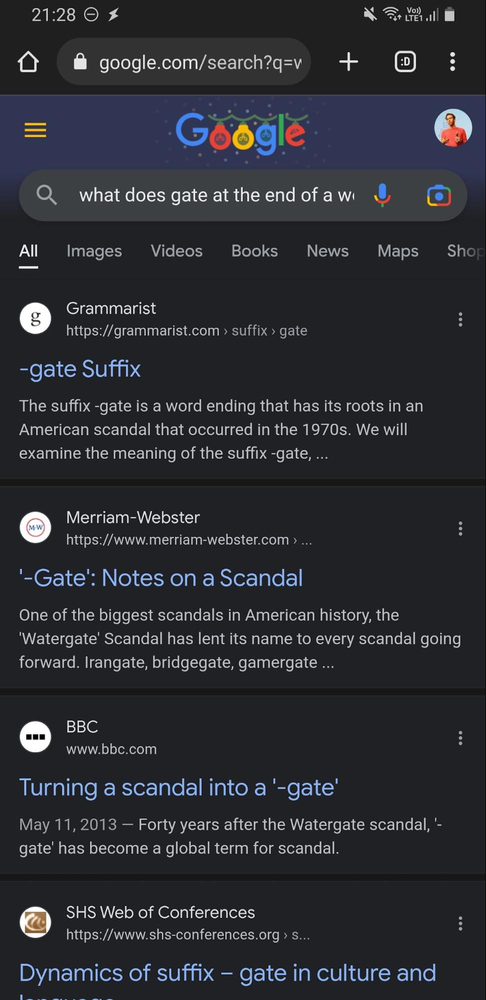
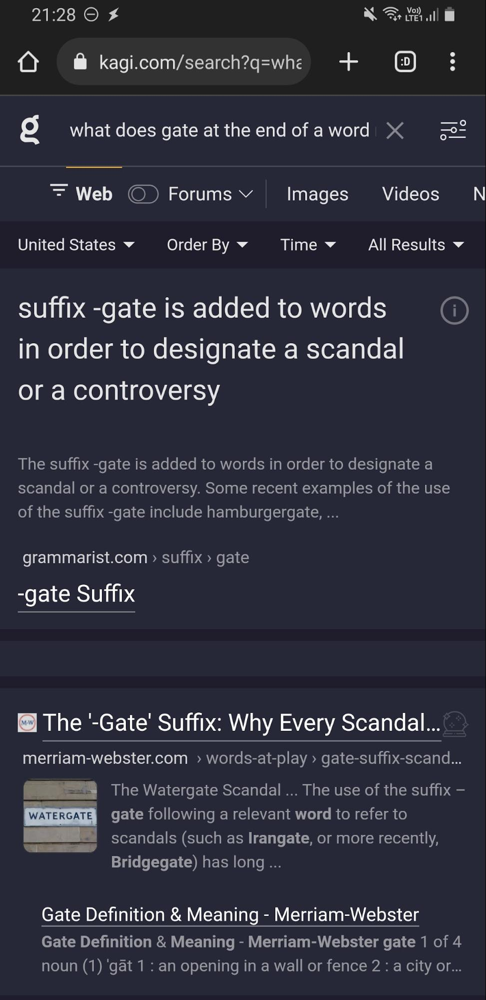
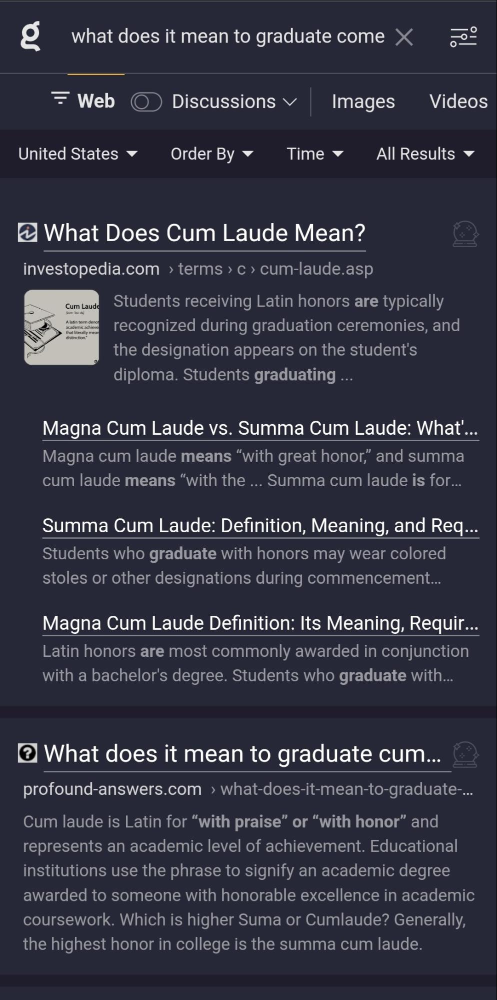
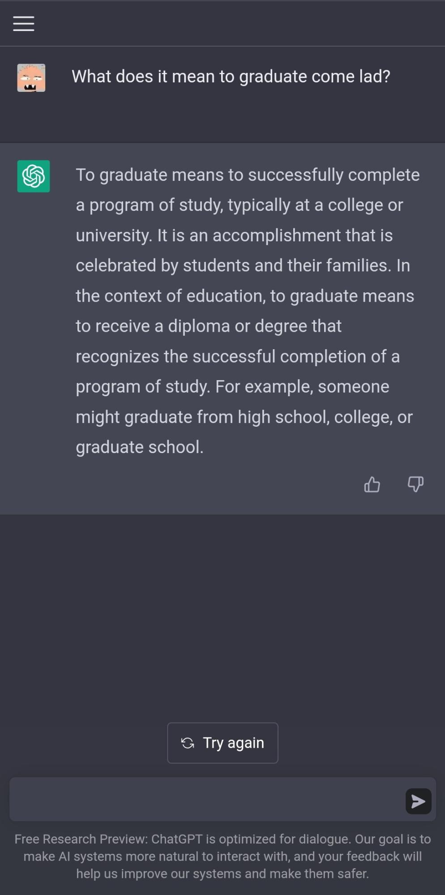
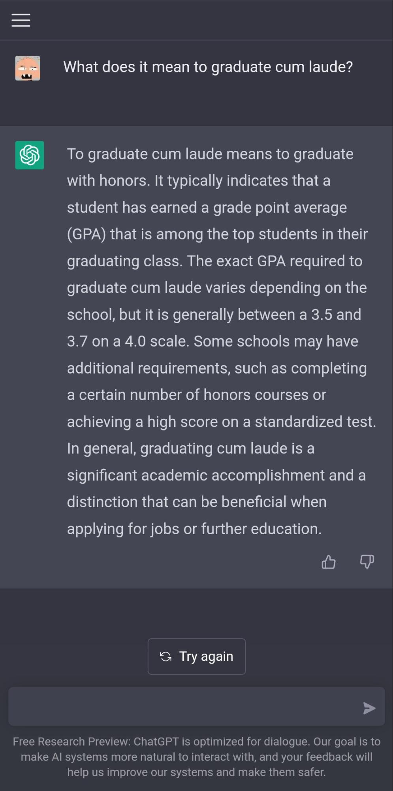
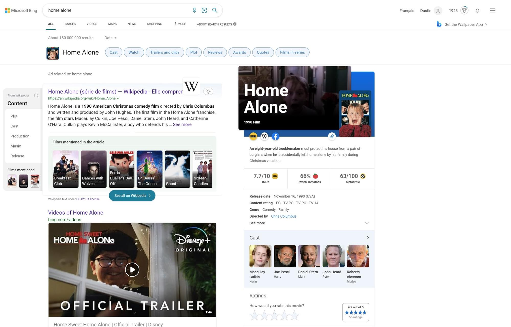
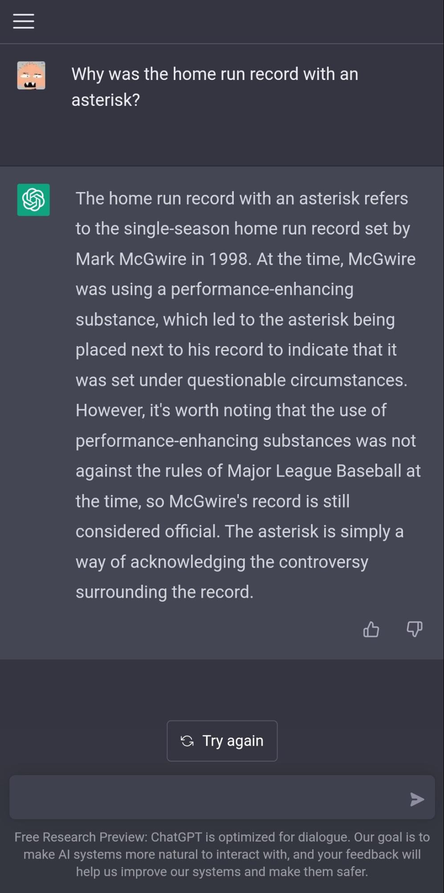
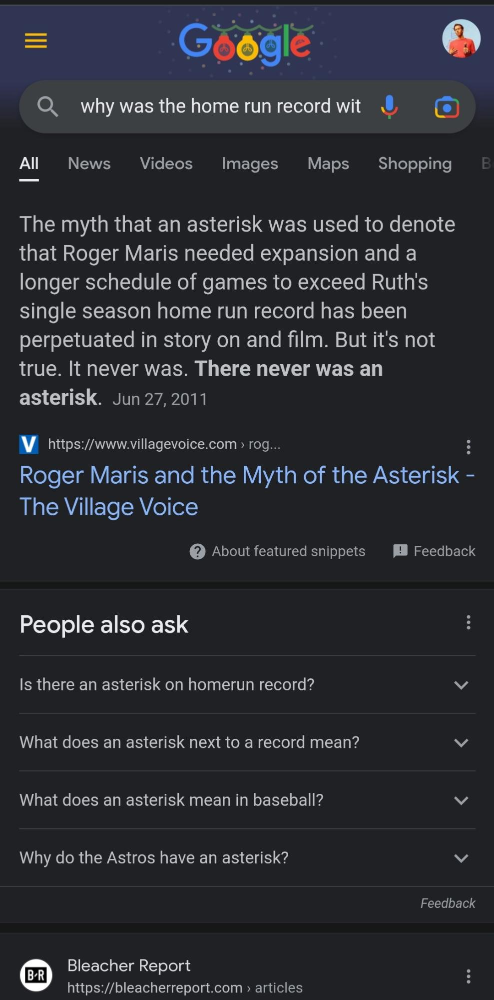
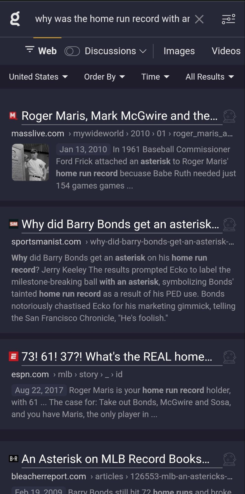
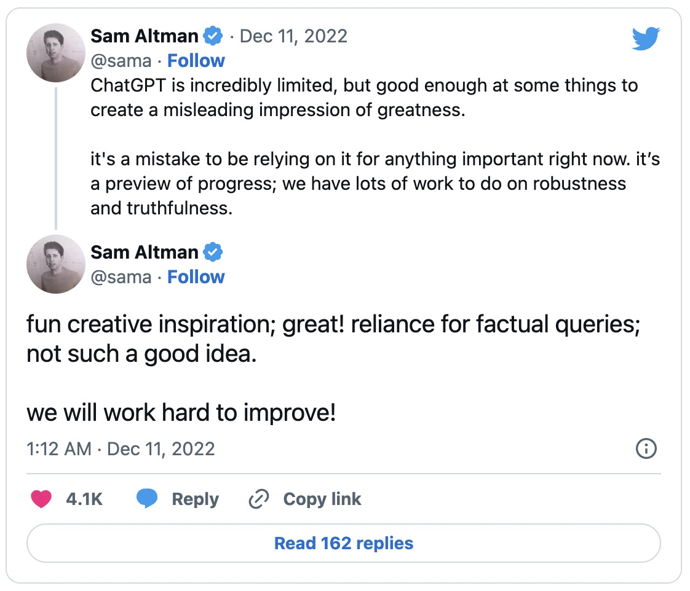

Since OpenAI announced ChatGPT and people started to try it out, there have been plenty of breathless proclamations of how it will upend _everything_. One of those upendings is search. Go on Twitter or LinkedIn (or [Bloomberg!](https://www.bloomberg.com/opinion/articles/2022-12-07/chatgpt-should-worry-google-and-alphabet-why-search-when-you-can-ask-ai)), and you can read how ChatGPT and similar LLMs are going to replace Google and other search engines.  

自从OpenAI宣布ChatGPT，人们开始尝试它，就有很多人喘着粗气宣称它将如何颠覆一切。其中一个颠覆就是搜索。在Twitter或LinkedIn（或Bloomberg！）上，你可以读到ChatGPT和类似的LLMs将如何取代谷歌和其他搜索引擎。

But, really?

No, Google has little to worry about, at least in the short– to mid–term. Search engines have been around for decades, and will be around for decades more.  

The lack of real danger to them has to do with search relevance and user experience in chat-based environments.  

不，谷歌没有什么可担心的，至少在短期和中期。搜索引擎已经存在了几十年，并将再存在几十年。他们缺乏真正的危险，这与搜索相关性和基于聊天环境的用户体验有关。

I’ve worked in search at [Algolia](https://algolia.com/) for seven years, the last four exclusively on natural language, voice, and conversational search.  

I’ve learned what works and what doesn’t, and while I’m long on LLMs (large language models), I’m not long on replacing the existing search paradigm. Here’s why.   

我在Algolia从事搜索工作已经七年了，过去四年专门从事自然语言、语音和对话搜索。我已经了解了什么是有效的，什么是无效的，虽然我很看好LLM（大型语言模型），但我并不看好取代现有的搜索范式。这就是原因。

**Query Formulation**

The first reason has to do, ironically, with query formulation. I say ironically here because much of the work around artificial intellence (AI) and machine learning (ML) in search is to make query formulation less of a hurdle. In the past, the most basic search engines matched text to the exact same text inside results. That means that if you searched for _JavaScript snippets_, then _JavaScript snippets_ had to be exactly in the document you wanted to find. The problem is that it forced the searcher to try and predict which text is going to be in the documents.  

具有讽刺意味的是，第一个原因与查询表述有关。我在这里说讽刺是因为围绕搜索中的人工智能（AI）和机器学习（ML）所做的大部分工作都是为了使查询的表述不再是一个障碍。在过去，最基本的搜索引擎将文本与结果中的相同文本相匹配。这意味着，如果你搜索JavaScript片段，那么JavaScript片段就必须准确地出现在你想找到的文件中。问题是，它迫使搜索者试图预测哪些文本将出现在文档中。

Here’s an example: let’s say you’re cleaning your gas stovetop and you realize that it’s warm, even though you haven’t used it in a while.  

With an unintelligent search engine, you need to ask yourself before you search: “Should I use the word _warm_ or _hot_? Does it make a difference in the results I’ll get back?”  

这里有一个例子：假设你正在清洁你的煤气灶，你意识到它是热的，尽管你已经有一段时间没有使用它了。对于一个不聪明的搜索引擎，你需要在搜索前问自己："我应该使用温暖还是热这个词？这对我得到的结果有区别吗？"

Intelligent, ML–driven search works to take this burden away by expanding what counts as a match and including “conceptually” similar matches, like _warm_ and _hot_. Searchers spend less mental energy on determining the right search term, and they are much more likely to find the information they wanted originally.  

智能的、ML驱动的搜索工作通过扩展什么是匹配，包括 "概念上 "相似的匹配，如温暖和热，来消除这种负担。搜索者在确定正确的搜索词上花费的心力更少，他们更有可能找到他们最初想要的信息。

ChatGPT responses are, however, heavily dependent on the prompt (i.e., query) formulation. [OpenAI](https://openai.com/blog/chatgpt/) “lists this as a limitation”:  

然而，ChatGPT的回应在很大程度上取决于提示（即查询）的表述。 OpenAI "将此列为一个限制"：

> _ChatGPT is sensitive to tweaks to the input phrasing or attempting the same prompt multiple times.  
> 
> For example, given one phrasing of a question, the model can claim to not know the answer, but given a slight rephrase, can answer correctly.  
> 
> ChatGPT对输入措辞的调整或多次尝试相同的提示很敏感。例如，给定一个问题的措辞，模型可以声称不知道答案，但给定一个轻微的重新措辞，可以正确回答。_

Sometimes this manifests when searching things the searcher already knows a lot about, but it’s much more of an issue when the searcher is hazy about details. If someone searches for what the suffix _\-gate_ means, there’s a very, very good chance that the correct result is about political scandals. Google and Kagi reflect this, ChatGPT does not:  

有时，当搜索者已经知道很多东西时，这就会表现出来，但当搜索者对细节模糊不清时，这就更成问题了。如果有人搜索后缀-gate是什么意思，很有可能正确的结果是关于政治丑闻。Google和Kagi反映了这一点，ChatGPT则没有：

(The end of ChatGPT’s response is saying that the use of the suffix -gate is rare. Tell that to Washington!)  

(ChatGPT的回复的结尾是说，后缀-门的使用是很罕见的。把这话告诉华盛顿吧！)

This is even more stark when it comes to typos. We all make typos, don’t we? And sometimes we spell words incorrectly because we don’t know any better. For example, the phrase _cum laude_ is an uncommon one in daily life, and so there will be people who want to know more about it and don’t know the correct spelling. How does ChatGPT handle a spelling of _come lad_ compared to Kagi?  

当涉及到错别字时，这一点就更加明显了。我们都会打错字，不是吗？而且有时我们拼错字是因为我们不知道有什么更好的办法。例如，Cum laude这个短语在日常生活中并不常见，因此会有一些人想了解它，却不知道正确的拼法。与Kagi相比，ChatGPT是如何处理come lad的拼写的？

This isn’t a case of ChatGPT not having the answer. It does when you use the correct spelling:  

这并不是ChatGPT没有答案的情况。当你使用正确的拼写时，它就有：

Search must understand searchers even with misspellings, or else the experience is a step back. Understanding and matching different spellings is difficult.  

At Algolia, we take two approaches: one is a [straightforward edit distance between text](https://www.algolia.com/doc/guides/managing-results/optimize-search-results/typo-tolerance/); the other is via our upcoming AI Search that matches on concepts and takes into account contextual clues to better match the correct spelling even when the edit distance is large.  

搜索必须理解搜索者，即使有拼写错误，否则体验就会退步。理解和匹配不同的拼写是很困难的。在Algolia，我们采取了两种方法：一种是文本之间的直接编辑距离；另一种是通过我们即将推出的人工智能搜索，根据概念进行匹配，并考虑到上下文线索，即使编辑距离很大，也能更好地匹配正确的拼写。

There’s another problem with ChatGPT, which is how it shows the incorrect results. Or, really, how it shows the results generally.  

ChatGPT还有一个问题，就是它如何显示不正确的结果。或者，真的，它是如何显示结果的。

## **User Experience**  

用户体验

Search layouts have been, typically, the same for decades. Specifically: a set of results in order from most to least relevant (however that is measured). That has changed somewhat in recent years.  

With search engines bringing in answer boxes, side boxes, suggested searches, multimedia searches, and more. Take a look at a Bing search page:  

几十年来，搜索布局通常都是一样的。具体而言：一组结果按从最相关到最不相关的顺序排列（无论如何衡量）。近年来，这种情况有了一定的改变。随着搜索引擎引入了答案框、边框、建议搜索、多媒体搜索等等。看一看Bing的搜索页面：

Of course, Bing is an outlier. This one search results page includes approximately 20 different components: streaming options, video results, image results, and webpage results. Maybe that’s too much.  

Google, Kagi, and others have less. But the point is that searchers _always get options_.  

当然，必应是一个异类。这一个搜索结果页面包括大约20个不同的组成部分：流媒体选项、视频结果、图像结果和网页结果。也许这太多了。谷歌、Kagi和其他公司的数量更少。但问题是，搜索者总是能得到选择。

It’s important for searchers to get options because the first result isn’t always the best for the search.  

It may be “objectively” the best overall, but a search is a combination of a query, an index, a user, and a context.  

All of those combined might lead results beyond number one to be the most relevant at that time. This blog post claims that the number one result on a Google search is [clicked 28% of the time](https://www.sistrix.com/blog/why-almost-everything-you-knew-about-google-ctr-is-no-longer-valid/). Whether that number is precisely right, it is generally correct: the majority of clicks tend not to be the first result.  

对搜索者来说，获得选择是很重要的，因为第一个结果并不总是搜索的最佳结果。它可能是 "客观上 "最好的整体，但搜索是一个查询、索引、用户和背景的组合。所有这些结合在一起，可能导致第一以外的结果在当时是最相关的。这篇博文声称，在谷歌搜索中，排名第一的结果有28%的时间被点击。无论这个数字是否准确，它总体上是正确的：大多数的点击往往不是第一条结果。

What is chat-based searching? Only the first result.  

什么是基于聊天的搜索？只有第一个结果。

Even more, it’s in a chat-based context. In a conversational interface, users expect always to get a response that is relevant, with a minimal amount of “I don’t know” responses.  

更有甚者，这是在一个基于聊天的环境中。在对话界面中，用户希望得到的总是相关的回应，而 "我不知道 "的回应最少。

At Algolia, I’ve seen this with some of our customers who have used our search as a fallback for their chatbots.  

Chatbot natural language understanding (NLU) can sometimes have a high failure rate (we’ve seen customers approaching 50% failure) and search seems like a natural fallback.  

We’ve had to tailor the chatbot UX, though, not presenting the first result as a response, but instead showing a few results and being clear that the user is seeing a fallback. It’s what users expect.  

在Algolia，我在我们的一些客户身上看到了这一点，他们将我们的搜索作为他们聊天机器人的后备手段。聊天机器人的自然语言理解（NLU）有时会有很高的失败率（我们看到客户的失败率接近50%），而搜索似乎是一个自然的退路。不过，我们不得不调整聊天机器人的用户体验，不把第一个结果作为回应，而是显示几个结果，并明确指出用户看到的是一个退路。这也是用户所期望的。

Chat also robs information of context.  

Landing on a page and seeing related information is good: it helps frame the information you find and perhaps even show you where the original snippet was incorrect or misleading.  

聊天也使信息失去了背景。登陆一个页面并看到相关的信息是好的：它有助于框定你找到的信息，甚至可能向你展示原始片段的不正确或误导。

Take someone who wants to know about the baseball home run record. This person has heard that the record used to have an asterisk. But why? What was the record?  

This famously refers to Roger Maris’ 61 home run season in 1961, but the searcher doesn’t know, and so searches _why was the home run record with an asterisk?_ Compare the answers from ChatGPT, Google, and Kagi:  

以一个想了解棒球全垒打记录的人为例。这个人听说这个记录曾经有一个星号。但为什么呢？该记录是什么？这是指罗杰-马里斯在1961年的61支全垒打赛季，但搜索者不知道，所以搜索为什么全垒打记录会有星号？比较ChatGPT、Google和Kagi的答案：

ChatGPT provides an answer about the home run record from ‘98 with Mark McGwire, which has been controversial years later, but isn’t _the_ home run record with an asterisk. Google gives the correct answer in an answer box along with links out to sources, and Kagi provides results.  

Of these, Kagi might even be the best because while Maris’ is the one that comes to mind when people say “astrisk,” both McGwire and Bonds also have controversy attached to theirs.  

ChatGPT提供了一个关于98年马克-麦奎尔的全垒打记录的答案，这个记录在多年后一直存在争议，但并不是带星号的全垒打记录。谷歌在一个答案框中给出了正确的答案，同时还提供了来源的链接，而Kagi则提供了结果。在这些答案中，Kagi甚至可能是最好的，因为当人们说到 "星号 "的时候，人们想到的是马里斯的星号，而麦奎尔和邦德的星号也都有争议性。

To be fair, OpenAI is aware of this. Here’s a tweet from CEO Sam Altman:  

公平地说，OpenAI已经意识到了这一点。这是首席执行官山姆-奥特曼的一条推文：

  

But I do think that the lack of context and multiple choices is inescapable within a pure chat context.  

That’s why chat is great for finding business hours; less great for learning what it’s like to go through boot camp or why people like RomComs.  

但我确实认为，在纯粹的聊天环境中，缺乏背景和多种选择是无法避免的。这就是为什么聊天很适合寻找营业时间；而对于了解参加新兵训练营是什么样子或者人们为什么喜欢罗曼蒂克来说就不那么好了。

This isn’t even touching on product search. A large amount of money spent on search these days is not on SEO for Google, but [building search for a site’s own product catalog](https://www.algolia.com/doc/guides/building-search-ui/what-is-instantsearch/js/). In these situations, it is _so_ important for searchers to be able to see options, filter down with a click, and generally get deep into a “discovery phase.” This is not what chat is suited for.  

这甚至还没有触及产品搜索。如今，在搜索上花费的大量资金不是用于谷歌的搜索引擎，而是用于建立网站自己的产品目录的搜索。在这些情况下，搜索者能够看到选项，通过点击进行筛选，并普遍深入到 "发现阶段 "是非常重要的。这不是聊天所适合的。

There are other hurdles: legal ([Australia has a law requiring payment from Google and Facebook for news](https://www.reuters.com/technology/australia-says-law-making-facebook-google-pay-news-has-worked-2022-12-02/); what will they think when the news is automatically summarized without sources?), cost, and speed immediately come to mind. These may one day be surmountable.  

So, too, might the overly confident incorrect results.  

还有其他障碍：法律（澳大利亚有一项法律要求谷歌和Facebook为新闻付费；当新闻被自动总结而没有来源时，他们会怎么想？）、成本和速度等问题立即浮现在脑海中。这些可能有一天会被克服。同样，过于自信的不正确的结果也可能会出现。

But user experience: this one isn’t going away. Okay, yes, you might argue that it’s easy enough to fix.  

A chat-based system could show multiple results at once and let the user decide which is the best. Maybe even rank them by confidence.  

Then it could even link out so that a searcher could see the information and decide if it’s accurate.  

Even better, why not also include suggestions for follow-up queries or multimedia that might be interesting?  

但是用户体验：这个问题是不会消失的。好吧，是的，你可能会说，这很容易解决。一个基于聊天的系统可以同时显示多个结果，让用户决定哪个是最好的。也许甚至可以按信心进行排名。然后它甚至可以链接出去，让搜索者看到信息并决定它是否准确。更好的是，为什么不包括后续查询的建议或可能感兴趣的多媒体？

Congratulations, you’ve just rebuilt a search UI.  

恭喜你，你刚刚重建了一个搜索用户界面。

So, in short: LLMs are great. Understanding user intent is fantastic. Automatic summarization is powerful. Search is going nowhere.  

因此，简而言之：法律硕士是伟大的。了解用户的意图是非常好的。自动总结是强大的。搜索将无处可去。
