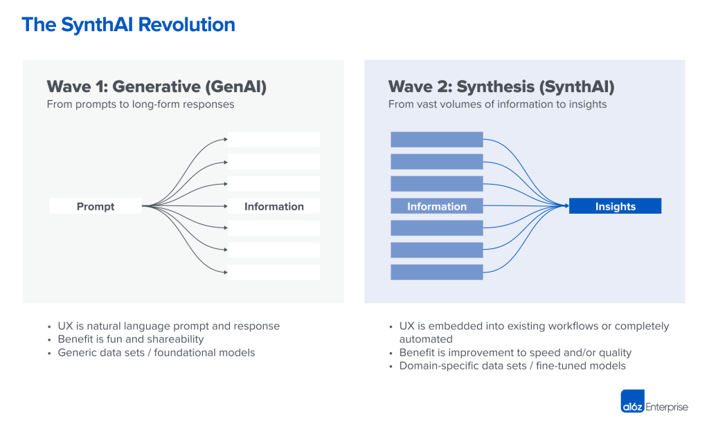
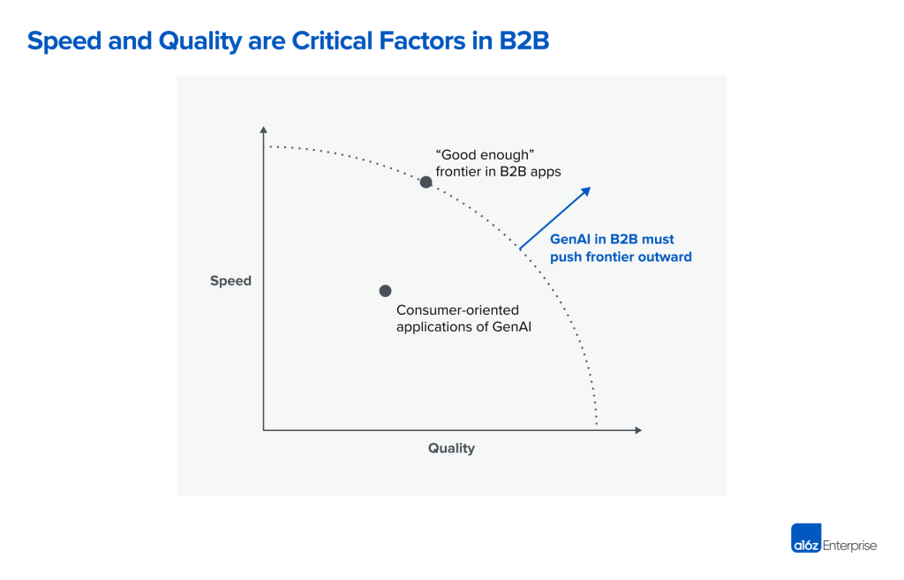
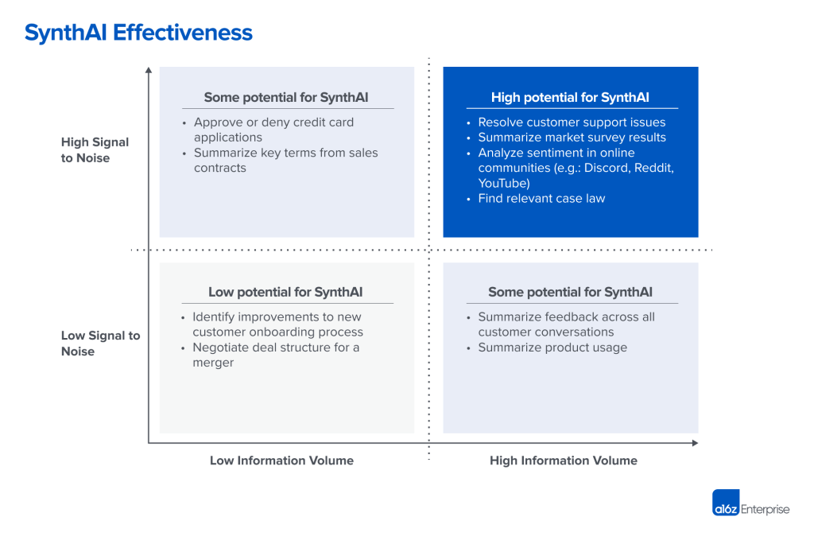
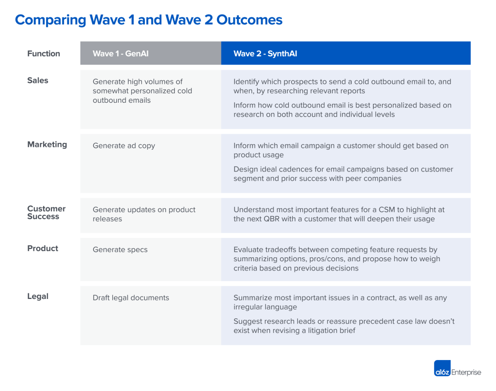

We’ve watched large language models (LLMs) become mainstream over the past few years and have studied the implementations in the context of B2B applications.  

Despite some enormous technological advances and the presence of LLMs in the general zeitgeist, we believe we’re still only in the first wave of generative AI applications for B2B use cases.  

As companies nail down use cases and seek to build moats around their products, we expect a shift in approach and objectives from the current “Wave 1”  to a more focused “Wave 2.”  

在过去的几年里，我们看到大型语言模型（LLMs）成为主流，并研究了在B2B应用背景下的实施情况。尽管取得了一些巨大的技术进步，而且大型语言模型出现在普遍的时代潮流中，但我们相信我们仍然只是处于B2B用例的生成性人工智能应用的第一波。随着公司确定用例并寻求围绕其产品建立护城河，我们预计方法和目标将从目前的 "第一波 "转移到更集中的 "第二波"。

Here’s what we mean: To date, generative AI applications have overwhelmingly focused on the _divergence_ of information. That is, they create new content based on a set of instructions. **In Wave 2, we believe we will see more applications of AI to** **_converge_** **information.** That is, they will show us _less_ content by _synthesizing_ the information available. Aptly, we refer to Wave 2 as **synthesis AI** (“SynthAI”) to contrast with Wave 1. While Wave 1 has created some value at the application layer, we believe Wave 2 will bring a step function change.  

下面是我们的意思：到目前为止，生成性人工智能应用绝大多数都集中在信息的分歧上。也就是说，他们根据一组指令来创造新的内容。在浪潮2中，我们相信我们将看到更多的人工智能应用于汇聚信息。也就是说，他们将通过综合现有的信息向我们展示更少的内容。恰当地说，我们把浪潮2称为合成人工智能（"SynthAI"），以与浪潮1形成对比。虽然浪潮1在应用层创造了一些价值，但我们相信浪潮2将带来一步的功能变化。

Ultimately, as we explain below, the battle among B2B solutions will be less focused on dazzling AI capabilities, and more focused on how these capabilities will help companies own (or redefine) valuable enterprise workflows.  

最终，正如我们在下面解释的那样，B2B解决方案之间的斗争将不太关注令人眼花缭乱的人工智能能力，而更关注这些能力将如何帮助企业拥有（或重新定义）有价值的企业工作流程。

## Wave 1: Crossing the bridge from consumer to enterprise  

第一波：跨越从消费者到企业的桥梁

To analyze Wave 1, it’s helpful to first draw the distinction between B2C and B2B applications. When we use generative AI as consumers, our objectives are oriented toward _having fun_ and _having something to share_. In this world, quality or correctness are not high priorities: It’s fun to have an AI model generate art or music you can share in a Discord channel, before you quickly forget about it.  

We also have a psychological tendency to believe more = productive = good, and so we are drawn to automated creation.  

The rise of ChatGPT is a great example of this: we tolerate the shortcomings in quality because [having something longer to share is more impressive](https://aisnakeoil.substack.com/p/chatgpt-is-a-bullshit-generator-but).  

为了分析浪潮1，首先区分B2C和B2B应用是很有帮助的。当我们作为消费者使用生成性人工智能时，我们的目标是以享受乐趣和有东西可以分享为导向。在这个世界上，质量和正确性并不是最重要的：让人工智能模型产生艺术或音乐是很有趣的，你可以在Discord频道中分享，然后很快就会忘记它。我们也有一种心理倾向，认为更多=生产性=好，所以我们被吸引到自动创造。ChatGPT的兴起就是一个很好的例子：我们容忍了质量上的缺陷，因为有更长的东西可以分享，更令人印象深刻。

When it comes to B2B applications, the objectives are different. Primarily, there is a cost-benefit assessment around _time_ and _quality_. You either want to be able to generate _better_ quality with the _same_ amount of time, or generate the _same_ quality but _faster_. This is where the initial translation from B2C to B2B has broken down.   

当涉及到B2B应用时，其目标是不同的。主要是围绕时间和质量的成本效益评估。你要么希望能够用同样的时间产生更好的质量，要么希望产生同样的质量但更快。这就是从B2C到B2B的最初翻译发生故障的地方。

We use B2B applications in workplace settings, where quality matters. However, the content generated by AI today is passable largely for repetitive and low-stakes work.  

For example, generative AI is good for writing short copy for ads or product descriptions; we have seen many B2B applications demonstrate impressive growth in this area.  

But we’ve subsequently seen that generative AI is less reliable for writing opinions or arguments (even when AI-generated content is compelling or confident, it’s often inaccurate), which are more valuable when it comes to innovation and collaboration in a B2B setting.  

A model might be able to generate usable SEO spam, but a blog post announcing a new product for software developers, for example, would require a fair amount of human refinement to ensure it’s accurate and that the message will resonate with the target audience.   

我们在工作环境中使用B2B应用程序，在那里质量很重要。然而，今天由人工智能生成的内容在很大程度上对于重复性和低风险的工作是合格的。例如，生成式人工智能对于撰写广告或产品描述的短文来说是很好的；我们看到许多B2B应用在这一领域表现出令人印象深刻的增长。但我们随后看到，生成性人工智能在撰写意见或论据方面不太可靠（即使人工智能生成的内容令人信服或有信心，它也往往不准确），当涉及到B2B环境中的创新和合作时，这一点更有价值。一个模型可能能够生成可用的SEO垃圾信息，但例如，宣布为软件开发人员提供新产品的博文，则需要相当多的人工完善，以确保它是准确的，信息将与目标受众产生共鸣。

Another increasingly common example of this is for writing outbound sales emails. Generative AI is useful for a generic, cold outbound email, but less reliable for accurate personalization.  

From the perspective of a good sales rep, generative AI may help write more emails in less time, but to write emails that increase response rates and ultimately lead to booked meetings (which is what a rep is evaluated on), the rep still needs to do research and use their judgment about what that prospect wants to hear.  

另一个越来越常见的例子是用于编写外发销售电子邮件。生成式人工智能对于一般的、冷冰冰的外发邮件是有用的，但对于准确的个性化来说就不太可靠了。从一个好的销售代表的角度来看，生成性人工智能可能有助于在更短的时间内写出更多的电子邮件，但要写出能提高响应率并最终导致预订会议的电子邮件（这也是对销售代表的评价），销售代表仍然需要做研究，并利用他们的判断，了解潜在客户想听什么。

In essence, Wave 1 has been successful for more-substantive writing in the brainstorming and drafting stages, but, ultimately, the more creativity and domain expertise are required, the more human refinement is required.  

从本质上讲，在头脑风暴和起草阶段，浪潮1对于更实质性的写作是成功的，但是，最终，越是需要创造力和领域的专业知识，越是需要人为的完善。

## What’s the cost (or benefit) of disrupting the workflow?  

打乱工作流程的代价（或好处）是什么？

Even in cases where generative AI is useful for longer blog posts, the prompt must be precise and prescriptive.  

That is, before the AI can express them in long form, the authors must already have a clear understanding of the concepts that represent the substance of the blog post.  

Then, to get to an acceptable end result, the author must review the output, iterate on the prompts, and potentially re-write entire sections.  

即使在生成性人工智能对长篇博文有用的情况下，提示也必须是精确和规定性的。也就是说，在人工智能能够以长篇形式表达出来之前，作者必须已经对代表博文实质的概念有了清晰的认识。然后，为了达到一个可接受的最终结果，作者必须审查输出结果，迭代提示，并有可能重写整个章节。

An extreme example here is using ChatGPT to generate legal documents.  

While it’s possible to do so, the prompt requires a human who is familiar with the law to provide all the required clauses, which ChatGPT can then use to generate a draft of the longer-form document.  

Consider the analogy of going from term sheets to closing docs.  

An AI can’t perform the negotiation process between the principal parties, but once all the key terms are set, generative AI could write a preliminary draft of the longer closing docs.  

Still, a trained lawyer needs to review and edit the outputs to get the docs to a final state that the parties can sign.   

这里的一个极端例子是用ChatGPT来生成法律文件。虽然可以这样做，但提示需要熟悉法律的人提供所有需要的条款，然后ChatGPT可以使用这些条款来生成较长格式的文件草案。考虑一下从条款表到成交文件的比喻。人工智能不能执行主要当事方之间的谈判过程，但一旦所有的关键条款都确定下来，生成性人工智能就可以写出一份较长的成交文件的初稿。不过，训练有素的律师仍然需要审查和编辑输出，以使文件达到各方可以签署的最终状态。

This is why the cost-benefit assessment breaks down in the B2B context.  

As knowledge workers, we are evaluating whether it’s worth our time to add an additional AI-powered step to our workflows, or if we should just do it ourselves. **Today, with Wave 1 applications, the answer is frequently that we’re better off doing it ourselves.**   

这就是为什么成本效益评估在B2B背景下被打破。作为知识工作者，我们正在评估在我们的工作流程中增加一个额外的人工智能驱动的步骤是否值得我们花时间，或者我们是否应该自己做。今天，通过第一波应用，答案往往是我们最好自己做。

## Wave 2: Converging information for improved decision making  

第2波：汇聚信息，改善决策

As we move into the next wave of generative AI applications, we expect to see a shift in focus from the generation of information to the synthesis of information.  

In knowledge work, there is huge value in decision-making.  

Employees are paid to make decisions based on imperfect information, and not necessarily the quantity of content generated to execute or explain these decisions.  

In many cases, longer is not better, it’s just longer.  

随着我们进入下一波生成性人工智能的应用，我们期望看到焦点从信息的生成转向信息的综合。在知识工作中，决策有巨大的价值。员工的报酬是根据不完善的信息做出决定，而不一定是为执行或解释这些决定而产生的内容的数量。在许多情况下，更长的时间并不是更好，只是更长而已。

Many axioms support this: lines of code written is not a good measure of engineering productivity; longer product specs do not necessarily provide more clarity on what needs to be built; and longer slide decks don’t always provide more insights.   

许多公理都支持这一点：编写的代码行数并不是衡量工程生产力的好方法；较长的产品规格不一定能更清楚地说明需要建立什么；而较长的幻灯片也不一定能提供更多的见解。

Barry McCardel, CEO and co-founder of [Hex](https://hex.tech/), believes in human-computer symbiosis and highlights how LLMs can improve the way we work:   

Hex公司首席执行官兼联合创始人Barry McCardel相信人机共生，并强调法律硕士可以改善我们的工作方式：

> _“AI is here to augment and improve humans, not replace them. When it comes to understanding the world and making decisions, you want humans in the loop.  
> 
> What AI can do is help us apply more of our brainwaves to valuable, creative work, so that we not only spend more hours in a day on the work that matters, but also free ourselves to do our best work.”  
> 
> "人工智能在这里是为了增强和改善人类，而不是取代他们。当涉及到理解世界和做决定时，你希望人类参与其中。人工智能能做的是帮助我们将更多的脑电波应用于有价值的、创造性的工作，这样我们不仅能在一天中花更多的时间来做重要的工作，而且还能解放自己，做我们最好的工作。"_

How can AI improve human decision-making? **We believe LLMs will need to focus on synthesis and analysis —** **_SynthAI_** **— that improves the quality and/or speed of decision-making** (remember our B2B diagram above), if not make the actual decision itself.  

The most obvious application here is to summarize high volumes of information that humans could never digest themselves directly.   

人工智能如何改善人类的决策？我们相信LLMs将需要专注于综合和分析--SynthAI--提高决策的质量和/或速度（记得我们上面的B2B图），如果不是做出实际的决策本身。这里最明显的应用是总结人类自己无法直接消化的大量信息。

The real value of SynthAI in the future will be in helping humans make better decisions, faster. We are envisioning almost the opposite of the ChatGPT user interface: **Instead of writing long-form responses based on a concise prompt, what if we could reverse engineer from massive amounts of data the concise prompt that summarizes it?** We think there’s an opportunity to rethink the UX as one that conveys large amounts of information as efficiently as possible. For example, an AI-powered knowledge base like [Mem](https://get.mem.ai/) that holds notes from every meeting in an organization could proactively suggest relevant decisions, projects, or people that someone should reference as they begin a new project, saving them hours (even days) of navigating prior institutional knowledge.   

SynthAI在未来的真正价值在于帮助人类更快地做出更好的决定。我们的设想几乎与ChatGPT的用户界面相反：与其根据简明的提示写出长篇大论的回答，不如从海量的数据中逆向设计出简明的提示来总结它，这样会怎么样？我们认为有机会重新思考用户体验，使其尽可能有效地传达大量的信息。例如，像Mem这样由人工智能驱动的知识库，保存着一个组织的每一次会议的笔记，可以主动建议相关的决定、项目或人，当某人开始一个新的项目时，他们应该参考这些决定、项目或人，从而节省他们几个小时（甚至几天）的浏览之前的机构知识。

Returning to our outbound sales email example, one potential manifestation is for AI to identify when a target account is at its highest level of intent (based on news reports, earnings calls, talent migration, etc.) and alert the relevant sales rep.  

The AI model would then, based on the synthesized research, suggest the one or two most important issues to mention in the email, along with the product features most relevant to that target account.  

Ironically, these inputs could then be fed into a Wave 1 solution, but the value comes from the synthesis phase and saving a sales rep potentially hours of research into just a single prospect.  

回到我们的外发销售电子邮件的例子，一个潜在的表现是，人工智能可以识别目标客户何时处于其最高水平的意图（基于新闻报道、收益电话、人才迁移等），并提醒相关的销售代表。然后，人工智能模型将根据综合研究，建议在电子邮件中提及一两个最重要的问题，以及与该目标客户最相关的产品功能。具有讽刺意味的是，这些输入可以被输入到第一波解决方案中，但其价值来自于综合阶段，并为销售代表节省了对一个潜在客户的潜在研究时间。

**A fundamental shift in ensuring this synthesis is sufficiently high quality will be a movement away from large-scale, generic models**, to architectures that leverage multiple models, including more fine-tuned models trained on domain- and use-case-specific data sets.  

For example, a company building a customer-support application may primarily use a support-centric model that has access to the company’s historical support tickets, but then fall back to GPT for corner cases.  

To the extent that the fine-tuned models and data sets are proprietary, there’s an opportunity for these components to be moats in the delivery of speed and quality.  

要确保这种合成有足够高的质量，一个根本的转变是要从大规模的通用模型转向利用多种模型的架构，包括在特定领域和特定用途的数据集上训练的更精细的模型。例如，一个建立客户支持应用的公司可能主要使用一个以支持为中心的模型，该模型可以访问公司的历史支持票据，但在角落的情况下又会回到GPT。如果微调的模型和数据集是专有的，那么这些组件就有机会成为提供速度和质量的护城河。

## Implementing SynthAI  

实施SynthAI

As we think through what Wave 2 might look like, we believe the use cases that will benefit most from synthesis AI will be when there is both:  

在我们思考浪潮2可能是什么样子的时候，我们相信从综合人工智能中获益最大的用例将是两者都有的时候：

-   A high volume of information, such that it’s not pragmatic for a human to manually sift through all the information.  
    
    大量的信息，以至于人类手动筛选所有的信息是不切实际的。
-   A high signal-to-noise ratio, such that the themes or insights are obvious and consistent. In the name of accuracy, you don’t want to task an AI model with deciphering nuance.   
    
    一个高的信噪比，这样的主题或见解是明显和一致的。以准确性的名义，你不想让人工智能模型负责破译细微差别。

In the diagram below, we categorize examples of common analysis and synthesis by these dimensions to help bring this to life.  

在下图中，我们按照这些维度对常见的分析和综合的例子进行分类，以帮助将其带入生活。

This helps us think about the types of outcomes Wave 2 applications will deliver, and how they’ll differ from Wave 1 outcomes.  

Below, we try to offer some examples to bring the comparisons to life, but they are by no means meant to be comprehensive.  

这有助于我们思考第二波应用程序将提供的结果类型，以及它们与第一波的结果有何不同。下面，我们试图提供一些例子，以使比较变得生动，但这并不意味着它们是全面的。

## A battle to own the workflow  

一场拥有工作流程的战斗

Naturally, there is a race between existing systems of record and workflow solutions trying to embed AI-augmented capabilities, and new solutions that are AI-native.  

We want to be clear what they are racing toward: **the prize is not about who can build the AI synthesis capability; rather, it’s who can own the workflow.** For existing solutions, vendors are racing to entrench their existing workflows by improving them with AI.  

For challengers, vendors will use a best-in-class AI implementation as a wedge and seek to expand from there to redefine the workflow.  

自然，在试图嵌入人工智能增强能力的现有记录系统和工作流程解决方案与人工智能原生的新解决方案之间存在着一场竞赛。我们想清楚他们的竞赛目标：奖项不是关于谁能建立人工智能综合能力；而是谁能拥有工作流程。对于现有的解决方案，供应商正在竞赛，通过用人工智能改进他们现有的工作流程来巩固其地位。对于挑战者来说，供应商将使用一流的人工智能实施作为楔子，并寻求从那里扩展到重新定义工作流程。

On the product feedback use case, [Sprig](https://sprig.com/) has always used AI to analyze open-text responses and voice responses, and to summarize them into themes.  

Sprig founder and CEO Ryan Glasgow is excited about the potential for LLMs to improve their synthesis solution:   

在产品反馈用例上，Sprig一直使用人工智能来分析开放式文本回复和语音回复，并将其总结为主题。Sprig创始人兼首席执行官Ryan Glasgow对LLMs改进其综合解决方案的潜力感到兴奋：

> _“With LLMs, we can save our customers even more time than before.  
> 
> With our prior models, we had a human-in-the-loop review process before customers could see the themes; now, we’re comfortable presenting the themes right away, and doing the review process afterward.  
> 
> Additionally, we’re now able to add a descriptor to each theme to provide more specificity, which makes the insights more actionable.  
> 
> "有了LLM，我们可以为客户节省比以前更多的时间。在我们以前的模型中，在客户看到主题之前，我们有一个人工审查过程；现在，我们可以立即呈现主题，并在之后进行审查过程。此外，我们现在能够为每个主题添加描述符，以提供更具体的内容，这使得洞察力更具有可操作性。_
> 
> _“In the future, we think there’s an opportunity to allow the user to ask follow-up questions if they want to dig further into a theme.  
> 
> At the end of the day, it’s about delivering the end-to-end workflow — from gathering data quickly to understanding it quickly — to help make decisions in real time.”  
> 
> "在未来，我们认为有机会让用户提出后续问题，如果他们想进一步挖掘一个主题。在一天结束时，它是关于提供端到端的工作流程--从快速收集数据到快速理解数据--以帮助实时作出决定。"_

At the same time, we’re already seeing new startups exclusively focused on using AI to summarize user feedback, by integrating with existing platforms that are collecting the raw feedback.  

与此同时，我们已经看到新的初创公司专门致力于使用人工智能来总结用户反馈，通过与收集原始反馈的现有平台进行整合。

On the outbound sales use case, [ZoomInfo](https://www.zoominfo.com/) recently [announced](https://www.businesswire.com/news/home/20230216005530/en/ZoomInfo-Will-Integrate-GPT-into-Its-Go-to-Market-Platform) that they are integrating GPT into their platform and shared a [demo video](https://www.youtube.com/watch?v=_C94CaEZ1Ag). Certain parts of the video are not far off from the Wave 2 examples we described.  

Similarly, we’re already seeing new startups exclusively focused on trying to automate as much of the outbound sales process as possible with an AI-first approach.  

关于对外销售的用例，ZoomInfo最近宣布他们正在将GPT整合到他们的平台上，并分享了一个演示视频。该视频的某些部分与我们描述的第二波案例相差无几。同样，我们已经看到新的创业公司专门致力于尝试以人工智能为先的方式尽可能多地将对外销售过程自动化。

The potential for how AI may change the way we work is endless, but we are still in the early innings.  

Generative AI in B2B applications needs to evolve beyond creating more content, to synthesis AI that enables us to do our work better and faster.  

In B2B applications, it’s a constant dance around who can own the workflow, and AI-native applications will make this dance ever more interesting to watch.  

人工智能如何改变我们的工作方式的潜力是无穷的，但我们仍然处于早期阶段。在B2B应用中的生成性人工智能需要超越创造更多的内容，发展到综合人工智能，使我们能够更好、更快地完成工作。在B2B应用中，这是一场围绕谁能拥有工作流程的持续舞蹈，而AI原生应用将使这种舞蹈变得更加有趣。

_We love meeting startups on both sides of the dance. If you’re building in this area, feel free to reach out to zyang at a16z dot com and kristina at a16z dot com.  

我们喜欢与舞蹈两边的初创公司会面。如果你在这个领域进行建设，请随时联系zyang at a16z dot com和kristina at a16z dot com。_

\* \* \*

_The views expressed here are those of the individual AH Capital Management, L.L.C. (“a16z”) personnel quoted and are not the views of a16z or its affiliates.  

Certain information contained in here has been obtained from third-party sources, including from portfolio companies of funds managed by a16z.  

While taken from sources believed to be reliable, a16z has not independently verified such information and makes no representations about the enduring accuracy of the information or its appropriateness for a given situation.  

In addition, this content may include third-party advertisements; a16z has not reviewed such advertisements and does not endorse any advertising content contained therein.  

这里所表达的观点是AH Capital Management, L.L.C.（"a16z"）人员个人的观点，而不是a16z或其关联公司的观点。这里包含的某些信息是从第三方来源获得的，包括来自a16z管理的基金的投资组合公司。虽然取自被认为是可靠的来源，但a16z并没有独立核实这些信息，也不对信息的持久准确性或其对特定情况的适当性做出任何陈述。此外，这些内容可能包括第三方广告；a16z没有审查这些广告，也不认可其中的任何广告内容。_

_This content is provided for informational purposes only, and should not be relied upon as legal, business, investment, or tax advice. You should consult your own advisers as to those matters.  

References to any securities or digital assets are for illustrative purposes only, and do not constitute an investment recommendation or offer to provide investment advisory services.  

Furthermore, this content is not directed at nor intended for use by any investors or prospective investors, and may not under any circumstances be relied upon when making a decision to invest in any fund managed by a16z. (An offering to invest in an a16z fund will be made only by the private placement memorandum, subscription agreement, and other relevant documentation of any such fund and should be read in their entirety.) Any investments or portfolio companies mentioned, referred to, or described are not representative of all investments in vehicles managed by a16z, and there can be no assurance that the investments will be profitable or that other investments made in the future will have similar characteristics or results.  

A list of investments made by funds managed by Andreessen Horowitz (excluding investments for which the issuer has not provided permission for a16z to disclose publicly as well as unannounced investments in publicly traded digital assets) is available at https://a16z.com/investments/.  

本内容仅用于提供信息，不应作为法律、商业、投资或税务建议来依赖。你应该就这些问题咨询你自己的顾问。对任何证券或数字资产的提及仅用于说明目的，并不构成投资建议或提供投资咨询服务的提议。此外，这些内容不针对也不打算供任何投资者或潜在投资者使用，在任何情况下，在作出投资于a16z管理的任何基金的决定时，不得依赖这些内容。 (投资于A16Z基金的要约将仅由任何此类基金的私募备忘录、认购协议和其他相关文件作出，并应阅读其全部内容）。所提到、提及或描述的任何投资或投资组合公司并不代表a16z管理的所有投资，而且不能保证这些投资将是有利可图的，也不能保证未来进行的其他投资将有类似的特点或结果。Andreessen Horowitz管理的基金所做的投资清单（不包括发行人未允许a16z公开披露的投资以及未公布的公开交易的数字资产投资）可在https://a16z.com/investments/。_

_Charts and graphs provided within are for informational purposes solely and should not be relied upon when making any investment decision. Past performance is not indicative of future results.  

The content speaks only as of the date indicated.  

Any projections, estimates, forecasts, targets, prospects, and/or opinions expressed in these materials are subject to change without notice and may differ or be contrary to opinions expressed by others.  

Please see https://a16z.com/disclosures for additional important information.  

其中提供的图表仅用于提供信息，在做出任何投资决定时不应依赖这些图表。过去的业绩并不代表未来的结果。这些内容只代表截至所示日期的情况。这些材料中表达的任何预测、估计、预报、目标、前景和/或意见都可能在没有通知的情况下发生变化，并可能与其他人表达的意见不同或相反。其他重要信息请见https://a16z.com/disclosures。_
