## Exploring the unique challenges of making changes within an open-source, volunteer-led environment. Plus: the importance of prototyping.  

探讨在一个开源的、由志愿者领导的环境中做出改变的独特挑战。另外：原型设计的重要性。

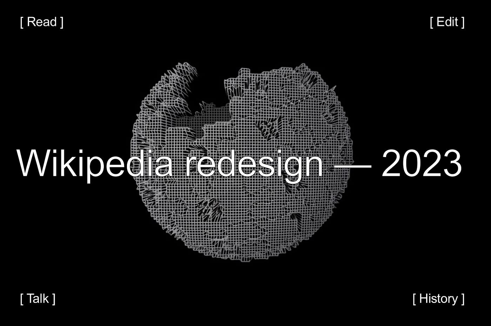

Hey, I’m Alex Hollender. For the past 5 years I’ve worked as a UX designer on the [Readers Web team](https://www.mediawiki.org/wiki/Reading/Web) at the [Wikimedia Foundation](https://wikimediafoundation.org/). Each designer at the foundation is part of a product team, and focuses on a different experience/platform (for example: there’s an [Apps team](https://www.mediawiki.org/wiki/Wikimedia_Apps/Team) that works on the iOS and Android apps, an [Editing team](https://www.mediawiki.org/wiki/Editing_team) that works on editing tools, a [Language team](https://www.mediawiki.org/wiki/Wikimedia_Language_engineering) that works on language support & translation tools, and several others).  

嘿，我是Alex Hollender。在过去的5年里，我在维基媒体基金会的读者网络团队担任用户体验设计师。基金会的每个设计师都是一个产品团队的一部分，专注于不同的体验/平台（例如：有一个负责iOS和Android应用的Apps团队，一个负责编辑工具的编辑团队，一个负责语言支持和翻译工具的语言团队，以及其他几个团队）。  

The Readers Web team is responsible for the reading experience on the web, and for maintaining the entire mobile website (which is actually separate from the desktop site).  

读者网团队负责网络上的阅读体验，并负责维护整个移动网站（实际上与桌面网站是分开的）。  

In 2019 we began to work on a series of improvements to the desktop website, which launched this past January. Below are my notes on the project and process.  

2019年，我们开始着手对桌面网站进行一系列改进，并在今年1月推出。以下是我对该项目和过程的记录。

## 2004–2019  

2004-2019

We have to go back in time a little to properly frame this story. Back to 2004, which was the last time Wikipedia’s interface changed significantly.  

我们必须回溯一下时间，才能正确地构建这个故事。回到2004年，那是维基百科的界面最后一次发生重大变化。  

Mark Zuckerberg had just launched TheFacebook, Gmail had just come out, and there were no smartphones (the first iPhone would come out 3 years later).  

当时马克-扎克伯格刚刚推出了Facebook，Gmail也刚刚问世，而且还没有智能手机（第一部iPhone将在3年后问世）。  

Also CSS was much more limited, so websites were more simple. Two popular computers were Dell’s _Dimension 2400 desktop_, and their _Latitude D505 laptop_. For almost everyone using it, Wikipedia looked like this:  

此外，CSS也更加有限，所以网站更加简单。两台流行的电脑是戴尔的Dimension 2400台式机和他们的Latitude D505笔记本电脑。对于几乎所有使用它的人来说，维基百科看起来是这样的：

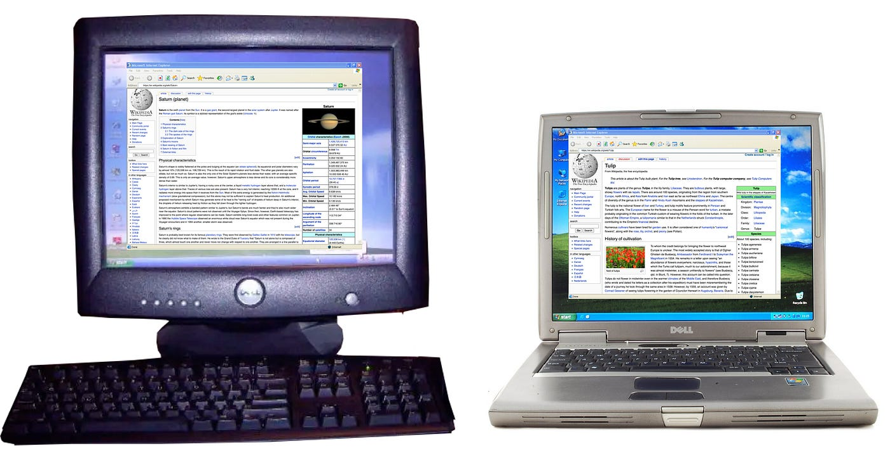

Wikipedia in 2014  

维基百科在2014年

In 2010, a bunch of changes were made to increase the usability of Wikipedia for new editors ([notes](https://usability.wikimedia.org/wiki/Wikipedia_Usability_Initiative)), and in 2015 the editing experience was again significantly improved with the introduction of the [Visual Editor](https://www.mediawiki.org/wiki/VisualEditor). However, the general layout, and specifically the reading experience, stayed largely the same between the 2004 update, and 2019, where this story begins.  

2010年，为了提高维基百科对新编辑的可用性，做了一些改变（注），2015年，随着可视化编辑器的引入，编辑体验再次得到显著改善。然而，总体布局，特别是阅读体验，从2004年的更新到2019年，即这个故事的开始，基本上保持不变。

Wikipedia from 2004–2019  

维基百科从2004-2019年

However computers changed a lot between 2004 and 2019. Namely, screens got a lot smaller, and a lot larger.  

然而计算机在2004年和2019年之间发生了很大的变化。也就是说，屏幕变小了很多，也变大了很多。  

And while our team had built a mobile site to accommodate smaller screens, we hadn’t really done anything to improve the website for the growing desktop and laptop screens:  

虽然我们的团队已经建立了一个移动网站，以适应较小的屏幕，但我们并没有真正做任何事情来改善网站，以适应日益增长的台式机和笔记本电脑屏幕：

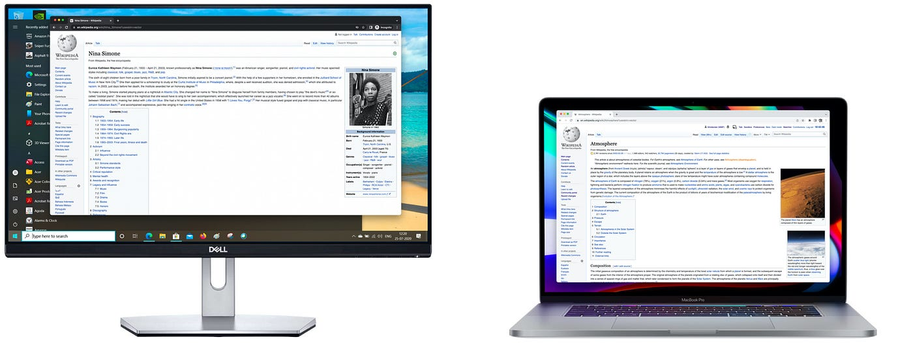

Wikipedia on larger screens in 2019  

2019年维基百科在大屏幕上的应用

In other words, Wikipedia — a major, legacy website (top 10 ranked, for 10+ years) — had an interface that hadn’t been changed for 15 years.  

换句话说，维基百科--一个主要的、传统的网站（排名前10位，有10多年的历史）--有一个15年没有改变过的界面。  

And then one day the Chief Product Officer came to our team (1 product manager, ~6 engineers, 1 quality assurance person, ½ a scrum master, ½ a data analyst, ½ a community liaison, and myself), and tasked us with making significant improvements.  

然后有一天，首席产品官来到我们的团队（1个产品经理，~6个工程师，1个质量保证人员，1/2个scrum master，1/2个数据分析师，1/2个社区联络员，还有我自己），责成我们做出重大改进。  

It might honestly be a once-in-the-history-of-the-internet kind of situation. Exciting, but rather difficult.  

老实说，这可能是互联网历史上的一次情况。令人激动，但相当困难。

There wasn’t one specific reason why, in 2019, this all came about (though there is arguably one person who got the ball rolling — sup Nirzar).  

没有一个具体的原因，在2019年，这一切都发生了（尽管可以说有一个人让球滚动 - 超尼尔扎尔）。  

Instead there were a variety of reasons: the line length had no limit, the search box was small and in an unfamiliar place, the table of contents was only available at the top of the page, language switching was hidden, the hierarchy and organization of elements was confusing to some, the front-end was brittle, it was becoming difficult to find places for new features, etc.  

相反，有各种各样的原因：行的长度没有限制，搜索框很小，而且在一个不熟悉的地方，目录只在页面的顶部，语言切换是隐藏的，元素的层次和组织对一些人来说是混乱的，前端是脆的，为新功能找到地方变得很困难，等等。  

But perhaps above all was the fact that we had been neglecting the interface (due to other priorities, and limited resources), and we felt confident that if we gave it some overdue attention we could make it better for both reader and editors.  

但也许最重要的是，我们一直忽视了界面（由于其他优先事项和有限的资源），我们感到有信心，如果我们给它一些逾期的关注，我们可以使它对读者和编辑都更好。

Meanwhile, between 2004 and 2019, the Wikipedia volunteer community had been busy making localized improvements to specific versions of Wikipedia.  

与此同时，在2004年至2019年期间，维基百科志愿者社区一直忙于对维基百科的特定版本进行本地化改进。  

This is possible because Wikipedia is a democratically run, open-source website, with an interface (and back-end) that can be changed by anyone. And change it they do.  

这是可能的，因为维基百科是一个民主运作的开源网站，它的界面（和后端）可以被任何人改变。而他们也确实在改变它。  

But while these changes were real improvements, the majority of them were geared towards logged-in editors. Also the improvements had not been centralized, so they weren’t available on most Wikipedias.  

但是，虽然这些变化是真正的改进，但它们中的大多数是针对登录的编辑的。此外，这些改进也没有被集中起来，所以它们在大多数维基百科上都无法使用。

A slight tangent: unbeknownst to many people, the many versions of Wikipedia are not centralized. The Wikipedia you read (whether it’s [English](https://en.wikipedia.org/wiki/Billie_Holiday), [Bangla](https://bn.wikipedia.org/wiki/%E0%A6%A8%E0%A7%87%E0%A6%AA%E0%A6%9A%E0%A7%81%E0%A6%A8_%E0%A6%97%E0%A7%8D%E0%A6%B0%E0%A6%B9), [Telugu](https://te.wikipedia.org/wiki/%E0%B0%95%E0%B1%8D%E0%B0%B0%E0%B0%BF%E0%B0%95%E0%B1%86%E0%B0%9F%E0%B1%8D), [Kyrgyz](https://ky.wikipedia.org/wiki/%D0%9A%D0%B8%D1%88%D0%B8), [Korean](https://ko.wikipedia.org/wiki/%EB%B8%8C%EB%A6%AC%ED%8A%B8%EB%8B%88_%EC%8A%A4%ED%94%BC%EC%96%B4%EC%8A%A4), [Persian](https://fa.wikipedia.org/wiki/%D8%AA%D9%87%E2%80%8C%D8%AF%DB%8C%DA%AF), or any of the [300 others](https://meta.wikimedia.org/wiki/List_of_Wikipedias#All_Wikipedias_ordered_by_number_of_articles)), is actually a separate website from all of the other Wikipedias that exist. Sure they share a lot of code, use the same servers, and generally have the same interface.  

一个小插曲：很多人都不知道，维基百科的许多版本都不是集中的。你所阅读的维基百科（无论是英语、孟加拉语、泰卢固语、吉尔吉斯语、韩语、波斯语，还是其他300个版本中的任何一个），实际上是一个独立的网站，与其他所有存在的维基百科不同。当然，他们共享大量的代码，使用相同的服务器，并且通常有相同的界面。  

But changes volunteers make to the interface (and the content too, of course) are made locally.  

但志愿者对界面（当然还有内容）的修改是在本地进行的。  

This meant that the improvement Korean Wikipedia made to have a collapsible sidebar didn’t carry over to English Wikipedia (or anywhere else), the changes Hebrew Wikipedia made to have a sticky header didn’t carry over to Burmese Wikipedia, and on and on.  

这意味着韩国维基百科对可折叠侧边栏的改进并没有延续到英语维基百科（或其他地方），希伯来语维基百科对粘性标题的修改也没有延续到缅甸维基百科，等等。

Sometimes the lack of centralization makes sense: for example, the language variant switcher on Serbian and Chinese aren’t needed on other Wikipedias.  

有时，缺乏集中化是有意义的：例如，塞尔维亚语和汉语的语言变体切换器在其他维基百科上并不需要。  

But overall, the lack of centralization meant that a bunch of good interface changes between 2004 and 2019 were localized to smaller Wikipedias, and the majority of Wikipedia readers were not benefitting from them.  

但总的来说，缺乏集中化意味着2004年至2019年期间，一堆好的界面变化被本地化到较小的维基百科，而大多数维基百科读者并没有从中受益。  

Like anything else, there are pros and cons to decentralization.  

像其他任何事情一样，权力下放也有利弊。

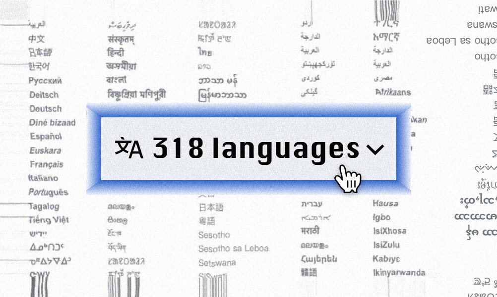

There are over 300 individual instances of Wikipedia  

维基百科上有300多个单独的实例

Before we go any further let’s pause and think about the situation our team was in.  

在我们进一步讨论之前，让我们暂停一下，思考一下我们的团队所处的情况。  

The general layout for readers hadn’t changed much since 2004, but the interface (or interfaces) had changed in hundreds of little, decentralized ways, spread across 300 different language versions of Wikipedia, that were each democratically controlled by their own community of volunteers.  

自2004年以来，读者的总体布局没有什么变化，但界面（或接口）却发生了数百种小的、分散的变化，分布在300个不同语言版本的维基百科上，每个版本都由自己的志愿者社区民主地控制。  

And we, a team of ~12 people, wanted to make a bunch of centralized changes to it.  

而我们，一个由12人组成的团队，想对它进行一堆集中的修改。  

Also we didn’t (and still don’t) have comprehensive and detailed analytics for the interface, so we didn’t have much data about how people were using it.  

另外，我们没有（现在也没有）对界面进行全面详细的分析，所以我们没有很多关于人们如何使用它的数据。  

Neither did/do we have the ability to easily run A/B tests with logged-out people.  

我们也没有/没有能力轻松地对已登录的人进行A/B测试。  

The sheer task of learning about all of the different local modifications of Wikipedias across various languages was daunting.  

要了解各种语言的维基百科的所有不同的地方性修改，这个任务非常艰巨。  

Let alone deeply engaging with thousands of volunteers spread across these communities to learn more about their workflows, and why they had made certain modifications.  

更不用说与分布在这些社区的数千名志愿者深入接触，了解他们的工作流程，以及他们为什么要做某些修改。  

While ultimately being beholden to the democratic system, within which we had to represent the needs of the billions of readers who were/are inconveniently absent from the whole conversation.  

虽然最终要对民主制度负责，但在这个制度中，我们必须代表数十亿读者的需求，而这些读者在整个对话中不便缺席。  

But we had unlimited credits on usertesting.com, so that was something.  

但我们在usertesting.com上有无限的信用额度，所以那是一些东西。

## Getting started

Olga, the product manager, and I started by articulating a few goals (which are interconnected and overlapping, as most sets of goals are):  

产品经理奥尔加和我首先阐明了几个目标（这些目标是相互联系和重叠的，就像大多数目标集一样）：

-   Make the website familiar & welcoming to anyone who visits (thinking especially about younger people, in other parts of the world, who have not yet discovered Wikipedia)  
    
    让所有访问的人都熟悉并欢迎他们（特别是考虑到世界其他地区的年轻人，他们还没有发现维基百科）。
-   Improve the experience of reading, navigating long articles, and knowledge discovery  
    
    改善阅读、浏览长篇文章和知识发现的体验
-   Better accommodate divergent needs (reading vs. editing)  
    
    更好地适应不同的需求（阅读与编辑）。
-   Develop a more flexible interface, with an eye towards future features  
    
    开发一个更灵活的界面，并着眼于未来的功能

Olga also picked key metrics to monitor: pageviews, edit rates, account creation, and session length.  

奥尔加还挑选了需要监测的关键指标：页面浏览量、编辑率、账户创建和会话长度。

With a mix of intuition, interviews, research, team meetings, looking at all of the stuff volunteers had modified (including [proposals that never got built](https://winter.toolforge.org/), and cool [Wikipedia plugins](https://github.com/Krasjet/wikipedia.rehash)), and reading tarot cards, we started to establish a sense of priorities for the interface:  

通过混合直觉、访谈、研究、团队会议、查看志愿者修改过的所有东西（包括从未建成的提案和很酷的维基百科插件），以及阅读塔罗牌，我们开始为界面建立一种优先感：

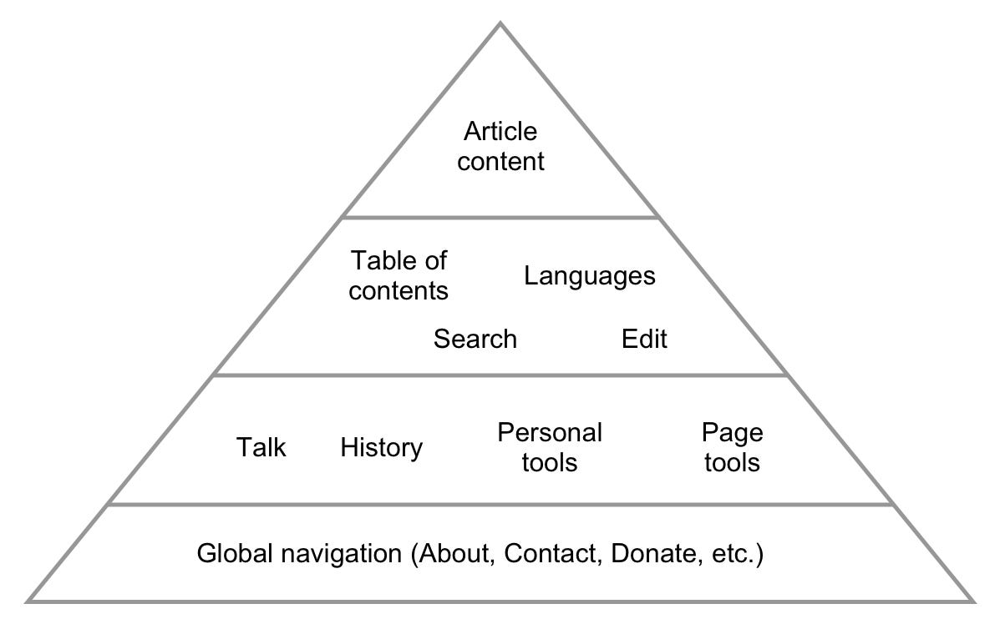

Hierarchy of needs / interface priorities  

需求层次/接口优先级

Over the years the interface had become geared more and more towards the needs of editors. In some ways this made sense.  

多年来，界面已经越来越多地面向编辑的需要。在某些方面，这是有道理的。  

Editors are the most critical part of the Wikipedia ecosystem; without them there would be no encyclopedia. At the same time over 99% of people using the website don’t edit.  

编辑是维基百科生态系统中最关键的部分；没有他们，就没有百科全书。同时，超过99%的使用该网站的人并没有编辑。  

Balancing the divergent needs of readers and editors is difficult, especially given that we wanted to maintain a path for readers to become editors.  

平衡读者和编辑的不同需求是很困难的，特别是考虑到我们想保持一条读者成为编辑的道路。  

The sidebar menu, which sat to the left of the content, is a good example of this tension. For editors it contains critical tools, some of which they use multiple times in a given session.  

坐在内容左边的侧边栏菜单是这种紧张关系的一个很好的例子。对于编辑来说，它包含了关键的工具，其中一些工具他们在一个特定的会议中会多次使用。  

For readers it was clutter; a menu of links that they very rarely interacted with ([data](https://nbviewer.org/github/wikimedia-research/Desktop-behavior-analysis-Aug-2019/blob/master/Desktop_usage_behavior_analysis.ipynb#Sidebar-links)). And yet, some of the links might serve as paths to “behind the scenes” parts of Wikipedia; little trails into the fray that the curious few might follow to learn more about how Wikipedia works.  

对读者来说，这是一个杂乱无章的菜单；一个他们很少与之互动的链接（数据）。然而，其中一些链接可能是通往维基百科 "幕后 "部分的路径；少数好奇者可能会跟随这些小径来了解维基百科的运作。

We could make those links less prominent for readers, allowing them to more easily focus on the content.  

我们可以让这些链接对读者来说不那么突出，让他们更容易专注于内容。  

But what if, as a result, those curious few were no longer able to find their way behind the scenes (and eventually become editors)?  

但是，如果因此那些好奇的少数人不再能够找到他们的幕后途径（并最终成为编辑）呢？  

Our perspective on that was: organizing and minimizing the clutter allows us to accentuate things in a more intentional manner.  

我们对此的看法是：整理和尽量减少杂乱无章的东西，使我们能够以一种更有意的方式突出东西。  

It’s better to provide people with a few clear pathways behind the scenes (like the Talk, Edit, and History links), rather than having a scattershot approach, which might catch a random curious person here or there.  

最好是在幕后为人们提供一些明确的途径（如谈话、编辑和历史链接），而不是采用分散的方式，这样可能会在这里或那里随机抓住一个好奇的人。  

I started to use these two images as a metaphor for the different needs we were trying to support:  

我开始用这两张图片来比喻我们试图支持的不同需求：

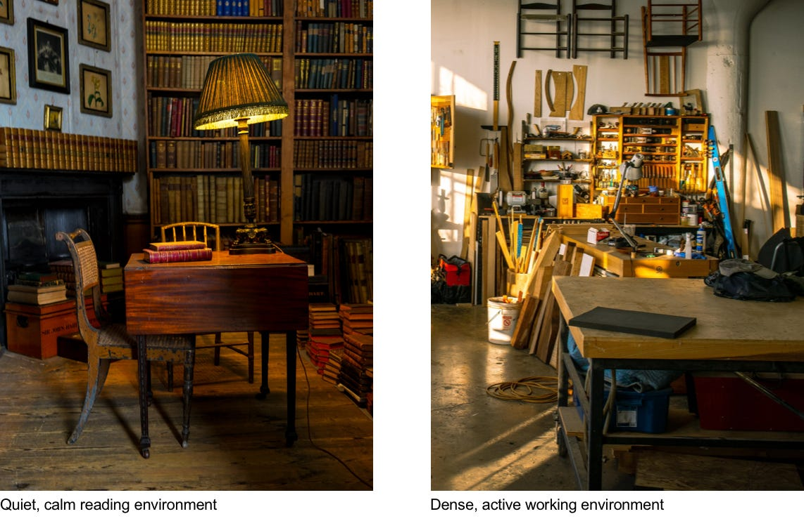

Photos by [Nicola Nuttall](https://unsplash.com/@nicnut) (left), [Devin Berko](https://unsplash.com/@devinnn_b) (right)  

照片：尼古拉-纳托尔（左），德文-贝科（右）。

Many details of the design work from that point onwards honestly aren’t very interesting or unique.  

说实话，从那时起，许多设计工作的细节并不十分有趣或独特。  

Mockups, best practices & accessibility guidelines, prototypes, design reviews, user testing, and the like.  

模拟、最佳实践与可及性指南、原型、设计审查、用户测试等等。  

Month by month we plodded along, with the help of all of the volunteers (thanks TheDJ, Theklan, Sdkb, and so many others).  

在所有志愿者的帮助下（感谢TheDJ、Theklan、Sdkb和其他许多人），我们每月都在艰难地前进。  

I spent a lot of time looking at all of the different language-versions of Wikipedia, reaching out to specific communities, and figuring out how to design things in a way that conflicted as little as possible with their local modifications.  

我花了很多时间研究维基百科的所有不同语言版本，接触特定的社区，并找出如何设计东西，使其与当地的修改尽可能少地发生冲突。

The rough pyramid/prioritization of needs guided the placement of the main elements, and grounded all future explorations. The result was more or less this:  

粗略的金字塔/需求优先排序指导了主要元素的位置，并为所有未来的探索奠定了基础。结果或多或少是这样的：

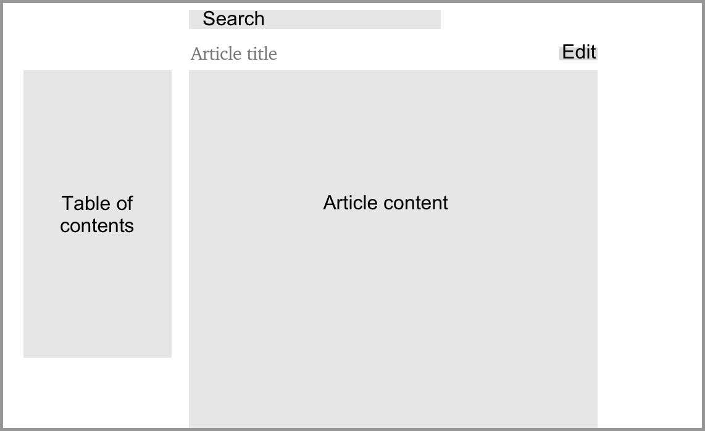

The sequence of what we worked on was:  

我们工作的顺序是：

-   Limiting the line-length, making the sidebar collapsible, and reformatting the logo/site header  
    
    限制行长，使侧边栏可折叠，并重新设置标识/网站标题的格式。
-   Moving and improving search  
    
    移动和改进搜索
-   Moving the language switcher  
    
    移动语言切换器
-   Reformatting the personal tools (i.e. _Your account_)  
    
    重新格式化个人工具（即你的账户）。
-   Introducing a sticky header (logged-in only, currently)  
    
    引入一个粘性标题（目前只限于登录）。
-   Moving and improving the table of contents  
    
    移动和改进目录
-   Moving the page tools menu  
    
    移动页面工具菜单
-   Reformatting the global navigation menu  
    
    重新设置全局导航菜单的格式

There were, however, a few unique aspects to the design process, which more or less reflect the unique constraints that we deal with as an organization and movement more broadly.  

然而，设计过程中有几个独特的方面，这或多或少反映了我们作为一个组织和更广泛的运动所处理的独特限制。

## Unique challenges

## Prototype everything in code  

在代码中对一切进行原型化

How do you get to a good design? Some people have the luxury of starting with a semi-good design, releasing it (in some limited way), then using real data and feedback to refine it.  

你怎样才能达到一个好的设计？有些人可以从一个半好的设计开始，发布它（以某种有限的方式），然后使用真实的数据和反馈来完善它。  

Since we don’t have that luxury (both in terms of infrastructure, and engineering resources), the process of getting to a good design needs to happen much more up-front, before releasing anything.  

由于我们没有这种奢侈的条件（在基础设施和工程资源方面），在发布任何东西之前，获得一个好的设计的过程需要在前期进行得更多。  

This ends up putting emphasis on how effectively you communicate designs, and communicate about designs.  

这最终将重点放在你如何有效地沟通设计，以及关于设计的沟通。  

You need to have many high quality, inclusive conversations about the designs before you build anything. And remember, in our case, inclusive of volunteers/stakeholders across many languages.  

在你建造任何东西之前，你需要对设计进行许多高质量的、包容性的对话。请记住，在我们的案例中，包括了许多语言的志愿者/利益相关者。  

So then the question becomes: how do you most effectively communicate designs, to facilitate the best discussions about those designs?  

因此，问题就变成了：你如何最有效地沟通设计，以促进对这些设计的最佳讨论？  

My answer is: lots of little prototypes built with HTML, CSS, and JavaScript.  

我的答案是：很多用HTML、CSS和JavaScript构建的小原型。  

Because the things I was designing were interactive (scrolling, clicking, typing, etc.), needed to be available in many languages, and relied significantly on dynamic data (e.g.  

因为我设计的东西是互动的（滚动、点击、打字等），需要有多种语言版本，并且严重依赖动态数据（如  

each article is different and has a different table of contents, each search query returns different results, etc.), the best way I found to effectively evaluate and communicate such designs, that lead to clear, concrete conversations about them, was through prototypes.  

每篇文章都是不同的，有不同的目录，每个搜索查询都会返回不同的结果，等等），我发现有效评估和交流这种设计的最好方法是通过原型，这导致了关于它们的清晰、具体的对话。

When the project started I built a [base prototype](https://alexhollender.info/vector-2022.web.app) ([code](https://github.com/alexhollender/wikipedia-prototype)), which was the Wikipedia interface hooked up to a few APIs so I could load any article (with its table of contents), in any language, as well as use the search box and get live search suggestions.  

当项目开始时，我建立了一个基本的原型（代码），这是维基百科的界面，与一些API挂钩，所以我可以加载任何语言的任何文章（及其目录），以及使用搜索框和获得实时搜索建议。  

I then added the ability to switch the interface itself (all of the buttons, links, etc.) to various languages.  

然后我增加了将界面本身（所有的按钮、链接等）切换为各种语言的能力。  

For each feature/design decision I would build a new prototype on top of that base, exploring the question(s) at hand.  

对于每个功能/设计决定，我都会在这个基础上建立一个新的原型，探索手头的问题。  

The prototypes often included a little settings panel in the bottom corner that allowed you to toggle between the various options being explored.  

原型通常包括一个位于底角的小设置面板，允许你在正在探索的各种选项之间进行切换。  

Here is a relatively simple one that explores various ways of indicating the active section in the table of contents ([link](https://di-visual-design-toc-active.web.app/Okapi)):  

这里有一个相对简单的，探讨了在目录中指示活动部分的各种方法（链接）：

Prototype with various options for styling the active section in the table of contents ([link](https://di-visual-design-toc-active.web.app/Silver))  

带有各种选项的原型，用于设计目录中的活动部分（链接）。

Coming out on the other side of this project, I strongly believe that fully interactive prototypes (versus mockups, or even a click-through prototypes), communicate designs significantly more clearly, and facilitate higher quality discussions and feedback.  

从这个项目的另一面看，我坚信完全交互式的原型（相对于模型，甚至是点击式的原型），可以更清楚地传达设计，并促进更高质量的讨论和反馈。

## Visual design

If you look at [past versions](https://www.mediawiki.org/wiki/Reading/Web/Desktop_Improvements/Repository/A_History_of_Wiki_Skins) of the Wikipedia interface, you’ll notice that each version has a personality of sorts. A unique color, border style, subtle background image, tab style, or other such eccentricities.  

如果你看一下过去版本的维基百科界面，你会发现每个版本都有某种个性。一种独特的颜色、边框风格、微妙的背景图片、标签风格，或其他类似的古怪之处。  

At first I felt a bit of a pressure to keep with this tradition, and come up with a new personality.  

起初，我感到有点压力，要保持这种传统，想出一种新的个性。  

But the more Kieran, Roy, Angy, and myself played around with borders, buttons, gradients, icons, typography, and other things, the more we questioned the function/utility of these stylistic changes, and the more we felt the need to ground our explorations in some logic.  

但是，基兰、罗伊、安吉和我越是玩弄边框、按钮、渐变、图标、排版和其他东西，我们就越是质疑这些风格变化的功能/效用，我们就越是觉得需要将我们的探索建立在一些逻辑之上。

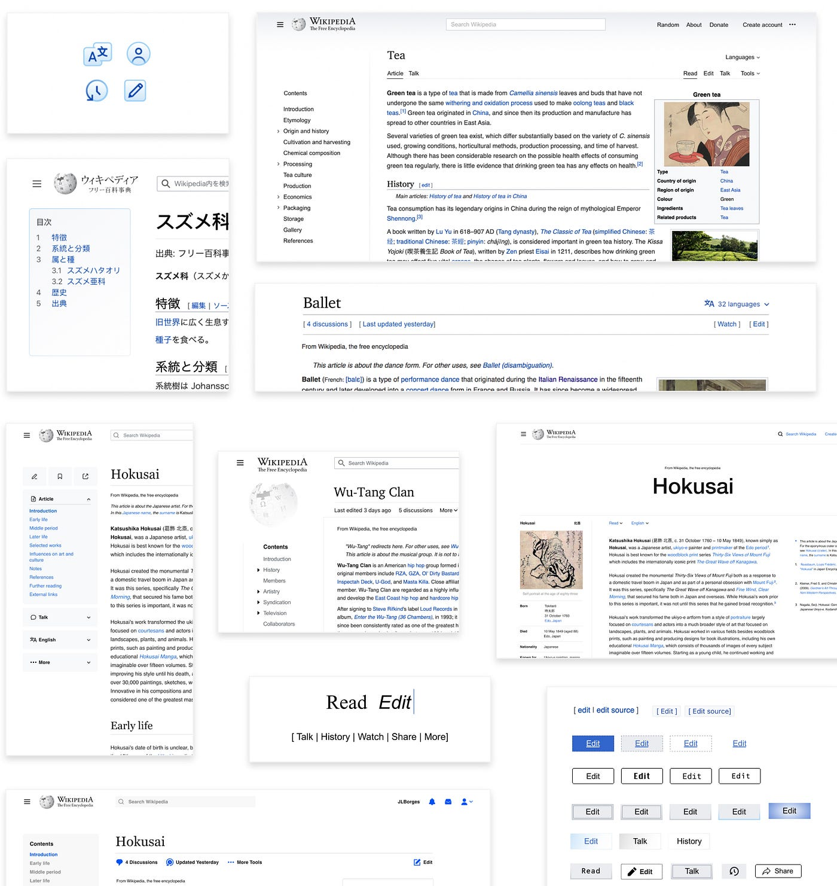

Various visual design explorations, with help from [Numbers](http://www.by-numbers.com/)  

在数字的帮助下，进行各种视觉设计探索

Visual design can be used to evoke a feeling, or communicate a conceptual idea.  

视觉设计可以用来唤起一种感觉，或传达一个概念性的想法。  

But given that the interpretation of the design is personal/subjective, how do you communicate the idea of free, collaborative knowledge to a global audience, across a wide age range?  

但是，鉴于对设计的解释是个人/主观的，你如何将自由、合作的知识理念传达给全球的观众，跨越广泛的年龄范围？  

Visual design can also be used to signify a specific brand, however for Wikipedia this signal is already established via the content itself (infoboxes, blue links, etc.).  

视觉设计也可以用来标志一个特定的品牌，然而对于维基百科来说，这种信号已经通过内容本身（信息框、蓝色链接等）建立起来。  

So rather than trying to evoke a feeling, or reinforce the brand, we fell back to focusing on functionality.  

因此，我们没有试图唤起一种感觉，或加强品牌，而是回到了对功能的关注。  

We looked at past versions of the website through this perspective, and found that visual design _was_ being used functionally, to help separate different parts of the interface: article, menu, user tools, etc. (see related [WCAG design pattern](https://www.w3.org/WAI/WCAG2/supplemental/patterns/o2p03-page-structure/)) . Looking at our redesigned interface, we felt that the spatial hierarchy and positioning of elements was already doing most of the heavy lifting to create these separations:  

我们从这个角度看过去的网站版本，发现视觉设计在功能上被使用，以帮助分离界面的不同部分：文章、菜单、用户工具等（见相关的WCAG设计模式）。看看我们重新设计的界面，我们觉得元素的空间层次和定位已经为创造这些分离做了大部分的工作：

Relying on whitespace to separate interface regions  

依靠留白来分隔界面区域

We brought this thinking, as well as a [prototype](https://di-visual-design-borders-bgs.web.app/Zebra) with various options for separating the parts of the interface, to the community.  

我们把这种想法，以及一个有各种分离界面部分的选择的原型带到了社区。  

Some people felt that the reading experience, as well as the general comprehension of the interface, would benefit from more clear visual separation between the various regions.  

一些人认为，阅读体验以及对界面的一般理解，将受益于各个区域之间更清晰的视觉分隔。  

We have not yet reached a conclusion about this, but there’s a great discussion you can read through, and participate in, [here](https://phabricator.wikimedia.org/T259240).  

我们还没有就此得出结论，但你可以在这里读到一个很好的讨论，并参与其中。

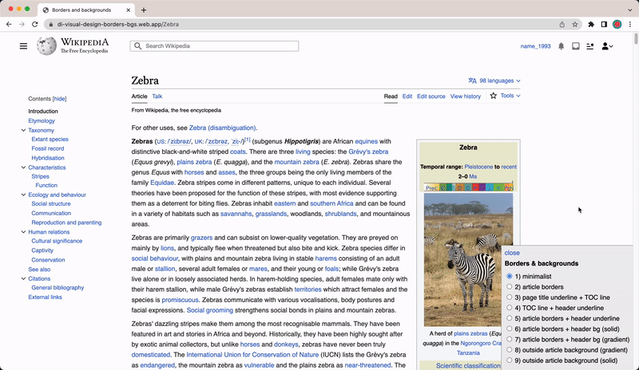

Prototype with various options for separating interface regions ([link](https://di-visual-design-borders-bgs.web.app/Zebra))  

有各种分离界面区域的选项的原型 ( 链接 )

## Wikipedia articles are often very long  

维基百科的文章通常非常长

The length of Wikipedia articles makes the table of contents a particularly important part of the reading experience.  

维基百科文章的长度使得目录成为阅读体验中特别重要的一部分。  

It allows readers to get an overview of the content and structure of the article, it helps them locate what they are looking for, and (because it now dynamically tracks your position within the article) it serves as a map that helps you maintain a sense of where you are and where you have been.  

它让读者对文章的内容和结构有一个概览，帮助他们找到他们要找的东西，而且（因为它现在动态地跟踪你在文章中的位置），它作为一个地图，帮助你保持对你在哪里和你已经去过哪里的感觉。  

Previously the table of contents was only available at the top of the page.  

以前，目录只在页面的顶部提供。  

So if you were on a long article, clicked a link in the table of contents, then wanted to get back to it, you had to scroll all the way back up. Our inclination was that it should be always available.  

因此，如果你在一篇长文章上，点击了目录中的一个链接，然后想回到它，你不得不一路向上滚动。我们的倾向是，它应该总是可用的。

One big question was: should we make the table of contents a fixed sidebar (which is a common pattern), or keep the table of contents inline (a longstanding Wikipedia thing), and then add a supplemental table of contents that appears once you’ve scrolled past the inline one?  

一个大问题是：我们应该把目录做成一个固定的侧边栏（这是一个常见的模式），还是保持目录的内嵌（这是维基百科长期以来的做法），然后增加一个补充目录，在你滚动过内嵌的目录后出现？  

With an inline table of contents you get as much space as you need to display it.  

有了内联式目录，你需要多少空间来显示它就有多少空间。  

Long section headings, and many levels of nested sub-headings, don’t present an issue — you can display the fully expanded table of contents (though on long articles it often takes up your entire screen, or more).  

长的章节标题和许多层次的嵌套小标题并不构成问题--你可以显示完全展开的目录（尽管在长篇文章中它常常占据你的整个屏幕，甚至更多）。  

However, inline means putting it below the lead section, so sometimes when you land on the page you can’t see the table of contents at all without scrolling (depending on the length of the lead section, and the width of your screen).  

然而，内联意味着把它放在引导部分的下面，所以有时当你登陆页面时，如果不滚动就根本看不到目录（取决于引导部分的长度，以及你的屏幕宽度）。  

When the table of contents is in a sidebar, it’s much more spatially constrained.  

当目录在侧边栏时，它在空间上受到的限制就更多了。  

However the big upside is that it’s immediately visible when you land on the page, and always remains in the same place. We ran extensive user testing on 5 different options ([1](https://di-toc-supplementary.web.app/Sushi), [2](https://di-toc-floating.web.app/Frankenstein), [3](https://di-toc-supplementary-2.web.app/Indian_Ocean), [4](https://di-toc-expandable.web.app/Hydrogen), [5](https://di-toc-back-to-top.web.app/Moss)), in 3 countries, and the results were thankfully clear: make it a fixed sidebar.  

然而，最大的好处是，当你登陆页面时，它立即可见，并始终保持在同一位置。我们在3个国家对5个不同的选项（1、2、3、4、5）进行了广泛的用户测试，结果很明显：让它成为一个固定的侧边栏。

Another fairly big decision we made was to collapse sub-sections in the table of contents for longer articles.  

我们做出的另一个相当大的决定是在目录中为较长的文章折叠小节。  

Sometimes, when an article has many sections and sub-sections, the table of contents is very tall, and you are unable to see all of it without scrolling the page.  

有时，当一篇文章有许多章节和子章节时，目录非常高，如果不滚动页面，你就无法看到所有的内容。  

This makes it difficult to quickly get an overview of the entire article. By collapsing sub-sections for articles with _more than 28 sections total_, you can see all top-level sections within the table of contents without scrolling. This allows you to quickly learn the contents of the entire page.  

这使得你很难快速了解整个文章的概况。通过对总节数超过28节的文章折叠子节，你可以看到目录内的所有顶层节数，而无需滚动。这使你能够迅速了解整个页面的内容。

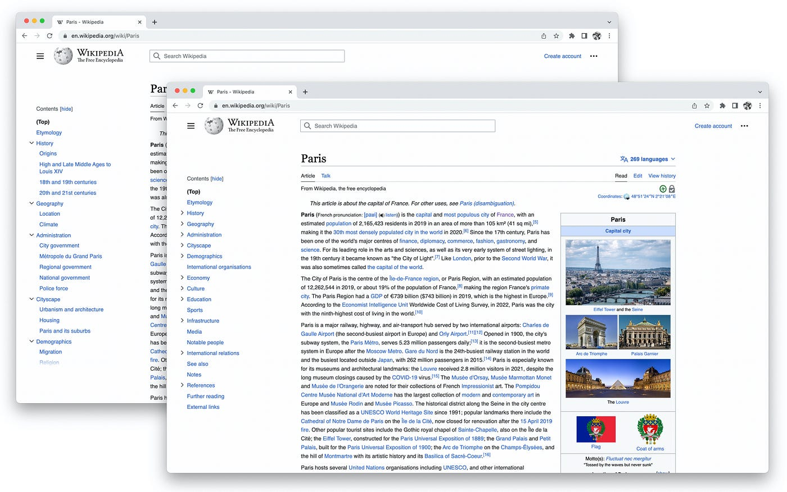

Table of contents with sub-sections expanded (left) vs. collapsed (right)  

目录中分节的展开（左）与折叠（右）的对比

There were also lots of smaller decisions that were fun to think through, like:  

还有很多较小的决定也很值得思考，比如：

-   When you scroll to a section that has collapsed sub-sections, should the parent section automatically expand? ([prototype link](https://di-toc-section-auto-expand.web.app/Paris))  
    
    当你滚动到一个有折叠的小节时，父节应该自动展开吗？( 原型链接 )
-   When you click on a link in the table of contents should the scroll be animated or instant? ([prototype link](https://di-toc-instant-animated.web.app/China))  
    
    当你点击目录中的一个链接时，滚动应该是动画的还是即时的？ ( 原型链接 )
-   Should we have an “expand all” button for articles with collapsed sub-sections? ([prototype link](https://di-toc-expand-collapse-all.web.app/Mount_Fuji))  
    
    我们是否应该为有折叠小节的文章设置一个 "全部展开 "的按钮？( 原型链接 )
-   Should we continue hiding the table of contents on articles with less than 4 sections? ([task link](https://phabricator.wikimedia.org/T318186))  
    
    我们是否应该继续在少于4节的文章中隐藏目录？( 任务链接 )

You can read about more of the details and rationales [here](https://www.mediawiki.org/wiki/Skin:Vector/2022/Design_documentation#Table_of_contents)  

你可以在这里阅读更多的细节和理由

## Development, the democratic process, and RfCs  

发展、民主进程和征求意见稿

As I mentioned before, Wikipedia is a democratically run project. Many decisions are made through a consensus process.  

正如我之前提到的，维基百科是一个民主管理的项目。许多决定是通过协商一致的过程作出的。  

Exactly who has what power, and how to move forward amidst disagreement, is unfortunately unclear.  

遗憾的是，究竟谁有什么权力，以及如何在分歧中向前迈进，都不清楚。  

And the processes that evolved for resolving editorial disputes don’t necessarily work well for making design decisions.  

而为解决编辑纠纷而发展起来的程序不一定能很好地用于做出设计决定。  

Because the billions of readers, whose needs we were trying to represent, do not participate in Wikipedia’s democratic process, we worried that the discussions might be lopsided, and continue to prioritize the needs of logged-in editors over logged-out readers.  

因为我们试图代表的数十亿读者并没有参与维基百科的民主进程，我们担心讨论会出现一边倒的情况，并继续优先考虑登录的编辑的需求而不是登录的读者。

At the beginning of the project we asked a few Wikipedias to be early adopters of our changes (Basque, French, Hebrew, Persian, and others).  

在项目开始时，我们要求一些维基百科成为我们变化的早期采用者（巴斯克语、法语、希伯来语、波斯语和其他）。  

That meant, for those “pilot” Wikipedias, all changes we made were released by default to all logged-in _and_ logged-out people (though logged-in people, who are typically editors, could opt-out if they wanted).  

这意味着，对于那些 "试点 "维基百科，我们所做的所有修改都会默认发布给所有登录和退出的人（尽管登录的人，通常是编辑，如果他们愿意，可以选择退出）。  

So if you were using one of those Wikipedias, you would have seen the changes happen gradually, over the past couple of years. This gave us usability feedback, and also served as a quasi-A/B test.  

因此，如果你正在使用这些维基百科中的一个，你会看到在过去的几年中逐渐发生的变化。这给了我们可用性的反馈，同时也是一个准A/B测试。  

If we could develop an interface that worked for thousands of editors and millions of readers, and prove it through data (including low editor opt-out rates), our hope was that we could get the rest of the Wikipedia communities on board.  

如果我们能开发出一个适用于数千名编辑和数百万读者的界面，并通过数据（包括较低的编辑退出率）证明这一点，我们希望能让维基百科其他社区加入进来。

For all of the other Wikipedia communities, while they were involved all along — over 2,000 volunteers participated in the development process, reviewing prototypes, helping us design features, giving feedback, etc.  

对于所有其他的维基百科社区来说，虽然他们一直都在参与--超过2000名志愿者参与了开发过程，审查原型，帮助我们设计功能，提供反馈，等等。  

— the new interface was available to them as an opt-in feature.  

\- 他们可以选择加入新界面的功能。

Almost every day I would interact with volunteers from various Wikipedia communities, big and small, on our project’s [message board](https://www.mediawiki.org/wiki/Talk:Reading/Web/Desktop_Improvements), publicly available [Phabricator tasks](https://phabricator.wikimedia.org/tag/desktop_improvements_vector_2022/), in chat rooms, and occasionally at hackathons and other Wikipedia events. We also had five formal, asynchronous feedback collection events throughout the project ([link](https://www.mediawiki.org/wiki/Reading/Web/Desktop_Improvements/Community_interactions_overview#Prototype_feedback_events)).  

几乎每天我都会与来自不同维基百科社区的大大小小的志愿者互动，在我们项目的留言板上，在公开的Phabricator任务中，在聊天室里，偶尔也会在黑客马拉松和其他维基百科活动中。在整个项目中，我们还举行了五次正式的、异步的反馈收集活动（链接）。  

Since their feedback on each of the changes along the way was largely positive, and all of our data from our test Wikipedias looked great (only ~13% of editors on our pilot Wikipedias opted out), we hoped that when we eventually asked the other communities, they would each adopt the redesigned interface.  

由于他们对每个变化的反馈基本上都是积极的，而且我们的测试维基百科的所有数据看起来都很好（在我们的试点维基百科上只有约13%的编辑选择退出），我们希望当我们最终询问其他社区时，他们会各自采用重新设计的界面。  

Alas, English Wikipedia (by far the largest), wanted to hold an [RfC](https://en.wikipedia.org/wiki/Wikipedia:Requests_for_comment) (Request for Comment), which is a longstanding Wikipedia process that is somewhere in between a vote and a discussion ([link to the RfC](https://en.wikipedia.org/wiki/Wikipedia:Requests_for_comment/Deployment_of_Vector_(2022))).  

唉，英文维基百科（迄今为止最大的），想举行一次RfC（征求意见），这是维基百科的一个长期过程，介于投票和讨论之间（链接到RfC）。

Below is a rough map of all interactions we had with volunteers before the RfC on English Wikipedia began. Of course not all of these interactions were about design, but many of them were.  

下面是我们在英语维基百科的RfC开始之前与志愿者进行的所有互动的粗略地图。当然，并不是所有的互动都是关于设计的，但其中很多都是。

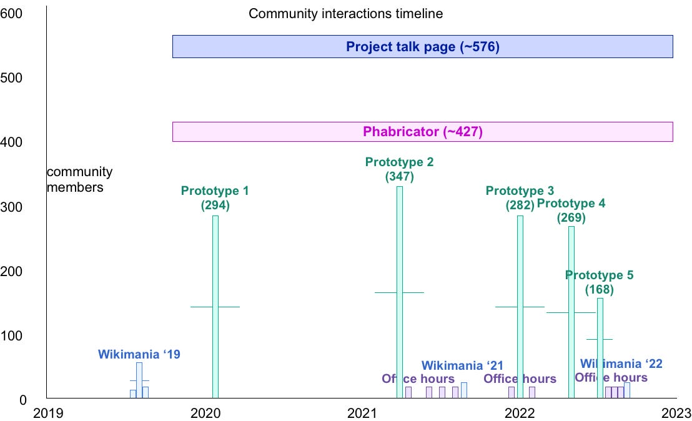

Interactions with Wikipedia community members throughout the course of the project  

在整个项目过程中与维基百科社区成员进行互动

As the comments/votes started coming in, I became frustrated at how unrepresentative of the general public the people voting were.  

随着评论/投票的开始，我对投票的人不代表大众的情况感到沮丧。  

It was a very small group of editors, potentially making a decision for billions of readers.  

这是一个非常小的编辑小组，有可能为数十亿的读者做出决定。  

It was also unclear if the people who were voting had participated in past discussions, and/or had taken the time to read through the project documentation, research results, data, etc.  

也不清楚参加投票的人是否参加过过去的讨论，和/或是否花时间阅读过项目文件、研究成果、数据等。  

It seemed like we were getting a lot of first reactions (as it turned out, only ~28 of the 159 people opposing the new interface had previously engaged in discussions, feedback, etc.).  

看起来我们得到了很多第一反应（事实证明，在反对新界面的159人中，只有~28人之前参与过讨论、反馈等）。  

There was a lot of arguing about white space and icons, and people saying they simply didn’t like it, rather than discussions of user needs and/or key metrics.  

有很多关于白色空间和图标的争论，还有人说他们根本不喜欢，而不是讨论用户需求和/或关键指标。

The RfC lasted for a month, was nearly tied in the end (154 support, 165 oppose), but thankfully the final judgment (which is called a “closing”, and is done by a volunteer) approved the redesign.  

RfC持续了一个月，最后几乎打成平手（154人支持，165人反对），但值得庆幸的是，最后的判断（称为 "闭幕"，由一名志愿者完成）批准了重新设计。  

Compared with other RfCs this was a big success.  

与其他区域合作组织相比，这是一个很大的成功。  

The volunteer communities are generally very change-averse (in some ways for good reason), and changes developed by the Wikimedia Foundation can be particularly challenging to get acceptance for.  

志愿者群体通常非常厌恶变化（在某些方面有很好的理由），而由维基媒体基金会开发的变化要得到认可可能特别具有挑战性。  

However I was still left feeling a bit weirdly about the vote. Did we just get lucky? Did all of the previous interactions we had with volunteers actually build support?  

然而，我仍然对这次投票感到有点奇怪。我们只是运气好吗？我们之前与志愿者的所有互动是否真的建立了支持？  

Did all of the feedback we incorporated lead to a better design? And why do people think whitespace is an indication of a failed design (like holy shit, some people hate it so much)?  

我们所采纳的所有反馈意见是否导致了更好的设计？还有，为什么人们认为留白是设计失败的标志（比如说，该死的，有些人那么讨厌留白）？

The positive outcome of the RfC was probably a mix of all of those things, but we won’t really ever know how/why we arrived there, which is bothersome to me.  

协商会议的积极成果可能是所有这些东西的混合，但我们不会真正知道我们是如何/为什么到达那里的，这对我来说很麻烦。  

I was happy to see some small discussions within the RfC regarding the validity of the RfC process for making such large decisions, as well as some people commenting on the lack of reader participation.  

我很高兴地看到，在RfC内部有一些小的讨论，涉及到RfC过程中做出如此大的决定的有效性，也有一些人对缺乏读者参与的问题进行了评论。  

In general I think it also highlighted both the lack of alignment in terms of development priorities between some of the community members and the Wikimedia Foundation, and the need for more analytics and data.  

总的来说，我认为这也突出了一些社区成员和维基媒体基金会之间在发展重点方面的不一致，以及对更多分析和数据的需求。  

I have many more thoughts on ways we might evolve the RfC process, and the systems of governance on Wikipedia in general, which I’ll save for another time.  

对于我们如何发展RfC程序，以及维基百科的管理制度，我还有很多想法，我将留待下次讨论。

(Addendum: after the launch some people on English Wikipedia started another RfC, about rolling back the redesign. The RfC was closed two months later, with no consensus to roll back.  

(补充：在发布之后，英文维基百科上的一些人开始了另一个RfC，关于回滚重新设计。两个月后，RfC被关闭了，没有达成回滚的共识。  

You can read all 238,758 words of that RfC [here](https://en.wikipedia.org/wiki/Wikipedia:Requests_for_comment/Rollback_of_Vector_2022). For context: _Moby Dick_ is 209,117 words.)  

你可以在这里阅读所有238,758字的回应文件。作为背景：白鲸》是209,117个字）。

## The data we have so far  

到目前为止，我们拥有的数据

While somewhat limited compared with what other websites are able to collect, the data we have so far paints a picture of positive change:  

虽然与其他网站能够收集到的数据相比有些有限，但我们目前掌握的数据描绘了一幅积极变化的画面：

-   The new table of contents increases deeper exploration of articles. Our A/B test showed 53% more clicks for logged-in people, and 45.5% more clicks for logged-out people.  
    
    新的目录增加了对文章的深入探索。我们的A/B测试显示，登录者的点击量增加了53%，而退出者的点击量增加了45.5%。
-   The new search bar increased the amount of searches started by 28.9%  
    
    新的搜索栏使开始的搜索量增加了28.9%。
-   9 months after the deployment, 87% of active logged-in users on the early adopter communities (averaged, incl. French Wikipedia) did not opt-out of the new interface  
    
    在部署9个月后，早期采用者社区中87%的活跃登录用户（平均，包括法国维基百科）没有选择退出新界面。
-   The sticky header makes it quicker to access tools that editors use often. It decreases scrolling to the top of the page by 15%.  
    
    粘性标题使其更快地访问编辑们经常使用的工具。它将滚动到页面顶部的次数减少了15%。
-   The skin does not negatively affect pageviews, edit rates, or account creation. There is observational evidence of increases in pageviews, and account creation across partner communities.  
    
    皮肤不会对页面浏览量、编辑率或账户创建产生负面影响。有观察证据表明，合作伙伴社区的页面浏览量和账户创建量都有增加。

## Exposing the system  

暴露系统

Have you ever wondered whether or not a Wikipedia article was accurate, or more generally if you can trust Wikipedia? What many people don’t understand is that Wikipedia articles [don’t contain original thoughts or opinions](https://en.wikipedia.org/wiki/Wikipedia:No_original_research). In a sense they aren’t even really “written”, or at least not in the way that someone might write an essay or a poem.  

你是否曾想过维基百科的文章是否准确，或者更广泛地说，你是否可以相信维基百科？许多人不明白的是，维基百科的文章并不包含原创思想或观点。从某种意义上说，它们甚至不是真正的 "写"，或者至少不是以某人可能写一篇论文或一首诗的方式。  

Instead Wikipedia articles are collages of facts that researchers and journalists have published about a given topic elsewhere.  

相反，维基百科的文章是研究人员和记者在其他地方发表的关于某一特定主题的事实的拼贴。  

Think of an article like a puzzle, or a quilt, with each “piece” being a fact about the topic that was previously published by a credible institution.  

把文章想象成一个拼图，或一个被子，每个 "碎片 "都是一个关于主题的事实，是由一个可信的机构以前发表的。  

With this in mind it becomes clear that any Wikipedia article is only as accurate as the sources from which the facts were gathered.  

考虑到这一点，很明显，任何维基百科的文章只有在收集事实来源的情况下才会准确。  

You can question the motives of the editors — who are the ones going out, gathering the facts, and then weaving them together into coherent articles.  

你可以质疑编辑的动机--他们是走出去，收集事实，然后把它们编织成连贯的文章的人。  

And/or question the credibility of the institutions that are publishing those facts in the first place.  

而且/或者质疑那些首先公布这些事实的机构的可信度。  

But ultimately Wikipedia is a container filled with facts, rather than a blank page upon which people have written whatever they want about a topic.  

但归根结底，维基百科是一个装满事实的容器，而不是一个人们对某一主题想写什么就写什么的空白页。

During the project we became interested in how the interface could better communicate this meta-information about Wikipedia articles.  

在这个项目中，我们开始对界面如何更好地传达关于维基百科文章的元信息感兴趣。  

How might we help people understand that editors are more fact-gatherers than authors, that they have long, involved disputes over whether or not a source was credible, and that they actively watch articles in order to ensure that any information added to them was coming from a credible source?  

我们如何帮助人们理解，编辑比作者更多的是收集事实，他们对一个来源是否可信有长期的争议，他们积极观察文章，以确保添加到文章中的任何信息是来自可信的来源。  

How could we expose this dynamic, living system that is currently nearly invisible to most readers, in a way that would empower them to better evaluate the credibility of a given article, and ultimately position them to be participants, rather than consumers?  

我们怎样才能把这个目前对大多数读者来说几乎看不见的动态、活生生的系统暴露出来，使他们能够更好地评估某篇文章的可信度，并最终使他们成为参与者，而不是消费者？  

What if the “reading experience” of Wikipedia wasn’t just about reading the content, but also being able to _read_ an article in this meta way? Could we help people grow from being _content readers_, to more _informed readers_? Partly inspired by the [Winter prototype](https://winter.toolforge.org/), I made some sketches of Wikipedia articles that included various pieces of metadata, which might serve as little clues as to what was going on.  

如果维基百科的 "阅读体验 "不仅仅是阅读内容，而且能够以这种元方式阅读一篇文章，会怎么样？我们能不能帮助人们从内容读者成长为更有见识的读者？部分受到Winter原型的启发，我画了一些维基百科文章的草图，其中包括各种元数据，这些元数据可以作为了解事情真相的小线索。  

I then thought about some kind of article activity & metadata summary, that could give people a quick sense of the state of an article with regards to editor activity, as well as completeness/credibility.  

然后我想到了某种文章活动和元数据摘要，它可以让人们快速了解一篇文章在编辑活动方面的状态，以及完整性/可信度。  

Ultimately these ideas were out of scope, but I’m excited about them, and hope they get tested out sooner or later.  

最终这些想法超出了范围，但我对它们感到兴奋，并希望它们迟早能得到测试。

That’s all I’ve managed to type up so far.  

这就是我到目前为止所能打出的全部内容。  

I hope some parts of our process can be usefully borrowed by others, and that people reach out to learn more about the process, challenges, stories, and specific changes/decisions that we made.  

我希望我们过程中的某些部分可以被其他人有用地借用，并希望人们能够接触到更多关于我们的过程、挑战、故事和具体的变化/决定。  

I’ve also begun to compile a list of responses to specific UI/UX questions that people might have, which can be found here: [design documentation](https://www.mediawiki.org/wiki/Skin:Vector/2022/Design_documentation). For reference, here’s a link to the [previous version](https://en.wikipedia.org/wiki/Surfing?useskin=vector) of the interface, which is still available to all logged-in editors via Settings. And yes, we should increase the font-size to 16px : )  

我也开始整理出一份清单，对人们可能有的具体的UI/UX问题进行答复，可以在这里找到：设计文档。作为参考，这里有一个以前版本界面的链接，所有登录的编辑仍然可以通过设置获得。是的，我们应该把字体大小增加到16px :)

The project was developed by the Readers Web Team at the Wikimedia Foundation, with continual support from the Research & Design Team.  

该项目由维基媒体基金会的读者网络团队开发，并得到研究与设计团队的持续支持。

Special thanks for extra design support to:  

特别感谢对设计的额外支持：

-   Rita Ho
-   Olga Vasileva
-   Roy Tatum
-   Frank Chimero
-   Kieran McCan
-   Volker E.
-   Matthew Williams
-   Quiddity (Nick Wilson)
-   TheDJ (Derk-Jan Hartman)  
    
    TheDJ (德克-扬-哈特曼)
-   Nirzar Pangarkar
