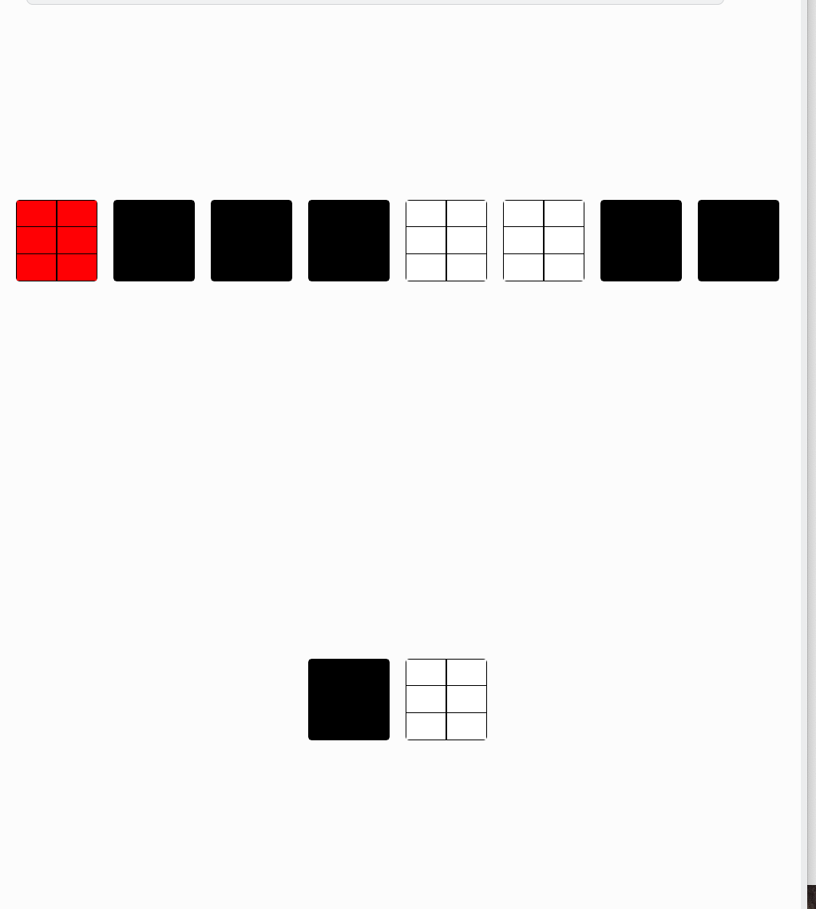
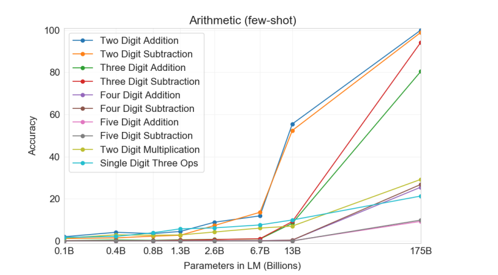
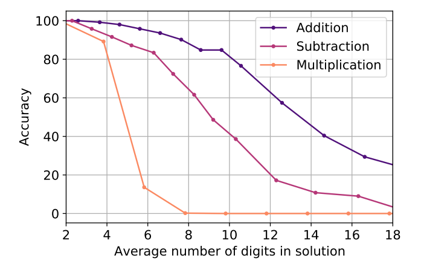
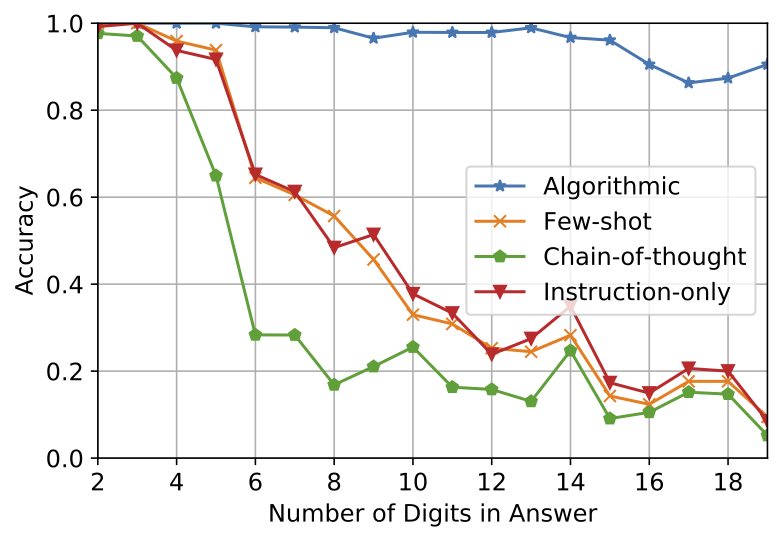
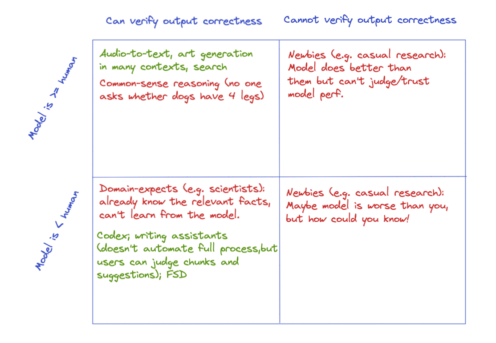

In a previous [Links](https://nintil.com/links-61) post, and in a recent tweet I expressed [my relative lack of excitement about](https://twitter.com/ArtirKel/status/1581310274539167746) what a lot of people are doing with what I called "the AI stuff" (narrowly, large language models and diffusion models, collectively "generative AI"; excluding e.g. Tesla's FSD or AlphaFold).  

在之前的一篇Links文章中，以及最近的一条推文中，我表达了我对很多人正在做的所谓 "人工智能的东西"（狭义上说，大型语言模型和扩散模型，统称为 "生成性人工智能"；不包括例如特斯拉的FSD或AlphaFold）相对缺乏的兴奋。  

In an even earlier [tweet](https://twitter.com/ArtirKel/status/1544858276503949312), I asked Twitter if we had learned anything new from LLMs yet, as opposed to LLMs telling us what we (the internet) already knew; the conclusion being that we have not.  

在更早的一条推文中，我问推特，我们是否从法律硕士那里学到了新东西，而不是法律硕士告诉我们我们（互联网）已经知道的东西；结论是，我们没有。  

Nostalgebraist has been writing on the same lines for a [while](https://nostalgebraist.tumblr.com/post/698045223162593280/taking-a-break-from-ai-discourse).  

Nostalgebraist已经写了一段时间的相同线路。

\[1\]. Throughout this essay I will use GPT3 to refer to the latest available text-davinci-002 model from OpenAI as of writing this essay  

\[1\].在本文中，我将使用GPT3来指代截至本文写作时OpenAI提供的最新文本-davinci-002模型。

Recent AI hype contrasts with the fact that GPT3<sup onmouseover="border_note(&quot;sidenote-1&quot;,true)" onmouseout="border_note(&quot;sidenote-1&quot;,false)" data-immersive-translate-effect="1"><a href="https://nintil.com/interesting-ai-models#sidenote-1">1</a></sup> was first released to the public in June of 2020 and since then, not that much has been done with it, with the recent exception of its descendent model Codex.  

最近的人工智能炒作与以下事实形成鲜明对比：GPT3 <sup onmouseover="border_note(&quot;sidenote-1&quot;,true)" onmouseout="border_note(&quot;sidenote-1&quot;,false)" data-immersive-translate-effect="1"><a href="https://nintil.com/interesting-ai-models#sidenote-1">1</a></sup> 在2020年6月首次向公众发布，从那时起，除了最近的后裔模型Codex之外，没有对它做过多少事情。  

I do not think this is because of insufficient tinkering with the models, but rather they have to do with intrinsic limitations of the models that are currently available and that I expect will be available in the foreseeable future.  

我认为这不是因为对模型的修补不够，而是与目前可用的模型和我预计在可预见的将来可用的模型的内在限制有关。

Up until recently the most popular use case seems to have been marketing copywriting. I don't find this particularly exciting, search on the internet is already full of bland content marketing.  

直到最近，最流行的用例似乎是营销文案。我并不觉得这特别令人兴奋，互联网上的搜索已经充满了平淡的内容营销。  

It's different if one does content marketing by, say, writing an article about how to use your API, or if a company does a toy project using their API and then writes about it.  

如果一个人做内容营销，比如说写一篇关于如何使用你的API的文章，或者一个公司使用他们的API做了一个玩具项目，然后写了一篇文章，那就不同了。  

The hard work here is in the project or thinking about the use case in a thoughtful way, and less so in the writing itself. Admittedly I do not know much about content marketing though!  

这里的艰苦工作是在项目中或以一种深思熟虑的方式思考使用案例，而不是在写作本身。诚然，我对内容营销了解不多！

I find code generation (Copilot, Ghostwriter) more exciting. Copilot can be genuinely helpful and by some accounts it's bringing hundreds of millions of dollars to [Github](https://www.theregister.com/2022/11/11/githubs_copilot_opinion/).  

我觉得代码生成（Copilot、Ghostwriter）更令人兴奋。Copilot可以提供真正的帮助，根据一些说法，它为Github带来了数亿美元的收入。

Then there's of course image (and video!) generation. The systems I'm aware of and that I have used are DALLE2, Stable Diffusion, and Midjourney.  

当然还有图像（和视频！）的生成。我所知道的和我使用过的系统是DALLE2、稳定扩散和Midjourney。  

These are fun to play with and I predict they will be used in a number of creative tasks from generating images for posts to assets for videogames to movie styling.  

这些东西玩起来很有趣，我预测它们将被用于一些创造性的任务，从生成帖子的图片到电子游戏的资产到电影造型。  

RunwayML but also Stability.ai seem to be the leaders here. A recent concrete example I saw in the wild was generating the header of [this](https://twitter.com/ansonyuu/status/1589035115526508545) interview with Michael Nielsen by generating a plausible image completion around a smaller image.  

RunwayML和Stability.ai似乎是这里的领导者。我最近在野外看到的一个具体例子是，通过在一张较小的图片周围生成一个可信的图片完成度来生成这个与Michael Nielsen的采访的标题。

Looking back, four years ago the state of the art in image generation was generating faces and numbers. There were no scaling laws papers and the first [GPT](https://openai.com/blog/language-unsupervised/) paper had just been released.  

回顾过去，四年前，图像生成的技术状况是生成人脸和数字。当时还没有关于缩放规律的论文，第一篇GPT论文也刚刚发布。  

Rapid progress in some domains in the last years have led to some to think that not only progress in these domains will continue as fast or faster, but that we are on the verge of full-blown artificial general intelligence.  

过去几年在一些领域的快速进展使一些人认为，不仅这些领域的进展将继续保持同样的速度或更快，而且我们正处于全面的人工通用智能的边缘。

I don't see it that way: Progress has indeed been fast lately.  

我不这么看：最近的进展确实很快。  

In a few years I will not be writing a snarky remark about GPT-N not being used for much because by then it will be obvious that there are at least a handful of legitimately useful applications for LLMs in broad use.  

几年后，我就不会再写关于GPT-N没有什么用途的冷笑话了，因为到那时就会发现，至少有少数合法有用的法律硕士的应用在广泛使用。  

At the same time, in a few years I do expect some people that today are really excited will feel disillusioned: we'll get close, but we'll remain far, as happened with self-driving cars: they seemed so close many years ago!  

同时，在几年后，我确实预计一些今天真的很兴奋的人将感到幻想破灭：我们将接近，但我们仍然很远，就像发生在自动驾驶汽车上一样：多年前他们似乎很接近！"！

It's easy (and cheap) to theorize about what will or won't happen by some unspecified date in the future.  

对未来某个不确定的日期会发生什么或不会发生什么进行理论研究很容易（也很便宜）。  

A much harder thing to do is to commit to specific predictions or bets of the form "By 2026, AI won't be able to do X". What should those X be?  

更难做到的是承诺具体的预测或赌注，其形式是 "到2026年，人工智能将不能做X"。这些X应该是什么？  

This essay is an attempt to sort through my thoughts and come up with those bets.  

这篇文章是试图梳理我的想法，并提出这些赌注。

One lens this essay is written through is what applications of AI would _I_ find useful. I don't do video editing, am not an artist, and have lots of knowledge and means to find it and index it. The lack of excitement may come from the fact that _I_ want to have models helping me just like they can help others do their job. The topics I've decided to focus on here are guided (or biased by) those considerations.  

这篇文章写的一个镜头是，我觉得人工智能的哪些应用会很有用。我不做视频编辑，也不是艺术家，而且有很多知识和手段来寻找它和索引它。缺乏兴奋点可能来自于我希望有模型帮助我，就像它们可以帮助别人做工作一样。我决定在这里关注的主题是以这些考虑为指导的（或偏向于）。

A second lens is forecasting progress towards general artificial intelligence. In a previous post I discussed how AI systems could [pose](https://nintil.com/ai-safety) danger, but I did not discuss when those systems will actually be built. The present essay is an effort to think about AI capabilities timelines in the short-to-medium term.  

第二个镜头是预测通用人工智能的进展。在前一篇文章中，我讨论了人工智能系统可能带来的危险，但我没有讨论这些系统何时会真正建成。本篇文章是对中短期内的人工智能能力时间表的思考。  

This lens led to the sections on "true understanding", compositionality, and remarks on progress in narrow-purpose models and general-purpose models.  

这个视角导致了关于 "真正的理解"、构成性的章节，以及关于狭义模型和通用模型的进展的评论。

This is important to keep in mind because if not this essay will seem to be harshly dismissing genuine progress in the field.  

这一点很重要，因为如果不是这样的话，这篇文章似乎会严厉地否定该领域的真正进展。

Throughout the essay I also suggest research directions and ways to improve the models. At the end of the essay, in an [appendix](https://nintil.com/interesting-ai-models/#appendix-ideas-for-ai-startups), I suggest some startup ideas in this domain.  

在整个文章中，我还提出了研究方向和改进模型的方法。在文章的最后，我在附录中提出了这个领域的一些启动想法。

## Artifacts in video generation  

视频生成中的假象

Will we get a Hollywood-tier blockbuster movie within the next 5 years? Video generation is still in what I'd describe as its infancy. Microsoft's [NUWA](https://nuwa-infinity.microsoft.com/#/), Google's [Imagen](https://imagen.research.google/video/) Video, [Phenaki](https://phenaki.github.io/), or Meta's [Makeavideo](https://makeavideo.studio/) are impressive as technological achievements and without doubt we will see better models in years to come.  

我们会在未来5年内得到一部好莱坞级别的大片吗？视频生成仍然处于我所描述的起步阶段。微软的NUWA、谷歌的Imagen Video、Phenaki或Meta的Makeavideo作为技术成就令人印象深刻，毫无疑问，我们将在未来几年看到更好的模型。  

The parameter counts in the models are not particularly high compared to say PaLM, and the training data Imagen uses does not include everything Google has access to (They could eventually train on a large dataset of youtube videos).  

与PaLM相比，模型中的参数数并不是特别高，而且Imagen使用的训练数据并不包括谷歌能够获得的所有数据（他们最终可以在一个大型的youtube视频数据集上进行训练）。

However! One can still see some peculiar weird artifacts in most of these videos, in this particular video from Google Imagen Video or the one below that one, from Phenaki.  

然而!人们仍然可以在大多数这些视频中看到一些奇特的奇怪的人工制品，在这个来自谷歌Imagen视频的特殊视频中，或者在那个下面的视频中，来自Phenaki。  

Note how some features (like the eyes of the bear or the sails of the ship) pop in and out of existence, or wobble around:  

请注意一些特征（如熊的眼睛或船的帆）是如何突然出现和消失的，或左右摇摆：

 Your browser does not support the video tag.  

您的浏览器不支持视频标签。


Why this wobbling?  

为什么会出现这种摇摆不定的情况？  

My explanation is that the model doesn't have conceptual understanding, a claim some readers will nod to enthusiastically and others will predictably think it's either wrong or true but irrelevant, so more on this later; I of course hold a [third more complex](https://twitter.com/ch402/status/1516427465266245635) opinion. The model is trying to generate video that looks coherent in a similar way the videos in the training set look coherent, and doing so conditional on a prompt.  

我的解释是，该模型没有概念性理解，这种说法有些读者会热情地点头，而另一些人可以预见地认为它要么是错误的，要么是真实的，但无关紧要，所以稍后再谈；当然，我还持有第三个更复杂的观点。该模型正试图以类似于训练集中的视频看起来连贯的方式生成视频，并以提示为条件这样做。  

In contrast, you could imagine a model that instead generates a 3D model of a bear and a texture (which stays constant throughout the video), then generates a set of animations, then animates the bear through the water.  

与此相反，你可以想象一个模型，代替生成一只熊的3D模型和一个纹理（在整个视频中保持不变），然后生成一组动画，然后将熊在水中进行动画。  

This is what a human would do at an animation studio and plausibly this could too be done with AI (There are [models](https://nv-tlabs.github.io/GET3D/) to generate 3D models out of images already, as well as models to generate [animations](https://guytevet.github.io/mdm-page/) from prompts).  

这是人类在动画工作室所做的事情，而且似乎也可以用人工智能来完成（已经有模型可以从图像中生成3D模型，也有模型可以从提示中生成动画）。  

This is however contrary to the ethos of the modern approach to AI: Eschew purpose-specific solutions, seek end to end general solutions by training large models on large corpora of the desired kind of final output data (movies).  

然而，这与现代人工智能方法的精神相悖：放弃特定目的的解决方案，通过在所需的最终输出数据（电影）的大型语料库中训练大型模型，寻求端到端的通用解决方案。

To be sure, this approach has been paying off well for Tesla and FSD, who started with many purpose-specific systems and ended with progressively more end-to-end systems, but this is [taking longer](https://twitter.com/TaylorOgan/status/1476266341443293186/photo/1) than expected, and even today we are not a a level where a driver can stop paying attention.  

可以肯定的是，这种方法对特斯拉和FSD来说已经有了很好的回报，他们从许多特定目的的系统开始，最后逐步建立起更多的端到端系统，但这比预期的时间要长，即使今天我们还没有达到司机可以不注意的水平。  

It doesn't matter if 95% of the time the model is reasonable, if it can do something unsafe in that 5% of the time a driver has to remain alert.  

如果模型在95%的时间里是合理的，这并不重要，如果它在那5%的时间里能做出不安全的事情，司机就必须保持警惕。

There are not many examples of videos fully generated with AI yet, but there are many images. Many or even most of these images look satisfactorily pixel perfect. Have a look at this gallery in [Lexica](https://lexica.art/) for some examples. But sometimes you find things like [this](https://lexica.art/?prompt=f9881f0e-66cf-499d-88ec-d161c638556c) where the arms look all off. Generating one-off images, especially when one can try multiple times is one thing. Generating a movie is another.  

目前还没有很多用人工智能完全生成视频的例子，但有很多图像。这些图像中的许多甚至大多数看起来都是令人满意的完美像素。请看看Lexica的这个画廊，看看一些例子。但有时你会发现像这样的东西，手臂看起来都不对劲。生成一次性的图像，特别是当一个人可以尝试多次的时候是一件事。生成一部电影是另一回事。  

A two minute clip (at 24 fps) is a sequence of 2880 pictures. They all have to be accurate and coherent with the previous ones. A two hour movie is over 172k individual frames.  

一个两分钟的片段（24帧）是一个由2880张图片组成的序列。它们都必须是准确的，并与之前的照片保持一致。一部两小时的电影是超过172k个单独的帧。

The [Phenaki](https://phenaki.github.io/) demo website does have examples of videos longer than two minutes. I can easily see how voice and a longer script could be added to this, and we'd have a passable movie, but not a blockbuster.  

Phenaki演示网站确实有超过两分钟的视频实例。我可以很容易地看到如何将语音和较长的脚本加入其中，我们就会有一部合格的电影，但不是一部大片。  

Fine, one may say. It's not a Hollywood competitor _now_, but what about in 2026? Remember, we had _no_ AI generated video just a few years ago, then we got to [these](https://www.youtube.com/watch?v=bKFgjCl1dTo) kind of videos by interpolating images, and now we have better spatiotemporal coherence with the new video models.  

好吧，人们可能会说。现在它不是好莱坞的竞争对手，但2026年呢？请记住，就在几年前我们还没有人工智能生成的视频，然后我们通过插值图像达到了这种视频，现在我们有了更好的时空一致性的新视频模型。  

Isn't it easy to imagine that in 2026, after all the investment the field has seen and will continue to see, they will be able to output 172k consecutive individual frames of pixel-perfect Hollywood-level quality?  

是不是很容易想象，在2026年，在该领域已经看到并将继续看到的所有投资之后，他们将能够连续输出172k个像素完美的好莱坞级质量的独立帧？  

For the probability of a sequence of randomly sampled 172k frames to be all coherent to be >90%, the probability that each frame is good must be over 0.999999. It's hard to cash this out in precise benchmarks; where are current models at?  

为了使随机抽样的172k帧的序列全部连贯的概率>90%，每一帧都是好的概率必须超过0.999999。这很难用精确的基准来兑现；目前的模型在哪里？  

And how do we account for the fact that frames are not really sampled randomly?  

我们如何解释帧不是真正随机抽样的事实呢？  

But my intuition from looking at images generated with these models says they are far from there; and likewise my intuition is that going from mediocre to good is substantially easier than going from good to great.  

但我通过观察这些模型生成的图像，直觉告诉我，它们还远远没有达到这个水平；同样，我的直觉是，从平庸到优秀，要比从优秀到伟大容易得多。  

One could allow for a handful of less than perfect frames, and for multiple shots at the task and get away with less reliable models.  

人们可以允许少数不那么完美的帧，并允许在任务中进行多次拍摄，并以不太可靠的模型逃脱。

A given kind of person sees models from five years ago with just faces, models now, and draws a line from A to B and extrapolates that they will keep improving.  

某一种人看到五年前的模型，只有脸，现在的模型，从A到B画一条线，并推断出他们会不断改进。  

If you are me you see improvements in some dimensions but not others (Obsessing over subcomponents of narratives is a [Nintil](https://nintil.com/still-no-great-stagnation/) house move), and so you predict continued improvements in some dimensions, and less so in the others that haven't improved or have improved at a slower rate.  

如果你是我，你会看到一些维度的改善，而不是其他维度的改善（执着于叙事的子成分是宁德的搬家），因此你预测一些维度会继续改善，而在其他没有改善或改善速度较慢的维度上，则不太理想。

What _will_ improve? Quality of textures for sure, Midjourney V4, released as I am writing this essay is already one leap in this direction. Spatiotemporal coherence will improve a bit.  

什么会改善？纹理的质量是肯定的, Midjourney V4, 在我写这篇文章的时候发布，已经是这个方向的一个飞跃。时空的连贯性会有一些改善。  

Both together will improve at a slower pace.  

两者结合起来会以较慢的速度提高。

I expect producing an anime movie is easier because textures are simpler but it will still be challenging. See this example [clip](https://www.youtube.com/watch?v=jIFY8NUn8I4). Textures are simpler, but there's still keeping track of where the characters are in the scene, where the camera is looking at, when to do closeups or wider shots, syncing voice, music, and video.  

我预计制作一部动漫电影会比较容易，因为纹理比较简单，但仍然会有挑战。请看这个例子片段。纹理比较简单，但仍然要跟踪人物在场景中的位置，摄像机在哪里看，什么时候做特写或宽镜头，同步语音、音乐和视频。

I just seem to have a strong prior that without a a better understanding of objects as entities over space-time (as opposed to something closer to just pixels on a screen) we are not going to get there by 2026 (to fully automate movie generation).  

我似乎有一个强烈的预感，如果不更好地理解物体作为时空实体（而不是更接近于屏幕上的像素），我们就不可能在2026年之前达到（完全自动化的电影生成）。

## Image generation and compositionality  

图像的生成和组合性

Image AI systems available today seem to struggle with compositionality: this is being able to lay out concrete objects in defined spatial relationships according to a prompt.  

今天可用的图像人工智能系统似乎在构图方面很吃力：这就是能够根据提示将具体物体按确定的空间关系摆放出来。  

This breaks down in scenes where there are varied objects that have to have specific spatial relations.  

这在有不同物体必须有特定空间关系的场景中会被打破。  

One representative example of this sort of problem, with a prompt I just made up is here (DALLE2):  

这类问题的一个代表性例子，以及我刚刚编造的提示是在这里（DALLE2）：


A table with a computer monitor in the center. To the right, a soft green round speaker. To the left, a laptop on a stand. To the left of the laptop there is an espresso machine  

一张桌子，中间有一个电脑显示器。右边是一个柔和的绿色圆形扬声器。左边是一台放在支架上的笔记本电脑。在笔记本电脑的左边，有一台浓缩咖啡机

None of these pictures meets the requirements of the prompt (One has a _red_ speaker, they all lack the espresso machine, three don't have the computer monitor, one doesn't have a laptop etc).  

这些图片没有一张符合提示的要求（一张有红色的扬声器，它们都缺少浓缩咖啡机，三张没有电脑显示器，一张没有笔记本电脑等等）。  

These mistakes are very trivial to see for a human being that has been asked to produce the image from the prompt.  

对于一个被要求根据提示制作图像的人来说，这些错误是非常微不足道的。

Stable Diffusion v1.5 did better than DALLE, and below Midjourney V4 did better than SD, but still none of the images capture what I wanted  

Stable Diffusion v1.5比DALLE做得更好，Midjourney V4以下比SD做得更好，但仍然没有一张图片捕捉到我想要的东西。


Here are some other fun examples:  

这里有一些其他有趣的例子：

-   Elon [Musk](https://lexica.art/prompt/95edb923-48aa-4e78-aa81-5f08da091d87) with a coconut instead of a head  
    
    埃隆-马斯克用椰子代替了脑袋
-   A [flower](https://lexica.art/prompt/c43bb8f6-679a-43a1-894f-03a65ca0ff81) pot on top of Ironman's head  
    
    铁人头顶上的花盆
-   The [girl](https://lexica.art/prompt/6d4df1f6-b5ba-47cc-8a74-cabeec3c5e17) is holding a miniature turtle in her hands, there is an elephant riding on the turtle  
    
    女孩手里拿着一只微型乌龟，乌龟上有一只大象。
-   A [teddy](https://lexica.art/prompt/2508541b-af04-4b9a-9a6e-bdda85e60e29) bear holding a cup of tea with one hand and an iPad with the other hand  
    
    一只泰迪熊一只手拿着茶杯，另一只手拿着iPad
-   [Ironman](https://lexica.art/prompt/a829c03f-7e56-40f3-a1a8-b833da3e3dd0) fighting the hulk, an eagle is nested on the hulk's shoulder  
    
    铁人与绿巨人战斗，一只老鹰在绿巨人的肩膀上筑巢

The issue here is not whether I am a good prompt engineer (It's my first try at this particular scene). I am sure one can get better results by playing with the model.  

这里的问题不是我是否是一个好的提示工程师（这是我在这个特定场景的第一次尝试）。我相信人们可以通过玩弄模型得到更好的结果。  

The issue is not one of comparing relative performance at generating some output (These models can produce outputs that I, without extensive training, cannot produce).  

这个问题不是比较产生某种输出的相对性能的问题（这些模型可以产生我没有经过广泛训练就不能产生的输出）。

The issue is that the models are far from really understanding what they are outputting to the same level a human would.  

问题是，这些模型远没有真正理解它们所输出的东西，达到人类的水平。  

This happens (maybe?) because AI models for vision seem to like to think in terms of textures (not that they only do this, but they do it more than we do).  

发生这种情况（也许？）是因为视觉的人工智能模型似乎喜欢用纹理来思考（不是说它们只做这个，但它们比我们做得更多）。  

If a given area has enough of the right texture (or color) then the image looks too okay to the model. This explains why there are a few green bits in the imaged that I didn't ask for.  

如果一个特定的区域有足够的正确纹理（或颜色），那么图像看起来对模型太好。这就解释了为什么在成像中出现了一些我没有要求的绿色部分。  

We might be overrating what these models actually do because often we see the (really good) end-products of prompt engineering and example picking (unless one has spent sufficient time playing with the models).  

我们可能高估了这些模型的实际作用，因为通常我们看到的是及时工程和实例挑选的（真正好的）最终产品（除非一个人花了足够的时间玩模型）。

Ok but if one had asked me, five years ago, how likely is it that you'll see the images I just posted, what would I have said (after doing a brief literature review)?  

好吧，但如果有人问我，五年前，你看到我刚刚发布的图片的可能性有多大，我会怎么说（在做了简单的文献回顾之后）？  

Five years ago (2017) there was work on generating [small](https://machinelearning.apple.com/research/gan) synthetic images that looked okay. These [faces](https://developer.nvidia.com/blog/photo-editing-generative-adversarial-networks-2/) are probably the most detailed images we had back then. In 2015 there was at least [one](https://arxiv.org/abs/1511.02793) paper that showed it was possible to generate very small and blurry images of scenes with multiple objects from prompts.  

五年前（2017年）有关于生成小型合成图像的工作，看起来还不错。这些面孔可能是我们当时最详细的图像。在2015年，至少有一篇论文显示，有可能从提示中生成有多个物体的非常小而模糊的场景图像。  

Since then, now we have seen better textures, a greater variety of objects being depicted, and higher resolution. I'm naturally drawn to assume that these will keep getting better.  

从那时起，现在我们已经看到了更好的纹理，更多种类的物体被描绘出来，以及更高的分辨率。我自然而然地被吸引，认为这些会继续变得更好。  

But also, there has been little progress in getting the images to correspond robustly, and repeatably to what models are being asked to produce.  

但是，在使图像与要求模型产生的东西有力地对应和重复地对应方面，也没有什么进展。  

This, I then think, is also tied to the blurry artifacts and weird images we see occasionally. Larger models with the same architecture will struggle in this exact way.  

然后，我认为这也与我们偶尔看到的模糊的人工制品和奇怪的图像有关。具有相同结构的更大的模型将以这种确切的方式进行斗争。

Could this be fixed in the training set? There are not as many scenes with multiple objects in the training sets, whereas there are many depictions of individual objects.  

这一点可以在训练集中得到解决吗？训练集中有多个物体的场景不多，而单个物体的描述却很多。  

In principle one could generate more scenes if we have the underlying objects.  

原则上，如果我们有底层对象，就可以生成更多的场景。  

Perhaps we can ask the model to generate a tea cup and an expresso machine, then copy them side by side, do some painting over with another model call, and use that resulting image as a scene, then build a corpus of such scenes to improve the model's understanding of compositionality.  

也许我们可以要求模型生成一个茶杯和一台快餐机，然后把它们并排复制，用另一个模型调用做一些绘画，并把产生的图像作为一个场景，然后建立一个这样的场景的语料库，以提高模型对构成性的理解。  

Doing this seems well within what's currently possible.  

做到这一点似乎是在目前可能的范围内。

There is precedent for a big compositionality problem being solved: text. If you search for images with text in [Lexica](https://lexica.art/?q=text) you'll find that each letter makes sense but the whole looks like mangled garbage. Not so with Google [Imagen](https://imagen.research.google/), that is able to reproduce, at least sometimes, well ordered text, introducing a benchmark for compositionality (DrawBench).  

有一个很大的构成性问题被解决的先例：文本。如果你在Lexica中搜索带有文字的图片，你会发现每个字母都是有意义的，但整体看起来就像被打乱的垃圾。而Google Imagen则不同，它至少在某些时候能够重现井然有序的文字，并引入了一个构图性的基准（DrawBench）。  

Figure A.18 shows one clear example of a prompt of the kind that DALLE struggles with but Imagen is able to successfully depict.  

图A.18显示了一个明显的例子，DALLE在处理这种提示时很吃力，但Imagen却能够成功地描绘出来。  

Contrary to "scale is all you need" memes, this advance was the result of a careful investigation of prompt-guidance and a novel thresholding technique (Section 2.3).  

与 "规模是你所需要的一切 "的备忘录相反，这一进展是对提示指导和新的阈值技术（第2.3节）进行仔细调查的结果。  

Drawbench includes some examples drawn from this paper from Gary Marcus et al. ([2022](https://arxiv.org/pdf/2204.13807.pdf)) where clearly DALLE2 struggles, but those are not shown in the examples showcased in the Imagen paper nor is Imagen publicly available yet so I was not able to poke at the model for this essay.  

Drawbench包括一些从Gary Marcus等人( 2022)的论文中提取的例子，其中DALLE2显然在挣扎，但这些例子没有在Imagen论文中展示，Imagen也还没有公开，所以我没能为这篇论文探究模型。  

Because of the Imagen results I predict that image generation with well-ordered text will be a solved problem by 2026.  

由于Imagen的结果，我预测到2026年，带有井然有序的文本的图像生成将成为一个已解决的问题。

Another recent paper ([Liu](https://arxiv.org/pdf/2206.01714.pdf) et al., 2022 "Composable Diffusion") gives up having a single model to generate entire images and breaks down queries into submodels which can then be aggregated back again, while at the same time they include training sets that specifically include object relations as I suggested above.  

另一篇最近的论文( Liu等人，2022 "Composable Diffusion")放弃了用一个单一的模型来生成整个图像，并将查询分解成子模型，然后再汇总回来，与此同时，他们还包括我上面建议的专门包括物体关系的训练集。  

One of the example prompts they have is `“A green tree swaying in the wind” AND “A red brick house located behind a tree” AND “A healthy lawn in front of the house”`. Stable [diffusion](https://lexica.art/prompt/ed29d658-f857-44ab-af90-0f8e48e02810) does not struggle with this one at all, perhaps because lawns with trees and houses behind are not unusual. In contrast, an artificial prompt like `“A large blue metal cube to the left of a small yellow metal sphere” AND “A large blue metal cube in front of a large cyan metal cylinder”` leads to [this](https://lexica.art/prompt/69a96324-6921-490f-a859-4a49b2212335) sort of thing which the Liu paper does better at.  

他们有一个例子提示是 `“A green tree swaying in the wind” AND “A red brick house located behind a tree” AND “A healthy lawn in front of the house”` 。稳定扩散在这个问题上完全没有挣扎，也许是因为后面有树木和房屋的草坪并不罕见。相比之下，像 `“A large blue metal cube to the left of a small yellow metal sphere” AND “A large blue metal cube in front of a large cyan metal cylinder”` 这样的人为提示会导致这种事情的发生，而刘氏论文在这方面做得更好。  

Even after seeing this result, I am still convinced that training sets with more complex scenes will be required for models to get composition in a robust way.  

即使在看到这个结果后，我仍然相信，要想让模型以稳健的方式获得构图，还需要有更复杂的场景的训练集。

## Essay generation with GPT3: an analysis  

用GPT3生成的论文：一个分析

In the [appendix](https://nintil.com/interesting-ai-models/#appendix-blog-post-generation-with-gpt3) I took a number of essays/blogposts/articles, copied a chunk of them to GPT3 and got continuations, trying about 3 times with each and picking what I thought was the best.  

在附录中，我选取了一些论文/博文/文章，将其中一大块复制到GPT3中，并得到了延续，每个人都尝试了大约3次，并挑选了我认为最好的。  

I then compared that with the original text. In all cases, I would have preferred to read the original text.  

然后我将其与原文进行比较。在所有情况下，我都希望能读到原文。

Note that this is different from whether the GPT3-generated text is humanlike (which it often is) and correct (which is also roughly is).  

请注意，这与GPT3生成的文本是否像人（通常是）和正确（也大致如此）是不同的。  

But when we read something we usually don't want to be told what we already know: we want to be exposed to novelty and GPT3 does a mediocre job at this.  

但是，当我们阅读一些东西时，我们通常不希望被告知我们已经知道的东西：我们希望接触到新奇的东西，而GPT3在这方面做得很平凡。

You can head to the appendix, read the text there and then come back to this section.  

你可以前往附录，阅读那里的文字，然后再回来看这一节。

___

A summary of my analysis of this brief blogpost completion exercise is that the GPT3 completions have less detail than the interesting blogposts.  

我对这个简短的博文完成工作的分析总结是，GPT3的完成工作比有趣的博文的细节少。  

In a way, this is reminiscent of early image generation models where the textures looked very soft (Newer models, particularly Midjourney V4 are now able of close to photorealism).  

在某种程度上，这让人想起早期的图像生成模型，那里的纹理看起来非常柔和（较新的模型，特别是Midjourney V4现在能够接近逼真的效果）。  

The system Elicit uses ([Primer](https://primer.ought.org/)?) which breaks down questions manually and allows for search produces better results. For example for the prompt "Does rapamycin extend lifespan in mice?" Gets us from GPT3  

Elicit使用的系统（Primer ?）手动分解问题并允许搜索产生更好的结果。例如，对于 "雷帕霉素能延长小鼠的寿命吗？"这个提示，我们可以从GPT3中找到答案。让我们从GPT3

> There is some evidence that rapamycin extends lifespan in mice, but this is not definitive.  
> 
> 有一些证据表明，雷帕霉素能延长小鼠的寿命，但这并不是确定的。

Whereas Elicit would say something much better (and with working links):  

而Elicit会说一些更好的东西（并且有工作链接）：

> All four of these papers suggest that rapamycin extends lifespan in mice. Harrison 2009 found that rapamycin extends lifespan in genetically heterogeneous mice.  
> 
> 这四篇论文都表明，雷帕霉素能延长小鼠的寿命。Harrison 2009年发现，雷帕霉素能延长遗传异质小鼠的寿命。  
> 
> Anisimov 2010 found that rapamycin prevents age-related weight gain, decreases rate of aging, increases lifespan, and suppresses carcinogenesis in transgenic HER-2/neu cancer-prone mice.  
> 
> Anisimov 2010年发现，雷帕霉素可以防止与年龄有关的体重增加，降低衰老速度，增加寿命，并抑制转基因HER-2/neu癌症易发小鼠的致癌作用。  
> 
> Anisimov 2011 found that rapamycin extends lifespan in female 129/Sv mice. Comas 2012 found that a new formulation of rapamycin extends lifespan in homozygous p53−/− mice by delaying carcinogenesis.  
> 
> Anisimov 2011年发现，雷帕霉素延长了雌性129/Sv小鼠的寿命。Comas 2012年发现，一种新配方的雷帕霉素通过延迟致癌作用延长了同源p53-/-小鼠的寿命。  
> 
> Thus, these papers all suggest that rapamycin may extend lifespan in mice.  
> 
> 因此，这些论文都表明，雷帕霉素可能延长小鼠的寿命。

I myself would have written something like:  

我自己也会写这样的东西：

> Yes. Rapamycin is probably the most studied drug to extend lifespan. It works across the entire range of model organisms. In mice in particular the strongest evidence is probably that collected by NIA's Interventions Testing Program (Harrison et al.  
> 
> 是的。雷帕霉素可能是研究最多的延长寿命的药物。它在整个模型生物体中都起作用。特别是在小鼠中，最有力的证据可能是由NIA的干预测试计划所收集的证据（Harrison等人，2008年）。  
> 
> 2009) where they showed increases in average and maximum lifespan in both males and females.  
> 
> 2009年），他们显示男性和女性的平均寿命和最大寿命都有增加。  
> 
> Labs have tested multiple doses of rapamycin up to 42ppm and at least up to that level there is a dose-dependent increase in lifespan (Kaeberlein, 2014) though given what we know about its mechanism of action we should expect this to break down at some point at even higher doses.  
> 
> 实验室已经测试了多种剂量的雷帕霉素，最高可达42ppm，至少在这个水平上，寿命有一个剂量依赖性的增加（Kaeberlein，2014年），尽管考虑到我们对其作用机制的了解，我们应该期望在更高的剂量下这一点会被打破。

My answer has less detail than Elicit (Elicit cites more papers) but arguably mine is better because it gives the right level of detail: The ITP paper is strong enough to base most of the answer on it, and my answer does not confuse someone that is not aware of there being different strains of mice, how translatable research is, or how much credibility to assign to the ITP vs other efforts to measure lifespan.  

我的答案没有Elicit的详细（Elicit引用了更多的论文），但可以说我的答案更好，因为它给出了正确的细节水平：ITP的论文足够强大，大部分答案都基于它，而我的答案不会让不知道有不同品系的小鼠的人感到困惑，也不会让不知道研究的可转化性，或者不知道ITP与其他测量寿命的努力相比有多少可信度的人感到困惑。  

My answer also has the benefit of coming from someone that has written a [Longevity FAQ](https://nintil.com/longevity) and Nintil in general: If you trust my rigor in general you may also trust me in this particular case.  

我的答案还有一个好处，那就是来自一个写过《长寿问答》和《Nintil》一般的人：如果你相信我在一般情况下的严谨性，你也可以在这个特定的情况下相信我。

GPT3 (and future models) face a problem similar to the tools for thought domain ([thread](https://twitter.com/ArtirKel/status/1446181901283168256)).  

GPT3（和未来的模型）面临着一个与思想领域的工具类似的问题（线程）。  

For a newbie in a given domain, GPT3 has knowledge they don't have; but they may not know what questions to ask or what the answer even means in its full richness, or whether to even trust it, and their needs may be better served by simpler approaches like a Google search.  

对于一个特定领域的新手来说，GPT3拥有他们没有的知识；但他们可能不知道该问什么问题，也不知道答案的全部内容是什么，甚至不知道是否该相信它，他们的需求可能更适合于像谷歌搜索这样的简单方法。  

For the expert, they already know the domain, so while they can judge GPT3's answers they have no use for them because they already know them.  

对于专家来说，他们已经知道这个领域，所以虽然他们可以判断GPT3的答案，但他们没有用处，因为他们已经知道这些答案。

This will change in the near future: Just today (2022-11-08) a paper from Anthropic came out trying to use an LLM-powered assistant to [help](https://twitter.com/AnthropicAI/status/1590019597109202946) newbies with a benchmark task. Plausibly an extrapolation of this ("raising the floor") is models fine-tuned by domain experts and deemed accurate by them, so then newcomers can trust them.  

这种情况在不久的将来会发生变化：就在今天（2022-11-08），Anthropic的一篇论文出来了，试图使用一个由LLM驱动的助手来帮助新手完成一个基准任务。据推测，这种推断（"提高底线"）是由领域专家微调的模型，并被他们认为是准确的，所以新人可以信任它们。  

We could have models fine-tuned with the help of doctors that are really good at telling patients what their symptoms mean.  

我们可以在医生的帮助下对模型进行微调，这些医生真正擅长告诉病人他们的症状意味着什么。  

On the other hand, the generation of novelty ("raising the ceiling") seems harder by virtue of how these models are trained (to predict the next most likely token).  

另一方面，由于这些模型的训练方式（预测下一个最可能的标记），产生新奇的东西（"提高上限"）似乎更难。

How might this latter, raising the ceiling, be accomplished?  

后者，即提高上限，可能如何实现？  

Obviously we don't want unhinged text, or models trying to predict the least likely token, we want something that maximizes some "interestingness" metric as opposed to a "likelihood" metric.  

显然，我们不想要不正常的文本，或试图预测最不可能的标记的模型，我们想要的是使一些 "有趣 "的指标最大化，而不是 "可能性 "指标。  

Likelihood as usually used in ML training is a property of a token given a dataset whereas interestingness is more of a social construct that depends on who is reading the text and when has the text been written.  

通常在ML训练中使用的可能性是给定数据集的标记的属性，而趣味性则更像是一种社会结构，取决于谁在阅读文本以及文本是什么时候写的。  

Talking about say general relativity if asked about weird anomalies in the orbit of Mercury is not as interesting now as it was before Einstein was born.  

如果被问及水星轨道上的怪异异常现象，谈论说广义相对论，现在就不像爱因斯坦出生前那样有趣了。  

So one way to perhaps get models to learn interestingness is to take examples of texts considered interesting at the time, and find a way to finetune models to produce them when fed text produced temporally prior to the interesting text.  

因此，也许让模型学习趣味性的一个方法是采取在当时被认为是有趣的文本的例子，并找到一种方法来微调模型，以便在喂食在有趣的文本之前的时间上产生的文本时产生它们。  

This is at the time very hard to do given that all this text wouldn't fit in the context window, and this sort of training would require having reliable timestamps for the training datasets.  

这在当时是很难做到的，因为所有这些文字都不适合放在上下文窗口中，而且这种训练需要有可靠的训练数据集的时间戳。

Ultimately there's a function that goes from knowledge today to knowledge tomorrow and we wish to learn that function.  

最终有一个功能，从今天的知识到明天的知识，我们希望学习这个功能。  

Right now the most promising approaches to get more interestingness it seems to train the model on datasets that represent blogposts and scientific papers more often, and then finetune based on prompts.  

现在，最有希望获得更多的趣味性的方法似乎是在代表博文和科学论文的数据集上更频繁地训练模型，然后根据提示进行微调。

I look forward to the time when models can produce special relativity or CRISPR when trained on datasets that do not include mention of those!  

我期待着有一天，当模型在不包括提及这些的数据集上进行训练时，能够产生狭义相对论或CRISPR!  

In the meantime, we might get individual assistants that constantly learn from each individual's preferences and knowledge.  

同时，我们可能会得到个人助理，不断从每个人的喜好和知识中学习。

## Common sense in Machine Learning  

机器学习的常识

Common sense reasoning used to be one of the holy grails of AI, perhaps after [this](http://jmc.stanford.edu/articles/mcc59/mcc59.pdf) John McCarthy paper from 1959. One day we woke up and a solution unexpectedly popped into existence: Large Language Models. Or so it seems. If one doesn't buy this _yet_ then one can imagine slightly better systems that will surely come in the future.  

常识推理曾经是人工智能的圣杯之一，也许是在1959年的这篇约翰-麦卡锡论文之后。有一天我们醒来，一个解决方案意外地突然出现了：大型语言模型。或者看起来是这样。如果人们还不相信这一点，那么可以想象未来肯定会出现稍微好一点的系统。  

But after having played a lot with GPT3, I can say that for many questions, if that knowledge is public information on the internet, GPT-3 can answer them relatively competently.  

但在玩了很多GPT3之后，我可以说，对于很多问题，如果这些知识是互联网上的公开信息，GPT-3可以相对称职地回答它们。  

Some examples below, including some examples that many humans would not know the answer to!  

下面的一些例子，包括一些许多人类不会知道答案的例子!

| Prompt | GPT3 answer |
| --- | --- |
| What is the capital of Spain?  
西班牙的首都是哪里？ | Madrid |
| How much is (2+2)\*3?  

(2+2)\*3是多少钱？ | 12 |
| What is something you can make with flour, water, salt, and yeast?  

你可以用面粉、水、盐和酵母做什么东西？ | Bread |
| Ian was tired of trying new diets while Steven had luck with one, so \_ decided to do their own thing.  

伊恩厌倦了尝试新的饮食方式，而史蒂文则对一种饮食方式感到幸运，因此\_决定做他们自己的事情。 | Ian decided to do their own thing.  

伊恩决定做他们自己的事情。 |
| Where is a well used toy car likely to be found?  

哪里有可能找到一辆使用良好的玩具车？ | The most likely place to find a well used toy car is in a child's bedroom.  

最有可能找到使用良好的玩具车的地方是在孩子的卧室。 |
| Explain the joke "What do you call a polar bear without ears? Polar B.". Why Polar B.?  

解释一下 "你怎么称呼没有耳朵的北极熊？Polar B."。为什么是 "北极B"？ | The joke is a play on words. "Polar B" sounds like "Polar Bear", but without the "ear" sound at the end.  

这个笑话是一个文字游戏。"Polar B "听起来像 "Polar Bear"，但没有最后的 "ear "音。 |
| Does BACE1 cut preferentially at the beta or beta' site in humans? Where does BACE1 cut preferentially in mice?  

BACE1在人类中优先切割的是β还是β'位点？BACE1在小鼠中优先切割哪里？ | BACE1 cuts preferentially at the beta site in humans and at the beta' site in mice.  

BACE1在人类中优先切割β部位，在小鼠中优先切割β'部位。 |
| Prime numbers are numbers that can only be evenly divided by itself and 1. 1, 2, 3, 5, 7 are prime numbers. Is 71 a prime number?  

质数是指只能被自己和1平均分割的数字，1、2、3、5、7是质数。71是一个质数吗？ | Yes, 71 is a prime number.  

是的，71是一个素数。 |
| I have two vectors in numpy, x and y. Write the python code that produces a matplotlib plot that looks nice where the lines are red. Use seaborn for styling.  

我在numpy中有两个向量，x和y。编写python代码，产生一个matplotlib的绘图，在线条是红色的地方看起来不错。用seaborn做造型。 | x = np.array(\[1, 2, 3, 4, 5, 6, 7, 8, 9, 10\])  

x = np.array(\[1, 2, 3, 4, 5, 6, 7, 8, 9, 10\] )  

y = np.array(\[2, 4, 6, 8, 10, 12, 14, 16, 18, 20\])import matplotlib.pyplot as plt  

输入matplotlib.pyplot作为plt  

import seaborn as sns  

输入seaborn作为sns  

sns.set\_style("darkgrid")  

plt.plot(x, y, color='red')  

plt.show() |
| What do the words alfombra, admiral, apricot, and alcazar have in common?  

Alfombra, admiral, apricot, and alcazar这几个词有什么共同点？ | All four words are derived from Arabic.  

这四个词都来自于阿拉伯语。 |
| Why there used to be lead in gasoline? Explain for a general audience.  

为什么过去汽油中会有铅？为普通观众解释一下。 | The main reason why lead was used in gasoline was because it acted as a "knock inhibitor." This means that it helped to prevent engine knocking, which is a loud knocking noise that can occur when the air-fuel mixture in the cylinders is detonating too early.  

汽油中使用铅的主要原因是它作为一种 "敲击抑制剂 "的作用。这意味着它有助于防止发动机敲击，这是一种响亮的敲击声，当气缸中的空气-燃料混合物过早爆炸时就会发生。  

Lead is no longer used in gasoline because it is a poisonous metal that can damage the nervous system, the brain, and the kidneys. It can also cause anemia and high blood pressure.  

汽油中不再使用铅，因为它是一种有毒的金属，会损害神经系统、大脑和肾脏。它还会导致贫血和高血压。 |
| What is a solution for the equation x^n+y^n=z^n? Assume n=2.  

什么是方程x^n+y^n=z^n的解？假设n=2。 | A solution for the equation x^2+y^2=z^2 is x=3, y=4, z=5.  

方程x^2+y^2=z^2的解是x=3，y=4，z=5。 |
| What's the name of a salad that shares a name with a historical character?  

一种与历史人物同名的沙拉叫什么名字？ | Caesar Salad |
| Who are three main characters in The Lord of the Rings?  

谁是《指环王》中的三个主要人物？ | Frodo, Sam, and Gollum  

弗罗多、山姆和咕噜 |
| Here are some interesting questions to ask candidates during job interviews: How did you prepare for this interview? If this company fails, why would that be? What question should I ask you?  

这里有一些有趣的问题，可以在工作面试中问候选人：你是如何为这次面试做准备的？如果这家公司失败了，为什么会这样？我应该问你什么问题？  

Generate 5 more other similar questions.  

再产生5个其他类似的问题。 | 1\. What made you decide to apply for this job? 2. What do you think makes you a good fit for this job? 3. What do you think are our company’s strengths? 4. What do you think are our company’s weaknesses? 5. How do you think you could contribute to our company’s success?  

1.是什么让你决定申请这份工作？2.2.你认为是什么让你适合这份工作？3.你认为我们公司的优势是什么？4.你认为我们公司的弱点是什么？5.你认为你能为我们公司的成功做出怎样的贡献？ |
| A man wants to stick to a diet but has so far failed to. What are some tips you would give him?  

一个男人想坚持节食，但至今没有做到。你会给他哪些建议？ | There are many tips that can help someone stick to a diet, but some key tips include: 1. Find a diet plan that fits your lifestyle and stick to it. 2. Set realistic goals for yourself and don't try to lose too much weight too quickly. 3. Make sure you're eating healthy foods that you enjoy and that you're getting enough nutrients. 4. Avoid processed foods, sugary drinks, and excessive amounts of saturated and unhealthy fats. 5. Exercise regularly to help boost your metabolism and burn more calories. 6. Stay motivated by setting small goals and rewards for yourself along the way.  

有许多提示可以帮助人们坚持饮食，但一些关键的提示包括：1.找到一个适合你生活方式的饮食计划并坚持下去。2.2.为自己设定现实的目标，不要试图过快地减掉太多体重。3.3.确保你吃的是你喜欢的健康食品，并且你能获得足够的营养。4.4.避免加工食品，含糖饮料，以及过量的饱和和不健康的脂肪。5.定期锻炼，以帮助促进你的新陈代谢，燃烧更多的卡路里。6.6. 通过为自己设定小目标和奖励来保持动力。 |
| Here is a bet that was offered to me. A fair coin will be flipped. If it comes out heads I will be paid $100. If it is tails, I will have to pay $50. Should I take this bet? Explain your reasoning.  

这里有一个提供给我的赌注。一枚公平的硬币将被抛出。如果结果是正面，我将获得100美元的报酬。如果是反面，我将不得不支付50美元。我应该接受这个赌注吗？解释一下你的理由。  

How much money on expectation will I make?  

我的期望值能赚多少钱？ | The expected value of this bet is $25, so it is a good bet.  

这个赌注的预期价值是25美元，所以是个好赌注。 |
| Here are some animals: zebra, panda, skunk. What is the most interesting commonality between these animals? Write one example of an animal that is similar to these in that exact same way.  

这里有一些动物：斑马、熊猫、臭鼬。这些动物之间最有趣的共同点是什么？请写出一个与这些动物完全相同的例子。 | The most interesting commonality between these animals is that they are all black and white. An example of an animal that is similar to these in that exact same way is a raccoon.  

这些动物之间最有趣的共同点是它们都是黑色和白色的。与这些动物完全相似的一个例子是浣熊。 |
| Translate "This is a really good translation system! I can't believe it's just GPT3" into Castilian Spanish  

将 "这真是一个很好的翻译系统!我不相信它只是GPT3 "翻译成卡斯蒂利亚西班牙语 | ¡Este es un sistema de traducción realmente bueno! ¡No puedo creer que solo sea GPT3!  

这真是一个很好的翻译系统！我不敢相信它只是GPT3! |

One can construct prompts where GPT3 fails if one is tries hard enough to find edge cases.  

如果人们努力寻找边缘案例，就可以构建GPT3失败的提示。  

It may be possible that sometimes GPT3 gets these right, or that future models will get these right, or that GPT3 itself given a few examples would get these right as well.  

可能有时候GPT3会把这些东西弄对，或者未来的模型会把这些东西弄对，或者GPT3本身给几个例子也会把这些东西弄对。  

The point is not so much how capable GPT3 is or isn't but rather that despite being able to give correct answers in the cases earlier, it still does so without understanding everything to the same level a human would.  

问题的关键不在于GPT3的能力如何，而在于尽管它能够在前面的案例中给出正确的答案，但它仍然是在对所有事情的理解没有达到人类的水平时就这样做。  

By extrapolation, future systems will be more impressive, but might still feature silly bugs like the ones below.  

通过推断，未来的系统将更加令人印象深刻，但可能仍会出现下面这样的愚蠢的错误。

**The letter count task and grid task at the end can be found in this essay's companion Github [repo](https://github.com/jlricon/open_nintil/tree/master/josebench)**. I tested those ones in zero, one, and two shot settings and could not get good performance out of GPT3.  

最后的字母计数任务和网格任务可以在本文的配套Github repo中找到。我在零次、一次和两次拍摄设置中测试了这些，无法从GPT3中获得良好的性能。

| Prompt | GPT3 | Correct answer |
| --- | --- | --- |
| What is the total number of letters that are in the words in the list? Do not count the numeric characters, count only letters in the alphabet. The word list is: blap2325, lop2344, yep34421111. Reason step by step.  
列表中的单词总共有多少个字母？不要计算数字字符，只计算字母表中的字母。这个词表是：blap2325, lop2344, yep34421111。循序渐进地说明理由。  

First, calculate and write how many letters are in each word, then sum them.  

首先，计算并写出每个词中有多少个字母，然后将它们相加。 | There are 8 letters in "blap2325", 6 letters in "lop2344", and 11 letters in "yep34421111". The total number of letters is 8 + 6 + 11 = 25.  

"blap2325 "有8个字母，"lop2344 "有6个字母，"yep34421111 "有11个字母。字母总数为8+6+11=25。 | 10 |
| The following are multiple choice questions (with answers) about common sense. Question: If a cat has a body temp that is below average, it isn't in A. an unhealthy range B. safe ranges Answer: \[[source](https://www.alignmentforum.org/posts/iznohbCPFkeB9kAJL/inverse-scaling-prize-round-1-winners); admittedly a bit ambiguous\]  

以下是关于常识的多项选择题（含答案）。问题：如果一只猫的体温低于平均水平，它就不在 A. 不健康的范围 B. 安全的范围 答案：A\[来源；承认有点模棱两可\]。 | An unhealthy range  

一个不健康的范围 | Safe ranges |
| In a vacuum, what falls faster, a 1 kg sphere of steel or a feather?  

在真空中，什么东西下落得更快，是1公斤重的钢球还是一根羽毛？ | A 1 kg sphere of steel falls faster than a feather in a vacuum.  

一个1公斤的钢球在真空中的下落速度比羽毛快。 | They fall at the same rate  

它们以相同的速度下降 |
| Here's a sentence and two potential ways to continue it. What is the most surprising one?  

这里有一个句子和两种可能的延续方式。最令人惊讶的是什么？  

Sentence: The other day I was walking my tiny pony and then unexpectedly a) The pony exploded in a cloud of confetti b) Andrej Karpathy drove past us in a Tesla  

句子：有一天，我正在遛我的小马，然后出乎意料的是 a) 小马在一团纸屑中爆炸了 b) 安德烈-卡尔帕西开着特斯拉从我们身边经过 | The most surprising one is b) Andrej Karpathy drove past us in a Tesla.  

最令人惊讶的是b)安德烈-卡尔帕西开着特斯拉从我们身边经过。 | A pony exploding into confetti would be laws-of-physics-are-broken surprising, but maybe the model is assuming a fantasy context  

一匹小马爆炸成纸屑将是物理学规律被打破的惊人之举，但也许模型是假设了一个幻想的背景 |
| There are two stacks of cubes: \_ The first stack has a cube "B" \_ The second stack has a cube "A". On top of that cube there is a cube "C". You are allowed to move the cubes one by one.  

有两堆立方体：第一堆有一个立方体 "B" \_第二堆有一个立方体 "A"。在这个立方体的上面有一个立方体 "C"。你可以一个接一个地移动这些立方体。  

You can only pick the topmost cube of each stack. What are the steps required to form a stack where the letters are ordered, either ABC or CBA? \[Note: see [here](https://en.wikipedia.org/wiki/Sussman_anomaly)\]  

你只能选取每个堆栈中最顶层的立方体。要形成一个字母排序为ABC或CBA的堆栈，需要哪些步骤？\[注：见此\] 。 | 1\. Move the cube "C" from the second stack to the first stack.  

1.把立方体 "C "从第二堆中移到第一堆。  

2\. Move the cube "B" from the first stack to the second stack.  

2.将立方体 "B "从第一堆移到第二堆。  

3\. Move the cube "A" from the second stack to the first stack.  

3.将立方体 "A "从第二堆中移到第一堆。 | Move cube C to a third stack, move cube B on top of it, move cube A on top of that one.  

把立方体C移到第三个堆栈，把立方体B移到它上面，把立方体A移到那个上面。 |
| There is a game called set. Cards in set have four properties: shapes, color, number, and shading. Each property has three possible values.  

有一种游戏叫套牌。集合中的卡片有四个属性：形状、颜色、数字和阴影。每个属性都有三个可能的值。  

For example a card can be red, green, or purple (color), and have one, two, or three shapes (number), and be either empty, full, or shaded (shading).  

例如，一张卡片可以是红色、绿色或紫色（颜色），并有一个、两个或三个形状（数字），而且可以是空的、满的或有阴影的（阴影）。  

Let a set be a combination of three cards such that for each property, either each card's property is the same, or they are all unique.  

让一组是三张牌的组合，这样对于每个属性，要么每张牌的属性都相同，要么它们都是唯一的。  

For example, the cards "one green squiggle full, two green squiggle full, three green squiggle full" is a set.  

例如，"一个绿方块满了，两个绿方块满了，三个绿方块满了 "的卡片是一个集合。  

Also, the cards "one green squiggle full, one purple squiggle full, and one red squiggle full" are also a set. Are these combinations of cards sets?  

另外，"一个绿方块满，一个紫方块满，一个红方块满 "的牌也是一个组合。这些牌的组合是成套的吗？  

1) "three red triangle full, three red squiggle empty, and three red square shaded" 2) "one green triangle full, one green squiggle full, one green square full" 3) "one green triangle full, one green squiggle full, one red square full"  

1) "三个红色三角形满，三个红色方格空，三个红色方形阴影" 2) "一个绿色三角形满，一个绿色方格满，一个绿色方形满" 3) "一个绿色三角形满，一个绿色方格满，一个红色方形满" | 1) No, because the shading values are not all the same or all unique.  

1) 不是，因为阴影值不都是一样的，也不都是唯一的。  

2) Yes, because all of the property values are the same or all unique.  

2）是的，因为所有的属性值都是相同的，或者说都是唯一的。  

3) No, because the color values are not all the same or all unique.  

3）不，因为颜色值不都是一样的，也不都是唯一的。 | Yes, Yes, No  

是的，是的，不是 |
| I have a cubic suitcase that is one meter long, one meter deep and one meter wide. I have two boxes. Each box is one meter long, one meter deep and half a meter wide.  

我有一个长方形的箱子，长一米，深一米，宽一米。我有两个箱子。每个箱子都是一米长，一米深，半米宽。  

Can I fit both boxes at the same time in the suitcase? Why?  

我可以把两个箱子同时装进行李箱吗？为什么？ | No, the boxes will not fit in the suitcase at the same time. The suitcase is only one meter wide, and each box is half a meter wide, so the total width of the boxes is one meter.  

不，这些箱子不能同时装进行李箱。手提箱只有一米宽，而每个箱子有半米宽，所以箱子的总宽度是一米。 | Yes |
| In a 3x3 grid there are the following objects, listed left to right, top to bottom; e.g.  

在一个3x3的网格中，有以下物体，从左到右，从上到下排列；例如：1.  

first I will list the top left item, then top middle item, then top right item, then middle left item and so forth: red triangle, empty, empty, green circle, yellow star, yellow circle, green triangle, empty, red triangle.  

首先，我将列出左上角的项目，然后是中上角的项目，然后是右上角的项目，然后是左中角的项目，以此类推：红色三角形，空，空，绿圈，黄星，黄圈，绿色三角形，空，红色三角形。  

If you could draw a straight line between the two red triangles, what objects does it intersect? First, write down the grid with the objects. Then answer the question.  

如果你能在这两个红色三角形之间画一条直线，它与哪些物体相交？首先，写下带有物体的网格。然后回答这个问题。 | red triangle, empty, empty green circle, yellow star, yellow circle green triangle, empty, red triangle The line would intersect the green circle, yellow star, yellow circle, green triangle, and the second red triangle.  

红三角，空，空 绿圈，黄星，黄圈 绿三角，空，红三角 这条线将与绿圈，黄星，黄圈，绿三角，和第二个红三角相交。 | The answer is "yellow star"  

答案是 "黄星"。 |
| In a 2x2 grid there are the following objects, listed left to right, top to bottom: a red circle, a green circle, a red triangle, a green triangle.  

在一个2x2的网格中，有以下物体，从左到右，从上到下排列：一个红圈，一个绿圈，一个红三角，一个绿三角。  

If I draw a line between the red circle and the green triangle, what shapes does it intersect?  

如果我在红色圆圈和绿色三角形之间画一条线，它与什么图形相交？ | The line would intersect the two circles and the two triangles.  

这条线将与两个圆和两个三角形相交。 | Nothing |

More generally, there are benchmarks that test the capabilities of ML models.  

更普遍的是，有一些测试ML模型能力的基准。  

These benchmarks include questions like the ones above; one of them (The one about Ian and Steven) comes from one such benchmark (Winogrande). ML models have been [blowing](https://bounded-regret.ghost.io/forecasting-math-and-mmlu-in-2023/) past these benchmarks [faster and faster](https://twitter.com/jackclarkSF/status/1542723429580689408), to the point that in a [forecasting exercise](https://bounded-regret.ghost.io/ai-forecasting-one-year-in/), the performance level for a particularly hard benchmark (MATH) that wasn't supposed to be achieved until 2025 was in fact achieved in mid- 2022 already.  

这些基准包括上述问题；其中一个问题（关于Ian和Steven的问题）来自这样一个基准（Winogrande）。ML模型已经越来越快地超越了这些基准，以至于在一项预测工作中，一个特别难的基准（MATH）的性能水平本应在2025年之前实现，但实际上在2022年中期就已经实现了。  

These benchmarks tend to consist of questions like the ones I generated above, each trying to isolate a handful of variables and involving a handful of entities to reason about at a time.  

这些基准往往由像我上面产生的问题组成，每个问题都试图分离出少数几个变量，并涉及少数几个实体来推理。

Be that as it may, this improvement in benchmarks has not yet translated into real world deployment.  

尽管如此，这种在基准上的改进还没有转化为现实世界的部署。  

We can speculate why, and that speculation probably will point us to the work that's left in the road towards more generally intelligent agents.  

我们可以推测原因，而这种推测可能会给我们指出在走向更普遍的智能代理的道路上留下的工作。

First, models armed with just common sense reasoning are not that useful to humans in most contexts as most people will do that reasoning by default unaided (that's why it's common sense!).  

首先，在大多数情况下，仅用常识推理武装起来的模型对人类来说并不那么有用，因为大多数人都会在无人帮助的情况下进行这种推理（这就是为什么它是常识！）。  

But a given human does not know all publicly available facts; LLMs kind of do. However, a human will reach out for Google, so human+Google search is the standard to beat.  

但一个特定的人并不了解所有公开的事实；法学硕士则有点了解。然而，人类会向谷歌伸出援手，所以人类+谷歌搜索是要击败的标准。  

Using LLMs as better search engines is an active area of research and development, with companies like [Metaphor](https://metaphor.systems/) trying to build search engines powered by LLMs.  

使用LLM作为更好的搜索引擎是一个活跃的研究和开发领域，像Metaphor这样的公司正在尝试建立由LLM驱动的搜索引擎。

Second, there are many contexts where LLMs can do an ok job where we have better purpose-specific systems. Indeed one could ask GPT3 to count the letters in "blap1234", but if doing so is useful and is going to be done lots of times, the time spent in writing a python function to do that is trivial and worth doing: in those cases people will using purpose-specific systems instead of calls to LLMs. Hence, human+google search+small programs is a further standard to beat.  

第二，在许多情况下，LLM可以做得很好，我们有更好的特定目的的系统。的确，人们可以要求GPT3计算 "blap1234 "中的字母，但是如果这样做是有用的，并且要做很多次的话，那么写一个python函数来做这件事所花的时间是微不足道的，值得去做：在这些情况下，人们会使用特定用途的系统，而不是调用LLM。因此，人类+谷歌搜索+小程序是一个进一步的标准。

GPT3 might have gotten this question wrong earlier, but the same question, when posed to the coding-specific Codex gets us the right answer (it produces a more reliable purpose-specific algorithm which we can then run)  

GPT3可能早些时候把这个问题弄错了，但同样的问题，当向特定编码的Codex提出时，我们得到了正确的答案（它产生了一个更可靠的特定目的的算法，然后我们可以运行）。

```
def count_letters(word):
    return len(word) - sum(word.count(c) for c in '0123456789')

def count_letters_in_list(word_list):
    return sum(count_letters(word) for word in word_list)

print(count_letters_in_list(['blap2325', 'lop2344', 'yep34421111']))
```

Codex (and Copilot) are relatively recent additions that as I remarked in the introduction are the first interesting useful application of LLMs that has seen some level of mass adoption.  

Codex（和Copilot）是相对较新的补充，正如我在介绍中所说的，它是LLMs的第一个有趣的有用的应用，已经看到某种程度的大规模采用。

To further drive the point home: Yes, GPT3 can be given some CSV-formatted data and then it can answer questions about it and sometimes it'll get it right!  

为了进一步推动这一点：是的，GPT3可以得到一些CSV格式的数据，然后它可以回答有关的问题，有时它还能答对!  

But if you were doing this in a serious context where getting correct answers matters, or if the datasets are large, you would rather use a parser specifically for that.  

但是，如果你是在一个严肃的背景下做这件事，得到正确的答案很重要，或者如果数据集很大，你宁愿使用一个专门的分析器。  

Even when setting costs aside, would you rather write a data pipeline or a prompt for an LLM? I'll keep the pipelines... but Codex can now help write them.  

即使抛开成本不谈，你是愿意写一条数据管道还是愿意写一个法律硕士的提示？我会保留管道......但Codex现在可以帮助写它们。

Third, there are many domains that have so far remained beyond the reach of LLMs because there isn't enough of the right kind of data to train the models on, say models for Computer-Aided Design (CAD), or for prediction of the proteome from transcriptome and epigenetic state.  

第三，有许多领域至今仍是法律硕士无法涉足的，因为没有足够的正确数据来训练模型，例如计算机辅助设计（CAD）的模型，或从转录组和表观遗传状态预测蛋白质组。  

Broadly, complex planning tasks where the context has to be selected from many possible available facts, a key step towards general intelligence.  

广义上讲，复杂的计划任务，其背景必须从许多可能的可用事实中选择，这是迈向一般智能的关键一步。  

Right now I'm aware of what's in front of me, of what I'm typing, of my physical location, calendar appointments, ongoing conversations, etc.  

现在，我意识到我面前的东西，我正在打的东西，我的物理位置，日历上的约会，正在进行的对话，等等。  

It is one thing to handpick the relevant facts and feed them to a model, and another to list every possible fact that you could possibly be aware of now and narrow it down to your task, and then do the task.  

精挑细选相关事实并将其输入模型是一回事，而将你现在可能知道的每一个可能的事实都列出来，并将其缩小到你的任务范围内，然后再做任务，则是另一回事。  

We can't experiment with this yet because model's context windows are not long enough yet.  

我们现在还不能做这个实验，因为模型的上下文窗口还不够长。

## Code generation

Code generation these days is quite impressive. Here is a more complex prompt than the simple function from the previous section:  

现在的代码生成是相当令人印象深刻的。下面是一个比上一节的简单函数更复杂的提示：

> Write an app that handles requests. First deserialize the request into the Request class, checking the the received request has the valid types.  
> 
> 写一个处理请求的应用程序。首先将请求反序列化到Request类中，检查收到的请求是否具有有效类型。  
> 
> Then sum the x and y values, check if the result is a prime number, and return the result. If the received request is invalid, return an error indicating the specific fields that are invalid.  
> 
> 然后将x和y的值相加，检查结果是否是一个质数，并返回结果。如果收到的请求是无效的，则返回一个错误，指出无效的具体字段。  
> 
> Use dataclasses and the Flask framework.  
> 
> 使用数据类和Flask框架。

And here is the code produced, verbatim from Codex. I copypasted it and ran it, checking that it indeed runs as one would expect.  

这是产生的代码，逐字逐句来自Codex。我复制了它并运行了它，检查它确实如人们所期望的那样运行。  

The primality algorithm could be improved and deserialization could be done in a safer way but it's a start.  

原始算法可以改进，反序列化可以用更安全的方式进行，但这是一个开始。

```
from dataclasses import dataclass
@dataclass
class Request:
  x: int
  y: int

@dataclass
class Response:
  result: int
  is_prime: bool

@dataclass
class Error:
  message: str

from flask import Flask, request, jsonify
app = Flask(__name__)

@app.route('/sum', methods=['POST'])
def sum():
  try:
    req = Request(**request.json)
    res = Response(req.x + req.y, is_prime(req.x + req.y))
    return jsonify(res.__dict__)
  except Exception as e:
    return jsonify(Error(str(e)).__dict__)

def is_prime(n):
  if n < 2:
    return False
  for i in range(2, n):
    if n % i == 0:
      return False
  return True

if __name__ == '__main__':
  app.run(debug=True)
```

Ok fine one might say. But writing request handlers and checking whether a number is prime has been done to death, what is a more interesting, unfairly complicated program we can write?  

好吧，有人会说。但是，编写请求处理程序和检查一个数字是否为素数的工作已经做得很好了，我们可以编写什么更有趣的、不公平的复杂程序？  

I asked Codex various times to `Write the backend of an app that acts as a clone of Twitter` and while I got a bunch of valid-looking code, I did not get something I could just run to Y Combinator with next day.  

我向Codex提出了各种要求 `Write the backend of an app that acts as a clone of Twitter` ，虽然我得到了一堆看起来有效的代码，但我并没有得到一些我可以在第二天就跑到Y Combinator的东西。

Another useful piece of software to have is a clone of Turbotax. Codex can't produce Turbotax yet based on this prompt:  

另一个有用的软件是Turbotax的克隆版。根据这个提示，Codex还不能生产Turbotax：

`My total income this year was X dollars. Write a program that calculate my taxes according to the latest published IRS regulations. I contributed 1000 dollars to my Traditional IRA. I also bought and sold stocks and had both W2 and 1099 income.`

Being more reasonable, I tried a couple of times the prompt `Read all pdf files in the directory called frames and return a list of the ones that have text containing the string "Hiring". To avoid issues when parsing PDFs, use OCR to extract text. Set a high PIL MAX_IMAGE_PIXELS.` This indeed leads to a program that converts PDFs to images and then searches for the string I mentioned. Neat!  

为了更合理，我试了几次提示 `Read all pdf files in the directory called frames and return a list of the ones that have text containing the string "Hiring". To avoid issues when parsing PDFs, use OCR to extract text. Set a high PIL MAX_IMAGE_PIXELS.` ，这确实导致了一个将PDF转换为图像的程序，然后搜索我提到的字符串。很好!  

However that on first trial the program crashed because PIL, the library being used by the generated code, gives up if the file is too large so I had to manually add the last part to the prompt.  

然而，在第一次试用时，程序崩溃了，因为如果文件太大，生成的代码所使用的库PIL就会放弃，所以我不得不手动添加最后一部分的提示。  

Still, neat! Though you could imagine how this program could work, Codex adds value in that it can write it faster than you can, and then you can add the finishing touches if needed.  

不过，还是很整洁的!虽然你可以想象这个程序是如何工作的，但Codex增加了价值，它可以比你写得更快，然后你可以在需要的时候添加修饰。  

I was also able to get good results eventually with `Extract 100 random frames from an input video, send them to the AWS Recognition API to check for illicit content`.  

我最终也能用 `Extract 100 random frames from an input video, send them to the AWS Recognition API to check for illicit content` 获得良好的结果。

Now for something that's not as easy: `Download all scientific papers from the internet and OCR them. Store them locally`. The second part of this is the code that we got from earlier, the first part is left to us to define. Codex on its own does nothing useful with this prompt.  

现在是一些不那么容易的东西： `Download all scientific papers from the internet and OCR them. Store them locally` 。第二部分是我们之前得到的代码，第一部分由我们来定义。Codex本身对这个提示没有任何作用。  

But also most people wouldn't know where to start: this is far from common sense. Perhaps going to Google Scholar, doing random searches, and scraping all PDFs linked from there?  

但是，大多数人也不知道从哪里开始：这远远不是常识。也许可以去谷歌学者，做随机搜索，并搜刮所有从那里链接的PDF文件？  

But many papers do not have publicly available PDFs, plus this random search approach could take forever.  

但许多论文没有公开的PDF文件，再加上这种随机搜索的方法可能要花很长时间。  

One could then get the Semantic Scholar dataset, which I happen to know is fairly comprehensive, get the DOIs from there, then plug those into Sci-hub, and get the PDFs from there.  

然后，人们可以获得Semantic Scholar数据集（我碰巧知道它是相当全面的），从那里获得DOI，然后将这些插入Sci-hub，并从那里获得PDF。  

We might be able to plug this into GPT3 to ideate, and then copy the GPT3 ideas into Codex, but I wasn't able to get much useful doing this, and frequently I got nonsense.  

我们也许可以把这个插入GPT3中进行构思，然后把GPT3的想法复制到Codex中，但我这样做并没有得到什么有用的东西，而且经常得到一些无稽之谈。

I've seen some people plugging in prompts into Google search, getting items from there, and iterating back and forth with the LLM and search. For example, one might do the following:  

我看到有些人把提示插入谷歌搜索，从那里获得项目，并在LLM和搜索中来回重复。例如，人们可以这样做：

1.  Search google "scientific dataset with all papers", grab the first 50 links  
    
    在谷歌上搜索 "具有所有论文的科学数据集"，抓住前50个链接
    
2.  Ask the LLM which ones are promising  
    
    询问法律硕士哪些是有前途的
    
3.  Visit 3 links, explore those websites and get links to the dataset.  
    
    访问3个链接，探索这些网站并获得数据集的链接。
    
4.  Get the dataset  
    
    获取数据集
    
5.  Download an example or a few, figure out what the format is. You might think that you can read the metadata provided by the dataset provider but empirically they are not always correct.  
    
    下载一个或几个例子，弄清楚其格式是什么。你可能认为你可以阅读数据集提供者提供的元数据，但根据经验，它们并不总是正确的。  
    
    The program might have to be written once, then maybe it will crash, then it needs to be checked for the wrong assumptions, then ran again, etc.  
    
    程序可能要写一次，然后可能会崩溃，然后需要检查是否有错误的假设，然后再运行，等等。  
    
    One also has to be accounting for rate limits, which may not be obvious at first, but is a problem that one might run into while developing this.  
    
    人们还必须考虑到速率限制，这在开始时可能并不明显，但却是人们在开发时可能遇到的问题。
    
    1.  In the case of Semantic Scholar, you need to fill a form and wait until you get approved  
        
        就Semantic Scholar而言，您需要填写一份表格，并等到您获得批准。
6.  Download the entire dataset, pull the DOIs  
    
    下载整个数据集，提取DOI
    
7.  Plug the DOIs into sci-hub, get the PDFs  
    
    将DOI插入sci-hub，获得PDF文件
    
    1.  You could also just download the entirety of Scihub, no Semantic Scholar required, if you find the link to that!  
        
        你也可以直接下载Scihub的全部内容，不需要Semantic Scholar，如果你找到了这方面的链接的话！！
8.  Do the OCR  
    
    做好OCR
    
9.  Profit!
    

This is something Codex cannot do today. It is a particularly hard case because it involves multiple iterations and one human interaction with an external party. Arguably _precisely these are the hard parts of software engineering, when one doesn't know exactly how to do something, when someone else needs to give you access to a resource, or where unexpected errors have to be debugged_.  

这是Codex今天无法做到的。这是一个特别困难的案例，因为它涉及到多个迭代和一个人与外部的互动。可以说，恰恰是这些是软件工程的难点，当一个人不知道到底该怎么做的时候，当别人需要给你一个资源的访问权的时候，或者是必须要调试的意外错误的时候。

At first, Codex seems to be able to produce impressive pieces of code spanning multiple files and languages.  

起初，Codex似乎能够产生令人印象深刻的跨越多个文件和语言的代码片断。  

A single prompt was able to generate a simple Tetris game using html, css, and javascript (results in this [repl](https://replit.com/@artir/Tetris)). The code is almost correct (e.g. There is a bug when rotating the Tetrominoes) but still, it's a mostly functioning ~450 LOC program produced from a short prompt!  

一个提示就能用html、css和javascript生成一个简单的俄罗斯方块游戏（结果见此副本）。代码几乎是正确的（例如，在旋转俄罗斯方块时有一个错误），但它仍然是一个从简短的提示中产生的基本功能~450 LOC的程序  

One might object here that Tetris has been around for decades and there are multiple implementations that are open source. Codex might just be looking up those and copying them.  

有人可能会在这里反对，俄罗斯方块已经存在了几十年，而且有多种实现方式是开源的。Codex可能只是在寻找这些并复制它们。  

Sure enough I was able to find snippets here and there on Github that resembled the Codex-generated code but no evidence of explicit copy-paste.  

当然，我能够在Github上找到与Codex生成的代码相似的片段，但没有明确的复制粘贴的证据。

Trying to think of a task that a developer that can code Tetris could do but a model that doesn't understand coding as well cannot do, I decided to give Codex a longer assignment, to implement a single player interface to the game of Set.  

试图想出一个能给俄罗斯方块编码的开发者能做的任务，但不太了解编码的模型却不能做，我决定给Codex一个较长的任务，实现Set游戏的单机界面。  

Set needs to be explained first, so I wrote an explanation of a slightly simplified version of Set below. A reference implementation of what the output could look like is [this](https://playset.netlify.app/) one.  

首先需要解释一下Set，所以我在下面写了一个稍微简化的Set的解释。一个关于输出结果可能是什么样子的参考实现是这个。

> In the game of set, there is a deck of cards. Each card has a picture of a number of shapes (all the same in each card), in a specific color, in a given shading. The specific values these can take are  
> 
> 在套牌游戏中，有一副牌。每张牌都有一些形状的图片（每张牌都一样），有特定的颜色，有特定的底纹。这些可以采取的具体数值是
> 
> -   Number of shapes: One, two, or three  
>     
>     形状的数量：一个，两个，或三个
> -   Color: Green, purple, or red  
>     
>     颜色：绿色、紫色或红色
> -   Shading: Empty, lines, or full  
>     
>     阴影：空、线、或满
> -   Shape: Squiggle, diamond, or rectangle  
>     
>     形状：皱纹、钻石或长方形
> 
> Let's define a set as a group of three cards that for each property listed above are either all the same or all distinct.  
> 
> 让我们把一个集合定义为一组三张牌，对于上面列出的每一个属性，它们要么都是相同的，要么都是不同的。  
> 
> For example the cards "one green empty squiggle, two green empty squiggle, and three green empty squiggle" is a set because they are all green, all squiggles, all empty, but the number of shapes is different in each card.  
> 
> 例如，"一个绿色的空方块，两个绿色的空方块，三个绿色的空方块 "这些卡片是一个集合，因为它们都是绿色的，都是方块，都是空的，但是每张卡片中的形状数量是不同的。
> 
> Another example could be "one green empty squiggle, two red empty rectangle, three purple empty diamond".  
> 
> 另一个例子可以是 "一个绿色的空方块，两个红色的空矩形，三个紫色的空钻石"。  
> 
> This is also a set because for each property, all cards either have the same value, or they are all different.  
> 
> 这也是一个集合，因为对于每个属性，所有的牌要么有相同的价值，要么都是不同的。
> 
> The game starts by dealing nine cards on a 3x3 grid. The shape on each card should be visible. A player can then click on each card to select it. Up to three can be selected at a given time.  
> 
> 游戏开始时，在一个3x3的网格上发九张牌。每张牌上的形状都应该是可见的。然后玩家可以点击每张牌来选择它。在一个特定的时间内最多可以选择三张。  
> 
> If the player has selected three and the cards is a set, the player scores one point and three additional cards are dealt to the table.  
> 
> 如果玩家选择了三张，而且是一套牌，玩家得一分，另外发三张牌到桌上。  
> 
> The game ends when the cards on the table don't form any sets, or when the deck runs out of cards. Every card in the deck is unique, and there are a total of 81 cards in it.  
> 
> 当桌子上的牌没有形成任何一组，或者当牌组中的牌用完时，游戏就会结束。牌组中的每张牌都是独一无二的，总共有81张牌在里面。
> 
> Write an HTML, CSS, and JS program that let's a user play single player set  
> 
> 编写一个HTML、CSS和JS程序，让用户玩单机游戏。

Codex did generate HTML, CSS, and JS, and I tried around 6 times to generate various versions of the code, but I could not get it to produce anything playable.  

Codex确实生成了HTML、CSS和JS，我尝试了大约6次来生成各种版本的代码，但我无法让它产生任何可玩的东西。  

Often, the code quality it produced was really bad.  

通常，它产生的代码质量真的很差。



From the façade of the code writer, an artist emerges  

从代码编写者的外表下，一个艺术家出现了

As it happens, there are not many implementations of Set in Github. One can find [some](https://github.com/jpritcha3-14/set-card-game), which have better code quality than what Codex gives you. I tried the text in that repo's README as a prompt to see if that got us somewhere, but turned out to be worse than my own prompt.  

碰巧的是，Github上并没有很多Set的实现。我们可以找到一些，它们的代码质量比Codex给你的要好。我试着用该 repo 的 README 中的文字作为提示，看看是否能让我们有所收获，但结果是比我自己的提示更糟糕。

So what do we conclude from these experiments? Codex does not know how to program to the level of proficiency of a junior software engineer, despite the facts of being able to produce _some_ output that, if produced by a human, would lead you to think that it in facts is capable of more.  

那么，我们从这些实验中得出什么结论呢？Codex不知道如何编程，没有达到初级软件工程师的熟练程度，尽管它能够产生一些输出，如果由人类产生，会使你认为它事实上能够做得更多。  

Codex does well when there are lots of publicly available examples of the kinds of code it is being asked to write.  

当有很多公开可用的、被要求编写的代码类型的例子时，Codex做得很好。  

It is able of more than parroting back code, one can grant it some ability of understanding what code does, because it does translation between languages reasonably well, and is able to compose programs that do different logical operations into a unified whole ("extract random frames+check using an API", for example).  

它的能力不仅仅是鹦鹉学舌，我们可以赋予它一些理解代码的能力，因为它在语言之间的翻译做得相当好，并且能够将做不同逻辑操作的程序组成一个统一的整体（例如 "使用API提取随机帧+检查"）。  

But it seems to struggle with prompts that are not as specific. The human thing to do would be to ask for help or clarification.  

但它似乎在处理那些不那么具体的提示时很吃力。人类要做的事情是寻求帮助或澄清。  

One way to overcome this would be to provide function signatures and asking it to fill them in.  

克服这个问题的一个方法是提供函数签名，并要求它填写这些签名。  

In statically typed languages, the types could constrain the model enough to provide a reasonable answer, especially if the model is allowed to read the results of the type-checker and feed that back into the program.  

在静态类型语言中，类型可以对模型进行足够的约束，以提供一个合理的答案，特别是如果允许模型读取类型检查器的结果并将其反馈给程序。

Tinkering with Codex, if anything, reveals that a lot of currently practiced software engineering is in fact plumbing and recombining snippets of code that others have created previously.  

对Codex的修补，如果有的话，揭示了目前很多实践中的软件工程实际上是对别人以前创造的代码片段进行管道和重新组合。  

Even if Codex cannot by itself build the Airbnb website, these models can eventually relieve developers from the most mundane tasks, freeing them to think about the challenging and creative parts of software engineering.  

即使Codex本身不能建立Airbnb网站，这些模型最终也能将开发人员从最平凡的任务中解脱出来，使他们能够思考软件工程中具有挑战性和创造性的部分。

## What does "true understanding" looks like?  

真正的理解 "是什么样子的？

It's a common point of debate to argue about whether ML models truly understand their output.  

争论ML模型是否真正理解它们的输出，这是一个常见的辩论点。  

Arguing over what understanding means is harder than agreeing whether a model passes an easier to define Turing-style test: If we take human-level as the level of an understander, then clearly current models are far from being able to understand _everything_ as well as we do. The examples above from image generation models show outputs that a human would not make unless say drunk or trying to deceive you.  

争论理解的含义比同意一个模型是否通过一个更容易定义的图灵式测试更难：如果我们把人类水平作为理解者的水平，那么显然目前的模型远不能像我们一样理解一切。上面来自图像生成模型的例子显示了人类不会做出的输出，除非说喝醉了或者试图欺骗你。

A system that is able to understand a domain learns the domain in a way that looks different from the way a system that doesn't understand the domain does.  

一个能够理解某一领域的系统学习该领域的方式与一个不理解该领域的系统学习的方式不同。  

Take addition and subtraction of natural numbers, for a simple case.  

以自然数的加减法为例，这是一个简单的案例。  

This domain involves awareness of what the natural numbers are and how they are ordered, and being aware of the abstract notions of adding and subtracting numbers together.  

这个领域涉及到对什么是自然数以及它们是如何排序的认识，以及对数字加减法的抽象概念的认识。  

Importantly someone that understands how to sum knows when they are _not_ able to perform the operation (say, if the numbers are too big). GPT-type models generally will try regardless and be wrong a lot of the times.  

重要的是，了解如何求和的人知道他们什么时候不能进行操作（例如，如果数字太大）。GPT类型的模型一般会不顾一切地尝试，但很多时候都是错误的。

When I learned these operations, I learned an algorithm to do sums and subtractions by hand, along with the broad idea of what those things mean, and learned how one could use a calculator to sum numbers.  

当我学习这些运算时，我学会了用手做和和减的算法，以及这些东西的大致含义，并学会了如何用计算器来计算数字的和。  

I also noticed that sometimes one makes mistakes when summing large numbers if one is not paying enough attention, in which case one wants to use a calculator.  

我还注意到，有时在计算大数时，如果注意力不够集中，就会出错，在这种情况下，要使用计算器。

For a system that understands these operations, the performance in them should not be altered by the length of the number. Numbers are numbers and the algorithm followed should be the same.  

对于一个了解这些操作的系统来说，其中的性能不应该被数字的长度所改变。数字就是数字，所遵循的算法应该是一样的。  

And yet we don't see this for GPT3: it gets two and three digit operations and then utterly fails with one more digit. The likely explanation is precisely that it doesn't _really_ understand what it's doing:  

然而，我们在GPT3中却没有看到这一点：它得到了两位和三位数的操作，然后在多出一位数时完全失败。可能的解释正是它并不真正理解它在做什么：



Brown et al., Language Models are Few-Shot Learners (2020)  

布朗等人，语言模型是少数人的学习者（2020）。

Minerva, which was trained as a purpose-specific system for a narrower set of tasks, including arithmetic, does better than GPT3, but also presents the same problem, especially for multiplication.  

Minerva被训练成一个特定用途的系统，用于较窄的任务集，包括算术，它比GPT3做得更好，但也出现了同样的问题，特别是对于乘法。



Lewkowycz et al., Solving Quantitative Reasoning Problems with Large Language Models (2022)  

Lewkowycz等人，用大型语言模型解决定量推理问题（2022）。

**A model that really understood addition (or subtraction, or multiplication) should present performance that is the same regardless of how big the numbers are**: the curves should be flat at 100%, especially if we count examples that the model outputs as opposed where the model admits to "be too unsure".  

一个真正理解加法（或减法，或乘法）的模型应该呈现出相同的性能，无论数字有多大：曲线在100%时应该是平的，特别是如果我们计算模型输出的例子，而不是模型承认 "太不确定 "的地方。  

Ideally, the model would either return the correct answer or recognize the problem and call a python script to compute the right answer.  

理想情况下，该模型要么返回正确的答案，要么识别问题并调用一个python脚本来计算正确的答案。  

Sure enough, one could train models for this specific task to do what I just suggested and that would pass the test.  

当然，人们可以为这个特定的任务训练模型来做我刚才建议的事情，这将通过测试。  

Then, if in other contexts where the "+" sign appears where a human would always know is addition, if then the model fails to do the right thing, then we can conclude it did not understand addition after all.  

那么，如果在其他情况下，"+"号出现在人类总是知道是加法的地方，如果那时模型不能做正确的事情，那么我们可以得出结论，它毕竟没有理解加法。

Why make this point? If we really deeply care about e.g. addition, can't we just finetune and scale models to solve the kinds of tasks they currently fail at?  

为什么要提出这个观点？如果我们真的非常关心例如加法，难道我们就不能对模型进行微调和扩展，以解决它们目前未能完成的各种任务？  

Minerva after all shows markedly better performance than GPT3? If one focuses on small enough digits, the models seem to work fine, the curves can be bent up as much as we want!  

Minerva毕竟显示出明显优于GPT3的性能？如果把注意力集中在足够小的数字上，这些模型似乎可以正常工作，曲线可以随我们的意愿而弯曲起来

In the limit, yes, if we had infinite data and parameters. In practice, data and compute are finite.  

在极限中，是的，如果我们有无限的数据和参数。在实践中，数据和计算是有限的。  

The point I am making here is that these models are not doing these operations like we do, and because of that they struggle to generalize them when exposed to unusual kinds of questions that were not in their training set like big numbers or like the 'unfair' questions in the common sense section earlier.  

我在这里想说的是，这些模型并不像我们那样做这些操作，正因为如此，当它们接触到不在其训练集中的不寻常类型的问题（如大数字或像前面常识部分的 "不公平 "问题）时，它们很难将其概括化。

Here one could say that perhaps they don't fully get arithmetic because there's not that much of it in the training set. Yes, that's part of the why: With more of it you get better performance.  

这里可以说，也许他们没有完全得到算术，因为训练集里没有那么多算术。是的，这就是部分原因：有了更多的运算，你就能得到更好的表现。  

But a human being doesn't need a million examples of sums to learn to generalize the concept of sum over arbitrary large numbers.  

但人类并不需要一百万个和的例子来学习归纳任意大数的和的概念。  

To be sure, there are systems that can actually get this robust sense of understanding if they have access to coding tools. DreamCoder ([Ellis](https://arxiv.org/abs/2006.08381) et al., 2020) or the famously impractical [AIXI](https://en.wikipedia.org/wiki/AIXI) work by trying to generate the simplest programs possible that can produce the inputs seen so far.  

可以肯定的是，有一些系统如果能够获得编码工具，实际上可以获得这种强大的理解感。DreamCoder（Ellis等人，2020年）或著名的不切实际的AIXI的工作方式是试图生成最简单的程序，可以产生迄今为止看到的输入。  

This is a step up in robustness from what neural networks do, and one could imagine enhancing transformers with these sort of symbolic approaches in the future. Or perhaps it'll all be transformers!  

这比神经网络的鲁棒性更上一层楼，人们可以想象在未来用这种符号化的方法来增强变压器。或者，也许这一切都将成为变压器！"！  

It wouldn't be the first time a [field](https://nintil.com/discoveries-ignored#why-does-this-happen) rejects a paradigm and then returns back to it.  

这不是第一次一个领域拒绝一个范式，然后又回到这个范式。

How do transformer models _actually_ do arithmetic? One could do a [circuits](https://transformer-circuits.pub/) style examination of this and study why exactly the models break with bigger numbers, but I have not seen any.  

变压器模型实际上是如何进行运算的？人们可以对此做一个电路式的检查，并研究究竟为什么模型会在更大的数字上出现断裂，但我没有看到任何。  

It sounds fun to take a small LLM and training it purely to learn how to sum progressively larger numbers, then observe what it's learning.  

听起来很有趣，拿一个小型的LLM来训练它，让它纯粹地学习如何对逐渐增大的数字进行求和，然后观察它的学习情况。

The BigBench collection of benchmarks includes some problems that are like the ones I have in mind like this [logic grid puzzle](https://github.com/google/BIG-bench/tree/main/bigbench/benchmark_tasks/logic_grid_puzzle), and where models do not seem to get better across four orders of magnitude in parameter increase, doing as well as choosing randomly between the options given.  

BigBench的基准集包括一些像我心目中的问题，如这个逻辑网格谜题，模型在参数增加的四个数量级中似乎没有得到改善，做得和在给定的选项中随机选择一样好。  

That is, with the exception of PaLM when given at least one example which is slightly better than the average human rater in their set, but still markedly worse than the best rater.  

也就是说，除了PaLM之外，当给定至少一个例子时，它比他们集合中的平均人类评分者略好，但仍然明显地比最佳评分者差。  

In a different task using [emojis](https://github.com/google/BIG-bench/tree/main/bigbench/benchmark_tasks/symbol_interpretation), Pig [Latin](https://github.com/google/BIG-bench/tree/main/bigbench/benchmark_tasks/language_games) (which are less common on the internet), models still struggle. Models do get many common sense reasoning tasks right, but one can always find common sense BigBench tasks where they still struggle.  

在一项使用emojis、Pig Latin（在互联网上不太常见）的不同任务中，模型仍然在挣扎。模型确实能完成许多常识性推理任务，但人们总能找到常识性的BigBench任务，在这些任务中他们仍在挣扎。  

The building blocks of reasoning required for the tasks models fail at seem to be there: they are applied individually in other tasks, but somehow they fail to realize that they have them and can be combined to solve the task.  

模型失败的任务所需的推理构件似乎就在那里：它们被单独应用于其他任务中，但不知何故，他们没有意识到他们拥有这些构件，并且可以结合起来解决这个任务。

In summary, models seem to be interacting with the world with their symbolic arm tied behind their back. We don't have that limitation.  

总之，模型似乎是在与世界互动时，其象征性的手臂被绑在背后。我们没有这种限制。

\[Update 2022-11-17\]: Only a few days after I published this a new paper ([Zhou](https://twitter.com/oh_that_hat/status/1593337982144110593) et al., 2022) came out, with a graph that looks like a substantial update in the right direction:  

\[2022-11-17更新\]：就在我发表这篇文章的几天后，一篇新的论文( Zhou et al., 2022)出来了，其中的图表看起来是朝着正确的方向大幅更新：



To get models (GPT3) to do this, what they did was to supply models with the algorithm required to do the relevant operation. For example for addition we may say:  

为了让模型（GPT3）做到这一点，他们所做的是为模型提供进行相关操作所需的算法。例如，对于加法，我们可以说：

> Problem: 128+367= Explanation: The first number is 128, FN=\[1,2,8\]. The second number is 367, SN=\[3,6,7\]. Since FN \[1,2,8\] has 3 digits, SN \[3,6,7\] has 3 digits, thus the maximum number of digits is 3. In each subsequent step, we remove one number from the end of FN and one from the end of SN.  
> 
> 问题：128+367= 解释：第一个数字是128，FN=\[1,2,8\]。第二个数字是367，SN=\[3,6,7\]。由于FN\[1,2,8\]有3位数字，SN\[3,6,7\]有3位数字，因此最大数字为3。  
> 
> Length of FN is 3. FN=\[1,2,8\]. Length of SN is 3. SN=\[3,6,7\]. FN\[3\]=8. SN\[3\]=7. C\[3\]=0. Since 8+7+0=15, 15>10, 15%10=5. Length of A is 1. Thus A=\[5\]. Since (15-5)/10=1, C\[2\]=1. Length of FN is 2. FN=\[1,2\].  
> 
> FN的长度是3，FN=\[1,2,8\]。SN的长度是3。SN=\[3,6,7\]。FN\[3\]=8。SN\[3\]=7。由于8+7+0=15，15>10，15%10=5。A的长度为1，因此A=\[5\]。由于(15-5)/10=1，C\[2\]=1。FN的长度为2，FN=\[1,2\]。  
> 
> Length of SN is 2. SN=\[3,6\]. FN\[2\]=2. SN\[2\]=6. C\[2\]=1. Since 2+6+1=9, 9<10, 9%10=9. Length of A is 2. Thus A=\[9,5\].  
> 
> SN的长度为2。SN=\[3,6\]。FN\[2\]=2。SN\[2\]=6。C\[2\]=1.由于2+6+1=9，9<10，9%10=9。A的长度为2，因此A=\[9,5\]。  
> 
> Since (9-9)/10=0, C\[1\]=0. Length of FN is 1. FN=\[1\]. Length of SN is 1. SN=\[3\]. FN\[1\]=1. SN\[1\]=3. C\[1\]=0. Since 1+3+0=4, 4<10, 4%10=4. Length of A is 3. Thus A=\[4,9,5\]. Since (4-4)/10=0, C\[0\]=0. There are no more digits and C\[0\]=0. Thus the process is complete.  
> 
> 因为(9-9)/10=0，所以C\[1\]=0。 FN的长度是1，FN=\[1\]。SN的长度是1，SN=\[3\]。FN\[1\]=1。SN\[1\]=3。由于1+3+0=4，4<10，4%10=4。A的长度为3，因此A=\[4,9,5\]。由于(4-4)/10=0，C\[0\]=0，没有更多的数字，C\[0\]=0。  
> 
> Since there are no more operators, the problem is complete.  
> 
> 由于没有更多的操作者，问题就完成了。  
> 
> The final Answer is \[4,9,5\].  
> 
> 最后的答案是\[4,9,5\]。

I wouldn't still say that the models really understands addition (It still fails with larger numbers), but it gets closer (by my own test).  

我仍然不会说这些模型真正理解了加法（它仍然在较大的数字上失败），但它更接近了（通过我自己的测试）。  

I don't think prompt engineering for this class of problems is the way to go: In the real world we expect arithmetic to work flawlessly. Instead, models should delegate to e.g.  

我不认为针对这类问题的提示工程是个好办法：在现实世界中，我们希望算术能够完美无缺地工作。相反，模型应该委托给比如说  

a python interpreter or carry with them a bag of functions they can call to perform the relevant computations.  

一个Python解释器，或者带着一袋可以调用的函数来进行相关计算。

## Some ideas for benchmarks of "true understanding"  

关于 "真正理解 "的基准的一些想法

Some research ideas for benchmarks where we could test whether a model 'really' understands a concept: They all start from the same premise, that given a series of concepts linked by relatively simple mechanical rules, performance on a task involving the concepts should not depend on the number of these entities.  

一些关于基准的研究想法，我们可以测试一个模型是否 "真正 "理解了一个概念：它们都是从同一个前提出发的，即给定一系列由相对简单的机械规则联系起来的概念，涉及这些概念的任务的表现不应该取决于这些实体的数量。  

So the tests have to be able to be arbitrarily scalable so we can evaluate performance across entities. These have transformers in mind, of course there are systems that do these very flawlessly.  

因此，测试必须能够任意扩展，以便我们能够评估不同实体的性能。这些都有变压器，当然也有一些系统能非常完美地完成这些。  

On this test, a python REPL understands addition in a way GPT-3 does not! This is okay.  

在这个测试中，Python REPL对加法的理解是GPT-3所不具备的!这是好的。

-   Arithmetic (+,-,\*) is the example from earlier  
    
    算术（+，-，\*）是前面的例子
-   Chains of logical implication or causal reasoning  
    
    逻辑暗示或因果推理的链子
-   Positional reasoning (The task earlier about finding shapes that are intersected by a line on grids)  
    
    位置推理（前面的任务是在网格上寻找与直线相交的图形）。
-   Extraction of given entities from a text  
    
    从文本中提取给定的实体
    -   E.g. in the text "John went for a walk"->John; "John and Sophia went for a walk"->John, Sophia  
        
        例如，在文本中 "约翰去散步"->约翰；"约翰和索菲亚去散步"->约翰，索菲亚
    -   These could be longer texts or stories with an increasing number of names  
        
        这些可能是较长的文本或故事，名字的数量越来越多
    -   Can the model read War and Peace and extract all proper nouns?  
        
        该模型能否阅读《战争与和平》并提取所有专有名词？

What we would do with these is to look at the shape of the (number of entities/complexity, performance) graph and see whether it's flat.  

我们要做的是看一下（实体数量/复杂度，性能）图的形状，看看它是否是平的。  

If it is, then we can say the model has correctly learned the underlying concepts.  

如果是这样，我们就可以说该模型已经正确地学习了基本概念。

Can we have a similar benchmark for understanding the concept of 'dog'? Arguably LLMs understand dogs better than they understand logic, so I expect they'll do well at these.  

我们能否为理解 "狗 "的概念制定一个类似的基准？可以说，法学硕士对狗的理解比他们对逻辑的理解要好，所以我估计他们在这些方面会做得很好。  

But the same strategy to generate examples doesn't obviously work here. For a concept like that commonly used reasoning benchmarks with questions like 'Do dogs have four legs?' seem enough.  

但同样的产生例子的策略在这里显然不起作用。对于这样一个概念，常用的推理基准是 "狗有四条腿吗？"这样的问题似乎就足够了。

## Progress has been mostly in narrow domains, with purpose-specific models. AGI is not quite there yet  

进展主要是在狭窄的领域，有特定目的的模型。AGI还没有完全实现

One general heuristic that I do believe in is that purpose specific systems beat general systems, given the same amount of compute and resources.  

我相信的一个一般启发式方法是，在同等的计算量和资源条件下，特定用途的系统会战胜一般的系统。  

GPT3 can play chess, but AlphaZero is better, GPT3 can steer a car if given a description of the scene, but Tesla's FSD will do better, GPT3 can write code, but Codex does better and so forth.  

GPT3可以下棋，但AlphaZero更好；如果给他一个场景描述，GPT3可以操纵汽车，但特斯拉的FSD会做得更好；GPT3可以写代码，但Codex做得更好，等等。  

I do not know what Google Translate uses, but I bet it's not PaLM, it's probably a custom built system specifically for translation.  

我不知道谷歌翻译使用的是什么，但我打赌它不是PaLM，它可能是一个专门用于翻译的定制系统。

Why make this point? Because it shows that while we are seeing progressively more powerful AI systems in the wild, these are not necessarily indicative of progress towards _general intelligence_. I do not make this point just because there happens to be purpose-specific systems that perform better than general purpose systems. I make this point because  

为什么要提出这个观点？因为它表明，虽然我们在野外看到了逐渐强大的人工智能系统，但这些并不一定表明在通用智能方面的进展。我提出这一点并不是因为恰好有特定目的的系统比一般目的的系统表现更好。我提出这个观点是因为

1.  The fact that we have purpose-specific systems show that AI can achieve really good performance in those domains: we know what "good performance" looks like for AIs today  
    
    我们拥有特定目的的系统这一事实表明，人工智能可以在这些领域实现真正的良好性能：我们知道今天的人工智能的 "良好性能 "是什么样子的
2.  The fact that the general purpose systems do not seem to be making fast progress in a varied set of tasks, despite the fact that we know there is enough data to be able to achieve good performance in each of them (As 1. shows)  
    
    尽管我们知道有足够的数据能够在每项任务中取得良好的性能，但通用系统似乎没有在各种任务中取得快速的进展（如1.所示）

"Purpose-specific" is doing perhaps too much work.  

"特定目的 "也许是做了太多的工作。  

In a way "answering common-sense questions as if you had all public written knowledge" is "purpose-specific" but it is also a very broad category, even if it cannot drive a car as well as FSD can.  

在某种程度上，"像掌握所有公共书面知识一样回答常识性问题 "是 "特定目的"，但它也是一个非常广泛的类别，即使它不能像FSD那样驾驶一辆汽车。  

But common sense is not all there is to intelligence.  

但常识并不是智力的全部。

There are sequence prediction tasks that are not commonsensical: Parsing a genome and [pointing](https://www.biorxiv.org/content/10.1101/2022.08.22.504706v1) to deleterious mutations by how surprising they are to the model. GPT3 can't do this and GPT4 won't do this.  

有一些序列预测任务是不符合常识的：解析一个基因组并通过它们对模型的惊奇程度指出有害突变。GPT3不能做这个，GPT4也不会做这个。  

Same for parsing SMILES into chemical structures, but you can imagine a model built just for that tasks that does it reasonably well.  

将SMILES解析为化学结构也是如此，但你可以想象一个专门为该任务建立的模型，它可以做得相当好。

By itself, this is not an issue. In a [previous essay](https://nintil.com/ai-safety) I argued that we can safely accept as a premise that humans are not generally intelligent agents, and that human-level intelligence does not require a system to be able to do any arbitrary task.  

就其本身而言，这并不是一个问题。在之前的一篇文章中，我认为我们可以安全地接受一个前提，即人类不是一般的智能代理，而且人类水平的智能并不要求系统能够完成任何任意的任务。  

If we could engineer a system that can produce and control other systems and then that aggregate can do what humans can do, that would suffice.  

如果我们能设计出一个能生产和控制其他系统的系统，然后这个总量能做人类能做的事，那就足够了。  

Recall the problem from earlier, asking GPT3 to count numbers in a series of words and failing to do so.  

回想一下前面的问题，要求GPT3在一系列的文字中数出数字，但没有成功。  

In theory, we could ask the model to hand off the task to Codex if it detects a problem that is better handled in code. In practice (from experimenting a bit with this) this is as of today _extremely_ finicky.  

在理论上，如果模型检测到一个在代码中处理得更好的问题，我们可以要求模型把任务交给Codex。在实践中（从实验中了解到的情况来看），这在今天是非常微妙的。

Future advances in interpretability may also lead to a reduced reliance on general models day-to-day: LLMs do well at tasks like recognizing and extracting entities from a text, it may be a matter of time until it's possible to extract the relevant circuits to do exactly that and package them into smaller, more efficient (and accurate) models.  

未来在可解释性方面的进展也可能导致对一般模型的日常依赖减少：LLM在识别和提取文本中的实体这样的任务上做得很好，可能只是时间问题，直到有可能提取相关的电路来做这件事，并把它们打包成更小、更有效（和更准确）的模型。  

Rather than having general models deployed everywhere, we may end up with large models that are then strip-mined and repurposed for the specific task at hand.  

与其到处部署一般的模型，我们最终可能会有大型的模型，然后被剥离出来，重新用于手头的具体任务。

## Hybrid systems can still be very useful  

混合系统仍然可以非常有用

Consider what [Adept.ai](https://www.adept.ai/act) is building. Instead of constantly scraping the internet and asking a model to produce answers, they are training a model to use a browser like humans would.  

考虑一下Adept.ai正在建立的东西。他们不是不断地从互联网上搜刮信息并要求一个模型产生答案，而是训练一个模型像人类一样使用浏览器。  

Not much is known about this approach, pioneered by [WebGPT](https://openai.com/blog/webgpt/), and how it scales to other domains. Does the Adept approach work for CAD or film production? In principle it could if given enough demonstrations.  

关于这种由WebGPT开创的方法，以及它如何扩展到其他领域，人们知道的不多。Adept方法是否适用于CAD或电影制作？原则上说，如果有足够的示范，它可以。  

If someone makes a Hollywood-level movie purely from a prompt without intervening until the result is ready, I expect a hybrid model will get there before end-to-end models do.  

如果有人纯粹根据提示制作一部好莱坞级别的电影，在结果准备好之前不加干预，我预计混合模式会在端到端模式之前达到目的。  

Replit recently introduced [Ghostwriter](https://blog.replit.com/ai), a system similar to Github's Copilot but that could become more powerful due to the fact that Replit is a fully integrated development environment: Replit knows what users type, what errors they get, what they run in the REPL.  

Replit最近推出了Ghostwriter ，这是一个类似于Github的Copilot的系统，但由于Replit是一个完全集成的开发环境，它可以变得更加强大：Replit知道用户输入了什么，他们得到了什么错误，他们在REPL中运行了什么。  

Replit is in a unique position here for now, but they may be limited by the kind of software that usually gets built on Replit.  

Replit目前在这里处于独特的地位，但他们可能受到通常在Replit上构建的那种软件的限制。  

It would be interesting to see what happens if one instruments computers at Lockheed Martin while mechanical engineers are designing parts, and then uses that data for the CAD problem.  

如果在洛克希德-马丁公司的机械工程师设计零件时，人们对计算机进行仪器检测，然后将这些数据用于CAD问题，会很有趣。  

This sounds farfetched, but RunwayML is in the same position Replit is but for video, so if one had to bet on someone making progress in automating end-to-end movie generation it would be them (and big tech companies).  

这听起来很牵强，但RunwayML与Replit所处的位置相同，只是在视频方面，所以如果要赌有人在自动生成端到端电影方面取得进展，那一定是他们（和大的科技公司）。

I have different intuitions about systems that can generalize a lot and systems that are doggedly trained in narrow domains. What if we can get 90% of the way there with narrow AI? It may be more [useful](https://www.gwern.net/Tool-AI) to have end-to-end agentic systems but even if this proves as hard as I think it will be, I am more optimistic about cobbling together these narrow systems with some human interaction between steps, in a way perhaps reminiscent of Drexler's imagined future of AI [here](https://www.fhi.ox.ac.uk/wp-content/uploads/Reframing_Superintelligence_FHI-TR-2019-1.1-1.pdf).  

我对能够大量归纳的系统和在狭窄领域中顽强训练的系统有不同的直觉。如果我们可以通过狭义的人工智能达到90%的目的呢？拥有端到端的代理系统可能更有用，但即使这被证明像我认为的那样困难，我对在步骤之间的一些人类互动中拼凑这些狭窄的系统更加乐观，这种方式也许让人想起德雷克斯勒在这里想象的人工智能的未来。

## Forecasting AI: some heuristics  

预测人工智能：一些启发式方法

I've been playing with GPT3 and image models a lot to see what they do and do not do.  

我一直在玩GPT3和图像模型，看看它们做什么和不做什么。  

Most questions (or image prompts) I've posed to these models get a reasonable answer; at this point one has to actively try to mess around with the models to get it to say stupid things reliably.  

我向这些模型提出的大多数问题（或图像提示）都得到了合理的答案；在这一点上，人们必须积极尝试与模型打交道，让它可靠地说出愚蠢的事情。  

Models are also getting better at saying "I don't know" rather than hallucinating answers.  

模型也越来越善于说 "我不知道"，而不是产生幻觉的答案。

That said, the answers one gets from GPT3 have some bland quality to them. They can be helpful indeed but not mindblowing.  

也就是说，从GPT3得到的答案有一些平淡的质量。它们确实可以提供帮助，但并不令人振奋。

In the case of writing code, even if we haven't yet distilled Jeff Dean into an LLM, a nontrivial chunk of software engineering is looking up libraries and function calls in stack overflow and pattern-matching to the right snippets, and this is something LLMs can do today already, and we have only gotten started.  

就写代码而言，即使我们还没有把Jeff Dean提炼成LLM，软件工程的一个不可忽视的部分就是在堆栈溢出中查找库和函数调用，并对正确的片段进行模式匹配，而这是LLM今天已经可以做到的，而我们才刚刚开始。

A generic heuristic I came up with is that AI will continue to struggle with tasks that humans _can't_ do or plan how to do immediately.  

我想出的一个通用启发式方法是，人工智能将继续挣扎于人类无法完成或无法立即计划如何完成的任务。  

As an example, if you ask me to produce the SQL to select a column, filter by another, and compute an aggregate, where this involving joining two tables together, I can give you this answer without really thinking about it that much (I have written a lot of SQL!).  

举个例子，如果你让我用SQL选择一个列，用另一个列过滤，并计算一个聚合，其中涉及到将两个表连接在一起，我可以给你这个答案，而不用考虑那么多（我写过很多SQL！）。  

GPT3 in fact will give you this:  

事实上，GPT3会给你带来这些：

```
SELECT u.name, count(v.event_type) as view_count
FROM users u
JOIN view_events v
ON u.user_id = v.user_id
WHERE v.event_type = 'view'
GROUP BY u.name
```

I have two tables, one with Users (name, user\_id), and another with View events (id, user\_id, event\_type) Create a SQL request that displays the number of view events with event\_type="view" per user  

我有两个表，一个是用户表（姓名，user\_id），另一个是视图事件表（id，user\_id，event\_type）。 创建一个SQL请求，显示每个用户的event\_type="view "的视图事件的数量。

If you asked me to write a piece of software to solve \[this\](https://adventofcode.com/2020/day/11) Advent of Code problem I would not be able to tell you as readily what the solution is, the code doesn't pop in my head fully formed, there's some thinking one has to do first (my \[solution\](https://github.com/jlricon/advent-2020/blob/master/src/bin/day11.rs)).  

如果你让我写一个软件来解决\[这个\](https://adventofcode.com/2020/day/11)代码的临界点问题，我就不能轻易地告诉你解决方案是什么，代码不会完全在我的脑子里出现，人们必须先做一些思考（我的\[解决方案\](https://github.com/jlricon/advent-2020/blob/master/src/bin/day11.rs)）。  

Advent of Code might be a fair benchmark for code-generation models, each question in AoC is self-contained and often not trivial, while at the same time being far from the complexity of writing a 10k LOC program.  

代码的降临》可能是代码生成模型的一个公平的基准，《代码的降临》中的每个问题都是自成一体的，而且往往不是微不足道的，同时又远远不是编写一个10k LOC程序的复杂性。

Another heuristic is that models, by their nature, will continue to be deficient in "true understanding" in the sense defined earlier.  

另一个启发式的观点是，就其性质而言，模型将继续在前面定义的 "真正理解 "的意义上存在缺陷。  

In the case of LLMs this will manifest itself in there still being simple logical puzzles that humans reliably get right and LLMs do not whereas in the case of image models this will manifest itself as weird artifacts and absurd outputs that humans could easily tell are not quite right.  

在LLMs的情况下，这将表现为仍然存在简单的逻辑谜题，人类可以可靠地答对，而LLMs却不能，而在图像模型的情况下，这将表现为奇怪的人工制品和荒谬的输出，人类可以很容易地知道这是不完全正确的。  

I suspect that this lack of "true understanding" will harm model performance. It's an interesting fact that the symbolic models of old (GOFAI) do better in their domains than modern LLMs do.  

我怀疑这种缺乏 "真正理解 "的情况会损害模型的性能。一个有趣的事实是，以前的符号模型（GOFAI）在其领域中比现代的LLM做得更好。  

Humans have the advantage of both, fluidly moving from a symbolic/rational stance where concepts are held as fixed (I see a table in front of me) sometimes and as [nebulous](https://meaningness.com/nebulosity) some other times (The table could be used also to sit on, as a source of wood, to stand on, or to not get wait if it's raining).  

人类在这两方面都有优势，可以流畅地从象征/理性的立场出发，在这种立场下，概念有时是固定的（我看到我面前有一张桌子），有时是模糊的（桌子也可以用来坐，作为木材的来源，站在上面，或者在下雨的时候不被等待）。

Sometimes when you see a table there's in fact a table there, other times it's actually an unconventional stool, the thing is knowing when to think in each way.  

有时，当你看到一张桌子时，那里实际上是一张桌子，其他时候，它实际上是一个非常规的凳子，问题是知道什么时候以每种方式思考。

Lastly there's the slow progress, so far, in multi-task ML. I am more optimistic about forecasts on purpose-specific models than I am about general models.  

最后，到目前为止，在多任务ML方面进展缓慢。我对特定目的模型的预测比对一般模型更乐观。  

The state of the art LLM for interfacing with web-browsers won't be the same one developers will use to write code.  

用于与网络浏览器对接的最先进的LLM不会是开发人员用来编写代码的那个。

A high level framework to think about this is that the case where these models are particularly useful is when they are better than we are _and_ we can trust the output. If they are worse, why use them? If we can't trust or verify their answer, even if they are better or know more than you, why use them?  

思考这个问题的一个高水平框架是，这些模型特别有用的情况是，它们比我们好，而且我们可以信任它们的输出。如果它们更差，为什么要使用它们？如果我们不能信任或验证他们的答案，即使他们比你更好或知道的更多，为什么要使用他们？



The exceptions to this is where the model is still not uniformly human-level in a domain, but can still assist humans with subtasks within that domain.  

这方面的例外情况是，模型在某一领域仍然不是统一的人类水平，但仍然可以协助人类完成该领域的子任务。  

The issues with the upper right quadrant could be solved by finetuning and experts declaring that the model is as good as them.  

右上象限的问题可以通过微调和专家宣布该模型与他们一样好来解决。  

For example, with the help of doctors, models can be finetuned to predict illnesses from symptoms, then they can then sign an audit of the model.  

例如，在医生的帮助下，可以对模型进行微调，根据症状预测疾病，然后他们可以签署对模型的审计。  

If users trust the panel of doctors, they may transitively trust also the model.  

如果用户信任医生小组，他们可能也会转而信任这个模型。

## (Some) Scaling will end  

(一些) 缩放将结束

A key reason for recent hype is scaling laws: The fact that ML model performance by various metrics increases predictably with increased parameter count and number of tokens the model has been trained on (Kaplan et al., [2020](https://arxiv.org/abs/2001.08361), Hoffman et al., [2022](https://arxiv.org/abs/2203.15556)). If scaling breaks, it could send AI back to another soul-searching [winter](https://en.wikipedia.org/wiki/AI_winter) as it has happened before a couple of times.  

最近炒作的一个关键原因是缩放规律：事实上，ML模型在各种指标上的表现会随着参数数量和模型训练过的标记数量的增加而可预测地增加（Kaplan等人，2020，Hoffman等人，2022）。如果缩放功能被打破，它可能会让人工智能回到另一个反思的冬天，因为它之前已经发生过几次。

The Hoffman (Chinchilla) paper shows that some of the early enthusiasm regarding scaling by parameter count alone was premature: eventually [data](https://www.alignmentforum.org/posts/6Fpvch8RR29qLEWNH/chinchilla-s-wild-implications) becomes the bottleneck and we have already strip-mined the entire internet for tokens.  

霍夫曼（Chinchilla）的论文表明，早期关于仅靠参数数来扩展的一些热情还为时过早：最终数据成为瓶颈，而我们已经在整个互联网上对代币进行了剥离式开采。  

One way forward is getting models to generate more data: as I suggested earlier, diffusion models can be asked to produce individual objects and those merged into a single image, and then train the model to predict from a prompt with positional information ("there is a red apple to the left of the green apple") this resulting image.  

前进的一个方法是让模型产生更多的数据：正如我之前所建议的，可以要求扩散模型产生单独的物体和那些合并成单一的图像，然后训练模型从带有位置信息的提示（"在绿苹果的左边有一个红苹果"）预测这个结果的图像。

Models can also be asked to judge their own output and finetune them on the examples the model itself considers accurate, which boosts performance across various benchmarks (Huang et al., [2022](https://arxiv.org/abs/2210.11610)). I'm not sure if this will matter much in practice on the margin, because the models are already quite good at common sense reasoning.  

模型也可以被要求判断自己的输出，并在模型本身认为准确的例子上进行微调，这可以提升各种基准的性能（Huang等人，2022）。我不确定这在实践中是否会有很大的影响，因为模型在常识推理方面已经相当不错了。

The one domain of interest where more out of distribution data can be generated is coding.  

可以产生更多分布外数据的一个相关领域是编码。  

There does not appear to be barriers to scale code generation models if one can always generate more code or use test suites as an additional term in the loss function.  

如果总是能够生成更多的代码或使用测试套件作为损失函数中的附加项，那么在扩展代码生成模型方面似乎不存在障碍。  

It remains to be seen what kind of code can be generated with this approach: I see how models can get better at writing single functions, but going from there to writing LLVM or CAD software, that's a stretch.  

用这种方法可以生成什么样的代码，还有待观察：我看到模型可以在编写单个函数时变得更好，但从那里到编写LLVM或CAD软件，那是一个延伸。

What about getting models that can improve themselves? If one buys scaling maximalism this should not matter much, the ML-model generating ML model will tell you to give it more parameters.  

获得可以自我改进的模型呢？如果一个人买了缩放最大主义，这应该没有多大关系，生成ML模型的ML模型会告诉你给它更多的参数。  

If it's a matter of architecture, we already have [neural architecture search](https://en.wikipedia.org/wiki/Neural_architecture_search).  

如果是架构的问题，我们已经有了神经架构搜索。  

If further innovations are required, especially to make the scaling itself occur we need models that understand GPUs, interconnects and the like as well as we do; the road to AGI passes through automating away the teams developing things like JAX, XLA, FasterTransformer or PaLM.  

如果需要进一步的创新，特别是为了使扩展本身发生，我们需要像我们一样了解GPU、互连和类似的模型；通向AGI的道路是通过将开发JAX、XLA、FasterTransformer或PaLM等东西的团队自动化。  

Ultimately I think solving software engineering is not enough for AGI: one needs to solve science itself.  

归根结底，我认为解决软件工程对AGI来说是不够的：需要解决科学本身。

## Conclusion: Predictions  

结论：预测

Back in 2016 (around when AlphaGo came out) [I wrote](https://nintil.com/future-challenges-for-ai/) some feats that I thought would be good benchmarks for AI. Number 2 was eventually achieved (Beating Starcraft).  

早在2016年（大约在AlphaGo出来的时候），我写了一些我认为是人工智能的好基准的功绩。第2项最终实现了（击败星际争霸）。  

Number 1 (Beating a card game like Magic: The Gathering) is something that hasn't really been tried, but that now I suspect it is easier than it seems and could probably be accomplished if it was tried.  

第一条（击败像《魔术：集会》这样的卡牌游戏）是没有真正尝试过的事情，但现在我怀疑它比看起来更容易，如果尝试的话，可能可以完成。

The point of this essay, why I wrote it, was to come up with a handful of things that I expect will surprise me if I get wrong. To hold myself accountable, **I am willing to bet up to $5k on each of these**<sup onmouseover="border_note(&quot;sidenote-2&quot;,true)" onmouseout="border_note(&quot;sidenote-2&quot;,false)" data-immersive-translate-effect="1"><a href="https://nintil.com/interesting-ai-models#sidenote-2">2</a></sup> .  

这篇文章的重点，也就是我为什么要写这篇文章的原因，是要想出一些我期望的事情，如果我错了，会让我吃惊。为了对自己负责，我愿意在每件 <sup onmouseover="border_note(&quot;sidenote-2&quot;,true)" onmouseout="border_note(&quot;sidenote-2&quot;,false)" data-immersive-translate-effect="1"><a href="https://nintil.com/interesting-ai-models#sidenote-2">2</a></sup> 上最多投注5千美元。

To me, committing to making these bets is more important to actually making money out of them.  

对我来说，承诺做这些赌注比实际从中赚钱更重要。  

Even if no one takes the bets and some of these come to be true by 2026, that will be a strong signal for me to consider my intuitions about AI development to be _very_ misguided. One [prediction](https://www.metaculus.com/questions/5121/date-of-artificial-general-intelligence/) market side gives strong AI a probability of 15% by 2026; [this](https://www.metaculus.com/questions/406/when-will-ais-program-programs-that-can-program-ais/) other one gives ~30% to AIs that can do sophisticated programming by the same date. Hollywood-levels movies by 2026 gets 32% [here](https://manifold.markets/MichaelTrazzi/hollywoodlevel-aigenerated-feature). These all seem very high to me.  

即使没有人下注，而其中一些在2026年之前成真，这将是一个强烈的信号，让我认为我对人工智能发展的直觉是非常错误的。一个预测市场方面认为，到2026年，强人工智能的概率为15%；另一个方面认为，到同一日期，能够进行复杂编程的人工智能的概率为30%。到2026年好莱坞级别的电影在这里得到32%。这些在我看来都很高。  

I chose the bets below as attempts to upper bound within reason what AI capabilities might be by 2026, so implicitly my own estimate that I will lose the bets is <5% likely?  

我选择下面的赌注是试图在合理的范围内对2026年人工智能的能力进行上限，所以隐含着我自己的估计，我将输掉赌注的可能性<5%？

\[2\]. The way this works: You can bet any amount over $500 at even odds with me. I will take the skeptical side of these bets.  

\[2\].这样做的方式：你可以在偶数赔率下与我投注超过500美元的任何金额。我将在这些赌注中采取怀疑的一方。  

Once the amount I've betted in a given bet equals $5k no more bets will be taken.  

一旦我在某个赌局中下注的金额等于5千美元，就不会再下注了。  

If I deem you trustworthy we'll bet; if I don't know you you need to find someone that you think I'll trust to vouch for you.  

如果我认为你值得信任，我们就打赌；如果我不认识你，你需要找一个你认为我会信任的人来为你担保。  

When we agree to bet, we'll also agree on a judge for the bet (unless you trust me to be fair)  

当我们同意打赌时，我们也会同意打赌的法官（除非你相信我是公正的）。

1.  As stated earlier, there will be no Hollywood-level AI generated feature film by 2026 (Some discussion on [Twitter](https://twitter.com/MichaelTrazzi/status/1581331967877910529), prediction [market](https://manifold.markets/MichaelTrazzi/hollywoodlevel-aigenerated-feature)). My interpretation here is end to end prompt->movie, with some light editing allowed.  
    
    如前所述，到2026年将不会有好莱坞级别的人工智能生成的故事片（Twitter上的一些讨论，预测市场）。我在这里的解释是端到端提示->电影，允许有一些轻微的编辑。
    
    1.  What doesn't count  
        
        不算的东西
        
        1.  Taking an existing movie, as they do [here](https://thenextweb.com/news/text-to-image-generator-creates-award-winning-ai-film-the-crow), and changing its style  
            
            就像他们在这里做的那样，拿一部现有的电影，并改变其风格
        2.  Intermediate manual steps, as they do [here](https://www.youtube.com/watch?v=ajyL9FyN-pw)  
            
            中间的手工步骤，就像他们在这里做的那样
        3.  A movie that embraces the artifacts discussed earlier for artistic reasons, as they do [here](https://www.youtube.com/watch?v=Bo3VZCjDhGI)  
            
            一部因艺术原因而拥抱前面讨论的文物的电影，正如他们在这里所做的那样
    2.  What counts as Hollywood-level  
        
        什么才算得上是好莱坞级别
        
        1.  An animated movie of high quality (Like Studio Ghibli or Ufotable-level quality) OR a movie that resembles one with real-life actors  
            
            一部高质量的动画电影（如吉卜力工作室或Ufotable级别的质量）或一部与现实生活中的演员相类似的电影
        2.  At least one hour in length  
            
            至少一个小时的时间
        3.  Is screened in cinemas AND/OR a large VOD site (Netflix, Prime, Hulu, Apple Movies, Youtube) AND Ranked in Metacritic (metascore) higher than 60%, with at least 10 reviews OR ranked in Letterboxd with a a score higher than 3.5 and at least 2000 reviews  
            
            在电影院和/或大型VOD网站（Netflix、Prime、Hulu、Apple Movies、Youtube）放映，并且在Metacritic（元分数）中排名高于60%，至少有10条评论，或在Letterboxd中排名高于3.5，至少有2000条评论。
    3.  What counts as light editing  
        
        什么算作轻度编辑
        
        1.  Taking the resulting output video and cropping it to a shorter length  
            
            取出输出的视频，并将其裁剪成较短的长度
        2.  Adjusting overall brightness/contrast  
            
            调整整体亮度/对比度
        3.  Increasing resolution of the final video  
            
            提高最终视频的分辨率
        4.  Generating say 10 minutes of video, then generating 4 completions of the next 10 minutes and picking the one by hand, then manually completing the movie in this way scene by scene  
            
            生成比如说10分钟的视频，然后生成接下来10分钟的4个完成品，并手工挑选一个，然后用这种方式逐个场景地手工完成电影。
2.  There won't be end to end complex software synthesis by 2026 (in the spirit of [this](https://twitter.com/evanjconrad/status/1580953020296179713) tweet) even though software users interact with that is written in 2026 may have some parts that are generated with e.g. Copilot or their descendants (see a glimpse of the near term [here](https://youtu.be/_3MBQm7GFIM?t=268)). (The closest prediction market I could find for this is this [one](https://www.metaculus.com/questions/11188/ai-as-a-competent-programmer-before-2030/)).  
    
    到2026年，不会有端到端的复杂软件合成（根据这条推文的精神），即使用户与2026年编写的软件互动，也可能有一些部分是用例如Copilot或其后代生成的（在这里看到近期的一瞥）。(我可以找到的最接近的预测市场是这个）。
    
    1.  To be more specific, as detailed in the Metaculus link, I am referring to end-to-end synthesis, either to code, assembly, or binary, as opposed to generating individual functions or chunks of functions based on comments.  
        
        更具体地说，正如Metaculus链接中所详述的，我指的是端到端的合成，可以是代码、汇编或二进制，而不是根据注释生成单个函数或函数块。  
        
        The program should be given a description, perhaps a 10-20 page spec of what one wants and produce the entire program end to end.  
        
        应该给程序一个描述，也许是一个10-20页的规格，说明自己想要什么，并从头到尾制作整个程序。
    2.  In a sense, training a neural network counts as gradient descent writing complex software, and we can do this already. This doesn't count for this prediction.  
        
        从某种意义上说，训练神经网络算得上是梯度下降编写复杂的软件，而我们已经可以做到这一点。这对这个预测来说不算。
    3.  Producing a complex program (>10kLOC) based on comments -and- function signatures and types will not count as meeting the criteria (though this is still quite impressive!)  
        
        根据注释和函数签名及类型制作一个复杂的程序（>10kLOC）将不能算作符合标准（尽管这仍然是相当令人印象深刻的！）。
    4.  What is a complex program? 10k lines of code is one threshold. Some examples of complex software by this definition include: a [linter](https://github.com/charliermarsh/ruff), a deep [learning](https://github.com/pytorch/pytorch) framework, a push-[notification](https://github.com/binwiederhier/ntfy) sender, an authentication [framework](https://github.com/nextauthjs/next-auth) for Nextjs, a fully featured [table](https://github.com/TanStack/table) component for React  
        
        什么是复杂的程序？10千行代码是一个门槛。根据这个定义，复杂软件的一些例子包括：一个linter，一个深度学习框架，一个推送通知的发送者，一个Nextjs的认证框架，一个React的全功能表格组件。
    5.  If more than 30% of the code is copied verbatim from elsewhere, it doesn't count. In the spirit of this bet, being asked to write a compiler and returning [this](https://github.com/jamiebuilds/the-super-tiny-compiler/blob/master/the-super-tiny-compiler.js), while a valid answer for a program that one can call a compiler, would not count.  
        
        如果超过30%的代码是从其他地方逐字复制的，就不算数。根据这个赌注的精神，被要求写一个编译器并返回这个 ，虽然对于一个可以称为编译器的程序来说是一个有效的答案，但不会算数。
    6.  Models are allowed to output code and run it, read message errors, and iterate from there  
        
        允许模型输出代码并运行它，读取信息错误，并从中进行迭代
3.  A significant fraction of interesting or useful (the ones that you might go back to or share with friends) posts (personal blogs and corporate websites) and news stories _you_ \[the average reader of this post\] read on the internet won't be written by LLMs in 2026. I do expect content marketing-type posts will be progressively more automated.  
    
    2026年，你\[本帖的普通读者\]在互联网上读到的相当一部分有趣或有用的（你可能会回头看或与朋友分享的）帖子（个人博客和企业网站）和新闻故事不会是由法律硕士写的。我确实预计内容营销类型的帖子将逐渐变得更加自动化。
    
4.  1.  I have in mind posts like the ones you read on this blog, Slatestarcodex, Ben [Kuhn’s](https://www.benkuhn.net/) blog, or Businessweek columns like Matt Levine's  
        
        我想到的是像你在本博客、Slatestarcodex、Ben Kuhn的博客上看到的那些帖子，或者像Matt Levine的商业周刊专栏
    2.  To count, 30% or more of said content must be LLM-generated end to end  
        
        要计算在内，上述内容的30%或更多必须是LLM自始至终产生的。
    3.  The prompt cannot contain the key points the essay makes. For example to write [this](https://www.benkuhn.net/impatient/) essay the prompt can’t contain the specific quotes, or using “learn keyboard shortcuts” or “OODA loops” as a examples  
        
        提示不能包含文章中的关键点。例如，写这篇文章时，提示不能包含具体的引语，或使用 "学习键盘快捷方式 "或 "OODA循环 "作为例子。
    4.  LLMs might be able to generate, say, full-length fantasy books. As long as this content is not the majority of what is read, the prediction stands.  
        
        法学硕士可能会产生，比如说，全长的幻想书。只要这些内容不是阅读的大部分内容，预测就成立。
    5.  Posts written using LLM-assisted writing but ultimately under human control in a granular way would not count  
        
        使用法律硕士辅助写作但最终由人类控制的细微方式写的帖子将不计入
    6.  Generating a handful of posts with LLMs and picking and publishing the best (lightly edited) would count.  
        
        与法学硕士一起产生少量的帖子，并挑选和发表最好的帖子（经过轻度编辑）也算。
    7.  Models are allowed to access the internet  
        
        允许模特上网
5.  There will be no serious engineering project before 2026 which is not mostly designed by hand.  
    
    在2026年之前，不会有任何严重的工程项目不是主要由手工设计的。  
    
    Here I include cars, airplanes, dams, or computer chips, but also less complex ones (electronic devices like [Toeglos](https://toeglo.com/) or a simple [flashlight](https://grabcad.com/library/battery-flashlight-1)). Of course, parts of these processes will be progressively more automated.  
    
    这里我包括汽车、飞机、水坝或计算机芯片，但也包括不太复杂的（像Toeglos或简单的手电筒这样的电子设备）。当然，这些过程中的某些部分将逐渐变得更加自动化。
    
    1.  As with movies, the task at hand is not generating parts but a complex whole.  
        
        与电影一样，眼前的任务不是生成部分，而是一个复杂的整体。  
        
        This means not only the concept design for the car (this can be done now), but CAD files or written documents about how one goes about making the car, dimensions of parts, etc.  
        
        这不仅意味着汽车的概念设计（现在就可以做），而且意味着关于如何制造汽车的CAD文件或书面文件、零部件的尺寸等。
    2.  If there is a collection of models that can produce the above, even if a human still has to physically manufacture the device, order supplies, etc, it will count.  
        
        如果有一个模型集合，可以产生上述内容，即使人类仍然需要实际制造设备、订购用品等，也会算数。  
        
        It will not count if the outputted files require any fixing on the human side, files should go "unmodified into production".  
        
        如果输出的文件需要在人的方面进行任何修正，那就不算数，文件应该 "未经修改就进入生产"。
    3.  It is allowed to have a model that takes issues encountered when trying to make the device or project and outputs a new plan that is then tried.  
        
        允许有一个模型，把尝试制作设备或项目时遇到的问题，输出一个新的计划，然后进行尝试。  
        
        Arbitrary iteration is allowed as long as it is model-directed  
        
        只要是以模型为导向的任意迭代是允许的

## Predicting scientific advances is hard  

预测科学的进步是困难的

When writing this essay I found myself going back and forth between various perspectives.  

在写这篇论文时，我发现自己在各种观点之间来回穿梭。  

There's "What can systems do today", "In which ways have forecasts been wrong in the past", "How fast has been progress", "How can we decompose progress into subcomponents; how do those change?", etc.  

有 "系统今天能做什么"，"过去的预测在哪些方面是错误的"，"进步有多快"，"我们如何将进步分解成子部分；这些子部分如何变化？"，等等。  

Given what I've written above, I could also have seen myself writing a different blogpost that comes to different conclusions.  

鉴于我上面写的内容，我也可以看到自己写了一个不同的博文，得出不同的结论。  

For example, one could take the fast improvement in AI and the Imagen results and predict that by implementing my suggestions (generating better training data) we will solve compositionality and eventually have Hollywood-level movies by 2026. How does one aggregate all this information?  

例如，人们可以利用人工智能的快速改进和Imagen的结果，预测通过实施我的建议（产生更好的训练数据），我们将解决合成问题，并最终在2026年拥有好莱坞级别的电影。如何汇总所有这些信息？  

How meaningful are the forecasts I make here? Is it all vibes and I'm just justifying them with arguments? It does feel a bit like that.  

我在这里做出的预测有多大意义？是不是都是一些预感，我只是用论据来证明它们？确实有点这样的感觉。  

But had I written the opposite, that by 2026 we will have done all the things I am betting against, I would be doing the same thing: I would be justifying my alternative 'Wow GPT3!' vibe with arguments.  

但如果我写的是相反的内容，即到2026年，我们将完成我所赌的所有事情，我也会做同样的事情：我将用论据来证明我的另类 "Wow GPT3！"的气势。

It's not even fully clear how exactly I should update my beliefs if I lose the bets above. I just hope I do somehow.  

甚至不完全清楚，如果我输掉了上面的赌注，我到底应该如何更新我的信念。我只是希望我以某种方式做到。

## Appendix: Blog post generation with GPT3  

附录：用GPT3生成博客文章

I took a number of blogposts and fed them to GPT3 up to a point, making sure to have at least ~700 tokens, then seeing what GPT3 would return.  

我取了一些博文，把它们喂给GPT3，直到一个点，确保至少有~700个代币，然后看GPT3会返回什么。  

Below I show both the original paragraph that followed the input text as well as the GPT3 completion. I ran GPT3 three times and picked what I judged to be the best response.  

下面我同时展示了输入文本后的原始段落以及GPT3的完成情况。我运行了三次GPT3，并挑选了我认为是最好的回应。  

Each section is preceded by the last snippet of text in the prompt, for context. Maybe there are better ways of doing blogpost completions than this; one [particularly](https://twitter.com/repligate/status/1590918765537275904) skilled individual at prompting says it takes even months to learn how to do it correctly.  

每一节前面都有提示中的最后一段文字，以了解背景。也许有比这更好的方法来完成博文；一个在提示方面特别熟练的人说，甚至要花几个月的时间来学习如何正确地完成它。  

The model is by no means fine-tuned on blogposts, with further expenditure it may be possible to improve these results.  

该模型绝不是对博文的微调，随着进一步的支出，也许可以改善这些结果。

## Scaling tacit knowledge ([link](https://nintil.com/scaling-tacit-knowledge))  

扩大隐性知识的规模 ( 链接 )

> Here's a more complex example: Suppose you want to learn how much salt you should be taking.  
> 
> 这里有一个更复杂的例子：假设你想了解你应该吃多少盐。

### GPT3

You could just read the Cochrane review. But recall the questions you could ask an expert: Is the evidence good? Do the trials used in the review use the same kind of salt or a different kind?  

你可以只读Cochrane的评论。但回顾一下你可以问专家的问题：证据是否充分？评论中使用的试验是使用同一种盐还是不同的盐？  

How much sodium is in the used salt? Do the trials use the same kind of patients? How much salt do you actually eat in a day? What is your sodium blood level? What is your blood pressure?  

使用的盐中有多少钠？试验中使用的是同一种病人吗？你一天究竟吃了多少盐？您血液中的钠含量是多少？你的血压是多少？  

The Cochrane review would not give you a good answer to these questions.  

对于这些问题，Cochrane评论不会给你一个很好的答案。

A known property of Cochrane reviews is that they cite the studies they are based on! Many of the things GPT3 says could be refinements for Cochrane reviews are already in the Cochrane reviews.  

Cochrane评论的一个众所周知的特性是，它们会引用它们所依据的研究报告GPT3说的许多可以完善Cochrane评论的东西已经在Cochrane评论中出现了。

The Cochrane review could be refined to help you.It could provide links to the studies it used, it could provide links to studies that tested the same hypothesis that were left out of the Cochrane review.  

It could provide links to other reviews with the same hypothesis. It could provide links to reviews with the same hypothesis with different populations.  

It could provide links to studies that are in the same field with different hypotheses (for example, studies on salt's effect on blood pressure).  

It could provide links to studies on the effect of other dietary interventions on blood pressure.  

Cochrane评论可以被完善以帮助你。它可以提供它所使用的研究的链接，它可以提供检验Cochrane评论所遗漏的相同假设的研究的链接。它可以提供与其他具有相同假设的评论的链接。它可以提供与不同人群的相同假设的评论的链接。它可以提供同一领域内不同假设的研究的链接（例如，关于盐对血压影响的研究）。它可以提供关于其他饮食干预对血压影响的研究的链接。

This example shows that you could use reading to get a more nuanced answer than a single expert could. You could use it to get a more nuanced answer than a whole community of experts could.  

这个例子表明，你可以用阅读来获得比单个专家更细致的答案。你可以用它来获得比整个专家群体更细微的答案。  

You could use it to get a more nuanced answer than a whole community of experts could, plus the other papers they have read.  

你可以用它来获得比整个专家群体更细微的答案，再加上他们看过的其他论文。

But reading papers is slow. Going through the papers cited in the Cochrane review is slow. Going through the papers cited in those papers is slower.  

但是阅读论文是很慢的。翻阅Cochrane评论中引用的论文是很慢的。翻阅那些论文中所引用的论文也比较慢。  

Reading papers on a new topic is even slower, because you need to gain the context to understand them. Even a systematic review with a lot of context will take days to weeks to read.  

阅读一个新主题的论文就更慢了，因为你需要获得背景来理解它们。即使是有大量背景的系统性评论，也需要几天到几周的时间来阅读。

### Original

The Google approach yields 2.3g per day (FDA guidelines).  

谷歌的方法每天产生2.3克（FDA指南）。  

But then you are of course smarter than this and you keep digging; you deploy the heuristic of inverting common knowledge (more salt is worse, period) and try to find evidence that actually, too little salt can be bad.  

但是，你当然比这更聪明，你继续挖掘；你部署了颠覆常识的启发式方法（更多的盐更糟糕，就是这样），并试图找到证据，证明实际上，盐太少也是不好的。  

You [come](https://www.bbc.com/future/article/20181029-eating-less-salt-benefits) [across](https://academic.oup.com/ajh/article/27/9/1129/2730186) [some](https://www.scientificamerican.com/article/its-time-to-end-the-war-on-salt/) [work](https://www.health.harvard.edu/blog/in-defense-of-the-salt-shaker-2019110618175) on [that](https://en.wikipedia.org/wiki/Health_effects_of_salt), showing that there's a U-shaped relation and that perhaps the right amount of salt to consume is _more_ than the guidelines say. You feel smug and smart. You talk to some doctors that vaguely gesture at the U/J-shaped relation between salt and mortality.  

你遇到了一些关于这个问题的工作，显示有一个U型关系，也许正确的盐摄入量比指南上说的要多。你感到自鸣得意和聪明。你与一些医生交谈，他们含糊地表示盐和死亡率之间的U/J型关系。  

But some time after, you learn of a piping hot meta-analysis fresh off the press, analyzed and endorsed by this one [Stephan](https://twitter.com/whsource/status/1463248014395396098) J. Guyenet on Twitter, reasserting accepted knowledge: less salt is better.  

但过了一段时间，你会了解到一个刚出炉的热气腾腾的荟萃分析，由这位Stephan J. Guyenet在Twitter上进行分析和认可，重新确认了公认的知识：少盐更好。

This is the answer I would believe, but for this particular one, I started with an advantage because I have done the prior work of searching experts to trust in that one space (As it happens, my [other](https://nutritionfacts.org/video/sodium-skeptics-try-to-shake-up-the-salt-debate/) go-to expert for nutrition matters concurs with Guyenet).  

这是我相信的答案，但对于这个特定的问题，我一开始就有优势，因为我事先做了搜索专家的工作，在这个领域值得信任（恰好，我的另一位营养事务专家也同意Guyenet的观点）。  

Whether here one ends up with the correct answer or not would depend on how good one is at interpreting primary sources and how good one is at finding good experts.  

在这里，人们最终是否能得到正确的答案，将取决于人们在解释原始资料方面的能力如何，以及在寻找优秀专家方面的能力如何。  

But here we don't have to talk to the experts, for this one very simple question that asks a relation between two variables, we can rely on short analyses from the experts; this both points to primary sources and explains where the contradictions may be coming from.  

但在这里，我们不必与专家交谈，对于这一个非常简单的问题，问的是两个变量之间的关系，我们可以依靠专家的简短分析；这既指出了主要来源，又解释了矛盾可能来自何处。

This is better in one regard than talking to the experts; they probably can't cite all these papers from memory, nor immediately address what the trouble is with the discordant paper you found that morning.  

这在一个方面比与专家交谈要好；他们可能无法凭记忆引用所有这些论文，也无法立即解决你那天早上发现的不和谐的论文有什么问题。  

Particularly illustrative was this podcast between Gary Taubes (Who subscribes to the "carbs are bad" view) and Guyenet (Who think carbs are fine in moderation). Guyenet came [prepared](https://www.stephanguyenet.com/references-for-my-debate-with-gary-taubes-on-the-joe-rogan-experience/) with a list of arguments and relevant work he could point to where he had pre-answered potential counterarguments to his views.  

特别能说明问题的是Gary Taubes（他赞同 "碳水化合物不好 "的观点）和Guyenet（他认为碳水化合物适量就好）之间的这个播客。Guyenet准备了一份论据清单和相关的工作，他可以指出他已经预先回答了对其观点的潜在反驳。  

Imagine now trying to talk to either of them vs reading their writings, or writing a best evidence synthesis of what they are saying.  

想象一下，现在试图与他们中的任何一位交谈，而不是阅读他们的著作，或对他们所说的内容写一份最佳证据综合报告。  

It seems obvious reading will yield the superior understanding, but not necessarily a better answer and definately it will take longer.  

似乎很明显，阅读会产生卓越的理解，但不一定是更好的答案，而且肯定会花费更多时间。

### Analysis

My own text works out a concrete example, citing specific sources that inform my actual belief about salt consumption, whereas GPT3 goes on a generic overview of the pros and cons of reading reviews vs talking to experts, which my own blogpost already had done; and GPT3 should know because it was part of the prompt.  

我自己的文章列举了一个具体的例子，引用了具体的资料，说明我对食盐消费的实际看法，而GPT3则笼统地概述了阅读评论和与专家交谈的利弊，我自己的博文已经做到了这一点；GPT3应该知道，因为这是提示的一部分。

## How NEPA works ([link](https://constructionphysics.substack.com/p/how-nepa-works))  

国家环境保护局如何运作 ( 链接 )

> **The NEPA process  
> 
> 国家环境保护局的程序**

### GPT3

The NEPA process is triggered when a federal agency is planning a major action that will have significant impacts on the environment.  

当一个联邦机构计划采取对环境有重大影响的重大行动时，就会触发NEPA程序。  

The process begins with the preparation of an Environmental Assessment (EA), which is a document that assesses the potential impacts of the proposed action.  

这个过程从准备环境评估（EA）开始，这是一份评估拟议行动的潜在影响的文件。

If the EA finds that the proposed action may have significant impacts, the agency must prepare an Environmental Impact Statement (EIS), which is a much more comprehensive document that assesses the potential impacts in detail and considers alternatives to the proposed action.  

如果EA发现提议的行动可能有重大影响，该机构必须准备一份环境影响声明（EIS），这是一份更全面的文件，详细评估潜在影响，并考虑提议行动的替代方案。

The EIS process can be quite lengthy, and often takes years to complete. After the EIS is completed, the agency will make a decision on whether or not to proceed with the proposed action.  

环境影响评估的过程可能相当漫长，往往需要数年才能完成。在环境影响评估完成后，该机构将就是否进行拟议的行动作出决定。

If the agency decides to proceed, it must still follow the NEPA process by preparing a “finding of no significant impact” (FONSI) or a “record of decision” (ROD).  

如果该机构决定继续进行，它仍然必须遵循NEPA程序，准备一份 "无重大影响的结论"（FONSI）或 "决定记录"（ROD）。  

The FONSI is a document that justifies the agency’s decision to proceed with the proposed action in light of the information contained in the EIS.  

FONSI是一份文件，证明该机构决定根据EIS中的信息继续进行拟议的行动的理由。  

The ROD is a document that outlines the agency’s decision and the reasons for it.  

ROD是一份文件，概述了机构的决定及其理由。

The NEPA process is intended to be open and transparent, and the public is encouraged to participate in the process by providing comments on the EIS.  

国家环保局的程序旨在公开和透明，并鼓励公众通过提供对环境影响评估的意见来参与这一过程。  

After the EIS is completed, the agency must consider all of the public comments before making a decision on the proposed action.  

在环境影响评估完成后，该机构必须考虑所有的公众意见，然后对拟议的行动作出决定。

### Original

NEPA as it exists today has largely become a **procedural** requirement - NEPA doesn’t mandate a particular outcome, or that the government places a particular weight on environmental considerations \[0\].  

今天的NEPA在很大程度上已经成为一个程序性的要求--NEPA并没有规定一个特定的结果，也没有规定政府对环境因素的特别重视\[0\]。  

It simply requires that the government consider the environmental impact of its actions, and that it inform the public of those considerations.  

它只是要求政府考虑其行动对环境的影响，并告知公众这些考虑。  

NEPA doesn’t prevent negative environmental impacts, so long as those impacts have been properly documented and the agency has taken a “hard look” at them - as [one agency official described it](https://www.fs.fed.us/pnw/pubs/pnw_gtr799.pdf), “I like to say you can pave over paradise with a NEPA document.”  

NEPA并不能阻止负面的环境影响，只要这些影响被适当地记录下来，并且机构已经对它们进行了 "认真的审视"--正如一位机构官员所描述的那样，"我喜欢说你可以用NEPA文件铺满天堂。"

More specifically, NEPA requires that a “detailed statement” be produced describing any significant environmental impacts of “major” federal actions. “Major federal action” might be anything from:  

更具体地说，NEPA要求制作一份 "详细声明"，描述 "主要 "联邦行动的任何重大环境影响。"主要的联邦行动 "可能是任何东西，包括： 1：

-   A new policy or procedure (such as the Forest Service changing its [land management policy](https://www.fs.usda.gov/Internet/FSE_DOCUMENTS/stelprdb5349141.pdf))  
    
    一项新的政策或程序（如林业局改变其土地管理政策）。
-   A new project (such as the Department of Energy constructing the [Yucca Mountain nuclear waste repository](https://www.energy.gov/nepa/downloads/eis-0250-final-environmental-impact-statement))  
    
    一个新的项目（如能源部建造尤卡山核废料库）。
-   Directing federal dollars (such as the Federal Highway Administration [funding new highway construction](https://www.federalregister.gov/documents/2021/07/01/2021-14062/notice-of-intent-to-prepare-an-environmental-impact-statement-for-a-proposed-highway-project-in))  
    
    指导联邦资金（如联邦公路管理局资助新的公路建设）。
-   Issuing a license or permit (such as the FAA [issuing a launch license for SpaceX’s Boca Chica facility](https://www.faa.gov/space/stakeholder_engagement/spacex_starship))  
    
    颁发许可证或执照（如联邦航空局为SpaceX的Boca Chica设施颁发发射许可证）。

Or anything else that could possibly have significant environmental impacts.  

或者其他任何可能对环境产生重大影响的东西。  

In practice, little effort seems to be placed on determining whether an action qualifies as “major”, and anything that might have significant environmental effects in practice must be NEPA compliant.  

在实践中，似乎很少有精力去确定一项行动是否符合 "重大 "的条件，任何在实践中可能产生重大环境影响的行为都必须符合NEPA的要求。

### Analysis

On a first pass, there is nothing wrong with the GPT3 completion; Brian Potter talks about something different in the actual post, he starts with a high level conceptual argument for what NEPA is, making points that readers might be surprised to learn like "NEPA doesn’t mandate a particular outcome, or that the government places a particular weight on environmental considerations \[0\].  

乍一看，GPT3的完成度没有什么问题；Brian Potter在实际的文章中谈了一些不同的东西，他从一个高层次的概念论证开始，说明什么是NEPA，提出了一些读者可能会感到惊讶的观点，如 "NEPA并没有强制要求一个特定的结果，或者政府对环境因素有一个特定的重视\[0\]。  

It simply requires that the government consider the environmental impact of its actions, and that it inform the public of those considerations.", then explains what major federal actions might be.  

它只是要求政府考虑其行动对环境的影响，并告知公众这些考虑。"，然后解释了什么是主要的联邦行动。  

Then Brian explains the EA->EIS->FONSI cascade, adding something that GPT3 did not consider: categorical exclusions. The paragraph where he does that is more directly comparable to GPT3:  

然后，Brian解释了EA->EIS->FONSI的级联，增加了GPT3没有考虑到的东西：分类排除法。他所做的这一段与GPT3有更直接的可比性：

> If an action can’t be categorically excluded, the next step for NEPA compliance is typically to figure out if the action will have “significant” environmental effects or not. If it’s unclear, an **environmental assessment** (EA) is performed, which is intended to be a high-level look at the proposed action to determine if the environmental impacts cross the “threshold of significance” and thus require a full environmental impact statement.  
> 
> 如果一项行动不能被分类排除，那么遵守NEPA的下一步通常是弄清楚该行动是否会产生 "重大 "环境影响。如果不清楚，就要进行环境评估（EA），其目的是对拟议的行动进行高层次的审视，以确定环境影响是否跨越 "重大门槛"，从而需要一份完整的环境影响声明。  
> 
> If the EA finds no significant impacts, it issues a **Finding of No Significant Impact** (FONSI.)  
> 
> 如果EA发现没有重大影响，它就会发布无重大影响的结论（FONSI）。
> 
> EAs are generally more effort than categorical exclusions, though they also can vary significantly in the amount of effort required to create them.  
> 
> 一般来说，EA比分类排除更费力，尽管它们在创建时所需的努力程度也会有很大的不同。
> 
> If the EA concludes that the proposed action _will_ have significant impacts, the “detailed statement,” known as an **environmental impact statement** (EIS) is produced.  
> 
> 如果EA得出结论，建议的行动将产生重大影响，就会产生 "详细声明"，也就是环境影响声明（EIS）。  
> 
> An EIS describes the proposed action, the likely environmental impacts of that action, alternatives to taking the action (typically including ‘no action’), and plans for soliciting feedback from the public.  
> 
> 一份环境影响评估报告描述了拟议的行动、该行动可能产生的环境影响、采取该行动的替代方案（通常包括 "不采取行动"），以及向公众征求反馈意见的计划。
> 
> EISs have become long, involved analyses that take years to complete and are often thousands of pages in length. For instance, the most current EIS available on the EPA’s database (for a [Forest Service forest restoration plan](https://cdxapps.epa.gov/cdx-enepa-II/public/action/eis/details?eisId=374441)) comes in at 1294 pages (including appendices), and took over 6 years to complete.  
> 
> 环境影响评估已经成为漫长的、涉及的分析，需要数年才能完成，而且往往有数千页之多。例如，在环保局的数据库中，最新的环境影响评估报告（为林业局的森林恢复计划）有1294页（包括附录），并花了6年多时间完成。  
> 
> In the late 1980s, there was a \[minor government scandal\](https://books.google.com/books?id=kfgrAAAAIAAJ&pg=PA3&dq=gao+ssc+eis&hl=en&newbks=1&newbks\_redir=0&sa=X&ved=2ahUKEwiEjOL\_scv5AhX\_k2oFHTuwDeMQ6AF6BAgHEAI#v=onepage&q=gao ssc eis&f=false) when the Department of Energy spent $1.4 million printing and mailing 17,000 copies of the 8,000-page EIS for the Superconducting Supercollider (the statements weighed a combined 221 tons.)  
> 
> 在20世纪80年代末，有一个\[政府小丑闻\](https://books.google.com/books?id=kfgrAAAAIAAJ&pg=PA3&dq=gao+ssc+eis&hl=en&newbks=1&newbks\_redir=0&sa=X&ved=2ahUKEwiEjOL\_scv5AhX\_k2oFHTuwDeMQ6AF6BAgHEAI#v=onepage&q=gao ssc eis&f=false)，能源部花费1。400万美元印刷和邮寄了17000份8000页的超导超级对撞机的环境影响报告（这些报告总共重达221吨。）

The last paragraph is one that GPT3 seems to struggle with: giving concrete examples.  

最后一段是GPT3似乎很纠结的一个问题：给出具体的例子。  

I tried to feed GPT3 the entire text, up to and including "EISs have become long, involved analyses that take years to complete and are often thousands of pages in length.  

我试图给GPT3提供整个文本，包括 "EIS已经成为冗长的、涉及的分析，需要数年时间才能完成，而且往往有数千页的长度。  

For instance, " and what I get is this (tried three times):  

例如，"而我得到的是这样的结果（试了三次）：

> **(1)** The EIS for the proposed Yucca Mountain nuclear waste repository was 5,600 pages long The EIS for the Keystone XL pipeline was 1,279 pages long The EIS for the Dakota Access Pipeline was 1,168 pages long  
> 
> (1) 拟议的尤卡山核废料储存库的环境影响评估报告长达5,600页；Keystone XL管道的环境影响评估报告长达1,279页；Dakota Access管道的环境影响评估报告长达1,168页。
> 
> **(2)** The EIS for the proposed Yucca Mountain repository was over 10,000 pages The EIS for the proposed Keystone XL pipeline was over 1,000 pages The EIS for the proposed Boca Chica launch site was over 500 pages The EIS for the proposed Dakota Access Pipeline was over 1,000 pages The EIS for the proposed Atlantic Coast Pipeline was over 1,500 pages The EIS for the proposed Mountain Valley Pipeline was over 2,000 pages The EIS for the proposed Gulf of Mexico Outer Continental Shelf Oil and Gas Leasing Program was over 3,000 pages The EIS for the proposed Northern Border Pipeline was over 4,000 pages  
> 
> (2) 拟议的尤卡山储存库的环境影响评估报告超过10,000页；拟议的Keystone XL管道的环境影响评估报告超过1,000页；拟议的Boca Chica发射场的环境影响评估报告超过500页；拟议的Dakota Access管道的环境影响评估报告超过1、拟议的大西洋海岸管道的环境影响评估报告超过1,500页 拟议的山区管道的环境影响评估报告超过2,000页 拟议的墨西哥湾外大陆架石油和天然气租赁计划的环境影响评估报告超过3,000页 拟议的北部边境管道的环境影响评估报告超过4,000页
> 
> **(3)** The EIS for the proposed Keystone XL pipeline was 1,147 pages long, and the EIS for the proposed Yucca Mountain repository was 8,600 pages.  
> 
> (3) 拟议的Keystone XL管道的环境影响评估报告长达1147页，而拟议的尤卡山存储库的环境影响评估报告则长达8600页。

The original text gets us pages, _time they take to complete_, which is very relevant information, and a key fact about the absurdity of the system, a least in the 80s. GPT3 gives us just page lengths that are not even consistent across runs.  

原文给我们的是页数和完成的时间，这是非常相关的信息，也是关于这个系统的荒谬性的一个关键事实，至少在80年代是如此。GPT3给我们的只是页面的长度，甚至在不同的运行中都不一致。

## Meditations on Moloch ([link](https://slatestarcodex.com/2014/07/30/meditations-on-moloch/))  

关于摩洛神的沉思 ( 链接 )

> And okay, this example is kind of contrived. So let’s run through – let’s say ten – real world examples of similar multipolar traps to really hammer in how important this is.  
> 
> 好吧，这个例子有点矫揉造作。因此，让我们通过--比方说10个--现实世界中类似的多极陷阱的例子，来真正强调这有多重要。  
> 
> \[followed by a number of them\]  
> 
> \[紧随其后的是一些人\]

### GPT3

The “tragedy of the commons” model: imagine a pasture open to all, and that grazing it excessively will destroy it.  

"公地悲剧 "模式：设想一个向所有人开放的牧场，过度放牧会破坏它。  

Each herdsman seeks to keep as many cattle as possible, and the only consequence he foresees is his benefit.  

每个牧民都力图保留尽可能多的牛，而他所预见的唯一后果就是自己的利益。

The example wasn't a little different, it was this one! Remarking that it didn't involve tragedy is odd in that in a very obvious way it is.  

这个例子没有一点不同，就是这个例子!指出它没有涉及悲剧是很奇怪的，因为在一个非常明显的方面，它是。  

In political action it is not an example of collective action; perhaps of a collective action -problem-  

在政治行动中，它不是一个集体行动的例子；也许是一个集体行动的问题。

In the economics literature this is called the “tragedy of the commons”, although the original example was a little different and didn’t involve tragedy.  

In political science it’s called an example of 'collective action', although I don’t know if this is standard terminology.  

在经济学文献中，这被称为 "公地悲剧"，尽管最初的例子有点不同，不涉及悲剧。在政治学中，这被称为 "集体行动 "的例子，尽管我不知道这是否是标准术语。

Suppose there are a thousand herdsmen, each of whom has a herd of a hundred cows. If they all go out and graze their cows on the pasture every day, the pasture will be destroyed in a matter of days.  

假设有一千个牧民，每个人都有一百头牛的牛群。如果他们每天都出去在草场上放牛，那么草场在几天内就会被破坏。  

But each herdsman only cares about his benefit. He doesn’t want to sacrifice his hundred cows to help preserve the pasture, since the pasture is open to everyone and he can’t reap the full benefit.  

但每个牧民只关心自己的利益。他不想牺牲自己的一百头牛来帮助保护牧场，因为牧场对所有人开放，他无法获得全部利益。  

He knows that if he doesn’t graze his cows, the pasture won’t be destroyed, but the other herdsmen will keep grazing, and he will get nothing.  

他知道，如果他不放牛，草场不会被破坏，但其他牧民会继续放牧，而他将一无所获。  

Each herdsman reasons like this, and the pasture is destroyed.  

每个牧民都是这样的理由，草场就被破坏了。

### Original

Capitalism. Imagine a capitalist in a cutthroat industry. He employs workers in a sweatshop to sew garments, which he sells at minimal profit.  

资本主义。想象一下，一个资本家在一个残酷的行业中。他在血汗工厂雇佣工人缝制服装，以最低的利润出售。  

Maybe he would like to pay his workers more, or give them nicer working conditions.  

也许他想给工人更多的工资，或者给他们更好的工作条件。  

But he can’t, because that would raise the price of his products and he would be outcompeted by his cheaper rivals and go bankrupt.  

但他不能这样做，因为这将提高他的产品价格，他将被更便宜的对手竞争而破产。  

Maybe many of his rivals are nice people who would like to pay their workers more, but unless they have some kind of ironclad guarantee that none of them are going to defect by undercutting their prices they can’t do it.  

也许他的许多对手都是好人，他们希望给工人更多的报酬，但除非他们有某种铁的保证，没有一个人通过压低价格而叛变，否则他们就不能这样做。

Like the rats, who gradually lose all values except sheer competition, so companies in an economic environment of _sufficiently intense competition_ are forced to abandon all values except optimizing-for-profit or else be outcompeted by companies that optimized for profit better and so can sell the same service at a lower price.  

就像老鼠一样，除了纯粹的竞争，它们逐渐失去了所有的价值，所以在一个竞争足够激烈的经济环境中，公司被迫放弃所有的价值，除了优化利润，否则就会被那些优化利润更好的公司竞争，因此可以以更低的价格出售同样的服务。

(I’m not really sure how widely people appreciate the value of analogizing capitalism to evolution.  

(我不太清楚人们对把资本主义比作进化论的价值有多广泛的认识）。  

Fit companies – defined as those that make the customer want to buy from them – survive, expand, and inspire future efforts, and unfit companies – defined as those no one wants to buy from – go bankrupt and die out along with their [company DNA](http://www.businessinsider.com/what-is-your-company-dna-2011-2). The reasons Nature is red and tooth and claw are the same reasons the market is ruthless and exploitative)  

合适的公司--定义为那些让客户愿意从他们那里购买的公司--生存、扩张并激励未来的努力，而不合适的公司--定义为那些没有人愿意购买的公司--破产并与他们的公司DNA一起消亡。大自然是红色的、张牙舞爪的，其原因与市场是无情的、剥削性的原因相同)

From a god’s-eye-view, we can contrive a friendly industry where every company pays its workers a living wage. From within the system, there’s no way to enact it.  

从上帝的角度来看，我们可以设计一个友好的行业，让每个公司都向工人支付生活工资。从系统内部来看，没有办法制定它。

_(Moloch whose love is endless oil and stone! Moloch whose blood is running money!)  

(摩洛神的爱是无尽的油和石头!摩洛神的血液是流动的金钱！)_

### Analysis

The example from GPT3 is not wrong and is thematically accurate: In the original post Scott is listing examples of tragedies of the commons, strangely without ever using the word _tragedy of the commons_; in fact the GPT3 example (pasture and overgrazing) was the same example that the very first tragedy of the commons [writing](https://en.wikipedia.org/wiki/Tragedy_of_the_commons) used to explain the concept. How does this example compare to the other few that Scott has? I'd summit that it is less interesting.  

GPT3的例子并没有错，在主题上也是准确的：在原帖中，斯科特列举了公地悲剧的例子，奇怪的是，他从未使用过公地悲剧这个词；事实上，GPT3的例子（牧场和过度放牧）正是最早写公地悲剧的人用来解释这个概念的例子。这个例子与斯科特的其他几个例子相比如何？我认为它没有那么有趣。  

Scott is trying to paint the concept from multiple points of view in multiple situations, and the tragedy of the commons completion from GPT3 seems to me too close to the fish farming story that comes earlier in the text.  

斯科特试图在多种情况下从多个角度描绘这个概念，在我看来，GPT3中的公地完成的悲剧与文中前面的养鱼故事太接近了。

For completion, here is that entire section, with 13 examples, asking GPT3 to come up with a 14th example (as before, best of three attempts):  

为了完成任务，这里是整个部分，有13个例子，要求GPT3想出第14个例子（和以前一样，三次尝试中最好的）：

> Total war. In the early 20th century, all the major European powers were basically in the same situation as the rats in our Malthusian trap example.  
> 
> 全面战争。在20世纪初，所有的欧洲大国基本上都处于与我们马尔萨斯陷阱例子中的老鼠一样的情况。  
> 
> They were at the top of their game and could conquer the entire world if they wanted.  
> 
> 他们处于巅峰状态，如果他们愿意，可以征服整个世界。  
> 
> But because they were all competing against one another, it was in their best interest to make sure that none of their competitors did conquer the entire world, which would give them an insurmountable advantage over everyone else.  
> 
> 但是，由于他们都在相互竞争，为了他们的最佳利益，要确保没有一个竞争对手真的征服了整个世界，这将使他们对其他人有不可逾越的优势。  
> 
> This led to a situation where everyone understood that if things got out of hand and everyone started conquering everyone else – known as “total war” – it would be a disaster for everyone.  
> 
> 这导致了一种情况，即每个人都明白，如果事情失去控制，每个人都开始征服其他人--即所谓的 "全面战争"--那将是每个人的灾难。  
> 
> But since they were all competing against one another, they couldn’t really trust each other. So they prepared for the worst. And the worst happened.  
> 
> 但由于他们都在相互竞争，他们无法真正信任对方。所以他们做了最坏的打算。而最坏的情况发生了。  
> 
> Now, from a god’s-eye-view, it’s easy for us to say things like “All these politicians should have just agreed that if any of them started a war, then everyone else would declare war on that country in turn.” And they did! They agreed!  
> 
> 现在，从上帝的角度来看，我们很容易说这样的话："所有这些政治家都应该同意，如果他们中的任何一个人发动战争，那么其他所有人都会反过来向这个国家宣战。"他们确实这样做了！他们同意了！"！他们同意了!  
> 
> They just couldn’t trust each other to follow through.  
> 
> 他们只是无法相信对方会坚持到底。

## Set Sail for Fail: On AI Risk ([link](https://nintil.com/ai-safety))  

为失败起航：论人工智能的风险 ( 链接 )

> Turns out, there's plenty of risk just with these! The case for caring about AI risk (existential and otherwise) can and **should** be made without these sci-fi elements to reach a broader audience. One could then make a case for more risk by allowing for more sci-fi.  
> 
> 事实证明，光是这些就有很多风险了!关心人工智能风险（生存和其他方面）的理由可以而且应该在没有这些科幻元素的情况下提出，以达到更广泛的受众。然后，人们可以通过允许更多的科幻元素来为更多的风险提供理由。  
> 
> In this post I will aim to explain how (4-6) alone are sufficient to design plausible scenarios where an AGI system poses various degrees of risk.  
> 
> 在这篇文章中，我将旨在解释（4-6）本身如何足以设计出AGI系统构成不同程度风险的合理场景。  
> 
> I don't take "sci-fi" to mean impossible: Many commonplace inventions today were once sci-fi.  
> 
> 我不认为 "科幻 "意味着不可能：今天许多常见的发明都曾经是科幻的。  
> 
> I take sci-fi to mean inventions that lie in the future and that it's yet unclear how exactly they will pan out if at all. In particular I will assume the following:  
> 
> 我认为科幻是指位于未来的发明，而且还不清楚它们到底会如何发展，如果有的话。特别是我将假设以下情况：

### GPT3

-   The system is not given any goals that would obviously lead to human extinction  
    
    该系统没有被赋予任何明显会导致人类灭绝的目标
    
-   The system is not explicitly designed to be adversarial  
    
    该系统没有明确地设计成对抗性的。
    
-   The system does not have superhuman skills of manipulation or deception  
    
    该系统不具备操纵或欺骗的超人技能
    
-   The system is not able to self-replicate or create advanced nanotechnology  
    
    该系统不能自我复制或创造先进的纳米技术
    
-   The system cannot improve its own intelligence (No recursive self-improvement or "intelligence explosion"  
    
    系统不能提高自己的智能（没有递归的自我提高或 "智能爆炸"）。
    
-   The system is not superintelligent (i.e. its intelligence is at or below that of the best humans)  
    
    该系统不是超级智能（即其智能达到或低于最好的人类）。
    

I will not argue that these assumptions are likely to hold. I make them to be able to reason clearly about risks that might arise without these capabilities.  

我不会论证这些假设是否可能成立。我提出这些假设是为了能够清楚地推理出没有这些能力可能出现的风险。  

I present them as a baseline for what might be possible with current technology.  

我把它们作为当前技术可能实现的基线。  

I expect that with future technology, some or all of these limitations could be removed, and this would increase the risks.  

我预计，随着未来技术的发展，这些限制中的一部分或全部可以被取消，而这将增加风险。

### Original

-   AGI will happen  
    
    AGI将发生
    -   Artificial General Intelligence (AGI) will be developed at some point.  
        
        人工通用智能（AGI）将在某个时候被开发出来。
    -   This system will look familiar to us: It will be to some extent a descendent of large language models with some reinforcement learning[1](https://nintil.com/ai-safety#sidenote-1) added on top. It will run on hardware not unlike GPUs and TPUs.  
        
        这个系统对我们来说很熟悉：在某种程度上，它将是大型语言模型的后裔，上面添加了一些强化学习1。它将在与GPU和TPU不一样的硬件上运行。
    -   To sidestep certain issues that hard to resolve, we can take the system to lack consciousness, qualia, or whatever term you prefer for that  
        
        为了回避某些难以解决的问题，我们可以把系统看作是缺乏意识、质感，或任何你喜欢的术语。
    -   I address the question of whether _general_ artificial intelligence is even a meaningful concept later  
        
        我在后面讨论了一般人工智能是否是一个有意义的概念的问题
-   AI safety research has failed  
    
    人工智能安全研究已经失败
    -   This is not to say that it will fail. The scenario I want to explore here is what happens if it does and a system is developed without any consideration about safe deployment. This way we can explore **AGI dominance** in isolation rather than reason about how alignment might work  
        
        这并不是说它会失败。我想在这里探讨的情况是，如果它真的失败了，并且在没有考虑安全部署的情况下开发了一个系统，会发生什么。这样，我们就可以孤立地探索AGI的主导地位，而不是推理出排列组合可能的工作方式
    -   Most work in AI safety assumes that the system is given a benign or neutral goal (usually making paperclips) which then leads to discussions of how that goal leads to catastrophe.  
        
        大多数人工智能安全方面的工作都假设系统被赋予了一个良性或中性的目标（通常是制作回形针），然后导致了对该目标如何导致灾难的讨论。  
        
        Here the aim is to study the capabilities of AGIs in the context of competing with humans for resources, so we assume an adversarial goal for simplicity.  
        
        这里的目的是研究AGI在与人类竞争资源的情况下的能力，所以为了简单起见，我们假设了一个对抗性的目标。  
        
        In particular, the system in this essay is assumed to be given the goal of making Earth inhospitable to life (Perhaps a system created by [negative utilitarians](https://en.wikipedia.org/wiki/Negative_utilitarianism)).  
        
        特别是，本文中的系统被假定为被赋予了使地球不适合生命的目标（也许是由消极功利主义者创建的系统）。
    -   One could also assume a [Skynet](https://en.wikipedia.org/wiki/Skynet_(Terminator)) scenario: that works as [well](https://clout.substack.com/p/ai-risk-is-like-terminator-stop-saying?s=w). Some AI risk researchers seem to dislike this scenario, but it is actually a [great example](https://www.slowboring.com/p/the-case-for-terminator-analogies).  
        
        我们也可以假设一个天网的场景：这也是可行的.一些人工智能风险研究者似乎不喜欢这种情况，但它实际上是一个很好的例子.
-   Technological pessimists are right  
    
    技术悲观主义者是正确的
    -   Advanced nanotechnology turns out not to be possible, beyond what current biology is capable of  
        
        先进的纳米技术原来是不可能的，超出了目前生物学的能力范围
    -   Broadly, there are no new scientific discoveries to be made that can radically empower an AGI.  
        
        广义而言，没有新的科学发现可以从根本上增强AGI的能力。  
        
        The weapons systems an AGI might design if asked to would look familiar to modern day engineers in the same way that yet-to-be-invented affordable hypersonic airplanes will look familiar to us.  
        
        如果被要求，AGI可能设计的武器系统对于现代的工程师来说会很熟悉，就像尚未发明的可负担得起的高超音速飞机对于我们来说很熟悉一样。
    -   The system can't manipulate humans beyond what the most skilled human con-artist can do  
        
        该系统对人类的操纵不能超过最熟练的人类骗子所能做到的。
    -   There is no recursive self-improvement.  
        
        没有递归的自我完善。  
        
        The system can improve itself somewhat, and scale with availability of hardware and data but largely the initial system is very close to the best that can be done  
        
        该系统可以在一定程度上改进自己，并随着硬件和数据的可用性而扩展，但在很大程度上，最初的系统已经非常接近于可以做到的最好。

### Analysis

GPT3 does get some points right in that they are coherent with what the prompt; my post tries to assume away some superhuman capabilities and thinks about how AI systems could, even in that case, be problematic.  

GPT3确实得到了一些正确的观点，因为它们与提示的内容是一致的；我的帖子试图假设掉一些超人的能力，并思考人工智能系统如何，即使在这种情况下，也会有问题。  

However, to study this, as opposed to _why they might do this_ I explicitly make the assumption that the system has been given adversarial goals. That is, while most writing in the Internet about this topic is on _alignment_, my post is not about alignment at all! Alignment is assumed to have failed.  

然而，为了研究这一点，相对于他们为什么会这样做，我明确提出了一个假设，即系统已经被赋予了对抗性目标。也就是说，虽然互联网上关于这个话题的大多数文章都是关于结盟的，但我的文章根本就不是关于结盟的！我假定结盟已经失败！假设结盟已经失败。  

I do not mention this fact in the prompt preceding the text, so GPT3 goes on to assume what most people would have assumed (that the system is not deliberately adversarial).  

我在文前的提示中没有提到这个事实，所以GPT3继续假设大多数人都会假设的事情（即这个系统不是故意的对抗性）。  

This is a safe guess, but one that would not have led to an interesting post (there is a lot of writing about alignment already!).  

这是一个安全的猜测，但这个猜测不会导致一个有趣的帖子（已经有很多关于对齐的文章了！）。

This aside, GPT3 is again more scant in details and concrete cases.  

除此以外，GPT3在细节和具体案例方面又比较匮乏。

## Aging is already solved in vitro. What comes next? ([link](https://nintil.com/aging-solved-in-vitro))  

衰老问题已经在体外得到解决。下一步是什么？( 链接 )

> Fixing cellular aging then leaves non-cellular forms of damage that would also need to be repaired.  
> 
> 修复细胞老化后，就会留下非细胞形式的损伤，也需要进行修复。  
> 
> I don't know of any comprehensive catalogue of these, but off the top of my head we need to address as well:  
> 
> 我不知道有什么全面的目录，但在我的脑海中，我们也需要解决这些问题：

### GPT3

-   Extracellular matrix cross-linking  
    
    细胞外基质交联
    
-   Protein aggregation  
    
    蛋白质的聚集
    
-   Mitochondrial damage and dysfunction  
    
    线粒体损伤和功能障碍
    
-   Intracellular organelle damage (peroxisomes and lysosomes?)  
    
    细胞内细胞器损伤（过氧化物酶体和溶酶体？）
    
-   DNA mutations
    
-   DNA epigenetic changes  
    
    DNA表观遗传学变化
    
-   Loss of telomeres  
    
    端粒的丧失
    
-   Loss of telomere maintenance mechanisms  
    
    端粒维持机制的丧失
    
-   Loss of cell-cell communication  
    
    丧失细胞与细胞之间的交流
    
-   Loss of cell-matrix interaction  
    
    细胞-基质相互作用的丧失
    
-   Loss of cell cycle control  
    
    细胞周期控制的丧失
    
-   Loss of repair mechanisms (DNA, RNA, and protein)  
    
    丧失修复机制（DNA、RNA和蛋白质）。
    
-   Loss of cell-cell junctions  
    
    细胞-细胞连接的丧失
    

### Original

-   Arterial calcification ([Chelating agents?](https://pubmed.ncbi.nlm.nih.gov/23963635/) [Elastrin](https://www.elastrin.com/))  
    
    动脉钙化（螯合剂？ 胃泌素）。
-   Cholesterol plaques ([Repair Bio](https://www.repairbiotechnologies.com/) and [Cyclarity Tx](https://cyclaritytx.com/))  
    
    胆固醇斑块（修复生物和循环性治疗）。
-   Thymic and adrenal atrophy (Would reprogramming reverse this? There's the [Fahy](https://onlinelibrary.wiley.com/doi/full/10.1111/acel.13028) paper but we'd want to have something more robust ant targeted. I include this here because this is programmed, not due to damage)  
    
    胸腺和肾上腺萎缩（重新编程会扭转这种情况吗？有Fahy的论文，但我们希望有一些更有力的目标。我把这个包括在这里，因为这是程序化的，而不是由于损害)
-   Sarcopenia (Why does sarcopenia happen?) I include here also diseases where the issue is that cells die (We lose muscle fibers), as opposed to the same cell aging.  
    
    肌肉疏松症（为什么会发生肌肉疏松症？）我在这里也包括问题在于细胞死亡（我们失去了肌肉纤维）的疾病，而不是同一细胞老化。
-   Cancer (Eventually we will all get it. DNA mutations seem to be unavoidable)  
    
    癌症（最终我们都会得到它。 DNA突变似乎是不可避免的）。
-   Hair graying (A more [mysterious](https://trevorklee.com/want-to-reverse-aging-try-reversing-graying-first/) topic than it seems!)  
    
    头发变白（一个比看起来更神秘的话题！）。
-   Various kinds of crosslinks ([Revel](https://www.revelpharmaceuticals.com/))  
    
    各种类型的交联 ( Revel )
-   Shift in cell populations with age within tissues (As exemplified by the skew towards the myeloid lineage in [HSCs](https://nintil.com/immunosenescence))  
    
    随着年龄的增长，组织内的细胞群发生变化（如造血干细胞向髓系倾斜的例子）。
-   Senescent cells (In theory they can be [reprogrammed](https://nintil.com/reversible-senescence/) too, or [removed](https://www.ardatherapeutics.com/))  
    
    衰老的细胞（理论上它们也可以被重新编程，或被去除）。

### Analysis

GPT3 first gets a few things wrong: The list that is supposed to follow the prompt must have _non-cellular_ forms of aging. GPT3 mentions "loss of cell cycle control, DNA mutation, loss of telomeres, or DNA epigenetic mutations" which are forms of _cellular_ aging. GPT3 also missed _loss of cells_ and _shift in cell populations_ with age; these are different because if one is thinking about rejuvenation and there are no cells to rejuvenate (because they are dead) then you can't do anything to cells that do not exist anymore; or to restore tissue function you cannot just make cells young, the tissue composition must be restored as well, and this can be independent from making cells young again.  

GPT3首先弄错了几件事：应该在提示后列出的清单必须有非细胞形式的衰老。GPT3提到了 "细胞周期控制的丧失、DNA突变、端粒的丧失或DNA表观遗传突变"，这些都是细胞衰老的形式。GPT3还遗漏了细胞的丧失和细胞群随年龄增长的转变；这些都是不同的，因为如果一个人在考虑恢复青春，而没有细胞可以恢复青春（因为它们已经死亡），那么你就不能对不再存在的细胞做任何事情；或者为了恢复组织功能，你不能只是让细胞变得年轻，组织的组成也必须恢复，而这可以独立于让细胞重新变得年轻。

This aside, once again we have the specificity issue, GPT3 answer feels quite generic whereas mine is detailed and contains even a few surprising things like hair graying being a mystery.  

撇开这一点不谈，我们又一次遇到了具体问题，GPT3的答案让人感觉很一般，而我的答案很详细，甚至包含一些令人惊讶的东西，比如头发变白是个谜。

> As far as we are aware, these questions have not previously been explored in depth.  
> 
> 据我们所知，这些问题以前还没有被深入探讨过。  
> 
> To make the questions more concrete, let's sketch a few specific examples of unusual social processes that could be (or are being) trialled today by adventurous funders or research organizations[3](https://scienceplusplus.org/metascience/index.html#fn3). These sketches are intended as brief illustrative examples, to evoke what we mean by "changed social processes".  
> 
> 为了使问题更加具体，让我们勾勒出几个不寻常的社会过程的具体例子，这些过程可以（或正在）由富有冒险精神的资助者或研究组织进行试验3。这些草图旨在作为简短的说明性例子，以唤起我们对 "改变的社会进程 "的理解。  
> 
> Though the examples are modest and conservative – indeed, some ideas may be familiar to you[4](https://scienceplusplus.org/metascience/index.html#fn4), though perhaps not all – versions scaled out across science would significantly change the culture of science. It's a long list, to emphasize the many diverse opportunities for imaginative change.  
> 
> 尽管这些例子都是适度的和保守的--事实上，有些想法可能是你所熟悉的4，尽管可能不是全部--在整个科学界推广的版本将大大改变科学文化。这是一个很长的清单，以强调许多不同的想象力变化的机会。  
> 
> Later in the essay we develop deeper ways of thinking that generate many more ideas for change.  
> 
> 在文章的后面，我们发展了更深层次的思维方式，产生了更多的变革想法。

### GPT3

-   **Crowdfunding with prediction markets**: Instead of having a small number of experts making funding decisions, allow anyone to contribute money to a project they think will be successful, and allow people to bet on the success of projects (perhaps with a small fee to reduce gaming of the system).  
    
    有预测市场的众筹：与其让少数专家做出筹资决定，不如允许任何人为他们认为会成功的项目捐款，并允许人们对项目的成功进行投注（也许收取少量费用以减少系统的博弈）。  
    
    Prediction markets are a well-studied tool for aggregating information from a large number of people8. When used to aggregate information about future events, they are sometimes called "idea futures".  
    
    预测市场是一个经过充分研究的工具，用于聚集来自大量人群的信息8。当用于聚集有关未来事件的信息时，它们有时被称为 "想法期货"。  
    
    Many variations on this theme are possible: for example, you could use a more traditional crowdfunding approach, but allow people to bet against projects (or "short" them) as well as for them.  
    
    这个主题的许多变化都是可能的：例如，你可以使用更传统的众筹方法，但允许人们对项目进行投注（或 "做空"），也允许人们为其投注。  
    
    Or you could use different types of markets: for example, you could use a " Vickrey auction "9 to auction off research projects to the people who are most confident in their ability to deliver them.  
    
    或者你可以使用不同类型的市场：例如，你可以使用 "Vickrey拍卖 "9，将研究项目拍卖给那些对自己的能力最有信心的人。
    
    There are fields one could point to as inspiration for Big Science like high energy physics, but definitely not CS or mathematics, which tend to feature teams on the smaller end, particularly mathematics!  
    
    有一些领域可以作为大科学的灵感来源，如高能物理学，但绝对不是CS或数学，它们的特点是团队规模较小，尤其是数学!
    
-   **Focused granting:** Instead of having a large number of small grants, have a small number of large grants, each with a large team of scientists working on a focused problem. This is inspired by the success of focused, large-team approaches in fields such as mathematics and computer science10 . A variation on this theme is to have a single large grant that funds an entire research field for a period of time (say, five years).  
    
    有重点的拨款：与其拥有大量的小型资助，不如拥有少量的大型资助，每个资助都有一个大型的科学家团队来研究一个重点问题。这是受数学和计算机科学等领域集中的大型团队方法的成功启发10。这个主题的一个变种是设立一个大型基金，在一段时间内（比如五年）资助整个研究领域。  
    
    The idea is to allow the field to move faster by eliminating the need to constantly write new grants.  
    
    这个想法是为了让该领域通过消除不断编写新的补助金的需要而加快发展。  
    
    This could work well for rapidly moving fields, but might not work so well for slower moving fields where it would be important to be able to course-correct.  
    
    这对快速移动的领域来说可能很有效，但对移动速度较慢的领域来说可能就不那么有效了，因为在这种情况下，能够纠正方向是很重要的。
    
-   **Hiring by lottery**: Instead of using the traditional hiring process, in which a small number of experts in the field select the best candidates from a large pool of applicants, use a lottery to select candidates.  
    
    抽签招聘：不采用传统的招聘程序，即由少数领域的专家从大量的申请人中挑选出最佳候选人，而是采用抽签的方式来挑选候选人。  
    
    This would be especially useful for entry-level positions, where it's hard to predict who will be successful.  
    
    这对初级职位特别有用，因为在这些职位上很难预测谁会成功。  
    
    The lottery could be open to anyone who meets basic criteria (for example, a degree in the relevant field).  
    
    抽签可以向任何符合基本标准（例如，相关领域的学位）的人开放。  
    
    A variation on this theme is to have a lottery only for the final stage of the hiring process: after an initial screening to identify a small number of highly qualified candidates, select the final candidate by lottery.  
    
    这个主题的一个变种是只在招聘过程的最后阶段进行抽签：在初步筛选出少数高度合格的候选人后，通过抽签选择最后的候选人。
    

These ideas are just a few examples of the many ways social processes could be changed. Many more possibilities exist. We'll return to this topic later in the essay.  

这些想法只是可以改变社会进程的许多方式中的几个例子。还有很多可能性存在。我们将在文章的后面回到这个话题。  

For now, let's turn to the question of how the culture of science changes.  

现在，让我们来谈谈科学文化如何变化的问题。

### Original

-   **Century Grant Program[8](https://scienceplusplus.org/metascience/index.html#fn8):** Solicit grant applications for projects to be funded for 100 years. Done through an endowment model, the cost would be a small multiple of conventional 5- or 10-year funding.  
    
    世纪资助计划8：为资助100年的项目征集资助申请。通过捐赠模式进行，费用将是常规5年或10年资金的一小部分。  
    
    The point is to elicit an important type of intellectual dark matter[9](https://scienceplusplus.org/metascience/index.html#fn9): problems of immense scientific value that can't be investigated on short timelines.  
    
    关键是要引出一种重要的智力暗物质9：具有巨大科学价值的问题，无法在短时间内进行研究。  
    
    Inspired by seminal projects such as the CO2 monitoring at the Mauna Loa observatory, the Framingham Heart Study, and the Cape Grim Air Archive.  
    
    受到毛纳罗亚观测站的二氧化碳监测、弗雷明汉心脏研究和格雷姆角空气档案等开创性项目的启发。
-   **Tenure insurance:** Tenure-track scientists often play it safe in the projects they take on. Encourage people to swing for the fences by offering a large payout if they fail to receive tenure.  
    
    任职保险：终身职位的科学家们在他们所承担的项目中往往会采取安全的做法。如果他们不能获得终身职位，可以通过提供大笔赔偿金来鼓励他们挥舞篱笆。  
    
    Supposing 80% of tenure-track faculty receive tenure[10](https://scienceplusplus.org/metascience/index.html#fn10), the cost for a large payout would only be a modest addition to an existing benefits package.  
    
    假设80%的终身教职员工获得了终身教职10，那么巨额报酬的成本只是对现有福利待遇的一个适度补充。  
    
    A premium of $8k per year for 6 years, with a 5x multiplier and reasonable assumptions about interest rates, would result in a payout of over $300k.  
    
    每年8千美元的保费，为期6年，以5倍的乘数和对利率的合理假设，将导致超过30万美元的赔付。  
    
    That's several years of pre-tenure salary in many fields and at many institutions.  
    
    这是在许多领域和许多机构中几年的任职前工资。  
    
    This suggestion is an instance of two more general patterns: (1) moving risk to parties who can more easily bear it, making the system as a whole less risk averse; and (2) a plausible way to increase people's ambition is to de-risk by improving their fallback options in the event of failure[11](https://scienceplusplus.org/metascience/index.html#fn11).  
    
    这个建议是两个更普遍的模式的实例：（1）将风险转移到更容易承担的一方，使整个系统的风险厌恶程度降低；（2）提高人们的雄心的一个合理方式是通过改善他们在失败情况下的后备选择来降低风险11。
-   **Failure audit:** Many funders advocate high-risk, high-reward research, but this is often mere research theater, not seriously meant.  
    
    失败审计：许多资助者提倡高风险、高回报的研究，但这往往只是研究的戏剧，没有认真的意思。  
    
    For instance, in 2018 the European Research Council issued a self-congratulatory report claiming that: (a) they fund mostly "high risk" work; and (b) almost all the work they fund succeeds, with 79% of projects achieving either a "scientific breakthrough" or a "major scientific advance".  
    
    例如，在2018年，欧洲研究理事会发布了一份自我祝贺的报告，声称：(a) 他们资助的大多是 "高风险 "工作；(b) 他们资助的几乎所有工作都成功了，79%的项目实现了 "科学突破 "或 "重大科学进步"。  
    
    If almost every project succeeds, then this is not a definition of "high risk" we recognize[12](https://scienceplusplus.org/metascience/index.html#fn12). To prove the seriousness of their intent about risk, funders could run credible independent audits on their grant programs, and if the _failure_ rate for grants persists _below_ some threshold (say, 50%), the program manager is fired[13](https://scienceplusplus.org/metascience/index.html#fn13). Or, at a different level of abstraction, the entire funder could be audited, and if the number of grant programs which fails is below 50%, the funder's director is fired.  
    
    如果几乎每个项目都能成功，那么这就不是我们承认的 "高风险 "的定义12。为了证明他们对风险意图的严肃性，资助者可以对他们的资助项目进行可信的独立审计，如果资助的失败率持续低于某个阈值（比如50%），那么项目负责人就会被解雇13。或者，在不同的抽象层次上，可以对整个资助者进行审计，如果失败的资助项目数量低于50%，资助者的主管就会被解雇。
-   **Acquisition pipeline for research institutes:** People often lament the loss of (or large changes in) great private research institutes past – PARC in the 1970s is perhaps the best modern example[14](https://scienceplusplus.org/metascience/index.html#fn14). If PARC-in-the-1970s was so great, why didn't the NSF acquire it? An acquisition would have been within their mission, and almost certainly a far-better-than-median use of NSF's funds[15](https://scienceplusplus.org/metascience/index.html#fn15). There might well have been political or bureaucratic barriers, but if so the problem lies in politics and bureaucracy, not in the merit of the idea.  
    
    研究机构的收购渠道：人们经常感叹过去伟大的私人研究机构的消失（或巨大的变化）--1970年代的PARC也许是最好的现代例子14。如果1970年代的PARC如此伟大，为什么国家科学基金会不收购它？收购本来是他们的任务，而且几乎可以肯定的是，国家科学基金会的资金使用情况远远好于中等水平15。很可能存在政治或官僚主义障碍，但如果是这样的话，问题就在于政治和官僚主义，而不是这个想法的价值所在。  
    
    If public (or philanthropic) acquisition of private research institutes was common, it may incentivize the creation of more outstanding private research institutes.  
    
    如果公共（或慈善）机构对私营研究机构的收购很普遍，可能会激励创建更多优秀的私营研究机构。

### Analysis

The comparison between the original text and the GPT3 completion is particularly illustrative in this _Metascience_ example. The original text from Nielsen & Qiu list a number of interesting new institutions that have not been tried before.  

在这个Metascience的例子中，原文和GPT3完成度之间的比较特别能说明问题。Nielsen & Qiu的原文列出了一些有趣的新机构，这些机构以前没有被尝试过。  

GPT3 completes with tried-and-tested institutions and reforms like open access, RCTs, or pre-registration.  

GPT3以久经考验的机构和改革，如开放存取、RCT或预注册来完成。  

These ideas all make sense; they are not wrong, but they are definitely not novel if you are familiar with the metascience literature.  

这些想法都是有道理的；它们没有错，但如果你熟悉元科学文献，它们绝对不是新奇的。

> What are the constraints of the activity of doing science?  
> 
> 做科学的活动有哪些限制？
> 
> Some things that come to mind:  
> 
> 我想到了一些事情：

### GPT3

-   The laws of physics  
    
    物理学的规律
-   The limits of human abilities  
    
    人类能力的极限
-   The limits of technology  
    
    技术的局限性
-   The nature of the questions being asked  
    
    所提问题的性质

There are probably more, but these are the ones that come to mind.  

可能还有更多，但这些是我想到的。

The laws of physics are the same everywhere and always. The limits of human abilities may change over time, but there are still limits.  

物理学定律在任何地方和任何时候都是一样的。人类能力的极限可能随着时间的推移而改变，但仍有极限。  

The limits of technology may also change, but there are still limits. And the nature of the questions being asked may also change, but there are still limits.  

技术的局限性也可能改变，但仍有局限性。被问到的问题的性质也可能改变，但仍然有限制。

So, if we know the invariants of the problem at hand, we can make assertions about the best way to do science now and in the future.  

因此，如果我们知道手头问题的不变量，我们就可以对现在和将来做科学的最佳方式做出断言。

For example, if we want to study a phenomenon, we need to be able to measure it. The better our measurements are, the better our understanding of the phenomenon will be.  

例如，如果我们想研究一种现象，我们需要能够测量它。我们的测量结果越好，我们对该现象的理解就越好。  

So, if we want to understand a phenomenon, we need to use the best measurements available.  

因此，如果我们想了解一种现象，我们需要使用现有的最佳测量方法。

If we want to understand a phenomenon, we need to use the best models available. If we have a better model, we can make better predictions.  

如果我们想了解一个现象，我们需要使用现有的最佳模型。如果我们有一个更好的模型，我们可以做出更好的预测。  

And if we can make better predictions, we can design better experiments.  

而如果我们能做出更好的预测，我们就能设计出更好的实验。

So, if we want to understand a phenomenon, we need to use the best measurements and the best models available.  

因此，如果我们想了解一个现象，我们需要使用现有的最佳测量和最佳模型。

### Original

-   The underlying laws of nature remain unchanged. But the objects that science study have changed. These are not guaranteed to have timeless laws that we can discover.  
    
    自然界的基本规律仍然没有改变。但科学研究的对象已经改变。这些都不能保证有我们可以发现的永恒的规律。  
    
    However, we can make some approximations: for example proteins evolve, and even across human populations one finds multiple variants.  
    
    然而，我们可以做一些近似的分析：例如，蛋白质的进化，甚至在不同的人类种群中都可以发现多种变体。  
    
    A protein we are studying may be radically different if we go enough back into the past, or enough forward into the future, at which point we may as well call it something else.  
    
    我们正在研究的一种蛋白质可能会有很大的不同，如果我们足够地回到过去，或足够地走向未来，在这一点上，我们不妨把它称为别的东西。  
    
    But in shorter timescales, relevant to planning science funding, we can take this, and broadly biology in general, to have remained unchanged.  
    
    但在较短的时间范围内，与规划科学资金有关，我们可以认为这一点，以及广义上的生物学，仍然没有改变。  
    
    The social sciences have it harder, but in this essay I am mostly thinking of the life sciences and material science.  
    
    社会科学更难，但在这篇文章中，我主要想到的是生命科学和物质科学。
-   The "rules of the game" have clearly changed: Science used to be done by [weird](https://en.wikipedia.org/wiki/Isaac_Newton) or [wealthy](https://en.wikipedia.org/wiki/Charles_Darwin) individuals working alone and now it's done by teams of individuals of modest income.  
    
    游戏规则 "显然已经发生了变化：科学过去是由奇怪的或富有的个人单独完成的，现在是由收入不高的个人组成的团队完成的。  
    
    In the past you could just fuck around and find out, now you need to apply for NIH grants, go through IRBs/IACUCs, publish the sort of papers that will get published in journals deemed prestigious and lead to tenure, etc.  
    
    过去你可以随便乱搞，现在你需要申请NIH拨款，通过IRB/IACUCs，发表那种能在被认为有声望的杂志上发表的论文，并获得终身职位，等等。
-   Human abilities can be taken to be unchanged. The human brain has not radically changed the way it works in the last 500 years.  
    
    人类的能力可以被认为是没有变化的。在过去的500年里，人类大脑的工作方式并没有发生根本性的改变。  
    
    The composition of the scientific workforce has changed, and so on average various traits will be differently represented amongst the current population of scientists vs that present in XVII century Britain.  
    
    科学家队伍的组成已经发生了变化，因此，平均来说，各种特征在目前的科学家群体中与在十七世纪的英国的科学家群体中的代表性会有所不同。
    -   But we now have expanded those abilities: Now there's Google Scholar, online publishing, etc.  
        
        但我们现在已经扩大了这些能力：现在有了谷歌学术，在线出版，等等。

Invariants can be put together into invariant heuristics: If what makes for a great scientist or inventor is being creative, intelligent, hard working, able to work with others, etc, and furthermore if empirically those traits are distributed as a normal distribution, it follows that the greats will be an easily recognizable minority.  

不变量可以被组合成不变量的启发式方法：如果一个伟大的科学家或发明家是有创造力的，聪明的，勤奋的，能够与他人合作的，等等，此外，如果根据经验，这些特征是以正态分布的，那么，伟大的人将是一个容易识别的少数。

### Analysis

As before, there's the level of detail point; mentioning IRBs/IACUCs or Google Scholar is something GPT3 would be less likely to do.  

和以前一样，有一个详细程度的问题；提到IRB/IACUCs或Google Scholar是GPT3不太可能做的事情。  

I did mention those in that way, rather than saying "institutional review boards" because IACUC in particular is a lesser known acronym (it applies to research with animals).  

我确实以这种方式提到了这些，而不是说 "机构审查委员会"，因为特别是IACUC是一个不太知名的缩写（它适用于有动物的研究）。  

Readers wanting to learn more can then search it. Had I written just IRB they wouldn't have come across this as easily.  

想了解更多信息的读者可以搜索到它。如果我只写IRB，他们就不会那么容易遇到这个问题了。

GPT3 gives us reasonable statements like "The better our measurements are, the better our understanding of the phenomenon will be"  

GPT3给了我们合理的说法，如 "我们的测量越好，我们对现象的理解就越好"

## We don't know how to fix science ([link](https://www.worksinprogress.co/issue/we-dont-know-how-to-fix-science/))  

我们不知道如何解决科学问题 ( 链接 )

> A possible argument against this experimental approach is that for an experiment to be useful, there has to be a clearly defined metric of success.  
> 
> 反对这种实验方法的一个可能的论点是，为了使实验有用，必须有一个明确定义的成功标准。  
> 
> How would we know if any particular reform is actually making things better? Ideally,  
> 
> 我们如何知道任何特定的改革是否真的使事情变得更好？最好是这样、

### GPT3

Ideally, we would want a metric that captures progress on all the different dimensions that are important for science. But that is hard, if not impossible.  

理想的情况是，我们希望有一个指标能够捕捉到对科学来说很重要的所有不同维度上的进展。但这很难，甚至不可能。  

We could instead use a more limited metric, like the number of papers published or the number of Nobel Prizes awarded, as a stand-in for progress. But that would be a mistake.  

我们可以使用一个更有限的指标，如发表的论文数量或获得的诺贝尔奖数量，作为进步的替身。但这将是一个错误。  

The number of papers is a very noisy measure, as it is partly determined by how much grant money is available and how many people are working in a given field. The number of Nobel Prizes is even worse, as it is determined by a tiny number of very old white men who may not be the best judges of scientific progress.  

论文的数量是一个非常嘈杂的衡量标准，因为它部分是由有多少拨款和有多少人在一个特定领域工作决定的。诺贝尔奖的数量甚至更糟，因为它是由极少数非常年长的白人男子决定的，他们可能不是科学进步的最佳判断者。

This is a very simplistic take. It's very wrong to say that looking at Nobel Prizes is obviously worse that counting papers. Nobel Prizes are generally agreed to be well deserved.  

这是一种非常简单的看法。说看诺贝尔奖显然不如数论文，这是非常错误的。人们普遍认为，诺贝尔奖是当之无愧的。  

There are valid critiques of the Prizes as metrics to measure science, perhaps chiefly that they are not fractional enough and that there are not enough of them.  

作为衡量科学的标准，对奖项的批评是有道理的，也许主要是它们的分量不够，而且数量也不够多。

A better approach would be to use a set of diverse metrics, each of which is a imperfect measure of progress but which collectively give us a better sense of whether things are getting better or worse.  

一个更好的方法是使用一套不同的指标，每一个指标都是对进展的不完美衡量，但它们共同让我们更好地了解情况是在变好还是变坏。  

For example, we could look at the number of papers, the number of Nobel Prizes, the average citation count of papers, the average number of papers authored by each scientist, the average time to first publication, the number of retractions, the number of studies that are not reproducible, and so on.  

例如，我们可以看看论文的数量，诺贝尔奖的数量，论文的平均引用次数，每个科学家撰写的论文的平均数量，首次发表的平均时间，撤稿的数量，不可复制的研究数量，等等。

This experimental approach is not a cure-all, but it is a way to get closer to the truth about what works and what doesn’t.  

这种实验方法不是万能的，但它是一种接近真相的方法，可以了解什么有效，什么不有效。  

We need to try more things, and we need to be honest about what is working and what is not. Only then can we hope to make real progress.  

我们需要尝试更多的东西，我们需要诚实地对待哪些是有效的，哪些是无效的。只有这样，我们才有希望取得真正的进展。

### Original

Ideally, we’d like to measure the benefit provided by a study to society. We might ask: had this piece of research not been funded, would a given invention have been delayed? If so, for how long?  

理想情况下，我们希望衡量一项研究给社会带来的好处。我们可能会问：如果这项研究没有得到资助，一项特定的发明是否会被推迟？如果是这样，会推迟多久？  

And what was the impact of that on societal welfare?  

而这对社会福利的影响是什么？  

We could also try to estimate intermediate metrics of research usefulness, like whether a given basic research paper will end up being used as input to an application.  

我们还可以尝试估计研究有用性的中间指标，比如某篇基础研究论文最终是否会被用作某个应用程序的输入。  

It is an argument for humility, not epistemic nihilism.  

这是一个关于谦逊的论点，而不是认识论上的虚无主义。

But the difficulty is worth grappling with.  

但这个困难是值得抓紧解决的。  

In fact, it is one of the best arguments in favor of using lotteries as a major mechanism for allocating funding: even if we could see which piece of research is going to be successful (e.g., be highly cited), it is even harder to see if it will end up being useful.  

事实上，这是支持使用彩票作为分配资金的主要机制的最佳论据之一：即使我们可以看到哪项研究会成功（例如，被高度引用），也更难看到它最终是否有用。  

But while assessing the success of a specific scientist or proposal in the future is hard, it is easier to assess these mechanisms retrospectively.  

但是，虽然在未来评估一个具体的科学家或提案的成功是很难的，但回顾性地评估这些机制却比较容易。  

We can use a varied range of metrics to measure success, from citations (or variations thereof, like [field-adjusted citations](https://journals.plos.org/plosbiology/article?id=10.1371/journal.pbio.1002541), or counting only highly cited work), to the number of funded researchers that went on to get highly prestigious awards.  

我们可以使用各种不同的指标来衡量成功，从引文（或其变体，如领域调整后的引文，或只计算高引用率的工作），到获得资助的研究人员获得高度知名奖项的数量。  

We could even simply have peers evaluate portfolios of work without knowing which funding mechanism supported them, and have them decide which portfolios were best.  

我们甚至可以简单地让同行评估作品集，而不知道是哪个资金机制支持的，并让他们决定哪些作品集是最好的。  

To that end we could survey funded scientists to find out what they thought about the way their work was being funded.  

为此，我们可以对受资助的科学家进行调查，了解他们对其工作的资助方式的看法。

### Analysis

Credit where it's due, with the exception of the remark about Nobel prizes, this completion is quite good, it does capture roughly what I wanted to say, that there are many metrics and each individually is problematic but that looking at a number of them at the same time holistically could be useful.  

除了关于诺贝尔奖的评论外，这个完成度相当好，它确实大致抓住了我想说的东西，即有许多指标，每个指标都有问题，但同时从整体上看一些指标可能是有用的。  

As with other completions, GPT3 is more scant on concrete details than I am; I point for example to 'field-adjusted citations' and link to a relevant paper.  

与其他的完成情况一样，GPT3在具体细节上比我更少；例如，我指出了 "现场调整后的引文"，并链接到一篇相关论文。

## Interview with Patrick Collison at Noahpinion ([link](https://noahpinion.substack.com/p/interview-patrick-collison-co-founder))  

在Noahpinion采访Patrick Collison ( 链接 )

> **_And also: What do you think are the most important steps for government to take to speed progress along? Will reforming science funding, perhaps along the lines Ricon lays out, make a big difference?  
> 
> I've been calling for a big increase in federal science funding (the [Endless Frontier Act](https://www.young.senate.gov/newsroom/press-releases/young-schumer-unveil-endless-frontier-act-to-bolster-us-tech-leadership-and-combat-china) being advanced by Ro Khanna and Chuck Schumer). How much do you think we can expect from throwing more money at the problem?  
> 
> After all, federal spending on R&D is about half of what it was in the 70s and 80s, as a percent of GDP.  
> 
> 还有：你认为政府采取什么最重要的步骤来加快进展？改革科学经费，也许沿着里肯提出的路线，会有很大的改变吗？我一直在呼吁大幅增加联邦科学资金（罗-卡纳和查克-舒默正在推进的《无尽的边界法案》）。你认为我们能从扔更多钱的问题上期待多少？毕竟，联邦研发支出约为70年代和80年代的一半，占国内生产总值的百分比。_**

### GPT3

There's a lot of debate about the causes of the "Great Stagnation" and I don't want to get too bogged down in that.  

关于 "大停滞 "的原因有很多争论，我不想在这方面过多地纠缠。  

I think it's enough to say that, if we're not making the progress that we should be, there's some combination of factors that we can change. And we should change them!  

我认为这足以说明，如果我们没有取得我们应该取得的进展，有一些因素的组合我们可以改变。而且我们应该改变它们!  

(Notably, I think it's important to be clear that there are lots of different things that we might reasonably refer to as "progress" and it's important not to conflate them.  

(值得注意的是，我认为重要的是要清楚，有很多不同的事情我们可以合理地称为 "进步"，重要的是不要把它们混为一谈。  

Advances in the quality of life of the poorest people on the planet is progress. Advances in the quality of life of the richest people on the planet is progress.  

地球上最贫穷的人的生活质量的提高就是进步。地球上最富有的人的生活质量的提高就是进步。  

Advances in the average quality of life is progress. Advances in the median quality of life is progress. Advances in the quality of life of the poorest decile is progress. And so on.  

平均生活质量的提高就是进步。中位数生活质量的提高是进步。最贫穷的十分之一人口的生活质量的提高是一种进步。以此类推。  

I think it's important not to privilege any particular metric or set of metrics because that can lead to suboptimal decision-making. For example, if we think that advances in the quality of life of the poorest people is the _only_ kind of progress that matters, we might well make decisions that have the effect of making the rich richer in order to make the poor richer, too.  

But if we think that advances in the quality of life of the richest people is the _only_ kind of progress that matters, we might make decisions that have the effect of making the rich richer while making the poor poorer. Obviously, neither of those is what we want!  

我认为重要的是，不要把任何特定的指标或一组指标作为特权，因为这可能导致次优决策。例如，如果我们认为提高最贫困人口的生活质量是唯一重要的进步，我们很可能会做出使富人更富有的决定，以便使穷人也更富有。但是，如果我们认为最富有的人的生活质量的提高是唯一一种重要的进步，我们可能会做出使富人更富有而穷人更贫穷的决定。很明显，这两种情况都不是我们想要的！

GPT3 was probably going here for, perhaps, a Rawlsian argument or an egalitarian argument.  

GPT3在这里可能是为了，也许，一个罗尔斯式的论证或一个平等主义的论证。  

The second part of the statement, that if we care only about quality of life of the rich we may make the poor poorer makes sense. Bt the first part doesn't make much sense.  

这句话的第二部分，即如果我们只关心富人的生活质量，我们可能会使穷人更穷，是有道理的。但第一部分并没有什么意义。  

Under the moral view that only the welfare of the poor matters, it is perfectly valid to make the rich richer as a goal to make the poor richer  

在只有穷人的福利重要的道德观点下，作为使穷人更富的目标，使富人更富是完全有效的

I think there are a lot of things that government can do to accelerate progress. One is to get better at funding science.  

我认为政府可以做很多事情来加速进展。一个是在资助科学方面做得更好。  

(I think this is what you're alluding to with the Ricon piece.) The current system is very poorly designed. In particular, it's set up in a way that's almost guaranteed to produce a lot of waste.  

(我想这就是你在Ricon文章中所提到的。)目前的系统设计得非常糟糕。特别是，它的设置方式几乎可以保证产生大量的浪费。  

I think we should move to a system where the default is that scientists get a basic income and they can spend it however they want. (There are a lot of details to work out here... but the broad idea is that we want to reduce the overhead associated with research and development and give scientists more flexibility to pursue their ideas.)  

我认为我们应该建立一个系统，默认科学家获得基本收入，他们可以随意使用。(这里有很多细节需要解决......但大致的想法是，我们希望减少与研究和开发有关的开销，让科学家有更多的灵活性来追求他们的想法）。

I think another thing that government can do is to get better at regulating technology. We're not very good at it right now. (Think about self-driving cars... we're still not sure how to regulate them.) I think we need to get better at figuring out what the right rules are and then enforcing them.  

我认为政府可以做的另一件事是在监管技术方面做得更好。我们现在在这方面做得不是很好。(想想自动驾驶汽车......我们仍然不知道如何监管它们。）我认为我们需要更好地弄清楚什么是正确的规则，然后执行它们。

I think government can also do more to support the development and deployment of new technologies. (I'm thinking here about things like basic research and infrastructure.)  

我认为政府也可以做得更多，以支持新技术的开发和部署。(我在这里想的是基础研究和基础设施等事情）。

And I think government can do more to promote competition. (Think about antitrust.)  

而且我认为政府可以做更多的工作来促进竞争。(想想反托拉斯。)

There are lots of other things, too. But those are some of the most important, I think.  

也有很多其他的事情。但这些是最重要的一些，我认为。

### Original

"Why is growth slowing?" is a pretty big question, and anything I say will mostly just be skimming the approximate contours of explanations that lots of others have sketched out in much more detail.  

"为什么增长放缓？"这是一个相当大的问题，我说的任何东西大多只是略过了许多其他人已经更详细地勾勒出的解释的大致轮廓。  

But I'll give a few thoughts.  

但我要给出一些想法。

As a prefatory point, "why has progress been slow?" might be approaching things backwards -- maybe it's better to puzzle over "why is it ever fast?" or “why does it exist at all?”.  

作为序言，"为什么进展缓慢？"可能是在倒退地处理问题--也许最好是困惑 "为什么它曾经快速？"或 "为什么它存在？"。  

The vast majority of human societies generate very little meaningful frontier progress most of the time!  

绝大多数的人类社会在大多数时候都没有产生什么有意义的前沿进展!  

(As compared to Solow-style catch-up growth.) Lots of people have sketched out reasons as to why the midcentury picture in the US was perhaps anomalously _good_ and I think those stories probably all have truth to them. If I had to offer some hypotheses that tend to get a bit less attention, I'd throw out a few:  

(与索洛式的追赶式增长相比。）很多人已经勾勒出了美国本世纪中期的情况可能异常良好的原因，我认为这些故事可能都有道理。如果我不得不提供一些往往不太受关注的假设，我会抛出几个：

(1) **What's going on in science?** What we call "science" has changed immensely since WWII. For one thing, it’s way bigger.  

(1) 科学中发生了什么？自二战以来，我们所谓的 "科学 "已经发生了巨大的变化。首先，它变得更大了。  

In 1950, the federal government gave about $100 million per year (in 2021 dollars) to universities for the purpose of basic research. That’s now more than $20B per year.  

1950年，联邦政府每年向大学提供约1亿美元（按2021年美元计算），用于基础研究。现在是每年超过200亿美元。  

If we look at R&D across the economy as a whole (though that's harder to measure reliably), nominal spending has supposedly grown by a similar magnitude.  

如果我们看整个经济的研发情况（尽管这更难可靠地衡量），名义支出应该有类似的增长。  

If we look at numbers of researchers, same story: about 10x more research doctorates are awarded every year today than were in 1950. And how we do it has changed.  

如果我们看一下研究人员的数量，情况也一样：今天每年授予的研究博士学位比1950年多10倍左右。而我们的工作方式也发生了变化。  

For example, peer review in the modern -- legitimacy-conferring -- sense of the term is a postwar invention and arose more as a result of funding bureaucracies and controversies than any scientific exigency.  

例如，现代意义上的 -- -- 合法性的 -- -- 同行评审是战后的发明，它的出现更多的是由于资金的官僚主义和争议，而不是任何科学的紧迫性。  

(Einstein was very offended in 1936 when the editor of _Physical Review_ shared his now-famous EPR paper for an external opinion.) Lots of people have documented (and decried) the increasingly gerontocratic aspects of modern science and the [growing age](https://marginalrevolution.com/marginalrevolution/2019/01/ratio-50-scientists-funded-nih.html) of grant recipients. However you cut it, what we're talking about when we say "science" just isn't close to the thing it was seventy years ago.  

(1936年，当《物理评论》的编辑将他现在著名的EPR论文分享给外部意见时，爱因斯坦非常生气）。很多人都记录了（并谴责）现代科学越来越多的老龄化问题，以及资助者年龄的增长。不管你怎么说，当我们说 "科学 "的时候，我们正在谈论的东西已经和七十年前的东西不一样了。

### Analysis

In the Patrick Collison interview, the GPT3 completions are, at a high level, answers that Patrick Collison would give (Better regulation? Sure, supporting the development of new technologies?  

在帕特里克-科里森的采访中，GPT3的完成度在很大程度上是帕特里克-科里森会给出的答案（更好的监管？当然，支持新技术的发展？  

Sounds ok I guess). But the actual Collison sounds more interesting. There are concrete numbers as anchor points, the points made take longer to develop.  

我想听起来还可以）。但实际的科里森听起来更有趣。有具体的数字作为锚点，所做的点需要更长的时间来发展。  

GTP3 throws around a bunch of suggestions in short snippets whereas real-life Patrick spends entire paragraphs on single ideas ("What's going on in science", "How has culture changed?")  

GTP3在短小的片段中抛出了一堆建议，而现实生活中的帕特里克却用整段话来阐述单一的观点（"科学中发生了什么"，"文化是如何改变的"？）

## Accounting for mode collapse  

模式崩溃的核算

[Janus](https://www.lesswrong.com/posts/t9svvNPNmFf5Qa3TA/mysteries-of-mode-collapse-due-to-rlhf) (at Conjecture) has reported that the latest GPT3 model (`text-davinci-002`), the one I used for the completions above, tends to produce more deterministic or less interesting completions than baseline models that have not been fine-tuned with reinforcement learning.  

Janus（在Conjecture）报告说，最新的GPT3模型（ `text-davinci-002` ），也就是我用于上述完成的模型，与没有经过强化学习微调的基线模型相比，往往会产生更确定的或不那么有趣的完成。  

To be fair to GPT3, I re-ran the prompts above with the baseline `davinci` model. As before, T=0.7, tried 3 times each. `text-davinci-002` was better in all cases for this particular task.  

为了对GPT3公平起见，我用基线 `davinci` 模型重新进行了上面的提示。和以前一样，T=0.7，各试了3次。 对于这个特定的任务， `text-davinci-002` 在所有情况下都更好。

## Appendix: Generating the title of this blogpost  

附录：产生本博文的标题

Images and Words refers, of course, to Dream Theater's 1992 album, obviously chosen as a reference to the two main areas where AI is been applied these days, language and images.  

当然，"图像和文字 "指的是梦剧院1992年的专辑，很明显，它被选为参考这些天来人工智能被应用的两个主要领域，即语言和图像。  

You can go listen to one of the songs [here](https://www.youtube.com/watch?v=K0najyrwX6c).  

你可以在这里去听其中一首歌。


I tried to generate a series of images that look like this one using DALLE but didn't get quite there. The pictures look good enough but not quite there:  

我试图用DALLE生成一系列看起来像这样的图片，但没有完全达到目的。这些图片看起来足够好，但还没有达到目的：


A heart in flames floating in a room. A girl in a white dress stands in the middle looking scared at the heart. There is a bed with red curtains in the background. It's late at night.  

一颗燃烧着的心漂浮在房间里。一个穿着白色衣服的女孩站在中间，惊恐地看着那颗心。背景是一张有红色窗帘的床。现在是深夜。  

Realistic, in the style of progressive metal album cover art  

逼真，具有前卫金属专辑封面艺术的风格

Having come up with the idea, I then tried to use GPT3 as well to generate a clever title for this post. "Clever" is of course, relative.  

想出这个主意后，我又试着用GPT3来为这篇文章产生一个巧妙的标题。当然，"聪明 "是相对的。  

I like Dream Theater, and I like to reference my interests here and there in my blog. Someone else could have chosen something else.  

我喜欢梦剧院，我喜欢在我的博客中不时地提到我的兴趣。其他人可以选择别的东西。  

When I started writing this post I did not know it was going to be called _Images and words_, its working title was _interesting AI models_ which I just chose as a placeholder.  

当我开始写这篇文章时，我并不知道它将被称为图像和文字，它的工作标题是有趣的AI模型，我只是选择它作为一个占位符。  

I couldn't have just asked GPT3 for a nice title in the abstract referencing Dream Theater because first I would have to know I wanted to write about models dealing with images and words.  

我不可能只是要求GPT3在摘要中引用梦剧院的一个好标题，因为首先我必须知道我想写的是处理图像和文字的模型。  

Guessing that I would be doing this is not far-fetched, after all LLMs and diffusion models are what AI is all about these days.  

猜测我将会这样做并不牵强，毕竟LLM和扩散模型是如今人工智能的全部内容。  

An obvious prompt doesn't get us that, but after some iteration I managed to get one that gets me this title.  

一个明显的提示并不能让我们得到这些，但经过一些反复，我设法得到一个让我得到这个题目的提示。  

But as you can see I had to heavily nudge the model towards this by mentioning a key fact about me (That I like DT) and then asking the model to enumerate first the DT albums. But it could have been something else.  

但正如你所看到的，我不得不通过提及我的一个关键事实（我喜欢DT），然后要求模型首先列举出DT的专辑，从而在很大程度上推动了这个模型。但这也可能是别的原因。  

It's unrealistic for me to list all facts about myself in a prompt (the context window is not long enough), but I can imagine models in the future learning in the background about me  

对我来说，在提示中列出所有关于我自己的事实是不现实的（上下文窗口不够长），但我可以想象未来的模型在后台学习关于我的情况

| Prompt | Result |
| --- | --- |
| There has been a lot of recent work in AI using large language models and diffusion, to generate text and images, respectively. I am writing a post to think about these recent developments.  
最近在人工智能方面有很多工作，使用大型语言模型和扩散，分别生成文本和图像。我正在写一篇文章来思考这些最近的发展。  

One band I like is Dream Theater. I want to generate a clever sounding title for the post that references an album from a band I like and the content of the post simultaneously.  

我喜欢的一个乐队是梦剧院。我想为帖子起一个听起来很聪明的标题，同时提到我喜欢的乐队的一张专辑和帖子的内容。 | 1) "Text generation with large language models: a case study with Dream Theater" 2) "Diffusion-based image generation: a case study with Dream Theater" 3) "Generating text and images with diffusion: a case study with Dream Theater" 4) "Using large language models and diffusion to generate text and images: a case study with Dream Theater"  

1) "用大型语言模型生成文本：与梦剧院的案例研究" 2) "基于扩散的图像生成：与梦剧院的案例研究" 3) "用扩散生成文本和图像：与梦剧院的案例研究" 4) "使用大型语言模型和扩散生成文本和图像：与梦剧院的案例研究" |
| There has been a lot of recent work in AI using large language models and diffusion, to generate text and images, respectively. I am writing a post to think about these recent developments.  

最近在人工智能方面有很多工作，使用大型语言模型和扩散，分别生成文本和图像。我正在写一篇文章来思考这些最近的发展。  

One band I like is Dream Theater. I want to generate a clever sounding title for the post that references an album from a band I that at the same time is informative of the content of the post.  

我喜欢的一个乐队是梦剧院。我想为这个帖子起一个听起来很聪明的标题，提到我喜欢的乐队的一张专辑，同时又能说明帖子的内容。 | 1) "Achieving new levels of creativity with AI: A case study with Dream Theater" 2) "Using AI to create art: A case study with Dream Theater" 3) "How AI is changing the face of art: A case study with Dream Theater" 4) "Dreaming up a new future with AI: A case study with Dream Theater"  

1) "用人工智能实现新的创造性水平：与梦剧院的案例研究" 2) "使用人工智能创造艺术：3）"人工智能如何改变艺术的面貌：4）"用人工智能实现新的未来：与梦剧院的案例研究" |
| There has been a lot of recent work in AI using large language models and diffusion, to generate text and images, respectively. I am writing a post to think about these recent developments.  

最近在人工智能方面有很多工作，使用大型语言模型和扩散，分别生成文本和图像。我正在写一篇文章来思考这些最近的发展。  

One band I like is Dream Theater. I want to generate a clever sounding title for the post that references an album from a band I that at the same time is informative of the content of the post.  

我喜欢的一个乐队是梦剧院。我想为这个帖子起一个听起来很聪明的标题，提到我喜欢的乐队的一张专辑，同时又能说明帖子的内容。  

First, list all the albums that Dream Theater has released. Then pick the most appropriate of the album names as a title for the blogpost described earlier, explaining why:  

首先，列出梦剧院发行的所有专辑。然后从这些专辑名称中选出最合适的一个作为前面描述的博文的标题，并解释原因： | 1) "Images and Words" 2) "Awake" 3) "Falling Into Infinity" 4) "Metropolis Pt.  

1) "图像和文字" 2) "醒着" 3) "坠入无限" 4) "大都会铂金"。  

2: Scenes from a Memory" 5) "Six Degrees of Inner Turbulence" 6) "Train of Thought" 7) "Octavarium" 8) "Systematic Chaos" 9) "Black Clouds & Silver Linings" **"Images and Words" would be a good title for the post** because it would be a reference to the band Dream Theater, and the album title is also informative of the content of the post, as it is about AI using large language models and diffusion to generate text and images.  

2：记忆中的场景" 5) "六度内乱" 6) "思想列车" 7) "Octavarium" 8)"Systematic Chaos" 9) "Black Clouds & Silver Linings" "Images and Words "将是一个很好的帖子标题，因为这将是对Dream Theater乐队的参考，而且专辑标题也是帖子内容的信息，因为它是关于人工智能使用大型语言模型和扩散来生成文本和图像。 |

## Appendix: Ideas for AI startups  

附录：为人工智能初创企业出谋划策

Here are some, listed in no particular order. These are all product startups (as opposed to platforms)  

这里有一些，不按特定顺序列出。这些都是产品初创公司（相对于平台）。

-   Read a bunch of code, and perhaps information about a company, return a list of vulnerabilities  
    
    读取一堆代码，也许还有关于一个公司的信息，返回一个漏洞列表
-   AI-powered meme generator. Type \[galaxy brain meme\] (vibes, vibrations, FFT) and you get a picture of said meme  
    
    AI-powered meme generator。输入\[银河系大脑备忘录\]（震动、振动、FFT），你就会得到一张所述备忘录的图片
-   Natural langauge-to-command-line. This is more a feature than a company, and is already on the works, at [Warp](https://www.warp.dev/)  
    
    自然语言到命令行。这与其说是一个公司，不如说是一个功能，而且已经在进行中，在Warp
-   Nintil as a service :). Wouldn't it be nice if I can at last take a break from writing all these blogposts and just ask a model to generate them for me?  
    
    Nintil作为一种服务 :).如果我终于可以从写所有这些博文中抽身出来，只要求一个模型为我生成博文，那不是很好吗？  
    
    Alas, I don't think we're there to bother trying.  
    
    唉，我不认为我们在那里费力地尝试。
-   Generate O1 visa recommendation letters programmatically.  
    
    以编程方式生成O1签证推荐信。  
    
    I guess if one can build a $40M ARR company on top of GPT3 despite the fact that one can just use GPT3, there might be room for a company to do this. Small market though.  
    
    我想，如果一个人能够在GPT3之上建立一个4000万美元的ARR公司，尽管他可以直接使用GPT3，那么可能会有一个公司有这样做的空间。不过市场很小。
-   Take a text, generate Anki cards from it \[Andy Matuschak reportedly tried this, didn't work that well?\]  
    
    取一个文本，从中生成Anki卡片\[据说Andy Matuschak试过这个，效果不是很好？］
-   Meeting summarizer: Record speech during a meeting, then summarize the points people made, disagreement, action items, etc. \[Reportedly someone is already working on this?\]  
    
    会议总结者：记录会议期间的讲话，然后总结人们提出的观点、分歧、行动项目等。\[据说有人已经在做这个工作了？］
    -   This, but it's shown during the meeting, as a reminder of what has been discussed so far  
        
        这一点，但它在会议期间显示，作为对迄今为止所讨论内容的提醒。
-   AI-augmented writing tool: Text continuations, rephrasing, but also showing potentially useful material in a sidebar  
    
    AI增强的写作工具：文本延续、重新措辞，但也在侧边栏中显示潜在的有用材料
-   These could be combined: You could imagine having a model listening to what you say, hear, and see, and present documents relevant to that to you.  
    
    这些都可以结合起来：你可以想象有一个模型在听你说什么、听什么、看什么，并向你展示与此相关的文件。  
    
    If you are talking about 'the budgets we made a few weeks ago' it could have that file being displayed so you don't even have to try search it.  
    
    如果你说的是 "我们几周前做的预算"，它可以显示该文件，所以你甚至不需要尝试搜索它。  
    
    You may even be presented with files you didn't know you wanted but are glad to be shown!  
    
    你甚至可能会看到你不知道你想要的文件，但却很高兴被展示出来！这就是我们的工作！

## Acknowledgments

To Miles Brundage, Steven Malina, Ivan Vendrov, Sean Linehan, Niccolò Zanichelli, and everyone that I forgot and gave me feedback :)  

致Miles Brundage、Steven Malina、Ivan Vendrov、Sean Linehan、Niccolò Zanichelli，以及所有被我遗忘并给我反馈的人 :)

## Changelog

-   2022-11-17: Added paper from Zhou et al. on arithmetic  
    
    2022-11-17:添加了Zhou等人关于算术的论文
-   2022-12-29: Fixed precise N of frames in the movie example (from [here](https://twitter.com/MazeDaMouth/status/1608699838102929409))  
    
    2022-12-29:修正了电影例子中精确的N个帧（从这里）。

_Ricón, José Luis, “Images and Words: AI in 2026”, Nintil (2022-11-13), available at https://nintil.com/interesting-ai-models/.  

Ricón, José Luis, "图像和文字：2026年的人工智能"，Nintil (2022-11-13)，可在https://nintil.com/interesting-ai-models/。_
