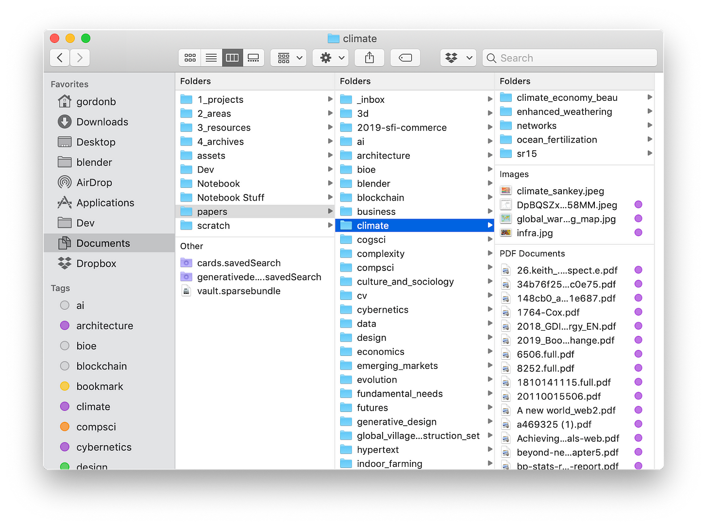
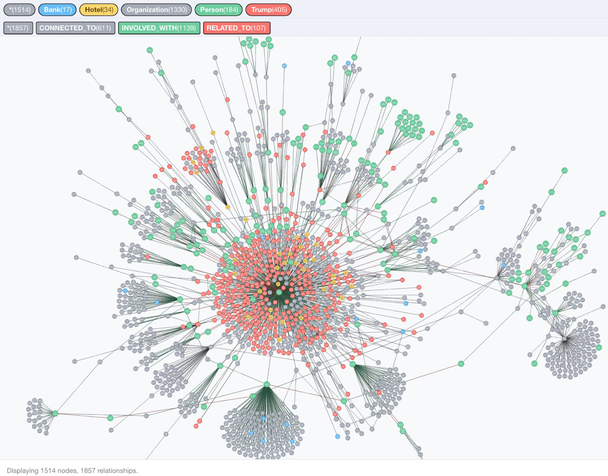

When Tim Berners Lee talks about how he designed the web, he uses an analogy from physics, describing his process as a quest to find “fundamental laws” which can generate a desired system:  

当蒂姆-伯纳斯-李谈到他是如何设计网络的时候，他用了一个物理学的比喻，把他的过程描述为寻找能够产生一个理想系统的 "基本规律"：

> One of the beautiful things about physics is its ongoing quest to find simple rules that describe the behavior of very small, simple objects.  
> 
> 物理学的一个美丽之处在于它不断追求找到描述非常小的、简单的物体的行为的简单规则。  
> 
> Once found, these rules can often be scaled up to describe the behavior of monumental systems in the real world. \[…\]  
> 
> 一旦发现，这些规则通常可以被放大，以描述现实世界中不朽的系统的行为。\[...\]
> 
> If the rules governing hypertext links between servers and browsers stayed simple, then our web of a few documents could grow to a global web.  
> 
> 如果管理服务器和浏览器之间的超文本链接的规则保持简单，那么我们由几个文件组成的网络可以发展成一个全球网络。  
> 
> The art was to define the few basic, common rules of “protocol” that would allow one computer to talk to another, in such a way that when all computers everywhere did it, the system would thrive, not break down.  
> 
> 艺术是定义少数基本的、共同的 "协议 "规则，使一台计算机能够与另一台计算机对话，当所有的计算机都这样做时，系统就会繁荣，而不是崩溃。
> 
> _Tim Berner’s Lee, 2000, “Weaving the Web”  
> 
> 蒂姆-伯纳的李，2000年，"编织网络"_

I like this description of design as a quest to discover a simple set of primitives, **[a small alphabet](https://subconscious.substack.com/p/provoking-emergence-with-alphabets)** for generating a system. To paraphrase [Gall’s Law](https://gordonbrander.com/pattern/galls-law/):  

我喜欢这种对设计的描述，它是对发现一套简单的基元的追求，是生成一个系统的小型字母表。套用盖尔法则的说法：

> Simple rules produce complex behavior. Complex rules produce stupid behavior.  
> 
> 简单的规则产生复杂的行为。复杂的规则产生愚蠢的行为。

What if we applied this lens to designing tools for thought? What are some examples of simple features with extremely broad ranges of motion? I’d like to put forward one candidate…  

如果我们把这个镜头应用于设计思想工具会怎样？有哪些简单功能的例子具有极其广泛的运动范围？我想提出一个候选人...

**Links**.

A surprising number of other features can be expressed in terms of links.  

其他一些令人惊讶的特征也可以用链接来表达。

[](https://substackcdn.com/image/fetch/f_auto,q_auto:good,fl_progressive:steep/https%3A%2F%2Fbucketeer-e05bbc84-baa3-437e-9518-adb32be77984.s3.amazonaws.com%2Fpublic%2Fimages%2F792147ea-0a28-48a0-855b-bc11f98e893e_1024x576.png)

What is a tag? What is its structure? What is its function?  

什么是标签？它的结构是什么？它的功能是什么？

When you tag something, it gets added to a collection of other things with the same tag. So, this is a one-to-many relationship, where one tag points to many pages.  

当你给某个东西打上标签时，它就会被添加到具有相同标签的其他东西的集合中。因此，这是一种一对多的关系，一个标签指向许多页面。

[](https://substackcdn.com/image/fetch/f_auto,q_auto:good,fl_progressive:steep/https%3A%2F%2Fbucketeer-e05bbc84-baa3-437e-9518-adb32be77984.s3.amazonaws.com%2Fpublic%2Fimages%2Feb93fee8-489e-4551-bc86-94c9ac638753_576x678.png)

Let’s think about a link. Many pages can point to a single page. Many-to-one. One-to-many. So, we could achieve tagging with links by listing all backlinks to a given page. **Tags are just backlinks to pages that don’t exist**.  

让我们来想想一个链接。许多页面可以指向一个单一的页面。多对一。一对多。因此，我们可以通过列出指向某个页面的所有反向链接来实现对链接的标记。 标签只是指向不存在的页面的反向链接。

[](https://substackcdn.com/image/fetch/f_auto,q_auto:good,fl_progressive:steep/https%3A%2F%2Fbucketeer-e05bbc84-baa3-437e-9518-adb32be77984.s3.amazonaws.com%2Fpublic%2Fimages%2F17fafc93-fcf0-47ef-a9dc-549e9eb80237_1600x1194.png)

Folders are a place to put things. Like most of the desktop paradigm, folders use a familiar object borrowed from the office as a metaphor to communicate an abstract relationship.  

文件夹是一个放东西的地方。就像大多数的桌面范式一样，文件夹使用一个从办公室借来的熟悉的物体作为隐喻来传达一种抽象的关系。  

You put multiple documents into a paper folder for filing, you put multiple documents into a digital folder for filing.  

你把多个文件放进一个纸质文件夹里归档，你把多个文件放进一个数字文件夹里归档。  

Object metaphors are powerful, both because they leverage something familiar to introduce something new, and because they lean into our natural cognitive strengths for spatial reasoning and object manipulation.  

物体隐喻是强大的，既因为它们利用熟悉的东西来介绍新的东西，又因为它们倚重于我们在空间推理和物体操作方面的自然认知优势。

Hmm, many documents, one folder. It seems that underneath this object metaphor is another one-to-many relationship. So, **a folder could be expressed in terms of a page full of links**.  

嗯，许多文件，一个文件夹。看来，在这个对象的隐喻之下，还有一个一对多的关系。因此，一个文件夹可以用一个充满链接的页面来表达。

> What information consumes is rather obvious: it consumes the attention of its recipients.  
> 
> Hence a wealth of information creates a poverty of attention, and a need to allocate that attention efficiently among the overabundance of information sources that might consume it.  
> 
> 信息所消耗的东西是相当明显的：它消耗了接收者的注意力。因此，丰富的信息造成了注意力的匮乏，并需要在可能消耗注意力的过多的信息源中有效地分配注意力。  
> 
> _Herbert Simon_

Social media, search, spam, recommendations — when faced with an abundance of information, we often find ourselves needing to separate wheat from the chaff.  

社交媒体、搜索、垃圾邮件、推荐--当面对大量的信息时，我们经常发现自己需要将麦子和谷壳分开。  

Many systems reach for stars, hearts, upvotes, and downvotes as quick fixes for user-generated quality signals. But what if we just used links?  

许多系统将星星、爱心、加分和减分作为用户产生的质量信号的快速解决方案。但如果我们只是使用链接呢？

[](https://en.wikipedia.org/wiki/PageRank)

**Inbound links can be used as a signal of quality**. People are more likely to link to things that matter, and less likely to link to things that don’t. Sum up the backlinks to a page and you have a quality signal. This is the key insight behind [Google Pagerank](https://en.wikipedia.org/wiki/PageRank).  

入站链接可以作为质量的一个信号。人们更有可能链接到重要的东西，而不太可能链接到不重要的东西。将一个页面的反向链接加起来，你就有了一个质量信号。这是Google Pagerank背后的关键洞察力。

Comments are one of the core interaction primitives of today’s web. I can comment on your Facebook post, your Google Doc, your blog.  

评论是当今网络的核心互动原素之一。我可以对你的Facebook帖子、你的谷歌文档、你的博客进行评论。

What is a comment? What is its structure? What is its function? It’s a bit of content that is conceptually related to a parent post. We could say that the comment _points to_ the post, or something in the post. That’s a directional relationship.  

什么是评论？它的结构是什么？它的功能是什么？它是与母体文章在概念上相关的一点内容。我们可以说，评论指向帖子，或帖子中的某些内容。这是一种方向性的关系。

Links also _point to_ something. They describe a directional relationship. It’s not much of a leap to consider an inbound link a comment on the thing it links to. **If we implement some form of [transclusion](https://en.wikipedia.org/wiki/Transclusion), we can express comments in terms of links**. In fact, WordPress already does this with [Pingbacks](https://wordpress.org/support/article/trackbacks-and-pingbacks/).  

链接也指向某些东西。它们描述了一种方向性的关系。把入站链接看作是对它所链接的事物的评论，这并不是一个很大的飞跃。 如果我们实现了某种形式的转换，我们可以用链接来表达评论。事实上，WordPress已经用Pingbacks做了这个。

[Outliners](http://outliners.scripting.com/) are tools for thought that conceive of documents as a hierarchy, or tree, or nested bulleted list.  

They’re one of those simple ideas, like spreadsheets that have an almost inexhaustible range of applications.  

纲要是一种思想工具，它将文件设想为一种层次结构，或树状结构，或嵌套的项目列表。它们是那些简单的想法之一，就像电子表格一样，有着几乎取之不尽的应用范围。

Outliners have a rich and interesting history, from [Dave Winer’s outliner programs for command line and Mac Classic](http://outliners.scripting.com/), through to today’s [Roam Research](https://roamresearch.com/).  

纲要软件有着丰富而有趣的历史，从Dave Winer的命令行和Mac Classic的纲要程序，到今天的Roam Research。

So, but what is an outliner? What is its structure? What is its function?  

那么，但什么是纲要？它的结构是什么？它的功能是什么？  

An outliner lets you break a document up into discrete nodes, nest those nodes under other nodes, hide branches, focus in on branches.  

纲要器可以让你把一个文件分解成不连续的节点，把这些节点嵌套在其他节点下，隐藏分支，聚焦在分支上。  

The structure formed by an outliner is a tree, with parent and child nodes.  

轮廓线形成的结构是一棵树，有父节点和子节点。

In an outliner, one parent may have many children. One-to-many. Links again. **We can express an outliner in terms of links by nesting inbound links underneath the document they point to**. So an outliner could be thought of as one view over a network of linked documents.  

在一个纲要性文件中，一个父本可能有许多子本。一对多。又是链接。 我们可以通过将入站链接嵌套在它们所指向的文档下面来表达一个纲要性文件。 因此，一个纲要性文件可以被认为是链接文档网络的一个视图。

[Semantic triples](https://en.wikipedia.org/wiki/Semantic_triple) are one of those ideas you run into if you poke around the “tools for thought” space long enough. A semantic triple is a simple idea with some powerful properties.  

The basic idea is to construct a network made up of:  

如果你在 "思想工具 "的空间里打探的时间足够长，那么语义三要素就是你遇到的那些想法之一。语义三联体是一个简单的想法，具有一些强大的属性。其基本思路是构建一个由以下内容组成的网络：

```
Subject - Predicate - Object
```

For example, “Xerxes is the parent of Brook” can be expressed as a triple:  

例如，"Xerxes是Brook的父母 "可以表达为一个三联体：

```
Xerxes - Parent - Brook
```

Objects can themselves be subject-predicate-object triples, so you can build up complex networks of relationships this way.  

对象本身可以是主语-预言-宾语三要素，所以你可以通过这种方式建立复杂的关系网络。

[](https://neo4j.com/blog/buzzfeed-trumpworld-dataset-neo4j/)

Triples allow computers to do complex automated reasoning. You can even use them to derive relationships that aren’t explicitly stated. You know those answer cards that appear in Google searches?  

Those are largely constructed from Google Knowledge Graph, [a giant network of semantic triples](https://inlinks.net/p/knowledge-graph-explained/).  

三元组使计算机能够进行复杂的自动推理。你甚至可以用它们来推导出没有明确说明的关系。你知道谷歌搜索中出现的那些答案卡吗？那些主要是由谷歌知识图谱（Google Knowledge Graph）构建的，这是一个巨大的语义三元组网络。

Triples are often expressed in terms of special formal languages like [TURTLE](https://en.wikipedia.org/wiki/Turtle_(syntax)) or [Datalog](https://en.wikipedia.org/wiki/Datalog). Here’s how I might jot down that Xerces is a parent of Brooke and Brooke is a parent of Damocles using Datalog:  

三元组通常用特殊的形式语言来表达，如TURTLE或Datalog。下面是我如何用Datalog记下Xerces是Brooke的父，Brooke是Damocles的父：

```
parent(xerces, brooke).
parent(brooke, damocles).
```

This can get old fast. Writing formal relationships by hand is ok for narrow domains, but it’s not exactly the most natural thing to reach for when trying to express ideas.  

这可能会很快变老。用手写正式关系对于狭窄的领域来说是可以的，但当试图表达想法时，它并不完全是最自然的东西。

So, knowledge graphs are tremendously useful for computers, but not so fun to write by hand. If you ask me, [Semantic Web](https://en.wikipedia.org/wiki/Semantic_Web) efforts have repeatedly stubbed their toe on this mismatch between symbolic alignment and the messy, emergent, imprecise, _human_ process of knowledge construction.  

因此，知识图谱对于计算机来说是非常有用的，但是用手写就不那么有趣了。如果你问我的话，语义网的努力已经多次在符号对齐与混乱的、突发的、不精确的、人类的知识构建过程之间的这种不匹配上栽了跟头。

But wait. What is a triple? What is its structure? What is its function?  

但是，等等。什么是三倍体？它的结构是什么？它的功能是什么？

[](https://substackcdn.com/image/fetch/f_auto,q_auto:good,fl_progressive:steep/https%3A%2F%2Fbucketeer-e05bbc84-baa3-437e-9518-adb32be77984.s3.amazonaws.com%2Fpublic%2Fimages%2F3e14b5a6-55ef-477f-9506-575c13bff6a4_804x229.png)

It seems a triple is a **link** between two things, _through_ a predicate. Here is yet another thing we can reimagine through the mechanism of links.  

似乎一个三联体是两个事物之间的联系，通过一个谓词。这里是我们可以通过链接的机制重新想象的另一件事。

**A hyperlink is a triple where the subject is the page, the predicate is the link text, and the object is the thing being linked to**.  

超链接是一个三元组，主语是页面，谓语是链接文本，宾语是被链接的事物。

Better yet, it’s organic. This knowledge graph is constructed from things I would do anyway. I create a link because it solves my problem as an author of pointing you, the reader, to a concept.  

This good-enough alignment between user goals and computer goals is one reason the regular web succeeded where the [semantic web](https://en.wikipedia.org/wiki/Semantic_Web) failed.  

更好的是，它是有机的。这个知识图谱是由我无论如何都会做的事情构成的。我创建一个链接，是因为它解决了我作为作者的问题，即把你（读者）指向一个概念。用户目标和计算机目标之间的这种充分的一致性，是普通网络在语义网络失败的地方取得成功的一个原因。

[Topic modeling](https://en.wikipedia.org/wiki/Topic_model) is a range of machine learning techniques for deriving abstract topics from a collection of documents using statistical analysis.  

I put in a collection of Subconscious newsletters, and topic modeling tells me they’re about tools for thought, cybernetics, the web, computing, distributed systems, etc. Pretty cool.  

主题建模是一系列机器学习技术，利用统计分析从文件集合中推导出抽象的主题。我把潜意识新闻通讯的集合放进去，主题建模告诉我它们是关于思想工具、控制论、网络、计算、分布式系统等。相当酷。

So, ok, you might still want topic analysis, but following on from our observation that we can use links as knowledge graphs, we can also use links as quick-and-dirty topic models.  

所以，好吧，你可能仍然需要主题分析，但在我们观察到我们可以把链接作为知识图谱之后，我们也可以把链接作为快速和简单的主题模型。

**If we consider each page to be a topic, then then links offer a pretty good map of topics within a page**. Pull out a list of links from a page, and you approximately have the topics for the page.  

Collect all the links across pages, rank them by frequency, and you have a sense of the most frequently addressed topics within the collection.  

如果我们把每个页面看作是一个主题，那么链接就提供了一个相当好的页面内的主题图。从一个页面上拉出一个链接列表，你就可以得到这个页面的主题。收集所有页面上的链接，按频率排列，你就能了解到该集合中最经常涉及的主题。

> It is my belief that this new ability to represent ideas in the fullness of their interconnections will lead to easier and better writing, easier and better learning, and a far greater ability to share and communicate the interconnections among tomorrows ideas and problems. Hypertext can represent all the interconnections an author can think of, and compound hypertext can represent all the interconnections _many_ authors can think of, as we shall see.  
> 
> 我相信，这种在完整的相互联系中表现思想的新能力将导致更容易和更好的写作，更容易和更好的学习，以及更大的分享和交流未来的思想和问题之间的相互联系的能力。超文本可以代表一个作者所能想到的所有相互联系，而复合超文本可以代表许多作者所能想到的所有相互联系，我们将看到这一点。  
> 
> _Ted Nelson, 1982, “Literary Machines”  
> 
> 泰德-纳尔逊，1982年，"文学机器"_

Links aren’t the only way—I don’t want to be totalizing here—but they are something special. It’s rare to discover a simple mechanism with such broad and expressive range of motion.  

链接并不是唯一的方式，我不想在这里全盘托出，但它们是很特别的。发现一个简单的机制具有如此广泛和富有表现力的运动范围是非常罕见的。

I hope to keep **[Subconscious](https://subconscious.substack.com/p/subconscious-alpha)** simple. Few features, **[a small alphabet with wide expressive range of motion](https://subconscious.substack.com/p/provoking-emergence-with-alphabets)**. Before reaching for features, my goal is to explore, to the fullest extent, the creative potential of plain old links.  

我希望让潜意识保持简单。很少的功能，一个小的字母表，具有广泛的运动表现力。在追求功能之前，我的目标是最充分地探索普通链接的创造潜力。

### Subscribe to  

订阅《潜意识》杂志**Subconscious**

By Gordon Brander  ·  Over 4,000 subscribers  

作者：Gordon Brander - 超过4,000名订阅者  ·  Over 4,000 subscribers

The web began as a tool for thought  

网络开始是一种思想的工具
